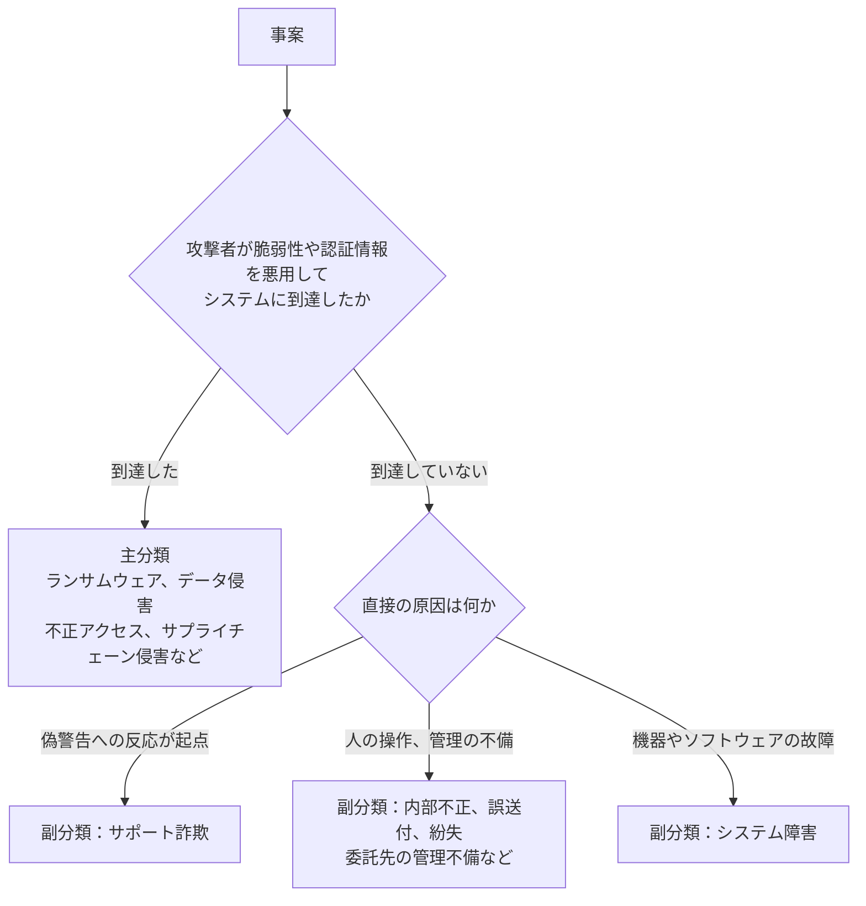
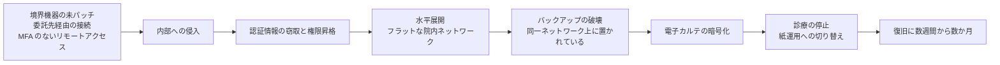

# 🚨 インシデント事例集

医療機関と医療関連事業者に起きたインシデントの事例を、国内外に分けて年ごとに整理する。

サイバー攻撃（ランサムウェア、データ侵害、不正アクセスなど）を主として扱い、それ以外の事案（サポート詐欺、システム障害、内部不正、記憶媒体の紛失や盗難など）も副として収集する。
攻撃を伴わない事案も、診療の停止と患者情報の漏えいという同じ結果に至る。
両方を並べて初めて、自組織の対策を被害の起こりやすさで並べ替えられる。

> [!NOTE]
> **表記ルール**：本ページでは、**事実**（一次情報で確認できる内容。出典を併記する）、**報道ベース**（報道のみで確認でき、当事者の公表資料では裏付けが取れていない内容）、**分析**（筆者の解釈）を書き分ける。
> 出典は、当事者の公表資料、行政文書、CVE、ベンダアドバイザリなどの一次情報を優先して示す。

## 一覧

| 地域 | 入口 |
|---|---|
| 🇯🇵 国内 | [国内の事例](japan/README.md) |
| 🌍 海外 | [海外の事例](global/README.md) |

各地域の配下に、年ごとの**履歴**（`YYYY-timeline.md`）と**サマリー**（`YYYY-summary.md`）を置く。

| ページ | 内容 |
|---|---|
| 履歴（timeline） | その年の事例を時系列に並べる。一覧表と、事例ごとの経緯、教訓、一次情報 |
| サマリー（summary） | その年の要点、統計、規制の動き、前年との差分 |

2019 年以前は収録件数が少ないため、`2019-earlier.md` に集約している。

## 事案の類型

本事例集は、**主分類**（サイバー攻撃）を中心に置き、**副分類**（サイバー攻撃以外の事案）を補助的に収集する。
両者は、記述の深さと追跡する項目が異なる。

### 主分類：サイバー攻撃

| 類型 | 対象とする事案 |
|---|---|
| **ランサムウェア** | 暗号化、二重恐喝により、診療または業務が停止した事案 |
| **データ侵害** | 外部からの攻撃で、診療情報や個人情報が窃取、公開された事案 |
| **不正アクセス** | 認証情報の悪用や脆弱性の悪用によるシステムへの侵入。ウェブサイトの改ざんを含む |
| **サプライチェーン侵害** | 委託先、ベンダ、接続先を経由して侵入された事案 |
| **フィッシング、BEC** | メールを起点とする認証情報の窃取、送金の詐取 |
| **サービス妨害** | DDoS など、可用性を直接狙う攻撃 |

### 副分類：サイバー攻撃以外の事案

| 類型 | 対象とする事案 |
|---|---|
| **サポート詐欺** | 偽の警告画面を起点に、遠隔操作ツールの導入や金銭の支払いへ誘導された事案 |
| **システム障害** | 機器の故障、ソフトウェアの不具合、電源や通信の障害により、診療系システムが停止した事案 |
| **内部不正** | 職員、元職員による情報の持ち出し、目的外の閲覧 |
| **機器、記憶媒体の紛失、盗難** | ノート PC、USB メモリ、紙カルテなどの物理的な紛失、盗難 |
| **委託先の管理不備による漏えい** | 攻撃を伴わず、委託先の取り扱いの不備によって情報が漏えいした事案 |
| **誤送付、誤公開、操作ミス** | FAX の誤送信、メールの宛先誤り、ファイルの誤公開、機器廃棄時の消去不徹底、SNS の不適切な利用 |
| **ドメインの失効、ドロップキャッチ** | 更新されずに失効したドメインが第三者に再登録され、旧サイトの信用が悪用された事案 |

副分類の類型は、[MICIN「医療分野セキュリティニュース」の分類](https://note.micin.jp/n/nc333c9f50dd5)を参考に、本リポジトリの区分に合わせて整理した。

### 主分類と副分類の判定

境界が曖昧な事案があるため、次の順で判定する。

1. 外部の攻撃者が、脆弱性の悪用または認証情報の悪用によってシステムに到達したか。到達していれば**主分類**とする
2. 到達していない場合、利用者の操作を起点に、遠隔操作や金銭の支払いへ誘導されたか。該当すれば**副分類のサポート詐欺**とする
3. いずれでもない場合、直接の原因（故障、人の操作、管理の不備）に対応する**副分類**の類型を選ぶ

サポート詐欺は、遠隔操作ツールの導入という技術的な到達を伴う。
それでも副分類に置くのは、起点が偽警告への反応であり、有効な対策が利用者への周知と端末の管理に寄るためである。
委託先が起点の事案は、攻撃を伴えば主分類のサプライチェーン侵害、取り扱いの不備であれば副分類とする。

### 記述の深さ

| 項目 | 主分類 | 副分類 |
|---|---|---|
| 収録先 | [区分](#対象の区分)ごとの節（病院系、製薬企業系、医療関連事業者） | 「その他の事案」の節 |
| 識別子 | `JP-<年>-<連番>` ／ `GL-<年>-<連番>` | `JP-<年>-S<連番>` ／ `GL-<年>-S<連番>` |
| 記述 | 一覧表と、経緯、教訓、一次情報を含む本文 | 一覧表を基本とする。他組織に転用できる教訓がある場合のみ本文を書く |
| 追跡項目 | 侵入経路、侵害範囲、診療への影響、公表された再発防止策 | 発生原因、影響範囲、公表された再発防止策 |

副分類の記述を軽くするのは、公表される情報量の差を反映するためである。
攻撃を伴わない事案は、当事者の公表が数行の告知に留まることが多く、主分類と同じ項目を並べても大半が「未公表」になる。

## このセクションの方針

被害の一覧で終わらせないため、主分類の各事例について次の項目を可能な限り追跡する。

| 追跡項目 | 意図 |
|---|---|
| **侵入経路（Initial Access）** | 同じ経路が自組織に存在しないかを確認できるようにする |
| **侵害範囲** | 電子カルテ、部門システム、バックアップのどこまで到達したか |
| **診療への影響** | 停止期間、救急受入停止、転院、手術延期などの臨床影響 |
| **公表された再発防止策** | 当事者自身が実施した対策（最も実務的な参考情報） |
| **一次情報** | 調査報告書、公表資料へのリンク |

副分類の事案では、発生原因、影響した情報の範囲、公表された再発防止策の三つを追う。

> [!IMPORTANT]
> **事実と推測を分ける。**
> 当事者の公表資料や調査報告書で確認できる内容は「事実」、報道のみで確認できる内容は「報道ベース」、筆者の解釈は「分析」と明記する。
> 攻撃グループの帰属は、当事者または公的機関が認めていない限り「未確認」として扱う。

## 対象の区分

各ページの表と説明は、読み手の立場に合わせて次の三つに分けている。

| 区分 | 対象 |
|---|---|
| **病院系** | 病院、診療所、クリニック、国家保健サービスなど、患者に医療を提供する組織 |
| **製薬企業系** | 製薬企業、原薬製造、受託製造機関、治験に関わる組織 |
| **医療関連事業者** | 医療保険、医療決済、検査（ラボ）、電子カルテベンダ、保守事業者など、医療を支える事業者 |

区分は被害を受けた当事者で決める。
委託先が侵入経路になった事案は、被害の当事者である側に記録し、経路として本文に書く。

## 一次情報の強度

事例ごとに、根拠の強さを三段階で示す。
記述の深さもこれに応じて変える。

| 表示 | 意味 | 記述の深さ |
|---|---|---|
| **報告書** | 第三者調査委員会、有識者会議、国家監査機関などの調査報告書が公表されている | 経緯まで詳述する |
| **当事者公表** | 当事者または公的機関の公表資料で確認できる | 公表内容の範囲で要約する |
| **報道のみ** | 報道機関の報道でのみ確認でき、当事者の公表資料では裏付けが取れていない | 一覧表と短い記述に留める |

## 事例から繰り返し確認される侵入経路

国内外の公表済み調査報告書に共通して現れる初期侵入経路である（詳細は各年のページを参照）。

| 経路 | 概要 | 対応する項目 |
|---|---|---|
| **VPN 機器の脆弱性、認証情報** | 境界の VPN 装置が未パッチ、または漏えい認証情報で侵入される | [防御プレイブック](../actors/defense-playbook.md) |
| **取引先、委託事業者経由** | 給食、検査、保守などの委託事業者との接続を踏み台にされる | [防御プレイブック](../actors/defense-playbook.md) |
| **リモートアクセスの MFA 未適用** | 多要素認証のないリモートアクセス口が残存している | [防御プレイブック](../actors/defense-playbook.md) |
| **保守用の常時接続** | ベンダの保守回線、保守アカウントが監視外に置かれている | [医療機器のセキュリティ](../../technology/medical-devices/) |
| **フラットな院内ネットワーク** | 侵入後に電子カルテ、医療機器まで水平展開できてしまう | [防御プレイブック](../actors/defense-playbook.md) |

## 侵入から診療停止までの因果

公表された調査報告書に共通して現れる連鎖である。
最後の一段（診療の停止）だけが表に出るが、その手前には必ず複数の段階がある。

**分析**：この連鎖のうち、医療機関が自力で断てる箇所は複数ある。
境界機器の更新、委託先接続の限定、ネットワークの分離、バックアップの隔離のいずれか一つでも成立していれば、連鎖はその位置で止まる。
対策の詳細は[防御プレイブック](../actors/defense-playbook.md)にまとめる。

## 新規追加のしかた

### 主分類（サイバー攻撃）の事例

1. [`docs/reference/_templates/incident.md`](../../reference/_templates/incident.md) をコピーする
2. 該当する地域と年の履歴ファイル（`japan/2026-timeline.md` など）を開き、[区分](#対象の区分)の節に追記する
3. 識別子を `JP-<年>-<連番>` または `GL-<年>-<連番>` の形で付け、見出しの直前に `<a id="...">` を置く
4. 冒頭の収録件数（サイバー攻撃の列）と、その年のサマリーの集計を更新する
5. 地域の README.md の年別ページ表の件数を更新する
6. [`skills/repo-review/SKILL.md`](../../../skills/repo-review/SKILL.md) の手順でレビューする

### 副分類（サイバー攻撃以外）の事案

1. [`docs/reference/_templates/incident-other.md`](../../reference/_templates/incident-other.md) をコピーする
2. 同じ履歴ファイルの「その他の事案」の節の一覧表に追記する
3. 識別子を `JP-<年>-S<連番>` または `GL-<年>-S<連番>` の形で付け、その年の発生月順に並べる
4. 冒頭の収録件数（その他の事案の列）と、地域の README.md の件数を更新する
5. その年のサマリーの「収録事例の集計」に、類型別の件数を併記する
6. 他組織に転用できる教訓がある場合のみ、一覧表の下に本文を書き、見出しの直前に `<a id="...">` を置く
7. [`skills/repo-review/SKILL.md`](../../../skills/repo-review/SKILL.md) の手順でレビューする

副分類でも、[一次情報の強度](#一次情報の強度)と、事実、報道ベース、分析の書き分けは、主分類と同じ基準を適用する。

進行中の年に速報を書くときは、[月報](../../../monthly-reports/) に記録し、一次情報が確定してから履歴へ繰り上げる。

---

[← 脅威](../README.md) | [トップへ](../../../README.md)
