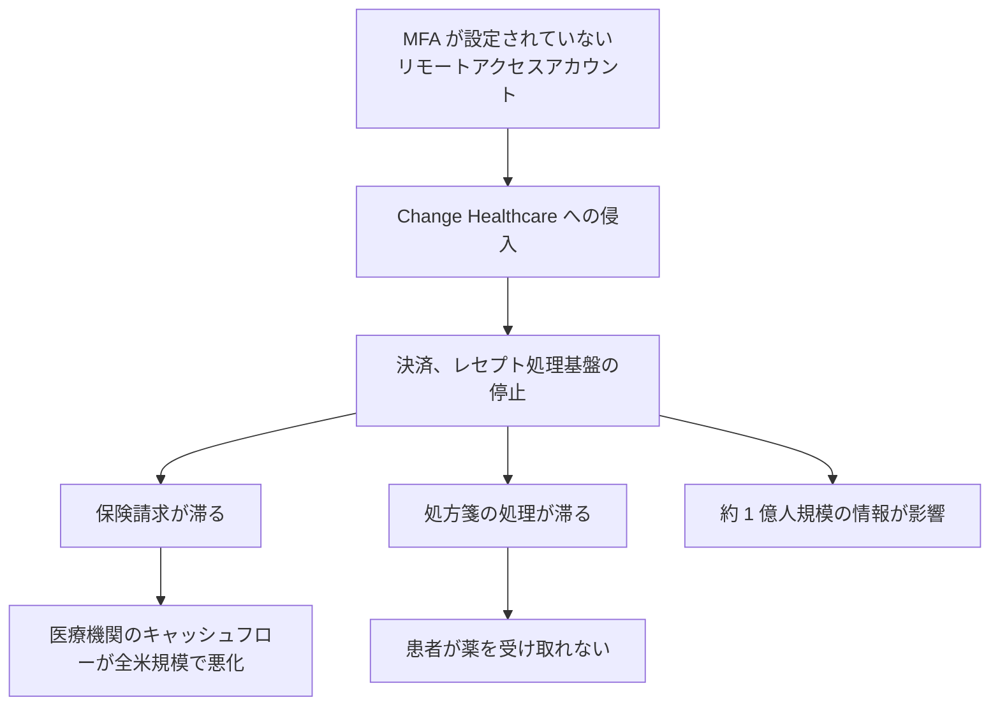

# 🌍 海外の医療機関に対するサイバー攻撃事例

> [!NOTE]
> **表記ルール**：事実（当事者や公的機関の公表資料で確認できる内容）、報道ベース（報道のみで確認できる内容）、分析（筆者の解釈）を分けて記載する。

## 事例一覧

| 時期 | 組織、国 | 攻撃 | 特筆すべき点 |
|---|---|---|---|
| 2015-02 | Anthem（米） | データ侵害 | 約 7,880 万人分の個人情報。米医療業界最大級の侵害 |
| 2017-05 | NHS（英） | WannaCry | 英国の医療提供に全国規模の混乱。国家監査院が被害を報告 |
| 2020-09 | Universal Health Services（米） | Ryuk | 全米 400 施設規模でシステム停止 |
| 2020-09 | デュッセルドルフ大学病院（独） | DoppelPaymer | 救急搬送の受入不能。死亡事案との関連が議論に |
| 2020-10 | Vastaamo（フィンランド） | データ侵害＋患者恐喝 | 患者個人が直接恐喝された前例のない事件 |
| 2021-05 | HSE（アイルランド） | Conti | 国家保健サービス全体が停止。詳細な事後レビューを公開 |
| 2022-10 | CommonSpirit Health（米） | ランサムウェア | 全米規模の医療グループで診療影響 |
| 2022-10 | Medibank（豪） | データ侵害＋恐喝 | 約 970 万人の医療保険情報が段階的に公開された |
| 2023-08 | Prospect Medical Holdings（米） | Rhysida | 複数州の病院で救急受入停止 |
| 2024-02 | Change Healthcare（米） | ALPHV/BlackCat | 全米の医療決済インフラが停止。米国史上最大級の医療情報侵害 |
| 2024-05 | Ascension（米） | Black Basta | 全米 140 病院規模で電子カルテ停止 |
| 2024-06 | Synnovis（英） | Qilin | ロンドンの病院で輸血、検査に重大な影響 |

---

## WannaCry と NHS（2017 年 5 月、英国）

**事実**

- 2017 年 5 月 12 日に始まった WannaCry の世界的感染により、英国 NHS の広範囲でシステムが利用不能となった。
- 英国国家監査院（National Audit Office）が 2017 年に調査報告書を公表した。NHS トラストの相当数が影響を受け、数千件から万件規模の予約と手術がキャンセルされたことが記録されている。
- WannaCry は MS17-010（EternalBlue）を利用した SMB ワームであり、パッチは感染の約 2 か月前に公開されていた。NHS 側では、サポート終了 OS の残存とパッチ適用の遅れが指摘された。
- NHS は身代金を支払っていない。

**教訓（分析）**

- 医療は標的型攻撃の被害者である前に、無差別のワームの被害者になりうる。医療を狙っていない攻撃でも、レガシー資産が多い環境には被害が集中する。
- サポート終了 OS の棚卸しと、パッチ適用不可能な資産のネットワーク分離が最優先の対策となる。

**一次情報**：[National Audit Office「Investigation: WannaCry cyber attack and the NHS」](https://www.nao.org.uk/reports/investigation-wannacry-cyber-attack-and-the-nhs/)、[NHS England のサイバーセキュリティ情報](https://digital.nhs.uk/)

---

## デュッセルドルフ大学病院（2020 年 9 月、ドイツ）

**事実**

- 2020 年 9 月、ランサムウェア（**DoppelPaymer**）により病院システムが暗号化され、救急搬送の受け入れが不能になった。
- 搬送先が変更された患者が死亡した事案について、ドイツ当局が捜査を実施した。
- 侵入経路として、Citrix 製品の既知の脆弱性（CVE-2019-19781）の悪用が指摘された。

**未確認 / 議論**

- 当初は「ランサムウェアによる初の死者」と広く報道されたが、その後の当局の検証では、攻撃と死亡の直接的な因果関係は立証されなかったと報じられている。この事例で因果関係を断定するわけにはいかない。

**教訓（分析）**

- 医療におけるランサムウェアの被害は、データ侵害としてではなく、診療の遅延と転送による臨床アウトカムの悪化として現れる。リスク評価の主要な指標は、情報漏えいの規模ではなく診療の停止時間になる。

**一次情報**：[Universitätsklinikum Düsseldorf 公式サイト](https://www.uniklinik-duesseldorf.de/)、[BSI（ドイツ連邦情報セキュリティ庁）](https://www.bsi.bund.de/)

---

## Vastaamo（2020 年、フィンランド）

**事実**

- 民間の心理療法サービス Vastaamo の患者記録が窃取され、患者本人に対して、記録を公開すると脅す恐喝メールが直接送られた。数万人規模の患者が対象となった。
- 攻撃者は要求に応じなかった患者のセラピー記録を実際に公開した。
- Vastaamo は事業を継続できず破産に至った。
- 加害者は特定、訴追され、2024 年に有罪判決を受けた。

**教訓（分析）**

- 医療情報の恐喝は、組織ではなく患者個人を標的にする形態に発展しうる。組織が身代金を払うかどうかというモデルでは、この被害構造を説明できない。

**一次情報**：[フィンランド警察（Poliisi）の発表](https://poliisi.fi/en/)、[フィンランドデータ保護監督機関](https://tietosuoja.fi/en/)
- メンタルヘルス、依存症、感染症、性感染症、生殖医療などの記録は、漏えい時の患者被害が特に深刻になる。これらを扱うシステムには、より強い保護要件を設定すべきである。
- 患者への通知、支援体制（相談窓口、法的支援）を、インシデント対応計画に含める必要がある。

---

## HSE（2021 年 5 月、アイルランド）

**事実**

- アイルランドの国家保健サービス Health Service Executive（HSE）が **Conti** ランサムウェアの攻撃を受け、全国規模で IT システムが停止した。
- 初期侵入はフィッシングメールの添付ファイル（悪意ある Excel）で、その後、数か月にわたり内部で活動が継続した後に暗号化が実行された。
- HSE は身代金を支払わなかった。
- HSE は、外部機関による事後レビュー（Post Incident Review）を 2021 年 12 月に公表した。ガバナンス、体制、技術対策の不足が整理されており、医療機関のインシデント対応を学ぶうえで参照価値が高い。

**教訓（分析）**

- 暗号化は攻撃の最終段階であり、その前に数週間から数か月の潜伏期間がある。検知の機会が複数回あったという指摘が、HSE レビューの中心にある。
- CISO 機能の不在、資産管理の不備、ログの欠如といった「基礎体力」の問題が、被害規模を決定づけた。

**一次情報**：[HSE「Conti Cyber Attack on the HSE, Independent Post Incident Review」](https://www.hse.ie/eng/services/publications/conti-cyber-attack-on-the-hse-full-report.pdf)

---

## Change Healthcare（2024 年 2 月、米国）

**事実**

- UnitedHealth Group 傘下の Change Healthcare が **ALPHV/BlackCat** の攻撃を受け、米国の医療決済、レセプト処理のインフラが広範囲に停止した。
- 保険請求と処方箋の処理が滞り、医療機関のキャッシュフローが全米規模で悪化するという、従来にない形の被害が生じた。
- UnitedHealth Group の CEO は米議会証言で、多要素認証が設定されていないリモートアクセスアカウントの認証情報が初期侵入に使われたことを認めている。
- 身代金の支払いが行われたことが公表されている（報道および議会証言で言及）。
- 影響を受けた個人の数は 1 億人規模とされ、米国医療史上最大級の情報侵害となった。

**教訓（分析）**

- 医療の攻撃対象は病院だけではない。決済、レセプト、検査、薬局、データ連携基盤といった医療の中間層が、機能が集中しているために単一障害点になる。
- ベンダリスク管理において、「その事業者が止まったら、自院の何が止まるか」を事前に洗い出しておく必要がある。
- 基本中の基本（すべてのリモートアクセスへの MFA 適用）の欠落が、国家規模の被害を生んだ点は繰り返し強調される価値がある。

**一次情報**：[UnitedHealth Group の公表](https://www.unitedhealthgroup.com/)、[米下院エネルギー商業委員会の公聴会記録](https://energycommerce.house.gov/)、[HHS OCR の関連情報](https://www.hhs.gov/hipaa/for-professionals/security/index.html)

---

## Ascension（2024 年 5 月、米国）

**事実**

- 全米で 140 前後の病院を運営する Ascension が **Black Basta** の攻撃を受け、電子カルテ（Epic）を含むシステムが停止した。
- 数週間にわたり紙運用が続き、一部施設では救急搬送の受け入れを転送に切り替えた。
- Ascension は、従業員が業務ファイルと誤って悪意あるファイルをダウンロードしたことが起点であったと公表している。

**教訓（分析）**

- 大規模医療グループでは、1 施設の侵害がグループ全体の共通基盤に波及する。統合の利便性とブラスト半径はトレードオフの関係にある。
- 数週間の紙運用に耐えられるダウンタイム手順の整備と訓練が、実質的な最後の防衛線になる。

**一次情報**：[Ascension のサイバーセキュリティイベントに関する公表](https://about.ascension.org/)

---

## Synnovis（2024 年 6 月、英国）

**事実**

- ロンドンの複数の NHS トラストに検査サービスを提供する **Synnovis**（病理検査の合弁事業体）が **Qilin** の攻撃を受けた。
- 輸血用血液の照合を含む検査業務が停止し、手術の延期と外来のキャンセルが多数発生した。O 型血液の供給を求める異例の呼びかけが行われた。
- NHS は影響の詳細を段階的に公表しており、患者への臨床的影響についても後日報告が行われている。

**教訓（分析）**

- 検査（ラボ）は、医療のあらゆる意思決定の入口にある。ここが止まると、医療機関そのものが健全でも診療が回らない。
- 重要な委託先の定義には、IT ベンダだけでなく臨床サービスの委託先を含める必要がある。

**一次情報**：[Synnovis の公表](https://www.synnovis.co.uk/)、[NHS England のサイバーインシデント情報](https://www.england.nhs.uk/)

---

## その他の重要事例

| 事例 | 学べること |
|---|---|
| **Anthem（2015、米）** | 約 7,880 万人の医療保険加入者情報が窃取された。医療分野における大規模データ侵害の原型（[HHS OCR Breach Portal](https://ocrportal.hhs.gov/ocr/breach/breach_report.jsf) で報告を確認できる） |
| **Universal Health Services（2020、米）** | Ryuk により全米規模の病院グループが同時停止。統合基盤のブラスト半径を示した事例 |
| **Medibank（2022、豪）** | 身代金支払いを拒否した結果、攻撃者が診療内容（中絶、依存症治療等）を含むデータを段階的に公開した |
| **CommonSpirit Health（2022、米）** | 大規模医療グループの停止。小児患者への投薬量誤りが報じられ、臨床安全への影響が議論された（**報道ベース**） |
| **Prospect Medical Holdings（2023、米）** | Rhysida により複数州で救急受入停止。地域医療への波及を示した |

---

## 参考情報源

- [HHS Office for Civil Rights - Breach Portal（米国の医療情報侵害の公式報告一覧）](https://ocrportal.hhs.gov/ocr/breach/breach_report.jsf)
- [HHS Health Sector Cybersecurity Coordination Center (HC3)](https://www.hhs.gov/about/agencies/asa/ocio/hc3/index.html)
- [CISA Advisories](https://www.cisa.gov/news-events/cybersecurity-advisories)
- [Health-ISAC](https://health-isac.org/)
- [ENISA Health Threat Landscape](https://www.enisa.europa.eu/)

---

[← 国内の事例](japan.md) | [インシデント事例集](README.md) | [トップへ](../../../README.md)
