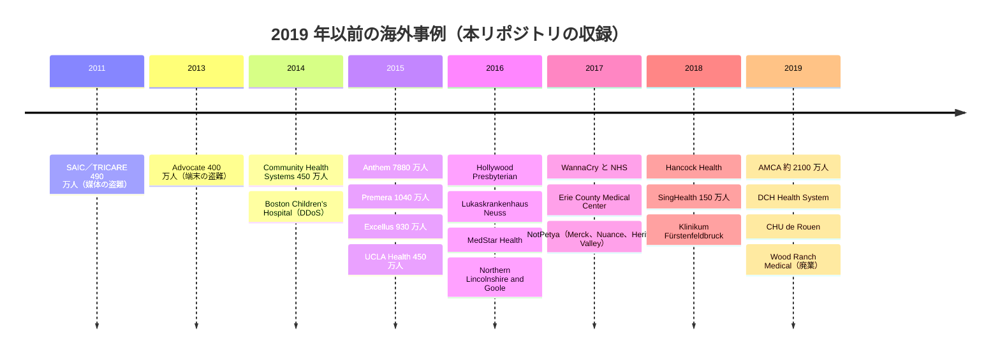
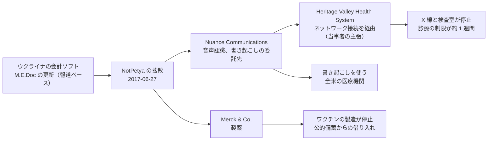
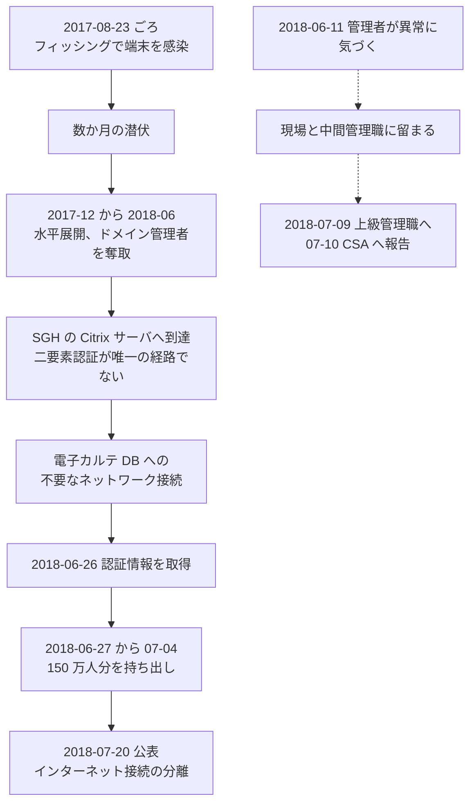

# 🌍 海外の事例 2019 年以前（履歴）

2019 年以前に発生した海外の事例をまとめて記録する。
年ごとの収録件数に偏りが大きく、年単位に分けても情勢を比べられないため、一つのページに集約している。
年次サマリーは作成していない。

> [!NOTE]
> **表記ルール**：本ページでは、**事実**（一次情報で確認できる内容。出典を併記する）、**報道ベース**（報道や第三者の集計のみで確認でき、当事者の公表資料では裏付けが取れていない内容）、**分析**（筆者の解釈）を書き分ける。
> [対象の区分](../README.md#対象の区分)と[一次情報の強度](../README.md#一次情報の強度)の定義は、インシデント事例集のトップにまとめている。

## 収録件数

| 区分 | サイバー攻撃 | その他の事案 |
|---|---|---|
| 病院系 | 24 | 1 |
| 製薬企業系 | 2 | 1 |
| 医療関連事業者 | 7 | 2 |

収録は本リポジトリが一次情報を確認できた事案に限る。
2019 年以前に公表された医療関連の事案がこれで尽きることを示すものではない。
米国の件数は、保健福祉省公民権局（HHS OCR）の侵害報告ポータルと、同局の和解合意書を典拠とする。
2019 年以前の同ポータルの全件集計は本リポジトリでは作成していない（2020 年以降は[制度軸のページ](README.md#年別ページ)にある）。

## この期間の輪郭

図は各年の主な事例を挙げたものである。
2011 年と 2013 年は、記憶媒体と端末の盗難で、[サイバー攻撃以外の事案](../README.md#事案の類型)にあたる。
図に現れない年は、本リポジトリに収録した事例がない年である。
被害がなかったことを示すものではない。

**分析**：この 9 年間で、被害の中心が二度移っている。

第一の移動は、**情報の窃取から診療の停止へ**である。
2014 年から 2015 年にかけて公表された大規模事案は、保険者と病院運営会社のデータベースからの持ち出しであり、診療そのものは止まっていない。
2016 年の [Hollywood Presbyterian](#GL-2016-01) と [MedStar Health](#GL-2016-03) を境に、暗号化によって業務を止め、復旧の可否で交渉する型が主になる。

第二の移動は、**単独の組織から供給の連鎖へ**である。
2017 年の NotPetya は、医療を狙っていない攻撃が委託先の [Nuance](#GL-2017-05) を経由して病院の [Heritage Valley](#GL-2017-03) に届いた。
2019 年の [AMCA](#GL-2019-11) では、債権回収という一社の侵害が、検査会社を経由して約 2100 万人へ及んだ。
被害の規模を決めるのは、攻撃を受けた組織の大きさではなく、その組織が誰とつながっているかである（[委託先への依存](../../../response/dependencies.md)）。

---

## 病院系

| ID | 発生時期 | 組織、国 | 種別 | 初期侵入経路 | 診療への影響 | 業務停止期間 | 一次情報の強度 |
|---|---|---|---|---|---|---|---|
| [GL-2014-01](#GL-2014-01) | 2014-04 | Boston Children's Hospital ほか（米、マサチューセッツ州） | サービス妨害（DDoS） | ー（外部からの通信の集中） | 病院と周辺の医療機関がインターネットから到達不能 | 通信の障害が **1 週間規模** | 当事者公表 |
| [GL-2014-02](#GL-2014-02) | 2014-04 〜 06 | Community Health Systems（米、206 病院） | データ侵害 | Heartbleed（CVE-2014-0160）で窃取した認証情報による VPN ログイン（報道ベース） | 公表なし | 診療の停止は公表されていない | 当事者公表 |
| [GL-2015-02](#GL-2015-02) | 2014-09 〜 2015-05 | UCLA Health（米、カリフォルニア州） | データ侵害 | 未公表 | 公表なし | 診療の停止は公表されていない | 当事者公表 |
| [GL-2016-01](#GL-2016-01) | 2016-02 | Hollywood Presbyterian Medical Center（米、カリフォルニア州） | ランサムウェア | 未公表 | 記録を参照できず、一部の患者を他院へ搬送。紙と FAX で運用 | 情報システムの停止が **10 日**（02-05 から 02-15）。身代金 40 BTC を支払い | 当事者公表 |
| [GL-2016-02](#GL-2016-02) | 2016-02 | Lukaskrankenhaus Neuss（独、ノルトライン・ヴェストファーレン州） | ランサムウェア（TeslaCrypt、報道ベース） | メールの添付ファイル（報道ベース） | 手術の約 2 割を延期または転送。救急の受け入れを数日縮小 | 情報システムの停止が **数週間**。身代金は不払い | 当事者公表 |
| [GL-2016-03](#GL-2016-03) | 2016-03 | MedStar Health（米、10 病院と 250 拠点） | ランサムウェア（SamSam、報道ベース） | JBoss の既知の脆弱性（報道ベース。当事者は否定） | 10 病院と 250 の外来拠点で紙運用へ | 情報システムの停止が **1 週間規模**。身代金は不払い | 当事者公表 |
| [GL-2016-04](#GL-2016-04) | 2016-06 〜 07 | Banner Health（米、アリゾナ州ほか） | データ侵害 | 飲食部門の決済処理システム | 公表なし | 診療の停止は公表されていない | 当事者公表 |
| [GL-2016-05](#GL-2016-05) | 2016-10 | Northern Lincolnshire and Goole NHS Foundation Trust（英、3 病院） | ランサムウェア（Globe2、報道ベース） | 未公表 | 予約と手術 **2800 件超**を中止 | 情報システムの停止が **4 日**。主要系統は 48 時間で復旧 | 当事者公表 |
| [GL-2016-06](#GL-2016-06) | 2015-10 〜 2016-03 | 21st Century Oncology（米、がん治療ネットワーク） | データ侵害 | リモートデスクトップ（RDP）経由のデータベースへの到達 | 公表なし | 診療の停止は公表されていない | 当事者公表 |
| [GL-2017-01](#GL-2017-01) | 2017-05 | NHS（英） | WannaCry（ワーム型ランサムウェア） | MS17-010（EternalBlue）の未適用 | 全国規模の混乱。推計 1 万 9000 件超の予約がキャンセル | 全体の復旧期間は報告書に示されていない | 報告書 |
| [GL-2017-02](#GL-2017-02) | 2017-04 | Erie County Medical Center（米、ニューヨーク州） | ランサムウェア（SamSam、報道ベース） | 未公表 | 入院手続き、処方、日常業務をすべて手書きで実施 | 紙運用が **約 6 週間**。復旧費用は約 1000 万ドル。身代金は不払い | 当事者公表 |
| [GL-2017-03](#GL-2017-03) | 2017-06 | Heritage Valley Health System（米、ペンシルベニア州、2 病院） | ワイパー（NotPetya） | 委託先 Nuance との接続（当事者の主張） | X 線装置と検査室が停止。採血のやり直し。多くの診療を約 1 週間停止 | 診療の制限が **約 1 週間** | 当事者公表 |
| [GL-2018-01](#GL-2018-01) | 2018-01 | Hancock Health（米、インディアナ州） | ランサムウェア（SamSam） | 委託事業者の管理者アカウントによるリモートアクセスポータルへのログイン | 紙運用へ切り替え | 主要システムの復旧まで **4 日**（01-11 から 01-15）。身代金 4 BTC を支払い | 当事者公表 |
| [GL-2018-02](#GL-2018-02) | 2017-08 〜 2018-07 | SingHealth（星、公的医療クラスタ） | データ侵害（APT） | フィッシングで端末を感染させ、Citrix サーバ経由で電子カルテのデータベースへ到達 | 診療は継続。インターネット接続の分離を実施 | **診療の停止なし** | 報告書 |
| [GL-2018-03](#GL-2018-03) | 2018-11 | Klinikum Fürstenfeldbruck（独、バイエルン州） | マルウェア感染（Emotet、報道ベース） | メールの添付ファイル（報道ベース） | 郡の救急指令から離脱し、軽症は周辺の病院へ搬送 | 端末約 450 台が停止。全面復旧まで **約 2 週間**（11-中旬から 11-27） | 当事者公表 |
| [GL-2019-01](#GL-2019-01) | 2019-04 | Brookside ENT and Hearing Center（米、ミシガン州） | ランサムウェア | 未公表 | 診療所を閉鎖 | 復旧せず。データは削除された（報道ベース） | 報道のみ |
| [GL-2019-02](#GL-2019-02) | 2019-06 | Park DuValle Community Health Center（米、ケンタッキー州） | ランサムウェア | 未公表 | 診療記録と予約の系統が参照不能。紙で運用 | 紙運用が **約 7 週間**。身代金 7 万ドルを支払い | 報道のみ |
| [GL-2019-03](#GL-2019-03) | 2019-07 | DRK Trägergesellschaft Süd-West（独、11 病院と 4 介護施設） | ランサムウェア | 10 年前に作られた古いサービスアカウントからドメインコントローラへ（報道ベース） | 診療は継続。事務系の業務が停止 | 情報システムの停止が **数日以上** | 当事者公表 |
| [GL-2019-04](#GL-2019-04) | 2019-07 | Springhill Medical Center（米、アラバマ州） | ランサムウェア | 未公表 | 民事訴訟で、分娩監視の情報が参照できなかったかが争点になった | 情報システムの停止は **約 8 日**から **3 週間超**まで報道が分かれる（報道ベース） | 報道のみ |
| [GL-2019-05](#GL-2019-05) | 2019-08 | Wood Ranch Medical（米、カリフォルニア州） | ランサムウェア | 未公表 | 2019-12-17 に廃業 | 復旧せず。診療記録とバックアップの双方が暗号化された | 当事者公表 |
| [GL-2019-06](#GL-2019-06) | 2019-09 | Campbell County Health（米、ワイオミング州） | ランサムウェア | 未公表 | 救急を迂回。検査、放射線、一部の手術を中止し、患者を州外へ転送 | 端末 1500 台が停止。制限が **数週間**。身代金は不払い | 当事者公表 |
| [GL-2019-07](#GL-2019-07) | 2019-09 〜 10 | ビクトリア州の地域医療機関群（豪） | ランサムウェア | 未公表 | 一部の臨床サービスを停止。紙で運用 | 情報システムの停止が **数週間** | 当事者公表 |
| [GL-2019-08](#GL-2019-08) | 2019-10 | DCH Health System（米、アラバマ州、3 病院） | ランサムウェア（Ryuk、報道ベース） | 未公表 | 救急車を他院へ回し、重症でない患者の受け入れを停止 | 診療の制限が **約 10 日**。身代金を支払って復号鍵を入手 | 当事者公表 |
| [GL-2019-09](#GL-2019-09) | 2019-11 | CHU de Rouen（仏、ノルマンディー地域） | ランサムウェア（Clop、報道ベース） | 未公表 | 情報システムを自ら全停止し、紙運用へ | 情報システムの停止が **数日**。段階的な復旧に **数週間** | 当事者公表 |

### GL-2014-01 Boston Children's Hospital ほか（2014 年 4 月、米国）

**事実**

以下は、米国司法省マサチューセッツ州連邦検事局の公表による。

- 発生時期：2014 年 4 月 19 日に、Boston Children's Hospital のネットワークへ大量の通信が向けられた。先立つ 3 月 25 日には、居住型の治療施設 Wayside Youth & Family Support Network が同種の攻撃を受けている。
- 攻撃種別：サービス妨害（DDoS）。
- 動機：実行者は Anonymous を名乗り、同院で処遇が争われていた患者への抗議として実行したと認定された。
- 侵害範囲：Boston Children's Hospital がインターネットから到達不能になり、同じロングウッド医療地区にある他の医療機関の接続にも影響が及んだ。Wayside は 1 週間以上ネットワークが使えず、対応に 1 万 8000 ドルを費やした。
- 司法手続き：2018 年 8 月に陪審が有罪と評決し、2019 年 1 月に禁錮 121 か月と約 44 万 3000 ドルの賠償が命じられた（賠償額と量刑は報道ベース）。

**分析**

- 恐喝でも情報の窃取でもない。可用性そのものを目的とした攻撃で、医療機関が標的になった初期の事例にあたる。
- 被害は標的の 1 組織に留まらなかった。同じ地区の医療機関まで到達不能になっている。共有された回線と上流の設備は、自組織の設定だけでは守れない（[ネットワークの分離](../../../technology/segmentation.md)）。
- 賠償額を決めたのは攻撃の技術的な高度さではなく、復旧と対応にかかった費用である。DDoS は侵入を伴わないため情報漏えいの届出にはつながらないが、費用は発生する（[予算とコスト](../../../governance/cost.md)）。

**一次情報**

- [Jury Convicts Man Who Hacked Boston Children's Hospital and Wayside Youth & Family Support](https://www.justice.gov/usao-ma/pr/jury-convicts-man-who-hacked-boston-childrens-hospital-and-wayside-youth-family-support)（米国司法省）
- [Boston Children's Hospital](https://www.childrenshospital.org/)

---

### GL-2014-02 Community Health Systems（2014 年 4 月から 6 月、米国）

**事実**

以下は、同社が 2014 年 8 月 18 日に提出した Form 8-K による。

- 発生時期：攻撃は 2014 年 4 月と 6 月に行われ、同社が確認したのは 7 月である。
- 対象組織：米国で 206 の病院を運営する Community Health Systems。
- 攻撃種別：データ侵害。
- 侵害範囲：同社と提携する医師の診療で、過去 5 年間に紹介または受診した **約 450 万人**分の識別情報。氏名、住所、生年月日、電話番号、社会保障番号を含む。
- 含まれなかった情報：クレジットカード情報、診療情報、臨床情報。ただし氏名などを含むため HIPAA の保護対象にあたるとした。
- 帰属：同社と調査を担当した Mandiant は、中国を発信地とする APT グループによるものと判断したと開示した。
- 初期侵入経路：**報道ベース**。Heartbleed（CVE-2014-0160）に未対応の機器のメモリから認証情報が取り出され、VPN 経由でログインされたとする第三者の分析が公表された。同社の開示資料はこの点に触れていない。

**分析**

- 上場する病院運営会社の Form 8-K が一次情報になった例である。医療法人には開示義務がないが、資本市場に出ている運営会社には義務がある。米国以外を含め、被害の日付と規模を確定するときに使える経路である（[事例の調べ方](../research-tips.md)）。
- Heartbleed の公表は 2014 年 4 月 7 日で、攻撃はその直後の 4 月である。境界機器の更新が数週間遅れただけで、公開された脆弱性が侵入に転じている。
- 窃取されたのは診療情報ではなく識別情報である。それでも被害人数が 450 万人に達したのは、診療の記録ではなく紹介と受診の名簿が対象になったためで、規模は臨床の深さではなく名簿の広さで決まった。

**一次情報**

- [Community Health Systems, Inc. Form 8-K（2014 年 8 月 18 日）](https://www.sec.gov/Archives/edgar/data/1108109/000119312514312504/d776541d8k.htm)（SEC EDGAR）
- [Examining the CHS Breach and Heartbleed Exploitation](https://unit42.paloaltonetworks.com/examining-chs-breach-heartbleed-exploitation/)（Palo Alto Networks Unit 42 による分析）

---

### GL-2015-02 UCLA Health（2014 年 9 月から 2015 年 5 月、米国）

**事実**

- 発生時期：攻撃者が少なくとも 1 台のサーバへ到達したのは 2014 年 9 月とみられる。2014 年 10 月に学内の監視が不審な活動を検知し、FBI へ通報した。当時は、個人情報を含む区画への到達は確認されなかった。
- 判明：2015 年 5 月 5 日に、個人情報を含む区画へ到達していたことが判明した。公表は 7 月 17 日である。
- 対象組織：カリフォルニア大学ロサンゼルス校の医療システム。
- 侵害範囲：最大 **450 万人**分。氏名、住所、生年月日、社会保障番号、診療番号、保険 ID、一部の診療情報を含む。同院で特権を求めた医療者の情報も含まれた。
- 公表された事実：対象の情報は暗号化されていなかった。

**分析**

- 検知から確定まで 7 か月かかっている。最初の検知の時点では「重要な区画には届いていない」と判断され、その判断が半年以上あとに覆った。侵入の検知と、影響範囲の確定は別の作業である。
- 暗号化されていなかったことを当事者が公表した点が重要である。データベース内の保存時暗号化は、侵入そのものは防がないが、持ち出された後の被害を左右する。
- この事案の 4 か月前に [Anthem](#GL-2015-01) が、1 か月前に [Premera](#GL-2015-03) が公表している。2015 年前半は、米国の医療分野で大規模なデータ侵害の公表が続いた時期にあたる。

**一次情報**

- [UCLA Health](https://www.uclahealth.org/)
- [HHS OCR Breach Portal](https://ocrportal.hhs.gov/ocr/breach/breach_report.jsf)

---

### GL-2016-01 Hollywood Presbyterian Medical Center（2016 年 2 月、米国）

**事実**

以下は、当時の最高経営責任者が 2016 年 2 月 17 日に公表した声明による。

- 発生時期：2016 年 2 月 5 日にネットワークへの侵入が始まり、院内で緊急事態を宣言した。
- 対象組織：ロサンゼルスの Hollywood Presbyterian Medical Center。
- 攻撃種別：ランサムウェア。
- 診療への影響：診療記録、画像、検査結果を参照できなくなり、電子メールも停止した。職員は FAX と電話で運用した。一部の患者は他院へ搬送された。
- 身代金：**40 BTC**（当時の約 1 万 7000 ドル）を支払い、復号鍵を得た。声明は、9000 BTC（約 340 万ドル）を支払ったとする報道を明確に否定している。
- 復旧：2 月 15 日にすべてのサービスを復旧したと説明した。
- 情報流出：患者情報が持ち出された証拠はないとした。

**分析**

- 身代金の額をめぐって、初報と当事者の説明が 200 倍違った。当事者が声明を出さなければ、340 万ドルという数字が定着していた。金額と規模の数値は、報道ではなく当事者の資料で確かめる必要がある。
- 支払いの理由として、当事者は「システムと管理機能を復旧する最も速く効率的な方法」と説明している。復旧の技術的な可否ではなく、時間の見積もりが判断を決めた。診療を止められる日数を事前に決めていない組織は、この判断を交渉の最中に行うことになる（[事業継続](../../../response/bcp-cyber.md)）。
- 米国の医療機関がランサムウェアの被害と支払いを名前つきで公表した最初期の例である。以後、[MedStar Health](#GL-2016-03) と [Erie County Medical Center](#GL-2017-02) は不払いを選び、[Hancock Health](#GL-2018-01) と [DCH Health System](#GL-2019-08) は支払いを選んだ。同じ攻撃に対して判断が分かれている。

**一次情報**

- [Hollywood Presbyterian Medical Center](https://www.hollywoodpresbyterian.com/)
- [Hollywood Presbyterian Medical Center explains decision to pay ransom to hackers](https://www.cbsnews.com/news/hospital-explains-decision-to-pay-ransom-to-hackers/)（CBS News による当事者声明の報道）

---

### GL-2016-02 Lukaskrankenhaus Neuss（2016 年 2 月、ドイツ）

**事実**

- 発生時期：2016 年 2 月 10 日に感染が判明した。
- 対象組織：ノルトライン・ヴェストファーレン州ノイスの Lukaskrankenhaus。
- 攻撃種別：ランサムウェア。**報道ベース**として TeslaCrypt 2.0 と伝えられた。
- 初期侵入経路：**報道ベース**。メールの添付ファイルが開かれたとみられる。
- 診療への影響：画像系のシステムと電子メールが使えなくなった。手術の約 2 割を延期または他院へ回し、救急の受け入れを数日縮小した。職員は紙、FAX、電話で運用した。
- 身代金：支払っていない。
- 費用：復旧と対策に約 100 万ユーロを要したと公表した（報道ベース）。

**分析**

- 病院がシステムを止めて紙へ切り替え、身代金を払わずに復旧した初期の欧州の例である。同じ時期にドイツ国内の複数の病院で同種の感染が確認され、州の当局が注意喚起を出した。
- 当事者が経緯を公開の場で説明した点が、以後のドイツの事例（[Klinikum Fürstenfeldbruck](#GL-2018-03)、2020 年の[デュッセルドルフ大学病院](2020-timeline.md#GL-2020-02)）の記録が残る土台になっている。
- 停止の影響が「手術の 2 割」という形で数えられている。診療への影響を件数で示すと、事業継続計画で確保すべき代替の能力を見積もれる。

**一次情報**

- [Lukaskrankenhaus Neuss](https://rheinlandklinikum.de/lukasneuss)
- [Medical superbugs: Two German hospitals hit with ransomware](https://www.theregister.com/2016/02/26/german_hospitals_ransomware/)（The Register による当事者説明の報道）

---

### GL-2016-03 MedStar Health（2016 年 3 月、米国）

**事実**

- 発生時期：2016 年 3 月 28 日にマルウェアの侵入が確認された。
- 対象組織：ワシントン D.C. 周辺で 10 病院と約 250 の外来拠点を運営する MedStar Health。
- 攻撃種別：ランサムウェア。
- 診療への影響：電子カルテを含む情報システムを自ら停止し、紙の記録へ切り替えた。10 病院と 250 拠点の運用が 1 週間規模で制限された。
- 身代金：支払わず、バックアップから復元した。
- 初期侵入経路：**報道ベース**。アプリケーションサーバ JBoss の既知の脆弱性が悪用され、SamSam が用いられたと報じられた。**当事者はこの説明を否定している**。

**分析**

- 侵入経路について、報道と当事者の説明が食い違ったまま決着していない。攻撃の帰属だけでなく、経路の特定も、当事者の調査結果が公表されない限り確定しない。本リポジトリはこの点を報道ベースとして分けて記す。
- 報じられた経路が正しければ、悪用されたのは 9 年前から知られていた脆弱性であり、修正は既存のパッチ適用で足りた。境界の外に出ているアプリケーションサーバの棚卸しが、この型の攻撃を止める（[外部から見た自組織の攻撃面](../../../practice/attack-surface.md)）。
- バックアップからの復元を選び、身代金を払わずに復旧した。復元できたのは、バックアップが暗号化の対象から外れていたためである。2020 年代の事例では、攻撃者がバックアップを先に破壊する手順が定着し、この選択肢が失われていく（[ランサムウェアの連鎖](../../actors/ransomware-chain.md)）。

**一次情報**

- [MedStar Health](https://www.medstarhealth.org/)
- [MedStar hackers exploited 9-year-old flaw to hold hospital data for ransom](https://www.washingtontimes.com/news/2016/apr/6/medstar-hackers-exploited-9-year-old-flaw-hold-hos/)（The Washington Times。当事者は経路の説明を否定している）

---

### GL-2016-04 Banner Health（2016 年 6 月から 7 月、米国）

**事実**

- 発生時期：攻撃は 2016 年 6 月 17 日に始まり、7 月 13 日に検知した。
- 対象組織：アリゾナ州フェニックスに本部を置く Banner Health。
- 攻撃種別：データ侵害。
- 初期侵入経路：施設内の飲食部門で使う**決済処理システム**。攻撃者はまずカード情報を狙った。
- 侵害範囲：最大 **370 万人**分。患者、健康保険の加入者、飲食部門の利用者、医療者を含む。決済処理の系統が、HIPAA の保護対象情報を保持するサーバと接続していた（接続の詳細は報道ベース）。
- 対応：対象者へ通知し、1 年間の監視サービスを提供した。集団訴訟は 2019 年 12 月に和解案が示され、後に承認された（報道ベース）。

**分析**

- 侵入口は診療系ではなく、院内の食堂の決済端末である。攻撃者の当初の目的もカード情報だった。診療情報へ到達したのは、決済の系統と患者情報を持つサーバが同じネットワーク上にあったためである。
- 「守るべき資産の一覧」を診療系に限ると、この経路は見えない。院内で決済、入退館、空調、給食を扱う系統は、診療を支える設備でありながら、医療情報システムの安全管理の範囲から外れやすい（[ネットワークの分離](../../../technology/segmentation.md)）。
- 決済端末を起点とする侵害は、小売業では 2013 年から知られていた型である。医療機関が同じ攻撃面を持つことは、この事案まで広く認識されていなかった。

**一次情報**

- [Banner Health](https://www.bannerhealth.com/)
- [HHS OCR Breach Portal](https://ocrportal.hhs.gov/ocr/breach/breach_report.jsf)

---

### GL-2016-05 Northern Lincolnshire and Goole NHS Foundation Trust（2016 年 10 月、英国）

**事実**

- 発生時期：2016 年 10 月 30 日に情報システムの障害が発生した。
- 対象組織：イングランド北東部の 3 病院（Scunthorpe General、Diana Princess of Wales、Goole and District）を運営するトラスト。
- 攻撃種別：ランサムウェア。**報道ベース**として Globe2 と伝えられた。
- 診療への影響：患者の安全を確保するため、予定された診療を止めた。中止された予約と手術は **2800 件超**である。
- 業務停止期間：情報システムの停止が 4 日続き、主要な系統は 48 時間で復旧した。

**分析**

- WannaCry の 7 か月前に、英国の NHS トラストが単独でランサムウェアにより 4 日間止まっている。2017 年の全国規模の混乱は、突然現れた新しい型ではない。
- 当事者は、感染の封じ込めではなく**患者の安全**を理由に予定診療を止めたと説明した。情報システムが不確かな状態で診療を続ける危険を、停止の理由として明示している。これは、システム障害時の診療継続の判断基準を書くときの参考になる（[事業継続](../../../response/bcp-cyber.md)）。
- 中止件数を公表した点で、被害の規模を診療の単位で数えられる数少ない事例である。

**一次情報**

- [Northern Lincolnshire and Goole NHS Foundation Trust](https://www.nlg.nhs.uk/)
- [Northern Lincolnshire cyber-attack likely ransomware](https://www.digitalhealth.net/2016/12/northern-lincolnshire-cyber-attack-likely-ransomware/)（Digital Health による当事者公表の報道）

---

### GL-2016-06 21st Century Oncology（2015 年 10 月から 2016 年 3 月、米国）

**事実**

- 発生時期：2015 年 11 月に FBI から通知を受けて把握した。攻撃者の到達は 2015 年 10 月とされる。公表は 2016 年 3 月である。
- 対象組織：フロリダ州に本部を置き、全米でがん治療を行う 21st Century Oncology。
- 攻撃種別：データ侵害。
- 初期侵入経路：リモートデスクトップ（RDP）経由でデータベースへ到達した。
- 侵害範囲：**220 万人超**の患者情報。
- 監督当局の対応：HHS OCR は 2017 年 12 月に 230 万ドルの和解に至った。同社は 2017 年 5 月に連邦破産法第 11 章の適用を申請しており、和解は破産裁判所の承認を得ている。
- 是正計画：リスク分析とリスク管理、職員への教育、内部の監視計画を含む是正計画を実施することとされた。

**分析**

- 侵害を最初に把握したのは自組織ではなく FBI である。外部からの通知で気づく構図は、[Bayer](#GL-2019-10) を除くこの期間の多くの事例に共通する。自組織の検知能力を前提にした計画は、通知を受けてから動く場合の手順を欠く。
- 制裁が科されたのは攻撃を受けたことではなく、リスク分析と監視の不備である。同じ論点は [Anthem](#GL-2015-01)、[Premera](#GL-2015-03)、[Excellus](#GL-2015-04) の和解でも繰り返されている。
- 破産手続きの最中に和解が行われた。事案の費用は、事業の継続そのものが揺らいだあとまで残る。

**一次情報**

- [Resolution Agreements](https://www.hhs.gov/hipaa/for-professionals/compliance-enforcement/agreements/index.html)（HHS OCR の和解合意書の一覧）
- [HHS OCR Breach Portal](https://ocrportal.hhs.gov/ocr/breach/breach_report.jsf)

---

### GL-2017-01 WannaCry と NHS（2017 年 5 月、英国）

**事実**

- 2017 年 5 月 12 日に始まった WannaCry の世界的感染により、英国 NHS の広範囲でシステムが利用不能となった。
- 英国国家監査院（National Audit Office）が 2017 年に調査報告書を公表した。イングランドの **236 トラストのうち少なくとも 81** が影響を受け、ほかに GP 診療所 595 を含む **603 の組織**が感染した。NHS England が把握したキャンセルは **6912 件**で、報告書は全体で **1 万 9000 件**を超えると推計している。
- WannaCry は MS17-010（EternalBlue）を利用した SMB ワームであり、パッチは感染の約 2 か月前に公開されていた。NHS 側では、サポート終了 OS の残存とパッチ適用の遅れが指摘された。
- NHS は身代金を支払っていない。
- **業務停止期間**：5 月 12 日の感染開始から週末（13 日と 14 日）を挟み、15 日の月曜に新たな感染が広がるのを防ぐ作業が続いた。個々のトラストが通常の診療体制に戻るまでの期間は、報告書には示されていない。
- **代替運用**：紙による運用へ切り替え、予約と手術を延期した。
- **完全復旧**：全体の復旧に要した期間は、報告書では示されていない。5 月 15 日から 9 月中旬にかけて、さらに 92 の組織（うち 21 トラスト）が WannaCry の通信先へ接続していたことが判明している。

**分析**

- 医療は標的型攻撃の被害者である前に、無差別のワームの被害者になりうる。医療を狙っていない攻撃でも、レガシー資産が多い環境には被害が集中する。
- サポート終了 OS の棚卸しと、パッチ適用が不可能な資産のネットワーク分離が最優先の対策になる。
- 同じ年の 6 月に、やはり医療を狙っていない NotPetya が、委託先経由で米国の病院（[Heritage Valley](#GL-2017-03)）と製薬企業（[Merck](#GL-2017-04)）に届いている。2017 年は、無差別の攻撃で医療が二度止まった年である。

**一次情報**

- [National Audit Office「Investigation: WannaCry cyber attack and the NHS」](https://www.nao.org.uk/reports/investigation-wannacry-cyber-attack-and-the-nhs/)
- [NHS Digital](https://digital.nhs.uk/)

---

### GL-2017-02 Erie County Medical Center（2017 年 4 月、米国）

**事実**

- 発生時期：2017 年 4 月 9 日の早朝に、院内の端末へ身代金を要求する画面が表示された。
- 対象組織：ニューヨーク州バッファローの Erie County Medical Center。
- 攻撃種別：ランサムウェア。**報道ベース**として SamSam と伝えられた。
- 要求額：24 BTC（当時の約 3 万ドル）。
- 対応：支払わないと決め、大規模停電を想定して用意していた手順に従い、全システムを停止した。
- 診療への影響：入院手続き、処方、日常の業務をすべて手書きで行った。
- 業務停止期間：紙運用が **約 6 週間**続いた。
- 費用：ネットワークの再構築に約 1000 万ドルを要した。事案の前にサイバー保険を年 200 万ドルの補償から 1000 万ドルへ引き上げており、費用の大半は保険で賄われた（報道ベース）。

**分析**

- 停止の判断に使われたのは、サイバー攻撃用の手順ではなく**停電を想定した手順**である。原因が何であれ、情報システムが一斉に使えなくなる状態は同じ形をとる。既存の災害時手順は、サイバー事案の初動の土台として使える（[事業継続](../../../response/bcp-cyber.md)）。
- 3 万ドルを払わない判断が、1000 万ドルの再構築につながった。この比較だけを見れば支払いが合理的に見えるが、復号鍵で戻るのはデータであり、侵入経路と侵害された基盤は残る。同院は再構築を選んでいる。
- 補償額の引き上げが事案の直前だった点は、リスク移転の設計として記録に値する（[予算とコスト](../../../governance/cost.md)）。

**一次情報**

- [Erie County Medical Center](https://www.ecmc.edu/)
- [Buffalo hospital sinks $10M into rebuilding its network after a ransomware attack](https://www.fiercehealthcare.com/privacy-security/buffalo-hospital-sinks-10m-into-rebuilding-its-network-after-a-ransomware-attack)（Fierce Healthcare による当事者説明の報道）

---

### GL-2017-03 Heritage Valley Health System（2017 年 6 月、米国）

**事実**

- 発生時期：2017 年 6 月 27 日の朝 7 時 30 分ごろに、システム全体が影響を受けた。
- 対象組織：ペンシルベニア州ビーバーの Heritage Valley Health System（2 病院と付属の診療拠点）。
- 攻撃種別：NotPetya。身代金を要求する外観を持つが、復号を意図しないワイパーである。
- 初期侵入経路：**当事者の主張**。委託先である Nuance Communications とのネットワーク接続を経由してマルウェアが到達したとして、同社を提訴した。訴訟は 2019 年に、契約関係を理由として却下された。
- 診療への影響：X 線装置と検査室が停止し、手術前の採血をやり直した。新生児の識別バンドを切って付け直し、警報系統を再起動した。多くの診療機能を約 1 週間停止した。
- 監督当局の対応：HHS OCR は 2024 年 7 月、リスク分析の不備などを理由に 95 万ドルの和解と是正計画に合意したと公表した。

**分析**

- 医療を標的としない国家由来の破壊型マルウェアが、委託先との接続を通って病院の臨床業務を止めた。攻撃者から見れば、この病院は目標ですらない。
- 訴訟は経路の当否ではなく契約関係を理由に却下された。委託先が起点になったとき、損害を誰が負うかは技術ではなく契約書で決まる。接続の許可と同時に、責任の分担を書いておく必要がある（[委託先への依存](../../../response/dependencies.md)）。
- 制裁が確定したのは事案の 7 年後である。監督当局が問題としたのはマルウェアに感染したことではなく、リスク分析が行われていなかったことである。

**一次情報**

- [Heritage Valley Health System](https://www.heritagevalley.org/)
- [Heritage Valley Health System Resolution Agreement and Corrective Action Plan](https://www.hhs.gov/hipaa/for-professionals/compliance-enforcement/agreements/hvhs-ra-cap/index.html)（HHS OCR）

---

### GL-2018-01 Hancock Health（2018 年 1 月、米国）

**事実**

以下は、同院が 2018 年 1 月に公表した経緯の説明による。

- 発生時期：2018 年 1 月 11 日にランサムウェアが展開された。
- 対象組織：インディアナ州グリーンフィールドの Hancock Health。
- 攻撃種別：ランサムウェア（**SamSam**）。
- 初期侵入経路：**委託事業者の管理者アカウント**が悪用され、同院のリモートアクセス用ポータルへログインされた。
- 侵害範囲：重要な情報システムに関連するファイル。
- 身代金：1 月 13 日午前 2 時 31 分に **4 BTC**（当時の約 5 万 6700 ドル）を支払い、2 時間以内に復旧を開始した。
- 復旧：1 月 15 日に主要な系統が通常の稼働水準に戻った。
- 情報流出：外部委託した鑑識調査により、患者データがネットワークの外へ持ち出された形跡はないとされた。

**分析**

- 経路は脆弱性ではなく、委託事業者のアカウントである。取引先に与えたリモートアクセスの口が、そのまま攻撃者の入口になった。多要素認証の適用範囲を自組織の職員に限ると、この経路が残る（[認証とアクセス管理](../../../technology/identity.md)）。
- 支払いから 2 時間で復旧を始め、4 日目に通常水準へ戻っている。同じ SamSam を受けた [Erie County Medical Center](#GL-2017-02) は支払わず、6 週間の紙運用と 1000 万ドルの再構築を選んだ。復旧の速さと、侵害された基盤を作り直すかは、別の判断である。
- 当事者が時刻まで含めて経緯を公表した。国内外を通じて、支払いの意思決定を記録に残した例は少ない。

**一次情報**

- [Hancock Health Experiences Cyber Attack](https://www.hancockhealth.org/2018/01/6262/)（Hancock Health）
- [Hancock Health](https://www.hancockhealth.org/)

---

### GL-2018-02 SingHealth（2017 年 8 月から 2018 年 7 月、シンガポール）

**事実**

以下は、調査委員会（Committee of Inquiry）が 2019 年 1 月 10 日に公表した公開版の報告書による。

- 発生時期：攻撃者が最初にネットワークへ到達したのは 2017 年 8 月 23 日ごろである。データの持ち出しは 2018 年 6 月 27 日から 7 月 4 日に行われた。
- 対象組織：シンガポールの公的医療クラスタ SingHealth。情報システムの運用は Integrated Health Information Systems（IHiS）が担っていた。
- 攻撃種別：データ侵害。委員会は、実行者を高度で持続的な脅威（APT）の特徴を備えた行為者と認定した。
- 初期侵入経路：フィッシングとみられる手口で利用者端末を感染させた。その後、数か月にわたって潜伏し、2017 年 12 月から 2018 年 6 月にかけて水平展開して、ドメイン管理者を含む多数のアカウントを奪取した。
- 到達の経路：シンガポール総合病院に置かれた Citrix サーバから、電子カルテ（Sunrise Clinical Manager）のデータベースへ到達した。委員会は、この二者の間の**不要なネットワーク接続**を重大な脆弱性と認定した。
- 認定された不備：管理者アクセスに対する二要素認証が唯一の経路として強制されておらず、迂回できた。電子カルテのアプリケーションに認証情報を取得できるコードの脆弱性があった。2017 年初頭の侵入テストで指摘された弱いパスワードと分離の不足が、是正されないまま残っていた。
- 侵害範囲：**約 150 万人**分の氏名、国民登録番号、住所、性別、人種、生年月日。うち **約 15 万 9000 人**分は外来で処方された薬剤の記録も持ち出された。首相の情報が繰り返し狙われた。
- 検知と報告：IHiS の管理者は 2018 年 6 月 11 日に不審なログインに気づいていた。上級管理職へ伝わったのは 7 月 9 日、国家サイバーセキュリティ庁（CSA）への報告は 7 月 10 日である。公表は 7 月 20 日。
- 診療への影響：診療の停止はない。7 月 20 日にインターネット接続の分離を実施し、以後の不審な活動は確認されなかった。
- 委員会の勧告：16 項目（優先 7 項目、追加 9 項目）。管理者アカウントの統制、電子カルテの保護、ドメインコントローラの防護、パッチ管理、インターネット接続の分離、報告基準の明確化、対応要員の能力向上を含む。

**分析**

- 委員会は「防御は完全にはなりえないが、この持ち出しは不可避ではなかった」と結論づけた。根拠は二つある。是正できたはずの脆弱性が残っていたこと、そして攻撃の兆候が現場で観測されていたことである。
- 報告が遅れた理由として、担当者が「騒ぎにして誤報だった場合の心証」を恐れたことが認定されている。技術ではなく、報告する側が負う不利益が検知を無効にした。報告の基準と、誤報を咎めない運用は対で設計する必要がある（[ログと監視の設計](../../../technology/logging.md)）。
- 電子カルテのデータベースと踏み台サーバの間に、業務上の必要がない接続が残っていた。到達性の棚卸しは、設計時ではなく定期に行う作業である（[ネットワークの分離](../../../technology/segmentation.md)）。
- 診療は止まっていない。それでも国が調査委員会を設け、公開の聴聞を 22 日間行い、報告書を公表した。被害の型が情報の持ち出しであっても、公的な検証の対象になりうる。国内で調査報告書が公表された[つるぎ町立半田病院](../japan/2021-timeline.md#JP-2021-01)より 3 年早い。

**一次情報**

- [Public Report of the Committee of Inquiry into the Cyber Attack on SingHealth's Patient Database（PDF）](https://file.go.gov.sg/singhealthcoi.pdf)（シンガポール政府、2019 年 1 月 10 日）
- [SingHealth's IT System Target of Cyberattack](https://www.moh.gov.sg/newsroom/singhealth%27s-it-system-target-of-cyberattack/)（保健省と情報通信省の共同発表）
- [Government's response to the report of the COI into the cyber attack on SingHealth](https://www.mddi.gov.sg/newsroom/statement-by-minister-on-govt-response-to-report-of-coi-during-parl-sitting/)（デジタル開発情報省）

---

### GL-2018-03 Klinikum Fürstenfeldbruck（2018 年 11 月、ドイツ）

**事実**

- 発生時期：2018 年 11 月中旬に感染が発生し、11 月 14 日の時点で 1 週間にわたり情報システムなしで運用していると公表した。
- 対象組織：バイエルン州フュルステンフェルトブルック郡立病院。
- 攻撃種別：マルウェア感染。**報道ベース**として Emotet の亜種と伝えられた。
- 初期侵入経路：**報道ベース**。メールの添付ファイルが開かれたとみられる。
- 侵害範囲：院内の端末約 450 台が使用できなくなった。
- 診療への影響：郡の統合救急指令から自らを外し、軽症の患者は救急車で周辺の病院へ運ばれた。救急の症例のみを受け入れた。
- 業務停止期間：11 月 19 日に約 130 台が復旧し、11 月 27 日に全面復旧した。停止は **2 週間**を超えた。
- 追加の措置：金銭的な被害を抑えるため、すべての銀行口座を凍結した。

**分析**

- 病院が自ら救急指令の登録から外れるという判断が公表されている。受け入れを続けたまま情報システムなしで診療するより、地域の他の病院へ回すほうが安全だという判断である。この選択は、周辺の病院に受け入れ余力があることを前提にする（[事業継続](../../../response/bcp-cyber.md)）。
- 銀行口座の凍結は、感染の性質が確定する前の措置である。Emotet は認証情報とメールを窃取するため、金銭の詐取が次に来る可能性がある。封じ込めの対象は、ネットワークだけではない（[メールとドメインの管理](../../../technology/email-domain.md)）。
- 端末 450 台が同時に使えなくなった。台数の規模がそのまま復旧の日数になる構図は、2020 年の [Sky Lakes Medical Center](2020-timeline.md#GL-2020-09) が端末約 2000 台を入れ替えた例へ続く。

**一次情報**

- [Klinikum Fürstenfeldbruck](https://www.klinikum-ffb.de/)
- [Fürstenfeldbruck: Malware legt Klinikums-IT komplett lahm](https://www.heise.de/newsticker/meldung/Fuerstenfeldbruck-Malware-legt-Klinikums-IT-komplett-lahm-4223573.html)（heise online による当事者公表の報道）

---

### GL-2019-01 Brookside ENT and Hearing Center（2019 年 4 月、米国）

**報道ベース**

- 発生時期：2019 年 4 月。
- 対象組織：ミシガン州バトルクリークの耳鼻咽喉科の診療所。医師 2 名で運営していた。
- 攻撃種別：ランサムウェア。要求額は 6500 ドルと報じられた。
- 判断：復号鍵が実際に機能する保証がないとして支払いを断った。その結果、システム上のファイルはすべて削除され、復元できなくなった。
- 帰結：2 名の医師は診療所の再建ではなく早期の引退を選び、診療所は閉鎖された。

**分析**

- 要求額は 6500 ドルであり、大規模事案の数字と比べれば小さい。それでも診療所は事業を終えている。被害の重さは金額ではなく、失われた記録を作り直せるかで決まる。
- 攻撃者は支払いを拒まれたあとにデータを削除した。復号を前提とする交渉は、相手が復号を提供する意思を持つ場合にしか成り立たない。
- 小規模な診療所では、情報システムの担当者も、隔離されたバックアップも置きにくい。同じ年の [Wood Ranch Medical](#GL-2019-05) も廃業に至っている（[小規模組織のセキュリティ](../../../governance/small-organizations.md)）。

**一次情報**

- 当事者の公表資料は本リポジトリで未確認。確認でき次第、経緯と対策を追記する。
- [Ransomware attacks shut down practices](https://www.tmlt.org/resource/ransomware-attacks-shut-down-practices)（Texas Medical Liability Trust による整理）

---

### GL-2019-02 Park DuValle Community Health Center（2019 年 6 月、米国）

**報道ベース**

- 発生時期：2019 年 6 月 7 日に感染し、診療記録の系統と予約の系統が参照できなくなった。
- 対象組織：ケンタッキー州ルイビルほか 4 か所で地域医療を担う保健センター。
- 攻撃種別：ランサムウェア。
- 診療への影響：約 7 週間にわたり、職員は紙と鉛筆で患者情報を記録し、過去の治療歴と服薬の内容は患者本人の説明に頼った。
- 侵害範囲：現在と過去の患者 約 2 万人分の記録。
- 身代金：2019 年 7 月に 7 万ドルを支払った。
- 費用：総額は 100 万ドルを超えたと報じられた。

**分析**

- 7 週間、診療の根拠が患者の記憶に置き換わった。投薬とアレルギーの記録が参照できない状態が続けば、誤投薬の危険は日ごとに積み上がる。ダウンタイム運用で最初に用意すべきは、記録の代替ではなく**参照の代替**である。
- 支払いは 7 週間の復旧の試みが尽きたあとに行われた。交渉の余地は時間とともに縮む。支払いの可否を事後に決める体制では、最も不利な時点で判断することになる。
- 地域の保健センターは、支払い能力の低い患者を受け持つ。この型の組織が止まると、代替の受け皿が地域にないことが多い。

**一次情報**

- 当事者の公表資料は本リポジトリで未確認。確認でき次第、経緯と対策を追記する。
- [Park DuValle health center pays $70,000 ransom for patient records in cyberattack](https://www.wdrb.com/in-depth/park-duvalle-health-center-pays-ransom-for-patient-records-in/article_68416546-af0b-11e9-ba4d-0bd49b023c3e.html)（WDRB）

---

### GL-2019-03 DRK Trägergesellschaft Süd-West（2019 年 7 月、ドイツ）

**事実**

- 発生時期：2019 年 7 月 14 日の夜間に、サーバが暗号化された。
- 対象組織：ラインラント・プファルツ州とザールラント州でドイツ赤十字が運営する **11 の病院**と 4 つの介護施設。情報システムは同一の運営会社が集中して提供していた。
- 攻撃種別：ランサムウェア。
- 初期侵入経路：**報道ベース**。ドメインコントローラが起点で、10 年前に作られた古いサービスアカウントが悪用されたと報じられた。
- 診療への影響：患者の診療は継続した。事務系の業務が停止し、各施設は緊急時の手順へ移行した。
- 捜査：コブレンツ検察庁と州刑事局が、コンピュータ妨害の容疑で捜査を開始した。

**分析**

- 情報システムを 1 社に集約した構成では、1 回の侵害が 11 病院に同時に及ぶ。集約は運用の効率と引き換えに、障害の同時性を買っている。統合の是非ではなく、集約先が落ちたときに各施設が単独で回れるかが問われる（[基盤の構えと外部依存](../../../response/dependencies.md)）。
- 起点として報じられたのは、10 年前に作られ、使われないまま残っていたアカウントである。棚卸しの対象は人のアカウントだけではない。サービスアカウントは退職の契機を持たないため、削除の機会が訪れない（[認証とアクセス管理](../../../technology/identity.md)）。
- 診療は止まらず、事務が止まった。この型では被害が外から見えにくく、公表も遅れやすい。

**一次情報**

- [DRK Trägergesellschaft Süd-West](https://www.drk-khg.de/)
- [Cyberangriff auf Krankenhäuser in Rheinland-Pfalz](https://web.archive.org/web/20240206041035/https://www.presseportal.de/blaulicht/pm/29763/4330665)（コブレンツ検察庁とラインラント・プファルツ州刑事局の共同発表。配信元の presseportal.de では削除されているため保存版を参照する）

---

### GL-2019-04 Springhill Medical Center（2019 年 7 月、米国）

**報道ベース**

- 発生時期：2019 年 7 月中旬に情報システムが停止した。停止の期間は報道で食い違い、約 8 日間とするものと、3 週間を超えたとするものがある。当事者は期間を公表していない。
- 対象組織：アラバマ州モービルの Springhill Medical Center。
- 攻撃種別：ランサムウェア。
- 民事訴訟：停止の期間中に出生した患児の母親が、2020 年 1 月に同院と担当医を相手取って提訴した。訴状は、分娩監視の結果を臨床側が適時に参照できず、緊急の帝王切開に至らなかったと主張している。患児は 2020 年 4 月に死亡した。**同院は主張を争っている**。
- 訴訟の帰結：2024 年 4 月に和解が成立したと報じられた。

**分析**

- ランサムウェアと患者の転帰の因果が、法廷で争われた最初の事例として知られる。本リポジトリは、**訴訟で主張された内容と、確定した事実を分けて扱う**。因果は司法の場でも確定していない。
- それでも記録に値するのは、争点の構造が一般化できるためである。停止中の診療で欠けるのは記録を書く手段ではなく、**複数の担当者が同じ観測値を同時に見る手段**である。分娩監視のように、離れた場所の複数の目が前提の運用は、参照経路が切れた時点で成立しなくなる（[完全性への攻撃と患者安全](../../integrity-attacks.md)）。
- 訴状は、停止の事実が患者へ知らされなかったことも争点にしている。停止中に受診する患者へ何を伝えるかは、ダウンタイム手順に含めるべき項目である。

**一次情報**

- [Springhill Medical Center](https://www.springhillmedicalcenter.com/)
- [Lawsuit: Hospital's Ransomware Attack Led to Baby's Death](https://www.govinfosecurity.com/lawsuit-hospitals-ransomware-attack-led-to-babys-death-a-17663)（訴状の内容の報道。当事者は主張を争っている）

---

### GL-2019-05 Wood Ranch Medical（2019 年 8 月、米国）

**事実**

- 発生時期：2019 年 8 月 10 日にランサムウェアが展開された。
- 対象組織：カリフォルニア州シミバレーの診療所 Wood Ranch Medical。
- 侵害範囲：患者 **5835 人**分。診療記録が暗号化され、**バックアップ用のハードディスクも同時に暗号化**されたため、復元できなかった。
- 帰結：2019 年 12 月 17 日に廃業した。診療所は、記録を復元できないことを公表した。

**分析**

- バックアップが同じ環境に接続されていたため、暗号化の対象に含まれた。バックアップの有無ではなく、**復旧に使う時点で攻撃者の手が届かない場所にあるか**が結果を分けた（[事業継続](../../../response/bcp-cyber.md)）。
- 患者 5835 人という規模は、大規模事案の集計では見えない。それでも、この 5835 人は診療の記録を失っている。件数で並べた統計は、失われたものの性質を示さない。
- 廃業した診療所の患者は、記録を引き継ぐ先を持たない。医療記録の保存義務は、事業の継続を前提に書かれている。

**一次情報**

- [Wood Ranch Medical Announces Permanent Closure Due to Ransomware Attack](https://www.hipaajournal.com/wood-ranch-medical-announces-permanent-closure-due-to-ransomware-attack/)（当事者の告知の報道）
- [HHS OCR Breach Portal](https://ocrportal.hhs.gov/ocr/breach/breach_report.jsf)

---

### GL-2019-06 Campbell County Health（2019 年 9 月、米国）

**事実**

- 発生時期：2019 年 9 月 20 日にランサムウェアが展開された。
- 対象組織：ワイオミング州ジレットの Campbell County Health（90 床の病院を含む）。
- 侵害範囲：組織の端末 **1500 台**すべてと、メールサーバ。
- 診療への影響：外来の検査、呼吸療法、放射線の検査、新規の入院、一部の手術を中止した。救急外来は 9 月 20 日から搬送を他院へ回した。患者はワイオミング州内とサウスダコタ州の病院へ転送された。救急、産科、ウォークインの診療は、評価のうえで治療または転送する形で継続した。
- 身代金：支払っていない。
- 情報流出：患者の記録と個人情報が持ち出された形跡はないとした。

**分析**

- 90 床の病院が止まると、転送先は州をまたぐ。人口密度の低い地域では、代替の受け皿までの距離がそのまま患者の不利益になる。事業継続計画の「転送」という一語が意味する時間は、地域ごとに違う。
- 端末 1500 台という数字は、この規模の組織にとって全数に近い。感染の広がりを止める設計がなければ、規模の大小にかかわらず全数が対象になる。
- 診療科ごとに、止めたものと続けたものを公表している。何を優先して残すかを事前に決めていた形跡が読み取れる。

**一次情報**

- [Campbell County Health](https://www.cchwyo.org/)
- [Campbell County Health Attacked By Malicious Software](https://www.wyomingpublicmedia.org/health/2019-09-23/campbell-county-health-attacked-by-malicious-software)（Wyoming Public Media による当事者公表の報道）

---

### GL-2019-07 ビクトリア州の地域医療機関群（2019 年 9 月から 10 月、オーストラリア）

**事実**

- 発生時期：2019 年 9 月 30 日に検知された。
- 対象組織：ビクトリア州の地域医療を担う複数の連合体。Gippsland Health Alliance と South West Alliance of Rural Health が対象で、Warrnambool、Colac、Geelong、Warragul、Sale、Bairnsdale などの施設を含む。Barwon Health（University Hospital Geelong を含み、50 万人を対象とする）も影響を受けた。
- 攻撃種別：ランサムウェア。
- 侵害範囲：財務管理を含む複数のシステム。連合体は情報システムを共有していた。
- 診療への影響：一部の臨床サービスを停止した。外来の予約と待機手術の多くは実施した。施設はインターネットを含む系統を切り離して隔離し、紙で日々の業務を回した。
- 情報流出：患者の個人情報が侵害された証拠はないと州の当局が説明した。

**分析**

- 被害の単位が病院ではなく**連合体**である。地域の複数施設が情報システムを共同運用する構成では、境界は施設ではなく連合体の外側にしかない。日本の地域医療連携でも同じ構図が起こりうる。
- 隔離の手段としてインターネット接続を切っている。[SingHealth](#GL-2018-02) が最後に採った措置と同じである。接続の遮断が最終手段として機能するには、遮断中に診療を回す手順が要る。
- 州の保健当局が対外的な説明を担った。医療分野に専門の窓口を置く国では、当事者より当局の発表が早く、内容も具体的になりやすい（[事例の調べ方](../research-tips.md)）。

**一次情報**

- [Victorian hospitals across Gippsland, Geelong and Warrnambool hit by ransomware attack](https://www.abc.net.au/news/2019-10-01/victorian-health-services-targeted-by-ransomware-attack/11562988)（ABC News による州当局の発表の報道）
- [Barwon Health](https://www.barwonhealth.org.au/)

---

### GL-2019-08 DCH Health System（2019 年 10 月、米国）

**事実**

- 発生時期：2019 年 10 月 1 日にランサムウェアが展開された。
- 対象組織：アラバマ州の DCH Regional Medical Center、Northport Medical Center、Fayette Medical Center の 3 病院。
- 攻撃種別：ランサムウェア。**報道ベース**として Ryuk と伝えられた。
- 診療への影響：重症でない患者の受け入れを止め、救急車を他院へ回した。
- 身代金：支払い、復号鍵を得て復旧した。
- 業務停止期間：診療の制限は約 10 日続いた。
- 訴訟：患者が集団訴訟を提起した（報道ベース）。

**分析**

- 3 病院が同時に止まった。同一の運営体が情報システムを共有する構成では、施設の数は冗長性にならない。
- 支払いを選んだ理由として、地域に代替の受け入れ先が限られることが挙げられている。診療の継続が交渉上の弱みになる構図は、この分野に固有である。
- FBI は当時、身代金を支払わないよう繰り返し呼びかけていた。それでも支払いが選ばれた。方針と現場の判断が食い違うとき、判断を担うのは病院である。方針を掲げるだけでは、選択肢は増えない（[経営とガバナンス](../../../governance/README.md)）。

**一次情報**

- [DCH Health System](https://www.dchsystem.com/)
- [Alabama hospital system DCH pays to restore systems after ransomware attack](https://www.healthcareitnews.com/news/alabama-hospital-system-dch-pays-restore-systems-after-ransomware-attack)（Healthcare IT News による当事者公表の報道）

---

### GL-2019-09 CHU de Rouen（2019 年 11 月、フランス）

**事実**

- 発生時期：2019 年 11 月 15 日 19 時 45 分ごろ、職員が情報システムへ接続できないと通報した。
- 対象組織：ノルマンディー地域の大学病院 CHU Charles Nicolle（ルーアン）。
- 攻撃種別：ランサムウェア。**報道ベース**として Clop、実行者として TA505 が挙げられた。
- 対応：拡散を止めるため、同日 20 時に情報システムを自ら停止した。
- 診療への影響：全端末が使えなくなり、紙で運用した。
- 捜査：11 月 18 日に告訴し、パリ検察が捜査を開始した。
- 復旧：段階的に行われ、通常運用への復帰には数週間を要した（報道ベース）。

**分析**

- 通報から 15 分で全システムの停止を決めている。この速さは、権限が現場に委ねられていたか、あらかじめ基準が決まっていた場合にしか出ない。停止の判断を誰が行うかは、事前に書いておく項目である（[事業継続](../../../response/bcp-cyber.md)）。
- フランスは医療分野に専門の CERT（CERT Santé）を置き、届出にもとづく年報を公表している。本件以後、同国の医療機関の事案は当局の集計として追跡できるようになった。
- 2 年後の 2021 年から 2022 年にかけて、フランスでは Dax、Villefranche、Corbeil-Essonnes の各病院が同種の被害を受ける。ルーアンはその起点にあたる。

**一次情報**

- [CHU de Rouen](https://www.chu-rouen.fr/)
- [CERT Santé（Agence du Numérique en Santé）の Observatoire](https://cyberveille.esante.gouv.fr/lobservatoire-des-incidents)（医療分野のインシデント届出の年報）

---

## 製薬企業系

| ID | 発生時期 | 組織、国 | 種別 | 初期侵入経路 | 影響 | 一次情報の強度 |
|---|---|---|---|---|---|---|
| [GL-2017-04](#GL-2017-04) | 2017-06 | Merck & Co.（米、製薬） | ワイパー（NotPetya） | 未公表（ウクライナ製会計ソフトの更新経由と報道） | 製造、研究、販売が世界規模で中断。HPV ワクチンを米国の公的備蓄から借り入れた | 当事者公表 |
| [GL-2019-10](#GL-2019-10) | 2018 年初 〜 2019-03 | Bayer（独、製薬） | 不正アクセス（Winnti） | 未公表 | 侵入を検知したうえで 1 年以上監視し、2019 年 3 月に排除した。データの持ち出しの形跡はないとした | 当事者公表 |

### GL-2017-04 Merck & Co.（2017 年 6 月、米国）

**事実**

以下は、同社が SEC へ提出した四半期報告書と年次報告書の開示による。

- 発生時期：2017 年 6 月 27 日にネットワークへの攻撃を受け、製造、研究、販売の各部門で世界規模の業務中断が生じた。
- 攻撃種別：NotPetya。身代金を要求する外観を持つが、復号を意図しないワイパーである。
- 供給への影響：子宮頸がんを予防する HPV ワクチン Gardasil 9 の製造が一時停止し、米国疾病予防管理センター（CDC）の小児ワクチン公的備蓄から借り入れた。この借り入れにより、2017 年第 3 四半期の売上は **約 2 億 4000 万ドル**押し下げられた。
- 販売への影響：同四半期に、一部の市場で販売機会を失い、売上が **約 1 億 3500 万ドル**減少した。
- 端末への影響：約 4 万台の端末が使用不能になった（報道ベース）。借り入れた備蓄は約 180 万回分で、補充に 18 か月を要した（報道ベース）。
- 保険をめぐる争い：全社的な財産保険にもとづき **約 14 億ドル**を請求した。保険会社は戦争免責条項を理由に支払いを拒み、訴訟となった。第一審は同社の主張を認め、2024 年 1 月に和解が成立した（報道ベース）。

**分析**

- ワクチンの製造が止まり、国の公的備蓄が使われた。医薬品の製造は在庫の緩衝を持つが、緩衝の外側にあるのは公的な備蓄である。1 社の情報システムの停止が、国の供給の余力を消費した（[製薬企業のセキュリティ](../../../reference/pharma/)）。
- 補充に 18 か月かかっている。製造の再開と、失われた在庫の回復は別の時間軸で進む。復旧を「工場が動いた日」で測ると、この 18 か月は見えない。
- 保険の争点は、国家に帰属する攻撃を「戦争」として免責できるかであった。医療と製薬の分野では、国家に由来する攻撃が現実に起きる。リスク移転の設計では、免責条項の文言が補償の有無を決める（[予算とコスト](../../../governance/cost.md)）。

**一次情報**

- [Merck & Co., Inc. の SEC 提出書類](https://www.sec.gov/edgar/browse/?CIK=0000310158)（SEC EDGAR）
- [Merck & Co., Inc.](https://www.merck.com/)

---

### GL-2019-10 Bayer（2018 年から 2019 年、ドイツ）

**事実**

- 発生時期：2018 年の初めに、社内の端末でマルウェアを検知した。公表は 2019 年 4 月 4 日である。
- 対象組織：ドイツの製薬、化学企業 Bayer。
- 攻撃種別：不正アクセス。使われたマルウェアは **Winnti** である。
- 対応：検知後すぐに排除せず、1 年以上にわたり攻撃者の活動を監視した。2019 年 3 月に排除の作業を実施し、当局へ通報した。
- 情報流出：知的財産を含むデータが持ち出された形跡はないと説明した。

**分析**

- 検知から排除まで 1 年以上を置いた。目的は、侵入の全容と足がかりの位置を把握してから一度に断つことにある。断片的に排除すると、攻撃者は残した経路から戻る。ただしこの判断は、監視の期間中に持ち出しが起こる危険を引き受けることでもある。実行できるのは、社内に監視の能力を持つ組織に限られる（[ログと監視の設計](../../../technology/logging.md)）。
- 製薬企業への攻撃は、診療の停止ではなく研究情報の窃取を目的とする。被害が業務の停止として現れないため、公表の契機も乏しい。この事案が公になったのは、当事者が自ら説明したためである。
- 本リポジトリが収録する 2019 年以前の事例のうち、**自組織で侵入を検知した**と明記されている唯一の例である。他の事例で発覚の契機として公表されているのは、FBI からの通知、暗号化の画面、外部からの指摘である。

**一次情報**

- [Bayer AG](https://www.bayer.com/)
- [Bayer Confirms Cyber Attack But Says No Data Stolen](https://www.securityweek.com/bayer-confirms-cyber-attack-says-no-data-stolen/)（SecurityWeek による当事者公表の報道）

---

## 医療関連事業者

| ID | 発生時期 | 組織、国 | 種別 | 初期侵入経路 | 影響 | 一次情報の強度 |
|---|---|---|---|---|---|---|
| [GL-2015-04](#GL-2015-04) | 2013-12 〜 2015-05 | Excellus BlueCross BlueShield（米、医療保険） | データ侵害 | 未公表（マルウェアの設置） | 930 万人分の個人情報。2021 年に HHS OCR と 510 万ドルで和解 | 当事者公表 |
| [GL-2015-01](#GL-2015-01) | 2014-02 〜 2015-01 | Anthem（米、医療保険） | データ侵害 | 子会社の利用者が開いたフィッシングメール | 7880 万人分の個人情報 | 当事者公表 |
| [GL-2015-03](#GL-2015-03) | 2014-05 〜 2015-01 | Premera Blue Cross（米、医療保険） | データ侵害 | フィッシング | 1040 万人分の個人情報。2020 年に HHS OCR と 685 万ドルで和解 | 当事者公表 |
| [GL-2015-05](#GL-2015-05) | 2015-05 | Medical Informatics Engineering / NoMoreClipboard（米、電子カルテ） | データ侵害 | 医療系ウェブアプリケーション | 390 万人分。19 日間にわたり到達を許した | 当事者公表 |
| [GL-2017-05](#GL-2017-05) | 2017-06 | Nuance Communications（米、音声認識、書き起こし） | ワイパー（NotPetya） | 未公表 | 書き起こしと画像の受付が停止。8 月まで完全復旧せず、2017 会計年度の減収 6800 万ドル、追加費用 2400 万ドル | 当事者公表 |
| [GL-2019-11](#GL-2019-11) | 2018-08 〜 2019-03 | American Medical Collection Agency（米、債権回収） | データ侵害 | 未公表 | 委託元を含めて **約 2100 万人**分。親会社は 2019 年 6 月に破産を申請 | 当事者公表 |
| [GL-2019-12](#GL-2019-12) | 2019-10 | LifeLabs（加、臨床検査） | データ侵害と恐喝 | 予約システムが使う Telerik UI for ASP.NET AJAX の脆弱性（CVE-2017-9248 ほか） | 約 **860 万人**分（当初の公表は約 1500 万人）。身代金を支払ってデータの返還を受けた | 報告書 |

### GL-2015-01 Anthem（2014 年 2 月から 2015 年 1 月、米国）

**事実**

- 米国の医療保険会社 Anthem から、**7880 万人**の加入者情報が窃取された。氏名、住所、生年月日、社会保障番号、加入者番号、雇用情報、メールアドレスを含む。
- **初期侵入**：カリフォルニア州保険局が主導した検査報告によれば、2014 年 2 月 18 日に子会社の利用者がフィッシングメールを開いたことが起点である。悪意あるファイルが端末へ導入され、攻撃者はその端末とデータウェアハウスを含む 90 以上のシステムへ遠隔から到達した。
- **持ち出しと発覚**：HHS OCR の調査によれば、加入者データの持ち出しは 2014 年 12 月 2 日から 2015 年 1 月 27 日にかけて行われた。Anthem が侵害を把握したのは 2015 年 1 月 27 日で、公表は 2 月 4 日である。
- **検査の結論**：検査団は、攻撃者が外国政府のために活動していたと相当程度の確信をもって結論づけた。カリフォルニア州保険局を主管の一つとし、7 名の保険長官が主導した多州共同の検査で、全米保険監督官協会（NAIC）に加盟する各州と準州が参加している。
- **監督当局の指摘**：HHS OCR は、全社的なリスク分析の欠如、システムの活動記録を定期に確認する手順の不足、疑わしい事象への対応の不備、最小限のアクセス制御の未実装を認定し、2018 年に 1600 万ドルの和解に至った。当時の HIPAA 関連の和解として最大である。

**分析**

- 医療分野における大規模データ侵害の原型にあたる事例である。
- 診療を止める攻撃ではなく、保険加入者情報という規模の大きいデータベースが標的になった。被害の性質は、診療停止型のランサムウェアとは異なる。
- 侵入から持ち出しの開始まで 9 か月以上、発覚まで 11 か月以上の滞留があった。子会社の 1 通のメールから親会社のデータウェアハウスへ到達できた点は、企業グループの認証基盤とネットワークをどこで区切るかという問いを残した。
- 監督当局が問題としたのは攻撃を受けたこと自体ではなく、リスク分析とアクセス制御という措置の不備である。同じ構図は[2025 年の ICO による Advanced への制裁](../years/2025-summary.md#海外)にも現れている。

**一次情報**

- [HHS OCR Breach Portal](https://ocrportal.hhs.gov/ocr/breach/breach_report.jsf)
- [Anthem Pays OCR $16 Million in Record HIPAA Settlement](https://www.hhs.gov/guidance/document/anthem-pays-ocr-16-million-record-hipaa-settlement)（HHS）
- [Investigation of major Anthem cyber breach reveals foreign nation behind breach](https://www.insurance.ca.gov/0400-news/0100-press-releases/anthemcyberattack.cfm)（カリフォルニア州保険局）

---

### GL-2015-03 Premera Blue Cross（2014 年 5 月から 2015 年 1 月、米国）

**事実**

以下は、HHS OCR が 2020 年 9 月に公表した和解の内容による。

- 発生時期：2014 年 5 月にフィッシングを起点として侵入され、2015 年 1 月まで検知されなかった。同社は 2015 年 3 月 17 日に自ら OCR へ届け出た。
- 対象組織：米国北西部の医療保険会社 Premera Blue Cross。
- 侵害範囲：**1040 万人**分。氏名、住所、生年月日、メールアドレス、社会保障番号、銀行口座情報、臨床情報を含む。
- 監督当局の認定：全社的なリスク分析の未実施、リスク管理の欠如、監査の記録の不備を含む「体系的な不遵守」と認定された。
- 制裁：685 万ドルの支払いと是正計画。当時、HIPAA の調査にもとづく支払いとして 2 番目に大きい。
- そのほかの解決：30 州との和解が 2019 年 7 月に 1000 万ドル、集団訴訟の和解が 7400 万ドルである（報道ベース）。

**分析**

- 侵入から検知まで 8 か月である。同時期の [Anthem](#GL-2015-01) は 11 か月、[Excellus](#GL-2015-04) は 1 年半にわたって気づいていない。攻撃の巧妙さより、活動の記録を読む仕組みがなかったことが滞留の長さを決めている（[ログと監視の設計](../../../technology/logging.md)）。
- 制裁の理由は侵害そのものではなく、リスク分析が全社的に行われていなかったことである。米国の監督当局は一貫してこの点を問う。同じ論点は 2024 年の [Heritage Valley](#GL-2017-03) の和解にも現れる。
- 保険者は診療を行わないが、加入者の臨床情報を保持する。攻撃者から見れば、病院より集約度の高い標的である。

**一次情報**

- [Health Insurer Pays $6.85 Million to Settle Data Breach Affecting Over 10.4 Million People](https://www.hhs.gov/guidance/document/health-insurer-pays-685-million-settle-data-breach-affecting-over-104-million-people)（HHS）
- [HHS OCR Breach Portal](https://ocrportal.hhs.gov/ocr/breach/breach_report.jsf)

---

### GL-2015-04 Excellus BlueCross BlueShield（2013 年 12 月から 2015 年 5 月、米国）

**事実**

以下は、HHS OCR が 2021 年 1 月に公表した和解の内容による。

- 発生時期：攻撃者が到達したのは 2013 年 12 月 23 日以前で、侵害は 2015 年 5 月まで続いた。
- 対象組織：ニューヨーク州の医療保険会社 Excellus Health Plan（Excellus BlueCross BlueShield および Univera Healthcare を含む）。
- 攻撃種別：データ侵害。攻撃者はマルウェアを設置した。
- 侵害範囲：**930 万人超**。氏名、住所、生年月日、社会保障番号、メールアドレス、銀行口座情報、請求データ、臨床の治療情報を含む。
- 監督当局の認定：全社的なリスク分析の未実施、リスク管理の欠如、システムの活動記録の確認の不足、アクセス制御の不備。
- 制裁：510 万ドルの支払いと、2 年間の監視を含む是正計画。

**分析**

- 攻撃者が 1 年半にわたり内部に留まった。滞留の長さは、加入者情報の規模と同じくらい重要な数値である。持ち出しの機会は、滞留の時間に比例して増える。
- 保険者 3 社（Anthem、Premera、Excellus）の侵害はいずれも 2013 年から 2015 年に集中している。標的として選ばれた理由は、保持する情報の種類が同じで、量が桁違いに多いためと読める。
- 同じ期間に病院系で公表された大規模事案は [UCLA Health](#GL-2015-02) と [Community Health Systems](#GL-2014-02) である。医療の情報が最初に大量流出したのは、診療の現場ではなく支払いの側であった。

**一次情報**

- [Health Insurer Pays $5.1 Million to Settle Data Breach Affecting Over 9.3 Million People](https://www.hhs.gov/hipaa/for-professionals/compliance-enforcement/agreements/excellus/index.html)（HHS OCR）
- [HHS OCR Breach Portal](https://ocrportal.hhs.gov/ocr/breach/breach_report.jsf)

---

### GL-2015-05 Medical Informatics Engineering / NoMoreClipboard（2015 年 5 月、米国）

**事実**

- 発生時期：2015 年 5 月 7 日に医療系ウェブアプリケーションへ到達され、5 月 26 日に発見して遮断するまで 19 日間続いた。
- 対象組織：インディアナ州の電子カルテ事業者 Medical Informatics Engineering と、子会社の患者向けポータル NoMoreClipboard。
- 侵害範囲：**390 万人超**分。社会保障番号、親族の氏名、臨床の記録を含む。
- 監督当局と州の対応：HHS OCR との和解は 10 万ドル。複数州による共同提訴の和解は 90 万ドルである。

**分析**

- 電子カルテを提供する事業者が侵害されると、被害は契約する医療機関の患者へ一様に及ぶ。医療機関の側からは、自組織の対策では止められない。この構図が制度として問題視されるのは、2024 年の Change Healthcare まで待つことになる。
- 複数の州の司法長官が共同で提訴した最初期の医療分野の例である。米国では、連邦の監督当局とは別に、州が並行して責任を追及する経路がある。
- 到達から発見まで 19 日である。この期間の他の事案（8 か月から 1 年半）と比べれば短い。侵害の期間が短くても、対象が名簿型のデータベースであれば人数は減らない。

**一次情報**

- [Resolution Agreements](https://www.hhs.gov/hipaa/for-professionals/compliance-enforcement/agreements/index.html)（HHS OCR の和解合意書の一覧）
- [Medical Informatics Engineering and NoMoreClipboard の届出（カリフォルニア州司法省）](https://oag.ca.gov/ecrime/databreach/reports/sb24-56609)

---

### GL-2017-05 Nuance Communications（2017 年 6 月、米国）

**事実**

- 発生時期：2017 年 6 月 27 日に NotPetya の影響を受けた。
- 対象組織：医療機関向けに音声認識と書き起こしを提供する Nuance Communications。
- 侵害範囲：医療の顧客が使う書き起こしのシステムと、画像部門で受注と処理に使うシステム。
- 顧客への影響：音声認識の基盤 eScription が数日間使えなくなり、多数の医療機関が書き起こしの代替手段を探した。完全な復旧は 8 月上旬である。
- 財務への影響：SEC へ提出した 2017 会計年度の年次報告書で、サービスの停止と顧客への返金引当により **約 6800 万ドル**の減収が生じ、復旧と対応、追加の償却費として **約 2400 万ドル**の費用が発生したと開示した（合計 約 9200 万ドル）。
- 届出の扱い：同社は、本件を医療情報の侵害としては届け出ないと説明した（報道ベース）。

**分析**

- 医療機関が自組織で守れない範囲に、診療録の作成そのものが置かれていた。書き起こしが止まれば、診察の記録は残らない。委託した業務の停止は、委託元の診療の記録の欠落として現れる（[委託先への依存](../../../response/dependencies.md)）。
- 同じ攻撃で、同社と接続していた [Heritage Valley Health System](#GL-2017-03) が病院として止まった。委託先の侵害は、契約上の情報の流出だけでなく、ネットワーク経由の感染としても波及する。
- 情報の持ち出しがなければ侵害の届出は生じない。それでも顧客の業務は 1 か月以上影響を受けた。届出の件数を数える統計では、この型の被害は見えない。

**一次情報**

- [Nuance Communications の SEC 提出書類](https://www.sec.gov/edgar/browse/?CIK=0001002517)（SEC EDGAR）
- [Nuance says NotPetya attack led to $92 million in lost revenue](https://www.csoonline.com/article/564713/nuance-says-notpetya-attack-led-to-92-million-in-lost-revenue.html)（CSO Online による開示内容の報道）

---

### GL-2019-11 American Medical Collection Agency（2018 年 8 月から 2019 年 3 月、米国）

**事実**

以下は、委託元である Quest Diagnostics が 2019 年 6 月 3 日に提出した Form 8-K ほかによる。

- 発生時期：2018 年 8 月 1 日から 2019 年 3 月 30 日にかけて、AMCA の内部システムへ権限のない利用者が到達していた。
- 対象組織：医療機関と検査会社の債権回収を受託する American Medical Collection Agency（親会社は Retrieval-Masters Creditors Bureau）。
- 侵害範囲：金融情報（クレジットカード番号、銀行口座情報）、医療情報、社会保障番号を含む個人情報。検査の結果は含まれない。
- 委託元への波及：Quest Diagnostics で **1190 万人**、LabCorp で **770 万人**。最終的に 21 社以上が影響を公表し、対象は **約 2100 万人**に達した。
- 経営への影響：AMCA の親会社は 2019 年 6 月 17 日に連邦破産法第 11 章の適用を申請した。通知の郵送に要した費用と、主要な取引先の離脱が理由として挙げられた。
- 州による解決：2024 年に、41 州の司法長官との和解が成立した（報道ベース）。

**分析**

- 侵害されたのは診療も検査も行わない、債権回収の一社である。被害人数は、その一社の規模ではなく、委託元の名簿の合計で決まった。委託先の管理は、預けた情報の量で優先順位を決める必要がある（[委託先への依存](../../../response/dependencies.md)）。
- 侵害を把握したのは委託先だが、通知と説明の責任は委託元に生じた。被害の当事者としてまず名前が出たのは Quest と LabCorp である。
- 通知の費用が破産の引き金の一つになった。数千万人規模の通知は、それ自体が事業の存続を左右する費用である。国内の医療機関でも、通知の対象が数万人規模になれば同じ問題が生じる（[予算とコスト](../../../governance/cost.md)）。

**一次情報**

- [Quest Diagnostics Incorporated Form 8-K（2019 年 6 月 3 日）](https://www.sec.gov/Archives/edgar/data/1022079/000094787119000415/ss138857_8k.htm)（SEC EDGAR）
- [HHS OCR Breach Portal](https://ocrportal.hhs.gov/ocr/breach/breach_report.jsf)

---

### GL-2019-12 LifeLabs（2019 年、カナダ）

**事実**

以下は、オンタリオ州情報プライバシー・コミッショナー（ON IPC）とブリティッシュコロンビア州情報プライバシー・コミッショナー（BC OIPC）の合同調査報告書（2020 年 6 月 25 日付、公表は 2024 年 11 月）による。

- 発生と検知：2019 年 10 月 28 日に、第三者によるセキュリティ評価で侵害を検知した。ON IPC への届出は 11 月 1 日、BC OIPC へは 11 月 5 日である。同社の公表は 12 月 17 日。
- 対象組織：カナダ最大の臨床検査事業者 LifeLabs。
- 初期侵入経路：オンラインの予約システムで使っていた **Telerik UI for ASP.NET AJAX** の脆弱性（**CVE-2017-9248**、**CVE-2017-11317**、**CVE-2017-11357**）。いずれも 2017 年に公表され、CVSS の基本値は 9.8 である。
- 警告の見落とし：同社は Telerik から 2 通のセキュリティ警告を受けていた。1 通目に対応してパッチを適用したが、2 通目は対応していない。Telerik のライセンス上の連絡先として登録されていたのは、セキュリティの職責を持たないソフトウェア開発者であった。
- 外部の注意喚起：2019 年 5 月と 6 月に、オーストラリアとカナダのサイバーセキュリティセンターがこの脆弱性の悪用について公開の警告を出していた。報告書は、同社がこの動向を把握していなかったと認定している。
- パッチ管理の不備：専任の担当者がいない、手順が定まっていない、能動的な適用が行われていない、の三点が第三者の評価でも指摘されていた。
- 恐喝と支払い：影響したシステムを遮断したあと、攻撃者から接触があった。公開すると脅されたため、同社は身代金を支払った。攻撃者は攻撃の手口を記した報告書と、大量のデータを返した。
- 侵害範囲：返還されたデータから特定された対象は **約 860 万人**（オンタリオ州 約 720 万人、ブリティッシュコロンビア州 約 130 万人）である。同社は当初、本番環境の全体を対象に見積もった **約 1500 万人**を公表しており、その後 860 万人へ更新した。
- 当局の認定：合理的な保護措置を怠ったこと、法令に適合する方針と情報の取り扱い手順を持たなかったこと、**必要な範囲を超えて情報を収集していた**こと。追加で、対象者への通知の手続きが不十分であること、病院との検査業務の契約が役割分担を定めていないことが認定された。
- 命令：Telerik のセキュリティ通知の購読と担当者への周知、情報の取り扱い方針の整備、**失敗したログイン ID とパスワードの組の収集停止と廃棄**、正式な開示請求を要さない通知手続きの実装。
- 報告書の公表：同社は弁護士依頼者秘匿特権を理由に公開へ反対し、司法審査を求めた。2024 年 4 月にオンタリオ州の分割法廷が当局の判断を支持し、報告書は同年 11 月に公表された。
- 集団訴訟：カナダ全土を対象とする最大 980 万カナダドルの和解が承認された（報道ベース）。

**分析**

- 侵入に使われたのは 2 年前に公表された脆弱性で、修正の手順も公開されていた。届いた警告は 2 通あり、1 通目には対応している。止まったのは、**警告の宛先が個人の職務と結びついていなかった**ためである。脆弱性の通知は、製品のライセンス連絡先ではなく、対応の責任を負う役割へ届く必要がある（[外部から見た自組織の攻撃面](../../../practice/attack-surface.md)）。
- 当局は、国のサイバーセキュリティセンターの警告を購読していなかった点を明示的に問題にした。すべての CVE を追う義務は否定したうえで、公的機関が出す「いま悪用されている」という警告は別だとしている。医療機関の脆弱性管理でも、この二段の切り分けは使える。
- 影響人数は 1500 万人から 860 万人へ下がった。初報の数字は、対象を絞り込む前の見積もりであることが多い。報道の数値をそのまま引くと、確定後も過大な数字が残る（[事例の調べ方](../research-tips.md)）。
- 「失敗したログイン ID とパスワードの組」を保存していたことが、収集の過剰として命令の対象になった。認証の失敗の記録は監視に使えるが、パスワードそのものを残す必要はない。ログの設計は、残す項目を一つずつ選ぶ作業である（[ログと監視の設計](../../../technology/logging.md)）。
- 支払いによってデータを回収したという説明は、削除の証明を伴わない。攻撃者が複製を保持していないことを確認する手段はない。

**一次情報**

- [Joint Investigation into LifeLabs Data Breach（PHIPA Decision 122 / BC OIPC Investigation Report 20-02、PDF）](https://www.oipc.bc.ca/documents/investigation-reports/2886)（両州のコミッショナー、2020 年 6 月 25 日）
- [Commissioners publish 2020 investigation report into LifeLabs privacy breach affecting millions of Canadians](https://www.ipc.on.ca/en/media-centre/news-releases/commissioners-publish-2020-investigation-report-lifelabs-privacy-breach-affecting-millions-canadians)（オンタリオ州 IPC）

---

## その他の事案（サイバー攻撃以外）

サポート詐欺、システム障害、内部不正、機器や記憶媒体の紛失と盗難、委託先の管理不備による漏えい、誤送付や誤公開、ドメインの失効を記録する。
類型の定義と、主分類との判定基準は[事案の類型](../README.md#事案の類型)にまとめている。

| ID | 発生時期 | 組織、国 | 区分 | 類型 | 概要 | 一次情報の強度 |
|---|---|---|---|---|---|---|
| [GL-2011-S01](#GL-2011-S01) | 2011-09 | Science Applications International Corporation（米、TRICARE の受託先） | 医療関連事業者 | 機器、記憶媒体の紛失、盗難 | 社員が施設間で運搬中のバックアップテープを車内から盗まれた。1992 年から 2011 年 9 月にサンアントニオ地域の軍の医療施設で受診した **490 万人**分。社会保障番号、住所、電話番号、診療記録、検査、処方を含む | 当事者公表 |
| GL-2013-S01 | 2013-07 | Advocate Medical Group（米、イリノイ州） | 病院系 | 機器、記憶媒体の紛失、盗難 | 事務所からノート型端末 4 台が盗まれ、**400 万人超**分の氏名、住所、社会保障番号、生年月日が対象となった。2016 年に HHS OCR と 555 万ドルで和解し、当時の HIPAA 関連で最大となった | 当事者公表 |
| GL-2018-S01 | 2012 〜 2015（2018 有罪答弁） | GlaxoSmithKline（英、米国拠点） | 製薬企業系 | 内部不正 | 同社の研究者らが、抗がん剤に関する機密資料をメールと USB メモリで持ち出し、中国に設立した会社へ渡した。米国司法省は、意図された損失が 10 億ドルを超えると主張した。2018 年に有罪答弁が行われた | 当事者公表 |
| [GL-2019-S01](#GL-2019-S01) | 2019-01 | シンガポール保健省の HIV 登録（星） | 医療関連事業者 | 内部不正 | 元職員の関係者が保持していた **1 万 4200 人**分の HIV 陽性者の記録がオンラインに掲載された。氏名、身分証番号、連絡先、検査結果を含む | 当事者公表 |

**分析**：4 件のうち 2 件が物理的な持ち出しと盗難である。
490 万人分と 400 万人分という規模は、同じ時期のサイバー攻撃による侵害と同じ桁にある。
攻撃の技術ではなく、**暗号化されていない媒体が施設の外に出る運用**が規模を決めた。
記憶媒体の取り扱いは、[記憶媒体の廃棄と機器の下取り](../../../technology/media-disposal.md)にまとめている。

残る 2 件は内部不正である。
GL-2018-S01 は研究情報、[GL-2019-S01](#GL-2019-S01) は患者の記録が対象で、いずれも正規の権限を持つ者が持ち出している。
外部からの侵入と違い、境界を越える通信も、脆弱性の悪用も残らない。

### GL-2011-S01 Science Applications International Corporation（2011 年 9 月、米国）

**事実**

- 発生時期：2011 年 9 月 14 日に盗難が発生し、同日中に TRICARE とサンアントニオ市警へ届け出た。
- 類型：機器、記憶媒体の紛失、盗難。
- 発生原因：米国国防総省の医療給付制度 TRICARE の業務を受託していた同社の社員が、バックアップテープを連邦の施設間で運搬していた際、車内から盗まれた。
- 影響範囲：**490 万人**分。1992 年から 2011 年 9 月 7 日までにサンアントニオ地域の軍の医療施設で受診した患者が対象で、社会保障番号、住所、電話番号、診療の記録、検査、処方を含む。
- 訴訟：集団訴訟が提起され、同社は保険で対応する見込みを示した（報道ベース）。

**分析**

- 19 年分の記録が 1 か所にまとまり、1 台の車で運ばれていた。集約された媒体は、集約された分だけ 1 回の事故で失われる。運搬は、バックアップの設計で最も見落とされる工程である。
- 対象は軍の医療施設の受診者であり、社会保障番号を含む。持ち出された情報の性質が、被害の受け手にとって取り返しのつかない種類のものであった。
- テープの暗号化は当時すでに一般的な措置であった。実装の有無が、この規模の届出になるかどうかを分けた（[記憶媒体の廃棄と機器の下取り](../../../technology/media-disposal.md)）。

**一次情報**

- [TRICARE](https://www.tricare.mil/)
- [HHS OCR Breach Portal](https://ocrportal.hhs.gov/ocr/breach/breach_report.jsf)

---

### GL-2019-S01 シンガポール保健省の HIV 登録（2019 年 1 月、シンガポール）

**事実**

以下は、シンガポール保健省の発表による。

- 発生時期：2019 年 1 月にオンラインで掲載されていることが確認された。保健省が情報の保持を最初に把握したのは 2016 年 5 月である。
- 類型：内部不正。
- 影響範囲：**1 万 4200 人**分。2013 年 1 月以前に HIV 陽性と診断されたシンガポール人 5400 人と、2011 年 12 月以前に診断された外国人 8800 人が対象である。氏名、身分証番号、電話番号、住所、検査結果、診療の情報を含む。
- 経緯：保健省の国民公衆衛生部門の責任者であった医師（2012 年 3 月から 2013 年 5 月まで在職）が登録簿へアクセスでき、その関係者が情報を保持していた。関係者は詐欺と薬物に関する罪で服役後、国外へ退去させられていた。

**分析**

- 対象は HIV の陽性者である。氏名と診断名が結びついた情報が公開されると、就労、在留、家族との関係に及ぶ。医療情報の漏えいの重さは件数では測れない。
- 保健省は 2016 年の時点で情報の保持を把握していたが、公開は防げなかった。持ち出された記録は、回収の手段を持たない。検知の後にできることが限られる点が、内部不正の特徴である。
- 権限を持っていたのは、公衆衛生の責任者という職務上正当な立場である。登録簿のような集約されたデータベースでは、閲覧の権限そのものが最大の攻撃面になる（[認証とアクセス管理](../../../technology/identity.md)、[ログと監視の設計](../../../technology/logging.md)）。
- 同じ年に同じ国で、[SingHealth](#GL-2018-02) の調査報告書が公表されている。外部からの侵入と内部からの持ち出しが、1 年のうちに国の医療情報の扱いを二度問うた。

**一次情報**

- [Ministry of Health, Singapore](https://www.moh.gov.sg/)
- [In Singapore, HIV status of over 14,000 people leaked online](https://privacyinternational.org/examples/2679/singapore-hiv-status-over-14000-people-leaked-online)（Privacy International による保健省発表の整理）

---

## この期間に公表された医療機器の脆弱性

事例ではないが、この期間には医療機器そのものの脆弱性が繰り返し公表されている。
攻撃として観測された事案は少ないが、規制当局が回収や是正を求めた記録は残っている。

| 時期 | 対象 | 内容 |
|---|---|---|
| 2008 | 植込み型除細動器（ICD） | 研究者が機器をリバースエンジニアリングし、暗号化されていない無線通信から患者情報を読み取り、治療設定の変更に成功したと発表した |
| 2011 | インスリンポンプ、持続血糖測定器 | 無線通信の脆弱性により、外部から投与量の設定を変更しうることが実演された |
| 2012 | Roche 製の複数の医療機器 | 遠隔操作ソフトウェア Symantec pcAnywhere の脆弱性により、外部から不正にアクセスされる可能性があるとして、FDA が回収情報（Class II）を公表した |
| 2017 | Abbott（旧 St. Jude Medical）の植込み型機器 | FDA が同社へ警告書を発し、サイバーセキュリティのリスク評価が第三者の指摘を適切に反映していなかったと指摘した。ハードコードされた解錠コードが悪用可能な危険として挙げられている |
| 2019 | VxWorks の IPnet を用いる機器（URGENT/11） | 遠隔の攻撃者が機器を制御し、機能を変更しうるとして、FDA が患者、医療者、製造業者へ注意喚起を行った |

**分析**：2008 年から 2019 年にかけて公表された脆弱性は、いずれも**機器の交換なしには直せない層**にある。
無線プロトコルの設計、組み込み OS のネットワークスタック、遠隔保守の仕組みは、病院側で設定を変えても消えない。
病院ができるのは、影響を受ける機器を数え、到達できる経路を減らし、製造業者の是正を待つ間の運用を決めることである（[医療機器のセキュリティ](../../../technology/medical-devices/)、[ネットワークの分離](../../../technology/segmentation.md)）。

**一次情報**

- [Abbott (St Jude Medical Inc.) 警告書（2017 年 4 月 12 日）](https://www.fda.gov/inspections-compliance-enforcement-and-criminal-investigations/warning-letters/abbott-st-jude-medical-inc-519686-04122017)（FDA）
- [FDA informs patients, providers and manufacturers about potential cybersecurity vulnerabilities for connected medical devices and health care networks that use certain communication software](https://www.fda.gov/news-events/press-announcements/fda-informs-patients-providers-and-manufacturers-about-potential-cybersecurity-vulnerabilities)（FDA、URGENT/11、2019 年 10 月 1 日）
- [Cybersecurity](https://www.fda.gov/medical-devices/digital-health-center-excellence/cybersecurity)（FDA）
- [日本の医療機関におけるサイバー攻撃の事例（PDF）](https://www.jmari.med.or.jp/wp-content/uploads/2022/03/WP465_appendix.pdf)（日本医師会総合政策研究機構。IPA「医療機器における情報セキュリティに関する調査」の内容を含む）

---

サイバー攻撃の事例を追加するときは、[事例テンプレート](../../../reference/_templates/incident.md) をコピーし、該当する区分の節に追記してほしい。
識別子は発生年に合わせて `GL-<年>-<連番>` の続きを付ける。

サイバー攻撃以外の事案は、[その他の事案テンプレート](../../../reference/_templates/incident-other.md) をコピーし、「その他の事案」の節に追記する。

---

[← 海外の事例](README.md) | [2020 年 →](2020-timeline.md) | [トップへ](../../../../README.md)
