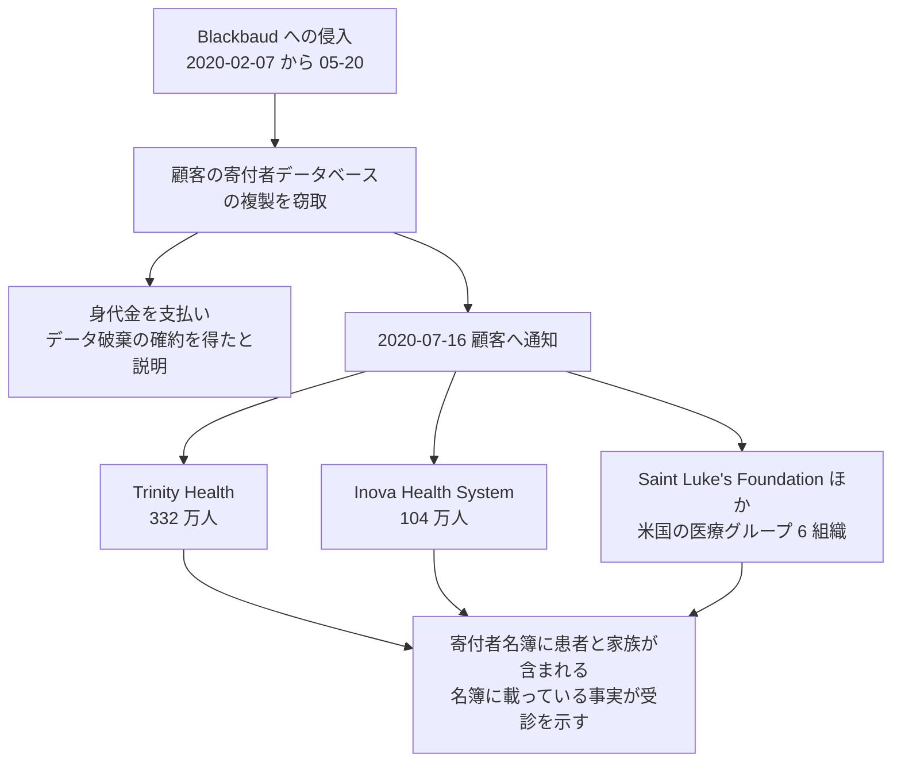

# 🌍 海外の事例 2020 年（履歴）

> [!NOTE]
> **表記ルール**：本ページでは、**事実**（一次情報で確認できる内容。出典を併記する）、**報道ベース**（報道や第三者の集計のみで確認でき、当事者の公表資料では裏付けが取れていない内容）、**分析**（筆者の解釈）を書き分ける。
> [対象の区分](../README.md#対象の区分)と[一次情報の強度](../README.md#一次情報の強度)の定義は、インシデント事例集のトップにまとめている。
> その年の情勢と集計は [2020 年の情勢](../years/2020-summary.md) にまとめている。

## 収録件数

| 区分 | サイバー攻撃 | その他の事案 |
|---|---|---|
| 病院系 | 16 | 0 |
| 製薬企業系 | 4 | 0 |
| 医療関連事業者 | 8 | 2 |

収録は本リポジトリが一次情報を確認できた事案に限る。
海外で公表された医療関連の事案がこれで尽きることを示すものではない。
米国の件数は、保健福祉省公民権局（HHS OCR）の侵害報告ポータルに届け出られた影響人数を典拠とする。
2020 年に同ポータルへ届け出られた全 663 件の集計は、[2020 年 米国 HHS OCR 届出の全件集計](2020-us-hhs.md)にまとめている。

---

## 病院系

| ID | 発生時期 | 組織、国 | 種別 | 初期侵入経路 | 診療への影響 | 業務停止期間 | 一次情報の強度 |
|---|---|---|---|---|---|---|---|
| [GL-2020-14](#GL-2020-14) | 2020-01 | Hospital Universitario de Torrejón（西、マドリード） | マルウェア感染 | 未公表 | 電子カルテが参照できず紙運用へ | 情報システムの障害が **1 か月以上** | 報道のみ |
| [GL-2020-04](#GL-2020-04) | 2020-03 | Fakultní nemocnice Brno（チェコ、ブルノ大学病院） | ランサムウェア | 未公表 | 予定手術の中止、患者の転送、COVID-19 検査結果の遅れ | 情報システムの復旧まで **約 3 週間** | 当事者公表 |
| [GL-2020-05](#GL-2020-05) | 2020-03 | Champaign-Urbana Public Health District（米、イリノイ州） | ランサムウェア（NetWalker） | 未公表 | 感染症対応の情報基盤が停止。ウェブサイトを代替で再構築 | 情報システムの停止が **数日**。身代金を支払って復号 | 報道のみ |
| [GL-2020-15](#GL-2020-15) | 2020-04 | Florida Orthopaedic Institute（米、フロリダ州） | ランサムウェア | 未公表 | 公表なし | 診療の停止は公表されていない | 当事者公表 |
| [GL-2020-06](#GL-2020-06) | 2020-05 | Fresenius Group（独、透析、病院） | ランサムウェア（Snake / EKANS） | 未公表 | 一部の業務が制限されたが、診療は継続 | 業務の制限（期間は未公表） | 当事者公表 |
| [GL-2020-13](#GL-2020-13) | 2020-05 | The Hospital Group（英、美容外科） | データ侵害と恐喝（REvil） | 未公表 | 公表なし | 診療の停止は公表されていない | 報道のみ |
| [GL-2020-07](#GL-2020-07) | 2020-06 | University of California, San Francisco 医学部（米） | ランサムウェア（NetWalker） | 未公表 | 診療への影響はないと公表 | **診療の停止なし**。身代金 114 万ドルを支払い | 当事者公表 |
| [GL-2020-01](#GL-2020-01) | 2020-09 | Universal Health Services（米、約 400 施設） | ランサムウェア（Ryuk） | 未公表 | 全米 400 施設規模でシステム停止 | 全 IT システムと電子カルテの復旧まで **約 3 週間** | 当事者公表 |
| [GL-2020-02](#GL-2020-02) | 2020-09 | Universitätsklinikum Düsseldorf（独） | ランサムウェア（DoppelPaymer） | Citrix 製品の既知の脆弱性（CVE-2019-19781） | 救急搬送の受入不能 | 救急の受け入れ再開まで **約 2 週間**（報道ベース）。完全稼働はさらに後 | 当事者公表 |
| [GL-2020-16](#GL-2020-16) | 2020-09 | Nebraska Medicine（米、ネブラスカ州） | ランサムウェア | 未公表 | 予約の変更、紙運用への切り替え | 情報システムの停止が **数週間** | 当事者公表 |
| [GL-2020-03](#GL-2020-03) | 2020-10 | Psykoterapiakeskus Vastaamo（フィンランド、心理療法） | データ侵害と患者への恐喝 | 未公表 | 事業継続不能、破産 | 復旧せず。事業を終えた | 当事者公表 |
| [GL-2020-11](#GL-2020-11) | 2020-10 | Sonoma Valley Hospital（米、カリフォルニア州） | ランサムウェア | 未公表 | 情報システムを停止し、紙運用へ | 情報システムの停止が **数週間** | 当事者公表 |
| [GL-2020-09](#GL-2020-09) | 2020-10 | Sky Lakes Medical Center（米、オレゴン州） | ランサムウェア（Ryuk） | 未公表 | 救急と緊急外来は継続。電子カルテはダウンタイム手順へ | 端末約 2000 台を入れ替え。復旧に **数週間**。身代金は不払い | 当事者公表 |
| [GL-2020-10](#GL-2020-10) | 2020-10 | St. Lawrence Health System（米、ニューヨーク州、3 病院） | ランサムウェア（Ryuk） | 未公表 | 3 病院で情報システムを停止 | 情報システムの停止（期間は未公表） | 当事者公表 |
| [GL-2020-08](#GL-2020-08) | 2020-10 | University of Vermont Health Network（米、6 病院） | ランサムウェア | 未公表 | 化学療法と乳がん検診の延期、患者の転送 | 電子カルテの復旧まで **約 4 週間**（10-28 から 11-23）。被害額は 6300 万ドル超 | 当事者公表 |
| [GL-2020-29](#GL-2020-29) | 2020-11 | Leon Medical Centers（米、フロリダ州、8 拠点）、Nocona General Hospital（米、テキサス州、3 拠点） | ランサムウェア（Conti） | フィッシングメールと SMB の脆弱性（CVE-2020-0796）の悪用（報道ベース） | 公表なし | 診療の停止は公表されていない | 当事者公表 |

### GL-2020-14 Hospital Universitario de Torrejón（2020 年 1 月、スペイン）

**報道ベース**

- 発生時期：2020 年 1 月 17 日、マドリード州トレホン・デ・アルドスの大学病院で情報システムが停止した。
- 攻撃種別：マルウェア感染。当局は身代金の要求を受け取っていないと説明したため、ランサムウェアであったかは確定していない。
- 侵害範囲：院内の情報システム全般。
- 診療への影響：診療記録を参照できなくなり、報告書の作成と管理業務を紙で行った。
- 業務停止期間：攻撃から 1 か月後の時点でも、システムの一部が復旧していないと報じられた。
- 完全復旧：時期は公表されていない。

**分析**

- スペインで病院の情報システムが広範に停止した初期の事例として報じられた。COVID-19 の流行が本格化する直前にあたる。
- 身代金の要求がないまま長期の停止だけが残る形は、暗号化と恐喝を目的としない破壊型の攻撃、または恐喝の準備段階での封じ込めで起こりうる。当事者が経緯を公表していないため、本件がどれにあたるかは確認できない。

**一次情報**

- 当事者の公表資料は本リポジトリで未確認。確認でき次第、経緯と対策を追記する。

---

### GL-2020-04 Fakultní nemocnice Brno（2020 年 3 月、チェコ）

**事実**

- 発生時期：2020 年 3 月 13 日午前 5 時ごろ、院内のすべての端末を停止するよう指示が出た。
- 対象組織：チェコで 2 番目に大きい大学病院。国内でも規模の大きい COVID-19 検査施設を持つ。
- 攻撃種別：ランサムウェア。
- 攻撃グループ：未公表。
- 初期侵入経路：未公表。
- 侵害範囲：主に管理系のデータ。病院は影響がデータの 5 割から 8 割に及んだと説明した。
- 診療への影響：発生当日に予定手術をすべて中止し、一部の患者を帰宅させ、他院へ転送した。COVID-19 検査の結果通知が遅れた。
- 業務停止期間：情報システムの復旧まで **約 3 週間**を要した。
- 完全復旧：3 週間かけて段階的に復旧した。
- 公表された対策：チェコの国家サイバー情報セキュリティ庁（NÚKIB）が対応に加わり、以後、医療機関向けの警告を発出した。

**分析**

- 感染症の流行が始まった時期に、検査を担う施設が止まった。診療の停止は院内に留まらず、地域の検査能力の低下として外部へ波及した。
- 本件を受けて NÚKIB は国内の医療機関へ警告を出し、欧州各国の当局も同種の注意喚起を続けた。攻撃が公衆衛生上の対応能力へ直接影響した最初期の事例として、以後の政策議論で繰り返し引かれている。

**一次情報**

- [Fakultní nemocnice Brno](https://www.fnbrno.cz/)
- [Národní úřad pro kybernetickou a informační bezpečnost（NÚKIB）](https://nukib.gov.cz/)

---

### GL-2020-05 Champaign-Urbana Public Health District（2020 年 3 月、米国）

**報道ベース**

- 発生時期：2020 年 3 月上旬。
- 対象組織：イリノイ州の公衆衛生行政区。COVID-19 の対応にあたっていた。
- 攻撃種別：ランサムウェア（NetWalker）。
- 初期侵入経路：未公表。
- 診療への影響：情報基盤が使えなくなり、住民向けの情報発信のためにウェブサイトを別途立ち上げた。
- 業務停止期間：数日。
- 身代金：保険を通じて約 35 万ドルを支払い、復号鍵を得たと報じられた。

**分析**

- 感染症の流行下で公衆衛生の情報発信が止まった。攻撃者側が医療分野を避けると表明していた時期にあたるが、実際には自治体の公衆衛生機能が対象になっている。
- 身代金の支払いをサイバー保険が負担した形は、その後、保険が支払いの原資になっているという批判を招いた。保険の設計は[予算とコスト](../../../governance/cost.md)に整理している。

**一次情報**

- 当事者の公表資料は本リポジトリで未確認。確認でき次第、経緯と対策を追記する。

---

### GL-2020-15 Florida Orthopaedic Institute（2020 年 4 月、米国）

**事実**

- 発生時期：2020 年 4 月 9 日に、サーバ上のデータが暗号化されていることを把握した。
- 対象組織：フロリダ州の整形外科グループ。
- 攻撃種別：ランサムウェア。
- 初期侵入経路：未公表。
- 侵害範囲：氏名、生年月日、社会保障番号、健康保険情報、診療記録番号、検査と処置の内容を含むデータ。
- 情報流出：65 万 1527 人（HHS OCR への届出、2020 年 7 月 1 日）。
- 診療への影響：診療の停止は公表されていない。
- 公表された対策：外部の専門家による調査を行い、対象者へ通知し、信用監視のサービスを提供した。

**分析**

- 診療の停止を伴わずに、単一の診療科グループから 65 万人規模の情報が出た。整形外科は外来の回転が速く、長期にわたって患者数が積み上がる。保有する記録の総量は、日々の診療規模からは読み取れない。

**一次情報**

- [Florida Orthopaedic Institute](https://www.floridaortho.com/)
- [HHS OCR 侵害報告ポータル](https://ocrportal.hhs.gov/ocr/breach/breach_report.jsf)

---

### GL-2020-06 Fresenius Group（2020 年 5 月、ドイツ）

**事実**

- 発生時期：2020 年 5 月上旬。
- 対象組織：欧州最大級の民間病院運営事業者であり、透析の製品とサービスも世界規模で提供する。従業員は約 30 万人。
- 攻撃種別：ランサムウェア（Snake、EKANS とも呼ばれる）。
- 初期侵入経路：未公表。
- 侵害範囲：グループ内の複数の事業部門。
- 診療への影響：同社は、一部の業務が制限されたものの患者の治療は継続していると説明した。
- 業務停止期間：制限の期間は公表されていない。

**報道ベース**

- 攻撃者が、セルビアの透析施設の患者データを公開した。氏名、性別、生年月日、国籍、住所、電話番号に加え、かかりつけ医の情報、アレルギーの記録、検査結果、治療に関する所見が含まれていた。

**分析**

- 透析は中断できない治療である。週に複数回の通院が予定として組まれており、予定表と患者の状態を管理する仕組みが止まると、代替の運用が組みにくい。
- Snake は、産業用制御システムのプロセスを停止させる機能を持つとして分析されていた系統である。病院設備と製造設備の双方を抱えるグループでは、暗号化の対象が事務系に留まらない可能性を評価する必要がある（[製造 OT](../../../reference/pharma/manufacturing-ot.md)）。

**一次情報**

- [Fresenius](https://www.fresenius.com/)
- [Fresenius Medical Care](https://www.freseniusmedicalcare.com/)

---

### GL-2020-13 The Hospital Group（2020 年 5 月、英国）

**報道ベース**

- 発生時期：2020 年 5 月。
- 対象組織：英国の美容外科グループ。
- 攻撃種別：データ侵害と恐喝。ランサムウェアグループ REvil が犯行を主張した。
- 侵害範囲：患者の術前術後の写真を含むデータ。攻撃者は写真の一部を公開した。
- 診療への影響：公表なし。

**分析**

- 恐喝の材料になったのは診療の停止ではなく、患者本人の写真である。写真は氏名と結び付かなくても本人を特定でき、公開そのものが被害になる。
- 画像を扱う診療科では、保管期間と保管場所を診療録と別に決める必要がある。同じ構造は 2023 年の [Lehigh Valley Health Network](2023-timeline.md#GL-2023-04) で再び現れた。

**一次情報**

- 当事者の公表資料は本リポジトリで未確認。確認でき次第、経緯と対策を追記する。

---

### GL-2020-07 University of California, San Francisco 医学部（2020 年 6 月、米国）

**事実**

- 発生時期：2020 年 6 月 1 日にサーバ上のデータが暗号化された。
- 対象組織：カリフォルニア大学サンフランシスコ校の医学部。
- 攻撃種別：ランサムウェア（NetWalker）。
- 初期侵入経路：未公表。
- 侵害範囲：医学部の研究に用いていたサーバ。同大学は、患者情報へ到達された形跡はないと説明した。
- 診療への影響：診療の提供と COVID-19 に関する研究には影響していないと公表した。
- 身代金：**114 万ドルを支払った**。同大学は、暗号化されたデータが進行中の研究に必要であり、バックアップから復元できなかったため交渉したと説明している。
- 公表された対策：影響を受けたサーバを隔離し、外部の専門家とともに調査した。

**分析**

- 支払いの判断が、診療ではなく研究データの復元を理由に説明された数少ない事例である。研究データはバックアップの対象から外れやすく、対象に入っていても復元の検証がされていないことが多い。
- 同じ時期に、NetWalker は米国の複数の大学を続けて攻撃していた。大学附属の医療機関では、診療系と研究系で運用の水準が分かれる。診療系を基準に守りを設計しても、研究系の停止が組織全体の判断を左右する。

**一次情報**

- [Update on IT Security Incident at UCSF](https://www.ucsf.edu/news/2020/06/417911/update-it-security-incident-ucsf)（University of California, San Francisco）

---

### GL-2020-01 Universal Health Services（2020 年 9 月、米国）

**事実**

- 発生時期：2020 年 9 月 27 日未明に情報システムが停止した。
- 対象組織：全米とプエルトリコ、英国で約 400 の施設を運営する病院グループ。
- 攻撃種別：ランサムウェア。
- 攻撃グループ：報道では Ryuk とされたが、当事者は攻撃グループを公表していない。
- 侵害範囲：米国内の全施設の情報システム。
- 情報流出：同社は、患者情報と職員情報へ不正にアクセスまたは複製された形跡はないと公表した。
- 診療への影響：紙による運用へ切り替えた。
- 業務停止期間：全米の 400 施設で IT システムが停止し、すべてのアプリケーションと電子カルテが復旧するまで **約 3 週間**を要した。
- 完全復旧：2020 年 10 月中旬までに全米の全施設で復旧した。
- 被害額：同社は 2020 年通期で税引前 **6700 万ドル**の不利な影響を開示した。第 3 四半期に 1200 万ドル、第 4 四半期に 5500 万ドルである。内訳は、患者数の減少による逸失利益と、請求の遅れに伴う引当が大部分を占める。

**分析**

- 統合基盤のブラスト半径を示した事例である。1 施設の侵害がグループ全体に波及する構造は、[GL-2024-02 Ascension](2024-timeline.md#GL-2024-02) でも繰り返された。
- 3 週間の停止に 6700 万ドルの損失が対応している。この金額の大半は復旧費用ではなく、診療が回らなかったことによる逸失利益である。事業継続計画で許容できる停止日数を決めるとき、日数あたりの逸失利益を見積もる材料になる（[予算とコスト](../../../governance/cost.md)）。
- 情報の流出は確認されなかったにもかかわらず、被害額は 6700 万ドルに達した。漏えい件数だけを指標にすると、この種の被害は評価に載らない。

**一次情報**

- [Universal Health Services](https://www.uhsinc.com/)
- [UHS 2020 年第 4 四半期および通期決算](https://ir.uhsinc.com/)（Universal Health Services 投資家向け情報）

---

### GL-2020-02 Universitätsklinikum Düsseldorf（2020 年 9 月、ドイツ）

**事実**

- 発生時期：2020 年 9 月 10 日に約 30 台のサーバが暗号化された。
- 対象組織：デュッセルドルフ大学病院。
- 攻撃種別：ランサムウェア（DoppelPaymer）。
- 初期侵入経路：Citrix 製品の既知の脆弱性（CVE-2019-19781）の悪用が指摘された。
- 診療への影響：救急搬送の受け入れが不能になり、予定手術も延期された。
- 身代金：攻撃者は、標的が大学ではなく病院であったことを警察から知らされたのち、要求を取り下げて復号鍵を提供した。

**報道ベース**

- 業務停止期間：翌 9 月 11 日には救急医療の受け入れ登録を取り下げた。救急の受け入れを再開できるまで、ほぼ 2 週間を要したと報じられている。
- 代替運用：救急搬送を他院へ振り替え、外来の予定を延期した。
- 完全復旧：救急の再開後も、通常の稼働に戻るまでにはさらに時間を要したと報じられている。正確な時期は当事者から公表されていない。
- 搬送先が変更された患者が死亡した事案について、ドイツ当局が捜査を実施した。

**未確認、議論**

- 当初は「ランサムウェアによる初の死者」と広く報道されたが、その後の当局の検証では、攻撃と死亡の直接的な因果関係は立証されなかったと報じられている。この事例で因果関係を断定することはできない。

**分析**

- 医療におけるランサムウェアの被害は、データ侵害としてではなく、診療の遅延と転送による臨床アウトカムの悪化として現れる。リスク評価の主要な指標は、情報漏えいの規模ではなく診療の停止時間になる。
- 復号鍵を無償で得たにもかかわらず、救急の再開まで約 2 週間を要した。復号は復旧作業の一部でしかない。同じことは[GL-2021-01 HSE](2021-timeline.md#GL-2021-01)でも起きている。
- 攻撃と死亡の因果を当事者側の調査が認めた記録は、2025 年の [Synnovis](2024-timeline.md#GL-2024-03) の続報まで現れなかった。本件が示したのは因果そのものではなく、因果を検証する枠組みが医療にも捜査機関にも用意されていなかったことである。

**一次情報**

- [Universitätsklinikum Düsseldorf](https://www.uniklinik-duesseldorf.de/)
- [Bundesamt für Sicherheit in der Informationstechnik（BSI）](https://www.bsi.bund.de/)

---

### GL-2020-16 Nebraska Medicine（2020 年 9 月、米国）

**事実**

- 発生時期：2020 年 9 月 20 日に情報システムの異常を検知した。
- 対象組織：ネブラスカ州オマハの医療グループ。ネブラスカ大学メディカルセンターと連携する。
- 攻撃種別：ランサムウェア。
- 初期侵入経路：未公表。調査により、不正アクセスは 8 月 27 日から始まっていたことが確認された。
- 侵害範囲：氏名、住所、生年月日、社会保障番号、診療記録番号、健康保険情報、臨床情報を含むファイル。
- 情報流出：21 万 6472 人（HHS OCR への届出、2020 年 11 月 23 日）。報道では約 21 万 9000 人とされた。
- 診療への影響：予約の変更を行い、紙による運用へ切り替えた。
- 業務停止期間：情報システムの停止が数週間にわたった。
- 公表された対策：外部の専門家による調査を行い、対象者へ通知した。

**分析**

- 検知の 3 週間以上前から侵入されていた。暗号化までの潜伏期間に検知の機会があったという指摘は、[GL-2021-01 HSE](2021-timeline.md#GL-2021-01) の事後レビューが最も詳しく扱っている。

**一次情報**

- [Nebraska Medicine](https://www.nebraskamed.com/)
- [HHS OCR 侵害報告ポータル](https://ocrportal.hhs.gov/ocr/breach/breach_report.jsf)

---

### GL-2020-03 Psykoterapiakeskus Vastaamo（2020 年 10 月、フィンランド）

**事実**

- 発生時期：2020 年 10 月に恐喝が表面化した。侵入そのものは 2018 年と 2019 年にさかのぼる。
- 対象組織：フィンランド最大級の民間心理療法サービス事業者。
- 攻撃種別：データ侵害と恐喝。
- 初期侵入経路：未公表。
- 侵害範囲：患者の診療記録。セラピーの記録そのものが含まれていた。
- 情報流出：数万人規模の患者が対象となった。
- 恐喝の形態：組織への身代金要求に加え、**患者本人に対して、記録を公開すると脅す恐喝メールが直接送られた**。攻撃者は要求に応じなかった患者のセラピー記録を実際に公開した。
- 事業の継続：Vastaamo は事業を継続できず破産に至った。復旧して事業を再開することはなかった。
- 司法：加害者は特定、訴追され、2024 年に有罪判決を受けた。

**分析**

- 医療情報の恐喝は、組織ではなく患者個人を標的にする形態に発展しうる。組織が身代金を払うかどうかというモデルでは、この被害構造を説明できない。
- メンタルヘルス、依存症、感染症、性感染症、生殖医療などの記録は、漏えい時の患者被害が特に深刻になる。これらを扱うシステムには、より強い保護要件を設定する必要がある。
- 患者への通知、支援体制（相談窓口、法的支援）を、インシデント対応計画に含める必要がある。同じ論点は国内の [JP-2024-01 岡山県精神科医療センター](../japan/2024-timeline.md#JP-2024-01) にも現れている。
- 事業者が破産したことで、患者の救済を担う主体が消えた。生殖補助医療の [GL-2025-04 Genea](2025-timeline.md#GL-2025-04) や遺伝子検査の 23andMe と同じく、秘匿性の高い情報を扱う事業者では、事業終了時のデータの扱いを事前に決めておく必要がある。

**一次情報**

- [Poliisi（フィンランド警察）](https://poliisi.fi/en/)
- [Tietosuojavaltuutetun toimisto（フィンランドデータ保護監督機関）](https://tietosuoja.fi/en/)

---

### GL-2020-11 Sonoma Valley Hospital（2020 年 10 月、米国）

**事実**

- 発生時期：2020 年 10 月 11 日。
- 対象組織：カリフォルニア州ソノマの地域病院。
- 攻撃種別：ランサムウェア。
- 初期侵入経路：未公表。
- 侵害範囲：2009 年以降に保険請求の対象となった患者の記録。
- 情報流出：約 6 万 7000 人。
- 診療への影響：情報システムを停止し、紙による運用へ切り替えた。
- 業務停止期間：数週間。
- 身代金：報道では不払いとされる。

**分析**

- 侵害の対象が 2009 年以降の請求データであった。診療が終わった患者の記録が、請求の履歴として長期にわたり同じ場所に残る。保存期間の設計は、診療録だけでなく請求系にも要る（[ログと監視](../../../technology/logging.md)）。

**一次情報**

- [Sonoma Valley Hospital Notifies Patients Affected By Ransomware Attack](https://www.sonomavalleyhospital.org/about-us/information-resources/news/sonoma-valley-hospital-notifies-patients-affected-by-ransomware-attack/)（Sonoma Valley Hospital、2020 年 12 月 10 日）
- [HHS OCR 侵害報告ポータル](https://ocrportal.hhs.gov/ocr/breach/breach_report.jsf)

---

### GL-2020-09 Sky Lakes Medical Center（2020 年 10 月、米国）

**事実**

- 発生時期：2020 年 10 月 27 日。
- 対象組織：オレゴン州クラマスフォールズの地域病院。
- 攻撃種別：ランサムウェア（Ryuk）。
- 初期侵入経路：未公表。
- 侵害範囲：端末約 2500 台とサーバ約 600 台。
- 診療への影響：救急と緊急外来は稼働を維持し、予定されていた処置の多くも実施した。電子カルテはダウンタイム手順へ切り替えた。
- 業務停止期間：情報システムの停止が数週間続いた。
- 復旧の方法：端末約 2000 台を入れ替えた。バックアップから復元し、**身代金は支払わなかった**。
- 公表された対策：復旧後、経緯と学んだ点を対外的に説明した。

**分析**

- 端末を入れ替える判断が復旧の所要時間を決めた。ランサムウェアの被害では、データの復元だけでなく、汚染された端末を信頼できる状態に戻す工程が残る。台数分の調達期間が復旧計画に入っていないと、日数の見積もりが外れる。
- 救急と緊急外来を止めずに済んだ点は、電子カルテの停止と診療の停止が同一ではないことを示す。ダウンタイム手順が実際に運用できる状態にあるかどうかが、その差を作る（[事業継続](../../../response/bcp-cyber.md)）。

**一次情報**

- [Notice to Our Patients of Data Security Incident](https://www.skylakes.org/about-us/data-security-incident/)（Sky Lakes Health System）
- [Ransomware Activity Targeting the Healthcare and Public Health Sector（AA20-302A）](https://www.cisa.gov/news-events/cybersecurity-advisories/aa20-302a)（CISA、FBI、HHS、2020 年 10 月 28 日）

---

### GL-2020-10 St. Lawrence Health System（2020 年 10 月、米国）

**事実**

- 発生時期：2020 年 10 月 27 日。
- 対象組織：ニューヨーク州北部の 3 病院（Canton-Potsdam Hospital、Gouverneur Hospital、Massena Hospital）を運営する医療グループ。
- 攻撃種別：ランサムウェア（Ryuk）。
- 初期侵入経路：未公表。
- 診療への影響：封じ込めのため情報システムを停止した。
- 業務停止期間：停止の期間は公表されていない。
- 公表された対策：情報システム部門がシステムを遮断し、ネットワーク全体への拡大を防いだと説明した。

**分析**

- 同じ日に、遠く離れた [Sky Lakes Medical Center](#GL-2020-09) も Ryuk の攻撃を受けた。この時期の攻撃は、医療機関を個別に選んだのではなく、同一の基盤から一斉に展開されている。翌日に CISA、FBI、HHS が共同で緊急の勧告を出したのは、この同時多発を捉えたためである。

**一次情報**

- [St. Lawrence Health](https://www.stlawrencehealthsystem.org/)
- [Ransomware Activity Targeting the Healthcare and Public Health Sector（AA20-302A）](https://www.cisa.gov/news-events/cybersecurity-advisories/aa20-302a)（CISA、FBI、HHS）

---

### GL-2020-08 University of Vermont Health Network（2020 年 10 月、米国）

**事実**

- 発生時期：2020 年 10 月 28 日、患者対応のアプリケーションに障害が生じていることを職員が把握した。
- 対象組織：バーモント州とニューヨーク州北部で 6 病院を運営し、100 万人以上を対象とする医療ネットワーク。
- 攻撃種別：ランサムウェア。
- 初期侵入経路：職員の操作を起点とすると説明された。
- 侵害範囲：サーバ 1300 台、アプリケーション 600 本、端末 5000 台。
- 情報流出：同ネットワークは、患者情報が持ち出された形跡は確認されなかったと説明した。
- 診療への影響：化学療法と乳がん検診の予定を延期し、一部の患者を他院へ回した。
- 業務停止期間：電子カルテの復旧は 2020 年 11 月 23 日で、**約 4 週間**にあたる。
- 完全復旧：サーバ 1300 台の再構築、アプリケーション 600 本の復旧、端末 5000 台の消去と再セットアップを経て、段階的に戻した。証言によれば、全アプリケーションが本番稼働に戻ったのは 2021 年 1 月初旬である。
- 被害額：**6300 万ドル**を超えると見積もられた（報道ベース）。当時のサイバー保険の補償上限は 3000 万ドルであった（報道ベース）。
- 公表された対策：2023 年 9 月 27 日、同センターの院長が米下院の公聴会で経緯を証言した。

**分析**

- 被害額が保険の補償上限の 2 倍を超えた。保険を掛けていたことが、損失の全額を移転できたことを意味しない。補償額を決めるときは、想定する停止日数と日数あたりの逸失利益から積み上げる必要がある（[予算とコスト](../../../governance/cost.md)）。
- 延期された診療の内容が公表されている点で参照価値が高い。化学療法の延期は、停止時間の長さではなく、どの診療が止まったかで被害の重さが決まることを示す。
- 復旧の内訳（サーバ 1300 台、アプリケーション 600 本、端末 5000 台）が公表されている。この規模の再構築が 4 週間で終わるかどうかは、資産の一覧が事前に整っているかに左右される。

**一次情報**

- [Written testimony of Dr. Stephen Leffler（Combating Ransomware Attacks）](https://oversight.house.gov/wp-content/uploads/2023/09/Steve-Leffler-written-testimony.pdf)（The University of Vermont Medical Center 院長、2023 年 9 月 27 日）
- [Combating Ransomware Attacks](https://oversight.house.gov/hearing/combating-ransomware-attacks/)（米下院監視・政府改革委員会、2023 年 9 月 27 日）

---

### GL-2020-29 Leon Medical Centers、Nocona General Hospital（2020 年 11 月、米国）

**事実**

- 発生時期：Leon Medical Centers は 2020 年 11 月に侵害を受けた。Conti のリークサイトへの掲載は、Leon が 2020 年 12 月 21 日、Nocona General Hospital が 2021 年 2 月 3 日である。
- 対象組織：フロリダ州マイアミで 8 拠点を運営する Leon Medical Centers と、テキサス州で 3 拠点を運営する Nocona General Hospital。
- 攻撃種別：ランサムウェア（Conti）。二重恐喝。
- 初期侵入経路：報道ベースでは、Conti が 2020 年 9 月に Leon Medical Centers へフィッシングメールを送り、Microsoft の SMB の脆弱性（CVE-2020-0796）を悪用して管理者アカウントへ到達したとされる。その後、BloodHound と Mimikatz を用いて内部を進んだ。
- 侵害範囲：数万件のファイルがダークウェブ上へ公開された。氏名、住所、生年月日、社会保障番号、Medicaid の番号、処方の詳細、健康保険情報、診断名、検査画像を含む。
- 情報流出：Leon Medical Centers は 2021 年 1 月 8 日に HHS OCR へ届け出た。
- 診療への影響：公表されていない。

**分析**

- 身代金を支払わなかった結果として、患者のファイルがそのまま公開された。二重恐喝では、暗号化を復旧できても情報の公開は止まらない。バックアップの整備は、恐喝の一方にしか効かない。
- 公開されたのは、社会保障番号と Medicaid の番号を含むファイルである。米国では、この組み合わせが医療費の不正請求（medical identity theft）に直接使える。被害は情報の露出ではなく、患者名義での請求として現れる。
- 攻撃の起点は 9 月のフィッシングで、暗号化は 11 月である。2 か月にわたって内部に滞在していたことになる。滞在期間の長さは、検知の仕組みの有無をそのまま示す（[ログと監視の設計](../../../technology/logging.md)）。

**一次情報**

- [HHS OCR 侵害報告ポータル](https://ocrportal.hhs.gov/ocr/breach/breach_report.jsf)
- [CVE-2020-0796](https://nvd.nist.gov/vuln/detail/CVE-2020-0796)（NVD）
- [Leon Medical Centers](https://www.leonmedicalcenters.com/)

---

## 製薬企業系

| ID | 発生時期 | 組織、国 | 種別 | 初期侵入経路 | 影響 | 一次情報の強度 |
|---|---|---|---|---|---|---|
| [GL-2020-17](#GL-2020-17) | 2020-03 | Hammersmith Medicines Research（英、臨床試験受託） | データ侵害と恐喝（Maze） | 未公表 | 過去の治験参加者の記録が公開された | 報道のみ |
| [GL-2020-18](#GL-2020-18) | 2020-09 | eResearch Technology（米、治験のデータ収集支援） | ランサムウェア | 未公表 | COVID-19 ワクチンの治験を含む業務に遅れ | 報道のみ |
| [GL-2020-19](#GL-2020-19) | 2020-10 | Dr. Reddy's Laboratories（印、製薬） | 不正アクセス | 未公表 | 全世界の拠点でサーバを一時停止 | 当事者公表 |
| [GL-2020-20](#GL-2020-20) | 2020-12 | European Medicines Agency（EU、医薬品規制当局） | 不正アクセス（データ窃取） | 未公表 | COVID-19 ワクチンの審査文書が窃取され、改変のうえ公開された | 当事者公表 |

### GL-2020-17 Hammersmith Medicines Research（2020 年 3 月、英国）

**報道ベース**

- 発生時期：2020 年 3 月 14 日。
- 対象組織：英国の臨床試験受託機関。COVID-19 ワクチンの試験にも関与するとされていた。
- 攻撃種別：データ侵害と恐喝。ランサムウェアグループ Maze が犯行を主張した。
- 侵害範囲：過去の治験参加者の記録。氏名、生年月日、パスポートの写しなどが含まれていた。
- 情報流出：攻撃者が記録の一部を公開した。
- 業務への影響：同社は、システムを当日中に復旧させ、試験は継続したと説明した。

**分析**

- 治験参加者の記録は、参加した試験の内容そのものが本人の健康状態を示す。参加者は診療の当事者ではないため、医療機関の患者向け通知の枠組みから漏れやすい。
- 攻撃グループが公衆衛生上の危機下でも医療分野を攻撃対象から外していないことが、この時期に明確になった。治験受託機関の攻撃面は[治験と研究データ](../../../reference/pharma/clinical-trials.md)に整理している。

**一次情報**

- 当事者の公表資料は本リポジトリで未確認。確認でき次第、経緯と対策を追記する。

---

### GL-2020-18 eResearch Technology（2020 年 9 月、米国）

**報道ベース**

- 発生時期：2020 年 9 月下旬。
- 対象組織：治験におけるデータ収集と解析を支援する米国の事業者。COVID-19 ワクチンの治験を含む多数の試験を支えていた。
- 攻撃種別：ランサムウェア。
- 初期侵入経路：未公表。
- 業務への影響：一部の顧客で、治験データの入力を紙へ切り替える対応が生じ、試験の進行に遅れが懸念されると報じられた。

**分析**

- 治験は、参加者の来院と検査の日程が事前に固定されている。データ収集の基盤が止まると、その日に取るはずだった評価項目を取り直せない。停止時間がそのままデータの欠測に変わる点で、診療の停止とは影響の残り方が違う。
- 感染症の流行下で複数のワクチン試験が同じ事業者を使っていた。委託先の集中は、医療の提供側だけでなく研究開発の側にも単一障害点を作る。

**一次情報**

- 当事者の公表資料は本リポジトリで未確認。確認でき次第、経緯と対策を追記する。

---

### GL-2020-19 Dr. Reddy's Laboratories（2020 年 10 月、インド）

**事実**

- 発生時期：2020 年 10 月 22 日に不正アクセスを検知した。
- 対象組織：インドの大手ジェネリック医薬品企業。当時、ロシアの COVID-19 ワクチン Sputnik V の国内治験を担う立場にあった。
- 攻撃種別：不正アクセス。
- 初期侵入経路：未公表。
- 対応：予防措置として、世界各地の拠点のデータセンターを隔離し、一部の製造施設を一時停止した。
- 業務停止期間：同社は数日のうちに主要な業務を再開したと説明した。

**分析**

- 検知後にデータセンターを世界規模で隔離した。製造を止める判断が数日のうちに下されている点で、医薬品製造の事業継続計画がサイバー事象を想定に含めていたかどうかが問われる事例である。
- 製薬企業では、停止の影響が供給の途絶として数か月遅れて現れる。攻撃の当日に測れる指標がないため、被害の評価が遅れやすい（[サプライチェーン](../../../reference/pharma/supply-chain.md)）。

**一次情報**

- [Dr. Reddy's Laboratories](https://www.drreddys.com/)

---

### GL-2020-20 European Medicines Agency（2020 年 12 月、EU）

**事実**

- 発生時期：2020 年 12 月 9 日に、サイバー攻撃を受けたことを公表した。
- 対象組織：欧州連合の医薬品規制当局。当時、COVID-19 ワクチンの承認審査を進めていた。
- 攻撃種別：不正アクセス（データ窃取）。
- 初期侵入経路：未公表。
- 侵害範囲：COVID-19 ワクチンの審査に関する内部の電子メールと文書。Pfizer と BioNTech のワクチンに関する提出資料が含まれていた。
- 情報流出：窃取された文書は、2021 年 1 月にインターネット上へ公開された。EMA は、公開された文書に**表題の書き換え、選択的な抜き出し、文脈から切り離した提示**といった改変が加えられていたことを確認した。
- 公表された対策：オランダ警察、CERT-EU、Europol と連携して調査した。

**分析**

- 窃取した文書をそのまま公開せず、改変したうえで公開している。目的は金銭の要求ではなく、ワクチンへの信頼を損なうことに置かれていた。医療分野の攻撃を身代金の有無で分類すると、この型は視野から外れる。
- 規制当局は、企業の提出資料が集まる一点である。審査の過程で、複数の企業の非公開データが同じ場所に置かれる。攻撃者から見ると、企業を個別に攻めるより効率がよい。
- BioNTech と Pfizer は、自社のシステムは侵害されていないと説明した。委託や提出の先で起きた漏えいは、自社の検知の仕組みでは捉えられない。

**一次情報**

- [Cyberattack on EMA - update 5](https://www.ema.europa.eu/en/news/cyberattack-ema-update-5)（European Medicines Agency）
- [Protecting IT systems against cyberattacks](https://www.ema.europa.eu/en/annual-report/2021/protecting-it-systems-against-cyberattacks.html)（European Medicines Agency 年次報告 2021）

---

## 医療関連事業者

| ID | 発生時期 | 組織、国 | 種別 | 初期侵入経路 | 影響 | 一次情報の強度 |
|---|---|---|---|---|---|---|
| [GL-2020-21](#GL-2020-21) | 2020-02 〜 2020-05 | Blackbaud（米、寄付管理ソフトウェア） | ランサムウェア | 未公表 | 医療機関の寄付者データベースを経由し、米国の複数の医療グループで大規模な漏えい | 当事者公表 |
| [GL-2020-22](#GL-2020-22) | 2020-04 | Magellan Health（米、医療保険） | ランサムウェア | フィッシング | 100 万人超の情報が流出 | 当事者公表 |
| [GL-2020-23](#GL-2020-23) | 2020-04 | Benefit Recovery Specialists（米、請求代行） | ランサムウェア | 未公表 | 44 万 7354 人 | 当事者公表 |
| [GL-2020-24](#GL-2020-24) | 2020-06 | EyeMed Vision Care、Luxottica of America（米、視力保険） | フィッシング、BEC | 職員のメールアカウントの侵害 | EyeMed 147 万人、Luxottica 82 万 9454 人 | 当事者公表 |
| [GL-2020-25](#GL-2020-25) | 2020-06 | MEDNAX Services（米、医療事務の受託） | フィッシング、BEC | Office 365 アカウントの侵害 | 144 万 2997 人 | 当事者公表 |
| [GL-2020-26](#GL-2020-26) | 2020-09 | Dental Care Alliance（米、歯科診療の運営支援） | 不正アクセス | 未公表 | 172 万 3375 人 | 当事者公表 |
| [GL-2020-27](#GL-2020-27) | 2020-09 | US Fertility（米、生殖補助医療の運営支援） | ランサムウェア | 未公表 | 87 万 8550 人 | 当事者公表 |
| [GL-2020-28](#GL-2020-28) | 2020-11 | Aetna ACE、Health Plan of San Joaquin（米、医療保険） | フィッシング、BEC | 職員のメールアカウントの侵害 | Aetna ACE 48 万 4157 人、Health Plan of San Joaquin 41 万 8842 人 | 当事者公表 |

### GL-2020-21 Blackbaud（2020 年 2 月から 5 月、米国）

**事実**

- 発生時期：2020 年 2 月 7 日から 5 月 20 日まで侵入されていた。同社は 7 月 16 日に顧客へ通知した。
- 対象組織：非営利団体、教育機関、医療機関の寄付管理と募金業務を支えるソフトウェア事業者。
- 攻撃種別：ランサムウェア。
- 初期侵入経路：未公表。
- 侵害範囲：顧客の寄付者データベースの複製。医療機関の場合、寄付者名簿に患者が含まれる。
- 身代金：同社は**身代金を支払い**、複製されたデータが破棄されたとする確約を得たと説明した。
- 公表された対策：顧客への通知と、規制当局への報告を行った。

米国の医療分野で、本件を起点として HHS OCR へ届け出られた主な組織は次のとおりである（人数は届出時点の値）。

| 組織 | 影響人数 | 届出日 |
|---|---|---|
| Trinity Health | 332 万 0726 人 | 2020-09-14 |
| Inova Health System | 104 万 5270 人 | 2020-09-09 |
| Saint Luke's Foundation | 36 万 0212 人 | 2020-08-20 |
| NorthShore University HealthSystem | 34 万 8746 人 | 2020-09-04 |
| SCL Health – Colorado | 34 万 3493 人 | 2020-09-10 |
| Nuvance Health | 31 万 4829 人 | 2020-09-15 |
| Northern Light Health | 30 万 4399 人 | 2020-08-03 |
| Allegheny Health Network | 29 万 9507 人 | 2020-12-03 |

**分析**

- 診療にも請求にも関わらないソフトウェアが、単一の侵害で米国の医療分野に 600 万人を超える漏えいをもたらした（上表の 8 組織だけで 633 万人にのぼる）。寄付管理は、情報システム部門の資産一覧から漏れやすい領域である。
- 医療機関の寄付者名簿には、患者と家族が含まれる。名簿に載っていること自体が、その施設で治療を受けた事実を示す。人数だけを見て「診療情報ではない」と評価すると、この点を落とす。
- 身代金を支払い、データの破棄について攻撃者の確約を得たと説明した。確約が守られたかどうかを検証する手段はない。支払いの判断が、通知の要否や範囲の判断を変えるべきではないことを示している。
- 委託先の一覧を「診療に関わるか」で絞ると、この経路は残る。棚卸しの基準は、扱う情報に患者が含まれるかどうかで引く必要がある（[委託先への依存](../../../response/dependencies.md)）。

**一次情報**

- [Blackbaud Security Incident](https://www.blackbaud.com/)（Blackbaud）
- [HHS OCR 侵害報告ポータル](https://ocrportal.hhs.gov/ocr/breach/breach_report.jsf)

---

### GL-2020-22 Magellan Health（2020 年 4 月、米国）

**事実**

- 発生時期：2020 年 4 月 11 日にランサムウェアの被害を検知した。攻撃者は 4 月 6 日にフィッシングを通じて侵入していた。
- 対象組織：行動医療と薬剤給付を扱う米国の医療保険事業者。
- 攻撃種別：ランサムウェア。
- 初期侵入経路：フィッシング。同社の顧客を装ったメールが用いられた。
- 侵害範囲：氏名、住所、生年月日、社会保障番号、健康保険情報、診療情報。職員の情報も対象に含まれた。
- 情報流出：Magellan Health として 101 万 3956 人、関連する Magellan Rx Management として 31 万 4704 人（HHS OCR への届出、2020 年 6 月 12 日）。
- 公表された対策：外部の専門家による調査を行い、対象者へ通知した。

**分析**

- 暗号化の前に情報が持ち出されていた。二重恐喝の型が医療分野で本格化した時期にあたる。
- 行動医療を扱う保険者である。給付の記録から、精神科や依存症の治療を受けた事実が読み取れる。保険者が持つ情報は、診療の中身を含まなくても患者の状態を示す。

**一次情報**

- [Magellan Health](https://www.magellanhealth.com/)
- [HHS OCR 侵害報告ポータル](https://ocrportal.hhs.gov/ocr/breach/breach_report.jsf)

---

### GL-2020-23 Benefit Recovery Specialists（2020 年 4 月、米国）

**事実**

- 発生時期：2020 年 4 月 30 日に、職員の認証情報が悪用されていることを把握した。侵入は 4 月 20 日から続いていた。
- 対象組織：医療機関と保険者向けに請求と回収の業務を受託するテキサス州の事業者。
- 攻撃種別：ランサムウェア。
- 初期侵入経路：職員の認証情報の悪用。
- 侵害範囲：氏名、生年月日、診療日、提供者名、診断コード、健康保険情報、一部に社会保障番号。
- 情報流出：44 万 7354 人（HHS OCR への届出、2020 年 6 月 26 日）。
- 公表された対策：対象者へ通知し、信用監視のサービスを提供した。

**分析**

- 請求代行は、複数の医療機関の患者データを一か所に集める。1 社の侵害で、直接の取引がない患者まで対象になる。
- 診断コードは、病名そのものである。請求データを「金銭に関する情報」として扱うと、保護の水準を誤る。

**一次情報**

- [HHS OCR 侵害報告ポータル](https://ocrportal.hhs.gov/ocr/breach/breach_report.jsf)

---

### GL-2020-24 EyeMed Vision Care、Luxottica of America（2020 年 6 月、米国）

**事実**

- 発生時期：2020 年 6 月 24 日から 7 月 1 日にかけて、職員のメールアカウントが不正に利用された。
- 対象組織：EyeMed は米国の視力保険事業者、Luxottica of America はその親会社にあたる眼鏡と眼科関連の事業者。
- 攻撃種別：フィッシング、BEC。
- 初期侵入経路：職員のメールアカウントの侵害。
- 侵害範囲：氏名、住所、生年月日、健康保険の識別番号、診療または処方の情報。一部に社会保障番号と医療保険の口座情報。
- 情報流出：EyeMed Vision Care 147 万 4000 人（届出 2020-09-28）、Luxottica of America 82 万 9454 人（届出 2020-10-27）。
- 公表された対策：対象者へ通知し、複数州の司法長官との間で和解に至った。ニューヨーク州とニュージャージー州は、後年に制裁金を科している。

**分析**

- メールアカウント 1 件の侵害で、150 万人近い情報が対象になった。受信箱には、業務のやり取りに添付された名簿と報告書が年単位で残る。
- 保険と小売を同じ企業グループが担う構造では、視力検査の記録が販売の記録と同じ基盤に置かれやすい。区分の設計が甘いと、漏えいの範囲が事業の境界を越える。
- メールの侵害は、多要素認証の適用で成否が大きく変わる。適用の範囲は[認証とアクセス管理](../../../technology/identity.md)に整理している。

**一次情報**

- [EyeMed](https://eyemed.com/)
- [HHS OCR 侵害報告ポータル](https://ocrportal.hhs.gov/ocr/breach/breach_report.jsf)

---

### GL-2020-25 MEDNAX Services（2020 年 6 月、米国）

**事実**

- 発生時期：2020 年 6 月中旬から下旬にかけて、Office 365 上のアカウントが不正に利用された。
- 対象組織：新生児科と麻酔科を中心とする医師グループの請求と事務を受託するフロリダ州の事業者。
- 攻撃種別：フィッシング、BEC。
- 初期侵入経路：Office 365 アカウントの侵害。
- 侵害範囲：氏名、住所、生年月日、健康保険情報、診療記録番号、診断名、処置、処方、一部に社会保障番号と運転免許証番号。
- 情報流出：144 万 2997 人（HHS OCR への届出、2020 年 12 月 16 日）。
- 公表された対策：外部の専門家による調査を行い、対象者へ通知した。

**分析**

- 新生児科の請求データが対象に含まれる。出生時の情報は本人が長く保持を望まない場合でも、修正も削除もできないまま残る。
- 検知から届出までに約半年を要した。メールアカウントの侵害では、受信箱の中身を一通ずつ精査して対象者を特定する工程が入る。通知が遅れる理由がここにある。

**一次情報**

- [Pediatrix Medical Group（旧 MEDNAX）](https://www.pediatrix.com/)
- [HHS OCR 侵害報告ポータル](https://ocrportal.hhs.gov/ocr/breach/breach_report.jsf)

---

### GL-2020-26 Dental Care Alliance（2020 年 9 月、米国）

**事実**

- 発生時期：2020 年 9 月から 10 月にかけて侵入されていた。同社は 10 月 11 日に把握した。
- 対象組織：全米の歯科医院に対して経営と事務の支援を行うフロリダ州の事業者。
- 攻撃種別：不正アクセス。
- 初期侵入経路：未公表。
- 侵害範囲：氏名、住所、生年月日、健康保険情報、歯科診療の内容、請求に用いる口座情報。
- 情報流出：172 万 3375 人（HHS OCR への届出、2020 年 12 月 8 日）。
- 公表された対策：外部の専門家による調査を行い、対象者へ通知した。

**分析**

- 歯科医院は 1 施設あたりの患者数が限られる。経営支援の事業者が複数の医院を束ねることで、患者数の合計が 170 万人に達した。委託先の集約は、事務の効率と漏えい時の規模を同時に押し上げる。

**一次情報**

- [Dental Care Alliance](https://www.dentalcarealliance.com/)
- [HHS OCR 侵害報告ポータル](https://ocrportal.hhs.gov/ocr/breach/breach_report.jsf)

---

### GL-2020-27 US Fertility（2020 年 9 月、米国）

**事実**

- 発生時期：2020 年 8 月 12 日から 9 月 14 日にかけて侵入され、9 月 14 日に一部のファイルが暗号化された。
- 対象組織：全米の生殖補助医療の診療所に対して事務と情報基盤を提供するメリーランド州の事業者。
- 攻撃種別：ランサムウェア。
- 初期侵入経路：未公表。
- 侵害範囲：氏名、住所、生年月日、社会保障番号、診療記録番号。
- 情報流出：87 万 8550 人（HHS OCR への届出、2020 年 11 月 25 日）。
- 公表された対策：外部の専門家による調査を行い、対象者へ通知した。

**分析**

- 不妊治療の記録は、治療を受けた事実そのものが本人にとって秘匿性の高い情報である。同じ構造は 2025 年の [Genea](2025-timeline.md#GL-2025-04) でも現れた。
- 診療の提供は各診療所が行い、記録の保管は運営支援の事業者が担う。患者から見ると通知の主体が診療所ではない事業者になり、連絡が届きにくい。

**一次情報**

- [US Fertility](https://www.usfertility.com/)
- [HHS OCR 侵害報告ポータル](https://ocrportal.hhs.gov/ocr/breach/breach_report.jsf)

---

### GL-2020-28 Aetna ACE、Health Plan of San Joaquin（2020 年 11 月、米国）

**事実**

- 発生時期：2020 年 11 月ごろ。
- 対象組織：Aetna ACE はコネチカット州の医療保険、Health Plan of San Joaquin はカリフォルニア州の地域医療保険。
- 攻撃種別：フィッシング、BEC。
- 初期侵入経路：職員のメールアカウントの侵害。
- 侵害範囲：加入者の氏名、識別番号、給付の記録。
- 情報流出：Aetna ACE 48 万 4157 人（届出 2020-12-22）、Health Plan of San Joaquin 41 万 8842 人（届出 2020-12-21）。
- 公表された対策：対象者へ通知した。

**分析**

- 2020 年に HHS OCR へ届け出られた侵害のうち、侵害場所が「電子メール」であったものは 223 件で、ネットワークサーバの 238 件に迫る（[2020 年 米国 HHS OCR 届出の全件集計](2020-us-hhs.md)）。この年の米国では、ランサムウェアと同じ規模でメールアカウントの侵害が起きていた。
- メール経由の漏えいは、診療の停止を伴わない。指標を停止時間だけに置くと、この型は被害として数えられない。

**一次情報**

- [HHS OCR 侵害報告ポータル](https://ocrportal.hhs.gov/ocr/breach/breach_report.jsf)

---

## その他の事案（サイバー攻撃以外）

サポート詐欺、システム障害、内部不正、機器や記憶媒体の紛失と盗難、委託先の管理不備による漏えい、誤送付や誤公開、ドメインの失効を記録する。
類型の定義と、主分類との判定基準は[事案の類型](../README.md#事案の類型)にまとめている。

| ID | 発生時期 | 組織 | 区分 | 類型 | 概要 | 一次情報の強度 |
|---|---|---|---|---|---|---|
| [GL-2020-S01](#GL-2020-S01) | 2020-01 | Health Share of Oregon（米、オレゴン州の公的医療保険） | 医療関連事業者 | 機器、記憶媒体の紛失、盗難 | 委託していた搬送事業者の事務所からノート PC が盗まれ、65 万 4362 人の情報が対象になった | 当事者公表 |
| [GL-2020-S02](#GL-2020-S02) | 2020-05 | Elkhart Emergency Physicians（米、インディアナ州） | 医療関連事業者 | 誤送付、誤公開、操作ミス | 記録の保管を委託していた事業者が紙の診療記録を適切に廃棄せず、55 万人分が対象になった | 当事者公表 |

### GL-2020-S01 Health Share of Oregon（2020 年 1 月、米国）

**事実**

- 発生時期：2020 年 1 月 2 日に、委託先の事務所からノート PC が盗まれた。
- 類型：機器、記憶媒体の紛失、盗難。
- 発生原因：Health Share of Oregon が患者搬送を委託していた事業者の事務所に侵入があり、暗号化されていないノート PC が持ち去られた。
- 影響範囲：65 万 4362 人（HHS OCR への届出、2020 年 2 月 5 日）。氏名、住所、生年月日、社会保障番号、Medicaid の識別番号が含まれた。
- 診療への影響：なし。
- 公表された対策：対象者へ通知し、信用監視のサービスを提供した。

**分析**

- 攻撃者は関与していない。搬送の予約に使う名簿が、暗号化されないまま持ち出し可能な端末に載っていた。
- 委託先の管理を、ネットワーク接続の可否だけで見ると、この経路は残る。委託先の端末に何が保存され、暗号化されているかが確認の項目になる（[記憶媒体の廃棄と機器の下取り](../../../technology/media-disposal.md)）。

**一次情報**

- [Health Share of Oregon](https://www.healthshareoregon.org/)
- [HHS OCR 侵害報告ポータル](https://ocrportal.hhs.gov/ocr/breach/breach_report.jsf)

---

### GL-2020-S02 Elkhart Emergency Physicians（2020 年 5 月、米国）

**事実**

- 発生時期：2020 年 5 月 28 日に HHS OCR へ届け出た。
- 類型：誤送付、誤公開、操作ミス（不適切な廃棄）。
- 発生原因：紙の診療記録の保管と廃棄を委託していた事業者が、記録を適切に廃棄しなかった。
- 影響範囲：55 万人。
- 診療への影響：なし。

**分析**

- 2020 年に HHS OCR へ届け出られた侵害のうち、「不適切な廃棄」は 15 件で、影響人数は合計 58 万 4479 人である。そのうち 55 万人が本件にあたる。紙の廃棄は件数が少ない代わりに、1 件あたりの規模が大きくなる。
- 紙の記録は、電子化のあとも保管庫に残る。廃棄を委託した時点で、記録がどこにあるかを組織が把握できなくなる。

**一次情報**

- [HHS OCR 侵害報告ポータル](https://ocrportal.hhs.gov/ocr/breach/breach_report.jsf)

---

## この年に出た当局の警告

| 時期 | 発出元 | 内容 |
|---|---|---|
| 2020-04-08 | 英 NCSC、米 CISA | COVID-19 に便乗した攻撃について共同で勧告を出した（AA20-099A） |
| 2020-05-05 | 英 NCSC、米 CISA | ワクチン研究を含む医療研究機関に対するパスワードスプレー攻撃を警告した（AA20-126A） |
| 2020-07-16 | 英 NCSC、加 CSE、米 NSA | COVID-19 ワクチンの開発情報を狙う APT29 の活動を公表した |
| 2020-10-28 | 米 CISA、FBI、HHS | 医療分野を狙う Ryuk と Conti の活動について、切迫した脅威として共同で勧告を出した（AA20-302A） |
| 2020-12-03 | 米 IBM Security | COVID-19 ワクチンの低温輸送網を標的とするフィッシングの調査を公表した |

**分析**：この年に出た警告は、いずれも医療機関の設備の問題ではなく、攻撃側が医療を選んでいることを伝えている。
AA20-302A は「切迫した」という表現を使い、実際に同じ週に複数の病院が同時に被害を受けた。
医療機関の側では、勧告が出てから対処を始めるのでは間に合わない。
勧告に挙がる侵入経路（境界機器、リモートアクセス、フィッシング）は年ごとにほとんど変わらないため、勧告は優先順位の確認に使い、対処自体は平時に済ませておく必要がある（[防御プレイブック](../../actors/defense-playbook.md)）。

---

サイバー攻撃の事例を追加するときは、[事例テンプレート](../../../reference/_templates/incident.md) をコピーし、該当する区分の節に追記してほしい。
識別子は `GL-2020-30` から順に付ける。
`GL-2020-12` は欠番である。
既存の識別子は外部から参照されうるため、詰め直さず、この番号も再利用しない。

サイバー攻撃以外の事案は、[その他の事案テンプレート](../../../reference/_templates/incident-other.md) をコピーし、「その他の事案」の節に追記する。
識別子は `GL-2020-S03` から順に付ける。

---

[← 2019 年以前](2019-earlier.md) | [2020 年の情勢](../years/2020-summary.md) | [米国 HHS OCR 届出の全件集計](2020-us-hhs.md) | [海外の事例](README.md) | [2021 年 →](2021-timeline.md) | [トップへ](../../../../README.md)
