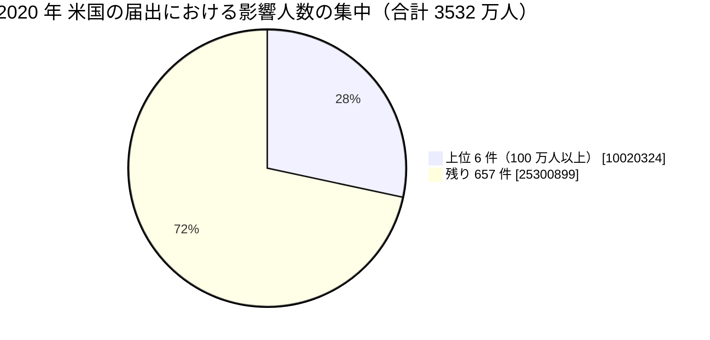

# 🇺🇸 2020 年 米国 HHS OCR 届出の全件集計

米国保健福祉省公民権局（HHS OCR）の侵害報告ポータルから 2020 年に届け出られた全件を取得し、集計した結果である。
[海外の履歴](2020-timeline.md)が個別の事例を扱うのに対し、本ページは米国の届出制度が捉えた全体の形を示す。

> [!NOTE]
> **集計の時点**：2026 年 8 月 26 日に取得した。
> ポータルの数値は精査によって改訂されるため、同じ条件で後日取得しても一致しない。
> 引用するときは集計の時点を併記してほしい。
> 取得の手順は [2025 年の集計ページ](2025-us-hhs.md#取得の手順)にまとめている。

## 何を数えているか

HHS OCR のポータルは、500 人以上に影響した侵害の届出を掲載する。
数えているのは**届出の件数**であり、発生した被害の件数ではない。

- **届出日であって発生日ではない**：侵入が前年でも、人数が確定した年に届け出られる。本ページの 2020 年は「2020 年に届け出られたもの」を指す
- **500 人未満は載らない**：小規模な診療所の侵害は集計に現れない
- **米国だけの制度である**：他国に同等の公開ポータルはなく、国ごとの比較には使えない
- **初報の人数が残る**：精査で人数が増えても、ポータルの表示が追随しない場合がある

## 全体

| 項目 | 値 |
|---|---|
| 届出件数 | **663 件** |
| 影響人数の合計 | **3532 万 1223 人** |
| 1 件あたりの中央値 | 4538 人 |
| 1 件あたりの平均 | 5 万 3274 人 |

影響人数のしきい値ごとの分布は次のとおりである。

| しきい値 | 件数 | 影響人数の合計 |
|---|---|---|
| 500 人以上（全件） | 663 | 3532 万 1223 |
| 1 万人以上 | 252 | 3420 万 3892 |
| 5 万人以上 | 134 | 3139 万 6192 |
| 10 万人以上 | 75 | 2724 万 0083 |
| 50 万人以上 | 11 | 1358 万 4217 |
| 100 万人以上 | 6 | 1002 万 0324 |

**分析**：全 663 件のうち上位 6 件で、影響人数の 28% を占める。
中央値は 4538 人であり、届出の半数は数千人規模である。
件数で見た医療分野の侵害は中小規模の組織に広く分布し、人数で見ると少数の大規模な事案に集中する。

## 侵害の類型

| 類型 | 件数 | 影響人数の合計 |
|---|---|---|
| ハッキング、IT インシデント | 457 | 3263 万 9406 |
| 不正なアクセス、開示 | 139 | 122 万 2175 |
| 盗難 | 39 | 82 万 0113 |
| 不適切な廃棄 | 15 | 58 万 4479 |
| 紛失 | 13 | 5 万 5050 |

**分析**：件数の 69%、人数の 92% が「ハッキング、IT インシデント」である。
一方で、盗難、不適切な廃棄、紛失を合わせた 67 件は、攻撃者を伴わない事案である。
本事例集の[副分類](../README.md#事案の類型)にあたる類型が、届出の 1 割を占めている。

## 対象組織の区分

| 区分 | 件数 | 影響人数の合計 |
|---|---|---|
| 医療提供者 | 514 | 1869 万 4544 |
| 事業提携者 | 74 | 1264 万 2020 |
| 医療保険 | 73 | 393 万 8427 |
| 情報処理機関 | 2 | 4 万 6232 |

**分析**：件数では医療提供者が 78% を占めるが、人数では 53% に下がる。
事業提携者（business associate）は件数が 74 件と全体の 11% でありながら、人数の 36% を占める。
1 件あたりの平均は、医療提供者が 3 万 6371 人、事業提携者が 17 万 0838 人で、約 4.7 倍の差がある。

## 侵害された場所

| 場所 | 件数 |
|---|---|
| ネットワークサーバ | 238 |
| 電子メール | 223 |
| 紙、フィルム | 86 |
| 電子診療記録 | 25 |
| ネットワークサーバ、その他 | 17 |
| 電子メール、ネットワークサーバ | 15 |
| その他 | 11 |
| ノート PC | 9 |

**分析**：電子メールが 223 件で、ネットワークサーバの 238 件に迫る。
2020 年の米国では、ランサムウェアと同じ規模でメールアカウントの侵害が起きていた。
紙とフィルムも 86 件あり、電子化の進んだ組織でも紙の記録が残っていることを示す。

## 届出元の州（上位 10）

| 州 | 件数 |
|---|---|
| カリフォルニア（CA） | 53 |
| ニューヨーク（NY） | 52 |
| フロリダ（FL） | 44 |
| テキサス（TX） | 44 |
| ペンシルベニア（PA） | 40 |
| オハイオ（OH） | 27 |
| アイオワ（IA） | 26 |
| ミシガン（MI） | 22 |
| ミネソタ（MN） | 21 |
| イリノイ（IL） | 20 |

## 届出の月別分布

| 月 | 件数 |
|---|---|
| 1 月 | 49 |
| 2 月 | 47 |
| 3 月 | 42 |
| 4 月 | 41 |
| 5 月 | 32 |
| 6 月 | 59 |
| 7 月 | 42 |
| 8 月 | 39 |
| 9 月 | 107 |
| 10 月 | 82 |
| 11 月 | 53 |
| 12 月 | 70 |

**分析**：9 月の 107 件が突出している。
届出は侵害の把握から 60 日以内に行われるため、9 月の届出の多くは 7 月から 8 月の把握に対応する。
[Blackbaud の侵害](2020-timeline.md#GL-2020-21)は 7 月 16 日に顧客へ通知されており、その後の 2 か月に医療機関の届出が集中した。
制度の締切が、届出の分布に山を作る。

## 影響人数の上位 50 件

50 位の影響人数は 16 万 6077 人である。

| 順位 | 影響人数 | 届出日 | 州 | 区分 | 類型 | 場所 | 組織 |
|---|---|---|---|---|---|---|---|
| 1 | 3,320,726 | 09/14/2020 | MI | 事業提携者 | ハッキング、IT インシデント | ネットワークサーバ | Trinity Health |
| 2 | 1,723,375 | 12/08/2020 | FL | 事業提携者 | ハッキング、IT インシデント | ネットワークサーバ | Dental Care Alliance, LLC |
| 3 | 1,474,000 | 09/28/2020 | OH | 事業提携者 | ハッキング、IT インシデント | 電子メール | EyeMed Vision Care LLC |
| 4 | 1,442,997 | 12/16/2020 | FL | 事業提携者 | ハッキング、IT インシデント | 電子メール | MEDNAX Services, Inc. |
| 5 | 1,045,270 | 09/09/2020 | VA | 医療提供者 | ハッキング、IT インシデント | ネットワークサーバ | Inova Health System |
| 6 | 1,013,956 | 06/12/2020 | AZ | 医療保険 | ハッキング、IT インシデント | 電子メール | Magellan Health Inc. |
| 7 | 878,550 | 11/25/2020 | MD | 事業提携者 | ハッキング、IT インシデント | 電子メール | US Fertility LLC |
| 8 | 829,454 | 10/27/2020 | OH | 事業提携者 | ハッキング、IT インシデント | ネットワークサーバ | Luxottica of America Inc. |
| 9 | 654,362 | 02/05/2020 | OR | 医療保険 | 盗難 | ノート PC | Health Share of Oregon |
| 10 | 651,527 | 07/01/2020 | FL | 医療提供者 | ハッキング、IT インシデント | ネットワークサーバ | Florida Orthopaedic Institute |
| 11 | 550,000 | 05/28/2020 | IN | 医療提供者 | 不適切な廃棄 | 紙、フィルム | Elkhart Emergency Physicians, Inc . |
| 12 | 484,157 | 12/22/2020 | CT | 医療保険 | ハッキング、IT インシデント | 電子メール | Aetna ACE |
| 13 | 447,354 | 06/26/2020 | TX | 事業提携者 | ハッキング、IT インシデント | ネットワークサーバ | Benefit Recovery Specialists, Inc. |
| 14 | 418,842 | 12/21/2020 | CA | 医療保険 | ハッキング、IT インシデント | 電子メール | Health Plan of San Joaquin |
| 15 | 360,212 | 08/20/2020 | MO | 医療提供者 | ハッキング、IT インシデント | ネットワークサーバ | Saint Luke's Foundation |
| 16 | 353,616 | 10/09/2020 | PA | 医療提供者 | ハッキング、IT インシデント | 電子メール | Einstein Healthcare Network |
| 17 | 348,746 | 09/04/2020 | IL | 医療提供者 | ハッキング、IT インシデント | ネットワークサーバ | NorthShore University HealthSystem |
| 18 | 343,493 | 09/10/2020 | CO | 医療提供者 | ハッキング、IT インシデント | ネットワークサーバ | SCL Health – Colorado |
| 19 | 315,337 | 10/20/2020 | FL | 医療提供者 | ハッキング、IT インシデント | ネットワークサーバ | AdventHealth |
| 20 | 314,829 | 09/15/2020 | NY | 医療提供者 | ハッキング、IT インシデント | ネットワークサーバ | Nuvance Health |
| 21 | 314,704 | 06/12/2020 | AZ | 事業提携者 | ハッキング、IT インシデント | 電子メール、ネットワークサーバ | Magellan Rx Management |
| 22 | 310,666 | 03/30/2020 | MN | 医療提供者 | ハッキング、IT インシデント | 電子メール | University of Minnesota Physicians |
| 23 | 308,169 | 09/02/2020 | LA | 医療提供者 | ハッキング、IT インシデント | デスクトップ PC、電子メール、ネットワークサーバ | The  Baton Rouge Clinic, A Medical Corporation |
| 24 | 304,399 | 08/03/2020 | ME | 事業提携者 | ハッキング、IT インシデント | ネットワークサーバ、その他 | Northern Light Health |
| 25 | 299,507 | 12/03/2020 | PA | 医療提供者 | ハッキング、IT インシデント | ネットワークサーバ | Allegheny Health Network |
| 26 | 298,532 | 03/11/2020 | NY | 医療提供者 | ハッキング、IT インシデント | ネットワークサーバ | Northeast Radiology |
| 27 | 295,617 | 11/19/2020 | CO | 医療提供者 | ハッキング、IT インシデント | ネットワークサーバ | AspenPointe, Inc. |
| 28 | 287,876 | 05/05/2020 | MO | 事業提携者 | ハッキング、IT インシデント | 電子メール | BJC Health System |
| 29 | 261,054 | 12/03/2020 | IL | 医療提供者 | ハッキング、IT インシデント | ネットワークサーバ | AMITA Health |
| 30 | 254,786 | 10/02/2020 | OH | 医療提供者 | 不正なアクセス、開示 | 電子メール | Premier Health Partners |
| 31 | 244,813 | 08/27/2020 | AZ | 医療提供者 | ハッキング、IT インシデント | ネットワークサーバ | Assured Imaging |
| 32 | 244,761 | 09/08/2020 | WA | 医療提供者 | ハッキング、IT インシデント | ネットワークサーバ | Virginia Mason Medical Center |
| 33 | 234,954 | 09/14/2020 | TN | 医療提供者 | ハッキング、IT インシデント | ネットワークサーバ | University of Tennessee Medical Center |
| 34 | 233,835 | 04/17/2020 | CA | 医療提供者 | ハッキング、IT インシデント | 電子メール | Good Samaritan Hospital, Inc. |
| 35 | 233,543 | 06/01/2020 | PA | 医療保険 | ハッキング、IT インシデント | 電子メール | City of Philadelphia |
| 36 | 228,009 | 09/25/2020 | TX | 医療提供者 | ハッキング、IT インシデント | 電子メール | Legacy Community Health Services |
| 37 | 225,370 | 03/22/2020 | CA | 医療提供者 | ハッキング、IT インシデント | 電子メール | Ambry Genetics Corporation |
| 38 | 216,472 | 11/23/2020 | NE | 医療提供者 | ハッキング、IT インシデント | ネットワークサーバ | The Nebraska Medical Center and University of Nebraska Medical Center, Affiliated Covered Entities |
| 39 | 199,548 | 01/10/2020 | CA | 医療提供者 | ハッキング、IT インシデント | 電子メール | PIH Health |
| 40 | 199,389 | 09/11/2020 | MN | 医療提供者 | ハッキング、IT インシデント | ネットワークサーバ | Allina Health |
| 41 | 193,223 | 10/02/2020 | NM | 医療提供者 | ハッキング、IT インシデント | その他 | Presbyterian Healthcare Services |
| 42 | 189,736 | 09/17/2020 | MO | 医療提供者 | ハッキング、IT インシデント | 電子メール | University of Missouri Health Care |
| 43 | 183,265 | 09/14/2020 | OH | 医療提供者 | ハッキング、IT インシデント | ネットワークサーバ | The Christ Hospital Health Network |
| 44 | 179,189 | 08/22/2020 | WA | 医療提供者 | ハッキング、IT インシデント | ネットワークサーバ | MultiCare Health System |
| 45 | 177,023 | 08/14/2020 | PA | 医療提供者 | ハッキング、IT インシデント | ネットワークサーバ | Prospect Medical Holdings (Crozer-Keystone Health System) |
| 46 | 176,587 | 11/05/2020 | MA | 医療提供者 | ハッキング、IT インシデント | ネットワークサーバ | Lawrence General Hospital |
| 47 | 175,191 | 09/14/2020 | NY | 医療提供者 | ハッキング、IT インシデント | ネットワークサーバ | Stony Brook University Hospital |
| 48 | 170,000 | 02/16/2020 | NY | 事業提携者 | ハッキング、IT インシデント | ネットワークサーバ | BST & Co. CPAs, LLP |
| 49 | 167,095 | 02/06/2020 | CA | 医療保険 | 不正なアクセス、開示 | 紙、フィルム | Kaiser Health Plan, Southern California |
| 50 | 166,077 | 02/14/2020 | GA | 医療提供者 | ハッキング、IT インシデント | 電子メール | Aveanna Healthcare |

**分析**：上位 50 件のうち、本事例集が個別の事例として扱っているのは 10 件前後である。
残りは、当事者の公表が届出以上の情報を含まないため、経緯を書く材料がない。
届出制度は件数と人数を捉えるが、侵入経路と診療への影響は捉えない。
この二つを別の情報源で埋めない限り、他組織が自分の構成と照らし合わせる材料にはならない。

上位に並ぶ組織のうち、Trinity Health、Inova Health System、Saint Luke's Foundation、NorthShore University HealthSystem、SCL Health、Nuvance Health、Northern Light Health、Allegheny Health Network、MultiCare Health System は、いずれも[寄付管理ソフトウェアの侵害](2020-timeline.md#GL-2020-21)を起点とする。
1 社の侵害が、届出の上位を占める形で制度に現れている。

## 全件を本ページに載せない理由

ポータルの数値は精査によって改訂され、届出の追加も続く。
静的な複製を置くと、参照した人が古い数値を引く。
本ページは集計と上位 50 件に留め、全件は[取得の手順](2025-us-hhs.md#取得の手順)とともに読み手が自分で取り直せるようにしている。

---

[← 海外の事例](README.md) | [2020 年の履歴](2020-timeline.md) | [2020 年の情勢](../years/2020-summary.md) | [トップへ](../../../../README.md)
