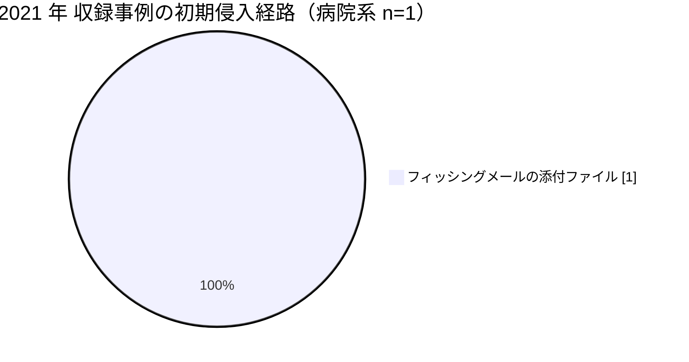

# 🌍 海外の事例 2021 年（サマリー）

> [!NOTE]
> 本ページの集計は、断りのない限り**本リポジトリに収録した事例**を母集団とする。
> 世界で発生した被害の全数ではない。
> 個別の経緯は [2021 年の履歴](2021-timeline.md) を参照してほしい。

## その年の要点

**分析**：国家規模の保健サービスが停止し、その事後レビューが公開された年である。
[GL-2021-01 HSE](2021-timeline.md#GL-2021-01)の Post Incident Review は、暗号化に至るまでの数か月の潜伏期間に検知の機会が複数回あったことを示した。
被害の規模を決めたのは攻撃の高度さではなく、資産管理、ログ、CISO 機能という体制側の欠落だった。

## 外部統計

| 統計 | 参照先 | 本リポジトリでの集計状況 |
|---|---|---|
| 米国の医療情報侵害の届出（500 人以上） | [HHS OCR Breach Portal](https://ocrportal.hhs.gov/ocr/breach/breach_report.jsf) | 未集計 |
| 欧州の医療分野の脅威動向 | [ENISA Health Threat Landscape](https://www.enisa.europa.eu/) | 未集計 |

数値は原典を確認したうえで追記する。

## 収録事例の集計

### 区分別の件数

| 区分 | 件数 | 内訳 |
|---|---|---|
| 病院系 | 1 | 国家保健サービス 1（アイルランド） |
| 製薬企業系 | 0 | 収録なし |
| 医療関連事業者 | 0 | 収録なし |

### 初期侵入経路の内訳（病院系）

## この年を象徴する事例

- [GL-2021-01 HSE](2021-timeline.md#GL-2021-01)：潜伏期間中の検知機会を、事後レビューが具体的に列挙した事例

## 前年との差分

**分析**：2020 年の 3 件が被害の型を示したのに対し、2021 年の 1 件は防御側の失敗の内訳を示した。
同じ年、国内では[半田病院](../japan/2021-timeline.md#JP-2021-01)が調査報告書を公表している。
医療機関が経緯を公開する動きが、国内外で同時期に始まった。

---

[← 2020 年サマリー](2020-summary.md) | [2021 年の履歴](2021-timeline.md) | [海外の事例](README.md) | [2022 年サマリー →](2022-summary.md) | [トップへ](../../../../README.md)
