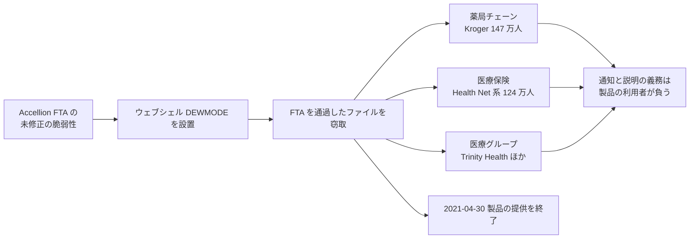

# 🌍 海外の事例 2021 年（履歴）

> [!NOTE]
> **表記ルール**：本ページでは、**事実**（一次情報で確認できる内容。出典を併記する）、**報道ベース**（報道や第三者の集計のみで確認でき、当事者の公表資料では裏付けが取れていない内容）、**分析**（筆者の解釈）を書き分ける。
> [対象の区分](../README.md#対象の区分)と[一次情報の強度](../README.md#一次情報の強度)の定義は、インシデント事例集のトップにまとめている。
> その年の情勢と集計は [2021 年の情勢](../years/2021-summary.md) にまとめている。

## 収録件数

| 区分 | サイバー攻撃 | その他の事案 |
|---|---|---|
| 病院系 | 19 | 1 |
| 製薬企業系 | 0 | 0 |
| 医療関連事業者 | 9 | 0 |

収録は本リポジトリが一次情報を確認できた事案に限る。
海外で公表された医療関連の事案がこれで尽きることを示すものではない。
米国の件数は、保健福祉省公民権局（HHS OCR）の侵害報告ポータルに届け出られた影響人数を典拠とする。
2021 年に同ポータルへ届け出られた全 715 件の集計は、[2021 年 米国 HHS OCR 届出の全件集計](2021-us-hhs.md)にまとめている。

---

## 病院系

| ID | 発生時期 | 組織、国 | 種別 | 初期侵入経路 | 診療への影響 | 業務停止期間 | 一次情報の強度 |
|---|---|---|---|---|---|---|---|
| [GL-2021-02](#GL-2021-02) | 2021-02 | Centre Hospitalier de Dax（仏、ランド県） | ランサムウェア（Ryuk） | 未公表 | 病院情報システムが全面停止。紙運用へ | 通常の運用に戻るまで **約 1 年半**。総費用 230 万ユーロ | 当事者公表 |
| [GL-2021-03](#GL-2021-03) | 2021-02 | Hôpital Nord-Ouest de Villefranche-sur-Saône（仏、ローヌ県） | ランサムウェア（Ryuk） | 未公表 | 手術の中止、救急患者の転送 | 情報システムの停止（期間は未公表） | 報道のみ |
| [GL-2021-04](#GL-2021-04) | 2021-04 | UnitingCare Queensland（豪、病院と高齢者ケア） | ランサムウェア（REvil） | 未公表 | 中核システムが停止し、紙と手作業へ | 主要システムの復旧まで **約 2 か月**。身代金を支払い | 当事者公表 |
| [GL-2021-05](#GL-2021-05) | 2021-05 | Scripps Health（米、カリフォルニア州） | ランサムウェア | 未公表 | 電子カルテの停止、救急搬送の転送 | 電子カルテと患者ポータルの復旧まで **約 4 週間**（05-01 から 05-27）。逸失利益と費用は 1 億 1270 万ドル | 当事者公表 |
| [GL-2021-01](#GL-2021-01) | 2021-05 | Health Service Executive（アイルランド、国家保健サービス） | ランサムウェア（Conti） | フィッシングメールの添付ファイル | 全国規模で IT システムが停止 | サーバ 100%、アプリ 99% の復旧まで **約 4 か月**（05-14 から 09-21） | 報告書 |
| [GL-2021-07](#GL-2021-07) | 2021-05 | アイルランド保健省（Department of Health） | ランサムウェア（Conti） | 未公表 | 省内の情報システムを停止 | 情報システムの停止（期間は未公表） | 当事者公表 |
| [GL-2021-08](#GL-2021-08) | 2021-05 | UF Health Central Florida（米、2 病院） | ランサムウェア | 未公表 | 電子カルテを停止し、紙運用へ | 電子カルテの停止が **約 1 か月** | 当事者公表 |
| [GL-2021-17](#GL-2021-17) | 2021-05 | Forefront Dermatology（米、ウィスコンシン州ほか） | 不正アクセス | 未公表 | 公表なし | 診療の停止は公表されていない | 当事者公表 |
| [GL-2021-06](#GL-2021-06) | 2021-05 | Waikato District Health Board（NZ、5 病院） | ランサムウェア | 未公表 | 予定手術と外来の中止、放射線治療の他院への振替 | 主要システムの復旧まで **約 2 か月**。完全復旧はさらに後 | 報告書 |
| [GL-2021-09](#GL-2021-09) | 2021-06 | University Medical Center of Southern Nevada（米、ネバダ州） | データ侵害と恐喝（REvil） | 未公表 | 診療は継続 | **診療の停止なし** | 当事者公表 |
| [GL-2021-10](#GL-2021-10) | 2021-08 | Regione Lazio（伊、ラツィオ州保健部門） | ランサムウェア | 職員の端末を経由した侵入（報道ベース） | COVID-19 ワクチンの予約受付が停止 | 予約の再開まで **3 日**（08-02 から 08-05、別サイトで再開） | 当事者公表 |
| [GL-2021-11](#GL-2021-11) | 2021-08 | St. Joseph's/Candler Health System（米、ジョージア州） | ランサムウェア | 未公表 | 紙運用へ切り替え | 情報システムの停止が **数週間** | 当事者公表 |
| [GL-2021-12](#GL-2021-12) | 2021-08 | Memorial Health System（米、オハイオ州） | ランサムウェア（Hive） | 未公表 | 緊急手術と放射線の予約を中止。救急搬送を転送 | 情報システムの停止が **数日**。身代金の支払いが示唆された | 当事者公表 |
| [GL-2021-13](#GL-2021-13) | 2021-08 | Eskenazi Health（米、インディアナ州） | ランサムウェア（Hive） | 未公表 | 救急搬送を転送し、紙運用へ | 情報システムの停止が **約 2 週間** | 当事者公表 |
| [GL-2021-14](#GL-2021-14) | 2021-10 | Hillel Yaffe Medical Center（イスラエル、ハデラ） | ランサムウェア（DeepBlueMagic） | 未公表 | 予定手術を延期し、代替の手順で診療を継続 | 情報システムの停止が **数週間** | 当事者公表 |
| [GL-2021-15](#GL-2021-15) | 2021-10 | ニューファンドランド・ラブラドール州の保健システム（加） | ランサムウェア（Hive） | 盗まれた認証情報による VPN 接続 | 州全域で予約と検査を中止。化学療法も延期 | 州全域の情報システム障害が **数週間**。復旧は数か月 | 報告書 |
| [GL-2021-16](#GL-2021-16) | 2021-10 | Broward Health（米、フロリダ州） | 不正アクセス | 委託先の医療提供者に許可した接続 | 公表なし | 診療の停止は公表されていない | 当事者公表 |
| [GL-2021-28](#GL-2021-28) | 2021-10 | Planned Parenthood Los Angeles（米、カリフォルニア州） | ランサムウェア | 未公表 | 公表なし | 情報システムを一時的に停止 | 当事者公表 |
| [GL-2021-18](#GL-2021-18) | 2021-12 | ブラジル保健省（ConecteSUS） | データ窃取と破壊（Lapsus$） | 未公表 | ワクチン接種証明の発行が停止 | 接種証明の発行停止が **数日から数週間** | 当事者公表 |

### GL-2021-02 Centre Hospitalier de Dax（2021 年 2 月、フランス）

**事実**

- 発生時期：2021 年 2 月 9 日 0 時 11 分から、複数のサーバへ同時に展開が始まり、2 月 10 日に病院情報システムが全面的に使用不能になった。
- 対象組織：フランス南西部ランド県ダックスの公立病院。
- 攻撃種別：ランサムウェア（Ryuk）。
- 初期侵入経路：未公表。
- 侵害範囲：病院情報システム全般。
- 診療への影響：紙による運用へ切り替えた。
- 業務停止期間：通常の運用に戻るまで **約 1 年半**を要した。
- 費用：**230 万ユーロ**。

**分析**

- 復旧に 1 年半を要した点が、この事例の中心にある。攻撃の当日に測れる停止時間と、組織が元の生産性に戻るまでの時間は、桁が違うことがある。
- 費用 230 万ユーロは、公立病院の年間の情報システム予算を大きく超える規模である。復旧の原資を平時にどこから確保するかは、技術ではなく予算の問題になる（[予算とコスト](../../../governance/cost.md)）。
- 同じ月に、ヴィルフランシュ・シュル・ソーヌの病院も Ryuk の攻撃を受けた。フランス政府はこれを受けて、2021 年 2 月に医療分野のサイバーセキュリティ強化策と 3 億 5000 万ユーロの投資方針を打ち出した。

**一次情報**

- [Centre Hospitalier de Dax](https://www.ch-dax.fr/)
- [Cyberveille du CERT Santé](https://cyberveille.esante.gouv.fr/)（フランス保健分野 CERT）

---

### GL-2021-03 Hôpital Nord-Ouest de Villefranche-sur-Saône（2021 年 2 月、フランス）

**報道ベース**

- 発生時期：2021 年 2 月 15 日。
- 対象組織：ローヌ県ヴィルフランシュ・シュル・ソーヌの公立病院。
- 攻撃種別：ランサムウェア（Ryuk）。
- 初期侵入経路：未公表。
- 診療への影響：手術を中止し、救急を要する患者を他院へ回した。
- 業務停止期間：公表されていない。

**分析**

- ダックスの被害から 5 日後に、別の地域の公立病院が同じ系統の攻撃を受けた。フランスでは、この 2 件が医療分野のサイバーセキュリティ政策の起点になった。

**一次情報**

- [Cyberveille du CERT Santé](https://cyberveille.esante.gouv.fr/)（フランス保健分野 CERT）

---

### GL-2021-04 UnitingCare Queensland（2021 年 4 月、オーストラリア）

**事実**

- 発生時期：2021 年 4 月 25 日。翌 26 日に公表した。
- 対象組織：クイーンズランド州で病院と高齢者ケア施設を運営する非営利事業体。
- 攻撃種別：ランサムウェア。
- 攻撃グループ：Sodinokibi（REvil）であることを同事業体が確認した。
- 初期侵入経路：未公表。
- 侵害範囲：中核となる情報システムの広範囲。
- 診療への影響：紙と手作業への切り替えで運用を続けた。同事業体は、患者の健康が損なわれた形跡はないと説明した。
- 業務停止期間：主要システムの復旧まで **約 2 か月**を要した。
- 身代金：**支払った**。要求額よりは低い金額であったが、数十万ドル規模とされる。復号鍵の入手と、窃取されたファイルの削除の確約を目的とした。

**分析**

- 身代金を支払ってもなお、主要システムの復旧に約 2 か月を要した。支払いが復旧の期間を短縮するという想定は、この事例でも成り立っていない。
- 病院と高齢者ケアを同じ基盤で運用していた。高齢者ケア施設は情報システム部門を持たないことが多く、統合基盤に乗せることで運用が成り立つ一方、停止したときの代替手段も失われる。

**一次情報**

- [UnitingCare Queensland](https://www.unitingcareqld.com.au/)
- [Australian Cyber Security Centre](https://www.cyber.gov.au/)

---

### GL-2021-05 Scripps Health（2021 年 5 月、米国）

**事実**

- 発生時期：2021 年 5 月 1 日。
- 対象組織：カリフォルニア州サンディエゴで 5 病院と多数の外来施設を運営する医療グループ。
- 攻撃種別：ランサムウェア。
- 初期侵入経路：未公表。
- 侵害範囲：情報システム全般。電子カルテ（Epic）と患者ポータルを停止した。
- 情報流出：2021 年 6 月の通知は **14 万 7267 人**を対象としたが、書面の精査を経た 2022 年 3 月の追加通知のあと、HHS OCR の掲載は **126 万 7639 人**（届出 2021 年 6 月 1 日）となっている。氏名、住所、生年月日、健康保険情報、診療記録番号、臨床情報が対象になり、一部に社会保障番号と運転免許証番号が含まれた。
- 診療への影響：救急搬送の一部を他院へ回し、予定されていた処置を延期した。
- 業務停止期間：電子カルテと患者ポータルの復旧は 5 月 27 日で、**約 4 週間**にあたる。
- 被害額：**1 億 1270 万ドル**。内訳は逸失利益が約 9160 万ドル、追加費用が約 2110 万ドルである。

**分析**

- 被害額の内訳が逸失利益と追加費用に分けて公表されている。復旧費用より逸失利益のほうが 4 倍以上大きい。事業継続計画の投資判断では、復旧を早める効果を逸失利益の減少で測るほうが実態に合う。
- 第一報で 14 万 7267 人とされた対象は、書面の精査を経て 126 万 7639 人へ 8 倍以上に増えた。暗号化された環境で「誰の情報が入っていたか」を確定する作業には時間がかかる。第一報の人数は下限として読む必要がある。
- 停止時間と漏えい規模は独立した指標である。片方だけを見て被害の大小を語ると、対策の優先順位を誤る。

**一次情報**

- [Scripps Health](https://www.scripps.org/)
- [HHS OCR 侵害報告ポータル](https://ocrportal.hhs.gov/ocr/breach/breach_report.jsf)

---

### GL-2021-01 Health Service Executive（2021 年 5 月、アイルランド）

**事実**

以下は、HSE が 2021 年 12 月に公表した独立事後レビュー（Independent Post Incident Review）による。

- 発生時期：2021 年 5 月 14 日に全国規模で IT システムが停止した。初期侵入は 3 月 18 日で、暗号化まで約 8 週間の潜伏があった。
- 対象組織：アイルランドの国家保健サービス。
- 攻撃種別：ランサムウェア（Conti）。
- 初期侵入経路：フィッシングメールの添付ファイル（悪意ある Excel）。
- 侵害範囲：全国の急性期病院、地域サービス、業務系システム。
- 診療への影響：紙による運用へ切り替え、優先順位を下げた予約を延期した。
- 業務停止期間：最初の 1 か月でサーバの半数近くを復号し、急性期、地域サービス、業務系のアプリケーションを順次復旧させた。9 月にはサーバと端末の 95% が復旧している。
- 完全復旧：2021 年 9 月 21 日にサーバの 100%、アプリケーションの 99% が復旧した。暗号化から **約 4 か月**にあたる。
- 身代金：**支払わなかった**。攻撃グループは支払いを受けずに復号鍵を提供しており、これが復旧を早めた。
- 公表された対策：外部機関による事後レビューを 2021 年 12 月に公表した。ガバナンス、体制、技術対策の不足が整理されている。

**分析**

- 暗号化は攻撃の最終段階であり、その前に数週間から数か月の潜伏期間がある。検知の機会が複数回あったという指摘が、HSE レビューの中心にある。
- CISO 機能の不在、資産管理の不備、ログの欠如といった基礎的な体制の問題が、被害規模を決定づけた。体制側の論点は [経営とガバナンス](../../../governance/) に整理している。
- 復号鍵を無償で得たうえで、なお完全復旧に約 4 か月かかった。復号鍵があれば早く戻れるという想定は成り立たない。鍵の入手は復旧作業の出発点であり、検証と再構築の工程がそのあとに残る（[事業継続](../../../response/bcp-cyber.md)）。
- レビュー報告書は、医療機関のインシデント対応を学ぶうえで、国内外を通じて参照価値が最も高い公開文書の一つである。同じ水準の記録は、国内では[半田病院](../japan/2021-timeline.md#JP-2021-01)と[大阪急性期・総合医療センター](../japan/2022-timeline.md#JP-2022-01)にある。

**一次情報**

- [Conti Cyber Attack on the HSE, Independent Post Incident Review](https://about.hse.ie/publications/conti-cyber-attack-on-the-hse-independent-post-incident-review/)（Health Service Executive、2021 年 12 月）

---

### GL-2021-07 アイルランド保健省（2021 年 5 月、アイルランド）

**事実**

- 発生時期：2021 年 5 月中旬。[HSE](#GL-2021-01) の被害と同時期にあたる。
- 対象組織：アイルランド保健省。
- 攻撃種別：ランサムウェア（Conti）。
- 初期侵入経路：未公表。
- 侵害範囲：省内の情報システム。暗号化の展開は途中で止められたと説明された。
- 診療への影響：直接の診療提供は行っていない。
- 業務停止期間：予防的にシステムを停止した。期間は公表されていない。

**分析**

- 保健行政と医療提供の双方が同じ時期に同じ系統の攻撃を受けた。制度の運用側が止まると、届出、指示、資源配分の経路が同時に失われる。危機対応の指揮系統を、被害を受けた基盤の外に用意しておく必要がある。

**一次情報**

- [Department of Health（Ireland）](https://www.gov.ie/en/organisation/department-of-health/)
- [National Cyber Security Centre（Ireland）](https://www.ncsc.gov.ie/)

---

### GL-2021-08 UF Health Central Florida（2021 年 5 月、米国）

**事実**

- 発生時期：2021 年 5 月 31 日。
- 対象組織：フロリダ州の 2 病院（The Villages Regional Hospital、Leesburg Hospital）。
- 攻撃種別：ランサムウェア。
- 初期侵入経路：未公表。
- 侵害範囲：氏名、生年月日、住所、社会保障番号、診療記録番号、健康保険情報、診療情報。
- 情報流出：70 万 0934 人（HHS OCR への届出、2021 年 7 月 30 日）。
- 診療への影響：電子カルテを停止し、紙による運用へ切り替えた。
- 業務停止期間：電子カルテの停止が約 1 か月続いた。
- 身代金：支払わなかったと説明した。

**分析**

- 紙運用が 1 か月続いた。この長さになると、停止中に発生した記録を復旧後の電子カルテへ入力し直す作業が、復旧そのものと同じ規模の負荷になる。国内の[大阪急性期・総合医療センター](../japan/2022-timeline.md#JP-2022-01)でも、同じ工程が復旧期間を押し上げている。

**一次情報**

- [UF Health](https://ufhealth.org/)
- [HHS OCR 侵害報告ポータル](https://ocrportal.hhs.gov/ocr/breach/breach_report.jsf)

---

### GL-2021-17 Forefront Dermatology（2021 年 5 月、米国）

**事実**

- 発生時期：2021 年 5 月 28 日から 6 月 4 日にかけて侵入されていた。
- 対象組織：ウィスコンシン州を拠点に、全米で皮膚科の診療所を運営するグループ。
- 攻撃種別：不正アクセス。
- 初期侵入経路：未公表。
- 侵害範囲：氏名、生年月日、診療記録番号、健康保険情報、診療情報を含むファイル。
- 情報流出：241 万 3553 人（HHS OCR への届出、2021 年 7 月 8 日）。
- 診療への影響：診療の停止は公表されていない。
- 公表された対策：外部の専門家による調査を行い、対象者へ通知した。

**分析**

- 1 週間の侵入で 241 万人分が対象になった。単科の診療所チェーンは、1 施設あたりの規模が小さくても、統合された記録の総量が大きい。
- 皮膚科は画像を伴う記録を多く保持する。漏えい対象の評価では、件数だけでなく記録の形式も見る必要がある。

**一次情報**

- [Forefront Dermatology](https://forefrontdermatology.com/)
- [HHS OCR 侵害報告ポータル](https://ocrportal.hhs.gov/ocr/breach/breach_report.jsf)

---

### GL-2021-09 University Medical Center of Southern Nevada（2021 年 6 月、米国）

**事実**

- 発生時期：2021 年 6 月 14 日に不審な活動を検知した。
- 対象組織：ネバダ州ラスベガスの公立病院。同州唯一の第 1 種外傷センターを持つ。
- 攻撃種別：データ侵害と恐喝。
- 攻撃グループ：REvil が犯行を主張し、窃取した運転免許証とパスポートの画像を公開した。
- 初期侵入経路：未公表。
- 侵害範囲：氏名、社会保障番号、生年月日、住所、臨床情報、身分証明書の画像。
- 情報流出：130 万人（HHS OCR への届出、2021 年 8 月 13 日）。
- 診療への影響：診療は継続した。
- 業務停止期間：**診療の停止なし**。

**分析**

- 暗号化を伴わず、窃取と公開だけで恐喝が成立している。攻撃者が公開したのは身分証明書の画像であり、患者本人が識別できる形で外部に出た。
- 診療が止まっていないため、事業継続の観点では被害が見えにくい。恐喝への対応は、システム復旧の計画ではなく、通知と支援の計画で受け止めることになる。

**一次情報**

- [University Medical Center of Southern Nevada](https://www.umcsn.com/)
- [HHS OCR 侵害報告ポータル](https://ocrportal.hhs.gov/ocr/breach/breach_report.jsf)

---

### GL-2021-10 Regione Lazio（2021 年 8 月、イタリア）

**事実**

- 発生時期：2021 年 8 月 1 日から 2 日にかけて。
- 対象組織：イタリア・ラツィオ州（ローマを含む）の保健部門。
- 攻撃種別：ランサムウェア。
- 初期侵入経路：未公表。
- 侵害範囲：州のシステム上の多数のファイルが暗号化された。州は、健康データとワクチン接種記録は別のデータベースにあり侵害されていないと説明した。
- 診療への影響：COVID-19 ワクチンの予約受付が停止した。
- 業務停止期間：予約は 8 月 5 日に別のサイトで再開した。**3 日**にあたる。
- 身代金：具体的な要求は確認されていないと州は説明した。
- 公表された対策：州の全サーバを停止して拡大を防いだ。テロ関連の捜査が開始された。

**報道ベース**

- RansomEXX が用いられたとする報道が多いが、LockBit 2.0 の関与を指摘する分析もある。
- 侵入の起点は、開いたままになっていた州職員の端末であったと報じられた。

**分析**

- 止まったのはワクチンの予約受付である。診療そのものではなく、住民が医療へ到達する手前の入口が止まった。地域全体の接種計画が数日遅れる形で被害が現れた。
- 接種記録が別のデータベースにあったことで、漏えいの規模が抑えられた。予約系と記録系を分けておく設計が、結果として被害の範囲を限定している（[ネットワークの分離](../../../technology/segmentation.md)）。

**一次情報**

- [Regione Lazio](https://www.regione.lazio.it/)
- [Agenzia per la Cybersicurezza Nazionale](https://www.acn.gov.it/)

---

### GL-2021-11 St. Joseph's/Candler Health System（2021 年 8 月、米国）

**事実**

- 発生時期：2021 年 6 月 17 日に検知した。侵入は 6 月 14 日から始まっていた。
- 対象組織：ジョージア州サバンナの医療グループ。
- 攻撃種別：ランサムウェア。
- 初期侵入経路：未公表。
- 侵害範囲：氏名、住所、生年月日、社会保障番号、運転免許証番号、患者番号、健康保険情報、診療情報。
- 情報流出：140 万人（HHS OCR への届出、2021 年 8 月 10 日）。
- 診療への影響：紙による運用へ切り替えた。
- 業務停止期間：情報システムの停止が数週間続いた。

**分析**

- 検知から届出まで約 2 か月である。米国では 60 日以内の届出が求められるため、人数の確定より先に届出が行われることがある。数値が後年に改訂される背景がここにある。

**一次情報**

- [St. Joseph's/Candler](https://www.sjchs.org/)
- [HHS OCR 侵害報告ポータル](https://ocrportal.hhs.gov/ocr/breach/breach_report.jsf)

---

### GL-2021-12 Memorial Health System（2021 年 8 月、米国）

**事実**

- 発生時期：2021 年 8 月 14 日にランサムウェアが展開された。調査により、侵入は 7 月 10 日から始まっていたことが確認された。
- 対象組織：オハイオ州マリエッタの医療グループ。3 病院と診療所を運営する。
- 攻撃種別：ランサムウェア（Hive）。
- 初期侵入経路：未公表。
- 侵害範囲：氏名、社会保障番号、生年月日、診療情報。
- 情報流出：約 21 万 6500 人。
- 診療への影響：8 月 16 日に緊急手術と放射線の予約を中止し、救急搬送を他院へ回した。紙のカルテへ切り替えた。
- 業務停止期間：情報システムの停止が数日続いた。
- 身代金：同グループの発表は支払いを示唆する内容であったが、金額と支払いの有無は明示されていない。

**分析**

- 侵入から暗号化まで約 5 週間の潜伏があった。この期間に検知できていれば、診療の中止は起きていない。潜伏期間の長さは、検知の投資が診療の継続に直結することを示す。

**一次情報**

- [Memorial Health System](https://www.mhsystem.org/)
- [HHS OCR 侵害報告ポータル](https://ocrportal.hhs.gov/ocr/breach/breach_report.jsf)

---

### GL-2021-13 Eskenazi Health（2021 年 8 月、米国）

**事実**

- 発生時期：2021 年 8 月 4 日。
- 対象組織：インディアナ州インディアナポリスの公立医療グループ。
- 攻撃種別：ランサムウェア。攻撃グループ Hive が犯行を主張し、窃取したデータを公開した。
- 初期侵入経路：未公表。
- 侵害範囲：氏名、住所、生年月日、社会保障番号、運転免許証番号、診療記録番号、健康保険情報、診断と治療の情報。職員の情報も含まれた。
- 情報流出：151 万 5918 人（HHS OCR への届出、2021 年 10 月 1 日）。
- 診療への影響：救急搬送を他院へ回し、紙による運用へ切り替えた。
- 業務停止期間：情報システムの停止が約 2 週間続いた。
- 身代金：**支払わなかった**。攻撃グループは窃取したデータを公開した。

**分析**

- 支払いを拒んだ結果、データが公開された。公開は 150 万人規模に及び、支払いの判断が漏えいの有無を左右する構造が明確に現れている。
- この判断は技術部門では決められない。公的な医療機関では、支払いの可否をあらかじめ経営と設置者の水準で決めておく必要がある（[経営とガバナンス](../../../governance/)）。

**一次情報**

- [Eskenazi Health](https://www.eskenazihealth.edu/)
- [HHS OCR 侵害報告ポータル](https://ocrportal.hhs.gov/ocr/breach/breach_report.jsf)

---

### GL-2021-14 Hillel Yaffe Medical Center（2021 年 10 月、イスラエル）

**事実**

- 発生時期：2021 年 10 月 13 日。
- 対象組織：イスラエル・ハデラの公立病院。
- 攻撃種別：ランサムウェア（DeepBlueMagic）。
- 初期侵入経路：未公表。
- 侵害範囲：病院の情報システム。
- 診療への影響：代替の手順で診療を継続し、緊急性の低い予定処置を延期した。
- 業務停止期間：情報システムの停止が数週間続いた。
- 身代金：公立病院として**支払いが認められていない**とイスラエル当局が説明した。
- 公表された対策：イスラエル国家サイバー総局が対応にあたり、同時期に他の医療機関への攻撃も防いだと発表した。

**分析**

- イスラエルで確認された医療機関へのランサムウェア被害として、公的に扱われた最初期の事例である。同国は本件を機に、医療分野への攻撃を国家的な脅威として扱う体制を強めた。
- 当局は動機を金銭目的と評価した。国家間の緊張が高い地域でも、医療機関に対する攻撃の多くは金銭目的の犯罪として実行される。攻撃の帰属を地政学から推測すると、対策の対象を誤る。

**一次情報**

- [Hillel Yaffe Medical Center](https://hy.health.gov.il/)
- [Israel National Cyber Directorate](https://www.gov.il/en/departments/israel_national_cyber_directorate)

---

### GL-2021-15 ニューファンドランド・ラブラドール州の保健システム（2021 年 10 月、カナダ）

**事実**

- 発生時期：2021 年 10 月 15 日に、盗まれた認証情報を用いた VPN 接続で侵入された。10 月 30 日にランサムウェアが展開された。
- 対象組織：ニューファンドランド・ラブラドール州保健情報センターと、州内の複数の保健当局。
- 攻撃種別：ランサムウェア（Hive）。
- 初期侵入経路：正規のアカウントから盗まれた認証情報による VPN 接続。
- 侵害範囲：州全域の情報システム。
- 情報流出：窃取されたのは 1996 年までさかのぼる記録であり、当初は州民の多くに及ぶ可能性が報じられた。その後の精査により、Eastern Health は 2022 年 11 月に、対象を患者 **約 5 万 8200 人**と現職または元職の職員 **280 人**と公表している。
- 診療への影響：予約、検査、画像診断を広く中止し、化学療法も延期された。
- 業務停止期間：州全域の情報システム障害が数週間続き、復旧は数か月に及んだ。
- 公表された対策：州政府が 2023 年 3 月に事案の概要を公表した。

**分析**

- 侵入から暗号化まで 15 日の間があった。この間に検知の機会があったことは、州の事後の検証でも指摘されている。
- 州全域の保健システムに対して、情報セキュリティの担当者が 3 名であったとする指摘がある。州単位で基盤を統合すると、統合された規模に見合う人員が要る。統合だけを先に進めると、単一障害点だけが残る。
- 認証情報の窃取と VPN の組み合わせは、国内の[半田病院](../japan/2021-timeline.md#JP-2021-01)と同じ型である。同じ年に、地球の反対側で同じ経路が使われている。

**一次情報**

- [Cyberattack on the Newfoundland and Labrador Health Care System Overview（PDF）](https://www.gov.nl.ca/hcs/files/OVERVIEW-NL-Health-Cyber-Incident-March-2023.pdf)（ニューファンドランド・ラブラドール州保健コミュニティサービス省、2023 年 3 月）

---

### GL-2021-16 Broward Health（2021 年 10 月、米国）

**事実**

- 発生時期：2021 年 10 月 15 日に侵入され、10 月 19 日に検知した。
- 対象組織：フロリダ州ブロワード郡の公立医療グループ。
- 攻撃種別：不正アクセス（データ窃取）。
- 初期侵入経路：同グループのネットワークへの接続を許可されていた第三者の医療提供者の経路。
- 侵害範囲：氏名、生年月日、住所、電話番号、金融口座情報、健康保険情報、診療記録番号、運転免許証番号、社会保障番号、病歴、診断と治療の情報。
- 情報流出：135 万 1431 人（HHS OCR への届出、2022 年 1 月 2 日）。
- 診療への影響：診療の停止は公表されていない。
- 公表された対策：多要素認証の適用範囲を広げ、外部との接続を扱う機器の管理を見直したと説明した。

**分析**

- 侵入経路が、自組織のネットワークへの接続を許可した第三者であった。委託先だけでなく、診療のために接続を認めた医療提供者も同じ経路になる。接続の棚卸しは、契約の種類ではなく到達可能性で行う必要がある（[攻撃面](../../../practice/attack-surface.md)）。
- 同グループは再発防止策として多要素認証の拡大を挙げている。接続を認めた相手側の認証水準を自組織が決められるかどうかが、実効性を左右する。

**一次情報**

- [Broward Health](https://www.browardhealth.org/)
- [HHS OCR 侵害報告ポータル](https://ocrportal.hhs.gov/ocr/breach/breach_report.jsf)

---

### GL-2021-06 Waikato District Health Board（2021 年 5 月、ニュージーランド）

**事実**

- 発生時期：2021 年 5 月 18 日。
- 対象組織：ニュージーランド・ワイカト地域の保健当局。5 病院を運営する。
- 攻撃種別：ランサムウェア。
- 初期侵入経路：未公表。
- 侵害範囲：病院の情報システムと電話回線。
- 情報流出：患者、職員、財務に関するデータが窃取され、6 月に第三者が闇サイトへ公開した。
- 診療への影響：予定手術と外来を中止し、放射線治療の患者を他院へ回した。職員は手作業での運用に切り替えた。
- 業務停止期間：主要システムの復旧まで約 2 か月を要した。完全な正常化はさらに後になった。
- 身代金：**支払わなかった**。同当局とニュージーランド政府が方針を明示した。
- 公表された対策：保健省、政府通信保安局（GCSB）、当該保健当局が状況報告を作成し、2022 年 12 月に独立レビューが公表された。

**分析**

- 攻撃を受けた組織自身ではなく、保健省と情報機関が状況報告を作成し、後年に公開されている。被害組織の負担で報告書を作る仕組みでは、記録が残らない場合がある。国レベルで記録を残す体制が、他の医療機関の学習材料を確保する。
- 放射線治療の患者を他院へ振り替えた。治療の中断が許されない診療は、平時に振替先を決めておく必要がある。振替先も同じ地域の同じ基盤に依存していれば、同時に止まる。

**一次情報**

- [Waikato District Health Board (WDHB) Incident Response Analysis](https://www.healthnz.govt.nz/publications/waikato-district-health-board-wdhb-incident-response-analysis)（Health New Zealand）
- [Waikato Ransomware Incident – Situation Reports and Briefings to the Minister of Health](https://www.healthnz.govt.nz/publications/waikato-ransomware-incident-situation-reports-and-briefings-to-the-minister-of-health-between-27-may-and-25-august-2021)（Health New Zealand）

---

### GL-2021-18 ブラジル保健省（2021 年 12 月、ブラジル）

**事実**

- 発生時期：2021 年 12 月 10 日。
- 対象組織：ブラジル保健省。国民が接種履歴と診療履歴を参照する ConecteSUS を運用する。
- 攻撃種別：データ窃取と破壊。攻撃グループ Lapsus$ が犯行を主張した。
- 初期侵入経路：未公表。
- 侵害範囲：国民予防接種計画の情報システムと、デジタルのワクチン接種証明を発行する仕組み。攻撃者は 50 テラバイトのデータを窃取し、システムから削除したと主張した。
- 診療への影響：接種証明の発行が停止した。
- 業務停止期間：数日から数週間にわたり、証明の発行と参照ができない状態が続いた。
- 公表された対策：連邦警察が捜査し、後に容疑者を逮捕した。

**分析**

- 窃取に加えてデータの削除が行われた。暗号化して復号鍵で交渉する型とは異なり、原本が失われる。バックアップの有無がそのまま国民サービスの継続を決める。
- 接種証明は、当時、渡航と施設利用の条件になっていた。医療の提供ではなく、医療記録を証明として使う仕組みが止まったことで、生活上の被害が広がった。証明の発行は、記録の保管とは別に可用性の要件を持つ。

**一次情報**

- [Ministério da Saúde（ブラジル保健省）](https://www.gov.br/saude/)
- [Polícia Federal（ブラジル連邦警察）](https://www.gov.br/pf/)

---

### GL-2021-28 Planned Parenthood Los Angeles（2021 年 10 月、米国）

**事実**

- 発生時期：2021 年 10 月 9 日から 10 月 17 日にかけて侵入され、ファイルが暗号化された。10 月 17 日に職員が不審な挙動に気づいた。12 月 1 日に公表した。
- 対象組織：カリフォルニア州の Planned Parenthood Los Angeles。
- 攻撃種別：ランサムウェア。
- 攻撃グループ：未特定。公表の時点で、リークサイトへの掲載は確認されていない。
- 初期侵入経路：未公表。
- 侵害範囲：患者 **約 40 万人**。氏名、住所、生年月日、診断名、健康保険情報、実施した処置の内容、処方の情報を含む。
- 情報流出：HHS OCR への届出は 2021 年 11 月 30 日付で 40 万 9759 人である。
- 診療への影響：公表されていない。システムを停止し、法執行機関へ通報して外部のセキュリティ企業へ調査を依頼した。

**分析**

- 漏れた項目に「実施した処置の内容」が含まれる。Planned Parenthood が提供する診療には、妊娠中絶と性感染症の検査が含まれる。受診した事実そのものが、当人にとって重大な意味を持つ。医療情報の機微さは、疾患の重さではなく、知られたときに当人が置かれる状況で決まる。
- 侵入から気づくまでが 8 日である。この年の他の事案に比べれば短いが、その間にファイルの持ち出しと暗号化が完了している。
- 当事者は「標的を絞った攻撃を示す兆候はない」と説明した。攻撃者の意図と、漏えいがもたらす結果は別である。無差別な攻撃であっても、被害の重さは対象の性質で決まる。
- 2025 年には、Planned Parenthood の一部センターの検査を受託していた Laboratory Services Cooperative の侵害で約 160 万人が対象になった（[2025 年 海外の事例](2025-timeline.md)）。同じ性質の情報が、委託の連鎖の先でも扱われている。

**一次情報**

- [Planned Parenthood Los Angeles](https://www.plannedparenthood.org/planned-parenthood-los-angeles)
- [HHS OCR 侵害報告ポータル](https://ocrportal.hhs.gov/ocr/breach/breach_report.jsf)
- [2021 年 米国 HHS OCR 届出の全件集計](2021-us-hhs.md)

---

## 製薬企業系

本年の収録はない。
一次情報を確認できた事案が見つかっていないだけで、被害がなかったことを示すものではない。

前年 12 月に窃取された[欧州医薬品庁（EMA）の審査文書](2020-timeline.md#GL-2020-20)は、2021 年 1 月にインターネット上へ公開された。
公開された文書には改変が加えられており、EMA はその内容を公表している。
製薬企業に固有の攻撃面は [製薬企業のセキュリティ](../../../reference/pharma/) に整理している。

---

## 医療関連事業者

| ID | 発生時期 | 組織、国 | 種別 | 初期侵入経路 | 影響 | 一次情報の強度 |
|---|---|---|---|---|---|---|
| [GL-2021-19](#GL-2021-19) | 2021-01 | Accellion（米、ファイル転送製品 FTA） | ゼロデイ脆弱性の悪用（Cl0p、FIN11） | FTA の未修正の脆弱性 | 米国の医療保険と医療機関で数百万人規模の漏えい | 当事者公表 |
| [GL-2021-20](#GL-2021-20) | 2021-01 | 20/20 Eye Care Network（米、眼科の給付管理） | 不正アクセス | クラウド保管領域 | 414 万 2440 人 | 当事者公表 |
| [GL-2021-21](#GL-2021-21) | 2021-01 | Florida Healthy Kids Corporation（米、小児向け医療保険） | 不正アクセス | 委託先のウェブ基盤の未修正の脆弱性 | 350 万人。7 年間パッチが当たっていなかった | 当事者公表 |
| [GL-2021-25](#GL-2021-25) | 2021-01 | Professional Business Systems（Practicefirst、米、医療事務） | ランサムウェア | 未公表 | 121 万 0688 人 | 当事者公表 |
| [GL-2021-22](#GL-2021-22) | 2021-02 | NEC Networks（CaptureRx、米、薬剤給付の管理） | ランサムウェア | 未公表 | 260 万人。委託元の医療機関が個別に通知 | 当事者公表 |
| [GL-2021-23](#GL-2021-23) | 2021-04 | Smile Brands（米、歯科診療の運営支援） | ランサムウェア | 未公表 | 259 万 2494 人 | 当事者公表 |
| [GL-2021-27](#GL-2021-27) | 2021-06 | Grupo Fleury（ブラジル、検査） | ランサムウェア（REvil） | 未公表 | 検査の受付と結果の参照が停止 | 当事者公表 |
| [GL-2021-24](#GL-2021-24) | 2021-10 | Lincare Holdings（米、在宅呼吸療法） | フィッシング、BEC | 職員のメールアカウントの侵害 | 291 万 8444 人 | 当事者公表 |
| [GL-2021-26](#GL-2021-26) | 2021-12 | Ultimate Kronos Group（米、勤怠管理サービス） | ランサムウェア | 未公表 | 医療機関の勤怠と給与の処理が数週間停止 | 当事者公表 |

### GL-2021-19 Accellion FTA 経由の一連の侵害（2021 年 1 月、米国）

**事実**

- 発生時期：2020 年 12 月下旬から 2021 年 1 月にかけて。
- 対象組織：Accellion のファイル転送製品 File Transfer Appliance（FTA）を利用していた組織。医療分野では医療保険、大学病院、薬局チェーンが含まれた。
- 攻撃種別：ゼロデイ脆弱性の悪用によるデータ窃取と恐喝。Cl0p と FIN11 の関与が指摘された。
- 初期侵入経路：FTA の複数の未修正の脆弱性。攻撃者は DEWMODE と呼ばれるウェブシェルを設置した。
- 侵害範囲：FTA を経由してやり取りされていたファイル。
- 情報流出：医療分野の主な届出は次のとおりである。

| 組織 | 影響人数 | 届出日 |
|---|---|---|
| The Kroger Co.（薬局部門） | 147 万 4284 人 | 2021-02-19 |
| Health Net Community Solutions | 68 万 8603 人 | 2021-03-25 |
| Health Net of California | 55 万 0828 人 | 2021-03-25 |
| Trinity Health | 58 万 6869 人 | 2021-04-05 |

- 製品の終息：Accellion は FTA の提供を 2021 年 4 月 30 日で終了した。
- 司法：同社は集団訴訟について 810 万ドルの和解に至った。

**分析**

- ファイル転送製品は、組織の内部にも外部にもデータを持たない中継点として導入される。中継点であるがゆえに、通過したファイルが滞留していることが見落とされやすい。
- 侵入されたのは製品であり、利用していた医療機関の設定や運用ではない。それでも通知義務と対象者への説明は、利用していた医療機関が負う。
- 同じ構造は 2023 年の [MOVEit](2023-timeline.md#GL-2023-26) と 2025 年の Oracle E-Business Suite で繰り返された。ファイル転送とデータ連携の製品は、一つの脆弱性が業界横断の漏えいに変換される位置にある。

**一次情報**

- [Accellion FTA Attack](https://www.kiteworks.com/)（Accellion、現 Kiteworks）
- [HHS OCR 侵害報告ポータル](https://ocrportal.hhs.gov/ocr/breach/breach_report.jsf)

---

### GL-2021-20 20/20 Eye Care Network（2021 年 1 月、米国）

**事実**

- 発生時期：2021 年 1 月 11 日に、クラウド上の保管領域からデータが持ち出されたことを検知した。
- 対象組織：フロリダ州の眼科の給付管理事業者。
- 攻撃種別：不正アクセス。
- 初期侵入経路：クラウドの保管領域。
- 侵害範囲：氏名、住所、生年月日、健康保険情報、社会保障番号。
- 情報流出：414 万 2440 人（HHS OCR への届出、2021 年 5 月 24 日。本リポジトリが 2026 年 8 月 26 日に取得した時点の掲載値であり、当時の報道は 325 万 3822 人としていた）。2021 年に米国で届け出られた医療分野の侵害として最大である。
- 公表された対策：対象者へ通知し、信用監視のサービスを提供した。

**分析**

- 侵害されたのはサーバではなくクラウドの保管領域である。保管領域は、監視の対象からも資産の一覧からも外れやすい。到達できる範囲と、そこに何年分のデータが残っているかを、契約時ではなく定期に確認する必要がある（[クラウド事業者と医療](../../../technology/cloud/)）。

**一次情報**

- [HHS OCR 侵害報告ポータル](https://ocrportal.hhs.gov/ocr/breach/breach_report.jsf)

---

### GL-2021-21 Florida Healthy Kids Corporation（2021 年 1 月、米国）

**事実**

- 発生時期：2021 年 1 月に把握した。侵害は 2013 年 11 月から続いていた。
- 対象組織：フロリダ州の小児向け医療保険制度を運営する法人。
- 攻撃種別：不正アクセス。
- 初期侵入経路：ウェブサイトと申請フォームの運用を委託していた事業者の基盤にあった、修正されていない脆弱性。
- 侵害範囲：申請者の氏名、生年月日、社会保障番号、住所、金融情報。
- 情報流出：350 万人（HHS OCR への届出、2021 年 1 月 29 日）。
- 期間：委託先のウェブ基盤に **7 年間**にわたりパッチが適用されていなかった。
- 公表された対策：当該サイトを停止し、対象者へ通知した。

**分析**

- 7 年にわたって未修正の脆弱性が放置されていた。委託先の運用が契約後に点検されていなかったことを示す。契約書に定めた要求が実施されているかを確認する手順がなければ、要求は文書に留まる（[委託先への依存](../../../response/dependencies.md)）。
- 対象は小児と保護者である。社会保障番号が発行された直後の子どもの情報は、悪用が発覚するまでの期間が長い。年齢によって漏えいの影響の続き方が変わる。

**一次情報**

- [Florida Healthy Kids](https://www.healthykids.org/)
- [HHS OCR 侵害報告ポータル](https://ocrportal.hhs.gov/ocr/breach/breach_report.jsf)

---

### GL-2021-25 Professional Business Systems（Practicefirst）（2021 年 1 月、米国）

**事実**

- 発生時期：2020 年 12 月 30 日に、ファイルの複製が持ち出されたうえで暗号化された。
- 対象組織：ニューヨーク州の医療事務と請求の受託事業者。
- 攻撃種別：ランサムウェア。
- 初期侵入経路：未公表。
- 侵害範囲：氏名、生年月日、住所、社会保障番号、運転免許証番号、健康保険情報、診断名、投薬情報、検査結果。職員の情報も含まれた。
- 情報流出：121 万 0688 人（HHS OCR への届出、2021 年 7 月 1 日）。
- 公表された対策：外部の専門家による調査を行い、対象者へ通知した。

**分析**

- 委託元の医療機関はいずれも侵害されていない。それでも患者から見れば、自分の情報が出た事実は変わらない。医療機関が説明責任を負う範囲は、自組織のシステムの外側まで及ぶ。

**一次情報**

- [HHS OCR 侵害報告ポータル](https://ocrportal.hhs.gov/ocr/breach/breach_report.jsf)

---

### GL-2021-22 NEC Networks（CaptureRx）（2021 年 2 月、米国）

**事実**

- 発生時期：2021 年 2 月 6 日にファイルが不正にアクセスされた。同社は 2 月 19 日に把握した。
- 対象組織：テキサス州の事業者。米国の 340B 薬剤価格プログラムに関する管理業務を医療機関から受託していた。
- 攻撃種別：ランサムウェア。
- 初期侵入経路：未公表。
- 侵害範囲：患者の氏名、生年月日、処方の情報。
- 情報流出：260 万人（HHS OCR への届出、2021 年 5 月 5 日）。
- 通知の経路：同社の委託元にあたる複数の医療機関が、それぞれ個別に対象者へ通知した。
- 公表された対策：外部の専門家による調査を行った。

**分析**

- 通知が委託元ごとに分かれたため、同じ侵害が複数の届出として現れた。1 件の事案が制度上は多数の届出になる構造は、届出件数を被害件数として読むことの限界を示す。
- 対象は薬剤の処方情報である。処方は病名を示す。医療機関が「診療録は無事だった」と説明しても、患者にとっての漏えいの重さは変わらない。

**一次情報**

- [HHS OCR 侵害報告ポータル](https://ocrportal.hhs.gov/ocr/breach/breach_report.jsf)

---

### GL-2021-23 Smile Brands（2021 年 4 月、米国）

**事実**

- 発生時期：2021 年 4 月 24 日にランサムウェアの被害を検知した。
- 対象組織：カリフォルニア州を拠点に、全米の歯科医院へ経営と事務の支援を行う事業者。
- 攻撃種別：ランサムウェア。
- 初期侵入経路：未公表。
- 侵害範囲：氏名、住所、生年月日、社会保障番号、健康保険情報、歯科診療の情報。
- 情報流出：259 万 2494 人（HHS OCR への届出、2021 年 6 月 24 日）。
- 公表された対策：外部の専門家による調査を行い、対象者へ通知した。

**分析**

- 前年の [Dental Care Alliance](2020-timeline.md#GL-2020-26) と同じ形の事業者が、翌年に同じ規模の被害を出した。歯科の運営支援は、少数の事業者が全米の医院を束ねる構造になっている。

**一次情報**

- [Smile Brands](https://www.smilebrands.com/)
- [HHS OCR 侵害報告ポータル](https://ocrportal.hhs.gov/ocr/breach/breach_report.jsf)

---

### GL-2021-27 Grupo Fleury（2021 年 6 月、ブラジル）

**事実**

- 発生時期：2021 年 6 月 22 日。
- 対象組織：ブラジル最大級の臨床検査事業者。全国に検査拠点を持つ。
- 攻撃種別：ランサムウェア。攻撃グループ REvil が犯行を主張した。
- 初期侵入経路：未公表。
- 侵害範囲：情報システム全般。
- 診療への影響：検査の受付と結果の参照ができなくなり、利用者は結果を受け取れなくなった。
- 業務停止期間：数日にわたりサービスが停止した。
- 公表された対策：証券取引所への開示を通じて経緯を説明した。

**分析**

- 検査事業者が止まると、依頼元の医療機関はいずれも健全なまま診療の判断ができなくなる。同じ構造は 2024 年の [Synnovis](2024-timeline.md#GL-2024-03) と 2024 年の南アフリカ [NHLS](2024-timeline.md#GL-2024-08) で、より大きな規模で現れた。

**一次情報**

- [Grupo Fleury 投資家向け情報](https://ri.fleury.com.br/)

---

### GL-2021-24 Lincare Holdings（2021 年 10 月、米国）

**事実**

- 発生時期：2021 年 4 月から 5 月にかけて、職員のメールアカウントが不正に利用された。
- 対象組織：フロリダ州を拠点に、在宅の呼吸療法と酸素供給を全米で提供する事業者。
- 攻撃種別：フィッシング、BEC。
- 初期侵入経路：職員のメールアカウントの侵害。
- 侵害範囲：氏名、住所、生年月日、社会保障番号、健康保険情報、診療情報。
- 情報流出：291 万 8444 人（HHS OCR への届出、2021 年 10 月 26 日）。
- 公表された対策：対象者へ通知し、信用監視のサービスを提供した。

**分析**

- 在宅医療の事業者は、患者の自宅住所と機器の設置状況を保持する。住所と在宅酸素の利用が結び付くと、その世帯に在宅療養者がいることが外部から分かる。漏えいの評価では、項目の組み合わせが示す事実まで見る必要がある。

**一次情報**

- [Lincare](https://www.lincare.com/)
- [HHS OCR 侵害報告ポータル](https://ocrportal.hhs.gov/ocr/breach/breach_report.jsf)

---

### GL-2021-26 Ultimate Kronos Group（2021 年 12 月、米国）

**事実**

- 発生時期：2021 年 12 月 11 日にランサムウェアの被害を検知した。
- 対象組織：勤怠管理と人事のクラウドサービスを提供する米国の事業者。多数の病院が職員の勤怠と給与の処理に利用していた。
- 攻撃種別：ランサムウェア。
- 初期侵入経路：未公表。
- 侵害範囲：Kronos Private Cloud で提供していたサービス。
- 業務への影響：利用していた病院で、勤怠の記録と給与の計算を手作業に切り替えた。
- 業務停止期間：復旧まで数週間を要した。年末年始をまたいだため、賞与と時間外の支給に影響が出た。
- 公表された対策：顧客向けに復旧の進捗を継続的に公表した。

**分析**

- 止まったのは診療系ではなく、職員の給与である。診療は継続できても、シフトの管理と支給が滞ると、要員の確保そのものが揺らぐ。事業継続計画の対象を診療系に限ると、この経路は視野に入らない。
- 年末の時期に重なったことで影響が拡大した。委託先の停止を想定するときは、業務の繁忙期と重なった場合の追加の影響を見積もる必要がある（[委託先への依存](../../../response/dependencies.md)）。

**一次情報**

- [UKG](https://www.ukg.com/)

---

## その他の事案（サイバー攻撃以外）

サポート詐欺、システム障害、内部不正、機器や記憶媒体の紛失と盗難、委託先の管理不備による漏えい、誤送付や誤公開、ドメインの失効を記録する。
類型の定義と、主分類との判定基準は[事案の類型](../README.md#事案の類型)にまとめている。

| ID | 発生時期 | 組織 | 区分 | 類型 | 概要 | 一次情報の強度 |
|---|---|---|---|---|---|---|
| [GL-2021-S01](#GL-2021-S01) | 2021-08 | インドネシア保健省（eHAC） | 病院系 | 誤送付、誤公開、操作ミス | COVID-19 の入国者健康管理アプリのデータベースが認証なしで公開状態にあり、約 130 万人分が参照可能だった | 報道のみ |

### GL-2021-S01 インドネシア保健省（eHAC）（2021 年 8 月、インドネシア）

**報道ベース**

- 発生時期：2021 年 7 月に外部の研究者が発見し、8 月に公表された。
- 類型：誤送付、誤公開、操作ミス（データベースの設定不備）。
- 発生原因：入国者の健康状態を管理するアプリ eHAC が用いていたデータベースが、認証を必要としない状態で公開されていた。
- 影響範囲：約 130 万人分。氏名、身分証明書の番号、COVID-19 検査の結果、宿泊先の情報が含まれた。
- 診療への影響：なし。
- 公表された対策：旧アプリの運用を終了し、後継のアプリへ移行した。

**分析**

- 攻撃者は関与していない。感染症対応のために短期間で構築された仕組みが、認証の設定を欠いたまま稼働していた。
- 緊急に立ち上げた仕組みは、平時の調達と審査の手順を通らない。稼働後に通常の管理下へ戻す手順を決めておかないと、設定の不備が長期に残る。

**一次情報**

- 当事者の公表資料は本リポジトリで未確認。確認でき次第、経緯と対策を追記する。

---

## この年に出た当局の警告

| 時期 | 発出元 | 内容 |
|---|---|---|
| 2021-02-23 | 米 CISA、FBI | Accellion FTA の脆弱性の悪用について共同で勧告を出した（AA21-055A） |
| 2021-05-20 | 米 CISA、FBI | Conti ランサムウェアについて勧告を出し、医療分野への攻撃が続いていることを警告した（AA21-265A の前身） |
| 2021-09-22 | 米 CISA、FBI、NSA | Conti ランサムウェアの警告を更新し、米国の医療機関と初動対応機関に対する 400 件超の攻撃を挙げた（AA21-265A） |
| 2021-12-11 | 米 CISA ほか | Apache Log4j の脆弱性（CVE-2021-44228、Log4Shell）について勧告を出した |

**分析**：Log4Shell は、医療分野に限らず広範な製品に影響した。
医療機関にとっての難しさは、脆弱な部品が自組織の管理下にない医療機器と部門システムに含まれている点にある。
自分で修正できない資産について、どの製造販売業者にどう問い合わせるかを平時に決めていない組織は、勧告が出てから連絡先を探すことになる（[医療機器のセキュリティ](../../../technology/medical-devices/)）。

---

サイバー攻撃の事例を追加するときは、[事例テンプレート](../../../reference/_templates/incident.md) をコピーし、該当する区分の節に追記してほしい。
識別子は `GL-2021-29` から順に付ける。

サイバー攻撃以外の事案は、[その他の事案テンプレート](../../../reference/_templates/incident-other.md) をコピーし、「その他の事案」の節に追記する。
識別子は `GL-2021-S02` から順に付ける。

---

[← 2020 年](2020-timeline.md) | [2021 年の情勢](../years/2021-summary.md) | [米国 HHS OCR 届出の全件集計](2021-us-hhs.md) | [海外の事例](README.md) | [2022 年 →](2022-timeline.md) | [トップへ](../../../../README.md)
