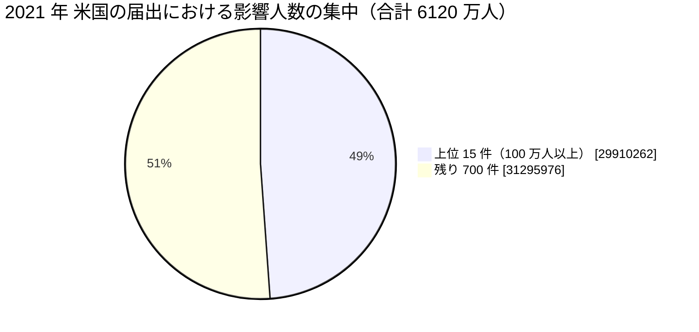

# 🇺🇸 2021 年 米国 HHS OCR 届出の全件集計

米国保健福祉省公民権局（HHS OCR）の侵害報告ポータルから 2021 年に届け出られた全件を取得し、集計した結果である。
[海外の履歴](2021-timeline.md)が個別の事例を扱うのに対し、本ページは米国の届出制度が捉えた全体の形を示す。

> [!NOTE]
> **集計の時点**：2026 年 8 月 26 日に取得した。
> ポータルの数値は精査によって改訂されるため、同じ条件で後日取得しても一致しない。
> 引用するときは集計の時点を併記してほしい。
> 取得の手順は [2025 年の集計ページ](2025-us-hhs.md#取得の手順)にまとめている。

## 何を数えているか

HHS OCR のポータルは、500 人以上に影響した侵害の届出を掲載する。
数えているのは**届出の件数**であり、発生した被害の件数ではない。

- **届出日であって発生日ではない**：侵入が前年でも、人数が確定した年に届け出られる。本ページの 2021 年は「2021 年に届け出られたもの」を指す
- **500 人未満は載らない**：小規模な診療所の侵害は集計に現れない
- **米国だけの制度である**：他国に同等の公開ポータルはなく、国ごとの比較には使えない
- **初報の人数が残る**：精査で人数が増えても、ポータルの表示が追随しない場合がある

## 全体

| 項目 | 値 |
|---|---|
| 届出件数 | **715 件** |
| 影響人数の合計 | **6120 万 6238 人** |
| 1 件あたりの中央値 | 5269 人 |
| 1 件あたりの平均 | 8 万 5603 人 |

影響人数のしきい値ごとの分布は次のとおりである。

| しきい値 | 件数 | 影響人数の合計 |
|---|---|---|
| 500 人以上（全件） | 715 | 6120 万 6238 |
| 1 万人以上 | 285 | 5997 万 5438 |
| 5 万人以上 | 128 | 5588 万 6033 |
| 10 万人以上 | 86 | 5292 万 0322 |
| 50 万人以上 | 31 | 4027 万 3400 |
| 100 万人以上 | 15 | 2991 万 0262 |

**分析**：前年から件数は 8% の増加に留まったが、影響人数は 73% 増えた。
100 万人以上の届出が 6 件から 15 件へ増えている。
件数ではなく 1 件あたりの規模が拡大した年である。

## 侵害の類型

| 類型 | 件数 | 影響人数の合計 |
|---|---|---|
| ハッキング、IT インシデント | 546 | 5899 万 2262 |
| 不正なアクセス、開示 | 130 | 188 万 2152 |
| 盗難 | 24 | 10 万 7958 |
| 不適切な廃棄 | 5 | 19 万 0508 |
| 紛失 | 10 | 3 万 3358 |

**分析**：「ハッキング、IT インシデント」が件数の 76%、人数の 96% を占める。
盗難と紛失は前年の 52 件から 34 件へ減った。
物理的な媒体の持ち出しが減る一方で、外部からの侵入が増える構図が続いている。

## 対象組織の区分

| 区分 | 件数 | 影響人数の合計 |
|---|---|---|
| 医療提供者 | 516 | 3765 万 5351 |
| 医療保険 | 104 | 720 万 4480 |
| 事業提携者 | 93 | 1632 万 8507 |
| 情報処理機関 | 2 | 1 万 7900 |

**分析**：事業提携者は件数の 13% で、人数の 27% を占める。
1 件あたりの平均は、医療提供者が 7 万 2975 人、事業提携者が 17 万 5575 人である。
[Accellion FTA](2021-timeline.md#GL-2021-19) を経由した侵害のように、1 件の製品の脆弱性が複数の届出に分かれて現れるため、事業提携者の側の実際の集中度はこの数字より高い。

## 侵害された場所

| 場所 | 件数 |
|---|---|
| ネットワークサーバ | 388 |
| 電子メール | 202 |
| 紙、フィルム | 46 |
| 電子診療記録 | 25 |
| その他 | 10 |
| その他の携帯機器 | 8 |
| 電子診療記録、ネットワークサーバ | 5 |
| デスクトップ PC | 5 |

**分析**：ネットワークサーバが 388 件で、前年の 238 件から 63% 増えた。
電子メールは 202 件でほぼ横ばいである。
ランサムウェアの標的がサーバへ移り、メールアカウントの侵害は水準を維持した。

## 届出元の州（上位 10）

| 州 | 件数 |
|---|---|
| カリフォルニア（CA） | 72 |
| テキサス（TX） | 55 |
| ニューヨーク（NY） | 45 |
| イリノイ（IL） | 41 |
| フロリダ（FL） | 39 |
| ペンシルベニア（PA） | 35 |
| ミシガン（MI） | 24 |
| オハイオ（OH） | 23 |
| マサチューセッツ（MA） | 19 |
| ミネソタ（MN） | 18 |

## 届出の月別分布

| 月 | 件数 |
|---|---|
| 1 月 | 36 |
| 2 月 | 49 |
| 3 月 | 73 |
| 4 月 | 71 |
| 5 月 | 67 |
| 6 月 | 72 |
| 7 月 | 70 |
| 8 月 | 40 |
| 9 月 | 48 |
| 10 月 | 62 |
| 11 月 | 69 |
| 12 月 | 58 |

**分析**：3 月から 7 月にかけて高い水準が続いた。
[Accellion FTA の脆弱性](2021-timeline.md#GL-2021-19)は 2021 年 1 月に悪用され、利用していた組織の届出が 3 月以降に集中している。
前年の [Blackbaud](2020-timeline.md#GL-2020-21) と同じく、1 件の製品の侵害が届出の分布に山を作った。

## 影響人数の上位 50 件

50 位の影響人数は 22 万 1454 人である。

| 順位 | 影響人数 | 届出日 | 州 | 区分 | 類型 | 場所 | 組織 |
|---|---|---|---|---|---|---|---|
| 1 | 4,142,440 | 05/24/2021 | FL | 事業提携者 | ハッキング、IT インシデント | ネットワークサーバ | 20/20 Eye Care Network, Inc |
| 2 | 3,500,000 | 01/29/2021 | FL | 医療保険 | ハッキング、IT インシデント | ネットワークサーバ | Florida Healthy Kids Corporation |
| 3 | 2,918,444 | 10/26/2021 | FL | 医療提供者 | ハッキング、IT インシデント | ネットワークサーバ | Lincare Holdings Inc. |
| 4 | 2,600,000 | 05/05/2021 | TX | 事業提携者 | ハッキング、IT インシデント | ネットワークサーバ | NEC Networks, LLC d/b/a CaptureRx |
| 5 | 2,592,494 | 06/24/2021 | CA | 事業提携者 | ハッキング、IT インシデント | ネットワークサーバ | Smile Brands, Inc. |
| 6 | 2,413,553 | 07/08/2021 | WI | 医療提供者 | ハッキング、IT インシデント | ネットワークサーバ | Forefront Dermatology, S.C. |
| 7 | 1,515,918 | 10/01/2021 | IN | 医療提供者 | ハッキング、IT インシデント | ネットワークサーバ | Eskenazi Health |
| 8 | 1,474,284 | 02/19/2021 | OH | 医療提供者 | ハッキング、IT インシデント | ネットワークサーバ | The Kroger Co. |
| 9 | 1,400,000 | 08/10/2021 | GA | 医療提供者 | ハッキング、IT インシデント | ネットワークサーバ | St. Joseph's/Candler Health System, Inc. |
| 10 | 1,300,000 | 08/13/2021 | NV | 医療提供者 | ハッキング、IT インシデント | ネットワークサーバ | University Medical Center of Southern Nevada |
| 11 | 1,269,074 | 01/08/2021 | NY | 医療提供者 | ハッキング、IT インシデント | 電子メール | American Anesthesiology, Inc. |
| 12 | 1,267,639 | 06/01/2021 | CA | 医療提供者 | ハッキング、IT インシデント | ネットワークサーバ | Scripps Health |
| 13 | 1,228,093 | 08/03/2021 | NM | 医療提供者 | ハッキング、IT インシデント | ネットワークサーバ | UNM Health |
| 14 | 1,210,688 | 07/01/2021 | NY | 事業提携者 | ハッキング、IT インシデント | ネットワークサーバ | Professional Business Systems, Inc., d/b/a Practicefirst Medical Management Solutions and PBS Medcode Corp., |
| 15 | 1,077,635 | 10/07/2021 | TX | 医療提供者 | ハッキング、IT インシデント | ネットワークサーバ | JDC Healthcare Management LLC |
| 16 | 824,450 | 11/02/2021 | MD | 医療提供者 | ハッキング、IT インシデント | 電子メール | Luminis Health Anne Arundel Medical Center |
| 17 | 753,107 | 03/26/2021 | NY | 事業提携者 | ハッキング、IT インシデント | ネットワークサーバ | Personal Touch Holding Corp. |
| 18 | 750,500 | 12/06/2021 | OR | 医療提供者 | ハッキング、IT インシデント | ネットワークサーバ | Oregon Anesthesiology Group, P.C. |
| 19 | 700,934 | 07/30/2021 | FL | 医療提供者 | ハッキング、IT インシデント | ネットワークサーバ | UF Health Central Florida |
| 20 | 688,603 | 03/25/2021 | CA | 医療保険 | ハッキング、IT インシデント | ネットワークサーバ | Health Net Community Solutions |
| 21 | 688,000 | 10/30/2021 | WA | 医療提供者 | ハッキング、IT インシデント | ネットワークサーバ | Sea Mar Community Health Centers |
| 22 | 685,574 | 06/30/2021 | AZ | 事業提携者 | ハッキング、IT インシデント | ネットワークサーバ | PracticeMax, Inc. |
| 23 | 655,384 | 08/30/2021 | IL | 医療提供者 | ハッキング、IT インシデント | ネットワークサーバ | DuPage Medical Group, Ltd. |
| 24 | 640,436 | 01/15/2021 | TX | 医療提供者 | ハッキング、IT インシデント | ネットワークサーバ | Hendrick Health |
| 25 | 616,211 | 09/08/2021 | NM | 医療提供者 | ハッキング、IT インシデント | ネットワークサーバ | Radiology Associates of Albuquerque, PA |
| 26 | 604,583 | 10/26/2021 | CA | 医療提供者 | ハッキング、IT インシデント | ネットワークサーバ | Community Medical Centers, Inc. |
| 27 | 586,869 | 04/05/2021 | MI | 事業提携者 | ハッキング、IT インシデント | ネットワークサーバ | Trinity Health |
| 28 | 582,170 | 11/03/2021 | UT | 医療提供者 | ハッキング、IT インシデント | ネットワークサーバ | Utah Imaging Associates, Inc. |
| 29 | 550,828 | 03/25/2021 | CA | 医療保険 | ハッキング、IT インシデント | ネットワークサーバ | Health Net of California |
| 30 | 535,489 | 12/10/2021 | TX | 医療提供者 | ハッキング、IT インシデント | ネットワークサーバ | Texas ENT Specialists |
| 31 | 500,000 | 09/22/2021 | AK | 医療保険 | ハッキング、IT インシデント | ネットワークサーバ | State of Alaska Department of Health & Social Services |
| 32 | 499,779 | 04/09/2021 | IA | 医療提供者 | ハッキング、IT インシデント | ネットワークサーバ | Wolfe Clinic, P.C. |
| 33 | 495,949 | 06/08/2021 | CA | 医療提供者 | ハッキング、IT インシデント | 電子メール | UC San Diego Health |
| 34 | 456,243 | 11/29/2021 | WA | 事業提携者 | ハッキング、IT インシデント | ネットワークサーバ | Sound Generations |
| 35 | 447,426 | 07/20/2021 | FL | 医療提供者 | ハッキング、IT インシデント | 電子メール | Orlando Family Physicians, LLC |
| 36 | 430,334 | 10/22/2021 | TN | 事業提携者 | ハッキング、IT インシデント | ネットワークサーバ | QRS, Inc. |
| 37 | 420,532 | 04/02/2021 | OH | 事業提携者 | ハッキング、IT インシデント | ネットワークサーバ | Bricker & Eckler LLP |
| 38 | 412,565 | 09/03/2021 | NJ | 医療提供者 | ハッキング、IT インシデント | ネットワークサーバ | USV Optical, Inc. |
| 39 | 409,759 | 11/30/2021 | CA | 医療提供者 | ハッキング、IT インシデント | ネットワークサーバ | Planned Parenthood Los Angeles |
| 40 | 398,164 | 12/21/2021 | WV | 医療提供者 | ハッキング、IT インシデント | 電子メール | Monongalia Health System, Inc. |
| 41 | 394,506 | 11/24/2021 | PA | 医療提供者 | ハッキング、IT インシデント | ネットワークサーバ | Quantum Imaging and Therapeutics Associates, Inc. |
| 42 | 348,870 | 12/10/2021 | FL | 医療提供者 | ハッキング、IT インシデント | ネットワークサーバ | BioPlus Specialty Pharmacy Services, LLC |
| 43 | 337,245 | 04/09/2021 | CA | 事業提携者 | ハッキング、IT インシデント | ネットワークサーバ | Health Center Partners of Southern California |
| 44 | 330,143 | 05/04/2021 | NY | 医療提供者 | ハッキング、IT インシデント | ネットワークサーバ | Orthopedic Associates of Dutchess County |
| 45 | 326,417 | 08/24/2021 | TX | 医療提供者 | 不正なアクセス、開示 | ネットワークサーバ | Denton County, Texas |
| 46 | 325,660 | 06/04/2021 | NM | 医療提供者 | ハッキング、IT インシデント | ネットワークサーバ | San Juan Regional Medical Center |
| 47 | 304,000 | 09/10/2021 | OH | 医療提供者 | ハッキング、IT インシデント | ネットワークサーバ | Talbert House |
| 48 | 253,774 | 10/08/2021 | MA | 医療提供者 | ハッキング、IT インシデント | ネットワークサーバ | ReproSource Fertility Diagnostics, Inc. |
| 49 | 233,199 | 03/05/2021 | WA | 事業提携者 | ハッキング、IT インシデント | ネットワークサーバ | Woodcreek Provider Services LLC |
| 50 | 221,454 | 04/05/2021 | MI | 医療保険 | ハッキング、IT インシデント | 電子メール | Total Health Care Inc. |

**分析**：上位に並ぶ組織のうち、Kroger、Health Net Community Solutions、Trinity Health は[Accellion FTA](2021-timeline.md#GL-2021-19)を経由している。
1 位の 20/20 Eye Care Network（414 万 2440 人）はクラウドの保管領域、2 位の Florida Healthy Kids Corporation（350 万人）は委託先のウェブ基盤の 7 年にわたる未修正の脆弱性である。
上位 3 件のうち 2 件が、医療機関の情報システムではなく、外部に置かれた保管領域とウェブ基盤で起きている。

## 全件を本ページに載せない理由

ポータルの数値は精査によって改訂され、届出の追加も続く。
静的な複製を置くと、参照した人が古い数値を引く。
本ページは集計と上位 50 件に留め、全件は[取得の手順](2025-us-hhs.md#取得の手順)とともに読み手が自分で取り直せるようにしている。

---

[← 海外の事例](README.md) | [2021 年の履歴](2021-timeline.md) | [2021 年の情勢](../years/2021-summary.md) | [トップへ](../../../../README.md)
