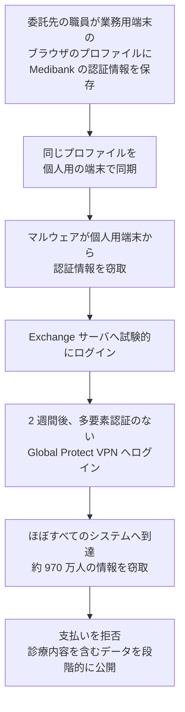

# 🌍 海外の事例 2022 年（履歴）

> [!NOTE]
> **表記ルール**：本ページでは、**事実**（一次情報で確認できる内容。出典を併記する）、**報道ベース**（報道や第三者の集計のみで確認でき、当事者の公表資料では裏付けが取れていない内容）、**分析**（筆者の解釈）を書き分ける。
> [対象の区分](../README.md#対象の区分)と[一次情報の強度](../README.md#一次情報の強度)の定義は、インシデント事例集のトップにまとめている。
> その年の情勢と集計は [2022 年の情勢](../years/2022-summary.md) にまとめている。

## 収録件数

| 区分 | サイバー攻撃 | その他の事案 |
|---|---|---|
| 病院系 | 14 | 1 |
| 製薬企業系 | 0 | 0 |
| 医療関連事業者 | 15 | 3 |

収録は本リポジトリが一次情報を確認できた事案に限る。
海外で公表された医療関連の事案がこれで尽きることを示すものではない。
米国の件数は、保健福祉省公民権局（HHS OCR）の侵害報告ポータルに届け出られた影響人数を典拠とする。
2022 年に同ポータルへ届け出られた全 718 件の集計は、[2022 年 米国 HHS OCR 届出の全件集計](2022-us-hhs.md)にまとめている。

---

## 病院系

| ID | 発生時期 | 組織、国 | 種別 | 初期侵入経路 | 診療への影響 | 業務停止期間 | 一次情報の強度 |
|---|---|---|---|---|---|---|---|
| [GL-2022-03](#GL-2022-03) | 2022-04 | Tenet Healthcare（米、複数州） | 不正アクセス | 未公表 | 一部の急性期病院で情報システムが停止 | 情報システムの停止が **数日** | 当事者公表 |
| [GL-2022-04](#GL-2022-04) | 2022-04 | Baptist Medical Center、Resolute Health Hospital（米、テキサス州） | 不正アクセス（データ窃取） | 未公表 | 公表なし | 診療の停止は公表されていない | 当事者公表 |
| [GL-2022-05](#GL-2022-05) | 2022-04 | Yuma Regional Medical Center（米、アリゾナ州） | ランサムウェア | 未公表 | 公表なし | 診療の停止は公表されていない | 当事者公表 |
| [GL-2022-06](#GL-2022-06) | 2022-05 | Caja Costarricense de Seguro Social（コスタリカ、公的医療） | ランサムウェア（Hive） | 未公表 | 全国の病院と診療所で診療系システムを停止。紙運用へ | 主要システムの復旧まで **数週間から数か月** | 当事者公表 |
| [GL-2022-07](#GL-2022-07) | 2022-05 | CHRISTUS Spohn Health System（米、テキサス州） | 不正アクセス | 未公表 | 公表なし | 診療の停止は公表されていない | 当事者公表 |
| [GL-2022-08](#GL-2022-08) | 2022-06 | Texas Tech University Health Sciences Center（米、テキサス州） | 不正アクセス | 未公表 | 公表なし | 診療の停止は公表されていない | 当事者公表 |
| [GL-2022-09](#GL-2022-09) | 2022-08 | Centre Hospitalier Sud Francilien（仏、コルベイユ・エソンヌ） | ランサムウェア（LockBit 3.0） | 委託先の VPN 経由（ANSSI の初期調査） | 検査と画像の系統が停止。患者を他院へ転送 | 情報システムの停止が **数か月**。窃取データを公開された | 当事者公表 |
| [GL-2022-10](#GL-2022-10) | 2022-09 | Wolfe Clinic（米、アイオワ州、眼科） | 不正アクセス | 電子カルテの委託先の侵害 | 公表なし | 診療の停止は公表されていない | 当事者公表 |
| [GL-2022-11](#GL-2022-11) | 2022-10 | Lake Charles Memorial Health System（米、ルイジアナ州） | ランサムウェア（Hive） | 未公表 | 公表なし | 診療の停止は公表されていない | 当事者公表 |
| [GL-2022-01](#GL-2022-01) | 2022-10 | CommonSpirit Health（米、100 超の施設） | ランサムウェア | 未公表 | 電子カルテを停止し、紙運用へ。小児患者への投薬量誤りが報じられた | 電子カルテの利用再開まで **約 2 週間**、大半の復旧まで **約 1 か月**。被害額 1 億 6000 万ドル | 当事者公表 |
| [GL-2022-12](#GL-2022-12) | 2022-11 | Doctors' Center Hospital（プエルトリコ） | 不正アクセス | 未公表 | 公表なし | 診療の停止は公表されていない | 当事者公表 |
| [GL-2022-13](#GL-2022-13) | 2022-11 | All India Institute of Medical Sciences（印、ニューデリー） | ランサムウェア | 未公表 | 外来、入院、検査の受付を **約 2 週間**すべて手作業へ | e-Hospital 系の停止が **約 2 週間**、完全復旧はさらに後 | 当事者公表 |
| [GL-2022-14](#GL-2022-14) | 2022-12 | Centre Hospitalier de Versailles（仏、アンドレ・ミニョ病院） | ランサムウェア（LockBit 3.0 を名乗る） | 未公表 | 受入を制限し、患者 2 名を他院へ転送。白色計画を発動 | 情報システムを全面遮断。復旧まで **数週間** | 当事者公表 |
| [GL-2022-15](#GL-2022-15) | 2022-12 | Katholische Hospitalvereinigung Ostwestfalen（独、3 病院） | ランサムウェア | 未公表 | 一部の診療を制限し、救急の受入を調整 | 情報システムの停止が **数週間** | 当事者公表 |

### GL-2022-03 Tenet Healthcare（2022 年 4 月、米国）

**事実**

- 発生時期：2022 年 4 月 20 日ごろ。
- 対象組織：米国の複数州で急性期病院と外来施設を運営する医療グループ。
- 攻撃種別：不正アクセス。
- 初期侵入経路：未公表。
- 侵害範囲：一部の急性期病院の情報システム。
- 診療への影響：情報システムを停止し、ダウンタイム手順へ切り替えた。同社は患者の診療は継続したと説明した。
- 業務停止期間：数日で主要な機能を復旧させたと説明した。
- 公表された対策：証券取引委員会への報告を通じて経緯を説明した。

**分析**

- 上場している医療グループでは、事案の説明が投資家向けの開示として先に出ることがある。開示の目的は財務への影響の説明であり、侵入経路と診療への影響は必ずしも含まれない。事例から学ぶ材料としては薄くなる。

**一次情報**

- [Tenet Healthcare](https://www.tenethealth.com/)
- [Tenet Healthcare 投資家向け情報](https://investor.tenethealth.com/)

---

### GL-2022-04 Baptist Medical Center、Resolute Health Hospital（2022 年 4 月、米国）

**事実**

- 発生時期：2022 年 3 月 31 日から 4 月 24 日にかけて侵入されていた。
- 対象組織：テキサス州サンアントニオとニューブラウンフェルズの病院。Tenet Healthcare 傘下にある。
- 攻撃種別：不正アクセス（データ窃取）。
- 初期侵入経路：未公表。
- 侵害範囲：氏名、生年月日、住所、社会保障番号、健康保険情報、診療情報。
- 情報流出：160 万 8549 人（HHS OCR への届出、2022 年 6 月 15 日）。
- 診療への影響：診療の停止は公表されていない。

**分析**

- [Tenet Healthcare](#GL-2022-03) の事案と時期が重なる。グループ全体の開示と、施設ごとの届出が別々に出るため、外部からは同一の事案かどうかが読み取りにくい。届出制度は施設単位で数えるため、1 件の侵入が複数の届出として現れる。

**一次情報**

- [Baptist Health System](https://www.baptisthealthsystem.com/)
- [HHS OCR 侵害報告ポータル](https://ocrportal.hhs.gov/ocr/breach/breach_report.jsf)

---

### GL-2022-05 Yuma Regional Medical Center（2022 年 4 月、米国）

**事実**

- 発生時期：2022 年 4 月 21 日から 25 日にかけて侵入された。
- 対象組織：アリゾナ州ユマの地域病院。
- 攻撃種別：ランサムウェア。
- 初期侵入経路：未公表。
- 侵害範囲：氏名、社会保障番号、健康保険情報、限定的な診療情報。
- 情報流出：73 万 8145 人（HHS OCR への届出、2022 年 6 月 9 日）。
- 診療への影響：同院は患者の診療を継続したと説明した。
- 公表された対策：外部の専門家による調査を行い、対象者へ通知した。

**分析**

- 侵入から検知までが 5 日で、暗号化されても診療は継続できた。封じ込めの速さがそのまま診療の継続に反映された事例である。

**一次情報**

- [Yuma Regional Medical Center](https://www.yumaregional.org/)
- [HHS OCR 侵害報告ポータル](https://ocrportal.hhs.gov/ocr/breach/breach_report.jsf)

---

### GL-2022-06 Caja Costarricense de Seguro Social（2022 年 5 月、コスタリカ）

**事実**

- 発生時期：2022 年 5 月 31 日午前にシステムを停止した。
- 対象組織：コスタリカの公的医療と社会保険を担う機関（CCSS）。全国の病院と診療所を運営する。
- 攻撃種別：ランサムウェア（Hive）。
- 初期侵入経路：未公表。
- 侵害範囲：政府のサーバ約 1500 台のうち、少なくとも 30 台でランサムウェアが実行された。全国の約 1200 の医療施設に影響した。
- 診療への影響：統合電子診療記録（EDUS）と徴収の仕組みを含む中核システムを停止し、紙による運用へ切り替えた。COVID-19 の検査結果を報告できなくなった。
- 業務停止期間：主要システムの復旧に数週間から数か月を要した。
- 背景：同年 4 月に Conti が複数の政府機関を攻撃し、大統領が非常事態を宣言していた。本件はその数週間後にあたる。

**分析**

- 国の医療制度そのものが単一の組織で運用されている場合、1 回の侵害が全国の診療に及ぶ。冗長化の議論は施設単位ではなく制度単位で必要になる。同じ構造は 2021 年の[アイルランド HSE](2021-timeline.md#GL-2021-01)、2025 年の[トンガ王国保健省](2025-timeline.md#GL-2025-49)にも現れた。
- 政府機関への攻撃が続いた直後に、同じ国の医療機関が別の攻撃グループに攻撃された。先行する事案の対応に資源を割いている時期は、次の攻撃に対して弱くなる。

**一次情報**

- [Caja Costarricense de Seguro Social](https://www.ccss.sa.cr/)
- [Ministerio de Ciencia, Innovación, Tecnología y Telecomunicaciones（コスタリカ）](https://www.micitt.go.cr/)

---

### GL-2022-07 CHRISTUS Spohn Health System（2022 年 5 月、米国）

**事実**

- 発生時期：2022 年 5 月中旬。
- 対象組織：テキサス州コーパスクリスティを中心に病院を運営する医療グループ。
- 攻撃種別：不正アクセス。
- 初期侵入経路：未公表。
- 侵害範囲：氏名、住所、生年月日、社会保障番号、健康保険情報、診療情報。
- 情報流出：84 万 2874 人（HHS OCR への届出、2022 年 7 月 1 日）。
- 診療への影響：診療の停止は公表されていない。

**一次情報**

- [CHRISTUS Health](https://www.christushealth.org/)
- [HHS OCR 侵害報告ポータル](https://ocrportal.hhs.gov/ocr/breach/breach_report.jsf)

---

### GL-2022-08 Texas Tech University Health Sciences Center（2022 年 6 月、米国）

**事実**

- 発生時期：2022 年 6 月。
- 対象組織：テキサス州の大学医療センター。医学部と附属の診療部門を持つ。
- 攻撃種別：不正アクセス。
- 初期侵入経路：未公表。
- 侵害範囲：氏名、住所、生年月日、社会保障番号、診療記録番号、健康保険情報、診断と処置の情報。
- 情報流出：129 万 0104 人（HHS OCR への届出、2022 年 6 月 7 日）。
- 診療への影響：診療の停止は公表されていない。

**分析**

- 同センターは 2024 年にも別件で 81 万 5000 人規模の届出を行っている（[GL-2024 の過年度の節](2024-timeline.md)）。同じ組織が数年のうちに二度大規模な漏えいを届け出た場合、一度目の対応で何が変わったかが問われる。

**一次情報**

- [Texas Tech University Health Sciences Center](https://www.ttuhsc.edu/)
- [HHS OCR 侵害報告ポータル](https://ocrportal.hhs.gov/ocr/breach/breach_report.jsf)

---

### GL-2022-09 Centre Hospitalier Sud Francilien（2022 年 8 月、フランス）

**事実**

- 発生時期：2022 年 8 月 20 日から 21 日の夜間。
- 対象組織：フランス・エソンヌ県コルベイユ・エソンヌの公立病院。
- 攻撃種別：ランサムウェア（LockBit 3.0）。
- 初期侵入経路：フランス国家情報システムセキュリティ庁（ANSSI）の初期調査によると、攻撃者は暗号化の 10 日前から VPN 経由で病院の情報システムへアクセスしていた。委託先のアカウントの乗っ取りが疑われた。
- 侵害範囲：検査と画像の系統を含む情報システム。
- 情報流出：身代金の支払いを拒んだのち、攻撃者が **11 ギガバイト超**のデータを公開した。社会保障番号と検査報告書が含まれていた。
- 診療への影響：患者を他院へ転送し、検査と画像の依頼を制限した。
- 業務停止期間：情報システムの停止が数か月に及んだ。
- 身代金：当初 1000 万ドルが要求され、のちに 200 万ドルへ引き下げられたが、**支払わなかった**。

**分析**

- 委託先のアカウントで VPN に入られ、10 日の滞留を経て暗号化された。委託先のアカウントは、契約が続く限り有効なまま残る。棚卸しの対象を職員のアカウントに限ると、この経路は残る（[認証とアクセス管理](../../../technology/identity.md)）。
- 支払いを拒んだ結果、検査報告書が公開された。フランスの公立病院は身代金を支払わない方針を採っており、公開は避けられない前提として通知と支援の計画を持つことになる。
- 本件と同年 12 月の[ヴェルサイユ](#GL-2022-14)を受けて、フランス政府は医療機関のサイバーセキュリティへの投資を拡大した。

**一次情報**

- [Centre Hospitalier Sud Francilien](https://www.chsf.fr/)
- [Cyberveille du CERT Santé](https://cyberveille.esante.gouv.fr/)（フランス保健分野 CERT）
- [ANSSI](https://cyber.gouv.fr/)

---

### GL-2022-10 Wolfe Clinic（2022 年 9 月、米国）

**事実**

- 発生時期：2022 年 9 月。
- 対象組織：アイオワ州の眼科診療グループ。
- 攻撃種別：不正アクセス。
- 初期侵入経路：電子カルテの提供事業者である Eye Care Leaders の侵害を経由した。
- 侵害範囲：氏名、生年月日、健康保険情報、診療情報。
- 情報流出：53 万 0299 人（HHS OCR への届出、2022 年 9 月 9 日）。
- 診療への影響：診療の停止は公表されていない。

**分析**

- 侵害されたのは診療所ではなく、その診療所が使っていた電子カルテの提供事業者である。単科向けの電子カルテは、その診療科の全国の診療所が同じ製品を使う構造になりやすい。1 社の侵害が診療科全体に及ぶ（[GL-2022-21 Eye Care Leaders](#GL-2022-21)）。

**一次情報**

- [HHS OCR 侵害報告ポータル](https://ocrportal.hhs.gov/ocr/breach/breach_report.jsf)

---

### GL-2022-11 Lake Charles Memorial Health System（2022 年 10 月、米国）

**事実**

- 発生時期：2022 年 10 月 21 日に不審な活動を検知した。
- 対象組織：ルイジアナ州レイクチャールズの医療グループ。
- 攻撃種別：ランサムウェア。攻撃グループ Hive が犯行を主張した。
- 初期侵入経路：未公表。
- 侵害範囲：氏名、住所、生年月日、健康保険情報、診療記録番号、支払い情報、限定的な臨床情報。
- 情報流出：約 27 万人（HHS OCR への届出、2022 年 12 月）。
- 診療への影響：診療の停止は公表されていない。

**一次情報**

- [Lake Charles Memorial Health System](https://lcmh.com/)
- [HHS OCR 侵害報告ポータル](https://ocrportal.hhs.gov/ocr/breach/breach_report.jsf)

---

### GL-2022-01 CommonSpirit Health（2022 年 10 月、米国）

**事実**

- 発生時期：2022 年 10 月 2 日に検知した。調査により、攻撃者は 9 月 16 日から 10 月 3 日までネットワークの一部へアクセスしていたことが確認された。
- 対象組織：米国で 140 超の病院と 1000 超の診療拠点を運営する大規模医療グループ。
- 攻撃種別：ランサムウェア。
- 初期侵入経路：未公表。
- 侵害範囲：13 州の 100 超の施設。
- 情報流出：同グループは 12 月 1 日に、患者情報へのアクセスがあったことを公表し、対象を **62 万 3774 人**とした。HHS OCR のポータルの掲載は 63 万 3031 人であり（本リポジトリが 2026 年 8 月 26 日に取得した時点、[全件集計](2022-us-hhs.md)）、精査による改訂とみられる。
- 診療への影響：システム停止時の既存の手順に従い、紙による運用へ切り替えた。小児患者への投薬量誤りが報じられ、臨床安全への影響が議論された。
- 業務停止期間：10 月 3 日に電子カルテを含む基幹システムをオフラインにした。10 月 17 日には医療者が電子カルテへアクセスできるようになり、施設によっては 10 月 21 日に一部機能が戻った。**約 2 週間から 3 週間**にあたる。
- 完全復旧：11 月上旬までに、同グループの大半の電子カルテと患者ポータルが復旧した。発生から**約 1 か月**にあたる。
- 被害額：**1 億 6000 万ドル**。

**分析**

- ランサムウェアの被害が、情報漏えいではなく投薬という臨床行為の安全性に及びうることを示した事例である。
- 電子カルテが停止したときの代替手順（投薬量の確認、指示の伝達）が、患者安全を基準に設計されている必要がある。ダウンタイム運用は [インシデント対応と事業継続](../../../response/) に整理している。
- 停止が 2 週間から 3 週間、被害額が 1 億 6000 万ドルである。同じ年の[大阪急性期・総合医療センター](../japan/2022-timeline.md#JP-2022-01)は、基幹システムの再稼働に 43 日、全体の復旧に 73 日を要し、逸失利益を十数億円以上と見積もった。規模も通貨も違うが、どちらも復旧費用より逸失利益のほうが大きい。

**一次情報**

- [CommonSpirit Health](https://www.commonspirit.org/)
- [HHS OCR 侵害報告ポータル](https://ocrportal.hhs.gov/ocr/breach/breach_report.jsf)

---

### GL-2022-12 Doctors' Center Hospital（2022 年 11 月、プエルトリコ）

**事実**

- 発生時期：2022 年 11 月。
- 対象組織：プエルトリコで複数の病院を運営する医療グループ。
- 攻撃種別：不正アクセス。
- 初期侵入経路：未公表。
- 侵害範囲：患者の個人情報と診療情報。
- 情報流出：76 万 2364 人（HHS OCR への届出、2022 年 11 月 9 日）。
- 診療への影響：診療の停止は公表されていない。

**分析**

- 米国の届出制度は、州だけでなく準州と自由連合州も対象に含む。集計を州別に見るときに、この行の所在地欄が空欄になることがある。制度の対象範囲と、集計に使う地域区分は一致しない。

**一次情報**

- [HHS OCR 侵害報告ポータル](https://ocrportal.hhs.gov/ocr/breach/breach_report.jsf)

---

### GL-2022-13 All India Institute of Medical Sciences（2022 年 11 月、インド）

**事実**

- 発生時期：2022 年 11 月 23 日午前 7 時ごろ、国立情報センター（NIC）の担当がサーバの停止を把握した。
- 対象組織：ニューデリーのインド全インド医科大学。国内有数の公立の高度医療機関である。
- 攻撃種別：ランサムウェア。
- 初期侵入経路：未公表。
- 侵害範囲：物理サーバ 100 台のうち 5 台が侵害された。
- 診療への影響：外来、入院、検査、会計、予約のすべてを手作業へ切り替えた。この運用が **約 2 週間**続いた。
- 業務停止期間：e-Hospital 系のサービスが約 2 週間停止した。完全復旧はさらに後になった。
- 公表された対策：デリー警察へ届け出て、NIC とインドのコンピュータ緊急対応チーム（CERT-In）の支援を受けた。国家捜査局（NIA）がサイバーテロの疑いで捜査に加わった。

**分析**

- 診療の運用を 2 週間にわたり手作業へ戻せたことは、紙の運用が組織の記憶として残っていたことを示す。電子化から日が浅い環境では、紙への切り戻しが現実的な選択肢として機能する。電子化が進むほどこの余地は減る。
- 侵害されたのは 100 台のうち 5 台であった。それでも全体の運用が止まったのは、止めた範囲が侵害の範囲より広かったためである。封じ込めの単位をどこに引くかが、診療の停止範囲を決める（[ネットワークの分離](../../../technology/segmentation.md)）。

**一次情報**

- [All India Institute of Medical Sciences, New Delhi](https://www.aiims.edu/)
- [Indian Computer Emergency Response Team（CERT-In）](https://www.cert-in.org.in/)

---

### GL-2022-14 Centre Hospitalier de Versailles（2022 年 12 月、フランス）

**事実**

- 発生時期：2022 年 12 月 3 日 21 時ごろ。
- 対象組織：フランス・イヴリーヌ県のアンドレ・ミニョ病院を中核とする公立病院。
- 攻撃種別：ランサムウェア。LockBit 3.0 を名乗る主体が犯行を主張した。
- 初期侵入経路：未公表。
- 侵害範囲：病院の情報システム全般。
- 診療への影響：白色計画（plan blanc）を発動し、患者の受入を制限した。状態から必要と判断された患者 2 名を他院へ転送した。
- 業務停止期間：情報システム、通信、インターネット接続を全面的に遮断した。復旧まで数週間を要した。
- 公表された対策：危機対応チームを設置し、警察へ届け出た。憲兵隊のサイバー犯罪対策センター（C3N）と警察のサイバー犯罪対策部門が捜査にあたった。

**報道ベース**

- 攻撃者が LockBit 3.0 の名を用いていたが、同グループの手口と一致しない点があり、名前を騙った別の主体である可能性が指摘された。

**分析**

- 白色計画は、災害時に病院が人員と病床を動員するための既存の枠組みである。サイバー事象に対してこれを使う運用が、フランスでは 2022 年までに定着した。既存の災害対応の枠組みを流用できるかどうかが、初動の速さを決める（[サイバー攻撃を想定した BCP](../../../response/bcp-cyber.md)）。
- 攻撃グループの名乗りが、実際の主体と一致しない場合がある。帰属を攻撃者の主張だけで確定できない理由がここにある。

**一次情報**

- [Information des personnes concernées - Cyberattaque du 03 décembre 2022](https://www.ch-versailles.fr/0/1/34/49)（Centre Hospitalier de Versailles）
- [Cyberveille du CERT Santé](https://cyberveille.esante.gouv.fr/)（フランス保健分野 CERT）

---

### GL-2022-15 Katholische Hospitalvereinigung Ostwestfalen（2022 年 12 月、ドイツ）

**事実**

- 発生時期：2022 年 12 月 24 日。
- 対象組織：ドイツ・ノルトライン＝ヴェストファーレン州で 3 病院を運営する医療法人。
- 攻撃種別：ランサムウェア。
- 初期侵入経路：未公表。
- 侵害範囲：情報システム全般。
- 診療への影響：一部の診療を制限し、救急の受入を近隣と調整した。
- 業務停止期間：情報システムの停止が数週間続いた。
- 公表された対策：州のデータ保護監督機関と警察へ届け出た。

**分析**

- 攻撃はクリスマスイブに実行された。連休の初日は、要員が最も薄く、検知から初動までの時間が最も長くなる。攻撃の時期の選び方は偶然ではない。年末年始と長期休暇の当番体制は、平時の体制とは別に決めておく必要がある。

**一次情報**

- [Katholische Hospitalvereinigung Ostwestfalen](https://www.kho.de/)
- [Bundesamt für Sicherheit in der Informationstechnik（BSI）](https://www.bsi.bund.de/)

---

## 製薬企業系

本年の収録はない。
一次情報を確認できた事案が見つかっていないだけで、被害がなかったことを示すものではない。
製薬企業に固有の攻撃面は [製薬企業のセキュリティ](../../../reference/pharma/) に整理している。

---

## 医療関連事業者

| ID | 発生時期 | 組織、国 | 種別 | 初期侵入経路 | 影響 | 一次情報の強度 |
|---|---|---|---|---|---|---|
| [GL-2022-16](#GL-2022-16) | 2022-01 | Morley Companies（米、業務受託） | ランサムウェア | 未公表 | 65 万 9194 人 | 当事者公表 |
| [GL-2022-17](#GL-2022-17) | 2022-01 | US Radiology Specialists（米、画像診断） | ランサムウェア | 未公表 | 132 万 2347 人 | 当事者公表 |
| [GL-2022-18](#GL-2022-18) | 2022-02 | Professional Finance Company（米、債権回収） | ランサムウェア | 未公表 | 191 万 8941 人。650 超の医療機関の患者が対象 | 当事者公表 |
| [GL-2022-19](#GL-2022-19) | 2022-02 | Australian Clinical Labs（豪、臨床検査） | データ侵害と恐喝 | 未公表 | 約 22 万人。公表まで 8 か月を要し、規制当局が提訴 | 当事者公表 |
| [GL-2022-20](#GL-2022-20) | 2022-03 | Shields Health Care Group（米、画像診断） | 不正アクセス（データ窃取） | 未公表 | 238 万 0483 人。56 の医療機関が委託元 | 当事者公表 |
| [GL-2022-21](#GL-2022-21) | 2022-03 | Eye Care Leaders（米、眼科向け電子カルテ） | 不正アクセス | クラウド上のデータベース | 複数の眼科グループを通じて数百万人規模 | 当事者公表 |
| [GL-2022-22](#GL-2022-22) | 2022-03 | MCG Health（米、臨床判断支援） | 不正アクセス | 未公表 | 79 万 3283 人 | 当事者公表 |
| [GL-2022-23](#GL-2022-23) | 2022-03 | Partnership HealthPlan of California（米、公的医療保険） | ランサムウェア（Hive） | 未公表 | 85 万 2375 人 | 当事者公表 |
| [GL-2022-24](#GL-2022-24) | 2022-04 | Practice Resources（米、請求代行） | ランサムウェア | 未公表 | 94 万 2138 人 | 当事者公表 |
| [GL-2022-25](#GL-2022-25) | 2022-04 | OneTouchPoint（米、印刷と発送の受託） | ランサムウェア | 未公表 | 411 万 2892 人。30 超の保険者と医療機関が委託元 | 当事者公表 |
| [GL-2022-26](#GL-2022-26) | 2022-05（公表） | Apria Healthcare（米、在宅医療機器） | 不正アクセス | 未公表 | 186 万 8831 人。侵入は 2019 年と 2021 年 | 当事者公表 |
| [GL-2022-27](#GL-2022-27) | 2022-06 | Independent Living Systems（米、在宅ケアの管理） | 不正アクセス | 未公表 | 422 万 6508 人。本年の米国最大 | 当事者公表 |
| [GL-2022-28](#GL-2022-28) | 2022-08 | Connexin Software（Office Practicum、米、小児科向け電子カルテ） | 不正アクセス | 開発環境に置かれた本番データ | 284 万 6039 人。対象は小児 | 当事者公表 |
| [GL-2022-29](#GL-2022-29) | 2022-08 | Advanced（英、NHS 111 の基盤 Adastra を提供） | ランサムウェア（LockBit 3.0） | 多要素認証が有効になっていない第三者アカウントの正規の資格情報 | NHS 111 の受付が停止し、医療機関は紙運用へ。一部のトラストは基幹ソフトを **2 か月**利用できなかった | 当事者公表 |
| [GL-2022-02](#GL-2022-02) | 2022-10 | Medibank（豪、医療保険） | データ侵害と恐喝 | 委託先の職員の認証情報。VPN に多要素認証がなかった | 約 970 万人の情報が段階的に公開された | 報告書 |

### GL-2022-16 Morley Companies（2022 年 1 月、米国）

**事実**

- 発生時期：2021 年 8 月 1 日にファイルへアクセスできなくなり、2022 年 1 月 4 日に対象者を特定した。
- 対象組織：ミシガン州の業務受託事業者。医療分野の顧客を持つ。
- 攻撃種別：ランサムウェア。
- 侵害範囲：氏名、住所、社会保障番号、生年月日、診療情報、健康保険情報。
- 情報流出：65 万 9194 人（HHS OCR への届出、2022 年 2 月 1 日）。

**分析**

- 暗号化から対象者の特定まで 5 か月を要した。暗号化されたファイルの中身を読めない状態で、誰の情報が入っていたかを特定する作業が入る。台帳がなければ、この作業は復元を待つしかない。

**一次情報**

- [HHS OCR 侵害報告ポータル](https://ocrportal.hhs.gov/ocr/breach/breach_report.jsf)

---

### GL-2022-17 US Radiology Specialists（2022 年 1 月、米国）

**事実**

- 発生時期：2021 年 12 月上旬。
- 対象組織：ノースカロライナ州を拠点に、全米の画像診断施設へ読影と運営の支援を提供する事業者。
- 攻撃種別：ランサムウェア。
- 初期侵入経路：未公表。
- 侵害範囲：氏名、生年月日、住所、社会保障番号、診療記録番号、健康保険情報、画像診断の情報。
- 情報流出：132 万 2347 人（HHS OCR への届出、2022 年 2 月 18 日）。

**分析**

- 画像診断の読影は、施設の外にいる医師が担うことが多い。画像とその所見は施設の外の基盤に置かれる。PACS と読影の委託は[医療機器のセキュリティ](../../../technology/medical-devices/pacs-dicom.md)に整理している。

**一次情報**

- [HHS OCR 侵害報告ポータル](https://ocrportal.hhs.gov/ocr/breach/breach_report.jsf)

---

### GL-2022-18 Professional Finance Company（2022 年 2 月、米国）

**事実**

- 発生時期：2022 年 2 月 26 日にランサムウェアの被害を検知した。
- 対象組織：コロラド州の債権回収事業者。医療機関の未収金の回収を受託していた。
- 攻撃種別：ランサムウェア。
- 初期侵入経路：未公表。
- 侵害範囲：氏名、住所、生年月日、口座情報、社会保障番号、健康保険情報、診療情報。
- 情報流出：191 万 8941 人（HHS OCR への届出、2022 年 7 月 1 日）。**650 超の医療機関**の患者が対象に含まれた。
- 公表された対策：外部の専門家による調査を行い、委託元へ通知した。

**分析**

- 650 超の医療機関の患者が、1 社の侵害で同時に対象になった。回収の委託は、診療が終わった患者の情報を医療機関の外へ渡す行為である。委託の範囲に「支払いが済んでいない患者」という条件が付くため、対象者から見ると自分の情報がそこにあることを知る機会がない。

**一次情報**

- [Professional Finance Company](https://www.pfcusa.com/)
- [HHS OCR 侵害報告ポータル](https://ocrportal.hhs.gov/ocr/breach/breach_report.jsf)

---

### GL-2022-19 Australian Clinical Labs（2022 年 2 月、オーストラリア）

**事実**

- 発生時期：2022 年 2 月下旬に、子会社の Medlab Pathology の情報システムが侵害された。
- 対象組織：オーストラリアの大手臨床検査事業者。
- 攻撃種別：データ侵害と恐喝。
- 初期侵入経路：未公表。
- 侵害範囲：氏名、住所、生年月日、Medicare 番号、クレジットカード情報、検査結果。HIV の検査結果が含まれていた。
- 情報流出：約 22 万人。
- 公表の時期：同社が対象者へ通知したのは 2022 年 10 月であり、侵害から **約 8 か月**が経過していた。
- 司法：オーストラリア情報コミッショナー事務局（OAIC）は 2023 年、同社が通知を不当に遅らせたとして連邦裁判所へ提訴した。

**分析**

- 検査結果には、感染症の診断が含まれる。通知が 8 か月遅れた間、対象者は自分の検査結果が外部にある事実を知らないまま過ごした。
- 規制当局が通知の遅れそのものを理由に提訴した例である。通知の期限は形式的な要件ではなく、対象者が身を守る行動を取れるかどうかを決める。日本では個人情報保護委員会への報告と本人通知の期限が定められている（[国内のガイドラインと法規制](../../../guidelines/japan.md)）。

**一次情報**

- [Australian Clinical Labs](https://www.clinicallabs.com.au/)
- [Office of the Australian Information Commissioner](https://www.oaic.gov.au/)

---

### GL-2022-20 Shields Health Care Group（2022 年 3 月、米国）

**事実**

- 発生時期：2022 年 3 月 7 日から 21 日にかけて侵入されていた。3 月 18 日に不審な活動を検知した。
- 対象組織：マサチューセッツ州の画像診断事業者。MRI と PET の撮影を医療機関から受託する。
- 攻撃種別：不正アクセス（データ窃取）。
- 初期侵入経路：未公表。
- 侵害範囲：氏名、社会保障番号、生年月日、住所、診療記録番号、健康保険情報、診断名、請求情報。
- 情報流出：238 万 0483 人（HHS OCR への届出、2022 年 5 月 27 日）。委託元は **56 の医療機関**に及んだ。
- 公表された対策：外部の専門家による調査を行い、委託元と対象者へ通知した。

**分析**

- 画像診断の受託は、撮影の設備を共有する形で成り立つ。設備の共有は記録の集約を伴い、1 社の侵害が地域の複数の病院の患者に及ぶ。
- 患者は、撮影を受けた場所が病院の中であっても、記録を保持しているのが別法人であることを知らない。通知が届いたときに、自分との関係を理解できない対象者が生じる。

**一次情報**

- [Shields Health Care Group](https://www.shields.com/)
- [HHS OCR 侵害報告ポータル](https://ocrportal.hhs.gov/ocr/breach/breach_report.jsf)

---

### GL-2022-21 Eye Care Leaders（2022 年 3 月、米国）

**事実**

- 発生時期：2021 年 12 月 4 日に、同社のクラウド上のデータベースへ不正にアクセスされた。
- 対象組織：眼科向けの電子カルテと診療管理システムを提供する米国の事業者。
- 攻撃種別：不正アクセス。
- 初期侵入経路：クラウド上のデータベース。
- 侵害範囲：眼科診療の記録。攻撃者はデータベースとシステムの設定ファイルを削除した。
- 情報流出：委託元の眼科グループが個別に届け出た結果、合計で数百万人規模になった。届出は 2022 年から 2023 年にかけて続いた。
- 公表された対策：同社は影響を受けた顧客へ通知した。

**分析**

- 単科に特化した電子カルテは、その診療科の診療所が集中して使う。製品の選択肢が少ないため、1 社の侵害が診療科全体の記録に及ぶ。
- 攻撃者がデータベースと設定ファイルを削除した。復旧の可否が委託先の運用に完全に依存する状態は、医療機関の側から確認する手段がない。委託先の選定では、記録の保持と復旧の責任範囲を契約に明記する必要がある（[委託先への依存](../../../response/dependencies.md)）。

**一次情報**

- [HHS OCR 侵害報告ポータル](https://ocrportal.hhs.gov/ocr/breach/breach_report.jsf)

---

### GL-2022-22 MCG Health（2022 年 3 月、米国）

**事実**

- 発生時期：2022 年 3 月 25 日に把握した。侵害は 2020 年 2 月 25 日にさかのぼる。
- 対象組織：ワシントン州の臨床判断支援サービスの提供事業者。保険者と医療機関が給付の判断に利用する。
- 攻撃種別：不正アクセス。
- 初期侵入経路：未公表。
- 侵害範囲：氏名、社会保障番号、生年月日、住所、電話番号、電子メールアドレス、診療情報。
- 情報流出：79 万 3283 人（HHS OCR への届出、2022 年 6 月 10 日）。
- 公表された対策：委託元と対象者へ通知した。

**分析**

- 侵害から把握まで 2 年を超えていた。診療にも請求にも直接関わらないサービスは、監視の優先順位が下がる。滞留期間の長さは、そのまま持ち出された可能性のあるデータの量になる。

**一次情報**

- [MCG Health](https://www.mcg.com/)
- [HHS OCR 侵害報告ポータル](https://ocrportal.hhs.gov/ocr/breach/breach_report.jsf)

---

### GL-2022-23 Partnership HealthPlan of California（2022 年 3 月、米国）

**事実**

- 発生時期：2022 年 3 月 19 日にシステムの障害を把握した。
- 対象組織：カリフォルニア州北部の 14 郡で Medicaid（Medi-Cal）を運営する公的医療保険。
- 攻撃種別：ランサムウェア。攻撃グループ Hive が犯行を主張し、窃取したデータの一部を公開した。
- 初期侵入経路：未公表。
- 侵害範囲：氏名、生年月日、社会保障番号、住所、診断と治療の情報。
- 情報流出：85 万 2375 人（HHS OCR への届出、2022 年 5 月 18 日）。
- 公表された対策：外部の専門家による調査を行い、対象者へ通知した。

**分析**

- 公的医療保険の加入者は、加入していること自体が所得と生活の状況を示す。漏えいの対象が制度の加入者名簿である場合、名簿に載っている事実そのものが個人の状況を伝える。

**一次情報**

- [Partnership HealthPlan of California](https://www.partnershiphp.org/)
- [HHS OCR 侵害報告ポータル](https://ocrportal.hhs.gov/ocr/breach/breach_report.jsf)

---

### GL-2022-24 Practice Resources（2022 年 4 月、米国）

**事実**

- 発生時期：2022 年 4 月 12 日にランサムウェアの被害を検知した。
- 対象組織：ニューヨーク州シラキュースの請求代行事業者。
- 攻撃種別：ランサムウェア。
- 侵害範囲：氏名、住所、診療記録番号、請求に関する情報。
- 情報流出：94 万 2138 人（HHS OCR への届出、2022 年 8 月 4 日）。

**一次情報**

- [HHS OCR 侵害報告ポータル](https://ocrportal.hhs.gov/ocr/breach/breach_report.jsf)

---

### GL-2022-25 OneTouchPoint（2022 年 4 月、米国）

**事実**

- 発生時期：2022 年 4 月 28 日に、暗号化されたファイルを発見した。
- 対象組織：ウィスコンシン州の印刷と発送の受託事業者。医療保険者と医療機関の通知物を扱う。
- 攻撃種別：ランサムウェア。
- 初期侵入経路：未公表。
- 侵害範囲：氏名、加入者番号、診療または処方の情報。委託元によって項目が異なる。
- 情報流出：411 万 2892 人（HHS OCR への届出、2022 年 7 月 27 日）。**30 超**の保険者と医療機関が委託元に含まれた。
- 公表された対策：委託元へ通知し、対象者への通知を委託元と分担した。

**分析**

- 印刷と発送は、患者への通知物を作る工程である。委託先が持つのは、宛名と、その人に送るべき内容の組み合わせにあたる。項目としては簡素でも、組み合わせが病名を示す。
- 皮肉なことに、漏えいの通知そのものも同種の事業者を通じて発送される。通知の経路と漏えいの経路が同じ構造を持つ。

**一次情報**

- [OneTouchPoint](https://www.onetouchpoint.com/)
- [HHS OCR 侵害報告ポータル](https://ocrportal.hhs.gov/ocr/breach/breach_report.jsf)

---

### GL-2022-26 Apria Healthcare（2022 年 5 月に公表、米国）

**事実**

- 発生時期：不正アクセスは 2019 年 4 月から 5 月、および 2021 年 8 月から 10 月に生じていた。同社は 2022 年に公表した。
- 対象組織：在宅医療機器と在宅療法サービスを全米で提供する事業者。
- 攻撃種別：不正アクセス。
- 初期侵入経路：未公表。
- 侵害範囲：氏名、生年月日、社会保障番号、健康保険情報、金融口座情報、診療情報。
- 情報流出：186 万 8831 人（HHS OCR への届出、2022 年 5 月 16 日）。
- 公表された対策：対象者へ通知し、信用監視のサービスを提供した。

**分析**

- 2019 年の侵入が 2022 年に公表された。3 年の間、対象者は知らないままであった。届出の年で件数を数えると、この事案は 2022 年に計上される。発生年で数えるか届出年で数えるかによって、年ごとの推移は大きく変わる。

**一次情報**

- [Apria Healthcare](https://www.apria.com/)
- [HHS OCR 侵害報告ポータル](https://ocrportal.hhs.gov/ocr/breach/breach_report.jsf)

---

### GL-2022-27 Independent Living Systems（2022 年 6 月、米国）

**事実**

- 発生時期：2022 年 6 月 30 日から 7 月 5 日にかけて侵入されていた。
- 対象組織：フロリダ州の事業者。保険者と医療機関に対し、在宅ケアと長期ケアの管理業務を提供する。
- 攻撃種別：不正アクセス（データ窃取）。
- 初期侵入経路：未公表。
- 侵害範囲：氏名、住所、生年月日、社会保障番号、運転免許証番号、Medicaid と Medicare の識別番号、診断名、治療の情報、処方情報、健康保険の請求情報。
- 情報流出：**422 万 6508 人**（HHS OCR への届出、2022 年 9 月 2 日）。2022 年に米国で届け出られた医療分野の侵害として最大である。
- 公表された対策：外部の専門家による調査を行い、対象者へ通知した。

**分析**

- 長期ケアの管理業務は、対象者の生活状況と要介護度の記録を伴う。診療の記録より広い範囲の情報が集まる。
- この年の米国の届出で最大となった事案が、医療機関ではなく管理業務の受託事業者であった。同じ傾向は 2023 年、2024 年にさらに強まる。

**一次情報**

- [Independent Living Systems](https://www.ilshealth.com/)
- [HHS OCR 侵害報告ポータル](https://ocrportal.hhs.gov/ocr/breach/breach_report.jsf)

---

### GL-2022-28 Connexin Software（Office Practicum）（2022 年 8 月、米国）

**事実**

- 発生時期：2022 年 8 月 26 日に、ネットワークの障害を把握した。
- 対象組織：ペンシルベニア州の事業者。小児科向けの電子カルテと診療管理システム Office Practicum を提供する。
- 攻撃種別：不正アクセス（データ窃取）。
- 初期侵入経路：**オフラインの環境に置かれていた、顧客のデータの複製**。同社はこれを内部のテストと開発に用いていた。
- 侵害範囲：患者と保護者の氏名、生年月日、住所、社会保障番号、健康保険情報、診療情報、請求情報。
- 情報流出：284 万 6039 人（HHS OCR への届出、2022 年 11 月 11 日）。対象の大半が **小児**である。
- 公表された対策：委託元の診療所へ通知し、対象者への通知を行った。

**分析**

- 侵害されたのは本番環境ではなく、テストと開発に使っていた複製である。本番のデータを開発環境へそのまま持ち込む運用は、保護の水準がそこで一段落ちる。複製を作る手順に匿名化の工程を入れているかどうかで、この経路の有無が決まる。
- 対象の大半が小児である。社会保障番号が使われずに残る期間が長く、悪用が本人に気付かれにくい。年齢層によって、漏えいの影響が続く年数が変わる。

**一次情報**

- [Office Practicum](https://www.officepracticum.com/)
- [HHS OCR 侵害報告ポータル](https://ocrportal.hhs.gov/ocr/breach/breach_report.jsf)

---

### GL-2022-02 Medibank（2022 年 10 月、オーストラリア）

**事実**

以下は、オーストラリア情報コミッショナー事務局（OAIC）が 2024 年 6 月に連邦裁判所へ提出した訴状の記載を含む。

- 発生時期：2022 年 8 月に認証情報が窃取され、10 月 12 日に同社が侵害を公表した。
- 対象組織：オーストラリア最大級の民間医療保険会社。
- 攻撃種別：データ侵害と恐喝。
- 初期侵入経路：委託先の職員が、自分の業務用端末のブラウザのプロファイルに Medibank の利用者名とパスワードを保存していた。同じプロファイルを個人用の端末で同期したため、認証情報が個人用の端末へ複製された。攻撃者はマルウェアでこれを窃取し、まず Exchange サーバへ試験的にログインし、2 週間後に **多要素認証が設定されていなかった** VPN へログインした。
- 侵害範囲：この認証情報で、同社のほぼすべてのシステムへ到達できた。
- 情報流出：現職と元の顧客あわせて **約 970 万人**。氏名、生年月日、住所、Medicare 番号に加え、一部の顧客について診療の内容が含まれた。
- 身代金：**支払いを拒否した**。攻撃者は、中絶、依存症治療などの診療内容を含むデータを段階的に公開した。
- 費用：同社は本件に伴う費用を 1 億 2500 万豪ドル超と開示した。
- 司法：OAIC は 2024 年 6 月、2021 年 3 月から 2022 年 10 月にかけて個人情報の保護に必要な措置を取らなかったとして、同社をプライバシー法違反で提訴した。

**分析**

- ブラウザのプロファイル同期という、日常的な機能が業務の認証情報を個人の端末へ運んだ。端末の管理と認証の管理を別々に設計していると、この経路は両方の隙間に落ちる。
- 認証情報を得た攻撃者が VPN へ入れたのは、多要素認証が設定されていなかったためである。1 か所の欠落が 970 万人の漏えいに変換された点は、[Change Healthcare](2024-timeline.md#GL-2024-01) と同じ構造である。
- 支払いを拒否する判断は、データの段階的な公開という報復を招きうる。この判断は技術部門だけでは決められず、経営判断として事前に方針を定めておく必要がある。
- 公開されたのが加入者名簿ではなく「どの診療を受けたか」であった点が被害の性質を決めた。[GL-2020-03 Vastaamo](2020-timeline.md#GL-2020-03) と同じ構造である。

**一次情報**

- [Medibank cyber incident](https://www.medibank.com.au/health-insurance/info/cyber-security/)（Medibank）
- [OAIC takes civil penalty action against Medibank](https://www.oaic.gov.au/news/media-centre/oaic-takes-civil-penalty-action-against-medibank)（Office of the Australian Information Commissioner、2024 年 6 月）

---

### GL-2022-29 Advanced（2022 年 8 月、英国）

**事実**

- 発生時期：2022 年 8 月 2 日に攻撃が始まった。
- 対象組織：英国のマネージドサービス事業者 Advanced（バーミンガム）。NHS の非緊急電話相談 111 を支える Adastra をはじめ、複数の医療系サービスを提供している。
- 攻撃種別：ランサムウェア（LockBit 3.0）。
- 初期侵入経路：**多要素認証が有効になっていない第三者のアカウント**の正規の資格情報を用いて、Advanced のネットワークへ侵入した。
- 侵害範囲：英国の情報コミッショナー事務局（ICO）の認定では **7 万 9404 人**分の個人情報が危険にさらされた。窃取された人数を 8 万 2946 人とする報道もある（報道ベース）。
- 業務への影響：NHS 111 の受付に障害が生じ、複数の医療機関が患者記録へアクセスできなくなった。NHS は事業継続手順を発動した。一部のトラストでは、基幹となるソフトウェアを **2 か月**にわたり利用できなかった。医療機関と診療所は数週間にわたり紙と鉛筆での運用に戻った。
- 制裁：ICO は 2024 年 8 月に 600 万ポンドの制裁を予告し、2025 年 3 月 26 日に **307 万ポンド**の制裁金を科した。理由は、攻撃を受けたこと自体ではなく、攻撃以前のリスク分析とアクセス制御の不備である。

**分析**

- 侵入口は、多要素認証が設定されていない 1 つのアカウントである。そこから、英国の非緊急医療相談の入口全体が止まった。単一のアカウントの設定漏れと、国全体の医療サービスの停止のあいだに、技術的な段差がほとんどない。
- 医療機関自身は攻撃を受けていない。それでも、患者記録が読めない期間が数週間続いた。委託先の停止は、委託元の防御の水準とは無関係に起きる（[委託先への依存](../../../response/dependencies.md)）。
- ICO の制裁は、事前のリスク分析とアクセス制御の不備を対象にしている。攻撃を受けた事実ではなく、受けるまでに何をしていたかが問われた。同じ論点は、[2019 年以前の事例](2019-earlier.md)にも記録している。
- 2024 年の [Change Healthcare](2024-timeline.md#GL-2024-01)、[Synnovis](2024-timeline.md#GL-2024-03) と同じ構図が、2 年早く英国で起きていた。

**一次情報**

- [Advanced](https://www.oneadvanced.com/)
- [Software provider fined £3m following 2022 ransomware attack](https://ico.org.uk/about-the-ico/media-centre/news-and-blogs/2025/03/software-provider-fined-3m-following-2022-ransomware-attack/)（Information Commissioner's Office、2025 年 3 月 26 日）
- [Advanced Computer Software Group Limited penalty notice（PDF）](https://ico.org.uk/media2/gdlfddgc/advanced-penalty-notice-20250327.pdf)（ICO）
- [NHS England](https://www.england.nhs.uk/)

---

## その他の事案（サイバー攻撃以外）

サポート詐欺、システム障害、内部不正、機器や記憶媒体の紛失と盗難、委託先の管理不備による漏えい、誤送付や誤公開、ドメインの失効を記録する。
類型の定義と、主分類との判定基準は[事案の類型](../README.md#事案の類型)にまとめている。

| ID | 発生時期 | 組織 | 区分 | 類型 | 概要 | 一次情報の強度 |
|---|---|---|---|---|---|---|
| [GL-2022-S01](#GL-2022-S01) | 2022-07 | Guy's and St Thomas' NHS Foundation Trust（英） | 病院系 | システム障害 | 記録的な高温により、相互のバックアップとして設計された二つのデータセンターが同日に冷却系の障害を起こし、371 のレガシーシステムが停止した | 報告書 |
| [GL-2022-S02](#GL-2022-S02) | 2022-08 | Novant Health（米、ノースカロライナ州） | 医療関連事業者 | 誤送付、誤公開、操作ミス | 広告のために設置した計測タグにより、患者ポータルの利用内容が広告事業者へ送られていた。136 万 2296 人 | 当事者公表 |
| [GL-2022-S03](#GL-2022-S03) | 2022-10 | Advocate Aurora Health（米、イリノイ州、ウィスコンシン州） | 医療関連事業者 | 誤送付、誤公開、操作ミス | 患者ポータルと予約の画面に設置した計測タグにより、診療に関する情報が広告事業者へ送られていた。300 万人 | 当事者公表 |
| [GL-2022-S04](#GL-2022-S04) | 2022-11 | Community Health Network（米、インディアナ州） | 医療関連事業者 | 誤送付、誤公開、操作ミス | 同種の計測タグにより、患者の情報が第三者へ送られていた。150 万人 | 当事者公表 |

### GL-2022-S01 Guy's and St Thomas' NHS Foundation Trust（2022 年 7 月、英国）

**事実**

- 発生時期：2022 年 7 月 19 日
- 対象組織：ロンドンの NHS Foundation Trust。Guy's、St Thomas'、Evelina London の各病院と地域サービスを運営し、職員は約 2 万 3500 名
- 類型：システム障害
- 発生原因：ロンドンが観測史上初となる 40.3°C を記録した日に、Guy's と St Thomas' の二つのデータセンターが高温に伴う障害を起こした。二つは互いのバックアップとして設計されていた
- 経過：12 時 50 分に Guy's のデータセンターで空調が故障し、14 時 16 分には庫内が 50.3°C に達した。通常の運転上限は 40°C、目標は 20°C である。St Thomas' 側も 36.2°C まで上昇し、警報メールが機能しなくなった
- 影響範囲：患者記録、患者管理、臨床サービスを支える 371 のレガシーシステムが停止した。地域の家庭医は検査結果を参照できなくなった
- 診療への影響：同日に critical site incident を宣言し、紙運用（Paper Hospital）へ移行した。血管外科、心臓外科、移植の患者と一部の専門診療について、他院への転送が行われた
- 復旧：技術的な復旧は当初の想定より大幅に長引き、ほぼ完全な復旧までに数週間を要した。critical site incident の解除は 9 月 21 日である
- 患者への影響：報告書の時点で中等度の害が 1 件確認され、重大な害は確認されていない
- 費用：対応に伴う計画外支出は 140 万ポンドである
- 公表された対策：報告書は、データセンターの冷却、老朽化した基盤、役割分担、復旧の試験を対象とする提言を示し、理事会はこれを全面的に受け入れた

**分析**

- 二重化が、共通の原因によって同時に無効化された事例である。報告書自身が、二つのデータセンターによる冗長性は個別サイトの障害を緩和したが、両方を同時に停止させうるリスクを特定して緩和しなければこの事象は防げなかった、と述べている。冗長化の設計を点検するときは、二つの系が同じ環境要因を共有していないかを見る必要がある。
- 過去の高温では問題が出ていなかったことが、リスクの評価を下げる方向に働いた。報告書は、2018 年 7 月に空調ユニットが高温で停止した件を受けて登録されたリスクが、緩和策の実施後に評点を下げられ、2020 年 1 月に他のリスクと統合されて閉じられていたことを記録している。
- 同 Trust の内部監査が複数の NHS 組織のリスク登録簿を確認したところ、空調の喪失や極端な高温に関するリスクを記載していた組織はなく、いずれもサイバーセキュリティを IT の主要リスクとして挙げていた。停止の原因としての設備と気象が、リスク管理の枠組みから抜けやすいことを示している。
- 復旧に数週間を要した理由として、報告書はレガシーシステムの数と相互の結合、およびその詳細を把握している要員が限られていたことを挙げている。これは原因が高温であってもサイバー攻撃であっても同じように効く制約である。
- 復旧の途中に、無関係な外部サプライヤへのサイバー攻撃が重なった。二つの事象が重なる前提は、事業継続計画では想定されにくい。
- 設備と気象を起点とする停止の扱いは [基盤の構えと、外部への依存](../../../response/dependencies.md)、復旧の順序と紙運用からの復帰は [サイバー攻撃を想定した BCP](../../../response/bcp-cyber.md) に整理している。

**報道ベース**

- 2022 年 7 月 19 日には、同じ高温により Google Cloud と Oracle Cloud のロンドンのデータセンターでも冷却に起因する障害が生じたと報じられた。

**一次情報**

- [REVIEW OF THE GUY'S AND ST THOMAS' IT CRITICAL INCIDENT](https://www.guysandstthomas.nhs.uk/sites/default/files/2023-01/IT-critical-incident-review.pdf)（Guy's and St Thomas' NHS Foundation Trust、2023 年 1 月）

---

### GL-2022-S02 Novant Health（2022 年 8 月、米国）

**事実**

- 発生時期：2022 年 5 月に判明した。設置は 2020 年 5 月にさかのぼる。
- 類型：誤送付、誤公開、操作ミス（外部への計測タグの設定不備）。
- 発生原因：COVID-19 ワクチンの案内を広めるための広告に合わせ、同社のウェブサイトと患者ポータルに Meta の計測タグを設置した。設定により、患者がポータル上で行った操作の内容が広告事業者へ送られていた。
- 影響範囲：136 万 2296 人（HHS OCR への届出、2022 年 8 月 14 日）。
- 診療への影響：なし。
- 公表された対策：計測タグを削除し、対象者へ通知した。

**分析**

- 感染症対応の広報を目的とした設置であり、悪意も攻撃者も関与していない。それでも影響人数は 136 万人に達した。
- 患者ポータルは、診療の予約と検査結果の参照に使われる。どのページを見たかが、その患者の状態を示す。第三者の計測タグを載せる前に、送信される項目を確認する手順が要る（[トラッキング](../../../technology/web-security/tracking.md)）。

**一次情報**

- [Novant Health](https://www.novanthealth.org/)
- [HHS OCR 侵害報告ポータル](https://ocrportal.hhs.gov/ocr/breach/breach_report.jsf)

---

### GL-2022-S03 Advocate Aurora Health（2022 年 10 月、米国）

**事実**

- 発生時期：2022 年 10 月に公表した。
- 類型：誤送付、誤公開、操作ミス（外部への計測タグの設定不備）。
- 発生原因：患者の利用状況を把握する目的で、ウェブサイト、アプリ、患者ポータル（MyChart、LiveWell）、予約の画面に Meta Pixel と Google Analytics を設置していた。利用者が Facebook または Google に同時にログインしている場合、診療に関する情報が広告事業者へ送られる状態にあった。
- 影響範囲：**300 万人**（HHS OCR への届出、2022 年 10 月 14 日）。同グループの患者のほぼ全数にあたる。
- 診療への影響：なし。
- 司法：集団訴訟について 1225 万ドルの和解に至った。
- 公表された対策：計測タグを無効化し、対象者へ通知した。

**分析**

- 2022 年に米国で届け出られた医療分野の侵害のうち、「不正なアクセス、開示」の類型は 116 件で、影響人数は 803 万人である。うち 300 万人が本件にあたる。攻撃者の関与しない類型が、この年から人数の上位に現れ始めた。
- 計測タグは、ウェブサイトの改善という正当な目的で導入される。導入の判断は広報部門が行い、送信される項目の確認は情報システム部門が行う。両者の間に手順がないと、この種の事案が繰り返される。

**一次情報**

- [Advocate Health](https://www.advocatehealth.org/)
- [HHS OCR 侵害報告ポータル](https://ocrportal.hhs.gov/ocr/breach/breach_report.jsf)

---

### GL-2022-S04 Community Health Network（2022 年 11 月、米国）

**事実**

- 発生時期：2022 年 11 月に届け出た。
- 類型：誤送付、誤公開、操作ミス（外部への計測タグの設定不備）。
- 発生原因：ウェブサイトと患者ポータルに設置した計測タグにより、患者の情報が第三者へ送られていた。
- 影響範囲：150 万人（HHS OCR への届出、2022 年 11 月 18 日）。
- 診療への影響：なし。

**分析**

- 同年のうちに、同じ原因で 100 万人を超える届出が 3 件出た。個別の組織の判断ミスではなく、業界で共有されていた手法が一斉に問題として認識された結果である。米国では 2022 年 12 月に HHS OCR が計測技術の利用に関する指針を示した。

**一次情報**

- [Community Health Network](https://www.ecommunity.com/)
- [HHS OCR 侵害報告ポータル](https://ocrportal.hhs.gov/ocr/breach/breach_report.jsf)

---

サイバー攻撃の事例を追加するときは、[事例テンプレート](../../../reference/_templates/incident.md) をコピーし、該当する区分の節に追記してほしい。
識別子は `GL-2022-30` から順に付ける。

サイバー攻撃以外の事案は、[その他の事案テンプレート](../../../reference/_templates/incident-other.md) をコピーし、「その他の事案」の節に追記する。
識別子は `GL-2022-S05` から順に付ける。

---

[← 2021 年](2021-timeline.md) | [2022 年の情勢](../years/2022-summary.md) | [米国 HHS OCR 届出の全件集計](2022-us-hhs.md) | [海外の事例](README.md) | [2023 年 →](2023-timeline.md) | [トップへ](../../../../README.md)
