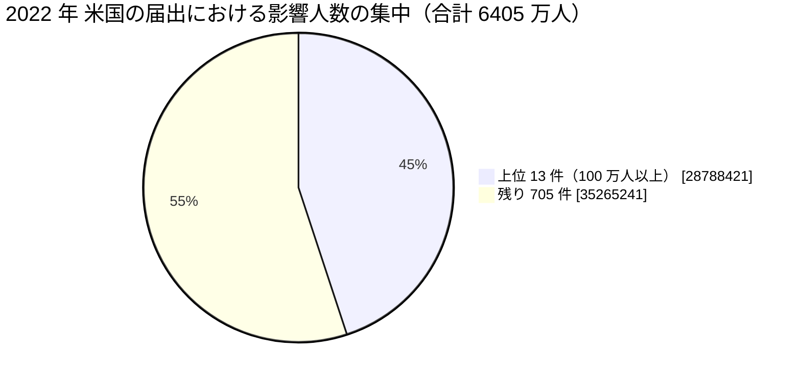

# 🇺🇸 2022 年 米国 HHS OCR 届出の全件集計

米国保健福祉省公民権局（HHS OCR）の侵害報告ポータルから 2022 年に届け出られた全件を取得し、集計した結果である。
[海外の履歴](2022-timeline.md)が個別の事例を扱うのに対し、本ページは米国の届出制度が捉えた全体の形を示す。

> [!NOTE]
> **集計の時点**：2026 年 8 月 26 日に取得した。
> ポータルの数値は精査によって改訂されるため、同じ条件で後日取得しても一致しない。
> 引用するときは集計の時点を併記してほしい。
> 取得の手順は [2025 年の集計ページ](2025-us-hhs.md#取得の手順)にまとめている。

## 何を数えているか

HHS OCR のポータルは、500 人以上に影響した侵害の届出を掲載する。
数えているのは**届出の件数**であり、発生した被害の件数ではない。

- **届出日であって発生日ではない**：侵入が前年でも、人数が確定した年に届け出られる。本ページの 2022 年は「2022 年に届け出られたもの」を指す
- **500 人未満は載らない**：小規模な診療所の侵害は集計に現れない
- **米国だけの制度である**：他国に同等の公開ポータルはなく、国ごとの比較には使えない
- **初報の人数が残る**：精査で人数が増えても、ポータルの表示が追随しない場合がある

## 全体

| 項目 | 値 |
|---|---|
| 届出件数 | **718 件** |
| 影響人数の合計 | **6405 万 3662 人** |
| 1 件あたりの中央値 | 7962 人 |
| 1 件あたりの平均 | 8 万 9211 人 |

影響人数のしきい値ごとの分布は次のとおりである。

| しきい値 | 件数 | 影響人数の合計 |
|---|---|---|
| 500 人以上（全件） | 718 | 6405 万 3662 |
| 1 万人以上 | 332 | 6291 万 7457 |
| 5 万人以上 | 152 | 5859 万 6840 |
| 10 万人以上 | 91 | 5415 万 4037 |
| 50 万人以上 | 29 | 3968 万 5239 |
| 100 万人以上 | 13 | 2878 万 8421 |

**分析**：件数と人数はいずれも前年とほぼ同じ水準である。
中央値は 5269 人から 7962 人へ 51% 上がった。
上位の事案の規模ではなく、中位の届出の規模が押し上げられた年である。

## 侵害の類型

| 類型 | 件数 | 影響人数の合計 |
|---|---|---|
| ハッキング、IT インシデント | 568 | 5561 万 1348 |
| 不正なアクセス、開示 | 116 | 803 万 6495 |
| 盗難 | 19 | 37 万 9963 |
| 紛失 | 11 | 1 万 7665 |
| 不適切な廃棄 | 4 | 8191 |

**分析**：「不正なアクセス、開示」の影響人数が、前年の 188 万人から 803 万人へ 4 倍以上に増えた。
この増分の大半は、ウェブサイトに設置した計測タグによる第三者への送信である。
[Advocate Aurora Health](2022-timeline.md#GL-2022-S03) の 300 万人、[Community Health Network](2022-timeline.md#GL-2022-S04) の 150 万人、[Novant Health](2022-timeline.md#GL-2022-S02) の 136 万人を合わせると 586 万人になる。
攻撃者が関与しない漏えいが、制度の集計に大きく現れた最初の年である。

## 対象組織の区分

| 区分 | 件数 | 影響人数の合計 |
|---|---|---|
| 医療提供者 | 503 | 3474 万 5125 |
| 事業提携者 | 129 | 2603 万 4423 |
| 医療保険 | 86 | 327 万 4114 |

**分析**：事業提携者の届出が 93 件から 129 件へ 39% 増えた。
人数では 1632 万人から 2603 万人へ増え、全体の 41% を占める。
医療機関の外にデータを置く構造が、届出の統計として明確に現れ始めた。

## 侵害された場所

| 場所 | 件数 |
|---|---|
| ネットワークサーバ | 405 |
| 電子メール | 168 |
| 電子診療記録 | 57 |
| 紙、フィルム | 42 |
| その他の携帯機器 | 15 |
| ノート PC | 10 |
| 電子診療記録、ネットワークサーバ | 5 |
| デスクトップ PC | 3 |

**分析**：電子診療記録が 25 件から 57 件へ倍増した。
計測タグによる漏えいの届出が、この区分に計上されたことによる。
場所の区分は、侵害の技術的な性質ではなく、対象になった情報の所在で選ばれる。

## 届出元の州（上位 10）

| 州 | 件数 |
|---|---|
| ニューヨーク（NY） | 69 |
| テキサス（TX） | 53 |
| カリフォルニア（CA） | 53 |
| フロリダ（FL） | 40 |
| ペンシルベニア（PA） | 38 |
| ニュージャージー（NJ） | 27 |
| ジョージア（GA） | 26 |
| ミシガン（MI） | 25 |
| バージニア（VA） | 24 |
| ワシントン（WA） | 24 |

## 届出の月別分布

| 月 | 件数 |
|---|---|
| 1 月 | 53 |
| 2 月 | 48 |
| 3 月 | 45 |
| 4 月 | 59 |
| 5 月 | 73 |
| 6 月 | 74 |
| 7 月 | 69 |
| 8 月 | 53 |
| 9 月 | 70 |
| 10 月 | 77 |
| 11 月 | 53 |
| 12 月 | 44 |

## 影響人数の上位 50 件

50 位の影響人数は 25 万 8411 人である。

| 順位 | 影響人数 | 届出日 | 州 | 区分 | 類型 | 場所 | 組織 |
|---|---|---|---|---|---|---|---|
| 1 | 4,226,508 | 09/02/2022 | FL | 事業提携者 | ハッキング、IT インシデント | ネットワークサーバ | Independent Living Systems, LLC |
| 2 | 4,112,892 | 07/27/2022 | WI | 事業提携者 | ハッキング、IT インシデント | ネットワークサーバ | OneTouchPoint, Inc. |
| 3 | 3,000,000 | 10/14/2022 | WI | 医療提供者 | 不正なアクセス、開示 | 電子診療記録 | Advocate Aurora Health |
| 4 | 2,846,039 | 11/11/2022 | PA | 事業提携者 | ハッキング、IT インシデント | ネットワークサーバ | Connexin Software, Inc. |
| 5 | 2,380,483 | 05/27/2022 | MA | 事業提携者 | ハッキング、IT インシデント | ネットワークサーバ | Shields Health Care Group, Inc. |
| 6 | 1,918,941 | 07/01/2022 | CO | 事業提携者 | ハッキング、IT インシデント | ネットワークサーバ | Professional Finance Company, Inc. |
| 7 | 1,868,831 | 05/16/2022 | IN | 医療提供者 | ハッキング、IT インシデント | 電子メール | Apria Healthcare LLC |
| 8 | 1,608,549 | 06/15/2022 | TX | 医療提供者 | ハッキング、IT インシデント | ネットワークサーバ | Baptist Medical Center |
| 9 | 1,500,000 | 11/18/2022 | IN | 医療提供者 | 不正なアクセス、開示 | ネットワークサーバ | Community Health Network, Inc. as an Affiliated Covered Entity |
| 10 | 1,362,296 | 08/14/2022 | NC | 事業提携者 | 不正なアクセス、開示 | 電子診療記録 | Novant Health Inc. |
| 11 | 1,351,431 | 01/02/2022 | FL | 医療提供者 | ハッキング、IT インシデント | ネットワークサーバ | North Broward Hospital District d/b/a Broward Health |
| 12 | 1,322,347 | 02/18/2022 | NC | 事業提携者 | ハッキング、IT インシデント | ネットワークサーバ | US Radiology Specialists, Inc. |
| 13 | 1,290,104 | 06/07/2022 | TX | 医療提供者 | ハッキング、IT インシデント | ネットワークサーバ | Texas Tech University Health Sciences Center |
| 14 | 942,138 | 08/04/2022 | NY | 事業提携者 | ハッキング、IT インシデント | ネットワークサーバ | Practice Resources, LLC |
| 15 | 877,584 | 11/18/2022 | MI | 医療提供者 | ハッキング、IT インシデント | ネットワークサーバ | Wright & Filippis LLC |
| 16 | 852,375 | 05/18/2022 | CA | 医療保険 | ハッキング、IT インシデント | ネットワークサーバ | Partnership HealthPlan of California |
| 17 | 842,874 | 07/01/2022 | TX | 医療提供者 | ハッキング、IT インシデント | ネットワークサーバ | CHRISTUS Spohn Health System Corporation |
| 18 | 793,283 | 06/10/2022 | WA | 事業提携者 | ハッキング、IT インシデント | ネットワークサーバ | MCG Health, LLC |
| 19 | 762,364 | 11/09/2022 |  | 医療提供者 | ハッキング、IT インシデント | ネットワークサーバ | Doctors' Center Hospital |
| 20 | 738,145 | 06/09/2022 | AZ | 医療提供者 | ハッキング、IT インシデント | ネットワークサーバ | Yuma Regional Medical Center |
| 21 | 659,194 | 02/01/2022 | MI | 事業提携者 | ハッキング、IT インシデント | ネットワークサーバ | Morley Companies, Inc. |
| 22 | 637,999 | 10/28/2022 | AZ | 医療保険 | ハッキング、IT インシデント | ネットワークサーバ | SightCare, Inc. |
| 23 | 633,031 | 12/01/2022 | IL | 事業提携者 | ハッキング、IT インシデント | ネットワークサーバ | CommonSpirit Health |
| 24 | 612,000 | 12/19/2022 | TX | 医療提供者 | ハッキング、IT インシデント | ネットワークサーバ | Metropolitan Area EMS Authority dba MedStar Mobile Healthcare |
| 25 | 530,299 | 09/09/2022 | IA | 医療提供者 | ハッキング、IT インシデント | 電子診療記録 | Wolfe Clinic, P.C. |
| 26 | 510,574 | 04/11/2022 | ND | 医療提供者 | ハッキング、IT インシデント | ネットワークサーバ | Adaptive Health Integrations |
| 27 | 502,869 | 03/25/2022 | IL | 医療提供者 | ハッキング、IT インシデント | 電子メール | Christie Business Holdings Company, P.C. |
| 28 | 502,089 | 10/31/2022 | KY | 事業提携者 | 不正なアクセス、開示 | ネットワークサーバ | CorrectCare Integrated Health, Inc. |
| 29 | 500,000 | 10/28/2022 | TX | 医療提供者 | ハッキング、IT インシデント | 電子メール | OakBend Medical Center / OakBend Medical Group |
| 30 | 495,808 | 10/14/2022 | NC | 医療提供者 | 不正なアクセス、開示 | ネットワークサーバ | WakeMed Health and Hospitals |
| 31 | 492,861 | 02/28/2022 | WV | 医療提供者 | ハッキング、IT インシデント | ネットワークサーバ | Monongalia Health System, Inc. |
| 32 | 480,435 | 10/21/2022 | IL | 医療保険 | 不正なアクセス、開示 | ネットワークサーバ | Illinois Department of Healthcare and Family Services, Illinois Department of Human Services |
| 33 | 461,070 | 08/08/2022 | PA | 医療提供者 | ハッキング、IT インシデント | ネットワークサーバ | Maternal and Family Health Services |
| 34 | 427,546 | 10/05/2022 | CO | 医療提供者 | ハッキング、IT インシデント | ネットワークサーバ | Salud Family Health |
| 35 | 422,531 | 04/07/2022 | TN | 医療提供者 | ハッキング、IT インシデント | ネットワークサーバ | East Tennessee Children's Hospital |
| 36 | 362,833 | 07/19/2022 | IN | 医療提供者 | ハッキング、IT インシデント | ネットワークサーバ | Goodman Campbell Brain and Spine |
| 37 | 345,353 | 04/25/2022 | AR | 医療提供者 | ハッキング、IT インシデント | ネットワークサーバ | ARcare |
| 38 | 343,593 | 08/12/2022 | TX | 事業提携者 | ハッキング、IT インシデント | 電子メール | Conifer Revenue Cycle Solutions, LLC |
| 39 | 339,471 | 03/03/2022 | TN | 医療提供者 | ハッキング、IT インシデント | ネットワークサーバ | Molecular Pathology Laboratory Network, Inc. |
| 40 | 325,278 | 07/27/2022 | CT | 医療保険 | ハッキング、IT インシデント | ネットワークサーバ | Aetna ACE |
| 41 | 317,863 | 03/28/2022 | CA | 医療提供者 | ハッキング、IT インシデント | ネットワークサーバ | Super Care, Inc. dba SuperCare Health |
| 42 | 312,000 | 03/25/2022 | GA | 医療提供者 | ハッキング、IT インシデント | ネットワークサーバ | Cytometry Specialists, Inc., d/b/a CSI Laboratories |
| 43 | 305,056 | 09/09/2022 | NY | 医療提供者 | ハッキング、IT インシデント | ネットワークサーバ | Empress Ambulance Service LLC |
| 44 | 287,652 | 03/04/2022 | CO | 医療提供者 | ハッキング、IT インシデント | ネットワークサーバ | South Denver Cardiology Associates, PC |
| 45 | 271,303 | 12/13/2022 | OK | 事業提携者 | ハッキング、IT インシデント | ネットワークサーバ | Avem Health Partners |
| 46 | 270,645 | 11/05/2022 | TN | 医療提供者 | ハッキング、IT インシデント | ネットワークサーバ | The Stern Cardiovascular Foundation, Inc. |
| 47 | 269,752 | 12/22/2022 | LA | 医療提供者 | ハッキング、IT インシデント | ネットワークサーバ | Southwest Louisiana Health Care System, Inc. d/b/a Lake Charles Memorial Health System |
| 48 | 266,170 | 06/17/2022 | SC | 医療提供者 | ハッキング、IT インシデント | ネットワークサーバ | Stokes Regional Eye Centers |
| 49 | 260,740 | 04/29/2022 | NY | 医療提供者 | ハッキング、IT インシデント | ネットワークサーバ | Refuah Health Center |
| 50 | 258,411 | 07/12/2022 | FL | 医療提供者 | ハッキング、IT インシデント | ネットワークサーバ | Synergic Healthcare Solutions, LLC d/b/a Fast Track Urgent Care Center |

**分析**：上位 5 件のうち 4 件が事業提携者である。
1 位の [Independent Living Systems](2022-timeline.md#GL-2022-27)（422 万 6508 人）は在宅ケアの管理、2 位の [OneTouchPoint](2022-timeline.md#GL-2022-25)（411 万 2892 人）は印刷と発送、4 位の [Connexin Software](2022-timeline.md#GL-2022-28)（284 万 6039 人）は小児科向けの電子カルテ、5 位の [Shields Health Care Group](2022-timeline.md#GL-2022-20)（238 万 0483 人）は画像診断である。
いずれも患者が名前を知らない事業者であり、通知が届いても対象者が自分との関係を理解できない。

3 位の [Advocate Aurora Health](2022-timeline.md#GL-2022-S03)（300 万人）は、攻撃者が関与しない計測タグの設定不備である。
届出の上位に、侵入を伴わない事案が入った。

## 全件を本ページに載せない理由

ポータルの数値は精査によって改訂され、届出の追加も続く。
静的な複製を置くと、参照した人が古い数値を引く。
本ページは集計と上位 50 件に留め、全件は[取得の手順](2025-us-hhs.md#取得の手順)とともに読み手が自分で取り直せるようにしている。

---

[← 海外の事例](README.md) | [2022 年の履歴](2022-timeline.md) | [2022 年の情勢](../years/2022-summary.md) | [トップへ](../../../../README.md)
