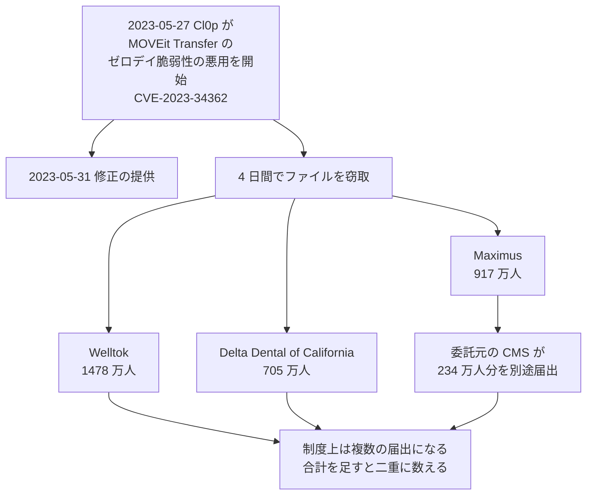

# 🌍 海外の事例 2023 年（履歴）

> [!NOTE]
> **表記ルール**：本ページでは、**事実**（一次情報で確認できる内容。出典を併記する）、**報道ベース**（報道や第三者の集計のみで確認でき、当事者の公表資料では裏付けが取れていない内容）、**分析**（筆者の解釈）を書き分ける。
> [対象の区分](../README.md#対象の区分)と[一次情報の強度](../README.md#一次情報の強度)の定義は、インシデント事例集のトップにまとめている。
> その年の情勢と集計は [2023 年の情勢](../years/2023-summary.md) にまとめている。

## 収録件数

| 区分 | サイバー攻撃 | その他の事案 |
|---|---|---|
| 病院系 | 17 | 0 |
| 製薬企業系 | 1 | 0 |
| 医療関連事業者 | 16 | 1 |

収録は本リポジトリが一次情報を確認できた事案に限る。
海外で公表された医療関連の事案がこれで尽きることを示すものではない。
米国の件数は、保健福祉省公民権局（HHS OCR）の侵害報告ポータルに届け出られた影響人数を典拠とする。
2023 年に同ポータルへ届け出られた全 746 件の集計は、[2023 年 米国 HHS OCR 届出の全件集計](2023-us-hhs.md)にまとめている。

---

## 病院系

| ID | 発生時期 | 組織、国 | 種別 | 初期侵入経路 | 診療への影響 | 業務停止期間 | 一次情報の強度 |
|---|---|---|---|---|---|---|---|
| [GL-2023-02](#GL-2023-02) | 2023-02 | Regal Medical Group ほか（米、カリフォルニア州） | ランサムウェア | 未公表 | 公表なし | 診療の停止は公表されていない | 当事者公表 |
| [GL-2023-03](#GL-2023-03) | 2023-02 | Tallahassee Memorial HealthCare（米、フロリダ州） | ランサムウェア | 未公表 | 救急搬送を転送し、緊急でない手術を中止 | 情報システムの停止が **約 2 週間** | 当事者公表 |
| [GL-2023-04](#GL-2023-04) | 2023-02 | Lehigh Valley Health Network（米、ペンシルベニア州） | データ侵害と恐喝（ALPHV/BlackCat） | 未公表 | 診療は継続 | **診療の停止なし**。がん患者の裸体画像が公開された | 当事者公表 |
| [GL-2023-05](#GL-2023-05) | 2023-03 | Hospital Clínic de Barcelona（西、カタルーニャ州） | ランサムウェア（RansomHouse） | 未公表 | 手術 150 件、外来 2000 件から 3000 件、採血 400 件から 500 件を中止 | 情報システムの停止が **数週間**。窃取データ 4.5 TB を公開された | 当事者公表 |
| [GL-2023-06](#GL-2023-06) | 2023-03 | Centre Hospitalier Régional Universitaire de Brest（仏） | 不正アクセス（未遂で封じ込め） | 未公表 | 情報システムを外部から遮断。診療は継続 | 対応が **35 日間**。費用 200 万ユーロ | 当事者公表 |
| [GL-2023-07](#GL-2023-07) | 2023-05 | Norton Healthcare（米、ケンタッキー州） | ランサムウェア（BlackCat/ALPHV） | 未公表 | 一部の診療とサービスに支障 | 情報システムの停止が **数日** | 当事者公表 |
| [GL-2023-08](#GL-2023-08) | 2023-05 | Idaho Falls Community Hospital（米、アイダホ州） | ランサムウェア | 未公表 | 救急搬送を転送し、一部の予約を取り消し | 情報システムの停止が **数日から数週間** | 当事者公表 |
| [GL-2023-09](#GL-2023-09) | 2023-05 | Tampa General Hospital（米、フロリダ州） | 不正アクセス（データ窃取） | 未公表 | 診療は継続 | **診療の停止なし** | 当事者公表 |
| [GL-2023-10](#GL-2023-10) | 2023-06 | Barts Health NHS Trust（英、ロンドン） | データ窃取の主張（BlackCat/ALPHV） | 未公表 | 公表なし | 診療の停止は公表されていない | 当事者公表 |
| [GL-2023-11](#GL-2023-11) | 2023-07 | HCA Healthcare（米、複数州） | 不正アクセス（外部保管領域） | 外部の保管領域 | 診療は継続 | **診療の停止なし**。1127 万人 | 当事者公表 |
| [GL-2023-01](#GL-2023-01) | 2023-08 | Prospect Medical Holdings（米、複数州） | ランサムウェア（Rhysida） | 未公表 | 複数州の病院で救急受入停止 | コネチカット州の 3 病院で **約 6 週間**（報道ベース） | 報道のみ |
| [GL-2023-12](#GL-2023-12) | 2023-08 | Mayanei Hayeshua Medical Center（イスラエル、ブネイ・ブラク） | ランサムウェア（Ragnar Locker） | 未公表 | 新規患者の受入を停止し、救急搬送を転送 | 情報システムの停止が **数日から数週間** | 当事者公表 |
| [GL-2023-13](#GL-2023-13) | 2023-08 | McLaren Health Care（米、ミシガン州、13 病院） | ランサムウェア（BlackCat/ALPHV） | 未公表 | 公表なし | 診療の停止は公表されていない | 当事者公表 |
| [GL-2023-14](#GL-2023-14) | 2023-10 | オンタリオ州の 5 病院と TransForm（加） | ランサムウェア（Daixin Team） | 侵害された管理者アカウント 3 件 | 予約の再調整、緊急でない患者の他施設への振替 | 復旧まで **約 1 か月** | 当事者公表 |
| [GL-2023-15](#GL-2023-15) | 2023-11 | Ardent Health Services（米、6 州、30 病院） | ランサムウェア | 未公表 | 救急の受入を複数州で停止し、救急搬送を転送 | 情報システムの停止が **数週間** | 当事者公表 |
| [GL-2023-32](#GL-2023-32) | 2023-11 | Fred Hutchinson Cancer Center（米、ワシントン州） | ランサムウェア（Hunters International） | 未公表 | 公表なし | 診療の停止は公表されていない | 当事者公表 |
| [GL-2023-16](#GL-2023-16) | 2023-12 | Anna Jaques Hospital（米、マサチューセッツ州） | ランサムウェア（Money Message） | 未公表 | 救急搬送を転送 | 情報システムの停止が **数日** | 当事者公表 |

### GL-2023-02 Regal Medical Group ほか（2023 年 2 月、米国）

**事実**

- 発生時期：2022 年 12 月 1 日にランサムウェアの被害を検知した。
- 対象組織：カリフォルニア州南部の医師グループ（Regal Medical Group、Lakeside Medical Organization、ADOC Medical Group、Greater Covina Medical Group）。
- 攻撃種別：ランサムウェア。
- 初期侵入経路：未公表。
- 侵害範囲：氏名、社会保障番号、住所、生年月日、診断名、治療の情報、検査結果、処方情報、健康保険情報。
- 情報流出：338 万 8856 人（HHS OCR への届出、2023 年 2 月 1 日）。
- 診療への影響：診療の停止は公表されていない。

**分析**

- 複数の医師グループが同じ情報基盤を共有していたため、1 件の侵害が 4 法人の患者に及んだ。医療機関の統合と基盤の共有は、事務の効率と侵害時の範囲を同時に押し上げる。

**一次情報**

- [Regal Medical Group](https://www.regalmed.com/)
- [HHS OCR 侵害報告ポータル](https://ocrportal.hhs.gov/ocr/breach/breach_report.jsf)

---

### GL-2023-03 Tallahassee Memorial HealthCare（2023 年 2 月、米国）

**事実**

- 発生時期：2023 年 2 月 2 日に情報システムを停止した。調査により、侵入は 1 月 26 日から始まっていたことが確認された。
- 対象組織：フロリダ州タラハシーの 772 床の病院を中核とする医療グループ。
- 攻撃種別：ランサムウェア。
- 初期侵入経路：未公表。
- 侵害範囲：氏名、住所、生年月日、社会保障番号、健康保険情報、診療記録番号、診断と治療の情報。
- 情報流出：約 30 万人。
- 診療への影響：救急搬送の一部を他院へ回し、緊急でない手術を中止した。職員は診療記録と検査結果を参照できなくなった。
- 業務停止期間：情報システムの停止が **約 2 週間**続いた。
- 公表された対策：連邦捜査局（FBI）と連携して調査した。HHS OCR が調査を開始した。

**分析**

- 侵入から検知まで 1 週間、検知後の停止が 2 週間である。侵入の期間より、封じ込めのために自ら止めた期間のほうが長い。停止の判断を下したあと、何を確認できれば戻せるのかを事前に決めていないと、この期間は延びる（[サイバー攻撃を想定した BCP](../../../response/bcp-cyber.md)）。

**一次情報**

- [Tallahassee Memorial HealthCare](https://www.tmh.org/)
- [HHS OCR 侵害報告ポータル](https://ocrportal.hhs.gov/ocr/breach/breach_report.jsf)

---

### GL-2023-04 Lehigh Valley Health Network（2023 年 2 月、米国）

**事実**

- 発生時期：2023 年 2 月。
- 対象組織：ペンシルベニア州の医療ネットワーク。
- 攻撃種別：データ侵害と恐喝。攻撃グループ ALPHV（BlackCat）が犯行を主張した。
- 初期侵入経路：未公表。
- 侵害範囲：**放射線腫瘍科の治療に用いる患者の画像**を含むシステム。
- 情報流出：約 13 万 5000 人が対象になった。うち **600 人超**について、治療の記録として撮影された裸体の画像が公開された。
- 身代金：**支払わなかった**。攻撃者は診療記録、雇用情報、患者の画像を公開した。
- 司法：集団訴訟について **6500 万ドル**の和解が成立し、画像を公開された対象者には 1 人あたり 7 万ドルが支払われることになった。

**分析**

- 治療のために撮影した画像が恐喝の材料になった。放射線治療の位置決めに用いる画像は、臨床上の必要から撮影され、診療録とは別のシステムに保管されることが多い。保管場所の棚卸しが診療録に限られていると、この領域は視野から外れる。
- 和解額が 1 人あたり 7 万ドルに達した。漏えいの賠償が人数ではなく内容で決まった例である。リスク評価で「何件漏れるか」だけを見ると、この規模の損害は見積もれない。
- 英国の [GL-2020-13 The Hospital Group](2020-timeline.md#GL-2020-13) と同じ型が、より大きな規模で繰り返された。

**一次情報**

- [Lehigh Valley Health Network](https://www.lvhn.org/)
- [HHS OCR 侵害報告ポータル](https://ocrportal.hhs.gov/ocr/breach/breach_report.jsf)

---

### GL-2023-05 Hospital Clínic de Barcelona（2023 年 3 月、スペイン）

**事実**

- 発生時期：2023 年 3 月 5 日。
- 対象組織：スペイン・カタルーニャ州バルセロナの大学病院。
- 攻撃種別：ランサムウェア（RansomHouse）。
- 初期侵入経路：未公表。
- 侵害範囲：**4.5 テラバイト**のデータが窃取された。患者、職員、取引先の情報が含まれた。
- 診療への影響：救急、在宅診療、デイホスピタル、放射線、内視鏡、透析、外来薬局は維持した。予定の手術 150 件、外来 2000 件から 3000 件、採血 400 件から 500 件を中止した。
- 業務停止期間：情報システムの停止が数週間続いた。
- 身代金：450 万ドルが要求されたが、カタルーニャ州政府は**支払わない方針を明示した**。
- 情報の公開：3 月 30 日から段階的に公開が始まり、7 月 5 日に 4.5 テラバイトすべてが公開された。

**分析**

- 中止した診療と維持した診療が、件数まで含めて公表されている。医療機関がサイバー事象の被害を臨床の単位で説明した例として参照価値が高い。停止時間を「何日」ではなく「何件の手術と外来」で表すと、病院の内部でも外部でも被害の重さが伝わる。
- 救急、透析、放射線を維持したのは、これらが中断できない診療だからである。何を止め、何を維持するかを事前に決めていたかどうかが、この配分に現れる（[サイバー攻撃を想定した BCP](../../../response/bcp-cyber.md)）。
- 支払いを拒んだ結果、4 か月かけてデータが全量公開された。公開までの時間は、対象者への通知と支援を組み立てる猶予でもある。

**一次情報**

- [Ciberataque al hospital Clínic de Barcelona](https://www.clinicbarcelona.org/en/press/last-minute/ciberataque-al-hospital-clinic-de-barcelona)（Hospital Clínic Barcelona）
- [Agencia Española de Protección de Datos](https://www.aepd.es/)

---

### GL-2023-06 Centre Hospitalier Régional Universitaire de Brest（2023 年 3 月、フランス）

**事実**

- 発生時期：2023 年 3 月 9 日 20 時 48 分、フランス国家情報システムセキュリティ庁（ANSSI）が同院のサーバ上の不審な通信を検知した。
- 対象組織：フランス・フィニステール県ブレストの大学病院センター。
- 攻撃種別：不正アクセス。暗号化とデータ窃取の実行前に封じ込めた。
- 初期侵入経路：未公表。攻撃グループは FIN12 と特定された。
- 侵害範囲：同院は、攻撃者が暗号化の実行にも情報の持ち出しにも至らなかったと説明した。
- 診療への影響：情報システムをインターネットから切り離し、診療は継続した。
- 業務停止期間：対応が **35 日間**続いた。
- 費用：**200 万ユーロ**。利用者 8500 人分のパスワードの変更、二要素認証の導入、委託先へのサーバ移行の依頼、ファイアウォールによる通信の整理を実施した。
- 公表された対策：対応の経緯を対外的に説明した。

**分析**

- 暗号化に至らずに封じ込めた事例である。被害が出なかったにもかかわらず、対応に 35 日と 200 万ユーロを要した。未遂で終わった事案の費用が公表されている例は少なく、検知の投資を評価する材料になる。
- 検知したのは病院ではなく、国の機関である。医療機関が自前で 24 時間の監視を持てない場合、外部の監視をどこから受けるかが検知の可否を決める（[ログと監視](../../../technology/logging.md)）。
- 復旧の内容として、パスワード 8500 件の変更と二要素認証の導入が挙がっている。侵害を受けたあとに実施した対策の多くは、平時にも実施できたものである。

**一次情報**

- [CHU de Brest](https://www.chu-brest.fr/)
- [Cyberveille du CERT Santé](https://cyberveille.esante.gouv.fr/)（フランス保健分野 CERT）

---

### GL-2023-07 Norton Healthcare（2023 年 5 月、米国）

**事実**

- 発生時期：2023 年 5 月 9 日に検知した。侵入は 5 月 7 日から始まっていた。
- 対象組織：ケンタッキー州ルイビルの医療グループ。
- 攻撃種別：ランサムウェア。攻撃グループ BlackCat（ALPHV）が犯行を主張した。
- 初期侵入経路：未公表。
- 侵害範囲：氏名、連絡先、社会保障番号、生年月日、健康保険情報、診療記録番号、診断と治療の情報、金融口座情報。
- 情報流出：250 万人（HHS OCR への届出、2023 年 7 月 7 日）。
- 診療への影響：一部の診療とサービスに支障が生じた。
- 業務停止期間：情報システムの停止が数日続いた。
- 身代金：**支払わなかった**。

**一次情報**

- [Norton Healthcare](https://nortonhealthcare.com/)
- [HHS OCR 侵害報告ポータル](https://ocrportal.hhs.gov/ocr/breach/breach_report.jsf)

---

### GL-2023-08 Idaho Falls Community Hospital（2023 年 5 月、米国）

**事実**

- 発生時期：2023 年 5 月 29 日。
- 対象組織：アイダホ州アイダホフォールズの地域病院と関連する診療所。
- 攻撃種別：ランサムウェア。
- 初期侵入経路：未公表。
- 診療への影響：救急搬送を近隣の病院へ回し、一部の予約を取り消した。紙による運用へ切り替えた。
- 業務停止期間：情報システムの停止が数日から数週間続いた。
- 公表された対策：復旧の進捗を継続的に公表した。

**分析**

- 救急搬送の振替先が近隣の 1 病院に集中した。地域に急性期病院が少ない地方では、1 施設の停止がそのまま地域の受入能力の低下になる。近隣施設が同時に機能しない場合を想定できているかが、事業継続計画の実効性を分ける。

**一次情報**

- [Idaho Falls Community Hospital](https://idahofallscommunityhospital.com/)

---

### GL-2023-09 Tampa General Hospital（2023 年 5 月、米国）

**事実**

- 発生時期：2023 年 5 月 12 日から 19 日にかけて侵入されていた。
- 対象組織：フロリダ州タンパの大学病院。
- 攻撃種別：不正アクセス（データ窃取）。同院は、暗号化を封じ込めたと説明した。
- 初期侵入経路：未公表。
- 侵害範囲：氏名、住所、電話番号、生年月日、社会保障番号、健康保険情報、診療記録番号、診断名、治療の情報。
- 情報流出：243 万 0920 人（HHS OCR への届出、2023 年 7 月 28 日）。
- 診療への影響：診療は継続した。
- 公表された対策：外部の専門家による調査を行い、対象者へ通知した。

**分析**

- 暗号化を防いだ一方で、1 週間の滞留のあいだにデータは持ち出された。検知と封じ込めが可用性を守っても、機密性は守れないことがある。診療の継続を成功と評価すると、通知と支援の準備が後手に回る。

**一次情報**

- [Tampa General Hospital](https://www.tgh.org/)
- [HHS OCR 侵害報告ポータル](https://ocrportal.hhs.gov/ocr/breach/breach_report.jsf)

---

### GL-2023-10 Barts Health NHS Trust（2023 年 6 月、英国）

**事実**

- 発生時期：2023 年 6 月下旬。
- 対象組織：ロンドンで 5 病院を運営する NHS トラスト。英国最大級である。
- 攻撃種別：データ窃取の主張。攻撃グループ BlackCat（ALPHV）が、7 テラバイトの機密データを窃取したと主張した。
- 初期侵入経路：未公表。
- 侵害範囲：同トラストは調査を実施したと公表した。
- 診療への影響：診療の停止は公表されていない。

**分析**

- 攻撃者の主張が先に出て、当事者の説明が後になる型である。当事者が事案の発生を確認しているため本事例集に収録するが、窃取の規模は攻撃者の主張であり確認されていない。
- 同トラストは 2025 年にも Oracle E-Business Suite のゼロデイ脆弱性を経由した侵害を公表している（[GL-2025-26](2025-timeline.md#GL-2025-26)）。

**一次情報**

- [Barts Health NHS Trust](https://www.bartshealth.nhs.uk/)
- [NHS England](https://www.england.nhs.uk/)

---

### GL-2023-11 HCA Healthcare（2023 年 7 月、米国）

**事実**

- 発生時期：2023 年 7 月 5 日に、外部のフォーラムへデータが投稿されているのを把握した。
- 対象組織：米国 20 州で約 180 の病院と 2000 超の診療拠点を運営する営利の医療グループ。
- 攻撃種別：不正アクセス。
- 初期侵入経路：患者への電子メールによる連絡（予約の案内など）を作成するために使っていた**外部の保管領域**。
- 侵害範囲：氏名、住所、電子メールアドレス、電話番号、生年月日、性別、来院の日付と場所と担当科。同社は、診療情報、支払い情報、社会保障番号は含まれないと説明した。
- 情報流出：**1127 万人**（HHS OCR への届出、2023 年 7 月 31 日）。
- 診療への影響：診療は継続した。
- 公表された対策：当該の保管領域を無効化し、外部の専門家による調査を行った。

**分析**

- 侵害されたのは診療系ではなく、患者への案内メールを作るために切り出したデータである。診療情報を含まないという説明は正しいが、**いつ、どこの、何科を受診したか**は残る。受診科は病名を推測させる。
- 目的を限定して切り出したデータは、切り出した時点で保護の対象から外れやすい。切り出しの承認と、切り出したデータの保存期間を決める手順がないと、この経路は繰り返される。

**一次情報**

- [HCA Healthcare](https://hcahealthcare.com/)
- [HHS OCR 侵害報告ポータル](https://ocrportal.hhs.gov/ocr/breach/breach_report.jsf)

---

### GL-2023-01 Prospect Medical Holdings（2023 年 8 月、米国）

**報道ベース**

- 複数州で病院を運営する Prospect Medical Holdings が Rhysida の攻撃を受け、複数州の病院で救急の受け入れが停止したと報じられた。
- **業務停止期間**：16 の病院で IT の運用が数週間にわたり停止したと報じられた。コネチカット州の 3 病院では、影響が **約 6 週間**続いたとされる。
- **代替運用**：紙による運用へ切り替え、救急の受け入れを近隣施設へ振り替えた。
- **完全復旧**：時期は当事者から公表されていない。
- 影響人数は、後年の届出で 25 万人規模とされた。

**分析**

- 1 法人の侵害が、地域医療の受け入れ能力に波及した事例である。
- 救急の受け入れ停止は、近隣の医療機関に負荷を移す。自院の事業継続計画は、近隣施設が同時に機能しない場合を想定できているかが問われる。

**一次情報**

- 当事者の公表資料は本リポジトリで未確認。確認でき次第、経緯と対策を追記する。
- [HHS OCR 侵害報告ポータル](https://ocrportal.hhs.gov/ocr/breach/breach_report.jsf)

---

### GL-2023-12 Mayanei Hayeshua Medical Center（2023 年 8 月、イスラエル）

**事実**

- 発生時期：2023 年 8 月 8 日。
- 対象組織：イスラエル・ブネイ・ブラクの民間病院。
- 攻撃種別：ランサムウェア。攻撃グループ Ragnar Locker が犯行を主張した。
- 初期侵入経路：未公表。
- 侵害範囲：病院の情報システム。
- 診療への影響：新規患者の受け入れを停止し、救急搬送を他院へ回した。
- 業務停止期間：情報システムの停止が数日から数週間続いた。
- 公表された対策：イスラエル国家サイバー総局と保健省が対応にあたった。

**分析**

- イスラエルでは 2021 年の [Hillel Yaffe Medical Center](2021-timeline.md#GL-2021-14) に続く 2 例目の大規模な被害である。前回を受けて国の関与の体制が作られており、初動の説明が前回より整理されている。

**一次情報**

- [Israel National Cyber Directorate](https://www.gov.il/en/departments/israel_national_cyber_directorate)
- [イスラエル保健省](https://www.gov.il/en/departments/ministry_of_health)

---

### GL-2023-13 McLaren Health Care（2023 年 8 月、米国）

**事実**

- 発生時期：2023 年 7 月 28 日から 8 月 23 日にかけて侵入されていた。
- 対象組織：ミシガン州で 13 病院を運営する医療グループ。
- 攻撃種別：ランサムウェア。攻撃グループ BlackCat（ALPHV）が犯行を主張した。
- 初期侵入経路：未公表。
- 侵害範囲：氏名、社会保障番号、健康保険情報、診断名、治療の情報、処方情報。
- 情報流出：210 万 3881 人（HHS OCR への届出、2023 年 10 月 20 日）。
- 診療への影響：診療の停止は公表されていない。

**分析**

- 同グループは翌 2024 年 8 月にも INC Ransom による侵害を公表し、約 74 万 3000 人へ通知した。2 度の侵害をめぐる集団訴訟について、1400 万ドルの和解が提案されている。1 度目のあとに何が変わったかが問われる事例である。

**一次情報**

- [McLaren Health Care](https://www.mclaren.org/)
- [HHS OCR 侵害報告ポータル](https://ocrportal.hhs.gov/ocr/breach/breach_report.jsf)

---

### GL-2023-14 オンタリオ州の 5 病院と TransForm（2023 年 10 月、カナダ）

**事実**

- 発生時期：2023 年 10 月 23 日。
- 対象組織：オンタリオ州南西部の 5 病院（Bluewater Health、Chatham-Kent Health Alliance、Erie Shores HealthCare、Hôtel-Dieu Grace Healthcare、Windsor Regional Hospital）と、5 病院の情報システム、調達、支払業務を共同で担う TransForm Shared Service Organization。
- 攻撃種別：ランサムウェア。攻撃グループ Daixin Team が犯行を主張した。
- 初期侵入経路：**侵害された管理者アカウント 3 件**。正規のアカウントであったため、初期の検知を回避された。
- 侵害範囲：約 150 ギガバイトの個人の健康情報。氏名、生年月日、診療記録番号、社会保障番号、患者の口座番号、診療と治療の内容が含まれた。
- 情報流出：5 病院あわせて約 26 万 7000 人。窃取されたデータベースには 560 万件超の受診記録が含まれていた。
- 診療への影響：5 病院すべてで予約を再調整し、緊急でない患者を他の施設へ振り替えた。
- 業務停止期間：復旧まで約 1 か月を要した。
- 身代金：**支払わなかった**。攻撃者はデータを公開した。
- 司法：4 億 8000 万カナダドルの集団訴訟が提起された。州のプライバシー監督機関が調査を行い、対応の不備と改善点を公表した。

**分析**

- 侵入経路が管理者アカウントの窃取である。正規の認証情報を使った侵入は、境界の防御では止まらない。管理者アカウントに多要素認証と利用状況の監視を掛けているかが、この型の成否を決める（[認証とアクセス管理](../../../technology/identity.md)）。
- 5 病院が情報システムを共同運用する組織を作っていた。共同化は個々の病院では持てない専門性を確保する手段だが、同時に 5 病院を同時に止める単一障害点にもなる。国内でも地域医療連携の基盤共有が進んでおり、同じ論点が生じる。
- 州の監督機関が対応の経緯を検証し、改善点を公表した。被害組織の自主的な報告に依存せず、監督機関が記録を残す仕組みがあると、他の組織が学べる材料が残る。

**一次情報**

- [TransForm Shared Service Organization](https://www.transformsso.ca/)
- [Information and Privacy Commissioner of Ontario](https://www.ipc.on.ca/)

---

### GL-2023-15 Ardent Health Services（2023 年 11 月、米国）

**事実**

- 発生時期：2023 年 11 月 23 日（感謝祭の当日）の朝。
- 対象組織：米国 6 州で 30 病院と 200 超の診療拠点を運営する営利の医療グループ。
- 攻撃種別：ランサムウェア。
- 初期侵入経路：未公表。
- 侵害範囲：法人サーバ、電子カルテ（Epic）、インターネット接続、臨床系のアプリケーション。
- 診療への影響：11 月 28 日の時点で、25 の救急部門のうち半数が、緊急の治療を要する患者を他の病院へ回していた。
- 業務停止期間：情報システムの停止が数週間続いた。
- 公表された対策：米国サイバーセキュリティ・インフラストラクチャセキュリティ庁（CISA）は、攻撃の前日にあたる 11 月 22 日に同社へ不審な活動を通報していた。

**分析**

- 攻撃が感謝祭の当日に実行された。ドイツの[クリスマスイブの事例](2022-timeline.md#GL-2022-15)と同じく、要員が最も薄い日が選ばれている。祝日の当番体制は、攻撃側の想定に含まれている。
- CISA からの事前の通報が、前日にあった。通報を受けてから対処を完了するまでの時間が、被害の有無を分ける。通報の受け口と、受けたあとに誰がどこまで止められるかを平時に決めておく必要がある。

**一次情報**

- [Ardent Health Services Reports Information Technology Security Incident](https://www.businesswire.com/news/home/20231127719251/en/Ardent-Health-Services-Reports-Information-Technology-Security-Incident)（Ardent Health Services）

---

### GL-2023-16 Anna Jaques Hospital（2023 年 12 月、米国）

**事実**

- 発生時期：2023 年 12 月 25 日。
- 対象組織：マサチューセッツ州ニューベリーポートの地域病院。
- 攻撃種別：ランサムウェア。攻撃グループ Money Message が犯行を主張した。
- 初期侵入経路：未公表。
- 侵害範囲：氏名、生年月日、社会保障番号、健康保険情報、診療記録番号、診断と治療の情報。
- 情報流出：31 万 6342 人。
- 診療への影響：救急搬送を他院へ回した。
- 業務停止期間：情報システムの停止が数日続いた。

**分析**

- クリスマス当日の攻撃である。この年、医療機関への攻撃は感謝祭、クリスマス、年末年始に集中した。休日の当番体制の設計は、技術対策と同じ重みを持つ。

**一次情報**

- [Anna Jaques Hospital](https://ajh.org/)
- [HHS OCR 侵害報告ポータル](https://ocrportal.hhs.gov/ocr/breach/breach_report.jsf)

---

### GL-2023-32 Fred Hutchinson Cancer Center（2023 年 11 月、米国）

**事実**

- 発生時期：2023 年 11 月 10 日から 11 月 25 日にかけて侵入され、データが窃取された。12 月に公表した。
- 対象組織：ワシントン州シアトルのがん専門の研究治療機関 Fred Hutchinson Cancer Center。ワシントン大学と診療を統合している。
- 攻撃種別：ランサムウェア、二重恐喝（Hunters International）。
- 初期侵入経路：未公表。
- 侵害範囲：約 **210 万人**分。氏名、連絡先、医療情報、社会保障番号を含む。HHS OCR への届出は 2023 年 12 月 22 日付で 184 万 0927 人である。
- 恐喝の手口：身代金の支払いがなかったため、攻撃者は**患者一人ひとりへ個別に脅迫メールを送った**。50 ドルを支払わなければデータを公開すると要求した。少なくとも 300 人の患者が、脅迫メールを受け取ったとして同センターへ連絡した。一部の患者は、支払わなければ虚偽の通報で警察の特殊部隊を自宅へ差し向ける（スワッティング）と脅された。
- 賠償：集団訴訟の和解として 1150 万ドルの支払いと、1350 万ドルのセキュリティ投資に合意した。

**分析**

- 恐喝の相手が、組織から患者個人へ移った。組織が支払わないと決めても、患者一人ひとりが 50 ドルの判断を迫られる。医療機関の「支払わない」という方針は、患者に対する保護にはならない。
- 対象はがんの治療を受けている患者である。治療中の当人に、自宅への通報を示唆する脅迫が届いた。攻撃の被害は情報の露出ではなく、患者の生活と安全に直接及んだ。
- 和解の内訳で、賠償額（1150 万ドル）よりセキュリティ投資（1350 万ドル）が大きい。事後の投資が、被害の総額として計上される（[予算とコスト](../../../governance/cost.md)）。
- 侵入から窃取完了まで 15 日である。がんの研究治療機関は、診療記録に加えて研究データとゲノム情報を保有する（[ゲノムデータの保護](../../../technology/genomics.md)）。

**一次情報**

- [Fred Hutchinson Cancer Center notifies patients of data security incident](https://www.fredhutch.org/en/news/releases/2023/12/fred-hutchinson-cancer-center-notifies-patients-of-data-security.html)（Fred Hutchinson Cancer Center、2023 年 12 月）
- [HHS OCR 侵害報告ポータル](https://ocrportal.hhs.gov/ocr/breach/breach_report.jsf)
- [2023 年 米国 HHS OCR 届出の全件集計](2023-us-hhs.md)

---

## 製薬企業系

| ID | 発生時期 | 組織、国 | 種別 | 初期侵入経路 | 影響 | 一次情報の強度 |
|---|---|---|---|---|---|---|
| [GL-2023-17](#GL-2023-17) | 2023-03 | Sun Pharmaceutical Industries（印、ジェネリック医薬品） | ランサムウェア（ALPHV/BlackCat） | 未公表 | 一部の業務を停止。証券取引所への届出で収益への悪影響を認めた | 当事者公表 |

### GL-2023-17 Sun Pharmaceutical Industries（2023 年 3 月、インド）

**事実**

- 発生時期：2023 年 3 月 2 日に公表した。
- 対象組織：インド最大手の製薬企業。100 か国で事業を行い、従業員は 3 万 7000 人を超える。
- 攻撃種別：ランサムウェア。攻撃グループ ALPHV（BlackCat）が犯行を主張した。
- 初期侵入経路：未公表。
- 侵害範囲：同社は、一部のファイルシステムが侵害され、業務の一部を切り離したと説明した。
- 情報流出：攻撃者は 17 テラバイト超のデータを取得したと主張し、顧客と取引先の情報、米国の従業員 1500 人超の文書を含むと述べた。
- 業務への影響：同社は当初、事業への大きな影響はないと説明したが、その後の証券取引所への届出で、**収益への悪影響**、サイバー保険の費用の増加、訴訟費用の可能性を認めた。

**分析**

- 第一報の説明と、後日の届出の内容が食い違った。上場企業では、開示の義務が事案の実態を後から明らかにする。第一報だけを根拠に被害の大小を判断できない。
- ジェネリック医薬品の大手が止まると、供給への影響は数か月遅れて現れる。攻撃の当日には測れないため、被害の評価が遅れる（[サプライチェーン](../../../reference/pharma/supply-chain.md)）。

**一次情報**

- [Sun Pharmaceutical Industries 投資家向け情報](https://sunpharma.com/investors/)

---

## 医療関連事業者

| ID | 発生時期 | 組織、国 | 種別 | 初期侵入経路 | 影響 | 一次情報の強度 |
|---|---|---|---|---|---|---|
| [GL-2023-18](#GL-2023-18) | 2023-02 | NationsBenefits（米、給付の管理） | ゼロデイ脆弱性の悪用（Cl0p） | Fortra GoAnywhere MFT（CVE-2023-0669） | 309 万 9502 人 | 当事者公表 |
| [GL-2023-19](#GL-2023-19) | 2023-02 | Reventics（米、診療報酬の最適化） | ランサムウェア | 未公表 | 421 万 2823 人 | 当事者公表 |
| [GL-2023-20](#GL-2023-20) | 2023-03 | NextGen Healthcare（米、電子カルテ） | クレデンシャルスタッフィング | 他所で漏えいした認証情報 | 約 100 万人 | 当事者公表 |
| [GL-2023-21](#GL-2023-21) | 2023-03 | Managed Care of North America（米、歯科の給付管理） | 不正アクセス（LockBit） | 未公表 | 862 万 7242 人 | 当事者公表 |
| [GL-2023-22](#GL-2023-22) | 2023-03 | PharMerica（米、施設向け薬局） | 不正アクセス（Money Message） | 未公表 | 581 万 5591 人 | 当事者公表 |
| [GL-2023-23](#GL-2023-23) | 2023-03 | Perry Johnson & Associates（米、診療録の書き起こし） | 不正アクセス | 未公表 | 930 万 2588 人 | 当事者公表 |
| [GL-2023-24](#GL-2023-24) | 2023-04 | Point32Health（Harvard Pilgrim、米、医療保険） | ランサムウェア | 未公表 | 266 万 2337 人 | 当事者公表 |
| [GL-2023-25](#GL-2023-25) | 2023-04 | Enzo Clinical Labs（米、臨床検査） | ランサムウェア | 未公表 | 247 万人 | 当事者公表 |
| [GL-2023-26](#GL-2023-26) | 2023-05 | Progress Software MOVEit Transfer 経由の一連の侵害（Cl0p） | ゼロデイ脆弱性の悪用 | MOVEit Transfer（CVE-2023-34362） | 医療分野だけで数千万人規模 | 当事者公表 |
| [GL-2023-33](#GL-2023-33) | 2023-05 | Better Outcomes Registry & Network（BORN Ontario、加、周産期と小児の登録） | データ侵害（Cl0p） | MOVEit Transfer のゼロデイ脆弱性（CVE-2023-34362） | 約 340 万人分（新生児と妊娠期のケアを受けた人）が対象 | 当事者公表 |
| [GL-2023-27](#GL-2023-27) | 2023-06 | University of Manchester（英、NHS の研究データ） | 不正アクセス | 未公表 | NHS の患者 100 万人超の記録が含まれた | 当事者公表 |
| [GL-2023-28](#GL-2023-28) | 2023-06 | Navvis & Company（米、医療経営の支援） | 不正アクセス | 未公表 | 282 万 4726 人 | 当事者公表 |
| [GL-2023-29](#GL-2023-29) | 2023-07 | HealthEC（米、データ分析基盤） | 不正アクセス | 未公表 | 478 万 6241 人 | 当事者公表 |
| [GL-2023-30](#GL-2023-30) | 2023-08 | Postmeds（Truepill、米、通信販売薬局） | 不正アクセス | 未公表 | 236 万 9026 人 | 当事者公表 |
| [GL-2023-31](#GL-2023-31) | 2023-09 | ESO Solutions（米、救急と病院向けソフトウェア） | ランサムウェア | 未公表 | 270 万人 | 当事者公表 |
| [GL-2023-34](#GL-2023-34) | 2023-10 | Henry Schein（米、歯科と医療の資材流通、診療管理ソフト） | ランサムウェア（ALPHV／BlackCat） | 未公表 | 製造と流通の一部が停止。16 万 6000 人以上が対象 | 当事者公表 |

### GL-2023-18 NationsBenefits（2023 年 2 月、米国）

**事実**

- 発生時期：2023 年 1 月 30 日から 2 月 14 日にかけて。
- 対象組織：フロリダ州の事業者。医療保険の加入者向けに、日用品と食料の給付を管理する。
- 攻撃種別：ゼロデイ脆弱性の悪用によるデータ窃取。Cl0p が関与した。
- 初期侵入経路：ファイル転送製品 Fortra GoAnywhere MFT の脆弱性（CVE-2023-0669）。
- 侵害範囲：氏名、生年月日、社会保障番号、健康保険情報。
- 情報流出：309 万 9502 人（HHS OCR への届出、2023 年 4 月 13 日）。
- 公表された対策：外部の専門家による調査を行い、対象者へ通知した。

**分析**

- 2021 年の [Accellion FTA](2021-timeline.md#GL-2021-19)、同年後半の [MOVEit](#GL-2023-26) と並び、ファイル転送製品のゼロデイ脆弱性が業界横断の漏えいを生んだ 3 例目である。同じ攻撃グループが同じ型の製品を続けて狙っている。
- 医療機関から見ると、自組織が使っていなくても、委託先が使っていれば影響を受ける。製品名で影響の有無を確認できる体制があるかどうかが、初動の速さを決める（[委託先への依存](../../../response/dependencies.md)）。

**一次情報**

- [NationsBenefits](https://www.nationsbenefits.com/)
- [HHS OCR 侵害報告ポータル](https://ocrportal.hhs.gov/ocr/breach/breach_report.jsf)

---

### GL-2023-19 Reventics（2023 年 2 月、米国）

**事実**

- 発生時期：2022 年 12 月に検知した。
- 対象組織：コロラド州の事業者。医療機関の診療報酬の請求と収益の管理を受託する。
- 攻撃種別：ランサムウェア。
- 侵害範囲：氏名、生年月日、住所、健康保険情報、診断名、処置の内容。
- 情報流出：421 万 2823 人（HHS OCR への届出、2023 年 2 月 10 日）。
- 公表された対策：委託元と対象者へ通知した。

**一次情報**

- [HHS OCR 侵害報告ポータル](https://ocrportal.hhs.gov/ocr/breach/breach_report.jsf)

---

### GL-2023-20 NextGen Healthcare（2023 年 3 月、米国）

**事実**

- 発生時期：2023 年 3 月 29 日から 4 月 14 日にかけて侵入されていた。
- 対象組織：米国の電子カルテと診療管理システムの提供事業者。
- 攻撃種別：不正アクセス。
- 初期侵入経路：**他所の侵害で漏えいした認証情報を用いたログイン**（クレデンシャルスタッフィング）。
- 侵害範囲：氏名、生年月日、住所、社会保障番号。
- 情報流出：約 100 万人。
- 公表された対策：影響を受けたアカウントのパスワードを変更し、対象者へ通知した。

**分析**

- 侵入に使われたのは、この事業者とは無関係な別のサービスから漏れたパスワードである。利用者が同じパスワードを使い回している限り、事業者側の防御は認証の追加要素でしか効かない。
- 電子カルテの提供事業者が侵害されると、その製品を使う医療機関すべてが対象になりうる。国内でも同様の構造がある（[JP-2025 の医療関連事業者](../japan/2025-timeline.md)）。

**一次情報**

- [NextGen Healthcare](https://www.nextgen.com/)
- [HHS OCR 侵害報告ポータル](https://ocrportal.hhs.gov/ocr/breach/breach_report.jsf)

---

### GL-2023-21 Managed Care of North America（2023 年 3 月、米国）

**事実**

- 発生時期：2023 年 2 月 26 日から 3 月 7 日にかけて侵入されていた。
- 対象組織：ジョージア州の事業者。米国最大級の歯科向け給付管理会社であり、州の Medicaid と CHIP の歯科給付を受託していた。
- 攻撃種別：不正アクセス（データ窃取）。攻撃グループ LockBit が犯行を主張した。
- 初期侵入経路：未公表。
- 侵害範囲：氏名、住所、生年月日、電話番号、電子メールアドレス、社会保障番号、運転免許証番号、健康保険情報、歯科診療の情報。
- 情報流出：862 万 7242 人（HHS OCR への届出、2023 年 5 月 26 日）。
- 公表された対策：対象者へ通知し、信用監視のサービスを提供した。

**分析**

- 州の公的医療制度の歯科給付を 1 社が受託していた。制度の運用を集約すると、その 1 社が制度全体の単一障害点になる。
- 対象には小児が多く含まれる。公的な小児歯科給付の加入者名簿は、家庭の所得と居住地を同時に示す。

**一次情報**

- [MCNA Dental](https://www.mcna.net/)
- [HHS OCR 侵害報告ポータル](https://ocrportal.hhs.gov/ocr/breach/breach_report.jsf)

---

### GL-2023-22 PharMerica（2023 年 3 月、米国）

**事実**

- 発生時期：2023 年 3 月 12 日から 13 日にかけて侵入された。
- 対象組織：ケンタッキー州の事業者。高齢者施設と長期ケア施設へ薬剤を供給する。
- 攻撃種別：不正アクセス（データ窃取）。攻撃グループ Money Message が犯行を主張した。
- 初期侵入経路：未公表。
- 侵害範囲：氏名、生年月日、住所、社会保障番号、健康保険情報、**処方情報**。
- 情報流出：581 万 5591 人（HHS OCR への届出、2023 年 5 月 12 日）。
- 公表された対策：対象者へ通知した。

**分析**

- 処方情報は病名を示す。高齢者施設の入所者の処方が漏れると、認知症、精神疾患、終末期の治療といった、本人が公にしていない情報が外部に出る。
- 対象者の多くが施設に入所している高齢者であり、通知が本人に届いても内容を理解して行動できるとは限らない。通知の到達と、通知を受けた人が対処できるかは別の問題である。

**一次情報**

- [PharMerica](https://www.pharmerica.com/)
- [HHS OCR 侵害報告ポータル](https://ocrportal.hhs.gov/ocr/breach/breach_report.jsf)

---

### GL-2023-23 Perry Johnson & Associates（2023 年 3 月、米国）

**事実**

- 発生時期：2023 年 3 月 27 日から 5 月 2 日にかけて侵入されていた。
- 対象組織：ネバダ州の事業者。医師の口述した診療録を書き起こすサービスを、全米の医療機関へ提供していた。
- 攻撃種別：不正アクセス（データ窃取）。
- 初期侵入経路：未公表。
- 侵害範囲：氏名、生年月日、住所、診療記録番号、社会保障番号、健康保険情報、**臨床の記述そのもの**（診断、検査、投薬、処置の内容）。
- 情報流出：930 万 2588 人（HHS OCR への届出、2023 年 11 月 3 日）。委託元には Northwell Health、Cook County Health などが含まれた。
- 公表された対策：委託元と対象者へ通知した。

**分析**

- 書き起こしの対象は、医師が口述した診療記録の本文である。項目化されたデータではなく、臨床の判断と所見が文章として残る。漏えいの内容としては、電子カルテの一部が丸ごと出たことに近い。
- 医療機関が「重要な委託先」を挙げるとき、書き起こしのような周辺業務は上位に来ない。扱う情報の中身で優先順位を付けると、この事業者は最上位に入る（[委託先への依存](../../../response/dependencies.md)）。

**一次情報**

- [HHS OCR 侵害報告ポータル](https://ocrportal.hhs.gov/ocr/breach/breach_report.jsf)

---

### GL-2023-24 Point32Health（Harvard Pilgrim Health Care）（2023 年 4 月、米国）

**事実**

- 発生時期：2023 年 3 月 28 日から 4 月 17 日にかけて侵入されていた。4 月 17 日に検知した。
- 対象組織：マサチューセッツ州の医療保険。Harvard Pilgrim Health Care と Tufts Health Plan の親会社にあたる。
- 攻撃種別：ランサムウェア。
- 初期侵入経路：未公表。
- 侵害範囲：氏名、住所、電話番号、生年月日、健康保険の識別番号、社会保障番号、診療の履歴（診療の内容、診断、処置）。
- 情報流出：266 万 2337 人（HHS OCR への届出、2023 年 5 月 24 日）。
- 公表された対策：復旧の進捗を継続的に公表し、対象者へ通知した。

**一次情報**

- [Point32Health](https://www.point32health.org/)
- [HHS OCR 侵害報告ポータル](https://ocrportal.hhs.gov/ocr/breach/breach_report.jsf)

---

### GL-2023-25 Enzo Clinical Labs（2023 年 4 月、米国）

**事実**

- 発生時期：2023 年 4 月 6 日から 6 日にかけてランサムウェアが実行された。
- 対象組織：ニューヨーク州の臨床検査事業者。
- 攻撃種別：ランサムウェア。
- 初期侵入経路：未公表。
- 侵害範囲：氏名、検査結果、一部の社会保障番号。
- 情報流出：247 万人（HHS OCR への届出、2023 年 6 月 5 日）。
- 司法：ニューヨーク州司法長官との間で、2024 年に和解に至った。

**一次情報**

- [Enzo Biochem, Inc. Form 8-K（2023 年 5 月 30 日提出）](https://www.sec.gov/Archives/edgar/data/316253/000121390023044007/ea178836-8k_enzobiohem.htm)（SEC EDGAR）
- [HHS OCR 侵害報告ポータル](https://ocrportal.hhs.gov/ocr/breach/breach_report.jsf)

---

### GL-2023-26 Progress Software MOVEit Transfer 経由の一連の侵害（2023 年 5 月）

**事実**

- 発生時期：Cl0p は 2023 年 5 月 27 日から、MOVEit Transfer のゼロデイ脆弱性（CVE-2023-34362）の悪用を開始した。修正は 5 月 31 日に提供された。
- 対象組織：MOVEit Transfer を利用していた組織、およびその委託先。
- 攻撃種別：ゼロデイ脆弱性の悪用によるデータ窃取と恐喝。
- 初期侵入経路：MOVEit Transfer の SQL インジェクションの脆弱性。
- 影響範囲：全体で 2773 組織、約 9600 万人の記録が対象になったとする集計がある。分野別では教育が 39%、医療が 20% を占めた。
- 医療分野の主な届出は次のとおりである。

| 組織 | 影響人数 | 届出日 |
|---|---|---|
| Welltok（米、患者向けの情報提供） | 1478 万 2887 人 | 2023-11-06 |
| Maximus（米、政府事業の受託） | 917 万 9390 人 | 2023-08-04 |
| Delta Dental of California（米、歯科保険） | 705 万 6189 人 | 2023-09-05 |
| Colorado Department of Health Care Policy & Financing（米、州の Medicaid） | 409 万 1794 人 | 2023-08-11 |
| CareSource（米、医療保険） | 318 万 0537 人 | 2023-07-27 |
| Centers for Medicare & Medicaid Services（米、Maximus 経由） | 234 万 2357 人 | 2023-07-28 |
| Arietis Health（米、請求代行） | 197 万 5066 人 | 2023-09-29 |

- 制裁：ニューヨーク州金融サービス局は 2025 年、Delta Dental に対し 225 万ドルの制裁金を科した。

**分析**

- 2021 年の [Accellion FTA](2021-timeline.md#GL-2021-19)、同年 2 月の [GoAnywhere MFT](#GL-2023-18) に続き、同じ攻撃グループが 3 度目のファイル転送製品のゼロデイ脆弱性を悪用した。手口が確立しており、次の製品でも繰り返される前提で備える必要がある。
- 医療分野の届出の多くは、医療機関ではなく委託先のさらに委託先で発生している。Maximus の侵害が CMS の届出として現れ、Maximus 自身も別の届出を出している。1 件の侵害が制度上は複数の届出になる。
- 修正が提供されたのは、悪用の開始から 4 日後である。修正が出るまでのあいだ、利用者側にできることは製品の停止に限られる。ファイル転送のように業務の中継に置かれる製品は、止めたときの代替手段を決めておく必要がある。

**一次情報**

- [MOVEit Transfer Critical Vulnerability](https://community.progress.com/s/article/MOVEit-Transfer-Critical-Vulnerability-31May2023)（Progress Software）
- [CVE-2023-34362](https://nvd.nist.gov/vuln/detail/CVE-2023-34362)（NVD）
- [HHS OCR 侵害報告ポータル](https://ocrportal.hhs.gov/ocr/breach/breach_report.jsf)

---

### GL-2023-27 University of Manchester（2023 年 6 月、英国）

**事実**

- 発生時期：2023 年 6 月 6 日に侵害を確認した。
- 対象組織：英国マンチェスター大学。NHS の研究に用いる患者データを保持していた。
- 攻撃種別：不正アクセス（データ窃取）。
- 初期侵入経路：未公表。
- 侵害範囲：研究用に集められた NHS の患者記録。**100 万人超**の患者の記録が含まれていたと報じられた。氏名、生年月日、郵便番号、外傷の詳細が対象に含まれる。
- 公表された対策：英国国家サイバーセキュリティセンター（NCSC）と情報コミッショナー事務局（ICO）へ報告した。

**分析**

- 診療のために集めた記録が、研究のために大学へ渡っていた。渡した先の管理水準は、渡した側の医療機関が決められない。二次利用の同意と、渡した先での保護の要件を切り離して考えると、この経路が残る（[ゲノムデータの保護](../../../technology/genomics.md)）。
- 大学は診療機関ではないため、医療分野の届出制度や監督の枠組みに載らないことがある。研究用のデータが規制の隙間に落ちる構造は、各国で共通する。

**一次情報**

- [The University of Manchester](https://www.manchester.ac.uk/)
- [Information Commissioner's Office](https://ico.org.uk/)

---

### GL-2023-28 Navvis & Company（2023 年 6 月、米国）

**事実**

- 発生時期：2023 年 6 月 12 日から 24 日にかけて侵入されていた。
- 対象組織：ミズーリ州の事業者。医療機関と医師グループの経営支援とデータ分析を行う。
- 攻撃種別：不正アクセス。
- 侵害範囲：氏名、住所、生年月日、社会保障番号、健康保険情報、診療情報。
- 情報流出：282 万 4726 人（HHS OCR への届出、2023 年 9 月 22 日）。

**一次情報**

- [HHS OCR 侵害報告ポータル](https://ocrportal.hhs.gov/ocr/breach/breach_report.jsf)

---

### GL-2023-29 HealthEC（2023 年 7 月、米国）

**事実**

- 発生時期：2023 年 7 月 14 日から 23 日にかけて侵入されていた。
- 対象組織：ニュージャージー州の事業者。医療機関と保険者向けに、人口単位の健康管理のためのデータ分析基盤を提供する。
- 攻撃種別：不正アクセス（データ窃取）。
- 侵害範囲：氏名、住所、生年月日、社会保障番号、納税者番号、診療記録番号、診断名、投薬情報、検査結果、診療の内容、健康保険情報。
- 情報流出：478 万 6241 人（HHS OCR への届出、2023 年 12 月 21 日）。
- 公表された対策：委託元と対象者へ通知した。

**分析**

- 人口単位の健康管理を行う基盤は、複数の医療機関と保険者のデータを突き合わせる。突き合わせの目的があるため、識別子と診療情報が同じ場所に揃う。分析の精度と漏えい時の被害は同じ設計から生じる。

**一次情報**

- [HealthEC](https://healthec.com/)
- [HHS OCR 侵害報告ポータル](https://ocrportal.hhs.gov/ocr/breach/breach_report.jsf)

---

### GL-2023-30 Postmeds（Truepill）（2023 年 8 月、米国）

**事実**

- 発生時期：2023 年 8 月 30 日から 9 月 1 日にかけて侵入されていた。
- 対象組織：カリフォルニア州の通信販売薬局。他社のブランドで処方薬の調剤と配送を担う。
- 攻撃種別：不正アクセス。
- 侵害範囲：氏名、生年月日、処方した医師の氏名、**薬剤名と処方の内容**。
- 情報流出：236 万 9026 人（HHS OCR への届出、2023 年 10 月 30 日）。
- 公表された対策：対象者へ通知した。

**分析**

- 通信販売薬局は、他社のブランドの裏側で調剤を担うことがある。患者は自分の処方を扱っている事業者の名前を知らないまま利用している。通知が届いたときに、心当たりのない事業者からの連絡になる。
- 薬剤名は病名を示す。オンライン診療から通信販売薬局へつながる経路では、患者情報が診療機関の外に置かれる区間が長い（[デジタルヘルス](../../../technology/digital-health/)）。

**一次情報**

- [Truepill](https://www.truepill.com/)
- [HHS OCR 侵害報告ポータル](https://ocrportal.hhs.gov/ocr/breach/breach_report.jsf)

---

### GL-2023-31 ESO Solutions（2023 年 9 月、米国）

**事実**

- 発生時期：2023 年 9 月 28 日にランサムウェアの被害を検知した。
- 対象組織：テキサス州の事業者。救急、消防、病院向けの記録と分析のソフトウェアを提供する。
- 攻撃種別：ランサムウェア。
- 侵害範囲：氏名、生年月日、社会保障番号、診療記録番号、傷病名、治療の内容。
- 情報流出：270 万人（HHS OCR への届出、2023 年 12 月 18 日）。
- 公表された対策：委託元と対象者へ通知した。

**分析**

- 救急の活動記録は、搬送された時刻、場所、傷病の内容を含む。事故や事件の当事者であった事実が、日時と場所とともに残る。診療録とは別の種類の秘匿性がある。

**一次情報**

- [ESO](https://www.eso.com/)
- [HHS OCR 侵害報告ポータル](https://ocrportal.hhs.gov/ocr/breach/breach_report.jsf)

---

### GL-2023-33 Better Outcomes Registry & Network（BORN Ontario）（2023 年 5 月、カナダ）

**事実**

- 発生時期：2023 年 5 月 31 日に侵害を把握した。9 月に対象人数を公表した。
- 対象組織：オンタリオ州の周産期と小児の登録事業 Better Outcomes Registry & Network（BORN Ontario）。妊娠、出産、小児期のデータを収集し提供する。
- 攻撃種別：データ侵害（Cl0p）。[MOVEit Transfer の一連の侵害](#GL-2023-26)の一部である。
- 初期侵入経路：MOVEit Transfer のゼロデイ脆弱性（CVE-2023-34362）。
- 侵害範囲：約 **340 万人**分。2010 年 1 月から 2023 年 5 月までに BORN のサービスの対象となった新生児と、妊娠期のケアを受けた人が中心である。オンタリオ州で 2010 年 4 月から 2023 年 5 月に出産または出生した人、2012 年 1 月から 2023 年 5 月に妊娠期のケアを受けた人、2013 年 1 月から 2023 年 5 月に体外受精または卵子の凍結保存を受けた人が含まれる。
- 公表された対策：自組織のサイトで公表し、オンタリオ州のプライバシーコミッショナーへ届け出た。

**分析**

- 対象は 13 年分の出生と妊娠の記録である。登録事業は、統計と質の評価のために長期にわたってデータを蓄積する。蓄積の期間の長さが、そのまま侵害の規模になる。
- 対象者の多くは、当時の新生児、つまり現在の子どもと若年者である。社会保障番号のような即時に悪用できる項目がなくても、出生の状況と妊娠期の医療情報は生涯にわたって機微であり続ける。
- 把握から公表まで約 4 か月かかっている。MOVEit の一連の侵害では、影響範囲の確定に数か月を要した組織が多い。

**一次情報**

- [BORN Ontario](https://www.bornontario.ca/)
- [Information and Privacy Commissioner of Ontario](https://www.ipc.on.ca/)
- [CVE-2023-34362](https://nvd.nist.gov/vuln/detail/CVE-2023-34362)（NVD）

---

### GL-2023-34 Henry Schein（2023 年 10 月、米国）

**事実**

- 発生時期：2023 年 10 月 14 日に検知し、10 月 15 日に公表した。
- 対象組織：歯科と医療の資材を扱う流通事業者であり、医療機関向けの診療管理ソフトも提供する Henry Schein（ニューヨーク州、Fortune 500）。
- 攻撃種別：ランサムウェア（ALPHV／BlackCat）。
- 初期侵入経路：未公表。
- 侵害範囲：**16 万 6000 人以上**が対象であることを、攻撃から 1 年後に確定して公表した。当初の届出は 2 万 9000 人規模であった。
- 業務への影響：製造と流通の一部が停止し、業務に一時的な支障が生じた。同社は決算で減益を報告した。
- 恐喝の経過：攻撃グループは 35 テラバイトのデータを窃取したと主張し、11 月 3 日までに要求に応じなければ公開すると予告した。交渉が停滞したのち、攻撃グループはデータを**再度暗号化**した。恐喝は 3 か月目に入った。

**分析**

- 攻撃を受けたのは、歯科医院と医療機関へ資材を届ける流通事業者である。診療そのものは止まらないが、消耗品と器材の補充が滞る。歯科は在庫を持たない小規模な事業所が多く、供給の停止が数日で診療の制限に届く。
- 交渉の途中で再暗号化が行われた。復旧の作業を進めていた側が、そのやり直しを強いられた。交渉の継続そのものが、復旧の遅延を招く場合がある。
- 対象人数が、1 年後に 2 万 9000 人から 16 万 6000 人へ増えた。窃取されたデータの精査には長い時間がかかる。初報の人数は下限として読む必要がある。
- 同社は診療管理ソフトも提供している。資材の流通と、医療機関の業務システムの提供が同じ会社に集まる構造は、被害の波及先を広げる（[委託先への依存](../../../response/dependencies.md)）。

**一次情報**

- [Henry Schein](https://www.henryschein.com/)
- [HHS OCR 侵害報告ポータル](https://ocrportal.hhs.gov/ocr/breach/breach_report.jsf)

---

## その他の事案（サイバー攻撃以外）

サポート詐欺、システム障害、内部不正、機器や記憶媒体の紛失と盗難、委託先の管理不備による漏えい、誤送付や誤公開、ドメインの失効を記録する。
類型の定義と、主分類との判定基準は[事案の類型](../README.md#事案の類型)にまとめている。

| ID | 発生時期 | 組織 | 区分 | 類型 | 概要 | 一次情報の強度 |
|---|---|---|---|---|---|---|
| [GL-2023-S01](#GL-2023-S01) | 2023-03 | Cerebral（米、オンラインのメンタルヘルス） | 医療関連事業者 | 誤送付、誤公開、操作ミス | ウェブサイトとアプリに設置した計測タグにより、メンタルヘルスの評価内容を含む情報が広告事業者へ送られていた。317 万 9835 人 | 当事者公表 |

### GL-2023-S01 Cerebral（2023 年 3 月、米国）

**事実**

- 発生時期：2023 年 3 月 1 日に届け出た。設置は 2019 年 10 月にさかのぼる。
- 類型：誤送付、誤公開、操作ミス（外部への計測タグの設定不備）。
- 発生原因：オンラインのメンタルヘルスサービスのウェブサイトとアプリに、Meta、Google、TikTok などの計測タグを設置していた。利用者が入力した自己評価の内容と、選択したサービスの種別が広告事業者へ送られていた。
- 影響範囲：317 万 9835 人（HHS OCR への届出、2023 年 3 月 1 日）。
- 診療への影響：なし。
- 司法：米連邦取引委員会（FTC）は 2024 年、同社に対して制裁と行為の禁止を命じた。
- 公表された対策：計測タグを削除し、対象者へ通知した。

**分析**

- 送られていたのは、うつや不安の自己評価の回答である。攻撃者は関与していないにもかかわらず、[Vastaamo](2020-timeline.md#GL-2020-03) が恐喝の材料にしたのと同じ種類の情報が、広告の仕組みを通じて外部へ流れていた。
- オンラインのメンタルヘルスサービスは、利用の申込みから評価、診療、処方までがウェブとアプリの上で完結する。計測タグは、その全工程に設置できる。デジタルヘルスの攻撃面は[デジタルヘルス](../../../technology/digital-health/)に整理している。

**一次情報**

- [HHS OCR 侵害報告ポータル](https://ocrportal.hhs.gov/ocr/breach/breach_report.jsf)
- [Federal Trade Commission](https://www.ftc.gov/)

---

サイバー攻撃の事例を追加するときは、[事例テンプレート](../../../reference/_templates/incident.md) をコピーし、該当する区分の節に追記してほしい。
識別子は `GL-2023-35` から順に付ける。

サイバー攻撃以外の事案は、[その他の事案テンプレート](../../../reference/_templates/incident-other.md) をコピーし、「その他の事案」の節に追記する。
識別子は `GL-2023-S02` から順に付ける。

---

[← 2022 年](2022-timeline.md) | [2023 年の情勢](../years/2023-summary.md) | [米国 HHS OCR 届出の全件集計](2023-us-hhs.md) | [海外の事例](README.md) | [2024 年 →](2024-timeline.md) | [トップへ](../../../../README.md)
