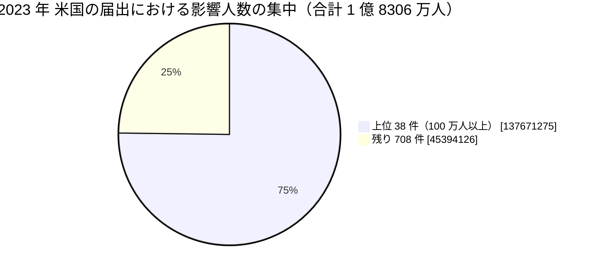

# 🇺🇸 2023 年 米国 HHS OCR 届出の全件集計

米国保健福祉省公民権局（HHS OCR）の侵害報告ポータルから 2023 年に届け出られた全件を取得し、集計した結果である。
[海外の履歴](2023-timeline.md)が個別の事例を扱うのに対し、本ページは米国の届出制度が捉えた全体の形を示す。

> [!NOTE]
> **集計の時点**：2026 年 8 月 26 日に取得した。
> ポータルの数値は精査によって改訂されるため、同じ条件で後日取得しても一致しない。
> 引用するときは集計の時点を併記してほしい。
> 取得の手順は [2025 年の集計ページ](2025-us-hhs.md#取得の手順)にまとめている。

## 何を数えているか

HHS OCR のポータルは、500 人以上に影響した侵害の届出を掲載する。
数えているのは**届出の件数**であり、発生した被害の件数ではない。

- **届出日であって発生日ではない**：侵入が前年でも、人数が確定した年に届け出られる。本ページの 2023 年は「2023 年に届け出られたもの」を指す
- **500 人未満は載らない**：小規模な診療所の侵害は集計に現れない
- **米国だけの制度である**：他国に同等の公開ポータルはなく、国ごとの比較には使えない
- **初報の人数が残る**：精査で人数が増えても、ポータルの表示が追随しない場合がある

## 全体

| 項目 | 値 |
|---|---|
| 届出件数 | **746 件** |
| 影響人数の合計 | **1 億 8306 万 5401 人** |
| 1 件あたりの中央値 | 7543 人 |
| 1 件あたりの平均 | 24 万 5395 人 |

影響人数のしきい値ごとの分布は次のとおりである。

| しきい値 | 件数 | 影響人数の合計 |
|---|---|---|
| 500 人以上（全件） | 746 | 1 億 8306 万 5401 |
| 1 万人以上 | 343 | 1 億 8188 万 3243 |
| 5 万人以上 | 201 | 1 億 7856 万 2995 |
| 10 万人以上 | 150 | 1 億 7493 万 2170 |
| 50 万人以上 | 62 | 1 億 5423 万 5366 |
| 100 万人以上 | 38 | 1 億 3767 万 1275 |

**分析**：件数は前年から 4% の増加に留まったが、影響人数は 6405 万人から 1 億 8306 万人へ **2.9 倍**になった。
100 万人以上の届出が 13 件から 38 件へ増えている。
中央値は 7543 人で前年とほぼ同じであり、増分は上位の事案に集中した。
この増加の相当部分は、[MOVEit Transfer の脆弱性](2023-timeline.md#GL-2023-26)を悪用した一連の侵害である。

## 侵害の類型

| 類型 | 件数 | 影響人数の合計 |
|---|---|---|
| ハッキング、IT インシデント | 608 | 1 億 7779 万 0903 |
| 不正なアクセス、開示 | 117 | 519 万 4165 |
| 盗難 | 12 | 2 万 9045 |
| 不適切な廃棄 | 5 | 1 万 2360 |
| 紛失 | 4 | 3 万 8928 |

**分析**：「ハッキング、IT インシデント」が人数の 97% を占める。
盗難、紛失、不適切な廃棄は合計 21 件で、2020 年の 67 件から 3 分の 1 以下になった。
物理的な媒体の管理は改善したが、外部からの侵入の規模がそれを大きく上回って拡大した。

## 対象組織の区分

| 区分 | 件数 | 影響人数の合計 |
|---|---|---|
| 医療提供者 | 468 | 5708 万 1151 |
| 事業提携者 | 172 | 1 億 0157 万 4639 |
| 医療保険 | 103 | 2430 万 3427 |
| 情報処理機関 | 2 | 9 万 6184 |
| （記載なし） | 1 | 1 万 |

**分析**：**事業提携者の影響人数が、初めて医療提供者を上回った**。
件数では医療提供者が 63% を占めるのに対し、人数では事業提携者が 55% を占める。
1 件あたりの平均は、医療提供者が 12 万 1968 人、事業提携者が 59 万 0550 人で、約 4.8 倍の差がある。

医療機関が自組織の防御だけで守れる範囲は、この年に人数で見て半分を割った。
委託先の管理は、契約上の要件の確認に留まらず、その事業者が止まったとき、あるいは侵害されたときに何が起きるかを事前に洗い出す作業になる（[委託先への依存](../../../response/dependencies.md)）。

## 侵害された場所

| 場所 | 件数 |
|---|---|
| ネットワークサーバ | 527 |
| 電子メール | 136 |
| 紙、フィルム | 39 |
| 電子診療記録 | 19 |
| デスクトップ PC | 5 |
| 電子診療記録、ネットワークサーバ | 4 |
| ノート PC | 4 |
| その他の携帯機器 | 4 |

**分析**：ネットワークサーバが 527 件で、全体の 71% を占める。
電子メールは 223 件（2020 年）から 136 件へ減った。
多要素認証の適用が進んだ結果とも読めるが、届出のデータからは因果を確認できない。

## 届出元の州（上位 10）

| 州 | 件数 |
|---|---|
| カリフォルニア（CA） | 82 |
| ニューヨーク（NY） | 66 |
| テキサス（TX） | 57 |
| ペンシルベニア（PA） | 40 |
| マサチューセッツ（MA） | 39 |
| イリノイ（IL） | 38 |
| フロリダ（FL） | 32 |
| ニュージャージー（NJ） | 22 |
| ジョージア（GA） | 22 |
| オハイオ（OH） | 18 |

## 届出の月別分布

| 月 | 件数 |
|---|---|
| 1 月 | 42 |
| 2 月 | 49 |
| 3 月 | 66 |
| 4 月 | 54 |
| 5 月 | 78 |
| 6 月 | 68 |
| 7 月 | 62 |
| 8 月 | 73 |
| 9 月 | 56 |
| 10 月 | 46 |
| 11 月 | 74 |
| 12 月 | 78 |

**分析**：MOVEit の脆弱性が悪用されたのは 5 月 27 日からである。
届出は 7 月以降に段階的に現れ、11 月と 12 月に山が来た。
攻撃から届出まで半年前後を要している。
発生の時期と届出の時期がずれるため、月別の分布から攻撃の時期は読み取れない。

## 影響人数の上位 50 件

50 位の影響人数は 63 万 2204 人である。

| 順位 | 影響人数 | 届出日 | 州 | 区分 | 類型 | 場所 | 組織 |
|---|---|---|---|---|---|---|---|
| 1 | 14,782,887 | 11/06/2023 | CO | 事業提携者 | ハッキング、IT インシデント | ネットワークサーバ | Welltok, Inc. |
| 2 | 11,270,000 | 07/31/2023 | TN | 事業提携者 | ハッキング、IT インシデント | ネットワークサーバ | HCA Healthcare |
| 3 | 9,302,588 | 11/03/2023 | NV | 事業提携者 | ハッキング、IT インシデント | ネットワークサーバ | Perry Johnson & Associates, Inc. dba PJ&A |
| 4 | 9,179,390 | 08/04/2023 | VA | 事業提携者 | ハッキング、IT インシデント | ネットワークサーバ | Maximus, Inc. |
| 5 | 8,627,242 | 05/26/2023 | GA | 事業提携者 | ハッキング、IT インシデント | ネットワークサーバ | Managed Care of North America |
| 6 | 7,056,189 | 09/05/2023 | CA | 医療保険 | ハッキング、IT インシデント | ネットワークサーバ | Delta Dental of California |
| 7 | 5,815,591 | 05/12/2023 | KY | 医療提供者 | ハッキング、IT インシデント | ネットワークサーバ | PharMerica Corporation |
| 8 | 4,786,241 | 12/21/2023 | NJ | 事業提携者 | ハッキング、IT インシデント | ネットワークサーバ | HealthEC LLC |
| 9 | 4,212,823 | 02/10/2023 | FL | 事業提携者 | ハッキング、IT インシデント | ネットワークサーバ | Reventics, LLC |
| 10 | 4,091,794 | 08/11/2023 | CO | 医療保険 | ハッキング、IT インシデント | ネットワークサーバ | Colorado Department of Health Care Policy & Financing |
| 11 | 3,388,856 | 02/01/2023 | CA | 医療提供者 | ハッキング、IT インシデント | ネットワークサーバ | Regal Medical Group,Lakeside Medical Organization, ADOC Acquisition, & Greater Covina Medical Group |
| 12 | 3,180,537 | 07/27/2023 | OH | 事業提携者 | ハッキング、IT インシデント | ネットワークサーバ | CareSource |
| 13 | 3,179,835 | 03/01/2023 | DE | 事業提携者 | 不正なアクセス、開示 | ネットワークサーバ | Cerebral, Inc |
| 14 | 3,099,502 | 04/13/2023 | FL | 事業提携者 | ハッキング、IT インシデント | ネットワークサーバ | NationsBenefits Holdings, LLC |
| 15 | 2,824,726 | 09/22/2023 | MO | 事業提携者 | ハッキング、IT インシデント | ネットワークサーバ | Navvis & Company, LLC |
| 16 | 2,700,000 | 12/18/2023 | TX | 事業提携者 | ハッキング、IT インシデント | ネットワークサーバ | ESO Solutions, Inc. |
| 17 | 2,662,337 | 05/24/2023 | MA | 医療保険 | ハッキング、IT インシデント | ネットワークサーバ | Harvard Pilgrim Health Care |
| 18 | 2,500,000 | 07/07/2023 | KY | 医療提供者 | ハッキング、IT インシデント | ネットワークサーバ | Norton Healthcare Inc. |
| 19 | 2,470,000 | 06/05/2023 | NY | 医療提供者 | ハッキング、IT インシデント | ネットワークサーバ | Enzo Clinical Labs, Inc. |
| 20 | 2,430,920 | 07/28/2023 | FL | 医療提供者 | ハッキング、IT インシデント | ネットワークサーバ | Florida Health Sciences Center, Inc. dba Tampa General Hospital |
| 21 | 2,369,026 | 10/30/2023 | CA | 医療提供者 | ハッキング、IT インシデント | ネットワークサーバ | Postmeds, Inc. |
| 22 | 2,342,357 | 07/28/2023 | MD | 医療保険 | ハッキング、IT インシデント | ネットワークサーバ | Centers for Medicare & Medicaid Services |
| 23 | 2,103,881 | 10/20/2023 | MI | 医療提供者 | ハッキング、IT インシデント | ネットワークサーバ | McLaren Health Care |
| 24 | 2,068,426 | 11/21/2023 | ME | 事業提携者 | ハッキング、IT インシデント | ネットワークサーバ | Berry, Dunn, McNeil & Parker, LLC |
| 25 | 1,975,066 | 09/29/2023 | FL | 事業提携者 | ハッキング、IT インシデント | ネットワークサーバ | Arietis Health, LLC |
| 26 | 1,925,397 | 05/12/2023 | MI | 医療提供者 | ハッキング、IT インシデント | ネットワークサーバ | Great Expressions Dental Centers |
| 27 | 1,866,694 | 07/14/2023 | MN | 事業提携者 | ハッキング、IT インシデント | ネットワークサーバ | Pension Benefit Information, LLC |
| 28 | 1,840,927 | 12/22/2023 | WA | 医療提供者 | ハッキング、IT インシデント | ネットワークサーバ | Fred Hutchinson Cancer Center |
| 29 | 1,752,076 | 08/15/2023 | OR | 事業提携者 | ハッキング、IT インシデント | ネットワークサーバ | Performance Health Technology |
| 30 | 1,744,655 | 10/10/2023 | GA | 事業提携者 | ハッキング、IT インシデント | ネットワークサーバ | NASCO |
| 31 | 1,475,991 | 12/11/2023 | CA | 医療保険 | ハッキング、IT インシデント | ネットワークサーバ | Keenan & Associates |
| 32 | 1,309,096 | 09/29/2023 | CA | 事業提携者 | ハッキング、IT インシデント | ネットワークサーバ | Prospect Medical Holdings, Inc. |
| 33 | 1,289,643 | 08/25/2023 | IA | 医療提供者 | ハッキング、IT インシデント | ネットワークサーバ | PurFoods, LLC |
| 34 | 1,248,546 | 09/24/2023 | IL | 医療提供者 | ハッキング、IT インシデント | ネットワークサーバ | Cook County Health and Hospitals System |
| 35 | 1,229,333 | 09/18/2023 | VA | 医療保険 | ハッキング、IT インシデント | ネットワークサーバ | Virginia Department of Medical Assistance Services |
| 36 | 1,225,054 | 09/15/2023 | MA | 事業提携者 | ハッキング、IT インシデント | ネットワークサーバ | Nuance Communications, Inc. |
| 37 | 1,173,555 | 03/16/2023 | TN | 事業提携者 | ハッキング、IT インシデント | ネットワークサーバ | Community Health Systems Professional Services Corporations (CHSPSC), LLC |
| 38 | 1,170,094 | 08/17/2023 | OH | 事業提携者 | ハッキング、IT インシデント | ネットワークサーバ | Baesman Group, Inc. |
| 39 | 997,097 | 03/10/2023 | MA | 医療提供者 | ハッキング、IT インシデント | ネットワークサーバ | ZOLL Services LLC |
| 40 | 911,757 | 12/31/2023 | MA | 医療提供者 | ハッキング、IT インシデント | 電子診療記録、ネットワークサーバ | Transformative Healthcare, on behalf of Fallon Ambulance Services |
| 41 | 904,672 | 05/16/2023 | NY | 医療提供者 | ハッキング、IT インシデント | ネットワークサーバ | Essen Medical Associates, P.C. |
| 42 | 902,540 | 12/12/2023 | CA | 医療提供者 | ハッキング、IT インシデント | ネットワークサーバ | City of Hope |
| 43 | 895,204 | 10/18/2023 | MS | 医療提供者 | ハッキング、IT インシデント | ネットワークサーバ | Singing River Health System and its wholly owned subsidiary, Singing River Gulfport |
| 44 | 845,441 | 11/03/2023 | CA | 医療提供者 | ハッキング、IT インシデント | ネットワークサーバ | Sutter Health |
| 45 | 767,670 | 10/24/2023 | MN | 医療提供者 | ハッキング、IT インシデント | ネットワークサーバ | MNGI Digestive Health, PA |
| 46 | 748,678 | 04/22/2023 | AL | 医療提供者 | ハッキング、IT インシデント | 電子メール | Upstream RollCo, LLC |
| 47 | 739,884 | 08/07/2023 | MO | 医療保険 | ハッキング、IT インシデント | ネットワークサーバ | Missouri Department of Social Services |
| 48 | 689,686 | 07/28/2023 | PA | 医療提供者 | ハッキング、IT インシデント | ネットワークサーバ | Allegheny County |
| 49 | 636,849 | 11/17/2023 | CA | 医療保険 | ハッキング、IT インシデント | ネットワークサーバ | California Physicians’ Service d/b/a Blue Shield of California |
| 50 | 632,204 | 08/04/2023 | MN | 事業提携者 | ハッキング、IT インシデント | ネットワークサーバ | Radius Global Solutions |

**分析**：上位 10 件のうち 6 件が事業提携者である。
[Welltok](2023-timeline.md#GL-2023-26)（1478 万 2887 人）、[Maximus](2023-timeline.md#GL-2023-26)（917 万 9390 人）、[Delta Dental of California](2023-timeline.md#GL-2023-26)（705 万 6189 人）、Colorado Department of Health Care Policy & Financing（409 万 1794 人）、[CareSource](2023-timeline.md#GL-2023-26)（318 万 0537 人）は、いずれも MOVEit Transfer の同一の脆弱性を起点とする。
上位 50 件の合計の相当部分が、1 個の脆弱性に帰着する。

2 位の [HCA Healthcare](2023-timeline.md#GL-2023-11)（1127 万人）は、患者への案内メールを作るために切り出した外部の保管領域である。
3 位の [Perry Johnson & Associates](2023-timeline.md#GL-2023-23)（930 万 2588 人）は診療録の書き起こしの受託である。
人数の上位は、診療系のシステムではなく、その周辺に置かれたデータで占められている。

## 全件を本ページに載せない理由

ポータルの数値は精査によって改訂され、届出の追加も続く。
静的な複製を置くと、参照した人が古い数値を引く。
本ページは集計と上位 50 件に留め、全件は[取得の手順](2025-us-hhs.md#取得の手順)とともに読み手が自分で取り直せるようにしている。

---

[← 海外の事例](README.md) | [2023 年の履歴](2023-timeline.md) | [2023 年の情勢](../years/2023-summary.md) | [トップへ](../../../../README.md)
