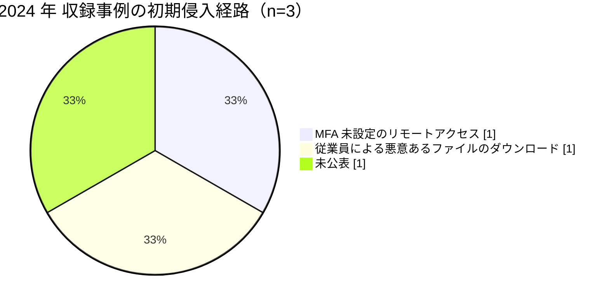

# 🌍 海外の事例 2024 年（サマリー）

> [!NOTE]
> 本ページの集計は、断りのない限り**本リポジトリに収録した事例**を母集団とする。
> 世界で発生した被害の全数ではない。
> 個別の経緯は [2024 年の履歴](2024-timeline.md) を参照してほしい。

## その年の要点

**分析**：医療の中間層が単一障害点であることが、二つの事例で示された年である。
[GL-2024-01 Change Healthcare](2024-timeline.md#GL-2024-01)は決済とレセプト処理を止め、医療機関のキャッシュフローを全米規模で悪化させた。
[GL-2024-03 Synnovis](2024-timeline.md#GL-2024-03)は病理検査を止め、輸血と手術を止めた。
どちらも病院そのものは侵害されていないが、診療は回らなくなった。

## 外部統計

| 統計 | 参照先 | 本リポジトリでの集計状況 |
|---|---|---|
| 米国の医療情報侵害の届出（500 人以上） | [HHS OCR Breach Portal](https://ocrportal.hhs.gov/ocr/breach/breach_report.jsf) | 未集計 |
| 医療分野の脅威情報 | [HHS HC3](https://www.hhs.gov/about/agencies/asa/ocio/hc3/index.html) | 未集計 |
| 英国の医療サービスへの影響 | [NHS England](https://www.england.nhs.uk/) | 未集計 |

数値は原典を確認したうえで追記する。

## 収録事例の集計

### 区分別の件数

| 区分 | 件数 | 内訳 |
|---|---|---|
| 病院系 | 1 | 米の大規模医療グループ 1 |
| 製薬企業系 | 0 | 収録なし |
| 医療関連事業者 | 2 | 医療決済 1（米）、病理検査 1（英） |

医療関連事業者の収録件数が病院系を上回った最初の年である。

### 初期侵入経路の内訳

### 止まった機能と診療への波及

| ID | 区分 | 止まった機能 | 診療への波及 |
|---|---|---|---|
| [GL-2024-01](2024-timeline.md#GL-2024-01) | 医療関連事業者 | 医療決済、レセプト処理 | 保険請求と処方箋の処理が滞り、医療機関の資金繰りが悪化 |
| [GL-2024-02](2024-timeline.md#GL-2024-02) | 病院系 | 電子カルテ（Epic） | 数週間の紙運用、救急搬送の転送 |
| [GL-2024-03](2024-timeline.md#GL-2024-03) | 医療関連事業者 | 病理検査、輸血用血液の照合 | 手術の延期、外来のキャンセル |

## この年を象徴する事例

- [GL-2024-01 Change Healthcare](2024-timeline.md#GL-2024-01)：MFA の欠落という基本の不備が、国家規模の被害を生んだ事例
- [GL-2024-03 Synnovis](2024-timeline.md#GL-2024-03)：臨床サービスの委託先が止まると、病院が健全でも診療が回らないことを示した事例

## 前年との差分

**分析**：2023 年までは病院系の被害が中心だったが、2024 年は医療関連事業者が 2 件を占めた。
ベンダリスク管理の対象を、IT ベンダから臨床サービスと決済の委託先まで広げる必要がある。
同じ年、国内では[岡山県精神科医療センター](../japan/2024-timeline.md#JP-2024-01)で、流出しうる診療情報の性質が論点になっている。

---

[← 2023 年サマリー](2023-summary.md) | [2024 年の履歴](2024-timeline.md) | [海外の事例](README.md) | [2025 年サマリー →](2025-summary.md) | [トップへ](../../../../README.md)
