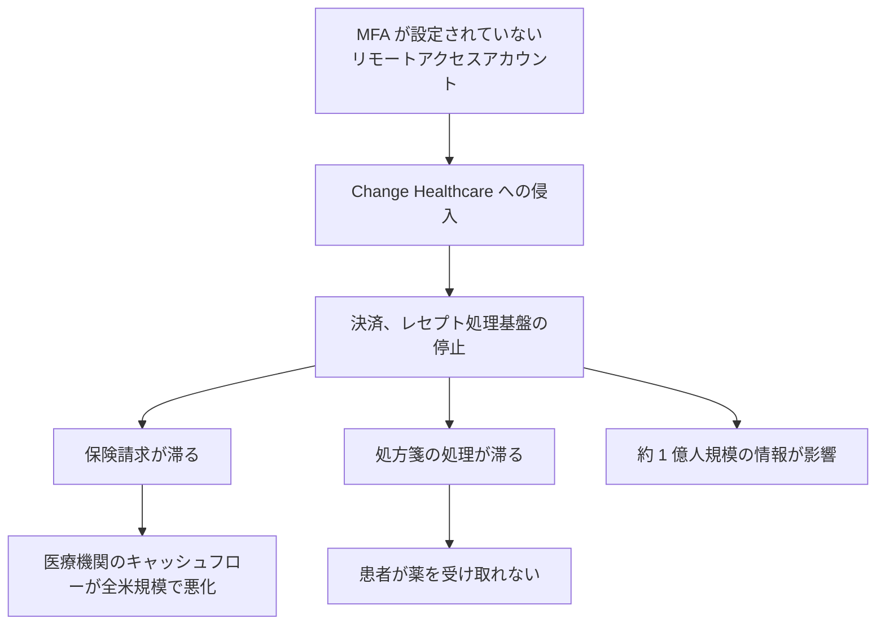

# 🌍 海外の事例 2024 年（履歴）

> [!NOTE]
> **表記ルール**：**事実**（当事者、公的機関の公表資料で確認できる内容）、**報道ベース**（報道のみで確認できる内容）、**分析**（筆者の解釈）を書き分ける。
> [対象の区分](../README.md#対象の区分)と[一次情報の強度](../README.md#一次情報の強度)の定義は、インシデント事例集のトップにまとめている。
> その年の情勢と集計は [2024 年サマリー](2024-summary.md) にまとめている。

## 収録件数

| 区分 | サイバー攻撃 | その他の事案 |
|---|---|---|
| 病院系 | 1 | 0 |
| 製薬企業系 | 0 | 0 |
| 医療関連事業者 | 2 | 0 |

---

## 病院系

| ID | 発生時期 | 組織、国 | 種別 | 初期侵入経路 | 診療への影響 | 一次情報の強度 |
|---|---|---|---|---|---|---|
| [GL-2024-02](#GL-2024-02) | 2024-05 | Ascension（米） | ランサムウェア（Black Basta） | 従業員による悪意あるファイルのダウンロード | 全米 140 病院規模で電子カルテ停止、数週間の紙運用 | 当事者公表 |

### GL-2024-02 Ascension（2024 年 5 月、米国）

**事実**

- 全米で 140 前後の病院を運営する Ascension が **Black Basta** の攻撃を受け、電子カルテ（Epic）を含むシステムが停止した。
- 数週間にわたり紙運用が続き、一部施設では救急搬送の受け入れを転送に切り替えた。
- Ascension は、従業員が業務ファイルと誤って悪意あるファイルをダウンロードしたことが起点であったと公表している。

**教訓（分析）**

- 大規模医療グループでは、1 施設の侵害がグループ全体の共通基盤に波及する。統合の利便性とブラスト半径はトレードオフの関係にある。
- 数週間の紙運用に耐えられるダウンタイム手順の整備と訓練が、実質的な最後の防衛線になる（[インシデント対応と事業継続](../../../response/)）。

**一次情報**

- [Ascension のサイバーセキュリティイベントに関する公表](https://about.ascension.org/)

---

## 製薬企業系

本年の収録はない。

---

## 医療関連事業者

| ID | 発生時期 | 組織、国 | 種別 | 初期侵入経路 | 影響 | 一次情報の強度 |
|---|---|---|---|---|---|---|
| [GL-2024-01](#GL-2024-01) | 2024-02 | Change Healthcare（米、医療決済） | ランサムウェア（ALPHV/BlackCat） | MFA 未設定のリモートアクセスアカウント | 全米の医療決済が停止。約 1 億人規模の情報が影響 | 当事者公表 |
| [GL-2024-03](#GL-2024-03) | 2024-06 | Synnovis（英、病理検査） | ランサムウェア（Qilin） | 未公表 | ロンドンの病院で輸血、検査に重大な影響 | 当事者公表 |

### GL-2024-01 Change Healthcare（2024 年 2 月、米国）

**事実**

- UnitedHealth Group 傘下の Change Healthcare が **ALPHV/BlackCat** の攻撃を受け、米国の医療決済、レセプト処理のインフラが広範囲に停止した。
- 保険請求と処方箋の処理が滞り、医療機関のキャッシュフローが全米規模で悪化するという、従来にない形の被害が生じた。
- UnitedHealth Group の CEO は米議会証言で、多要素認証が設定されていないリモートアクセスアカウントの認証情報が初期侵入に使われたことを認めている。
- 身代金の支払いが行われたことが公表されている（報道および議会証言で言及）。
- 影響を受けた個人の数は 1 億人規模とされ、米国医療史上最大級の情報侵害となった。

**教訓（分析）**

- 医療の攻撃対象は病院だけではない。決済、レセプト、検査、薬局、データ連携基盤といった医療の中間層が、機能が集中しているために単一障害点になる。
- ベンダリスク管理において、「その事業者が止まったら、自院の何が止まるか」を事前に洗い出しておく必要がある。
- すべてのリモートアクセスへの MFA 適用という基本の欠落が、国家規模の被害を生んだ。

**一次情報**

- [UnitedHealth Group の公表](https://www.unitedhealthgroup.com/)
- [米下院エネルギー商業委員会の公聴会記録](https://energycommerce.house.gov/)
- [HHS OCR の関連情報](https://www.hhs.gov/hipaa/for-professionals/security/index.html)

## その他の事案（サイバー攻撃以外）

サポート詐欺、システム障害、内部不正、機器や記憶媒体の紛失と盗難、委託先の管理不備による漏えい、誤送付や誤公開、ドメインの失効を記録する。
類型の定義と、主分類との判定基準は[事案の類型](../README.md#事案の類型)にまとめている。

本年の収録はない。

---

### GL-2024-03 Synnovis（2024 年 6 月、英国）

**事実**

- ロンドンの複数の NHS トラストに検査サービスを提供する **Synnovis**（病理検査の合弁事業体）が **Qilin** の攻撃を受けた。
- 輸血用血液の照合を含む検査業務が停止し、手術の延期と外来のキャンセルが多数発生した。O 型血液の供給を求める異例の呼びかけが行われた。
- NHS は影響の詳細を段階的に公表しており、患者への臨床的影響についても後日報告が行われている。

**教訓（分析）**

- 検査（ラボ）は、医療のあらゆる意思決定の入口にある。ここが止まると、医療機関そのものが健全でも診療が回らない。
- 重要な委託先の定義には、IT ベンダだけでなく臨床サービスの委託先を含める必要がある。

**一次情報**

- [Synnovis の公表](https://www.synnovis.co.uk/)
- [NHS England のサイバーインシデント情報](https://www.england.nhs.uk/)

---

[← 2023 年](2023-timeline.md) | [2024 年サマリー](2024-summary.md) | [海外の事例](README.md) | [2025 年 →](2025-timeline.md) | [トップへ](../../../../README.md)
