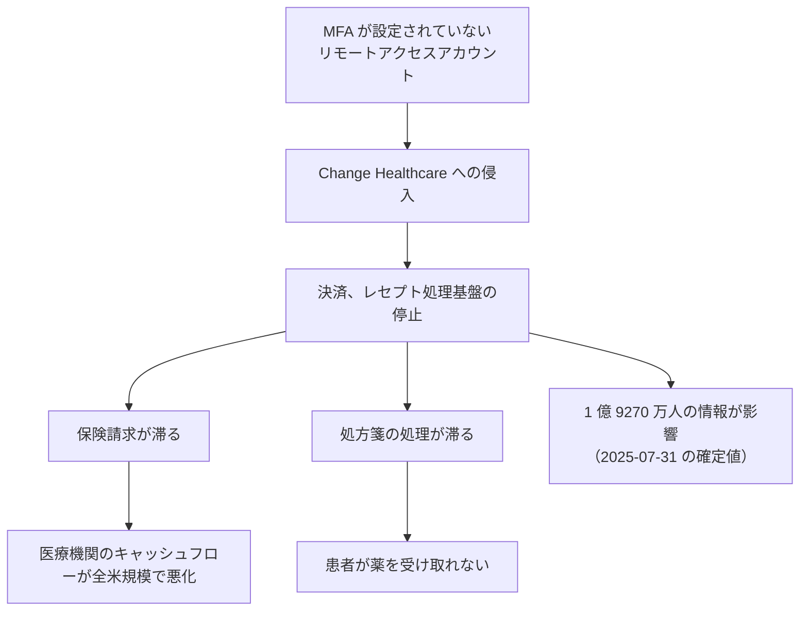

# 🌍 海外の事例 2024 年（履歴）

> [!NOTE]
> **表記ルール**：本ページでは、**事実**（一次情報で確認できる内容。出典を併記する）、**報道ベース**（報道や第三者の集計のみで確認でき、当事者の公表資料では裏付けが取れていない内容）、**分析**（筆者の解釈）を書き分ける。
> [対象の区分](../README.md#対象の区分)と[一次情報の強度](../README.md#一次情報の強度)の定義は、インシデント事例集のトップにまとめている。
> その年の情勢と集計は [2024 年の情勢](../years/2024-summary.md) にまとめている。

## 収録件数

| 区分 | サイバー攻撃 | その他の事案 |
|---|---|---|
| 病院系 | 18 | 1 |
| 製薬企業系 | 2 | 0 |
| 医療関連事業者 | 19 | 1 |

収録は本リポジトリが一次情報を確認できた事案に限る。
海外で公表された医療関連の事案がこれで尽きることを示すものではない。
米国の件数は、保健福祉省公民権局（HHS OCR）の侵害報告ポータルに届け出られた影響人数を典拠とする。
2024 年に同ポータルへ届け出られた全 741 件の集計は、[2024 年 米国 HHS OCR 届出の全件集計](2024-us-hhs.md)にまとめている。

---

## 病院系

| ID | 発生時期 | 組織、国 | 種別 | 初期侵入経路 | 診療への影響 | 業務停止期間 | 一次情報の強度 |
|---|---|---|---|---|---|---|---|
| [GL-2024-04](#GL-2024-04) | 2024-01 | Ann & Robert H. Lurie Children's Hospital of Chicago（米） | ランサムウェア（Rhysida） | 未公表 | 電子カルテと患者ポータルが停止。処方と検査を手作業へ | 電子カルテの復旧まで **約 1 か月**（01-31 から 03-04）、完全復旧は 05-20 | 当事者公表 |
| [GL-2024-05](#GL-2024-05) | 2024-01 | INTEGRIS Health（米、オクラホマ州） | データ侵害と患者への恐喝 | 未公表 | 公表なし | 診療の停止は公表されていない。患者本人へ恐喝メールが届いた | 当事者公表 |
| [GL-2024-06](#GL-2024-06) | 2024-02 | ルーマニアの 100 超の医療機関 | ランサムウェア（Backmydata） | 病院情報システム Hipocrate の提供事業者 | 全国の病院が紙運用へ。小児と腫瘍の専門施設を含む | 26 施設が暗号化され、79 施設が予防的に停止。復旧まで **数日から数週間** | 当事者公表 |
| [GL-2024-07](#GL-2024-07) | 2024-02 | Centre Hospitalier d'Armentières（仏、ノール県） | ランサムウェア | 未公表 | 救急の受入を制限し、患者を他院へ転送 | 情報システムの停止が **数週間** | 当事者公表 |
| [GL-2024-08](#GL-2024-08) | 2024-02 | Los Angeles County Department of Public Health（米） | フィッシング | 職員のメールアカウント 53 件の侵害 | 公表なし | 診療の停止は公表されていない | 当事者公表 |
| [GL-2024-09](#GL-2024-09) | 2024-03 | NHS Dumfries and Galloway（英、スコットランド） | ランサムウェア（INC Ransom） | 未公表 | 診療は継続 | **診療の停止なし**。窃取データ 3 TB を公開された | 当事者公表 |
| [GL-2024-10](#GL-2024-10) | 2024-03 | Kootenai Health（米、アイダホ州） | ランサムウェア（3AM） | 未公表 | 公表なし | 診療の停止は公表されていない | 当事者公表 |
| [GL-2024-11](#GL-2024-11) | 2024-04 | Centre Hospitalier Simone Veil de Cannes（仏） | ランサムウェア（LockBit 3.0） | 未公表 | 予定手術を延期し、緊急でない診療を他院へ。全面的に紙運用へ | 情報システムの停止が **数週間**。身代金は不払い | 当事者公表 |
| [GL-2024-02](#GL-2024-02) | 2024-05 | Ascension（米、約 140 病院） | ランサムウェア（Black Basta） | 従業員による悪意あるファイルのダウンロード | 全米 140 病院規模で電子カルテ停止、数週間の紙運用 | 電子カルテの全社復旧まで **約 5 週間**（05-08 から 06-14） | 当事者公表 |
| [GL-2024-12](#GL-2024-12) | 2024-05 | Palomar Health Medical Group（米、カリフォルニア州） | 不正アクセス | 未公表 | 公表なし | 診療の停止は公表されていない | 当事者公表 |
| [GL-2024-13](#GL-2024-13) | 2024-07 | Florida Department of Health（米） | データ侵害と恐喝（RansomHub） | 未公表 | 出生と死亡の証明書の発行が停止 | 証明書の発行停止が **数週間** | 当事者公表 |
| [GL-2024-14](#GL-2024-14) | 2024-08 | McLaren Health Care（米、ミシガン州、13 病院） | ランサムウェア（INC Ransom） | 未公表 | 予約と処置を取り消し、電子カルテを停止 | 情報システムの停止が **数週間** | 当事者公表 |
| [GL-2024-15](#GL-2024-15) | 2024-09 | UMC Health System（米、テキサス州ラボック） | ランサムウェア | 未公表 | 救急搬送と小児患者の転送。紙運用へ | 情報システムの停止が **約 2 週間** | 当事者公表 |
| [GL-2024-38](#GL-2024-38) | 2024-09 | Boston Children's Health Physicians（米、ニューヨーク州、コネチカット州） | ランサムウェア（BianLian） | IT 事業者のシステム | 電子カルテは別ネットワークで影響なし | **診療の停止なし** | 当事者公表 |
| [GL-2024-16](#GL-2024-16) | 2024-10 | Community Health Center（米、コネチカット州） | 不正アクセス（データ窃取） | 未公表 | 診療は継続 | **診療の停止なし**。106 万 0936 人 | 当事者公表 |
| [GL-2024-17](#GL-2024-17) | 2024-11 | Alder Hey Children's NHS Foundation Trust ほか（英、リバプール） | データ窃取と恐喝（INC Ransom） | 委託先の情報共有の仕組み | 診療は継続 | **診療の停止なし**。窃取データを公開された | 当事者公表 |
| [GL-2024-18](#GL-2024-18) | 2024-11 | Wirral University Teaching Hospital NHS Foundation Trust（英） | ランサムウェア | 未公表 | 予定手術と外来を延期し、救急搬送を転送 | 情報システムの停止が **数週間** | 当事者公表 |
| [GL-2024-19](#GL-2024-19) | 2024-12 | PIH Health（米、カリフォルニア州、3 病院） | ランサムウェア | 未公表 | 電話とネットワークが停止。紙運用へ | 情報システムの停止が **数週間**。294 万 7264 人 | 当事者公表 |

### GL-2024-04 Ann & Robert H. Lurie Children's Hospital of Chicago（2024 年 1 月、米国）

**事実**

- 発生時期：2024 年 1 月 26 日から 31 日にかけて侵入され、1 月 31 日にシステムを停止した。
- 対象組織：イリノイ州シカゴの小児専門病院。
- 攻撃種別：ランサムウェア。攻撃グループ Rhysida が犯行を主張し、340 万ドルを要求した。
- 初期侵入経路：未公表。
- 侵害範囲：電子カルテ（Epic）、患者ポータル（MyChart）、電子メール、電話。
- 情報流出：同院がメイン州司法長官へ届け出た人数は **79 万 1784 人**である（HHS OCR のポータルの掲載は 77 万 5860 人）。氏名、住所、生年月日、連絡先、社会保障番号、健康保険情報、傷病名、診断、治療の内容が対象になった。
- 診療への影響：処方と検査の依頼を手作業へ切り替えた。家族は患者ポータルで検査結果を参照できなくなった。
- 業務停止期間：電子メールと大半の電話が 2 月中旬に戻り、電子カルテは 3 月 4 日に復旧した。**約 1 か月**にあたる。
- 完全復旧：**2024 年 5 月 20 日**。停止中に紙で記録した内容を電子カルテへ入力し直す作業が続いた。
- 身代金：同院は支払いについて公表していない。攻撃者は窃取データを競売にかけたと主張した。

**分析**

- 電子カルテの復旧（3 月 4 日）と完全復旧（5 月 20 日）のあいだに、2 か月半の開きがある。この期間は、紙で記録した診療内容を電子カルテへ戻す作業に費やされた。停止期間を「システムが戻るまで」で数えると、この作業が見えない。
- 小児専門病院である。保護者と患者の双方の情報が結び付いた形で保持され、社会保障番号が発行されて間もない子どもの情報が含まれる。悪用が発覚するまでの期間が長い。
- 攻撃グループ Rhysida は、この年に医療機関を続けて攻撃した。翌 2025 年には [MedStar Health](2025-timeline.md#GL-2025-79) と [Spindletop Center](2025-timeline.md#GL-2025-80) が同グループの被害を公表している。

**一次情報**

- [Ann & Robert H. Lurie Children's Hospital of Chicago](https://www.luriechildrens.org/)
- [HHS OCR 侵害報告ポータル](https://ocrportal.hhs.gov/ocr/breach/breach_report.jsf)

---

### GL-2024-05 INTEGRIS Health（2024 年 1 月、米国）

**事実**

- 発生時期：2023 年 11 月 28 日から 12 月 5 日にかけて侵入されていた。
- 対象組織：オクラホマ州最大の非営利医療グループ。
- 攻撃種別：データ侵害と恐喝。
- 初期侵入経路：未公表。
- 侵害範囲：氏名、生年月日、連絡先、社会保障番号、健康保険情報。
- 情報流出：238 万 5646 人（HHS OCR への届出、2024 年 1 月 26 日）。
- 恐喝の形態：攻撃者は、**患者本人に対して直接、電子メールで恐喝**を行った。支払わなければ情報を売却すると通告した。
- 診療への影響：診療の停止は公表されていない。
- 公表された対策：対象者へ通知し、攻撃者からのメールに応じないよう呼びかけた。

**分析**

- 組織ではなく患者本人を恐喝する形態が、米国の大規模医療グループでも現れた。[Vastaamo](2020-timeline.md#GL-2020-03) から 4 年を経て、同じ型が規模を変えて再現している。
- 医療機関の側は、この段階で技術的にできることがない。患者への説明と、詐欺を見分けるための情報提供が対応の中心になる。インシデント対応計画に、患者向けの相談窓口と情報発信を含めておく必要がある（[インシデント対応と事業継続](../../../response/)）。

**一次情報**

- [INTEGRIS Health](https://integrisok.com/)
- [HHS OCR 侵害報告ポータル](https://ocrportal.hhs.gov/ocr/breach/breach_report.jsf)

---

### GL-2024-06 ルーマニアの 100 超の医療機関（2024 年 2 月、ルーマニア）

**事実**

- 発生時期：2024 年 2 月 10 日に小児病院で暗号化が始まり、2 月 11 日から 12 日にかけて他の施設へ広がった。
- 対象組織：ルーマニア国内の 100 を超える病院と医療施設。小児と腫瘍の専門施設を含む。
- 攻撃種別：ランサムウェア（Backmydata、Phobos の系統）。
- 初期侵入経路：病院情報システム Hipocrate Information System（HIS）を提供する Romanian Soft Company（RSC）。同社の基盤を経由して各施設へ広がった。
- 侵害範囲：**26 施設**でデータが暗号化され、**79 施設**が感染の拡大を防ぐために自らシステムを停止した。
- 診療への影響：全国の病院が紙による運用へ切り替え、入院の受付と治療の記録を手作業で行った。
- 業務停止期間：多くの施設が新しいバックアップを保持しており、復旧は数日から数週間で進んだ。
- 身代金：3.5 ビットコイン（当時の約 15 万 7000 ユーロ）が要求された。
- 公表された対策：ルーマニア国家サイバーセキュリティ局（DNSC）が対応にあたり、施設ごとの状況を公表した。

**分析**

- 1 社の病院情報システムを 100 超の施設が共有していた。同じ製品を同じ事業者が同じ方式で運用していると、1 回の侵害が国内の医療機関の大半に届く。国内でも電子カルテの提供事業者は限られており、同じ構造がある。
- 停止した 79 施設は、暗号化されたのではなく自ら止めた。共通の基盤を使っている以上、自分が侵害されたかどうかを確認するまで止めるほかない。確認に要する時間が、そのまま診療の停止時間になる。
- 多くの施設が新しいバックアップを保持していたため、復旧は比較的早く進んだ。バックアップの取得と復元の検証が、この規模の事案で被害の長さを決めた。

**一次情報**

- [Directoratul Național de Securitate Cibernetică（DNSC）](https://dnsc.ro/)
- [ルーマニア保健省](https://www.ms.ro/)

---

### GL-2024-07 Centre Hospitalier d'Armentières（2024 年 2 月、フランス）

**事実**

- 発生時期：2024 年 2 月 11 日から 12 日にかけての夜間。
- 対象組織：フランス・ノール県アルマンティエールの公立病院。
- 攻撃種別：ランサムウェア。
- 初期侵入経路：未公表。
- 侵害範囲：病院の情報システム。
- 診療への影響：救急の受入を制限し、患者を近隣の施設へ転送した。白色計画を発動した。
- 業務停止期間：情報システムの停止が数週間続いた。
- 公表された対策：ANSSI と地域保健庁（ARS）が対応に加わった。

**分析**

- フランスでは 2021 年のダックス以降、公立病院への攻撃が毎年続いている。白色計画の発動と、地域保健庁を通じた近隣施設との調整が、初動の定型になった。制度として手順が用意されていることが、初動の速さの差になる。

**一次情報**

- [Centre Hospitalier d'Armentières](https://www.ch-armentieres.fr/)
- [Cyberveille du CERT Santé](https://cyberveille.esante.gouv.fr/)（フランス保健分野 CERT）

---

### GL-2024-08 Los Angeles County Department of Public Health（2024 年 2 月、米国）

**事実**

- 発生時期：2024 年 2 月 19 日から 20 日にかけて。
- 対象組織：ロサンゼルス郡の公衆衛生部門。
- 攻撃種別：フィッシング。
- 初期侵入経路：職員のメールアカウント **53 件**が、フィッシングにより侵害された。
- 侵害範囲：受信箱の中身。氏名、住所、生年月日、社会保障番号、運転免許証番号、診療記録番号、Medicare と Medi-Cal の識別番号、診断名、治療の情報、検査結果、金融情報。
- 情報流出：約 20 万人。
- 診療への影響：診療の停止は公表されていない。
- 公表された対策：対象のアカウントを無効化し、職員への教育を強化した。

**分析**

- 1 回のフィッシングで 53 件のアカウントが同時に侵害された。個々の職員の注意で防ぐ設計では、この規模は止まらない。多要素認証と、認証の異常を検知する仕組みが必要になる（[認証とアクセス管理](../../../technology/identity.md)）。
- 公衆衛生部門の受信箱には、感染症の届出、検査結果、支援の申請が集まる。診療を行わない部門でも、保有する情報の内容は診療機関と変わらない。

**一次情報**

- [Los Angeles County Department of Public Health](http://publichealth.lacounty.gov/)
- [HHS OCR 侵害報告ポータル](https://ocrportal.hhs.gov/ocr/breach/breach_report.jsf)

---

### GL-2024-09 NHS Dumfries and Galloway（2024 年 3 月、英国）

**事実**

- 発生時期：2024 年 3 月 15 日。
- 対象組織：スコットランド南西部の NHS 保健委員会。
- 攻撃種別：ランサムウェア。攻撃グループ INC Ransom が犯行を主張した。
- 初期侵入経路：未公表。
- 侵害範囲：攻撃者は **3 テラバイト**のデータを取得したと主張した。
- 情報流出：3 月下旬に、患者と医師のあいだの書簡、検査の分析結果を含む「証拠」が公開された。5 月には大量のデータが公開された。
- 診療への影響：診療は継続した。
- 身代金：**支払わなかった**。
- 公表された対策：英国国家サイバーセキュリティセンター（NCSC）、スコットランド政府、警察と連携して対応した。対象者への説明を継続的に公表した。

**分析**

- 診療が止まらなかった一方で、患者と医師のやり取りが公開された。可用性を守れても、機密性の被害は別に生じる。
- 公開されたのは書簡と検査結果である。患者が医師に伝えた内容が、そのまま外部に出た。診療の記録は、患者が医療者を信頼して話した内容を含む。漏えいの影響は、情報の項目ではなく信頼の関係に及ぶ。

**一次情報**

- [NHS Dumfries and Galloway](https://www.nhsdg.co.uk/)
- [National Cyber Security Centre（UK）](https://www.ncsc.gov.uk/)

---

### GL-2024-10 Kootenai Health（2024 年 3 月、米国）

**事実**

- 発生時期：2024 年 2 月 22 日から 3 月 2 日にかけて侵入されていた。
- 対象組織：アイダホ州コーダレーンの地域医療グループ。
- 攻撃種別：ランサムウェア。攻撃グループ 3AM が犯行を主張し、窃取したデータを公開した。
- 初期侵入経路：未公表。
- 侵害範囲：氏名、生年月日、社会保障番号、運転免許証番号、健康保険情報、診療情報。
- 情報流出：約 46 万 4000 人。
- 診療への影響：診療の停止は公表されていない。

**一次情報**

- [Kootenai Health](https://www.kh.org/)
- [HHS OCR 侵害報告ポータル](https://ocrportal.hhs.gov/ocr/breach/breach_report.jsf)

---

### GL-2024-11 Centre Hospitalier Simone Veil de Cannes（2024 年 4 月、フランス）

**事実**

- 発生時期：2024 年 4 月 16 日。
- 対象組織：フランス・アルプ＝マリティーム県カンヌの公立病院。約 840 床を持つ。
- 攻撃種別：ランサムウェア。攻撃グループ LockBit 3.0 が犯行を主張した。
- 初期侵入経路：未公表。
- 侵害範囲：病院の情報システム全般。
- 情報流出：身代金の支払いを拒んだのち、攻撃者がデータを公開した。
- 診療への影響：予定されていた手術を延期し、緊急でない診療を近隣の施設へ回した。全面的に紙による運用へ切り替えた。
- 業務停止期間：情報システムの停止が数週間続いた。
- 身代金：**支払わなかった**。同院は当初から交渉を行わない方針を公表した。
- 公表された対策：ANSSI、CERT Santé、地域保健庁と連携し、復旧の進捗を継続的に公表した。

**分析**

- 攻撃の直後に、交渉を行わない方針を対外的に明示した。方針を先に公表すると、攻撃者との交渉の余地はなくなるが、組織の内部で判断を巡る混乱が起きない。フランスの公立病院ではこの運用が定着している。
- 復旧の進捗を段階的に公表し続けた。患者と近隣の医療機関が、いつ何が戻るかを見て予定を組める。公表は説明責任であると同時に、地域の医療提供を成り立たせる手段でもある。

**一次情報**

- [Centre Hospitalier de Cannes](https://www.ch-cannes.fr/)
- [Cyberveille du CERT Santé](https://cyberveille.esante.gouv.fr/)（フランス保健分野 CERT）

---

### GL-2024-02 Ascension（2024 年 5 月、米国）

**事実**

- 発生時期：2024 年 5 月 8 日に電子カルテ（Epic）を含むシステムが停止した。
- 対象組織：全米で 140 前後の病院を運営する非営利の医療グループ。
- 攻撃種別：ランサムウェア（Black Basta）。
- 初期侵入経路：従業員が業務ファイルと誤って悪意あるファイルをダウンロードしたことが起点であったと公表している。
- 侵害範囲：電子カルテ、検査、画像、処方の各系統。
- 情報流出：**546 万 6931 人**（HHS OCR への届出、2024 年 7 月 3 日）。
- 診療への影響：一部施設では救急搬送の受け入れを転送に切り替えた。数週間にわたり紙による運用を続けた。
- 業務停止期間：6 月 11 日までに 14 拠点で復旧し、6 月 14 日に全ネットワークでの復旧を完了する見込みと公表した。**約 5 週間**にあたる。
- 完全復旧：2024 年 6 月 14 日に、全ネットワークで電子カルテを復旧した。

**分析**

- 大規模医療グループでは、1 施設の侵害がグループ全体の共通基盤に波及する。統合の利便性とブラスト半径はトレードオフの関係にある。
- 数週間の紙運用に耐えられるダウンタイム手順の整備と訓練が、実質的な最後の防衛線になる（[インシデント対応と事業継続](../../../response/)）。
- 電子カルテの復旧は拠点ごとに進み、全体が戻るまで約 5 週間かかった。復旧の順序をあらかじめ決めていないと、施設のあいだで再開の時期に差が生じ、患者の振り分けが読めなくなる。
- 起点は、職員が業務のファイルと誤って開いた 1 個のファイルである。この一点を防ぐ対策と、開かれたあとに広がりを止める対策の両方が要る。後者は、権限の分離とネットワークの分離で決まる（[ネットワークの分離](../../../technology/segmentation.md)）。

**一次情報**

- [Ascension のサイバーセキュリティイベントに関する公表](https://about.ascension.org/)
- [HHS OCR 侵害報告ポータル](https://ocrportal.hhs.gov/ocr/breach/breach_report.jsf)

---

### GL-2024-12 Palomar Health Medical Group（2024 年 5 月、米国）

**事実**

- 発生時期：2024 年 4 月 23 日から 5 月 5 日にかけて侵入されていた。
- 対象組織：カリフォルニア州サンディエゴ郡の医療グループ。
- 攻撃種別：不正アクセス。
- 侵害範囲：氏名、住所、生年月日、社会保障番号、運転免許証番号、健康保険情報、診療情報。
- 情報流出：114 万 0221 人（HHS OCR への届出、2024 年 7 月 3 日）。
- 診療への影響：診療の停止は公表されていない。

**一次情報**

- [Palomar Health](https://www.palomarhealth.org/)
- [HHS OCR 侵害報告ポータル](https://ocrportal.hhs.gov/ocr/breach/breach_report.jsf)

---

### GL-2024-13 Florida Department of Health（2024 年 7 月、米国）

**事実**

- 発生時期：2024 年 7 月上旬。
- 対象組織：フロリダ州保健局。
- 攻撃種別：データ侵害と恐喝。攻撃グループ RansomHub が犯行を主張した。
- 初期侵入経路：未公表。
- 侵害範囲：州の重要統計（vital statistics）の仕組み。
- 情報流出：72 万 9699 人（HHS OCR への届出、2024 年 8 月 23 日）。
- 診療への影響：**出生証明書と死亡証明書の発行が停止**した。
- 業務停止期間：証明書の発行停止が数週間続いた。
- 身代金：州の方針により**支払わなかった**。

**分析**

- 止まったのは診療ではなく、出生と死亡の証明である。死亡証明書が出ないと埋葬と保険の手続きが進まず、出生証明書が出ないと新生児の登録が滞る。医療の周辺にある行政の記録が、生活の手続きを支えている。
- 事業継続計画の対象を診療系に限ると、この種の機能は視野に入らない。組織が担う機能のうち、止まると外部の手続きが進まなくなるものを洗い出す必要がある。

**一次情報**

- [Florida Department of Health](https://www.floridahealth.gov/)
- [HHS OCR 侵害報告ポータル](https://ocrportal.hhs.gov/ocr/breach/breach_report.jsf)

---

### GL-2024-14 McLaren Health Care（2024 年 8 月、米国）

**事実**

- 発生時期：2024 年 7 月 17 日から 8 月 3 日にかけて侵入され、8 月 5 日に把握した。
- 対象組織：ミシガン州で 13 病院を運営する医療グループ。
- 攻撃種別：ランサムウェア。攻撃グループ INC Ransom が犯行を主張した。
- 初期侵入経路：未公表。
- 侵害範囲：氏名、社会保障番号、健康保険情報、診断名、治療の情報。
- 情報流出：約 74 万 3000 人。フォレンジック調査は 2025 年 5 月 5 日に完了した。
- 診療への影響：予約と処置を取り消し、電子カルテを停止した。
- 業務停止期間：情報システムの停止が数週間続いた。
- 司法：2023 年と 2024 年の 2 度の侵害をめぐる集団訴訟について、1400 万ドルの和解が提案された。

**分析**

- [2023 年 8 月の侵害](2023-timeline.md#GL-2023-13)から 1 年で、同じグループが再び侵害された。1 度目の対応で何が変わったかを外部から確認する手段はないが、2 度目が起きた事実は残る。
- 侵入から把握まで 2 週間以上、通知が確定するまで 9 か月を要した。発生年と届出年がずれる典型である。

**一次情報**

- [McLaren Health Care](https://www.mclaren.org/)
- [HHS OCR 侵害報告ポータル](https://ocrportal.hhs.gov/ocr/breach/breach_report.jsf)

---

### GL-2024-15 UMC Health System（2024 年 9 月、米国）

**事実**

- 発生時期：2024 年 9 月 26 日。
- 対象組織：テキサス州ラボックの公立医療グループ（Lubbock County Hospital District）。同地域の第 1 種外傷センターを持つ。
- 攻撃種別：ランサムウェア。
- 初期侵入経路：未公表。
- 侵害範囲：氏名、生年月日、社会保障番号、運転免許証番号、健康保険情報、診断と治療の情報。
- 情報流出：146 万 1776 人（HHS OCR への届出、2024 年 11 月 22 日）。
- 診療への影響：救急搬送と小児患者を近隣の施設へ回した。紙による運用へ切り替えた。
- 業務停止期間：情報システムの停止が約 2 週間続いた。

**分析**

- 地域で唯一の外傷センターが受入を止めた。救急の振替先が数百キロメートル離れることもある地域では、停止の影響が搬送時間の延長として直接患者に及ぶ。
- 病院の停止を評価するとき、代替となる施設までの距離を指標に含める必要がある。都市部と地方で、同じ停止時間が持つ意味が変わる。

**一次情報**

- [UMC Health System](https://www.umchealthsystem.com/)
- [HHS OCR 侵害報告ポータル](https://ocrportal.hhs.gov/ocr/breach/breach_report.jsf)

---

### GL-2024-16 Community Health Center（2024 年 10 月、米国）

**事実**

- 発生時期：2024 年 10 月 14 日に侵入され、2025 年 1 月 2 日に検知した。
- 対象組織：コネチカット州の地域医療センター。低所得層向けの診療を担う。
- 攻撃種別：不正アクセス（データ窃取）。
- 初期侵入経路：未公表。
- 侵害範囲：氏名、生年月日、住所、電話番号、電子メールアドレス、社会保障番号、診断名、治療の内容、検査結果、健康保険情報。小児患者とその保護者、職員 4200 人を含む。
- 情報流出：106 万 0936 人。
- 診療への影響：データの削除も暗号化もなく、日常業務への影響は生じなかった。
- 業務停止期間：**診療の停止なし**。

**分析**

- 侵入から検知まで 2 か月半かかった。暗号化を伴わない侵入は、業務に異常が出ないため、監視の仕組みがなければ気付けない。診療が止まらないことは、検知できていることを意味しない（[ログと監視](../../../technology/logging.md)）。

**一次情報**

- [Community Health Center](https://www.chc1.com/)
- [HHS OCR 侵害報告ポータル](https://ocrportal.hhs.gov/ocr/breach/breach_report.jsf)

---

### GL-2024-17 Alder Hey Children's NHS Foundation Trust ほか（2024 年 11 月、英国）

**事実**

- 発生時期：2024 年 11 月 28 日、攻撃グループ INC Ransom が自らの公開サイトに掲載した。
- 対象組織：リバプールの Alder Hey Children's NHS Foundation Trust、Liverpool Heart and Chest Hospital、および Royal Liverpool University Hospital の一部。
- 攻撃種別：データ窃取と恐喝。
- 初期侵入経路：3 つのトラストが共同で利用していた情報共有の仕組み。
- 侵害範囲：2018 年から 2024 年までの患者記録、寄付者の情報、調達のデータ。
- 情報流出：攻撃者は、患者と寄付者の氏名と住所、寄付の金額、患者の診療報告書（患者番号と生年月日を含む）、財務文書の一部を公開した。
- 診療への影響：3 つのトラストとも診療は継続した。
- 公表された対策：NHS England と NCSC へ報告し、対象者への説明を公表した。

**分析**

- 侵入されたのは病院ではなく、3 トラストが共同で使っていた仕組みである。共同利用の基盤は、参加する組織のどこが管理責任を持つかが曖昧になりやすい。
- 小児病院の患者記録と、その病院への寄付者の名簿が同じ侵害で出た。寄付者名簿の問題は、[2020 年の Blackbaud](2020-timeline.md#GL-2020-21) で既に現れている。4 年を経ても、寄付と診療のデータが同じ管理下に置かれる構造は変わっていない。

**一次情報**

- [Update on cyber incident](https://www.alderhey.nhs.uk/update-on-cyber-incident/)（Alder Hey Children's Hospital Trust）
- [NHS England](https://www.england.nhs.uk/)

---

### GL-2024-18 Wirral University Teaching Hospital NHS Foundation Trust（2024 年 11 月、英国）

**事実**

- 発生時期：2024 年 11 月 25 日。
- 対象組織：イングランド北西部のウィラルにある NHS トラスト。
- 攻撃種別：ランサムウェア。
- 初期侵入経路：未公表。
- 侵害範囲：病院の情報システム。
- 診療への影響：重大インシデント（major incident）を宣言し、予定手術と外来の予約を延期した。救急搬送の一部を他院へ回した。
- 業務停止期間：情報システムの停止が数週間続いた。
- 公表された対策：復旧の進捗を継続的に公表した。

**分析**

- 同じ月に、英国の 2 つの地域で NHS の医療機関が被害を公表した。同じ年の 6 月には検査を受託する [Synnovis](#GL-2024-03) も止まっており、2024 年は英国の医療分野に攻撃が集中した年である。

**一次情報**

- [Wirral University Teaching Hospital NHS Foundation Trust](https://www.wuth.nhs.uk/)
- [NHS England](https://www.england.nhs.uk/)

---

### GL-2024-19 PIH Health（2024 年 12 月、米国）

**事実**

- 発生時期：2024 年 12 月 1 日。
- 対象組織：カリフォルニア州の医療グループ。3 病院と多数の診療所を運営する。
- 攻撃種別：ランサムウェア。
- 初期侵入経路：未公表。
- 侵害範囲：情報システム、電話回線、電子メール。
- 情報流出：294 万 7264 人。人数は 2025 年に確定した。
- 診療への影響：電話とネットワークが使えなくなり、紙による運用へ切り替えた。
- 業務停止期間：情報システムの停止が数週間続いた。
- 身代金：攻撃者は 1700 万ドルを要求したと主張した。同グループは支払いについて公表していない。

**分析**

- 電話回線が同時に止まった。IP 電話を情報システムと同じ基盤に載せている場合、暗号化の対象に電話も入る。停止時の連絡手段を、同じ基盤に依存しない形で用意しておく必要がある（[サイバー攻撃を想定した BCP](../../../response/bcp-cyber.md)）。

**一次情報**

- [PIH Health](https://www.pihhealth.org/)
- [HHS OCR 侵害報告ポータル](https://ocrportal.hhs.gov/ocr/breach/breach_report.jsf)

---

### GL-2024-38 Boston Children's Health Physicians（2024 年 9 月、米国）

**事実**

- 発生時期：2024 年 9 月 6 日に、同法人の IT 事業者が自社のシステムで不審な挙動を検知した。9 月 10 日に、第三者が同法人のネットワークへ侵入してファイルを持ち出したことを確認した。10 月 4 日から患者への通知を開始した。
- 対象組織：ニューヨーク州とコネチカット州で小児科の診療を行う Boston Children's Health Physicians（BCHP）。
- 攻撃種別：ランサムウェア、データ窃取（BianLian が犯行を主張）。
- 初期侵入経路：IT 事業者のシステムを起点とする侵入。
- 侵害範囲：現職と元職の従業員、患者、支払い保証人の情報。氏名、社会保障番号、請求情報、生年月日、住所、運転免許証番号、診療録番号、健康保険情報を含む。
- 診療への影響：電子カルテは別のネットワークで運用しており、影響を受けなかった。
- 公表された対策：コールセンターを設置し、社会保障番号または運転免許証番号が対象となった人へ信用監視を提供した。

**分析**

- 起点は IT 事業者のシステムであり、病院自身の境界ではない。委託先の検知が、そのまま委託元の検知になった。事業者側から 4 日で連絡が届いている点は、契約に通知の義務が書かれていたことを示唆する（[委託先への依存](../../../response/dependencies.md)）。
- 電子カルテを別のネットワークに置いていたことで、診療は止まらなかった。この年の [Ascension](#GL-2024-02) や [Synnovis](#GL-2024-03) との差は、分離の設計にある（[ネットワークの分離](../../../technology/segmentation.md)）。
- 対象は小児科の患者である。子どもの社会保障番号は、信用情報の照会がほとんど行われないため、悪用が長期間気づかれない。信用監視の提供は、成人の場合より効きにくい。

**一次情報**

- [Boston Children's Health Physicians](https://bchp.childrenshospital.org/)
- [HHS OCR 侵害報告ポータル](https://ocrportal.hhs.gov/ocr/breach/breach_report.jsf)

---

## 製薬企業系

| ID | 発生時期 | 組織、国 | 種別 | 初期侵入経路 | 影響 | 一次情報の強度 |
|---|---|---|---|---|---|---|
| [GL-2024-20](#GL-2024-20) | 2024-02 | Cencora（旧 AmerisourceBergen、米、医薬品卸） | 不正アクセス（データ窃取） | 未公表 | 143 万人超。製薬企業 11 社の患者支援事業の情報を含む | 当事者公表 |
| [GL-2024-21](#GL-2024-21) | 2024-04 | Octapharma Plasma（米、血漿の採取） | ランサムウェア（BlackSuit） | 未公表 | 全米約 190 の採血センターを一時閉鎖 | 当事者公表 |

### GL-2024-20 Cencora（2024 年 2 月、米国）

**事実**

- 発生時期：2024 年 2 月 21 日に、情報システムからデータが持ち出されたことを把握した。同日、証券取引委員会へ Form 8-K を提出した。
- 対象組織：医薬品の卸売と、専門薬局、患者支援プログラムの運営を行う米国の事業者。50 か国で事業を行い、2023 年の売上は 2620 億ドルである。
- 攻撃種別：不正アクセス（データ窃取）。
- 初期侵入経路：未公表。
- 侵害範囲：氏名、住所、**診断名、投薬、処方の情報**。同社の患者支援事業（The Lash Group）を利用していた患者が対象になった。
- 情報流出：143 万人超。製薬企業 11 社の患者支援プログラムの利用者が含まれた。調査は 2024 年 4 月 10 日に完了した。
- 司法：集団訴訟について 4000 万ドルの和解に至った。

**分析**

- 患者支援プログラムは、高額な薬剤の自己負担を製薬企業が補助する仕組みである。参加者は、その薬剤を必要とする疾患を持つことが確定している。名簿に載っている事実そのものが病名を示す。
- 通知の主体が、医療機関でも製薬企業でもなく、卸売事業者になった。患者から見れば、取引した覚えのない事業者から自分の診断名が漏れたという通知が届く。
- 医薬品の流通と患者支援の運営を同じ事業者が担うと、供給の情報と患者の情報が同じ基盤に集まる。製薬企業のサプライチェーンの攻撃面は[サプライチェーン](../../../reference/pharma/supply-chain.md)に整理している。

**一次情報**

- [Cencora](https://www.cencora.com/)
- [Cencora Form 8-K（2024 年 2 月 27 日）](https://www.sec.gov/cgi-bin/browse-edgar?action=getcompany&CIK=0001140859&type=8-K)（米国証券取引委員会）

---

### GL-2024-21 Octapharma Plasma（2024 年 4 月、米国）

**事実**

- 発生時期：2024 年 4 月 17 日。
- 対象組織：血漿分画製剤の原料となる血漿を採取する事業者。米国内に約 190 の採血センターを持つ。
- 攻撃種別：ランサムウェア。攻撃グループ BlackSuit が犯行を主張した。
- 初期侵入経路：未公表。
- 侵害範囲：情報システム全般。
- 影響：**全米の採血センターを一時閉鎖**した。
- 業務停止期間：数日から 1 週間程度で段階的に再開した。
- 公表された対策：外部の専門家による調査を行い、復旧の進捗を公表した。

**分析**

- 止まったのは診療ではなく、医薬品の原料の採取である。血漿分画製剤は、免疫グロブリン製剤や凝固因子製剤の原料であり、供給の途絶は数か月遅れて患者に及ぶ。攻撃の当日に測れる指標がない。
- 採血センターは、提供者の適格性を情報システムで確認したうえで採血する。確認の仕組みが止まると、採血そのものを続けられない。手作業で代替できない工程がどこにあるかを、平時に洗い出しておく必要がある。

**一次情報**

- [Octapharma Plasma](https://www.octapharmaplasma.com/)
- [Octapharma](https://www.octapharma.com/)

---

## 医療関連事業者

| ID | 発生時期 | 組織、国 | 種別 | 初期侵入経路 | 影響 | 一次情報の強度 |
|---|---|---|---|---|---|---|
| [GL-2024-22](#GL-2024-22) | 2024-01 | Concentra Health Services（米、産業保健） | 不正アクセス（PJ&A 経由） | 委託先 Perry Johnson & Associates の侵害 | 399 万 8163 人 | 当事者公表 |
| [GL-2024-01](#GL-2024-01) | 2024-02 | Change Healthcare（米、医療決済） | ランサムウェア（ALPHV/BlackCat） | MFA 未設定のリモートアクセスアカウント | 全米の医療決済が停止。1 億 9270 万人の情報が影響 | 当事者公表 |
| [GL-2024-23](#GL-2024-23) | 2024-02 | Medical Management Resource Group（American Vision Partners、米、眼科の運営支援） | 不正アクセス | 未公表 | 226 万 4157 人 | 当事者公表 |
| [GL-2024-24](#GL-2024-24) | 2024-04 | MediSecure（豪、電子処方箋） | ランサムウェア | 未公表 | 1290 万人。事業は任意管理へ移行し清算 | 当事者公表 |
| [GL-2024-25](#GL-2024-25) | 2024-04 | Summit Pathology（米、病理検査） | 不正アクセス | 未公表 | 181 万 3538 人 | 当事者公表 |
| [GL-2024-26](#GL-2024-26) | 2024-04 | Young Consulting（米、保険事務の受託） | ランサムウェア（BlackSuit） | 未公表 | 96 万 1003 人。Blue Shield of California の加入者を含む | 当事者公表 |
| [GL-2024-27](#GL-2024-27) | 2024-05 | WebTPA Employer Services（米、給付事務の受託） | 不正アクセス | 未公表 | 251 万 8533 人 | 当事者公表 |
| [GL-2024-28](#GL-2024-28) | 2024-05 | A&A Services（Sav-Rx、米、薬剤給付の管理） | 不正アクセス | 未公表 | 281 万 2336 人 | 当事者公表 |
| [GL-2024-29](#GL-2024-29) | 2024-05 | ALN Medical Management（米、医療事務の受託） | 不正アクセス | 未公表 | 132 万 3720 人 | 当事者公表 |
| [GL-2024-30](#GL-2024-30) | 2024-05 | ConnectOnCall（米、時間外の電話対応） | 不正アクセス | 未公表 | 91 万 4138 人。通話と伝言の内容を含む | 当事者公表 |
| [GL-2024-31](#GL-2024-31) | 2024-06 | Acadian Ambulance Service（米、救急搬送） | データ侵害と恐喝（Daixin Team） | 未公表 | 289 万 6985 人 | 当事者公表 |
| [GL-2024-32](#GL-2024-32) | 2024-06 | National Health Laboratory Service（南ア、国立検査機関） | ランサムウェア（BlackSuit） | フィッシングのリンク | 265 の検査所で結果を返せなくなった | 当事者公表 |
| [GL-2024-03](#GL-2024-03) | 2024-06 | Synnovis（英、病理検査） | ランサムウェア（Qilin） | 未公表 | ロンドンの病院で輸血、検査に重大な影響。患者 1 名の死亡に関与 | 当事者公表 |
| [GL-2024-33](#GL-2024-33) | 2024-06 | Rite Aid（米、薬局チェーン） | 不正アクセス | 従業員の認証情報 | 約 220 万人 | 当事者公表 |
| [GL-2024-34](#GL-2024-34) | 2024-07 | OneBlood（米、血液供給） | ランサムウェア | 未公表 | 250 超の病院が輸血用血液の不足時の手順を発動 | 当事者公表 |
| [GL-2024-35](#GL-2024-35) | 2024-07 | HealthEquity（米、医療費口座の管理） | 不正アクセス | 委託先の職員のアカウント | 430 万人 | 当事者公表 |
| [GL-2024-36](#GL-2024-36) | 2024-08 | OnePoint Patient Care（米、ホスピス向け薬局） | データ侵害と恐喝（INC Ransom） | 未公表 | 174 万 1152 人 | 当事者公表 |
| [GL-2024-37](#GL-2024-37) | 2024-09 | Wisconsin Physicians Service（米、Medicare の事務受託） | ゼロデイ脆弱性の悪用（MOVEit） | MOVEit Transfer | 311 万 2815 人 | 当事者公表 |
| [GL-2024-39](#GL-2024-39) | 2024-11 | Artivion（米、ジョージア州、心臓血管の医療機器） | ランサムウェア | 未公表 | ファイルの窃取と暗号化。受注と出荷の一部に支障 | 当事者公表 |

### GL-2024-22 Concentra Health Services（2024 年 1 月、米国）

**事実**

- 発生時期：2023 年 5 月に発生した [Perry Johnson & Associates（PJ&A）](2023-timeline.md#GL-2023-23) の侵害に起因する。
- 対象組織：テキサス州の産業保健事業者。職場の健康診断と労災の診療を全米で提供する。
- 攻撃種別：不正アクセス（委託先の侵害）。
- 初期侵入経路：診療録の書き起こしを委託していた PJ&A の侵害。
- 侵害範囲：氏名、住所、生年月日、社会保障番号、診療記録番号、臨床の記述。
- 情報流出：399 万 8163 人（HHS OCR への届出、2024 年 1 月 9 日）。
- 公表された対策：対象者へ通知し、信用監視のサービスを提供した。

**分析**

- 1 社の侵害が、委託元ごとの届出として翌年まで続いた。PJ&A 自身の届出は 930 万人、Concentra の届出は 400 万人である。両方を足すと二重に数えることになり、どちらか一方だけを見ると規模を過小に見積もる。届出の件数と人数を集計する際の難しさがここにある。

**一次情報**

- [Concentra](https://www.concentra.com/)
- [HHS OCR 侵害報告ポータル](https://ocrportal.hhs.gov/ocr/breach/breach_report.jsf)

---

### GL-2024-01 Change Healthcare（2024 年 2 月、米国）

**事実**

- 発生時期：2024 年 2 月 21 日。
- 対象組織：UnitedHealth Group 傘下で、米国の医療決済とレセプト処理を担う事業者。
- 攻撃種別：ランサムウェア（ALPHV/BlackCat）。
- 初期侵入経路：**多要素認証が設定されていないリモートアクセスアカウント**の認証情報。UnitedHealth Group の CEO が米議会証言で認めた。
- 侵害範囲：米国の医療決済、レセプト処理のインフラが広範囲に停止した。
- 情報流出：影響を受けた個人の数は、2024 年 10 月の暫定値が約 1 億人、2025 年 1 月 24 日の公表が約 1 億 9000 万人で、2025 年 7 月 31 日に HHS OCR へ届け出た確定値は **1 億 9270 万人**である。HHS へ届け出られた医療分野の侵害として過去最大にあたる。
- 影響：保険請求と処方箋の処理が滞り、医療機関のキャッシュフローが全米規模で悪化するという、従来にない形の被害が生じた。
- 身代金：支払いが行われたことが公表されている（報道および議会証言で言及）。

**分析**

- 医療の攻撃対象は病院だけではない。決済、レセプト、検査、薬局、データ連携基盤といった医療の中間層が、機能が集中しているために単一障害点になる。
- ベンダリスク管理において、「その事業者が止まったら、自院の何が止まるか」を事前に洗い出しておく必要がある。
- すべてのリモートアクセスへの MFA 適用という基本の欠落が、国家規模の被害を生んだ。同じ欠落は、[Medibank](2022-timeline.md#GL-2022-02) でも 970 万人の漏えいの原因になっている。
- 人数は調査の進行に伴って約 2 倍へ動いた。委託先の侵害では、第一報の数値を計画の前提に据えられない（[2025 年の情勢](../years/2025-summary.md#hhs-ocr-の届出米国)）。

**一次情報**

- [UnitedHealth Group の公表](https://www.unitedhealthgroup.com/)
- [米下院エネルギー商業委員会の公聴会記録](https://energycommerce.house.gov/)
- [HHS OCR 侵害報告ポータル](https://ocrportal.hhs.gov/ocr/breach/breach_report.jsf)

---

### GL-2024-23 Medical Management Resource Group（American Vision Partners）（2024 年 2 月、米国）

**事実**

- 発生時期：2023 年 11 月 14 日に検知した。
- 対象組織：アリゾナ州の事業者。全米の眼科診療所へ運営と事務の支援を提供する。
- 攻撃種別：不正アクセス。
- 侵害範囲：氏名、住所、生年月日、社会保障番号、健康保険情報、診療情報。
- 情報流出：226 万 4157 人（HHS OCR への届出、2024 年 2 月 6 日）。

**分析**

- 眼科の運営支援では、[2022 年の Eye Care Leaders](2022-timeline.md#GL-2022-21) に続く大規模な事案である。単科の診療所を束ねる事業者が、その診療科の患者情報を集中して保持する構造は変わっていない。

**一次情報**

- [HHS OCR 侵害報告ポータル](https://ocrportal.hhs.gov/ocr/breach/breach_report.jsf)

---

### GL-2024-24 MediSecure（2024 年 4 月、オーストラリア）

**事実**

- 発生時期：2024 年 4 月 14 日に、データベースサーバが暗号化されていることを把握した。
- 対象組織：オーストラリアの電子処方箋サービスの提供事業者。
- 攻撃種別：ランサムウェア。
- 初期侵入経路：未公表。
- 侵害範囲：2019 年 3 月から 2023 年 11 月までに同社のサービスを利用した個人のデータ。6.5 テラバイトが窃取された。
- 情報流出：**1290 万人**。氏名、生年月日、住所、医療機関の識別番号、Medicare カードの番号、処方の内容が含まれた。
- 対象者の特定：同社は、データの構造が複雑であるため、多額の費用を掛けずに対象者を個別に特定することは実行不能であると説明した。
- 事業の継続：2024 年 6 月上旬に任意管理へ移行し、子会社は清算の対象となった。政府は電子処方箋サービスを別の事業者へ一本化した。

**分析**

- 対象者を特定できないまま事案が終わった。個別の通知が届かないため、対象者は自分が含まれるかどうかを知る手段を持たない。データの構造を把握していないことが、漏えいそのものとは別の被害を生んだ。
- 事業者が清算された。残されたデータの管理責任も、対象者への説明責任も、引き継ぐ主体がなくなる。[Vastaamo](2020-timeline.md#GL-2020-03) と同じ結末が、国の処方箋基盤を担う事業者で起きた。
- 電子処方箋は、国が制度として整備し、民間事業者が運用する。制度の側が事業者の破綻を想定して代替を用意していたかどうかが、国民への影響を決める。国内の電子処方箋については[医療 DX と AX](../../../technology/dx-ax/)に整理している。

**一次情報**

- [MediSecure data breach](https://www.nsw.gov.au/departments-and-agencies/id-support-nsw/learn/data-breaches/data-breach-announcements/medisecure-data-breach)（ニューサウスウェールズ州政府）
- [Australian Digital Health Agency](https://www.digitalhealth.gov.au/)

---

### GL-2024-25 Summit Pathology（2024 年 4 月、米国）

**事実**

- 発生時期：2024 年 4 月 18 日に、ネットワークの異常を検知した。
- 対象組織：コロラド州の病理検査事業者。
- 攻撃種別：不正アクセス。
- 侵害範囲：氏名、住所、生年月日、社会保障番号、健康保険情報、**病理検査の結果**。
- 情報流出：181 万 3538 人（HHS OCR への届出、2024 年 10 月 18 日）。

**分析**

- 病理検査の結果は、がんの診断そのものである。項目としては「検査結果」の 1 行でも、内容は患者にとって最も重い情報にあたる。

**一次情報**

- [Summit Pathology](https://summitpathology.com/)
- [HHS OCR 侵害報告ポータル](https://ocrportal.hhs.gov/ocr/breach/breach_report.jsf)

---

### GL-2024-26 Young Consulting（2024 年 4 月、米国）

**事実**

- 発生時期：2024 年 4 月 10 日から 13 日にかけて侵入されていた。
- 対象組織：ジョージア州の事業者。医療保険の事務処理をソフトウェアとサービスで支援する。
- 攻撃種別：ランサムウェア。攻撃グループ BlackSuit が犯行を主張した。
- 侵害範囲：氏名、生年月日、社会保障番号、健康保険の証券番号。
- 情報流出：96 万 1003 人（HHS OCR への届出、2024 年 9 月 11 日）。Blue Shield of California の加入者が対象に含まれた。

**分析**

- 保険者の事務を支援する事業者が、保険者の加入者名簿を保持する。加入者から見ると、契約している保険会社の名前しか知らない。通知の主体と、患者が認識している相手が一致しない構造が繰り返し現れている。

**一次情報**

- [HHS OCR 侵害報告ポータル](https://ocrportal.hhs.gov/ocr/breach/breach_report.jsf)

---

### GL-2024-27 WebTPA Employer Services（2024 年 5 月、米国）

**事実**

- 発生時期：2023 年 4 月 18 日から 23 日にかけて侵入されていた。同社は 12 月 28 日に把握した。
- 対象組織：テキサス州の事業者。企業の医療保険の給付事務を受託する。
- 攻撃種別：不正アクセス。
- 侵害範囲：氏名、連絡先、生年月日、死亡日、社会保障番号、保険の識別番号。
- 情報流出：251 万 8533 人（HHS OCR への届出、2024 年 5 月 8 日）。

**分析**

- 侵入から把握まで 8 か月、届出まで 13 か月を要した。同社は診療も請求も行っておらず、日々の業務に異常が出ない。異常が出ない侵害を検知するには、業務の監視ではなく通信と認証の監視が要る。

**一次情報**

- [HHS OCR 侵害報告ポータル](https://ocrportal.hhs.gov/ocr/breach/breach_report.jsf)

---

### GL-2024-28 A&A Services（Sav-Rx）（2024 年 5 月、米国）

**事実**

- 発生時期：2023 年 10 月 3 日に侵入され、10 月 8 日に把握した。
- 対象組織：ネブラスカ州の薬剤給付管理（PBM）事業者。
- 攻撃種別：不正アクセス（データ窃取）。
- 侵害範囲：氏名、生年月日、社会保障番号、電子メールアドレス、電話番号、保険の識別番号、**処方の情報**。
- 情報流出：281 万 2336 人（HHS OCR への届出、2024 年 5 月 24 日）。
- 公表された対策：対象者へ通知し、信用監視のサービスを提供した。

**分析**

- 薬剤給付管理は、加入者の処方履歴を一元的に保持する。医療機関が持つのは自院の処方だけだが、この事業者は加入者が受けたすべての処方を持つ。集約の程度が高いほど、漏えい時に読み取れる情報が増える。

**一次情報**

- [Sav-Rx](https://www.savrx.com/)
- [HHS OCR 侵害報告ポータル](https://ocrportal.hhs.gov/ocr/breach/breach_report.jsf)

---

### GL-2024-29 ALN Medical Management（2024 年 5 月、米国）

**事実**

- 発生時期：2024 年 3 月 18 日から 3 月 26 日にかけて侵入されていた。
- 対象組織：ネブラスカ州の事業者。医療機関の請求と収益の管理を受託する。
- 攻撃種別：不正アクセス。
- 侵害範囲：氏名、生年月日、社会保障番号、健康保険情報、診療情報。
- 情報流出：132 万 3720 人（HHS OCR への届出、2024 年 5 月 23 日）。

**一次情報**

- [HHS OCR 侵害報告ポータル](https://ocrportal.hhs.gov/ocr/breach/breach_report.jsf)

---

### GL-2024-30 ConnectOnCall（2024 年 5 月、米国）

**事実**

- 発生時期：2024 年 2 月 16 日から 6 月 12 日にかけて侵入されていた。
- 対象組織：デラウェア州の事業者。医療機関の時間外の電話対応を代行するサービスを提供する。
- 攻撃種別：不正アクセス（データ窃取）。
- 侵害範囲：氏名、電話番号、生年月日、診療記録番号に加え、**患者と医療者のあいだの通話の内容と伝言**。処方の情報を含む場合もあった。
- 情報流出：91 万 4138 人（HHS OCR への届出、2024 年 12 月 11 日）。
- 公表された対策：サービスを一時停止し、対象者へ通知した。

**分析**

- 漏えいしたのは、患者が夜間に医療機関へかけた電話の内容である。診療録には残らない訴えが、そのまま記録として残っていた。
- 電話の代行は、診療の外にある業務と見なされやすい。実際に扱っているのは、患者が最も不安な時間帯に話した内容である。委託先の重要度を業務の種類で判断すると、この種の事業者を見落とす。

**一次情報**

- [HHS OCR 侵害報告ポータル](https://ocrportal.hhs.gov/ocr/breach/breach_report.jsf)

---

### GL-2024-31 Acadian Ambulance Service（2024 年 6 月、米国）

**事実**

- 発生時期：2024 年 6 月 19 日から 22 日にかけて侵入されていた。
- 対象組織：ルイジアナ州、テキサス州、ミシシッピ州、テネシー州で救急搬送を担う事業者。
- 攻撃種別：データ侵害と恐喝。攻撃グループ Daixin Team が犯行を主張した。
- 侵害範囲：氏名、生年月日、社会保障番号、健康保険情報、**搬送と処置の記録**。
- 情報流出：289 万 6985 人（HHS OCR への届出、2024 年 8 月 20 日）。
- 公表された対策：対象者へ通知した。

**分析**

- 救急搬送の記録は、いつどこで何が起きたかを含む。事故、事件、自傷の事実が、日時と場所とともに残る。診療録の項目とは別の種類の秘匿性がある。
- 攻撃グループ Daixin Team は、前年に[オンタリオ州の 5 病院](2023-timeline.md#GL-2023-14)も攻撃している。医療分野を継続的に狙うグループの一つである（[脅威アクター](../../actors/)）。

**一次情報**

- [Acadian Ambulance Service](https://www.acadianambulance.com/)
- [HHS OCR 侵害報告ポータル](https://ocrportal.hhs.gov/ocr/breach/breach_report.jsf)

---

### GL-2024-32 National Health Laboratory Service（2024 年 6 月、南アフリカ）

**事実**

- 発生時期：2024 年 6 月 22 日。攻撃者は前日の 6 月 21 日にデータベースへ到達していた。
- 対象組織：南アフリカの国立検査機関。全国 265 の検査所を運営し、公的医療機関の検査を担う。同国の人口の約 8 割が対象になる。
- 攻撃種別：ランサムウェア。攻撃グループ BlackSuit が犯行を主張した。
- 初期侵入経路：職員がフィッシングのリンクを開いたことによる。
- 侵害範囲：検査情報システム TrakCare が使用不能になった。
- 診療への影響：**検査そのものは実施できたが、結果を依頼元の医師が参照できなくなった**。結核、HIV、がんの診断が遅れた。
- 業務停止期間：同機関は 7 月 3 日に、7 月中旬までに機能を回復する見込みと説明した。
- 身代金：**支払わない方針を明示した**。
- 公表された対策：復旧の進捗を継続的に公表し、南アフリカ医学雑誌に事案の分析と提言が掲載された。

**分析**

- 検査は実施できたが結果を返せなかった。この形の停止は、検査の受託件数では被害が見えない。検査結果が臨床の判断に届くまでの経路が切れていた。
- 対象は結核と HIV の検査を含む。治療の開始が遅れると、患者本人の予後だけでなく、感染の拡大にも影響する。公衆衛生の機能が止まることの意味は、個々の診療の遅れの合計では測れない。
- 同じ構造は英国の [Synnovis](#GL-2024-03) でも現れた。検査を国や地域で集約すると、集約の効果と同じ規模で停止の影響が広がる。

**一次情報**

- [National Health Laboratory Service](https://www.nhls.ac.za/)
- [Cyberattack on the National Health Laboratory Service of South Africa – implications, response and recommendations](https://samajournals.co.za/index.php/samj/article/view/2549)（South African Medical Journal）

---

### GL-2024-03 Synnovis（2024 年 6 月、英国）

**事実**

- 発生時期：2024 年 6 月 3 日。
- 対象組織：ロンドンの複数の NHS トラストに検査サービスを提供する病理検査の合弁事業体。
- 攻撃種別：ランサムウェア（Qilin）。
- 初期侵入経路：未公表。
- 侵害範囲：検査業務の基盤全般。
- 診療への影響：輸血用血液の照合を含む検査業務が停止し、手術の延期と外来のキャンセルが多数発生した。O 型血液の供給を求める異例の呼びかけが行われた。
- サービス停止期間：2024 年 6 月 3 日に検査能力が大きく低下した。一般医（GP）向けの血液検査が戻ったのは攻撃から **3 か月後**である。
- 完全復旧：攻撃前の運用水準へ戻るまで **2024 年の晩秋**まで要した。攻撃から 4 か月目に輸血の基盤を作り直し、5 か月目に中核システムをクラウドへ移し、11 月までに 75 を超えるアプリケーションと 7 拠点にまたがる検査基盤を一から再構築した。
- 患者への影響：2025 年 6 月、検査結果の待ち時間が主要因の一つとなり **患者 1 名が死亡**したことが公表された。重篤な被害 2 件、軽微な被害 120 件超に集計が改定された。調査は 2025 年 11 月に完了した。

**分析**

- 検査（ラボ）は、医療のあらゆる意思決定の入口にある。ここが止まると、医療機関そのものが健全でも診療が回らない。
- 重要な委託先の定義には、IT ベンダだけでなく臨床サービスの委託先を含める必要がある。
- 委託先の復旧に半年近くかかった。この期間、委託元の病院は自院が健全でも検査能力を落としたままになる。委託先の停止を織り込むなら、代替の検査先を平時に決めておくしかない（[委託先への依存](../../../response/dependencies.md)）。
- サイバー攻撃と患者の死亡のあいだの関係を、当事者側の調査として認めた数少ない記録である。検査結果の遅れが臨床判断の遅れを生み、それが転帰に影響したという因果の筋道が示された。被害の指標を停止時間や漏えい件数だけで測ってきた医療機関にとって、臨床影響を追跡する項目を持つ根拠になる。

**一次情報**

- [Synnovis](https://www.synnovis.co.uk/)
- [NHS England のサイバーインシデント情報](https://www.england.nhs.uk/)

---

### GL-2024-33 Rite Aid（2024 年 6 月、米国）

**事実**

- 発生時期：2024 年 6 月 6 日に不審な活動を検知した。
- 対象組織：米国の大手薬局チェーン。
- 攻撃種別：不正アクセス。
- 初期侵入経路：従業員になりすました第三者が、認証情報を用いて社内のシステムへログインした。
- 侵害範囲：2017 年 6 月から 2018 年 7 月までの購買記録。氏名、住所、生年月日、運転免許証番号または政府発行の身分証明書の番号。
- 情報流出：約 220 万人。
- 公表された対策：対象者へ通知し、信用監視のサービスを提供した。

**分析**

- 侵害されたのは 6 年前から 7 年前の購買記録である。薬局の購買記録は、処方薬でなくても購入した商品から健康状態が読み取れる。保存の期間と目的を定期に見直していないと、必要のないデータが標的として残り続ける。

**一次情報**

- [Rite Aid](https://www.riteaid.com/)

---

### GL-2024-34 OneBlood（2024 年 7 月、米国）

**事実**

- 発生時期：2024 年 7 月 14 日から 29 日にかけて侵入され、7 月 28 日ごろに検知した。7 月 31 日に公表した。
- 対象組織：フロリダ州を拠点に、米国南東部の約 350 の病院へ輸血用血液を供給する非営利団体。
- 攻撃種別：ランサムウェア。
- 初期侵入経路：未公表。
- 侵害範囲：情報システム全般。
- 情報流出：献血者の氏名と社会保障番号を含むファイルが持ち出された。
- 診療への影響：血液の採取、検査、配送そのものは継続できたが、**血液のラベル付けなどを手作業に切り替えたため能力が大きく落ちた**。250 超の病院が、輸血用血液の不足時の手順を発動した。
- 業務停止期間：8 月 8 日までに通常の運用へ戻った。
- 司法：集団訴訟について最大 100 万ドルの和解に至った。

**分析**

- 血液そのものは十分にあったが、識別と追跡の仕組みが止まったために供給が落ちた。輸血の安全は、血液型と適合性の照合を機械で確実に行うことに依存している。手作業への切り替えは、速度を落とすだけでなく誤りの余地を増やす。
- 血液の供給は地域単位で 1 組織に集約されていることが多い。代替の供給元を持たない病院にとって、この事業者の停止は自院の対策では防げない（[委託先への依存](../../../response/dependencies.md)）。
- 同じ年、英国の [Synnovis](#GL-2024-03) も輸血用血液の照合が止まっている。血液に関わる仕組みが 2024 年に二度、大規模に止まった。

**一次情報**

- [Ransomware Details](https://www.oneblood.org/pages/ransomware-details.html)（OneBlood）

---

### GL-2024-35 HealthEquity（2024 年 7 月、米国）

**事実**

- 発生時期：2024 年 3 月 9 日にデータが持ち出され、6 月 26 日に判明した。
- 対象組織：ユタ州の事業者。医療費のための貯蓄口座（HSA）と関連する給付口座を管理する。
- 攻撃種別：不正アクセス。
- 初期侵入経路：**委託先の職員のアカウント**が侵害され、そこから同社のシステムへアクセスされた。
- 侵害範囲：氏名、住所、電話番号、社会保障番号、扶養家族の情報、支払いカードの情報、口座の識別番号。
- 情報流出：430 万人（HHS OCR への届出、2024 年 8 月 9 日）。
- 公表された対策：対象のアカウントを無効化し、対象者へ通知した。

**分析**

- 侵入されたのは委託先の職員のアカウントである。委託先の端末とアカウントの管理水準は、委託元が直接には決められない。契約に要件を書いたうえで、委託先のアカウントに対する多要素認証と利用状況の監視を委託元の側で掛けられるかが分かれ目になる（[認証とアクセス管理](../../../technology/identity.md)）。

**一次情報**

- [HealthEquity](https://healthequity.com/)
- [HHS OCR 侵害報告ポータル](https://ocrportal.hhs.gov/ocr/breach/breach_report.jsf)

---

### GL-2024-36 OnePoint Patient Care（2024 年 8 月、米国）

**事実**

- 発生時期：2024 年 7 月 28 日から 8 月 8 日にかけて侵入されていた。
- 対象組織：アリゾナ州の事業者。全米のホスピスへ薬剤を供給する。
- 攻撃種別：データ侵害と恐喝。攻撃グループ INC Ransom が犯行を主張した。
- 侵害範囲：氏名、住所、生年月日、社会保障番号、診断名、**投薬の情報**。
- 情報流出：174 万 1152 人（HHS OCR への届出、2024 年 10 月 14 日）。

**分析**

- ホスピスの投薬記録は、終末期にあることと、痛みの管理の内容を示す。対象者の多くはすでに死亡している。死亡した本人へ通知は届かず、遺族が代わりに対応することになる。故人の情報の扱いは、生存する患者とは別の枠組みが要る。

**一次情報**

- [OnePoint Patient Care](https://www.oppc.com/)
- [HHS OCR 侵害報告ポータル](https://ocrportal.hhs.gov/ocr/breach/breach_report.jsf)

---

### GL-2024-37 Wisconsin Physicians Service（2024 年 9 月、米国）

**事実**

- 発生時期：2023 年 5 月から 6 月にかけての [MOVEit Transfer の脆弱性](2023-timeline.md#GL-2023-26)の悪用による。
- 対象組織：ウィスコンシン州の事業者。Medicare の請求処理を国から受託していた。
- 攻撃種別：ゼロデイ脆弱性の悪用によるデータ窃取。
- 初期侵入経路：MOVEit Transfer。
- 侵害範囲：氏名、住所、生年月日、社会保障番号、Medicare の識別番号、診療情報。
- 情報流出：311 万 2815 人。米国メディケア・メディケイドサービスセンター（CMS）が 2024 年 9 月 6 日に届け出た。
- 公表された対策：CMS が対象者へ通知した。

**分析**

- 2023 年 5 月の脆弱性が、2024 年 9 月の届出として現れた。届出年で集計すると 2024 年に、発生年で集計すると 2023 年に計上される。年ごとの推移を読むときは、どちらで数えているかの確認が要る。
- CMS は前年の 2023 年にも Maximus 経由で 234 万人の届出を出している。同じ制度の受託事業者が別々に侵害され、同じ加入者が二度対象になっている可能性がある。

**一次情報**

- [Centers for Medicare & Medicaid Services](https://www.cms.gov/)
- [HHS OCR 侵害報告ポータル](https://ocrportal.hhs.gov/ocr/breach/breach_report.jsf)

---

### GL-2024-39 Artivion（2024 年 11 月、米国）

**事実**

- 発生時期：2024 年 11 月 21 日。12 月上旬に米国証券取引委員会（SEC）へ届け出て公表した。
- 対象組織：ジョージア州の Artivion。大動脈を中心とする心臓血管領域の医療機器（機械式人工心臓弁、移植用の心臓組織と血管組織、ステントグラフト、外科用シーラント）を製造販売する。
- 攻撃種別：ランサムウェア。ファイルの持ち出しと暗号化を確認した。
- 攻撃グループ：同社は公表していない。既知のリークサイトへの掲載も確認されていない。
- 侵害範囲：一部のシステム。経理部門を含むシステムをオフラインにした。
- 業務への影響：受注と出荷の一部の処理、およびその他の業務に支障が生じた。
- 費用：サイバー保険で一部を補填するが、保険で賄えない追加の費用が発生する見込みとした。

**分析**

- 止まったのは製造そのものではなく、受注と出荷である。人工心臓弁と移植用の組織は、手術の日程に合わせて供給される。出荷が数日遅れれば、手術は延期される。医療機器の供給停止は、在庫の量ではなく手術の予定との噛み合わせで影響が決まる。
- 移植用の心臓組織と血管組織を扱う点が、他の医療機器メーカーと異なる。組織は保存期間に制限があり、流通の記録は追跡可能性（トレーサビリティ）の要件を伴う。記録の系統が止まると、在庫があっても出せない。
- SEC への届出により公表が行われた。上場企業では、開示の義務が公表の契機になる。非上場の事業者では、同じ規模の停止が起きても公表されない場合がある。

**一次情報**

- [Artivion](https://www.artivion.com/)
- [SEC EDGAR](https://www.sec.gov/cgi-bin/browse-edgar?action=getcompany&CIK=AORT&type=8-K)

---

## その他の事案（サイバー攻撃以外）

サポート詐欺、システム障害、内部不正、機器や記憶媒体の紛失と盗難、委託先の管理不備による漏えい、誤送付や誤公開、ドメインの失効を記録する。
類型の定義と、主分類との判定基準は[事案の類型](../README.md#事案の類型)にまとめている。

| ID | 発生時期 | 組織 | 区分 | 類型 | 概要 | 一次情報の強度 |
|---|---|---|---|---|---|---|
| [GL-2024-S01](#GL-2024-S01) | 2024-04 | Kaiser Foundation Health Plan（米） | 医療関連事業者 | 誤送付、誤公開、操作ミス | ウェブサイトとアプリに設置した計測タグにより、加入者の情報が広告事業者へ送られていた。1340 万人 | 当事者公表 |
| [GL-2024-S02](#GL-2024-S02) | 2024-06 | Geisinger（米、ペンシルベニア州） | 病院系 | 内部不正 | 委託先の元従業員が、退職後も残っていたアカウントで患者記録を参照した。127 万 6026 人 | 当事者公表 |

### GL-2024-S01 Kaiser Foundation Health Plan（2024 年 4 月、米国）

**事実**

- 発生時期：2024 年 4 月 12 日に HHS OCR へ届け出た。
- 類型：誤送付、誤公開、操作ミス（外部への計測タグの設定不備）。
- 発生原因：同社のウェブサイトとモバイルアプリに設置していた計測タグにより、利用者の氏名、IP アドレス、閲覧したページ、検索した語が広告事業者へ送られていた。
- 影響範囲：**1340 万人**。2024 年に HHS OCR へ届け出られた医療分野の侵害として、[Change Healthcare](#GL-2024-01) に次ぐ 2 番目の規模である。
- 診療への影響：なし。
- 公表された対策：計測タグを削除し、対象者へ通知した。

**分析**

- 2022 年の [Advocate Aurora Health](2022-timeline.md#GL-2022-S03) と同じ原因で、規模が 4 倍を超えた。HHS OCR が 2022 年 12 月に指針を示したあとも、同じ設定が残っていた組織がある。
- 送られていたのは、検索した語と閲覧したページである。医療保険のサイトで何を検索したかは、その人が抱えている問題を示す。攻撃者は関与していないが、漏えいの内容としては診療情報に近い。
- 米国では、この類型の届出が 2024 年に人数の上位を占めた。「不正なアクセス、開示」の類型は 109 件で影響人数 1602 万人であり、そのうち 1340 万人が本件である（[2024 年 米国 HHS OCR 届出の全件集計](2024-us-hhs.md)）。

**一次情報**

- [Kaiser Permanente](https://about.kaiserpermanente.org/)
- [HHS OCR 侵害報告ポータル](https://ocrportal.hhs.gov/ocr/breach/breach_report.jsf)

---

### GL-2024-S02 Geisinger（2024 年 6 月、米国）

**事実**

- 発生時期：2023 年 11 月 29 日に不正な参照を検知した。
- 類型：内部不正。
- 発生原因：同グループの情報システムの業務を受託していた事業者の**元従業員**が、退職後も有効なままだったアカウントを用いて患者記録を参照した。
- 影響範囲：127 万 6026 人（HHS OCR への届出、2024 年 6 月 21 日）。氏名、生年月日、住所、電話番号、診療記録番号、一部の診療情報。
- 診療への影響：なし。
- 司法：元従業員は連邦法違反で起訴された。

**分析**

- 退職の当日にアカウントを止められなかったことが、この事案のすべてである。委託先の職員の入退は、委託元の人事の手続きに乗らない。委託先から退職の連絡が来る運用に依存すると、この隙間が残る。
- アカウントの棚卸しを定期に行うだけでは、退職から棚卸しまでの期間が空白になる。委託契約に、要員の変更を即時に通知する義務を書き、通知に連動してアカウントを止める手順を用意する必要がある（[認証とアクセス管理](../../../technology/identity.md)）。
- 検知できたのは、参照の記録が残っていたためである。内部不正は、防止より検知に比重が置かれる。誰が何を見たかを残す設計があるかどうかが分かれ目になる（[ログと監視](../../../technology/logging.md)）。

**一次情報**

- [Geisinger](https://www.geisinger.org/)
- [HHS OCR 侵害報告ポータル](https://ocrportal.hhs.gov/ocr/breach/breach_report.jsf)

---

## 過年度に発生し、2024 年に動きがあった事案

| 事案 | 発生 | 2024 年の動き | 一次情報 |
|---|---|---|---|
| Medibank（豪、[GL-2022-02](2022-timeline.md#GL-2022-02)） | 2022-10 | 2024 年 6 月、オーストラリア情報コミッショナー事務局が同社をプライバシー法違反で提訴した。訴状により、多要素認証のない VPN と、委託先の職員のブラウザに保存された認証情報が経路であったことが明らかになった | [OAIC](https://www.oaic.gov.au/) |
| Lehigh Valley Health Network（米、[GL-2023-04](2023-timeline.md#GL-2023-04)） | 2023-02 | 集団訴訟について 6500 万ドルの和解が成立し、画像を公開された対象者へ 1 人あたり 7 万ドルが支払われることになった | [LVHN](https://www.lvhn.org/) |
| Perry Johnson & Associates（米、[GL-2023-23](2023-timeline.md#GL-2023-23)） | 2023-03 | 委託元だった Concentra Health Services が 399 万 8163 人分を届け出た（[GL-2024-22](#GL-2024-22)） | [HHS OCR](https://ocrportal.hhs.gov/ocr/breach/breach_report.jsf) |
| Cerebral（米、[GL-2023-S01](2023-timeline.md#GL-2023-S01)） | 2023-03 | 米連邦取引委員会が、メンタルヘルスの情報を広告目的で共有したとして制裁と行為の禁止を命じた | [FTC](https://www.ftc.gov/) |
| MOVEit Transfer（[GL-2023-26](2023-timeline.md#GL-2023-26)） | 2023-05 | Wisconsin Physicians Service を経由した Medicare 加入者 311 万 2815 人分が、CMS から届け出られた（[GL-2024-37](#GL-2024-37)） | [CMS](https://www.cms.gov/) |

**分析**：この表に並ぶ事案は、いずれも発生から 1 年以上を経て、規制当局の措置、訴訟の和解、対象人数の確定という形で動いた。
被害の全体像が確定するのは発生の年ではない。
年ごとの件数と人数を比較するときは、直近の年ほど値が小さく出ることを前提に読む必要がある。

---

サイバー攻撃の事例を追加するときは、[事例テンプレート](../../../reference/_templates/incident.md) をコピーし、該当する区分の節に追記してほしい。
識別子は `GL-2024-40` から順に付ける。

サイバー攻撃以外の事案は、[その他の事案テンプレート](../../../reference/_templates/incident-other.md) をコピーし、「その他の事案」の節に追記する。
識別子は `GL-2024-S03` から順に付ける。

---

[← 2023 年](2023-timeline.md) | [2024 年の情勢](../years/2024-summary.md) | [米国 HHS OCR 届出の全件集計](2024-us-hhs.md) | [海外の事例](README.md) | [2025 年 →](2025-timeline.md) | [トップへ](../../../../README.md)
