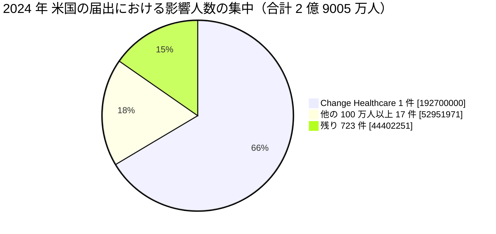

# 🇺🇸 2024 年 米国 HHS OCR 届出の全件集計

米国保健福祉省公民権局（HHS OCR）の侵害報告ポータルから 2024 年に届け出られた全件を取得し、集計した結果である。
[海外の履歴](2024-timeline.md)が個別の事例を扱うのに対し、本ページは米国の届出制度が捉えた全体の形を示す。

> [!NOTE]
> **集計の時点**：2026 年 8 月 26 日に取得した。
> ポータルの数値は精査によって改訂されるため、同じ条件で後日取得しても一致しない。
> 引用するときは集計の時点を併記してほしい。
> 取得の手順は [2025 年の集計ページ](2025-us-hhs.md#取得の手順)にまとめている。

## 何を数えているか

HHS OCR のポータルは、500 人以上に影響した侵害の届出を掲載する。
数えているのは**届出の件数**であり、発生した被害の件数ではない。

- **届出日であって発生日ではない**：侵入が前年でも、人数が確定した年に届け出られる。本ページの 2024 年は「2024 年に届け出られたもの」を指す
- **500 人未満は載らない**：小規模な診療所の侵害は集計に現れない
- **米国だけの制度である**：他国に同等の公開ポータルはなく、国ごとの比較には使えない
- **初報の人数が残る**：精査で人数が増えても、ポータルの表示が追随しない場合がある

## 全体

| 項目 | 値 |
|---|---|
| 届出件数 | **741 件** |
| 影響人数の合計 | **2 億 9005 万 4222 人** |
| 1 件あたりの中央値 | 7170 人 |
| 1 件あたりの平均 | 39 万 1436 人 |

影響人数のしきい値ごとの分布は次のとおりである。

| しきい値 | 件数 | 影響人数の合計 |
|---|---|---|
| 500 人以上（全件） | 741 | 2 億 9005 万 4222 |
| 1 万人以上 | 341 | 2 億 8890 万 9656 |
| 5 万人以上 | 181 | 2 億 8498 万 0324 |
| 10 万人以上 | 124 | 2 億 8109 万 5501 |
| 50 万人以上 | 41 | 2 億 6120 万 8496 |
| 100 万人以上 | 18 | 2 億 4565 万 1971 |

**分析**：影響人数の合計が 2 億 9005 万人に達した。
このうち **1 億 9270 万人（66%）が [Change Healthcare](2024-timeline.md#GL-2024-01) の 1 件**である。
中央値は 7170 人で、前年とほぼ変わらない。
制度の集計が単一の事案に支配された年であり、年ごとの推移を平均や合計で語ると実態を見誤る。

## 侵害の類型

| 類型 | 件数 | 影響人数の合計 |
|---|---|---|
| ハッキング、IT インシデント | 612 | 2 億 7393 万 7544 |
| 不正なアクセス、開示 | 109 | 1602 万 4769 |
| 盗難 | 12 | 7 万 4515 |
| 紛失 | 4 | 7085 |
| 不適切な廃棄 | 4 | 1 万 0309 |

**分析**：「不正なアクセス、開示」の影響人数が 519 万人から 1602 万人へ 3 倍に増えた。
このうち 1340 万人が [Kaiser Foundation Health Plan の計測タグ](2024-timeline.md#GL-2024-S01)である。
2022 年に始まった計測タグの届出が、2024 年に規模の上限を更新した。

## 対象組織の区分

| 区分 | 件数 | 影響人数の合計 |
|---|---|---|
| 医療提供者 | 543 | 5445 万 2984 |
| 事業提携者 | 118 | 2 億 1754 万 0990 |
| 医療保険 | 77 | 1775 万 5992 |
| 情報処理機関 | 3 | 30 万 4256 |

**分析**：事業提携者は件数の 16% でありながら、人数の 75% を占める。
Change Healthcare の 1 億 9270 万人を除いても、事業提携者の合計は 2484 万人で、医療提供者の 5445 万人の半分近くにあたる。
件数では 4.6 分の 1 でありながら、この比率である。

## 侵害された場所

| 場所 | 件数 |
|---|---|
| ネットワークサーバ | 478 |
| 電子メール | 168 |
| 紙、フィルム | 39 |
| 電子診療記録 | 20 |
| その他 | 7 |
| ノート PC | 7 |
| その他の携帯機器 | 5 |
| 電子診療記録、ネットワークサーバ | 4 |

## 届出元の州（上位 10）

| 州 | 件数 |
|---|---|
| カリフォルニア（CA） | 66 |
| テキサス（TX） | 60 |
| ニューヨーク（NY） | 47 |
| イリノイ（IL） | 44 |
| フロリダ（FL） | 38 |
| マサチューセッツ（MA） | 31 |
| ペンシルベニア（PA） | 30 |
| オハイオ（OH） | 29 |
| テネシー（TN） | 26 |
| ノースカロライナ（NC） | 23 |

## 届出の月別分布

| 月 | 件数 |
|---|---|
| 1 月 | 69 |
| 2 月 | 67 |
| 3 月 | 98 |
| 4 月 | 65 |
| 5 月 | 59 |
| 6 月 | 50 |
| 7 月 | 49 |
| 8 月 | 58 |
| 9 月 | 39 |
| 10 月 | 63 |
| 11 月 | 70 |
| 12 月 | 54 |

**分析**：3 月の 98 件が突出している。
2024 年 2 月 21 日の [Change Healthcare](2024-timeline.md#GL-2024-01) の停止により、多数の医療機関が請求と処方の処理を代替の手段へ切り替えた。
この時期の届出の増加は、同社の侵害そのものではなく、影響を受けた組織が個別に把握した侵害を届け出た結果を含む。
Change Healthcare 自身の届出は 7 月 19 日である。

## 影響人数の上位 50 件

50 位の影響人数は 41 万 1037 人である。

| 順位 | 影響人数 | 届出日 | 州 | 区分 | 類型 | 場所 | 組織 |
|---|---|---|---|---|---|---|---|
| 1 | 192,700,000 | 07/19/2024 | MN | 事業提携者 | ハッキング、IT インシデント | ネットワークサーバ | Change Healthcare, Inc. |
| 2 | 13,400,000 | 04/12/2024 | CA | 医療保険 | 不正なアクセス、開示 | ネットワークサーバ | Kaiser Foundation Health Plan, Inc. |
| 3 | 5,466,931 | 07/03/2024 | MO | 医療提供者 | ハッキング、IT インシデント | ネットワークサーバ | Ascension Health |
| 4 | 4,300,000 | 08/09/2024 | UT | 事業提携者 | ハッキング、IT インシデント | ネットワークサーバ | HealthEquity, Inc. |
| 5 | 3,998,163 | 01/09/2024 | TX | 医療提供者 | ハッキング、IT インシデント | ネットワークサーバ | Concentra Health Services, Inc. |
| 6 | 3,112,815 | 09/06/2024 | MD | 医療保険 | ハッキング、IT インシデント | ネットワークサーバ | Centers for Medicare & Medicaid Services |
| 7 | 2,896,985 | 08/20/2024 | LA | 医療提供者 | ハッキング、IT インシデント | ネットワークサーバ | Acadian Ambulance Service, Inc. |
| 8 | 2,812,336 | 05/24/2024 | NE | 事業提携者 | ハッキング、IT インシデント | ネットワークサーバ | A&A Services d/b/a Sav-Rx |
| 9 | 2,518,533 | 05/08/2024 | TX | 事業提携者 | ハッキング、IT インシデント | ネットワークサーバ | WebTPA Employer Services, LLC (“WebTPA”) |
| 10 | 2,385,646 | 01/26/2024 | OK | 医療提供者 | ハッキング、IT インシデント | ネットワークサーバ | INTEGRIS Health |
| 11 | 2,264,157 | 02/06/2024 | AZ | 事業提携者 | ハッキング、IT インシデント | ネットワークサーバ | Medical Management Resource Group, L.L.C. |
| 12 | 1,813,538 | 10/18/2024 | CO | 医療提供者 | ハッキング、IT インシデント | ネットワークサーバ | Summit Pathology and Summit Pathology Laboratories, Inc. |
| 13 | 1,741,152 | 10/14/2024 | AZ | 医療提供者 | ハッキング、IT インシデント | ネットワークサーバ | OnePoint Patient Care |
| 14 | 1,461,776 | 11/22/2024 | TX | 医療提供者 | ハッキング、IT インシデント | ネットワークサーバ | Lubbock County Hospital District |
| 15 | 1,323,720 | 05/23/2024 | NE | 事業提携者 | ハッキング、IT インシデント | ネットワークサーバ | ALN Medical Management, LLC |
| 16 | 1,276,026 | 06/21/2024 | PA | 医療提供者 | 不正なアクセス、開示 | ネットワークサーバ | Geisinger |
| 17 | 1,140,221 | 07/03/2024 | CA | 医療提供者 | ハッキング、IT インシデント | ネットワークサーバ | Palomar Health Medical Group |
| 18 | 1,039,972 | 05/10/2024 | IL | 医療提供者 | ハッキング、IT インシデント | ネットワークサーバ | Superior Air-Ground Ambulance Service, Inc. |
| 19 | 961,003 | 09/11/2024 | GA | 事業提携者 | ハッキング、IT インシデント | ネットワークサーバ | Young Consulting LLC |
| 20 | 914,138 | 12/11/2024 | DE | 事業提携者 | ハッキング、IT インシデント | ネットワークサーバ | ConnectOnCall.com, LLC |
| 21 | 909,469 | 10/04/2024 | NY | 事業提携者 | ハッキング、IT インシデント | ネットワークサーバ | ATSG, Inc |
| 22 | 886,746 | 02/29/2024 | NC | 医療提供者 | ハッキング、IT インシデント | ネットワークサーバ | Eastern Radiologists, Inc |
| 23 | 815,000 | 11/25/2024 | TX | 医療提供者 | ハッキング、IT インシデント | ネットワークサーバ | Texas Tech University Health Sciences Center El Paso |
| 24 | 775,860 | 06/27/2024 | IL | 医療提供者 | ハッキング、IT インシデント | ネットワークサーバ | Ann & Robert H. Lurie Children's Hospital of Chicago |
| 25 | 729,699 | 08/23/2024 | FL | 医療提供者 | ハッキング、IT インシデント | ネットワークサーバ | Florida Department of Health |
| 26 | 688,852 | 05/01/2024 | TN | 医療提供者 | ハッキング、IT インシデント | ネットワークサーバ | United Seating and Mobility, L.L.C., d/b/a Numotion |
| 27 | 674,033 | 12/19/2024 | NY | 医療提供者 | ハッキング、IT インシデント | ネットワークサーバ | Richmond University Medical Center |
| 28 | 665,321 | 08/30/2024 | IL | 医療提供者 | ハッキング、IT インシデント | ネットワークサーバ | Illinois Bone & Joint Institute, LLC |
| 29 | 656,086 | 02/23/2024 | NY | 医療提供者 | ハッキング、IT インシデント | ネットワークサーバ | OrthopedicsNY, LLP |
| 30 | 650,000 | 11/25/2024 | TX | 医療提供者 | ハッキング、IT インシデント | ネットワークサーバ | Texas Tech University Health Sciences Center |
| 31 | 618,189 | 03/28/2024 | PA | 医療提供者 | ハッキング、IT インシデント | ネットワークサーバ | Risas Dental & Braces |
| 32 | 611,743 | 03/22/2024 | OK | 医療提供者 | ハッキング、IT インシデント | ネットワークサーバ | Emergency Medical Services Authority |
| 33 | 592,237 | 02/02/2024 | NY | 事業提携者 | ハッキング、IT インシデント | ネットワークサーバ | Spectrum Vision Partners |
| 34 | 585,959 | 12/02/2024 | NC | 医療提供者 | 不正なアクセス、開示 | ネットワークサーバ | Atrium Health |
| 35 | 585,035 | 03/23/2024 | CA | 事業提携者 | ハッキング、IT インシデント | ネットワークサーバ | Designed Receivable Solutions, Inc. |
| 36 | 583,824 | 06/14/2024 | MN | 医療提供者 | ハッキング、IT インシデント | ネットワークサーバ | Consulting Radiologists LTD. |
| 37 | 569,012 | 04/23/2024 | CA | 医療提供者 | ハッキング、IT インシデント | ネットワークサーバ | NorthBay Healthcare Corporation |
| 38 | 545,001 | 01/05/2024 | TX | 医療提供者 | ハッキング、IT インシデント | ネットワークサーバ | The Harris Center for Mental Health and IDD |
| 39 | 533,809 | 04/08/2024 | WI | 医療保険 | ハッキング、IT インシデント | ネットワークサーバ | Group Health Cooperative of South Central Wisconsin |
| 40 | 503,071 | 01/31/2024 | NJ | 医療提供者 | ハッキング、IT インシデント | ネットワークサーバ | Capital Health System, Inc. |
| 41 | 502,438 | 01/03/2024 | MO | 医療提供者 | ハッキング、IT インシデント | ネットワークサーバ | North Kansas City Hospital |
| 42 | 497,047 | 10/04/2024 | DE | 医療提供者 | ハッキング、IT インシデント | ネットワークサーバ | Bayhealth Medical Center |
| 43 | 484,957 | 03/14/2024 | KY | 事業提携者 | ハッキング、IT インシデント | ネットワークサーバ | Cornerstone Healthcare Group Management Services LLC |
| 44 | 468,344 | 10/04/2024 | CA | 医療提供者 | ハッキング、IT インシデント | ネットワークサーバ | Omni Family Health |
| 45 | 464,159 | 12/13/2024 | TN | 医療提供者 | ハッキング、IT インシデント | 電子メール | Summit Medical Group, PLLC |
| 46 | 464,088 | 04/24/2024 | ID | 医療提供者 | ハッキング、IT インシデント | ネットワークサーバ | Kootenai Health |
| 47 | 457,152 | 03/04/2024 | PA | 事業提携者 | ハッキング、IT インシデント | ネットワークサーバ | Philips Respironics |
| 48 | 446,094 | 12/05/2024 | MD | 事業提携者 | ハッキング、IT インシデント | ネットワークサーバ | Center for Vein Restoration |
| 49 | 426,536 | 04/10/2024 | WA | 医療提供者 | ハッキング、IT インシデント | ネットワークサーバ | Rebound Orthopedics & Neurosurgery |
| 50 | 411,037 | 08/15/2024 | TN | 事業提携者 | ハッキング、IT インシデント | ネットワークサーバ | Specialty Networks, Inc. |

**分析**：1 位の [Change Healthcare](2024-timeline.md#GL-2024-01)（1 億 9270 万人）と 2 位の [Kaiser Foundation Health Plan](2024-timeline.md#GL-2024-S01)（1340 万人）で、合計の 71% を占める。
3 位の [Ascension Health](2024-timeline.md#GL-2024-02)（546 万 6931 人）が、医療提供者としての最大である。

上位 2 件の性質は対照的である。
一方は多要素認証の欠落を突かれた侵入であり、他方は攻撃者が関与しない計測タグの設定である。
届出の制度は両者を同じ「侵害」として数えるが、防ぐための手段は共通していない。

## 全件を本ページに載せない理由

ポータルの数値は精査によって改訂され、届出の追加も続く。
静的な複製を置くと、参照した人が古い数値を引く。
本ページは集計と上位 50 件に留め、全件は[取得の手順](2025-us-hhs.md#取得の手順)とともに読み手が自分で取り直せるようにしている。

---

[← 海外の事例](README.md) | [2024 年の履歴](2024-timeline.md) | [2024 年の情勢](../years/2024-summary.md) | [トップへ](../../../../README.md)
