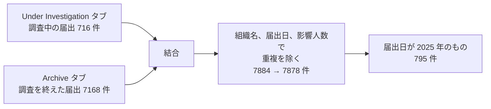
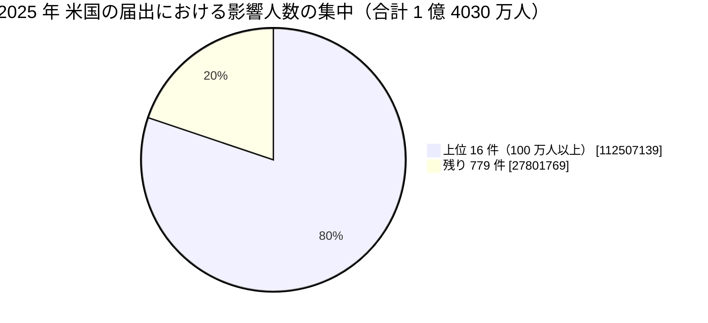

# 🇺🇸 2025 年 米国 HHS OCR 届出の全件集計

米国保健福祉省公民権局（HHS OCR）の侵害報告ポータルから 2025 年に届け出られた全件を取得し、集計した結果である。
[海外の履歴](2025-timeline.md)が個別の事例を扱うのに対し、本ページは米国の届出制度が捉えた全体の形を示す。

> [!NOTE]
> **集計の時点**：2026 年 8 月 26 日に取得した。
> ポータルの数値は精査によって改訂されるため、同じ条件で後日取得しても一致しない。
> 引用するときは集計の時点を併記してほしい。

## 何を数えているか

HHS OCR のポータルは、500 人以上に影響した侵害の届出を掲載する。
数えているのは**届出の件数**であり、発生した被害の件数ではない。

- **届出日であって発生日ではない**：侵入が前年でも、人数が確定した年に届け出られる。本ページの 2025 年は「2025 年に届け出られたもの」を指す
- **500 人未満は載らない**：小規模な診療所の侵害は集計に現れない
- **米国だけの制度である**：他国に同等の公開ポータルはなく、国ごとの比較には使えない
- **初報の人数が残る**：精査で人数が増えても、ポータルの表示が追随しない場合がある

## 取得の構造

ポータルは二つのタブに分かれており、片方だけでは全件にならない。



**分析**：調査中のタブだけを見ると 716 件しか得られない。
届出が調査を終えると Archive へ移るため、過去の年を数えるほど Archive の比重が上がる。
年をまたいだ比較をするときは、両方を取得したかどうかで結果が変わる。

## 全体

| 項目 | 値 |
|---|---|
| 届出件数 | **795 件** |
| 影響人数の合計 | **1 億 4030 万 8908 人** |
| 1 件あたりの中央値 | 4824 人 |

影響人数のしきい値ごとの分布は次のとおりである。

| しきい値 | 件数 | 影響人数の合計 |
|---|---|---|
| 500 人以上（全件） | 795 | 1 億 4030 万 8908 |
| 1 万人以上 | 311 | 1 億 3901 万 4281 |
| 5 万人以上 | 148 | 1 億 3518 万 7726 |
| 10 万人以上 | 96 | 1 億 3143 万 4228 |
| 50 万人以上 | 22 | 1 億 1656 万 120 |
| 100 万人以上 | 16 | 1 億 1250 万 7139 |



**分析**：上位 16 件で影響人数の 80.2%を占める。
件数の分布と人数の分布がまったく違うため、「件数が減った」という記述と「人数が増えた」という記述は同時に成り立つ。
どちらを指標に置くかで、対策の優先順位が変わる。

## 類型別

| 類型 | 件数 | 割合 |
|---|---|---|
| ハッキング、IT インシデント | 643 | 80.9% |
| 不正なアクセス、開示 | 140 | 17.6% |
| 盗難 | 9 | 1.1% |
| 紛失 | 2 | 0.3% |
| 不適切な廃棄 | 1 | 0.1% |

**分析**：紛失と盗難は 11 件（1.4%）にとどまる。
本リポジトリの[国内の履歴](../japan/2025-timeline.md)では、記録した副分類 37 件のうち 18 件が記憶媒体または書類の紛失と盗難である。
この差は発生の差ではなく、制度の差である。
米国の届出制度は 500 人以上を基準とするため、数人から数百人規模の紛失は初めから対象にならない。
国ごとの数字を並べるときは、何を数える制度なのかを先に確かめる必要がある。

## 届出の主体

| 区分 | 件数 |
|---|---|
| 医療提供者 | 598 |
| 事業提携者（Business Associate） | 136 |
| 医療保険 | 59 |
| 請求代行 | 2 |

事業提携者の関与の有無は別項目で記録されている。

| 事業提携者の関与 | 件数 |
|---|---|
| あり | 279（35.1%） |
| なし | 516（64.9%） |

**分析**：届出の主体が事業提携者である件数は 136 件だが、事業提携者が関与した件数は 279 件である。
差の 143 件は、医療提供者や保険者が自らの届出として報告し、原因が委託先にあった事案である。
委託先を起点とする侵害は、届出の主体を数えるだけでは 3 分の 1 に見える。

## 侵害された情報の所在

| 所在 | 件数 |
|---|---|
| ネットワークサーバ | 496 |
| 電子メール | 190 |
| 紙、フィルム | 35 |
| 電子診療録 | 30 |
| その他 | 12 |
| デスクトップ | 5 |
| ノート PC | 5 |
| 可搬機器 | 3 |
| （合計） | 776 |

上表は、所在が単一の値で記録された 776 件を数えている。
残る 19 件は「Electronic Medical Record, Network Server」のように複数の所在が併記された届出で、いずれか一方へ割り振ると重複するため、上表には含めていない（[10 万人以上の一覧](#影響人数-10-万人以上の全-96-件)の 16 番と 73 番がその例である）。

**分析**：電子メールが 190 件で 2 番目に多い。
本リポジトリが 2025 年に収録した事例でも、[GL-2025-85 Outcomes One](2025-timeline.md#GL-2025-85)ではアカウント 1 件の侵害で 25 万 7481 人が対象になり、[GL-2025-70 Saint Anthony Hospital](2025-timeline.md#GL-2025-70)ではアカウント 2 件から 14 万人規模へ広がった。
受信箱に何年分の添付ファイルが残っているかが、被害の量を決める。
多要素認証の適用と並んで、メールの保存期間の上限と、名簿を添付で送らない運用が効く。

## 月別の届出件数

| 月 | 1 | 2 | 3 | 4 | 5 | 6 | 7 | 8 | 9 | 10 | 11 | 12 |
|---|---|---|---|---|---|---|---|---|---|---|---|---|
| 件数 | 79 | 54 | 68 | 75 | 67 | 79 | 57 | 72 | 73 | 53 | 49 | 69 |

**分析**：月ごとの変動に季節性は見られない。
届出日は調査の完了時期で決まるため、攻撃の発生時期の分布とは対応しない。

## 影響人数 10 万人以上の全 96 件

「本リポジトリ」の列は、本事例集に個別の記述があるものを示す。
「過年度」は、発生年が 2024 年以前のため[過年度の節](2025-timeline.md#過年度に発生し2025-年に動きがあった事案)に置いていることを意味する。

| # | 影響人数 | 届出日 | 州 | 区分 | 類型 | 場所 | 組織 | 本リポジトリ |
|---|---|---|---|---|---|---|---|---|
| 1 | 62,224,658 | 10/08/2025 | NJ | 事業提携者 | ハッキング、IT インシデント | ネットワークサーバ | Conduent Business Services LLC | 過年度 |
| 2 | 13,924,906 | 08/08/2025 | GA | 医療保険 | ハッキング、IT インシデント | ネットワークサーバ | Aflac Incorporated (“Aflac”) | [GL-2025-25](2025-timeline.md#GL-2025-25) |
| 3 | 6,725,572 | 06/06/2025 | CA | 事業提携者 | ハッキング、IT インシデント | ネットワークサーバ | Episource, LLC | [GL-2025-03](2025-timeline.md#GL-2025-03) |
| 4 | 5,556,702 | 04/11/2025 | CT | 医療提供者 | ハッキング、IT インシデント | ネットワークサーバ | Yale New Haven Health System | [GL-2025-06](2025-timeline.md#GL-2025-06) |
| 5 | 4,700,000 | 04/09/2025 | CA | 事業提携者 | 不正なアクセス、開示 | ネットワークサーバ | Blue Shield of California | [GL-2025-S01](2025-timeline.md#GL-2025-S01) |
| 6 | 2,947,264 | 01/31/2025 | CA | 医療提供者 | ハッキング、IT インシデント | ネットワークサーバ | PIH Health, Inc. | 過年度 |
| 7 | 2,689,826 | 08/01/2025 | CO | 医療提供者 | ハッキング、IT インシデント | ネットワークサーバ | DaVita Inc. | [GL-2025-07](2025-timeline.md#GL-2025-07) |
| 8 | 2,672,036 | 09/22/2025 | IL | 事業提携者 | ハッキング、IT インシデント | ネットワークサーバ | Veradigm LLC | 過年度 |
| 9 | 1,905,000 | 07/11/2025 | MD | 医療提供者 | ハッキング、IT インシデント | ネットワークサーバ | Anne Arundel Dermatology | [GL-2025-19](2025-timeline.md#GL-2025-19) |
| 10 | 1,695,382 | 07/21/2025 | OH | 医療提供者 | ハッキング、IT インシデント | ネットワークサーバ | Kettering Adventist Healthcare | [GL-2025-08](2025-timeline.md#GL-2025-08) |
| 11 | 1,419,091 | 07/01/2025 | VA | 医療提供者 | ハッキング、IT インシデント | ネットワークサーバ | Radiology Associates of Richmond, Inc. | 過年度 |
| 12 | 1,361,735 | 05/02/2025 | FL | 事業提携者 | ハッキング、IT インシデント | ネットワークサーバ | DermCare Management | [GL-2025-62](2025-timeline.md#GL-2025-62) |
| 13 | 1,275,669 | 03/27/2025 | AZ | 医療提供者 | ハッキング、IT インシデント | ネットワークサーバ | SimonMed Imaging | [GL-2025-01](2025-timeline.md#GL-2025-01) |
| 14 | 1,223,635 | 05/02/2025 | NV | 事業提携者 | ハッキング、IT インシデント | ネットワークサーバ | Absolute Dental Group, LLC | [GL-2025-63](2025-timeline.md#GL-2025-63) |
| 15 | 1,124,727 | 02/28/2025 | GA | 事業提携者 | ハッキング、IT インシデント | ネットワークサーバ | Southeast Series of Lockton Companies, LLC (Lockton) | 過年度 |
| 16 | 1,060,936 | 01/30/2025 | CT | 医療提供者 | ハッキング、IT インシデント | Electronic Medical Record, Network Server | Community Health Center, Inc. | 過年度 |
| 17 | 934,326 | 03/28/2025 | MD | 医療提供者 | ハッキング、IT インシデント | ネットワークサーバ | Frederick Health | [GL-2025-02](2025-timeline.md#GL-2025-02) |
| 18 | 743,131 | 06/24/2025 | MI | 医療提供者 | ハッキング、IT インシデント | ネットワークサーバ | McLaren Health Care | 過年度 |
| 19 | 701,475 | 01/07/2025 | FL | 事業提携者 | ハッキング、IT インシデント | ネットワークサーバ | Medusind Inc. | 過年度 |
| 20 | 591,713 | 02/07/2025 | IN | 事業提携者 | ハッキング、IT インシデント | 電子メール | Blue & Co., LLC | 過年度 |
| 21 | 553,332 | 04/09/2025 | MD | 事業提携者 | ハッキング、IT インシデント | ネットワークサーバ | Kelly & Associates Insurance Group, Inc. | 過年度 |
| 22 | 529,004 | 03/07/2025 | TN | 医療提供者 | ハッキング、IT インシデント | 電子メール | United Seating and Mobility, LLC d/b/a Numotion | 過年度 |
| 23 | 483,126 | 05/09/2025 | CA | 事業提携者 | 不正なアクセス、開示 | ネットワークサーバ | Serviceaide, Inc. | 過年度 |
| 24 | 456,385 | 09/17/2025 | NC | 医療提供者 | ハッキング、IT インシデント | ネットワークサーバ | Goshen Medical Center | [GL-2025-56](2025-timeline.md#GL-2025-56) |
| 25 | 437,329 | 04/28/2025 | MO | 医療提供者 | ハッキング、IT インシデント | ネットワークサーバ | Ascension Health | 過年度 |
| 26 | 410,491 | 09/23/2025 | PA | 事業提携者 | ハッキング、IT インシデント | ネットワークサーバ | Philadelphia Corporation for Aging (PCA) |  |
| 27 | 410,326 | 11/21/2025 | VA | 事業提携者 | ハッキング、IT インシデント | ネットワークサーバ | Med Atlantic, Inc. |  |
| 28 | 362,713 | 10/28/2025 | WA | 医療提供者 | ハッキング、IT インシデント | ネットワークサーバ | Northwest Radiologists, Inc./Mount Baker Imaging |  |
| 29 | 357,265 | 04/21/2025 | MA | 事業提携者 | ハッキング、IT インシデント | 電子メール | Onsite Mammography |  |
| 30 | 340,000 | 01/30/2025 | MI | 医療提供者 | ハッキング、IT インシデント | ネットワークサーバ | St Clair Orthopaedics & Sports Medicine |  |
| 31 | 335,506 | 02/11/2025 | TX | 医療保険 | ハッキング、IT インシデント | ネットワークサーバ | New Era Life Insurance Companies |  |
| 32 | 327,756 | 01/17/2025 | NC | 医療提供者 | ハッキング、IT インシデント | ネットワークサーバ | Asheville Eye Associates, PLLC |  |
| 33 | 319,177 | 11/24/2025 | FL | 医療提供者 | ハッキング、IT インシデント | ネットワークサーバ | VITAS Hospice Services, LLC |  |
| 34 | 318,150 | 06/27/2025 | NC | 事業提携者 | ハッキング、IT インシデント | ネットワークサーバ | Compumedics USA, Inc. | [GL-2025-05](2025-timeline.md#GL-2025-05) |
| 35 | 298,629 | 01/06/2025 | CA | 事業提携者 | ハッキング、IT インシデント | ネットワークサーバ | North Los Angeles County Regional Center |  |
| 36 | 292,773 | 01/17/2025 | PA | 医療提供者 | ハッキング、IT インシデント | ネットワークサーバ | Allegheny Health Network Home Medical Equipment LLC and Allegheny Health Network Home Infusion LLC |  |
| 37 | 279,275 | 07/03/2025 | FL | 事業提携者 | ハッキング、IT インシデント | ネットワークサーバ | Zumpano Patricios, P.A. |  |
| 38 | 265,701 | 01/08/2025 | TX | 事業提携者 | ハッキング、IT インシデント | ネットワークサーバ | BayMark Health Services, Inc. |  |
| 39 | 262,831 | 04/21/2025 | IN | 医療提供者 | ハッキング、IT インシデント | ネットワークサーバ | Union Health System, Inc. | [GL-2025-15](2025-timeline.md#GL-2025-15) |
| 40 | 258,191 | 04/14/2025 | CA | 医療提供者 | ハッキング、IT インシデント | ネットワークサーバ | The City of Long Beach, CA |  |
| 41 | 257,481 | 09/23/2025 | FL | 事業提携者 | ハッキング、IT インシデント | 電子メール | Outcomes One, Inc. | [GL-2025-85](2025-timeline.md#GL-2025-85) |
| 42 | 246,711 | 09/05/2025 | FL | 医療提供者 | ハッキング、IT インシデント | ネットワークサーバ | Medical Associates of Brevard, LLC |  |
| 43 | 240,961 | 05/30/2025 | FL | 事業提携者 | ハッキング、IT インシデント | ネットワークサーバ | Ocuco Inc |  |
| 44 | 238,615 | 11/20/2025 | NY | 事業提携者 | ハッキング、IT インシデント | ネットワークサーバ | Fieldtex Products, Inc. |  |
| 45 | 237,830 | 04/14/2025 | WI | 医療提供者 | ハッキング、IT インシデント | ネットワークサーバ | Bell Ambulance, Inc. |  |
| 46 | 235,911 | 05/09/2025 | NC | 医療提供者 | ハッキング、IT インシデント | ネットワークサーバ | Marlboro-Chesterfield Pathology, P.C. |  |
| 47 | 232,506 | 07/03/2025 | CT | 事業提携者 | ハッキング、IT インシデント | ネットワークサーバ | Cierant Corporation |  |
| 48 | 220,968 | 03/07/2025 | KS | 医療提供者 | ハッキング、IT インシデント | ネットワークサーバ | Sunflower Medical Group, P.A. |  |
| 49 | 216,752 | 02/28/2025 | IL | 事業提携者 | ハッキング、IT インシデント | ネットワークサーバ | Legacy Professionals, LLP |  |
| 50 | 216,000 | 09/30/2025 | OH | 医療提供者 | ハッキング、IT インシデント | ネットワークサーバ | Harbor |  |
| 51 | 210,901 | 06/27/2025 | IN | 請求代行 | ハッキング、IT インシデント | ネットワークサーバ | Horizon Healthcare RCM |  |
| 52 | 210,706 | 04/02/2025 | CA | 医療提供者 | ハッキング、IT インシデント | ネットワークサーバ | Dameron Hospital |  |
| 53 | 209,560 | 10/31/2025 | CA | 医療提供者 | ハッキング、IT インシデント | ネットワークサーバ | Expert MRI |  |
| 54 | 200,000 | 10/31/2025 | PA | 医療提供者 | ハッキング、IT インシデント | ネットワークサーバ | Tri Century Eye Care PC |  |
| 55 | 198,795 | 10/17/2025 | FL | 事業提携者 | ハッキング、IT インシデント | ネットワークサーバ | Modernizing Medicine, Inc. |  |
| 56 | 176,149 | 05/16/2025 | GA | 医療提供者 | ハッキング、IT インシデント | ネットワークサーバ | Harbin Clinic, LLC |  |
| 57 | 173,430 | 03/14/2025 | TN | 医療提供者 | ハッキング、IT インシデント | 電子メール | CDHA Management, LLC and Spark DSO, LLC dba Chord Specialty Dental Partners |  |
| 58 | 172,915 | 05/29/2025 | MD | 医療提供者 | ハッキング、IT インシデント | ネットワークサーバ | MedStar St. Mary's Hospital |  |
| 59 | 171,862 | 09/24/2025 | FL | 医療提供者 | ハッキング、IT インシデント | ネットワークサーバ | Doctors Imaging Group | 過年度 |
| 60 | 169,017 | 09/14/2025 | SC | 医療提供者 | ハッキング、IT インシデント | ネットワークサーバ | Sandhills Medical Foundation |  |
| 61 | 166,953 | 06/13/2025 | KY | 医療提供者 | ハッキング、IT インシデント | ネットワークサーバ | Central Kentucky Radiology |  |
| 62 | 155,567 | 07/29/2025 | IL | 事業提携者 | ハッキング、IT インシデント | ネットワークサーバ | Alera Group, Inc. |  |
| 63 | 154,417 | 06/09/2025 | CT | 医療提供者 | ハッキング、IT インシデント | ネットワークサーバ | Southern Connecticut Vascular Center, LLC |  |
| 64 | 152,691 | 09/03/2025 | FL | 医療提供者 | ハッキング、IT インシデント | ネットワークサーバ | Retina Group of Florida | 過年度 |
| 65 | 145,269 | 06/27/2025 | MO | 医療提供者 | ハッキング、IT インシデント | ネットワークサーバ | Heartland Regional Medical Center d/b/a Mosaic Life Care |  |
| 66 | 143,969 | 02/03/2025 | FL | 医療提供者 | ハッキング、IT インシデント | ネットワークサーバ | Escambia Community Clinics, Inc. dba Community Health Northwest Florida |  |
| 67 | 142,004 | 06/18/2025 | OR | 医療提供者 | ハッキング、IT インシデント | ネットワークサーバ | TRG, LLC |  |
| 68 | 140,000 | 04/04/2025 | TX | 医療提供者 | ハッキング、IT インシデント | ネットワークサーバ | Central Texas Pediatric Orthopedics |  |
| 69 | 138,386 | 08/20/2025 | MI | 医療提供者 | 不正なアクセス、開示 | ネットワークサーバ | Aspire Rural Health System |  |
| 70 | 138,209 | 08/19/2025 | FL | 医療提供者 | ハッキング、IT インシデント | ネットワークサーバ | MRI Associates of St. Pete, Inc. d/b/a Saint Pete MRI |  |
| 71 | 138,080 | 01/21/2025 | NY | 医療提供者 | ハッキング、IT インシデント | ネットワークサーバ | University Diagnostic Medical Imaging, PC |  |
| 72 | 134,903 | 03/28/2025 | MN | 医療提供者 | ハッキング、IT インシデント | ネットワークサーバ | Community Dental Care, Inc. |  |
| 73 | 131,576 | 04/08/2025 | AL | 医療提供者 | ハッキング、IT インシデント | Desktop Computer, Network Server | Alabama Ophthalmology Associates |  |
| 74 | 126,953 | 11/21/2025 | VA | 医療保険 | ハッキング、IT インシデント | 電子メール | Delta Dental of Virginia |  |
| 75 | 120,085 | 02/08/2025 | GA | 医療提供者 | ハッキング、IT インシデント | ネットワークサーバ | Authority of the City of Bainbridge and Decatur County (“Memorial Hospital & Manor”) |  |
| 76 | 119,525 | 06/06/2025 | PA | 医療提供者 | ハッキング、IT インシデント | ネットワークサーバ | Select Medical Holdings Corporation |  |
| 77 | 119,341 | 01/10/2025 | CA | 医療提供者 | ハッキング、IT インシデント | ネットワークサーバ | Newport Harbor Pathology Medical Group, Inc. |  |
| 78 | 118,028 | 04/11/2025 | ME | 事業提携者 | ハッキング、IT インシデント | ネットワークサーバ | Endue Software | [GL-2025-82](2025-timeline.md#GL-2025-82) |
| 79 | 114,975 | 03/01/2025 | RI | 医療提供者 | ハッキング、IT インシデント | ネットワークサーバ | Community Care Alliance |  |
| 80 | 113,232 | 11/28/2025 | VA | 医療提供者 | ハッキング、IT インシデント | ネットワークサーバ | Richmond Behavioral Health Authority |  |
| 81 | 111,815 | 11/26/2025 | NJ | 事業提携者 | ハッキング、IT インシデント | ネットワークサーバ | Persante Health Care |  |
| 82 | 111,766 | 08/01/2025 | AR | 医療提供者 | ハッキング、IT インシデント | ネットワークサーバ | Highlands Oncology Group PA |  |
| 83 | 111,509 | 08/21/2025 | FL | 医療提供者 | ハッキング、IT インシデント | ネットワークサーバ | Vital Imaging Medical Diagnostic Centers, LLC |  |
| 84 | 109,383 | 02/06/2025 | AZ | 医療提供者 | ハッキング、IT インシデント | ネットワークサーバ | VectraRx Mail Pharmacy Services, LLC |  |
| 85 | 109,029 | 08/29/2025 | IA | 医療提供者 | ハッキング、IT インシデント | ネットワークサーバ | University of Iowa Community Home Care |  |
| 86 | 108,967 | 11/05/2025 | TX | 医療提供者 | ハッキング、IT インシデント | ネットワークサーバ | Denton MHMR Center |  |
| 87 | 107,154 | 06/30/2025 | MD | 医療保険 | ハッキング、IT インシデント | ネットワークサーバ | Centers for Medicare & Medicaid Services |  |
| 88 | 106,763 | 03/31/2025 | SD | 医療提供者 | ハッキング、IT インシデント | ネットワークサーバ | Black Hills Regional Eye Institute |  |
| 89 | 106,194 | 03/04/2025 | NC | 医療提供者 | ハッキング、IT インシデント | ネットワークサーバ | Hillcrest Convalescent Center, Inc. |  |
| 90 | 105,518 | 06/02/2025 | MI | 事業提携者 | ハッキング、IT インシデント | ネットワークサーバ | Renkim Corporation |  |
| 91 | 104,513 | 01/13/2025 | KS | 医療提供者 | ハッキング、IT インシデント | ネットワークサーバ | Mid America Physician Services |  |
| 92 | 104,071 | 12/12/2025 | NY | 事業提携者 | ハッキング、IT インシデント | ネットワークサーバ | Fieldtex Products, Inc. |  |
| 93 | 103,879 | 10/03/2025 | RI | 医療保険 | ハッキング、IT インシデント | ネットワークサーバ | Brightstar Global Solutions Corporation |  |
| 94 | 103,711 | 03/04/2025 | NY | 医療提供者 | ハッキング、IT インシデント | ネットワークサーバ | Liberty Resources, Inc. |  |
| 95 | 101,875 | 08/29/2025 | IA | 医療提供者 | ハッキング、IT インシデント | ネットワークサーバ | University of Iowa Health Care |  |
| 96 | 101,104 | 06/23/2025 | AR | 医療提供者 | ハッキング、IT インシデント | ネットワークサーバ | Mainline Health Systems Inc |  |

**分析**：96 件のうち本事例集が扱っているのは 31 件である（個別の事例が 16 件、過年度の節が 15 件）。
残りは、当事者の公表が届出以上の情報を含まないため、経緯を書く材料がない。
届出制度は件数と人数を捉えるが、侵入経路と診療への影響は捉えない。
この二つを別の情報源で埋めない限り、他組織が自分の構成と照らし合わせる材料にはならない。

## 取得の手順

ポータルは JSF アプリケーションで、検索結果を CSV として書き出せる。
「Under Investigation」（直近 24 か月）と「Archive」の二つのタブに分かれており、両方を取得して重複を除く必要がある。

```sh
UA="Mozilla/5.0"
# 1. 入口を開いてセッションと ViewState を得る
curl -sL -A "$UA" -c c.txt -o p1.html "https://ocrportal.hhs.gov/ocr/breach/breach_report.jsf"
VS=$(grep -oE 'name="javax.faces.ViewState"[^>]*value="[^"]+"' p1.html | head -1 | sed -E 's/.*value="([^"]+)".*/\1/')

# 2. 「View HIPAA Breach Reports」を押して結果ページへ進む
curl -sL -A "$UA" -b c.txt -c c.txt -o p2.html \
  -d "ocrForm=ocrForm" -d "ocrForm:j_idt39=ocrForm:j_idt39" --data-urlencode "javax.faces.ViewState=$VS" \
  "https://ocrportal.hhs.gov/ocr/breach/breach_frontpage.jsf"
VS=$(grep -oE 'name="javax.faces.ViewState"[^>]*value="[^"]+"' p2.html | head -1 | sed -E 's/.*value="([^"]+)".*/\1/')

# 3. 現在のタブを CSV で書き出す（Export as CSV の要素 id を押す）
curl -sL -A "$UA" -b c.txt -c c.txt -o current.csv \
  -d "ocrForm=ocrForm" -d "ocrForm:j_idt385=ocrForm:j_idt385" --data-urlencode "javax.faces.ViewState=$VS" \
  "https://ocrportal.hhs.gov/ocr/breach/breach_report_hip.jsf"

# 4. Archive タブへ切り替えてから、同じ要素 id で書き出す
curl -s -A "$UA" -b c.txt -c c.txt -o tab.xml \
  -H "Faces-Request: partial/ajax" \
  -d "javax.faces.partial.ajax=true" -d "javax.faces.source=ocrForm:j_idt31" \
  -d "javax.faces.partial.execute=ocrForm:j_idt31" -d "javax.faces.behavior.event=tabChange" \
  -d "ocrForm:j_idt31_newTab=ocrForm:j_idt31:archiveTab" -d "ocrForm:j_idt31_tabindex=1" \
  -d "ocrForm=ocrForm" -d "ocrForm:j_idt31_activeIndex=1" --data-urlencode "javax.faces.ViewState=$VS" \
  "https://ocrportal.hhs.gov/ocr/breach/breach_report_hip.jsf"
curl -sL -A "$UA" -b c.txt -c c.txt -o archive.csv \
  -d "ocrForm=ocrForm" -d "ocrForm:j_idt31_activeIndex=1" -d "ocrForm:j_idt385=ocrForm:j_idt385" \
  --data-urlencode "javax.faces.ViewState=$VS" \
  "https://ocrportal.hhs.gov/ocr/breach/breach_report_hip.jsf"
```

要素の識別子（`j_idt39`、`j_idt385`、`j_idt31`）は、画面の構成が変わると変わる。
取得できないときは、ページの HTML から `title="Export as CSV"` を含むリンクの `onclick` を読み、そこに書かれた識別子へ差し替える。

取得した二つの CSV は、組織名、届出日、影響人数の三つ組で重複を除く。
本ページの集計では、2 タブ合計 7884 行から重複 6 行を除いた 7878 件のうち、届出日が 2025 年のもの 795 件を対象とした。

## 全 795 件を本ページに載せない理由

ポータルの数値は精査によって改訂され、届出の追加も続く。
静的な複製を置くと、参照した人が古い数値を引く。
本ページは集計と上位 96 件に留め、全件は取得の手順とともに読み手が自分で取り直せるようにしている。

同じ理由で、[年ごとのページ](../years/)の外部統計も、件数と集計の時点を併記する形にしている。

---

<sub>[← 海外の事例](README.md) | [2025 年の履歴](2025-timeline.md) | [2025 年の情勢](../years/2025-summary.md) | [トップへ](../../../../README.md)</sub>
