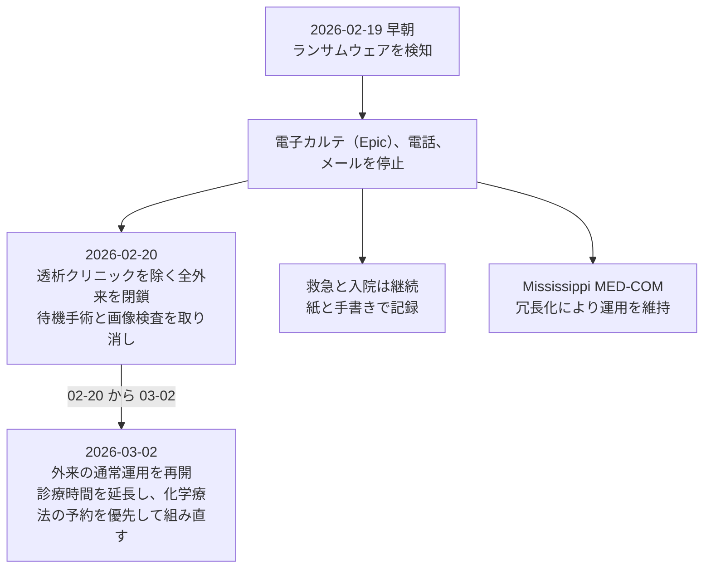
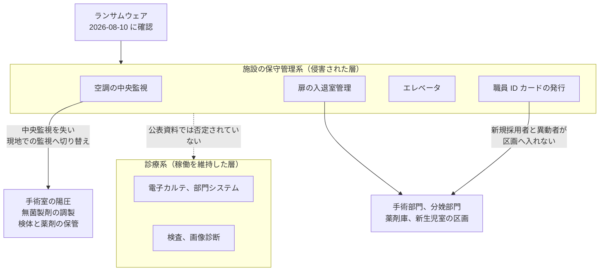
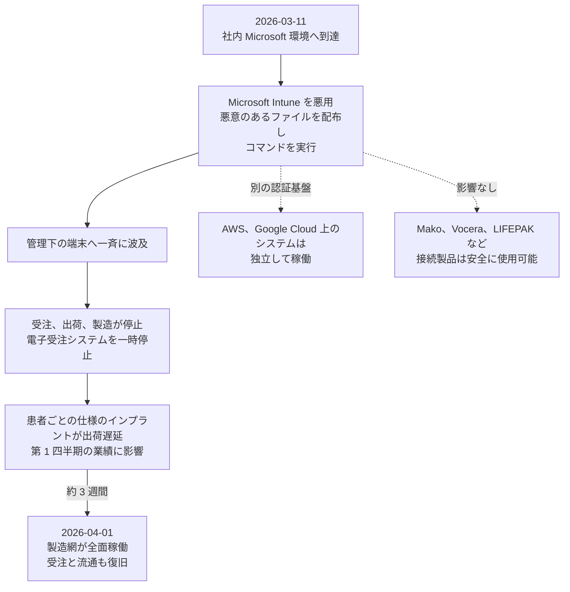
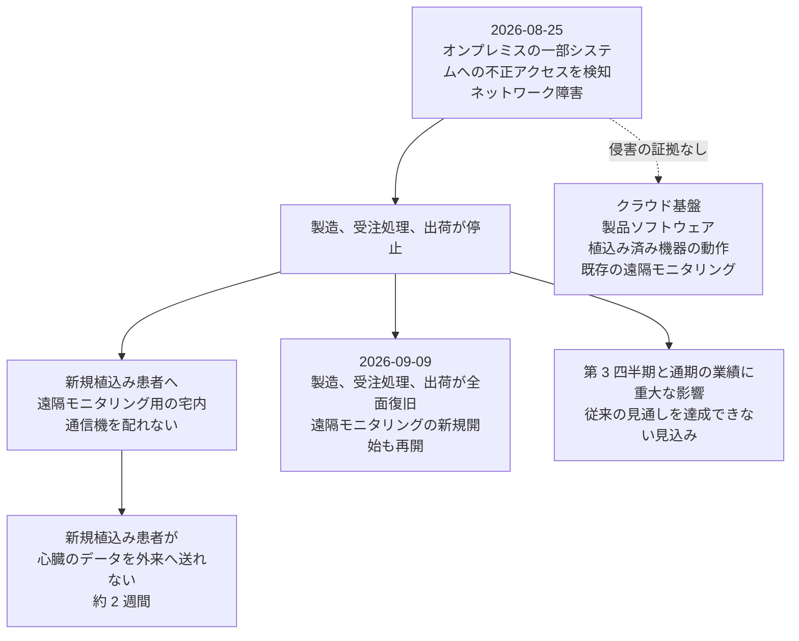

# 🌍 海外の事例 2026 年（履歴）

> [!NOTE]
> **表記ルール**：本ページでは、**事実**（一次情報で確認できる内容。出典を併記する）、**報道ベース**（報道や第三者の集計のみで確認でき、当事者の公表資料では裏付けが取れていない内容）、**分析**（筆者の解釈）を書き分ける。
> [対象の区分](../README.md#対象の区分)と[一次情報の強度](../README.md#一次情報の強度)の定義は、インシデント事例集のトップにまとめている。
> その年の情勢と集計は [2026 年の情勢](../years/2026-summary.md) にまとめている。

## 収録件数

| 区分 | サイバー攻撃 | その他の事案 |
|---|---|---|
| 病院系 | 48 | 1 |
| 製薬企業系 | 6 | 0 |
| 医療関連事業者 | 45 | 4 |

進行中の年である。
本ページの収録は 2026 年 9 月 20 日時点で一次情報を確認できた事案に限り、海外で公表された医療関連の事案がこれで尽きることを示すものではない。
米国の件数は、保健福祉省公民権局（HHS OCR）の侵害報告ポータルへ届け出られた影響人数を典拠とする。
速報は [月報](../../../../monthly-reports/) に記録する。

**分析**：本年前半の海外の被害には、次の四つの型が繰り返し現れている。

1. **診療の停止が施設単位ではなく組織全体に及ぶ**：[University of Mississippi Medical Center](#GL-2026-05) は州内の外来をほぼ全面的に約 9 日閉じ、[AnMed](#GL-2026-26) は 106 施設のうち 83 施設を一時閉鎖した。[Signature Healthcare](#GL-2026-14) は紙運用を 3 週間超続けている
2. **医療の外側にある共通基盤から患者情報が抜ける**：[DentaQuest](#GL-2026-67) の 1500 万人、[Baxter International](#GL-2026-76) の 710 万件、[One Medical Senior Health](#GL-2026-69) は、いずれも診療系ではなく SaaS またはファイル保管の環境が侵害されている
3. **医療機器と医薬品の製造が止まる**：[Stryker](#GL-2026-58) は受注と出荷が数週間止まり、[West Pharmaceutical Services](#GL-2026-43) は世界の複数拠点で製造と入出荷が止まった。いずれも患者情報ではなく供給が被害の中心である
4. **一つの製品の脆弱性が業種を横断して効く**：Oracle PeopleSoft のゼロデイ（CVE-2026-35273）を悪用した一連の侵害では、大学や行政と並んで病院が被害組織に含まれた

**分析**：8 月から 9 月にかけて公表された事案では、患者側の機能が止まる形が目立つ。[Boston Scientific](#GL-2026-95) では、植込み済みの機器は動く一方で、新たに機器を入れた患者が遠隔モニタリングを開始できない状態が約 2 週間続いた。[Luminis Health](#GL-2026-89) では救急と手術を維持したまま、電話と患者ポータルが止まっている。機器やシステムの稼働と、患者が医療につながる経路の稼働は別に数える必要がある。

---

## 病院系

| ID | 発生時期 | 組織、国 | 種別 | 初期侵入経路 | 診療への影響 | 業務停止期間 | 一次情報の強度 |
|---|---|---|---|---|---|---|---|
| [GL-2026-01](#GL-2026-01) | 2026-01 | Kreisklinik Roth（独、バイエルン州ロート） | 不正アクセス | 未公表 | 患者安全のため救急の受入を一時停止 | 救急の停止が **数時間**（同日正午ごろ再開）。インターネット接続を遮断 | 報道のみ |
| [GL-2026-02](#GL-2026-02) | 2026-01 | AZ Monica（白、アントワープ、ドゥルネの 2 キャンパス） | 不正アクセス | 未公表 | 当日の手術を全件中止。重症を含む 7 名を他施設へ搬送。救急は縮小運用 | サーバを停止。手術の中止は **少なくとも 70 件**。完全復旧の時期は未公表 | 当事者公表 |
| GL-2026-03 | 2026-01 | Unimed Anápolis（伯、ゴイアス州） | データ窃取（The Gentlemen） | 未公表 | 公表なし | 暗号化はなく、データ窃取のみと報じられている | 報道のみ |
| [GL-2026-04](#GL-2026-04) | 2024-06 発生、2026-01 公表 | Mid and South Essex NHS Foundation Trust（英、エセックス） | サプライチェーン侵害（Qilin） | 検査事業者 Synnovis の侵害 | 公表なし（記録の流出のみ） | 2024 年の攻撃に由来する影響が 2026 年も継続 | 当事者公表 |
| [GL-2026-05](#GL-2026-05) | 2026-02 | University of Mississippi Medical Center（米、ミシシッピ州） | ランサムウェア | 未公表 | 州内の外来をほぼ全面的に閉鎖。手術と画像検査の予約を取り消し。救急と入院は紙運用で継続 | 外来の閉鎖が **02-20 から 03-02**（報道は 9 日間と伝える） | 当事者公表 |
| GL-2026-06 | 2026-01 覚知 | Nacogdoches Memorial Hospital（米、テキサス州） | 不正アクセス（データ窃取） | 未公表 | 公表なし | 診療の停止は公表されていない | 当事者公表（HHS OCR 届出 250 万 7073 人） |
| [GL-2026-07](#GL-2026-07) | 2025-11 〜 2026-02 | NYC Health + Hospitals（米、ニューヨーク市の公立医療システム） | サプライチェーン侵害 | 委託先の侵害（事業者名は未公表） | 診療は継続 | **診療の停止なし** | 当事者公表（HHS OCR 届出 180 万人） |
| GL-2026-08 | 2025-12 〜 2026-01 | Erie Family Health Centers（米、イリノイ州） | 不正アクセス（データ窃取） | 未公表 | 公表なし | 診療の停止は公表されていない | 当事者公表（HHS OCR 届出 57 万人） |
| GL-2026-09 | 2026-02 | Hospital Caribbean Medical Center（プエルトリコ） | ランサムウェア（The Gentlemen） | 未公表 | 公表なし | 診療の停止は公表されていない | 当事者公表（HHS OCR 届出 9 万 2000 人） |
| GL-2026-10 | 2026-03 | North Texas Behavioral Health Authority（米、テキサス州、行動医療） | 不正アクセス（データ窃取） | 未公表 | 公表なし | 診療の停止は公表されていない | 当事者公表（HHS OCR 届出 28 万 5086 人） |
| GL-2026-11 | 2026-03 | Rajagiri Hospital（印、ケーララ州） | ランサムウェア（The Gentlemen） | 未公表 | 公表なし | 公表なし | 報道のみ |
| GL-2026-12 | 2026-03 | IntraCare（新、在宅医療） | ランサムウェア（The Gentlemen） | 未公表 | 公表なし | 公表なし | 報道のみ |
| GL-2026-13 | 2026 上半期 | Misericórdia de Santo Tirso（葡、ポルト県） | ランサムウェア（Qilin） | 未公表 | 公表なし | 公表なし | 報道のみ |
| [GL-2026-14](#GL-2026-14) | 2026-04 | Signature Healthcare Brockton Hospital（米、マサチューセッツ州） | ランサムウェア（Anubis） | 未公表 | 救急搬送を転送。化学療法の点滴を中止。薬局が一部閉鎖し新規処方を調剤できず | 紙運用が **3 週間超**（04-06 から 04-末）。搬送の転送は 04-10 までに解除 | 当事者公表 |
| GL-2026-15 | 2026-04 | Florida Physician Specialists（米、フロリダ州） | 不正アクセス（データ窃取） | 未公表 | 公表なし | 診療の停止は公表されていない | 当事者公表（HHS OCR 届出 27 万 6498 人） |
| GL-2026-16 | 2026-04 | Southern Illinois Dermatology（米、イリノイ州） | 不正アクセス | 未公表 | 公表なし | 診療の停止は公表されていない | 当事者公表（HHS OCR 届出 16 万 312 人） |
| GL-2026-17 | 2026-04 | Laurel Eye Clinic（米、ペンシルベニア州） | 不正アクセス（データ窃取） | 未公表 | 公表なし | 診療の停止は公表されていない | 当事者公表（HHS OCR 届出 14 万 5221 人） |
| GL-2026-18 | 2026-04 | Hematology Oncology Consultants（米、ミシガン州） | 不正アクセス | 未公表 | 公表なし | 診療の停止は公表されていない | 当事者公表（HHS OCR 届出 6 万 2972 人） |
| GL-2026-19 | 2026-04 | Rocky Mountain Associated Physicians（米、ユタ州） | 不正アクセス | 未公表 | 公表なし | 診療の停止は公表されていない | 当事者公表（HHS OCR 届出 5 万 640 人） |
| GL-2026-20 | 2026-05 | Wielkopolskie Centrum Medyczne REMEDIUM（波、ヴィエルコポルスカ県） | ランサムウェア（The Gentlemen） | 未公表 | 公表なし | 公表なし | 報道のみ |
| GL-2026-21 | 2025-07 〜 2026-04 | Radiology Associates of Richmond（米、バージニア州、画像診断） | 不正アクセス（データ窃取） | 未公表 | 公表なし | 診療の停止は公表されていない | 当事者公表（HHS OCR 届出 26 万 6183 人。2024 年 4 月の侵害に続く 2 件目） |
| GL-2026-22 | 2026-05 | Western Orthopaedics（米、コロラド州） | 不正アクセス | 未公表 | 公表なし | 診療の停止は公表されていない | 当事者公表（HHS OCR 届出 11 万 3330 人） |
| GL-2026-23 | 2026-05 | Singing River Health System（米、ミシシッピ州） | 不正アクセス | 未公表 | 公表なし | 診療の停止は公表されていない | 当事者公表（HHS OCR 届出 5 万 3888 人） |
| GL-2026-24 | 2026-05 | Community Connections（米、ワシントン D.C.、行動医療） | ランサムウェア（INC Ransom） | 未公表 | 公表なし | 診療の停止は公表されていない | 当事者公表（HHS OCR 届出 1 万 8943 人） |
| [GL-2026-25](#GL-2026-25) | 2026-06 | Partnered Health（豪、一般診療所と皮膚がん診療所。全 57 拠点のうち 21 拠点） | 不正アクセス（データ窃取） | 未公表 | 公表なし | 診療の停止は公表されていない | 当事者公表 |
| [GL-2026-26](#GL-2026-26) | 2026-07 | AnMed（米、サウスカロライナ州、ジョージア州、106 施設） | ランサムウェア（The Gentlemen） | 未公表 | 106 施設のうち **83 施設**を一時閉鎖。電話とインターネットが不通。救急と緊急外来は継続 | 情報システムの停止が **2 週間超**。08-10 時点で 10 施設が未再開 | 当事者公表 |
| GL-2026-27 | 2026 上半期 | Aroostook Mental Health Services（米、メイン州） | ランサムウェア（Qilin） | 未公表 | 公表なし | 公表なし。身代金は支払っていないと説明 | 報道のみ |
| GL-2026-28 | 2026 上半期 | FMRS Health Systems（米、ウェストバージニア州） | ランサムウェア（Qilin） | 未公表 | 公表なし | 公表なし | 報道のみ |
| GL-2026-29 | 2026 上半期 | Orthopaedic Specialists of Massachusetts（米、マサチューセッツ州） | ランサムウェア（Qilin） | 未公表 | 公表なし | 公表なし。身代金は支払っていないと説明 | 当事者公表（届出 2 万 200 人） |
| GL-2026-30 | 2026-01 | Rocky Mountain Care（米、ユタ州、高齢者介護） | ランサムウェア（Qilin） | 未公表 | 公表なし | 公表なし | 報道のみ |
| GL-2026-31 | 2026 上半期 | Cooperativa de Hospitales de Antioquia（哥、アンティオキア県） | ランサムウェア（Qilin） | 未公表 | 公表なし | 公表なし | 報道のみ |
| GL-2026-32 | 2026 上半期 | RENAFAN GmbH（独、介護、在宅医療） | ランサムウェア（Qilin） | 未公表 | 公表なし | 公表なし | 報道のみ |
| GL-2026-33 | 2026 上半期 | Suchthilfe direkt Essen gGmbH（独、エッセン、依存症支援） | ランサムウェア（Qilin） | 未公表 | 公表なし | 公表なし | 報道のみ |
| [GL-2026-84](#GL-2026-84) | 2026-08 | Nutex Health（米、テキサス州。12 州で 28 の救急病院と診療施設を運営） | 不正アクセス（データ窃取） | 未公表 | 業務と財務報告システムへの重要な影響は確認されていないと説明 | **停止なし**と説明 | 当事者公表（SEC 提出） |
| GL-2026-34 | 2026 上半期 | Leinerstift e.V.（独、ニーダーザクセン州、児童福祉と医療） | ランサムウェア（犯行声明なし） | 未公表 | 公表なし | 公表なし | 報道のみ |
| GL-2026-35 | 2026-03 | Coastal Carolina Health Care（米、ノースカロライナ州） | 不正アクセス | 未公表 | 公表なし | 診療の停止は公表されていない | 当事者公表（HHS OCR 届出 11 万 304 人） |
| GL-2026-36 | 2026-02 | Academic Urology & Urogynecology of Arizona（米、アリゾナ州） | 不正アクセス | 未公表 | 公表なし | 診療の停止は公表されていない | 当事者公表（HHS OCR 届出 7 万 3281 人） |
| GL-2026-37 | 2026-02 | Counseling Center of Wayne & Holmes Counties（米、オハイオ州） | 不正アクセス（データ窃取） | 未公表 | 公表なし | 診療の停止は公表されていない | 当事者公表（HHS OCR 届出 8 万 3354 人） |
| GL-2026-38 | 2026-03 | Exclusive Physicians（米、ミシガン州） | 不正アクセス | 未公表 | 公表なし | 診療の停止は公表されていない | 当事者公表（HHS OCR 届出 5 万 8000 人） |
| GL-2026-39 | 2026-04 | Tri-Cities Gastroenterology（米、テネシー州） | 不正アクセス（データ窃取） | 未公表 | 公表なし | 診療の停止は公表されていない | 当事者公表（HHS OCR 届出 6 万 7115 人） |
| GL-2026-40 | 2026-05 | Southern Illinois Ob-Gyn Associates（米、イリノイ州） | 不正アクセス | 未公表 | 公表なし | 診療の停止は公表されていない | 当事者公表（HHS OCR 届出 3 万 8700 人） |
| [GL-2026-92](#GL-2026-92) | 2024-06 発生、2026-06 公表 | Bedfordshire Hospitals NHS Foundation Trust（英、ベッドフォードシャー） | サプライチェーン侵害（Qilin） | 検査事業者 Synnovis の侵害 | 公表なし（過去の検査記録の流出のみ） | 2024 年の攻撃に由来する影響が 2026 年も継続 | 当事者公表 |
| GL-2026-93 | 2026-07 | Next Level Medical（米、テキサス州。予約不要の外来診療を州内 45 拠点超で運営） | 不正アクセス（データ窃取） | 未公表 | 公表なし | 診療の停止は公表されていない | 当事者公表 |
| [GL-2026-90](#GL-2026-90) | 2026-08 | Cedar County Memorial Hospital（米、ミズーリ州エルドラドスプリングス） | ランサムウェア（Wallstreet） | 未公表 | 電子カルテと患者ポータルが停止。画像を放射線科医へ送れず、救急を一部転送 | 電子カルテの停止が **2 週間** | 当事者公表 |
| [GL-2026-89](#GL-2026-89) | 2026-09 | Luminis Health（米、メリーランド州。2 病院と外来手術センター） | 不正アクセス | 未公表 | 電話とオンライン患者ポータル（MyChart）が停止。一部の予約を変更。救急、手術、分娩は継続 | 電話は 09-18 までに復旧。MyChart は閲覧のみ。復旧の完了時期は未公表 | 当事者公表 |
| [GL-2026-100](#GL-2026-100) | 2026-08 | JPS Health Network（米、テキサス州フォートワース。公立のセーフティネット医療システム） | 不明（当事者は不審な活動の検知のみ公表） | 未公表 | 外傷、脳卒中、心筋梗塞を含む重症の救急搬送を転送。紙運用へ切り替え。予定手術を延期 | ネットワークの計画的な停止が **11 日間**（08-03 から 08-14）。患者ポータルの復旧は 08-16 | 当事者公表 |
| [GL-2026-101](#GL-2026-101) | 2026-08 | Health Sciences Centre、CancerCare Manitoba（加、マニトバ州ウィニペグ） | ランサムウェア | 未公表 | 臨床業務は通常どおり継続。空調、扉、エレベータの制御が影響を受けた | 空調の中央監視と職員 ID カードの発行が停止（期間は未公表） | 当事者公表 |
| [GL-2026-91](#GL-2026-91) | 2026-09 | Nipigon District Memorial Hospital（加、オンタリオ州ニピゴン） | ランサムウェア | 未公表 | 外来の検査室と画像診断を閉鎖。待ち時間が延びた | 公表時点で復旧作業が継続 | 当事者公表 |

### GL-2026-01 Kreisklinik Roth（2026 年 1 月、独）

**事実**

- 発生時期：2026 年 1 月 7 日。
- 対象組織：ドイツ、バイエルン州ミッテルフランケン地方のロート郡立病院。
- 攻撃種別：不正アクセス。
- 初期侵入経路：未公表。
- 初動対応：予防措置としてインターネット接続を切断し、アナログ運用へ切り替えた。州刑事局のサイバー犯罪部門、州のデータ保護監督機関、州情報セキュリティ庁へ通報した。
- 診療への影響：放射線画像の送受信ができなくなったため、患者安全を理由に救急の受入を数時間停止した。
- 業務停止期間：救急の受入は同日正午ごろ再開した。

**分析**

- 救急を止めた直接の理由は、電子カルテではなく画像の送受信である。救急の受入可否は、画像診断が使えるかどうかで決まる場面が多い。ダウンタイム手順を作るとき、電子カルテの代替だけを用意して画像を落とすと、この形の停止を防げない（[サイバー BCP](../../../response/bcp-cyber.md)）。
- 停止は数時間で解けている。判断が早かったこと自体は結果に効いているが、公表されているのはそこまでで、侵害の範囲は明らかにされていない。

**一次情報**

- [Hackerangriff auf Kreisklinik Roth](https://www.aerzteblatt.de/news/hackerangriff-auf-kreisklinik-roth-21730f6b-6c34-4532-ae0a-6714448fb5ea)（Deutsches Ärzteblatt、2026 年 1 月）
- [Hackerangriff auf Kreisklinik Roth? Internet getrennt, Notaufnahme abgemeldet](https://www.kma-online.de/aktuelles/it-digital-health/detail/hackerangriff-auf-kreisklinik-roth-internet-getrennt-notaufnahme-abgemeldet-55056)（kma Online、2026 年 1 月）

---

### GL-2026-02 AZ Monica（2026 年 1 月、白）

**事実**

- 発生時期：2026 年 1 月 13 日（火）。
- 対象組織：ベルギー、アントワープの AZ Monica。アントワープとドゥルネの 2 キャンパスを運営する。
- 攻撃種別：不正アクセス。攻撃の性質は当事者から公表されていない。
- 初期侵入経路：未公表。
- 初動対応：両キャンパスのサーバを停止した。
- 診療への影響：当日予定していた手術を全件中止した。中止は両キャンパスで**少なくとも 70 件**にのぼる。重症例を含む患者 7 名を他施設へ搬送した。救急部門は縮小運用となり、患者の受付処理ができなくなった。
- 救急体制への影響：現場へ医師と看護師を派遣する移動緊急医療班（MUG）と、救急搬送を担う准医療介入班（PIT）が稼働できなくなった。
- 患者への案内：かかりつけ医、時間外診療所、他の救急医療機関の利用を求めた。
- 業務停止期間：完全復旧の時期は公表されていない。

**分析**

- 止まったのは病院の中だけではない。MUG と PIT は病院を拠点に地域の救急要請へ出動する枠組みであり、これが動かないことは、病院に来られない患者にまで影響が及ぶことを意味する。院内の診療継続だけを想定した計画では、この範囲は視野に入らない。
- 手術の中止が 70 件に達したのは、攻撃の当日である。予定手術は前日までに麻酔、器材、人員が組まれており、当日の停止はそのすべてを解く作業を伴う。停止時間の長さより、停止が起きた時点で確定していた予定の量が被害の大きさを決める。
- 患者 7 名の転院搬送が発生している。転院は、受け入れ先の空床と、診療情報の引き渡し手段の二つが揃わないと成立しない。情報システムが止まった状態で何をどう渡すかは、地域の医療機関どうしで事前に決めておく以外にない（[ネットワークの分離](../../../technology/segmentation.md)、[サイバー BCP](../../../response/bcp-cyber.md)）。

**一次情報**

- [2026 Belgian hospital cyberattack](https://en.wikipedia.org/wiki/2026_Belgian_hospital_cyberattack)（経緯と出典の整理）
- [Cyberattack hits Antwerp hospital](https://www.brusselstimes.com/)（The Brussels Times、2026 年 1 月 13 日）
- [Belgian hospital cancels surgeries following cyberattack](https://www.theregister.com/)（The Register、2026 年 1 月 14 日）

---

### GL-2026-04 Mid and South Essex NHS Foundation Trust（2024 年 6 月に発生、2026 年 1 月に公表、英）

**事実**

- 発生時期：2024 年 6 月の検査事業者 Synnovis へのランサムウェア攻撃（Qilin）に由来する。影響件数の公表は 2026 年 1 月である。
- 対象組織：イングランド最大級の NHS トラストの一つ。ブルームフィールド病院（チェルムズフォード）、バジルドン病院、サウスエンド病院を運営する。
- 攻撃種別：サプライチェーン侵害。トラスト自身のシステムは侵害されていない。
- 侵害範囲：同トラストの患者記録 **2380 件**が影響を受けたと公表された。
- 診療への影響：本件の公表時点では記録の流出のみで、診療の停止は公表されていない。

**報道ベース**

- 同じ Synnovis の侵害を起点として、South London and Maudsley NHS Foundation Trust では検査系の復旧が続き、2026 年 1 月初旬の時点で病理検査報告 **16 万 1560 件**の遅延が生じていると報じられている。

**分析**

- 攻撃から影響件数の確定まで 1 年半以上が経っている。検査事業者に集約された記録は、どの医療機関のどの患者に紐づくかを事後に切り分ける必要があり、この作業が遅延の主因になる。委託先が持つデータの範囲を委託元が把握していないと、確定は委託先の調査速度に依存する。
- 病理検査の遅延が 16 万件規模で残るのは、検査が止まった期間そのものではなく、再開後に積み上がった滞留による。復旧の完了を「システムが動く日」で測ると、この滞留が計上されない（[サイバー BCP](../../../response/bcp-cyber.md)）。
- 本件は、2024 年の [GL-2024 Synnovis](2024-timeline.md) を起点とする影響が 2026 年まで続いていることを示す。委託先の一度の侵害が、委託元の複数組織に年単位で残る。

**一次情報**

- [Mid and South Essex NHS Foundation Trust](https://mse.nhs.uk/)（当事者。Synnovis 侵害に関する患者への案内）
- [Ransomware attack continues to disrupt healthcare in London nearly two years later](https://therecord.media/ransomware-nhs-cyberattack-disruption)（The Record、2026 年）

---

### GL-2026-05 University of Mississippi Medical Center（2026 年 2 月、米）

**事実**

- 発生時期：2026 年 2 月 19 日（木）早朝に検知した。
- 対象組織：ミシシッピ州の州立学術医療センター。州内に外来拠点を持つ。
- 攻撃種別：ランサムウェア。
- 攻撃グループ：当事者は攻撃者と接触したことを認めたが、名称は公表していない。
- 初期侵入経路：未公表。
- 侵害範囲：ネットワークと情報システム。電子カルテ（Epic）を停止した。電話とメールも使えなくなった。州の病院間転院調整網である Mississippi MED-COM にも影響が及んだが、冗長化により運用は維持された。
- 診療への影響：2 月 20 日（金）に、ジャクソン・メディカル・モール内の腎透析クリニックを除く全外来を閉鎖した。予約、待機手術、画像検査を取り消した。救急部門は受入を継続し、入院診療も継続した。臨床機器は稼働を維持した。
- 代替運用：電子カルテが使えない間、紙と手書きで記録した。
- 業務停止期間：外来の閉鎖は 2 月 20 日に始まり、3 月 2 日（月）に通常運用へ戻した。報道は 9 日間の閉鎖と伝えている。再予約に対応するため、再開後は診療時間を延長し、化学療法の予約を優先して組み直した。
- 初動対応：法執行機関、国土安全保障省、CISA、FBI が関与した。
- 情報流出：公表時点では、流出の有無と範囲は確定していないと説明している。

**分析**

- 救急と入院は維持し、外来を止めている。この配分は、紙運用で回せる患者数の上限がどこにあるかを示す。外来は 1 日あたりの件数が多く、一人あたりの記録参照量も大きい。止める順序をあらかじめ決めていないと、現場ごとの判断で停止範囲がばらつく（[サイバー BCP](../../../response/bcp-cyber.md)）。
- 透析クリニックだけを開けている。透析は中断が生命に直結し、代替施設への振り分けも容易ではない。診療科ごとに「止められない期間」を数えておくことが、閉鎖範囲の設計に直結する。
- MED-COM が冗長化により維持された点は、被害の広がりを止めている。転院調整の仕組みが医療センターと同じ基盤に載っていれば、州内の他病院まで影響が及んだ。地域機能を担うシステムを、運営主体の基盤から分けて置く判断が効いている（[ネットワークの分離](../../../technology/segmentation.md)）。
- 電話とメールが同時に落ちている。患者への連絡手段と職員間の連絡手段が、いずれも同じ停止に含まれる。代替の連絡経路を情報システムの外に持たないと、閉鎖の周知そのものができない。

**一次情報**

- [University of Mississippi Medical Center](https://www.umc.edu/)（当事者。事案に関する告知）
- [UMMC Shuts Clinics While it Grapples with Ransomware Attack](https://www.hipaajournal.com/ummc-ransomware-attack/)（HIPAA Journal による当事者公表の報道）

---

### GL-2026-07 NYC Health + Hospitals（2025 年 11 月から 2026 年 2 月、米）

**事実**

- 発生時期：2025 年 11 月 25 日から 2026 年 2 月 11 日まで、約 11 週間にわたり侵害された。2026 年 2 月 2 日に不審な活動を検知し、3 月 24 日に HHS へ届け出た。
- 対象組織：ニューヨーク市の公立医療システム。米国最大の公立医療ネットワークである。
- 攻撃種別：サプライチェーン侵害。委託先の侵害を経由して到達された。委託先の名称は公表されていない。
- 影響範囲：現在および過去の患者と職員 **約 180 万人**。
- 情報流出：診療記録、診断名、処方、検査結果、健康保険情報、社会保障番号、政府発行の身分証明書、金融口座情報、オンラインアカウントの認証情報、精密な位置情報、および指紋と掌紋を含む生体情報。
- 診療への影響：診療の停止は公表されていない。

**報道ベース**

- 別の恐喝グループが、同システムから 1200 万件の患者記録を窃取したと主張している。当事者はこの主張を裏付けていない。
- 同システムでは本件とは別に、委託先を経由して 5 万 8778 人が影響を受けた事案も 2026 年に公表されている。

**分析**

- 生体情報が流出範囲に含まれる。指紋と掌紋は、職員の入退室管理や患者の本人確認に使われる。パスワードと違い、流出しても変更できない。生体情報を認証に使う場合、その照合データをどこに置き、誰に渡すかは、他の個人情報と別に決める必要がある（[認証とアクセス管理](../../../technology/identity.md)）。
- 侵入から検知まで 10 週間、検知から遮断まで 9 日である。委託先経由の到達は、委託元から見ると正規の接続の中に紛れる。接続元の正当性ではなく、接続の振る舞いを見る仕組みがないと、この期間は縮まない（[ログと監視の設計](../../../technology/logging.md)）。
- 委託先の名称が公表されていない。対象者は、他にどの医療機関が同じ委託先を使っているかを知る手段を持たない。同じ委託先を使う組織も、自組織が範囲に入るかを判断できない。委託先の侵害では、この情報が公表されるかどうかが二次被害の広がりを左右する。
- 位置情報が含まれる点は、医療機関の保有情報として見落とされやすい。患者向けアプリや職員の業務端末が収集した位置情報が、診療記録と同じ範囲で扱われている。

**一次情報**

- [NYC Health + Hospitals](https://www.nychealthandhospitals.org/)（当事者。事案に関する告知）
- [HHS OCR Breach Portal](https://ocrportal.hhs.gov/ocr/breach/breach_report.jsf)（2026 年 3 月 24 日届出、180 万人）
- [Up to 1.8 Million Individuals Affected by NYC Health + Hospitals Data Breach](https://www.hipaajournal.com/nyc-health-hospitals-data-breach-march-26/)（HIPAA Journal による当事者公表の報道）

---

### GL-2026-14 Signature Healthcare Brockton Hospital（2026 年 4 月、米）

**事実**

- 発生時期：2026 年 4 月 6 日に検知した。
- 対象組織：マサチューセッツ州ブロックトンの Signature Healthcare Brockton Hospital。
- 攻撃種別：ランサムウェア（二重恐喝）。
- 攻撃グループ：Anubis（ランサムウェア・アズ・ア・サービス）が犯行を主張した。
- 初期侵入経路：未公表。
- 侵害範囲：攻撃者は、患者情報を含む **約 2TB** のデータを窃取し、システムを暗号化したと主張した。攻撃者自身は「重要でない系統のみを暗号化した」と述べている。
- 診療への影響：救急部門を搬送受入停止（divert）とし、救急車を他施設へ回した。徒歩来院の患者には救急診療を継続した。入院診療と手術は継続したが、遅延が生じた。4 月 7 日には Greene Cancer Center の化学療法の点滴を中止した。薬局が一部閉鎖し、新規処方を調剤できなくなった。患者ポータルを停止し、診療記録の開示請求への対応を止めた。
- 代替運用：紙による記録へ切り替えた。
- 業務停止期間：救急搬送の転送は 4 月 10 日までに解除された。紙運用は 4 月 15 日時点でさらに 2 週間続く見込みと公表され、合計で **3 週間超**にわたった。

**分析**

- 化学療法の点滴が中止されている。がん薬物療法は投与間隔が治療効果に直結し、延期は臨床上の判断を伴う。診療の停止を「予約の取り消し」として一律に数えると、この重みが見えない。診療科ごとに、延期が許容される日数を事前に整理しておく必要がある。
- 薬局が新規処方を出せなくなった。処方は電子カルテと調剤システムの両方が動いて初めて完結する。片方だけの代替手順では止まる。
- 攻撃者は「重要でない系統のみを暗号化した」と述べているが、実際には救急搬送の転送と化学療法の中止が起きている。攻撃者の側から見た重要性と、診療から見た重要性は一致しない。どの系統が止まると何が止まるかを、自組織で先に数えておく以外にない（[医療の脅威モデリング](../../../practice/threat-modeling.md)）。
- 救急の転送は数日で解除された一方、紙運用は 3 週間続いている。搬送受入の再開と、情報システムの復旧は別の事象である。外から見た復旧と、現場の負荷が続く期間には差がある。

**一次情報**

- [Signature Healthcare](https://www.signature-healthcare.org/)（当事者。事案に関する告知と復旧状況の更新）
- [Brockton Hospital Ransomware Attack: Downtime Procedures to Continue for Two Weeks](https://www.hipaajournal.com/signature-healthcare-brockton-hospital-cyberattack/)（HIPAA Journal による当事者公表の報道）

---

### GL-2026-25 Partnered Health（2026 年 6 月、豪）

**事実**

- 発生時期：2026 年 6 月 23 日に侵害を認知した。患者への通知は 3 週間以上あとである。
- 対象組織：オーストラリアの一般診療所と皮膚がん診療所のネットワーク。全 57 拠点のうち、影響が確認された **16 拠点**と、調査中の **5 拠点**を合わせた 21 拠点が対象である。所在はニューサウスウェールズ州、ビクトリア州、クイーンズランド州、西オーストラリア州、首都特別地域で、シドニー、メルボルン、キャンベラ、ゴールドコースト、サンシャインコースト、コフスハーバーを含む。
- 攻撃種別：不正アクセス（データ窃取）。
- 初期侵入経路：未公表。
- 情報流出：氏名、生年月日、住所、メディケア番号、民間医療保険の会員番号、退役軍人省（DVA）カード番号、および診療記録（診察記録、紹介状、病理検査結果）。
- 公開の状況：2026 年 7 月 31 日までに、攻撃者が 11 件のファイルを通常のブラウザで到達できない領域へ公開した。
- 診療への影響：診療の停止は公表されていない。

**報道ベース**

- 同社は 2026 年 6 月 18 日に英 Bupa による買収が発表されており、その 5 日後に侵害が認知されている。

**分析**

- 流出範囲にメディケア番号と DVA カード番号が含まれる。これらは医療費の請求に使われる識別子で、変更に手続きを要する。国民 ID に近い番号を診療所ネットワークが保持している構造は、日本の被保険者番号やマイナンバーカードの扱いと重なる。
- 認知から患者への通知まで 3 週間以上ある。豪州の通知可能データ侵害制度は、認知から 30 日以内の評価完了を求めており、期限内ではある。ただし、この間に対象者は何も知らされない。件数の確定を待つか、確定前に注意喚起を出すかは、事前に決めておける（[サイバー BCP](../../../response/bcp-cyber.md)）。
- 影響したのは各拠点ではなく共通の基盤である。診療所を統合したネットワークでは、拠点を増やすほど一度の侵害で到達される患者数が増える。統合の便益と、集約された情報の防御は別に設計する必要がある。

**一次情報**

- [Partnered Health](https://partneredhealth.com.au/)（当事者。事案に関する告知）
- [Medical records and personal details stolen in GP network cyber attack](https://www.abc.net.au/news/2026-07-15/partnered-health-medical-clinics-hit-by-major-cyber-breach/106920156)（ABC News、2026 年 7 月 15 日）

---

### GL-2026-26 AnMed（2026 年 7 月、米）

**事実**

- 発生時期：2026 年 7 月 26 日。
- 対象組織：サウスカロライナ州アンダーソンを拠点とする非営利の医療システム。461 床の AnMed Medical Center を中核とし、サウスカロライナ州とジョージア州に 60 を超える診療拠点を持つ。全体で **106 施設**である。
- 攻撃種別：ランサムウェア。
- 攻撃グループ：The Gentlemen が犯行を主張した。
- 初期侵入経路：未公表。
- 侵害範囲：情報システム、電話回線、インターネット接続。患者ポータル（MyChart）を停止した。
- 診療への影響：**106 施設のうち 83 施設**を一時閉鎖した。緊急外来（Urgent Care）、小児外来、統合療法、検査部門と、救急部門は開けたままとした。医師は診療記録へ到達できる状態を維持したと説明している。
- 業務停止期間：攻撃から 10 日後の 8 月 5 日時点で、外来の画像診断施設を含む **10 施設**が予約の受付を再開できていない。8 月 13 日の時点でも 11 施設が閉鎖のままである。施設ごとの稼働状況を日次で公表した。
- 情報流出：公表時点で、患者情報の侵害は確認されていないと説明している。

**報道ベース**

- 攻撃者は、性暴力被害、精神科診療、人工妊娠中絶に関する記録を含む **6TB** の情報を窃取したと主張している。当事者はこの主張を裏付けていない。
- 8 月 11 日、同システムの Facebook ページが乗っ取られ、攻撃者による投稿が行われた。同システムは投稿を削除し、アカウントへの到達を無効化した。

**分析**

- 106 施設のうち 83 施設が一時閉鎖され、10 日後の 8 月 5 日時点でも 10 施設が戻っていない。復旧は施設単位で進み、全体が同時に戻るわけではない。日次で施設ごとの稼働を公表した対応は、患者が「今日どこへ行けるか」を判断できる形になっている。復旧の広報を組織全体の状態で出すか、拠点ごとに出すかは、患者の行動に直結する。
- 救急と緊急外来を維持し、予約診療を止めている。[University of Mississippi Medical Center](#GL-2026-05) と同じ配分である。紙運用で救急を回すことは可能だが、予約診療の量は吸収できない。
- 攻撃者が公式 SNS アカウントを乗っ取っている。復旧の広報経路そのものが攻撃対象になった形である。攻撃を受けている最中の広報手段は、侵害された基盤とは別の認証で守る必要がある（[認証とアクセス管理](../../../technology/identity.md)）。
- 攻撃者が主張する窃取情報には、性暴力被害、精神科診療、人工妊娠中絶の記録が含まれる。これらは流出そのものが患者の安全に直結しうる。恐喝の圧力として機微性の高い診療科の記録が名指しされる構図は、[2025 年](2025-timeline.md)にも現れている。

**一次情報**

- [AnMed](https://www.anmed.org/)（当事者。施設ごとの稼働状況の日次更新）
- [AnMed Investigating Ransomware Group's Data Theft Claims](https://www.hipaajournal.com/anmed-closes-almost-80-facilities-while-it-grapples-with-cyberattack/)（HIPAA Journal による当事者公表の報道）
- [Ransomware group hijacks hospital system's Facebook page amid ongoing cyberattack fallout](https://therecord.media/ransomware-group-hijacks-hospital-facebook-amid-cyberattack-response)（The Record、2026 年 8 月）

---

### GL-2026-92 Bedfordshire Hospitals NHS Foundation Trust（2024 年 6 月に発生、2026 年 6 月に公表、英）

**事実**

- 発生時期：2024 年 6 月の Synnovis へのランサムウェア攻撃に由来する。同トラストは 2026 年 6 月 1 日に対象者の規模を公表した。
- 対象組織：ベッドフォードシャー州の Bedfordshire Hospitals NHS Foundation Trust。Bedford Hospital と Luton and Dunstable Hospital を運営する。
- 攻撃種別：サプライチェーン侵害。検査事業者 Synnovis が受けたランサムウェア攻撃（Qilin）により、同社が保持していたデータが窃取され、公開された。
- 侵害範囲：Synnovis の運用データベースではなく、管理用のファイルである。2020 年 11 月より前の検査業務に関するものとされる。
- 情報流出：**3 万 2927 人**。氏名、生年月日、患者番号、NHS 番号、郵便番号、検査結果が含まれうる。対象は 2011 年から 2020 年に Bedford Hospital または Luton and Dunstable Hospital で検査を受けた者である。
- 診療への影響：公表されていない。2026 年の公表は、流出した記録の範囲を確定したものである。
- 経過：同トラストは、公表時点でデータが参照または悪用された形跡はないと説明している。Synnovis は公開先の監視を続け、第三者による取得、共有、公開、悪用を禁じる差止命令を取得した。

**分析**

- 攻撃から対象者の確定まで約 2 年かかっている。同じ Synnovis 由来の公表は、[Mid and South Essex NHS Foundation Trust](#GL-2026-04) が 2026 年 1 月に行っており、委託先 1 社の侵害が、年をまたいで複数の委託元から順に公表される形になっている。事例を年で数えるとき、発生年と公表年のどちらで数えるかによって件数が変わる（[調査報告書から攻撃の流れを復元する](../report-reading.md)）。
- 流出したのは運用中のデータベースではなく、管理用に切り出されたファイルである。検査の委託関係では、運用データの保護に注意が向く一方で、作業用に複製されたファイルの所在は把握されにくい。委託先の管理範囲を確認するとき、本番系だけを対象にすると、この経路は数えられない。
- 対象となった検査は 2011 年から 2020 年である。データの保存期間を業務の必要から決めると、侵害されたときの対象者は保存期間の長さに比例して増える。保存期間は、業務上の必要と、漏えい時の影響の両方で決める性質のものである（[ログと監視の設計](../../../technology/logging.md)）。

**一次情報**

- [Notification – Synnovis Cyber Incident](https://www.bedfordshirehospitals.nhs.uk/news/notification-synnovis-cyber-incident/)（Bedfordshire Hospitals NHS Foundation Trust、2026 年 6 月 1 日）
- [Almost 33,000 Bedfordshire patients had data stolen in cyber attack](https://www.digitalhealth.net/2026/06/almost-33000-bedfordshire-patients-had-data-stolen-in-cyber-attack/)（Digital Health による当事者公表の報道）

---

### GL-2026-90 Cedar County Memorial Hospital（2026 年 8 月、米）

**事実**

- 発生時期：2026 年 8 月 14 日に IT ネットワークの障害が発生した。8 月 23 日に公表し、9 月 10 日に続報を出した。
- 対象組織：ミズーリ州エルドラドスプリングスの Cedar County Memorial Hospital。併設の Medical Mall Clinic を含む。
- 攻撃種別：ランサムウェア。
- 攻撃グループ：当事者は公表していない。
- 初期侵入経路：未公表。
- 侵害範囲：電子カルテ（Meditech）と患者ポータル。封じ込めのためにシステムを停止した結果、病院と Medical Mall Clinic の全サービスに影響が及んだ。
- 診療への影響：画像診断のシステムが放射線科医へ画像を送れなくなり、患者の安全を理由に救急部門を一部転送（partial diversion）とした。
- 業務停止期間：電子カルテの停止が **2 週間**。
- 情報流出：9 月 10 日の時点で調査が継続しており、患者情報の侵害範囲は確定していない。確定後に対象者へ通知するとしている。
- 初動対応：外部のフォレンジック事業者と連邦捜査局（FBI）とともに調査を続けている。

**報道ベース**

- Wallstreet を名乗る恐喝グループが 8 月下旬にリークサイトへ同院を掲載し、窃取したとするデータの公開を予告した。当事者は攻撃グループを公表していない。
- 8 月の障害を理由とする集団訴訟が、9 月 9 日にシーダー郡巡回裁判所へ提起されたと報じられている。原告は同院の患者とされ、患者と職員を代表する形を求めている。同院は公表時点で患者情報の窃取を確認していない（[Class-action lawsuit filed against CCMH after August IT disruption](https://www.ozarksfirst.com/news/ccmh-cyberattack-class-action-filed/)、Ozarks First）。

**分析**

- 停止したのは電子カルテだけではない。画像が放射線科医へ届かないことが救急の一部転送につながっている。読影は外部の医師が担うことが多く、院内が動いても画像の送信経路が止まれば救急は回らない。診療の継続性を見るときは、院内システムの稼働と、外部の読影や検査への送信経路を分けて数える必要がある（[ネットワークの分離](../../../technology/segmentation.md)）。
- 電子カルテの停止が 2 週間である。同じ年の[Signature Healthcare Brockton Hospital](#GL-2026-14)は紙運用が 3 週間超、[University of Mississippi Medical Center](#GL-2026-05)は外来の閉鎖が 9 日である。規模の大小にかかわらず、電子カルテの復旧には週単位を見込む必要がある（[サイバー BCP](../../../response/bcp-cyber.md)）。
- 障害の公表から 3 週間を経ても、患者情報の侵害範囲は確定していない。復旧と、対象範囲の確定は別の作業であり、所要時間も異なる。患者への説明では、この二つを分けて伝えないと「まだ何も分からない」と受け取られる。

**一次情報**

- [Cedar County Memorial Hospital issues update on recent IT disruption](https://eldoradospringsmo.com/community/cedar-county-memorial-hospital-issues-update-on-recent-it-disruption/)（El Dorado Springs Sun。同院の 2026 年 9 月 10 日の告知を掲載したもの。同院のウェブサイト（`www.cedarcomem.com`）は本項の作成時点で証明書の不備により参照できない）
- [Hacking Group Claims Attack on Cedar County Memorial Hospital](https://www.hipaajournal.com/cyberattack-cedar-county-memorial-hospital/)（HIPAA Journal による当事者公表と報道の整理、2026 年 9 月 17 日）

---

### GL-2026-89 Luminis Health（2026 年 9 月、米）

**事実**

- 発生時期：2026 年 9 月 2 日に同システムが公表した。
- 対象組織：メリーランド州の非営利医療システム Luminis Health。アナポリスの Luminis Health Anne Arundel Medical Center と、ランハムの Luminis Health Doctors Community Medical Center の 2 病院、および外来手術センターを運営する。
- 攻撃種別：不正アクセス。当事者はランサムウェアとは述べていない。
- 攻撃グループ：犯行声明は確認されていない。
- 初期侵入経路：未公表。
- 侵害範囲：電話システムと患者ポータル（MyChart）を含む複数のシステム。
- 診療への影響：両病院の救急部門は開けたままとし、2 病院と外来手術センターで手術を継続した。分娩も継続している。一部の予約は日程を変更した。予約の受付は、患者が診療科へ直接電話する運用に切り替えた。
- 業務停止期間：9 月 18 日時点で電話は全拠点で復旧した。MyChart は閲覧のみ可能な状態で、予約とメッセージの機能は停止したままである。復旧の完了時期は公表されていない。
- 情報流出：調査が継続しており、患者情報が関わるかどうかは判断できる段階にないとしている。通知が必要と判明した場合は対応するとしている。
- 初動対応：外部の法律顧問とサイバーセキュリティの専門事業者とともに対応している。

**分析**

- 救急、手術、分娩を止めずに、患者ポータルと電話を止めている。止める対象の選び方が、[AnMed](#GL-2026-26)（106 施設のうち 83 施設を閉鎖）や[University of Mississippi Medical Center](#GL-2026-05)（外来をほぼ全面閉鎖）とは異なる。侵害範囲の違いによるものか、封じ込めの方針の違いによるものかは、公表資料からは判断できない。
- 電話と患者ポータルが同時に止まると、患者から医療機関への連絡経路が両方なくなる。予約の変更を伝える手段が、患者が来院するか SNS を見るかに限られる。緊急時の広報経路を、診療系とは別の基盤で持てるかが問われる（[サイバー BCP](../../../response/bcp-cyber.md)）。
- 復旧の途中で MyChart を「閲覧のみ」で戻している。全機能の復旧を待たずに、読み取り専用で先に戻す段階的な復旧である。書き込みを止めたまま参照だけ許す構成を平時に用意しておけるかは、復旧計画の具体性の指標になる。
- 公表から 2 週間以上を経ても、患者情報が関わるかどうかを公表していない。侵害範囲の確定に時間がかかること自体は避けがたいが、「まだ分からない」と明示する姿勢は、[白梅豊岡病院](../japan/2026-timeline.md#JP-2026-02)のように件数未公表のままデータが公開された事例と対比できる。

**一次情報**

- [Luminis Health Cybersecurity Incident Update](https://www.luminishealth.org/en/cybersecurity-incident-update)（Luminis Health。随時更新。本項は 2026 年 9 月 18 日時点の内容による）
- [Two Maryland hospitals hit by cyberattack, compromising systems](https://www.wypr.org/wypr-news/2026-09-02/two-maryland-hospitals-hit-by-cyberattack-compromising-systems)（WYPR による当事者公表の報道、2026 年 9 月 2 日）
- [Luminis Health Working to Restore Systems After Cyberattack](https://www.hipaajournal.com/luminis-health-jeffrey-reuben-well-child-horizon-eye-care-data-breaches/)（HIPAA Journal による当事者公表の報道）

---

### GL-2026-91 Nipigon District Memorial Hospital（2026 年 9 月、加）

**事実**

- 発生時期：2026 年 9 月 15 日の早朝に発生し、同院は同日に「コードグレー（システム障害）」を宣言した。9 月 16 日に、ランサムウェアであることを公表した。
- 対象組織：オンタリオ州北西部ニピゴンの Nipigon District Memorial Hospital。地域の小規模病院である。
- 攻撃種別：ランサムウェア。
- 攻撃グループ：当事者は公表していない。
- 初期侵入経路：未公表。
- 侵害範囲：情報システム。個人情報と個人健康情報を含みうるファイルの一部が暗号化された。
- 診療への影響：外来の検査室と画像診断を閉鎖した。患者の待ち時間が延びた。
- 業務停止期間：公表時点で復旧作業が継続している。
- 情報流出：暗号化は確認されているが、外部への持ち出しの有無は公表されていない。
- 初動対応：インシデント対応と事業継続の手順を起動し、外部の専門事業者と他の病院と連携して封じ込めと範囲の確認を進めている。法執行機関へ連絡した。

**分析**

- 小規模病院でも、止まるのは検査室と画像診断からである。この二つは外部の事業者や読影医と接続するため、封じ込めのために外部接続を切ると最初に影響が出る。[Cedar County Memorial Hospital](#GL-2026-90) と同じ順序である。
- 公表の手段が病院の SNS である。小規模病院では広報の基盤を別に持たないことが多く、結果として、攻撃を受けている最中の連絡経路が外部のプラットフォームに依存する。[AnMed](#GL-2026-26) では、その SNS アカウント自体が乗っ取られている。
- 「コードグレー」は、カナダの病院がシステム障害に用いる院内の警報区分である。災害時の区分にサイバー事案を割り当てておくと、院内の誰が何をするかが既存の訓練の延長で決まる（[演習シナリオ](../../../response/tabletop.md)）。

**一次情報**

- [Nipigon District Memorial Hospital](https://www.ndmh.ca/)（当事者。コードグレーの告知とサイバーセキュリティ事案の続報を公式 SNS で公表している）
- [Canada: Nipigon hospital hit by ransomware attack](https://databreaches.net/2026/09/16/canada-nipigon-hospital-hit-by-ransomware-attack/)（DataBreaches.net による当事者公表の報道、2026 年 9 月 16 日）

---

### GL-2026-100 JPS Health Network（2026 年 8 月、米）

**事実**

- 発生時期：2026 年 8 月 3 日に技術環境で不審な活動（suspicious activity）を検知し、同日にネットワークを計画的に停止した（controlled network downtime）。
- 対象組織：テキサス州フォートワースの JPS Health Network（Tarrant County Hospital District）。582 床の病院とレベル I 外傷センター、25 か所以上の地域診療所を運営する公立のセーフティネット医療システムである。
- 攻撃種別：当事者は公表していない。ランサムウェアとも、不正アクセスやデータの持ち出しが生じたとも述べていない。
- 攻撃グループ：犯行声明は確認されていない。
- 初期侵入経路：未公表。
- 侵害範囲：未公表。停止したのはネットワーク全体であり、電子カルテ、患者ポータル（MyChart）、電話、検査、薬局、患者登録の各システムが使えなくなった。
- 診療への影響：外傷、脳卒中、心筋梗塞を含む重症の救急搬送を他院へ転送した。診療記録を紙運用へ切り替えた。予定手術を延期した。復旧後に、延期した手術の日程を組み直している。
- 業務停止期間：中核ネットワークと電子カルテの復旧が **8 月 14 日**、患者ポータルの復旧が 8 月 16 日である。停止は 11 日間に及んだ。
- 情報流出：公表時点で、不正アクセス、データの持ち出し、身代金の要求のいずれも公表されていない。
- 初動対応：テキサス州司法長官へ災害等に関する届出を提出し、公文書開示請求の処理を一時停止した。

**報道ベース**

- 処方の受け取りに遅れが生じ、システムの復旧後も影響が残った患者がいると報じられている。職員からも運用上の懸念が出ているとされる。当事者はこれらを公表していない。

**分析**

- 覚知の端緒は暗号化でも身代金の通知でもなく、不審な活動の検知である。当事者は被害が広がる前に自らネットワークを落としたと説明している。この判断は診療を 11 日止める代償を伴う。封じ込めと診療の継続のどちらを優先するかは、事案の最中ではなく平時に決め、判断の権限を誰が持つかまで含めて文書化しておく必要がある（[サイバー BCP](../../../response/bcp-cyber.md)）。
- 復旧が完了した後も、攻撃種別は公表されていない。外部からは、侵害だったのか誤検知に基づく停止だったのかを判断できない。本ページでは、当事者が不審な活動の検知を公表していることを根拠に病院系へ収め、種別は「不明」として扱う。同じ年の[市立奈良病院](../japan/2026-timeline.md#JP-2026-S21)は、専門家会議の報告書で外部からの攻撃ではないと結論づけるまで 4 か月を要している。原因の公表がないまま復旧だけが進むと、他施設が同種の事象に備える材料にならない。
- 転送されたのは重症の搬送である。レベル I 外傷センターは地域に数えるほどしかなく、1 施設が受け入れを止めると周辺の搬送先が限られる。搬送体制への波及は、病院単体の BCP では扱えない。地域の医療計画の側に、代替の受入先と搬送距離を織り込む必要がある。
- 復旧の順序は、中核ネットワークと電子カルテが先、患者ポータルが後である。同じ年の[Luminis Health](#GL-2026-89)も同じ順序をとっている。院内の診療機能を先に戻し、患者向けの機能を後に回す設計は、患者から見れば「連絡が取れない期間」が診療の復旧より長く続くことを意味する。

**一次情報**

- [Network Update](https://www.jpshealthnet.org/network-downtime)（JPS Health Network。当事者の告知ページ。本項の作成時点で当該ページへ到達できないため、本項の「事実」は、同院の告知を伝えた以下の報道による）
- [JPS Health Network says it has restored key systems after "suspicious activity" disruption](https://www.cbsnews.com/texas/news/jps-health-network-system-restoration-update-normal-operations-august-2026/)（CBS Texas による当事者公表の報道）
- [JPS experiences fifth day of network outage after hospital detects suspicious activity](https://fortworthreport.org/2026/08/07/jps-experiences-fifth-day-of-network-outage-after-hospital-detects-suspicious-activity/)（Fort Worth Report、2026 年 8 月 7 日）
- [2 weeks after JPS Health Network outage, patients still dealing with fallout](https://www.beckershospitalreview.com/healthcare-information-technology/cybersecurity/2-weeks-after-jps-health-network-outage-patients-still-dealing-with-fallout/)（Becker's Hospital Review、2026 年 8 月 25 日）

---

### GL-2026-101 Health Sciences Centre、CancerCare Manitoba（2026 年 8 月、加）

**事実**

- 発生時期：2026 年 8 月 10 日にランサムウェアを確認した。8 月 14 日に Shared Health が続報を公表した。
- 対象組織：マニトバ州最大の病院である Health Sciences Centre（ウィニペグ）と、州のがん医療を担う CancerCare Manitoba。州の医療提供体制を統括する Shared Health が対応にあたっている。
- 攻撃種別：ランサムウェア。
- 攻撃グループ：当事者は公表していない。
- 初期侵入経路：未公表。
- 侵害範囲：施設の保守管理系（facilities maintenance systems）である。空調（HVAC）の中央監視、扉の入退室管理、エレベータ、職員 ID カードの発行と更新が影響を受けた。診療系のシステムは含まれていない。
- 診療への影響：臨床業務は中断していない。空気の循環と冷房は、中央監視ではなく現地での監視により運転を継続した。既存の ID カードはそのまま使用できた。
- 業務停止期間：ID カードの発行と更新が停止した。代替手段を準備中と説明している。期間は公表されていない。
- 情報流出：8 月 14 日時点で、データが参照されたか持ち出されたかは判明していない。初期の所見では、財務情報と個人の保健情報への到達は確認されていない。職員の個人情報が関わると判明した場合は速やかに通知するとしている。
- 初動対応：サイバーインシデント対応計画を発動し、インシデントコマンドを設置した。外部のサイバーセキュリティ専門家と法律顧問の助言を受け、法執行機関と所管当局へ通報した。現地の警備を増強した。

**分析**

- 止まったのは診療システムではなく建物である。空調は手術室の陽圧、無菌製剤の調製室、検体と薬剤の保管、感染対策のための区画分けを支えている。扉の入退室管理は、手術部門、分娩部門、薬剤庫、新生児室の区画を成立させる。病院の資産台帳が医療情報システムだけを対象にしていると、この層は攻撃面として数えられない（[ネットワークの分離](../../../technology/segmentation.md)）。
- 中央監視が止まっても、現地での監視により運転を続けられた。集中管理の価値は、障害時に現地運転へ落とせるかどうかで決まる。ビル管理システムを導入または更新するときに、中央からの制御が失われた状態で何時間運転できるかを要件として書けているかが分かれ目になる。
- ID カードの発行が止まると、新規採用者と異動者が区画へ入れない。入退室管理は、障害時に施錠側へ倒れるか解錠側へ倒れるかを設計時に選ぶ。選ばずに導入すると、事案のときに初めて挙動が分かる。
- 診療が止まらなかったため、公表は短く、続報も限られる。だが保守管理系から診療系への横移動が否定されたとは公表されていない。施設系と診療系が同じ認証基盤や同じ管理用ネットワークを共有していないかは、事案の有無にかかわらず確認できる（[医療機器（IoMT）のセキュリティ](../../../technology/medical-devices/iomt.md)）。

**一次情報**

- [Update Regarding the Ransomware Incident Affecting Parts of the Health Sciences Centre and Cancer Care Manitoba (CCMB) Facilities Maintenance Systems](https://sharedhealthmb.ca/news-releases/2026-08-14-ransomware-incident-update/)（Shared Health、2026 年 8 月 14 日）
- [Ransomware attack hits facility systems at Manitoba's largest hospital](https://www.ctvnews.ca/winnipeg/article/ransomware-attack-hits-facility-systems-at-manitobas-largest-hospital/)（CTV News による当事者公表の報道、2026 年 8 月 10 日）

---

### 一覧のみで収録した病院系の事例の一次情報

本文を置かず一覧のみとした事例は、次を典拠とする。

- **米国の事例**：[HHS OCR 侵害報告ポータル](https://ocrportal.hhs.gov/ocr/breach/breach_report.jsf)。影響人数はポータルへの届出値である。届出の月別の整理は [HIPAA Journal Healthcare Data Breach Report](https://www.hipaajournal.com/healthcare-data-breach-report-by-hipaa-journal/) の各月版による
- **Radiology Associates of Richmond（GL-2026-21）**：[Notice of Data Security Incident](https://rarichmond.com/notice-of-data-security-incident/)（当事者、2026 年 5 月）
- **Next Level Medical（GL-2026-93）**：2026 年 7 月 11 日に不審な活動を検知し、7 月 29 日にも同様の活動を検知した。調査により、第三者がネットワーク上のファイルを複製していたことが確認された。氏名、生年月日、社会保障番号、診療情報、保険情報が対象である。PEAR を名乗るグループがリークサイトへ掲載して犯行を主張した（掲載は後に削除された）。[HIPAA Journal](https://www.hipaajournal.com/cyberattack-cedar-county-memorial-hospital/) による当事者公表の整理
- **犯行声明のみが根拠の事例**（Unimed Anápolis、Rajagiri Hospital、IntraCare、Misericórdia de Santo Tirso、Wielkopolskie Centrum Medyczne REMEDIUM、Aroostook Mental Health Services、FMRS Health Systems、Rocky Mountain Care、Cooperativa de Hospitales de Antioquia、RENAFAN、Suchthilfe direkt Essen、Leinerstift）：[Comparitech Healthcare Ransomware Roundup H1 2026](https://www.comparitech.com/news/healthcare-ransomware-roundup-h1-2026-stats-on-attacks-ransoms-and-data-breaches/) および [同 Q1 2026](https://www.comparitech.com/news/healthcare-ransomware-roundup-q1-2026-stats-on-attacks-ransoms-and-data-breaches/)。当事者の公表資料では裏付けが取れていないため、一覧の強度欄を「報道のみ」としている

---

### GL-2026-84 Nutex Health（2026 年 8 月、米）

**事実**

- 発生時期：2026 年 8 月 24 日付で SEC へ Form 8-K（Item 8.01 Other Events）を提出した。
- 対象組織：Nutex Health Inc.。米国の 12 州で 28 の救急病院と診療施設を運営する営利の医療事業者である。ナスダックに上場している。
- 攻撃種別：不正アクセス。自社ネットワークに保管したデータに対する不正な活動を把握したとしている。
- 攻撃グループ：公表されていない。
- 初期侵入経路：公表されていない。
- 侵害範囲：自社サーバに保管された情報の一部が、第三者によって参照され、外部へ持ち出されたと予備的な調査で判断している。私的または機密の情報が含まれうるとしている。
- 診療への影響：業務と財務報告システムへの重要な影響は確認していないとしている。
- 対応：外部のインシデント対応とフォレンジックの専門家を起用し、対応計画を発動し、封じ込めを実施し、法執行機関へ通報した。
- 今後：患者、職員、認定を受けた医療提供者、機密の事業情報と財務情報、知的財産のいずれが対象になるかを引き続き評価しており、患者への通知を含む法令上の通知を行う意向を示している。

**分析**

- 公表の時点で、何が持ち出されたかを当事者自身が確定できていない。窃取の事実の把握と、対象の特定との間に開きがある状態で先に開示している。上場企業に課された開示の期限が、調査の完了より先に来るためである。
- 28 施設を運営しながら診療の停止に触れていない。データの窃取が中心で暗号化を伴わない場合、診療は続き、被害は事後の通知と訴訟に移る。同じ年の[AnMed](#GL-2026-26)のように施設の閉鎖に至る型とは、必要になる備えが異なる。

**一次情報**

- [Form 8-K（2026 年 8 月 24 日）](https://www.sec.gov/Archives/edgar/data/0001479681/000162828026058606/nutx-20260824.htm)（Nutex Health Inc.、米国証券取引委員会）

---

## 製薬企業系

| ID | 発生時期 | 組織、国 | 種別 | 初期侵入経路 | 事業への影響 | 業務停止期間 | 一次情報の強度 |
|---|---|---|---|---|---|---|---|
| GL-2026-41 | 2026-02 | Glenmark Pharmaceuticals（印、ムンバイ） | ランサムウェア（INC） | 未公表 | 公表なし | 公表なし。**1.8TB** を窃取したと攻撃者が主張 | 報道のみ |
| GL-2026-42 | 2026-02 | Kopran Ltd（印、ムンバイ） | ランサムウェア（DragonForce） | 未公表 | 公表なし | 公表なし。**約 284GB** を窃取したと攻撃者が主張 | 報道のみ |
| [GL-2026-43](#GL-2026-43) | 2026-05 | West Pharmaceutical Services（米、ペンシルベニア州。医薬品容器と投与デバイスの製造） | ランサムウェア（データ窃取と暗号化） | 未公表 | 世界の複数拠点で**製造、出荷、入荷が停止** | オンプレミス基盤を全世界で停止。基幹システムは復旧、完全復旧の時期は未確定 | 当事者公表（SEC 提出） |
| GL-2026-44 | 2026-05 | Granules India（印、ハイデラバード。原薬と製剤の受託製造） | ランサムウェア（LockBit） | 未公表 | 公表なし | 公表なし | 報道のみ |
| [GL-2026-45](#GL-2026-45) | 2026-06 | Novo Nordisk（丁、コペンハーゲン） | 不正アクセス（データ窃取と恐喝） | 未公表 | 中核業務への影響はないと説明。一部の内部システムを一時停止 | 内部システムの一時停止（期間は未公表） | 当事者公表 |
| [GL-2026-83](#GL-2026-83) | 2026-07 | Amgen（米、カリフォルニア州。バイオ医薬品） | 不正アクセス（データ窃取） | 委託先が運用するクラウド環境 | 製品、製造、患者への供給への影響は確認されていないと説明 | **停止なし**と説明 | 当事者公表（SEC 提出） |

### GL-2026-43 West Pharmaceutical Services（2026 年 5 月、米）

**事実**

- 発生時期：2026 年 5 月 4 日に侵害が判明した。5 月 12 日に米国証券取引委員会（SEC）へ提出した書類で公表した。
- 対象組織：ペンシルベニア州に本社を置く West Pharmaceutical Services。注射剤の容器、密封部品、シリンジやバイアルの構成部品、投与デバイスを製造し、世界の製薬企業へ供給する。
- 攻撃種別：ランサムウェア。攻撃者はデータを窃取したうえで暗号化を展開した。
- 攻撃グループ：既知のランサムウェアグループによる犯行声明は確認されていない。
- 初期侵入経路：未公表。
- 初動対応：影響を受けたオンプレミス基盤を全世界で停止し、封じ込めを図った。Palo Alto Networks の Unit 42 を起用し、法執行機関へ通報した。
- 事業への影響：複数拠点で製造、出荷、入荷が停止した。
- 業務停止期間：Palo Alto Networks の Unit 42 は 5 月 14 日までに封じ込めが完了し、不正なバイナリと侵入経路の維持手段を無害化したと述べている。同日時点で、一部の拠点では製造、入荷、出荷を含む重要システムの再稼働に入った。完全復旧の時期と財務への影響は確定していない。
- 情報流出：窃取されたデータの内容、個人情報の有無、対象人数はいずれも公表されていない。流出の拡散を抑える措置を取ったと述べている。

**分析**

- 被害の中心は患者情報ではなく供給である。同社が供給するのは注射剤の一次包装であり、これが止まると、同社の顧客である製薬企業の製造も止まる。医療分野のサプライチェーンでは、川上へ行くほど代替が難しくなる。誰の被害を数えるかを取引段階で切ると、影響の範囲を取り違える（[原薬と受託製造](../../../reference/pharma/)）。
- 「流出の拡散を抑える措置」という表現と、犯行声明が確認されていないことを合わせると、身代金の支払いが推測される。ただしこれは推測であり、当事者は支払いの有無を公表していない。
- 封じ込めのために全世界のオンプレミス基盤を停止している。この判断が製造停止の直接の原因でもある。停止の範囲を後から絞れる設計になっていないと、封じ込めのたびに事業が止まる（[ネットワークの分離](../../../technology/segmentation.md)）。
- SEC への提出により、侵入から 8 日で外部に確認可能な記録が残った。上場企業の重要事象開示は、当事者公表としての一次情報になる。

**一次情報**

- [West Pharmaceutical Services](https://www.westpharma.com/)（当事者。SEC 提出書類、2026 年 5 月 12 日）
- [West Pharmaceutical Services Hit by Disruptive Ransomware Attack](https://www.securityweek.com/west-pharmaceutical-services-hit-by-disruptive-ransomware-attack/)（SecurityWeek による当事者公表の報道）

---

### GL-2026-45 Novo Nordisk（2026 年 6 月、丁）

**事実**

- 発生時期：2026 年 6 月 11 日に公表した。
- 対象組織：デンマークの Novo Nordisk。糖尿病治療薬と肥満症治療薬を主力とする。
- 攻撃種別：不正アクセス（データ窃取と恐喝）。
- 攻撃グループ：当事者は公表していない。
- 初期侵入経路：未公表。
- 侵害範囲：限られた数の社内 IT システム。
- 情報流出：一部の治験に参加した被験者に関する情報を含む、非公開のデータが持ち出された。同社は、流出した治験データは仮名化されており、他の情報と照合しない限り被験者を特定できないと説明している。
- 初動対応：外部のセキュリティ専門家とともに調査を開始し、関係当局へ連絡した。一部の内部システムを一時的に停止した。
- 事業への影響：中核業務は通常どおり継続していると説明している。
- 対象者への対応：必要に応じて対象者へ通知するとしている。
- 身代金：要求には応じていない。

**報道ベース**

- FulcrumSec を名乗る恐喝グループが犯行を主張し、公開しない見返りに **2500 万ドル**を要求した。同グループは 1.3TB を持ち出したとし、その内訳としてソースコードのリポジトリ 4750 件、化合物の構造情報 4 万 1000 件超、学習済みの AI モデル 30 件超、データセット 73 件、**仮名化された治験被験者 1 万 1500 人分**のデータ、従業員の記録 16 万 3000 件超を挙げている。
- これとは別に、TheUSERS007 を名乗る主体が 6 月 5 日から 7 日の事案について 5000 万ドルを要求したと報じられている。
- 当事者は攻撃者の帰属を公表していない。本リポジトリでは帰属を確定した記述として扱わない。

**分析**

- 治験の被験者情報が範囲に含まれる。治験データは、被験者の同意の範囲と、規制当局へ提出する記録の完全性という二つの制約を同時に持つ。流出は前者を破り、改変は後者を破る。製薬企業の情報資産のなかで、この二重の制約を負うのは治験データに固有である（[治験と研究データ](../../../reference/pharma/)）。
- 仮名化が被害の大きさを下げている。同社の説明どおりであれば、被験者の特定には別の対照表が要る。治験データの保護では、暗号化や到達制御に加えて、識別子を分離して保持すること自体が流出時の被害を決める。ただし、仮名化の水準を外部から検証する手段はない。
- 攻撃者が挙げた内訳には、化合物の構造情報と学習済みの AI モデルが含まれる。製薬企業では、患者情報ではなく研究開発の成果物が窃取の対象になる。守るべき資産の一覧を個人情報の枠で作ると、この層が抜ける。
- 中核業務は止まっていない。製薬企業への攻撃には、[West Pharmaceutical Services](#GL-2026-43) のように製造を止める型と、本件のように情報だけを取る型がある。守る対象と優先順位は、どちらを想定するかで変わる。

**一次情報**

- [Incident update](https://www.novonordisk.com/news-and-media/latest-news/incident-update.html)（Novo Nordisk、2026 年 6 月）
- [Hackers Claim Responsibility for Novo Nordisk Cyberattack](https://www.hipaajournal.com/novo-nordisk-cyberattack/)（HIPAA Journal による当事者公表と報道の整理）

### 一覧のみで収録した製薬企業系の事例の一次情報

- **Glenmark Pharmaceuticals、Kopran、Granules India**：[Comparitech Healthcare Ransomware Roundup Q1 2026](https://www.comparitech.com/news/healthcare-ransomware-roundup-q1-2026-stats-on-attacks-ransoms-and-data-breaches/)。いずれも攻撃者の犯行声明が根拠であり、当事者は被害の範囲を公表していない

---

### GL-2026-83 Amgen（2026 年 7 月、米）

**事実**

- 発生時期：2026 年 7 月に不正な活動を把握した。7 月 29 日に事案を重要（material）と判断し、SEC へ Form 8-K（Item 1.05 Material Cybersecurity Incidents）を提出した。
- 対象組織：Amgen Inc.。がん、循環器、炎症、希少疾患の医薬品を開発し製造するバイオ医薬品企業である。
- 攻撃種別：不正アクセス。第三者のクラウド事業者が運用するクラウド環境に保管したデータが対象である。
- 攻撃グループ：公表されていない。
- 初期侵入経路：クラウド環境がどのように侵害されたかは公表されていない。
- 侵害範囲：独自データ、患者の保護対象保健情報（PHI）、その他の情報が当該クラウド環境から持ち出されたことを確認したとしている。機密の事業情報、知的財産、研究開発のデータ、その他の患者情報が対象に含まれるかは、引き続き評価中である。
- 事業への影響：製品、製造の業務、財務報告システム、患者の需要に応える能力への影響は確認していないとしている。
- 重要性の判断：影響を受けたとみられるファイルの量と、その内容が機微でありうることを評価した結果、7 月 29 日に重要と判断した。ただし財政状態と経営成績に重要な影響を及ぼす可能性は高くないと考えている。

**分析**

- 侵害されたのは自社の基盤ではなく、第三者が運用するクラウド環境である。製薬企業では、治験、薬事、営業の各領域で外部の SaaS が使われ、そこに患者の情報と研究の情報が同居する。境界を自社の資産で引くと、この範囲は数えられない（[クラウド事業者と医療](../../../technology/cloud/)、[治験と研究データ](../../../reference/pharma/clinical-trials.md)）。
- 開示に使われた項目が Item 1.05 である点が、同じ年の他の事案と分かれる。[Nutex Health](#GL-2026-84)、[NovoCure](#GL-2026-86)、[Veradigm](#GL-2026-96)は Item 8.01、[McKesson](#GL-2026-85)は Item 7.01 を用いた。[Boston Scientific](#GL-2026-95)は Item 8.01 で第 1 報を出したあと、業績への影響が見込まれた段階で Item 1.05 へ切り替えている。米国では 2023 年 12 月以降、重要と判断した事案について 4 営業日以内の開示が求められる。どの項目で出したかは、当事者が重要性をどう判断したかの表示にあたる。
- 製造と供給に影響がないことを明示している。製薬では、情報の漏えいよりも供給の停止が患者に直接届く。[West Pharmaceutical Services](#GL-2026-43)の停止と読み比べると、同じ業種でも被害の届き方が異なることが分かる。

**一次情報**

- [Form 8-K（2026 年 7 月 29 日、Item 1.05）](https://www.sec.gov/Archives/edgar/data/318154/000031815426000119/amgn-20260729.htm)（Amgen Inc.、米国証券取引委員会）

---

## 医療関連事業者

検査、決済、レセプト処理、電子カルテベンダ、医療機器メーカ、保険者、患者ポータルの運営者を含む。

| ID | 発生時期 | 組織、国 | 種別 | 初期侵入経路 | 医療への影響 | 業務停止期間 | 一次情報の強度 |
|---|---|---|---|---|---|---|---|
| GL-2026-46 | 2026-01 | Clinic Service Corporation（米、コロラド州。医療債権回収） | 不正アクセス | 未公表 | 委託元の医療機関の患者情報が対象 | 公表なし | 当事者公表（HHS OCR 届出 8 万 2331 人） |
| GL-2026-47 | 2026-01 | Avosina Healthcare Solutions（米、バージニア州。医療事務受託） | ランサムウェア（Qilin） | 未公表 | 委託元の患者情報が対象 | 公表なし | 当事者公表（HHS OCR 届出 4 万 4425 人） |
| GL-2026-48 | 2026-01 | Wakefield & Associates（米、テネシー州。医療債権回収） | ランサムウェア（Akira） | 職員のメールアカウント | 委託元の患者情報が対象 | 公表なし | 当事者公表（HHS OCR 届出 3 万 1751 人） |
| GL-2026-49 | 2026-01 | Mid Michigan Medical Billing Service（米、ミシガン州。医療請求代行） | ランサムウェア（Qilin） | 未公表 | 委託元の患者情報が対象 | 公表なし | 当事者公表（HHS OCR 届出 2 万 8185 人） |
| [GL-2026-50](#GL-2026-50) | 2024-11 〜 2025-10 | TriZetto Provider Solutions（米、ミズーリ州。保険資格確認と請求処理） | 不正アクセス（データ窃取） | 未公表 | 委託元の医療機関を経由して患者へ波及 | 診療の停止は公表されていない | 当事者公表（HHS OCR 届出 **343 万 3965 人**） |
| GL-2026-51 | 2025-12 覚知 | QualDerm Partners（米、テネシー州。皮膚科クリニック運営） | 不正アクセス（データ窃取） | 未公表 | 公表なし | 診療の停止は公表されていない | 当事者公表（HHS OCR 届出 **311 万 7874 人**） |
| GL-2026-52 | 2025-05 覚知、2026-02 届出 | ApolloMD Business Services（米、ジョージア州。救急医療の事務受託） | ランサムウェア（Qilin） | 未公表 | 委託元の救急部門の患者情報が対象 | 公表なし | 当事者公表（HHS OCR 届出 62 万 6540 人） |
| GL-2026-53 | 2026-02 | Vikor Scientific（米、サウスカロライナ州。臨床検査） | 不正アクセス | 未公表 | 検査の受託先の患者情報が対象 | 公表なし | 当事者公表（HHS OCR 届出 13 万 9964 人） |
| GL-2026-54 | 2026-02 | IPPC、Innovative Pharmacy（米、ニュージャージー州ほか。薬局） | 不正アクセス（データ窃取） | 未公表 | 公表なし | 公表なし | 当事者公表（HHS OCR 届出 13 万 3862 人） |
| GL-2026-55 | 2026-02 | UFP Technologies（米、マサチューセッツ州。医療機器の部品と包装） | 不正アクセス（Payouts King） | 未公表 | 請求と出荷に短期の遅延 | 出荷の遅延（期間は未公表） | 当事者公表（SEC 提出） |
| GL-2026-56 | 2025-12 〜 2026-01 | Navia Benefit Solutions（米、アイオワ州。従業員給付の管理） | 不正アクセス（データ窃取） | 未公表 | 加入者の健康保険情報が対象 | 公表なし | 当事者公表（HHS OCR 届出 **215 万 1330 人**） |
| GL-2026-57 | 2026-01 | OpenLoop Health（米、アイオワ州。遠隔診療基盤） | 不正アクセス（データ窃取と恐喝） | 未公表 | 遠隔診療の利用者が対象 | 公表なし | 当事者公表（HHS OCR 届出 71 万 6000 人） |
| [GL-2026-58](#GL-2026-58) | 2026-03 | Stryker（米、ミシガン州。整形外科用医療機器） | 破壊型攻撃（端末管理基盤の悪用） | Microsoft Intune 環境の悪用 | 受注、出荷、製造が停止。埋込み型機器の出荷が遅延 | 受注と出荷の停止が **約 3 週間**（03-11 から 04-01 に全面復旧） | 当事者公表 |
| GL-2026-59 | 2026-03 | Intuitive Surgical（米、カリフォルニア州。手術支援ロボット） | フィッシング | 職員のメールアカウント | 公表なし | 公表なし | 当事者公表 |
| [GL-2026-60](#GL-2026-60) | 2026-03 | CareCloud（米、ニュージャージー州。電子カルテと請求処理） | 不正アクセス（データ窃取） | クラウド環境（AWS） | 委託元の医療機関を経由して患者へ波及 | ネットワーク障害（期間は未公表） | 当事者公表（HHS OCR 届出 **375 万 6469 人**） |
| GL-2026-61 | 2026-03 | Healthdaq（愛蘭、医療データ） | ランサムウェア（XP95） | 未公表 | 公表なし | 公表なし | 報道のみ |
| GL-2026-62 | 2026-03 | Defense Health Agency（米、国防総省の医療機関） | サプライチェーン侵害 | 委託先の電子カルテ | 軍関係者と家族の診療情報が対象 | 公表なし | 当事者公表（HHS OCR 届出 9 万 6271 人） |
| GL-2026-63 | 2026-04 | ACN Healthcare（米、医療事務受託） | ランサムウェア（Lynx） | 未公表 | 委託元の患者情報が対象 | 公表なし | 報道のみ |
| GL-2026-64 | 2026-04 | Medtronic（米、愛。医療機器） | 不正アクセス | 未公表 | 機器の稼働への影響は公表されていない | 公表なし。財務への重大な影響はないと説明 | 当事者公表 |
| GL-2026-65 | 2026-04 | Innovative Scientific Solutions（米、サウスカロライナ州。臨床検査） | 不正アクセス | 未公表 | 検査の受託先の患者情報が対象 | 公表なし | 当事者公表（HHS OCR 届出 14 万 3842 人） |
| GL-2026-66 | 2026-04 | GrayRobinson, P.A.（米、フロリダ州。法律事務所） | 不正アクセス（データ窃取） | 未公表 | 依頼元の医療機関の患者情報が対象 | 公表なし | 当事者公表（HHS OCR 届出 5 万 4131 人） |
| [GL-2026-67](#GL-2026-67) | 2026-05 | DentaQuest（米、歯科と眼科の保険給付管理） | 不正アクセス（データ窃取と恐喝） | 未公表 | 加入者の歯科と眼科の診療情報が対象 | 公表なし | 当事者公表（HHS OCR 届出 **1500 万人**） |
| GL-2026-68 | 2026-05 | Elara Caring（米、テキサス州。在宅医療） | サプライチェーン侵害 | 委託先の侵害 | 在宅医療の利用者が対象 | 公表なし | 当事者公表（HHS OCR 届出 1 万 490 人） |
| [GL-2026-69](#GL-2026-69) | 2026-06 | One Medical Senior Health（米、Amazon 傘下の一次医療） | 不正アクセス（データ窃取と恐喝） | 委託先のファイル保管環境 | 過去の診療記録が対象 | 診療の停止は公表されていない | 当事者公表 |
| GL-2026-70 | 2026-06 | iRhythm Technologies（米、カリフォルニア州。心電図モニタ） | 不正アクセス（データ窃取と恐喝） | 委託先のアプリケーション | 装着型心電計の利用者の診療情報が対象 | 公表なし | 当事者公表 |
| GL-2026-71 | 2026-06 | Xsolis（米、テネシー州。医療 AI と利用管理） | 不正アクセス | 未公表 | 委託元の医療機関を経由して患者へ波及 | 公表なし | 当事者公表（HHS OCR 届出 139 万 6519 人） |
| GL-2026-72 | 2026-06 | Centers Lab NJ（米、ニュージャージー州。臨床検査） | 不正アクセス | 未公表 | 検査の受託先の患者情報が対象 | 公表なし | 当事者公表（HHS OCR 届出 54 万 2377 人） |
| GL-2026-73 | 2026-07 | AdaptHealth（米、ペンシルベニア州。在宅医療機器の供給） | ソーシャルエンジニアリング | 職員をだました到達 | 患者情報が窃取された | 公表なし | 当事者公表 |
| GL-2026-74 | 2026-07 | Craneware（英、エディンバラ。病院向け請求ソフトウェア） | 不正アクセス（データ窃取） | 未公表 | 米国の多数の病院と薬局が利用。顧客とパートナーの記録が対象 | 公表なし | 当事者公表 |
| GL-2026-75 | 2026-07 | Abbott（米、イリノイ州。がん診断部門 Exact Sciences） | ソーシャルエンジニアリング（ビッシング） | 職員をだました到達 | 患者、医療従事者、顧客の情報が対象 | 公表なし。08-07 に攻撃者がデータを公開 | 当事者公表 |
| [GL-2026-76](#GL-2026-76) | 2026-08 | Baxter International（米、イリノイ州。輸液と医療機器） | 不正アクセス（データ窃取と恐喝） | 委託先の SaaS（Salesforce） | 患者向けサービスと事業継続への影響はないと説明 | **停止なし**と説明 | 当事者公表 |
| GL-2026-77 | 2026-08 | Cook Medical（米、インディアナ州。カテーテルほか） | ソーシャルエンジニアリング | 外部の第三者による詐取 | 業務は通常どおり | **停止なし** | 当事者公表 |
| [GL-2026-78](#GL-2026-78) | 2026-06（2026-08 通知） | Baylor Genetics（米、テキサス州ヒューストン。臨床遺伝子検査） | 不正アクセス（データ窃取） | 未公表 | 検査情報と検査結果が対象。検査業務は中断していない | **停止なし** | 当事者公表（HHS OCR 届出 **281 万 878 人**） |
| GL-2026-79 | 2026 上半期 | Reha-Activ e.K.（独、リハビリ機器） | ランサムウェア（DragonForce） | 未公表 | 公表なし | 公表なし | 報道のみ |
| [GL-2026-87](#GL-2026-87) | 2026-01 | Xsolis（米、テネシー州。入院適応と査定を支援する AI ソフトウェア） | フィッシングを起点とする不正アクセス | 標的型のフィッシング | 600 を超える病院と保険者が利用する。約 **140 万人**が対象とされる（報道ベース） | 公表なし | 報道のみ |
| [GL-2026-82](#GL-2026-82) | 2026-04 | ChipSoft（蘭、アムステルダム。電子カルテ HiX の提供） | ランサムウェア（報道ベース） | 未公表 | 利用する複数の病院で患者ポータルなどが停止。医療機関に接続の切断が助言された | 公表なし | 報道のみ |
| [GL-2026-88](#GL-2026-88) | 2025-09 侵入、2026-06 公表 | Medical Computer Business Services（米、ジョージア州。医療請求と診療所運営の受託） | 不正アクセス（データ窃取） | 未公表 | 委託元の医療機関を経由して患者へ波及。**126 万 1464 人**が対象とされる（報道ベース） | 公表なし | 報道のみ |
| [GL-2026-81](#GL-2026-81) | 2025-12 侵入、2026-06 公表 | Aesto Health（米、アラバマ州。電子カルテの移行とデータ保管の受託） | 不正アクセス（データ窃取） | AWS 環境の一部 | 委託元の医療機関を経由して患者へ波及。**954 万 683 人**が対象とされる（報道ベース） | 診療の停止は公表されていない | 当事者公表 |
| [GL-2026-85](#GL-2026-85) | 2026-08 | McKesson（米、テキサス州。医薬品と医療材料の流通最大手） | 不正アクセス（データ窃取） | 第三者のアプリケーション（詳細は未公表） | 顧客に断続的なサービスの低下が生じうると説明 | 公表なし | 当事者公表（SEC 提出） |
| [GL-2026-86](#GL-2026-86) | 2026-08 | NovoCure（米、腫瘍治療電場療法の機器） | 不正アクセス（データ窃取） | 未公表 | 治療機器へのアクセスはなく、稼働に影響はないと説明 | **停止なし**と説明 | 当事者公表（SEC 提出） |
| GL-2026-98 | 2026-01 侵入（2026-06 確認） | zHealth（米、カリフォルニア州。クラウド型の診療管理と電子カルテ） | 不正アクセス（データ窃取） | 未公表 | 委託元の医療機関を経由して患者へ波及 | 公表なし | 当事者公表（**11 万 8563 人**） |
| GL-2026-97 | 2026-04（2026-07 公表） | LHC Group（米、ルイジアナ州。在宅医療） | ソーシャルエンジニアリング（ビッシング） | 委託先の職員をだまして得た認証情報 | 在宅医療の利用者が対象 | 公表なし | 当事者公表 |
| GL-2026-99 | 2026-07 | HealthStream（米、テネシー州。医療従事者の研修と資格管理） | 不正アクセス | 未公表 | 資格管理の顧客約 75 社が対象。保健情報は含まれないと説明 | 公表なし | 当事者公表（SEC 提出） |
| [GL-2026-95](#GL-2026-95) | 2026-08 | Boston Scientific（米、マサチューセッツ州。心臓リズム管理機器ほか） | 不正アクセス（オンプレミス基盤の侵害） | 未公表 | 製造、受注、出荷が停止。新規植込み患者が遠隔モニタリングを開始できず | 受注と出荷の停止が **約 2 週間**（08-25 から 09-09 に復旧を公表） | 当事者公表（SEC 提出） |
| [GL-2026-96](#GL-2026-96) | 2026-09 | Veradigm（米、イリノイ州。電子カルテと医療データ） | サプライチェーン侵害（The Gentlemen） | 委託先の環境から窃取された API の認証情報 | 患者の個人情報が窃取された。診療情報は含まれないと説明 | **停止なし**と説明 | 当事者公表（SEC 提出） |

### GL-2026-50 TriZetto Provider Solutions（2024 年 11 月から 2025 年 10 月、米）

**事実**

- 発生時期：2024 年 11 月以降、保険資格確認の記録へ到達されていた。2025 年 10 月 2 日に発覚し、2026 年 2 月に HHS へ届け出た。
- 対象組織：ミズーリ州の TriZetto Provider Solutions。医療機関に代わって保険資格の確認と請求処理を行う。
- 攻撃種別：不正アクセス（データ窃取）。
- 攻撃グループ：公表されていない。
- 初期侵入経路：未公表。
- 影響範囲：**343 万 3965 人**。2026 年に届け出られた医療分野の侵害としては、DentaQuest に次ぐ規模である。
- 情報流出：氏名、住所、社会保障番号、健康保険者名、生年月日、人口統計情報、保険情報。
- 波及：委託元の医療機関を経由して患者へ波及した。LifeLong Medical Care（カリフォルニア州、7 万人）など、複数の医療機関が自らの届出として本件を報告している。

**分析**

- 到達期間が 11 か月に及ぶ。保険資格の確認は、患者が受診するたびに発生する日常の処理であり、大量の照会が常時流れる。異常な照会と正常な照会を、量では区別できない。
- 一つの事業者の侵害が、委託元の医療機関それぞれの届出として分割される。HHS OCR の届出件数を数えると、同じ事案が複数件として計上される。件数の集計を読むときに、この重複を考慮しないと、独立した事案の数を過大に見積もる（[事例の調べ方](../research-tips.md)）。
- 保険資格確認の事業者は、患者本人ではなく医療機関と契約する。患者は、自分の情報がどの事業者を経由しているかを知らない。委託先の名称と範囲を患者に開示するかどうかは、制度で決まっている国と決まっていない国がある。
- 発覚から届出まで 4 か月である。米国の規則は発見から 60 日以内の届出を求めるが、対象者の特定と件数の確定に時間がかかる構図は、他の大規模事案と共通する。

**一次情報**

- [HHS OCR Breach Portal](https://ocrportal.hhs.gov/ocr/breach/breach_report.jsf)（2026 年 2 月届出、343 万 3965 人）
- [Biggest healthcare data breaches reported to OCR in 2026, so far](https://www.techtarget.com/healthtechsecurity/feature/Biggest-healthcare-data-breaches-reported-to-OCR-in-2026-so-far)（TechTarget による届出内容の整理）

---

### GL-2026-58 Stryker（2026 年 3 月、米）

**事実**

- 発生時期：2026 年 3 月 11 日。
- 対象組織：ミシガン州の Stryker。整形外科用インプラント、手術支援機器、除細動器（LIFEPAK）、院内コミュニケーション機器（Vocera）などを製造する。
- 攻撃種別：破壊型攻撃。ランサムウェアやマルウェアの使用は確認されていないと同社は説明している。
- 初期侵入経路：社内の Microsoft 環境。攻撃者は Windows のドメイン管理者アカウントを侵害し、新たにグローバル管理者アカウントを作成したうえで、端末管理基盤である Microsoft Intune から遠隔で端末を消去した。悪意のあるファイルを配布してコマンドを実行し、活動を隠している。
- 攻撃グループ：イランに関係するとされる Handala が犯行を主張した。当事者は帰属を公表していない。
- 侵害範囲：社内の Microsoft 環境、受注と出荷のシステム、製造とサプライチェーン。電子受注システムを一時停止した。
- 影響しなかった範囲：Mako、Vocera、LIFEPAK などの接続製品は安全に使用できる状態が維持された。製品の安全性とセキュリティは損なわれていない。AWS と Google Cloud 上のシステムは独立して稼働した。
- 事業への影響：受注、出荷、製造が数週間停止した。患者ごとに仕様が決まるインプラントの出荷が遅延した。2026 年第 1 四半期の業績に影響した。
- 業務停止期間：同社は 4 月 1 日時点で世界の製造網が全面稼働へ戻り、受注と流通のシステムも復旧したと説明している。停止は **約 3 週間**である。

**報道ベース**

- Handala は、20 万台を超える端末、サーバ、携帯機器を使用不能にし、**50TB を窃取した**と主張している。世界 79 拠点に影響したとも述べている。当事者はこれらの数値を公表していない。
- 従業員の個人情報の流出をめぐり、少なくとも 6 件の訴訟が提起されたと報じられている。

**分析**

- 端末管理基盤が攻撃の手段になっている。Intune のような管理基盤は、管理下の全端末へ設定とファイルを配る仕組みそのものであり、掌握されれば配布の速度と範囲がそのまま被害の速度と範囲になる。管理基盤は、守る対象であると同時に、最大の攻撃面である（[認証とアクセス管理](../../../technology/identity.md)）。
- マルウェアを使っていない。配布されたのは正規の管理機能で実行できるコマンドである。マルウェアの検知を前提にした防御では、この経路は掛からない。管理基盤の操作そのものを記録し、通常と異なる配布を見つける以外にない（[ログと監視の設計](../../../technology/logging.md)）。
- クラウド上のシステムが独立して稼働した。オンプレミスの Microsoft 環境と、AWS や Google Cloud の環境が同じ認証基盤に束ねられていなかったことを示す。基盤の分散が、全面停止を防いでいる（[基盤の構えと外部依存](../../../response/)）。
- 被害は患者情報ではなく供給である。患者ごとに仕様が決まるインプラントは在庫で吸収できず、出荷の遅延がそのまま手術の遅延になりうる。医療機器メーカへの攻撃を情報漏えいの枠だけで評価すると、この経路が抜ける（[IoMT のセキュリティ](../../../technology/medical-devices/iomt.md)）。

**一次情報**

- [Customer Updates: Stryker Network Disruption](https://www.stryker.com/us/en/about/news/2026/a-message-to-our-customers-03-2026.html)（Stryker、2026 年 3 月から 4 月）
- [Medical technology company Stryker disrupted globally by cyberattack](https://www.aha.org/news/headline/2026-03-12-medical-technology-company-stryker-disrupted-globally-cyberattack)（American Hospital Association、2026 年 3 月 12 日）
- [Cyberattacks have plagued the medtech industry in 2026](https://www.medtechdive.com/news/cyberattacks-have-plagued-the-medtech-industry-in-2026/828489/)（MedTech Dive による医療機器業界の事案の整理）

---

### GL-2026-60 CareCloud（2026 年 3 月、米）

**事実**

- 発生時期：2026 年 3 月 10 日から 16 日にかけて到達された。3 月 16 日にネットワーク障害が生じ、発覚した。
- 対象組織：ニュージャージー州の CareCloud。医療機関向けの電子カルテ、請求処理、業務受託を提供する。
- 攻撃種別：不正アクセス（データ窃取）。
- 攻撃グループ：2026 年 8 月時点で、犯行を主張した組織は確認されていない。
- 初期侵入経路：同社の AWS 環境。
- 影響範囲：**375 万 6469 人**（HHS OCR の届出値）。データの種類を確定した 6 月 24 日以降、対象者への通知を開始した。8 月 3 日の時点で、少なくとも 34 万 5000 人への通知が完了している。
- 情報流出：診療記録、社会保障番号、金融口座情報。
- 診療への影響：公表されていない。

**分析**

- 到達から発覚まで 6 日である。発覚の端緒はネットワーク障害であり、監視による検知ではない。クラウド環境の侵害は、資源の消費や通信量の変化として表面化することがあるが、それは結果であって兆候ではない。
- 侵害されたのはクラウド事業者ではなく、CareCloud の AWS 環境である。責任分界の下側ではなく上側で起きている。クラウドを使うこと自体は防御の水準を上げも下げもせず、環境の設定と権限の設計が結果を決める（[クラウド事業者と医療](../../../technology/cloud/)）。
- 電子カルテを提供する事業者の侵害は、委託元の医療機関すべてに同時に及ぶ。医療機関の側から見ると、自組織の防御では届かない範囲である。契約時に、侵害時の通知の期限と範囲を決めておく以外に打つ手がない（[外部から見た自組織の攻撃面](../../../practice/attack-surface.md)）。
- 発覚から通知開始まで 3 か月余りである。375 万人超の特定と、対象となる情報の種類の確定に要した時間と読めるが、この間に対象者は自分が含まれるかを知る手段を持たない。

**一次情報**

- [CareCloud](https://carecloud.com/)（当事者。事案に関する告知）
- [CareCloud Data Breach Affects 3.75 Million Individuals](https://www.hipaajournal.com/carecloud-data-breach/)（HIPAA Journal による当事者公表の報道）

---

### GL-2026-67 DentaQuest（2026 年 5 月、米）

**事実**

- 発生時期：2026 年 5 月 17 日から 20 日にかけて到達された。5 月 20 日に発覚した。
- 対象組織：米国の DentaQuest。歯科と眼科の保険給付を管理する。Medicaid と Medicare の受給者を多く含む。
- 攻撃種別：不正アクセス（データ窃取と恐喝）。
- 攻撃グループ：ShinyHunters が犯行を主張し、234GB を窃取したとしてリークサイトに掲載した。
- 初期侵入経路：未公表。
- 影響範囲：**1500 万人**。2026 年に HHS へ届け出られた医療分野の侵害として最大である。
- 情報流出：氏名、住所、社会保障番号、会員 ID、Medicaid 番号、Medicare 番号、歯科と眼科の診療情報（担当医名、診断名、治療内容、請求情報）。
- 対象者への通知：2026 年 7 月 17 日から順次発送した。
- 診療への影響：公表されていない。

**報道ベース**

- 独立した研究者は、流出データに含まれる人数が 2340 万人を超える可能性を指摘している。当事者は 1500 万人として届け出ている。

**分析**

- 到達期間は 3 日である。長期の滞在ではなく、短時間で大量に持ち出す型である。滞在期間を検知の指標にしていると、この型は掛からない。持ち出しの量そのものを見る仕組みが要る（[ログと監視の設計](../../../technology/logging.md)）。
- 対象の中心は Medicaid と Medicare の受給者である。公的給付の受給者は、社会保障番号と受給者番号の双方が保険者に集まる。給付の管理を担う事業者は、医療機関より多くの人数分の識別子を一か所に持つ。
- 歯科と眼科の情報は、他の診療科より軽く扱われやすい。しかし本件で流出したのは診断名、治療内容、請求情報であり、内容は他科と変わらない。保護の水準を診療科で分けると、この差が攻撃者の入口になる。
- 届出の 1500 万人と、研究者の推計 2340 万人には開きがある。届出は当事者が特定できた範囲であり、公開されたデータの総量とは一致しない。件数を読むときは、どちらの母数かを確かめる必要がある。

**一次情報**

- [DentaQuest](https://www.dentaquest.com/)（当事者。事案に関する告知）
- [HHS OCR Breach Portal](https://ocrportal.hhs.gov/ocr/breach/breach_report.jsf)（2026 年届出、1500 万人）
- [DentaQuest Starts Notifying 15 Million+ Individuals About May 2026 Cyber Incident](https://www.hipaajournal.com/dentaquest-data-breach/)（HIPAA Journal による当事者公表の報道）

---

### GL-2026-69 One Medical Senior Health（2026 年 6 月、米）

**事実**

- 発生時期：2026 年 6 月 13 日。
- 対象組織：Amazon 傘下の一次医療事業者 One Medical Senior Health（旧 Iora Health）。高齢者向けの一次医療を提供する。
- 攻撃種別：不正アクセス（データ窃取と恐喝）。
- 攻撃グループ：ShinyHunters が犯行を主張した。
- 初期侵入経路：委託先のファイル保管システム。過去の診療記録を保管していた。
- 侵害範囲：当該のファイル保管環境。診療システムは対象に含まれていない。
- 診療への影響：診療の停止は公表されていない。

**報道ベース**

- 攻撃者は **8.8TB** を持ち出し、患者 15 万 3000 人分の診療情報を含むと主張している。ダークウェブへ投稿された記録の一部は、真正なものと確認されている。総量については独立した確認が取れていない。

**分析**

- 攻撃者が狙ったのは診療システムではなく、その外側にある保管領域である。診療システムは監視と権限の設計が厚く、保管された過去の記録は薄くなりやすい。同じ患者の同じ情報が、置き場所によって違う水準で守られている状態が、この差を生む。
- 保管しているのは委託先である。保管の委託は、記録の保持義務を満たす手段として選ばれることが多いが、保持の義務と保護の責任は分離しない。委託先に置いた記録の暗号化と到達制御を、委託元が確認できる形にしておく必要がある（[記憶媒体の廃棄と機器の下取り](../../../technology/media-disposal.md)、[ログと監視の設計](../../../technology/logging.md)）。
- 対象は高齢者向けの一次医療の記録である。長期にわたる通院の記録は、一件あたりの情報量が大きい。人数ではなく、一人あたりの深さが被害の重みを決める。
- 同じ攻撃者が本年、[DentaQuest](#GL-2026-67) と [Baxter International](#GL-2026-76) でも到達を主張している。狙われているのは業種ではなく、複数の組織が共通して使う基盤である。

**一次情報**

- [One Medical](https://www.onemedical.com/)（当事者。事案に関する告知）
- [ShinyHunters Data Extortion Group Threatens to Leak 8.8 TB of Stolen One Medical Data](https://www.hipaajournal.com/one-medical-data-breach/)（HIPAA Journal による当事者公表と報道の整理）

---

### GL-2026-76 Baxter International（2026 年 8 月、米）

**事実**

- 発生時期：2026 年 8 月 13 日に、委託先のアプリケーションにおける不正な活動を公表した。
- 対象組織：イリノイ州の Baxter International。輸液製剤、輸液ポンプ、透析関連機器を製造する。
- 攻撃種別：不正アクセス（データ窃取と恐喝）。
- 攻撃グループ：ShinyHunters が 8 月 14 日に犯行を主張し、8 月 17 日を期限とする恐喝を行った。同社が応じなかったため、8 月 19 日にデータを公開した。
- 初期侵入経路：委託先の SaaS。攻撃者は Salesforce の環境であると主張している。
- 侵害範囲：当事者は「特定の委託先アプリケーション」とのみ説明している。
- 事業への影響：患者向けサービスと事業継続への影響はなく、財務への重大な影響も見込まれないと説明している。

**報道ベース**

- 攻撃者は **約 710 万件**の Salesforce の記録を持ち出し、一部に個人を特定できる情報が含まれると主張している。当事者は件数を確認していない。

**分析**

- 侵害されたのは、製品でも製造でもなく、営業や顧客管理に使う SaaS である。医療機器メーカの資産を「製品」と「製造」で数えると、この領域が抜ける。同じ年の [Stryker](#GL-2026-58) が製造の停止に至ったのと対照的に、本件では供給が止まっていない。
- 恐喝の期限が公表から 4 日後に設定され、応じないと即座に公開されている。交渉の余地が短い。公開を前提に、対象者への連絡と規制当局への報告を並行して準備する構えが要る（[サイバー BCP](../../../response/bcp-cyber.md)）。
- 委託先の SaaS を経由した到達は、本年の [One Medical Senior Health](#GL-2026-69) と同じ構図である。攻撃者は、業種ごとの防御ではなく、業種を横断して使われる基盤を選んでいる。自組織が使う SaaS の一覧と、各々に載っている情報の範囲を把握していないと、被害範囲を即座に答えられない（[外部から見た自組織の攻撃面](../../../practice/attack-surface.md)）。
- 供給と患者安全に影響がないという説明は、輸液や透析の機器を扱う企業として重要な情報である。医療機器メーカの侵害では、患者情報の流出と製品の供給の二つを分けて公表することが、医療機関側の判断材料になる。

**一次情報**

- [Baxter International](https://www.baxter.com/)（当事者。2026 年 8 月 13 日の告知）
- [ShinyHunters Leaks 7.1 Million Baxter International Records](https://www.hipaajournal.com/shinyhunters-baxter-international-data-breach/)（HIPAA Journal による当事者公表と報道の整理）

---

### GL-2026-95 Boston Scientific（2026 年 8 月、米）

**事実**

- 発生時期：2026 年 8 月 25 日に事案を検知した。8 月 26 日に Form 8-K（Item 8.01）で第 1 報を出し、9 月 8 日に Form 8-K（Item 1.05）で業績への影響を、9 月 9 日に自社のニュースリリースで復旧の状況を公表した。
- 対象組織：マサチューセッツ州の Boston Scientific。ペースメーカ、植込み型除細動器、植込み型心臓モニタを含む医療機器を世界へ供給する。
- 攻撃種別：不正アクセス。ネットワーク障害を伴い、業務システムへの到達が制限された。ランサムウェアであるとは公表していない。
- 攻撃グループ：当事者は公表していない。犯行声明も確認されていない。
- 初期侵入経路：未公表。
- 侵害範囲：**オンプレミスの一部のシステム**。同社は、クラウド基盤、製品開発システム、製品ソフトウェア、製造および機器保守のシステムについて、侵害の証拠は確認されなかったと説明している。8 月 25 日以降の新たな不正な活動も確認されていないとしている。
- 事業への影響：製造、受注処理、出荷が停止した。
- 患者と機器への影響：すでに植込み済みの機器の動作、プログラマによる機器の読み出し、既存の遠隔モニタリングには影響がないと説明している。一方で、**新たにペースメーカ、除細動器、植込み型心臓モニタを入れた患者が、遠隔モニタリング用の宅内通信機を受け取れず、心臓のデータを外来へ送れない状態**が約 2 週間続いた。
- 業務停止期間：9 月 9 日の時点で、製造、受注処理、出荷が全面的に復旧し、遠隔モニタリングの新規開始も再開したと公表した。
- 財務への影響：2026 年第 3 四半期と通期の業績に重大な影響が及ぶ見込みであり、従来示していた売上成長率と調整後 EPS の見通しの範囲を達成できない可能性が高いと公表した。更新後の見通しは第 3 四半期決算（10 月 28 日）で示すとしている。
- 初動対応：CrowdStrike を含む外部の専門事業者を起用して調査、封じ込め、復旧を行った。

**分析**

- 止まったのは機器そのものではなく、機器を患者につなぐ側の仕組みである。植込み済みの機器は動き続けるが、新規の患者は遠隔モニタリングを始められない。医療機器の安全性評価は機器単体で行われるのに対し、実際の診療は機器とメーカの基盤が組み合わさって成立している。メーカの基盤が止まったときに患者がどの状態に置かれるかは、機器の認証の範囲では扱われない（[IoMT のセキュリティ](../../../technology/medical-devices/iomt.md)）。
- 遠隔モニタリングが始められない期間は、不整脈の発見が外来受診まで遅れることを意味する。患者情報の流出は確認されていないが、被害を情報の流出だけで測ると、この影響は数えられない。
- 侵害はオンプレミス環境に限られ、クラウド側では確認されていない。同じ年の[Baxter International](#GL-2026-76)（Salesforce）や[McKesson](#GL-2026-85)（Snowflake と Salesforce）とは逆の構図である。医療機器メーカでは、製造と出荷を支える基幹系が構内に残っていることが多く、止まったときの影響が供給に直結する。
- 医療機関から見ると、これは調達の停止である。同じ年の[Stryker](#GL-2026-58)（受注と出荷が約 3 週間停止）と[West Pharmaceutical Services](#GL-2026-43)（世界の複数拠点で製造と入出荷が停止）に続く 3 件目であり、単一のメーカに依存する品目を把握しているかが問われる（[基盤の構えと外部依存](../../../response/dependencies.md)）。
- 開示の項目が、8 月 26 日の Item 8.01 から 9 月 8 日の Item 1.05 へ移っている。重要性の判断が事案の途中で変わったことが、項目の変更としてそのまま現れた例である。本年の他社の使い分けは [West Pharmaceutical Services](#GL-2026-43) の項に整理している。

**一次情報**

- [Form 8-K（2026 年 9 月 8 日、Item 1.05 Material Cybersecurity Incidents）](https://www.sec.gov/Archives/edgar/data/885725/000088572526000059/bsx-20260907.htm)（Boston Scientific Corporation、米国証券取引委員会）
- [Form 8-K（2026 年 8 月 26 日、Item 8.01 Other Events）](https://www.sec.gov/Archives/edgar/data/885725/000088572526000056/bsx-20260826.htm)（Boston Scientific Corporation、米国証券取引委員会）
- [Update on recent cybersecurity incident](https://news.bostonscientific.com/update-on-recent-cybersecurity-incident)（Boston Scientific、2026 年 9 月 9 日）
- [Boston Scientific Unlikely to Meet 2026 Sales and Profit Forecast Due to Cyberattack](https://www.hipaajournal.com/boston-scientific-cyberattack/)（HIPAA Journal による当事者公表の報道）
- [Healthcare cyberattacks hit pacemakers and millions of patient records](https://www.theregister.com/cyber-crime/2026/08/31/healthcare-cyberattacks-hit-pacemakers-and-millions-of-patient-records/5293537)（The Register、2026 年 8 月 31 日。遠隔モニタリングを開始できない状態の報道）

---

### GL-2026-96 Veradigm（2026 年 9 月、米）

**事実**

- 発生時期：2026 年 9 月 8 日に米国証券取引委員会へ Form 8-K（Item 8.01）を提出して公表した。
- 対象組織：イリノイ州の Veradigm Inc.（旧 Allscripts）。電子カルテ、診療所向けシステム、医療データの提供を行う。
- 攻撃種別：サプライチェーン侵害。同社ではなく、委託先の環境が侵害された。
- 初期侵入経路：委託先の環境から、Veradigm の **API の認証情報**が窃取された。当該 API は、委託先が Veradigm の顧客へサービスを提供するために利用していたものである。
- 侵害範囲：窃取された認証情報で到達できるのは当該 API に限られ、同社のネットワーク、サーバ、データベース、その他のシステムへの到達はなかったと説明している。
- 情報流出：患者の個人情報が複製された。社会保障番号が含まれる場合がある。**診療情報と医療情報は含まれない**と説明している。対象となる顧客の数は「少数」とされ、対象人数は公表されていない。
- 事業への影響：業務の停止は生じていないと説明している。
- 初動対応：インシデント対応手順を起動し、法執行機関へ通報した。対象となる顧客と個人への通知を進め、該当する場合はクレジット監視サービスを提供している。

**報道ベース**

- 恐喝グループ The Gentlemen が 9 月 5 日にリークサイトへ同社を掲載し、患者の記録 **350 万件**を取得したとして、身代金が支払われなければ公開すると予告した。掲載された項目は氏名、住所、電話番号、メールアドレスなどとされる。当事者はこの主張を裏付けていない。

**分析**

- 侵害されたのは委託先であり、窃取されたのは委託先に渡していた API の認証情報である。自社のネットワークが破られていなくても、委託先へ渡した鍵が外部から使える。委託先の管理は、相手方の対策状況の確認だけでなく、渡した認証情報の有効範囲と失効の手順まで含めて設計する必要がある（[認証とアクセス管理](../../../technology/identity.md)、[外に出た認証情報](../../../technology/credential-exposure.md)）。
- 到達範囲が API に限られたのは、当該認証情報に与えられた権限がそこまでだったためである。逆に言えば、権限が広ければ同じ認証情報でネットワーク全体へ届いた。委託先に渡す認証情報の権限を最小にしておくことが、侵害の範囲をそのまま決めている。
- The Gentlemen は本年、[AnMed](#GL-2026-26) のほか、Hospital Caribbean Medical Center（GL-2026-09）、Rajagiri Hospital（GL-2026-11）、IntraCare（GL-2026-12）など医療分野で複数の被害組織を主張している。医療機関そのものと、医療機関が使う基盤の両方が同じグループの標的になっている。
- 当事者は「診療情報は含まれない」と述べる一方、攻撃者は 350 万件と主張している。恐喝の局面では、当事者の説明と攻撃者の主張が並立する。どちらも確定した事実としては扱えないため、本リポジトリでは分けて記述している。

**一次情報**

- [Form 8-K（2026 年 9 月 8 日、Item 8.01）](https://www.sec.gov/Archives/edgar/data/0001124804/000119312526385249/mdrx-20260908.htm)（Veradigm Inc.、米国証券取引委員会）
- [Veradigm Discloses Third Party Data Breach as Hackers Threaten to Publish Data](https://www.hipaajournal.com/veradigm-data-breach-2026/)（HIPAA Journal による当事者公表と報道の整理）
- [Veradigm warns of patient data breach after ransomware gang claims attack](https://www.bleepingcomputer.com/news/security/veradigm-discloses-patient-data-breach-after-gentlemen-gang-claims-attack/)（BleepingComputer）

---

### GL-2026-78 Baylor Genetics（2026 年 6 月に侵入、2026 年 8 月に通知、米）

**事実**

- 発生時期：2026 年 6 月 11 日から 17 日にかけてネットワークの一部へ到達された。6 月 15 日ごろに不審な活動を検知した。調査は 7 月 30 日ごろに完了し、8 月 14 日から対象者への通知を開始した。
- 対象組織：テキサス州ヒューストンの Baylor Genetics。Baylor College of Medicine と日本の H.U. グループホールディングスの合弁による臨床遺伝子検査ラボである。新生児と小児の重症医療、希少疾患、生殖医療、遺伝性腫瘍、代謝疾患を対象とする検査を提供している。
- 攻撃種別：不正アクセス。当事者は、保存していたデータが参照され、取得された可能性があるとしている。
- 攻撃グループ：当事者は公表していない。犯行声明は確認されていない。
- 初期侵入経路：未公表。
- 侵害範囲：ネットワークの一部。ラボの検査業務は中断していない。
- 情報流出：**281 万 878 人**（HHS OCR の届出値）。患者については、氏名に加えて生年月日、検査情報、検査結果、健康保険情報のいずれかが含まれる。一部には社会保障番号が含まれる。職員については社会保障番号、政府発行の身分証番号、金融口座情報が含まれる。
- 診療への影響：検査の提供は中断していない。
- 公表された対策：影響を受けたシステムの隔離、外部のフォレンジック事業者による調査、法執行機関との連携、監視と管理の強化、ID とアクセス管理の強化。
- 二次被害：公表時点で、なりすましや不正利用は確認されていないとしている。

**分析**

- 遺伝子検査ラボが保持するのは検査結果そのものである。ゲノムに由来する情報は書き換えができず、本人だけでなく血縁者にも及ぶ。流出後に無効化する手段がない点で、社会保障番号やカード番号とは性質が異なる（[ゲノムデータの保護](../../../technology/genomics.md)）。
- 本件で流出したとされるのは検査情報と検査結果であり、配列データそのものが対象かどうかは公表されていない。結果の解釈（診断名、変異の有無）は、配列より少ない情報量で同じ影響を持つ。ゲノムの保護を議論するときに、配列の保管場所だけを対象にすると、結果を載せた報告書が抜け落ちる。
- 侵入から検知まで 4 日、検知から調査完了まで約 45 日、通知開始まで約 60 日である。検知は速いほうだが、対象者の特定に 2 か月近くを要している。検査ラボは、委託元の医療機関を横断して受検者の記録を持つため、誰の情報が含まれるかを逆引きする作業が大きくなる。
- 検査業務は止まっていない。ラボの侵害は、診療の停止ではなく情報の流出として現れることが多い。委託元の医療機関から見ると、自組織の記録は無事なのに患者への通知と説明が必要になる。検査の委託契約に、侵害時の通知の期限と、患者への説明を誰が行うかを書けているかが問われる（[外部から見た自組織の攻撃面](../../../practice/attack-surface.md)）。

**一次情報**

- [Security Update](https://www.baylorgenetics.com/securityupdate/)（Baylor Genetics。事案の告知）
- [HHS OCR Breach Portal](https://ocrportal.hhs.gov/ocr/breach/breach_report.jsf)（2026 年届出、281 万 878 人）
- [Baylor Genetics: ePHI of 2.8M Patients Exposed in Cybersecurity Incident](https://www.hipaajournal.com/baylor-genetics-data-breach/)（HIPAA Journal による当事者公表の報道）

---

### 一覧のみで収録した医療関連事業者の事例の一次情報

- **米国の事例**：[HHS OCR 侵害報告ポータル](https://ocrportal.hhs.gov/ocr/breach/breach_report.jsf)。月別の整理は [HIPAA Journal Healthcare Data Breach Report](https://www.hipaajournal.com/healthcare-data-breach-report-by-hipaa-journal/) の各月版による
- **医療機器メーカの事例**（Intuitive Surgical、UFP Technologies、Medtronic、iRhythm Technologies、AdaptHealth、Abbott、Cook Medical）：[Cyberattacks have plagued the medtech industry in 2026](https://www.medtechdive.com/news/cyberattacks-have-plagued-the-medtech-industry-in-2026/828489/)（MedTech Dive が各社の公表を日付ごとに整理したもの）
- **Craneware（GL-2026-74）**：同社は 2026 年 7 月 20 日に、ロンドン証券取引所 AIM への開示として侵害を認め、英国情報コミッショナー事務局（ICO）と米国連邦捜査局（FBI）へ通報したと公表した。公表内容は [Hackers stole significant amount of data from tech firm relied on by thousands of US hospitals and pharmacies](https://techcrunch.com/2026/07/20/hackers-stole-significant-amount-of-data-from-tech-firm-relied-on-by-thousands-of-us-hospitals-and-pharmacies/)（TechCrunch）が伝えている
- **Healthdaq、Reha-Activ、ACN Healthcare**：[Comparitech Healthcare Ransomware Roundup](https://www.comparitech.com/news/healthcare-ransomware-roundup-h1-2026-stats-on-attacks-ransoms-and-data-breaches/)。犯行声明が根拠である
- **Abbott（GL-2026-75）**：買収した Exact Sciences のがん診断事業が対象である。Abbott は 2026 年 7 月 16 日に事案を公表し、8 月 7 日に恐喝グループ ShinyHunters がデータを公開した。公開されたデータには **1090 万件**の重複しないメールアドレスが含まれ、氏名、生年月日、性別、電話番号、住所、健康に関する情報を伴う（[Have I Been Pwned の登録内容](https://haveibeenpwned.com/Breach/ExactSciences)）。攻撃者はこのほかに社会保障番号 100 万件超、診療のやり取りの記録 2200 万行超を保持すると主張しているが、当事者は裏付けていない。侵入は職員への音声フィッシング（ビッシング）から始まったとされる（[ShinyHunters called cancer diagnostics biz and tricked staffers into giving them access](https://www.theregister.com/cyber-crime/2026/08/07/shinyhunters-called-cancer-diagnostics-biz-and-tricked-staffers-into-giving-them-access-now-theyve-dumped-109m-email-addresses/5284857)、The Register）
- **LHC Group（GL-2026-97）、zHealth（GL-2026-98）、HealthStream（GL-2026-99）**：[HIPAA Journal](https://www.hipaajournal.com/lhc-group-data-breach/) および [同（zHealth ほか）](https://www.hipaajournal.com/xhealth-data-breach/) による当事者公表の整理。LHC Group は 2026 年 4 月 7 日から 15 日にかけて委託先の職員が音声フィッシングを受け、窃取された認証情報が悪用された。zHealth は 2026 年 1 月 20 日から 21 日に到達され、6 月 15 日ごろにデータが複製されたことを確認している。HealthStream は 2026 年 7 月 29 日に SEC へ届け出ており、対象は資格管理サービスの顧客約 75 社の従業員情報、請求情報、法務文書で、保健情報は含まれないと説明している

---

### GL-2026-81 Aesto Health（2025 年 12 月に侵入、2026 年 6 月に公表、米）

**事実**

- 発生時期：2025 年 12 月 18 日ごろにネットワークの侵害が起き、同日に検知して封じ込めた。2026 年 5 月 26 日に、2025 年 12 月 2 日ごろから 12 月 18 日ごろにかけて保健情報が参照または取得された可能性があると確認した。6 月 24 日に公表し、6 月 26 日から委託元へ通知を始めた。
- 対象組織：Aesto, LLC（Aesto Health）。電子カルテを入れ替える際や診療所を取得した際に、患者データを移行し、保管し、参照できるようにするサービスを提供する。
- 攻撃種別：不正アクセス。データの窃取が中心である。
- 攻撃グループ：公表されていない。犯行の主張も確認されていない。
- 初期侵入経路：同社の Amazon Web Services 基盤の一部が影響を受けたとしている。どのように侵害されたかは公表されていない。
- 侵害範囲：委託元（Covered Entity）の患者の情報。氏名、生年月日、医療情報、運転免許証番号、金融口座番号、健康保険の情報、個人納税者番号、その他の政府が発行する識別番号が対象で、一部の個人については社会保障番号も含まれる。
- 診療への影響：公表されていない。
- 対応：外部の専門家を起用してフォレンジック調査と文書の目視確認を行った。本人には 24 か月のなりすまし対策と信用情報の監視を提供している。

**報道ベース**

- 米国保健福祉省への届出では **954 万 683 人**が対象とされる。本人への通知は 2026 年 8 月 21 日に始まった。間接的に影響を受けた医療提供者は 29 組織で、VillageMD、Everside Health、Marana Health、Together Women's Health が含まれるとされる。

**分析**

- 侵入から確定まで約 5 か月、公表までに約 6 か月、本人への通知までに約 8 か月を要している。データの移行と保管を専門に受託する事業者では、扱う対象が複数の委託元にまたがるため、誰の情報が含まれるかの確定に時間がかかる。医療機関の側から見ると、自院が対象かどうかを知るのは、この確定が終わったあとになる。
- 侵害されたのはクラウド基盤である。電子カルテを入れ替えるとき、旧システムのデータは移行と保管を受託する事業者の環境に集まる。稼働中のシステムから外れた過去のデータほど、医療機関の資産台帳と監査の対象から抜けやすい（[記憶媒体の廃棄と機器の下取り](../../../technology/media-disposal.md)、[クラウド事業者と医療](../../../technology/cloud/)）。

**一次情報**

- [Notice of Data Security Incident（2026 年 6 月 24 日）](https://www.aestohealth.com/notice-of-data-security-incident-12-18-25/)（Aesto, LLC）

---

### GL-2026-82 ChipSoft（2026 年 4 月、蘭）

**事実**

- 対象組織：ChipSoft。オランダの病院と一般医の診療所に電子カルテを提供する事業者で、主力製品は HiX である。

**報道ベース**

- 発生時期：オランダ公共放送 NOS は 2026 年 4 月 7 日、医療分野のデジタルセキュリティを担う専門機関 Z-CERT が、医療機関に宛てた通知でランサムウェアによる侵害を伝えたと報じた。
- ChipSoft は NOS に対し、「データ事案」であり「不正アクセスの可能性」があったと認めた。ランサムウェアであるかどうかは述べていない。個人データが参照または窃取された可能性を否定できないとしている。
- 同社のウェブサイトは終日到達できない状態が続き、医療機関には ChipSoft との VPN 接続を切るよう助言が出た。Z-CERT は利用者に通信の監視を求めた。
- オランダの病院の約 7 割が同社の製品を使うとされる。
- 患者ポータルなどが停止した施設として、Sint Jans Gasthuis（ウェールト）、Laurentius（ロエルモント）、VieCuri（フェンロー）、Flevoziekenhuis（アルメレ）が報じられた。

**分析**

- 一社の侵害が、国内の医療提供体制の広い範囲に同時に届く形である。電子カルテの市場が少数の事業者に集中している国では、ベンダの障害が地域や法人の境を越える。日本でも同じ構造が成り立つかは、利用しているベンダの寡占度で決まる（[基盤の構えと外部への依存](../../../response/dependencies.md)）。
- 出された助言は、ベンダとの接続を切ることであった。切ったあとに診療を続けられるかは、医療機関の側の準備で決まる。ベンダ由来の停止は、自院に原因がなくても自院の縮退運転として現れる（[サイバー攻撃を想定した BCP](../../../response/bcp-cyber.md)）。
- 当事者の説明と、専門機関の通知を報じた内容とで、事案の呼び方が一致していない。当事者は「データ事案」と述べ、報道は Z-CERT の通知をもとにランサムウェアと伝えている。侵害の種別は、当事者の調査が終わるまで定まらない。本ページでは、当事者が認めた範囲を事実として扱い、ランサムウェアという呼称は報道ベースに置いている。

**一次情報**

- 当事者による公表資料は確認できていない。以下は報道である。
- [Bedrijf dat software levert voor patiëntendossiers aangevallen door hackers（2026 年 4 月 7 日）](https://nos.nl/artikel/2609548-bedrijf-dat-software-levert-voor-patientendossiers-aangevallen-door-hackers)（NOS）

---

### GL-2026-85 McKesson（2026 年 8 月、米）

**事実**

- 発生時期：2026 年 8 月 25 日に事案を発見した。8 月 28 日に SEC へ Form 8-K（Item 7.01 Regulation FD Disclosure）を提出した。
- 対象組織：McKesson Corporation。医薬品、医療材料、技術、サービスを医療機関と薬局へ供給する米国最大手の流通事業者である。
- 攻撃種別：不正アクセス。データの窃取を伴う。
- 攻撃グループ：当事者は公表していない。
- 初期侵入経路：当事者は公表していない。
- 侵害範囲：調査は初期段階であり、当事者は範囲を公表していない。
- 重要性の判断：提出の時点で、事案が重要であるとも、財政状態や経営成績に重要な影響を及ぼす可能性が高いとも判断していない。
- 情報提供：事案と更新は自社サイトのサイバーセキュリティのページで示すとしている。

**報道ベース**

- 顧客向けの通知では、第三者のアプリケーションが関与し、データが不正に参照され外部へ持ち出されたと説明された。顧客に断続的なサービスの低下が生じうるが、自社の環境内のシステムを積極的に切り離してはいないとされる。
- 恐喝グループ ShinyHunters が犯行を主張し、患者のデータ **2 億 8400 万件**を窃取したと述べた。複数の従業員に対する音声フィッシング（ビッシング）で足がかりを得たとも主張している。当事者は攻撃者も窃取の範囲も公表していない。

**分析**

- 攻撃者が主張する件数は、当事者の公表と対応していない。恐喝の局面では、件数は交渉を有利にする材料として提示される。当事者の調査が範囲を確定するまで、この数字は攻撃者側の主張にとどまる（[脅威アクターと TTPs](../../actors/)）。
- 侵害されたのが第三者のアプリケーションであるという説明は、同じ年に繰り返し現れた型と重なる。[Baxter International](#GL-2026-76)は委託先の SaaS、[One Medical Senior Health](#GL-2026-69)は委託先のファイル保管環境であった。医療の情報は、診療系の外側にある業務用のサービスにも複製されている。
- 医薬品流通の最大手であり、供給網の集中点にあたる。今回は供給の停止は公表されていないが、断続的なサービスの低下が顧客側に及ぶと説明されている。流通事業者の停止は、医療機関にとって在庫と発注の問題として現れる（[原薬と受託製造](../../../reference/pharma/supply-chain.md)）。

**一次情報**

- [Form 8-K（2026 年 8 月 25 日、Item 7.01）](https://www.sec.gov/Archives/edgar/data/927653/000092765326000247/mck-20260825.htm)（McKesson Corporation、米国証券取引委員会）
- [Customer Cybersecurity Information Center](https://www.mckesson.com/utility/cybersecurity/customer-cybersecurity-information-center/)（McKesson Corporation）

---

### GL-2026-86 NovoCure（2026 年 8 月、米）

**事実**

- 発生時期：2026 年 8 月中旬に、子会社を通じて情報システムへの不正アクセスを把握した。9 月 1 日付で SEC へ Form 8-K（Item 8.01 Other Events）を提出した。
- 対象組織：NovoCure Limited。腫瘍治療電場療法（Tumor Treating Fields）の機器を開発し提供する。
- 攻撃種別：不正アクセス。データの窃取を伴う。
- 侵害範囲：米国の患者記録 **1400 件超**の社内用の患者 ID 番号（社内でのみ使う番号であり、氏名その他の識別情報は含まれない）、米国西部の **50 名未満**の患者について追加の識別情報、連携する医療提供者の一般的な連絡先、および従業員の職位と電話番号を含む一般的な連絡先。
- 診療機器への影響：治療機器へのアクセスは行われておらず、事業の継続性は損なわれず、システムはすべて正常に稼働しているとしている。
- 対応：対応計画を発動し、封じ込めを実施し、外部のフォレンジックの専門家を起用した。患者への通知を含む法令上の通知を行う意向を示している。

**分析**

- 当事者が最初に否定したのは、情報の範囲ではなく治療機器への到達である。治療機器を提供する事業者では、患者に直接届く被害が機器の側に出るため、最初に確かめるべき対象もそこになる（[医療機器のセキュリティ](../../../technology/medical-devices/)）。
- 流出した患者 ID 番号には氏名が伴わないと説明されている。社内用の識別子だけでは個人を特定できないという整理だが、他の情報と突き合わせられる場合には成り立たない。識別子だけなら安全だと言えるかどうかは、突き合わせる相手が手に入るかどうかで決まる。

**一次情報**

- [Form 8-K（2026 年 9 月 1 日、Item 8.01）](https://www.sec.gov/Archives/edgar/data/1645113/000164511326000065/nvcr-20260901.htm)（NovoCure Limited、米国証券取引委員会）

---

### GL-2026-87 Xsolis（2026 年 1 月、米）

**事実**

- 対象組織：Xsolis。入院の適応判断、医学的必要性の審査、患者区分の決定、退院計画、償還の判断を支援する AI ソフトウェアを提供する。主力製品は Dragonfly である。

**報道ベース**

- 2026 年 1 月 22 日に、2 日前に行われた標的型のフィッシング攻撃に起因する不正な活動をネットワーク上で検知した。
- 約 **140 万人**分の情報が対象とされる。同社は情報の悪用を把握していないが、対象者に対して標的型の攻撃への警戒を呼びかけている。
- 600 を超える病院と保険者が同社の製品を利用しているとされる。

**分析**

- 侵害の起点はフィッシングであり、AI を用いる製品であることとは関係がない。一方で、侵害された事業者が保持しているのは、入院の適応や医学的必要性という判断に用いる臨床データである。AI の導入審査ではモデルと出力に目が向きやすいが、実際に集まっているデータの所在と保護は、通常の受託事業者と同じ枠組みで見る必要がある（[医療における AI のセキュリティ](../../../technology/dx-ax/ai-security.md)）。

**一次情報**

- 当事者の公表ページ（`https://www.xsolisdataincident.com/`）は確認できていない。上記は報道による。
- [Healthtech firm Xolis suffers data breach impacting 1.4 million people（2026 年 6 月 23 日）](https://www.bleepingcomputer.com/news/security/healthtech-firm-xolis-suffers-data-breach-impacting-14-million-people/)（BleepingComputer）

---

### GL-2026-88 Medical Computer Business Services（2025 年 9 月に侵入、2026 年 6 月に公表、米）

**事実**

- 対象組織：Medical Computer Business Services（MCBS）。ジョージア州オーガスタに本拠を置き、医療機関に対して請求、コーディング、債権管理、財務と事務の受託を行う。

**報道ベース**

- 2025 年 9 月 22 日から 26 日にかけて、第三者がネットワークへ不正にアクセスした。2026 年 6 月下旬に自社サイトで公表し、当初は対象人数を示していなかった。
- 米国保健福祉省への届出では **126 万 1464 人**が対象とされる。

**分析**

- 請求の受託事業者は、診療の内容と保険の情報を、複数の医療機関の分だけ集約して保持する。診療を行わないため患者から見えにくいが、集まる情報の密度は医療機関と変わらない。同じ年の[TriZetto Provider Solutions](#GL-2026-50)、[CareCloud](#GL-2026-60)、Craneware（GL-2026-74）も同じ層に位置する。この層が止まると、委託元の医療機関は診療報酬を請求できず、入金の遅れとして影響を受ける（[費用と予算](../../../governance/cost.md)）。
- 侵入から公表まで約 9 か月、人数の確定はさらにその後である。委託元の医療機関が患者へ説明できるようになる時期は、受託事業者の調査の速度で決まる。

**一次情報**

- 当事者の公表ページ（`https://www.mcbs.com/#/data-breach-2025/`）は確認できていない。上記は報道による。
- [Data breach at medical billing firm MCBS affects 1.26 million people（2026 年 7 月 28 日）](https://www.bleepingcomputer.com/news/security/data-breach-at-medical-billing-firm-mcbs-affects-126-million-people/)（BleepingComputer）

---

## その他の事案（サイバー攻撃以外）

サポート詐欺、システム障害、内部不正、機器や記憶媒体の紛失と盗難、委託先の管理不備による漏えい、誤送付や誤公開、ドメインの失効を記録する。
類型の定義と、主分類との判定基準は[事案の類型](../README.md#事案の類型)にまとめている。

| ID | 発生時期 | 組織、国 | 区分 | 類型 | 概要 | 一次情報の強度 |
|---|---|---|---|---|---|---|
| [GL-2026-S01](#GL-2026-S01) | 2026-04 | 醫院管理局（香港） | 病院系 | 委託先の管理不備による漏えい | 保守を受託した事業者のシステム開発者が、手術室のシステムの保守作業中に内部規程に反してデータを私物のパソコンへ取り込んだ。九龍東クラスタの患者 **5 万 6000 人超**の氏名、性別、香港身分証番号、病院ファイル番号、手術の内容が第三者のプラットフォームへ流出した。当局はサイバー攻撃ではないと明言している。警察が容疑者 1 名を逮捕した | 当事者公表 |
| GL-2026-S02 | 2026-01 | Illinois Department of Human Services（米、イリノイ州） | 医療関連事業者 | 誤送付、誤公開、操作ミス | 内部向けのウェブサイトが公開状態に置かれ、**70 万 5017 人**分の情報が外部から到達可能になった | 当事者公表（HHS OCR 届出） |
| GL-2026-S03 | 2026-01 | Minnesota Department of Human Services（米、ミネソタ州） | 医療関連事業者 | 委託先の管理不備による漏えい | 委託先 FEI Systems が運用する MnChoices システムで、事業者に紐づく利用者が権限の範囲を越えて人口統計情報へ到達した。**30 万 3965 人**が対象で、うち 1206 人はさらに広い範囲の情報が含まれる | 当事者公表（HHS OCR 届出） |
| GL-2026-S04 | 2026-02 | Oscar Health（米、ニューヨーク州） | 医療関連事業者 | 誤送付、誤公開、操作ミス | 職員が電子的な保健情報を誤った宛先へ送信した。**9 万 1350 人**が対象 | 当事者公表（HHS OCR 届出） |
| GL-2026-S05 | 2026-04 | City Health（米、カリフォルニア州） | 医療関連事業者 | 内部不正 | 過去の取引相手が電子カルテへ到達した。**6 万 5000 人**が対象 | 当事者公表（HHS OCR 届出） |

### GL-2026-S01 醫院管理局（2026 年 4 月、香港）

**事実**

- 発生時期：2026 年 4 月 3 日午前 2 時ごろ、定常の監視で検知した。4 月 4 日に公表した。
- 対象組織：香港の醫院管理局（Hospital Authority）。公立病院を統括する法定機関である。
- 類型：委託先の管理不備による漏えい。
- 発生原因：保守を受託した事業者のシステム開発者が、手術室のシステムの保守作業を行う際、内部の手順に反して私物のパソコンへデータを取り込んだ。取り込まれたデータが第三者のプラットフォームへ置かれた。
- 影響範囲：九龍東クラスタの患者 **5 万 6000 人超**。氏名、性別、香港身分証番号、病院ファイル番号、手術の内容。
- 攻撃の有無：醫院管理局は、サイバー攻撃ではないと明言している。
- 発覚の経緯：定常の監視により、第三者のプラットフォーム上でデータが確認された。
- 初動対応：委託先による保守作業を直ちに停止した。警察とプライバシー・コミッショナー（PCPD）へ通報した。対象の患者へ、アプリ、郵便、電話で通知した。相談窓口を設けた。
- 捜査：警察が容疑者 1 名を逮捕した。
- 診療への影響：なし。
- 公表された対策：内部システムの点検、サイバーセキュリティ対策の強化、職員への意識向上研修。

**分析**

- 侵害の起点は、正規の権限を持つ保守作業者である。攻撃者が脆弱性を突いたのではなく、手順に反した持ち出しが起きている。医療機関の防御は外部からの侵入を前提に組まれることが多いが、保守作業者は最初から内側にいる。
- 対象は手術室のシステムである。手術室の機器は、稼働中に医療機関の情報システム部門が触れにくく、保守を製造元や販売代理店へ委ねる度合いが高い。保守の権限をどこまで与え、作業中の操作をどう記録するかは、機器の導入時に決めるしかない（[IoMT のセキュリティ](../../../technology/medical-devices/iomt.md)）。
- 発覚は定常の監視による。委託先の端末上の操作を監視していたのではなく、外部のプラットフォームに現れたデータを見つけている。持ち出しそのものは検知できていない。持ち出しを防ぐか、外に出たあとに見つけるかで、被害の大きさは変わる。
- 醫院管理局が「サイバー攻撃ではない」と明示している点は、公表の設計として参考になる。攻撃の有無を明示しないと、他の医療機関が自組織の脆弱性を点検すべきかを判断できない。本リポジトリが本件を副分類へ置くのも、同じ理由による（[事案の類型](../README.md#事案の類型)）。
- 同じ構図は、国内の [JP-2026-S02 多根総合病院](../japan/2026-timeline.md#JP-2026-S02)（委託先の従業員が所有する USB メモリの紛失）にも現れている。院内の職員を対象にした規程だけでは、委託先が持ち込む端末と媒体を覆えない。

**一次情報**

- [Hospital Authority's statement regarding suspected incident of patient data being leaked on third-party platform](https://www.info.gov.hk/gia/general/202604/04/P2026040400462.htm)（香港特別行政区政府新聞公報、2026 年 4 月 4 日）
- [Patient data leak reported](https://www.news.gov.hk/eng/2026/04/20260404/20260404_152124_997.html)（news.gov.hk、2026 年 4 月 4 日）
- [Reports Unauthorised Access and Leak of Patient Data](https://www.hkcert.org/blog/reports-unauthorised-access-and-leak-of-patient-data-over-56-000-individuals-affected-hkcert-urges-enhanced-protection-and-proactive-risk-management)（HKCERT、2026 年 4 月）

---

## 本年に確認された横断的な脅威

個々の被害組織ではなく、複数の組織へ同時に効いた事象を記録する。

### Oracle PeopleSoft のゼロデイ（CVE-2026-35273）

**事実**

- 脆弱性：Oracle PeopleSoft Enterprise PeopleTools 8.61 と 8.62 における遠隔からのコード実行。CVSS は 9.8 で、認証も利用者の操作も不要である。
- 悪用の期間：2026 年 5 月 27 日から 6 月 9 日にかけて悪用が観測された。Oracle の緊急アドバイザリは 6 月 10 日であり、悪用が先行している。
- 被害の範囲：100 を超える組織の約 300 のインスタンスが標的になった。大学、行政機関に加え、病院が被害組織に含まれる。
- 攻撃者：ShinyHunters に関係すると称する集団が到達を主張している。

**分析**

- 医療機関が PeopleSoft を使うのは、診療系ではなく人事給与や調達の系統である。診療から遠い業務システムでも、職員の個人情報と契約情報を保持しており、そこから侵入されれば内部の到達点になる。攻撃面の棚卸しを診療系に限ると、この経路が抜ける（[外部から見た自組織の攻撃面](../../../practice/attack-surface.md)）。
- アドバイザリの公表より前に悪用が始まっている。パッチ適用の速さでは間に合わない期間が存在する。到達を前提に、業務システムから診療系への横移動を止める設計が要る（[ネットワークの分離](../../../technology/segmentation.md)）。

**一次情報**

- [Oracle Security Alert Advisory - CVE-2026-35273](https://www.oracle.com/security-alerts/)（Oracle、2026 年 6 月 10 日）
- [NVD - CVE-2026-35273](https://nvd.nist.gov/vuln/detail/CVE-2026-35273)
- [ShinyHunters Targets Education Sector with Oracle PeopleSoft Exploit](https://cloud.google.com/blog/topics/threat-intelligence/shinyhunters-targets-education-sector-oracle-exploit)（Google Threat Intelligence）

### Medusa ランサムウェアに関する共同アドバイザリの改訂

**事実**

- 2026 年 8 月 18 日、FBI、CISA、HHS が連名で Medusa ランサムウェアに関する共同アドバイザリを改訂した。
- 2026 年 4 月時点で、被害組織は 500 を超えたと報告されている。医療機関は、製造、技術、保険、教育、法務と並んで頻繁な標的とされている。

**一次情報**

- [#StopRansomware: Medusa Ransomware](https://www.cisa.gov/news-events/cybersecurity-advisories)（FBI、CISA、HHS、2026 年 8 月 18 日改訂）

---

## 収録を見送った事案

一次情報に到達できたが、本リポジトリの収録要件を満たさないため見送ったものを記録する。
判断の根拠を残すためであり、事案の重要性を否定するものではない。

| 事案 | 見送りの理由 |
|---|---|
| University of Texas at San Antonio へのサイバー攻撃（2026 年 8 月） | 学務系の停止であり、医療部門である UT Health San Antonio への影響がないと当事者が説明している |
| Centre Hospitalier Intercommunal de Haute-Comté の復旧継続（仏、2026 年 3 月時点で端末約 1000 台とアプリケーション約 200 本の再構築が継続） | 発生は 2025 年 10 月であり、[2025 年の履歴](2025-timeline.md)の対象である。本年は復旧の経過のみ |
| 医療研究機関の REDCap サーバからの研究データ窃取（2026 年 6 月） | 被害組織名が公表されておらず、対象の範囲を特定できない |
| ManageMyHealth へのデータ窃取と恐喝（新、患者ポータル、12 万人から 12 万 7000 人） | 発生は 2025 年 12 月 30 日であり、[GL-2025-28](2025-timeline.md#GL-2025-28) として収録済みである。本年は高等法院の差止めと規制当局の調査開始のみ |
| Saint Anthony Hospital のメールアカウント侵害（米、シカゴ、14 万 6108 人） | 発生は 2025 年 2 月であり、[GL-2025-70](2025-timeline.md#GL-2025-70) として収録済みである。2026 年 3 月の届出は、対象人数の確定に伴う更新である |
| Vitex Pharmaceuticals へのランサムウェア攻撃（豪、2026 年 8 月、The Gentlemen が犯行を主張） | ビタミンと健康補助食品の受託製造業者であり、本リポジトリの[対象の区分](../README.md#対象の区分)では製薬企業に当たらない。当事者の公表資料も確認できない |

---

サイバー攻撃の事例を追加するときは、[事例テンプレート](../../../reference/_templates/incident.md) をコピーし、該当する区分の節に追記してほしい。
識別子は `GL-2026-102` から順に付ける。
`GL-2026-80` と `GL-2026-94` は欠番であり、対応する事案はない。

サイバー攻撃以外の事案は、[その他の事案テンプレート](../../../reference/_templates/incident-other.md) をコピーし、「その他の事案」の節に追記する。
識別子は `GL-2026-S06` から順に付ける。

---

[← 2025 年](2025-timeline.md) | [2026 年の情勢](../years/2026-summary.md) | [海外の事例](README.md) | [トップへ](../../../../README.md)
