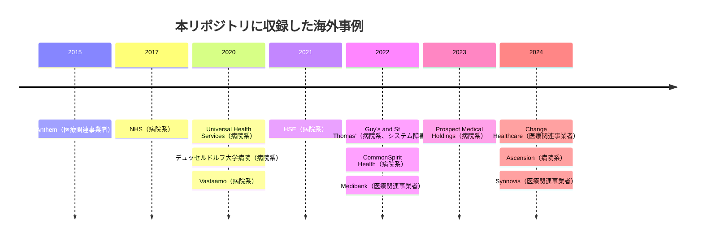

# 🌍 海外の医療分野のインシデント事例

> [!NOTE]
> **表記ルール**
> - **事実** … 当事者、公的機関が公表した資料で確認できる内容
> - **報道ベース** … 報道機関の報道のみで、当事者の公表資料では確認できていない内容
> - **分析** … 筆者による解釈、推測

## 概観

海外の事例は、国内より公表の水準が高い。
英国の国家監査院、アイルランドの HSE、米国の議会公聴会など、第三者が検証した記録が残っている事案が多く、経緯を追跡できる。
米国では [HHS Office for Civil Rights の Breach Portal](https://ocrportal.hhs.gov/ocr/breach/breach_report.jsf) に、500 人以上が影響を受けた医療情報の侵害が届出ベースで一覧化されている。

収録事例から繰り返し現れる構造は次の三つである（**分析**）。

1. **無差別の攻撃でも医療に被害が集中する**：レガシー資産とパッチ適用の遅れが、医療を狙っていない攻撃の被害を引き寄せる
2. **医療の中間層が単一障害点になる**：決済、検査、レセプト処理など、機能が集中した事業者が止まると、医療機関そのものが健全でも診療が回らない
3. **恐喝の対象が患者個人まで下りる**：組織が身代金を払うかどうかというモデルでは説明できない被害が生じている

---

## 収録事例の推移

図に現れない年は、本リポジトリに収録した事例がない年である。
被害が無かったことを示すものではない。

## 年別ページ

各年に、時系列の記録（timeline）と、その年の情勢をまとめたサマリー（summary）を置く。
各ページの中身は[対象の区分](../README.md#対象の区分)ごとに分けている。
「その他の事案」は、サイバー攻撃以外の事案（サポート詐欺、システム障害、内部不正、機器や記憶媒体の紛失と盗難など）の収録件数である。
類型の定義は[事案の類型](../README.md#事案の類型)にまとめている。

| 年 | 病院系 | 製薬企業系 | 医療関連事業者 | その他の事案 | ページ |
|---|---|---|---|---|---|
| 2026 | 0 | 0 | 0 | 0 | [サマリー](2026-summary.md) ／ [履歴](2026-timeline.md) |
| 2025 | 0 | 0 | 0 | 0 | [サマリー](2025-summary.md) ／ [履歴](2025-timeline.md) |
| 2024 | 1 | 0 | 2 | 0 | [サマリー](2024-summary.md) ／ [履歴](2024-timeline.md) |
| 2023 | 1 | 0 | 0 | 0 | [サマリー](2023-summary.md) ／ [履歴](2023-timeline.md) |
| 2022 | 1 | 0 | 1 | 1 | [サマリー](2022-summary.md) ／ [履歴](2022-timeline.md) |
| 2021 | 1 | 0 | 0 | 0 | [サマリー](2021-summary.md) ／ [履歴](2021-timeline.md) |
| 2020 | 3 | 0 | 0 | 0 | [サマリー](2020-summary.md) ／ [履歴](2020-timeline.md) |
| 2019 以前 | 1 | 0 | 1 | 0 | [履歴](2019-earlier.md) |

件数は本リポジトリに収録した件数であり、その年に世界で発生した被害の総数ではない。
収録が 0 件の年も、被害が無かったことを意味しない。

**製薬企業系の収録が 0 件である点について**：本リポジトリは病院と製薬企業の双方を対象としているが、製薬企業の被害事例をまだ収録できていない。
製薬企業に固有の攻撃面は [製薬企業のセキュリティ](../../../reference/pharma/) に整理している。

## 事例の識別子

各事例に `GL-<年>-<連番>` の識別子を与え、見出しの直前にアンカーを置いている。
サイバー攻撃以外の事案には `GL-<年>-S<連番>` を与える。
他のページからは `global/2024-timeline.md#GL-2024-01` の形で参照できる。

## 参考情報源

- [HHS Office for Civil Rights - Breach Portal（米国の医療情報侵害の公式報告一覧）](https://ocrportal.hhs.gov/ocr/breach/breach_report.jsf)
- [HHS Health Sector Cybersecurity Coordination Center (HC3)](https://www.hhs.gov/about/agencies/asa/ocio/hc3/index.html)
- [CISA Advisories](https://www.cisa.gov/news-events/cybersecurity-advisories)
- [Health-ISAC](https://health-isac.org/)
- [ENISA Health Threat Landscape](https://www.enisa.europa.eu/)

---

[← インシデント事例集](../README.md) | [国内の事例](../japan/README.md) | [トップへ](../../../../README.md)
