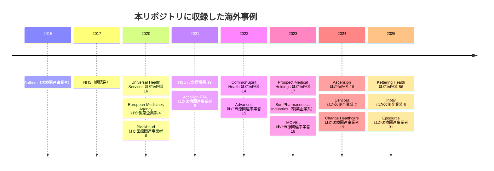

# 🌍 海外の医療分野のインシデント事例

> [!NOTE]
> **表記ルール**：本ページでは、**事実**（一次情報で確認できる内容。出典を併記する）、**報道ベース**（報道や第三者の集計のみで確認でき、当事者の公表資料では裏付けが取れていない内容）、**分析**（筆者の解釈）を書き分ける。

## 概観

海外の事例は、国内より公表の水準が高い。
英国の国家監査院、アイルランドの HSE、米国の議会公聴会など、第三者が検証した記録が残っている事案が多く、経緯を追跡できる。
米国では [HHS Office for Civil Rights の Breach Portal](https://ocrportal.hhs.gov/ocr/breach/breach_report.jsf) に、500 人以上が影響を受けた医療情報の侵害が届出ベースで一覧化されている。

収録事例から繰り返し現れる構造は次の三つである（**分析**）。

1. **無差別の攻撃でも医療に被害が集中する**：レガシー資産とパッチ適用の遅れが、医療を狙っていない攻撃の被害を引き寄せる
2. **医療の中間層が単一障害点になる**：決済、検査、レセプト処理など、機能が集中した事業者が止まると、医療機関そのものが健全でも診療が回らない
3. **恐喝の対象が患者個人まで下りる**：組織が身代金を払うかどうかというモデルでは説明できない被害が生じている

---

## 収録事例の推移

図に現れない年は、本リポジトリに収録した事例がない年である。
被害がなかったことを示すものではない。

## 年別ページ

各年の海外の事例は、時系列の記録（`YYYY-timeline.md`）に置く。
ページの中身は[対象の区分](../README.md#対象の区分)ごとに分けている。

| 年 | 履歴 | 米国 HHS OCR 届出の全件集計 |
|---|---|---|
| 2026 | [2026 年の履歴](2026-timeline.md) | ー |
| 2025 | [2025 年の履歴](2025-timeline.md) | [795 件](2025-us-hhs.md) |
| 2024 | [2024 年の履歴](2024-timeline.md) | [741 件](2024-us-hhs.md) |
| 2023 | [2023 年の履歴](2023-timeline.md) | [746 件](2023-us-hhs.md) |
| 2022 | [2022 年の履歴](2022-timeline.md) | [718 件](2022-us-hhs.md) |
| 2021 | [2021 年の履歴](2021-timeline.md) | [715 件](2021-us-hhs.md) |
| 2020 | [2020 年の履歴](2020-timeline.md) | [663 件](2020-us-hhs.md) |
| 2019 以前 | [2019 年以前の履歴](2019-earlier.md) | ー |

その年の情勢と集計は、国内と海外を一つにまとめた[年ごとのページ](../years/)にある。
米国については、2020 年から 2025 年の 6 年分について、HHS OCR へ届け出られた全件の集計を上の表に挙げたページへ置いている。
区分ごとの収録件数を国内と並べて見るときは、[インシデント事例集の年別一覧](../README.md#年別一覧)を参照してほしい。

**製薬企業系の収録について**：本リポジトリは病院と製薬企業の双方を対象としている。
海外では 2020 年に 4 件、2023 年に 1 件、2024 年に 2 件、2025 年に 6 件を収録した。
2020 年は、COVID-19 ワクチンの開発と審査に関わる組織が続けて狙われた年である。
[GL-2020-20 European Medicines Agency](2020-timeline.md#GL-2020-20)では、窃取された審査文書が改変のうえ公開された。
2024 年は、医薬品卸の [GL-2024-20 Cencora](2024-timeline.md#GL-2024-20) と、血漿を採取する [GL-2024-21 Octapharma Plasma](2024-timeline.md#GL-2024-21) で、供給の側が止まっている。
2025 年の 6 件は次のとおりである。
受託試験の [GL-2025-13 Inotiv](2025-timeline.md#GL-2025-13) と [GL-2025-59 Drug Safety Testing Center](2025-timeline.md#GL-2025-59)、受託製造の [GL-2025-81 CMIC CMO USA](2025-timeline.md#GL-2025-81)、放射性医薬品を製造する [GL-2025-57 Instituto de Pesquisas Energéticas e Nucleares](2025-timeline.md#GL-2025-57)、送金を詐取された [GL-2025-58 Marinomed Biotech](2025-timeline.md#GL-2025-58)、サーバ 15 台が暗号化された [GL-2025-89 M.J. Biopharm](2025-timeline.md#GL-2025-89) である。
製薬企業に固有の攻撃面は [製薬企業のセキュリティ](../../../reference/pharma/) に整理している。

## 事例の識別子

各事例に `GL-<年>-<連番>` の識別子を与え、見出しの直前にアンカーを置いている。
サイバー攻撃以外の事案には `GL-<年>-S<連番>` を与える。
他のページからは `global/2024-timeline.md#GL-2024-01` の形で参照できる。

## 参考情報源

- [HHS Office for Civil Rights - Breach Portal（米国の医療情報侵害の公式報告一覧）](https://ocrportal.hhs.gov/ocr/breach/breach_report.jsf)
- [HHS Health Sector Cybersecurity Coordination Center (HC3)](https://www.hhs.gov/about/agencies/asa/ocio/hc3/index.html)
- [CISA Advisories](https://www.cisa.gov/news-events/cybersecurity-advisories)
- [Health-ISAC](https://health-isac.org/)
- [ENISA Health Threat Landscape](https://www.enisa.europa.eu/)

---

[← インシデント事例集](../README.md) | [国内の事例](../japan/README.md) | [トップへ](../../../../README.md)
