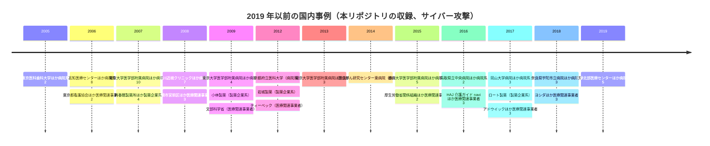
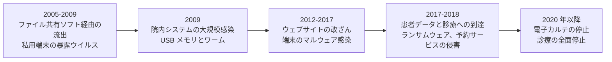
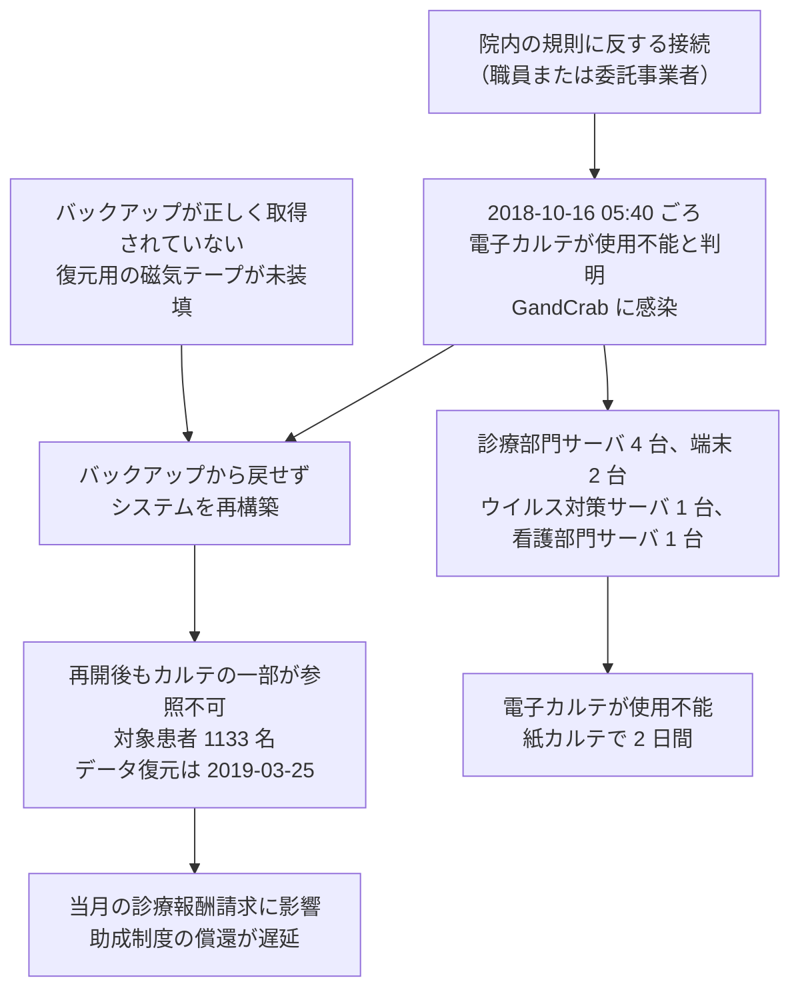
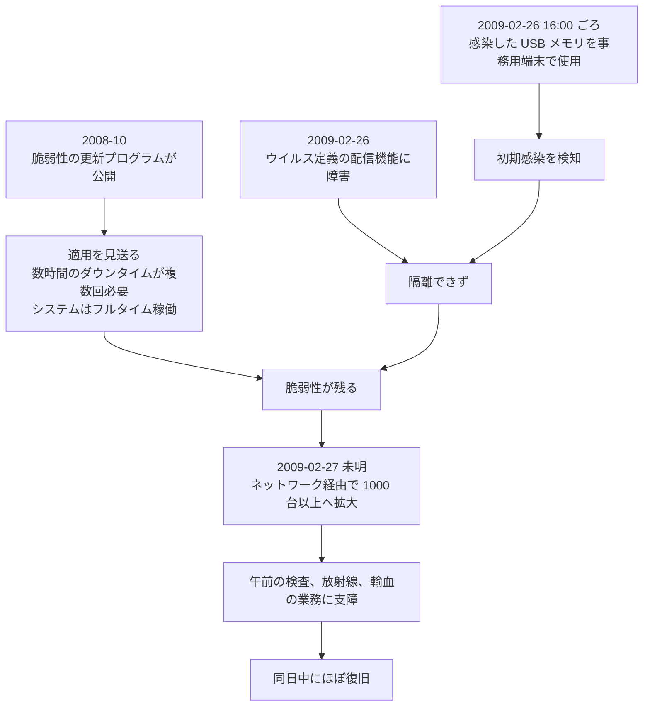

# 🇯🇵 国内の事例 2019 年以前（履歴）

2019 年以前に発生した国内の事例をまとめて記録する。
年ごとの収録件数に偏りが大きく、年単位に分けても情勢を比べられないため、一つのページに集約している。
年次サマリーは作成していない。

> [!NOTE]
> **表記ルール**：本ページでは、**事実**（一次情報で確認できる内容。出典を併記する）、**報道ベース**（報道や第三者の集計のみで確認でき、当事者の公表資料では裏付けが取れていない内容）、**分析**（筆者の解釈）を書き分ける。
> [対象の区分](../README.md#対象の区分)と[一次情報の強度](../README.md#一次情報の強度)の定義は、インシデント事例集のトップにまとめている。

## 収録件数

| 区分 | サイバー攻撃 | その他の事案 |
|---|---|---|
| 病院系 | 54 | 324 |
| 製薬企業系 | 7 | 23 |
| 医療関連事業者 | 18 | 138 |

収録は本リポジトリが一次情報を確認できた事案に限る。
2019 年以前に国内で公表された医療関連の事案がこれで尽きることを示すものではない。
最も古い収録は 2004 年である。

## 収集の範囲と方法

本ページの収録は、次の手順で候補を洗い出したうえで、一次情報にあたって確認したものである。

1. [Security NEXT](https://www.security-next.com/) の月別アーカイブ（`/date/YYYY/MM`、続きは `/date/YYYY/MM/page/N`）を 2004 年 1 月から 2019 年 12 月まで走査する
2. [ScanNetSecurity](https://scan.netsecurity.ne.jp/) の「インシデント、事故」カテゴリの月別アーカイブ（`/category/incident/YYYY/MM/`）を 2010 年 1 月から 2019 年 12 月まで走査する
3. 見出しに医療に関する語（病院、医療、医科、歯科、患者、カルテ、看護、製薬、薬局、健診、検診、治験、介護、保健など）を含む記事を抽出する
4. 抽出した記事の本文から、当事者の公表にもとづく事案を選び、当事者の資料と行政資料で裏付けを取る

この走査で、医療に関わる記事は Security NEXT で 670 件（2004 年から 2009 年が 246 件、2010 年から 2019 年が 424 件）、ScanNetSecurity で 129 件を数えた。
両者の重複を除いて突き合わせ、本ページに収録したのは 564 件である。
収録しなかったものは、教育機関だけに関わる事案、動物病院の事案、製品や調査の紹介、海外事案の紹介、同一事案の続報である。

**分析**：収録した 564 件のうち、サイバー攻撃は 79 件にとどまる。
記憶媒体と書類の紛失、盗難、誤送付、内部不正が繰り返し公表される一方で、外部からの攻撃は年に数件である。
被害の起こりやすさで対策を並べ替えるなら、この期間の国内では、媒体の管理と持ち出しの統制が先に来る。

## 収録事例の推移

図はサイバー攻撃の収録件数を示す。
記憶媒体の紛失、内部不正、誤送付などの[サイバー攻撃以外の事案](../README.md#事案の類型)は、「その他の事案」の節に別に収録している。
2004 年、2010 年、2011 年に収録がないのは、前述の走査で見つかったこの 3 年の国内の医療分野の事案が、いずれも紛失、盗難、誤送付などの類型だったためである。

## この期間の輪郭

**分析**：攻撃の型は、四つの段階を踏んでいる。

**第一段階（2005 年から 2009 年）はファイル共有ソフト経由の流出**である。
本ページに収録したこの時期のサイバー攻撃 42 件のうち 35 件がマルウェア感染で、そのうち 34 件は、端末が暴露ウイルスに感染し、保存されていた情報がネット上へ公開されたものである（Winny、Share などのソフト名まで確認できるのは 18 件）。
侵入されたのは病院のシステムではない。
医師、学生、研修医、退職者、委託先の社員が持つ私用の端末が暴露ウイルスに感染し、そこに置かれていた患者情報が公開の場へ出た。
最大の [高知医療センター](#JP-2006-08) は 26 万 4717 件で、流出元は委託先社員の自宅の端末であった。

**第二段階（2009 年）は院内システムそのものの感染**である。
[東京大学医学部附属病院](#JP-2009-02)で、USB メモリから持ち込まれたワームが病院情報システムの 1000 台以上へ広がり、検査、放射線、輸血の業務に支障が出た。
更新プログラムの適用を、ダウンタイムを避けるために見送っていたことが背景にある。

**第三段階（2012 年から 2017 年）はウェブサイトの改ざんと端末のマルウェア感染**である。
[京都府立医科大学](#JP-2012-01)、[東京大学医学部附属病院](#JP-2013-01)、[渓仁会の 24 サイト](#JP-2017-02)はいずれも、閲覧者をウイルスに感染させる状態になった。
[香川大学医学部附属病院](#JP-2015-02)と[九州歯科大学](#JP-2015-03)は、同じ日に警察からの情報提供で感染を知った。
[岡山大学病院](#JP-2017-01)は、自組織のログ解析で医療用端末の不正な通信を見つけている。

**第四段階（2017 年から）は診療と患者データへの到達**である。
[新潟大学医歯学総合病院](#JP-2017-07)で治験の患者情報を保存した端末がランサムウェアで暗号化され、[アドウイック](#JP-2017-06)の診療予約サービスから 59 万 7452 人分が流出した可能性がある。
そして [2018 年 10 月の宇陀市立病院](#JP-2018-01)で、電子カルテそのものが暗号化される。

**流出元が組織の外にある**という点は、第一段階と第四段階で共通する。
2005 年から 2009 年は職員と委託先の私用端末、2017 年以降は委託先が運営するサービスである。
いずれも、医療機関が自組織の対策だけでは止められない（[委託先への依存](../../../response/dependencies.md)）。

診療を止めたサイバー攻撃の公表は、この期間では[東京大学医学部附属病院](#JP-2009-02)（業務に支障、同日中に復旧）と[宇陀市立病院](#JP-2018-01)（2 日）の 2 件にとどまる。
一方で、記憶媒体と書類の紛失、盗難、内部での不正な閲覧は毎年公表されている。
2020 年以降に続く類型は、この時期にすでに出そろっている。

## 病院系

| ID | 発生時期 | 組織 | 種別 | 初期侵入経路 | 診療への影響 | 侵害範囲、業務停止期間 | 一次情報の強度 |
|---|---|---|---|---|---|---|---|
| [JP-2005-01](#JP-2005-01) | 2005-03 | 東京医科歯科大学医学部附属病院 | マルウェア感染（P2P ソフト経由の流出） | 未公表 | 公表なし | 患者 約 50 人分がネット上へ流出 | 当事者公表 |
| [JP-2005-02](#JP-2005-02) | 2005-04 | 鳥取赤十字病院 | マルウェア感染 | 元在籍の医師の端末 | 公表なし | 小児科の入院患者 63 人分が流出 | 当事者公表 |
| [JP-2006-01](#JP-2006-01) | 2006-01 | 筑波大学附属病院 | マルウェア感染 | 学生の端末のウイルス感染 | 公表なし | 臨床実習の記録から患者 41 人分が流出 | 当事者公表 |
| [JP-2006-02](#JP-2006-02) | 2006-02 | 西埼玉中央病院 | マルウェア感染 | 附属看護学校の学生の私用端末 | 公表なし | 入院患者の情報がネット上へ流出 | 当事者公表 |
| [JP-2006-03](#JP-2006-03) | 2006-03 | 長谷川病院（富山市） | マルウェア感染 | 職員の私用端末 | 公表なし | 手術に関する情報を含む 2873 件が流出 | 当事者公表 |
| [JP-2006-04](#JP-2006-04) | 2006-04 | 福井県立病院 | マルウェア感染 | 研修医の私用端末 | 公表なし | 患者 32 人分が流出 | 当事者公表 |
| [JP-2006-06](#JP-2006-06) | 2006-08 | 藤田保健衛生大学病院 | マルウェア感染 | 医師の私用端末（暴露ウイルス） | 公表なし | 患者情報が流出 | 当事者公表 |
| [JP-2006-07](#JP-2006-07) | 2006-10 | 札幌医科大学 | マルウェア感染 | 学生の私用端末（P2P ソフト） | 公表なし | 患者 4 人分の診療情報が流出 | 当事者公表 |
| [JP-2006-08](#JP-2006-08) | 2005-02 〜 03（2006-11 判明） | 高知医療センター（旧高知市民病院） | マルウェア感染（委託先の端末） | 業務委託先の社員の個人端末 | 公表なし | 患者 **26 万 4717 件**、職員と専修医 1331 人分が流出 | 当事者公表 |
| [JP-2006-09](#JP-2006-09) | 2006-12 | 高砂市民病院 | マルウェア感染 | 未公表 | 公表なし | 病状を含む患者情報が流出 | 当事者公表 |
| [JP-2007-01](#JP-2007-01) | 2007-01 | 東京大学医学部附属病院 | マルウェア感染 | 医師の端末（P2P ソフト） | 公表なし | 患者情報がネット上へ流出 | 当事者公表 |
| [JP-2007-02](#JP-2007-02) | 2007-02 | 東京医科歯科大学医学部附属病院 | マルウェア感染 | 学生の私用端末（P2P ソフト） | 公表なし | 患者情報 69 件が流出した可能性 | 当事者公表 |
| [JP-2007-07](#JP-2007-07) | 2007-07 | 国民健康保険おいらせ病院、横須賀市立うわまち病院 | マルウェア感染 | 医師の端末。個人情報と Winny を削除したと誤認していた | 公表なし | 両院の患者情報が Winny 上へ流出 | 当事者公表 |
| [JP-2007-08](#JP-2007-08) | 2007-07 | 福山市民病院 | マルウェア感染 | 未公表 | 公表なし | 患者 約 200 件が Winny 上へ流出 | 当事者公表 |
| [JP-2007-09](#JP-2007-09) | 2007-08 | 九州大学（大学病院を含む） | マルウェア感染 | 私用端末（Share） | 公表なし | 個人情報が流出。同時期に大学病院の端末の紛失も判明 | 当事者公表 |
| [JP-2007-10](#JP-2007-10) | 2007-09 | 済生会横浜市東部病院（委託先の NTT 東日本） | マルウェア感染（委託先の端末） | 電子カルテの開発担当者が無断で持ち出したデータ | 公表なし | 患者 9951 人分の会計情報、職員 1146 人分、システムの運用マニュアルと設計情報 | 当事者公表 |
| [JP-2007-11](#JP-2007-11) | 2007-09 | 藤沢内科消化器科クリニック | マルウェア感染 | 未公表 | 公表なし | 患者情報がネット上へ流出 | 当事者公表 |
| [JP-2007-12](#JP-2007-12) | 2007-10 | 島根大学医学部附属病院 | マルウェア感染 | 学生の端末（ファイル交換ソフト） | 公表なし | 学生と患者に関する情報が流出 | 当事者公表 |
| [JP-2007-13](#JP-2007-13) | 2007-11 | 沖縄県立宮古病院 | マルウェア感染 | 元勤務医の私有端末 | 公表なし | 患者 11 件がネット上へ流出 | 当事者公表 |
| [JP-2007-14](#JP-2007-14) | 2006 〜 2007-11 | 広島大学病院、広島赤十字・原爆病院 | マルウェア感染 | 未公表。1 年以上前から感染していた | 公表なし | 両院の患者情報が Winny 上へ流出 | 当事者公表 |
| [JP-2008-02](#JP-2008-02) | 2008-06 | 十全病院（金沢市） | マルウェア感染 | 未公表 | 公表なし | 精神科の入院患者の個人情報がネット上へ流出 | 当事者公表 |
| [JP-2008-04](#JP-2008-04) | 2008-08 | 大阪府立母子保健総合医療センター | マルウェア感染 | 未公表 | 公表なし | 患者の個人情報が Winny 上へ流出 | 当事者公表 |
| [JP-2008-05](#JP-2008-05) | 2008-09 | 茨城県立中央病院（委託先の日本 IBM） | マルウェア感染（委託先の端末） | 委託先の端末 | 公表なし | 情報システムの保守情報が Winny 上へ流出 | 当事者公表 |
| [JP-2008-06](#JP-2008-06) | 2008-09 | 山陽小野田市民病院 | マルウェア感染 | 未公表 | 公表なし | 手術記録などの業務情報がネット上へ流出 | 当事者公表 |
| [JP-2008-07](#JP-2008-07) | 2008-10 | 昭和大学病院 | マルウェア感染 | 元大学院生の自宅の端末（ファイル共有ソフト） | 公表なし | 患者 88 人分が流出 | 当事者公表 |
| [JP-2008-08](#JP-2008-08) | 2008-10 | 駒井病院（醫光会、群馬県高崎市） | マルウェア感染 | 職員が USB メモリで持ち帰ったデータ | 公表なし | 患者情報が Winny 上へ流出 | 当事者公表 |
| [JP-2008-09](#JP-2008-09) | 2008-11 | 品川近視クリニック | 不正アクセス | 未公表（外部からの指摘で判明） | 公表なし | 2004 年 10 月から 2006 年 2 月の患者 約 1 万 8000 人分が流出した可能性 | 当事者公表 |
| [JP-2009-01](#JP-2009-01) | 2009-01 | 東京都立墨東病院 | マルウェア感染 | 職員が修復のため自宅へ持ち帰ったデータ | 公表なし | 患者と職員の情報が Winny 上へ流出 | 当事者公表 |
| [JP-2009-02](#JP-2009-02) | 2009-02 | 東京大学医学部附属病院 | マルウェア感染（WORM_DOWNAD.AD） | 事務業務用の端末で使った **USB メモリ** | 検査、放射線、輸血に関する診療業務に支障 | 病院情報システムの端末とサーバ **1000 台以上**が感染。同日中にほぼ復旧 | 当事者公表 |
| [JP-2009-03](#JP-2009-03) | 2009-04 | 東京臨海病院（日本私立学校振興、共済事業団） | マルウェア感染 | 退職した職員の自宅の端末（Share） | 公表なし | 患者 598 人分が流出 | 当事者公表 |
| [JP-2009-04](#JP-2009-04) | 2009-06 | 前田病院（佐賀県伊万里市） | マルウェア感染 | 職員の自宅の端末（Winny） | 公表なし | 患者の個人情報がネット上へ流出 | 当事者公表 |
| [JP-2012-01](#JP-2012-01) | 2012-07 | 京都府立医科大学 | 不正アクセス（ウェブサイトの改ざん） | 未公表 | 公表なし | 公式サイトは復旧。法人サイトなど一部は閲覧不能が継続 | 当事者公表 |
| [JP-2013-01](#JP-2013-01) | 2013-05 | 東京大学医学部附属病院 | 不正アクセス（ウェブサイトの改ざん） | 委託先の更新用端末のウイルス感染 | 影響なし（個人情報を扱う系統は独立） | 改ざんから削除まで 約 6 時間半 | 当事者公表 |
| [JP-2013-02](#JP-2013-02) | 2013-06 | 湘南鎌倉総合病院 | 不正アクセス（ウェブサイトの改ざん） | 未公表 | 公表なし | 改ざんされていた期間が 約 6 時間 | 当事者公表 |
| [JP-2013-03](#JP-2013-03) | 2013-06 | 伊勢市立伊勢総合病院 | 不正アクセス（ウェブサイトの改ざん） | 未公表 | 影響なし（個人情報は別システム） | ウェブサイトの公開を停止。復旧の見込みは未定 | 当事者公表 |
| [JP-2014-01](#JP-2014-01) | 2014-01 | 国立がん研究センター東病院 | マルウェア感染（ソフトウェア更新の悪用） | 動画再生ソフトの更新プログラム | 公表なし | 端末 2 台が感染 | 当事者公表 |
| [JP-2015-02](#JP-2015-02) | 2015-06 | 香川大学医学部附属病院 | マルウェア感染 | 未公表（警察からの情報提供で判明） | 影響なし（電子カルテは別ネットワーク） | 端末 1 台が感染 | 当事者公表 |
| [JP-2015-03](#JP-2015-03) | 2015-06 | 九州歯科大学 | マルウェア感染 | 未公表（警察からの情報提供で判明） | 公表なし | 端末 1 台が感染 | 当事者公表 |
| [JP-2015-06](#JP-2015-06) | 2015-06 | 千鳥橋病院、千代診療所 | 不正アクセス（ウェブサイトの改ざん） | 未公表 | 公表なし | サイトの停止が 約 2 週間（06-17 から 07-03） | 当事者公表 |
| [JP-2015-01](#JP-2015-01) | 2015-11 | 三重県厚生農業協同組合連合会 菰野厚生病院 | マルウェア感染 | インターネットの利用中に医事システムの端末が感染 | 医事システムが影響を受けた。診療の停止は公表されていない | 未公表 | 当事者公表 |
| [JP-2015-07](#JP-2015-07) | 2015-12 | 岩国医療センター | 不正アクセス（ウェブサイトの改ざん） | 未公表 | 影響なし | サイトの停止が 約 2 週間（2015-12-23 から 2016-01-08） | 当事者公表 |
| [JP-2016-01](#JP-2016-01) | 2016-01 | 鳥取県立中央病院 | マルウェア感染（ファイルの暗号化） | 外部から届いたウイルスメール | 庁内 LAN の端末 1 台。電子カルテへの影響は公表されていない | 未公表。電子ファイル 3152 個が開けなくなった | 当事者公表 |
| [JP-2016-03](#JP-2016-03) | 2016-02 | 新潟県立柿崎病院 | 不正アクセス（ウェブサイトの改ざんの可能性）となりすましメール | 未公表 | 影響なし（医療システムと県 LAN には接続していない） | サイトを閉鎖。安全性の確認が継続 | 当事者公表 |
| [JP-2017-01](#JP-2017-01) | 2017-03 | 岡山大学病院 | マルウェア感染 | 未公表 | 電子カルテと基幹システムへの不正アクセスは確認されず | 医療用端末 2 台が外部と不正通信 | 当事者公表 |
| [JP-2017-02](#JP-2017-02) | 2017-06 | 社会医療法人 渓仁会（北海道、病院と介護施設） | 不正アクセス（ウェブサイトの改ざん） | CMS の脆弱性 | 公表なし | 関連 24 サイトが改ざん（06-27 から 07-01）。全サイトを一時停止 | 当事者公表 |
| [JP-2017-07](#JP-2017-07) | 2017-12 | 新潟大学医歯学総合病院 | ランサムウェアとウェブサイトの改ざん | 未公表 | 治験に関する患者情報を保存した端末が暗号化 | 暫定サイトの公開まで 1 週間（12-18 から 12-25） | 当事者公表 |
| [JP-2018-05](#JP-2018-05) | 2018-05 | 聖マリアンナ医科大学東横病院 | 不正アクセス（ウェブサイトの改ざん） | 未公表 | 影響なし（カルテはウェブサイトと分離） | サーバを停止して再構築（05-07 から 05-09） | 当事者公表 |
| [JP-2018-01](#JP-2018-01) | 2018-10 | 奈良県宇陀市立病院 | ランサムウェア（GandCrab） | ルール違反による接続（有識者会議の結論。感染機器の初期化により経路は追跡できず） | 電子カルテが使用不能。紙カルテで診療を継続 | 情報システムの停止が **2 日**（2018-10-16 から 10-18）。データの復元は 2019-03-25 | 報告書 |
| [JP-2018-02](#JP-2018-02) | 2018-11 | 徳島県鳴門病院 | 不正アクセス（ウェブサイトの改ざん） | 未公表 | 影響なし（電子カルテと個人情報への影響なし） | ウェブサーバを初期化して再構築 | 当事者公表 |
| [JP-2019-01](#JP-2019-01) | 2019-05 | 東京都保健医療公社 多摩北部医療センター | 不正アクセス（マルウェア感染、Emotet の亜種） | 医師が受信したメールの添付ファイル | 公表なし | 診療の停止は公表されていない | 当事者公表 |
| [JP-2019-02](#JP-2019-02) | 2019-05 | 山口県厚生農業協同組合連合会 周東総合病院 | 不正アクセス（ウェブサイトの改ざん） | サイト管理ツールの脆弱性、または旧サイトに残っていた Flash の脆弱性 | 影響なし（患者データはインターネットから分離） | ウェブサイトの停止（復旧時期は未公表） | 当事者公表 |
| [JP-2019-05](#JP-2019-05) | 2019-06 | 札幌医科大学 | 不正アクセス（メールアカウントの悪用） | 退職した教員のメールアカウント | 公表なし | フィッシングメールを学内外 約 8000 名が受信 | 当事者公表 |
| [JP-2019-03](#JP-2019-03) | 2019-09 | 国立成育医療研究センター | 不正アクセス（採用サイト） | 未公表 | 公表なし | 採用サイトを停止 | 当事者公表 |
| [JP-2019-04](#JP-2019-04) | 2019-12 | 地域医療機能推進機構 群馬中央病院 | マルウェア感染（Emotet） | 職員が受信した不審メール | 影響なし（診療情報システムは事務系と分離） | **診療の停止なし** | 当事者公表 |

**時期が特定できない事例**：日本医師会総合政策研究機構の資料は、金沢大学附属病院で、各部門が個別に導入したシステムから他部門の医療機器へマルウェアの感染が広がり、機器の応答が遅くなるなど診療業務に影響が生じた事案を記録している。
ウイルス検索と駆除のツールを導入したあとの検査では、1000 件近くの不正プログラムが検出された機器もあった。
侵入は USB メモリを経由したとされる。
発生時期が公表されていないため、上の一覧には収めていない。
部門ごとに調達したシステムが、医療機器を含む院内の他の系統とつながっていた点は、[医療機器のセキュリティ](../../../technology/medical-devices/)で扱う構図と同じである（[日本の医療機関におけるサイバー攻撃の事例（PDF）](https://www.jmari.med.or.jp/wp-content/uploads/2022/03/WP465_appendix.pdf)）。

### JP-2012-01 京都府立医科大学（2012 年 7 月）

**事実**

- 発生時期：2012 年 7 月 16 日 2 時から 17 日 17 時にかけて改ざんされた状態になった。
- 対象組織：京都府立医科大学。改ざんされたのは `www.kpu-m.ac.jp` と `www.f.kpu-m.ac.jp` 以下のページで、公式サイト、看護学科のサイト、附属図書館のサイト、京都府公立大学法人のサイトを含む。
- 攻撃種別：不正アクセスによるウェブサイトの改ざん。
- 侵害範囲：閲覧するとウイルスに感染する不正なサイトへ誘導される状態になった。
- 対応：サイトを一時閉鎖した。公式サイトは修復して再開したが、法人のサイトなど一部は改ざんの影響で閲覧できない状態が続いた。

**分析**

- 一つのサーバに複数の組織のサイトが同居していたため、改ざんの影響が大学、看護学科、図書館、法人へ同時に及んだ。ドメインを共有する構成では、被害の単位はサイトではなくサーバになる。
- 復旧の速さがサイトごとに違う。公開を再開した部分と、閲覧できないまま残った部分が並んだ。停止と復旧の判断を誰が持つかは、サイトの数だけ分かれる（[外部から見た自組織の攻撃面](../../../practice/attack-surface.md)）。

**一次情報**

- [京都府立医科大学](https://www.kpu-m.ac.jp/)
- [京都府立医科大のサイトが改ざん - 閲覧でウイルス感染のおそれ](https://www.security-next.com/032488)（Security NEXT による当事者公表の報道）

---

### JP-2013-01 東京大学医学部附属病院（2013 年 5 月）

**事実**

- 発生時期：2013 年 5 月 30 日 20 時ごろに改ざんが発生し、31 日 1 時ごろに気づき、2 時半ごろに不正なページを削除した。
- 対象組織：東京大学医学部附属病院。改ざんされたのはトップページ。
- 攻撃種別：不正アクセスによるウェブサイトの改ざん。
- 初期侵入経路：サイトを管理する**業務委託先のパソコンがウイルスに感染**したことが原因と説明している。
- 侵害範囲：ウイルスに感染する外部サイトへ誘導される状態になり、閲覧によりマルウェアへ感染するおそれがあった。
- 情報流出：個人情報を管理するシステムは独立しているとして否定した。
- 対応：期間中に閲覧した利用者へ、対策ソフトで感染の有無を確認するよう呼びかけた。

**分析**

- 侵入されたのは病院のサーバではなく、更新作業に使う委託先の端末である。ウェブサイトの管理を外へ出すと、更新の権限も外へ出る。委託先の端末は、病院の資産台帳には載らない（[委託先への依存](../../../response/dependencies.md)）。
- 6 時間半で削除に至っている。この期間の改ざん事案では速いほうで、深夜に気づける体制があったことを示す。同じ 2013 年の[市立伊勢総合病院](#JP-2013-03)は復旧の見込みが立たなかった。

**一次情報**

- [東京大学医学部附属病院](https://www.h.u-tokyo.ac.jp/)
- [東大病院のサイトが改ざん被害、原因は管理 PC のウイルス感染 - 個人情報漏洩は否定](https://www.security-next.com/040642)（Security NEXT による当事者公表の報道）

---

### JP-2013-02 湘南鎌倉総合病院（2013 年 6 月）

**事実**

- 発生時期：2013 年 6 月 11 日 6 時 40 分ごろから同日 13 時過ぎにかけて改ざんされた状態になった。
- 対象組織：湘南鎌倉総合病院。
- 攻撃種別：不正アクセスによるウェブサイトの改ざん。
- 侵害範囲：期間中に閲覧した場合、パソコンがウイルスに感染する可能性があった。
- 対応：サイトに報告と謝罪を掲載し、期間中に閲覧した利用者へウイルススキャンを呼びかけた。

**分析**

- 改ざんは午前 6 時台に始まり、昼過ぎに解消している。監視の間隔が、被害にさらされる時間をそのまま決める。
- この年、国内では病院のサイトの改ざんが続けて公表された。[東京大学医学部附属病院](#JP-2013-01)は 5 月、[市立伊勢総合病院](#JP-2013-03)は 6 月末である。個別の病院を狙ったのではなく、脆弱なサーバを機械的に探す攻撃に医療機関が含まれていた形と読める。

**一次情報**

- [湘南鎌倉総合病院](https://www.skgh.jp/)
- [湘南鎌倉総合病院のサイトが改ざん - 閲覧でウイルス感染のおそれ](https://www.security-next.com/040933)（Security NEXT による当事者公表の報道）

---

### JP-2013-03 伊勢市立伊勢総合病院（2013 年 6 月）

**事実**

- 発生時期：2013 年 6 月 30 日 10 時半過ぎから 7 月 1 日 10 時前にかけて改ざんされた状態になった。
- 対象組織：三重県の伊勢市立伊勢総合病院。
- 攻撃種別：不正アクセスによるウェブサイトの改ざん。
- 侵害範囲：期間中に閲覧した場合、パソコンにウイルスが感染する可能性があった。
- 情報流出：個人情報は別のシステムで管理しているとして否定した。
- 対応：サイトの公開を一時停止した。公表の時点で復旧の見込みは立っていない。

**分析**

- 復旧の見込みが立たないまま公開を止めた。医療機関のサイトは、診療時間、休診の案内、救急の受け入れ状況を伝える経路でもある。止まった期間に何で代替するかは、事前に決めておく必要がある（[事業継続](../../../response/bcp-cyber.md)）。
- 同院は 5 年後の 2018 年 7 月にも、患者情報を含む USB メモリの院外への持ち出しと紛失を公表している（[JP-2018-S11](#その他の事案サイバー攻撃以外)）。

**一次情報**

- [伊勢市](https://www.city.ise.mie.jp/)
- [市立伊勢総合病院のサイトが改ざん - 閲覧でウイルス感染のおそれ](https://www.security-next.com/041453)（Security NEXT による当事者公表の報道）

---

### JP-2014-01 国立がん研究センター東病院（2014 年 1 月）

**事実**

- 発生時期：2014 年 1 月。公表は 2 月である。
- 対象組織：国立がん研究センター東病院。
- 攻撃種別：マルウェア感染。
- 初期侵入経路：動画再生ソフト「GOM Player」の**更新プログラム**を経由して感染した。
- 侵害範囲：同院のパソコン **2 台**。

**分析**

- 侵入口は、利用者が開いた添付ファイルでも、脆弱なウェブサーバでもない。**正規のソフトウェアの更新の仕組み**である。更新は本来、脆弱性を塞ぐための経路であり、利用者に確認を求めない。その経路が乗っ取られると、防御の側が持つ手段はほとんどない（[医療における AI とソフトウェアの供給](../../../technology/dx-ax/)）。
- 同じ更新サーバの改ざんでは、国内の複数の組織が感染している。医療機関を狙った攻撃ではなく、広く配られたソフトウェアの利用者の一部として巻き込まれた形である。同じ構図は 2017 年の [NotPetya](../global/2019-earlier.md#GL-2017-03) にも現れる。
- 感染は 2 台にとどまった。それでも研究機関の端末である点は重い。がんの臨床研究を担う組織は、診療情報と研究データの双方を持つ。

**一次情報**

- [国立がん研究センター東病院](https://www.ncc.go.jp/jp/ncce/)
- [「GoM プレイヤー」のアップデートで医師の PC がウイルス感染（国立がん研究センター東病院）](https://scan.netsecurity.ne.jp/article/2014/02/07/33528.html)（ScanNetSecurity による当事者公表の報道）

---

### JP-2015-01 三重県厚生農業協同組合連合会 菰野厚生病院（2015 年 11 月）

**事実**

以下は、厚生労働省が医療機関向けの検討資料に収録した記録による。

- 発生時期：2015 年 11 月 27 日。
- 対象組織：三重県三重郡の菰野厚生病院（三重北医療センター）。
- 攻撃種別：マルウェア感染。
- 初期侵入経路：医事システムの端末がインターネットの利用中に感染した。
- 侵害範囲：ウイルスが院内ネットワークを経由してサーバへ到達した。
- 背景として示された事情：サポートが終了した OS（Windows XP）を使用していたことが、原因の一つとして挙げられている。
- 診療への影響：公表資料では示されていない。

**分析**

- ここで示された二つの条件、すなわち**業務端末からのインターネット利用**と**サポート終了 OS の残存**は、2020 年代の事例でも繰り返し現れる。
- 感染は 1 台の端末で終わらず、院内ネットワークを通ってサーバへ及んだ。同一のネットワーク上に医事系と診療系が並ぶ構成では、最初の 1 台がどこであっても到達先は同じになる（[ネットワークの分離](../../../technology/segmentation.md)）。
- 当事者が経緯を詳細に公表する慣行がなく、行政資料が事実上の一次情報になっている。

**一次情報**

- [医療における情報セキュリティに関する脅威やインシデント（PDF）](https://www.mhlw.go.jp/content/10808000/000877236.pdf)（厚生労働省、医療等情報利活用ワーキンググループ参考資料）
- [三重県厚生農業協同組合連合会](https://www.miekosei.or.jp/)

---

### JP-2015-02 香川大学医学部附属病院（2015 年 6 月）

**事実**

- 発生時期：2015 年 6 月 11 日に警察から情報提供があり、判明した。
- 対象組織：香川大学医学部附属病院。
- 攻撃種別：マルウェア感染。
- 侵害範囲：パソコン **1 台**。
- 情報流出：公表の時点で確認されていない。
- 診療への影響：電子カルテシステムは感染した端末とは別のネットワークで運用しており、感染のおそれはないとした。
- 対応：情報流出を口実に電話やメールで個人情報を聞き出したり、金銭の振り込みを指示する詐欺への警戒を呼びかけた。

**分析**

- 感染を知ったのは自組織の監視ではなく、警察からの情報提供である。同じ日に[九州歯科大学](#JP-2015-03)も同じ経路で通知を受けている。外部の通信先の解析から、感染している組織を逆にたどって知らせる形であり、この時期の国内の標的型攻撃の一斉の把握とみられる（**分析**であり、両者の関連は公表されていない）。
- 当事者が真っ先に呼びかけたのは、情報流出そのものではなく、それを口実にした詐欺への警戒である。感染の公表は、患者に対する二次的な攻撃の材料にもなる（[メールとドメインの管理](../../../technology/email-domain.md)）。
- 電子カルテを別ネットワークに置いていたことが、被害を端末 1 台に留めた。分離は、侵入を防がないが、到達先を限る。

**一次情報**

- [香川大学医学部附属病院](https://www.med.kagawa-u.ac.jp/hospital/)
- [マルウェア感染が判明、電子カルテには影響なし - 香川大付属病院](https://www.security-next.com/059661)（Security NEXT による当事者公表の報道）

---

### JP-2015-03 九州歯科大学（2015 年 6 月）

**事実**

- 発生時期：2015 年 6 月 11 日に警察から情報提供があり、判明した。
- 対象組織：九州歯科大学。附属病院を置く。
- 攻撃種別：マルウェア感染。
- 侵害範囲：パソコン **1 台**。
- 情報流出：公表の時点で確認されていない。
- 対応：情報流出を口実にした詐欺への警戒を呼びかけた。電話やメールで個人情報を聞き出したり、金銭の振り込みを要求することは絶対にないとして注意を求めた。

**分析**

- [香川大学医学部附属病院](#JP-2015-02)と同じ日に、同じ経路で判明している。公表の文面もほぼ同じ構成である。
- 感染した端末が 1 台で、流出も確認されていない段階での公表である。被害の規模が確定する前に公表を選んだ判断は、詐欺への警戒を優先したものと読める。

**一次情報**

- [九州歯科大学](https://www.kyu-dent.ac.jp/)
- [九州歯科大の PC にマルウェア - 警察からの指摘で判明](https://www.security-next.com/059914)（Security NEXT による当事者公表の報道）

---

### JP-2015-06 千鳥橋病院、千代診療所（2015 年 6 月）

**事実**

- 発生時期：2015 年 6 月 15 日 16 時ごろに改ざんが発生し、不正なスクリプトがページに埋め込まれた。6 月 17 日 18 時半ごろにサイトを閉鎖した。
- 対象組織：福岡市の千鳥橋病院と千代診療所。
- 攻撃種別：不正アクセスによるウェブサイトの改ざん。
- 侵害範囲：期間中に閲覧した利用者がマルウェアに感染している可能性があるとした。
- 対応：入力フォームを使用しているページを閉鎖した。安全性を確認し、サーバのセキュリティ対策を追加したうえで、7 月 3 日 15 時に再開した。

**分析**

- 復旧の作業のなかで、入力フォームのページを先に閉じている。改ざんされたサイトで最も危険なのは、閲覧ではなく利用者が情報を入力する箇所である。復旧の順序に判断が現れている。
- 停止から再開まで約 2 週間である。同時期の[岩国医療センター](#JP-2015-07)も同程度を要した。

**一次情報**

- [千鳥橋病院](https://www.chidoribashi-hp.or.jp/)
- [サイトが改ざん、閲覧でマルウェア感染の可能性 - 千鳥橋病院](https://www.security-next.com/060310)（Security NEXT による当事者公表の報道）

---

### JP-2016-01 鳥取県立中央病院（2016 年 1 月）

**事実**

以下は、厚生労働省が医療機関向けの検討資料に収録した記録による。

- 発生時期：2016 年 1 月 14 日。
- 対象組織：鳥取県立中央病院。
- 攻撃種別：マルウェア感染。保存されていたファイルが開けなくなっており、暗号化を伴う型と読める。
- 初期侵入経路：外部から届いたウイルスメール。
- 侵害範囲：庁内 LAN のパソコン **1 台**。保存されていた電子ファイル **3152 個**が開けなくなった。
- 診療への影響：公表資料では示されていない。

**分析**

- 端末 1 台で 3152 個のファイルが失われた。共有フォルダを開いていれば、被害は端末の外へ広がる。台数ではなく、その端末から到達できる範囲が被害の量を決める。
- ウイルスメールから業務ファイルの暗号化へ至る経路は、2018 年の[宇陀市立病院](#JP-2018-01)、2021 年以降の病院の事案と同じである。違いは、到達したのが庁内 LAN の端末に留まったか、電子カルテのサーバまで及んだかだけである。
- 本件と[菰野厚生病院](#JP-2015-01)は、いずれも当事者の公表資料を本リポジトリでは確認できていない。行政資料に記録が残ったことで、事案の存在と日付を確かめられる。

**一次情報**

- [医療における情報セキュリティに関する脅威やインシデント（PDF）](https://www.mhlw.go.jp/content/10808000/000877236.pdf)（厚生労働省、医療等情報利活用ワーキンググループ参考資料）
- [鳥取県立中央病院](https://www.pref.tottori.lg.jp/chuobyoin/)

---

### JP-2015-07 岩国医療センター（2015 年 12 月）

**事実**

- 発生時期：2015 年 12 月 23 日 13 時半前後に不正アクセスがあり、ウェブサイトが改ざんされた。
- 対象組織：山口県岩国市の岩国医療センター。
- 攻撃種別：不正アクセスによるウェブサイトの改ざん。
- 対応：発覚後にサイトを一時停止し、修復と安全確認を行ったうえで 2016 年 1 月 8 日に再開した。
- 情報流出：個人情報の外部流出は発生しておらず、閲覧者へマルウェアが感染する可能性もなかったとした。

**分析**

- 改ざんの内容が、閲覧者を感染させる型ではなかったと当事者が明言している。この期間の改ざん事案の多くは感染への誘導を伴うため、区別して記録する意味がある。
- 年末年始を挟んで 2 週間ほどサイトを止めている。復旧の日数は、被害の深さだけでなく、要員が確保できる時期にも左右される。

**一次情報**

- [岩国医療センター](https://iwakuni.hosp.go.jp/)
- [岩国医療センターが改ざん - 個人情報流出やマルウェア感染の可能性は否定](https://www.security-next.com/065782)（Security NEXT による当事者公表の報道）

---

### JP-2016-03 新潟県立柿崎病院（2016 年 2 月）

**事実**

- 発生時期：2016 年 2 月 4 日、検索サイトから同院のサイトへアクセスすると、無関係のサイトへ誘導される画面が表示される状態になっていた。
- 対象組織：新潟県立柿崎病院。
- 攻撃種別：不正アクセスの可能性と、同院を装うなりすましメールの送信。
- なりすましメール：同院の代表アドレスに大量の送信エラーが届いたことから判明した。2 月 3 日夜から 4 日朝にかけて送信されたとみられ、英文で他サイトへ誘導する内容だった。
- 侵害範囲：ウェブサーバは病院の医療システムとも県の LAN とも接続しておらず、情報漏えいは確認されていないとした。
- 対応：サイトを閉鎖し、安全性の確認を進めた。12 日の時点では、アクセスするとウェブサーバの初期画面が表示される状態だった。

**分析**

- 二つの事象が同時に起きている。サイトの誘導と、病院を装うメールの大量送信である。当事者は関連を調査中としており、確定していない。
- なりすましメールの発覚は、宛先不明の**送信エラーが自組織へ返ってきた**ことによる。自組織のドメインが第三者に使われていることは、外向きの監視では気づきにくい。返ってくるエラーの量は、その数少ない兆候である（[メールとドメインの管理](../../../technology/email-domain.md)）。
- 医療システムと県の LAN から分離されていたことを、当事者が説明の中心に置いている。この時期の国内の公表は、被害の範囲より「診療系に届いていない」ことの説明に重点がある。

**一次情報**

- [新潟県](https://www.pref.niigata.lg.jp/)
- [県立病院が不正アクセス受けた可能性、なりすましスパムも - 新潟](https://www.security-next.com/066844)（Security NEXT による当事者公表の報道）

---

### JP-2017-01 岡山大学病院（2017 年 3 月）

**事実**

- 発生時期：2017 年 3 月 15 日、医療用に用いていた端末をログ解析ソフトで調査したところ判明した。
- 対象組織：岡山大学病院。
- 攻撃種別：マルウェア感染。
- 侵害範囲：**医療用端末 2 台**が感染し、外部と不正な通信を行っていた。それぞれ患者 1 人、合計 2 人分の個人情報が保存されていた。
- 情報流出：外部流出は確認されていないが、可能性は否定できないとした。
- 診療への影響：電子カルテなどの医療情報システムと基幹システムへの不正アクセスは確認されていない。

**分析**

- 発見の手段が**自組織のログ解析**である。この期間の国内の感染事案では、警察からの通知（[香川大学](#JP-2015-02)、[九州歯科大学](#JP-2015-03)）や、暗号化の画面で気づく例が大半を占める。自ら見つけた例は少ない（[ログと監視の設計](../../../technology/logging.md)）。
- 感染していたのは事務用の端末ではなく、**医療用端末**である。医療機器や検査機器に付属する端末は、更新も対策ソフトの導入も制約を受けやすく、監視の外に置かれやすい（[医療機器のセキュリティ](../../../technology/medical-devices/)）。
- 保存されていた個人情報は 2 人分にとどまる。それでも外部との通信が成立していた点が重い。端末が持つデータの量と、その端末が到達できる範囲は別の問題である。

**一次情報**

- [岡山大学病院](https://www.okayama-u.ac.jp/user/hospital/)
- [岡山大病院の医療用端末 2 台がマルウェア感染、外部との不正通信 - ログ解析で発覚](https://www.security-next.com/079912)（Security NEXT による当事者公表の報道）

---

### JP-2017-02 社会医療法人 渓仁会（2017 年 6 月）

**事実**

- 発生時期：2017 年 6 月 27 日 2 時過ぎから 7 月 1 日 10 時過ぎにかけて改ざんされた状態になった。
- 対象組織：北海道で病院、診療所、老人ホーム、介護施設などを運営する社会医療法人 渓仁会。
- 攻撃種別：不正アクセスによるウェブサイトの改ざん。
- 初期侵入経路：ウェブサイトで利用するコンテンツマネジメントシステム（CMS）の脆弱性。
- 侵害範囲：グループのメインサイトのほか、病院、診療所、老人ホーム、介護施設、ケアセンター、関連企業のサイトを含む **24 件**。期間中に閲覧すると外部サイトへ誘導されるおそれがあった。
- 対応：改ざんが確認されていない 4 サイトを含め、グループの全サイトを一時停止した。対策を実施したうえで順次再開した。
- 情報流出：否定している。

**分析**

- 一つの CMS の脆弱性が、24 のサイトに同時に及んだ。施設ごとにサイトを持つ法人では、更新の手間を減らすために共通の基盤へ載せる。その基盤が、被害の共通の経路になる（[外部から見た自組織の攻撃面](../../../practice/attack-surface.md)）。
- 被害が確認されていない 4 サイトも止めている。感染の有無を確かめる前に一律に止める判断は、範囲が分からない段階では合理的である。同じ判断は、2019 年の[フランスの CHU de Rouen](../global/2019-earlier.md#GL-2019-09) が情報システム全体を止めた例にも通じる。
- 病院と介護施設が同じ法人の下で同じ基盤を共有していた。医療と介護をまたぐ法人では、攻撃面も両方にまたがる。

**一次情報**

- [社会医療法人 渓仁会](https://www.keijinkai.com/)
- [病院や施設など 24 サイトが改ざん - 北海道の医療法人](https://www.security-next.com/084243)（Security NEXT による当事者公表の報道）

---

### JP-2017-07 新潟大学医歯学総合病院（2017 年 12 月）

**事実**

- 発生時期：2017 年 12 月 8 日、パソコンがマルウェアに感染している可能性があると職員から報告があり、調査したところファイルが暗号化されて使用できない状態になっていることが判明した。
- 対象組織：新潟大学医歯学総合病院。
- 攻撃種別：**ランサムウェア**。あわせてウェブサイトの改ざんも発生した。
- 侵害範囲：暗号化されたパソコンには、**治験に関する患者の氏名など個人情報**が保存されていた。
- 情報流出：外部流出は確認されていない。
- ウェブサイトの改ざん：12 月 18 日、心当たりのない記事が投稿されていることに職員が気づき、不正アクセスによる改ざんが判明した。12 月 25 日に暫定サイトを公開した。
- 診療への影響：公表資料では示されていない。

**分析**

- 本リポジトリが収録した国内の事例のうち、**病院がランサムウェアと明示して公表した最初の例**である。[宇陀市立病院](#JP-2018-01)の 10 か月前にあたる。ファイルの暗号化を伴う感染そのものは、2016 年の[鳥取県立中央病院](#JP-2016-01)で先に起きているが、公表資料はランサムウェアという語を用いていない。暗号化されたのが 1 台の端末に留まったため、診療の停止としては現れなかった。
- 暗号化されたデータが治験の患者情報である点は、被害の性質を変える。治験のデータは、失われれば再取得できない。復元できなければ、研究そのものが成り立たなくなる（[治験と研究データ](../../../reference/pharma/)）。
- 10 日のうちに、ランサムウェアの感染とウェブサイトの改ざんという別の事象が続けて判明している。当事者は両者の関連を説明していない。**分析**として言えるのは、同じ時期に二つの経路が同時に破られる状態にあったことである。
- 感染の端緒は、監視ではなく**職員からの報告**である。本ページに収録した事案では、発見の端緒として公表されているものの多くが、職員の気づきか外部からの指摘である。

**一次情報**

- [新潟大学医歯学総合病院](https://www.nuh.niigata-u.ac.jp/)
- [ランサムウェアに感染、サイト改ざん被害も - 新潟大医歯学総合病院](https://www.security-next.com/089185)（Security NEXT による当事者公表の報道）

---

### JP-2018-01 奈良県宇陀市立病院（2018 年 10 月）

**事実**

以下は、宇陀市が 2020 年 2 月 28 日に公表した「宇陀市立病院コンピューターウイルス感染事案に関する報告書」と、同事案に係る「安全確認の公表」による。

- 発生時期：2018 年 10 月 16 日 **午前 5 時 40 分**ごろ、職員が電子カルテシステムを使用できないことに気づいた。午前 8 時ごろ、システムベンダーの担当者がサーバ画面でウイルス感染を示す表示を確認し、システムを全面停止してネットワークから物理的に遮断した。10 月 23 日に報道機関へ情報提供し、10 月 24 日に市議会全員協議会へ報告した。2020 年 2 月 28 日に報告書を公表した。
- 対象組織：奈良県宇陀市の宇陀市立病院。
- 攻撃種別：ランサムウェア（**GandCrab**）。解除代金の要求には応じていない。
- 初期侵入経路：有識者会議は、本来インターネットへ接続していない環境へ、病院職員または委託業者などの誰かがルール違反を犯して接続し、外部からの侵入を許したことを発生原因と結論づけた。私物のパソコンまたは Wi-Fi ルータの持ち込み接続の可能性が挙げられているが、感染した機器を初期化したため、経路そのものは追跡できていない。
- 侵害範囲：診療部門のサーバ **4 台**、診療部門の端末 **2 台**、ウイルス対策サーバ **1 台**、看護部門のサーバ **1 台**。
- 情報流出：明確には否定できないとされたが、報告書の時点で被害の報告はない。
- 診療への影響：電子カルテが使用できなくなり、紙カルテで診療を継続した。10 月 18 日にシステムを再開したあとも一部の患者カルテを参照できない状態が続き、対象となる患者 **1133 名**へ 10 月 23 日に謝罪文書を送付した。
- 業務停止期間：**2 日**（10 月 16 日から 18 日）。暗号化されたデータの復元に成功したのは 2019 年 3 月 25 日で、宇陀市はすべての電子カルテデータが参照できる状態になったとしている。
- 復旧を妨げた要因：バックアップが正しく取得されておらず、復元に必要なバックアップデータの作成に用いる磁気テープが装填されていなかった。このためバックアップから戻せず、システムの再構築を選んだ。
- 派生した影響：報告書は「本件事案における被害は、本件事案発生月の診療報酬請求に影響が及び、福祉医療費助成制度等に基づく償還に遅れが生じました」と記している。償還が遅れた対象者には、文書で説明と謝罪を行った。
- 報告書の指摘：原因を、病院のガバナンスの欠如と医療情報システムの管理体制の不備に求めた。再発防止策として、組織の見直し、緊急対応体制の強化、職員研修、運用管理規程の見直しを挙げた。

**分析**

- バックアップは運用の対象になっていたが、復元に必要な磁気テープが装填されていなかった。取得を設定していることと、媒体が実際に入っていることは別の確認項目である。**復元テストを一度でも通していれば、事案の前に気付けた種類の欠落にあたる**。
- 停止そのものは 2 日で終わったが、データの復元までは 5 か月かかっている。診療の再開と、記録の回復は別の時間軸で進む。復旧の完了を「診療が回るようになった時点」で測ると、この 5 か月は見えない。
- 被害の帰結が、診療報酬の請求と患者への償還の遅れとして現れた。医事会計の記録は、患者の金銭に直接つながる（[請求サイクル](../../actors/ransomware-chain.md#診療報酬の請求サイクル)、[予算とコスト](../../../governance/cost.md)）。
- 報告書の公表は事案の 1 年 4 か月後である。国内の医療機関が調査報告書を公表した最初期の例にあたり、[JP-2021-01 半田病院](2021-timeline.md#JP-2021-01)（2022 年 6 月公表）へ先行する。閉域とされたネットワークへ規則に反する接続が行われたという構図も、半田病院と共通する。

**一次情報**

- [宇陀市立病院コンピューターウイルス感染事案に関する報告書（PDF）](https://udacity-hospital.jp/wp-content/uploads/2024/05/houkokusyo.pdf)（宇陀市、2020 年 2 月 28 日）
- [報告書の概要（PDF）](https://udacity-hospital.jp/wp-content/uploads/2024/05/houkokusyogaiyou.pdf)（宇陀市）
- [宇陀市立病院コンピューターウイルス感染事案に係る安全確認の公表（事案の経緯、PDF）](https://udacity-hospital.jp/wp-content/uploads/2024/05/kouhyou.pdf)（宇陀市立病院）
- [当院の取り組み](https://udacity-hospital.jp/activities/)（宇陀市立病院）

---

### JP-2018-02 徳島県鳴門病院（2018 年 11 月）

**事実**

- 発生時期：2018 年 11 月 29 日 17 時ごろに発見した。12 月に公表した。
- 対象組織：徳島県鳴門病院。
- 攻撃種別：不正アクセス。ウェブサイトの管理画面に、ハングル文字で記載された不正な投稿が行われていた。
- 初期侵入経路：未公表。
- 侵害範囲：ウェブサイトのみ。電子カルテと個人情報への影響はないとした。
- 公表された対策：ウェブサーバを初期化して再構築し、検索エンジンに対して不正な投稿を含む検索結果の削除を求めた。

**分析**

- 発見したのは職員がウェブサイトの管理画面を開いたときである。公開されているページの見た目は変わっていなかったとみられる。改ざんの検知が偶然に依存する構図は、2019 年の[周東総合病院](#JP-2019-02)、2023 年の[三重県立総合医療センター](2023-timeline.md#JP-2023-03)にも共通する。
- 検索エンジンへ削除を求めた点が特徴的である。改ざんされたページが索引に載ると、サイトを直しても検索結果には残る。復旧の作業は、自組織のサーバの外にも及ぶ。
- 同じ徳島県では、3 年後に[つるぎ町立半田病院](2021-timeline.md#JP-2021-01)がランサムウェアの被害を受けている。

**一次情報**

- [地方独立行政法人 徳島県鳴門病院](https://naruto-hsp.jp/)
- [サイトに不正アクセス、電子カルテなどへの影響なし - 徳島県鳴門病院](https://www.security-next.com/101292)（Security NEXT による当事者公表の報道）

---

### JP-2018-05 聖マリアンナ医科大学東横病院（2018 年 5 月）

**事実**

- 発生時期：2018 年 5 月上旬。5 月 7 日午後に問題のサーバを停止し、9 日にサイトを再開した。
- 対象組織：聖マリアンナ医科大学東横病院。
- 攻撃種別：不正アクセスによるウェブサイトの改ざん。
- 侵害範囲：閲覧すると外部のサイトへ誘導されるおそれがあった。
- 情報流出：患者のカルテ情報はウェブサイトと分離して管理しているとして否定した。
- 未公表の事項：改ざんされていた期間、原因、誘導された際に受ける影響、電子カルテ以外の情報流出については明らかにしていない。取材に対しても回答していない。

**分析**

- 公表の範囲が「カルテは無事である」という一点に絞られている。改ざんの期間も原因も示されないため、閲覧した利用者は自分が影響を受けたかを判断できない。
- 改ざん事案の公表では、**期間**が最も実務的な情報である。利用者が自分の端末を確認すべきかどうかは、そこでしか決まらない。[東京大学医学部附属病院](#JP-2013-01)と[湘南鎌倉総合病院](#JP-2013-02)は時刻まで示している。同じ類型でも、公表の粒度は組織ごとに大きく違う。

**一次情報**

- [学校法人 聖マリアンナ医科大学](https://www.marianna-u.ac.jp/)
- [サイト改ざんで別サイトへ誘導 - 聖マリアンナ医科大東横病院](https://www.security-next.com/093175)（Security NEXT による当事者公表の報道）

---

### JP-2019-01 東京都保健医療公社 多摩北部医療センター（2019 年 5 月）

**事実**

- 発生時期：2019 年 5 月 15 日 17 時 56 分に不正アクセスを受け、5 月 20 日に判明した。10 月にも、流出したメールアドレス宛の攻撃の再発を公表している。
- 対象組織：公益財団法人東京都保健医療公社 多摩北部医療センター。
- 攻撃種別：不正アクセス。医師の端末とメールアカウントが対象で、マルウェアは Emotet の亜種であった。
- 初期侵入経路：医師が受信したメールの添付ファイルの開封。
- 侵害範囲：職務用端末 **328 台**のうち **8 台**が感染し、10 台に感染の疑いがあった。被害は当該医師のメールボックスにとどまり、ハードディスクとファイルサーバへの被害はなかった。
- 情報流出：メール **8335 件**が流出した可能性がある。うち患者の個人情報を含むメールは **24 件**で、患者 **3656 人**が対象となる。メールアドレスが流出した可能性のある対象は **1533 件**である。
- 情報の悪用：当該医師の氏名をかたるマルウェア付きのなりすましメールが送信された。10 月には、流出したアドレス宛への攻撃が再び確認された。
- 公表された対策：対象者へ注意喚起と謝罪を送付し、ウイルススキャンを実施した。職務用パソコンへの外部からのアクセスを制限した。

**分析**

- 感染したのは 1 人の医師の端末だが、そこから流出したのはメール 8335 件である。個人の端末が持つ情報量は、その人が何年その組織にいたかで決まる。台数で被害を測ると、この非対称は見えない。
- 5 か月後に、流出したアドレスを宛先とする攻撃が再び観測された。窃取されたメールとアドレスは、駆除が終わっても攻撃者の手元に残り、次の作戦の素材になる。同じ再利用は、2020 年 9 月に[日本医師会](2020-timeline.md#JP-2020-09)から窃取された情報が 2022 年の再流行で使われた例でも確認されている。
- 被害の中心は情報ではなく、当該医師の氏名をかたるメールが取引先へ届いたことである。医師個人の信用が、攻撃の道具として使われた。

**一次情報**

- [東京都立多摩北部医療センター](https://www.tmhp.jp/tamahoku/)
- [不正アクセスにより医師の氏名を騙るなりすましメールを送信（東京都保健医療公社 多摩北部医療センター）](https://scan.netsecurity.ne.jp/article/2019/05/22/42361.html)（ScanNetSecurity による当事者公表の報道）
- [5 月発生の不正アクセスで流出したメールアドレスへの攻撃を再び確認（多摩北部医療センター）](https://scan.netsecurity.ne.jp/article/2019/10/15/43077.html)（ScanNetSecurity による当事者公表の報道）
- [日本の医療機関におけるサイバー攻撃の事例（PDF）](https://www.jmari.med.or.jp/wp-content/uploads/2022/03/WP465_appendix.pdf)（日本医師会総合政策研究機構）

---

### JP-2019-02 山口県厚生農業協同組合連合会 周東総合病院（2019 年 5 月）

**事実**

- 発生時期：2019 年 5 月 15 日 23 時 15 分前後。
- 対象組織：山口県厚生農業協同組合連合会 周東総合病院。
- 攻撃種別：不正アクセス。ウェブサイトのページが改ざんされ、悪意あるファイルがアップロードされた。
- 初期侵入経路：ウェブサイトの管理ツールの脆弱性、または 2019 年 3 月まで公開していた旧サイトのデータに残っていた Flash の脆弱性のいずれかと説明している。
- 侵害範囲：ウェブサイト。アップロードされたファイルが、フィッシングメールを経由してダウンロードされる危険があった。
- 情報流出：患者情報は確認されていない。患者データはインターネット環境と分離していた。
- 公表された対策：5 月 16 日 18 時前後にサイトの公開を停止し、パスワードを変更した。ウェブの全データを削除したうえで、安全なバックアップから脆弱性を修正して復旧した。

**分析**

- 侵入口の候補として、公開を終えた旧サイトのデータが挙げられている。公開を止めたページも、サーバ上に残っていれば到達できる。役目を終えた資産の削除は、公開の停止とは別の作業である（[外部から見た自組織の攻撃面](../../../practice/attack-surface.md)）。
- 改ざんの目的は、病院のサイトを悪意あるファイルの配布元として使うことであった。医療機関のドメインが持つ信用が、そのまま攻撃の材料になる。同じ構図は、2021 年の[国立成育医療研究センター](2021-timeline.md#JP-2021-06)、2024 年の[印西総合病院](2024-timeline.md#JP-2024-06)にも続く。

**一次情報**

- [Web サイトが改ざん被害、悪意あるファイルがアップロードされる（周東総合病院）](https://scan.netsecurity.ne.jp/article/2019/05/21/42352.html)（ScanNetSecurity による当事者公表の報道）

---

### JP-2019-05 札幌医科大学（2019 年 6 月）

**事実**

- 発生時期：2019 年 6 月 25 日に公表した。
- 対象組織：北海道公立大学法人 札幌医科大学。
- 攻撃種別：不正アクセス。**退職した元教員のメールアカウント**が不正に使用された。
- 侵害範囲：当該アカウントからフィッシングメールが送信され、学内外の **約 8000 名**が受信した。
- 診療への影響：公表資料では示されていない。

**分析**

- 悪用されたのは、すでに退職した人のアカウントである。退職は、権限を消す契機として最も分かりやすい。それでも残るのは、削除の手続きが人事の異動と結びついていないためである（[認証とアクセス管理](../../../technology/identity.md)）。
- 8000 名が受け取ったのは、大学のドメインから届いたメールである。医育機関のドメインは、学生、卒業生、取引先、他の医療機関に対して信用を持つ。その信用が、そのままフィッシングの成功率になる。
- 同じ大学では、前年の 2018 年 5 月にプレスリリースの誤送信で報道機関のアドレスが流出している。事案の性質は違うが、いずれもメールの取り扱いが起点である。

**一次情報**

- [札幌医科大学](https://web.sapmed.ac.jp/)
- [元教員メルアカがフィッシングの踏み台に - 札幌医科大](https://www.security-next.com/106027)（Security NEXT による当事者公表の報道）
- [退職した教員のメールアカウント不正使用、フィッシングメール送信（札幌医科大学）](https://scan.netsecurity.ne.jp/article/2019/06/28/42548.html)（ScanNetSecurity による当事者公表の報道）

---

### JP-2019-03 国立成育医療研究センター（2019 年 9 月）

**事実**

- 発生時期：2019 年 9 月 25 日に判明した。
- 対象組織：国立研究開発法人国立成育医療研究センター。看護師の採用サイトが対象。
- 攻撃種別：不正アクセス。
- 初期侵入経路：未公表。
- 侵害範囲：採用サイト。個人情報の流出の有無は公表資料では示されていない。
- 公表された対策：サイトを停止して調査した。

**分析**

- 対象は診療系ではなく採用のサイトである。応募者の氏名、連絡先、経歴が集まる場所であり、病院の情報システムの管理台帳には載りにくい。
- 同センターでは、2 年後の 2021 年 1 月にも別のサイト（小児医療情報収集システム）が改ざんされている（[JP-2021-06](2021-timeline.md#JP-2021-06)）。本体のシステムとは別に立てた小規模なサイトが、繰り返し対象になった。

**一次情報**

- [国立成育医療研究センター](https://www.ncchd.go.jp/)
- [看護師の採用サイトへの不正アクセス、サイトを停止し調査を実施（国立成育医療研究センター）](https://scan.netsecurity.ne.jp/article/2019/09/27/42995.html)（ScanNetSecurity による当事者公表の報道）

---

### JP-2019-04 地域医療機能推進機構 群馬中央病院（2019 年 12 月）

**事実**

- 発生時期：2019 年 12 月 2 日 18 時以降に不審メールを受信し、12 月 3 日に感染を確認した。12 月 9 日に公表した。
- 対象組織：独立行政法人地域医療機能推進機構 群馬中央病院。
- 攻撃種別：マルウェア感染（Emotet）。
- 初期侵入経路：職員が受信した不審メール。
- 侵害範囲：事務処理用のパソコン **1 台**。同院または職員をかたる不審メールが関係機関で確認された。漏えいした可能性のある情報の把握は困難であるとした。
- 診療への影響：診療情報システムは事務処理用のパソコンと分離しているため、影響はなかった。
- 公表された対策：感染した端末を隔離し、受信者に対してメールアドレスの確認と、疑わしい URL のクリックや添付ファイルの開封を避けるよう呼びかけた。

**分析**

- 「漏えいした可能性のある情報の把握は困難」と当事者が明記している。Emotet は感染した端末のメール履歴を持ち出すため、対象を確定するには過去のメールをすべて洗う必要がある。実務上、これは終わらない。範囲を確定できない事案では、通知の対象を決められない。
- 診療系との分離が働き、診療は止まらなかった。この年から 2022 年にかけて、国内の医療機関の Emotet 感染の公表は同じ形をとる。分離は診療の継続を守るが、外部への信用の毀損は防がない（[メールとドメインの管理](../../../technology/email-domain.md)）。

**一次情報**

- [独立行政法人地域医療機能推進機構](https://www.jcho.go.jp/)
- [事務処理用パソコン 1 台が Emotet に感染、関係機関で不審メール受信確認（群馬中央病院）](https://scan.netsecurity.ne.jp/article/2019/12/19/43422.html)（ScanNetSecurity による当事者公表の報道）

---

### JP-2005-01 東京医科歯科大学医学部附属病院（2005 年 3 月）

**事実**

- 発生時期：2005 年 3 月に判明した。
- 攻撃種別：マルウェア感染。ファイル交換（P2P）ソフトを経由して情報が流出した。
- 侵害範囲：患者 **約 50 人**分の個人情報。

**分析**

- 本リポジトリが収録した国内の事例で最も古い、**ファイル交換ソフト経由の患者情報の流出**である。2005 年から 2009 年にかけて、この型が国内の医療分野の事案の中心を占める。
- 侵入されたのは病院のシステムではない。職員や学生の私用の端末が感染し、そこに置かれていた患者情報が公開された。守るべき対象は院内のネットワークの内側だけではない。

**一次情報**

- [患者情報がP2Pソフトで流出](https://www.security-next.com/001584)（Security NEXT による当事者公表の報道）

---

### JP-2005-02 鳥取赤十字病院（2005 年 4 月）

**事実**

- 発生時期：2005 年 4 月に公表した。
- 攻撃種別：マルウェア感染。
- 初期侵入経路：かつて同院に在籍していた医師の端末。
- 侵害範囲：小児科に入院していた患者 **63 人**分の個人情報。

**分析**

- 流出元は現職の職員ではなく、**すでに退職した医師**の端末である。退職の時点で情報が残っていれば、組織の統制はもう届かない。同じ構図は 2008 年の[昭和大学病院](#JP-2008-07)、2009 年の[東京臨海病院](#JP-2009-03)にも現れる。

**一次情報**

- [鳥取赤十字病院、ウイルス感染PCから患者の個人情報が流出](https://www.security-next.com/001608)（Security NEXT による当事者公表の報道）

---

### JP-2006-01 筑波大学附属病院（2006 年 1 月）

**事実**

- 発生時期：2006 年 1 月に公表した。
- 攻撃種別：マルウェア感染。学生の端末がウイルスに感染した。
- 侵害範囲：臨床実習のレポート作成のために保存していた患者 **41 人**分の診療情報がインターネット上へ流出した。

**分析**

- 流出したのは、**臨床実習の課題として学生が保存した患者情報**である。教育の過程で患者データが学生の手元へ渡る構造が、そのまま流出の経路になった。同じ構図は 2006 年の[西埼玉中央病院](#JP-2006-02)、[札幌医科大学](#JP-2006-07)、2007 年の[東京医科歯科大学](#JP-2007-02)、[島根大学](#JP-2007-12)にも共通する。

**一次情報**

- [筑波大、付属病院患者41名の診療情報がネット上に流出](https://www.security-next.com/002902)（Security NEXT による当事者公表の報道）

---

### JP-2006-02 西埼玉中央病院（2006 年 2 月）

**事実**

- 発生時期：2006 年 2 月に公表した。
- 攻撃種別：マルウェア感染。附属看護学校の学生が所有する私用の端末が感染した。
- 侵害範囲：入院患者の個人情報がインターネット上へ流出した。

**分析**

- 看護学生の実習に伴う情報が対象である。実習の記録を学生が自分の端末で作成する運用は、病院の情報システムの管理の外にある。

**一次情報**

- [患者情報がネット上に流出　-　西埼玉中央病院](https://www.security-next.com/002980)（Security NEXT による当事者公表の報道）

---

### JP-2006-03 長谷川病院（2006 年 3 月）

**事実**

- 発生時期：2006 年 3 月に公表した。
- 対象組織：富山市の長谷川病院。
- 攻撃種別：マルウェア感染。職員の私用の端末が感染した。
- 侵害範囲：患者情報 **2873 件**を含む業務用ファイルがインターネット上へ流出した。手術に関する情報を含む。

**分析**

- 業務用のファイルを職員が私用の端末で扱っていた。持ち帰らないと終わらない業務の存在が、この時期の流出の前提にある。同じ構図は媒体の紛失（[その他の事案](#その他の事案サイバー攻撃以外)）とも共通する。

**一次情報**

- [患者の手術情報がネット上に流出 - 富山市の病院](https://www.security-next.com/003152)（Security NEXT による当事者公表の報道）

---

### JP-2006-04 福井県立病院（2006 年 4 月）

**事実**

- 発生時期：2006 年 4 月に公表した。
- 攻撃種別：マルウェア感染。研修医の私用の端末が感染した。
- 侵害範囲：患者 **32 人**分の個人情報がネット上へ流出した。

**分析**

- 研修医は複数の医療機関を移りながら記録を作る。所属が変わっても手元の端末は変わらない。この立場の人が扱うデータは、組織の境界をまたいで残る。

**一次情報**

- [研修医のPCから患者情報が流出 - 福井県立病院](https://www.security-next.com/003420)（Security NEXT による当事者公表の報道）

---

### JP-2006-06 藤田保健衛生大学病院（2006 年 8 月）

**事実**

- 発生時期：2006 年 8 月に判明した。
- 攻撃種別：マルウェア感染。勤務する医師の私用の端末が**暴露ウイルス**に感染した。
- 侵害範囲：患者に関する情報が流出した。

**分析**

- 暴露ウイルスは、感染した端末の中身をファイル共有ネットワークへ公開する。目的は金銭ではなく暴露そのもので、流出したデータは回収できない。この点は、2020 年代の二重恐喝と結果が似ている。

**一次情報**

- [患者情報がWinny上へ流出 - 藤田保健衛生大学病院](https://www.security-next.com/004513)（Security NEXT による当事者公表の報道）

---

### JP-2006-07 札幌医科大学（2006 年 10 月）

**事実**

- 発生時期：2006 年 10 月に公表した。
- 攻撃種別：マルウェア感染。学生の私用の端末に P2P ソフトが導入されていた。
- 侵害範囲：患者 **4 人**分の情報が流出した。

**分析**

- 4 人分という規模でも公表している。件数の大小ではなく、患者の情報が公開の場へ出たこと自体が公表の理由になっている。

**一次情報**

- [診療情報4件がインターネット上に流出 - 札幌医科大](https://www.security-next.com/004801)（Security NEXT による当事者公表の報道）

---

### JP-2006-08 高知医療センター（2005 年、2006 年 11 月に判明）

**事実**

- 発生時期：業務委託先の社員が個人の端末で業務を行ったのは 2005 年 2 月から 3 月ごろである。流出が判明したのは 2006 年 11 月で、総務省の指摘によって発覚した。
- 対象組織：高知医療センター（旧高知市立市民病院）。
- 攻撃種別：マルウェア感染（暴露ウイルス）。
- 初期侵入経路：業務委託先である**ワールドビジネス高知センターの社員の個人端末**。作業の終了後もデータを削除せずに自宅へ持ち帰り、自宅のネットワーク上の端末に導入されていたファイル交換ソフトを介して流出した。
- 侵害範囲：旧高知市立市民病院の患者情報 **26 万 4717 件**、職員と専修医 **1331 人**分の名簿、ネームプレート 578 人分。
- 病院の説明：流出したのは氏名、住所、生年月日などに限られ、病名などの診療情報の流出は否定した。

**分析**

- 本ページに収録したファイル共有ソフト経由の流出で最大の規模である。26 万件は当時の高知市の人口の 8 割に近い。ページ全体では、2017 年の[アドウイック](#JP-2017-06)（59 万 7452 人）に次ぐ。
- 流出元は病院ではなく委託先の社員の自宅である。病院の側には、そのデータがいつ持ち出され、いつまで残っていたかを知る手段がなかった。委託先の端末に業務データが残る構造は、2019 年の[インテック](#JP-2019-S07)、[アークレイ](#JP-2019-S15)まで一貫して続く（[委託先への依存](../../../response/dependencies.md)）。
- 発覚は自組織でも委託先でもなく、**総務省の指摘**である。ファイル共有ネットワーク上に出た情報は、外部が見つけて知らせるまで当事者が気づけない。
- 病院は診療情報の流出を否定したが、その根拠は公表されていない。流出したファイルの範囲を確定できるのは、流出元の端末を調べた委託先である。

**一次情報**

- [高知医療センター、患者の個人情報26万件がネット流出](https://www.security-next.com/004898)（Security NEXT による当事者公表の報道）
- [委託先社員のPCが流出元と判明 - 旧高知市民病院情報流出](https://www.security-next.com/004914)（Security NEXT による当事者公表の報道）

---

### JP-2006-09 高砂市民病院（2006 年 12 月）

**事実**

- 発生時期：2006 年 12 月に判明した。
- 攻撃種別：マルウェア感染。ファイル共有ソフト Winny を経由して流出した。
- 侵害範囲：患者の個人情報と診療情報。床ずれを発症した患者に関する情報を含む。

**分析**

- 流出した情報に病状が含まれる。氏名と住所だけの流出と違い、病状は本人の生活と就労に直接影響する。同じ年の[高知医療センター](#JP-2006-08)が診療情報の流出を否定したのと対照的である。

**一次情報**

- [高砂市民病院、病状など含む患者情報がWinny流出](https://www.security-next.com/005137)（Security NEXT による当事者公表の報道）

---

### JP-2007-01 東京大学医学部附属病院（2007 年 1 月）

**事実**

- 発生時期：2007 年 1 月に判明した。
- 攻撃種別：マルウェア感染。同院の医師の端末からファイル交換ソフトを経由して流出した。
- 侵害範囲：患者の個人情報。

**分析**

- 同院は 2 年後の 2009 年に、[病院情報システムの端末 1000 台以上がウイルスに感染する障害](#JP-2009-02)を起こしている。私用端末からの流出と、院内システムの大規模感染は、原因も対策も別の系統に属する。

**一次情報**

- [患者の個人情報がP2Pソフト経由で流出 - 東大病院](https://www.security-next.com/005297)（Security NEXT による当事者公表の報道）

---

### JP-2007-02 東京医科歯科大学医学部附属病院（2007 年 2 月）

**事実**

- 発生時期：2007 年 2 月に判明した。
- 攻撃種別：マルウェア感染。医学部の学生の私用の端末に P2P ソフトが導入されていた。
- 侵害範囲：患者情報 **69 件**が流出した可能性がある。

**分析**

- 同院は 2005 年 3 月にも P2P 経由の流出を公表している（[JP-2005-01](#JP-2005-01)）。2 年のうちに同じ型で二度起きた。最初の事案のあとに、学生の端末を対象とする対策が届いていなかったことになる。

**一次情報**

- [学生所有パソコンのP2Pソフトを経由して患者情報が漏洩 - 東京医科歯科大](https://www.security-next.com/005453)（Security NEXT による当事者公表の報道）

---

### JP-2007-07 国民健康保険おいらせ病院、横須賀市立うわまち病院（2007 年 7 月）

**事実**

- 発生時期：2007 年 7 月に判明した。
- 攻撃種別：マルウェア感染。医師の端末から Winny のネットワーク上へ流出した。
- 経緯：当該の医師は、**個人情報と Winny をすでに削除したと認識していた**。
- 侵害範囲：両院の患者情報。

**分析**

- 削除したつもりのファイルと、削除したつもりのソフトが残っていた。端末の状態を本人の記憶に頼ると、この誤認は検出できない。資産の状態を確かめるのは、利用者ではなく管理の側の仕事である。
- 一人の医師の端末に、勤務した二つの病院の患者情報が同居していた。医師の異動は、データの複製を伴う。

**一次情報**

- [患者情報が医師のパソコンからネット流出 - 個人情報やWinny削除済みと勘違い](https://www.security-next.com/006420)（Security NEXT による当事者公表の報道）

---

### JP-2007-08 福山市民病院（2007 年 7 月）

**事実**

- 発生時期：2007 年 7 月に判明した。
- 攻撃種別：マルウェア感染。Winny のネットワーク上へ流出した。
- 侵害範囲：患者 **約 200 件**の個人情報。

**一次情報**

- [患者情報約200件がWinny流出 - 福山市民病院](https://www.security-next.com/006327)（Security NEXT による当事者公表の報道）

---

### JP-2007-09 九州大学（2007 年 8 月）

**事実**

- 発生時期：2007 年 8 月に公表した。
- 攻撃種別：マルウェア感染。ファイル交換ソフト Share を経由して個人情報が流出した。
- あわせて判明した事案：大学病院で端末の紛失も明らかになった。

**分析**

- 同じ公表のなかに、流出と紛失という別の型が並んだ。この時期の大学病院では、両方が同時に起きるのが常態であった。

**一次情報**

- [九州大学で個人情報がShare流出 - 大学病院のパソコン紛失も明らかに](https://www.security-next.com/006517)（Security NEXT による当事者公表の報道）

---

### JP-2007-10 済生会横浜市東部病院（2007 年 9 月）

**事実**

- 発生時期：NTT 東日本が流出を確認したのは 2007 年 9 月 18 日である。
- 攻撃種別：マルウェア感染（委託先の端末）。
- 初期侵入経路：同院へ電子カルテなどの医療情報システムを納入した **NTT 東日本の開発担当者**が、データを無断で持ち出した。私用の端末がウイルスに感染し、導入されていたファイル交換ソフトを経由して流出した。
- 侵害範囲：2007 年 4 月から 7 月に同院を利用した患者 **9951 人**分の会計情報、同院の職員 **1146 人**分、NTT 東日本とグループ会社の従業員 620 人分。医療情報システムの**運用マニュアル、設計情報、マスタ関連資料**を含む。
- 病院の説明：会計情報であり、病名などの診療情報は含まれないとした。

**分析**

- 流出したのは患者情報だけではない。**電子カルテの設計情報と運用マニュアル**が同時に公開された。システムの内部構造が公開の場に出ると、以後の攻撃の準備が容易になる。個人情報の件数だけでは、この被害は測れない。
- 持ち出したのは開発の担当者である。導入と保守の作業では、実データを使った検証が求められる場面がある。検証用のデータをどう用意するかを決めていなければ、実データが持ち出される（[委託先への依存](../../../response/dependencies.md)）。

**一次情報**

- [NTT東日本から済生会横浜市東部病院の患者情報約1万件が流出](https://www.security-next.com/006836)（Security NEXT による当事者公表の報道）

---

### JP-2007-11 藤沢内科消化器科クリニック（2007 年 9 月）

**事実**

- 発生時期：2007 年 9 月に公表した。
- 攻撃種別：マルウェア感染。患者の個人情報がインターネット上へ流出した。

**分析**

- 診療所の規模でも同じ型で流出している。情報システムの担当者を置けない組織では、端末の状態を確かめる手段がそもそもない（[小規模組織のセキュリティ](../../../governance/small-organizations.md)）。

**一次情報**

- [神奈川県内のクリニックから患者情報がネット流出](https://www.security-next.com/006829)（Security NEXT による当事者公表の報道）

---

### JP-2007-12 島根大学医学部附属病院（2007 年 10 月）

**事実**

- 発生時期：2007 年 10 月に公表した。
- 攻撃種別：マルウェア感染。学生の端末からファイル交換ソフトを経由して流出した。
- 侵害範囲：学生と医学部附属病院の患者に関する情報。

**一次情報**

- [学生のPCから大学付属病院の患者情報がネット流出 - 島根大](https://www.security-next.com/006924)（Security NEXT による当事者公表の報道）

---

### JP-2007-13 沖縄県立宮古病院（2007 年 11 月）

**事実**

- 発生時期：2007 年 11 月に公表した。
- 攻撃種別：マルウェア感染。以前に勤務していた医師の私有の端末が感染した。
- 侵害範囲：患者 **11 件**の情報がインターネット上へ流出した。

**一次情報**

- [元医師の個人PCから患者情報がネット上に流出 - 沖縄の県立病院](https://www.security-next.com/007071)（Security NEXT による当事者公表の報道）

---

### JP-2007-14 広島大学病院、広島赤十字、原爆病院（2007 年 11 月）

**事実**

- 発生時期：2007 年 11 月に判明した。感染は **1 年以上前**から続いていた。
- 攻撃種別：マルウェア感染。Winny を経由して流出した。
- 侵害範囲：両院の患者情報。

**分析**

- 感染から発覚まで 1 年以上ある。ファイル共有ネットワークへ出た情報は、誰かが見つけて指摘するまで流出し続ける。滞留の長さは、攻撃の巧妙さではなく、気づく仕組みの有無で決まる。

**一次情報**

- [広島大学病院などの患者情報がWinny流出 - ウイルス感染で1年以上前から](https://www.security-next.com/007162)（Security NEXT による当事者公表の報道）

---

### JP-2008-02 十全病院（2008 年 6 月）

**事実**

- 発生時期：2008 年 6 月に判明した。
- 対象組織：石川県金沢市の十全病院。
- 攻撃種別：マルウェア感染。入院した患者の個人情報がインターネット上へ流出した。

**分析**

- 精神科の入院患者の情報が対象である。入院の事実そのものが機微な情報にあたり、流出の影響は診療科によって大きく違う。

**一次情報**

- [精神科の入院患者情報がネット流出 - 金沢の十全病院](https://www.security-next.com/008487)（Security NEXT による当事者公表の報道）

---

### JP-2008-04 大阪府立母子保健総合医療センター（2008 年 8 月）

**事実**

- 発生時期：2008 年 8 月に判明した。
- 攻撃種別：マルウェア感染。ファイル共有ソフト Winny を通じてインターネット上へ流出した。
- 侵害範囲：患者の個人情報。

**分析**

- 同センターは前年の 2007 年 5 月にも、医師の車上荒らしで患者 112 人分の書類と記憶媒体を失っている（[JP-2007-S10](#その他の事案サイバー攻撃以外)）。持ち出しを前提とする業務が、盗難と流出の双方の入口になっている。

**一次情報**

- [患者の個人情報がWinny流出 - 大阪府立母子保健総合医療センター](https://www.security-next.com/008881)（Security NEXT による当事者公表の報道）

---

### JP-2008-05 茨城県立中央病院（2008 年 9 月）

**事実**

- 発生時期：2008 年 9 月に判明した。
- 攻撃種別：マルウェア感染（委託先の端末）。
- 初期侵入経路：情報システムの保守を担う**日本 IBM** の端末から、Winny を通じて流出した。
- 侵害範囲：同院の情報システムにおける保守情報。

**分析**

- 流出したのは患者情報ではなく**保守情報**である。構成、設定、運用の手順が外部へ出れば、次の攻撃の下調べが不要になる。個人情報の件数で被害を測る枠組みでは、この型は軽く見える。
- 前年の[済生会横浜市東部病院](#JP-2007-10)でも、電子カルテの設計情報が同時に流出している。ベンダの端末には、患者データとシステムの内部情報の両方が置かれる。

**一次情報**

- [県立病院の業務情報が委託先の日本IBMからWinny流出 - 茨城県](https://www.security-next.com/009040)（Security NEXT による当事者公表の報道）

---

### JP-2008-06 山陽小野田市民病院（2008 年 9 月）

**事実**

- 発生時期：2008 年 9 月に判明した。掲示板への書き込みから発覚した。
- 攻撃種別：マルウェア感染。Winny を経由して業務情報がインターネット上へ流出した。
- 侵害範囲：手術記録などの業務情報。

**一次情報**

- [手術記録などがWinny経由でネット流出 - 山陽小野田市民病院](https://www.security-next.com/008924)（Security NEXT による当事者公表の報道）

---

### JP-2008-07 昭和大学病院（2008 年 10 月）

**事実**

- 発生時期：2008 年 10 月に判明した。
- 攻撃種別：マルウェア感染。**元大学院生**の自宅の端末から、ファイル共有ソフトを経由して流出した。
- 侵害範囲：患者 **88 人**分の個人情報。

**分析**

- 在籍を終えた人の端末に、研究のために取得した患者データが残っていた。研究の終了時にデータを消す手順がなければ、退学と退職は流出の予防にならない。

**一次情報**

- [元大学院生のPCから患者情報がファイル共有ソフト経由で流出 - 昭和大学病院](https://www.security-next.com/009071)（Security NEXT による当事者公表の報道）

---

### JP-2008-08 駒井病院（2008 年 10 月）

**事実**

- 発生時期：2008 年 10 月に判明した。
- 対象組織：群馬県高崎市の医療法人社団醫光会 駒井病院。
- 攻撃種別：マルウェア感染。
- 初期侵入経路：職員が **USB メモリで患者情報を自宅へ持ち帰り**、その端末から Winny を経由して流出した。

**分析**

- 媒体の持ち出しと、私用端末の感染が連続している。この期間に多発した二つの類型が、一つの事案のなかでつながっている。

**一次情報**

- [職員がUSBメモリで患者情報を持ち帰りネット流出 - 高崎市の病院](https://www.security-next.com/009146)（Security NEXT による当事者公表の報道）

---

### JP-2008-09 品川近視クリニック（2008 年 11 月）

**事実**

- 発生時期：2008 年 11 月 2 日に外部からの指摘を受けて判明した。
- 攻撃種別：不正アクセス。同院が使用していた管理システムに保存されていた患者情報が外部へ流出した。
- 侵害範囲：2004 年 10 月から 2006 年 2 月に同院を利用した患者 **約 1 万 8000 人**分。氏名、住所、電話番号、生年月日、カルテ番号を含む。診療情報は含まれないとした。

**分析**

- この期間の国内の事案では珍しく、**マルウェア感染でも媒体の紛失でもない**流出である。管理システムそのものから情報が出ている。
- 対象は 2 年以上前の期間の患者である。使わなくなったデータをシステムに置いたままにすると、侵害の対象は過去へ広がる。

**一次情報**

- [1万8000人分の患者情報が流出のおそれ - 品川近視クリニック](https://www.security-next.com/009260)（Security NEXT による当事者公表の報道）

---

### JP-2009-01 東京都立墨東病院（2009 年 1 月）

**事実**

- 発生時期：2009 年 1 月に判明した。
- 攻撃種別：マルウェア感染。
- 初期侵入経路：職員が**修復のために自宅へ持ち帰った**データが、自宅の端末から Winny を経由して流出した。
- 侵害範囲：患者と職員の情報。

**分析**

- 持ち帰った理由は、業務の効率ではなく**データの修復**である。壊れたファイルを直す作業は、院内の環境で行えるとは限らない。持ち出しを禁じるだけでは、この動機は消えない。

**一次情報**

- [修復のため持ち帰った患者情報が職員宅からWinny流出 - 都立墨東病院](https://www.security-next.com/009808)（Security NEXT による当事者公表の報道）

---

### JP-2009-02 東京大学医学部附属病院（2009 年 2 月）

**事実**

以下は、同院が公表した経緯と調査の結果による。

- 発生時期：2009 年 2 月 27 日未明に、病院情報システムで使う端末がウイルスに感染した。
- 攻撃種別：マルウェア感染。ウイルスは **WORM_DOWNAD.AD**（Conficker）である。
- 初期侵入経路：職員が 2 月 26 日 16 時ごろに事務業務用の端末で使った **USB メモリ**。
- 侵害範囲：診療業務用の端末とサーバを含め **1000 台以上**へ、ネットワークを通じて感染が拡大した。
- 診療への影響：同日午前中の**検査、放射線、輸血**に関連する診療業務に支障が出た。
- 業務停止期間：同日中にほぼ復旧した。
- 情報流出：確認されていない。医療上の問題も発生しなかったと説明した。
- **パッチが未適用だった理由**：当該の脆弱性を解消する更新プログラムは前年 10 月に提供されていたが、同院はシステムをフルタイムで稼働させており、検証を含めて**数時間のダウンタイムが複数回発生する**ことから、適用を見送っていた。
- **対策ソフトが止められなかった理由**：ウイルス対策ソフトは導入していたが、偶然 2 月 26 日に定義情報の配信機能で障害が発生した。配信が遅れたため、初期の感染を検知したものの隔離できず、感染が広がった。
- 公表された対策：修正プログラムを適用してウイルスを駆除した。事務用端末での USB メモリの利用は認めたうえで、使用できる端末を制限する。定義ファイルの確認を強化し、更新プログラムをできるだけ速やかに適用する。

**分析**

- **止められない仕組みほど、直せない**。24 時間動く病院情報システムでは、更新のたびに診療を止める必要がある。その負担を避けた結果、既知の脆弱性が 4 か月残った。ダウンタイムを取れる設計になっているかが、パッチ適用の可否を決めている（[基盤の構えと外部依存](../../../response/dependencies.md)）。
- 防御が二重に外れている。パッチの未適用と、対策ソフトの定義配信の障害である。**どちらか一方であれば止まった**可能性が高い。多層の防御は、層が同時に外れる確率を下げるために置かれている。
- 感染から復旧まで同日中である。2018 年の[宇陀市立病院](#JP-2018-01)（2 日）、2021 年以降の事案（数週間から数か月）と比べれば短い。暗号化を伴わないワームの感染は、駆除で戻せる。
- 対策として USB メモリの利用を禁止していない。使える端末を限る形にとどめた。業務が媒体を必要とする以上、禁止は迂回されるという判断が読み取れる（[ネットワークの分離](../../../technology/segmentation.md)）。

**一次情報**

- [病院情報システムで1000台以上のPCにウイルス感染 - 東大付属病院](https://www.security-next.com/010003)（Security NEXT による当事者公表の報道）
- [東大病院のウイルス感染、原因はUSBメモリ - ダウンタイム避けるためパッチ未適用](https://www.security-next.com/010046)（Security NEXT による当事者公表の報道）

---

### JP-2009-03 東京臨海病院（2009 年 4 月）

**事実**

- 発生時期：2009 年 4 月に判明した。
- 対象組織：日本私立学校振興、共済事業団が運営する東京臨海病院。
- 攻撃種別：マルウェア感染。**退職した職員**の自宅の端末から、ファイル共有ソフト Share を経由して流出した。
- 侵害範囲：患者 **598 人**分の個人情報。

**一次情報**

- [退職職員から患者の個人情報598人分がShare流出 - 東京臨海病院](https://www.security-next.com/010215)（Security NEXT による当事者公表の報道）

---

### JP-2009-04 前田病院（2009 年 6 月）

**事実**

- 発生時期：2009 年 6 月に判明した。
- 対象組織：佐賀県伊万里市の前田病院。
- 攻撃種別：マルウェア感染。職員の自宅の端末から Winny を経由して流出した。
- 侵害範囲：患者の個人情報。

**分析**

- 本リポジトリが収録したファイル共有ソフト経由の流出は、2005 年から 2009 年に集中し、本件を最後に確認できていない。Winny の利用者が減り、暴露ウイルスの流行が収まったことによる（**分析**）。以後、国内の医療分野の事案は、媒体の紛失と、2015 年以降の標的型の感染へ移る。

**一次情報**

- [職員の自宅PCから患者情報がWinny経由で流出 - 伊万里市の病院](https://www.security-next.com/010678)（Security NEXT による当事者公表の報道）

---

## 製薬企業系

| ID | 発生時期 | 組織 | 種別 | 初期侵入経路 | 影響 | 一次情報の強度 |
|---|---|---|---|---|---|---|
| [JP-2007-03](#JP-2007-03) | 2007-02 | アステラスファーマケミカルズ（アステラス製薬の子会社） | マルウェア感染 | 従業員の端末（Winny） | 業務情報と個人情報が外部へ流出 | 当事者公表 |
| [JP-2007-04](#JP-2007-04) | 2007-05 | 千寿製薬 | マルウェア感染 | 従業員が所有する端末（Winny） | 医療関係者、取引先、従業員の個人情報が流出 | 当事者公表 |
| [JP-2007-05](#JP-2007-05) | 2007-05 | 再春館製薬所 | 不正アクセス | 未公表（定例のシステム点検でアクセス数の異常から判明） | 試供品の請求者と購入者 約 14 万件が流出した可能性。氏名、電話番号、メールアドレス、ID とパスワード。約 65 万人へ書面で説明した | 当事者公表 |
| [JP-2007-06](#JP-2007-06) | 2007-06 | アラクス（愛知県、医薬品の製造販売） | マルウェア感染 | 未公表（Winny 経由） | 取引先の情報が外部へ流出 | 当事者公表 |
| [JP-2009-06](#JP-2009-06) | 2009-05 | 小林製薬 | 不正アクセス（ウェブサイトの改ざん） | 未公表 | 一部のページが改ざんされ、閲覧するとウイルスに感染するおそれがあった | 当事者公表 |
| [JP-2012-02](#JP-2012-02) | 2012-07 | 岩城製薬 | 不正アクセス（ウェブサイトの改ざん） | 未公表 | 閲覧者が外部サイトへ誘導され、ウイルスに感染するおそれ。個人情報は保存しておらず流出のおそれはないとした | 当事者公表 |
| [JP-2017-05](#JP-2017-05) | 2017-09 | ロート製薬 | 不正アクセス（パスワードリスト攻撃） | 会員サイトへの不正ログイン | 会員 32 人のログイン ID とパスワードが閲覧された可能性 | 当事者公表 |

### JP-2012-02 岩城製薬（2012 年 7 月）

**事実**

- 発生時期：2012 年 7 月 22 日 10 時 40 分から 27 日 17 時ごろにかけて改ざんされた状態になった。
- 対象組織：岩城製薬。
- 攻撃種別：不正アクセスによるウェブサイトの改ざん。
- 侵害範囲：期間中に閲覧すると外部のサイトへ誘導され、ウイルスに感染するおそれがあった。
- 情報流出：個人情報は保存しておらず、漏えいのおそれはないとした。
- 対応：サイトを復旧し、期間中にアクセスした利用者へウイルススキャンを呼びかけた。

**分析**

- 5 日間にわたって改ざんされた状態が続いた。同じ年の[京都府立医科大学](#JP-2012-01)は約 1 日半、翌年の[東京大学医学部附属病院](#JP-2013-01)は 6 時間半である。気づくまでの時間が、被害にさらされる利用者の数を決める。
- 製薬企業のサイトは、医療従事者と患者の双方が製品情報を調べる経路である。個人情報を持たないサイトでも、閲覧者を感染させる踏み台としての価値は残る。

**一次情報**

- [岩城製薬株式会社](https://www.iwakiseiyaku.co.jp/)
- [岩城製薬のサイトが改ざん被害 - 閲覧でウイルス感染の可能性](https://www.security-next.com/032901)（Security NEXT による当事者公表の報道）

---

### JP-2017-05 ロート製薬（2017 年 9 月）

**事実**

- 発生時期：2017 年 9 月 7 日 16 時ごろから不正アクセスが行われた。
- 対象組織：ロート製薬が運営する情報提供サイト「ココロートパーク」。
- 攻撃種別：不正アクセス。パスワードリスト攻撃によるものと公表された。
- 侵害範囲：会員 **32 人**のログイン ID とパスワードが閲覧された可能性がある。一部で登録内容の書き換えとポイントの使用も確認された。
- 対応：翌 8 日に対象の会員へメールを送り、パスワードの変更を案内した。監視体制を強化した。

**分析**

- 侵入に使われたのは脆弱性ではなく、他所で漏れた認証情報である。利用者がパスワードを使い回している限り、事業者側の実装が正しくても不正ログインは成立する（[認証とアクセス管理](../../../technology/identity.md)）。
- 影響を受けたのは 32 人と小さい。それでも公表を選び、翌日には対象者へ連絡している。件数の大小ではなく、認証情報が使われたという事実が通知の理由になっている。
- 製薬企業の会員サイトは、医薬品や健康に関する関心が登録内容から読み取れる。ポイントの使用という金銭的な被害よりも、そこに残る情報の性質が問題になる。

**一次情報**

- [ロート製薬株式会社](https://www.rohto.co.jp/)
- [ロート製薬の会員サイトに不正アクセス - パスワードなど閲覧被害](https://www.security-next.com/085625)（Security NEXT による当事者公表の報道）

---

### JP-2007-03 アステラスファーマケミカルズ（2007 年 2 月）

**事実**

- 発生時期：2007 年 2 月に公表した。
- 対象組織：アステラス製薬の子会社であるアステラスファーマケミカルズ。
- 攻撃種別：マルウェア感染。従業員が所有する端末から Winny を経由して業務情報が流出した。

**一次情報**

- [個人情報や業務情報がWinny経由で流出 - アステラス製薬子会社](https://www.security-next.com/005532)（Security NEXT による当事者公表の報道）

---

### JP-2007-04 千寿製薬（2007 年 5 月）

**事実**

- 発生時期：2007 年 5 月に公表した。
- 攻撃種別：マルウェア感染。従業員が所有する端末から Winny を経由して流出した。
- 侵害範囲：医療関係者、取引先、従業員の個人情報。

**分析**

- 製薬企業が持つ個人情報の中心は、患者ではなく**医療関係者**である。医師と薬剤師の氏名、所属、連絡先は、営業の資産であると同時に、なりすましの材料にもなる。

**一次情報**

- [医療関係者や従業員の個人情報がWinny流出 - 千寿製薬](https://www.security-next.com/006011)（Security NEXT による当事者公表の報道）

---

### JP-2007-05 再春館製薬所（2007 年 5 月）

**事実**

- 発生時期：2007 年 5 月 1 日、定例のシステム点検でアクセス数の異常が見つかり、不正アクセスを受けていたことが判明した。
- 攻撃種別：不正アクセス。
- 侵害範囲：試供品を請求した顧客と商品を購入した顧客 **約 14 万件**が外部へ流出した可能性がある。氏名、電話番号、メールアドレス、ID とパスワードを含む。クレジットカード情報と口座番号は流出していないとした。
- 対応：ウェブサイトの運営を停止した。**流出の被害がない顧客を含め、約 65 万人**へ書面で説明した。サイトの全面的な再開は 7 月 23 日である。

**分析**

- 発覚の端緒は、被害の報告でも外部からの指摘でもなく、**定例の点検で見つかったアクセス数の異常**である。この期間の国内の医療分野の事案で、自組織の監視が最初に気づいた数少ない例にあたる（[ログと監視の設計](../../../technology/logging.md)）。
- 流出の可能性がある 14 万件に対し、説明の対象を 65 万人へ広げている。範囲を確定できないとき、通知の対象をどこまで広げるかは費用と信用の両方に関わる判断である（[予算とコスト](../../../governance/cost.md)）。
- サイトの全面再開まで約 3 か月かかっている。

**一次情報**

- [再春館製薬所が不正アクセス被害 - 試供品請求者や購入者の個人情報流出か](https://www.security-next.com/005936)（Security NEXT による当事者公表の報道）
- [再春館製薬所のウェブサイトが全面再開 - 不正アクセス被害から3カ月弱](https://www.security-next.com/006440)（Security NEXT による当事者公表の報道）
- [情報流出被害ない顧客含め約65万人に書面で説明 - 再春館製薬所が事故対応](https://www.security-next.com/005956)（Security NEXT による当事者公表の報道）

---

### JP-2007-06 アラクス（2007 年 6 月）

**事実**

- 発生時期：2007 年 6 月に公表した。
- 対象組織：愛知県で医薬品の製造と販売を手がけるアラクス。
- 攻撃種別：マルウェア感染。取引先の情報が Winny を経由して外部へ流出した。

**一次情報**

- [取引先情報がWinny流出 - 愛知の製薬会社](https://www.security-next.com/006109)（Security NEXT による当事者公表の報道）

---

### JP-2009-06 小林製薬（2009 年 5 月）

**事実**

- 発生時期：2009 年 5 月に判明した。
- 攻撃種別：不正アクセスによるウェブサイトの改ざん。一部のページが改ざんされ、閲覧するとウイルスに感染するおそれがあった。

**分析**

- 製薬企業のサイトの改ざんは、2012 年の[岩城製薬](#JP-2012-02)にも続く。医薬品を調べる利用者が訪れる場所であり、感染の踏み台としての価値が高い。

**一次情報**

- [小林製薬の一部ウェブサイトが改ざん被害 - 閲覧でウイルス感染のおそれ](https://www.security-next.com/010451)（Security NEXT による当事者公表の報道）

---

## 医療関連事業者

| ID | 発生時期 | 組織 | 種別 | 初期侵入経路 | 影響 | 一次情報の強度 |
|---|---|---|---|---|---|---|
| [JP-2006-10](#JP-2006-10) | 2006-01 | 東京都看護協会（東京都ナースプラザ） | 不正アクセス | 未公表 | 委託を受けて運営するサイトが不正アクセスを受け、フィッシングの標的にされた | 当事者公表 |
| [JP-2006-11](#JP-2006-11) | 2006-07 | 豊通シスコム、デルフィス（介護情報サイト「介護情報ほっとライン」） | 不正アクセス | 海外からの不正アクセス | 会員のログイン情報とメールアドレスが流出した | 当事者公表 |
| [JP-2008-01](#JP-2008-01) | 2008-04 | 川崎市 宮前区 | マルウェア感染 | 職員の自宅の端末（Share） | 食中毒の患者と苦情に関する行政情報がネット上へ流出した | 当事者公表 |
| [JP-2008-03](#JP-2008-03) | 2008-08 | 尼崎医療生活協同組合（介護老人保健施設「ひだまりの里」） | マルウェア感染 | 未公表（Winny 経由） | 入所者の一部の情報がネット上へ流出した | 当事者公表 |
| [JP-2008-10](#JP-2008-10) | 2008-11 | 福井県（介護保険の情報ページ） | 不正アクセス（ウェブサイトの改ざん） | 未公表 | 閲覧するとウイルスに感染するおそれがあった | 当事者公表 |
| [JP-2009-05](#JP-2009-05) | 2009-07 | 文部科学省「再生医療の実現化プロジェクト」 | 不正アクセス（ウェブサイトの改ざん） | 未公表 | 幹細胞の実用化を目指す事業のサイトが改ざんされた | 当事者公表 |
| [JP-2012-03](#JP-2012-03) | 2012-09 | ティーペック（電話健康相談、医療サービス） | 不正アクセス（ウェブサイトの改ざん） | 未公表 | コーポレートサイトの一部が改ざん。閲覧でトロイの木馬に感染するおそれ | 当事者公表 |
| [JP-2015-04](#JP-2015-04) | 2015-06 | 国立医薬品食品衛生研究所、国立精神・神経医療研究センター、健康保険組合連合会 | マルウェア感染 | 未公表 | 3 組織の端末が感染していた可能性を厚生労働省が公表 | 当事者公表 |
| [JP-2015-05](#JP-2015-05) | 2015-07 | 日本赤十字社 福島県支部 | 不正アクセス | 未公表 | 支部サイトが不正アクセスを受けた。個人情報は保存しておらず利用者への影響はないとした | 当事者公表 |
| [JP-2016-04](#JP-2016-04) | 2016-03 | 北海道アルバイト情報社（介護情報サイト「HAJ 介護ガイド navi」） | 不正アクセス（SQL インジェクション） | ウェブアプリケーションの脆弱性 | メールアドレス 4 万 6399 件、うち 47 件は氏名、住所、電話番号を含む | 当事者公表 |
| [JP-2016-05](#JP-2016-05) | 2016-03 | ユメオカ（歯科医院経営コンサルティング） | サプライチェーン侵害 | 利用していたメール配信システムへの不正アクセス | クレジットカード情報を含む個人情報 最大 705 件 | 当事者公表 |
| [JP-2016-06](#JP-2016-06) | 2015-05 〜 2016-06 | 日本精神科看護協会 | 不正アクセス | ウェブアプリケーションの脆弱性 | クレジットカード情報を含む会員の個人情報 最大 763 件 | 当事者公表 |
| [JP-2017-03](#JP-2017-03) | 2017-06 | オフィス・トウェンティーワン（医薬品情報データベース） | 不正アクセス | 未公表 | 顧客の氏名、住所、電話番号、ID と暗号化されたパスワードなどが流出した可能性 | 当事者公表 |
| [JP-2017-04](#JP-2017-04) | 2017-07 | 鳥取県（救急医療情報サイト「とっとり医療情報ネット」） | 不正アクセス（ウェブサイトの改ざん） | 未公表 | 休日夜間の救急医療機関の情報を提供するサイトが停止。復旧の時期は未定 | 当事者公表 |
| [JP-2017-06](#JP-2017-06) | 2017-10 | アドウイック（診療予約サービス「シマフクロウ・シリーズ」） | 不正アクセス | 未公表 | 予約登録を行った医療機関の患者 **59 万 7452 人**分が流出した可能性 | 当事者公表 |
| [JP-2018-03](#JP-2018-03) | 2018-02 | ヨシダ（歯科医療機器の開発、販売） | 不正アクセス | 未公表 | ウェブサイトが不正アクセスを受け、停止して調査 | 当事者公表 |
| [JP-2018-04](#JP-2018-04) | 2018-03 | 尼崎市（健康情報サイト「健診すずめ通信」、委託先が管理） | 不正アクセス | 未公表 | 会員の個人情報 最大 3026 件と、メールマガジン登録者 最大 1 万 1516 件 | 当事者公表 |
| [JP-2018-06](#JP-2018-06) | 2012-11 〜 2018-12 | クインテッセンス出版（歯科書籍の通販サイト「歯学書ドットコム」） | 不正アクセス | システムの脆弱性 | クレジットカード情報を含む個人情報 最大 5689 件 | 当事者公表 |

### JP-2012-03 ティーペック（2012 年 9 月）

**事実**

- 発生時期：2012 年 9 月 15 日 3 時半過ぎから 17 日 17 時ごろにかけて改ざんされた状態になった。
- 対象組織：電話による健康相談や各種医療サービスを提供するティーペック。改ざんされたのはコーポレートサイトの一部。
- 攻撃種別：不正アクセスによるウェブサイトの改ざん。
- 侵害範囲：期間中に閲覧するとトロイの木馬に感染するおそれがあった。
- 影響のなかった範囲：同社が提供する医療機関検索や相談窓口などのサイトには影響がなかったと説明した。

**分析**

- 健康相談を担う事業者は、利用者の症状や不安をそのまま受け取る立場にある。相談のサイトが無事だったことを当事者が明示したのは、その性質を踏まえた説明である。
- 企業のコーポレートサイトとサービスのサイトが別の基盤に置かれていたため、被害が前者に留まった。基盤を分けることは運用の手間を増やすが、被害の範囲も分ける。

**一次情報**

- [ティーペック株式会社](https://www.t-pec.co.jp/)
- [医療相談のティーペックが改ざん被害 - サイト閲覧でウイルス感染のおそれ](https://www.security-next.com/033971)（Security NEXT による当事者公表の報道）

---

### JP-2015-04 国立医薬品食品衛生研究所ほか 2 組織（2015 年 6 月）

**事実**

- 発生時期：2015 年 6 月 13 日に厚生労働省が公表した。
- 対象組織：厚生労働省の関係組織である**国立医薬品食品衛生研究所**、**国立精神・神経医療研究センター**、**健康保険組合連合会**。
- 攻撃種別：マルウェア感染。3 組織の端末が感染していた可能性があると公表された。

**分析**

- 医薬品と食品の安全性を評価する研究所、精神と神経の医療を担う研究センター、健康保険組合の連合会が同時に挙がっている。医療分野の中枢に位置する組織が、同じ時期にまとめて対象になった。
- 公表は 2015 年 6 月であり、日本年金機構の情報流出が公表された直後にあたる。当時、国内の公的機関に対する標的型攻撃が広く確認された時期である。両者の関係は公表されていない（**分析**）。
- 保険者団体である健康保険組合連合会が含まれる点は、米国で [Anthem](../global/2019-earlier.md#GL-2015-01) や [Premera](../global/2019-earlier.md#GL-2015-03) が同時期に侵害された構図と重なる。保険の側は、診療の側より広く、浅く、大量の個人情報を持つ。

**一次情報**

- [国立医薬品食品衛生研究所](https://www.nihs.go.jp/)
- [「医薬品食品衛生研究所」などの端末がマルウェア感染の可能性（厚生労働省）](https://scan.netsecurity.ne.jp/article/2015/06/16/36630.html)（ScanNetSecurity による当事者公表の報道）

---

### JP-2015-05 日本赤十字社 福島県支部（2015 年 7 月）

**事実**

- 発生時期：2015 年 7 月 6 日に公表した。
- 対象組織：日本赤十字社 福島県支部のサイト（`www.fukushima.jrc.or.jp`）。
- 攻撃種別：不正アクセス。
- 侵害範囲：同サイトに個人情報は保存しておらず、利用者への影響はないとした。

**分析**

- 全国組織の支部が持つサイトが対象になった。本部と支部でサイトの運用も更新の体制も分かれる組織では、守りの水準が支部ごとに違う。
- 日本赤十字社は献血の受付と血液事業を担う。支部のサイトが献血者の情報を持たなかったことを、当事者が明示している。

**一次情報**

- [日本赤十字社](https://www.jrc.or.jp/)
- [福島県支部サイトが不正アクセス被害、個人情報は保存しておらず利用者に影響はなし（日本赤十字社）](https://scan.netsecurity.ne.jp/article/2015/07/08/36798.html)（ScanNetSecurity による当事者公表の報道）

---

### JP-2016-04 北海道アルバイト情報社「HAJ 介護ガイド navi」（2016 年 3 月）

**事実**

- 発生時期：2016 年 3 月 13 日 2 時半過ぎから 15 日 4 時半ごろにかけて、断続的に **SQL インジェクション**による不正アクセスを受けた。3 月 16 日 10 時過ぎに痕跡を確認した。
- 対象組織：介護施設と介護サービスの情報を提供するサイト「HAJ 介護ガイド navi」。運営は北海道アルバイト情報社。
- 侵害範囲：2011 年 4 月 25 日から 2016 年 3 月 15 日にかけて同社の求人サイトへメールアドレスを登録していた利用者が対象。**4 万 6399 件**はメールアドレスのみ、**47 件**はメールアドレスに加えて氏名、住所、電話番号などを含む可能性がある。
- 対応：サイトを閉鎖し、運営するすべてのサイトでウェブアプリケーションの脆弱性を修正した。第 1 報は 3 月 22 日、調査結果は 6 月 17 日に公表した。

**分析**

- 侵害されたのは介護の情報サイトだが、流出したのは同社の**求人サイト**に登録された情報である。同じ会社が運営する別のサイトのデータベースが共有されていた。攻撃の入口と、失われるものは同じ場所にない（[外部から見た自組織の攻撃面](../../../practice/attack-surface.md)）。
- 対象期間が 5 年に及ぶ。登録の削除がなければ、データベースは時間とともに大きくなる。侵害の規模は、攻撃の巧拙よりも保持期間で決まる。
- 第 1 報から確報まで約 3 か月かかっている。件数が初報で示されなかった事案では、確報まで待たないと規模が分からない（[事例の調べ方](../research-tips.md)）。

**一次情報**

- [株式会社北海道アルバイト情報社](https://www.haj.co.jp/)
- [介護情報サイトに不正アクセス - 個人情報流出の可能性](https://www.security-next.com/068134)（Security NEXT による当事者公表の報道）
- [介護情報サイトへの不正アクセス、調査結果を公表 - メアド中心に流出か](https://www.security-next.com/071126)（Security NEXT による当事者公表の報道）

---

### JP-2016-05 ユメオカ（2016 年 3 月）

**事実**

- 発生時期：2016 年 3 月初旬にクレジットカード会社から指摘があり判明した。
- 対象組織：歯科医院の経営コンサルティングを手がけるユメオカ。
- 攻撃種別：サプライチェーン侵害。同社がカートシステムとして利用していた**イー・エム・ズィーのメール配信システム「メール商人」**への不正アクセスが原因である。
- 侵害範囲：2010 年 12 月 7 日から 2016 年 3 月 3 日にかけて同社の教材をクレジットカードで購入した顧客の個人情報 最大 **705 件**。カードの名義、番号、有効期限、住所、メールアドレスを含む。
- 対応：カード決済を停止し、決済代行会社へ直接カード情報を転送する方式への移行を進めた。委託先から 3 月 15 日にカード情報を削除したとの報告を受けた。

**分析**

- 侵害されたのは自社のシステムではなく、決済の裏で使っていた外部のサービスである。カード情報が委託先に保持されていたことが、被害の規模を決めた。
- 対策として選ばれたのは、暗号化の強化ではなく**カード情報を自社と委託先に持たない構成への移行**である。持たなければ、失われない。
- 委託先のイー・エム・ズィーでは、前年の 2015 年 8 月にも別のサイトで同種の侵害が公表されている。委託先の過去の事案は、委託の可否を判断する材料になる（[委託先への依存](../../../response/dependencies.md)）。

**一次情報**

- [委託先システムからクレカ情報など流出 - 歯科経営コンサル会社](https://www.security-next.com/073896)（Security NEXT による当事者公表の報道）

---

### JP-2016-06 日本精神科看護協会（2015 年 5 月から 2016 年 6 月）

**事実**

- 発生時期：2016 年 6 月 21 日に決済代行会社から情報漏えいの可能性について指摘があり、判明した。
- 対象組織：日本精神科看護協会。
- 攻撃種別：不正アクセス。**ウェブアプリケーションの脆弱性**が悪用された。
- 侵害範囲：2015 年 5 月 11 日から 2016 年 6 月 21 日までに、ウェブ経由で入会を申し込みクレジットカード決済を利用した会員の個人情報 最大 **763 件**。カードの名義、番号、有効期限、住所、電話番号、メールアドレスを含む。
- 対応：ウェブによる入会申込を停止し、外部へ調査を依頼した。対象の会員へ書面で説明し、カード会社と連携した。

**分析**

- 発覚の端緒は、自組織の監視でも利用者の申告でもなく、**決済代行会社からの指摘**である。カード情報の不正利用は、加盟店より先にカード業界の側で検知される。同じ経路で[ユメオカ](#JP-2016-05)も、2019 年の[クインテッセンス出版](#JP-2018-06)も発覚している。
- 侵害は 1 年 1 か月にわたって続いた。入会の申込という、頻度の低い機能が対象だったため、異常が目立たなかったと読める。
- 職能団体は、会員である医療従事者の氏名、勤務先、連絡先を保持する。医療機関そのものを狙うより、名簿を持つ団体を狙うほうが効率がよい。

**一次情報**

- [一般社団法人 日本精神科看護協会](https://jpna.jp/)
- [不正アクセスでクレカ情報流出の可能性 - 日本精神科看護協会](https://www.security-next.com/075474)（Security NEXT による当事者公表の報道）

---

### JP-2017-03 オフィス・トウェンティーワン（2017 年 6 月）

**事実**

- 発生時期：2017 年 6 月 4 日に外部からアクセスされた可能性が判明した。同日にサイトを停止した。
- 対象組織：医薬品情報のデータベースを提供するオフィス・トウェンティーワン。
- 攻撃種別：不正アクセス。外部から個人情報へアクセスできる状態になっていた。
- 侵害範囲：サイトに登録した顧客の氏名、住所、電話番号、メールアドレス、ユーザー ID、暗号化されたパスワードなどが流出した可能性がある。
- 対応：対象の顧客へ個別に連絡し、安全確認を行ったうえでサイトを再開する予定とした。

**分析**

- 医薬品情報のデータベースの利用者は、薬剤師と医師が中心になる。名簿としての価値は、一般の会員サイトより高い。
- パスワードが暗号化されていたことを当事者が明示している。流出の事実と、悪用のしやすさは別に評価する必要がある。

**一次情報**

- [不正アクセスで顧客情報流出の可能性 - 医療情報サービス会社](https://www.security-next.com/082729)（Security NEXT による当事者公表の報道）

---

### JP-2017-04 鳥取県「とっとり医療情報ネット」（2017 年 7 月）

**事実**

- 発生時期：2017 年 7 月 31 日 9 時半前に改ざんが判明した。
- 対象組織：鳥取県が運営する、休日と夜間の診療に対応する救急医療機関の情報を掲載するサイト「とっとり医療情報ネット」。
- 攻撃種別：不正アクセスによるウェブサイトの改ざん。サイト内の「小児科休日夜間急患診療体制」のアイコンをクリックすると、無関係の画像が表示される状態だった。
- 侵害範囲：同サイトは個人情報を保有しておらず、情報流出は否定した。閲覧者のマルウェア感染の可能性は確認を進めるとした。
- 対応：サイトの公開を停止し、保守運用の委託事業者が調査した。復旧の時期は未定とし、休日夜間の救急医療機関の情報を県のサイトへ掲載する暫定措置をとった。

**分析**

- 止まったのは、**休日と夜間に救急を探す人が使う経路**である。個人情報は一件も含まれないが、被害の性質は情報漏えいではなく、医療へのアクセスの阻害である。
- 県が代替の掲載先を用意している。情報を出す経路が一つしかないと、その経路が止まった時点で機能が失われる。冗長化の対象は、システムではなく情報の伝達経路である（[事業継続](../../../response/bcp-cyber.md)）。
- 改ざんの内容は、救急の案内をクリックすると無関係の画像が出るというものである。利用者から見れば、県の情報が信用できない状態になったことと変わらない。

**一次情報**

- [鳥取県](https://www.pref.tottori.lg.jp/)
- [救急医療機関の情報サイトが改ざん被害、公開を停止 - 鳥取県](https://www.security-next.com/084485)（Security NEXT による当事者公表の報道）

---

### JP-2017-06 アドウイック「シマフクロウ・シリーズ」（2017 年 10 月）

**事実**

- 発生時期：2017 年 10 月 10 日に海外からの不正アクセスをブロックし、アクセスログを解析したところ、不正アクセスを受けていたことが判明した。
- 対象組織：ほくやく・竹山ホールディングスの子会社であるアドウイック。医療機関向けに提供する診療予約サービス「シマフクロウ・シリーズ」のウェブサイトが対象。
- 攻撃種別：不正アクセス。
- 侵害範囲：10 月 10 日以前に同サービスを利用して予約登録を行った医療機関の患者 **59 万 7452 人**分の個人情報が流出した可能性がある。氏名、生年月日、電話番号、メールアドレスのほか、**診察券番号**と予約時間を含む。
- 対応：関連する顧客へ事情を説明し、不審なメールや電話への注意を呼びかけた。

**分析**

- 本ページに収録した事案で、流出した可能性のある人数が最も多い。侵害されたのは 1 社の予約サービスだが、対象はそのサービスを使う複数の医療機関の患者すべてに及んだ。医療機関の側からは、自組織の対策では止められない。
- 診察券番号が含まれる。氏名と生年月日に診察券番号が付けば、電話での本人確認を通せる可能性が生まれる。当事者が真っ先に不審な電話への注意を呼びかけたのは、そのためと読める。
- 同じ構図は、2019 年の米国の [AMCA](../global/2019-earlier.md#GL-2019-11)、2024 年の Change Healthcare へ続く。**予約、決済、書き起こしといった診療の周辺のサービスは、複数の医療機関の患者を一箇所に集める**（[委託先への依存](../../../response/dependencies.md)）。

**一次情報**

- [診療予約サービスに不正アクセス - 患者情報約 60 万件が流出か](https://www.security-next.com/086540)（Security NEXT による当事者公表の報道）

---

### JP-2018-03 ヨシダ（2018 年 2 月）

**事実**

- 発生時期：2018 年 2 月 14 日にウェブサイトが不正アクセスを受けた。
- 対象組織：歯科医療機器の開発と販売を手がけるヨシダ。
- 攻撃種別：不正アクセス。
- 侵害範囲：2 月 23 日の時点で、情報流出の有無は判明していない。被害の報告は寄せられていないとした。
- 対応：ウェブサイトを停止し、対策を強化したうえで再開するとした。

**分析**

- 被害の範囲が確定する前に、事実だけを公表している。範囲が分かってから公表する運用では、その間に利用者が対処する機会を失う。
- 歯科医療機器の販売会社は、全国の歯科医院の顧客情報を持つ。同じ 2018 年から 2019 年にかけて、歯科に関わる事業者では[船井総合研究所](#その他の事案サイバー攻撃以外)と[クインテッセンス出版](#JP-2018-06)でも事案が公表されている。

**一次情報**

- [株式会社ヨシダ](https://www.yoshida-dental.co.jp/)
- [不正アクセス受けて調査中 - 歯科医療機器販売会社](https://www.security-next.com/090502)（Security NEXT による当事者公表の報道）

---

### JP-2018-04 尼崎市「健診すずめ通信」（2018 年 3 月）

**事実**

- 発生時期：2018 年 3 月 6 日、アクセスログに不正アクセスの痕跡が見つかり判明した。
- 対象組織：兵庫県尼崎市が運営と管理を委託している健康情報サイト「健診すずめ通信」。サーバは**委託先事業者が管理**していた。
- 攻撃種別：不正アクセス。
- 侵害範囲：会員の個人情報 最大 **3026 件**（氏名、住所、電話番号、性別、生年月日、ID とパスワード、**医療保険の種別**を含む）と、メールマガジン登録者 最大 **1 万 1516 件**（生年月日とメールアドレス）。
- 対応：サイトを停止し、対象者へメールで連絡して二次被害の防止を呼びかけた。流出が確定した場合はあらためて個別に連絡するとした。

**分析**

- 自治体が健診の受診勧奨のために持つサイトが対象になった。集まっているのは、住民のうち**健診に関心を持って登録した人**の情報である。属性としての価値は、単なる住民名簿より高い。
- パスワードと医療保険の種別が同じデータベースに置かれていた。健診の案内に医療保険の種別が要るのは、保険者ごとに補助の内容が違うためである。業務上の必要が、そのまま保持する情報の機微さを上げている。
- サーバを管理していたのは委託先である。自治体の側が痕跡に気づく仕組みを持っていたかは公表されていない。

**一次情報**

- [尼崎市](https://www.city.amagasaki.hyogo.jp/)
- [市健診サイトに不正アクセス、個人情報流出の可能性 - 尼崎市](https://www.security-next.com/090942)（Security NEXT による当事者公表の報道）

---

### JP-2018-06 クインテッセンス出版「歯学書ドットコム」（2012 年 11 月から 2018 年 12 月）

**事実**

- 発生時期：不正アクセスの対象期間は 2012 年 11 月 11 日から 2018 年 12 月 28 日。2018 年 12 月 28 日にクレジットカード会社から決済代行会社を通じて指摘があり、判明した。公表は 2019 年 3 月である。
- 対象組織：歯科関連の書籍を扱う通信販売サイト「歯学書ドットコム」。運営はクインテッセンス出版。
- 攻撃種別：不正アクセス。ウェブサーバのシステムの脆弱性が悪用された。
- 侵害範囲：クレジットカード決済を利用した顧客の個人情報 最大 **5689 件**。カードの名義、番号、有効期限、**セキュリティコード**、住所、電話番号、生年月日、メールアドレスを含む。
- 波及：同サイトは歯科関連のポータルサイト「クイント・デンタルゲート」内で運営されており、同ポータルの会員、歯科求人サイトの利用者、学会の参加者など、同社が保有する個人情報についても被害を受けた可能性がある。

**分析**

- 対象期間が **6 年以上**に及ぶ。カード情報の保存が続く限り、侵害の対象は過去へさかのぼって広がる。決済のたびに情報を残さない構成であれば、この規模にはならない。
- セキュリティコードが含まれる。本来、決済の完了後に保持してはならない情報である。
- 一つのサイトの侵害が、同じポータルで運営される求人サイトや学会の参加者へ波及した。共有された基盤の上では、被害の単位はサイトではなく基盤になる。[渓仁会](#JP-2017-02)の 24 サイトと同じ構図である。

**一次情報**

- [クインテッセンス出版株式会社](https://www.quint-j.co.jp/)
- [歯科書籍の通販サイトに不正アクセス - 関連ポータルも影響か](https://www.security-next.com/103688)（Security NEXT による当事者公表の報道）

---

### JP-2006-10 東京都看護協会（東京都ナースプラザ）（2006 年 1 月）

**事実**

- 発生時期：2006 年 1 月に公表した。
- 対象組織：東京都が運営を委託している東京都看護協会のサイト「東京都ナースプラザ」。
- 攻撃種別：不正アクセス。**フィッシングの標的**として使われた。

**分析**

- 看護職の就業を支援するサイトが、フィッシングの足場に使われた。公的な性格を持つドメインは、詐欺の側にとって信用の借り先になる（[メールとドメインの管理](../../../technology/email-domain.md)）。

**一次情報**

- [東京都看護協会のサイトに不正アクセス - フィッシングの標的に](https://www.security-next.com/002903)（Security NEXT による当事者公表の報道）

---

### JP-2006-11 介護情報ほっとライン（2006 年 7 月）

**事実**

- 発生時期：2006 年 7 月に判明した。
- 対象組織：トヨタ自動車の子会社であるデルフィスが主催し、豊通シスコムがシステムを管理する介護情報サイト「介護情報ほっとライン」。
- 攻撃種別：不正アクセス。海外からの不正アクセスを受けた。
- 侵害範囲：会員のログイン情報とメールアドレスが流出した。

**一次情報**

- [不正アクセス受け会員のログイン情報やアドレスが流出 - 介護情報サイト](https://www.security-next.com/004324)（Security NEXT による当事者公表の報道）

---

### JP-2008-01 川崎市 宮前区（2008 年 4 月）

**事実**

- 発生時期：2008 年 4 月に判明した。
- 攻撃種別：マルウェア感染。職員の自宅の端末から、ファイル共有ソフト Share を経由して行政情報がインターネット上へ流出した。
- 侵害範囲：食中毒の患者と、苦情に関する個人情報。

**分析**

- 保健所が扱う食中毒の調査記録には、患者の氏名と症状が含まれる。感染症と食中毒の調査は、医療機関の外にある健康情報の集積点である。

**一次情報**

- [食中毒患者や苦情関連の個人情報がネット流出 - 川崎市宮前区](https://www.security-next.com/008065)（Security NEXT による当事者公表の報道）

---

### JP-2008-03 尼崎医療生活協同組合（2008 年 8 月）

**事実**

- 発生時期：2008 年 8 月に判明した。
- 対象組織：尼崎医療生活協同組合が運営する介護老人保健施設「ひだまりの里」。
- 攻撃種別：マルウェア感染。一部の入所者の情報が Winny を通じてインターネット上へ流出した。

**一次情報**

- [介護施設の入所者情報がWinny流出 - 尼崎医療生協](https://www.security-next.com/008756)（Security NEXT による当事者公表の報道）

---

### JP-2008-10 福井県（介護保険の情報ページ）（2008 年 11 月）

**事実**

- 発生時期：2008 年 11 月に判明した。
- 攻撃種別：不正アクセスによるウェブサイトの改ざん。閲覧するとウイルスに感染するおそれがあった。

**分析**

- 自治体が介護保険の案内を出すページが対象になった。閲覧するのは高齢の利用者とその家族である。改ざんの被害は、対策ソフトの更新が届きにくい層に集まる。

**一次情報**

- [福井県の介護保険情報ページが改ざん - 閲覧でウイルス感染のおそれ](https://www.security-next.com/009402)（Security NEXT による当事者公表の報道）

---

### JP-2009-05 文部科学省「再生医療の実現化プロジェクト」（2009 年 7 月）

**事実**

- 発生時期：2009 年 7 月に判明した。
- 対象組織：文部科学省が幹細胞を利用する技術の実用化を目指して取り組む「再生医療の実現化プロジェクト」のサイト。
- 攻撃種別：不正アクセスによるウェブサイトの改ざん。

**分析**

- 研究事業の広報サイトが対象である。個人情報を持たないサイトでも、公的な事業のドメインは踏み台としての価値を持つ。同じ構図は 2017 年の[とっとり医療情報ネット](#JP-2017-04)にも現れる。

**一次情報**

- [文科省「再生医療の実現化プロジェクト」のサイトが改ざん](https://www.security-next.com/010900)（Security NEXT による当事者公表の報道）

---

## その他の事案（サイバー攻撃以外）

サポート詐欺、システム障害、内部不正、機器や記憶媒体の紛失と盗難、委託先の管理不備による漏えい、誤送付や誤公開、ドメインの失効を記録する。
類型の定義と、主分類との判定基準は[事案の類型](../README.md#事案の類型)にまとめている。

| ID | 発生時期 | 組織 | 区分 | 類型 | 概要 | 一次情報の強度 |
|---|---|---|---|---|---|---|
| JP-2004-S01 | 2004-09 | 国立大阪医療センター | 病院系 | 機器、記憶媒体の紛失、盗難 | 患者の個人情報を保存した端末が盗難に遭い、500 人分が漏えいした（報道ベース） | 報道のみ |
| JP-2004-S02 | 2004-09 | 社会保険庁 | 医療関連事業者 | 委託先の管理不備による漏えい | 政府管掌健康保険の診療報酬明細書（レセプト）の原稿 3000 枚が外部へ漏えいした。約 9000 人分の個人情報にあたる | 当事者公表 |
| JP-2005-S01 | 2005-01 | 札幌市保健所 | 医療関連事業者 | 機器、記憶媒体の紛失、盗難 | 端末の盗難により 2 万 9500 人分の個人情報を紛失した | 当事者公表 |
| JP-2005-S02 | 2005-02 | 京都大学医学部附属病院 | 病院系 | 機器、記憶媒体の紛失、盗難 | 患者の個人情報を記録した端末が盗難に遭った。治療内容など 249 件 | 当事者公表 |
| JP-2005-S03 | 2005-03 | 防治会（高知県の医療法人） | 病院系 | 内部不正 | 患者名簿が流出し、選挙活動に利用されていた（報道ベース） | 報道のみ |
| JP-2005-S22 | 2005-04 | 鈴鹿中央総合病院 | 病院系 | 機器、記憶媒体の紛失、盗難 | 勤務する医師が患者情報を保存した端末を紛失した。最大 57 人分 | 当事者公表 |
| JP-2005-S04 | 2005-06 | ビー・エム・エル | 医療関連事業者 | 機器、記憶媒体の紛失、盗難 | 検体を集める業務の車両が車上荒らしに遭い、血液や尿などの臨床用検査材料を紛失した | 当事者公表 |
| JP-2005-S05 | 2005-06 | 神奈川県立がんセンター | 病院系 | 内部不正 | 勤務する医師が研究のために持ち出した患者データが流出した | 当事者公表 |
| JP-2005-S06 | 2005-06 | 兵庫県立光風病院 | 病院系 | 機器、記憶媒体の紛失、盗難 | 職員の自宅が盗難に遭い、患者の個人情報を保存した端末が盗まれた | 当事者公表 |
| JP-2005-S07 | 2005-07 | 久光製薬 | 製薬企業系 | 機器、記憶媒体の紛失、盗難 | 支店の社員が自宅付近の駐車場で営業車から、顧客情報を記録した端末を盗まれた | 当事者公表 |
| JP-2005-S16 | 2005-07 | 東京医科大学病院 | 病院系 | 内部不正 | 個人情報が本来の目的以外に利用されたとして謝罪した | 当事者公表 |
| JP-2005-S08 | 2005-08 | キリンビール（医薬カンパニー） | 製薬企業系 | 機器、記憶媒体の紛失、盗難 | 支店で端末の盗難が発生し、医師など医療関係者 5757 人分の個人情報を紛失した | 当事者公表 |
| JP-2005-S09 | 2005-08 | 日本イーライリリー | 製薬企業系 | 機器、記憶媒体の紛失、盗難 | 医薬情報担当者のノート型端末が、有料駐車場で車上荒らしにより盗まれた | 当事者公表 |
| JP-2005-S10 | 2005-08 | 参天製薬 | 製薬企業系 | 機器、記憶媒体の紛失、盗難 | 医薬情報担当者の営業車が盗まれ、車載していた端末と名簿が失われた | 当事者公表 |
| JP-2005-S11 | 2005-08 | 持田製薬 | 製薬企業系 | 機器、記憶媒体の紛失、盗難 | 医薬情報担当者が車上荒らしに遭い、業務用の端末 1 台を盗まれた | 当事者公表 |
| JP-2005-S12 | 2005-08 | 神戸大学医学部附属病院 | 病院系 | 機器、記憶媒体の紛失、盗難 | 患者 16 人分の診療情報を記録した USB メモリを紛失した | 当事者公表 |
| JP-2005-S13 | 2005-09 | ニチイ学館（受託先の福島県立病院） | 医療関連事業者 | 委託先の管理不備による漏えい | 医事業務を受託している医療機関の患者情報 221 件を紛失した | 当事者公表 |
| JP-2005-S14 | 2005-10 | 熊本大学医学部附属病院 | 病院系 | 機器、記憶媒体の紛失、盗難 | 医学部の学生が臨床実習に用いた患者情報を紛失した | 当事者公表 |
| JP-2005-S15 | 2005-10 | 千葉大学医学部附属病院 | 病院系 | 機器、記憶媒体の紛失、盗難 | 関係者が車上荒らしに遭い、患者 259 人分を記録した USB メモリを紛失した | 当事者公表 |
| JP-2005-S17 | 2005-10 | ロシュ・ダイアグノスティックス | 医療関連事業者 | 機器、記憶媒体の紛失、盗難 | 個人情報を記録した業務用の端末 1 台を東京駅で盗まれた | 当事者公表 |
| JP-2005-S18 | 2005-11 | 杏林製薬 | 製薬企業系 | 機器、記憶媒体の紛失、盗難 | 医薬情報担当者の営業車が盗まれ、医療関係者の情報を記録した端末を紛失した | 当事者公表 |
| JP-2005-S19 | 2005-11 | 広島大学病院 | 病院系 | 機器、記憶媒体の紛失、盗難 | 入院棟で、入院患者 1298 人分を保存したノート型端末 1 台が盗難防止ワイヤーごと盗まれた | 当事者公表 |
| JP-2005-S20 | 2005-11 | 久光製薬 | 製薬企業系 | 機器、記憶媒体の紛失、盗難 | 社員が電車内で、個人情報を記録した端末を鞄ごと置き引きされた | 当事者公表 |
| JP-2005-S21 | 2005-11 | 明治製菓 | 製薬企業系 | 機器、記憶媒体の紛失、盗難 | 個人情報を保存した端末を営業車ごと盗まれた | 当事者公表 |
| JP-2005-S24 | 2005-11 | 大正製薬 | 製薬企業系 | 機器、記憶媒体の紛失、盗難 | 業務用の端末を紛失する事故が 2 件発生した。1 件は営業中の車上荒らしによる | 当事者公表 |
| JP-2005-S23 | 2005-12 | 堺市保健医療センター | 医療関連事業者 | 機器、記憶媒体の紛失、盗難 | 事務所が空き巣被害に遭い、受診者 963 人分を保存した端末が盗まれた | 当事者公表 |
| JP-2006-S02 | 2005-12 | 三菱京都病院 | 病院系 | 委託先の管理不備による漏えい | 業務委託先で、患者の個人情報を保存した端末が盗まれた | 当事者公表 |
| JP-2006-S01 | 2006-01 | 虎の門病院 | 病院系 | 機器、記憶媒体の紛失、盗難 | 医師が帰宅の際、患者情報を記録した USB メモリをタクシーに置き忘れ紛失した | 当事者公表 |
| JP-2006-S04 | 2006-01 | 千早病院（福岡県） | 病院系 | 機器、記憶媒体の紛失、盗難 | 勤務する医師がスーパーの駐車場で車上荒らしに遭い、患者 111 人分を保存した端末が盗まれた | 当事者公表 |
| JP-2006-S03 | 2006-02 | ニチイ学館（受託先の釧路赤十字病院） | 医療関連事業者 | 委託先の管理不備による漏えい | 医事業務を請け負う病院の患者 25 人分を記載した書類を盗難により紛失した | 当事者公表 |
| JP-2006-S10 | 2006-03 | ウイン・インターナショナル（医療機器販売） | 医療関連事業者 | 機器、記憶媒体の紛失、盗難 | 医療機器を納入した病院の患者 7960 人分を保存した端末と CD-ROM を紛失した | 当事者公表 |
| JP-2006-S05 | 2006-04 | 東芝メディカルシステムズ | 医療関連事業者 | 機器、記憶媒体の紛失、盗難 | 患者の医用画像データと医療関係者の個人情報 2240 件を記録した外部記憶媒体を紛失した | 当事者公表 |
| JP-2006-S06 | 2006-04 | 関西医科大学附属滝井病院 | 病院系 | 機器、記憶媒体の紛失、盗難 | 看護職員の自宅が空き巣被害に遭い、患者 248 人分を保存した端末が盗まれた | 当事者公表 |
| JP-2006-S07 | 2006-04 | ブリストル・マイヤーズ | 製薬企業系 | 機器、記憶媒体の紛失、盗難 | 営業車から、個人情報を保存した業務用の端末が車上荒らしにより盗まれた | 当事者公表 |
| JP-2006-S08 | 2005（2006-04 判明） | 長野県身体障害者リハビリテーションセンター | 病院系 | 内部不正 | 元医師が X 線写真 2531 枚を無断で持ち出していたことが判明した | 当事者公表 |
| JP-2006-S09 | 2006-04 | 虎の門病院 | 病院系 | 機器、記憶媒体の紛失、盗難 | 退職した医師の自宅から、担当していた入院患者の個人情報を保存した端末が盗まれた | 当事者公表 |
| JP-2006-S11 | 2006-05 | 丸石製薬 | 製薬企業系 | 機器、記憶媒体の紛失、盗難 | 業務用の車両が車上荒らしに遭い、医師や薬剤師など 2019 人分を保存したノート型端末が盗まれた | 当事者公表 |
| JP-2006-S12 | 2006-05 | 千葉県循環器病センター | 病院系 | 機器、記憶媒体の紛失、盗難 | 職員が患者 90 人分を記録した USB メモリを紛失した | 当事者公表 |
| JP-2006-S13 | 2006-05 | 東京都立北療育医療センター | 病院系 | 機器、記憶媒体の紛失、盗難 | 患者 37 人分の個人情報を含む業務資料を一時紛失した。JR の職員が発見した | 当事者公表 |
| JP-2006-S14 | 2006-06 | インフォコム | 医療関連事業者 | 機器、記憶媒体の紛失、盗難 | 19 の病院に関わる患者と医療関係者の個人情報を保存したノート型端末を紛失した | 当事者公表 |
| JP-2006-S15 | 2006-07 | 岐阜大学医学部附属病院 | 病院系 | 内部不正 | 職員が患者の診療情報を、知り合いである第三者へ提供していた | 当事者公表 |
| JP-2006-S16 | 2006-08 | 平塚市民病院 | 病院系 | 機器、記憶媒体の紛失、盗難 | 形成外科の医師が個人で所有するデジタルカメラが盗難に遭った。患者 13 人分の画像と氏名 | 当事者公表 |
| JP-2006-S17 | 2006-08 | 大阪医科大学附属病院 | 病院系 | 機器、記憶媒体の紛失、盗難 | 担当医が患者 34 人分の治療内容と検査結果を記録した USB メモリを紛失した | 当事者公表 |
| JP-2006-S18 | 2006-10 | 東京大学医学部附属病院 | 病院系 | 機器、記憶媒体の紛失、盗難 | 学会の懇親会場で医師が鞄の盗難に遭い、患者 24 人分の患部情報を含む端末が盗まれた | 当事者公表 |
| JP-2006-S19 | 2006-11 | 大阪医科大学附属病院 | 病院系 | 機器、記憶媒体の紛失、盗難 | 医師が車上荒らしに遭い、患者情報を記録した端末と USB メモリが盗まれた | 当事者公表 |
| JP-2006-S20 | 2006-12 | 国立がんセンター中央病院 | 病院系 | 機器、記憶媒体の紛失、盗難 | 患者 30 人分の個人情報を記載した入退院名簿がひったくりにより盗まれた。病名を含む | 当事者公表 |
| JP-2006-S21 | 2006-12 | 新潟大学医歯学総合病院 | 病院系 | 機器、記憶媒体の紛失、盗難 | 患者 295 人分を記録した USB メモリを院内で紛失した。病名を含む | 当事者公表 |
| JP-2007-S05 | 2006-12 | 国立循環器病センター | 病院系 | 機器、記憶媒体の紛失、盗難 | 患者の個人情報を保存したノートを紛失した。**匿名化の規則が守られていなかった** | 当事者公表 |
| JP-2007-S01 | 2007-01 | 武蔵野市（東京都） | 医療関連事業者 | 機器、記憶媒体の紛失、盗難 | 医療費受給者の受給資格情報などを記録した磁気テープ 1 本が所在不明 | 当事者公表 |
| JP-2007-S02 | 2007-01 | 千葉大学医学部附属病院 | 病院系 | 誤送付、誤公開、操作ミス | 医師が患者 417 人分の氏名と診療情報を含むメールを、誤って第三者へ送信した | 当事者公表 |
| JP-2007-S03 | 2007-01 | バイエル薬品 | 製薬企業系 | 機器、記憶媒体の紛失、盗難 | 支店の従業員が大阪市内で、個人情報を保存したノート型端末と USB メモリを盗まれた。広島県内の医師と薬剤師 8142 件 | 当事者公表 |
| JP-2007-S04 | 2007-02 | 東北大学病院 | 病院系 | 機器、記憶媒体の紛失、盗難 | 患者 2024 件分を記録した USB メモリが院内で所在不明 | 当事者公表 |
| JP-2007-S07 | 2007-02 | 東京大学医学部附属病院 | 病院系 | 機器、記憶媒体の紛失、盗難 | 元非常勤医師が、自動販売機で買い物をした隙に患者情報 50 件を盗まれた | 当事者公表 |
| JP-2007-S08 | 2007-02 | 兵庫県立成人病センター | 病院系 | 機器、記憶媒体の紛失、盗難 | 研修医の執務室である医局で盗難が発生し、患者 661 人分の診療情報が失われた | 当事者公表 |
| JP-2007-S06 | 2007-03 | 鳥取大学医学部附属病院 | 病院系 | 機器、記憶媒体の紛失、盗難 | 患者 105 人分の氏名と診療情報を記録した USB メモリを紛失した | 当事者公表 |
| JP-2007-S09 | 2007-05 | 河北総合病院（居宅介護支援事業所、訪問看護事業所） | 病院系 | 機器、記憶媒体の紛失、盗難 | 介護に関する書類を強風で紛失した | 当事者公表 |
| JP-2007-S10 | 2007-05 | 大阪府立母子保健総合医療センター | 病院系 | 機器、記憶媒体の紛失、盗難 | 医師が車上荒らしに遭い、患者 112 人分を記載した書類と記憶媒体が盗まれた | 当事者公表 |
| JP-2007-S11 | 2007-05 | 成田記念病院（愛知県豊橋市） | 病院系 | 機器、記憶媒体の紛失、盗難 | 関連機関の職員が、患者情報 1924 件を保存した USB メモリを紛失した | 当事者公表 |
| JP-2007-S12 | 2007-05 | 千葉大学医学部附属病院 | 病院系 | 機器、記憶媒体の紛失、盗難 | 非常勤の医師が車上荒らしに遭い、患者の氏名と病名などを記録した USB メモリを紛失した | 当事者公表 |
| JP-2007-S13 | 2007-06 | 高岡市（富山県） | 医療関連事業者 | 誤送付、誤公開、操作ミス | プログラムの誤りにより、送付した健康診査の受診表 1 万 7000 人分に表記の誤りが生じた | 当事者公表 |
| JP-2007-S14 | 2007-06 | 帝京大学ちば総合医療センター | 病院系 | 機器、記憶媒体の紛失、盗難 | 医師が自宅の駐車場で車上荒らしに遭い、患者情報が持ち去られた | 当事者公表 |
| JP-2007-S15 | 2007-06 | 東京大学医学部附属病院 | 病院系 | 機器、記憶媒体の紛失、盗難 | 入院患者 120 人分の診療情報を記載した入院台帳 1 冊が所在不明 | 当事者公表 |
| JP-2007-S16 | 2007-06 | 安城更生病院（JA 愛知厚生連） | 病院系 | 機器、記憶媒体の紛失、盗難 | 診療内容などを記録した USB メモリを紛失した | 当事者公表 |
| JP-2007-S17 | 2007-06 | ヘルスコープおおさか（医療生協） | 医療関連事業者 | 機器、記憶媒体の紛失、盗難 | 組合員 約 24 万件を記録した MO ディスク 1 枚が所在不明 | 当事者公表 |
| JP-2007-S18 | 2007-07 | 東京都立神経病院 | 病院系 | 機器、記憶媒体の紛失、盗難 | バックアップの目的で患者の個人情報を保存した USB メモリを紛失した | 当事者公表 |
| JP-2007-S19 | 2007-07 | クラヤ三星堂（メディセオ・パルタックホールディングス） | 医療関連事業者 | 機器、記憶媒体の紛失、盗難 | 従業員が帰宅の途中、飲食店でノート型端末を紛失した | 当事者公表 |
| JP-2007-S20 | 2007-08 | 東京慈恵会医科大学附属青戸病院 | 病院系 | 機器、記憶媒体の紛失、盗難 | 研修医が盗難に遭い、患者 89 人分を保存した USB メモリが盗まれた。病名を含む | 当事者公表 |
| JP-2007-S21 | 2007-08 | 国立がんセンター中央病院 | 病院系 | 機器、記憶媒体の紛失、盗難 | 患者情報 約 1500 件を保存したノート型端末が何者かに盗まれた | 当事者公表 |
| JP-2007-S22 | 2007-08 | 東芝病院（業務委託先） | 病院系 | 委託先の管理不備による漏えい | 業務委託先で車上荒らしが発生し、患者情報 5 万件を保存した端末が盗まれた | 当事者公表 |
| JP-2007-S23 | 2007-08 | 九州大学病院 | 病院系 | 機器、記憶媒体の紛失、盗難 | 大学病院で端末の紛失が判明した。同大学では同時期にファイル交換ソフト経由の流出も発生している | 当事者公表 |
| JP-2007-S24 | 2007-08 | 東京大学医学部附属病院 | 病院系 | 機器、記憶媒体の紛失、盗難 | 元研修医が、患者の個人情報を保存したノート型端末を紛失した | 当事者公表 |
| JP-2007-S25 | 2007-08 | 横浜市の介護老人保健施設 | 医療関連事業者 | 機器、記憶媒体の紛失、盗難 | 盗難が発生し、入所者 約 150 件と関連事業者の情報を保存した端末が盗まれた | 当事者公表 |
| JP-2007-S26 | 2007-09 | 東京都立神経病院 | 病院系 | 機器、記憶媒体の紛失、盗難 | 医療費の滞納状況などを記載した患者の書類を紛失した | 当事者公表 |
| JP-2007-S27 | 2007-09 | 熊本大学医学部附属病院 | 病院系 | 機器、記憶媒体の紛失、盗難 | 医師が患者 20 人分の詳細な診療情報を記録した USB メモリを紛失した | 当事者公表 |
| JP-2007-S28 | 2007-05（2007-09 判明） | 鹿児島大学病院 | 病院系 | 機器、記憶媒体の紛失、盗難 | 元研修医が、患者の個人情報を保存した USB メモリを紛失していた | 当事者公表 |
| JP-2007-S29 | 2007-09 | 徳島大学病院 | 病院系 | 機器、記憶媒体の紛失、盗難 | 院内で端末の盗難が発生した。内部に 約 23 万件の個人情報が保存されていた | 当事者公表 |
| JP-2007-S30 | 2007-10 | 東京大学医科学研究所附属病院 | 病院系 | 機器、記憶媒体の紛失、盗難 | 患者の個人情報を記録したフロッピーディスクが所在不明 | 当事者公表 |
| JP-2007-S31 | 2007-10 | 東京都立大塚病院 | 病院系 | 機器、記憶媒体の紛失、盗難 | 回診に用いたデジタルカメラが所在不明。患者の氏名などを含む。認識が甘く対応が遅れた | 当事者公表 |
| JP-2007-S32 | 2007-11 | 国立精神・神経センター | 病院系 | 機器、記憶媒体の紛失、盗難 | 医師が休暇中に、個人情報を保存したノート型端末を JR の車内に置き忘れ紛失した | 当事者公表 |
| JP-2007-S33 | 2007-11 | 東京都立神経病院 | 病院系 | 機器、記憶媒体の紛失、盗難 | 研修医が、患者の個人情報を保存した USB メモリを紛失した | 当事者公表 |
| JP-2007-S34 | 2007-11 | 済生会新潟第二病院 | 病院系 | 機器、記憶媒体の紛失、盗難 | 患者 3042 人分の ID 番号と診療に必要な資料を保存した USB メモリを紛失した。氏名は含まれない | 当事者公表 |
| JP-2007-S35 | 2007-11 | 静岡県内の診療所 | 病院系 | 機器、記憶媒体の紛失、盗難 | 受診者 44 人分の個人情報を記載した領収書の綴りを紛失した | 当事者公表 |
| JP-2007-S36 | 2007-11 | 東京都立八王子小児病院 | 病院系 | 機器、記憶媒体の紛失、盗難 | 診察室にあった母子健康手帳などが、**わずか 8 分間**のうちに所在不明になった。盗難の可能性がある | 当事者公表 |
| JP-2007-S37 | 2007-11 | 岐阜県 | 医療関連事業者 | 機器、記憶媒体の紛失、盗難 | 生活保護受給者 36 人分の介護保険料の領収書を紛失した | 当事者公表 |
| JP-2007-S38 | 2007-12 | はあとふるあたご（新潟県、在宅介護） | 医療関連事業者 | 機器、記憶媒体の紛失、盗難 | 車上荒らしに遭い、個人情報を記載した書類が盗まれた | 当事者公表 |
| JP-2007-S39 | 2007-12 | 慶應義塾大学（大学病院、熊本大学医学部附属病院の患者情報） | 病院系 | 機器、記憶媒体の紛失、盗難 | 盗難が発生し、同大学病院と熊本大学医学部附属病院の患者情報を保存した端末が盗まれた | 当事者公表 |
| JP-2007-S40 | 2007-12 | 東京都保健医療公社 多摩北部医療センター | 病院系 | 機器、記憶媒体の紛失、盗難 | 非常勤の医師が、患者 約 170 人分の個人情報と病状を記録した私有の端末を紛失した | 当事者公表 |
| JP-2008-S01 | 2008-01 | 三重大学医学部附属病院 | 病院系 | 機器、記憶媒体の紛失、盗難 | 事務所から端末が盗まれた | 当事者公表 |
| JP-2008-S02 | 2008-01 | 新宿区（東京都） | 医療関連事業者 | 機器、記憶媒体の紛失、盗難 | 介護保険料の納付相談員が訪問中に、徴収票 33 人分を紛失した。区はなりすましへの注意を呼びかけた | 当事者公表 |
| JP-2008-S03 | 2008-02 | 東京医科歯科大学歯学部附属病院 | 病院系 | 機器、記憶媒体の紛失、盗難 | 患者 15 人分の個人情報と口腔内の写真を保存したノート型端末が盗難に遭った | 当事者公表 |
| JP-2008-S04 | 2008-02 | 神戸市立医療センター中央市民病院 | 病院系 | 機器、記憶媒体の紛失、盗難 | 職員が患者 152 人分を記録したフロッピーディスクを紛失した。**匿名化する前**の学会資料であった | 当事者公表 |
| JP-2008-S05 | 2008-02 | ヒューマンリソシア（介護施設） | 医療関連事業者 | 機器、記憶媒体の紛失、盗難 | 介護施設の金庫が被害に遭い、利用者の個人情報を含む書類が盗まれた | 当事者公表 |
| JP-2008-S14 | 2008-01 〜 2008-02 | 久光製薬 | 製薬企業系 | 委託先の管理不備による漏えい | モニターキャンペーンの顧客情報が、再委託先で不適切に取り扱われていた | 当事者公表 |
| JP-2008-S06 | 2008-03 | 東北公済病院 宮城野分院 | 病院系 | 機器、記憶媒体の紛失、盗難 | 看護師が帰宅の途中、電車内で患者 26 人分の個人情報と診療情報を記載した書類を紛失した | 当事者公表 |
| JP-2008-S07 | 2008-03 | 群馬県立小児医療センター | 病院系 | 機器、記憶媒体の紛失、盗難 | 看護師の自宅が空き巣被害に遭い、患者 19 人分の診療情報が盗まれた | 当事者公表 |
| JP-2008-S08 | 2008-03 | 済生会 | 医療関連事業者 | 誤送付、誤公開、操作ミス | 発行する機関誌に、患者の個人情報を含む写真を誤って掲載した | 当事者公表 |
| JP-2008-S09 | 2008-03 | 平塚共済病院 | 病院系 | 機器、記憶媒体の紛失、盗難 | 勤務する医師が、入院患者の個人情報と治療情報を保存したメモリースティックを紛失した | 当事者公表 |
| JP-2008-S10 | 2008-04 | 厚木市の居宅介護支援事業所 | 医療関連事業者 | 委託先の管理不備による漏えい | 個人情報を含む書類を、そのまま一般ごみとして廃棄していた | 当事者公表 |
| JP-2008-S11 | 2008-04 | 横浜市立脳血管医療センター | 病院系 | 機器、記憶媒体の紛失、盗難 | 患者の個人情報を記録したフロッピーディスクが所在不明。病名を含む | 当事者公表 |
| JP-2008-S12 | 2008-04 | 日本医科大学付属病院 | 病院系 | 機器、記憶媒体の紛失、盗難 | 院内から患者の個人情報を記録した端末が盗まれた。病名と検査結果を含む 1 万 7000 件 | 当事者公表 |
| JP-2008-S13 | 2008-05 | 京都大学医学部附属病院 | 病院系 | 機器、記憶媒体の紛失、盗難 | 放射線部の受付事務室で、PET 検査の予約状況を記録したノートを紛失した | 当事者公表 |
| JP-2008-S15 | 2008-05 | 労働者健康福祉機構 総合せき損センター | 病院系 | 誤送付、誤公開、操作ミス | 患者情報が印刷された名簿の裏面を用いて時刻表を作成し、配布した | 当事者公表 |
| JP-2008-S16 | 2008-05 | 島根大学医学部附属病院 | 病院系 | 機器、記憶媒体の紛失、盗難 | 研修医がナースステーションで、患者の個人情報を保存した USB メモリを紛失した | 当事者公表 |
| JP-2008-S17 | 2008-06 | 静岡市立静岡病院 | 病院系 | 委託先の管理不備による漏えい | 清掃工場へ移送する途中、廃棄書類の一部が道路上へ飛散し、受診内容が漏えいした | 当事者公表 |
| JP-2008-S18 | 2008-06 | 横浜市立脳血管医療センター | 病院系 | 機器、記憶媒体の紛失、盗難 | 患者が持参した紹介状 1 件を紛失した | 当事者公表 |
| JP-2008-S19 | 2008-06 | 平塚市民病院 | 病院系 | 機器、記憶媒体の紛失、盗難 | 医師が、手術同意書 23 件を保存した USB メモリを紛失した。外部からの電話で発覚した | 当事者公表 |
| JP-2008-S22 | 2008-06 | 群馬大学医学部附属病院 | 病院系 | 機器、記憶媒体の紛失、盗難 | 医師が、同院と以前の勤務先の患者 593 人分を保存した端末を盗まれた | 当事者公表 |
| JP-2008-S20 | 2008-07 | 東京都立広尾病院 | 病院系 | 機器、記憶媒体の紛失、盗難 | 技師が、同院を含む 10 医療機関の患者情報を保存した USB メモリを紛失した。8 月に院内で発見し回収した | 当事者公表 |
| JP-2008-S21 | 2008-07 | 埼玉県総合リハビリテーションセンター | 病院系 | 機器、記憶媒体の紛失、盗難 | 病棟内で、退院した患者 327 人分を含む USB メモリが所在不明になった | 当事者公表 |
| JP-2008-S23 | 2008-07 | 滋賀県立成人病センター | 病院系 | 機器、記憶媒体の紛失、盗難 | 医師が患者情報を保存したノート型端末を紛失した | 当事者公表 |
| JP-2008-S24 | 2008-07 | 福祉医療機構 | 医療関連事業者 | 誤送付、誤公開、操作ミス | 融資に関する書類を業務受託先の金融機関へファクシミリで送信した際、誤りがあった | 当事者公表 |
| JP-2008-S25 | 2008-07 | 岡山市立市民病院 | 病院系 | 機器、記憶媒体の紛失、盗難 | 集中治療室（ICU）で、個人情報を保存した USB メモリが所在不明になった | 当事者公表 |
| JP-2008-S26 | 2008-04（2008-08 公表） | 東京 CRO | 製薬企業系 | 機器、記憶媒体の紛失、盗難 | 治験に関する情報を記録した端末の盗難が発生した。公表は 4 か月後である | 当事者公表 |
| JP-2008-S27 | 2008-08 | 静岡市立静岡病院 | 病院系 | 誤送付、誤公開、操作ミス | ファクシミリの誤送信による患者の個人情報の流出が**相次いで発生**した | 当事者公表 |
| JP-2008-S28 | 2008-08 | 福岡県 粕屋保健福祉環境事務所 | 医療関連事業者 | 機器、記憶媒体の紛失、盗難 | 自立支援医療の受給者証と診断書など 6 人分が所在不明 | 当事者公表 |
| JP-2008-S29 | 2008-08 | 岐阜県総合医療センター | 病院系 | 誤送付、誤公開、操作ミス | 診断書を取り違えて患者へ送付した | 当事者公表 |
| JP-2008-S30 | 2008-09 | 福井総合病院 | 病院系 | 機器、記憶媒体の紛失、盗難 | 患者の個人情報 1021 件を記録した USB メモリが所在不明 | 当事者公表 |
| JP-2008-S31 | 2008-04（2008-09 判明） | 慶應義塾大学病院 | 病院系 | 委託先の管理不備による漏えい | 診療記録が誤ってごみとして廃棄され、回収されていたことが報道を受けて判明した | 当事者公表 |
| JP-2008-S32 | 2008-09 | 倉敷市（委託先） | 医療関連事業者 | 委託先の管理不備による漏えい | 委託先で、集団検診のレントゲン受診者 253 人分を記録したフロッピーディスクが所在不明になった | 当事者公表 |
| JP-2008-S33 | 2008-10 | 千葉県社会福祉協議会 | 医療関連事業者 | 機器、記憶媒体の紛失、盗難 | 介護支援専門員の実務研修受講試験の受験者 15 人分を記載した運営マニュアルを紛失した | 当事者公表 |
| JP-2008-S34 | 2008-10 | 京都大学医学部附属病院 | 病院系 | 機器、記憶媒体の紛失、盗難 | 患者 280 人分を記録した USB メモリがひったくりにより盗まれた | 当事者公表 |
| JP-2008-S35 | 2008-10 | 済生会平塚病院 | 病院系 | 機器、記憶媒体の紛失、盗難 | 医師の自宅に何者かが侵入し、入院患者 86 人分を保存した端末が盗まれた。患者情報を消し忘れた私用の端末であった | 当事者公表 |
| JP-2008-S36 | 2008-10 | 岐阜県 | 医療関連事業者 | 機器、記憶媒体の紛失、盗難 | 介護保険の指定事業者から提出された届出書 4 件が、放置されたまま所在不明になった | 当事者公表 |
| JP-2008-S37 | 2008-10 | 日本大学医学部附属練馬光が丘病院 | 病院系 | 機器、記憶媒体の紛失、盗難 | 医師が、患者の個人情報を保存した私用のノート型端末を紛失した。4 医療機関に影響が及んだ | 当事者公表 |
| JP-2008-S38 | 2008-10 | 埼玉県立精神医療センター | 病院系 | 機器、記憶媒体の紛失、盗難 | 個人情報を記載した入院関連の書類 1 通が院内で所在不明になった。12 月に職員を処分した | 当事者公表 |
| JP-2008-S39 | 2008-11 | 大阪市立総合医療センター | 病院系 | 機器、記憶媒体の紛失、盗難 | 勤務する医師が、患者情報を記録した電子手帳を紛失した | 当事者公表 |
| JP-2008-S40 | 2008-11 | 昭和大学病院 | 病院系 | 内部不正 | 退職した医師が患者情報の一部を持ち出し、自身が開業した診療所の案内状の送付に利用した | 当事者公表 |
| JP-2008-S41 | 2008-12 | 千葉大学医学部附属病院 | 病院系 | 機器、記憶媒体の紛失、盗難 | 病棟内で、患者 34 人分を保存した USB メモリを紛失した | 当事者公表 |
| JP-2008-S42 | 2008-12 | 兵庫医科大学病院 | 病院系 | 機器、記憶媒体の紛失、盗難 | 大学院生が車上荒らしに遭い、大学病院の患者情報を保存した端末が盗まれた | 当事者公表 |
| JP-2008-S43 | 2008-12 | 静岡県立総合病院 | 病院系 | 機器、記憶媒体の紛失、盗難 | 治験の参加者 112 人分を保存した USB メモリを紛失した | 当事者公表 |
| JP-2008-S44 | 2008-12 | 千葉大学医学部附属病院 | 病院系 | 機器、記憶媒体の紛失、盗難 | 非常勤講師が車上荒らしに遭い、患者の個人情報を保存した端末を盗まれた | 当事者公表 |
| JP-2009-S01 | 2009-01 | 仙台市 | 医療関連事業者 | 誤送付、誤公開、操作ミス | 後期高齢者医療保険料の変更通知書の一部に、他人の通知書が誤って混入していた | 当事者公表 |
| JP-2009-S02 | 2009-01 | 東大阪病院 | 病院系 | 機器、記憶媒体の紛失、盗難 | 患者 29 人分を保存した USB メモリの紛失が判明した | 当事者公表 |
| JP-2009-S03 | 2009-01 | 中外製薬 | 製薬企業系 | 機器、記憶媒体の紛失、盗難 | 医薬情報を担当する社員の営業車両が盗難に遭い、患者と医師の個人情報を紛失した | 当事者公表 |
| JP-2009-S04 | 2009-01 | 浜松医科大学医学部附属病院 | 病院系 | 機器、記憶媒体の紛失、盗難 | 医師が患者 24 人分の個人情報と診療情報を保存した USB メモリを紛失した | 当事者公表 |
| JP-2009-S05 | 2009-01 | 横浜市 都筑区 | 医療関連事業者 | 機器、記憶媒体の紛失、盗難 | 国民健康保険と介護保険に関する書類 約 1 万 4000 件の紛失が判明した。誤廃棄の可能性が高いとした | 当事者公表 |
| JP-2009-S06 | 2009-01 | 静岡市立静岡病院 | 病院系 | 誤送付、誤公開、操作ミス | 検査用紙の流出やファクシミリの誤送信など、個人情報に関する事故が複数発生した | 当事者公表 |
| JP-2009-S07 | 2009-01 | 横浜市（介護老人保健施設「コスモス」） | 医療関連事業者 | 誤送付、誤公開、操作ミス | ファクシミリの送信の誤りにより個人情報が漏えいした | 当事者公表 |
| JP-2009-S08 | 2009-02 | 中津川市 国保坂下病院 | 病院系 | 機器、記憶媒体の紛失、盗難 | 医療技術職員が自宅で車上荒らしに遭い、患者情報 99 件を保存した端末を盗まれた。4 月に職員を懲戒処分とした | 当事者公表 |
| JP-2009-S09 | 2009-02 | 北九州市消防局 | 医療関連事業者 | 機器、記憶媒体の紛失、盗難 | 救急で搬送した患者 1 人分の個人情報を記載した記録票を、突風で飛散させ紛失した | 当事者公表 |
| JP-2009-S10 | 2009-03 | 京都桂病院 | 病院系 | 機器、記憶媒体の紛失、盗難 | 職員が患者情報 770 件を保存した USB メモリを紛失した | 当事者公表 |
| JP-2009-S11 | 2009-03 | 君津中央病院 | 病院系 | 機器、記憶媒体の紛失、盗難 | 臨床検査技師が飲食店の駐車場で車上荒らしに遭い、患者情報 1200 件を保存した端末と USB メモリが盗まれた | 当事者公表 |
| JP-2009-S12 | 2009-04 | 神奈川県 | 医療関連事業者 | 機器、記憶媒体の紛失、盗難 | 職員が自宅作業のために持ち帰った医療費助成の受給者データを、駐車場の車上荒らしにより盗まれた | 当事者公表 |
| JP-2009-S13 | 2009-04 | 神奈川県立がんセンター | 病院系 | 機器、記憶媒体の紛失、盗難 | がんの検査のために採取した患者の**細胞検体**と診断の依頼伝票が所在不明になった | 当事者公表 |
| JP-2009-S14 | 2009-04 | 西神戸医療センター | 病院系 | 機器、記憶媒体の紛失、盗難 | 職員が USB メモリを自宅へ持ち帰り紛失した。患者の個人情報と看護に関する情報 | 当事者公表 |
| JP-2009-S15 | 2009-04 | 福岡大学病院 | 病院系 | 機器、記憶媒体の紛失、盗難 | 相談窓口から 約 3 分間のうちに、患者 約 9000 人分を保存したノート型端末 1 台が盗まれた | 当事者公表 |
| JP-2009-S16 | 2009-05 | 公立昭和病院（東京都小平市） | 病院系 | 機器、記憶媒体の紛失、盗難 | 患者の個人情報を保存した USB メモリが院内で所在不明 | 当事者公表 |
| JP-2009-S17 | 2009-06 | 富山大学附属病院 | 病院系 | 機器、記憶媒体の紛失、盗難 | 勤務する医師が、患者情報を保存した USB メモリを紛失した | 当事者公表 |
| JP-2009-S18 | 2009-06 | 国立成育医療センター | 病院系 | 機器、記憶媒体の紛失、盗難 | 職員が患者 349 人分の氏名と妊娠の経過を保存した USB メモリを紛失した。**匿名化せずに持ち出していた** | 当事者公表 |
| JP-2009-S19 | 2009-07 | 静岡県 東部健康福祉センター | 医療関連事業者 | 機器、記憶媒体の紛失、盗難 | 医療関係の申請書 10 件を紛失し、治療費の振込と免許の登録に遅延が生じた | 当事者公表 |
| JP-2009-S20 | 2009-07 | 岐阜大学医学部附属病院 | 病院系 | 機器、記憶媒体の紛失、盗難 | 医師が車上荒らしに遭い、患者情報 19 件を含む書類が盗まれた | 当事者公表 |
| JP-2009-S21 | 2009-05（2009-07 判明） | 日本医科大学多摩永山病院 | 病院系 | 機器、記憶媒体の紛失、盗難 | 医師が患者情報を保存した USB メモリを一時紛失した。拾得者から届けられ 5 月末に回収した | 当事者公表 |
| JP-2009-S22 | 2009-07 | 兵庫医科大学篠山病院 | 病院系 | 機器、記憶媒体の紛失、盗難 | ナースステーションで、患者 約 40 人分を保存した USB メモリが所在不明になった | 当事者公表 |
| JP-2009-S23 | 2009-07 | 千葉県 市原健康福祉センター | 医療関連事業者 | 機器、記憶媒体の紛失、盗難 | 県の疾病対策課へ発送した、難病患者 約 5 万件の個人情報を含む MO が所在不明になった | 当事者公表 |
| JP-2009-S24 | 2009-08 | 兵庫医科大学病院 | 病院系 | 機器、記憶媒体の紛失、盗難 | 臨床研修医が患者 3 人分を保存した USB メモリを紛失した | 当事者公表 |
| JP-2009-S25 | 2009-08 | 北九州市立八幡病院 | 病院系 | 機器、記憶媒体の紛失、盗難 | 研修医を務めた医師がカラオケ店の駐車場で車上荒らしに遭い、患者情報を保存した USB メモリが盗まれた | 当事者公表 |
| JP-2009-S26 | 2009-08 | オフィスブレイン（内田洋行子会社） | 医療関連事業者 | 機器、記憶媒体の紛失、盗難 | 車上荒らしにより、福祉と介護の施設に関する個人情報 約 3 万件を記録した外付けハードディスクが盗まれた | 当事者公表 |
| JP-2009-S27 | 2009-09 | フクダ電子（子会社のフクダライフテック横浜） | 医療関連事業者 | 機器、記憶媒体の紛失、盗難 | 従業員が業務上取り扱う医療機関の患者情報を紛失し、4 日後に回収した | 当事者公表 |
| JP-2009-S28 | 2009-04 〜 05（2009-09 判明） | 大阪市 | 医療関連事業者 | 機器、記憶媒体の紛失、盗難 | 保健福祉センターに提出された医療従事者免許に関する申請書類 4 件の紛失が判明した | 当事者公表 |
| JP-2009-S29 | 2009-09 | 埼玉県社会福祉協議会 | 医療関連事業者 | 機器、記憶媒体の紛失、盗難 | 介護支援専門員の実務研修受講試験の申込書 13 人分を紛失した | 当事者公表 |
| JP-2009-S30 | 2009-09 | 筑波メディカルセンター病院 | 病院系 | 機器、記憶媒体の紛失、盗難 | 患者情報を保存した USB メモリが所在不明になった | 当事者公表 |
| JP-2009-S31 | 2009-09 | 岐阜県立多治見病院 | 病院系 | 機器、記憶媒体の紛失、盗難 | 患者 597 人分の個人情報と使用薬剤の情報を保存した USB メモリが所在不明。見あたらなくなった時点で確認していなかった | 当事者公表 |
| JP-2009-S32 | 2009-09 | 群馬労働局 | 医療関連事業者 | 誤送付、誤公開、操作ミス | 労災補償の通知文書を、関係のない医療機関へ誤って送付した | 当事者公表 |
| JP-2009-S33 | 2009-10 | 神奈川県立循環器呼吸器病センター | 病院系 | 誤送付、誤公開、操作ミス | 記載の誤りにより裁断される予定だった CT の報告書 2 人分が、外部へ流出した | 当事者公表 |
| JP-2009-S34 | 2009-10 | 中京医薬品 | 医療関連事業者 | 機器、記憶媒体の紛失、盗難 | 顧問先で関係者が端末の盗難に遭い、業績情報とメールアドレスが持ち去られた | 当事者公表 |
| JP-2009-S35 | 2009-10 | 千葉県 健康福祉部保険指導課 | 医療関連事業者 | 機器、記憶媒体の紛失、盗難 | 職員が、介護保険サービス事業者に関する個人情報など 9705 件を含む USB メモリを紛失した。**一部は暗号化されていなかった** | 当事者公表 |
| JP-2009-S36 | 2009-10 | 東京都北療育医療センター 城南分園 | 病院系 | 機器、記憶媒体の紛失、盗難 | 職員がひったくりに遭い、利用者 25 人分を保存した USB メモリが盗まれた | 当事者公表 |
| JP-2009-S37 | 2009-11 | 大阪府 | 医療関連事業者 | 機器、記憶媒体の紛失、盗難 | 医療法人から提出された病院廃止届の添付書類が、庁舎内で所在不明になった | 当事者公表 |
| JP-2009-S38 | 2009-12 | 癌研究会有明病院 | 病院系 | 機器、記憶媒体の紛失、盗難 | 医師が都内で、患者 約 800 人分を保存したノート型端末を紛失した | 当事者公表 |
| JP-2009-S39 | 2009-12 | 安曇野赤十字病院 | 病院系 | 機器、記憶媒体の紛失、盗難 | 医師が、以前に勤務していた複数の医療機関の患者情報を保存した端末を盗まれた | 当事者公表 |
| JP-2009-S40 | 2009-12 | 大阪市（委託先のシルバー人材センター） | 医療関連事業者 | 委託先の管理不備による漏えい | 委託先で、介護保険の住宅改修工事に関する書類 3 件が盗難に遭った | 当事者公表 |
| JP-2009-S41 | 2009-12 | 東京医科大学病院 | 病院系 | 機器、記憶媒体の紛失、盗難 | 当直明けの医師が帰宅の際、患者情報を保存したノート型端末を置き忘れ紛失した。パスワードは設定されていなかった | 当事者公表 |
| JP-2010-S01 | 2010-01 | 久光製薬 | 製薬企業系 | 委託先の管理不備による漏えい | 業務委託先の事務所が空き巣被害に遭い、プレゼントキャンペーンの当選者 28 人分の個人情報を含む端末が盗まれた | 当事者公表 |
| JP-2010-S02 | 2010-01 | 山口大学医学部附属病院 | 病院系 | 機器、記憶媒体の紛失、盗難 | 大学院生の自宅で盗難が発生し、附属病院の患者 6 人分を含む患者情報 7 件を保存した端末が盗まれた | 当事者公表 |
| JP-2010-S03 | 2010-01 | 新潟労災病院 | 病院系 | 機器、記憶媒体の紛失、盗難 | 診療の意見書を作成する業務で使っていたノート型端末が所在不明。患者 約 150 人分の個人情報と病名 | 当事者公表 |
| JP-2010-S04 | 2010-03 | 東京都北療育医療センター | 病院系 | 機器、記憶媒体の紛失、盗難 | 利用者の日中活動を撮影した画像を含むメモリカードが所在不明 | 当事者公表 |
| JP-2010-S05 | 2010-03 | メディカル・プリンシプル社 | 医療関連事業者 | 誤送付、誤公開、操作ミス | 医療関係者へ職業を紹介する事業で、送信先リストの作成を誤り、会員の氏名が流出した | 当事者公表 |
| JP-2010-S06 | 2010-03 | アクテリオン ファーマシューティカルズ ジャパン | 製薬企業系 | 機器、記憶媒体の紛失、盗難 | 医療関係者と従業員の個人情報を含む端末と USB メモリを紛失した | 当事者公表 |
| JP-2010-S07 | 2010-04 | 新葛飾病院 | 病院系 | 機器、記憶媒体の紛失、盗難 | 手術に関する情報を含む 約 10 年分の患者情報を保存した USB メモリが院内で所在不明 | 当事者公表 |
| JP-2010-S08 | 2010-04 | 福祉医療機構 | 医療関連事業者 | 委託先の管理不備による漏えい | 委託先が、契約者 10 人分の個人情報を記載した名簿を別の共済契約者へ誤って送付した | 当事者公表 |
| JP-2010-S09 | 2010-04 | 群馬県介護研修センター | 医療関連事業者 | 機器、記憶媒体の紛失、盗難 | 職員が、旧高齢者介護総合センターの利用者情報と業務資料を保存した USB メモリ 4 本を紛失した | 当事者公表 |
| JP-2010-S10 | 2010-04 | 東京都北療育医療センター | 病院系 | 機器、記憶媒体の紛失、盗難 | 入院予定の患者の看護情報を記録したフロッピーディスクの紛失が、病棟内で 2 度発生した | 当事者公表 |
| JP-2010-S11 | 2010-05 | 東京都立松沢病院 | 病院系 | 機器、記憶媒体の紛失、盗難 | 精神科の医師が使う業務用の USB メモリが所在不明。パスワードは設定されていた | 当事者公表 |
| JP-2010-S12 | 2010-06 | 福祉医療機構 | 医療関連事業者 | 委託先の管理不備による漏えい | 発送を委託した業者が、1 通の封筒にほかの顧客 9 件の情報を記載した書類を誤って封入した | 当事者公表 |
| JP-2010-S13 | 2010-06 | 大田区 | 医療関連事業者 | 機器、記憶媒体の紛失、盗難 | 2009 年に受け付けた准看護師免許の再交付申請書と添付書類 2 人分が所在不明 | 当事者公表 |
| JP-2010-S14 | 2010-07 | ホギメディカル | 医療関連事業者 | 機器、記憶媒体の紛失、盗難 | 業務用のノート型端末が盗難に遭った。関係する医療機関の手術データ 3 万 1798 件と職員データ 2860 件 | 当事者公表 |
| [JP-2010-S15](#JP-2010-S15) | 2010-07 | 愛媛大学医学部附属病院 | 病院系 | 内部不正 | 同院に勤務していた医師が入院患者 122 人分のカルテを不正に持ち出して保有し、うち 15 人分を紛失した。4 人分が松山市内の保健所と新聞社へ郵送されて発覚した | 当事者公表 |
| JP-2010-S16 | 2010-07 | 昭和大学 | 病院系 | 機器、記憶媒体の紛失、盗難 | 医学部の学生が所有する USB メモリが所在不明。昭和大学病院と昭和大学藤が丘病院の患者 65 人分の個人情報と病歴 | 当事者公表 |
| JP-2010-S17 | 2010-07 | オンコセラピー・サイエンス | 製薬企業系 | 機器、記憶媒体の紛失、盗難 | 医療機関の関係者 60 件の個人情報を保存したノート型端末を紛失した | 当事者公表 |
| JP-2010-S18 | 2010-07 | 東京都中部総合精神保健福祉センター | 医療関連事業者 | 機器、記憶媒体の紛失、盗難 | 業務用の USB メモリが所在不明。複数の医療機関の患者情報 延べ 1198 件 | 当事者公表 |
| JP-2010-S19 | 2010-08 | 生活協同組合コープかながわ | 医療関連事業者 | 機器、記憶媒体の紛失、盗難 | 福祉事業のケアサポートセンターで、利用者と関係者 112 人分の個人情報を含む USB メモリを紛失した | 当事者公表 |
| JP-2010-S20 | 2010-08 | 山形大学医学部附属病院 | 病院系 | 機器、記憶媒体の紛失、盗難 | 外来受付で使っていたノート型端末が所在不明。患者情報 5747 件。盗難の可能性が高いとして被害を届け出た | 当事者公表 |
| JP-2010-S21 | 2010-08 | 長崎大学病院 | 病院系 | 機器、記憶媒体の紛失、盗難 | 看護師が USB メモリを自宅へ持ち帰り紛失した。2009 年 4 月から 2010 年 6 月の入院患者 延べ 57 人分 | 当事者公表 |
| JP-2010-S22 | 2010-09 | フクダ電子（子会社のフクダライフテック常葉） | 医療関連事業者 | 機器、記憶媒体の紛失、盗難 | 取引先の医療機関の患者情報を記録した携帯端末を紛失した | 当事者公表 |
| JP-2010-S23 | 2010-09 | 大日商事 | 医療関連事業者 | 機器、記憶媒体の紛失、盗難 | 従業員が盗難に遭い、顧客情報 最大 107 件を記載した書類を紛失した | 当事者公表 |
| JP-2010-S24 | 2010-10 | スギメディカルリサーチ | 製薬企業系 | 機器、記憶媒体の紛失、盗難 | 治験業務を支援する同社で、医師と治験関係者の個人情報を保存した業務用の端末が盗難に遭った | 当事者公表 |
| JP-2010-S25 | 2010-10 | 社会保険中央総合病院 | 病院系 | 機器、記憶媒体の紛失、盗難 | 院内の地下駐車場で医師が車上荒らしに遭い、患者情報 2482 件を含むノート型端末が盗まれた | 当事者公表 |
| JP-2010-S27 | 2010-10 | スーパーナース | 医療関連事業者 | 誤送付、誤公開、操作ミス | 看護師の派遣業務で、操作の誤りにより登録看護師 52 人分の個人情報をメールで誤送信した | 当事者公表 |
| JP-2010-S26 | 2010-11 | 熊本託麻台病院 | 病院系 | 機器、記憶媒体の紛失、盗難 | 持ち出しを禁じていた患者 21 人分のリハビリテーション記録の書類が盗難に遭った | 当事者公表 |
| JP-2011-S05 | 2011-01 | 兵庫医科大学病院 | 病院系 | 機器、記憶媒体の紛失、盗難 | 職員が車上荒らしに遭い、患者 40 人分の個人情報と一部の記録映像を保存したノート型端末とポータブルハードディスクが盗まれた | 当事者公表 |
| JP-2011-S06 | 2011-01 | 東京西徳洲会病院 | 病院系 | 機器、記憶媒体の紛失、盗難 | 医師が研修先で個人所有の USB メモリを紛失した。手術を受けた患者 477 件分 | 当事者公表 |
| JP-2011-S01 | 2011-02 | ろっこう医療生活協同組合 | 病院系 | 機器、記憶媒体の紛失、盗難 | 骨粗しょう症検査に用いていたノート型端末が保管場所から所在不明。受診者 最大 7000 件のカタカナ氏名、生年月日、性別、検査日、検査結果。バックアップがなく、対象者を特定できない | 当事者公表 |
| JP-2011-S07 | 2011-02 | 三豊総合病院（香川県観音寺市） | 病院系 | 機器、記憶媒体の紛失、盗難 | 職員が院外へ持ち出した USB メモリを紛失した。患者 85 人分の個人情報と診療情報 | 当事者公表 |
| JP-2011-S02 | 2011-04 | 豊田厚生病院 | 病院系 | 機器、記憶媒体の紛失、盗難 | 職員が記憶媒体を白衣のポケットに入れたまま業者へ洗濯に出し紛失。栄養指導の患者と教室の参加者 50 人分の氏名、連絡先、ID、検査データ、指示カロリー | 当事者公表 |
| JP-2011-S08 | 2011-04 | 東京医科大学病院 | 病院系 | 機器、記憶媒体の紛失、盗難 | 呼吸器外科の医師が、患者情報 659 件を保存したハードディスクを紛失した | 当事者公表 |
| JP-2011-S09 | 2011-04 | 愛知県の更生介護保険センター | 医療関連事業者 | 機器、記憶媒体の紛失、盗難 | 職員が車上荒らしに遭い、センターの利用者 143 人分の個人情報が盗まれた | 当事者公表 |
| JP-2011-S10 | 2011-05 | 介護老人保健施設アルカディア（沖縄県） | 医療関連事業者 | 機器、記憶媒体の紛失、盗難 | 職員が利用者の個人情報を記載した書類を送迎車両の屋根に乗せたまま走行し、一時紛失した | 当事者公表 |
| [JP-2011-S03](#JP-2011-S03) | 2011-06 | 慶應義塾大学病院 スポーツ医学総合センター | 病院系 | 機器、記憶媒体の紛失、盗難 | 施錠したキャビネットに保管していた USB メモリが所在不明。1991 年 9 月から 2011 年 4 月に受診した 2 万 4459 人分の氏名、ID、電話番号、性別、生年月日、傷病名 | 当事者公表 |
| JP-2011-S11 | 2011-06 | 北海道大学病院 | 病院系 | 機器、記憶媒体の紛失、盗難 | 医師が札幌市内で車上荒らしに遭い、患者情報 6629 件を保存したポータブルハードディスクが盗まれた | 当事者公表 |
| JP-2011-S12 | 2011-07 | 昭和大学歯科病院 | 病院系 | 機器、記憶媒体の紛失、盗難 | 事務所内で USB メモリが所在不明。1 万 3458 人分の個人情報 | 当事者公表 |
| JP-2011-S13 | 2011-07 | 戸塚共立第 1 病院 | 病院系 | 機器、記憶媒体の紛失、盗難 | 職員が帰宅の途中でひったくりに遭い、患者情報を保存した USB メモリが鞄ごと持ち去られた | 当事者公表 |
| JP-2011-S14 | 2011-08 | 筑波メディカルセンター病院 | 病院系 | 機器、記憶媒体の紛失、盗難 | 手術室内で USB メモリが所在不明。患者 174 人分の個人情報 | 当事者公表 |
| JP-2011-S15 | 2011-09 | 鹿児島大学病院 | 病院系 | 機器、記憶媒体の紛失、盗難 | 受診した患者 90 人分の情報を保存した USB メモリが所在不明 | 当事者公表 |
| JP-2011-S16 | 2011-09 | 安城更生病院 | 病院系 | 機器、記憶媒体の紛失、盗難 | 職員の個人所有の端末が盗難に遭った。同院で手術を受けた患者 3022 人分 | 当事者公表 |
| JP-2011-S17 | 2011-09 | 福島県立医科大学 | 病院系 | 機器、記憶媒体の紛失、盗難 | 患者 298 件分を含むハードディスクが一時所在不明になった。別の医師が持ち帰っていた | 当事者公表 |
| JP-2011-S18 | 2011-10 | 常盤薬品工業 | 製薬企業系 | 誤送付、誤公開、操作ミス | プログラムの誤作動により、メールマガジンの本文に会員 56 人分のメールアドレスが記載された | 当事者公表 |
| JP-2011-S19 | 2011-10 | 関東労災病院 | 病院系 | 機器、記憶媒体の紛失、盗難 | 同院と他の医療機関の患者情報を保存したハードディスクが院内で所在不明 | 当事者公表 |
| JP-2011-S20 | 2011-10 | 大雄会（総合大雄会病院ほか） | 病院系 | 機器、記憶媒体の紛失、盗難 | 職員が就職の資料を請求した学生 174 人分の個人情報を自宅へ持ち出し紛失した | 当事者公表 |
| JP-2011-S21 | 2011-10 | 松風（歯科用医療用品の製造、販売） | 医療関連事業者 | 機器、記憶媒体の紛失、盗難 | 従業員が電車内で、個人情報を含む業務用のノート型端末の盗難に遭った | 当事者公表 |
| JP-2011-S22 | 2011-11 | 東京都福祉保健財団 | 医療関連事業者 | 機器、記憶媒体の紛失、盗難 | 介護支援専門員の研修会場で、受講者の個人情報を含む資料を紛失した | 当事者公表 |
| JP-2011-S23 | 2011-11 | 茨城西南医療センター病院 | 病院系 | 機器、記憶媒体の紛失、盗難 | 医療相談室と健康管理センターなどから、患者情報を保存した USB メモリ 6 本が盗まれた | 当事者公表 |
| JP-2011-S24 | 2011-11 | 三つ葉（三つ葉在宅クリニック、名古屋市） | 病院系 | 機器、記憶媒体の紛失、盗難 | 往診用の車両が車上荒らしに遭い、個人情報を含む業務用の端末が盗まれた | 当事者公表 |
| JP-2011-S04 | 2011-12 | アイン薬局（アインメディカルシステムズ）、委託先の東日本メディコム | 医療関連事業者 | 委託先の管理不備による漏えい | レセプト発行システムの切替のため委託先へ渡した USB メモリが、再委託先とのやり取りの過程で誤って廃棄された。患者 3 万 5694 件の氏名、住所、電話番号、保険証番号、調剤情報 | 当事者公表 |
| JP-2012-S01 | 2012-01 | 軽井沢町 | 医療関連事業者 | 機器、記憶媒体の紛失、盗難 | 2004 年から 2010 年の健康診査の結果 8617 件（住民 3825 人分）を保存した端末を紛失。盗難の疑いで被害届を提出 | 当事者公表 |
| JP-2012-S05 | 2012-02 | 藤沢市民病院 | 病院系 | 機器、記憶媒体の紛失、盗難 | 患者の個人情報を保存したデジタルカメラが診察室内から所在不明になった | 当事者公表 |
| JP-2012-S07 | 2012-02 | 順天堂大学医学部附属練馬病院 | 病院系 | 機器、記憶媒体の紛失、盗難 | 医師が電車内で、患者の個人情報を保存した端末と USB メモリを紛失した | 当事者公表 |
| JP-2012-S06 | 2012-03 | 大和市立病院 | 病院系 | 機器、記憶媒体の紛失、盗難 | 患部の画像を含む患者情報 7 件を保存したデジタルカメラを紛失した | 当事者公表 |
| JP-2012-S08 | 2012-03 | 大阪府 | 医療関連事業者 | 機器、記憶媒体の紛失、盗難 | 「大阪府後期高齢者医療審査会」の裁決書の原本を紛失した。審査請求者 11 人分 | 当事者公表 |
| JP-2012-S03 | 2012-04 | 静岡県立総合病院 | 病院系 | 機器、記憶媒体の紛失、盗難 | 院内の作業で使っていた USB メモリが所在不明。2011 年 1 月から 2012 年 3 月の病歴管理データ 1 万 6810 件。病名、手術名、治療日程、在院日数、主治医名を含む | 当事者公表 |
| JP-2012-S04 | 2012-04 | フラワー薬局高槻店（メディカル一光） | 医療関連事業者 | 機器、記憶媒体の紛失、盗難 | 調剤報酬請求のデータ保存に使っていた USB メモリが所在不明。患者 2815 件。誤廃棄の可能性が高いとした | 当事者公表 |
| JP-2012-S09 | 2012-04 | ごう在宅クリニック（札幌市の往診専門診療所） | 病院系 | 機器、記憶媒体の紛失、盗難 | 患者情報 608 件を記録した端末が所在不明。盗難の可能性があるとした | 当事者公表 |
| JP-2012-S10 | 2012-04 | 日本赤十字社医療センター | 病院系 | 機器、記憶媒体の紛失、盗難 | 医師が、緑内障インプラント手術を受けた患者 約 150 人の一覧を保存したノート型端末を電車内で紛失した | 当事者公表 |
| JP-2012-S12 | 2012-04 | 福岡大学病院 | 病院系 | 機器、記憶媒体の紛失、盗難 | 医師が院外の駐車場で車上荒らしに遭い、患者情報を保存した USB メモリが盗まれた | 当事者公表 |
| JP-2012-S15 | 2012-04 | 広島大学病院 | 病院系 | 機器、記憶媒体の紛失、盗難 | 看護師が院内で USB メモリを紛失した。入院患者と看護師 あわせて 315 人分 | 当事者公表 |
| JP-2012-S11 | 2012-05 | 長崎大学病院 | 病院系 | 機器、記憶媒体の紛失、盗難 | 医師が院内の引越し作業の最中に、2006 年 4 月から 2010 年 9 月の入院患者の情報を保存したハードディスクを紛失した | 当事者公表 |
| JP-2012-S13 | 2012-05 | 川内医師会立市民病院（鹿児島県） | 病院系 | 機器、記憶媒体の紛失、盗難 | 患者 908 人分の個人情報と治療情報を保存した USB メモリを紛失した。院内での報告が遅れた | 当事者公表 |
| JP-2012-S14 | 2012-05 | 諏訪市 | 医療関連事業者 | 誤送付、誤公開、操作ミス | 国民健康保険の特定健診に用いる「問診記入票」を、別人のものを送付した | 当事者公表 |
| [JP-2012-S16](#JP-2012-S16) | 2012-05 | 小山記念病院 | 病院系 | 内部不正 | 職員が、来院したプロサッカー選手に関する書き込みを Twitter へ投稿し、患者の情報が流出した | 当事者公表 |
| JP-2012-S17 | 2012-05 | 三菱重工業長崎造船所病院（三菱長崎病院） | 病院系 | 機器、記憶媒体の紛失、盗難 | 退職した医師が、同院の患者情報 24 件を保存した USB メモリを紛失した | 当事者公表 |
| JP-2012-S18 | 2012-05 | 駿河台日本大学病院 | 病院系 | 機器、記憶媒体の紛失、盗難 | 医師が患者 19 人分の入院概要を紛失した。約 1 か月半後に拾得者から病院へ届けられた | 当事者公表 |
| JP-2012-S19 | 2012-06 | 横須賀市（保健所健康づくり課健診センター） | 医療関連事業者 | 機器、記憶媒体の紛失、盗難 | 市民健診の受診者と臨時職員の個人情報 869 件分を記録した USB メモリを紛失した | 当事者公表 |
| JP-2012-S20 | 2012-06 | 長崎大学病院 | 病院系 | 内部不正 | 退職した医師が無断で持ち出した、1993 年 4 月から 2009 年 1 月の患者情報 872 件を記録した USB メモリを紛失した | 当事者公表 |
| JP-2012-S21 | 2012-06 | 福岡大学病院 | 病院系 | 機器、記憶媒体の紛失、盗難 | 医師が医学部の建物にある自室に置いていた個人所有のノート型端末が所在不明。患者 125 人分 | 当事者公表 |
| JP-2012-S22 | 2012-07 | 兵庫医科大学 | 病院系 | 機器、記憶媒体の紛失、盗難 | 研究生がひったくりに遭い、患者 141 人分の個人情報を保存した USB メモリが盗まれた | 当事者公表 |
| JP-2012-S23 | 2012-07 | 日本大学歯学部附属歯科病院 | 病院系 | 機器、記憶媒体の紛失、盗難 | 患者、学生、学生の保護者の個人情報を保存したノート型端末が盗難に遭った | 当事者公表 |
| JP-2012-S24 | 2012-07 | 中部地区医師会（成人病検診センター） | 医療関連事業者 | 誤送付、誤公開、操作ミス | 受診者の予約確認表をファクシミリで送信した際に誤りがあり、個人情報が流出した | 当事者公表 |
| JP-2012-S25 | 2012-07 | 弘前大学医学部附属病院 | 病院系 | 誤送付、誤公開、操作ミス | 同院の医師を名乗る電話に対し、警備員が誤って医師 95 人分の氏名を伝えた | 当事者公表 |
| JP-2012-S26 | 2012-08 | 江南厚生病院（愛知県厚生農業協同組合連合会） | 病院系 | 機器、記憶媒体の紛失、盗難 | 元勤務医が、患者情報 31 件を含む USB メモリをタクシーの車内に置き忘れ紛失した | 当事者公表 |
| JP-2012-S27 | 2012-08 | 浦河赤十字病院 | 病院系 | 委託先の管理不備による漏えい | 保管期限を過ぎたカルテを委託業者が運搬する際、車両から患者のカルテが飛散した | 当事者公表 |
| JP-2012-S28 | 2012-08 | 岐阜大学医学部附属病院 | 病院系 | 機器、記憶媒体の紛失、盗難 | 大学院生が車上荒らしに遭い、学位論文の作成のために所持していた患者情報を含む USB メモリが盗まれた | 当事者公表 |
| JP-2012-S29 | 2012-08 | 名古屋大学医学部附属病院 | 病院系 | 機器、記憶媒体の紛失、盗難 | 医師が、同院とほかの医療機関の患者情報 86 件を保存した USB メモリを紛失した | 当事者公表 |
| JP-2012-S30 | 2012-09 | 順天堂大学医学部附属順天堂病院 | 病院系 | 機器、記憶媒体の紛失、盗難 | DNA バンクに登録した患者 854 人分の個人情報を保存した USB メモリを院外で紛失した | 当事者公表 |
| JP-2012-S31 | 2012-10 | フィブロ製薬（通販サイト「赤坂ロハス」） | 製薬企業系 | 誤送付、誤公開、操作ミス | メールの誤送信により、メールマガジンの購読者 180 人分のアドレスが流出した | 当事者公表 |
| JP-2012-S32 | 2012-10 | セントマーガレット病院（恵仁会、千葉県八千代市） | 病院系 | 機器、記憶媒体の紛失、盗難 | リハビリテーション施設の利用者の個人情報を保存した USB メモリを紛失した | 当事者公表 |
| JP-2012-S33 | 2012-10 | 福岡歯科大学医科歯科総合病院 | 病院系 | 機器、記憶媒体の紛失、盗難 | 医師が車上荒らしに遭い、患者 128 人分の個人情報を含むノート型端末と USB メモリが盗まれた | 当事者公表 |
| JP-2012-S34 | 2012-10 | 浜松医科大学 | 病院系 | 機器、記憶媒体の紛失、盗難 | 助産学専攻科の学生が、妊婦とその家族などの個人情報を記録した USB メモリを紛失した | 当事者公表 |
| JP-2012-S35 | 2012-10 | 昭和大学病院附属東病院 | 病院系 | 機器、記憶媒体の紛失、盗難 | 職員が患者 42 人分の個人情報を記録した USB メモリを紛失した | 当事者公表 |
| JP-2012-S36 | 2012-11 | 平川病院（東京都八王子市） | 病院系 | 委託先の管理不備による漏えい | 入院患者の個人情報を含む処方箋が、廃棄業者により誤って資源ごみへ出され、運搬の途中で路上に飛散した | 当事者公表 |
| JP-2013-S05 | 2012-11 | 長崎県立こども医療福祉センター | 病院系 | 機器、記憶媒体の紛失、盗難 | 集団療育のデータを保存した USB メモリが 2012 年 11 月から所在不明になっていた | 当事者公表 |
| JP-2012-S37 | 2012-12 | フクダ電子（子会社） | 医療関連事業者 | 機器、記憶媒体の紛失、盗難 | 子会社で車上荒らしが発生し、医療機器の利用者の個人情報を含む書類が盗難に遭った | 当事者公表 |
| JP-2012-S38 | 2012-12 | 静岡県厚生農業協同組合連合会 遠州病院 | 病院系 | 機器、記憶媒体の紛失、盗難 | 職員が患者 664 人分の個人情報を保存した USB メモリを一時紛失した | 当事者公表 |
| JP-2013-S04 | 2013-01 | トリニティカレッジ広島医療福祉専門学校（研修先の病院） | 医療関連事業者 | 内部不正 | 内定先の病院で研修中の学生が、患者の情報を Twitter へ書き込んでいた | 当事者公表 |
| JP-2013-S06 | 2013-03 | 大阪市（委託先の医療機関） | 医療関連事業者 | 委託先の管理不備による漏えい | 委託先の医療機関が「予防接種実施申込書」と「乳児一般健康診査受診票」を紛失した | 当事者公表 |
| JP-2013-S07 | 2013-03 | 名古屋大学医学部附属病院 | 病院系 | 機器、記憶媒体の紛失、盗難 | 職員が USB メモリを紛失した。患者 58 人分と看護研修生 6 人分 | 当事者公表 |
| JP-2013-S08 | 2013-03 | 広島大学病院 | 病院系 | 機器、記憶媒体の紛失、盗難 | 医師が院内で USB メモリを紛失した。患者 265 人分 | 当事者公表 |
| JP-2013-S09 | 2013-04 | 東京医科大学病院（健診予防医学センター） | 病院系 | 機器、記憶媒体の紛失、盗難 | 健診の受診者の個人情報を保存したノート型端末 1 台が盗まれた | 当事者公表 |
| JP-2013-S10 | 2013-04 | 東京医科歯科大学歯学部附属病院 | 病院系 | 機器、記憶媒体の紛失、盗難 | 医療従事者が財布とともに、患者 3 人分の個人情報を含む可能性のある個人所有の USB メモリと SD カードを盗まれた | 当事者公表 |
| JP-2013-S11 | 2013-05 | 昭和大学歯科病院 | 病院系 | 機器、記憶媒体の紛失、盗難 | 小児歯科で患者 5 人分の個人情報を記録した SD カードを紛失した | 当事者公表 |
| JP-2013-S12 | 2013-05 | 市立岸和田市民病院 | 病院系 | 機器、記憶媒体の紛失、盗難 | 看護師が患者の医療情報を保存したノート型端末を紛失した。個人を特定できる情報は含まれていないとした | 当事者公表 |
| [JP-2013-S13](#JP-2013-S13) | 2013-05 | 佐倉市（住民検診の委託先） | 医療関連事業者 | 委託先の管理不備による漏えい | 住民検診の対象者 1 万 9741 件の個人情報が流出した。市長宛てに匿名の文書とデータを収めた USB メモリが郵送されて発覚した | 当事者公表 |
| JP-2013-S20 | 2013-05 | 大阪市 | 医療関連事業者 | 機器、記憶媒体の紛失、盗難 | 結核の患者と関係者の個人情報を記載した集団健診の関係書類が所在不明。誤廃棄の可能性が高いとした | 当事者公表 |
| JP-2013-S14 | 2013-06 | 京都工場保健会（健康サポート組織「サルーテ」） | 医療関連事業者 | 誤送付、誤公開、操作ミス | イベントの案内メールを誤送信し、会員 348 人分のメールアドレスが流出した | 当事者公表 |
| JP-2013-S15 | 2013-06 | 佐世保市立総合病院 | 病院系 | 機器、記憶媒体の紛失、盗難 | 職員が医療費の訪問徴収の際、患者 26 人分の個人情報を記載した領収書を紛失した | 当事者公表 |
| JP-2013-S01 | 2013-07 | 東京女子医科大学病院 | 病院系 | 機器、記憶媒体の紛失、盗難 | 腎臓内科に 2001 年 9 月から 2013 年 7 月に入院した患者 4292 人分の氏名、病名、入退院日、担当医を記録した USB メモリが院内で所在不明 | 当事者公表 |
| JP-2013-S16 | 2013-07 | さいたま市 | 医療関連事業者 | 誤送付、誤公開、操作ミス | 介護保険料の変更通知書を 88 人へ郵送した際、別人の書類を同封した。発送前の最終確認を怠っていた | 当事者公表 |
| JP-2013-S17 | 2013-07 | 埼玉県立がんセンター | 病院系 | 機器、記憶媒体の紛失、盗難 | 職員が院内で USB メモリを紛失した。患者 308 人分 | 当事者公表 |
| JP-2013-S18 | 2013-07 | 順天堂大学医学部附属順天堂東京江東高齢者医療センター | 病院系 | 機器、記憶媒体の紛失、盗難 | 医師が電車内で、患者情報 16 件を保存したノート型端末を紛失した | 当事者公表 |
| JP-2013-S19 | 2013-07 | 神奈川県警友会けいゆう病院 | 病院系 | 機器、記憶媒体の紛失、盗難 | 医師が駐車中の車両から、患者情報を保存した端末を盗まれた | 当事者公表 |
| JP-2013-S21 | 2013-08 | 社会保険診療報酬支払基金 愛知支部 | 医療関連事業者 | 機器、記憶媒体の紛失、盗難 | 診療報酬明細書のデータを保存したフロッピーディスクを紛失した | 当事者公表 |
| JP-2013-S03 | 2013-10 | 岐阜大学医学部附属病院 | 病院系 | 機器、記憶媒体の紛失、盗難 | 医師が症例調査の結果を保存した USB メモリを白衣のポケットに入れたまま院内のクリーニングへ出し紛失。患者 256 人分。二次調査の依頼を受けるまで紛失に気づかなかった | 当事者公表 |
| JP-2013-S22 | 2013-10 | セガミ薬局（ココカラファイン） | 医療関連事業者 | 委託先の管理不備による漏えい | 委託した配送業者が、クレジットカードの売上票とポイントカードの申込書などを紛失した | 当事者公表 |
| JP-2013-S23 | 2013-10 | 東京医科歯科大学医学部附属病院 | 病院系 | 誤送付、誤公開、操作ミス | 医師が、患者 12 人分の個人情報を含む電子カルテの画面を学会発表の資料に用いた | 当事者公表 |
| JP-2013-S24 | 2013-10 | 愛媛医療センター（国立病院機構） | 病院系 | 機器、記憶媒体の紛失、盗難 | 看護師の私物の USB メモリが所在不明。患者 14 人分 | 当事者公表 |
| JP-2013-S25 | 2013-10 | 新潟県立六日町病院 | 病院系 | 機器、記憶媒体の紛失、盗難 | 職員が入院患者の個人情報を保存した USB メモリを自宅へ持ち帰り紛失した | 当事者公表 |
| JP-2013-S27 | 2013-10 | 東京都立小児総合医療センター | 病院系 | 機器、記憶媒体の紛失、盗難 | 個人情報の紛失が 2 件発生した。1 件は委託先企業の協力会社が関わる | 当事者公表 |
| JP-2013-S02 | 2013-11 | 吹田市民病院 | 病院系 | 委託先の管理不備による漏えい | 保管期間を過ぎて機密文書として処分する予定だったカルテと保険証の写しなど 3739 件が、廃棄業者の運搬前に持ち去られた。のちに第三者が病院へ持ち込み、警察の協力で回収 | 当事者公表 |
| JP-2013-S26 | 2013-11 | テラ（がんワクチンと再生医療の開発支援） | 医療関連事業者 | 機器、記憶媒体の紛失、盗難 | 鍵付きのキャビネットで保管していた、提携する医療機関の患者情報を保存した外付けハードディスクが所在不明 | 当事者公表 |
| JP-2013-S28 | 2013-12 | 筑波大学附属病院 | 病院系 | 機器、記憶媒体の紛失、盗難 | 内視鏡に関する患者の診療情報を保存したノート型端末が院内で所在不明。約 400 人分 | 当事者公表 |
| JP-2014-S08 | 2013-12 | 順天堂大学医学部附属順天堂医院 | 病院系 | 機器、記憶媒体の紛失、盗難 | 職員が患者の個人情報を含む USB メモリを院外へ持ち出し紛失した。2009 年 1 月からの受診歴のある患者が対象 | 当事者公表 |
| JP-2014-S02 | 2014-01 | JR 東京総合病院 | 病院系 | 委託先の管理不備による漏えい | 医事業務の委託先の担当者が、患者 2326 人分を記録した USB メモリを院内で紛失 | 当事者公表 |
| JP-2014-S09 | 2014-01 | 亀田総合病院（千葉県鴨川市） | 病院系 | 機器、記憶媒体の紛失、盗難 | 患者情報 延べ 1 万 4813 件を保存した USB メモリが所在不明 | 当事者公表 |
| JP-2014-S10 | 2014-01 | 兵庫医科大学病院 | 病院系 | 機器、記憶媒体の紛失、盗難 | 医師が車上荒らしに遭い、患者の個人情報を保存したノート型端末が盗まれた | 当事者公表 |
| JP-2014-S03 | 2014-03 | がん研究会有明病院 | 病院系 | 機器、記憶媒体の紛失、盗難 | 胃がんの患者 1628 人分を記録したポータブルハードディスクを紛失 | 当事者公表 |
| JP-2014-S04 | 2014-03 | ロシュ・ダイアグノスティックス | 医療関連事業者 | 機器、記憶媒体の紛失、盗難 | 社員が北里大学病院の内部で、患者 44 人分の個人情報を記載した書類を紛失 | 当事者公表 |
| JP-2014-S11 | 2014-03 | 鳥取大学医学部附属病院 | 病院系 | 機器、記憶媒体の紛失、盗難 | 医師が患者の個人情報を記録した USB メモリを紛失した | 当事者公表 |
| JP-2014-S12 | 2014-03 | 浜松医科大学 | 病院系 | 誤送付、誤公開、操作ミス | 大学院生が、患者の個人情報を含むファイルを院外へ持ち出したうえ、無関係の第三者へメールで誤送信した | 当事者公表 |
| JP-2014-S13 | 2014-03 | 東京都立小児総合医療センター | 病院系 | 機器、記憶媒体の紛失、盗難 | 手術名などを記載した患者 15 人分の手術予定表が所在不明 | 当事者公表 |
| JP-2014-S14 | 2014-03 | 川口市社会福祉協議会 | 医療関連事業者 | 機器、記憶媒体の紛失、盗難 | 職員が外出先で、訪問介護事業所の利用者 79 人分の個人情報を記載した名簿を紛失した | 当事者公表 |
| JP-2014-S15 | 2014-05 | 東京医科大学病院 | 病院系 | 機器、記憶媒体の紛失、盗難 | 職員が学会の出張中に、診療情報を保存した USB メモリを紛失した | 当事者公表 |
| JP-2014-S16 | 2014-05 | 東京医科歯科大学医学部附属病院 | 病院系 | 機器、記憶媒体の紛失、盗難 | 医師が、患者の個人情報を記録した可能性のある USB メモリを紛失した | 当事者公表 |
| JP-2014-S17 | 2014-05 | 川崎市 | 医療関連事業者 | 機器、記憶媒体の紛失、盗難 | 地域包括支援センターが市へ提出した業務報告用の USB メモリが所在不明。福祉と介護の相談者の個人情報を含む | 当事者公表 |
| JP-2014-S05 | 2014-05（2014-06 判明） | 東邦大学医療センター佐倉病院 | 病院系 | 機器、記憶媒体の紛失、盗難 | 医師が海外出張中に、患者情報を記録した端末、USB メモリ、外付けハードディスクを盗まれた | 当事者公表 |
| JP-2014-S06 | 2014-05（2014-06 公表） | 東京都立広尾病院 | 病院系 | 内部不正 | 研修医が無断で複製した患者情報を保存した私物の USB メモリを紛失 | 当事者公表 |
| JP-2014-S18 | 2014-06 | 新潟県立吉田病院 | 病院系 | 委託先の管理不備による漏えい | 清掃を委託した職員が、外来患者 47 人分のカルテをごみと間違えて回収し廃棄した | 当事者公表 |
| JP-2014-S19 | 2014-07 | 福井大学医学部附属病院 | 病院系 | 機器、記憶媒体の紛失、盗難 | 患者 11 人分の個人情報を記録したノート型端末が所在不明。盗難の可能性が高いとした | 当事者公表 |
| JP-2014-S20 | 2014-07 | 福島県総合療育センター | 病院系 | 機器、記憶媒体の紛失、盗難 | 外来で USB メモリが所在不明になった。患者情報 682 件 | 当事者公表 |
| JP-2014-S21 | 2014-07 | 昭和大学病院 | 病院系 | 機器、記憶媒体の紛失、盗難 | 患者 21 人分の情報を保存した端末が盗難に遭った | 当事者公表 |
| JP-2014-S22 | 2014-08 | 聖稜リハビリテーション病院 | 病院系 | 機器、記憶媒体の紛失、盗難 | 外来患者のカルテ 4 件と診断書などを紛失した | 当事者公表 |
| JP-2014-S23 | 2014-08 | 大分大学医学部附属病院 | 病院系 | 機器、記憶媒体の紛失、盗難 | 患者の個人情報 1 万 3286 件を保存した USB メモリが所在不明。病名を含む | 当事者公表 |
| JP-2014-S24 | 2014-09 | 森の里病院（神奈川県厚木市） | 病院系 | 機器、記憶媒体の紛失、盗難 | 市の検診を受診した患者の個人情報を含む USB メモリが所在不明 | 当事者公表 |
| JP-2014-S27 | 2014-10 | 大阪市 | 医療関連事業者 | 機器、記憶媒体の紛失、盗難 | 医療費助成の申請書の一部が、市役所内の発送と収受の作業の過程で所在不明になった | 当事者公表 |
| JP-2014-S25 | 2014-11 | 昭和大学病院附属東病院 | 病院系 | 誤送付、誤公開、操作ミス | 患者 53 人分の個人情報を第三者へ誤って送信した | 当事者公表 |
| JP-2014-S07 | 2014-12 | 九州大学病院 | 病院系 | 機器、記憶媒体の紛失、盗難 | 医師が帰宅後に自転車で外出した際、バイクの 2 人組に鞄を強奪された。研究目的で収集した患者 91 人分の USB メモリを含む。セキュリティ対策は講じていなかった | 当事者公表 |
| JP-2014-S26 | 2014-03 〜 2014-12 | 宮城県 | 医療関連事業者 | 誤送付、誤公開、操作ミス | 介護事業所の代表者と管理者の個人情報を、9 か月にわたりウェブサイト上で誤って公開していた | 当事者公表 |
| JP-2014-S28 | 2014-12 | 名古屋大学医学部附属病院 | 病院系 | 機器、記憶媒体の紛失、盗難 | 症例検討会で用いた、患者 83 人分の氏名と疾患名を記録した USB メモリを院内で紛失した | 当事者公表 |
| JP-2014-S29 | 2014-12 | 公立豊岡病院組合 豊岡病院日高医療センター | 病院系 | 誤送付、誤公開、操作ミス | 患者 最大 22 人分の診療情報明細書の写しを、検査の説明書類とともに誤って別の患者へ配布した | 当事者公表 |
| JP-2015-S07 | 2015-01 | 福岡市立こども病院 | 病院系 | 機器、記憶媒体の紛失、盗難 | 医療機器に関する患者の個人情報を保存した USB メモリが所在不明 | 当事者公表 |
| JP-2015-S11 | 2015-01 | 上三川町（栃木県） | 医療関連事業者 | 委託先の管理不備による漏えい | 委託事業者が、児童医療費助成に関する個人情報 約 6000 件を保存した CD-R を紛失した | 当事者公表 |
| JP-2015-S02 | 2015-02 | 聖路加国際病院 | 病院系 | 誤送付、誤公開、操作ミス | 2003 年 1 月から 11 月に女性総合診療部で診療を受けた 70 人分の氏名、年齢、検査結果を含むファイルが、インターネット経由で閲覧できる状態になっていた | 当事者公表 |
| JP-2015-S08 | 2015-02 | 練馬区（介護予防事業の委託先） | 医療関連事業者 | 委託先の管理不備による漏えい | 介護予防事業「健康長寿若返り教室」の委託先が、参加者の個人情報を紛失した | 当事者公表 |
| JP-2015-S09 | 2015-02 | 筑波大学附属病院 | 病院系 | 機器、記憶媒体の紛失、盗難 | 大学院生が学外で盗難に遭い、患者の個人情報を保存したノート型端末が盗まれた | 当事者公表 |
| JP-2015-S10 | 2015-02 | 新潟県立中央病院 | 病院系 | 機器、記憶媒体の紛失、盗難 | 患者の個人情報を記載した「手術伝票」を紛失した | 当事者公表 |
| JP-2015-S12 | 2015-02 | 東京武蔵野病院 | 病院系 | 機器、記憶媒体の紛失、盗難 | 輸血を受けた患者の個人情報を含むノート型端末が院内で所在不明 | 当事者公表 |
| JP-2015-S13 | 2015-02 | 東京歯科大学市川総合病院 | 病院系 | 機器、記憶媒体の紛失、盗難 | 同意書など患者の個人情報を記載した書類の一部が所在不明 | 当事者公表 |
| JP-2015-S03 | 2014-12 〜 2015-04 | 潤和会記念病院 | 病院系 | 内部不正 | 2014 年 12 月末に退職した職員が在職中に患者情報を持ち出し、自ら開設する通所介護事業所の案内状の送付に利用。住所を知らないはずの事業者から案内が届いたという患者の連絡で判明 | 当事者公表 |
| JP-2015-S14 | 2015-04 | 東広島地区医師会（居宅介護支援事業所） | 医療関連事業者 | 機器、記憶媒体の紛失、盗難 | 職員が車上荒らしに遭い、利用者の個人情報を記載した書類が被害に遭った | 当事者公表 |
| JP-2015-S15 | 2015-04 | 新潟県立新発田病院 | 病院系 | 機器、記憶媒体の紛失、盗難 | 病棟で使っていた端末が所在不明。入院患者 454 人分の個人情報 | 当事者公表 |
| JP-2015-S16 | 2015-04 | 帝京大学医学部附属病院 | 病院系 | 機器、記憶媒体の紛失、盗難 | 職員が地下鉄の車内で USB メモリを紛失した。患者 747 人分 | 当事者公表 |
| JP-2015-S17 | 2015-04 | 八幡総合病院（北九州市） | 病院系 | 機器、記憶媒体の紛失、盗難 | 医師が持ち帰った際、上着のポケットに入れていた USB メモリを紛失した。手術を受けた患者 42 人分 | 当事者公表 |
| JP-2015-S18 | 2015-04 | 東京都中部総合精神保健福祉センター | 医療関連事業者 | 機器、記憶媒体の紛失、盗難 | 精神保健福祉法にもとづき都内の精神科病院から提出された届出書類 309 件が所在不明 | 当事者公表 |
| [JP-2015-S19](#JP-2015-S19) | 2015-05 | 昭和大学藤が丘病院 | 病院系 | 機器、記憶媒体の紛失、盗難 | 医師が車上荒らしに遭い、以前に勤務していた昭和大学横浜市北部病院の患者 約 4 万 9000 人分を含むハードディスクが盗まれた。8 月に別の事件の押収物から発見された | 当事者公表 |
| JP-2015-S20 | 2015-05 | 枚方市（保健センター） | 医療関連事業者 | 機器、記憶媒体の紛失、盗難 | 個人情報と検診の結果を記載した、がん検診の受診票が所在不明 | 当事者公表 |
| JP-2015-S21 | 2015-05 | 日本赤十字社医療センター | 病院系 | 機器、記憶媒体の紛失、盗難 | 産婦人科の医師が院外で USB メモリを紛失した。出産した患者 38 人分 | 当事者公表 |
| JP-2015-S22 | 2015-05 | 長崎大学病院 | 病院系 | 内部不正 | 情報管理の責任者である職員が、電子カルテから患者情報を USB メモリへ無断で複製して持ち出し、紛失した | 当事者公表 |
| JP-2015-S04 | 2015-06 | 済生会御所病院 | 病院系 | 機器、記憶媒体の紛失、盗難 | 過去 15 年間の患者 7749 人分の個人情報を含むハードディスクを紛失 | 当事者公表 |
| JP-2015-S23 | 2015-06 | ニチイ学館（ニチイケアセンター池上） | 医療関連事業者 | 機器、記憶媒体の紛失、盗難 | 介護事業所で、利用者の個人情報を記載した書類を紛失した | 当事者公表 |
| [JP-2015-S05](#JP-2015-S05) | 2015-07 | 西知多総合病院（東海市） | 病院系 | 内部不正 | 院内で使っていたハードディスクが持ち去られ、同院に勤務する職員が窃盗の容疑で逮捕された。11 万 4400 人分の診療情報が保存されていた可能性 | 当事者公表 |
| JP-2015-S24 | 2015-08 | 堺市立総合医療センター | 病院系 | 機器、記憶媒体の紛失、盗難 | 論文の作成などに用いた、患者 16 人分の医療情報を保存した USB メモリが所在不明 | 当事者公表 |
| JP-2015-S26 | 2015-08 | 名古屋大学医学部附属病院 | 病院系 | 機器、記憶媒体の紛失、盗難 | 患者の個人情報を保存した USB メモリが院内で所在不明 | 当事者公表 |
| JP-2015-S29 | 2015-08 | アイセイ薬局 | 医療関連事業者 | 機器、記憶媒体の紛失、盗難 | 従業員が車上荒らしに遭い、個人情報 583 件を保存したノート型端末が盗まれた | 当事者公表 |
| JP-2015-S25 | 2015-09 | 兵庫医科大学病院 | 病院系 | 機器、記憶媒体の紛失、盗難 | 糖尿病の治療薬の使用状況を調べる目的で用いた USB メモリが所在不明。患者 3835 人分 | 当事者公表 |
| JP-2015-S27 | 2015-09 | 平塚共済病院 | 病院系 | 機器、記憶媒体の紛失、盗難 | 2008 年 1 月から 2014 年 12 月に心臓の検査などを受けた患者の情報を保存したノート型端末が院内で所在不明 | 当事者公表 |
| JP-2015-S28 | 2015-09 | 石川県立中央病院 | 病院系 | 機器、記憶媒体の紛失、盗難 | 医師が、腫瘍の治療を受けた患者の個人情報を保存した USB メモリを紛失した | 当事者公表 |
| JP-2015-S30 | 2015-09 | 山口県 | 医療関連事業者 | 誤送付、誤公開、操作ミス | 県内 144 病院の事務担当者へメールを送る際、宛先のメールアドレスが漏えいした | 当事者公表 |
| JP-2015-S31 | 2015-10 | 江南厚生病院（JA 愛知厚生連） | 病院系 | 機器、記憶媒体の紛失、盗難 | 職員が深夜の飲食店の駐車場で車上荒らしに遭い、患者の個人情報を含む帳票が盗まれた | 当事者公表 |
| JP-2015-S32 | 2015-10 | 新潟県立精神医療センター | 病院系 | 機器、記憶媒体の紛失、盗難 | 入院患者の個人情報を保存した USB メモリの紛失が判明した | 当事者公表 |
| JP-2015-S06 | 2015-11 | 群馬大学医学部附属病院 | 病院系 | 機器、記憶媒体の紛失、盗難 | 患者 584 人分を記録した USB メモリを院内で紛失 | 当事者公表 |
| JP-2015-S33 | 2015-11 | メディカル・プラネット | 医療関連事業者 | 誤送付、誤公開、操作ミス | 求人情報のメールを登録者へ配信した際、メールアドレスが漏えいした | 当事者公表 |
| JP-2015-S34 | 2015-11 | 厚生労働省（再生医療の申請書作成支援サイト） | 医療関連事業者 | システム障害 | 申請書の作成を支援するサイトに不具合があり、ほかの申請者の作成内容が閲覧できる状態になっていた | 当事者公表 |
| JP-2016-S01 | 2016-01 | 総合メディカル そうごう薬局東海大学前店 | 医療関連事業者 | 機器、記憶媒体の紛失、盗難 | 店舗のガラスを割って侵入され、保険請求用データ 7959 件（顧客 2535 人分）を保存した端末が盗まれた。処方箋 288 人分はキャビネットごと持ち去られ、近隣の路上で回収 | 当事者公表 |
| JP-2016-S05 | 2016-01 | 浅井病院（千葉県東金市） | 病院系 | 内部不正 | 職員が個人情報を持ち出した可能性が、削除されたデータの復旧作業で判明した。持ち出したとみられる職員は返却していない | 当事者公表 |
| JP-2016-S02 | 2014-11 〜 2016-02 | 鳥取県 | 医療関連事業者 | 誤送付、誤公開、操作ミス | 地域医療支援病院の報告書をサイトへ公開した際、高額医療機器の共同利用実績に患者 379 人分の氏名と電子カルテの患者 ID を記載していた。1 年以上気づかず、医療関係者の指摘で判明。公開前の確認は行われていなかった | 当事者公表 |
| [JP-2016-S06](#JP-2016-S06) | 2016-02 | 日本麻酔科学会（麻酔台帳システム「JSA PIMS」） | 医療関連事業者 | 誤送付、誤公開、操作ミス | 学会が配布したソフトウェアに、一部の医療機関の患者情報が混入した状態で含まれていた。不具合の修正の際に用いたデータが残っていた | 当事者公表 |
| JP-2016-S07 | 2016-02 | 熊本総合病院（熊本県八代市） | 病院系 | 機器、記憶媒体の紛失、盗難 | 院内の会議資料を作るために用いた USB メモリが所在不明 | 当事者公表 |
| JP-2016-S08 | 2016-02 | 中電病院（広島市） | 病院系 | 機器、記憶媒体の紛失、盗難 | 手術を受けた患者の個人情報 1615 件を記載した書類が所在不明 | 当事者公表 |
| JP-2016-S03 | 2016-03 〜 07 | 大阪市立総合医療センター | 病院系 | 内部不正 | 3 月末に退職した研修医が、専門医の登録申請のため患者 566 人分の資料を無断で持ち出した。うち 506 人分をタクシーに置き忘れ一時紛失し、運転手の届出で判明 | 当事者公表 |
| JP-2016-S09 | 2016-03 | 奈良県立医科大学附属病院 | 病院系 | 機器、記憶媒体の紛失、盗難 | 精神科を受診した患者 283 人分の個人情報を保存した USB メモリが所在不明 | 当事者公表 |
| JP-2016-S10 | 2016-03 | ことに・メディカル・サポート・クリニック（札幌市） | 病院系 | 機器、記憶媒体の紛失、盗難 | 職員が訪問診療の最中に、取引先の連絡先を登録した業務用の携帯電話を紛失した | 当事者公表 |
| JP-2016-S11 | 2016-05 | 大丸エナウィン | 医療関連事業者 | 機器、記憶媒体の紛失、盗難 | 車上荒らしにより、医療用機器の利用者に関する個人情報が盗難に遭った | 当事者公表 |
| JP-2016-S13 | 2016-05 | 八尾市立病院（大阪府） | 病院系 | 機器、記憶媒体の紛失、盗難 | 看護師が用いていた USB メモリが所在不明。患者情報 1057 件 | 当事者公表 |
| JP-2016-S12 | 2016-06 | 太田西之内病院（福島県） | 病院系 | 機器、記憶媒体の紛失、盗難 | 患者 237 人分の病歴などを記録した USB メモリが所在不明 | 当事者公表 |
| JP-2016-S14 | 2016-06 | 神戸中央病院（地域医療機能推進機構） | 病院系 | 機器、記憶媒体の紛失、盗難 | 地域支援センターで、個人情報を保存した USB メモリが所在不明 | 当事者公表 |
| JP-2016-S15 | 2015-07（2016-08 公表） | 県立広島病院 | 病院系 | 機器、記憶媒体の紛失、盗難 | すでに退職した医師が、在職中の 2015 年 7 月に出張先で患者情報を保存した USB メモリを紛失していた。1 年後に匿名で届き発覚した | 当事者公表 |
| JP-2016-S16 | 2016-08 | 伊勢崎市民病院（委託先） | 病院系 | 委託先の管理不備による漏えい | 委託先で車上荒らしが発生し、手術データ 1 万 5158 件を保存したハードディスクが盗まれた | 当事者公表 |
| JP-2016-S17 | 2016-09 | 兵庫県立尼崎総合医療センター | 病院系 | 機器、記憶媒体の紛失、盗難 | 患者を撮影した画像を含むデジタルカメラが所在不明 | 当事者公表 |
| JP-2016-S18 | 2016-09 | 京都大学医学部附属病院 | 病院系 | 機器、記憶媒体の紛失、盗難 | 歯科口腔外科で、患者の個人情報を保存した SD メモリカードを紛失した | 当事者公表 |
| JP-2016-S19 | 2016-09 | 嬉野医療センター（佐賀県） | 病院系 | 誤送付、誤公開、操作ミス | 患者の個人情報を記載した書類を、患者の家族向けの待合室に誤って置き忘れた | 当事者公表 |
| JP-2016-S20 | 2016-10 | 新産健会（札幌市で複数のクリニックを運営） | 病院系 | 機器、記憶媒体の紛失、盗難 | 職員が、取引先の担当者 200 人分の個人情報を登録した携帯電話を紛失した | 当事者公表 |
| JP-2016-S21 | 2016-10 | 兵庫医科大学病院 | 病院系 | 機器、記憶媒体の紛失、盗難 | 入院患者の氏名と血糖値などを記録した**医療機器**が院内で所在不明 | 当事者公表 |
| JP-2016-S04 | 2016-11 | 大阪府国民健康保険団体連合会 | 医療関連事業者 | 機器、記憶媒体の紛失、盗難 | 後期高齢者医療の療養費データを保存した光磁気ディスクを紛失。12 万 7804 人分の被保険者氏名、被保険者証番号、施術者名、支給金額。外部媒体による授受を廃止し専用回線へ変更 | 当事者公表 |
| JP-2016-S22 | 2016-11 | 杏林大学 | 病院系 | 誤送付、誤公開、操作ミス | 医師が米国のオンライン学術誌へ投稿した論文に、個人を特定できないようにする処理を行っていない患者の個人情報を誤って添付した | 当事者公表 |
| JP-2016-S23 | 2016-11 | 日本診療放射線技師会 | 医療関連事業者 | 機器、記憶媒体の紛失、盗難 | 役員へ貸与していた、関係者の個人情報を保存したノート型端末が盗まれた | 当事者公表 |
| JP-2016-S24 | 2016-11 | 大阪市 | 医療関連事業者 | 機器、記憶媒体の紛失、盗難 | 介護保険の審査会に用いる関連資料が、市の組織間で配送する過程で所在不明になった | 当事者公表 |
| JP-2016-S25 | 2016-12 | 東京都立駒込病院 | 病院系 | 誤送付、誤公開、操作ミス | 薬剤科の見学会の参加者への連絡メールで誤送信が発生し、メールアドレスが流出した | 当事者公表 |
| JP-2017-S01 | 2017-01 | 北里大学東病院 | 病院系 | 機器、記憶媒体の紛失、盗難 | 患者 1917 人分を記録した USB メモリが院内で所在不明 | 当事者公表 |
| JP-2017-S05 | 2017-01 | 横浜市立みなと赤十字病院 | 病院系 | 機器、記憶媒体の紛失、盗難 | 研修医が地下鉄で移動中に、患者の診療情報を保存した USB メモリを紛失した | 当事者公表 |
| JP-2017-S06 | 2017-02 | MRT（医師と看護師の求人サイト） | 医療関連事業者 | 機器、記憶媒体の紛失、盗難 | 顧客情報を含む可能性のあるノート型端末を電車内で紛失した | 当事者公表 |
| JP-2017-S07 | 2017-02 | 昭和大学病院 | 病院系 | 委託先の管理不備による漏えい | 患者の個人情報を含む書類が、運搬中にトラックの荷台から落下し路上に散乱した。書類はすべて回収した | 当事者公表 |
| JP-2017-S08 | 2017-02 | 埼玉県立小児医療センター | 病院系 | 機器、記憶媒体の紛失、盗難 | 職員が用いていた、患者の個人情報を保存した USB メモリが所在不明 | 当事者公表 |
| JP-2017-S09 | 2017-02 | 埼玉県立循環器・呼吸器病センター | 病院系 | 機器、記憶媒体の紛失、盗難 | 医師が、患者 約 3600 人分の個人情報を保存した USB メモリを鞄ごと紛失した | 当事者公表 |
| JP-2017-S10 | 2017-03 | 神戸中央病院 | 病院系 | 機器、記憶媒体の紛失、盗難 | 医師が私物の USB メモリを一時紛失した。拾得者から郵送されて発覚した | 当事者公表 |
| [JP-2017-S02](#JP-2017-S02) | 2012-04 〜 2013-08（2017-04 公表） | バイエル薬品 | 製薬企業系 | 内部不正 | 服薬に関するアンケート調査で、宮崎営業所の従業員 3 人が同意の有無を確認せず、最大 298 人分の患者情報をカルテと患者台帳から取得。調査結果を掲載した医学誌の論文は 2016 年 1 月に取り下げられた | 当事者公表 |
| JP-2017-S03 | 2017-04 | 医薬品医療機器総合機構 | 医療関連事業者 | 機器、記憶媒体の紛失、盗難 | 5 種類の新薬に関する治験データ 8371 件を記録した USB メモリを機構内で紛失。治験責任医師 264 人と依頼者側 107 人の氏名を含む。パスワードは設定されており、以後 USB メモリによる移行を禁止した | 当事者公表 |
| JP-2017-S11 | 2017-04 | CB キャリア（医療分野の人材紹介） | 医療関連事業者 | 誤送付、誤公開、操作ミス | 会員のメールアドレスの一覧を、会員向けのメールで誤って配信した | 当事者公表 |
| JP-2017-S12 | 2017-04 | 高知大学医学部附属病院 | 病院系 | 委託先の管理不備による漏えい | 保守業務の委託先の従業員が、患者の個人情報を保存した端末を紛失した | 当事者公表 |
| JP-2017-S18 | 2017-04 | 広島市立広島市民病院 | 病院系 | 機器、記憶媒体の紛失、盗難 | 業務で用いる、患者の個人情報を保存した USB メモリが所在不明 | 当事者公表 |
| JP-2017-S13 | 2017-05 | 下関市（山口県） | 医療関連事業者 | 誤送付、誤公開、操作ミス | 福祉医療費受給者証の更新申請書を送付した際、被保険者欄に誤った氏名と住所を記載した | 当事者公表 |
| JP-2017-S14 | 2017-06 | 茨城県立中央病院 | 病院系 | 機器、記憶媒体の紛失、盗難 | 医師が患者 15 人分の個人情報を保存した USB メモリを紛失した | 当事者公表 |
| JP-2017-S15 | 2017-07 | 青森県医師会 | 医療関連事業者 | 機器、記憶媒体の紛失、盗難 | むつ市の小中学校で実施した心電図検診のデータが所在不明。誤廃棄の可能性が高いとして再検査を実施した | 当事者公表 |
| JP-2017-S16 | 2017-07 | 御幸病院（熊本市） | 病院系 | 機器、記憶媒体の紛失、盗難 | 職員が院内で用いる USB メモリが所在不明 | 当事者公表 |
| JP-2017-S17 | 2017-09 | エンパワーヘルスケア | 医療関連事業者 | 機器、記憶媒体の紛失、盗難 | 医療機関から郵送された、患者情報を含む USB メモリが所在不明になった | 当事者公表 |
| JP-2017-S19 | 2017-09 | マックスバリュ中部（調剤薬局） | 医療関連事業者 | 機器、記憶媒体の紛失、盗難 | 薬局で調剤を受け付けた顧客の処方箋が所在不明になった | 当事者公表 |
| JP-2017-S04 | 2017-10 | 富田林市（委託先の医療機関） | 医療関連事業者 | 委託先の管理不備による漏えい | 委託先の医療機関で、乳がん検診の受診者の X 線フィルムなどが盗難に遭った | 当事者公表 |
| JP-2017-S20 | 2017-10 | 今給黎総合病院、昭和会クリニック（鹿児島市） | 病院系 | 機器、記憶媒体の紛失、盗難 | 患者の個人情報を保存した外付けハードディスクを紛失した | 当事者公表 |
| JP-2017-S21 | 2017-10 | 国立病院機構 九州グループ | 病院系 | 機器、記憶媒体の紛失、盗難 | 事務職員の採用内定者の個人情報を含む資料が所在不明になった | 当事者公表 |
| JP-2018-S21 | 2018-01 | 東北大学病院 | 病院系 | 誤送付、誤公開、操作ミス | イベントの参加者を募集するメールで誤送信が発生し、メールアドレスが流出した | 当事者公表 |
| JP-2018-S22 | 2018-01 | 大阪市 | 医療関連事業者 | 誤送付、誤公開、操作ミス | 障害福祉サービスの給付内容通知書を、誤って別のサービス利用者へ送付した | 当事者公表 |
| JP-2018-S23 | 2018-01 | 名古屋大学医学部附属病院 | 病院系 | 機器、記憶媒体の紛失、盗難 | 医師が業務で用いた、患者の個人情報を含む書類を帰宅の途中で紛失した | 当事者公表 |
| JP-2018-S24 | 2018-01 | 青梅市立総合病院 | 病院系 | 機器、記憶媒体の紛失、盗難 | 医師が自宅へ持ち帰った際、手術を受けた患者の個人情報を保存した USB メモリを紛失した | 当事者公表 |
| [JP-2018-S04](#JP-2018-S04) | 2014-03 〜 2018-02 | 香川県「かがわ医療情報ネットワーク（K-MIX+）」 | 医療関連事業者 | システム障害 | システムの初期設定の誤りにより、異なる中核医療機関の間で患者の同意なく診療情報を閲覧できる状態になっていた。運用開始から 25 人が対象 | 当事者公表 |
| JP-2018-S05 | 2018-03 | 大崎市民病院 | 病院系 | 機器、記憶媒体の紛失、盗難 | 事務室の端末に接続していたポータブルハードディスクが所在不明。患者と研修医など 約 5 万 7000 件。人事異動にともなう事務机の配置替えの最中に紛失した可能性が高いとした | 当事者公表 |
| JP-2018-S25 | 2018-03 | 山形県立中央病院 | 病院系 | 機器、記憶媒体の紛失、盗難 | 患者の個人情報を保存したノート型端末が院内で所在不明 | 当事者公表 |
| JP-2018-S26 | 2018-03 | 堀切中央病院（東京都葛飾区） | 病院系 | 委託先の管理不備による漏えい | 患者の個人情報を記載した廃棄書類が、運搬中に飛散した | 当事者公表 |
| JP-2018-S27 | 2018-03 | 千葉市立青葉病院 | 病院系 | 機器、記憶媒体の紛失、盗難 | 医師が手に持っていた患者情報を含む書類が、突風にあおられて飛ばされ紛失した | 当事者公表 |
| JP-2018-S28 | 2018-03 | 大阪府 藤井寺保健所 | 医療関連事業者 | 機器、記憶媒体の紛失、盗難 | 感染症の診査に関する協議会の委員の個人情報を含む書類が所在不明 | 当事者公表 |
| JP-2018-S06 | 2018-04 | 相模野病院 | 病院系 | 機器、記憶媒体の紛失、盗難 | 内視鏡手術の画像データを含む 126 人分の外付けハードディスクを紛失 | 当事者公表 |
| JP-2018-S07 | 2018-04 | 尼崎健康医療財団（尼崎市の受託先） | 医療関連事業者 | 委託先の管理不備による漏えい | 尼崎市から受託した検診結果情報の処理業務で、2018 年 1 月分のデータを保存した USB メモリが所在不明 | 当事者公表 |
| JP-2018-S29 | 2018-04 | 長野市 | 医療関連事業者 | 誤送付、誤公開、操作ミス | 介護保険事業所向けの情報提供メールで誤送信が発生し、事業所のメールアドレスが流出した | 当事者公表 |
| JP-2018-S30 | 2018-04 | 新潟県立坂町病院 | 病院系 | 誤送付、誤公開、操作ミス | 医師を装う者からの電話に対し、事務員が誤って研修医の個人情報を口頭で伝えた | 当事者公表 |
| JP-2018-S08 | 2018-05 | 南和歌山医療センター | 病院系 | 誤送付、誤公開、操作ミス | ファクシミリの誤送信により患者の個人情報が流出 | 当事者公表 |
| JP-2018-S31 | 2018-05 | 千葉県 | 医療関連事業者 | 誤送付、誤公開、操作ミス | ファクシミリの宛先の誤りによる誤送信が 2 件発生し、診療報酬明細書などに含まれる 1 人分の個人情報が流出した | 当事者公表 |
| JP-2018-S32 | 2018-05 | 東京都立小児総合医療センター | 病院系 | 機器、記憶媒体の紛失、盗難 | 患者の個人情報を保存した端末が所在不明 | 当事者公表 |
| JP-2018-S33 | 2018-05 | 福岡大学筑紫病院 | 病院系 | 機器、記憶媒体の紛失、盗難 | 工事の最中に、患者の氏名などを保存したノート型端末が盗難に遭った | 当事者公表 |
| JP-2018-S34 | 2018-05 | 古賀市（福岡県） | 医療関連事業者 | 誤送付、誤公開、操作ミス | 発送した特定健康診査の受診券の一部で、裏面に本人と関係のない個人情報が記載されていた | 当事者公表 |
| JP-2018-S09 | 2018-06 | 科研製薬 | 製薬企業系 | 誤送付、誤公開、操作ミス | セミナーの案内を送る際、すべての送信先が表示された状態で一斉送信した。東海 4 県の歯科医師と関係者 2066 名分のアドレスが流出 | 当事者公表 |
| JP-2018-S10 | 2018-06 | 小諸高原病院 | 病院系 | 機器、記憶媒体の紛失、盗難 | 患者 5 人分を保存した USB メモリを紛失 | 当事者公表 |
| JP-2018-S11 | 2018-06 | 伊勢市立伊勢総合病院 | 病院系 | 機器、記憶媒体の紛失、盗難 | 患者の個人情報が含まれた USB メモリを院外へ持ち出し紛失 | 当事者公表 |
| JP-2018-S35 | 2018-06 | 兵庫医科大学病院 | 病院系 | 機器、記憶媒体の紛失、盗難 | 医師が、患者の個人情報と検査結果を保存したノート型端末を紛失した | 当事者公表 |
| JP-2018-S12 | 2018-07 | 北里大学病院 | 病院系 | 機器、記憶媒体の紛失、盗難 | 患者の個人情報が記録された可能性のある私用の USB メモリを紛失 | 当事者公表 |
| JP-2018-S36 | 2018-07 | 市立岸和田市民病院 | 病院系 | 機器、記憶媒体の紛失、盗難 | 患者情報を含む**人工呼吸器の管理用タブレット端末**が所在不明 | 当事者公表 |
| JP-2018-S37 | 2018-07 | 三重県 | 医療関連事業者 | 機器、記憶媒体の紛失、盗難 | 職員が保育園の駐車場で車上荒らしに遭い、健診データを含む個人情報を保存した USB メモリが盗まれた | 当事者公表 |
| JP-2018-S13 | 2018-08 | レデイ薬局 | 医療関連事業者 | 機器、記憶媒体の紛失、盗難 | 愛媛エリアの店舗で、個人情報が記載されたポイントカードの申込用紙 21 件を紛失 | 当事者公表 |
| JP-2018-S14 | 2018-08 | セキ薬品 | 医療関連事業者 | 内部不正 | 従業員が店舗で顧客のクレジットカード情報を盗み取り、通信販売で不正に利用していた | 当事者公表 |
| JP-2018-S15 | 2018-08 | 東京女子医科大学東医療センター | 病院系 | 内部不正 | 退職した医師が在籍中に担当していた患者の個人情報を不正に持ち出した。週刊誌の報道で判明。経緯と件数は公表されていない | 当事者公表 |
| JP-2018-S01 | 2018-08 | 富山市立富山市民病院 | 病院系 | 機器、記憶媒体の紛失、盗難 | 退院調整の業務で使っていた公用の USB メモリが所在不明。患者 約 9000 人分の ID、氏名、疾患名、年齢、診療科名。2014 年 10 月から 2018 年 7 月のデータ | 当事者公表 |
| JP-2018-S38 | 2018-09 | 新潟県立新発田病院 | 病院系 | 機器、記憶媒体の紛失、盗難 | 患部の画像と患者の個人情報を保存したデジタルカメラが所在不明 | 当事者公表 |
| JP-2018-S39 | 2018-09 | 三重県 | 医療関連事業者 | 内部不正 | 職員が個人情報を記載した医療意見書を無断で異動先へ持ち出し、紛失した | 当事者公表 |
| JP-2018-S40 | 2018-09 | ウエルシア薬局 | 医療関連事業者 | 機器、記憶媒体の紛失、盗難 | 料金収納の払込票の控えを紛失した。店舗の改装の際、棚ごと誤って処分した可能性が高いとした | 当事者公表 |
| JP-2018-S16 | 2018-10 | 船井総合研究所 | 医療関連事業者 | 機器、記憶媒体の紛失、盗難 | 従業員が移動中の電車内で外付けハードディスクを置き忘れた。歯科医院 11 件の代表者情報と、その歯科で診療を受けた患者や職員 2820 件 | 当事者公表 |
| JP-2018-S17 | 2018-10 | 中部労災病院 | 病院系 | 機器、記憶媒体の紛失、盗難 | 健康診断部で健康管理手帳などの紛失が 4 件発生（10 月 1 日から 18 日） | 当事者公表 |
| JP-2018-S18 | 2018-08（2018-11 公表） | 徳島市民病院 | 病院系 | 機器、記憶媒体の紛失、盗難 | 患者の手術の録画を記録したポータブルハードディスクが所在不明 | 当事者公表 |
| JP-2018-S19 | 2018-11 | 日本骨髄バンク | 医療関連事業者 | 誤送付、誤公開、操作ミス | ドナーに対して、移植を受ける患者の情報が記載された書類を誤って発送した | 当事者公表 |
| JP-2018-S02 | 2018-09（2018-11 公表） | 秋田大学医学部附属病院 | 病院系 | 機器、記憶媒体の紛失、盗難 | 医師が研究のために保有していた USB メモリを学外で紛失。造血幹細胞移植の患者 500 人と呼吸器内科の患者 1 人の計 501 人分。パスワードは設定されていなかった | 当事者公表 |
| [JP-2018-S03](#JP-2018-S03) | 2018-11 | 島根大学医学部附属病院 | 病院系 | 内部不正 | 事件の被害者として搬送された患者のカルテを、診療と業務に関係のない目的で閲覧していた。延べ 312 人の職員の閲覧記録を確認 | 当事者公表 |
| JP-2018-S41 | 2018-11 | 福岡市 | 医療関連事業者 | 誤送付、誤公開、操作ミス | 居宅介護支援事業所への研修案内メールで誤送信が発生し、メールアドレスが流出した | 当事者公表 |
| JP-2018-S20 | 2018-12 | 京都市立病院機構 | 病院系 | 機器、記憶媒体の紛失、盗難 | 禁止されていた私物の USB メモリに患者の個人情報を保存し紛失 | 当事者公表 |
| JP-2019-S31 | 2018-10（2018-12 判明） | 木更津市（薬丸病院） | 医療関連事業者 | 機器、記憶媒体の紛失、盗難 | 医療機関へ委託した妊婦乳児健康診査の受診票 363 枚が、発送の途中で所在不明になった | 当事者公表 |
| JP-2019-S01 | 2019-01 | 香川大学医学部附属病院 | 病院系 | 機器、記憶媒体の紛失、盗難 | 看護師が患者情報を記入した用紙を鞄に入れて車で持ち帰り、車内に放置したところ車上荒らしに遭った。最大 39 人分の氏名、年齢、病名 | 当事者公表 |
| JP-2019-S11 | 2019-01 | 大阪市立大学医学部附属病院 | 病院系 | 機器、記憶媒体の紛失、盗難 | 患者 11 人分の個人情報を記録した USB メモリが所在不明（報道では USB メモリ 3 本） | 当事者公表 |
| JP-2019-S12 | 2019-02 | 医薬品医療機器総合機構 | 医療関連事業者 | 機器、記憶媒体の紛失、盗難 | 企業から提出された新薬の安全性定期報告 1 冊を紛失 | 当事者公表 |
| JP-2019-S13 | 2019-02 | あじろぎ会 宇治病院 | 病院系 | 機器、記憶媒体の紛失、盗難 | 患者情報を含むビデオカメラと外部記憶装置が所在不明。約 3600 件 | 当事者公表 |
| JP-2019-S32 | 2019-02 | 香月産婦人科（広島市） | 病院系 | 誤送付、誤公開、操作ミス | 患者へ送信したメールに誤りがあり、氏名とメールアドレスが流出した | 当事者公表 |
| JP-2019-S14 | 2019-03 | 国立精神・神経医療研究センター | 病院系 | 機器、記憶媒体の紛失、盗難 | 職員が患者の顔画像を含むタブレット型端末を電車内に置き忘れ紛失 | 当事者公表 |
| [JP-2019-S15](#JP-2019-S15) | 2018-05（2019-03 書類送検） | アークレイ | 医療関連事業者 | 内部不正 | 元従業員が USB メモリで、医療機関から提供を受けた患者 885 人分と、アンケートに回答した医療従事者 2603 人分などを私有の端末へ複製。不正競争防止法違反の容疑で書類送検された | 当事者公表 |
| JP-2019-S16 | 2019-03 | うつのみや病院 | 病院系 | 機器、記憶媒体の紛失、盗難 | 全国健康保険協会の特定健診受診者の健診データを保存した USB メモリを紛失 | 当事者公表 |
| JP-2019-S02 | 2019-04 | 公立大学法人福島県立医科大学 | 病院系 | 機器、記憶媒体の紛失、盗難 | オランダへ出張中の教員が、電車内の頭上の棚に置いた鞄を盗まれた。いわき市医療センターの患者 86 人分と緑の里クリニックの患者 33 人分の情報を含む USB メモリが入っていた | 当事者公表 |
| JP-2019-S17 | 2019-04 | 茨城県西部メディカルセンター | 病院系 | 機器、記憶媒体の紛失、盗難 | 職員が患者情報を記載した書類のケースを自家用車の屋根に置いたまま移動し一時紛失 | 当事者公表 |
| JP-2019-S18 | 2019-04 | 日本骨髄バンク | 医療関連事業者 | 機器、記憶媒体の紛失、盗難 | コーディネート中のドナー登録者の個人情報などが記載された書類を紛失。ドナーは協力の継続に同意した | 当事者公表 |
| JP-2019-S19 | 2019-04 | 大阪市立総合医療センター | 病院系 | 誤送付、誤公開、操作ミス | 医師が患者情報を含むメールを誤送信。49 人分。「個人情報漏えい事故防止マニュアル」が守られていなかった | 当事者公表 |
| JP-2019-S20 | 2019-04 | 旭川医科大学病院 | 病院系 | 機器、記憶媒体の紛失、盗難 | 個人情報が記録された USB メモリを紛失 | 当事者公表 |
| JP-2019-S33 | 2019-04 | 佐賀県 伊万里保健福祉事務所 | 医療関連事業者 | 誤送付、誤公開、操作ミス | 医療費の支給申請者の個人情報を含むメールを、外部の民間事業者の代表アドレスへ誤送信した | 当事者公表 |
| JP-2019-S34 | 2019-04 | 新潟県 | 医療関連事業者 | 誤送付、誤公開、操作ミス | 特定医療費の受給者証 2 人分を入れ違えて誤送付した | 当事者公表 |
| JP-2019-S35 | 2019-05 | 春日部市立医療センター（春日部市が公表） | 病院系 | 機器、記憶媒体の紛失、盗難 | 職員が廃棄する書類をごみ処理施設へ運ぶ途中、個人情報を含む問診票が飛散した。25 枚は回収したが、対象は数十枚に及ぶ | 当事者公表 |
| JP-2019-S36 | 2019-05 | 五島市（長崎県） | 医療関連事業者 | 機器、記憶媒体の紛失、盗難 | 個人情報を記載した特定健診の受診勧奨名簿が所在不明。7 月に管理する立場だった職員を戒告の懲戒処分とした | 当事者公表 |
| JP-2019-S21 | 2019-06 | 新潟県立中央病院（委託先の BSN アイネット） | 病院系 | 委託先の管理不備による漏えい | 医事業務を委託している事業者の職員が、入院請求書を別の患者に誤って交付 | 当事者公表 |
| JP-2019-S22 | 2019-06 | 福知山市立福知山市民病院 大江分院 | 病院系 | 機器、記憶媒体の紛失、盗難 | 医師が規定に反して患者情報を私物の USB メモリに保存し紛失。8 月に戒告の懲戒処分 | 当事者公表 |
| JP-2019-S37 | 2019-06 | イオン北海道 | 医療関連事業者 | 内部不正 | 同社に勤務する保健師が、非常勤講師を務める大学の講義で、本人の承諾を得ずに従業員 3 人分の健康に関する情報を大学院生へ開示した | 当事者公表 |
| [JP-2019-S03](#JP-2019-S03) | 2019-07 | 公立大学法人横浜市立大学附属病院 | 病院系 | 誤送付、誤公開、操作ミス | 泌尿器科の医師が臨床研究の連絡で、患者情報を含む表計算ファイルを個人のメールから再送信した際、宛先の数字がずれて 2 件が第三者へ届いた。3411 件の症例データ | 当事者公表 |
| [JP-2019-S23](#JP-2019-S23) | 2019-07 | 九州大学病院（納入業者はアークレイ） | 病院系 | 委託先の管理不備による漏えい | 遺伝子分析装置を納入する事業者の従業員が、患者 404 人分の遺伝子検査データを含むバックアップを院外へ無断で持ち出した。2014 年 10 月から 2017 年 8 月に検査を受けた患者が対象 | 当事者公表 |
| JP-2019-S38 | 2019-07 | 愛媛県立南宇和病院 | 病院系 | 機器、記憶媒体の紛失、盗難 | 職員が患者と職員の個人情報を保存した USB メモリを紛失した。トイレで落とした可能性があるとした | 当事者公表 |
| JP-2019-S24 | 2019-08 | 市立吹田市民病院 | 病院系 | 誤送付、誤公開、操作ミス | 病院運営の指標をサイトへ公開する際、算出に使った個人情報のワークシートが閲覧できる状態だった | 当事者公表 |
| JP-2019-S39 | 2019-08 | 大阪府 | 医療関連事業者 | 誤送付、誤公開、操作ミス | 研修の開催を案内するメールで誤送信が発生し、介護老人福祉施設のメールアドレスが流出した | 当事者公表 |
| JP-2019-S40 | 2019-08 | 大阪府 こころの健康総合センター | 医療関連事業者 | 誤送付、誤公開、操作ミス | 措置入院者に対する通知書を、名称の似た入院先でない病院へ誤送付した。読み合わせが不足していた | 当事者公表 |
| JP-2019-S25 | 2019-09 | 国立国際医療研究センター病院 | 病院系 | 委託先の管理不備による漏えい | 手術器械の納入契約をしている委託業者の社員が、患者情報を記載した手術予定リストの入った鞄を盗まれた | 当事者公表 |
| JP-2019-S26 | 2019-09 | 福島県立医科大学附属病院 | 病院系 | 機器、記憶媒体の紛失、盗難 | 皮膚科の医師が、研究目的で患者情報を記載したメモ帳を学内で紛失 | 当事者公表 |
| JP-2019-S41 | 2019-09 | 新潟県立十日町病院（委託先の BSN アイネット） | 病院系 | 委託先の管理不備による漏えい | 医事業務を委託している事業者の職員が、他人の診療明細書などを誤って交付した | 当事者公表 |
| JP-2019-S42 | 2019-09 | サクラファインテックジャパン | 医療関連事業者 | 機器、記憶媒体の紛失、盗難 | 従業員が、取引先の情報などを含む業務用の携帯電話を紛失した | 当事者公表 |
| JP-2019-S27 | 2019-10 | 大阪市立大学医学部附属病院 | 病院系 | 機器、記憶媒体の紛失、盗難 | 医師が院内の指針に反して予約患者の一覧表を持ち出し、自転車のかごに置き忘れ紛失 | 当事者公表 |
| JP-2019-S43 | 2019-10 | 大阪市 | 医療関連事業者 | 機器、記憶媒体の紛失、盗難 | 医療費助成制度の助成費の支給申請書が所在不明になり、支給に遅延が生じた | 当事者公表 |
| JP-2019-S44 | 2019-10 | 新潟県 加茂病院 | 病院系 | 誤送付、誤公開、操作ミス | 診療情報提供の依頼書類をファクシミリで誤送信し、患者情報が流出した | 当事者公表 |
| JP-2019-S45 | 2019-10 | 新潟県立がんセンター新潟病院 | 病院系 | 誤送付、誤公開、操作ミス | 患者 1 人分の検査結果報告書を、誤って別の患者へ交付した | 当事者公表 |
| JP-2019-S04 | 2019-11 | 半田市立半田病院（愛知県） | 病院系 | 機器、記憶媒体の紛失、盗難 | 看護師が勤務後、患者情報を含む書類を鞄に入れたまま車内に放置し、飲食店の駐車場で車上荒らしに遭った。患者 39 人分の氏名、年齢、病室、病名 | 当事者公表 |
| JP-2019-S05 | 2019-11 | 滋賀医科大学医学部附属病院 | 病院系 | 機器、記憶媒体の紛失、盗難 | 患者情報を含む USB メモリが所在不明。患者 9 人分の氏名、ID、医療機器の関連情報と、患者 5 人分の疾患名 | 当事者公表 |
| JP-2019-S08 | 2019-11 | 富山大学附属病院 | 病院系 | 誤送付、誤公開、操作ミス | 医師が患者の個人情報を含むファイルを添付したメールを、富山県の担当者へ誤って送信した。183 人分の氏名、年齢、性別、カルテ番号、血液検査の項目、検査時と検査後の状況 | 当事者公表 |
| JP-2019-S09 | 2019-11 | 国立大学法人徳島大学（徳島大学病院） | 病院系 | 機器、記憶媒体の紛失、盗難 | 産科婦人科の医師が海外出張中に、ノート型端末と業務用携帯電話を入れた鞄を盗まれた。患者の症例情報 3201 件（報道では 3217 件）と、職員の氏名と業務用電話番号 約 1000 件 | 当事者公表 |
| JP-2019-S28 | 2019-11 | 島根大学医学部附属病院 | 病院系 | 機器、記憶媒体の紛失、盗難 | 医科医員が電子カルテを目視して入力したファイルを私用の USB メモリで持ち出し紛失。のちに拾得された | 当事者公表 |
| JP-2019-S29 | 2019-11 | 富山大学 | 病院系 | 誤送付、誤公開、操作ミス | 医学部の卒業試験の問題に用いた患者情報のマスキングが外れていた | 当事者公表 |
| JP-2019-S30 | 2019-11 | 日本診療放射線技師連盟 | 医療関連事業者 | 誤送付、誤公開、操作ミス | 会員向けのメールを、同報者にアドレスが表示される状態で一斉送信した。167 件 | 当事者公表 |
| JP-2019-S46 | 2019-11 | 滋賀県後期高齢者医療広域連合 | 医療関連事業者 | 誤送付、誤公開、操作ミス | データの並び替えの操作を誤り、療養費の支給に関する施術内容の照会文書を誤発送した | 当事者公表 |
| JP-2019-S47 | 2019-11 | 神戸市歯科医師会（神戸市立こうべ市歯科センターの受託先） | 医療関連事業者 | 機器、記憶媒体の紛失、盗難 | 学会発表の準備のために患者の個人情報を USB メモリで持ち出し紛失した | 当事者公表 |
| JP-2019-S48 | 2019-11 | 名古屋市 千種区保健福祉センター | 医療関連事業者 | 誤送付、誤公開、操作ミス | 後期高齢者医療に関わる医療費通知を、名前が似ている別人へ誤送付した | 当事者公表 |
| JP-2019-S49 | 2019-11 | 交野市（大阪府、委託先） | 医療関連事業者 | 委託先の管理不備による漏えい | 集団の市民健（検）診で、個人情報を記載した問診票などを委託先が紛失した | 当事者公表 |
| JP-2019-S06 | 2019-12 | 鹿児島大学病院 | 病院系 | 委託先の管理不備による漏えい | 機密文書の廃棄を委託した事業者の処理の誤りにより、患者の紙カルテとエコー写真が路上に飛散した。個人を特定できるもの 16 人分 28 枚を含む計 49 枚 | 当事者公表 |
| [JP-2019-S07](#JP-2019-S07) | 2017-04 〜 2019-08（2019-12 公表） | 株式会社インテック（受託先の 4 病院） | 医療関連事業者 | 内部不正 | 業務を受託していた 4 病院から、社員が患者と職員の情報を紙の資料で自宅へ持ち出した。金沢市立病院の患者 1528 人と職員 144 人ほか | 当事者公表 |
| JP-2019-S50 | 2019-12 | 大阪市 保健所感染症対策課 | 医療関連事業者 | 誤送付、誤公開、操作ミス | 風しん検査の取扱医療機関の一覧に、委託料の支払い先の口座情報を記載したままサイトへ掲載した | 当事者公表 |

### その他の事案の類型別の内訳

| 類型 | 件数 |
|---|---|
| 機器、記憶媒体の紛失、盗難 | 359 |
| 誤送付、誤公開、操作ミス | 62 |
| 委託先の管理不備による漏えい | 38 |
| 内部不正 | 24 |
| システム障害 | 2 |

**分析**：485 件のうち **359 件**、およそ 4 分の 3 が記憶媒体または書類の紛失と盗難である。
この期間の国内で公表された医療分野の事案は、外部からの攻撃ではなく、**院外へ出た媒体**が中心を占める。

媒体の種類は年とともに変わっている。
2004 年から 2008 年はノート型端末、フロッピーディスク、MO ディスク、磁気テープが並び、2005 年ごろから USB メモリが増える。
2010 年代に入るとポータブルハードディスク、SD カード、デジタルカメラ、タブレット、業務用携帯電話、そして[人工呼吸器の管理用端末](#その他の事案サイバー攻撃以外)へ広がる。
記録できる機器が増えるたびに、持ち出せる経路が増えた。

**紛失の状況には型がある**。
車上荒らし、ひったくり、置き引き、空き巣、海外出張中の盗難、白衣ごと洗濯やクリーニングへ出す、机の配置替えの最中、突風で飛ばされる、車両の屋根に置いたまま走行する、といった形が繰り返される。
いずれも、媒体を身につけて動く業務の形から生まれている。
持ち出しの是非を問う前に、**持ち帰らないと終わらない業務が残っている**ことがこの類型の前提にある。

**製薬企業の事案は、多くが患者ではなく医療関係者の情報である**。
2005 年から 2009 年にかけて、久光製薬、キリンビール、日本イーライリリー、参天製薬、持田製薬、杏林製薬、明治製菓、大正製薬、ブリストル・マイヤーズ、丸石製薬、中外製薬で、医薬情報担当者の営業車から端末が盗まれる事案が続いた。
中外製薬（[JP-2009-S03](#その他の事案サイバー攻撃以外)）のように、患者の情報を併せて紛失した例もある。
医師と薬剤師の氏名、所属、連絡先は営業の資産であり、同時に、なりすましの材料でもある。

**規模を決めるのは媒体の種類ではなく、持ち出した人の役割である**。
最大は [JP-2007-S17](#その他の事案サイバー攻撃以外) ヘルスコープおおさかの組合員 24 万件、[JP-2007-S29](#その他の事案サイバー攻撃以外) 徳島大学病院の約 23 万件、[JP-2016-S04](#その他の事案サイバー攻撃以外) 大阪府国民健康保険団体連合会の 12 万 7804 人分、[JP-2015-S05](#JP-2015-S05) 西知多総合病院の 11 万 4400 人分である。
いずれも個人の研究用ではなく**業務のデータそのもの**であった。
一方、医師が学会や研究のために持ち出した媒体は、数十人から数千人分に収まる。

**内部不正 24 件のうち、退職または委託先の従業員による持ち出しが目立つ**。
[JP-2005-S03](#その他の事案サイバー攻撃以外) 防治会（患者名簿が選挙活動に）、[JP-2006-S08](#その他の事案サイバー攻撃以外) 長野県身体障害者リハビリテーションセンター（元医師が X 線写真 2531 枚）、[JP-2008-S40](#その他の事案サイバー攻撃以外) 昭和大学病院（元医師が開業の案内に）、[JP-2010-S15](#JP-2010-S15) 愛媛大学医学部附属病院（カルテ 122 人分）、[JP-2015-S03](#その他の事案サイバー攻撃以外) 潤和会記念病院、[JP-2016-S03](#その他の事案サイバー攻撃以外) 大阪市立総合医療センター、[JP-2018-S15](#その他の事案サイバー攻撃以外) 東京女子医科大学東医療センター、[JP-2019-S15](#JP-2019-S15) アークレイ、[JP-2019-S07](#JP-2019-S07) インテックである。
**退職の手続きは、権限を消す最後の機会でありながら、持ち出しを止める手段としては働いていない**（[認証とアクセス管理](../../../technology/identity.md)）。

**匿名化を定めた規則が、現場で守られていない**例も繰り返し現れる。
[JP-2007-S05](#その他の事案サイバー攻撃以外) 国立循環器病センター（匿名化の規則が守られず）、[JP-2008-S04](#その他の事案サイバー攻撃以外) 神戸市立医療センター中央市民病院（匿名化する前の学会資料）、[JP-2009-S18](#その他の事案サイバー攻撃以外) 国立成育医療センター（匿名化せずに持ち出し）、[JP-2019-S03](#JP-2019-S03) 横浜市立大学附属病院（照合が煩雑だとして慣行化）である。
規定を守ると仕事が終わらない構造がある限り、規定は迂回される。

### JP-2010-S15 愛媛大学医学部附属病院（2010 年 7 月）

**事実**

- 発生時期：2010 年 7 月に公表した。
- 類型：内部不正。
- 発生原因：同院に勤務していた医師が、入院患者 **122 人**分のカルテを不正に持ち出して保有していた。
- 影響範囲：うち **15 人**分を紛失した。**4 人**分が松山市内の保健所と新聞社へ郵送され、問題が発覚した。
- 対応：警察へ相談し、全患者のカルテの所在を確認した。

**分析**

- 発覚の端緒は、外部への郵送である。持ち出しそのものは院内で検知されていない。紙のカルテは、複製も持ち出しもログに残らない。
- 紛失したのは持ち出した 122 人分のうち 15 人分である。持ち出しが常態化していれば、そのうちの一部が失われるのは時間の問題になる。同じ構図は 2019 年の[インテック](#JP-2019-S07)にも現れる。

**一次情報**

- [患者の入院カルテが流出、新聞社などに郵送され判明 - 愛媛大付属病院](https://www.security-next.com/013814)（Security NEXT による当事者公表の報道）

---

### JP-2012-S16 小山記念病院（2012 年 5 月）

**事実**

- 発生時期：2012 年 5 月に公表した。
- 類型：内部不正。
- 発生原因：職員が、来院したプロサッカー選手に関する書き込みを Twitter へ投稿した。

**分析**

- 電子カルテを持ち出したわけでも、記憶媒体を失くしたわけでもない。**職員が見たことを書いた**という一点で情報が流出した。技術的な統制が及ばない類型である。
- 対象が公人であることが、投稿の動機になっている。同じ構図は 2018 年の[島根大学医学部附属病院](#JP-2018-S03)（事件の被害者のカルテを延べ 312 人が閲覧）と共通する。**注目を集める患者が来たときに、院内で何が起きるか**が問われている。
- 2013 年には研修中の学生による同種の書き込みも公表されている（[JP-2013-S04](#その他の事案サイバー攻撃以外)）。2020 年代の[私物スマートフォンでの撮影と送信](2025-timeline.md#JP-2025-S20)まで、手段を変えて続く。

**一次情報**

- [来院したプロスポーツ選手の情報を病院職員がTwitterへ投稿](https://www.security-next.com/030801)（Security NEXT による当事者公表の報道）

---

### JP-2013-S13 佐倉市（2013 年 5 月）

**事実**

- 発生時期：2013 年 5 月 21 日、市長宛てに匿名の文書と USB メモリが入った封書が郵送で届いた。市は 5 月 28 日に公表した。
- 類型：委託先の管理不備による漏えい。
- 影響範囲：住民検診の対象者 **1 万 9741 件**の個人情報。
- 経緯：委託先から流出した可能性があるとされた。

**分析**

- 発覚の経路が、当事者への**匿名の郵送**である。流出を知らせる意図で送られたのか、別の目的があったのかは公表されていない。いずれにせよ、市の側には流出を検知する手段がなかった。
- 同種の発覚は、2016 年の[県立広島病院](#その他の事案サイバー攻撃以外)（1 年前の紛失が匿名で届いて判明）、2017 年の[神戸中央病院](#その他の事案サイバー攻撃以外)にも現れる。**外部の誰かが届けなければ分からない**状態が、この期間には広く残っていた。

**一次情報**

- [佐倉市で住民検診の個人情報流出 - 匿名でデータ入りUSBメモリ届く](https://www.security-next.com/040369)（Security NEXT による当事者公表の報道）

---

### JP-2015-S19 昭和大学藤が丘病院（2015 年 5 月）

**事実**

- 発生時期：2015 年 5 月に、医師が車上荒らしに遭った。
- 類型：機器、記憶媒体の紛失、盗難。
- 影響範囲：以前に勤務していた昭和大学横浜市北部病院の患者 **約 4 万 9000 人**分を含むハードディスク。
- 経過：8 月に、別の事件で逮捕された容疑者の押収物から盗難品が発見された。

**分析**

- 医師の異動に、前任地の患者データが付いていった。所属が変わっても手元の記憶媒体は残る。異動の手続きに、持っているデータの棚卸しは含まれていない。
- 4 万 9000 人分が 1 台のハードディスクに載っていた。研究や症例の集計のために抽出したデータは、診療の記録よりまとまりやすい。
- 発見されたのは偶然である。別件の捜査の押収物に含まれていた。回収できなければ、行方は分からないままだった。

**一次情報**

- [医師が車上荒らし被害、患者情報含むHDDが盗難 - 昭和大病院](https://www.security-next.com/058461)（Security NEXT による当事者公表の報道）
- [盗まれた患者情報含む外部記憶装置が発見 - 昭和大](https://www.security-next.com/061399)（Security NEXT による当事者公表の報道）

---

### JP-2016-S06 日本麻酔科学会（2016 年 2 月）

**事実**

- 発生時期：2016 年 2 月に判明した。
- 類型：誤送付、誤公開、操作ミス。
- 発生原因：学会が提供する麻酔台帳システムのソフトウェア「JSA PIMS」に、一部の医療機関の患者情報が混入した状態で配布されていた。**不具合を修正する際に用いたデータが残っていた**ことが原因である。

**分析**

- 配布したのは学会であり、受け取ったのは全国の医療機関である。**ソフトウェアの配布物に実データが混入する**型は、流出の範囲が配布数と一致する。回収は事実上できない。
- 原因は、不具合の修正に実際の患者データを使ったことである。検証に使うデータをどう用意するかを決めていない組織では、手元にある実データが使われる。同じ構図は 2007 年の[済生会横浜市東部病院](#JP-2007-10)（開発担当者が実データを持ち出した）にも現れる。

**一次情報**

- [学会配布の麻酔台帳ソフトに患者情報が混入 - バグ修正時のデータが残存](https://www.security-next.com/066481)（Security NEXT による当事者公表の報道）

---

### JP-2018-S03 島根大学医学部附属病院（2018 年 11 月）

**事実**

- 発生時期：2018 年 11 月 15 日に公表した。
- 類型：内部不正。
- 発生原因：出雲市で発生した事件の被害者として搬送された患者のカルテが、診療と業務に関係のない目的で閲覧された。同院は「診療、業務に関係のない目的のために患者の情報をみだりに閲覧してはならない」と規定していた。
- 影響範囲：**延べ 312 人**の職員による不適切な閲覧の記録を確認した。
- 対応：職員へ職業倫理の遵守を指導し、個人情報の保護体制を強化する方針を示した。
- 診療への影響：なし。

**分析**

- 312 人という規模は、個人の逸脱では説明できない。報道で注目された患者が搬送されたとき、院内の多くの職員が同じ行動をとった。閲覧の権限は職務上必要なもので、技術的には正常な操作である。
- 検知できたのはアクセスログが残っていたためである。ただし、閲覧の時点では止まっていない。事後に数えられるだけでは、患者のプライバシーは守られない。閲覧の目的を入力させる、担当外の患者を開くときに警告を出すといった、操作の時点で摩擦を作る設計が要る。
- 同種の事案は 2024 年の[秋田大学医学部附属病院](2024-timeline.md#JP-2024-S06)（1000 件以上の閲覧）へ続く。医療機関の内部不正は、外部からの攻撃と違って侵入の痕跡を残さない。

**一次情報**

- [島根大学医学部附属病院](https://www.med.shimane-u.ac.jp/hospital/)
- [多数の職員が事件被害者のカルテを不適切に閲覧（島根大学医学部附属病院）](https://scan.netsecurity.ne.jp/article/2018/11/19/41628.html)（ScanNetSecurity による当事者公表の報道）

---

### JP-2019-S03 公立大学法人横浜市立大学附属病院（2019 年 7 月）

**事実**

- 発生時期：2019 年 7 月 24 日 21 時ごろに送信し、7 月 25 日に誤送信が判明した。2020 年 2 月 26 日に懲戒処分を公表した。
- 類型：誤送付、誤公開、操作ミス。
- 発生原因：泌尿器科の医師が、臨床研究に関連して患者情報を含む表計算ファイルを 22 人の医師へメールで送信した。学内のメールでエラーが多かったため、個人の Hotmail から再送信したところ、メールアドレスに含まれる数字の表記がずれており、誤った 2 件へ届いた。
- 背景：研究計画書は匿名化したデータを求めていたが、照合の作業が煩雑になるとして、責任医師が氏名と生年月日を含めたやり取りを慣行としていた。メールアドレスの確認とパスワードによる保護も不十分であった。
- 影響範囲：**3411 件**の症例データ。2010 年から 2014 年に膀胱がんの手術を受けた患者の氏名、生年月日、性別、手術日、腫瘍の情報を含む。
- 対応：8 月 5 日に全患者へ手紙を発送し、相談窓口を設けた。第三者を含む調査委員会を設置した。2020 年 2 月に、担当医師を停職 14 日、研究責任者を減給、管理監督者を文書訓戒とした。
- 診療への影響：なし。

**分析**

- 匿名化を定めた研究計画書があり、それが守られなかった理由も公表されている。「照合の作業が煩雑になる」という理由は、匿名化が研究の工程と噛み合っていないことを示す。規定を守ると仕事が終わらない構造がある限り、規定は迂回される。
- 学内のメールがエラーを返したため、個人のメールへ切り替えている。組織の統制が効く経路が使えなかったとき、業務は統制の外へ出る。送信の失敗そのものが、統制を外す引き金になった。
- 同じ大学病院で、2021 年 5 月に再発防止策の報告が公表されている（[2021 年 国内の事例](2021-timeline.md)）。処分から 1 年以上あとの報告であり、対策の定着には時間がかかる。

**一次情報**

- [横浜市立大学附属病院](https://www.yokohama-cu.ac.jp/fukuhp/)
- [3,411 件患者個人情報流出、データ匿名化するも運用の繁雑さから形骸化（横浜市立大学）](https://scan.netsecurity.ne.jp/article/2019/08/20/42803.html)（ScanNetSecurity による当事者公表の報道）

---

### JP-2019-S07 株式会社インテック（2017 年 4 月から 2019 年 8 月、2019 年 12 月に公表）

**事実**

- 発生時期：2019 年 9 月 11 日に社内のセキュリティシステムが検知した。12 月 2 日に第一報、12 月 9 日に追加で判明した分を公表した。
- 類型：内部不正。
- 発生原因：同社の社員が、業務を受託していた病院から患者と職員の情報を紙の資料で自宅へ持ち出した。禁止されている添付ファイル付きのメールを個人のアドレス宛に送ろうとしたことを、社内のシステムが検知して発覚した。
- 影響範囲：受託先の **4 病院**が対象である。

| 病院 | 対象 |
|---|---|
| 金沢市立病院 | 患者 1528 人、職員 144 人、業務マニュアル |
| 高岡市民病院 | 患者 32 人（2019 年 8 月中の 2 日間） |
| 市立砺波総合病院 | 患者 11 人（2017 年 4 月から 2019 年 3 月、および 2019 年 6 月から 8 月の 8 日間） |
| 厚生連高岡病院 | 患者 4 人 |

- 対応：持ち出された紙の資料は自宅から回収し、第三者への流出はないことを確認した。情報セキュリティ教育の再実施、私物の持ち込みと持ち出しの規則の厳格化、アクセスログの監視を再発防止策として挙げた。
- 根本原因として、現場の管理体制の不備、1 人での運用業務、従業員のセキュリティ意識の欠如が示された。
- 診療への影響：なし。

**分析**

- 検知したのは病院ではなく、委託先の社内システムである。病院側からは、委託先の社員が院内で何を印刷し、何を持ち出したかは見えない。委託先の統制が働かなければ、この類型は発覚しない（[委託先への依存](../../../response/dependencies.md)）。
- 発覚の端緒は、紙の持ち出しではなく、個人のメールアドレスへの送信の試みである。紙は監視の対象になっていなかった。
- 「1 人での運用業務」が根本原因に挙げられている。委託先の要員が単独で常駐する構成では、相互の牽制が働かない。人数は、統制の設計に関わる変数である。
- 期間は 2 年 5 か月に及ぶ。同一の社員が、複数の受託先で同じ行為を続けていた。委託元の病院は 4 者に分かれており、どの病院も単独では気づけない位置にあった。

**一次情報**

- [株式会社インテック](https://www.intec.co.jp/)
- [業務を受託している 2 病院から患者情報を紙資料で持ち出し（インテック）](https://scan.netsecurity.ne.jp/article/2019/12/05/43330.html)（ScanNetSecurity による当事者公表の報道）
- [業務を受託した病院からの個人情報持ち出し、新たに 2 病院が判明（インテック）](https://scan.netsecurity.ne.jp/article/2019/12/11/43370.html)（ScanNetSecurity による当事者公表の報道）

---

### JP-2011-S03 慶應義塾大学病院 スポーツ医学総合センター（2011 年 6 月）

**事実**

- 発生時期：2011 年 6 月 17 日に所在不明が判明した。最後に確認されたのは 4 月 28 日である。公表は 6 月 27 日。
- 類型：機器、記憶媒体の紛失、盗難。
- 発生原因：USB メモリは所定のキャビネットに保管され、夜間は施錠されていた。
- 影響範囲：1991 年 9 月から 2011 年 4 月にかけて同センターを受診した **2 万 4459 人**分。氏名、ID、電話番号、性別、生年月日、傷病名を含む。
- 保護の状況：データベースソフトで管理されており、ID とパスワードがなければ内容を閲覧できないと説明した。
- 対応：対象の患者へ説明と謝罪の文書を送付した。院内で使う USB メモリを、セキュリティを強化したものへ統一した。

**分析**

- 保管の場所と施錠の運用は定められており、それでも失われた。**規則の有無ではなく、規則の対象が「20 年分の患者情報を 1 本に集約した媒体」であったこと**が被害の規模を決めている。
- 最後の確認から判明まで 1 か月半ある。定期の棚卸しがなければ、なくなった時点は特定できない。紛失の時期が分からないと、いつからいつまでの記録が対象かも決められない。
- 対策として選ばれたのは、持ち出しの禁止ではなく**媒体の統一**である。業務が媒体を必要とする以上、置き換えるほうが現実的だという判断が読み取れる（[記憶媒体の廃棄と機器の下取り](../../../technology/media-disposal.md)）。

**一次情報**

- [慶應義塾大学病院](https://www.hosp.keio.ac.jp/)
- [患者情報 2 万 4000 件含む USB メモリが所在不明 - 慶大病院](https://www.security-next.com/021880)（Security NEXT による当事者公表の報道）

---

### JP-2015-S05 西知多総合病院（2015 年 7 月）

**事実**

- 発生時期：2015 年 7 月 24 日に、院内で使用していたハードディスクが持ち去られた。
- 類型：内部不正。
- 経緯：同院に勤務する職員が窃盗の容疑で逮捕された。
- 影響範囲：**11 万 4400 人**分の診療情報が保存されていた可能性がある。
- 情報流出：外部への流出と不正使用は否定している。

**分析**

- 本ページに収録した事案のうち、影響しうる人数が 10 万人を超える数少ない例の一つである。持ち出したのは外部の攻撃者ではなく、院内で働く職員である。
- 11 万人分が 1 台のハードディスクに載っていた。集約された媒体は、正規の権限を持つ 1 人が持ち出せば、それだけで組織の記録の大半が外へ出る。アクセス制御は、集約そのものを止めない。
- 逮捕に至ったのは、持ち出しが**物理的な窃盗**として成立したためである。同じ量のデータをネットワーク経由で複製した場合、痕跡はログにしか残らない（[ログと監視の設計](../../../technology/logging.md)）。

**一次情報**

- [東海市](https://www.city.tokai.aichi.jp/)
- [診療情報含む HDD 盗難、病院職員が逮捕 - 東海市](https://www.security-next.com/061188)（Security NEXT による当事者公表の報道）

---

### JP-2017-S02 バイエル薬品（2012 年 4 月から 2013 年 8 月、2017 年に公表）

**事実**

以下は、同社が 2017 年 4 月と 7 月に公表した内容による。
7 月の公表は、ドイツの本社が弁護士に依頼した調査の結果にもとづく。

- 発生時期：2012 年 4 月から 2013 年 8 月ごろ。公表は 2017 年 4 月、調査結果の公表は 7 月である。
- 類型：内部不正。
- 発生原因：同社が実施した服薬に関するアンケート調査で、宮崎営業所の従業員 3 人が、**同意の取得の有無を確認することなく**、宮崎県内の診療所で患者情報を取得していた。
- 調査の内容：血栓症の治療薬について、形状や服薬の回数に関する嗜好を、実際に治療薬を使用している患者へ聞き取るものであった。
- 影響範囲：最大 **298 人**分。アンケートの回答用紙、カルテ、患者台帳に含まれる氏名、カルテ ID、性別、生年月日、身長、体重、保険者番号、病名、検査値など。
- 派生した影響：調査の実施主体が同社であることが書面上明確にされていなかったことから、結果を掲載した国内の医学誌の論文は 2016 年 1 月に取り下げられた。

**分析**

- 患者情報へ到達したのは、システムへの侵入ではなく**診療所への訪問**である。製薬企業の営業担当者は、医療機関の内部に入り、医師と直接やり取りする立場にある。技術的な統制の外側に、この経路がある（[製薬企業のセキュリティ](../../../reference/pharma/)）。
- 問題は二層になっている。患者の同意を得ずに情報を取得したことと、企業が関与した調査であることを論文で明示しなかったことである。後者は研究の透明性の問題であり、個人情報の保護とは別の規範に属する（[医療の倫理とセキュリティの倫理](../../../reference/ethics.md)）。
- 発覚から調査結果の公表まで 3 か月を要し、調査は海外の本社が外部の弁護士へ依頼している。国内法人の内部で完結させなかった点は、利害関係のある当事者が自ら調べる限界を示す。

**一次情報**

- [バイエル薬品株式会社](https://www.byl.bayer.co.jp/)
- [調査に協力した患者のカルテを従業員が不正に閲覧 - バイエル薬品](https://www.security-next.com/080585)（Security NEXT による当事者公表の報道）
- [従業員による患者情報の無断取得、通報あるも対応に問題 - バイエル薬品](https://www.security-next.com/083894)（Security NEXT による当事者公表の報道）

---

### JP-2018-S04 香川県「かがわ医療情報ネットワーク（K-MIX+）」（2014 年 3 月から 2018 年 2 月）

**事実**

- 発生時期：システムの運用を開始した 2014 年 3 月から、2018 年 2 月 13 日に県が報告を受けるまで。
- 類型：システム障害。
- 発生原因：診療情報を病院間でやり取りする医療連携ネットワーク「K-MIX+」で、**システムの初期設定に誤り**があった。患者の同意のもと、かかりつけ医が複数の中核医療機関の診療情報を参照できる状態にした場合に、異なる中核医療機関の間でも同意なく診療情報を閲覧できる状態になっていた。
- 発覚の端緒：医療機関から委託開発事業者へ連絡があり、県が報告を受けた。
- 影響範囲：同意なく診療情報が閲覧された患者は **25 人**。閲覧された内容は調査中とした。
- 対応：初期設定を修正するよう事業者へ指示し、対象の患者へ説明と謝罪を行った。

**分析**

- 攻撃も、人の操作の誤りもない。**設定の誤りが 4 年間そのまま動き続けた**事案である。地域医療連携ネットワークは、同意の範囲に応じて誰が何を見られるかを決める仕組みそのものであり、その設定が誤れば、仕組みの目的が反転する。
- 4 年間気づかなかったのは、閲覧できてしまう状態が、利用者から見て異常に見えないためである。権限の設定は、正しく動いていることを定期に確かめない限り、誤りが表に出ない（[ネットワークの分離](../../../technology/segmentation.md)、[ログと監視の設計](../../../technology/logging.md)）。
- 発覚は、県でも開発事業者でもなく、**利用する医療機関からの連絡**である。設定の妥当性を確かめられるのは、実際にその画面を見る人だけであった。
- 医療 DX で全国規模の情報連携が進むほど、同じ型の誤りが及ぶ範囲は広がる（[医療 DX と AX](../../../technology/dx-ax/)）。

**一次情報**

- [香川県](https://www.pref.kagawa.lg.jp/)
- [医療連携ネットワークで設定ミス、一部で同意なく閲覧可能に - 香川県](https://www.security-next.com/090316)（Security NEXT による当事者公表の報道）

---

### JP-2019-S15 アークレイ（2018 年 5 月、2019 年 3 月に書類送検）

**事実**

- 発生時期：2018 年 5 月に持ち出しが行われ、7 月に発覚した。2019 年 3 月 7 日付で京都地方検察庁へ書類送検された。
- 類型：内部不正。
- 対象組織：医療機器の製造と販売を手がけるアークレイ。
- 発生原因：元従業員が USB メモリを使い、機密情報を私有のパソコンへ複製した。退職を受けて 2018 年 7 月に使用していた端末を調査したところ、機密情報を書き出したログが確認され、本人に確認して認めた。
- 影響範囲：医療機関から提供を受けていた患者 **885 人**分の氏名、施設名、検査データ。アンケートに回答した医療従事者など **2603 人**分の氏名、電話番号、メールアドレス、所属。ほかに技術と営業に関する情報。
- 対応：同社が告訴し、不正競争防止法違反の容疑で書類送検された。

**分析**

- 発覚は退職後の端末の調査である。**書き出しのログが残っていたことが、事実の確認を可能にした**。ログがなければ、本人に確認する根拠も得られない（[ログと監視の設計](../../../technology/logging.md)）。
- 持ち出された患者情報は、同社が医療機関から預かっていたものである。機器の納入と保守にともなって、事業者の側に患者データが渡る構造がある。
- 同社の従業員による持ち出しは、翌年に [JP-2019-S23](#JP-2019-S23) 九州大学病院でも判明する。委託先の内部不正は、委託元ごとに別の事案として現れるため、委託元の側からは全体像が見えない（[委託先への依存](../../../response/dependencies.md)）。

**一次情報**

- [株式会社アークレイ](https://www.arkray.co.jp/)
- [医療機器メーカー元従業員が書類送検 - 患者や顧客、技術情報など不正持出](https://www.security-next.com/103243)（Security NEXT による当事者公表の報道）

---

### JP-2019-S23 九州大学病院（2019 年 7 月）

**事実**

- 発生時期：2019 年 3 月に納入事業者から報告があり、追加の調査を求めた結果、7 月に判明した。
- 類型：委託先の管理不備による漏えい。
- 発生原因：同院に**遺伝子分析装置を納入しているアークレイの従業員**が、患者情報を含むバックアップデータを院外へ無断で持ち出した。
- 影響範囲：2014 年 10 月から 2017 年 8 月に同院で検査を受けた患者 **404 人**分。氏名、生年月日、年齢、性別のほか、**遺伝子検査データ**、測定日、測定者名、診療科、病棟名、担当医名を含む。
- 対応：最初の報告では持ち出しの経緯と第三者への漏えいの有無の説明が不十分だったため、同院が追加の調査を求めた。

**分析**

- 持ち出されたのは遺伝子検査のデータである。**遺伝情報は、本人が変更できず、血縁者にも及ぶ**。同じ 404 人分でも、検査値や病名とは扱いの重さが違う（[ゲノムデータの保護](../../../technology/genomics.md)）。
- 分析装置には、測定のたびにデータが蓄積する。保守と点検で事業者がその装置に触れる以上、データも事業者の手の届く範囲にある。機器の納入契約に、装置内のデータの扱いが書かれているかが問われる（[医療機器のセキュリティ](../../../technology/medical-devices/)）。
- 病院は、事業者の最初の報告を受け入れずに追加の調査を求めている。委託先から上がってくる説明の粒度は、委託元が要求しなければ上がらない。

**一次情報**

- [九州大学病院](https://www.hosp.kyushu-u.ac.jp/)
- [分析機器納入業者が患者遺伝子検査データを持出 - 九大病院](https://www.security-next.com/106719)（Security NEXT による当事者公表の報道）

---

### その他の事案の一次情報

本文を置いていない事案の出典を、識別子の年ごとにまとめる。
いずれも当事者の公表を報じたものである。

**2004 年**

- [国立大阪医療センターで個人情報500名分が漏洩](https://www.security-next.com/000713)（JP-2004-S01）
- [診療報酬明細書が社保庁から漏洩 - 社保庁](https://www.security-next.com/000648)（JP-2004-S02）

**2005 年**

- [PC盗難で個人情報流出か - 札幌市保健所](https://www.security-next.com/001238)（JP-2005-S01）
- [京大病院で個人情報入りパソコンが盗難 - 治療内容など249件](https://www.security-next.com/001394)（JP-2005-S02）
- [高知の病院で患者情報が漏洩 - 選挙活動に使用](https://www.security-next.com/001491)（JP-2005-S03）
- [BML、血液や尿といった臨床用検査材料を紛失](https://www.security-next.com/001904)（JP-2005-S04）
- [県立がんセンターの患者情報が流出 - 神奈川](https://www.security-next.com/001905)（JP-2005-S05）
- [兵庫県立光風病院、職員自宅のPCが盗まれ患者情報を紛失](https://www.security-next.com/001964)（JP-2005-S06）
- [久光製薬、営業社員が車上荒らし被害に遭い医師の個人情報を紛失](https://www.security-next.com/002029)（JP-2005-S07）
- [キリンビール、医療関係者5757名分の個人情報を紛失](https://www.security-next.com/002138)（JP-2005-S08）
- [医療関係者の情報を含んだノートPC盗まれる - 日本イーライリリー](https://www.security-next.com/002198)（JP-2005-S09）
- [個人情報入りパソコンと名簿が営業車ごと盗難被害 - 参天製薬](https://www.security-next.com/002164)（JP-2005-S10）
- [持田製薬、車上荒らしに遭い、医師の情報が保存されたPCを紛失](https://www.security-next.com/002181)（JP-2005-S11）
- [神戸大学病院、患者16名分の診療情報を記録したUSBメモリを紛失](https://www.security-next.com/002107)（JP-2005-S12）
- [ニチイ学館、福島県立病院の患者情報221件を紛失](https://www.security-next.com/002277)（JP-2005-S13）
- [熊本大学医学部附属病院、学生が研究用に用いた患者情報を紛失](https://www.security-next.com/002509)（JP-2005-S14）
- [千葉大付属病院、車上荒らしで患者の個人情報を紛失](https://www.security-next.com/002497)（JP-2005-S15）
- [東京医科大学病院、個人情報目的外使用で謝罪](https://www.security-next.com/002367)（JP-2005-S16）
- [医療機関や代理店関係者の情報を紛失 - ロシュ](https://www.security-next.com/002568)（JP-2005-S17）
- [営業車が医療関係者情報入りパソコンごと盗難被害に - 杏林製薬](https://www.security-next.com/002569)（JP-2005-S18）
- [広島大学病院、盗難防止ワイヤーごとPC盗難](https://www.security-next.com/002598)（JP-2005-S19）
- [置き引き被害で都内の医師情報を盗まれる - 久光製薬](https://www.security-next.com/002602)（JP-2005-S20）
- [明治製菓、医療関係者の個人情報が車ごと盗難](https://www.security-next.com/002655)（JP-2005-S21）
- [鈴鹿中央総合病院、PC紛失で最大57名の患者情報を流出](https://www.security-next.com/002657)（JP-2005-S22）
- [堺市の医療センター、事務所荒らしで個人情報入りPCが盗難](https://www.security-next.com/002766)（JP-2005-S23）
- [大正製薬、営業中の車上荒らしで個人情報入りパソコン盗まれる](https://www.security-next.com/002712)（JP-2005-S24）

**2006 年**

- [タクシーへの置き忘れで患者情報を紛失 - 虎の門病院](https://www.security-next.com/002924)（JP-2006-S01）
- [三菱京都病院の患者データ入りパソコンが盗まれる](https://www.security-next.com/002839)（JP-2006-S02）
- [ニチイ学館、釧路赤十字病院の患者情報を盗難により紛失](https://www.security-next.com/003025)（JP-2006-S03）
- [千早病院、患者情報入りのPCが車上荒らしで盗難に](https://www.security-next.com/002965)（JP-2006-S04）
- [患者や医療関係者の情報など2240件を紛失 - 東芝メディカルシステムズ](https://www.security-next.com/003438)（JP-2006-S05）
- [患者情報入りPCが空き巣被害に - 大阪の附属病院](https://www.security-next.com/003414)（JP-2006-S06）
- [車上荒らしで個人情報入りパソコン盗まれる - 外資系製薬会社](https://www.security-next.com/003390)（JP-2006-S07）
- [退職医師による患者情報持ち出しが判明 - 長野県医療機関](https://www.security-next.com/003309)（JP-2006-S08）
- [退職医師のPC盗難で患者情報が流出 - 虎の門病院](https://www.security-next.com/003333)（JP-2006-S09）
- [約8000名分の患者情報入りPCを紛失 - 医療機器販売会社](https://www.security-next.com/003298)（JP-2006-S10）
- [医師などの個人情報入りPCが車上荒らし被害に - 丸石製薬](https://www.security-next.com/003733)（JP-2006-S11）
- [患者情報を記録したUSBメモリを紛失 - 千葉県循環器病センター](https://www.security-next.com/003549)（JP-2006-S12）
- [都立の医療センター、患者の個人情報を一時紛失 - JR職員が発見](https://www.security-next.com/003506)（JP-2006-S13）
- [インフォコム、患者や医療関係者の個人情報入りPCを紛失](https://www.security-next.com/003748)（JP-2006-S14）
- [職員が患者の診療情報を第三者に提供 - 岐阜大附属病院](https://www.security-next.com/004263)（JP-2006-S15）
- [患者の画像や氏名が記録されたデジタルカメラを紛失 - 平塚市民病院](https://www.security-next.com/004474)（JP-2006-S16）
- [患者の治療情報含むUSBメモリを紛失 - 大阪医科大学附属病院](https://www.security-next.com/004560)（JP-2006-S17）
- [東大附属病院、患者の画像データや個人情報含むPCが盗難に](https://www.security-next.com/004825)（JP-2006-S18）
- [大阪医大附属病院、車上荒らしで患者情報入りPCなどが盗難](https://www.security-next.com/004954)（JP-2006-S19）
- [病名など患者情報を含む書類がひったくり被害 - 国立がんセンター](https://www.security-next.com/005153)（JP-2006-S20）
- [病名含む患者の個人情報295件を紛失 - 新潟の総合病院](https://www.security-next.com/005162)（JP-2006-S21）

**2007 年**

- [医療費受給者の個人情報含む磁気テープを紛失 - 武蔵野市](https://www.security-next.com/005345)（JP-2007-S01）
- [患者417名の氏名や診療情報を第三者にメール誤送信 - 千葉大学病院](https://www.security-next.com/005273)（JP-2007-S02）
- [広島県内の医師や薬剤師の情報8142件を盗まれる - バイエル薬品](https://www.security-next.com/005309)（JP-2007-S03）
- [患者情報2024件含むUSBメモリを院内で紛失 - 東北大学病院](https://www.security-next.com/005513)（JP-2007-S04）
- [国立循環器病センターで患者の個人情報盗まれる - 匿名化ルール守られず](https://www.security-next.com/005402)（JP-2007-S05）
- [患者の診療情報105件を紛失 - 鳥取大附属病院](https://www.security-next.com/005614)（JP-2007-S06）
- [東大病院の元医師が患者情報50件を紛失 - 自販機で買い物した隙に盗難](https://www.security-next.com/005656)（JP-2007-S07）
- [患者661名の診療情報が盗難に - 兵庫県立成人病センター](https://www.security-next.com/005760)（JP-2007-S08）
- [介護関連書類を強風で紛失 - 都内の介護支援施設](https://www.security-next.com/005998)（JP-2007-S09）
- [患者情報115件含む書類やメモリなどが車上荒らし被害に - 大阪府立医療センター](https://www.security-next.com/006083)（JP-2007-S10）
- [患者情報1924件含むメモリを紛失 - 愛知県内の総合病院](https://www.security-next.com/006070)（JP-2007-S11）
- [千葉大付属病院医師が車上荒らしで個人情報盗まれる - 氏名や病名など](https://www.security-next.com/005965)（JP-2007-S12）
- [プログラムミスで健診受診表1万7000人分に表記ミス - 富山県高岡市](https://www.security-next.com/006119)（JP-2007-S13）
- [医師宅で車上荒らし、患者情報持ち去られる - 帝京大関連病院](https://www.security-next.com/006273)（JP-2007-S14）
- [患者120名の個人情報含む入院台帳を紛失 - 東大病院](https://www.security-next.com/006253)（JP-2007-S15）
- [診療内容など記録したUSBメモリを紛失 - JA愛知厚生連の関連病院で](https://www.security-next.com/006235)（JP-2007-S16）
- [組合員情報24万件を記録したMOディスクを紛失 - 大阪の医療生協](https://www.security-next.com/006186)（JP-2007-S17）
- [バックアップ目的で患者情報を保存したUSBメモリを紛失 - 東京都立神経病院](https://www.security-next.com/006364)（JP-2007-S18）
- [従業員が帰宅途中の飲食店でノートPC紛失 - 医薬品卸会社](https://www.security-next.com/006448)（JP-2007-S19）
- [患者89人分の個人情報や病名含むUSBメモリを紛失 - 慈恵医大青戸病院](https://www.security-next.com/006670)（JP-2007-S20）
- [患者情報約1500件を保存したパソコン盗まれる - 国立がんセンター](https://www.security-next.com/006583)（JP-2007-S21）
- [業務委託先が車上荒らし被害、患者情報5万件盗まれる - 東芝病院](https://www.security-next.com/006588)（JP-2007-S22）
- [九州大学で個人情報がShare流出 - 大学病院のパソコン紛失も明らかに](https://www.security-next.com/006517)（JP-2007-S23）
- [元研修医が患者情報保存したパソコンを紛失 - 東大病院](https://www.security-next.com/006644)（JP-2007-S24）
- [入所者の個人情報約150件などを含むPCが盗難に - 横浜市の老人介護施設](https://www.security-next.com/006603)（JP-2007-S25）
- [医療費の滞納状況など記載した書類を紛失 - 東京都立神経病院](https://www.security-next.com/006821)（JP-2007-S26）
- [患者20人の個人情報や診療情報含むUSBメモリを紛失 - 熊本大付属病院](https://www.security-next.com/006711)（JP-2007-S27）
- [元研修医が診療情報保存したUSBメモリを紛失 - 鹿児島大学病院](https://www.security-next.com/006780)（JP-2007-S28）
- [約23万件の個人情報を記録したパソコンが院内から盗難 - 徳島大学病院](https://www.security-next.com/006752)（JP-2007-S29）
- [患者の個人情報含むフロッピーが所在不明に - 東大医科学研究所付属病院](https://www.security-next.com/006962)（JP-2007-S30）
- [都立病院、患者情報を記録したデジカメを紛失か - 認識甘く対応に遅れ](https://www.security-next.com/006909)（JP-2007-S31）
- [医師が休暇中に患者情報保存したノートPCをJR車内に置き忘れ - 国立精神・神経センター](https://www.security-next.com/007221)（JP-2007-S32）
- [研修医が患者の診療情報を保存したUSBメモリを紛失 - 都立病院](https://www.security-next.com/007110)（JP-2007-S33）
- [済生会新潟第二病院、患者情報含むUSBメモリを紛失 - 氏名などは含まれず](https://www.security-next.com/007156)（JP-2007-S34）
- [受診者44人の個人情報含む領収書綴りを紛失 - 静岡の診療所](https://www.security-next.com/007143)（JP-2007-S35）
- [診察室にあった母子手帳がわずか8分間に所在不明へ - 都立病院](https://www.security-next.com/007139)（JP-2007-S36）
- [生活保護受給者36人の介護保険料領収書を紛失 - 岐阜県](https://www.security-next.com/007164)（JP-2007-S37）
- [ベッド組み立て中に車上荒らし被害 - 新潟の介護事業者](https://www.security-next.com/007389)（JP-2007-S38）
- [慶大医学部で患者情報含むPCが盗難  - 熊大付属病院の患者情報も](https://www.security-next.com/007263)（JP-2007-S39）
- [非常勤医師が患者情報含むPCを紛失 - 多摩北部医療センター](https://www.security-next.com/007223)（JP-2007-S40）

**2008 年**

- [三重大付属病院で患者情報含むパソコンが盗難](https://www.security-next.com/007479)（JP-2008-S01）
- [納付相談員が介護保険料徴収票を紛失 - 新宿区がなりすましに注意呼びかけ](https://www.security-next.com/007496)（JP-2008-S02）
- [患者の氏名や口腔内写真など盗難に - 東京医科歯科大付属病院](https://www.security-next.com/007686)（JP-2008-S03）
- [神戸市立病院で患者情報含む学会資料を紛失 - 匿名化前に](https://www.security-next.com/007611)（JP-2008-S04）
- [利用者の個人情報含む書類が盗難に - ヒューマンリソシア運営の介護施設](https://www.security-next.com/007529)（JP-2008-S05）
- [患者情報を電車内で紛失、関係者特定できず - 東北公済病院](https://www.security-next.com/007898)（JP-2008-S06）
- [看護師宅が空き巣被害、患者情報盗まれる - 群馬県立小児医療センター](https://www.security-next.com/007897)（JP-2008-S07）
- [機関誌に患者情報含む写真を誤掲載 - 済生会](https://www.security-next.com/007886)（JP-2008-S08）
- [平塚共済病院、入院患者の個人情報を紛失 - 一部は数値化済み](https://www.security-next.com/007845)（JP-2008-S09）
- [個人情報が記載された書類をそのまま廃棄 - 厚木市の介護事業所](https://www.security-next.com/008026)（JP-2008-S10）
- [病名など患者情報を含むフロッピーが所在不明 - 横浜市立脳血管医療センター](https://www.security-next.com/007946)（JP-2008-S11）
- [病名や検査結果など1万7000件の個人情報を盗まれる - 日医大病院](https://www.security-next.com/008011)（JP-2008-S12）
- [PET検査の予約状況を記載したノートが所在不明 - 京大付属病院](https://www.security-next.com/008125)（JP-2008-S13）
- [モニターキャンペーンの個人情報が再委託先で不適切な扱い - 久光製薬](https://www.security-next.com/008289)（JP-2008-S14）
- [患者名簿の裏面で時刻表を作成し配布 - 労働者健康福祉機構](https://www.security-next.com/008184)（JP-2008-S15）
- [研修医がナースステーションで患者情報入りUSBメモリを紛失 - 島大付属病院](https://www.security-next.com/008168)（JP-2008-S16）
- [清掃工場への移送中に個人情報含む廃棄書類が飛散 - 静岡病院](https://www.security-next.com/008435)（JP-2008-S17）
- [脳血管医療センターで患者持参の紹介状を紛失 - 横浜市](https://www.security-next.com/008444)（JP-2008-S18）
- [平塚市民病院で患者情報含むUSBメモリを紛失 - 外部からの電話で発覚](https://www.security-next.com/008393)（JP-2008-S19）
- [10医療機関の患者情報を保存したUSBメモリを紛失 - 都立病院の技師](https://www.security-next.com/008681)（JP-2008-S20）
- [リハビリセンターの患者情報含むUSBメモリが病棟内で所在不明に - 埼玉](https://www.security-next.com/008696)（JP-2008-S21）
- [医師が患者の個人情報含むPCを盗まれる - 群大付属病院](https://www.security-next.com/008545)（JP-2008-S22）
- [医師が患者情報保存したノートPCを紛失 - 滋賀県立成人病センター](https://www.security-next.com/008606)（JP-2008-S23）
- [個人情報含む融資関連書類のファックス送信でミス - 福祉医療機構](https://www.security-next.com/008700)（JP-2008-S24）
- [市民病院のICUから患者情報含むUSBメモリがなくなる - 岡山市](https://www.security-next.com/008664)（JP-2008-S25）
- [4月に発生した治験関連情報記録したPCの盗難被害を公表 - 東京CRO](https://www.security-next.com/008775)（JP-2008-S26）
- [FAX誤送信が相次いで発生、患者の個人情報が流出 - 市立静岡病院](https://www.security-next.com/008711)（JP-2008-S27）
- [個人情報含む自立支援医療関係書類が所在不明に - 福岡県](https://www.security-next.com/008806)（JP-2008-S28）
- [診断書など取り違えて患者へ送付 - 岐阜県総合医療センター](https://www.security-next.com/008867)（JP-2008-S29）
- [患者の個人情報1021件含むUSBメモリを紛失 - 福井総合病院](https://www.security-next.com/008884)（JP-2008-S30）
- [個人情報の漏洩報道を受け釈明 - 慶応大病院](https://www.security-next.com/008968)（JP-2008-S31）
- [集団検診受診者の個人情報を記録したフロッピーを紛失 - 倉敷市委託先](https://www.security-next.com/009001)（JP-2008-S32）
- [介護支援専門員試験の受験者情報含む運営マニュアルを紛失 - 千葉県社会福祉協議会](https://www.security-next.com/009155)（JP-2008-S33）
- [患者の個人情報含むUSBメモリがひったくり被害に - 京大付属病院](https://www.security-next.com/009088)（JP-2008-S34）
- [患者情報を消し忘れた医師の私用PCが盗難 - 済生会](https://www.security-next.com/009160)（JP-2008-S35）
- [個人情報含む介護保険事業者の届出書を放置し紛失 - 岐阜県](https://www.security-next.com/009108)（JP-2008-S36）
- [日大系列病院の医師が患者情報入りノートPCを紛失 - 4医療機関に影響](https://www.security-next.com/009070)（JP-2008-S37）
- [入院関連書類が所在不明に - 埼玉県立精神医療センター](https://www.security-next.com/009252)（JP-2008-S38）
- [医師が患者情報含む電子手帳を紛失 - 大阪市立総合医療センター](https://www.security-next.com/009302)（JP-2008-S39）
- [昭和大病院の元医師が患者情報を目的外利用 - 自身の開業案内に](https://www.security-next.com/009266)（JP-2008-S40）
- [患者の個人情報含むUSBメモリを病棟内で紛失 - 千葉大付属病院](https://www.security-next.com/009621)（JP-2008-S41）
- [患者情報含むPCが盗難、個人の特定はできず - 兵庫医大病院](https://www.security-next.com/009542)（JP-2008-S42）
- [治験参加者の個人情報含むUSBメモリを紛失 - 静岡県立総合病院](https://www.security-next.com/009467)（JP-2008-S43）
- [非常勤講師が車上荒らし被害、個人情報入りPC盗まれる - 千葉大付属病院](https://www.security-next.com/009632)（JP-2008-S44）

**2009 年**

- [医療保険料変更通知書を誤送付、他人の通知書が混入 - 仙台市](https://www.security-next.com/009772)（JP-2009-S01）
- [患者の個人情報含むUSBメモリを紛失 - 東大阪病院](https://www.security-next.com/009740)（JP-2009-S02）
- [患者や医師の個人情報を営業車ごと盗難 - 中外製薬](https://www.security-next.com/009768)（JP-2009-S03）
- [患者情報保存したUSBメモリを紛失  - 浜松医科大病院](https://www.security-next.com/009796)（JP-2009-S04）
- [国民健康保険や介護保険に関する書類約1万4000件を紛失 - 横浜市](https://www.security-next.com/009803)（JP-2009-S05）
- [静岡市立病院で複数の個人情報漏洩事故が発生](https://www.security-next.com/009676)（JP-2009-S06）
- [老人介護保健施設でファックスの誤送信が発生 - 横浜市](https://www.security-next.com/009726)（JP-2009-S07）
- [市営病院の職員が車上荒らし被害、患者情報含む私用PC盗難 - 中津川市](https://www.security-next.com/009982)（JP-2009-S08）
- [病院へ搬送した救急患者の個人情報を紛失、突風で飛散 - 北九州市](https://www.security-next.com/009917)（JP-2009-S09）
- [患者の個人情報や治療情報含むUSBメモリが所在不明に - 京都桂病院](https://www.security-next.com/010158)（JP-2009-S10）
- [患者情報1200件含むPCとUSBメモリが車上荒らしで盗難 - 君津中央病院](https://www.security-next.com/010034)（JP-2009-S11）
- [パチンコ店駐車場で車上荒らし、医療費助成の受給者データが盗難 - 神奈川県](https://www.security-next.com/010372)（JP-2009-S12）
- [患者の細胞診断の依頼票や検体などが所在不明に - 神奈川県立がんセンター](https://www.security-next.com/010364)（JP-2009-S13）
- [患者情報含むUSBメモリを職員が自宅で紛失 - 西神戸医療センター](https://www.security-next.com/010298)（JP-2009-S14）
- [約3分間に相談窓口から個人情報9000件入りPCが盗難 - 福岡大学病院](https://www.security-next.com/010294)（JP-2009-S15）
- [患者の個人情報含むUSBメモリを院内で紛失 - 公立昭和病院](https://www.security-next.com/010413)（JP-2009-S16）
- [患者の個人情報や診療情報含むUSBメモリを紛失 - 富山大付属病院](https://www.security-next.com/010715)（JP-2009-S17）
- [国立成育医療センターで個人情報含むUSBメモリを紛失 - 匿名化せず持ち出し](https://www.security-next.com/010592)（JP-2009-S18）
- [医療関係の申請書10件を紛失、医療費の振込や免許登録に遅延が発生 - 静岡県](https://www.security-next.com/010814)（JP-2009-S19）
- [患者の個人情報含む書類が盗難の可能性 - 岐阜大付属病院](https://www.security-next.com/010847)（JP-2009-S20）
- [患者情報含むUSBメモリを一時紛失、5月末に回収済み - 日本医科大多摩永山病院](https://www.security-next.com/010822)（JP-2009-S21）
- [患者情報含むUSBメモリを紛失、個人の特定はできず - 兵庫医大篠山病院](https://www.security-next.com/010804)（JP-2009-S22）
- [難病患者の個人情報約5万件含むMOが所在不明に - 千葉県](https://www.security-next.com/010813)（JP-2009-S23）
- [患者情報含むUSBメモリが所在不明に - 兵庫医科大病院](https://www.security-next.com/011022)（JP-2009-S24）
- [元研修医がカラオケ店駐車場で車上荒らし被害、患者情報が盗難 - 北九州市](https://www.security-next.com/010979)（JP-2009-S25）
- [福祉介護施設の個人情報3万件が車上荒らし被害 - 内田洋行子会社](https://www.security-next.com/010991)（JP-2009-S26）
- [医療機関の患者情報を紛失、4日後に回収 - 医療電子機器メーカー](https://www.security-next.com/011184)（JP-2009-S27）
- [医療従事者免許に関する申請書類4件の紛失が判明 - 大阪市](https://www.security-next.com/011174)（JP-2009-S28）
- [介護支援研修受講試験の申込書13件を紛失 - 埼玉県社会福祉協議会](https://www.security-next.com/011210)（JP-2009-S29）
- [患者情報含むUSBメモリが所在不明に - 筑波メディカルセンター病院](https://www.security-next.com/011099)（JP-2009-S30）
- [岐阜県立病院で患者情報が所在不明 - 見あたらなくなるも確認せず](https://www.security-next.com/011153)（JP-2009-S31）
- [医療機関へ送付する通知文書の誤送付を公表 - 群馬労働局](https://www.security-next.com/011424)（JP-2009-S32）
- [記載ミスで裁断処理されるはずのCT報告書が外部へ - 神奈川の県立病院](https://www.security-next.com/011289)（JP-2009-S33）
- [顧問先で業績情報やメールアドレス含むPCが盗難被害 - 中京医薬品](https://www.security-next.com/011355)（JP-2009-S34）
- [千葉県職員が介護事業者の個人情報を紛失 - 一部が暗号化されておらず](https://www.security-next.com/011231)（JP-2009-S35）
- [利用者の個人情報含むUSBメモリがひったくり被害に - 東京の医療センター](https://www.security-next.com/011341)（JP-2009-S36）
- [病院管理者の個人情報含む書類が庁舎内で所在不明に - 大阪府](https://www.security-next.com/011507)（JP-2009-S37）
- [医師が約800人分の情報含むノートPCを紛失 - 癌研有明病院](https://www.security-next.com/011674)（JP-2009-S38）
- [勤務経験ある複数病院の患者情報を保存したPC盗まれる - 安曇野赤十字病院の医師](https://www.security-next.com/011677)（JP-2009-S39）
- [個人情報含む介護保険住宅改修工事関連書類が盗難 - 大阪市](https://www.security-next.com/011693)（JP-2009-S40）
- [当直明け医師が帰宅時に個人情報入りPCを置き忘れ - 東京医科大学病院](https://www.security-next.com/011760)（JP-2009-S41）

**2010 年**

- [委託先に事務所荒らし、プレゼント当選者の個人情報含むPCが持ち去られる - 久光製薬](https://www.security-next.com/011850)（JP-2010-S01）
- [院生の自宅で盗難が発生、大学病院の患者情報含むPCが被害に - 山口大](https://www.security-next.com/011906)（JP-2010-S02）
- [約150件の患者情報含むノートPCを紛失 - 新潟労災病院](https://www.security-next.com/011908)（JP-2010-S03）
- [デジタルカメラで撮影された利用者の画像含むメモリカードを紛失 - 都の医療センター](https://www.security-next.com/012305)（JP-2010-S04）
- [メール送信先リストの作成ミスで医師会員の氏名を流出 - メディカル・プリンシプル](https://www.security-next.com/012238)（JP-2010-S05）
- [医療関係者や従業員の個人情報含むPCとUSBメモリを紛失 - 製薬会社](https://www.security-next.com/012279)（JP-2010-S06）
- [10年分の患者情報を保存したUSBメモリが所在不明 - 新葛飾病院](https://www.security-next.com/012421)（JP-2010-S07）
- [委託先が異なる共済契約者に名簿を誤送付 - 福祉医療機構](https://www.security-next.com/012447)（JP-2010-S08）
- [介護センター利用者の個人情報など含むUSBメモリ4本を紛失 - 群馬県](https://www.security-next.com/012525)（JP-2010-S09）
- [患者情報含むFDの紛失が病棟内で相次いで発生 - 都の医療センター](https://www.security-next.com/012533)（JP-2010-S10）
- [精神課医師が利用するUSBメモリが所在不明 - 都立病院](https://www.security-next.com/012612)（JP-2010-S11）
- [委託業者の誤封入で顧客情報が流出 - 福祉医療機構](https://www.security-next.com/012894)（JP-2010-S12）
- [准看護師免許の再交付申請書などが所在不明 - 大田区](https://www.security-next.com/012693)（JP-2010-S13）
- [医療機関の業務情報や職員情報など約3万4000件を保存したPCが盗難 - ホギメディカル](https://www.security-next.com/013746)（JP-2010-S14）
- [患者の入院カルテが流出、新聞社などに郵送され判明 - 愛媛大付属病院](https://www.security-next.com/013814)（JP-2010-S15）
- [患者情報含む医学部生所有のUSBメモリが所在不明 - 昭和大学](https://www.security-next.com/012961)（JP-2010-S16）
- [治験関係者の個人情報含むPCを紛失 - オンコセラピー・サイエンス](https://www.security-next.com/013724)（JP-2010-S17）
- [複数病院の患者情報含むUSBメモリが所在不明 - 都精神保健福祉センター](https://www.security-next.com/013297)（JP-2010-S18）
- [介護施設利用者の個人情報含むUSBメモリを紛失 - コープかながわ](https://www.security-next.com/014225)（JP-2010-S19）
- [患者情報5700件含む外来受付のPCが紛失 - 山形大病院](https://www.security-next.com/014145)（JP-2010-S20）
- [患者情報入りUSBメモリを看護師が持ち出して紛失 - 長崎大病院](https://www.security-next.com/014580)（JP-2010-S21）
- [患者の氏名が記録された携帯端末機を紛失 - フクダ電子子会社](https://www.security-next.com/014733)（JP-2010-S22）
- [顧客情報が記載された書類が鞄ごと盗難 - 医薬品販売会社](https://www.security-next.com/014738)（JP-2010-S23）
- [医師や治験関係者の個人情報含むPCが盗難 - スギメディカル関連会社](https://www.security-next.com/015898)（JP-2010-S24）
- [院内駐車場で車上荒らし、患者情報含むPCが盗難 - 社会保険中央総合病院](https://www.security-next.com/016157)（JP-2010-S25）
- [持出禁止のリハビリ記録が盗難被害 - 熊本市の病院](https://www.security-next.com/016331)（JP-2010-S26）
- [登録看護師の個人情報をメールで誤送信 - 看護師派遣会社](https://www.security-next.com/016107)（JP-2010-S27）

**2011 年**

- [最大 7000 件の骨粗しょう症検査受診者の個人情報含む PC が所在不明 - ろっこう医療生協](https://www.security-next.com/019433)（JP-2011-S01）
- [白衣ごと洗濯に出して個人情報を紛失 - 豊田厚生病院](https://www.security-next.com/020857)（JP-2011-S02）
- [患者情報約 3 万 5000 件含む USB メモリを委託先が誤廃棄 - アイン薬局](https://www.security-next.com/027906)（JP-2011-S04）
- [患者の個人情報や治療映像など含むPCが盗難 - 兵庫医科大病院](https://www.security-next.com/018523)（JP-2011-S05）
- [手術を受けた患者の個人情報含むUSBメモリを紛失 - 東京西徳洲会病院](https://www.security-next.com/018485)（JP-2011-S06）
- [手術患者の個人情報含むUSBメモリを紛失 - 香川県の総合病院](https://www.security-next.com/019207)（JP-2011-S07）
- [医師が患者の個人情報含むHDDを紛失 - 東京医大病院](https://www.security-next.com/020108)（JP-2011-S08）
- [利用者の個人情報が車上荒らしで盗難 - 愛知の介護保険センター](https://www.security-next.com/020253)（JP-2011-S09）
- [利用者の個人情報を車両の屋根に置いたまま走行 - 沖縄の介護施設](https://www.security-next.com/020764)（JP-2011-S10）
- [患者の個人情報や検査結果含むHDDが盗難 - 北大病院](https://www.security-next.com/021775)（JP-2011-S11）
- [患者情報保存したUSBメモリを紛失 - 昭和大学歯科病院](https://www.security-next.com/022509)（JP-2011-S12）
- [患者情報含むUSBメモリがひったくり被害に - 戸塚共立第1病院](https://www.security-next.com/022911)（JP-2011-S13）
- [手術室内で患者情報入りUSBメモリが所在不明に - 筑波メディカルセンター病院](https://www.security-next.com/023809)（JP-2011-S14）
- [患者90人分の情報を保存したUSBメモリを紛失 - 鹿児島大病院](https://www.security-next.com/024525)（JP-2011-S15）
- [患者情報3000件含む職員の個人PCが盗難 - 安城更生病院](https://www.security-next.com/024014)（JP-2011-S16）
- [患者情報が一時所在不明に、別の医者が持ち帰る - 福島県立医大](https://www.security-next.com/024165)（JP-2011-S17）
- [プログラム誤作動でメルマガ本文に顧客のメールアドレス - 常盤薬品](https://www.security-next.com/024826)（JP-2011-S18）
- [患者情報含むHDDが院内で所在不明に - 関東労災病院](https://www.security-next.com/025163)（JP-2011-S19）
- [就職資料請求者の個人情報を紛失 - 愛知県一宮市の医療法人](https://www.security-next.com/025194)（JP-2011-S20）
- [電車内で個人情報入りPCが盗難被害 - 歯科医療用品メーカー](https://www.security-next.com/025003)（JP-2011-S21）
- [介護支援専門員の研修受講者名簿を紛失 - 都福祉保健財団](https://www.security-next.com/026168)（JP-2011-S22）
- [患者情報含むUSBメモリ6本が盗まれる - 茨城西南医療センター病院](https://www.security-next.com/025779)（JP-2011-S23）
- [往診用車両が車上荒らし被害、ノートPC盗まれる - 名古屋の在宅医療医院](https://www.security-next.com/026441)（JP-2011-S24）

**2012 年**

- [住民 3825 人分の健診結果含む PC を紛失 - 軽井沢町](https://www.security-next.com/027196)（JP-2012-S01）
- [1 万 6810 件の個人情報が保存された USB メモリを紛失 - 静岡県立総合病院](https://www.security-next.com/029684)（JP-2012-S03）
- [患者情報 2815 件含む USB メモリが所在不明 - フラワー薬局](https://www.security-next.com/029927)（JP-2012-S04）
- [患者の個人情報含むデジタルカメラを紛失 - 藤沢市民病院](https://www.security-next.com/028090)（JP-2012-S05）
- [患者の氏名や患部画像など含むデジカメ紛失 - 大和市立病院](https://www.security-next.com/028746)（JP-2012-S06）
- [患者情報含むPCとUSBメモリを紛失 - 順天堂大付属練馬病院](https://www.security-next.com/028563)（JP-2012-S07）
- [個人情報含む「後期高齢者医療審査会」の裁決書を紛失 - 大阪府](https://www.security-next.com/028903)（JP-2012-S08）
- [患者情報含むPCが薬品とともに盗難被害 - 札幌市の診療所](https://www.security-next.com/029347)（JP-2012-S09）
- [患者情報含むノートPCを電車内で紛失 - 日赤医療センター](https://www.security-next.com/029255)（JP-2012-S10）
- [患者情報含むHDDを院内の引越し作業中に紛失 - 長崎大病院](https://www.security-next.com/030238)（JP-2012-S11）
- [患者情報含むUSBメモリが車上荒らし被害 - 福岡大病院](https://www.security-next.com/030470)（JP-2012-S12）
- [患者情報含むUSBメモリを職員が紛失、報告遅れる - 川内市の医師会病院](https://www.security-next.com/030515)（JP-2012-S13）
- [国保の特定健診で別人の「問診票」を誤送付 - 諏訪市](https://www.security-next.com/030684)（JP-2012-S14）
- [入院患者や看護師の個人情報含むUSBメモリを紛失 - 広島大病院](https://www.security-next.com/030010)（JP-2012-S15）
- [来院したプロスポーツ選手の情報を病院職員がTwitterへ投稿](https://www.security-next.com/030801)（JP-2012-S16）
- [退職した医師が患者情報含むUSBメモリを紛失 - 三菱長崎病院](https://www.security-next.com/031196)（JP-2012-S17）
- [患者情報記載の入院概要を一時紛失、約1カ月半後に発見 - 駿河台日大病院](https://www.security-next.com/031066)（JP-2012-S18）
- [市の健診センター受診者など869名分の個人情報を記録したUSBメモリを紛失（横須賀市）](https://scan.netsecurity.ne.jp/article/2012/06/28/29362.html)（JP-2012-S19）
- [退職した医師が無断で患者情報を持ち出し紛失 - 長崎大病院](https://www.security-next.com/031236)（JP-2012-S20）
- [患者125名分の個人情報を記録した医師所有のノートPCが盗難被害に（福岡大学病院）](https://scan.netsecurity.ne.jp/article/2012/07/12/29461.html)（JP-2012-S21）
- [患者の個人情報含むUSBメモリがひったくり被害に - 兵庫医科大](https://www.security-next.com/032531)（JP-2012-S22）
- [患者や学生の個人情報含むPCが所在不明 - 日大付属歯科病院](https://www.security-next.com/032765)（JP-2012-S23）
- [検診受診者の予約確認表をファックスで誤送信 - 中部地区医師会](https://www.security-next.com/032318)（JP-2012-S24）
- [医師のなりすましが発生、警備員から医師の情報を取得 - 弘前大付属病院](https://www.security-next.com/032869)（JP-2012-S25）
- [患者情報含むUSBメモリを元勤務医が紛失 - 江南厚生病院](https://www.security-next.com/033078)（JP-2012-S26）
- [廃棄カルテが運搬中の車両から飛散 - 浦河赤十字病院](https://www.security-next.com/033240)（JP-2012-S27）
- [付属病院の患者情報含むUSBメモリが盗難被害に - 岐阜大](https://www.security-next.com/033347)（JP-2012-S28）
- [複数医療機関の患者情報含むUSBメモリを紛失 - 名古屋大付属病院](https://www.security-next.com/033135)（JP-2012-S29）
- [DNAバンク登録患者の情報含むUSBメモリを院外で紛失 - 順天堂大付属病院](https://www.security-next.com/033527)（JP-2012-S30）
- [キャンペーンメール誤送信でメルマガ購読者のアドレス流出 - 製薬会社通販サイト](https://www.security-next.com/034776)（JP-2012-S31）
- [リハビリ施設利用者の個人情報含むUSBメモリを紛失 - セントマーガレット病院](https://www.security-next.com/034530)（JP-2012-S32）
- [患者情報含むPCとUSBメモリが車上荒らし被害 - 福岡歯科大病院](https://www.security-next.com/034231)（JP-2012-S33）
- [妊婦の個人情報など含むUSBメモリを紛失 - 浜松医科大](https://www.security-next.com/034887)（JP-2012-S34）
- [42名分の患者の個人情報を記録したUSBメモリを職員が紛失（昭和大学病院附属東病院）](https://scan.netsecurity.ne.jp/article/2012/11/16/30454.html)（JP-2012-S35）
- [入院患者の処方箋が路上に散乱、回収漏れの可能性も - 八王子の精神科病院](https://www.security-next.com/035266)（JP-2012-S36）
- [医療機器利用者の個人情報含む書類が盗難被害 - フクダ電子子会社](https://www.security-next.com/036197)（JP-2012-S37）
- [患者情報664件含むUSBメモリを一時紛失 - JA静岡厚生連遠州病院](https://www.security-next.com/035599)（JP-2012-S38）

**2013 年**

- [患者情報 4292 件含む USB メモリが院内で所在不明に - 東京女子医科大病院](https://www.security-next.com/041554)（JP-2013-S01）
- [保険証コピーやカルテなど流出、廃棄予定の書類が盗難か - 吹田市民病院](https://www.security-next.com/044632)（JP-2013-S02）
- [白衣のクリーニングで患者情報入り USB メモリを紛失 - 岐阜大病院](https://www.security-next.com/045535)（JP-2013-S03）
- [研修中の専門学校生が患者情報をTwitterに書き込み](https://www.security-next.com/036825)（JP-2013-S04）
- [こども医療福祉センターで集団療育のデータ含むUSBメモリを紛失 - 長崎県](https://www.security-next.com/038510)（JP-2013-S05）
- [委託医療機関が乳幼児の予防接種や健康診断関連の書類を紛失 - 大阪市](https://www.security-next.com/038632)（JP-2013-S06）
- [患者や研修生の個人情報含むUSBメモリを紛失 - 名古屋大付属病院](https://www.security-next.com/037979)（JP-2013-S07）
- [大学病院の医師が患者の個人情報を記録したUSBメモリを紛失（広島大学）](https://scan.netsecurity.ne.jp/article/2013/04/01/31342.html)（JP-2013-S08）
- [健診受診者の個人情報含むPCが盗難 - 東京医科大病院](https://www.security-next.com/038885)（JP-2013-S09）
- [個人情報を記録した可能性のあるUSBメモリなど、財布とともに盗難される（東京医科歯科大学）](https://scan.netsecurity.ne.jp/article/2013/04/12/31433.html)（JP-2013-S10）
- [患者5名の個人情報が記録されたSDカードを紛失（昭和大学歯科病院）](https://scan.netsecurity.ne.jp/article/2013/05/09/31584.html)（JP-2013-S11）
- [患者の医療情報が記録された個人所有のPCが紛失（市立岸和田市民病院）](https://scan.netsecurity.ne.jp/article/2013/05/17/31640.html)（JP-2013-S12）
- [佐倉市で住民検診の個人情報流出 - 匿名でデータ入りUSBメモリ届く](https://www.security-next.com/040369)（JP-2013-S13）
- [イベント案内メール誤送信でアドレス348件流出 - 京都工場保健会](https://www.security-next.com/040999)（JP-2013-S14）
- [患者の個人情報含む医療費領収書を紛失 - 佐世保市立総合病院](https://www.security-next.com/041057)（JP-2013-S15）
- [介護保険料変更通知書88人分を誤送付、発送前の最終確認怠る - さいたま市](https://www.security-next.com/041402)（JP-2013-S16）
- [患者308名の個人情報が記録されたUSBメモリを紛失（埼玉県立がんセンター）](https://scan.netsecurity.ne.jp/article/2013/07/12/32079.html)（JP-2013-S17）
- [患者の個人情報や病名など含むPCを電車内で紛失 - 順天堂大付属医療センター](https://www.security-next.com/041452)（JP-2013-S18）
- [患者情報含むPCが駐車中の車両から盗難 - けいゆう病院](https://www.security-next.com/041649)（JP-2013-S19）
- [結核患者や家族の個人情報含む文書が所在不明に - 大阪市](https://www.security-next.com/041685)（JP-2013-S20）
- [レセプトデータが記録されたFDを紛失 - 社会保険診療報酬支払基金](https://www.security-next.com/042455)（JP-2013-S21）
- [委託配送業者がクレジットカード売上票など紛失 - セガミ薬局](https://www.security-next.com/043771)（JP-2013-S22）
- [患者12名個人情報を含む電子カルテ画面を学会発表で使用（東京医科歯科大学）](https://scan.netsecurity.ne.jp/article/2013/10/22/32751.html)（JP-2013-S23）
- [職員が患者情報保存した私物USBメモリを紛失 - 愛媛医療センター](https://www.security-next.com/044064)（JP-2013-S24）
- [入院患者の個人情報含むUSBメモリを紛失 - 新潟県立六日町病院](https://www.security-next.com/043740)（JP-2013-S25）
- [鍵付きキャビネットで保管していた提携医療機関の患者情報入りHDDが所在不明](https://www.security-next.com/044492)（JP-2013-S26）
- [都立小児総合医療センターで患者情報が所在不明](https://www.security-next.com/044750)（JP-2013-S27）
- [患者の個人情報含むノートPCが所在不明に - 筑波大付属病院](https://www.security-next.com/045141)（JP-2013-S28）

**2014 年**

- [医事業務の委託先担当者が患者の個人情報を記録した USB メモリを紛失（JR 東京総合病院）](https://scan.netsecurity.ne.jp/article/2014/01/08/33307.html)（JP-2014-S02）
- [胃がん患者 1,628 名の個人情報を記録したポータブル HDD を紛失（がん研究会有明病院）](https://scan.netsecurity.ne.jp/article/2014/03/25/33844.html)（JP-2014-S03）
- [患者 44 名の個人情報を記載した書類を紛失（ロシュ・ダイアグノスティックス）](https://scan.netsecurity.ne.jp/article/2014/03/25/33852.html)（JP-2014-S04）
- [患者の個人情報を記録した PC や USB メモリなどを海外出張中に盗難される（東邦大学医療センター佐倉病院）](https://scan.netsecurity.ne.jp/article/2014/06/24/34428.html)（JP-2014-S05）
- [研修医が無断でコピーした患者の情報が入った私物 USB メモリを紛失（都立広尾病院）](https://scan.netsecurity.ne.jp/article/2014/06/17/34390.html)（JP-2014-S06）
- [母体や乳児の患者情報含む USB メモリがひったくり被害 - 九大病院](https://www.security-next.com/054928)（JP-2014-S07）
- [患者の個人情報含むUSBメモリを院外で紛失 - 順天堂大付属順天堂医院](https://www.security-next.com/046078)（JP-2014-S08）
- [患者情報のべ1万4000件含むUSBメモリが所在不明に - 亀田総合病院](https://www.security-next.com/045660)（JP-2014-S09）
- [車上荒らしで患者の個人情報含むPCが盗難被害 - 兵庫医科大病院](https://www.security-next.com/046239)（JP-2014-S10）
- [患者の個人情報含むUSBメモリを医師が紛失 - 鳥取医大病院](https://www.security-next.com/047288)（JP-2014-S11）
- [患者の個人情報含むファイルを院生が第三者にメール送信 - 浜松医大](https://www.security-next.com/047221)（JP-2014-S12）
- [手術名など記載した患者の手術予定表を紛失 - 都立小児総合医療センター](https://www.security-next.com/047366)（JP-2014-S13）
- [訪問介護利用者の名簿を職員が外出先で紛失 - 川口市社会福祉協議会](https://www.security-next.com/047631)（JP-2014-S14）
- [学会出張中に個人情報を含む診療情報が記録されたUSBメモリを紛失（東京医科大学病院）](https://scan.netsecurity.ne.jp/article/2014/05/15/34178.html)（JP-2014-S15）
- [患者の個人情報を記録した可能性のあるUSBメモリを医師が紛失（東京医科歯科大学）](https://scan.netsecurity.ne.jp/article/2014/05/21/34226.html)（JP-2014-S16）
- [福祉や介護に関する相談者の個人情報含むUSBメモリが所在不明 - 川崎市](https://www.security-next.com/049163)（JP-2014-S17）
- [外来患者のカルテを清掃職員が誤って回収、廃棄処分 - 新潟県立病院](https://www.security-next.com/050099)（JP-2014-S18）
- [患者の個人情報含むPCが所在不明、盗難の可能性 - 福井大病院](https://www.security-next.com/050527)（JP-2014-S19）
- [患者情報682件含むUSBメモリが所在不明に - 福島県総合療育センター](https://www.security-next.com/050571)（JP-2014-S20）
- [患者情報が保存されたPCが盗難被害 - 昭和大学病院](https://www.security-next.com/050849)（JP-2014-S21）
- [外来患者のカルテなど紛失 - 聖稜リハビリテーション病院](https://www.security-next.com/052024)（JP-2014-S22）
- [患者の個人情報入りUSBメモリが所在不明 - 大分大付属病院](https://www.security-next.com/051702)（JP-2014-S23）
- [検診受診者の個人情報含むUSBメモリを紛失 - 厚木市の民間病院](https://www.security-next.com/052066)（JP-2014-S24）
- [患者の個人情報を第三者に誤送信 - 昭和大学病院付属東病院](https://www.security-next.com/053566)（JP-2014-S25）
- [サイト上で介護事業所代表者の個人情報を誤公開 - 宮城県](https://www.security-next.com/054094)（JP-2014-S26）
- [医療費助成の申請書が役所内の発送、収受の過程で紛失 - 大阪市](https://www.security-next.com/054516)（JP-2014-S27）
- [患者の個人情報含むUSBメモリを院内で紛失 - 名古屋大病院](https://www.security-next.com/054308)（JP-2014-S28）
- [患者の診療情報明細書を別患者に配布 - 豊岡市](https://www.security-next.com/054598)（JP-2014-S29）

**2015 年**

- [患者の個人情報がネット上で閲覧可能な状態に - 聖路加国際病院](https://www.security-next.com/055711)（JP-2015-S02）
- [職員が患者の個人情報持ち出し - DM 送付に利用](https://www.security-next.com/057416)（JP-2015-S03、潤和会記念病院）
- [過去 15 年間の患者 7,749 名分の個人情報を紛失（済生会御所病院）](https://scan.netsecurity.ne.jp/article/2015/06/08/36565.html)（JP-2015-S04）
- [584 人の患者の個人情報が記録された USB メモリを紛失（群馬大学医学部附属病院）](https://scan.netsecurity.ne.jp/article/2015/12/04/37760.html)（JP-2015-S06）
- [患者情報含むUSBメモリが所在不明 - 福岡市立こども病院](https://www.security-next.com/055261)（JP-2015-S07）
- [介護予防事業の委託先が個人情報を紛失 - 練馬区](https://www.security-next.com/055833)（JP-2015-S08）
- [患者情報を保存したPCが盗難被害 - 筑波大付属病院](https://www.security-next.com/056283)（JP-2015-S09）
- [県立病院で患者情報記載の手術伝票を紛失 - 新潟県](https://www.security-next.com/055707)（JP-2015-S10）
- [約6000件の「児童医療費台帳データ」が所在不明に - 上三川町](https://www.security-next.com/056073)（JP-2015-S11）
- [輸血関連情報含むPCが所在不明 - 東京武蔵野病院](https://www.security-next.com/056184)（JP-2015-S12）
- [患者の個人情報記載の書類を紛失 - 東京歯科大市川総合病院](https://www.security-next.com/056530)（JP-2015-S13）
- [介護支援事業所職員が車上荒らし被害 - 個人情報持ち去られる](https://www.security-next.com/057638)（JP-2015-S14）
- [患者や職員の個人情報含むPCが所在不明 - 新潟県立病院](https://www.security-next.com/057162)（JP-2015-S15）
- [患者情報747件含むUSBメモリを地下鉄で紛失 - 帝京大付属病院](https://www.security-next.com/057845)（JP-2015-S16）
- [手術患者の個人情報含むUSBメモリ紛失 - 北九州市の病院](https://www.security-next.com/057904)（JP-2015-S17）
- [精神保健福祉法の関連書類309件が所在不明 - 東京都](https://www.security-next.com/057165)（JP-2015-S18）
- [医師が車上荒らし被害、患者情報含むHDDが盗難 - 昭和大病院](https://www.security-next.com/058461)（JP-2015-S19）
- [個人情報や検診結果含むがん検診受診票が所在不明 - 枚方市](https://www.security-next.com/058636)（JP-2015-S20）
- [出産した患者情報含むUSBメモリを紛失 - 日赤](https://www.security-next.com/058833)（JP-2015-S21）
- [情報管理責任者が患者情報を無断で持ち出し紛失 - 長崎大病院](https://www.security-next.com/058463)（JP-2015-S22）
- [介護事業所で利用者の個人情報を紛失 - ニチイ学館](https://www.security-next.com/059553)（JP-2015-S23）
- [患者の医療情報含むUSBメモリを紛失 - 堺市立総合医療センター](https://www.security-next.com/062399)（JP-2015-S24）
- [患者の個人情報含むUSBメモリを院内で紛失 - 兵庫医科大病院](https://www.security-next.com/062804)（JP-2015-S25）
- [患者情報含むUSBメモリを紛失 - 名大付属病院](https://www.security-next.com/062293)（JP-2015-S26）
- [患者情報含むノートPCが院内で所在不明に - 平塚共済病院](https://www.security-next.com/062907)（JP-2015-S27）
- [治療情報など患者の個人情報入りUSBメモリを紛失 - 石川県](https://www.security-next.com/062633)（JP-2015-S28）
- [取引先関係者の個人情報含むPCが盗難被害 - アイセイ薬局](https://www.security-next.com/062214)（JP-2015-S29）
- [病院事務担当者への通知メールで誤送信 - 山口県](https://www.security-next.com/062859)（JP-2015-S30）
- [深夜飲食店駐車場で車上荒らし、個人情報盗難 - 江南厚生病院](https://www.security-next.com/063491)（JP-2015-S31）
- [入院患者情報入りUSBメモリを紛失 - 新潟県](https://www.security-next.com/063672)（JP-2015-S32）
- [医療関連の求人情報メール誤送信 - メアドが流出](https://www.security-next.com/064667)（JP-2015-S33）
- [再生医療の申請書作成支援サイトに不具合 - 作成内容が閲覧可能に](https://www.security-next.com/064238)（JP-2015-S34）

**2016 年**

- [調剤薬局に侵入者、顧客情報入り PC などが盗難 - 総合メディカル](https://www.security-next.com/065978)（JP-2016-S01）
- [鳥取県、患者の個人情報をサイトで掲載 - 1 年以上気が付かず](https://www.security-next.com/067149)（JP-2016-S02）
- [研修医が患者情報を無断持出 - 大阪市立総合医療センター](https://www.security-next.com/072273)（JP-2016-S03）
- [療養費データ 12.7 万人分のデータが所在不明 - 大阪府国保連](https://www.security-next.com/076633)（JP-2016-S04）
- [病院職員が個人情報を持ち出しか - 削除されたデータの復旧作業で判明](https://www.security-next.com/065625)（JP-2016-S05）
- [学会配布の麻酔台帳ソフトに患者情報が混入 - バグ修正時のデータが残存](https://www.security-next.com/066481)（JP-2016-S06）
- [患者の個人情報含むUSBメモリを紛失 - 熊本総合病院](https://www.security-next.com/066679)（JP-2016-S07）
- [患者情報1615件含む書類が所在不明 - 中電病院](https://www.security-next.com/067090)（JP-2016-S08）
- [患者283人の個人情報含むUSBメモリを紛失 - 奈良県立医大病院](https://www.security-next.com/068137)（JP-2016-S09）
- [業務用携帯電話を訪問診療中に紛失 - 札幌の病院](https://www.security-next.com/067566)（JP-2016-S10）
- [車上荒らしで医療用機器の利用者情報などが被害 - 大丸エナウィン](https://www.security-next.com/069972)（JP-2016-S11）
- [患者の病歴などを記録したUSBメモリが所在不明 - 福島県の病院](https://www.security-next.com/070676)（JP-2016-S12）
- [患者情報1057件含むUSBメモリを紛失 - 八尾市立病院](https://www.security-next.com/070636)（JP-2016-S13）
- [神戸中央病院の地域支援センターで個人情報入りUSBメモリが所在不明](https://www.security-next.com/071212)（JP-2016-S14）
- [1年前に医師が患者情報を紛失、匿名で届き発覚 - 広島病院](https://www.security-next.com/072580)（JP-2016-S15）
- [委託先で患者情報含むHDDなどが盗難 - 伊勢崎市民病院](https://www.security-next.com/072784)（JP-2016-S16）
- [医療センターで患者情報を記録したカメラが所在不明 - 兵庫](https://www.security-next.com/074191)（JP-2016-S17）
- [患者の個人情報含むSDカードを紛失 - 京大病院](https://www.security-next.com/074222)（JP-2016-S18）
- [個人情報含む書類を患者家族待合室に置き忘れ - 嬉野医療センター](https://www.security-next.com/073722)（JP-2016-S19）
- [取引先の電話番号200件が登録された携帯電話を紛失 - 札幌の医療法人](https://www.security-next.com/074592)（JP-2016-S20）
- [入院患者の個人情報含む医療機器を紛失 - 兵庫医科大病院](https://www.security-next.com/074927)（JP-2016-S21）
- [患者の個人情報含む論文を誤って投稿、閲覧可能に - 杏林大](https://www.security-next.com/075563)（JP-2016-S22）
- [個人情報含むPCが盗難被害 - 日本診療放射線技師会](https://www.security-next.com/075956)（JP-2016-S23）
- [組織間の配送過程で介護保険関連資料が所在不明に - 大阪市](https://www.security-next.com/075391)（JP-2016-S24）
- [薬剤科見学会参加者への連絡メールを誤送信 - 都立病院](https://www.security-next.com/076295)（JP-2016-S25）

**2017 年**

- [1917 名の患者の個人情報が記録された USB メモリを紛失（北里大学東病院）](https://scan.netsecurity.ne.jp/article/2017/02/07/39421.html)（JP-2017-S01）
- [治験データ 8300 件が所在不明 - 医薬品医療機器総合機構](https://www.security-next.com/081195)（JP-2017-S03）
- [委託先医療機関で乳がん検診受診者の X 線フィルムなど盗難 - 富田林市](https://www.security-next.com/087038)（JP-2017-S04）
- [市立病院で患者情報含むUSBメモリを紛失 - 横浜市](https://www.security-next.com/077239)（JP-2017-S05）
- [PCを電車内で紛失、顧客情報含む可能性 - 医療系人材派遣会社](https://www.security-next.com/078641)（JP-2017-S06）
- [患者の個人情報が路上に散乱、すべて回収 - 昭和大病院](https://www.security-next.com/078390)（JP-2017-S07）
- [患者情報含むUSBメモリが所在不明 - 埼玉県](https://www.security-next.com/078271)（JP-2017-S08）
- [約3600人分の患者情報含むUSBメモリを紛失 - 埼玉県](https://www.security-next.com/077995)（JP-2017-S09）
- [患者情報を紛失、匿名による郵送で発覚 - 神戸中央病院](https://www.security-next.com/079412)（JP-2017-S10）
- [会員のメールアドレスリストを誤送信 - 医療人材紹介会社](https://www.security-next.com/081073)（JP-2017-S11）
- [患者の個人情報、委託先が持ち出し紛失 - 高知大病院](https://www.security-next.com/081078)（JP-2017-S12）
- [医療費受給者証の更新申請書で個人情報を誤記載 - 下関市](https://www.security-next.com/081295)（JP-2017-S13）
- [患者情報含むUSBメモリを紛失 - 茨城県立中央病院](https://www.security-next.com/082464)（JP-2017-S14）
- [小中学校の心電図検診データを紛失、再検査を実施 - 青森県医師会](https://www.security-next.com/083450)（JP-2017-S15）
- [病院で患者情報含むUSBメモリが所在不明に](https://www.security-next.com/083902)（JP-2017-S16）
- [医療機関の患者情報含むUSBメモリを紛失 - エンパワーヘルスケア](https://www.security-next.com/085820)（JP-2017-S17）
- [患者の個人情報含むUSBメモリを紛失 - 広島市民病院](https://www.security-next.com/086215)（JP-2017-S18）
- [調剤薬局で処方箋が所在不明に - マックスバリュ中部](https://www.security-next.com/085744)（JP-2017-S19）
- [患者情報含むHDDを紛失 - 鹿児島市の総合病院](https://www.security-next.com/087044)（JP-2017-S20）
- [採用内定者の個人情報含む資料が所在不明 - 国立病院機構](https://www.security-next.com/086620)（JP-2017-S21）

**2018 年**

- [富山市立富山市民病院](https://www.tch.toyama.toyama.jp/)（JP-2018-S01）
- [秋田大学](https://www.akita-u.ac.jp/)（JP-2018-S02）
- [患者や研修医など個人情報 5.7 万件が所在不明 - 大崎市民病院](https://www.security-next.com/092281)（JP-2018-S05）
- [内視鏡手術画像データ他 126 名の個人情報含む外付 HD 紛失（相模野病院）](https://scan.netsecurity.ne.jp/article/2018/04/19/40832.html)（JP-2018-S06）
- [2018 年 1 月分の検診結果データを保存した USB メモリが所在不明に（尼崎健康医療財団）](https://scan.netsecurity.ne.jp/article/2018/07/06/41146.html)（JP-2018-S07）
- [ファックス誤送信で患者の個人情報が流出（南和歌山医療センター）](https://scan.netsecurity.ne.jp/article/2018/05/08/40894.html)（JP-2018-S08）
- [誤送信で東海 4 県の歯科医師と関係者のアドレス 2,066 名分が流出（科研製薬）](https://scan.netsecurity.ne.jp/article/2018/07/12/41173.html)（JP-2018-S09）
- [患者 5 名の個人情報が記録された USB メモリを紛失（小諸高原病院）](https://scan.netsecurity.ne.jp/article/2018/06/22/41084.html)（JP-2018-S10）
- [患者の個人情報が含まれた USB メモリを院外へ持ち出し紛失（伊勢総合病院）](https://scan.netsecurity.ne.jp/article/2018/07/05/41139.html)（JP-2018-S11）
- [USB メモリを院内で紛失、患者情報含む可能性 - 北里大病院](https://www.security-next.com/095473)（JP-2018-S12）
- [個人情報が含まれたポイントカードの申込み用紙 21 件を紛失（レデイ薬局）](https://scan.netsecurity.ne.jp/article/2018/08/22/41306.html)（JP-2018-S13）
- [従業員がカード情報を盗み取りネット通販で不正利用（セキ薬品）](https://scan.netsecurity.ne.jp/article/2018/08/27/41320.html)（JP-2018-S14）
- [退職医師が患者の個人情報を不正に持ち出し - 東京女子医科大](https://www.security-next.com/096644)（JP-2018-S15）
- [クライアントである歯科や患者情報含む HDD を紛失 - 船井総研](https://www.security-next.com/100222)（JP-2018-S16）
- [健康管理手帳等の紛失が 4 件発生（中部労災病院）](https://scan.netsecurity.ne.jp/article/2018/11/14/41612.html)（JP-2018-S17）
- [患者の手術録画が記録されたポータブルハードディスクを紛失（徳島市民病院）](https://scan.netsecurity.ne.jp/article/2018/11/06/41578.html)（JP-2018-S18）
- [骨髄移植患者の情報をドナーに送付（日本骨髄バンク）](https://scan.netsecurity.ne.jp/article/2018/11/26/41650.html)（JP-2018-S19）
- [禁止された私物 USB メモリに患者の個人情報を保存し紛失（京都市立病院）](https://scan.netsecurity.ne.jp/article/2019/01/28/41886.html)（JP-2018-S20）
- [イベント案内メール誤送信でメアド流出 - 東北大病院](https://www.security-next.com/089376)（JP-2018-S21）
- [介護給付費などの通知書を誤送付 - 大阪市](https://www.security-next.com/088993)（JP-2018-S22）
- [患者情報含む書類を帰宅途中に紛失 - 名古屋大病院](https://www.security-next.com/089562)（JP-2018-S23）
- [手術患者の個人情報含むUSBメモリが所在不明 - 青梅市立総合病院](https://www.security-next.com/089216)（JP-2018-S24）
- [患者の個人情報含むPCが院内で所在不明に - 山形県立中央病院](https://www.security-next.com/090999)（JP-2018-S25）
- [患者情報含む廃棄書類が運搬中に飛散 - 都内病院で](https://www.security-next.com/091062)（JP-2018-S26）
- [患者情報記載の書類を突風で飛ばされ紛失 - 千葉市](https://www.security-next.com/091220)（JP-2018-S27）
- [保健所で個人情報含む書類を紛失 - 大阪府](https://www.security-next.com/091127)（JP-2018-S28）
- [介護保険事業所向けメールで誤送信、メアド流出 - 長野市](https://www.security-next.com/092506)（JP-2018-S29）
- [県立病院になりすまし電話、研修医の個人情報聞き出す - 新潟県](https://www.security-next.com/092422)（JP-2018-S30）
- [FAXの宛先間違いによる誤送信2件発生、診療報酬明細書等 1名分の個人情報が流出（千葉県）](https://scan.netsecurity.ne.jp/article/2018/05/28/40973.html)（JP-2018-S31）
- [患者の個人情報含むPCが所在不明 - 都立小児総合医療センター](https://www.security-next.com/093895)（JP-2018-S32）
- [工事中に患者情報含むPCが盗難被害 - 福岡大学筑紫病院](https://www.security-next.com/093858)（JP-2018-S33）
- [他人の個人情報記載の健診受診券を送付 - 古賀市](https://www.security-next.com/093455)（JP-2018-S34）
- [患者の個人情報や検査結果含むPCを紛失 - 兵庫医科大病院](https://www.security-next.com/095056)（JP-2018-S35）
- [人工呼吸器管理用タブレットが所在不明 - 岸和田市民病院](https://www.security-next.com/096188)（JP-2018-S36）
- [保育園駐車場で車上荒らし、健診データ含む個人情報が盗難 - 三重県](https://www.security-next.com/095826)（JP-2018-S37）
- [県立病院で患部画像や個人情報含むカメラ紛失 - 新潟県](https://www.security-next.com/097724)（JP-2018-S38）
- [個人情報の記載された医療意見書を無断で異動先に持ち出し紛失（三重県）](https://scan.netsecurity.ne.jp/article/2018/09/06/41360.html)（JP-2018-S39）
- [顧客情報含む帳票を紛失、棚ごと誤廃棄か - ウエルシア薬局](https://www.security-next.com/097521)（JP-2018-S40）
- [メール誤送信で居宅介護支援事業所のメアド流出 - 福岡市](https://www.security-next.com/100503)（JP-2018-S41）

**2019 年**

- [香川大学医学部附属病院](https://www.med.kagawa-u.ac.jp/hospital/)（JP-2019-S01）
- [公立大学法人福島県立医科大学](https://www.fmu.ac.jp/)（JP-2019-S02）
- [半田市立半田病院](https://www.handa-hosp.jp/)（JP-2019-S04）
- [滋賀医科大学医学部附属病院](https://www.shiga-med.ac.jp/hospital/)（JP-2019-S05）
- [鹿児島大学](https://www.kufm.kagoshima-u.ac.jp/)（JP-2019-S06）
- [患者の個人情報含むファイルを誤送信 - 富山大病院](https://www.security-next.com/110103)（JP-2019-S08）
- [海外出張中に個人情報を保存したノートパソコン等が盗難被害に（徳島大学）](https://scan.netsecurity.ne.jp/article/2019/11/25/43270.html)（JP-2019-S09）
- [患者 11 名分の個人情報が記録された USB メモリを紛失（大阪市立大学医学部附属病院）](https://scan.netsecurity.ne.jp/article/2019/01/31/41902.html)、[患者情報含む USB メモリ 3 本が所在不明 - 大阪市大付属病院](https://www.security-next.com/102125)（JP-2019-S11）
- [企業から提出された安全性定期報告 1 冊を紛失（医薬品医療機器総合機構）](https://scan.netsecurity.ne.jp/article/2019/02/08/41947.html)（JP-2019-S12）
- [患者情報約 3600 件を含む HDD など紛失 - 宇治市の病院](https://www.security-next.com/102962)（JP-2019-S13、あじろぎ会 宇治病院）
- [患者個人情報を記録したタブレットを電車内に置き忘れ紛失（国立精神・神経医療研究センター）](https://scan.netsecurity.ne.jp/article/2019/03/08/42068.html)（JP-2019-S14）
- [特定健診受診者の健診データが保存された USB メモリを紛失（うつのみや病院）](https://scan.netsecurity.ne.jp/article/2019/04/02/42168.html)（JP-2019-S16）
- [書類ケースを自家用車の屋根に置いたまま移動し患者の個人情報を一時紛失（茨城県西部メディカルセンター）](https://scan.netsecurity.ne.jp/article/2019/04/12/42211.html)（JP-2019-S17）
- [ドナー登録者の個人情報記載書類を紛失、ドナーは協力継続に同意（日本骨髄バンク）](https://scan.netsecurity.ne.jp/article/2019/04/15/42217.html)（JP-2019-S18）
- [「個人情報漏えい事故防止マニュアル」を順守せず患者情報 49 名分を誤送信（大阪市）](https://scan.netsecurity.ne.jp/article/2019/04/24/42258.html)（JP-2019-S19、大阪市立総合医療センター）
- [患者の個人情報が保存された USB メモリを紛失（旭川医科大学病院）](https://scan.netsecurity.ne.jp/article/2019/05/03/42285.html)（JP-2019-S20）
- [県立中央病院にて委託業者が入院請求書を別の患者に誤交付（新潟県）](https://scan.netsecurity.ne.jp/article/2019/06/21/42502.html)（JP-2019-S21）
- [検査結果など含む私物 USB メモリが所在不明 - 福知山市民病院](https://www.security-next.com/105997)（JP-2019-S22）
- [病院運営指標に患者情報 - 表計算ファイルのまま誤公開](https://scan.netsecurity.ne.jp/article/2019/08/30/42858.html)（JP-2019-S24、市立吹田市民病院）
- [委託先で手術予定リストが盗難 - 国立国際医療研究センター](https://www.security-next.com/108282)（JP-2019-S25）
- [患者情報記載のメモ帳を学内で紛失 - 福島県立医科大病院](https://www.security-next.com/107978)（JP-2019-S26）
- [患者リストを自転車カゴに置き忘れ紛失 - 大阪市立大病院](https://www.security-next.com/109400)（JP-2019-S27）
- [患者情報含む USB メモリ紛失、拾得 - 島根大付属病院](https://www.security-next.com/109909)（JP-2019-S28）
- [医学部卒業試験に患者情報、マスキング外れる - 富山大](https://www.security-next.com/110106)（JP-2019-S29）
- [ニュースメール誤送信で会員のメアド流出 - 日本診療放射線技師連盟](https://www.security-next.com/109968)（JP-2019-S30）
- [医療機関委託妊婦乳児健康診査受診票363枚を紛失、発送中に行方不明に（木更津市）](https://scan.netsecurity.ne.jp/article/2019/01/07/41802.html)（JP-2019-S31）
- [お知らせメール誤送信で患者のメアド流出 - 広島の産婦人科](https://www.security-next.com/102498)（JP-2019-S32）
- [医療費申請者情報を無関係事業者の代表メルアドへ誤送信 - 佐賀県](https://www.security-next.com/104405)（JP-2019-S33）
- [特定医療費の受給者証2名分を入れ違え誤送付（新潟県）](https://scan.netsecurity.ne.jp/article/2019/04/11/42202.html)（JP-2019-S34）
- [医療センターの問診票が運搬中に飛散 - 春日部市](https://www.security-next.com/105365)（JP-2019-S35）
- [特定健診受診勧奨名簿紛失に関わった職員を懲戒 戒告処分に（五島市）](https://scan.netsecurity.ne.jp/article/2019/07/22/42665.html)（JP-2019-S36）
- [保健師が従業員の健康情報を大学の講義で開示 - イオン北海道](https://www.security-next.com/105876)（JP-2019-S37）
- [患者情報含むUSBメモリを紛失、トイレで落下の可能性も - 愛媛県](https://www.security-next.com/107476)（JP-2019-S38）
- [研修案内メールの誤送信で介護施設のメアド流出 - 大阪府](https://www.security-next.com/107447)（JP-2019-S39）
- [措置入院者の通知書を名称の似た病院へ誤送付、読み合わせ不足（大阪府）](https://scan.netsecurity.ne.jp/article/2019/08/06/42747.html)（JP-2019-S40）
- [委託業者が誤って別の患者情報が記載された診療明細書等を交付（新潟県）](https://scan.netsecurity.ne.jp/article/2019/09/19/42954.html)（JP-2019-S41）
- [取引先情報など含む業務用携帯電話を紛失 - 医療機器メーカー](https://www.security-next.com/108530)（JP-2019-S42）
- [医療助成費支給の申請書類を紛失、支給遅延も - 大阪市](https://www.security-next.com/108851)（JP-2019-S43）
- [加茂病院で診療情報提供依頼書類をFAX誤送信、患者情報が流出（新潟県）](https://scan.netsecurity.ne.jp/article/2019/10/30/43148.html)（JP-2019-S44）
- [別の患者に検査結果報告書を誤って交付（新潟県）](https://scan.netsecurity.ne.jp/article/2019/10/11/43069.html)（JP-2019-S45）
- [データ並び替え操作誤り、施術内容紹介文書を誤発送（滋賀県後期高齢者医療広域連合）](https://scan.netsecurity.ne.jp/article/2019/11/11/43210.html)（JP-2019-S46）
- [学会発表準備のために患者の個人情報をUSBメモリで持ち出し紛失（神戸市）](https://scan.netsecurity.ne.jp/article/2019/11/18/43243.html)（JP-2019-S47）
- [後期高齢者医療に関わる医療費通知を名前が似ている別人へ誤送付（名古屋市）](https://scan.netsecurity.ne.jp/article/2019/11/20/43256.html)（JP-2019-S48）
- [集団市民健診で個人情報が記載された問診票等を委託先が紛失（交野市）](https://scan.netsecurity.ne.jp/article/2019/11/15/43235.html)（JP-2019-S49）
- [風しん検査の医療機関一覧に、医療機関の口座情報を誤掲載（大阪市）](https://scan.netsecurity.ne.jp/article/2019/12/20/43430.html)（JP-2019-S50）

## この期間に公表された医療分野の脆弱性

事例ではないが、この期間には医療機関が使うソフトウェアと医療機器の脆弱性も繰り返し公表されている。

| 時期 | 対象 | 内容 |
|---|---|---|
| 2015-06 | OSS の医療情報管理ソフト | 認証を回避される脆弱性が公表された |
| 2016-05 | 医療用ソフト | 国内で開かれた医療系ソフトを対象とするコンテストで、**80 件超**の脆弱性が見つかった |
| 2016-10 | 糖尿病患者向けの医療機器 | 複数の脆弱性が公表された。インスリンが不正に投与されるおそれが指摘された |
| 2017-10 | 医療用ソフト | 同じ形式のコンテストで **46 件**の脆弱性が明らかになった |
| 2018-03 | GE Healthcare の複数の医療機器 | 認証を回避されるおそれがあるとして、米国の機関が注意喚起した |
| 2018-07 | 日医標準レセプトソフト | 複数の脆弱性が公表された。2018 年 7 月には、OS コマンドインジェクション（CVE-2018-0643）とバッファオーバーフロー（CVE-2018-0644）が公表されている。前者は、ネットワークから到達できる第三者が任意のコマンドを実行できる可能性がある（[JVN#37376131](https://jvn.jp/jp/JVN37376131/)） |
| 2018-10 | 電子カルテシステム | 権限昇格と情報漏えいなどの脆弱性が公表され、修正版が公開された |
| 2018-11 | TI 製の BLE チップを用いる無線 LAN 製品（BLEEDINGBIT） | 医療機器への影響も指摘された |
| 2018-12 | 医療用ソフト | 医療分野に特化したコンテストで **32 件**の脆弱性が発見された |

**分析**：2016 年から 2018 年にかけて、国内で医療用ソフトを対象とする脆弱性発見のコンテストが繰り返し開かれ、そのたびに数十件が見つかっている。
**探せば出る状態が続いていた**ことを、主催者側の公表が示している。
医療情報システムの脆弱性は [OSS 医療情報システムの脆弱性](../../../technology/oss-vulnerabilities/) に、医療機器のものは [医療機器のセキュリティ](../../../technology/medical-devices/) に整理している。

**一次情報**

- [OSS 医療情報管理ソフトに認証回避の脆弱性](https://www.security-next.com/060028)（Security NEXT）
- [医療用ソフトのハッキングコンテスト、80 件超の脆弱性が見つかる](https://www.security-next.com/070500)（Security NEXT）
- [糖尿病患者向け医療機器に複数の脆弱性 - インスリン不正投与のおそれ](https://www.security-next.com/074543)（Security NEXT）
- [医療用ソフトのハッキングコンテスト、脆弱性 46 件が明らかに](https://www.security-next.com/086721)（Security NEXT）
- [GE Healthcare の複数医療機器に認証回避のおそれ - 米機関が注意喚起](https://www.security-next.com/091267)（Security NEXT）
- [日本医師会のレセプトソフトに複数の脆弱性](https://www.security-next.com/095822)（Security NEXT）
- [電子カルテシステムに権限昇格や情報漏洩などの脆弱性 - 修正版が公開](https://www.security-next.com/099457)（Security NEXT）
- [複数無線 LAN 製品に脆弱性「BLEEDINGBIT」 - TI 製 BLE チップに起因、医療機器にも影響か](https://www.security-next.com/099596)（Security NEXT）
- [医療分野に特化したハッキングコンテスト - 脆弱性 32 件を発見](https://www.security-next.com/100703)（Security NEXT）

---

サイバー攻撃の事例を追加するときは、[事例テンプレート](../../../reference/_templates/incident.md) をコピーし、該当する区分の節に追記してほしい。
識別子は発生年に合わせて `JP-<年>-<連番>` の続きを付ける。

サイバー攻撃以外の事案は、[その他の事案テンプレート](../../../reference/_templates/incident-other.md) をコピーし、「その他の事案」の節に追記する。

`JP-2006-05`、`JP-2012-S02`、`JP-2014-S01`、`JP-2015-S01`、`JP-2016-02`、`JP-2019-S10` は欠番である。
既存の識別子は外部から参照されうるため、詰め直さず、これらの番号も再利用しない。

---

[← 国内の事例](README.md) | [2020 年 →](2020-timeline.md) | [トップへ](../../../../README.md)
