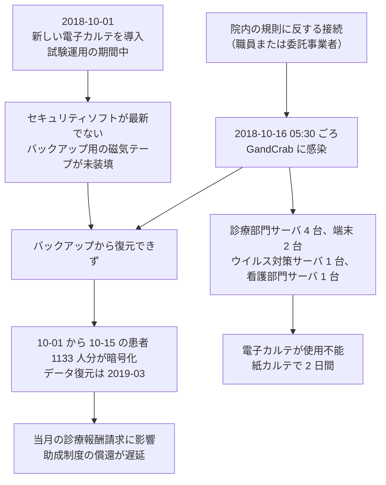

# 🇯🇵 国内の事例 2019 年以前（履歴）

2019 年以前に発生した国内の事例をまとめて記録する。
この期間は公表資料が乏しく、年ごとに分けても情報量が伴わないため、一つのページに集約している。
年次サマリーは作成していない。

> [!NOTE]
> **表記ルール**：本ページでは、**事実**（一次情報で確認できる内容。出典を併記する）、**報道ベース**（報道や第三者の集計のみで確認でき、当事者の公表資料では裏付けが取れていない内容）、**分析**（筆者の解釈）を書き分ける。
> [対象の区分](../README.md#対象の区分)と[一次情報の強度](../README.md#一次情報の強度)の定義は、インシデント事例集のトップにまとめている。

## 収録件数

| 区分 | サイバー攻撃 | その他の事案 |
|---|---|---|
| 病院系 | 6 | 10 |
| 製薬企業系 | 0 | 0 |
| 医療関連事業者 | 0 | 1 |

この期間の国内では、診療を止めたサイバー攻撃の公表は[宇陀市立病院](#JP-2018-01)の 1 件にとどまる。
一方で、記憶媒体と書類の紛失、盗難、内部での不正な閲覧は毎年公表されている。
2020 年以降に続く類型は、この時期にすでに出そろっている。

---

## 病院系

| ID | 発生時期 | 組織 | 種別 | 初期侵入経路 | 診療への影響 | 業務停止期間 | 一次情報の強度 |
|---|---|---|---|---|---|---|---|
| [JP-2018-01](#JP-2018-01) | 2018-10 | 奈良県宇陀市立病院 | ランサムウェア（GandCrab） | 院内の規則に反する接続（報告書の推定。感染機器の初期化により特定できず） | 電子カルテが使用不能。紙カルテで診療を継続 | 情報システムの停止が **2 日**（2018-10-16 から 10-18）。データの復元は 2019-03 | 報告書 |
| [JP-2018-02](#JP-2018-02) | 2018-11 | 徳島県鳴門病院 | 不正アクセス（ウェブサイトの改ざん） | 未公表 | 影響なし（電子カルテと個人情報への影響なし） | ウェブサーバを初期化して再構築 | 当事者公表 |
| [JP-2019-01](#JP-2019-01) | 2019-05 | 東京都保健医療公社 多摩北部医療センター | 不正アクセス（マルウェア感染、Emotet の亜種） | 医師が受信したメールの添付ファイル | 公表なし | 診療の停止は公表されていない | 当事者公表 |
| [JP-2019-02](#JP-2019-02) | 2019-05 | 山口県厚生農業協同組合連合会 周東総合病院 | 不正アクセス（ウェブサイトの改ざん） | サイト管理ツールの脆弱性、または旧サイトに残っていた Flash の脆弱性 | 影響なし（患者データはインターネットから分離） | ウェブサイトの停止（復旧時期は未公表） | 当事者公表 |
| [JP-2019-03](#JP-2019-03) | 2019-09 | 国立成育医療研究センター | 不正アクセス（採用サイト） | 未公表 | 公表なし | 採用サイトを停止 | 当事者公表 |
| [JP-2019-04](#JP-2019-04) | 2019-12 | 地域医療機能推進機構 群馬中央病院 | マルウェア感染（Emotet） | 職員が受信した不審メール | 影響なし（診療情報システムは事務系と分離） | **診療の停止なし** | 当事者公表 |

### JP-2018-01 奈良県宇陀市立病院（2018 年 10 月）

**事実**

以下は、宇陀市が 2020 年 2 月 28 日に公表した「宇陀市立病院コンピューターウイルス感染事案に関する報告書」による。

- 発生時期：2018 年 10 月 16 日 5 時 30 分ごろに感染を認識した。10 月 24 日に公表し、2020 年 2 月 28 日に報告書を公表した。
- 対象組織：奈良県宇陀市の宇陀市立病院。
- 攻撃種別：ランサムウェア（**GandCrab**）。
- 初期侵入経路：本来インターネットへ接続していない診療部門のシステムへ、職員または委託事業者が院内の規則に反して接続したことが特定された。ただし、感染した機器を初期化したため、詳細な経路は特定できていない。
- 侵害範囲：診療部門のサーバ **4 台**、診療部門の端末 **2 台**、ウイルス対策サーバ **1 台**、看護部門のサーバ **1 台**。
- 情報流出：明確には否定できないとされたが、報告書の時点で被害の報告はない。
- 診療への影響：電子カルテが使用できなくなり、紙カルテとサーバの停止で対応した。10 月 1 日から 15 日までに診療を受けた患者 **1133 人**分の記録が暗号化され、一部は復元できなかった。
- 業務停止期間：**2 日**（10 月 16 日から 18 日）。データの復元に成功したのは 2019 年 3 月である。
- 復旧を妨げた要因：新しい電子カルテシステムは 10 月 1 日に導入されたばかりで、試験運用の期間中であった。最新のセキュリティソフトを導入しておらず、バックアップ用の磁気テープが装填されていなかったため、バックアップから復元できなかった。
- 派生した影響：感染した月の診療報酬請求に影響が及び、福祉医療費助成制度などにもとづく償還に遅れが生じた。
- 報告書の指摘：原因を、病院のガバナンスの欠如と医療情報システムの管理体制の不備に求めた。再発防止策として、組織の見直し、緊急対応体制の強化、職員研修、運用管理規程の見直しを挙げた。

**分析**

- 導入直後の試験運用の期間に被害を受けた。移行の期間は、旧系と新系が並走し、監視も運用手順も固まっていない。バックアップの磁気テープが装填されていなかったのは、運用が定着する前だったためと読める。**システムの更新の直後は、防御がいちばん薄い時期にあたる**。
- 停止そのものは 2 日で終わったが、データの復元までは 5 か月かかっている。診療の再開と、記録の回復は別の時間軸で進む。復旧の完了を「診療が回るようになった時点」で測ると、この 5 か月は見えない。
- 被害の帰結が、診療報酬の請求と患者への償還の遅れとして現れた。医事会計の記録は、患者の金銭に直接つながる（[予算とコスト](../../../governance/cost.md)）。
- 報告書の公表は事案の 1 年 4 か月後である。国内の医療機関が調査報告書を公表した最初期の例にあたり、[JP-2021-01 半田病院](2021-timeline.md#JP-2021-01)（2022 年 6 月公表）へ先行する。閉域とされたネットワークへ規則に反する接続が行われたという構図も、半田病院と共通する。

**一次情報**

- [宇陀市立病院コンピューターウイルス感染事案に関する報告書（PDF）](https://udacity-hospital.jp/wp-content/uploads/2024/05/houkokusyo.pdf)（宇陀市、2020 年 2 月 28 日）
- [報告書の概要（PDF）](https://udacity-hospital.jp/wp-content/uploads/2024/05/houkokusyogaiyou.pdf)（宇陀市）
- [宇陀市立病院コンピューターウイルス感染事案に係る安全確認の公表（事案の経緯、PDF）](https://udacity-hospital.jp/wp-content/uploads/2024/05/kouhyou.pdf)（宇陀市立病院）
- [当院の取り組み](https://udacity-hospital.jp/activities/)（宇陀市立病院）

---

### JP-2018-02 徳島県鳴門病院（2018 年 11 月）

**事実**

- 発生時期：2018 年 11 月 29 日 17 時ごろに発見した。12 月に公表した。
- 対象組織：徳島県鳴門病院。
- 攻撃種別：不正アクセス。ウェブサイトの管理画面に、ハングル文字で記載された不正な投稿が行われていた。
- 初期侵入経路：未公表。
- 侵害範囲：ウェブサイトのみ。電子カルテと個人情報への影響はないとした。
- 公表された対策：ウェブサーバを初期化して再構築し、検索エンジンに対して不正な投稿を含む検索結果の削除を求めた。

**分析**

- 発見したのは職員がウェブサイトの管理画面を開いたときである。公開されているページの見た目は変わっていなかったとみられる。改ざんの検知が偶然に依存する構図は、2019 年の[周東総合病院](#JP-2019-02)、2023 年の[三重県立総合医療センター](2023-timeline.md#JP-2023-03)にも共通する。
- 検索エンジンへ削除を求めた点が特徴的である。改ざんされたページが索引に載ると、サイトを直しても検索結果には残る。復旧の作業は、自組織のサーバの外にも及ぶ。
- 同じ徳島県では、3 年後に[つるぎ町立半田病院](2021-timeline.md#JP-2021-01)がランサムウェアの被害を受けている。

**一次情報**

- [地方独立行政法人 徳島県鳴門病院](https://naruto-hsp.jp/)
- [サイトに不正アクセス、電子カルテなどへの影響なし - 徳島県鳴門病院](https://www.security-next.com/101292)（Security NEXT による当事者公表の報道）

---

### JP-2019-01 東京都保健医療公社 多摩北部医療センター（2019 年 5 月）

**事実**

- 発生時期：2019 年 5 月 15 日 17 時 56 分に不正アクセスを受け、5 月 20 日に判明した。10 月にも、流出したメールアドレス宛の攻撃の再発を公表している。
- 対象組織：公益財団法人東京都保健医療公社 多摩北部医療センター。
- 攻撃種別：不正アクセス。医師の端末とメールアカウントが対象で、マルウェアは Emotet の亜種であった。
- 初期侵入経路：医師が受信したメールの添付ファイルの開封。
- 侵害範囲：職務用端末 **328 台**のうち **8 台**が感染し、10 台に感染の疑いがあった。被害は当該医師のメールボックスにとどまり、ハードディスクとファイルサーバへの被害はなかった。
- 情報流出：メール **8335 件**が流出した可能性がある。うち患者の個人情報を含むメールは **24 件**で、患者 **3656 人**が対象となる。メールアドレスが流出した可能性のある対象は **1533 件**である。
- 情報の悪用：当該医師の氏名をかたるマルウェア付きのなりすましメールが送信された。10 月には、流出したアドレス宛への攻撃が再び確認された。
- 公表された対策：対象者へ注意喚起と謝罪を送付し、ウイルススキャンを実施した。職務用パソコンへの外部からのアクセスを制限した。

**分析**

- 感染したのは 1 人の医師の端末だが、そこから流出したのはメール 8335 件である。個人の端末が持つ情報量は、その人が何年その組織にいたかで決まる。台数で被害を測ると、この非対称は見えない。
- 5 か月後に、流出したアドレスを宛先とする攻撃が再び観測された。窃取されたメールとアドレスは、駆除が終わっても攻撃者の手元に残り、次の作戦の素材になる。同じ再利用は、2020 年 9 月に[日本医師会](2020-timeline.md#JP-2020-09)から窃取された情報が 2022 年の再流行で使われた例でも確認されている。
- 被害の中心は情報ではなく、当該医師の氏名をかたるメールが取引先へ届いたことである。医師個人の信用が、攻撃の道具として使われた。

**一次情報**

- [東京都立多摩北部医療センター](https://www.tmhp.jp/tamahoku/)
- [不正アクセスにより医師の氏名を騙るなりすましメールを送信（東京都保健医療公社 多摩北部医療センター）](https://scan.netsecurity.ne.jp/article/2019/05/22/42361.html)（ScanNetSecurity による当事者公表の報道）
- [5 月発生の不正アクセスで流出したメールアドレスへの攻撃を再び確認（多摩北部医療センター）](https://scan.netsecurity.ne.jp/article/2019/10/15/43077.html)（ScanNetSecurity による当事者公表の報道）
- [日本の医療機関におけるサイバー攻撃の事例（PDF）](https://www.jmari.med.or.jp/wp-content/uploads/2022/03/WP465_appendix.pdf)（日本医師会総合政策研究機構）

---

### JP-2019-02 山口県厚生農業協同組合連合会 周東総合病院（2019 年 5 月）

**事実**

- 発生時期：2019 年 5 月 15 日 23 時 15 分前後。
- 対象組織：山口県厚生農業協同組合連合会 周東総合病院。
- 攻撃種別：不正アクセス。ウェブサイトのページが改ざんされ、悪意あるファイルがアップロードされた。
- 初期侵入経路：ウェブサイトの管理ツールの脆弱性、または 2019 年 3 月まで公開していた旧サイトのデータに残っていた Flash の脆弱性のいずれかと説明している。
- 侵害範囲：ウェブサイト。アップロードされたファイルが、フィッシングメールを経由してダウンロードされる危険があった。
- 情報流出：患者情報は確認されていない。患者データはインターネット環境と分離していた。
- 公表された対策：5 月 16 日 18 時前後にサイトの公開を停止し、パスワードを変更した。ウェブの全データを削除したうえで、安全なバックアップから脆弱性を修正して復旧した。

**分析**

- 侵入口の候補として、公開を終えた旧サイトのデータが挙げられている。公開を止めたページも、サーバ上に残っていれば到達できる。役目を終えた資産の削除は、公開の停止とは別の作業である（[外部から見た自組織の攻撃面](../../../practice/attack-surface.md)）。
- 改ざんの目的は、病院のサイトを悪意あるファイルの配布元として使うことであった。医療機関のドメインが持つ信用が、そのまま攻撃の材料になる。同じ構図は、2021 年の[国立成育医療研究センター](2021-timeline.md#JP-2021-06)、2024 年の[印西総合病院](2024-timeline.md#JP-2024-06)にも続く。

**一次情報**

- [Web サイトが改ざん被害、悪意あるファイルがアップロードされる（周東総合病院）](https://scan.netsecurity.ne.jp/article/2019/05/21/42352.html)（ScanNetSecurity による当事者公表の報道）

---

### JP-2019-03 国立成育医療研究センター（2019 年 9 月）

**事実**

- 発生時期：2019 年 9 月 25 日に判明した。
- 対象組織：国立研究開発法人国立成育医療研究センター。看護師の採用サイトが対象。
- 攻撃種別：不正アクセス。
- 初期侵入経路：未公表。
- 侵害範囲：採用サイト。個人情報の流出の有無は公表資料では示されていない。
- 公表された対策：サイトを停止して調査した。

**分析**

- 対象は診療系ではなく採用のサイトである。応募者の氏名、連絡先、経歴が集まる場所であり、病院の情報システムの管理台帳には載りにくい。
- 同センターでは、2 年後の 2021 年 1 月にも別のサイト（小児医療情報収集システム）が改ざんされている（[JP-2021-06](2021-timeline.md#JP-2021-06)）。本体のシステムとは別に立てた小規模なサイトが、繰り返し対象になった。

**一次情報**

- [国立成育医療研究センター](https://www.ncchd.go.jp/)
- [看護師の採用サイトへの不正アクセス、サイトを停止し調査を実施（国立成育医療研究センター）](https://scan.netsecurity.ne.jp/article/2019/09/27/42995.html)（ScanNetSecurity による当事者公表の報道）

---

### JP-2019-04 地域医療機能推進機構 群馬中央病院（2019 年 12 月）

**事実**

- 発生時期：2019 年 12 月 2 日 18 時以降に不審メールを受信し、12 月 3 日に感染を確認した。12 月 9 日に公表した。
- 対象組織：独立行政法人地域医療機能推進機構 群馬中央病院。
- 攻撃種別：マルウェア感染（Emotet）。
- 初期侵入経路：職員が受信した不審メール。
- 侵害範囲：事務処理用のパソコン **1 台**。同院または職員をかたる不審メールが関係機関で確認された。漏えいした可能性のある情報の把握は困難であるとした。
- 診療への影響：診療情報システムは事務処理用のパソコンと分離しているため、影響はなかった。
- 公表された対策：感染した端末を隔離し、受信者に対してメールアドレスの確認と、疑わしい URL のクリックや添付ファイルの開封を避けるよう呼びかけた。

**分析**

- 「漏えいした可能性のある情報の把握は困難」と当事者が明記している。Emotet は感染した端末のメール履歴を持ち出すため、対象を確定するには過去のメールをすべて洗う必要がある。実務上、これは終わらない。範囲を確定できない事案では、通知の対象を決められない。
- 診療系との分離が働き、診療は止まらなかった。この年から 2022 年にかけて、国内の医療機関の Emotet 感染の公表は同じ形をとる。分離は診療の継続を守るが、外部への信用の毀損は防がない（[メールとドメインの管理](../../../technology/email-domain.md)）。

**一次情報**

- [独立行政法人地域医療機能推進機構](https://www.jcho.go.jp/)
- [事務処理用パソコン 1 台が Emotet に感染、関係機関で不審メール受信確認（群馬中央病院）](https://scan.netsecurity.ne.jp/article/2019/12/19/43422.html)（ScanNetSecurity による当事者公表の報道）

---

## 製薬企業系

この期間の収録はない。
国内の製薬企業の被害で、当事者が経緯を公表した事例を確認できていない。

---

## 医療関連事業者

サイバー攻撃の収録はない。
サイバー攻撃以外の事案として、受託先の病院から患者情報を持ち出した株式会社インテック（JP-2019-S07）を「その他の事案」の節に収録している。

---

## その他の事案（サイバー攻撃以外）

サポート詐欺、システム障害、内部不正、機器や記憶媒体の紛失と盗難、委託先の管理不備による漏えい、誤送付や誤公開、ドメインの失効を記録する。
類型の定義と、主分類との判定基準は[事案の類型](../README.md#事案の類型)にまとめている。

| ID | 発生時期 | 組織 | 区分 | 類型 | 概要 | 一次情報の強度 |
|---|---|---|---|---|---|---|
| JP-2018-S01 | 2018-08 | 富山市立富山市民病院 | 病院系 | 機器、記憶媒体の紛失、盗難 | 退院調整の業務で使っていた公用の USB メモリが所在不明。患者 **約 9000 人分**の ID、氏名、疾患名、年齢、診療科名。2014 年 10 月から 2018 年 7 月のデータ | 当事者公表 |
| JP-2018-S02 | 2018-09（2018-11 公表） | 秋田大学医学部附属病院 | 病院系 | 機器、記憶媒体の紛失、盗難 | 医師が研究のために保有していた USB メモリを学外で紛失。造血幹細胞移植の患者 500 人と呼吸器内科の患者 1 人の計 501 人分。パスワードは設定されていなかった | 当事者公表 |
| [JP-2018-S03](#JP-2018-S03) | 2018-11 | 島根大学医学部附属病院 | 病院系 | 内部不正 | 事件の被害者として搬送された患者のカルテを、診療と業務に関係のない目的で閲覧していた。**延べ 312 人**の職員の閲覧記録を確認 | 当事者公表 |
| JP-2019-S01 | 2019-01 | 香川大学医学部附属病院 | 病院系 | 機器、記憶媒体の紛失、盗難 | 看護師が患者情報を記入した用紙を鞄に入れて車で持ち帰り、車内に放置したところ車上荒らしに遭った。最大 39 人分の氏名、年齢、病名 | 当事者公表 |
| JP-2019-S02 | 2019-04 | 公立大学法人福島県立医科大学 | 病院系 | 機器、記憶媒体の紛失、盗難 | オランダへ出張中の教員が、電車内の頭上の棚に置いた鞄を盗まれた。いわき市医療センターの患者 86 人分と緑の里クリニックの患者 33 人分の情報を含む USB メモリが入っていた | 当事者公表 |
| [JP-2019-S03](#JP-2019-S03) | 2019-07 | 公立大学法人横浜市立大学附属病院 | 病院系 | 誤送付、誤公開、操作ミス | 泌尿器科の医師が臨床研究の連絡で、患者情報を含む表計算ファイルを個人のメールから再送信した際、宛先の数字がずれて 2 件が第三者へ届いた。**3411 件**の症例データ | 当事者公表 |
| JP-2019-S04 | 2019-11 | 半田市立半田病院（愛知県） | 病院系 | 機器、記憶媒体の紛失、盗難 | 看護師が勤務後、患者情報を含む書類を鞄に入れたまま車内に放置し、飲食店の駐車場で車上荒らしに遭った。患者 39 人分の氏名、年齢、病室、病名 | 当事者公表 |
| JP-2019-S05 | 2019-11 | 滋賀医科大学医学部附属病院 | 病院系 | 機器、記憶媒体の紛失、盗難 | 患者情報を含む USB メモリが所在不明。患者 9 人分の氏名、ID、医療機器の関連情報と、患者 5 人分の疾患名 | 当事者公表 |
| JP-2019-S08 | 2019-11 | 富山大学附属病院 | 病院系 | 誤送付、誤公開、操作ミス | 医師が患者の個人情報を含むファイルを添付したメールを、富山県の担当者へ誤って送信した。**183 人分**の氏名、年齢、性別、カルテ番号、血液検査の項目、検査時と検査後の状況 | 当事者公表 |
| JP-2019-S06 | 2019-12 | 鹿児島大学病院 | 病院系 | 委託先の管理不備による漏えい | 機密文書の廃棄を委託した事業者の処理の誤りにより、患者の紙カルテとエコー写真が路上に飛散した。個人を特定できるもの 16 人分 28 枚を含む計 49 枚 | 当事者公表 |
| [JP-2019-S07](#JP-2019-S07) | 2017-04 〜 2019-08（2019-12 公表） | 株式会社インテック（受託先の 4 病院） | 医療関連事業者 | 内部不正 | 業務を受託していた 4 病院から、社員が患者と職員の情報を紙の資料で自宅へ持ち出した。金沢市立病院の患者 1528 人と職員 144 人ほか | 当事者公表 |

**分析**：11 件のうち 6 件が記憶媒体または書類の紛失と盗難である。
そのうち 2 件（JP-2019-S01、JP-2019-S04）は、看護師が書類を鞄に入れて車内へ置いたままにした車上荒らしで、同じ年に別の県で起きている。
持ち出しの是非を問う前に、**持ち帰らないと終わらない業務が残っている**ことがこの類型の前提にある。

USB メモリの紛失は 4 件あり、対象は 14 人から約 9000 人まで幅がある。
規模を決めるのは持ち出した人の役割であり、媒体の種類ではない。
[JP-2018-S02](#その他の事案サイバー攻撃以外) の秋田大学医学部附属病院では、パスワードが設定されていなかったことを当事者が公表している。

この期間に特徴的なのは、[JP-2018-S03](#JP-2018-S03)（島根大学医学部附属病院）で延べ 312 人の職員が事件被害者のカルテを閲覧していた事案である。
1 人の逸脱ではなく、組織の規模で起きている。
アクセスログが取得されていたからこそ 312 人という数字が出た点は、記録の価値を示す（[ログと監視の設計](../../../technology/logging.md)）。

### JP-2018-S03 島根大学医学部附属病院（2018 年 11 月）

**事実**

- 発生時期：2018 年 11 月 15 日に公表した。
- 類型：内部不正。
- 発生原因：出雲市で発生した事件の被害者として搬送された患者のカルテが、診療と業務に関係のない目的で閲覧された。同院は「診療、業務に関係のない目的のために患者の情報をみだりに閲覧してはならない」と規定していた。
- 影響範囲：**延べ 312 人**の職員による不適切な閲覧の記録を確認した。
- 対応：職員へ職業倫理の遵守を指導し、個人情報の保護体制を強化する方針を示した。
- 診療への影響：なし。

**分析**

- 312 人という規模は、個人の逸脱では説明できない。報道で注目された患者が搬送されたとき、院内の多くの職員が同じ行動をとった。閲覧の権限は職務上必要なもので、技術的には正常な操作である。
- 検知できたのはアクセスログが残っていたためである。ただし、閲覧の時点では止まっていない。事後に数えられるだけでは、患者のプライバシーは守られない。閲覧の目的を入力させる、担当外の患者を開くときに警告を出すといった、操作の時点で摩擦を作る設計が要る。
- 同種の事案は 2024 年の[秋田大学医学部附属病院](2024-timeline.md#JP-2024-S06)（1000 件以上の閲覧）へ続く。医療機関の内部不正は、外部からの攻撃と違って侵入の痕跡を残さない。

**一次情報**

- [島根大学医学部附属病院](https://www.med.shimane-u.ac.jp/hospital/)
- [多数の職員が事件被害者のカルテを不適切に閲覧（島根大学医学部附属病院）](https://scan.netsecurity.ne.jp/article/2018/11/19/41628.html)（ScanNetSecurity による当事者公表の報道）

---

### JP-2019-S03 公立大学法人横浜市立大学附属病院（2019 年 7 月）

**事実**

- 発生時期：2019 年 7 月 24 日 21 時ごろに送信し、7 月 25 日に誤送信が判明した。2020 年 2 月 26 日に懲戒処分を公表した。
- 類型：誤送付、誤公開、操作ミス。
- 発生原因：泌尿器科の医師が、臨床研究に関連して患者情報を含む表計算ファイルを 22 人の医師へメールで送信した。学内のメールでエラーが多かったため、個人の Hotmail から再送信したところ、メールアドレスに含まれる数字の表記がずれており、誤った 2 件へ届いた。
- 背景：研究計画書は匿名化したデータを求めていたが、照合の作業が煩雑になるとして、責任医師が氏名と生年月日を含めたやり取りを慣行としていた。メールアドレスの確認とパスワードによる保護も不十分であった。
- 影響範囲：**3411 件**の症例データ。2010 年から 2014 年に膀胱がんの手術を受けた患者の氏名、生年月日、性別、手術日、腫瘍の情報を含む。
- 対応：8 月 5 日に全患者へ手紙を発送し、相談窓口を設けた。第三者を含む調査委員会を設置した。2020 年 2 月に、担当医師を停職 14 日、研究責任者を減給、管理監督者を文書訓戒とした。
- 診療への影響：なし。

**分析**

- 匿名化を定めた研究計画書があり、それが守られなかった理由も公表されている。「照合の作業が煩雑になる」という理由は、匿名化が研究の工程と噛み合っていないことを示す。規定を守ると仕事が終わらない構造がある限り、規定は迂回される。
- 学内のメールがエラーを返したため、個人のメールへ切り替えている。組織の統制が効く経路が使えなかったとき、業務は統制の外へ出る。送信の失敗そのものが、統制を外す引き金になった。
- 同じ大学病院で、2021 年 5 月に再発防止策の報告が公表されている（[2021 年 国内の事例](2021-timeline.md)）。処分から 1 年以上あとの報告であり、対策の定着には時間がかかる。

**一次情報**

- [横浜市立大学附属病院](https://www.yokohama-cu.ac.jp/fukuhp/)
- [3,411 件患者個人情報流出、データ匿名化するも運用の繁雑さから形骸化（横浜市立大学）](https://scan.netsecurity.ne.jp/article/2019/08/20/42803.html)（ScanNetSecurity による当事者公表の報道）

---

### JP-2019-S07 株式会社インテック（2017 年 4 月から 2019 年 8 月、2019 年 12 月に公表）

**事実**

- 発生時期：2019 年 9 月 11 日に社内のセキュリティシステムが検知した。12 月 2 日に第一報、12 月 9 日に追加で判明した分を公表した。
- 類型：内部不正。
- 発生原因：同社の社員が、業務を受託していた病院から患者と職員の情報を紙の資料で自宅へ持ち出した。禁止されている添付ファイル付きのメールを個人のアドレス宛に送ろうとしたことを、社内のシステムが検知して発覚した。
- 影響範囲：受託先の **4 病院**が対象である。

| 病院 | 対象 |
|---|---|
| 金沢市立病院 | 患者 1528 人、職員 144 人、業務マニュアル |
| 高岡市民病院 | 患者 32 人（2019 年 8 月中の 2 日間） |
| 市立砺波総合病院 | 患者 11 人（2017 年 4 月から 2019 年 3 月、および 2019 年 6 月から 8 月の 8 日間） |
| 厚生連高岡病院 | 患者 4 人 |

- 対応：持ち出された紙の資料は自宅から回収し、第三者への流出はないことを確認した。情報セキュリティ教育の再実施、私物の持ち込みと持ち出しの規則の厳格化、アクセスログの監視を再発防止策として挙げた。
- 根本原因として、現場の管理体制の不備、1 人での運用業務、従業員のセキュリティ意識の欠如が示された。
- 診療への影響：なし。

**分析**

- 検知したのは病院ではなく、委託先の社内システムである。病院側からは、委託先の社員が院内で何を印刷し、何を持ち出したかは見えない。委託先の統制が働かなければ、この類型は発覚しない（[委託先への依存](../../../response/dependencies.md)）。
- 発覚の端緒は、紙の持ち出しではなく、個人のメールアドレスへの送信の試みである。紙は監視の対象になっていなかった。
- 「1 人での運用業務」が根本原因に挙げられている。委託先の要員が単独で常駐する構成では、相互の牽制が働かない。人数は、統制の設計に関わる変数である。
- 期間は 2 年 5 か月に及ぶ。同一の社員が、複数の受託先で同じ行為を続けていた。委託元の病院は 4 者に分かれており、どの病院も単独では気づけない位置にあった。

**一次情報**

- [株式会社インテック](https://www.intec.co.jp/)
- [業務を受託している 2 病院から患者情報を紙資料で持ち出し（インテック）](https://scan.netsecurity.ne.jp/article/2019/12/05/43330.html)（ScanNetSecurity による当事者公表の報道）
- [業務を受託した病院からの個人情報持ち出し、新たに 2 病院が判明（インテック）](https://scan.netsecurity.ne.jp/article/2019/12/11/43370.html)（ScanNetSecurity による当事者公表の報道）

---

### その他の事案の一次情報

- [富山市立富山市民病院](https://www.tch.toyama.toyama.jp/)（JP-2018-S01）
- [秋田大学](https://www.akita-u.ac.jp/)（JP-2018-S02）
- [香川大学医学部附属病院](https://www.med.kagawa-u.ac.jp/hospital/)（JP-2019-S01）
- [公立大学法人福島県立医科大学](https://www.fmu.ac.jp/)（JP-2019-S02）
- [半田市立半田病院](https://www.handa-hosp.jp/)（JP-2019-S04）
- [滋賀医科大学医学部附属病院](https://www.shiga-med.ac.jp/hospital/)（JP-2019-S05）
- [鹿児島大学](https://www.kufm.kagoshima-u.ac.jp/)（JP-2019-S06）
- [患者の個人情報含むファイルを誤送信 - 富山大病院](https://www.security-next.com/110103)（Security NEXT による当事者公表の報道、JP-2019-S08）

---

## この期間に公表された医療分野の脆弱性

事例ではないが、この期間には医療機関が広く使うソフトウェアの脆弱性も公表されている。

- **日医標準レセプトソフト**：2018 年 7 月、OS コマンドインジェクション（CVE-2018-0643）とバッファオーバーフロー（CVE-2018-0644）が公表された。前者は、ネットワークから到達できる第三者が任意のコマンドを実行できる可能性がある（[JVN#37376131](https://jvn.jp/jp/JVN37376131/)）。

医療情報システムの脆弱性は [OSS 医療情報システムの脆弱性](../../../technology/oss-vulnerabilities/) に整理している。

---

サイバー攻撃の事例を追加するときは、[事例テンプレート](../../../reference/_templates/incident.md) をコピーし、該当する区分の節に追記してほしい。
識別子は発生年に合わせて `JP-<年>-<連番>` の続きを付ける。

サイバー攻撃以外の事案は、[その他の事案テンプレート](../../../reference/_templates/incident-other.md) をコピーし、「その他の事案」の節に追記する。

---

[← 国内の事例](README.md) | [2020 年 →](2020-timeline.md) | [トップへ](../../../../README.md)
