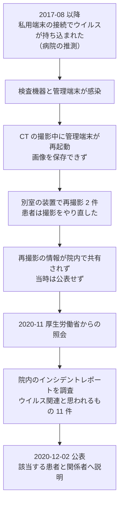

# 🇯🇵 国内の事例 2020 年（履歴）

> [!NOTE]
> **表記ルール**：本ページでは、**事実**（一次情報で確認できる内容。出典を併記する）、**報道ベース**（報道や第三者の集計のみで確認でき、当事者の公表資料では裏付けが取れていない内容）、**分析**（筆者の解釈）を書き分ける。
> [対象の区分](../README.md#対象の区分)と[一次情報の強度](../README.md#一次情報の強度)の定義は、インシデント事例集のトップにまとめている。
> その年の情勢と集計は [2020 年の情勢](../years/2020-summary.md) にまとめている。

## 収録件数

| 区分 | サイバー攻撃 | その他の事案 |
|---|---|---|
| 病院系 | 5 | 16 |
| 製薬企業系 | 0 | 0 |
| 医療関連事業者 | 4 | 2 |

COVID-19 対応でオンライン診療と遠隔での業務が急拡大した年である。
この年に国内の医療機関で公表されたサイバー攻撃は、いずれも診療系の基幹システムではなく、事務系のメールとウェブサイトで起きている。
収録は本リポジトリが一次情報を確認できた事案に限る。
国内で公表された医療関連の事案がこれで尽きることを示すものではない。

前年に発生し、本年に公表または処分が公表された事案も本ページに収める。
その場合は、発生時期の欄に発生と公表の両方を記す。

---

## 病院系

| ID | 発生時期 | 組織 | 種別 | 初期侵入経路 | 診療への影響 | 業務停止期間 | 一次情報の強度 |
|---|---|---|---|---|---|---|---|
| [JP-2020-02](#JP-2020-02) | 2020-01 | 市立福知山市民病院（京都府福知山市） | 不正アクセス（メールアカウントの乗っ取り） | 未公表 | 公表なし | 診療の停止は公表されていない | 当事者公表 |
| [JP-2020-03](#JP-2020-03) | 2020-10 | 学校法人関西医科大学 | マルウェア感染（Emotet） | 職員が受信したメールの添付ファイル | 影響なし（診療系は独立ネットワーク） | **診療の停止なし** | 当事者公表 |
| [JP-2020-04](#JP-2020-04) | 2020-11 | 国家公務員共済組合連合会 虎の門病院ほか | 不正アクセス（ウェブサイト） | 未公表 | 影響なし（電子カルテとは分離） | ウェブサイトの停止（復旧時期は未公表） | 当事者公表 |
| [JP-2020-05](#JP-2020-05) | 2020-12 | 医療法人社団三思会 くすの木病院（神奈川県） | なりすましメールの送信（Emotet 系の手口） | 未公表（院内の感染は確認されず） | 影響なし（院内システムはネットワーク分離） | **診療の停止なし** | 当事者公表 |
| [JP-2020-01](#JP-2020-01) | 2017-08 〜 2020（2020-12 公表） | 福島県立医科大学附属病院 | マルウェア感染（ランサムウェアを含む） | 私物端末の接続（病院の推測） | 放射線撮影装置が撮影中に再起動し、2 件で再撮影 | 診療の全面停止はなし | 当事者公表 |

### JP-2020-02 市立福知山市民病院（2020 年 1 月）

**事実**

- 発生時期：2020 年 1 月 11 日 19 時 30 分ごろから 1 月 14 日 9 時 30 分ごろまで。
- 対象組織：京都府福知山市の市立福知山市民病院。
- 攻撃種別：不正アクセス。同院が運用するメールアカウント 1 件が乗っ取られた。
- 初期侵入経路：未公表。
- 侵害範囲：当該アカウントから大量の迷惑メールが外部へ送信された。
- 情報流出：公表資料の範囲では確認されていない。
- 診療への影響：公表されていない。
- 公表された対策：当該アカウントを停止し、送信を止めた。受信者に対して、開封せず削除するよう自院のサイトで注意を呼びかけた。

**分析**

- 侵害されたのは 1 件のメールアカウントであり、電子カルテは対象外である。それでも、病院のドメインから送られた迷惑メールは、受信側では病院からの連絡として扱われる。攻撃の実害は自組織の停止ではなく、取引先と患者への波及に現れた（[メールとドメインの管理](../../../technology/email-domain.md)）。
- 発覚から公表までの間、同院は受信者向けの注意喚起を自院のサイトに掲載した。乗っ取られたアカウントの被害は外部にしか見えないため、外向けの告知が唯一の緩和策になる。

**一次情報**

- [【注意喚起】当院からのメールを受け取った方へ](https://www.city.fukuchiyama.lg.jp/site/hosp/19530.html)（市立福知山市民病院）

---

### JP-2020-03 学校法人関西医科大学（2020 年 10 月）

**事実**

- 発生時期：2020 年 10 月 23 日以降に不審メールの送信が確認され、10 月 30 日に公表した。
- 対象組織：学校法人関西医科大学。附属病院を含む。
- 攻撃種別：マルウェア感染（Emotet）。
- 初期侵入経路：職員が受信したメールに添付されたファイル。
- 侵害範囲：職員のパソコン **4 台**。
- 情報流出：感染した端末のメール履歴をもとに、同大学の職員を装った不審メールが、過去に職員とやり取りのあった相手へ、同大学とは異なるサーバから送信された。
- 診療への影響：附属病院の電子カルテを含む診療系のシステムは、インターネットに接続しない独立したネットワークで運用しているため、直接の影響はないと説明した。
- 公表された対策：業務用の全パソコンを調査してウイルスを駆除し、全職員と学生へ注意喚起した。メールサーバでのフィルタリングを開始した。

**分析**

- 診療系を分離していたことで、感染は事務系にとどまった。分離は被害の範囲を限る設計として働いている。一方で、分離されていた側（事務系）は無傷ではなく、対外的な信用の毀損はそこから起きた。分離は診療の継続を守る手段であって、情報の漏えいを防ぐ手段ではない（[ネットワークの分離](../../../technology/segmentation.md)）。
- Emotet の被害は、感染した端末の台数ではなく、盗まれたメール本文と宛先の量で決まる。復旧の完了は端末の駆除では終わらず、なりすましメールが止まるまで続く。
- 同じ年の 9 月には、日本医師会の事務局でも同種の感染が起きている（[JP-2020-09](#JP-2020-09)）。医療分野の団体が持つ名簿とメール履歴は、次の攻撃の材料として価値が高い。

**一次情報**

- [本学職員を騙る不審メールについて](https://www.kmu.ac.jp/news/20201030_Emotet.html)（学校法人関西医科大学、2020 年 10 月 30 日）

---

### JP-2020-04 国家公務員共済組合連合会 虎の門病院ほか（2020 年 11 月）

**事実**

- 発生時期：2020 年 11 月 11 日。11 月 13 日に公表した。
- 対象組織：国家公務員共済組合連合会が運営する虎の門病院、虎の門病院分院、虎の門病院さいたま診療所、虎の門病院横浜第 2 合同庁舎診療所。
- 攻撃種別：不正アクセス。ウェブサイトが閲覧できない状態になった。
- 初期侵入経路：未公表。
- 侵害範囲：ウェブサイト。
- 情報流出：患者の個人情報の流出は確認されていない。攻撃を受けたウェブサイトと電子カルテシステムは完全に分離していると説明した。
- 診療への影響：診療への影響は公表されていない。
- 公表された対策：ウェブサイトを停止し、調査を進めた。

**分析**

- 停止したのはウェブサイトであり、診療は続いた。それでも、外来の受付時間、休診の案内、面会の可否といった情報が届かなくなる。COVID-19 の流行下で来院前の確認を求めていた時期であり、告知の経路が失われる影響は平時より大きい。
- 「電子カルテとは分離している」という説明は、この年の公表資料に繰り返し現れる。分離の主張は、分離の実在を確かめる手立て（到達性の確認）とセットにしないと、[大阪急性期・総合医療センター](2022-timeline.md#JP-2022-01)の報告書が指摘した「誤った閉域網神話」に転じる。

**一次情報**

- [虎の門病院ホームページの停止について（PDF）](https://www.kkr.or.jp/prompt/soumu/pdf/toranomon_hp.pdf)（国家公務員共済組合連合会）
- [虎の門病院](https://toranomon.kkr.or.jp/)

---

### JP-2020-05 医療法人社団三思会 くすの木病院（2020 年 12 月）

**事実**

- 発生時期：2020 年 12 月 9 日以降。
- 対象組織：神奈川県の医療法人社団三思会 くすの木病院。
- 攻撃種別：同院の職員になりすましたメールの送信。Emotet で用いられる手口と一致する。
- 侵害範囲：差出人の表示は同院の職員名と同院のドメインだが、実際の送信元は別のアドレスであった。件名は過去のやり取りへの返信を装い、本文にはパスワード付きの添付ファイルまたは URL が置かれていた。
- 情報流出：院内の全パソコンをウイルス検査し、感染は確認されなかった。
- 診療への影響：電子カルテなどの院内業務システムはネットワークを分離しており、影響はないと説明した。
- 公表された対策：リンクと添付ファイルを開かずに削除するよう、自院のサイトで注意を呼びかけた。

**分析**

- 院内で感染が確認されないまま、自院の名をかたるメールだけが出回った。過去にやり取りした相手側の端末が感染し、そこに残っていた同院とのメールが素材に使われた場合、この形になる。被害の起点は自組織の外にある。
- 自組織の調査で「感染なし」と結論が出ても、なりすましは止まらない。この型の事案で打てる手は、受信側への告知と、送信ドメイン認証（SPF、DKIM、DMARC）の設定によって、正規の送信元との区別を受信側で機械的に判定できるようにすることに限られる（[メールとドメインの管理](../../../technology/email-domain.md)）。

**一次情報**

- [当院職員を装った不審なメールについて](https://www.kusunoki-hp.com/news/detail/?no=1170)（医療法人社団三思会 くすの木病院）

---

### JP-2020-01 福島県立医科大学附属病院（2020 年 12 月に公表）

**事実**

- 公表時期：2020 年 12 月 2 日に、2017 年 8 月以降に発生していたコンピュータウイルス感染とみられる検査機器の不具合を公表した。
- 対象組織：福島県立医科大学附属病院。
- 攻撃種別：マルウェア感染。ランサムウェアの系統（WannaCry の亜種）が含まれていた。
- 初期侵入経路：院内の医療情報システムはインターネットに接続していないため、病院関係者がウイルスに感染した私用のパソコンをネットワークへ接続したことで持ち込まれた可能性があると説明した。
- 侵害範囲：複数の部署の検査機器と管理端末。
- 診療への影響：放射線科では、CT で胸部を撮影している最中に管理端末が再起動し、撮影画像を保存できなかった。フィルム画像とレントゲン写真を読み取る際にも装置が自動で再起動する状態となり、別室の装置で再撮影を行った。**再撮影に至った事案が 2 件**確認された。
- 情報流出：確認されていない。
- 身代金：要求には応じていない。
- 発覚の経緯：2020 年 11 月に厚生労働省から、過去に発生したコンピュータウイルスによる医療情報の消失について照会を受け、院内を調査した。当時のセキュリティ担当部署が作成したインシデントレポートのうち、**コンピュータウイルスが関連すると思われるものが 11 件**見つかった。
- 公表しなかった理由：病院は、再撮影が発生した情報が院内で共有されておらず報告できなかった、患者への影響がなかったとの認識もあった、と説明した。
- 公表された対策：該当する患者と関係者へ改めて事情を説明し、謝罪した。

**分析**

- 発覚の端緒が、行政からの照会である。院内でインシデントレポートは作成されていたが、部署をまたいで集約されていなかった。記録を残す仕組みと、記録を読む仕組みは別に要る（[ログと監視](../../../technology/logging.md)）。
- 起きたのは情報の漏えいではなく、**撮影中の装置の再起動**である。患者は被ばくを伴う撮影をやり直した。医療機器がマルウェアの影響を受けたとき、被害は情報ではなく検査と治療の行為そのものに現れる（[医療機器のセキュリティ](../../../technology/medical-devices/)）。
- 「インターネットに接続していないから安全」という前提が、私物端末の接続で崩れた。閉域を前提とした設計は、閉域の境界を誰が守るかを決めていないと成り立たない。同じ前提の崩れ方は、翌年の[半田病院](2021-timeline.md#JP-2021-01)では VPN 装置の脆弱性として現れた。
- 患者への影響がなかったという認識で公表を見送っていた。3 年後にさかのぼって公表した判断は、他の医療機関が同種の事象を点検する材料を残した。

**一次情報**

- [福島県立医科大学附属病院](https://www.fmu.ac.jp/hospitals/)
- [大学病院 WannaCry 亜種感染、CT 撮影中機器が再起動](https://scan.netsecurity.ne.jp/article/2020/12/07/44903.html)（ScanNetSecurity による当事者公表の報道）
- [日本の医療機関におけるサイバー攻撃の事例（PDF）](https://www.jmari.med.or.jp/wp-content/uploads/2022/03/WP465_appendix.pdf)（日本医師会総合政策研究機構）

---

## 製薬企業系

本年の収録はない。
一次情報を確認できた事案が見つかっていないだけで、被害がなかったことを示すものではない。

**分析**：この年、製薬分野では国内の当事者公表は確認できていないが、海外では COVID-19 のワクチンと治験を狙う攻撃が相次いだ。
欧州医薬品庁（EMA）への侵入と、治験支援の eResearch Technology へのランサムウェア攻撃は、いずれも国内の製薬企業が委託または申請の相手として関わる基盤である（[2020 年 海外の事例](../global/2020-timeline.md)）。

---

## 医療関連事業者

| ID | 発生時期 | 組織 | 種別 | 初期侵入経路 | 影響 | 一次情報の強度 |
|---|---|---|---|---|---|---|
| [JP-2020-06](#JP-2020-06) | 2020-04 〜 2020-08 | 株式会社デンタルダイヤモンド社（歯科の総合出版社） | 不正アクセス（EC サイト） | 自社サイトの脆弱性 | クレジットカード情報 690 件が流出。一部で不正利用の可能性 | 当事者公表 |
| [JP-2020-09](#JP-2020-09) | 2020-09 | 公益社団法人日本医師会 | マルウェア感染（Emotet） | 事務局の端末が受信したメールの添付 Word ファイル | 過去の送受信相手のメールアドレスと氏名、メール本文が流出。会員情報は当該端末では扱っていない | 当事者公表 |
| [JP-2020-07](#JP-2020-07) | 2020-11 | WellBe Holdings Limited（医療系サービス、香港。中国法人が感染） | マルウェア感染（Emotet） | 中国法人の社員の端末 | 取引関係者のメールアドレス 1345 件、メール本文 6906 件分が流出 | 当事者公表 |
| [JP-2020-08](#JP-2020-08) | 2020-12 | 国立研究開発法人日本医療研究開発機構（AMED） | 不正アクセス（保守用端末） | 保守業者による人事関係システムの保守作業中 | 役職員と派遣職員、退職者の個人情報 約 1400 人分が流出の可能性 | 当事者公表 |

### JP-2020-09 公益社団法人日本医師会（2020 年 9 月）

**事実**

- 発生時期：2020 年 9 月 4 日の始業後に感染し、9 月 8 日に公表した。
- 対象組織：公益社団法人日本医師会。
- 攻撃種別：マルウェア感染（Emotet）。
- 初期侵入経路：日本医師会館内の事務局 LAN に接続していたパソコン 1 台が、受信したメールに添付されていた Word ファイルを開いたことで感染した。
- 侵害範囲：感染した端末のメールソフトの履歴から、過去の送受信相手のメールアドレスと氏名、メール本文が流出した。対象には同会の職員、都道府県医師会の職員、関係省庁の職員が含まれる。会員情報などの個人情報は、当該のパソコンでは扱っていなかった。
- 対応：同日 18 時過ぎに感染した端末を特定して LAN から切り離し、マルウェアを駆除した。9 月 7 日に館内 LAN の稼働中の全端末を JPCERT/CC の EmoCheck で検査し、ほかに感染がないことを確認した。出口対策の導入を検討するとした。

**分析**

- 流出したのは会員の名簿ではなく、事務局のメール履歴である。それでも宛先には都道府県医師会と関係省庁が並ぶ。医師会をかたるメールは、受け取る側の医療機関にとって疑いにくい。名簿の価値は件数ではなく、差出人としての信頼度で決まる。
- 感染から特定までが同日中で、3 日後には全端末の検査まで終えている。Emotet の被害を止める鍵は、感染の防止よりも、感染した端末を切り離すまでの時間にある。
- 実際に、この事案で盗まれたデータは 1 年半後に再利用された。2022 年 3 月の Emotet の再流行では、2020 年 9 月の感染時に取得された情報が使い回された不審メールが確認されている（[2022 年 国内の事例](2022-timeline.md)）。窃取されたメールは、駆除が終わっても攻撃者の手元に残り続ける。

**一次情報**

- [日本医師会事務局のパソコンのウイルス感染について（PDF）](https://www.med.or.jp/people/info/doctor_info/pdf/pc20200908.pdf)（公益社団法人日本医師会、2020 年 9 月 8 日）

---

### JP-2020-06 株式会社デンタルダイヤモンド社（2020 年 4 月から 8 月）

**事実**

- 発生時期：2020 年 4 月 30 日から 8 月 25 日までの決済が対象。10 月 2 日に検知し、12 月 16 日に公表した。
- 対象組織：歯科の総合出版社である株式会社デンタルダイヤモンド社。同社が運営する通信販売サイトが対象。
- 攻撃種別：不正アクセス。サイトのシステムの一部の脆弱性を突かれた。
- 侵害範囲：クレジットカード情報 **690 件**。名義、番号、有効期限、セキュリティコードを含む。
- 情報流出：一部の顧客のカード情報が不正に利用された可能性がある。
- 公表された対策：10 月 2 日にカード決済を停止した。11 月 20 日に第三者調査機関の調査が完了し、12 月 3 日に警察へ被害を申告、12 月 4 日に個人情報保護委員会へ報告した。システムのセキュリティ対策と監視体制を強化するとした。

**分析**

- 顧客は歯科医院と歯科医師である。医療従事者向けの物販サイトは、患者情報を扱わないため医療情報システムの安全管理ガイドラインの対象外に置かれやすい。一方で、購入者の名簿は医療機関の一覧そのものであり、次の標的型メールの宛先になる。
- セキュリティコードまで流出している。決済のたびに入力させる設計で、サイト側が一時的にでも保持していたことを示す。カード情報を自社で通過させない設計（決済代行への遷移、トークン化）にしていれば、この範囲は生じない（[医療系 Web アプリケーションのセキュリティ](../../../technology/web-security/)）。
- 検知から公表まで約 2 か月半かかっている。調査機関の報告を待つ運用は一般的だが、その間もカードは不正利用の危険にさらされる。

**一次情報**

- [弊社ホームページショッピングにおける個人情報流出に関するお詫びとお知らせ](https://www.dental-diamond.co.jp/maintenance/credit_info.html)（株式会社デンタルダイヤモンド社）

---

### JP-2020-07 WellBe Holdings Limited（2020 年 11 月）

**事実**

- 発生時期：2020 年 11 月に感染し、12 月 16 日に公表した。
- 対象組織：医療系サービスを手がける WellBe Holdings Limited（香港に本社）の中国法人である上海鼎安保険公估有限公司。
- 攻撃種別：マルウェア感染（Emotet）。
- 初期侵入経路：中国法人の社員が使用するパソコン。
- 侵害範囲：グループの取引関係者のメールアドレス **1345 件**、メール本文 **6906 件分**。
- 発覚の経緯：11 月に取引先の数社から、同社グループの社員になりすましたメールを受信したとの報告があった。
- 公表された対策：グループのウェブサイトで注意喚起を行い、全従業員へのマルウェア対策の徹底と情報セキュリティ教育の強化を進めるとした。

**分析**

- 感染したのは海外子会社の 1 台であり、日本国内の業務システムではない。それでも、流出したのはグループ全体の取引関係者の連絡先である。グループ会社をまたいでメールをやり取りしている以上、いちばん守りの薄い法人が全体の宛先名簿を持つことになる。
- 医療系サービスの取引先には、医療機関と保険者が含まれる。名簿が次の攻撃の起点になる構図は、[JP-2020-03](#JP-2020-03) の関西医科大学と同じである。

**一次情報**

- [ウイルス感染による情報流出に関するお詫びとお知らせ](http://wellbemedic.com/topics/detail/post_86.html)（WellBe Holdings Limited）

---

### JP-2020-08 国立研究開発法人日本医療研究開発機構（2020 年 12 月）

**事実**

- 発生時期：2020 年 12 月 10 日に判明し、12 月 11 日に公表した。
- 対象組織：国立研究開発法人日本医療研究開発機構（AMED）。医療分野の研究開発の資金配分を担う。
- 攻撃種別：不正アクセス。
- 初期侵入経路：保守業者が人事関係システムの保守作業を実施している最中に、保守用の端末が不正アクセスを受けた。
- 侵害範囲：役職員、派遣職員、退職者の個人情報 **約 1400 人分**が流出した可能性。
- 情報流出：研究開発の関連業務の情報は、当該端末に保存されていなかった。
- 公表された対策：関連する端末と人事関係システムの通信を遮断し、システムの使用を停止した。関係省庁へ報告し、警視庁へ相談した。

**分析**

- 侵入口は保守用の端末である。本番のシステムではなく、保守のために一時的に接続された端末が起点になった。同じ構図は、4 年後の[国分生協病院](2024-timeline.md#JP-2024-02)（保守用の接続点に認証がない）と[岡山県精神科医療センター](2024-timeline.md#JP-2024-01)（保守用の SSL-VPN 装置）で繰り返される。保守経路は、本番と同じ基準で管理する対象である（[認証とアクセス管理](../../../technology/identity.md)）。
- 流出の可能性があるのは職員の人事情報であり、研究データではない。研究開発を扱う機関への攻撃は、研究成果そのものを狙う場合と、そこに関わる人物の情報を狙う場合がある。後者は、研究者を標的にした次の攻撃の準備になりうる。

**一次情報**

- [人事関係システムの保守用端末に対する不正アクセスについて](https://www.amed.go.jp/news/other/20201211.html)（国立研究開発法人日本医療研究開発機構、2020 年 12 月 11 日）

---

## その他の事案（サイバー攻撃以外）

サポート詐欺、システム障害、内部不正、機器や記憶媒体の紛失と盗難、委託先の管理不備による漏えい、誤送付や誤公開、ドメインの失効を記録する。
類型の定義と、主分類との判定基準は[事案の類型](../README.md#事案の類型)にまとめている。

| ID | 発生時期 | 組織 | 区分 | 類型 | 概要 | 一次情報の強度 |
|---|---|---|---|---|---|---|
| JP-2020-S02 | 2019-11（2020-01 公表） | 大阪労災病院 | 病院系 | 機器、記憶媒体の紛失、盗難 | 職員が帰宅途中のタクシー車内に、患者情報を含むノートパソコンを置き忘れた。12 月 27 日に紛失と判明。ログインパスワードは設定済み | 当事者公表 |
| [JP-2020-S03](#JP-2020-S03) | 2019-12（2020-01 公表） | 昭和大学病院 | 病院系 | 機器、記憶媒体の紛失、盗難 | 消化器外科、一般外科のノートパソコンと外付けハードディスクを院外で紛失。最大 1300 件の患者情報。2008 年から定めていた匿名化を行っていなかった | 当事者公表 |
| JP-2020-S04 | 2019-12（2020-01 公表） | 神戸大学医学部附属病院 | 病院系 | 機器、記憶媒体の紛失、盗難 | 研修医が口腔内写真を電子カルテへ登録する際、変換アダプタから microSD カードが脱落し紛失。最大 46 人分。パスワードは設定されていなかった | 当事者公表 |
| JP-2020-S05 | 2019-12（2020-01 公表） | 鳥取県立総合療育センター | 病院系 | 誤送付、誤公開、操作ミス | 短期入所の利用料の請求書を封入する際、まとめて封緘したため他の利用者 1 人分が混入した。氏名、住所、利用料、サービスと診療行為の内容 | 当事者公表 |
| JP-2020-S06 | 2020-01 | 東京都立墨東病院 | 病院系 | 機器、記憶媒体の紛失、盗難 | 非常勤医師が診療情報提供書をロッカーの私信とともに取り落とし、鞄に入れたまま退庁。帰宅途上の駅で鞄を紛失した。患者 1 人分 | 当事者公表 |
| JP-2020-S07 | 2019-07（2020-02 処分公表） | 横浜市立大学附属病院 | 病院系 | 誤送付、誤公開、操作ミス | 臨床研究の連絡で患者情報を含む表計算ファイルを送信し、宛先の誤りにより 2 件が第三者へ届いた。医師を停職 14 日、研究責任者を減給、管理監督者を文書訓戒とした | 当事者公表 |
| [JP-2020-S08](#JP-2020-S08) | 2014-04 〜 2019-02（2020-03 公表） | 大阪市立十三市民病院（大阪市民病院機構） | 病院系 | 内部不正 | 診療放射線技師が業務上不要な患者情報へアクセスし、患者 20 人程度の携帯電話番号を自分の携帯電話へ登録していた。停職 6 月の懲戒処分 | 当事者公表 |
| JP-2020-S09 | 2020-03 | 鹿児島大学病院 | 病院系 | 機器、記憶媒体の紛失、盗難 | 医師が患者情報を保存した USB メモリを紛失。同院の患者 7 人と他の医療機関の患者 7 人の計 14 人分 | 当事者公表 |
| JP-2020-S10 | 2020-04 | 東京都病院経営本部（都立墨東病院、委託先の株式会社セノー） | 病院系 | 委託先の管理不備による漏えい | 委託先の従業員が死亡例報告システムの画面を撮影して社内へ送信する際、宛先を誤った。患者 5 人分の ID、氏名、年齢、性別、死亡年月日時。マスキングも暗号化も行っていなかった | 当事者公表 |
| JP-2020-S11 | 2020-04 | 新潟県立中央病院（医事業務の委託先は株式会社 BSN アイネット） | 病院系 | 誤送付、誤公開、操作ミス | 救急外来の窓口で診察券による本人確認を省き、別の患者の領収書と明細書を交付した。同じ委託先による誤交付は 2019 年にも 2 件発生していた | 当事者公表 |
| JP-2020-S12 | 2020-05 | 広島市立リハビリテーション病院 | 病院系 | 機器、記憶媒体の紛失、盗難 | 職員が私物の USB メモリを院内へ持ち込み、患者 101 人分のデータを保存して院外へ持ち出し紛失した。院内規定では持ち出しを禁止していた | 当事者公表 |
| [JP-2020-S13](#JP-2020-S13) | 2020-05 | 国立精神・神経医療研究センター（厚生労働省が処分） | 病院系 | 内部不正 | 研究者が NDB（レセプト情報、特定健診等情報データベース）のデータを申出の目的外で用い、精神疾患治療薬の都道府県別の使用量を製薬企業 3 社へ提供した。無期限の利用停止という前例のない処分 | 当事者公表 |
| JP-2020-S14 | 2020-08 | 神戸市立医療センター中央市民病院 | 病院系 | 誤送付、誤公開、操作ミス | 自院サイトへ掲載した COVID-19 患者の看護風景の動画に、職員が患者 1 人の氏名を呼ぶ音声が含まれていた。顔は画像処理済みだった | 当事者公表 |
| [JP-2020-S17](#JP-2020-S17) | 2020-05（2021-03 処分公表） | 愛知県健康対策課 新型コロナウイルス感染症対策室 | 医療関連事業者 | 誤送付、誤公開、操作ミス | 県のサイトへ発生事例の一覧表を掲載した際、非公開のシートを削除し忘れた。患者 **490 人**分の氏名、入院先と転院先の医療機関、入院日、退院日、発生届の提出保健所、クラスターの名称を約 45 分間公開した | 当事者公表 |
| JP-2020-S16 | 2020-09 | 神戸市 | 医療関連事業者 | 誤送付、誤公開、操作ミス | COVID-19 患者の個人情報を誤って掲載した。複合機で PDF に変換する際、対象でない書類を読み取ったことが原因 | 当事者公表 |
| JP-2020-S15 | 2020-11 | 公益財団法人田附興風会 医学研究所 北野病院 | 病院系 | 機器、記憶媒体の紛失、盗難 | 検査の外注先との間で検査値を USB メモリで受け渡す運用を行っており、その USB メモリが所在不明になった。患者 1526 人、1717 件。パスワードも暗号化も設定されていなかった | 当事者公表 |
| JP-2020-S18 | 2020-12 | 京都府立医科大学附属病院 | 病院系 | 機器、記憶媒体の紛失、盗難 | 医師の鞄が駐輪場で盗まれた。ノートパソコン 1 台に患者 95 人分の ID と病歴、USB メモリ 2 個が入っていた。パソコンは顔認証とパスワードを設定済み。防犯カメラで盗難と判明 | 当事者公表 |
| [JP-2020-S01](#JP-2020-S01) | 2020-02 | 関西医科大学附属病院 | 病院系 | 機器、記憶媒体の紛失、盗難 | 脳神経内科の医師が、患者約 1800 人分の情報を保存した USB メモリを紛失。数日後に発見して回収した | 当事者公表 |

**分析**：18 件のうち 9 件が記憶媒体または書類の紛失と盗難である。
2025 年に収録した国内 41 件の構成（紛失と盗難が 18 件）と比率が近い。
この類型は、5 年を通じて減っていない。

パスワードまたは暗号化の有無に公表資料が触れた 4 件のうち、2 件は設定されていなかった。
持ち出しを禁じる規定は 2020 年の時点でどの施設にもあり、JP-2020-S12 の広島市立リハビリテーション病院と [JP-2020-S03](#JP-2020-S03) の昭和大学病院は、規定に反した持ち出しであったことを自ら公表している。
規定の不在ではなく、規定を守ったままでは終わらない作業が残っていることが問題である。

誤送付と誤公開が 6 件あり、委託先の管理不備による漏えい（JP-2020-S10）を加えると、人の操作を原因とする事案は 7 件になる。
このうち 2 件（JP-2020-S10、JP-2020-S11）は委託先の作業で起きた。
JP-2020-S11 の新潟県立中央病院では、同じ委託先が前年にも 2 件の誤交付を起こしている。
再発防止策が委託先の内部で完結すると、委託元は結果しか見えない。

### JP-2020-S03 昭和大学病院（2019 年 12 月、2020 年 1 月に公表）

**事実**

- 発生時期：2019 年 12 月 25 日深夜から 26 日早朝にかけて紛失した。2020 年 1 月 10 日に公表した。
- 類型：機器、記憶媒体の紛失、盗難。
- 発生原因：消化器外科、一般外科が所有するノートパソコンと外付けハードディスクを、病院の外で紛失した。
- 影響範囲：最大 **1300 件**の患者情報。患者の氏名、患者番号、性別、年齢、病名、手術内容を含む。
- 経過：同院は患者情報の院外への持ち出しを原則として禁止し、研究や学会などでやむを得ず持ち出す場合も個人を特定できないよう匿名化することを 2008 年から定めていたが、この事案では匿名化していなかった。
- 対応：12 月 26 日に警察へ遺失物届を提出し、12 月 27 日に関東信越厚生局と東京都福祉保健局へ報告した。対象の患者へ書面で通知した。
- 診療への影響：なし。

**分析**

- 匿名化の規定は 11 年前から存在した。規定があっても実行されなかったのは、匿名化した状態では研究や症例検討の作業ができないためだと考えられる。匿名化は、それ自体を作業手順のなかに組み込まないと運用されない。
- 紛失したのはノートパソコンと外付けハードディスクの両方である。バックアップを同じ鞄で運ぶと、可用性の確保が機密性の喪失に転じる。
- 医療機関の持ち出しは、USB メモリだけの問題として語られやすい。実際には、この事案のようにノートパソコンごと運ぶ形が最大の件数を運ぶ（[記憶媒体の廃棄と機器の下取り](../../../technology/media-disposal.md)）。

**一次情報**

- [昭和大学病院](https://www.showa-u.ac.jp/SUH/)
- [患者情報を記録したノート PC と外付けハードディスクを病院外で紛失、持ち出し時に匿名化を実施せず（昭和大学病院）](https://scan.netsecurity.ne.jp/article/2020/01/14/43519.html)（ScanNetSecurity による当事者公表の報道）

---

### JP-2020-S08 大阪市立十三市民病院（2020 年 3 月に公表）

**事実**

- 発生時期：2014 年 4 月から 2019 年 2 月まで。2020 年 3 月 30 日に公表した。
- 類型：内部不正。
- 発生原因：放射線科の診療放射線技師が、業務上必要のない患者情報へ電子カルテからアクセスした。職場で面識のある職員の電話番号を集めることが目的だったと説明されている。
- 影響範囲：患者 20 人程度の携帯電話番号。全員が市民病院機構の職員または委託会社の職員であり、一般の患者は含まれていない。
- 対応：当該職員を停職 6 月の懲戒処分とし、管理監督者 3 人を戒告、文書訓告、口頭注意とした。電子カルテのアクセスログを抜き打ちで点検する運用を始め、2020 年 9 月のシステム更新に合わせてシステム側の対策を検討するとした。
- 診療への影響：なし。

**分析**

- 期間は 5 年に及ぶ。アクセスログは取得されていたが、読まれていなかった。ログの保存と、ログを読む仕組みは別の投資である（[ログと監視の設計](../../../technology/logging.md)）。
- 正規の権限を持つ職員が、正規の手順で画面を開いている。技術的な検知は「誰が、担当していない患者の記録を、どれだけ開いたか」という利用の偏りでしか捉えられない。
- 5 年後の 2025 年にも、同種の事案（[三浦市立病院](2025-timeline.md)、[東京都立大久保病院](2025-timeline.md#JP-2025-S05)）が続いている。いずれも患者の連絡先を私的に用いる形である。

**一次情報**

- [地方独立行政法人 大阪市民病院機構](https://www.occh.jp/)
- [放射線技師が電子カルテ閲覧、20 名の電話番号抜き出し懲戒処分に（大阪市、大阪市民病院機構）](https://scan.netsecurity.ne.jp/article/2020/04/01/43898.html)（ScanNetSecurity による当事者公表の報道）

---

### JP-2020-S13 国立精神・神経医療研究センター（2020 年 5 月）

**事実**

- 発生時期：2020 年 5 月 1 日に厚生労働省が公表した。
- 類型：内部不正（申し出た目的以外でのデータ利用と第三者提供）。
- 発生原因：同センターの研究者が、レセプト情報、特定健診等情報データベース（NDB）から得たデータを、あらかじめ申し出た利用目的以外で使用した。精神疾患の治療薬の都道府県ごとの使用量を、製薬企業 3 社へ提供した。
- 影響範囲：NDB から得た集計データ。提供先は製薬企業 3 社。
- 対応：厚生労働省は、データの返却と複写データの消去、中間生成物の消去、成果物の公表禁止を命じ、当該研究者に対して無期限の利用停止という処分を行った。氏名と所属機関を公表した。同省の担当者は、無期限の利用停止は前例がないと説明している。
- 診療への影響：なし。

**分析**

- 漏れたのは患者個人の記録ではなく、集計値である。それでも処分が重いのは、NDB の提供が「申し出た目的にのみ使う」という条件でのみ成り立つ制度だからである。目的外の利用が一度でも通れば、次の申請者に対する審査の前提が崩れる。
- 技術的な侵害ではない。正規の手続きで受け取ったデータの、その後の扱いで起きている。二次利用の統制は、渡す時点の審査ではなく、渡したあとの追跡で決まる（[ゲノムデータの保護](../../../technology/genomics.md)、[医療の倫理とセキュリティの倫理](../../../reference/ethics.md)）。
- 提供先が製薬企業である点は、公的データベースの二次利用が商業的な価値を持つことを示す。価値がある以上、目的外の提供を求める圧力は残り続ける。

**一次情報**

- [国立精神・神経医療研究センター](https://www.ncnp.go.jp/)
- [レセプト情報・特定健診等情報データベース（NDB）](https://www.mhlw.go.jp/stf/seisakunitsuite/bunya/0000177221.html)（厚生労働省）

---

### JP-2020-S17 愛知県健康対策課 新型コロナウイルス感染症対策室（2020 年 5 月、2021 年 3 月に処分を公表）

**事実**

- 発生時期：2020 年 5 月 5 日 9 時 30 分から 10 時過ぎまでの**約 45 分間**。2021 年 3 月 26 日付けで懲戒処分を行った。
- 類型：誤送付、誤公開、操作ミス。
- 発生原因：広報の担当職員が「新型コロナウイルス感染症県内発生事例一覧表」を県のウェブサイトへ掲載する際、表計算ファイルから非公開の情報を含むシートを削除し忘れた。電話による問い合わせへの対応と並行して作業していた。
- 影響範囲：患者 **490 人**分。氏名、入院先と転院先の医療機関、入院日、退院日、発生届を提出した保健所、クラスターの名称、分類を含む。
- 対応：減給などの懲戒処分を実施した。
- 診療への影響：なし。

**分析**

- 公開されていた時間は約 45 分である。それでも、感染症の患者の氏名と入院先が組みになった一覧が、誰でも取得できる状態に置かれた。この時期の COVID-19 の患者情報は、当人への差別と嫌がらせに直結した。公開の時間の短さは、被害の小ささを意味しない。
- 原因として「作成から公開まで 1 人で担当した」ことが挙げられている。問い合わせの対応と並行しての作業である。感染症の対応では、平時より少ない人数で、平時より多い量を、平時より短い期限で処理する。確認の工程が最初に削られる。
- 表計算ファイルの非公開シートの削除忘れは、2022 年の[指定難病患者データの提供](2022-timeline.md#その他の事案サイバー攻撃以外)、2023 年の[鹿児島県国民健康保険団体連合会](2023-timeline.md#JP-2023-S16)でも繰り返されている。見えている範囲と保存されている範囲が一致しない形式を、確認の手順だけで守るのは難しい。

**一次情報**

- [愛知県](https://www.pref.aichi.jp/)
- [愛知県、コロナ患者情報誤公開で懲戒処分 - 作成から公開まで 1 人で担当](https://www.security-next.com/124627)（Security NEXT による当事者公表の報道）

---

### JP-2020-S01 関西医科大学附属病院（2020 年 2 月）

**事実**

- 発生時期：2020 年 2 月。
- 類型：機器、記憶媒体の紛失、盗難。
- 発生原因：同院脳神経内科の医師が使用していた USB メモリを紛失した。
- 影響範囲：患者約 1800 人分。患者の氏名、患者 ID、性別、病名、入退院日が記録されていた。
- 経過：紛失した USB メモリは数日後に発見し、回収した。発見の状況から、病院は情報漏えいのリスクは極めて低いと評価した。公表の時点で二次被害は確認されていない。
- 診療への影響：なし。

**分析**

- 電子カルテのアクセス制御を通過したあとのデータが、持ち出し可能な媒体に載る。臨床の作業には、画面上で完結しない工程（学会発表の資料作成、研究のためのデータ抽出）が残る。禁止だけを掲げても、この必要が消えない限り運用は回らない。
- 同種の事案は毎年続いており、2025 年には国内で 18 件を収録している（[JP-2025 のその他の事案](2025-timeline.md#その他の事案サイバー攻撃以外)）。対策の要点は、持ち出しの必要をなくす経路（院内で完結する集計と資料作成の仕組み）を用意することにある（[記憶媒体の廃棄と機器の下取り](../../../technology/media-disposal.md)）。

**一次情報**

- [個人情報漏えいの可能性に関するご報告とお詫び](https://hp.kmu.ac.jp/news/detail/170)（関西医科大学附属病院）

---

### その他の事案の一次情報

- [大阪労災病院](https://www.osakah.johas.go.jp/)（JP-2020-S02）
- [神戸大学医学部附属病院](https://www.hosp.kobe-u.ac.jp/)（JP-2020-S04）
- [鳥取県立総合療育センター](https://www.pref.tottori.lg.jp/ryoiku/)（JP-2020-S05）
- [東京都立墨東病院](https://www.tmhp.jp/bokutoh/)（JP-2020-S06）
- [横浜市立大学附属病院](https://www.yokohama-cu.ac.jp/fukuhp/)（JP-2020-S07）
- [鹿児島大学病院](https://www.h.kufm.kagoshima-u.ac.jp/)（JP-2020-S09）
- [東京都病院経営本部](https://www.hospital.metro.tokyo.lg.jp/)（JP-2020-S10）
- [新潟県立中央病院](https://www.chuo-hp.jp/)（JP-2020-S11）
- [広島市立リハビリテーション病院](https://www.hosp-city-hiroshima.jp/rehabili/)（JP-2020-S12）
- [神戸市立医療センター中央市民病院](https://chuo.kcho.jp/)（JP-2020-S14）
- [北野病院](https://www.kitano-hp.or.jp/)（JP-2020-S15）
- [神戸市](https://www.city.kobe.lg.jp/)（JP-2020-S16）
- [京都府立医科大学附属病院](https://www.h.kpu-m.ac.jp/)（JP-2020-S18）

---

サイバー攻撃の事例を追加するときは、[事例テンプレート](../../../reference/_templates/incident.md) をコピーし、該当する区分の節に追記してほしい。
識別子は `JP-2020-10` から順に付ける。

サイバー攻撃以外の事案は、[その他の事案テンプレート](../../../reference/_templates/incident-other.md) をコピーし、「その他の事案」の節に追記する。
識別子は `JP-2020-S19` から順に付ける。

---

[← 2019 年以前](2019-earlier.md) | [2020 年の情勢](../years/2020-summary.md) | [国内の事例](README.md) | [2021 年 →](2021-timeline.md) | [トップへ](../../../../README.md)
