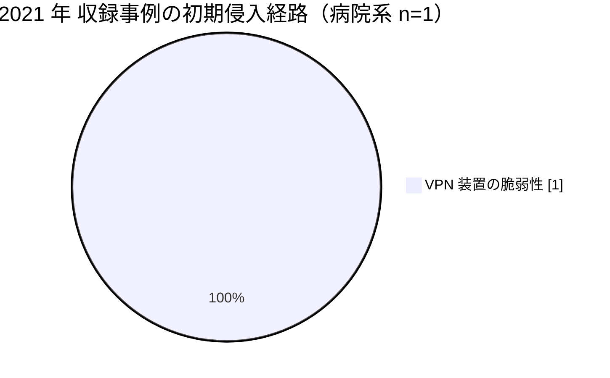

# 🇯🇵 国内の事例 2021 年（サマリー）

> [!NOTE]
> 本ページの集計は、断りのない限り**本リポジトリに収録した事例**を母集団とする。
> 国内で発生した被害の全数ではない。
> 外部統計を引くときは、その出典を併記する。
> 個別の経緯は [2021 年の履歴](2021-timeline.md) を参照してほしい。

## その年の要点

**分析**：国内の医療機関が、詳細な調査報告書を公表する最初の年になった。
[JP-2021-01 半田病院](2021-timeline.md#JP-2021-01)の事案は、被害の事実だけでなく、VPN 装置の脆弱性、ウイルス対策ソフトの停止、バックアップの被害まで公表された。
それ以前の国内事例（[JP-2018-01 宇陀市立病院](2019-earlier.md#JP-2018-01)など）は経緯が公表されず、他の医療機関が転用できる情報が残らなかった。
この差が、翌年以降の公表の水準を決めた。

## 外部統計

| 統計 | 参照先 | 本リポジトリでの集計状況 |
|---|---|---|
| ランサムウェア被害の報告件数（業種別、半期ごと） | [警察庁 サイバー空間をめぐる脅威の情勢等](https://www.npa.go.jp/publications/statistics/cybersecurity/index.html) | 未集計 |
| 医療分野のインシデント動向 | [IPA 情報セキュリティ白書](https://www.ipa.go.jp/publish/wp-security/index.html) | 未集計 |

数値は原典を確認したうえで追記する。

## 収録事例の集計

### 区分別の件数

| 区分 | 件数 | 内訳 |
|---|---|---|
| 病院系 | 1 | 公立病院 1 |
| 製薬企業系 | 0 | 収録なし |
| 医療関連事業者 | 0 | 収録なし |

### 初期侵入経路の内訳（病院系）

### 診療への影響

| 区分 | 組織 | 停止した範囲 | 通常復旧までの期間 |
|---|---|---|---|
| 病院系 | 徳島県つるぎ町立半田病院 | 電子カルテを含む院内システム、新規患者の受け入れ | 約 2 か月（2021 年 10 月から 2022 年 1 月） |

## この年を象徴する事例

- [JP-2021-01 徳島県つるぎ町立半田病院](2021-timeline.md#JP-2021-01)：国内で初めて、医療機関が技術的な経緯を調査報告書として公開した事例

## 規制と制度の動き

本年について、本リポジトリで整理した動きはない。
国内の規制の全体像は [国内のガイドラインと法規制](../../../guidelines/japan.md) にまとめている。

## 前年との差分

**分析**：2020 年は本リポジトリに収録した国内事例がない。
2021 年に病院系の 1 件が加わり、かつ調査報告書という形で一次情報が残った点が変化である。
収録件数の増減は、被害件数の増減ではなく、公表の有無を反映している。

---

[← 2020 年サマリー](2020-summary.md) | [2021 年の履歴](2021-timeline.md) | [国内の事例](README.md) | [2022 年サマリー →](2022-summary.md) | [トップへ](../../../../README.md)
