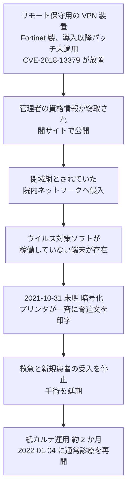

# 🇯🇵 国内の事例 2021 年（履歴）

> [!NOTE]
> **表記ルール**：本ページでは、**事実**（一次情報で確認できる内容。出典を併記する）、**報道ベース**（報道や第三者の集計のみで確認でき、当事者の公表資料では裏付けが取れていない内容）、**分析**（筆者の解釈）を書き分ける。
> [対象の区分](../README.md#対象の区分)と[一次情報の強度](../README.md#一次情報の強度)の定義は、インシデント事例集のトップにまとめている。
> その年の情勢と集計は [2021 年の情勢](../years/2021-summary.md) にまとめている。

## 収録件数

| 区分 | サイバー攻撃 | その他の事案 |
|---|---|---|
| 病院系 | 9 | 7 |
| 製薬企業系 | 1 | 1 |
| 医療関連事業者 | 2 | 5 |

つるぎ町立半田病院の被害が国内の医療分野の転換点になった年である。
同じ年に、クラウドのアカウントの乗っ取り、ウェブサイトの改ざん、私用端末の持ち込みを起点とする事案が並行して起きている。
収録は本リポジトリが一次情報を確認できた事案に限る。
国内で公表された医療関連の事案がこれで尽きることを示すものではない。

前年に発生し、本年に公表または処分が公表された事案も本ページに収める。
その場合は、発生時期の欄に発生と公表の両方を記す。

---

## 病院系

| ID | 発生時期 | 組織 | 種別 | 初期侵入経路 | 診療への影響 | 業務停止期間 | 一次情報の強度 |
|---|---|---|---|---|---|---|---|
| [JP-2021-06](#JP-2021-06) | 2021-01 | 国立成育医療研究センター | 不正アクセス（ウェブサイトの改ざん） | WordPress の管理画面の推測しやすい ID とパスワード | 公表なし | 該当サイトを停止（期間は未公表） | 当事者公表 |
| [JP-2021-11](#JP-2021-11) | 2021-01 | 静岡市立静岡病院 | 不正アクセス（メールアカウント） | 未公表 | 影響なし（メールシステムは医療情報システムと非接続） | 該当アカウントを停止 | 当事者公表 |
| [JP-2021-03](#JP-2021-03) | 2021-04 | 千葉大学医学部附属病院 | フィッシング | 職員が個人で利用していたクラウドサービスの認証情報 | 公表なし | 診療の停止は公表されていない | 当事者公表 |
| [JP-2021-04](#JP-2021-04) | 2021-05 | 市立東大阪医療センター | 不正アクセス | 未公表 | 過去に撮影した画像の一部が参照不能。来院中と予約済みの患者への対応が必要になった | 医用画像参照システムの一部が **約 3 週間** | 当事者公表 |
| [JP-2021-02](#JP-2021-02) | 2021-07 | 岡山大学病院 | フィッシング | 医師個人のクラウドサービスの認証情報 | 公表なし | 診療の停止は公表されていない | 当事者公表 |
| [JP-2021-05](#JP-2021-05) | 2021-07 | 愛知県がんセンター | 不正アクセス（クラウドのアカウント） | 医師の Microsoft 365 アカウント | 公表なし | 診療の停止は公表されていない | 当事者公表 |
| [JP-2021-08](#JP-2021-08) | 2021-10 | 公益社団法人有隣厚生会 富士病院（静岡県富士市） | 不正アクセス | 未公表 | 診療機能に支障が生じ、診療を一部制限 | システム障害が **1 か月以上**継続（完全復旧の時期は未公表） | 当事者公表 |
| [JP-2021-07](#JP-2021-07) | 2021-10 | 新潟県立精神医療センター | 不正アクセス（私用端末の接続を契機） | 院内 LAN へ接続された私用パソコン | 公表なし | 診療の停止は公表されていない | 当事者公表 |
| [JP-2021-01](#JP-2021-01) | 2021-10 | 徳島県つるぎ町立半田病院 | ランサムウェア（LockBit 2.0） | Fortinet 製 VPN 装置の脆弱性（CVE-2018-13379） | 電子カルテ停止、新規患者の受入停止、紙カルテ運用 | 通常診療の再開まで **約 2 か月**（2021-10-31 から 2022-01-04） | 報告書 |

### JP-2021-06 国立成育医療研究センター（2021 年 1 月）

**事実**

- 発生時期：2021 年 1 月 4 日に不正なファイルの設置を検知し、1 月 13 日に第一報を公表した。10 月 6 日に調査結果を公表した。
- 対象組織：国立研究開発法人国立成育医療研究センター。対象は同センターが運用する小児医療情報収集システムのウェブサイト。
- 攻撃種別：不正アクセス。同センターのドメイン配下に、無関係な広告のページが多数設置された。
- 初期侵入経路：WordPress の管理画面の ID とパスワードが推測しやすいものであった。
- 発覚の経緯：検索エンジンで「激安」と検索した際に、同センターのドメイン配下のファイルが多数表示されたことで判明した。
- 情報流出：調査結果の公表資料の範囲では、個人情報の流出は示されていない。
- 診療への影響：公表されていない。
- 公表された対策：該当のウェブサイトを停止して調査し、再発防止策を講じたうえで運用を再開した。

**分析**

- 侵入口は脆弱性ではなく、推測できるパスワードである。攻撃者にとって、狙ったのはセンターの情報ではなく、`go.jp` ドメインの検索順位である。医療機関のドメインは、それ自体が転用の対象になる（[メールとドメインの管理](../../../technology/email-domain.md)）。
- 発覚の端緒は検索結果であり、自組織の監視ではない。改ざんは、既存のページを書き換えるのではなく別のページを追加する形をとると、正規の利用者からは見えない。公開しているコンテンツの一覧を定期的に突き合わせる仕組みがないと検知できない（[外部から見た自組織の攻撃面](../../../practice/attack-surface.md)）。
- 研究機関が本体のシステムとは別に立てた小規模なサイトが対象になっている。管理の対象から漏れやすい資産の典型である。

**一次情報**

- [国立成育医療研究センター](https://www.ncchd.go.jp/)
- [国立成育医療研究センター Web サイトへの不正アクセス、WordPress の ID、パスワードが類推しやすいことが原因](https://scan.netsecurity.ne.jp/article/2021/10/08/46426.html)（ScanNetSecurity による当事者公表の報道）

---

### JP-2021-11 静岡市立静岡病院（2021 年 1 月）

**事実**

- 発生時期：2021 年 1 月 13 日 20 時 36 分から 1 月 14 日 9 時 17 分ごろまで。
- 対象組織：静岡市立静岡病院。
- 攻撃種別：不正アクセス。同院のメールアカウント **1 件**が乗っ取られ、大量の迷惑メールの送信に悪用された。
- 初期侵入経路：未公表。
- 侵害範囲：当該アカウント 1 件。同院は、メールシステムが医療情報システムと接続していないため、患者情報の漏えいの可能性はないと説明した。
- 公表された対策：当該アカウントを停止し、迷惑メールの送信を止めた。

**分析**

- 前年の[市立福知山市民病院](2020-timeline.md#JP-2020-02)とほぼ同じ構図である。国内の公立病院で、メールアカウント 1 件の乗っ取りが繰り返し公表されている。攻撃者が求めているのは病院の情報ではなく、病院のドメインから送れることである（[メールとドメインの管理](../../../technology/email-domain.md)）。
- 乗っ取りから停止まで約 13 時間である。夜間に始まり、翌朝の始業後に止まっている。深夜帯に大量送信が始まったときに検知して自動で止める仕組みがなければ、この時間は縮まらない。
- 「医療情報システムと接続していない」という説明は、この時期の国内の公表資料に共通する型である。分離は診療の継続を守るが、外部への迷惑メールの送信そのものは防がない。

**一次情報**

- [静岡市立静岡病院](https://www.shizuokahospital.jp/)
- [メールアカウントに不正アクセス、スパム踏み台に - 静岡病院](https://www.security-next.com/122584)（Security NEXT による当事者公表の報道）

---

### JP-2021-03 千葉大学医学部附属病院（2021 年 4 月）

**事実**

- 発生時期：2021 年 4 月 25 日。4 月 30 日に公表した。
- 対象組織：千葉大学医学部附属病院。
- 攻撃種別：フィッシング。
- 初期侵入経路：職員が宅配業者を装ったメールに応じ、クラウドサービスの ID とパスワードを入力した。
- 侵害範囲：当該のクラウド上に保存されていた患者情報。職員は大学の規定に反して、個人用のパソコンに患者情報を保存し、大学が許可していないクラウドサービスを利用していた。
- 情報流出：患者 **586 人分**が閲覧できる状態になった。ID、氏名、性別、生年月日、入退院日、診断名、入院目的、生活の自立度（modified Rankin Scale）、意識状態（JCS）を含む。
- 診療への影響：公表されていない。
- 公表された対策：4 月 28 日に対象の患者へ書面を発送した。クラウドサービスの ID を保護し、緊急のミーティングで情報の管理方法を周知した。

**分析**

- 同じ年の 7 月に、[岡山大学病院](#JP-2021-02)でほぼ同一の構図の事案が起きている。どちらも、職員が個人で契約したクラウドサービスに患者情報を置き、フィッシングで認証情報を奪われた。病院の情報システム部門から見て、存在自体が把握されていない領域である。
- 漏れた項目には、診断名に加えて生活の自立度と意識状態が含まれる。研究や症例のまとめに使う形に加工されたデータであり、電子カルテの画面をそのまま写したものではない。持ち出しは、加工の工程で起きる。
- 規定違反であっても、規定だけでは止まらない。院内で完結する保存先と共有の手段を用意しないかぎり、職員は手元の道具を使う（[認証とアクセス管理](../../../technology/identity.md)）。

**一次情報**

- [千葉大学医学部附属病院](https://www.ho.chiba-u.ac.jp/)
- [千葉大学病院職員がスミッシング被害、患者情報が閲覧可能に](https://scan.netsecurity.ne.jp/article/2021/05/07/45622.html)（ScanNetSecurity による当事者公表の報道）

---

### JP-2021-04 市立東大阪医療センター（2021 年 5 月）

**事実**

- 発生時期：2021 年 5 月 31 日未明。6 月 7 日に第一報、6 月 22 日に続報を公表した。
- 対象組織：地方独立行政法人市立東大阪医療センター。
- 攻撃種別：不正アクセス。
- 初期侵入経路：未公表。
- 侵害範囲：医用画像参照システムのサーバが停止した。復旧作業のあとも、過去に撮影した画像データの一部が参照できない状態が続いた。
- 情報流出：公表資料の範囲では確認されていない。
- 診療への影響：来院中の患者と予約済みの患者への対応が必要になり、予約の変更を依頼した。
- 業務停止期間：画像の一部が参照できない状態が **約 3 週間**続いた。
- 公表された対策：6 月 22 日に警察へ被害届を提出した。他のシステムへの波及を防ぐ措置をとり、新しいサーバの稼働を含む再発防止策を実施した。

**分析**

- 止まったのは電子カルテではなく、画像の参照である。それでも診療は動かない。撮影済みの画像が読めない状態は、過去との比較ができないことを意味する。経過を追う診療では、直近の 1 枚より過去との差が判断材料になる。
- 3 年後の[国分生協病院](2024-timeline.md#JP-2024-02)でも、暗号化されたのは画像管理サーバだけで、電子カルテと医事会計は動いていた。それでも救急と一般外来の受入を制限している。画像の系統は、止まったときの影響が診療の広い範囲に及ぶ（[医療機器のセキュリティ](../../../technology/medical-devices/)）。
- 発覚の端緒は「サーバのダウン」であり、侵入の検知ではない。原因が不正アクセスだと判明したのは調査のあとである。可用性の障害として扱っている間、侵入者は院内に残りうる。

**一次情報**

- [市立東大阪医療センター](http://www.higashiosaka-hosp.jp/)
- [不正アクセスで医用画像システムに障害、一部で参照できない状態続く](https://scan.netsecurity.ne.jp/article/2021/06/25/45867.html)（ScanNetSecurity による当事者公表の報道）

---

### JP-2021-02 岡山大学病院（2021 年 7 月）

**事実**

- 発生時期：2021 年 7 月 23 日。
- 対象組織：岡山大学病院。
- 攻撃種別：フィッシング。
- 初期侵入経路：医師が個人で利用していたクラウドサービスの ID とパスワードが、フィッシングにより窃取された。
- 侵害範囲：当該のクラウド上に保存されていたデータ。
- 情報流出：患者 **269 人分**の情報が、攻撃者から閲覧可能な状態になった。
- 経緯：医師は院内の規定に反して、個人利用のクラウドサービスへ患者情報を保存していた。認証情報を窃取された結果、本人も当該データへアクセスできなくなった。
- 診療への影響：診療の停止は公表されていない。
- 公表された対策：院内の規定の周知と、クラウドサービスの利用に関する指導を行った。

**分析**

- 侵害されたのは病院のシステムではなく、職員が個人で契約したクラウドサービスである。病院の情報システム部門から見て、存在自体が把握されていない領域で漏えいが起きた。
- 規定違反であっても、規定だけでは止まらない。院内で完結する保存先と共有の手段が用意されていなければ、職員は手元の道具を使う。禁止と代替手段の提供は対になる（[認証とアクセス管理](../../../technology/identity.md)）。
- 攻撃者に認証情報を奪われたことで、本人がデータへ到達できなくなった。個人契約のサービスでは、復旧を組織が支援できない。

**一次情報**

- [岡山大学病院](https://www.okayama-u.ac.jp/user/hospital/)
- [日本の医療機関におけるサイバー攻撃の事例（PDF）](https://www.jmari.med.or.jp/wp-content/uploads/2022/03/WP465_appendix.pdf)（日本医師会総合政策研究機構）

---

### JP-2021-05 愛知県がんセンター（2021 年 7 月）

**事実**

- 発生時期：2021 年 7 月 13 日に医師がメールの異常に気づき報告した。7 月 15 日に海外からのアクセスを確認した。9 月 8 日に公表した。
- 対象組織：愛知県がんセンター。
- 攻撃種別：不正アクセス。医師の Microsoft 365 アカウントが対象。
- 初期侵入経路：未公表。
- 侵害範囲：当該アカウントのメール。個人情報を含むメールが閲覧された可能性がある。
- 診療への影響：公表されていない。
- 公表された対策：ネットワークの委託事業者による調査を実施した。

**分析**

- 発覚の端緒は、利用者本人が気づいたメールの異常である。海外からのアクセスの記録は、そのあとの調査で確認された。クラウドのサインインログは取得されていても、異常を自動で拾う設定になっていなければ、検知は利用者の申告に依存する（[ログと監視の設計](../../../technology/logging.md)）。
- 侵害されたのは 1 アカウントであり、診療系のシステムではない。それでも、がん専門の医療機関の医師のメールには、患者の診断と治療の相談が残る。被害の大きさは、システムの重要度ではなく、そのアカウントが受け取ってきた内容で決まる。
- 多要素認証を設定していれば、認証情報の窃取だけでは到達できない。クラウドの管理は、境界の防御とは別の枠組みで設計する必要がある（[認証とアクセス管理](../../../technology/identity.md)）。

**一次情報**

- [愛知県がんセンター](https://cancer-c.pref.aichi.jp/)
- [愛知県がんセンター医師の Office365 アカウントへ不正アクセス、個人情報含むメールが漏えい](https://scan.netsecurity.ne.jp/article/2021/09/10/46271.html)（ScanNetSecurity による当事者公表の報道）

---

### JP-2021-08 公益社団法人有隣厚生会 富士病院（2021 年 10 月）

**事実**

- 発生時期：2021 年 10 月 1 日未明。10 月 13 日に公表し、11 月 4 日に続報を公表した。
- 対象組織：静岡県富士市の公益社団法人有隣厚生会 富士病院。
- 攻撃種別：不正アクセス。
- 初期侵入経路：未公表。
- 侵害範囲：院内システムの一部。11 月 4 日の続報で、流出した情報に診療情報が含まれる可能性があると説明した。
- 診療への影響：診療機能に支障が生じ、診療を一部制限した。
- 業務停止期間：10 月 1 日の発生から 11 月 4 日の続報の時点まで、システムの障害が続いていた。完全復旧の時期は公表されていない。
- 公表された対策：経過を自院のサイトで段階的に公表した。

**分析**

- 同じ月の末に[つるぎ町立半田病院](#JP-2021-01)の被害が起きている。半田病院が詳細な報告書を公開したのに対し、この事案は経過の告知にとどまった。国内で公表される情報の粒度は、同じ年でもこれだけ開く。
- 1 か月以上にわたってシステムの障害が続き、その間、診療は制限されたまま維持された。停止か継続かの二択ではなく、部分的に落ちた状態で診療を回す期間が長い。この期間の運用（何を紙に落とし、どの検査を外部へ回すか）が、実務上の負荷の大半を占める（[サイバー攻撃を想定した BCP](../../../response/bcp-cyber.md)）。
- 診療情報が含まれる可能性を、発生から 1 か月後の続報で示している。侵害範囲の確定には時間がかかる。第一報の時点で「流出は確認されていない」と述べることと、流出がないことは別である。

**一次情報**

- [公益社団法人有隣厚生会](https://www.yuurinkouseikai.or.jp/)
- [富士病院に不正アクセス、システム障害発生に伴い診療制限を実施](https://scan.netsecurity.ne.jp/article/2021/10/18/46473.html)（ScanNetSecurity による当事者公表の報道）
- [富士病院へ不正アクセスでシステム障害、流出情報に診療情報が含まれる可能性](https://scan.netsecurity.ne.jp/article/2021/11/10/46607.html)（ScanNetSecurity による当事者公表の報道）

---

### JP-2021-07 新潟県立精神医療センター（2021 年 10 月）

**事実**

- 発生時期：2021 年 10 月 3 日 16 時 50 分に異常を検知した。10 月 5 日に新潟県が公表した。
- 対象組織：新潟県立精神医療センター。
- 攻撃種別：不正アクセス。ファイルが外部へ転送された可能性がある。
- 初期侵入経路：当直医が、院内の基準を満たすセキュリティソフトを導入していない私用のパソコンを院内 LAN へ接続した。
- 侵害範囲：公表資料では具体的な件数は示されていない。当直医がセキュリティソフトの更新作業を行っている最中に、メールが消えるなどの異常が発生した。
- 診療への影響：公表されていない。
- 公表された対策：新潟県が経緯を公表した。

**分析**

- 前年の[福島県立医科大学附属病院](2020-timeline.md#JP-2020-01)と同じく、私用端末の持ち込みが起点である。閉域を前提とする設計は、境界を越える端末を物理的に止める運用と対になっていなければ成り立たない（[ネットワークの分離](../../../technology/segmentation.md)）。
- 私用端末を持ち込んだのは当直医である。夜間の当直帯は、情報システムの担当者が不在で、確認を求める相手がいない。持ち込みの禁止は、禁止を破ったときに誰も見ていない時間帯でこそ破られる。
- 異常として現れたのは「メールが消える」という現象である。感染の警告ではない。利用者が異常を報告する経路が用意されていなければ、この段階では気づかれない。

**一次情報**

- [新潟県立精神医療センター](https://www.psyche-niigata.jp/)
- [新潟県立精神医療センターで個人情報流出、私用パソコン持ち込みが原因](https://scan.netsecurity.ne.jp/article/2021/10/07/46415.html)（ScanNetSecurity による当事者公表の報道）

---

### JP-2021-01 徳島県つるぎ町立半田病院（2021 年 10 月）

**事実**

以下は、つるぎ町立半田病院が 2022 年 6 月 16 日に公表した「コンピュータウイルス感染事案 有識者会議調査報告書」による。

- 発生時期：2021 年 10 月 31 日未明、院内の複数のプリンタが一斉に犯行声明を印字したことでインシデントが発覚した。
- 対象組織：徳島県つるぎ町の町立病院。当日は地域の救急当番医であった。
- 攻撃種別：ランサムウェア（LockBit 2.0）。
- 初期侵入経路：病院情報システムと検査機器のリモート保守のために設置されていた **Fortinet 製の VPN 装置**。導入当初からソフトウェアの更新が行われておらず、**CVE-2018-13379** が放置された状態であった。同装置の管理者の資格情報が、この脆弱性を悪用して取得され、闇サイトで公開されていた事実も確認されている。報告書は、この脆弱性を悪用した侵入の可能性が高いと結論づけた。VPN 装置のログはインシデント対応の過程で失われており、証明はできていない。
- 侵害範囲：電子カルテを含む端末と関連するサーバのデータが暗号化された。
- 情報流出：報告書は、プリンタから出力された脅迫文の確認に留まり、二重恐喝に特有の攻撃者の行動は見られなかったとしている。
- 診療への影響：ネットワークの遮断と端末の停止を行い、救急と新規患者の受け入れを中止した。手術も可能な限り延期し、病院の機能は事実上停止した。
- 業務停止期間：2021 年 10 月 31 日から 2022 年 1 月 4 日の通常診療再開まで、**約 2 か月**にわたって制限が続いた。
- 代替運用：紙カルテによる限定的な診療を続けた。この期間、新規患者の受け入れは停止している。
- 初動：当日 8 時過ぎに幹部職員が参集し、災害相当と判断した。10 時に災害対策本部を設置し、地震災害用に定めていた事業継続計画（BCP）を発動した。
- 事業継続の基本方針：「今いる入院患者を守る」「外来患者は基本的に予約患者のみ」「電子カルテ復旧に努める」「皆で助け合って乗り切ろう」の 4 点を定めた。
- 身代金：**支払わなかった**。データが完全に復旧する保証はないこと、警察からの指導、病院開設者であるつるぎ町長が自治体として資金提供は理解を得られないと判断したことによる。
- 復旧の方法：オフラインで保管していたバックアップデータは LockBit 2.0 の影響を受けず、復旧に使えた。フォレンジックを請け負った事業者が、確認できる範囲で元の通り復元した。その後、端末を初期化して再利用した。
- 情報公開：発生当日に記者会見を行い、方針を決定した 2021 年 11 月 29 日にも会見を開いた。国内外の取材にできる限り対応し、他の病院や事業所が同じ被害に遭わないよう積極的に情報を公開した。

**教訓（分析）**

| 論点 | 示唆 |
|---|---|
| VPN 装置の管理 | 「閉域だから安全」という前提が、パッチ適用の遅れを生む。報告書は、事業者とベンダの双方が CVE-2018-13379 の存在を認識していたにもかかわらず、担当の範囲外という意識で放置されたと記録している。境界機器は最優先のパッチ対象として扱う |
| 責任の所在 | VPN 装置を設置した事業者、電子カルテを納入した事業者、保守を担う事業者が分かれ、脆弱性管理の責任者が定まっていなかった。契約に、誰がどの機器の更新を行うかを書く必要がある（[委託先への依存](../../../response/dependencies.md)） |
| バックアップ設計 | オフラインで保管していたバックアップが復旧を可能にした。同一ネットワーク上のバックアップは、ランサムウェア対策として機能しない |
| BCP の流用 | 地震災害用の BCP を発動し、「災害」と判断したことが初動を早めた。既存の災害対応の枠組みをサイバー事象へ適用できるかが、初動の速さを決める（[サイバー攻撃を想定した BCP](../../../response/bcp-cyber.md)） |
| 身代金の判断 | 報告書は、医療情報が一度ランサムウェアの被害に遭うと、身代金を払って復元してもデータの真正性を担保できないため、支払いは合理的でないと述べている。完全性の論点は[完全性への攻撃と患者安全](../../integrity-attacks.md)に整理している |
| 情報公開の価値 | 詳細な報告書の公開は、業界全体の防御力を押し上げる。この公開姿勢自体が国内医療セキュリティの転換点となった |

**一次情報**

- [コンピュータウイルス感染事案有識者会議調査報告書について](https://www.handa-hospital.jp/topics/2022/0616/index.html)（つるぎ町立半田病院）
- [コンピュータウイルス感染事案 有識者会議調査報告書（PDF）](https://www.handa-hospital.jp/topics/2022/0616/report_01.pdf)（つるぎ町立半田病院、2022 年 6 月 7 日）
- [CVE-2018-13379](https://nvd.nist.gov/vuln/detail/CVE-2018-13379)（NVD）

---

## 製薬企業系

| ID | 発生時期 | 組織 | 種別 | 初期侵入経路 | 影響 | 一次情報の強度 |
|---|---|---|---|---|---|---|
| [JP-2021-10](#JP-2021-10) | 2021-10 | 株式会社リニカル（医薬品開発の支援、CRO） | 不正アクセス、ランサムウェア（Ragnar Locker を名乗る脅迫） | 未公表 | 最大 **約 22 万件**の個人情報が流出した可能性。治験の責任医師と分担医師 約 3 万 5000 件、CRC と協力者 約 6 万件を含む。委託元の製薬企業が個別に公表 | 当事者公表 |

サイバー攻撃以外の事案として、科研製薬のメール誤送信（JP-2021-S07）を「その他の事案」の節に収録している。

### JP-2021-10 株式会社リニカル（2021 年 10 月）

**事実**

- 発生時期：2021 年 10 月 3 日に国内と台湾の拠点で不正アクセスの形跡を把握し、10 月 22 日に EU 拠点でも確認した。11 月 3 日に情報が流出した痕跡を発見し、12 月 6 日に公表した。
- 対象組織：医薬品の臨床開発を支援する株式会社リニカル（大阪市、開発業務受託機関）。
- 攻撃種別：不正アクセス。Ragnar Locker を名乗る脅迫があったとされる（**報道ベース**）。
- 初期侵入経路：未公表。
- 侵害範囲：最大 **約 22 万件**の個人情報が流出した可能性がある。公表された内訳は次のとおりである。

| 対象 | 件数 |
|---|---|
| 治験の責任医師、分担医師 | 約 3 万 5000 件 |
| 治験のコーディネーター（CRC）、協力者 | 約 6 万件 |
| 採用の応募者（海外を含む） | 約 6 万件 |
| 取引先の従業員 | 約 3 万件 |
| 個人株主 | 約 2 万 1000 件 |
| 国内の採用応募者 | 約 1 万 4000 件 |

- 治験の被験者への影響：被験者の情報は、収集と保管を別のクラウドサーバの環境で行っており、今回の不正アクセスの影響を受けていない。
- 調査の難航：データが暗号化され、アクセスログも消去されていたため、調査は難航した。
- 委託元への波及：委託元の製薬企業が、それぞれ影響を個別に公表した。久光製薬は 2021 年 12 月 9 日、住友ファーマ（当時の大日本住友製薬）は 12 月 27 日に公表している。小野薬品工業も対象に含まれる。
- 業務への影響：サーバを復旧し、業務の停止はなかったと説明した。

**分析**

- 流出した可能性がある情報の中心は、**治験に関わる医療従事者の名簿**である。責任医師と分担医師で約 3 万 5000 件、CRC と協力者で約 6 万件にのぼる。どの医師がどの領域の治験に関わっているかは、製薬企業にとっての営業情報であると同時に、標的型攻撃の宛先の一覧でもある（[治験と研究データ](../../../reference/pharma/clinical-trials.md)）。
- 被験者の情報は別のクラウド環境に分けており、影響を免れた。もっとも機微なデータを、社内の業務システムとは別の環境に置く設計が働いた。区分けの設計が、被害の範囲をそのまま決めている（[ネットワークの分離](../../../technology/segmentation.md)）。
- アクセスログが消去されていた。この年の[つるぎ町立半田病院](#JP-2021-01)でも、VPN 装置のログがインシデント対応の過程で失われている。ログは、失われたあとで作り直せない（[ログと監視の設計](../../../technology/logging.md)）。
- 委託元の製薬企業が個別に公表した。CRO が 1 者侵害されると、委託していた製薬企業の数だけ公表が発生する。国内の製薬分野では、この形が最初にはっきり現れた事案にあたる。

**一次情報**

- [不正アクセスによる情報流出の可能性に関するお知らせ（PDF）](https://ssl4.eir-parts.net/doc/2183/tdnet/2056628/00.pdf)（株式会社リニカル、2021 年 12 月 6 日）
- [株式会社リニカル](https://www.linical.co.jp/)
- [株式会社リニカルへの不正アクセスに関するお知らせ（PDF）](https://www.hisamitsu.co.jp/whatsnew/pdf/info_211209.pdf)（久光製薬株式会社、2021 年 12 月 9 日）
- [住友ファーマ株式会社](https://www.sumitomo-pharma.co.jp/)
- [個人情報流出の可能性示す痕跡を発見、最大対象件数を算出 - リニカル](https://www.security-next.com/132207)（Security NEXT による当事者公表の報道）

---

## 医療関連事業者

| ID | 発生時期 | 組織 | 種別 | 初期侵入経路 | 影響 | 一次情報の強度 |
|---|---|---|---|---|---|---|
| [JP-2021-09](#JP-2021-09) | 2021-08 | 株式会社八神製作所（医療機器と医療用品の販売、名古屋市） | ランサムウェア | 未公表 | 被害が確認されたサーバをいったん全停止して復旧作業を行った | 当事者公表 |
| [JP-2021-12](#JP-2021-12) | 2021-08 | 株式会社ムトウ（医療機器の販売、札幌市） | ランサムウェア | 未公表 | 被害が確認されたサーバをすべて停止した。情報流出の可能性は公表されていない | 当事者公表 |

### JP-2021-09 株式会社八神製作所（2021 年 8 月）

**事実**

- 発生時期：2021 年 8 月 31 日夜間に不正アクセスを受け、9 月 1 日に公表した。
- 対象組織：医療機器と医療用品を販売する株式会社八神製作所（名古屋市）。
- 攻撃種別：不正アクセスとランサムウェア感染。
- 初期侵入経路：未公表。
- 侵害範囲：公表の時点では調査中とされ、具体的な範囲は示されていない。
- 業務への影響：被害が確認されたサーバをいったんすべて停止したうえで復旧作業を進めた。
- 公表された対策：影響範囲の調査と特定を進め、原因の究明と対策を行うとした。

**分析**

- 医療機器の販売事業者は、病院の在庫と補充の起点にある。サーバの全停止は、受注と出荷の停止を意味する。診療材料の供給が止まると、影響は取引先の医療機関の現場に出る（[委託先への依存](../../../response/dependencies.md)）。
- 同種の構図は、2022 年の給食事業者[ベルキッチン](2022-timeline.md)、2025 年の[株式会社三笑堂](2025-timeline.md#JP-2025-02)と[オオサキメディカル株式会社](2025-timeline.md#JP-2025-06)へ続く。医療機関を直接狙わなくても、供給の一段手前を止めれば診療は滞る。
- 攻撃を受けた翌日に公表している。取引先が代替の調達を判断するには、被害の詳細より「いつまで止まるか」の見通しが要る。

**一次情報**

- [株式会社八神製作所](https://www.yagami.co.jp/)
- [医療機器取扱いの八神製作所にランサムウェア攻撃、サーバを全停止](https://scan.netsecurity.ne.jp/article/2021/09/06/46249.html)（ScanNetSecurity による当事者公表の報道）

### JP-2021-12 株式会社ムトウ（2021 年 8 月）

**事実**

- 発生時期：2021 年 8 月 31 日朝。9 月 2 日の時点で復旧作業を優先していると説明した。
- 対象組織：医療機器を販売する株式会社ムトウ（札幌市）。
- 攻撃種別：ランサムウェア。
- 初期侵入経路：未公表。
- 侵害範囲：被害が確認されたサーバをすべて停止した。情報流出の可能性については明らかにしていない。
- 公表された対策：関係省庁と警察へ報告し、復旧作業と影響範囲の特定を進めた。

**分析**

- [八神製作所](#JP-2021-09)の被害と**同じ日の朝**である。どちらも医療機器の販売事業者で、どちらもサーバの全停止に至った。両者の関係は公表されていないが、同じ時期に同じ業種が続けて止まった事実は記録に値する。
- 医療機器の販売事業者は、病院の在庫と補充の起点にある。北海道と東海で同時期に流通が止まれば、影響は各地の医療機関の現場に出る（[委託先への依存](../../../response/dependencies.md)）。
- 公表の粒度は限られており、情報流出の有無も示されていない。取引先の医療機関から見ると、自院の発注情報が対象かどうかを判断できない。

**一次情報**

- [株式会社ムトウ](https://www.wism-mutoh.jp/)
- [サーバがランサムウェアに被害に - 医療機器販売会社](https://www.security-next.com/129533)（Security NEXT による当事者公表の報道）

---

---

## その他の事案（サイバー攻撃以外）

サポート詐欺、システム障害、内部不正、機器や記憶媒体の紛失と盗難、委託先の管理不備による漏えい、誤送付や誤公開、ドメインの失効を記録する。
類型の定義と、主分類との判定基準は[事案の類型](../README.md#事案の類型)にまとめている。

| ID | 発生時期 | 組織 | 区分 | 類型 | 概要 | 一次情報の強度 |
|---|---|---|---|---|---|---|
| [JP-2021-S02](#JP-2021-S02) | 2019-11 〜 2020-12（2021-01 公表） | 聖マリアンナ医科大学病院 | 病院系 | 誤送付、誤公開、操作ミス | 救命救急センターの看護師が私的な Google アカウントで開設したグループが、ウェブ上のすべての利用者に公開される設定になっていた。外部からの指摘で発覚。メンバー 7 人は全員が管理者権限を持っていた | 当事者公表 |
| JP-2021-S03 | 2021-01 | 奈良県（県内の医師の情報） | 医療関連事業者 | 誤送付、誤公開、操作ミス | 実在する大学の卒業生の期数と氏名を名乗る電話に応じ、医師 19 人の情報を伝えた。17 人分は氏名、勤務先、電話番号、2 人分は氏名と勤務先 | 当事者公表 |
| JP-2021-S04 | 2021-02 | 松下記念病院（大阪府門真市） | 病院系 | 機器、記憶媒体の紛失、盗難 | 撮影画像のデータを記録したノートパソコンを紛失。患者 1971 人分の ID、氏名、生年月日、性別、年齢、撮影部位、病室、医師名、撮影画像 | 当事者公表 |
| [JP-2021-S05](#JP-2021-S05) | 2010-05（2021-03 公表） | 札幌医科大学 | 病院系 | 機器、記憶媒体の紛失、盗難 | 勤務していた道職員が USB メモリを紛失。約 10 年後に第三者が北海道庁へデータを送付したことで判明した。大学関係者 224 人分 | 当事者公表 |
| JP-2021-S06 | 2021-08 | 東邦大学医療センター大森病院 | 病院系 | 内部不正 | 看護師が患者情報を含む業務文書を無断で自宅へ持ち帰り、個人売買の商品を梱包する緩衝材として使用した。患者 14 人分の氏名、病名、病棟でのケアの内容 | 当事者公表 |
| JP-2021-S07 | 2021-10 | 科研製薬株式会社 | 製薬企業系 | 誤送付、誤公開、操作ミス | 講演会の登録者へ確認のメールを送る際、登録者の一覧ファイルを誤って添付した。医療関係者のメールアドレスが流出。受信者からの指摘で発覚 | 当事者公表 |
| JP-2021-S08 | 2021-10 | 半田市立半田病院（愛知県） | 病院系 | 機器、記憶媒体の紛失、盗難 | 中央臨床検査科の超音波診断装置に接続していた外付けハードディスクが所在不明。造影超音波検査の動画データ 延べ 243 件（患者 156 人分）を保存していた。装置本体はワイヤー錠で固定していた | 当事者公表 |
| JP-2021-S13 | 2021-11 | 広島大学病院 | 病院系 | 機器、記憶媒体の紛失、盗難 | 施錠されていない大部屋の研究室から、医師の私物ノートパソコンが盗まれた。同院の患者 40 人分を含む計 約 700 人分。前の勤務先である県立広島病院の患者情報も含まれていた | 当事者公表 |
| [JP-2021-S09](#JP-2021-S09) | 2021-01 | 神奈川県（新型コロナ療養者向けの AI コールシステム） | 医療関連事業者 | システム障害 | 改修の作業中に障害が発生し、安否確認の対象 912 件へ自動架電が行われなかった。137 人へ職員が架電して対応した | 当事者公表 |
| JP-2021-S12 | 2021-07 | 北海道国民健康保険団体連合会 | 医療関連事業者 | 誤送付、誤公開、操作ミス | 登別市の健康づくり事業の分析中、後期高齢者医療の被保険者情報を専用回線で佐呂間町と豊頃町へ誤送信した。8903 人分の基礎情報と健診結果を含む 238 項目 | 当事者公表 |
| JP-2021-S10 | 2021-07 | 埼玉県疾病対策課、精神保健福祉センター | 医療関連事業者 | 誤送付、誤公開、操作ミス | 精神医療審査会に関する書類 2 人分を発送したのち所在不明になった。患者の氏名、生年月日、入院先の医療機関名、入院形態、家族の氏名、審査結果を含む | 当事者公表 |
| JP-2021-S11 | 2021-07 | 横浜市 | 医療関連事業者 | 誤送付、誤公開、操作ミス | COVID-19 患者 165 人の記者発表用資料を FAX で送る際、個人情報を含む別の資料を報道 28 社へ送信した。当日はダブルチェックの手順を省いていた | 当事者公表 |
| JP-2021-S01 | 2021-05 | 松下記念病院（大阪府門真市） | 病院系 | 機器、記憶媒体の紛失、盗難 | 患者データを保存した USB メモリが院内で所在不明。患者 ID、氏名、性別、年齢、病名などを含む。パスワードで保護されており、院外への持ち出しはなかった | 当事者公表 |

**分析**：13 件のうち 5 件が記憶媒体または端末の紛失である。
うち 2 件（JP-2021-S01、JP-2021-S04）は同じ松下記念病院で、同じ年のうちに起きている。
1 件目のあとに講じた対策が、2 件目の類型（ノートパソコン本体の紛失）を想定していなかったことを示す。
持ち出しの対策を USB メモリに限ると、端末ごと運ぶ経路が残る。

[JP-2021-S05](#JP-2021-S05) の札幌医科大学は、紛失から発覚まで約 10 年が経過している。
発覚の端緒は、USB メモリを取得した第三者が北海道庁へデータを送ったことである。
紛失した媒体は、紛失した時点では被害として数えられない。
発覚しないかぎり、統計にも載らない。

[JP-2021-S02](#JP-2021-S02) の聖マリアンナ医科大学病院は、職員が院外のサービスに業務の連絡先を作った事案である。
同じ年の [JP-2021-03](#JP-2021-03)（千葉大学医学部附属病院）と [JP-2021-02](#JP-2021-02)（岡山大学病院）も、個人で契約したクラウドが起点になっている。
院内で完結する共有の手段が足りないと、業務は院外のサービスへ流れる。

### JP-2021-S09 神奈川県（新型コロナ療養者向けの AI コールシステム）（2021 年 1 月）

**事実**

- 発生時期：2021 年 1 月 26 日。
- 類型：システム障害。
- 発生原因：自宅療養者の安否を確認する AI コールシステム（LINE 株式会社の LINE AiCall を採用）の改修作業中に障害が発生した。
- 影響範囲：安否を確認すべき **912 件**への自動架電が実施されなかった。うち 137 人については、職員が架電して対応した。復旧までに 2 時間以上を要した。
- 対応：県は、障害の報告と公表が遅れたことを問題として認識した。再発防止として、障害時の即時の公表、システム画面への警告の表示、緊急の連絡体制の強化を挙げた。
- 診療への影響：自宅療養者の安否確認が行われなかった。

**分析**

- 攻撃ではなく改修作業の障害である。それでも、止まったのは自宅療養者の安否確認であり、対象は自宅で症状が悪化しうる患者である。可用性の障害が、そのまま患者の安全に届いた。
- 912 件のうち職員が架電できたのは 137 人である。自動化した業務が止まったとき、人手で肩代わりできる量には限りがある。自動化の設計には、止まったときに人手で回せる範囲を見積もる工程が要る（[サイバー攻撃を想定した BCP](../../../response/bcp-cyber.md)）。
- 県が問題としたのは障害そのものではなく、報告と公表の遅れである。障害の検知から対外的な告知までの時間が、対応の質の指標になる。

**一次情報**

- [神奈川県](https://www.pref.kanagawa.jp/)
- [神奈川県のコロナ療養者向け AI コールシステムに障害発生](https://scan.netsecurity.ne.jp/article/2021/02/01/45129.html)（ScanNetSecurity による当事者公表の報道）

---

### JP-2021-S02 聖マリアンナ医科大学病院（2019 年 11 月から 2020 年 12 月、2021 年 1 月に公表）

**事実**

- 発生時期：2019 年 11 月 3 日にグループが開設された。2020 年 12 月 20 日に外部からの指摘を受け、2021 年 1 月 25 日に公表、2 月 1 日に調査結果を公表した。
- 類型：誤送付、誤公開、操作ミス。
- 発生原因：救命救急センターの看護師 1 人が、私的な Google アカウントで自主的に開設した Google グループの公開設定が、ウェブ上のすべての利用者に公開される状態になっていた。設定がいつ、誰によって変更されたかは特定できなかった。
- 影響範囲：グループのメンバーは看護師 7 人で、全員が管理者権限を持っていた。患者情報と業務連絡が閲覧できる状態にあった。
- 対応：外部からの指摘を受けて閲覧設定を非公開に変更し、利用を停止した。
- 診療への影響：なし。

**分析**

- 業務の連絡に、私的なアカウントで開設した院外のサービスが使われた。院内の情報システムからは、存在も設定も見えない。1 年以上、公開の状態が続いた。
- 全員が管理者権限を持っていたため、設定を変えられる人が 7 人いた。誰が変更したかを特定できなかったのは、記録が同グループの利用者の手元にしか残らないためである。
- 同種の公開設定の誤りは、2019 年に複数の民間企業でも相次いだ。個別の設定ミスとして扱うより、業務に使う道具を院内で用意していない状態の帰結として読む方が対策につながる（[認証とアクセス管理](../../../technology/identity.md)）。

**一次情報**

- [聖マリアンナ医科大学病院](https://www.marianna-u.ac.jp/hospital/)
- [聖マリアンナ医科大学病院、看護師が開設した Google グループの閲覧設定誤りで患者情報流出](https://scan.netsecurity.ne.jp/article/2021/02/04/45147.html)（ScanNetSecurity による当事者公表の報道）

---

### JP-2021-S05 札幌医科大学（2010 年 5 月ごろ、2021 年 3 月に公表）

**事実**

- 発生時期：2010 年 5 月ごろに紛失した。2020 年 7 月に北海道庁が第三者からデータの送付を受けて判明し、2021 年 3 月 25 日に公表した。
- 類型：機器、記憶媒体の紛失、盗難。
- 発生原因：同大学に勤務していた北海道の職員が、個人情報を保存した USB メモリを紛失した。データは 2004 年度から 2006 年度に同大学で勤務していた期間のものである。
- 影響範囲：非常勤講師と学生を含む大学関係者 **224 人分**。氏名、住所、生年月日などを含む。
- 対応：警察へ相談した。公表の時点で具体的な被害は確認されていない。
- 診療への影響：なし。

**分析**

- 紛失から発覚まで約 10 年、データの取得時期から数えると 15 年以上が経過している。媒体は、持ち主が忘れたあとも読み取れる状態で残る。
- 発覚は、第三者が中身を見て届け出たことによる。届け出がなければ、この事案は存在しないまま終わっていた。公表された紛失の件数は、実際に失われた媒体の数の下限である。
- 対策として意味を持つのは、紛失を防ぐことより、紛失した媒体が読めない状態にしておくこと（暗号化）である（[記憶媒体の廃棄と機器の下取り](../../../technology/media-disposal.md)）。

**一次情報**

- [札幌医科大学](https://www.sapmed.ac.jp/)
- [10 年前札幌医科大学で紛失した USB メモリ、第三者からのデータ送付で事件が明るみに](https://scan.netsecurity.ne.jp/article/2021/04/20/45553.html)（ScanNetSecurity による当事者公表の報道）

---

### その他の事案の一次情報

- [松下記念病院](https://kenpo.jpn.panasonic.com/kinen/)（JP-2021-S01、JP-2021-S04）
- [奈良県](https://www.pref.nara.jp/)（JP-2021-S03）
- [東邦大学医療センター大森病院](https://www.lab.toho-u.ac.jp/med/omori/hospital/)（JP-2021-S06）
- [科研製薬株式会社](https://www.kaken.co.jp/)（JP-2021-S07）
- [半田市立半田病院におけるハードディスクドライブの紛失について](https://www.handa-hosp.jp/important/hddhunsitu/)（半田市立半田病院、JP-2021-S08）
- [埼玉県](https://www.pref.saitama.lg.jp/)（JP-2021-S10）
- [横浜市](https://www.city.yokohama.lg.jp/)（JP-2021-S11）
- [北海道国民健康保険団体連合会の個人情報誤送信](https://scan.netsecurity.ne.jp/article/2021/08/23/46167.html)（ScanNetSecurity による当事者公表の報道、JP-2021-S12）
- [医師の患者情報入り私物 PC が盗難、過去勤務先のデータも - 広島大病院](https://www.security-next.com/132404)（Security NEXT による当事者公表の報道、JP-2021-S13）

---

サイバー攻撃の事例を追加するときは、[事例テンプレート](../../../reference/_templates/incident.md) をコピーし、該当する区分の節に追記してほしい。
識別子は `JP-2021-13` から順に付ける。

サイバー攻撃以外の事案は、[その他の事案テンプレート](../../../reference/_templates/incident-other.md) をコピーし、「その他の事案」の節に追記する。
識別子は `JP-2021-S14` から順に付ける。

---

[← 2020 年](2020-timeline.md) | [2021 年の情勢](../years/2021-summary.md) | [国内の事例](README.md) | [2022 年 →](2022-timeline.md) | [トップへ](../../../../README.md)
