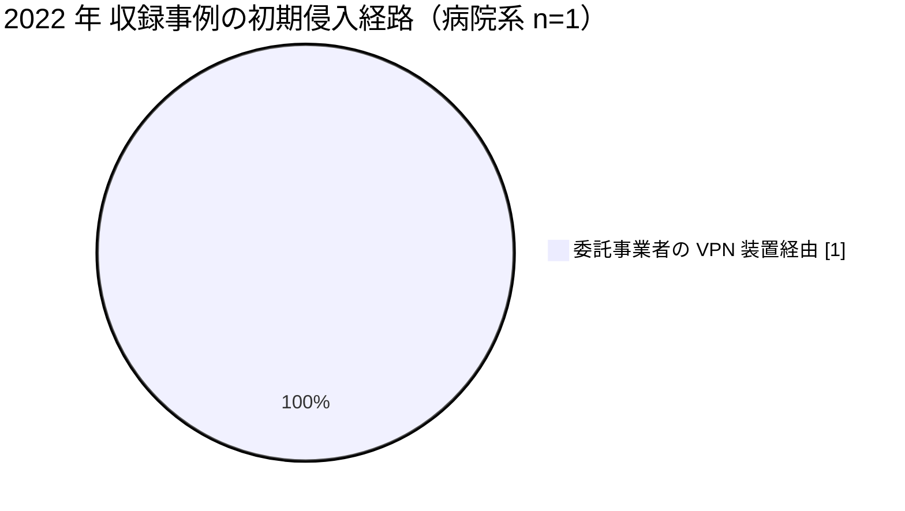

# 🇯🇵 国内の事例 2022 年（サマリー）

> [!NOTE]
> 本ページの集計は、断りのない限り**本リポジトリに収録した事例**を母集団とする。
> 国内で発生した被害の全数ではない。
> 外部統計を引くときは、その出典を併記する。
> 個別の経緯は [2022 年の履歴](2022-timeline.md) を参照してほしい。

## その年の要点

**分析**：侵入の起点が、病院の外側に移った年である。
[JP-2022-01 大阪急性期・総合医療センター](2022-timeline.md#JP-2022-01)では、給食提供事業者のネットワークが経路になった。
前年の[半田病院](2021-timeline.md#JP-2021-01)が自院の VPN 装置を起点としていたのに対し、この事案は自院のパッチ管理だけでは防げない構造を示した。
医療機関の攻撃対象領域が委託先まで広がることが、調査報告書という形で裏づけられた。

## 外部統計

| 統計 | 参照先 | 本リポジトリでの集計状況 |
|---|---|---|
| ランサムウェア被害の報告件数（業種別、半期ごと） | [警察庁 サイバー空間をめぐる脅威の情勢等](https://www.npa.go.jp/publications/statistics/cybersecurity/index.html) | 未集計 |
| 医療分野のインシデント動向 | [IPA 情報セキュリティ白書](https://www.ipa.go.jp/security/publications/hakusyo/index.html) | 未集計 |

数値は原典を確認したうえで追記する。

## 収録事例の集計

### 区分別の件数

| 区分 | 件数 | 内訳 |
|---|---|---|
| 病院系 | 1 | 公立の急性期病院 1 |
| 製薬企業系 | 0 | 収録なし |
| 医療関連事業者 | 0 | 収録なし（委託先の被害は病院系の事例に含めて記録） |

### 初期侵入経路の内訳（病院系）

### 診療への影響

| 区分 | 組織 | 停止した範囲 | 通常復旧までの期間 |
|---|---|---|---|
| 病院系 | 大阪急性期・総合医療センター | 電子カルテを含む基幹システム、外来診療と手術 | 約 2 か月半（2022 年 10 月から 2023 年 1 月） |

## この年を象徴する事例

- [JP-2022-01 大阪急性期・総合医療センター](2022-timeline.md#JP-2022-01)：委託事業者経由の侵入が、調査報告書で経路まで示された事例

## 規制と制度の動き

本年について、本リポジトリで整理した動きはない。
翌 2023 年 4 月の医療法施行規則改正により、医療情報システムの安全管理措置が法令上の義務になる（[国内のガイドラインと法規制](../../../guidelines/japan.md)）。

## 前年との差分

**分析**：収録件数は前年と同じ 1 件だが、侵入の起点が自院の境界機器から委託先へ移った。
対策の対象が、自院の資産管理から委託先の接続管理へ広がることを意味する。
委託先を含めた対策は [防御プレイブック](../../actors/defense-playbook.md) に整理している。

---

[← 2021 年サマリー](2021-summary.md) | [2022 年の履歴](2022-timeline.md) | [国内の事例](README.md) | [2023 年サマリー →](2023-summary.md) | [トップへ](../../../../README.md)
