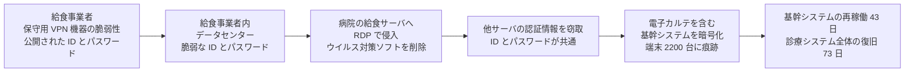

# 🇯🇵 国内の事例 2022 年（履歴）

> [!NOTE]
> **表記ルール**：本ページでは、**事実**（一次情報で確認できる内容。出典を併記する）、**報道ベース**（報道や第三者の集計のみで確認でき、当事者の公表資料では裏付けが取れていない内容）、**分析**（筆者の解釈）を書き分ける。
> [対象の区分](../README.md#対象の区分)と[一次情報の強度](../README.md#一次情報の強度)の定義は、インシデント事例集のトップにまとめている。
> その年の情勢と集計は [2022 年の情勢](../years/2022-summary.md) にまとめている。

## 収録件数

| 区分 | サイバー攻撃 | その他の事案 |
|---|---|---|
| 病院系 | 12 | 11 |
| 製薬企業系 | 0 | 0 |
| 医療関連事業者 | 6 | 6 |

収録は本リポジトリが一次情報を確認できた事案に限る。
国内で公表された医療関連の事案がこれで尽きることを示すものではない。
警察庁の集計では、この年のランサムウェア被害の報告件数のうち医療、福祉が 20 件で第 3 位であった（[日本の統計](../../statistics/japan.md#業種別内訳における医療福祉)）。

---

## 病院系

| ID | 発生時期 | 組織 | 種別 | 初期侵入経路 | 診療への影響 | 業務停止期間 | 一次情報の強度 |
|---|---|---|---|---|---|---|---|
| [JP-2022-04](#JP-2022-04) | 2022-01 | 医療法人陽和会 春日井リハビリテーション病院、附属クリニック（愛知県春日井市） | 不正アクセス（疑い） | 未公表 | 電子カルテと医事会計のプログラムに不具合 | すべてのサーバを一時停止（復旧時期は未公表） | 当事者公表 |
| [JP-2022-05](#JP-2022-05) | 2022-02 | 名古屋大学医学部附属病院 | 不正アクセス（メールアカウント） | パスワードへの総当たり攻撃 | 公表なし | 診療の停止は公表されていない | 当事者公表 |
| [JP-2022-16](#JP-2022-16) | 2022-02 | 社会医療法人大雄会（愛知県一宮市） | マルウェア感染（Emotet） | 未公表 | 公表なし | 診療の停止は公表されていない | 当事者公表 |
| [JP-2022-17](#JP-2022-17) | 2022-03 | 医療法人健昌会 | マルウェア感染（Emotet） | 他企業から受信したメール | 公表なし | 診療の停止は公表されていない | 当事者公表 |
| [JP-2022-06](#JP-2022-06) | 2022-04 | 医療法人ラポール会 青山病院（岐阜県各務原市） | 不正アクセス | 未公表 | 公表なし | システムの一部に障害（復旧時期は未公表） | 当事者公表 |
| [JP-2022-07](#JP-2022-07) | 2022-05 | 日本赤十字社 秋田赤十字病院 | マルウェア感染（Emotet） | 職員が受信したメール | 公表なし | 診療の停止は公表されていない | 当事者公表 |
| [JP-2022-08](#JP-2022-08) | 2022-05 | 医療法人社団幸紀会 安江病院（岐阜県） | 不正アクセス | 未公表 | 患者情報のデータベースへアクセスできなくなった | データベースの停止（バックアップから復旧） | 当事者公表 |
| [JP-2022-02](#JP-2022-02) | 2022-06 | 医療法人久仁会 鳴門山上病院（徳島県鳴門市） | ランサムウェア（LockBit 2.0） | 未公表 | 電子カルテと院内 LAN が使用不能。外来を再来患者に限定 | 電子カルテと院内 LAN の停止（復旧時期は未公表） | 当事者公表 |
| [JP-2022-03](#JP-2022-03) | 2022-10 | 田沢医院（静岡県沼津市） | ランサムウェア | 未公表 | 電子カルテが使用不能。紙カルテへ切り替えて診療を継続 | 電子カルテの停止（復旧時期は未公表） | 報道のみ |
| [JP-2022-01](#JP-2022-01) | 2022-10 | 大阪急性期・総合医療センター | ランサムウェア | 給食提供事業者に設置された保守用 VPN 装置 | 電子カルテ停止、外来診療と手術の大幅な制限 | 基幹システムの再稼働に **43 日**、診療システム全体の復旧に **73 日**。通常診療の再開は 2023-01-11 | 報告書 |
| [JP-2022-09](#JP-2022-09) | 2022-12 | 医療法人社団博友会 金沢西病院（石川県金沢市） | 不正アクセス | 未公表 | 電子カルテの一部の機能が利用できなくなった | 外来の再開は 2023-02（[2023 年](2023-timeline.md)に続報） | 当事者公表 |
| [JP-2022-10](#JP-2022-10) | 2022-12 | 公立大学法人奈良県立医科大学 | 不正アクセス（クラウドのアカウント） | 職員のアカウントのパスワードが窃取された | 公表なし | 診療の停止は公表されていない | 当事者公表 |

### JP-2022-04 医療法人陽和会 春日井リハビリテーション病院、附属クリニック（2022 年 1 月）

**事実**

- 発生時期：2022 年 1 月 12 日。1 月 19 日に公表した。
- 対象組織：愛知県春日井市の医療法人陽和会 春日井リハビリテーション病院と附属クリニック。
- 攻撃種別：不正アクセスの疑い。同院は「外部からの不正アクセス（疑い）」と表現している。
- 初期侵入経路：未公表。
- 侵害範囲：電子カルテシステムと医事会計システムのプログラムに不具合が生じた。
- 情報流出：公表資料の範囲では確認されていない。
- 診療への影響：対応としてすべてのサーバをいったん停止した。
- 業務停止期間：復旧の完了時期は公表されていない。
- 公表された対策：経過を自院のサイトで公表した。

**分析**

- この年の 1 月に起きているが、公表資料では「ランサムウェア」の語を使っていない。暗号化が確認できたかどうかにかかわらず、電子カルテと医事会計のプログラムが動かなくなる点で、現場の影響は同じである。名称の確定を待つと公表は遅れる。
- 停止したのは電子カルテと医事会計の両方である。医事会計が止まると、診療そのものが続いても請求ができない。診療報酬の請求は診療月の翌月 10 日が期限で、支払いは翌々月であるため、影響は復旧後の入金の遅れとして現れる（[請求サイクル](../../actors/ransomware-chain.md#診療報酬の請求サイクル)、[予算とコスト](../../../governance/cost.md)）。
- 全サーバの停止は、被害の拡大を止める手段として妥当だが、停止した状態から何を先に戻すかを決めていないと復旧は長引く。復旧の優先順位は、事前に決めておく対象である（[サイバー攻撃を想定した BCP](../../../response/bcp-cyber.md)）。

**一次情報**

- [不正アクセス（疑い）によるシステム障害発生のお知らせ](https://www.kreh.or.jp/2022/01/19/3837/)（春日井リハビリテーション病院、附属クリニック、2022 年 1 月 19 日）

---

### JP-2022-05 名古屋大学医学部附属病院（2022 年 2 月）

**事実**

- 発生時期：2022 年 2 月 24 日に公表した。
- 対象組織：国立大学法人東海国立大学機構 名古屋大学医学部附属病院。
- 攻撃種別：不正アクセス。教職員のメールアカウントが対象。
- 初期侵入経路：パスワードへの総当たり攻撃（ブルートフォース攻撃）によって認証が突破された。
- 侵害範囲：**3 件**のアカウントで不審なアクセスを検知した。海外の IP アドレスからのアクセスを確認した。個人情報を含むメールの内容が閲覧された可能性がある。
- 発覚の経緯：実在する教職員のメールアドレスをかたる不審メールの報告を受けて調査を始めた。
- 診療への影響：公表されていない。

**分析**

- 総当たり攻撃が通ったということは、試行の回数に制限がかかっていなかったか、パスワードが短かったかのいずれかである。前者であれば、ログには大量の失敗が残っていたはずである。検知の起点が外部からの報告になったのは、その記録が読まれていなかったことを示す（[ログと監視の設計](../../../technology/logging.md)）。
- 同じ年の 12 月に、[奈良県立医科大学](#JP-2022-10)でも職員のクラウドアカウントが乗っ取られている。大学病院は、診療系を分離していても、教職員のメール基盤は大学と共通であることが多い。攻撃面は病院単独では閉じない。
- 多要素認証を必須にしていれば、パスワードの強度にかかわらず総当たりは通らない（[認証とアクセス管理](../../../technology/identity.md)）。

**一次情報**

- [名古屋大学医学部附属病院](https://www.med.nagoya-u.ac.jp/hospital/)
- [名古屋大学医学部附属病院の教職員メールアカウントにブルートフォース攻撃、個人情報が記載されたメールを閲覧された可能性](https://scan.netsecurity.ne.jp/article/2022/03/01/47206.html)（ScanNetSecurity による当事者公表の報道）

---

### JP-2022-16 社会医療法人大雄会（2022 年 2 月）

**事実**

- 発生時期：2022 年 2 月 8 日に不審メールを発見し、2 月 9 日に感染を公表した。
- 対象組織：愛知県一宮市の社会医療法人大雄会。
- 攻撃種別：マルウェア感染（Emotet 系）。
- 初期侵入経路：未公表。
- 侵害範囲：法人内の一部のパソコン。台数は公表されていない。実在する部署名または職員名をかたるなりすましメールが出回った。
- 診療への影響：公表されていない。
- 公表された対策：感染を特定して公表し、関係者へ注意を呼びかけた。

**分析**

- 感染の確認から公表まで 1 日である。この年の 2 月から 3 月にかけて、国内では Emotet が大きく再流行した。なりすましメールは感染の直後から出回るため、告知の速さがそのまま取引先の被害を左右する。
- 「実在する部署名または職員名をかたる」点が、この型の危険の核である。窃取したメール履歴から差出人と件名を組み立てるため、受け取る側からは通常のやり取りと区別できない（[メールとドメインの管理](../../../technology/email-domain.md)）。

**一次情報**

- [社会医療法人大雄会](https://www.daiyukai.or.jp/)
- [医療法人のパソコンが Emotet 感染、実在する部署や職員名を騙った不審メールを確認](https://scan.netsecurity.ne.jp/article/2022/02/16/47145.html)（ScanNetSecurity による当事者公表の報道）

---

### JP-2022-17 医療法人健昌会（2022 年 3 月）

**事実**

- 発生時期：2022 年 3 月 2 日に感染を確認し、3 月 7 日に公表した。
- 対象組織：医療法人健昌会。
- 攻撃種別：マルウェア感染（Emotet）。
- 初期侵入経路：他の企業から受信したメールを経由して感染したことが、調査で判明した。
- 侵害範囲：法人内のパソコン **1 台**。同法人になりすました不審メールが複数送信された。
- 診療への影響：公表されていない。
- 公表された対策：感染の確認後、公表して周知し謝罪した。

**分析**

- 感染の経路が「他の企業からのメール」と特定されている。取引先の感染が自組織へ伝播し、そこからさらに次の相手へ広がる。Emotet の被害は、組織単位ではなく取引の連なりの単位で数えるほうが実態に近い。
- 感染したのは 1 台である。それでも、なりすましメールは複数送信された。被害の大きさは、感染した台数ではなく、その端末が持っていたメール履歴の量で決まる。

**一次情報**

- [医療法人健昌会](https://www.kenshokai.or.jp/)
- [医療法人のパソコンが Emotet 感染、他企業からのメールで感染したことが判明](https://scan.netsecurity.ne.jp/article/2022/03/14/47293.html)（ScanNetSecurity による当事者公表の報道）

---

### JP-2022-06 医療法人ラポール会 青山病院（2022 年 4 月）

**事実**

- 発生時期：2022 年 4 月 23 日未明。4 月 27 日に公表し、その後も続報を出した。
- 対象組織：岐阜県各務原市の医療法人ラポール会 青山病院。
- 攻撃種別：不正アクセス。
- 初期侵入経路：未公表。
- 侵害範囲：システムの一部に障害が発生した。詳細は公表されていない。
- 診療への影響：公表資料では明示されていない。
- 公表された対策：経過を段階的に公表した。

**分析**

- 同じ岐阜県で、翌月に[安江病院](#JP-2022-08)が同種の被害を公表している。県内の医療機関で連続した点は、共通する構成や共通する保守事業者の有無を問う材料になるが、当事者の公表資料では触れられていない。
- 「システムの一部に障害」という表現にとどまり、電子カルテが動いていたかどうかは読み取れない。公表の粒度が粗いと、他の医療機関が自組織を点検する材料にならない。

**一次情報**

- [医療法人ラポール会 青山病院](https://www.aoyama-med.gr.jp/)
- [システム障害は不正アクセスによるもの、青山病院が第 3 版のリリース公開](https://scan.netsecurity.ne.jp/article/2022/05/10/47564.html)（ScanNetSecurity による当事者公表の報道）

---

### JP-2022-02 医療法人久仁会 鳴門山上病院（2022 年 6 月）

**事実**

- 発生時期：2022 年 6 月 19 日 17 時 40 分ごろ。
- 対象組織：徳島県鳴門市の医療法人久仁会 鳴門山上病院。
- 攻撃種別：ランサムウェア（LockBit 2.0）。
- 初期侵入経路：未公表。
- 侵害範囲：電子カルテと院内 LAN システムが使用不能になった。
- 発覚の経緯：プリンタから大量の用紙が排出され、端末が自動で再起動する事象が続いたのち、感染を宣言する画面が表示された。
- 診療への影響：受付業務と処方に支障が生じたため、6 月 20 日の外来診療を**再来患者に限定**した。入院と入所の患者はほぼ通常どおり対応し、訪問リハビリ、訪問看護、訪問診療もおおむね通常どおり対応した。
- 業務停止期間：復旧の完了時期は公表されていない。
- 公表された対策：行政と関係機関の支援を受けて原因の究明と復旧にあたり、第 1 報から続報を自院のサイトで段階的に公表した。

**分析**

- 同じ徳島県で、前年の[半田病院](2021-timeline.md#JP-2021-01)と同じ LockBit 2.0 による被害が起きた。県内で報告書が公表された直後の時期にあたる。公表された情報が、同じ地域の他の医療機関の防御に間に合っていない。
- 外来を再来患者に限り、入院と訪問系のサービスは維持した。何を止めて何を維持するかの判断が、発生翌日に示されている。この配分を事前に決めていたかどうかが、初動の速さに現れる（[サイバー攻撃を想定した BCP](../../../response/bcp-cyber.md)）。
- 発覚の端緒がプリンタの一斉印字である点も、半田病院と共通する。攻撃者が意図的に可視化した時点で、暗号化はすでに終わっている。

**一次情報**

- [サイバー攻撃による被害について（第 1 報）](https://kyujinkai-mc.or.jp/info/20220620/)（医療法人久仁会 鳴門山上病院、2022 年 6 月 20 日）
- [医療法人久仁会 鳴門山上病院](https://kyujinkai-mc.or.jp/)

---

### JP-2022-07 日本赤十字社 秋田赤十字病院（2022 年 5 月）

**事実**

- 発生時期：2022 年 5 月 20 日に院長名で公表した。
- 対象組織：日本赤十字社 秋田赤十字病院。
- 攻撃種別：マルウェア感染（Emotet）。複数のパソコンが感染した。
- 初期侵入経路：職員が受信したメール。
- 侵害範囲：感染した端末を起点に、同院の職員を装った不審メールが送信された。感染した台数と流出した情報の詳細は公表されていない。
- 診療への影響：公表されていない。
- 公表された対策：自院のサイトで、不審メールへの注意を呼びかけた。

**分析**

- Emotet はこの年の 2 月から 3 月にかけて国内で大きく再流行した。医療分野では、[株式会社グッドマン](#JP-2022-11)、複数の医療法人、研究機関が相次いで感染を公表している。2020 年 9 月に[日本医師会](2020-timeline.md#JP-2020-09)から窃取された情報が、この再流行で使い回された例も確認されている。
- 公表の主体が院長名である。マルウェア感染の告知は情報システム部門の所管として扱われやすいが、外部へ向けた注意喚起は病院としての判断になる。
- 感染の防止より、なりすましメールの送信が始まったあとの告知の速さが、取引先の被害を左右する（[メールとドメインの管理](../../../technology/email-domain.md)）。

**一次情報**

- [当院職員を装った不審なメールについて](http://akita-med.jrc.or.jp/archive/news/1592)（日本赤十字社 秋田赤十字病院）

---

### JP-2022-08 医療法人社団幸紀会 安江病院（2022 年 5 月）

**事実**

- 発生時期：2022 年 5 月 27 日に検知した。5 月 30 日に個人情報保護委員会へ報告し、6 月 8 日に専門機関へ調査を依頼した。7 月 4 日に公表した。
- 対象組織：岐阜県の医療法人社団幸紀会と幸紀会 安江病院。
- 攻撃種別：不正アクセス。
- 初期侵入経路：未公表。
- 侵害範囲：患者情報のデータベースへアクセスできなくなった。
- 情報流出：最大 **11 万人以上**の個人情報が流出した可能性がある。公表の時点で二次被害は確認されていない。
- 診療への影響：公表資料では明示されていない。
- 業務停止期間：サーバのバックアップから復旧した。復旧の完了時期は公表されていない。
- 公表された対策：岐阜県警察と厚生労働省へ報告し、個人情報保護委員会へ届け出た。第三者の専門機関へ調査を依頼した。

**分析**

- 11 万人以上という規模は、この年に国内で公表された医療機関の事案では最大である。同じ年の[大阪急性期・総合医療センター](#JP-2022-01)は診療の停止の長さで注目されたが、流出の可能性がある人数はこちらが上回る。停止の長さと流出の規模は、別の軸である。
- 検知から公表まで約 5 週間かかっている。その間に、個人情報保護委員会への報告と外部調査の依頼を済ませている。速報を出さずに調査を待つ判断は、対象者が自衛する時間を削る。
- バックアップから復旧できている。暗号化された場合でも、オフラインのバックアップがあれば復旧の見通しは立つ。復旧できることと、流出しないことは別である（[完全性への攻撃と患者安全](../../integrity-attacks.md)）。

**一次情報**

- [医療法人社団幸紀会 安江病院](https://scan.netsecurity.ne.jp/article/2022/07/06/47850.html)（ScanNetSecurity による当事者公表の報道。同院の公表 PDF へのリンクを含む）

---

### JP-2022-03 田沢医院（2022 年 10 月）

**報道ベース**

- 発生時期：2022 年 10 月 27 日。
- 対象組織：静岡県沼津市の医院。
- 攻撃種別：ランサムウェア。
- 初期侵入経路：未公表。
- 侵害範囲：診療記録と予約情報が暗号化され、電子カルテシステムが利用できなくなった。英文で「データを暗号化した。解いてほしければ金銭を払う必要がある」旨のメッセージが届いた。
- 情報流出：確認されていないとされた。
- 診療への影響：紙カルテへ切り替えて診療を継続した。
- 公表：医院は 2022 年 11 月 1 日に被害を公表した。

**分析**

- [大阪急性期・総合医療センター](#JP-2022-01)の 4 日前に、同じ国内で無床の医院が被害を受けた。攻撃者は規模で標的を選んでいない。
- 診療所は情報システムの担当者を置けない。ベンダの保守に依存する構造は病院と同じだが、契約の内容と交渉力が異なる。小規模組織向けの論点は[小規模組織の現実解](../../../governance/small-organizations.md)に整理している。

**一次情報**

- 当事者の公表資料は本リポジトリで未確認。確認でき次第、経緯と対策を追記する。
- [「戻してほしいなら金払え」…医療機関に「ランサムウェア」ウイルス 電子カルテのアプリ起動せず](https://look.satv.co.jp/content_news/incident/8524)（静岡朝日テレビによる報道、2022 年 11 月 11 日）

---

### JP-2022-01 大阪急性期・総合医療センター（2022 年 10 月）

**事実**

以下は、同センターの情報セキュリティインシデント調査委員会が 2023 年 3 月 28 日に公表した調査報告書による。

- 発生時期：2022 年 10 月 31 日。
- 対象組織：大阪府立病院機構が運営する高度急性期病院。
- 攻撃種別：ランサムウェア。
- 初期侵入経路：**給食事業者が設置、運営する給食システムに、情報基盤構築事業者がリモート保守のために設置した VPN 機器の脆弱性**を用いて侵入された。報告書は、漏えいして公開されていた ID とパスワードを用いた侵入の可能性も併記している。当該の VPN 機器のバージョンは 5.4.8 であった。
- 攻撃の経路：報告書が示す手順は次のとおりである。

| 段階 | 攻撃者の手順 |
|---|---|
| 1 | 給食事業者の VPN 機器の脆弱性を用いて侵入 |
| 2 | 給食事業者内のデータセンターの ID とパスワードが脆弱だったため、システム情報（IP アドレス、パスワード情報）を窃取 |
| 3 | 窃取した認証情報で、RDP 通信により病院の給食サーバへ侵入。ウイルス対策ソフトをアンインストール |
| 4 | 給食サーバを踏み台に、病院内の他サーバの認証情報を窃取。**給食サーバと他サーバの ID とパスワードが共通**であったため容易であった |
| 5 | 電子カルテを含む基幹システムのサーバへ侵入 |
| 6 | 侵入したサーバを経由して、端末へのログオンを試行 |
| 7 | 各サーバでランサムウェアを実行し、永続化して脅迫文を表示 |

- 侵害範囲：電子カルテを含む基幹システムのサーバの大部分が暗号化された。院内の PC 端末約 **2200 台**にも不正アクセスの痕跡が確認された。すべてのサーバと端末をクリーンインストールした。
- 情報流出：通信ログの調査とフォレンジック調査から、個人情報の漏えいの可能性は極めて低いとされた。
- 診療への影響：外来診療と手術が大幅に制限された。2022 年 11 月の診療実績は、新入院患者数 558 人（前年同月比 33.3%）、延入院患者数 1 万 0191 人（同 52.9%）、初診患者数 465 人（同 17.9%）、延外来患者数 1 万 5744 人（同 61.6%）であった。
- 業務停止期間：基幹システムのサーバの再稼働に **43 日間**、部門システムを含む診療システム全体の復旧に **73 日間**を要した。電子カルテサーバの再稼働は 2022 年 12 月 12 日、診療機能の完全復旧は 2023 年 1 月 11 日である。
- 代替運用：紙による運用へ切り替え、外来は救急と再診の一部に限って継続した。
- 身代金：**支払わなかった**。システムの復旧と再構築を実施した。
- 被害額：調査と復旧の費用で数億円以上、診療制限に伴う逸失利益として十数億円以上を見込むと報告書は記載している。

**教訓（分析）**

| 論点 | 示唆 |
|---|---|
| サプライチェーン | 医療機関の攻撃対象領域は、院内で完結しない。給食、検査、清掃、保守など、あらゆる委託先との接続が侵入経路になりうる |
| 接続先の可視化 | 「誰が、どこから、どのシステムに、どの権限で接続しているか」の棚卸しが最初の一歩になる（[攻撃面](../../../practice/attack-surface.md)） |
| 委託契約 | 委託先に対するセキュリティ要件（パッチ適用、MFA、ログ提供義務）を契約に落とし込む必要がある（[委託先への依存](../../../response/dependencies.md)） |
| 相互接続の分離 | 委託先との接続は、必要最小限のセグメント、ポート、期間に限定する（[ネットワークの分離](../../../technology/segmentation.md)） |
| 認証情報の共通化 | 給食サーバと他サーバで ID とパスワードが共通であったことが、水平展開を容易にした。同じ構造は 2 年後の[岡山県精神科医療センター](2024-timeline.md#JP-2024-01)でも現れる |
| 復旧の内訳 | 基幹システムの再稼働 43 日と、診療システム全体の復旧 73 日には 30 日の差がある。電子カルテが戻っても、部門システムが揃わなければ診療は元に戻らない |
| 被害の測り方 | 逸失利益（十数億円以上）が、調査と復旧の費用（数億円以上）を上回る。復旧を早める投資は、費用の削減ではなく逸失利益の削減で評価するほうが実態に合う（[予算とコスト](../../../governance/cost.md)） |

**一次情報**

- [大阪急性期・総合医療センター 情報セキュリティインシデント調査報告書 概要（PDF）](https://www.gh.opho.jp/pdf/reportgaiyo_v01.pdf)（調査委員会、2023 年 3 月 28 日）
- [大阪急性期・総合医療センター](https://www.gh.opho.jp/)

---

### JP-2022-09 医療法人社団博友会 金沢西病院（2022 年 12 月）

**事実**

- 発生時期：2022 年 12 月 3 日。12 月 8 日に公表した。
- 対象組織：石川県金沢市の医療法人社団博友会 金沢西病院。
- 攻撃種別：不正アクセス。第三者による侵入と説明している。
- 初期侵入経路：未公表。
- 侵害範囲：電子カルテシステムの一部の機能が利用できなくなった。
- 診療への影響：電子カルテの一部が参照できない状態が続いた。
- 業務停止期間：2023 年 2 月に、電子カルテを用いた外来診療を再開したと公表している（[2023 年 国内の事例](2023-timeline.md)）。発生から **約 2 か月**にあたる。
- 公表された対策：経過を自院のサイトで段階的に公表した。

**分析**

- 発生から外来の再開まで約 2 か月かかっている。同じ年の[大阪急性期・総合医療センター](#JP-2022-01)の 73 日、前年の[つるぎ町立半田病院](2021-timeline.md#JP-2021-01)の約 2 か月と、規模の異なる病院で同じ長さになっている。復旧の期間は病床数に比例しない。
- 電子カルテの「一部の機能」が使えない状態が長く続いた。全面停止でも全面復旧でもない期間が本体である。この期間をどう回すかが、事前の計画の対象になる（[サイバー攻撃を想定した BCP](../../../response/bcp-cyber.md)）。

**一次情報**

- [医療法人社団博友会 金沢西病院 お知らせ](https://www.knh.or.jp/news/)
- [金沢西病院に不正アクセス、電子カルテの一部が閲覧できない状況に](https://scan.netsecurity.ne.jp/article/2022/12/12/48620.html)（ScanNetSecurity による当事者公表の報道）

---

### JP-2022-10 公立大学法人奈良県立医科大学（2022 年 12 月）

**事実**

- 発生時期：2022 年 12 月 21 日に公表した。
- 対象組織：公立大学法人奈良県立医科大学。
- 攻撃種別：不正アクセス。職員が利用する Microsoft 365 への不正ログイン。
- 初期侵入経路：職員へ付与したアカウントのパスワードが窃取された。窃取の手口は公表されていない。
- 侵害範囲：当該アカウントから迷惑メール **1120 件**が送信された。個人情報が漏えいした可能性にも言及している。
- 診療への影響：公表されていない。
- 公表された対策：経緯を大学のサイトで公表した。

**分析**

- 乗っ取られたアカウントは、迷惑メールの送信に使われた。攻撃者にとっての価値は、大学のドメインから送れることにある。医療機関と大学のドメインは、受信側のフィルタを通りやすい（[メールとドメインの管理](../../../technology/email-domain.md)）。
- 同じ年の 2 月に[名古屋大学医学部附属病院](#JP-2022-05)で総当たり攻撃によるアカウント侵害が起きている。国内の大学病院では、この年、クラウドのメール基盤が繰り返し侵害された。
- 1120 件という送信数は、検知までの時間の指標になる。送信数の急増を検知して自動で止める設定は、クラウド側の機能として用意されている。

**一次情報**

- [本学職員が利用するクラウドサービスへの不正ログインについて](https://www.naramed-u.ac.jp/university/oshirase/reiwa4nendo/20221221_fusei.html)（奈良県立医科大学、2022 年 12 月 21 日）

---

## 製薬企業系

本年の収録はない。
一次情報を確認できた事案が見つかっていないだけで、被害がなかったことを示すものではない。

---

## 医療関連事業者

[JP-2022-01](#JP-2022-01) の調査報告書は、侵入の起点となった給食提供事業者を名指ししていない。
同じ日に被害を公表した給食提供施設「ベルキッチン」（[JP-2022-14](#JP-2022-14)）について、報道では同センターへ給食を提供する事業者にあたるとされ、病院側は給食委託事業者のサーバから侵入された可能性が高いと説明している。
運営する社会医療法人生長会は、両者の関係は調査中としている（**報道ベース**）。
本リポジトリは両者を別の事例として収録し、委託先経由の侵入という構造は病院系の事例の側に記録している。

| ID | 発生時期 | 組織 | 種別 | 初期侵入経路 | 影響 | 一次情報の強度 |
|---|---|---|---|---|---|---|
| [JP-2022-11](#JP-2022-11) | 2022-03 | 株式会社グッドマン（医療用具の製造、販売、名古屋市） | マルウェア感染（Emotet） | 社内のパソコン | 従業員を装う不審メールが送信された。インターネット接続を一時停止し、メールの送受信を 2 日後に再開 | 当事者公表 |
| [JP-2022-18](#JP-2022-18) | 2022-03 | 公益社団法人岡山県医師会 | 不正アクセス（ウェブサーバ） | 未公表 | 生涯教育の申請時に入力されたメールアドレスが流出した可能性。不正アクセスは 4 分間 | 当事者公表 |
| [JP-2022-12](#JP-2022-12) | 2022-06 | 株式会社日経 BP（医療従事者向けサイト「日経メディカル Online」） | 不正アクセス | 未公表（海外の IP アドレスからの攻撃） | 会員登録情報の一部が窃取された可能性。電子ギフト券のコードの流出も確認 | 当事者公表 |
| [JP-2022-13](#JP-2022-13) | 2022-08 | 株式会社トーカイ（病院関連の受託、介護用品のレンタル、岐阜市） | 不正アクセス | 未公表 | 公表の時点で情報の流出は確認されていない。外部との通信を遮断した | 当事者公表 |
| [JP-2022-14](#JP-2022-14) | 2022-10 | 社会医療法人生長会（給食提供施設「ベルキッチン」） | ランサムウェア | 未公表 | 給食の提供時間に遅れが生じた。サーバ 3 台と NAS 3 台が暗号化された | 当事者公表 |
| [JP-2022-15](#JP-2022-15) | 2022-11 | 宮崎市社会福祉協議会（介護認定調査事務所） | ランサムウェア | 未公表 | 要介護、要支援の認定調査業務のサーバに保存された情報へアクセスできなくなった | 当事者公表 |

### JP-2022-11 株式会社グッドマン（2022 年 3 月）

**事実**

- 発生時期：2022 年 3 月 4 日に感染を確認して公表した。3 月 15 日にインターネット接続の停止を公表し、3 月 17 日にメールの送受信を再開した。
- 対象組織：医療用具を扱う株式会社グッドマン（名古屋市）。
- 攻撃種別：マルウェア感染（Emotet）。
- 初期侵入経路：社内のパソコン。
- 侵害範囲：同社の従業員を装った不審メールが送信された。対象のドメインは `goodmankk.com` と `g-hits.co.jp`。ウェブサイトにも影響が及んだ。
- 公表された対策：インターネット接続を一時停止した。受信者に対し、添付ファイルを開かず URL もクリックせずにメールごと削除するよう呼びかけた。

**分析**

- 対策としてインターネット接続そのものを止めている。感染の封じ込めとしては確実だが、受注と出荷の連絡も同時に止まる。医療用具の販売事業者では、この停止が取引先の医療機関の在庫に直結する。
- 3 月 4 日の公表から 3 月 17 日のメール再開まで、2 週間近くを要した。Emotet の被害では、駆除より「安全だと確認したうえで通信を戻す」工程が長い。

**一次情報**

- [株式会社グッドマン](https://www.goodman.jp/)
- [医療用具取扱いのグッドマンがマルウェアに感染、メールとウェブサイトを停止](https://scan.netsecurity.ne.jp/article/2022/03/18/47328.html)（ScanNetSecurity による当事者公表の報道）

---

### JP-2022-18 公益社団法人岡山県医師会（2022 年 3 月）

**事実**

- 発生時期：2022 年 3 月 31 日 22 時 47 分から 22 時 51 分まで。4 月 1 日に公表した。
- 対象組織：公益社団法人岡山県医師会。
- 攻撃種別：不正アクセス。同会のウェブサイトのサーバが対象。
- 初期侵入経路：未公表。
- 侵害範囲：生涯教育の申請の際に入力されたメールアドレスが流出した可能性がある。
- 公表された対策：経緯を自会のサイトで公表した。

**分析**

- 不正アクセスが行われたのは **4 分間**である。時刻を分単位で公表できたのは、ウェブサーバのアクセスログが保存され、事後に読める状態にあったためである（[ログと監視の設計](../../../technology/logging.md)）。
- 流出した可能性があるのは、生涯教育を申請した医師のメールアドレスである。県内の医師の連絡先の名簿にあたる。医師会は患者情報を持たないが、医療機関へ届く標的型メールの宛先を持つ。2020 年の[日本医師会](2020-timeline.md#JP-2020-09)、2023 年の[医療 ISAC](2023-timeline.md#JP-2023-07) と同じ位置にある組織である。

**一次情報**

- [公益社団法人岡山県医師会](https://www.okayama.med.or.jp/)
- [岡山県医師会の Web サーバに不正アクセス、メールアドレスが流出した可能性](https://scan.netsecurity.ne.jp/article/2022/04/07/47424.html)（ScanNetSecurity による当事者公表の報道）

---

### JP-2022-12 株式会社日経 BP「日経メディカル Online」（2022 年 6 月）

**事実**

- 発生時期：2022 年 6 月 21 日午後に会員アカウントへの不正アクセスが行われ、6 月 24 日に第一報を公表した。その後、6 月 28 日以降に海外の IP アドレスからの攻撃を受け、7 月 3 日に追加の発表を行った。
- 対象組織：株式会社日経 BP が運営する医療従事者向けサイト「日経メディカル Online」。
- 攻撃種別：不正アクセス。海外の IP アドレスからの攻撃と説明している。
- 侵害範囲：第一報の時点で、会員 **559 人**のアカウントへの不正アクセスと、**50 人**分の電子ギフト券のコードの不正な読み取りを確認した。6 月 28 日以降の攻撃では、**4000 件**を超える会員登録情報の一部が盗まれた可能性があると説明した。
- 公表された対策：7 月 3 日にサイトを一時停止し、全会員 **約 88 万人**のパスワードを初期化した。会員へパスワードの変更を呼びかけた。

**分析**

- 会員は医師をはじめとする医療従事者である。氏名、勤務先、専門領域が揃った名簿は、医療機関を狙う標的型メールの宛先として直接使える。医療分野のメディアと学会は、患者情報を持たなくても攻撃価値が高い（[外部から見た自組織の攻撃面](../../../practice/attack-surface.md)）。
- 同種の構図は、2024 年の日本放射線技術学会のメールマガジン登録者情報の公開、2021 年の[科研製薬](2021-timeline.md#その他の事案サイバー攻撃以外)の講演会登録者の誤送信でも現れている。医療従事者の名簿は、医療機関の外側で管理されている量のほうが多い。

**一次情報**

- [日経メディカル Online への不正アクセスについて](https://www.nikkeibp.co.jp/atcl/newsrelease/corp/20220624/)（株式会社日経 BP、2022 年 6 月 24 日）
- [「日経メディカル Online」への不正アクセスについて](https://www.nikkeibp.co.jp/atcl/newsrelease/corp/20220703/)（株式会社日経 BP、2022 年 7 月 3 日）

---

### JP-2022-13 株式会社トーカイ（2022 年 8 月）

**事実**

- 発生時期：2022 年 8 月 6 日夜。8 月 10 日に公表した。
- 対象組織：病院関連の受託事業と介護用品のレンタルを手がける株式会社トーカイ（岐阜市、東証プライム上場）。
- 攻撃種別：不正アクセス。同社のサーバが対象。
- 初期侵入経路：未公表。
- 情報流出：公表の時点では確認されていない。
- 公表された対策：外部との通信を遮断し、対策を行った。

**分析**

- 病院向けの寝具、給食、清掃などの受託と、介護用品のレンタルを担う事業者である。攻撃の影響が出るのは同社の社内ではなく、委託元の医療機関と介護事業所の現場になる。
- 同じ年の[ベルキッチン](#JP-2022-14)（給食）、前年の[八神製作所](2021-timeline.md#JP-2021-09)（医療機器）と合わせると、2021 年から 2022 年にかけて、医療機関の周辺のサービス事業者が続けて被害を公表している。攻撃者が医療機関を直接狙わなくても、供給の一段手前を止めれば診療は滞る（[委託先への依存](../../../response/dependencies.md)）。

**一次情報**

- [株式会社トーカイ](https://www.tokai-corp.com/)
- [病院関連や介護用品レンタルを行うトーカイに不正アクセス、現時点で情報流出は確認されず](https://scan.netsecurity.ne.jp/article/2022/08/16/48051.html)（ScanNetSecurity による当事者公表の報道）

---

### JP-2022-14 社会医療法人生長会 ベルキッチン（2022 年 10 月）

**事実**

- 発生時期：2022 年 10 月 31 日 6 時ごろ。11 月 7 日に第一報を公表し、2023 年 1 月に続報を公表した。
- 対象組織：社会医療法人生長会が運営する給食提供施設「ベルキッチン」。
- 攻撃種別：ランサムウェア。
- 初期侵入経路：未公表。
- 侵害範囲：続報によると、サーバ **3 台**と NAS **3 台**が暗号化された。
- 業務への影響：給食の提供時間に遅れが生じた。
- 対応：6 時ごろに一部の端末が起動しなくなり、7 時ごろにランサムウェア感染の可能性を確認して外部との通信を遮断した。9 時に関係部署へ通知し、専門家による調査を始めた。

**分析**

- 同じ日、同じ時間帯に、[大阪急性期・総合医療センター](#JP-2022-01)が給食提供事業者経由でランサムウェアの被害を受けている。報道では、ベルキッチンは同センターへ給食を提供する事業者にあたるとされ、病院側は給食委託事業者のサーバから侵入された可能性が高いと説明した。生長会は両者の関係を調査中としている（**報道ベース**）。給食は、病院と外部が日々データをやり取りする数少ない業務系の接点である。献立、食数、禁止食品の情報が毎日流れる。
- 給食の遅れは、診療の停止に比べれば軽く見えるが、入院患者の食事は治療の一部である。糖尿病食、腎臓病食、嚥下調整食の指示が届かない状態は、投薬の指示が届かない状態と同種の問題になる（[完全性への攻撃と患者安全](../../integrity-attacks.md)）。
- 発覚から遮断まで約 1 時間である。医療法人の直営施設で、通報の経路が院内で完結していた点が速さにつながっている。

**一次情報**

- [社会医療法人生長会](https://www.seichokai.or.jp/)
- [ベルキッチンへランサムウェア攻撃、給食提供時間に遅れ発生](https://scan.netsecurity.ne.jp/article/2022/11/09/48458.html)（ScanNetSecurity による当事者公表の報道）
- [ベルキッチンへのランサムウェア攻撃 第 2 報：サーバ 3 台 NAS 3 台が暗号化被害](https://scan.netsecurity.ne.jp/article/2023/01/11/48746.html)（ScanNetSecurity による当事者公表の報道）
- [サイバー被害、病院給食提供の「ベルキッチン」](https://www.cbnews.jp/news/entry/20221108152657)（CBnews による報道。大阪急性期・総合医療センターとの関係について両者の説明を伝えている）

---

### JP-2022-15 宮崎市社会福祉協議会 介護認定調査事務所（2022 年 11 月）

**事実**

- 発生時期：2022 年 11 月 16 日。11 月 18 日に宮崎市が公表した。
- 対象組織：宮崎市が要介護、要支援の認定調査業務を委託する介護認定調査事務所（宮崎市社会福祉協議会）。
- 攻撃種別：ランサムウェア。
- 初期侵入経路：未公表。
- 侵害範囲：事務所のサーバに保存していた情報へアクセスできなくなった。
- 対応：宮崎市が経緯を公表した。

**分析**

- 介護認定の調査は、申請者の心身の状況を訪問して記録する業務である。記録が参照できなくなると、認定の判定が止まる。医療と介護の給付は、この判定を前提に動く。
- 委託先は社会福祉協議会であり、市の情報システムの管理下にはない。自治体が委託する業務のうち、要配慮個人情報を扱うものの棚卸しが、この類型の対策になる（[委託先への依存](../../../response/dependencies.md)）。

**一次情報**

- [宮崎市の介護認定調査事務所のサーバがランサムウェア被害に、データにアクセスできず](https://scan.netsecurity.ne.jp/article/2022/11/28/48556.html)（ScanNetSecurity による当事者公表の報道。宮崎市の公表資料へのリンクを含む）

---

## その他の事案（サイバー攻撃以外）

サポート詐欺、システム障害、内部不正、機器や記憶媒体の紛失と盗難、委託先の管理不備による漏えい、誤送付や誤公開、ドメインの失効を記録する。
類型の定義と、主分類との判定基準は[事案の類型](../README.md#事案の類型)にまとめている。

| ID | 発生時期 | 組織 | 区分 | 類型 | 概要 | 一次情報の強度 |
|---|---|---|---|---|---|---|
| [JP-2022-S07](#JP-2022-S07) | 2022-01 | 国立がん研究センター東病院 | 病院系 | サポート詐欺 | テレワーク中の職員がウイルス感染を伝える偽の警告に従い、端末を第三者に遠隔操作された。臨床研究の被験者 4917 例のうち、画面に表示されていた被験者の個人情報が閲覧された可能性 | 当事者公表 |
| JP-2022-S08 | 2022-01（2022-05 公表） | 順天堂大学医学部附属順天堂医院 | 病院系 | 機器、記憶媒体の紛失、盗難 | 医師が個人所有のパソコンを電車内に置き忘れて紛失した。個人情報を含むファイルを保存していた。所属長が厳重注意を行った | 当事者公表 |
| JP-2022-S09 | 2022-02 | 鹿児島市 | 医療関連事業者 | 誤送付、誤公開、操作ミス | 健康観察の業務中、換気のため開放していた窓の近くで仕分け作業を行い、COVID-19 患者の情報を記載した資料 3 枚が飛散した | 当事者公表 |
| JP-2022-S10 | 2022-02（2022-05 公表） | 株式会社メディカル・プリンシプル社（研修医向けサイト「レジナビ」） | 医療関連事業者 | 誤送付、誤公開、操作ミス | 会員専用サイトのメッセージ機能で、個人情報を含む CSV ファイルを誤って添付したまま送信した。二重の確認体制がありながら気づけなかった | 当事者公表 |
| JP-2022-S17 | 2022-03 | 株式会社アドメディカ（健康相談サービス「Doctors Me」） | 医療関連事業者 | 誤送付、誤公開、操作ミス | 利用者がアップロードした画像の URL が 130 文字から 150 文字程度のランダムな文字列だけで保護されており、機械的な照合により第三者が閲覧できる状態にあった。海外メディアの指摘で判明 | 当事者公表 |
| JP-2022-S11 | 2022-03 | 昭和大学歯科病院 | 病院系 | 機器、記憶媒体の紛失、盗難 | 患者の個人情報を保存したカメラを紛失した。患者 13 人分の診察券番号と口腔内写真 | 当事者公表 |
| JP-2022-S12 | 2022-04 | 十和田市立中央病院（青森県） | 病院系 | 誤送付、誤公開、操作ミス | 患者の個人情報を含む文書が、奥入瀬川の河川敷に不法投棄されているのが見つかった。投棄の原因は調査中とされた | 当事者公表 |
| JP-2022-S13 | 2022-05 | 広島県（運営委託先は株式会社 JTB 広島支店） | 医療関連事業者 | 委託先の管理不備による漏えい | COVID-19 の宿泊療養施設で、療養者の健康保険証の画像ファイルを含む個人情報を、迷惑メッセージの発信元へ誤送信した | 当事者公表 |
| JP-2022-S14 | 2022-08 | 厚生労働省、医薬基盤、健康、栄養研究所、株式会社日立製作所 | 医療関連事業者 | 誤送付、誤公開、操作ミス | 研究者へ指定難病の患者データを提供する際、個人情報を含む元データのシートの削除を忘れた。複数機関での確認も機能しなかった | 当事者公表 |
| JP-2022-S15 | 2022-09 | 医療法人伯鳳会 東京曳舟病院 | 病院系 | 機器、記憶媒体の紛失、盗難 | がん検診の受診者の氏名などを記録した USB メモリが所在不明。部署内と院内を捜索し、クリーニング会社と清掃会社へも確認したが発見できなかった | 当事者公表 |
| JP-2022-S16 | 2022-09 | 全国健康保険協会（協会けんぽ） | 医療関連事業者 | システム障害 | 基幹システムに障害が発生し、健康保険証の発行と現金給付の処理に影響が出た | 当事者公表 |
| [JP-2022-S03](#JP-2022-S03) | 2021-01 〜 2021-03（2022-08 公表） | 島根県立中央病院 | 病院系 | 委託先の管理不備による漏えい | 故障した電子カルテ用の端末 1 台を修理のため事業者へ預けたのち、所在が不明になった。患者情報と職員情報を保存していた。所在について病院と事業者の見解が食い違った | 当事者公表 |
| JP-2022-S04 | 2022-05 | 医療法人社団医仁会 ふくやま病院 | 病院系 | 誤送付、誤公開、操作ミス | 患者情報を管理するシステムが第三者からアクセスできる状態になっていた。外部からの指摘で発覚 | 当事者公表 |
| JP-2022-S05 | 2022-07 | 徳島県病院局 | 病院系 | 内部不正 | 係長級の職員が業務外の目的で特定の患者の電子カルテを閲覧し、得た情報を LINE で 2 度にわたり外部へ伝えた。停職 4 月の懲戒処分 | 当事者公表 |
| JP-2022-S06 | 2022-08 | 東海大学医学部付属病院 | 病院系 | 機器、記憶媒体の紛失、盗難 | 個人情報を含む SD カードの紛失が 2 件発生。1 件目は外来診療の際、デジタルカメラに SD カードが装填されていないことに気づいて判明した。主治医が事情を説明し謝罪した | 当事者公表 |
| JP-2022-S01 | 2022-09 | 量子科学技術研究開発機構 QST 病院 | 病院系 | 機器、記憶媒体の紛失、盗難 | 医師が共有の電子カルテ端末に業務用 USB メモリを接続したまま離席し、戻った際に所在不明になっていた。同院の患者 3206 人と院外の患者 最大 105 人分。氏名、病名、治療情報を含み、一部は生年月日と居住地域も含む。暗号化は施されていなかった | 当事者公表 |
| JP-2022-S02 | 2022-10 | 神奈川県立こども医療センター | 病院系 | 機器、記憶媒体の紛失、盗難 | 個人情報を保存した USB メモリが所在不明 | 当事者公表 |

**分析**：17 件のうち 6 件が記憶媒体または端末の紛失である。
国内の医療機関で毎年繰り返される類型であり、2025 年には 18 件を収録した（[JP-2025 のその他の事案](2025-timeline.md#その他の事案サイバー攻撃以外)）。
QST 病院の事案では、自院の患者 3206 人に加えて院外の患者 最大 105 人の情報も含まれていた。
紛失した USB メモリは、院内の端末の間でデータを移すために使っていたもので、暗号化は施されていなかった。
医師が共有の電子カルテ端末に接続したまま外来診療へ向かい、戻ったときには無くなっていた。
院外へ持ち出していないため、持ち出しを禁じる規定では防げない。
共同研究や症例の検討では、複数の施設の患者情報が 1 つの媒体に集まる。
紛失時の対象者の特定と通知が、自院だけでは完結しない。

[JP-2022-S03](#JP-2022-S03) の島根県立中央病院は、この年の事案のなかで唯一、失われた経路が「修理に出した先」である。
故障した端末は、動かないという理由で管理の対象から外れやすい。
記憶装置を抜いてから外へ出す運用にしていれば、この類型は生じない（[記憶媒体の廃棄と機器の下取り](../../../technology/media-disposal.md)）。

COVID-19 の対応に伴う事案が 2 件（JP-2022-S09、JP-2022-S13）あり、指定難病の患者データの提供（JP-2022-S14）を加えると、短期間に立ち上げた業務での事案が 3 件になる。
健康観察、宿泊療養、患者の一覧の作成は、いずれも確認の手順が固まる前に量が来た業務である。
窓の近くでの仕分け、保険証の画像の送信、シートの削除忘れは、どれも作業そのものは単純である。

[JP-2022-S07](#JP-2022-S07) の国立がん研究センター東病院は、国内の医療機関でサポート詐欺による被害が公表された早い例にあたる。
2024 年の[福寿会足立東部病院](2024-timeline.md#JP-2024-S03)、2025 年の[紀和病院](2025-timeline.md#JP-2025-S06)と[有田休日急患診療所](2025-timeline.md#JP-2025-S27)へ続く。

### JP-2022-S07 国立がん研究センター東病院（2022 年 1 月）

**事実**

- 発生時期：2022 年 1 月 26 日。3 月 25 日に公表した。
- 類型：サポート詐欺。
- 発生原因：テレワーク中の職員に、ウイルス感染を伝える偽の警告がポップアップで表示された。その指示に従った結果、第三者に端末を遠隔操作された。
- 影響範囲：臨床研究の被験者 **4917 例**のうち、その時点で端末の画面に表示されていた被験者の個人情報が閲覧された可能性がある。
- 対応：個人情報が流出した可能性を公表し、謝罪した。
- 診療への影響：公表されていない。

**分析**

- テレワーク中の端末が対象である。院内であれば、隣席の同僚や情報システムの担当者が異変に気づける。在宅では、騙されている最中に止める人がいない。テレワークの導入は、この見守りの機能を失わせる（[認証とアクセス管理](../../../technology/identity.md)）。
- 閲覧された可能性があるのは「その時点で画面に表示されていた」範囲である。被験者 4917 例の全体ではない。被害の範囲を、保有しているデータの総量ではなく、遠隔操作の時間中に開いていた画面で切り分けて説明している。
- 対象は臨床研究の被験者である。研究に参加した人の情報は、通常の診療記録より多くの項目を含み、同意の範囲を超えた利用に敏感である（[治験と研究データ](../../../reference/pharma/clinical-trials.md)）。

**一次情報**

- [国立がん研究センター東病院](https://www.ncc.go.jp/jp/ncce/)
- [ポップアップの指示に従い端末が乗っ取られる、臨床研究の被験者情報が閲覧された可能性](https://scan.netsecurity.ne.jp/article/2022/04/01/47396.html)（ScanNetSecurity による当事者公表の報道）

---

### JP-2022-S03 島根県立中央病院（2021 年、2022 年 8 月に公表）

**事実**

- 発生時期：2021 年 1 月 27 日に端末が故障し、修理のため事業者へ預けた。3 月 9 日以降に所在が不明になった。2022 年 8 月 22 日に公表した。
- 類型：委託先の管理不備による漏えい。
- 発生原因：患者情報と職員情報を保存していた電子カルテ用の端末 1 台が故障し、修理のために事業者へ預けたのち、所在が不明になった。
- 影響範囲：当該端末に保存されていた患者情報と職員情報。人数は公表されていない。
- 経過：端末の所在について、病院と修理を請け負った事業者の見解が食い違った。
- 診療への影響：なし。

**分析**

- 発生から公表まで 1 年 5 か月かかっている。所在の確認と、当事者間の見解の相違の整理に時間を要したとみられる。この間、対象者は知らされていない。
- 修理に出す端末の扱いは、廃棄する端末の扱いに比べて手順が定まっていないことが多い。廃棄には消去証明の運用があるが、修理には「戻ってくる前提」がある。戻らなかったときの手順が抜ける。
- 委託先との間で所在の見解が分かれた点は、受け渡しの記録が双方で揃っていなかったことを示す。物理的な資産の受け渡しにも、署名の残る台帳が要る。

**一次情報**

- [島根県立中央病院](https://www.spch.izumo.shimane.jp/)
- [修理依頼したら電子カルテ用端末が所在不明に、業者は病院との見解の食い違いを表明](https://scan.netsecurity.ne.jp/article/2022/09/07/48150.html)（ScanNetSecurity による当事者公表の報道）

---

### その他の事案の一次情報

- [患者情報入り USB メモリが院内で所在不明に - 量研機構運営病院](https://www.security-next.com/140685)（Security NEXT による当事者公表の報道、JP-2022-S01）
- [個人情報が保存された USB メモリの紛失について](https://kcmc.kanagawa-pho.jp/info/news/20221005_copy_copy.html)（神奈川県立こども医療センター、JP-2022-S02）
- [医療法人社団医仁会 ふくやま病院](https://fukuyama-hp.jp/)（JP-2022-S04）
- [徳島県](https://www.pref.tokushima.lg.jp/)（JP-2022-S05）
- [東海大学医学部](https://www.med.u-tokai.ac.jp/)（JP-2022-S06）
- [順天堂大学医学部附属順天堂医院](https://www.juntendo.ac.jp/hospital/)（JP-2022-S08）
- [鹿児島市](https://www.city.kagoshima.lg.jp/)（JP-2022-S09）
- [株式会社メディカル・プリンシプル社](https://www.medical-principle.co.jp/)（JP-2022-S10）
- [昭和大学](https://www.showa-u.ac.jp/)（JP-2022-S11）
- [患者の個人情報を含む書類が河川敷に不法投棄、原因は調査中（十和田市立中央病院）](https://scan.netsecurity.ne.jp/article/2022/04/28/47535.html)（ScanNetSecurity による当事者公表の報道、JP-2022-S12）
- [広島県](https://www.pref.hiroshima.lg.jp/)（JP-2022-S13）
- [厚生労働省](https://www.mhlw.go.jp/)（JP-2022-S14）
- [がん検診受診者氏名等を含む Excel ファイルが記録された USB メモリ紛失（東京曳舟病院）](https://scan.netsecurity.ne.jp/article/2022/10/28/48399.html)（ScanNetSecurity による当事者公表の報道、JP-2022-S15）
- [全国健康保険協会](https://www.kyoukaikenpo.or.jp/)（JP-2022-S16）
- [Doctors Me](https://doctors-me.com/)（JP-2022-S17）

---

サイバー攻撃の事例を追加するときは、[事例テンプレート](../../../reference/_templates/incident.md) をコピーし、該当する区分の節に追記してほしい。
識別子は `JP-2022-19` から順に付ける。

サイバー攻撃以外の事案は、[その他の事案テンプレート](../../../reference/_templates/incident-other.md) をコピーし、「その他の事案」の節に追記する。
識別子は `JP-2022-S18` から順に付ける。

---

[← 2021 年](2021-timeline.md) | [2022 年の情勢](../years/2022-summary.md) | [国内の事例](README.md) | [2023 年 →](2023-timeline.md) | [トップへ](../../../../README.md)
