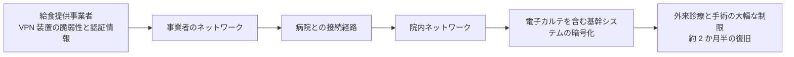

# 🇯🇵 国内の事例 2022 年（履歴）

> [!NOTE]
> **表記ルール**：本ページでは、**事実**（一次情報で確認できる内容。出典を併記する）、**報道ベース**（報道や第三者の集計のみで確認でき、当事者の公表資料では裏付けが取れていない内容）、**分析**（筆者の解釈）を書き分ける。
> [対象の区分](../README.md#対象の区分)と[一次情報の強度](../README.md#一次情報の強度)の定義は、インシデント事例集のトップにまとめている。
> その年の情勢と集計は [2022 年サマリー](2022-summary.md) にまとめている。

## 収録件数

| 区分 | サイバー攻撃 | その他の事案 |
|---|---|---|
| 病院系 | 1 | 0 |
| 製薬企業系 | 0 | 0 |
| 医療関連事業者 | 0 | 0 |

---

## 病院系

| ID | 発生時期 | 組織 | 種別 | 初期侵入経路 | 診療への影響 | 業務停止期間 | 一次情報の強度 |
|---|---|---|---|---|---|---|---|
| [JP-2022-01](#JP-2022-01) | 2022-10 | 大阪急性期・総合医療センター | ランサムウェア | 給食提供事業者の VPN 装置経由 | 電子カルテ停止、外来診療と手術の大幅な制限 | 通常診療の再開まで **約 2 か月半**（2022-10-31 から 2023-01） | 報告書 |

### JP-2022-01 大阪急性期・総合医療センター（2022 年 10 月）

**事実**

- 2022 年 10 月 31 日、電子カルテシステムを含む基幹システムがランサムウェアにより暗号化され、外来診療と手術の大幅な制限に至った。
- 侵入経路は、病院に給食を提供していた事業者のネットワーク経由であったことが調査で示されている。委託事業者の VPN 装置の脆弱性と認証情報が悪用された。
- **業務停止期間**：2022 年 10 月 31 日に基幹システムが停止し、2023 年 1 月に通常診療を再開するまで、**約 2 か月半**にわたって外来診療と手術が制限された。
- **代替運用**：紙による運用へ切り替え、外来は救急と再診の一部に限って継続した。
- **完全復旧**：2023 年 1 月に通常診療を再開した。
- 病院は身代金を支払わず、システムの復旧、再構築を実施した。
- 病院は調査報告書を 2023 年 3 月に公表している。

**教訓（分析）**

| 論点 | 示唆 |
|---|---|
| サプライチェーン | 医療機関の攻撃対象領域は、院内で完結しない。給食、検査、清掃、保守など、あらゆる委託先との接続が侵入経路になりうる |
| 接続先の可視化 | 「誰が、どこから、どのシステムに、どの権限で接続しているか」の棚卸しが最初の一歩になる |
| 委託契約 | 委託先に対するセキュリティ要件（パッチ適用、MFA、ログ提供義務）を契約に落とし込む必要がある |
| 相互接続の分離 | 委託先との接続は、必要最小限のセグメント、ポート、期間に限定する |

**一次情報**

- [大阪急性期・総合医療センター 公式サイト](https://www.gh.opho.jp/)（「情報セキュリティインシデント調査委員会 報告書」）

---

## 製薬企業系

本年の収録はない。

## 医療関連事業者

本年の収録はない。
本事案の侵入起点となった給食提供事業者は、被害の当事者ではあるが、本リポジトリでは独立した事例として収録していない。
委託先経由の侵入という構造は、[病院系の事例](#JP-2022-01)の側に記録している。

## その他の事案（サイバー攻撃以外）

サポート詐欺、システム障害、内部不正、機器や記憶媒体の紛失と盗難、委託先の管理不備による漏えい、誤送付や誤公開、ドメインの失効を記録する。
類型の定義と、主分類との判定基準は[事案の類型](../README.md#事案の類型)にまとめている。

本年の収録はない。

---

[← 2021 年](2021-timeline.md) | [2022 年サマリー](2022-summary.md) | [国内の事例](README.md) | [2023 年 →](2023-timeline.md) | [トップへ](../../../../README.md)
