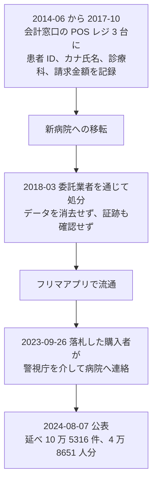

# 🇯🇵 国内の事例 2023 年（履歴）

> [!NOTE]
> **表記ルール**：本ページでは、**事実**（一次情報で確認できる内容。出典を併記する）、**報道ベース**（報道や第三者の集計のみで確認でき、当事者の公表資料では裏付けが取れていない内容）、**分析**（筆者の解釈）を書き分ける。
> [対象の区分](../README.md#対象の区分)と[一次情報の強度](../README.md#一次情報の強度)の定義は、インシデント事例集のトップにまとめている。
> その年の情勢と集計は [2023 年の情勢](../years/2023-summary.md) にまとめている。

## 収録件数

| 区分 | サイバー攻撃 | その他の事案 |
|---|---|---|
| 病院系 | 5 | 14 |
| 製薬企業系 | 2 | 0 |
| 医療関連事業者 | 4 | 5 |

医療法施行規則の改正が施行され、医療情報システムの安全管理措置が医療機関の管理者の義務になった年である。
収録は本リポジトリが一次情報を確認できた事案に限る。
国内で公表された医療関連の事案がこれで尽きることを示すものではない。

前年に発生し、本年に公表または処分が公表された事案も本ページに収める。
その場合は、発生時期の欄に発生と公表の両方を記す。

---

## 病院系

| ID | 発生時期 | 組織 | 種別 | 初期侵入経路 | 診療への影響 | 業務停止期間 | 一次情報の強度 |
|---|---|---|---|---|---|---|---|
| [JP-2023-02](#JP-2023-02) | 2023-01 | 社会福祉法人あじろぎ会 宇治病院（京都府宇治市） | ランサムウェア | 事務系ネットワークの VPN 機器の脆弱性（報道ベース） | 電子カルテと医療機器には影響なし | ファイルサーバ 3 台。バックアップから **1 日から 2 日**で復旧 | 当事者公表 |
| [JP-2023-08](#JP-2023-08) | 2023-01 | 地方独立行政法人奈良県立病院機構 奈良県総合医療センター | 不正アクセス（SNS アカウントの乗っ取り） | 未公表 | 公表なし | 診療の停止は公表されていない | 当事者公表 |
| [JP-2023-03](#JP-2023-03) | 2023-05 | 地方独立行政法人 三重県立総合医療センター | 不正アクセス（ウェブサイトの改ざん） | 未公表 | 診療業務への影響はなし | **診療の停止なし** | 当事者公表 |
| [JP-2023-04](#JP-2023-04) | 2023-07 | 医療法人徳洲会 福岡徳洲会病院 | 不正アクセス | 未公表 | 公表なし | 診療の停止は公表されていない | 当事者公表 |
| [JP-2023-05](#JP-2023-05) | 2023-11 | 中津市立中津市民病院（大分県中津市） | ランサムウェア | 未公表 | 財務会計システムのサーバが対象。診療系への影響は公表されていない | 財務会計システムの停止（復旧時期は未公表） | 当事者公表 |

**分析**：日本医師会総合政策研究機構は 2023 年 4 月、民間病院と診療所の被害事例を扱ったリサーチレポートを公表している。
そこには、地方中核都市の中小規模の病院が Cring ランサムウェアの攻撃を受け、電子カルテのサーバのデータがバックアップごと暗号化された事例が記録されている。
侵入は VPN 機器の脆弱性を突かれたものと推測されている。
組織名が匿名化されているため本事例集の収録の要件は満たさないが、公表されない被害が国内に存在することを示す資料である。

- [医療機関へのサイバー攻撃の事例研究：民間病院、診療所の被害事例に学ぶ（PDF）](https://www.jmari.med.or.jp/wp-content/uploads/2023/04/RR136.pdf)（日本医師会総合政策研究機構 リサーチレポート No.136、2023 年 4 月 11 日）

### JP-2023-02 社会福祉法人あじろぎ会 宇治病院（2023 年 1 月）

**事実**

- 発生時期：2023 年 1 月 6 日未明。6 月 12 日に公表した。
- 対象組織：京都府宇治市の社会福祉法人あじろぎ会 宇治病院。
- 攻撃種別：ランサムウェア。第三者による不正アクセスを受け、システム内の一部のデータが暗号化された。脅迫文も確認された。
- 初期侵入経路：当事者の公表資料では明示されていない。事務系のネットワークの VPN 機器の脆弱性を突かれたとする報道がある（報道ベース）。
- 侵害範囲：ファイルサーバ **3 台**のデータが暗号化された。対象には、患者、家族、現職と元職の職員の氏名、住所、電話番号、性別、生年月日が含まれる。
- 情報流出：外部への通信の履歴が検出された。通信量は少なかったが、同院は情報流出の可能性を完全には否定できないと説明した。外部のサイトでの公開は確認されていない。
- 診療への影響：電子カルテと医療機器は影響を受けなかった。
- 業務停止期間：バックアップのサーバを用いて **1 日から 2 日**で復旧した。
- 公表された対策：個人情報保護委員会へ報告し、対象者へ書面で通知した。再発防止のためのセキュリティ対策を実施した。

**分析**

- 暗号化されたのは事務系のファイルサーバで、電子カルテは無事だった。同じ年の[中津市民病院](#JP-2023-05)も財務会計システムが対象である。診療系が分離されていた場合、被害は情報の流出に寄り、診療の停止には至らない。
- 復旧が 1 日から 2 日で済んでいる。バックアップが暗号化の範囲外に置かれていたことによる。前年の[大阪急性期・総合医療センター](2022-timeline.md#JP-2022-01)の 73 日との差は、規模ではなくバックアップの設計から生じている。
- 発生から公表まで 5 か月かかっている。「流出の可能性を完全には否定できない」という結論を出すには、通信の記録を精査する必要がある。ログの保存期間が短いと、この判断自体ができない（[ログと監視の設計](../../../technology/logging.md)）。

**一次情報**

- [不正アクセスによる個人情報漏えいの可能性について](https://uji-hp.or.jp/news/6362/)（社会福祉法人あじろぎ会 宇治病院）
- [宇治病院へランサムウェア攻撃、外部へデータ通信履歴「情報流出の可能性を完全には否定しきれない」](https://scan.netsecurity.ne.jp/article/2023/06/28/49589.html)（ScanNetSecurity による当事者公表の報道）

---

### JP-2023-08 奈良県総合医療センター（2023 年 1 月）

**事実**

- 発生時期：2023 年 1 月 6 日に公表した。乗っ取りが行われた時期は公表されていない。
- 対象組織：地方独立行政法人奈良県立病院機構 奈良県総合医療センター。
- 攻撃種別：不正アクセス。職員の Instagram アカウントが乗っ取られた。
- 初期侵入経路：未公表。ID とパスワードが第三者に取得されたとみられる。
- 侵害範囲：職員が勤務中に同僚と撮影した写真を限定公開していたアカウントが対象で、乗っ取られたのち他人の写真が追加されるなどの改ざんが行われた。
- 診療への影響：公表されていない。
- 公表された対策：経緯を自院のサイトで公表し、謝罪した。

**分析**

- 侵害されたのは病院のシステムではなく、職員個人の SNS アカウントである。それでも病院が公表したのは、投稿された写真が勤務中の院内で撮られたものだからである。院外のサービスに置かれた院内の映像は、病院の管理下にないまま病院の名前で流通する。
- 限定公開の設定は、アカウントが乗っ取られた時点で意味を失う。公開範囲の設定は、アカウントの認証が保たれていることを前提にした制御である。
- 同種の構図は、2025 年の[イムス葛飾ハートセンター](2025-timeline.md#その他の事案サイバー攻撃以外)（同僚を撮影した画像に患者の検査画像が写り込んだ）や岩見沢市立総合病院（受付モニタの撮影と投稿）へ続く。院内の撮影をどこまで許すかが、この類型の分かれ目になる。

**一次情報**

- [奈良県](https://www.pref.nara.jp/)
- [奈良県総合医療センター職員 Instagram アカウントが乗っ取り被害](https://scan.netsecurity.ne.jp/article/2023/01/11/48748.html)（ScanNetSecurity による当事者公表の報道）

---

### JP-2023-03 地方独立行政法人 三重県立総合医療センター（2023 年 5 月）

**事実**

- 発生時期：2023 年 5 月 11 日に公表した。
- 対象組織：地方独立行政法人 三重県立総合医療センター。
- 攻撃種別：不正アクセス。ウェブサイトへ外部のリンクを含む不正な書き込みが行われた。
- 初期侵入経路：未公表。
- 発覚の経緯：職員がウェブサイトの編集作業を行っている際に、不正な書き込みを見つけた。
- 診療への影響：診療業務への影響はなかった。
- 公表された対策：経緯を自院のサイトで公表した。

**分析**

- 発覚の端緒は、職員が編集画面で気づいたことである。改ざんは公開ページの見た目を変えないことが多く、外部からは見えない。定期的にコンテンツを突き合わせる仕組みがなければ、気づくのは偶然に依存する（[外部から見た自組織の攻撃面](../../../practice/attack-surface.md)）。
- 2021 年の[国立成育医療研究センター](2021-timeline.md#JP-2021-06)、2024 年の印西総合病院と秋田県立医療療育センターでも、ウェブサイトの改ざんが公表されている。医療機関のドメインは、検索順位を借りる目的で狙われる。

**一次情報**

- [ホームページへの不正アクセスについて](https://www.mie-gmc.jp/content/news.php?no=20230511121725)（三重県立総合医療センター、2023 年 5 月 11 日）

---

### JP-2023-04 医療法人徳洲会 福岡徳洲会病院（2023 年 7 月）

**事実**

- 発生時期：2023 年 7 月 28 日に公表した。
- 対象組織：医療法人徳洲会 福岡徳洲会病院。
- 攻撃種別：不正アクセス。第三者による侵入を受け、データベースに保存されていた個人情報と患者情報が、外部から閲覧できる状態になった。
- 初期侵入経路：未公表。
- 侵害範囲：データベースに保存されていた個人情報と患者情報。件数は公表されていない。
- 診療への影響：公表されていない。
- 公表された対策：経緯を自院のサイトで公表した。

**分析**

- 「外部から閲覧可能な状態になった」という表現は、データが持ち出されたことの確認ではなく、到達できる状態にあったことを示す。閲覧の有無をログから確定できない場合、公表はこの形になる。
- 徳洲会は全国に 70 を超える施設を持つグループである。1 施設の侵害が、グループ内の他の施設へ広がるかどうかは、施設間のネットワークの設計で決まる（[ネットワークの分離](../../../technology/segmentation.md)）。

**一次情報**

- [福岡徳洲会病院](https://www.f-toku.jp/)
- [福岡徳洲会病院に不正アクセス、個人情報が外部から閲覧可能な状態に](https://scan.netsecurity.ne.jp/article/2023/08/26/49869.html)（ScanNetSecurity による当事者公表の報道）

---

### JP-2023-05 中津市立中津市民病院（2023 年 11 月）

**事実**

- 発生時期：2023 年 11 月 13 日に異常を検知し、11 月 14 日に情報の流出が判明した。11 月 21 日に中津市が公表した。
- 対象組織：大分県の中津市立中津市民病院。
- 攻撃種別：ランサムウェア。財務会計システムのサーバが外部からの不正アクセスを受けて感染した。
- 初期侵入経路：未公表。
- 侵害範囲：財務会計システムのサーバ。取引先の情報が流出した可能性がある。
- 診療への影響：診療系のシステムへの影響は公表されていない。
- 公表された対策：中津市が経緯を公表した。

**分析**

- 対象は財務会計システムであり、電子カルテではない。医療機関の情報システムは診療系と事務系に分かれ、防御の投資は診療系に集まる。攻撃者にとっては、防御の薄い側から入れれば足りる。
- 流出の可能性があるのは取引先の情報である。患者情報ではないため報道は小さくなるが、取引先には医薬品卸、医療機器の販売事業者、委託事業者が並ぶ。次の攻撃の宛先として使える名簿である。
- 異常の検知から流出の判明まで 1 日、公表まで 8 日である。この年に国内で公表された事案のなかでは速い部類にあたる。

**一次情報**

- [中津市](https://www.city-nakatsu.jp/)
- [中津市民病院にランサムウェア攻撃](https://scan.netsecurity.ne.jp/article/2023/11/28/50295.html)（ScanNetSecurity による当事者公表の報道。中津市の公表 PDF へのリンクを含む）

---

## 製薬企業系

| ID | 発生時期 | 組織 | 種別 | 初期侵入経路 | 影響 | 一次情報の強度 |
|---|---|---|---|---|---|---|
| [JP-2023-06](#JP-2023-06) | 2023-05 | エーザイ株式会社とグループ会社（EA ファーマ、カン研究所、サンプラネット） | 不正アクセス（クラウド環境） | 未公表 | 取引先関係者の氏名とメールアドレス 約 1 万 1000 件が漏えいした可能性 | 当事者公表 |
| [JP-2023-01](#JP-2023-01) | 2023-06 | エーザイ株式会社 | ランサムウェア | 未公表 | グループの一部サーバが暗号化。物流に関連する国内外の一部システムを切り離した | 当事者公表 |

### JP-2023-06 エーザイ株式会社とグループ会社（2023 年 5 月）

**事実**

- 発生時期：2023 年 5 月 19 日に公表した。
- 対象組織：エーザイ株式会社と、子会社および関連会社である EA ファーマ株式会社、株式会社カン研究所、株式会社サンプラネット。
- 攻撃種別：不正アクセス。クラウド環境が対象。
- 初期侵入経路：未公表。
- 侵害範囲：取引先関係者の氏名とメールアドレス **約 1 万 1000 件**が漏えいした可能性がある。
- 公表された対策：経緯と対応を公表した。

**分析**

- この 2 週間後に、同じエーザイグループで[ランサムウェアの被害](#JP-2023-01)が公表されている。両者の関係は公表資料では述べられていない。時期が近い 2 件を、当事者が別々の事案として扱っている点は記録に値する。
- 漏えいしたのは取引先の連絡先である。製薬企業の取引先には、医療機関、医薬品卸、受託製造事業者（CMO）、受託研究機関（CRO）が並ぶ。名簿は、これらを狙う次の攻撃の起点になる（[原薬と受託製造](../../../reference/pharma/supply-chain.md)）。
- 対象がクラウド環境である。オンプレミスの境界防御では守れない領域であり、設定と権限の管理が防御の中心になる（[クラウド事業者と医療](../../../technology/cloud/)）。

**一次情報**

- [エーザイグループのクラウドへ不正アクセス、約 11,000 件の取引先関係者情報が漏えいした可能性](https://scan.netsecurity.ne.jp/article/2023/05/26/49419.html)（ScanNetSecurity による当事者公表の報道。エーザイの公表 PDF へのリンクを含む）

### JP-2023-01 エーザイ株式会社（2023 年 6 月）

**事実**

- 発生時期：2023 年 6 月 3 日深夜（日本時間）に被害の発生を確認した。6 月 6 日に公表した。
- 対象組織：エーザイ株式会社とそのグループ会社。子会社の EA ファーマ株式会社も同日に被害を公表した。
- 攻撃種別：ランサムウェア。
- 攻撃グループ：当事者は公表していない。
- 初期侵入経路：未公表。
- 侵害範囲：グループの一部サーバが暗号化された。
- 業務への影響：**物流関係に関連するものなど、国内外の一部の社内システム**をサーバから切り離した。ウェブサイトとメールシステムは通常どおり稼働した。
- 情報流出：公表の時点で確認されていない。
- 公表された対策：全社対策本部を設置し、外部の専門家の助言を受けて影響範囲の調査と復旧を進めた。警察など関係機関へ相談した。

**分析**

- 切り離しの対象に物流のシステムが含まれた。製薬企業では、暗号化されたシステムの範囲より、医薬品の供給が止まるかどうかが被害の中心になる。停止の指標を情報システムの台数で測ると、この点が見えない（[サプライチェーン](../../../reference/pharma/supply-chain.md)）。
- 被害の確認から公表まで 3 日である。上場企業として速やかに開示した一方、侵入経路と影響の詳細は公表されていない。国内の製薬企業の被害で、経緯まで公表された事例を本リポジトリはまだ確認できていない。
- 同年 3 月には、インドの [Sun Pharmaceutical Industries](../global/2023-timeline.md#GL-2023-17) が同種の被害を公表し、後日の届出で収益への影響を認めている。製薬企業の被害は、公表の直後より、決算の開示で実態が見える。

**一次情報**

- [ランサムウェア被害の発生について](https://www.eisai.co.jp/news/2023/news202341.html)（エーザイ株式会社、2023 年 6 月 6 日）
- [ランサムウェア被害の発生について](https://www.eapharma.co.jp/news/2023/0606)（EA ファーマ株式会社、2023 年 6 月 6 日）

---

## 医療関連事業者

| ID | 発生時期 | 組織 | 種別 | 初期侵入経路 | 影響 | 一次情報の強度 |
|---|---|---|---|---|---|---|
| [JP-2023-10](#JP-2023-10) | 2023-01 | 公益社団法人日本臓器移植ネットワーク | 不正アクセス（メールアカウント） | 未公表（海外からの攻撃） | 外部からの問い合わせ用メールアカウントに侵入され、メールデータの一部が消失した | 当事者公表 |
| [JP-2023-09](#JP-2023-09) | 2023-04 | 新潟医療福祉大学 | 不正アクセス（ウェブサイトの改ざん） | CMS の脆弱性 | 閲覧者が意図しないサイトへ自動転送される状態になった | 当事者公表 |
| [JP-2023-07](#JP-2023-07) | 2023-07 〜 2023-08 | 一般社団法人医療 ISAC | 不正アクセス（ウェブサイトの改ざん） | 未公表 | 複数のファイルの追加と改ざんが行われた | 当事者公表 |
| [JP-2023-11](#JP-2023-11) | 2023-12 | 伊丹市（特定保健指導の委託先 Y4.com） | データ侵害（ノーウェアランサム） | 未公表 | 委託先のシステムからデータを窃取したうえで削除された。参加者 20 人分の氏名、住所、性別、生年月日、被保険者番号、健診結果、血糖値データなど | 当事者公表 |

### JP-2023-10 公益社団法人日本臓器移植ネットワーク（2023 年 1 月）

**事実**

- 発生時期：2023 年 1 月 9 日から攻撃を受け、1 月 20 日に公表した。
- 対象組織：公益社団法人日本臓器移植ネットワーク（JOT）。臓器のあっせんを国内で唯一担う。
- 攻撃種別：不正アクセス。海外からの攻撃により、外部からの問い合わせ用のメールアドレスのアカウントへ侵入された。
- 初期侵入経路：未公表。
- 侵害範囲：当該メールアカウントのデータの一部が**消失**した。
- 診療への影響：あっせん業務への影響は公表されていない。
- 公表された対策：経緯を自組織のサイトで公表した。

**分析**

- 被害が「消失」である点が、この年の他の事案と異なる。窃取や暗号化ではなく、データが失われた。攻撃者の目的が不明のまま、機密性ではなく完全性と可用性が損なわれている（[完全性への攻撃と患者安全](../../integrity-attacks.md)）。
- 対象は外部からの問い合わせ用のアカウントである。臓器提供の意思表示、家族からの照会、医療機関からの連絡が集まる窓口にあたる。消失したメールに未処理の照会が含まれていた場合、その事実自体を確認できない。
- 臓器のあっせんは国内で JOT が唯一担う。代替の経路がない機能は、止まったときの影響が全国に及ぶ（[委託先への依存](../../../response/dependencies.md)）。

**一次情報**

- [メールサービスへの攻撃について](https://www.jotnw.or.jp/news/detail.php?id=1-921)（公益社団法人日本臓器移植ネットワーク、2023 年 1 月 20 日）

---

### JP-2023-11 伊丹市（特定保健指導の委託先）（2023 年 12 月）

**事実**

- 発生時期：2023 年 12 月 10 日に攻撃を受け、12 月 14 日に委託先から報告があった。12 月 28 日に公表した。
- 対象組織：兵庫県伊丹市。生活習慣病の予防を目的とする特定保健指導の業務を委託していた Y4.com のシステムが攻撃を受けた。
- 攻撃種別：**ノーウェアランサム**。データを暗号化せず、窃取したうえで削除し、その返還と引き換えに金銭を要求する型である。
- 初期侵入経路：未公表。
- 侵害範囲：ウェアラブル端末を活用した特定保健指導に参加した **20 人**分。氏名、住所、性別、生年月日、被保険者番号、健診結果、アバター画像、血糖値データ、ベジメータのファイル、集計用の PDF、コミュニティへの投稿動画を含む。
- 対応：個人情報保護委員会へ報告し、対象者へ電話で連絡して謝罪した。情報の公開と悪用は確認されていない。

**分析**

- 暗号化を伴わない「ノーウェアランサム」である。復旧の可否ではなく、データが手元から消えたうえで公開をちらつかされる。バックアップがあれば業務は戻るが、恐喝は止まらない。国内の医療関連の事案でこの型が公表された早い例にあたる。
- 対象は 20 人と小さいが、含まれる項目は血糖値、健診結果、投稿動画にまで及ぶ。ウェアラブル端末を使う保健指導は、従来の健診より継続的で細かいデータを集める。件数ではなく粒度が上がっている（[デジタルヘルス](../../../technology/digital-health/)）。
- 攻撃を受けたのは市ではなく委託先である。自治体の保健事業は、参加者の生活データを外部の事業者のシステムへ預ける形で運営されることが多い（[委託先への依存](../../../response/dependencies.md)）。

**一次情報**

- [伊丹市](https://www.city.itami.lg.jp/)
- [特定保健指導の参加者情報が外部流出 - 伊丹市](https://www.security-next.com/152328)（Security NEXT による当事者公表の報道）

---

### JP-2023-09 新潟医療福祉大学（2023 年 4 月）

**事実**

- 発生時期：2023 年 4 月 1 日 21 時 40 分ごろに不正アクセスを確認し、4 月 3 日に公表した。
- 対象組織：新潟医療福祉大学。医療と福祉の専門職を養成する。
- 攻撃種別：不正アクセス。ウェブサーバ内のファイルが改ざんされた。
- 初期侵入経路：**CMS の脆弱性**。
- 侵害範囲：当該サイトへアクセスすると、閲覧者が意図しないウェブサイトへ自動で転送される状態になった。
- 公表された対策：4 月 1 日 22 時 10 分にサイトを閉鎖して調査を開始し、4 月 3 日に改ざんと復旧を公表した。

**分析**

- 発見から閉鎖まで 30 分である。改ざんの検知から遮断までの時間が、閲覧者が転送先へ送られる時間をそのまま決める。
- 侵入口は CMS の脆弱性である。医療機関と医療系の教育機関のウェブサイトは、更新の頻度が低い CMS の上に乗っていることが多い。同じ年の[三重県立総合医療センター](#JP-2023-03)、2021 年の[国立成育医療研究センター](2021-timeline.md#JP-2021-06)と並ぶ（[医療系 Web アプリケーションのセキュリティ](../../../technology/web-security/)）。

**一次情報**

- [新潟医療福祉大学](https://www.nuhw.ac.jp/)
- [新潟医療福祉大学の Web サイトが改ざん、CMS の脆弱性を突かれる](https://scan.netsecurity.ne.jp/article/2023/04/07/49179.html)（ScanNetSecurity による当事者公表の報道）

---

### JP-2023-07 一般社団法人医療 ISAC（2023 年 8 月）

**事実**

- 発生時期：2023 年 7 月 29 日以降に改ざんが行われ、8 月 4 日に発見した。8 月 5 日と 8 月 7 日に公表した。
- 対象組織：一般社団法人医療 ISAC。医療分野の脅威情報を会員間で共有する組織である。
- 攻撃種別：不正アクセス。ウェブサイトへ複数のファイルが追加され、既存のファイルが改ざんされた。
- 初期侵入経路：未公表。
- 侵害範囲：ウェブサイト上の複数のファイル。
- 公表された対策：ログを分析して改ざんの時期を特定し、経緯を公表して謝罪した。

**分析**

- 医療分野のセキュリティを担う組織そのものが侵害された。防御を助言する側にも、同じ攻撃面がある。
- ログの分析によって「7 月 29 日以降」と時期を特定している。改ざんの検知が 8 月 4 日だったため、6 日以上気づかれていなかったことになる。
- 医療 ISAC のサイトは、会員である医療機関が注意喚起を読みに来る場所である。そこに置かれたファイルが改ざんされると、読み手は疑わずに開く。信用のある配布元は、それ自体が攻撃の経路になる。

**一次情報**

- [ウェブサイトへの不正アクセスに関するご報告とお詫び](https://m-isac.jp/2023/08/07/release230807/)（一般社団法人医療 ISAC、2023 年 8 月 7 日）

---

## その他の事案（サイバー攻撃以外）

サポート詐欺、システム障害、内部不正、機器や記憶媒体の紛失と盗難、委託先の管理不備による漏えい、誤送付や誤公開、ドメインの失効を記録する。
類型の定義と、主分類との判定基準は[事案の類型](../README.md#事案の類型)にまとめている。

| ID | 発生時期 | 組織 | 区分 | 類型 | 概要 | 一次情報の強度 |
|---|---|---|---|---|---|---|
| [JP-2023-S01](#JP-2023-S01) | 2022-11（2023-02 公表） | 近畿大学病院 | 病院系 | 内部不正 | 受付業務の委託先の社員が、電子カルテの画面を私物のスマートフォンで撮影し、SNS で知人へ送信した。患者 1 名の診療情報が少なくとも 6 人へ伝わった | 当事者公表 |
| [JP-2023-S02](#JP-2023-S02) | 2021-12 〜 2023-04（2023-07 行政指導） | 独立行政法人国立病院機構 | 病院系 | 誤送付、誤公開、操作ミス | 患者番号の桁数変更の情報共有に不備があり、次世代医療基盤法にもとづく通知が行われていない患者の医療情報を、3 回にわたり認定事業者へ提供した | 当事者公表 |
| [JP-2023-S03](#JP-2023-S03) | 2018-03（廃棄）、2023-09（発覚） | 気仙沼市立病院 | 病院系 | 機器、記憶媒体の紛失、盗難 | 会計窓口で使っていた POS レジ端末 3 台を、データを消去しないまま委託業者を通じて処分。フリマアプリで流通し、購入者からの連絡で発覚。延べ 10 万 5316 件、4 万 8651 人分 | 当事者公表 |
| JP-2023-S04 | 2023-01 | 医療法人社団鴻愛会 こうのす共生病院（埼玉県鴻巣市） | 病院系 | 誤送付、誤公開、操作ミス | 医師が私物のスマートフォンのアプリで院内の音声を生配信した。患者などからの連絡で発覚。懲戒処分と同日に当該医師が依願退職した | 当事者公表 |
| JP-2023-S05 | 2023-01（2023-03 公表） | 社会医療法人財団慈泉会 相澤病院（長野県松本市） | 病院系 | 内部不正 | 退職した元職員が退職後に院内のパソコンから患者の個人情報と医療情報、法人情報を不正に取得した。元職員から他院での治療を勧誘された患者の申し出で発覚 | 当事者公表 |
| [JP-2023-S06](#JP-2023-S06) | 2021-01（2023-07 公表） | 順天堂大学 | 病院系 | 誤送付、誤公開、操作ミス | 肺がんの臨床研究で、大学院生が匿名化せずに患者データを外部の第三者へ渡して解析を依頼した。2021 年 12 月の外部通報から、2023 年 6 月の新聞掲載まで本格的な調査を行わなかった | 当事者公表 |
| JP-2023-S07 | 2023-07 | 鹿児島大学病院 | 病院系 | 誤送付、誤公開、操作ミス | 厚生労働省のサイトで公開された研究報告書の資料と、県の合同輸血療法委員会が配付した資料に、パソコンの操作で閲覧できる形で患者の個人情報が残っていた | 当事者公表 |
| JP-2023-S08 | 2023-07 | 北海道大学病院 | 病院系 | 機器、記憶媒体の紛失、盗難 | 臨床検査技師が、共同研究のために提供された患者の個人情報を保存した USB メモリを紛失した。ガイドラインに反して暗号化を行っていなかった | 当事者公表 |
| JP-2023-S09 | 2023-09 | 神奈川県立こども医療センター | 病院系 | 機器、記憶媒体の紛失、盗難 | 医師が自宅へ持ち帰った患者のカルテ情報を保存した USB メモリが、自宅への侵入盗により盗まれた | 当事者公表 |
| JP-2023-S11 | 2022-12（2023-01 公表） | 群馬県健康福祉部 感染症、がん疾病対策課（吾妻保健福祉事務所） | 医療関連事業者 | 誤送付、誤公開、操作ミス | 特定医療費（指定難病）の受給者証を送付する際、本人分のほかに第三者 1 人分を同封した。受給者が持参して来所したことで発覚 | 当事者公表 |
| JP-2023-S12 | 2023-04 | 大阪急性期、総合医療センター | 病院系 | 誤送付、誤公開、操作ミス | 消化器内科の主治医が、患者へ別の患者の個人情報が記載された書類を印刷して手渡した。本人確認を行っていなかった | 当事者公表 |
| JP-2023-S13 | 2023-07 | 愛媛県立医療技術大学 | 医療関連事業者 | 誤送付、誤公開、操作ミス | 助産学専攻科のオープンキャンパスの申込フォームで、参加申込者の個人情報が閲覧できる状態にあった。担当者が認識不足から上司へ報告していなかった | 当事者公表 |
| JP-2023-S14 | 2023-09 | 茨城県立こども病院 | 病院系 | 機器、記憶媒体の紛失、盗難 | 非常勤医師が当日の患者リストを入れた鞄を、電車とバスでの通勤中に紛失した。診察の予約が多く自宅へ持ち帰っていた | 当事者公表 |
| JP-2023-S15 | 2023-09 | 慶應義塾大学病院 | 病院系 | 誤送付、誤公開、操作ミス | 電話診療による処方箋発行の申込フォームの利用者情報が、慶應義塾の関係者が特定の操作を行った場合に閲覧できる状態になっていた | 当事者公表 |
| [JP-2023-S16](#JP-2023-S16) | 2023-11 | 鹿児島県国民健康保険団体連合会 | 医療関連事業者 | 誤送付、誤公開、操作ミス | 研修会の資料を送る際、削除すべき個人情報が残ったまま送信した。**2 万 6626 件**の氏名、住所、生年月日、被保険者の記号と番号、健診結果 | 当事者公表 |
| JP-2023-S19 | 2023-09 | 厚生中央病院（全国土木建築国民健康保険組合） | 病院系 | サポート詐欺 | 職員が自宅のパソコンで偽のセキュリティ警告に応じ、遠隔操作された。接続していた USB メモリに COVID-19 の患者 771 人分の診療内容と、職員の感染対策検査の結果 510 人分を保存していた | 当事者公表 |
| JP-2023-S17 | 2023-11（2023-12 判明） | 射水市民病院（富山県） | 病院系 | 機器、記憶媒体の紛失、盗難 | 業務で使った USB メモリが院内で所在不明。2021 年 5 月から 2023 年 10 月に医療相談を行った患者の一覧表を保存しており、氏名、年齢、病名、市町村名を含む | 当事者公表 |
| JP-2023-S18 | 2023-12（2024-01 判明） | 関東 IT ソフトウェア健康保険組合（委託先は慈恵医大晴海トリトンクリニック） | 医療関連事業者 | 委託先の管理不備による漏えい | 健診結果を保存した光ディスクを事業所へ送付した際、無関係な **13 社 117 人**分の健診結果が同じディスクに入っていた | 当事者公表 |
| JP-2023-S10 | 2023-08 〜 2023-11（2023-12 公表） | 株式会社データホライゾン（医療関連情報サービス） | 医療関連事業者 | 内部不正 | 退職予定の期間中に、元従業員が営業秘密にあたる情報を不正に持ち出した。同社は刑事告訴に向けた準備を進めるとした | 当事者公表 |

**分析**：19 件のうち 5 件が記憶媒体の紛失と盗難、9 件が誤送付と誤公開である。
この年に特徴的なのは、[JP-2023-S06](#JP-2023-S06)（順天堂大学）と JP-2023-S07（鹿児島大学病院）で、いずれも**研究と学術の経路**から患者情報が院外へ出ている点である。
臨床の窓口ではなく、解析の依頼、報告書の作成、学会での配付という工程で起きている。
電子カルテのアクセス制御は、この工程には及ばない。

内部不正が 3 件ある。
うち JP-2023-S05（相澤病院）は退職した元職員による事後のアクセス、JP-2023-S10（データホライゾン）は退職予定期間中の持ち出しである。
どちらも、退職の手続きと権限の停止のあいだに生じた空白で起きている（[認証とアクセス管理](../../../technology/identity.md)）。

誤公開のうち 2 件（JP-2023-S13、JP-2023-S15）は、外部から入力を受け付けるフォームの権限設定の誤りである。
処方箋の発行申込とオープンキャンパスの参加申込は、どちらも本体のシステムとは別に立てた仕組みで、担当者が自ら設定している。
入力を受け付ける画面は、作った人と管理する人が一致しないまま残りやすい（[外部から見た自組織の攻撃面](../../../practice/attack-surface.md)）。

健診と保険のデータを扱う組織でも 2 件起きている（[JP-2023-S16](#JP-2023-S16)、JP-2023-S18）。
どちらも、渡すべきデータに渡してはいけないデータが混ざった形である。
抽出の条件を書く人と、送る人と、受け取る人が分かれているほど、混入は最後まで気づかれない。

### JP-2023-S06 順天堂大学（2021 年 1 月、2023 年 7 月に公表）

**事実**

- 発生時期：2021 年 1 月 12 日に漏えいが発生した。2021 年 12 月 15 日に第三者からの通報で発覚した。2023 年 6 月 3 日に新聞へ掲載され、7 月 14 日に大学が公表した。
- 類型：誤送付、誤公開、操作ミス。
- 発生原因：肺がんの治療に関する臨床研究で、大学院生が研究責任者の指示を受け、個人情報を含んだ状態のデータを外部の第三者へ渡して解析を依頼した。個人が特定されないよう研究 ID へ変換する匿名化の措置を行っていなかった。
- 影響範囲：肺がんの治療を受けた患者のデータ。件数は公表されていない。
- 経過：外部からの通報を受けたのち、新聞に掲載されるまで本格的な調査を行っていなかった。通報から報道まで約 1 年 6 か月である。
- 診療への影響：なし。

**分析**

- 通報を受けてから調査を始めるまでに 1 年半が空いている。受け付けた通報を誰が扱うかが決まっていなければ、内容の重大さにかかわらず滞留する。窓口の設置は、受理後の手順とセットにしないと機能しない。
- 匿名化は研究計画の要件として書かれていたはずである。書かれていても、解析を急ぐ工程では飛ばされる。匿名化を人手の手順に置くかぎり、同じことが起きる。データを渡す仕組みの側で、匿名化を通らないと出せない構造にする必要がある。
- 同じ年の JP-2023-S07（鹿児島大学病院）も、研究報告書の資料に個人情報が残っていた事案である。研究の成果物は、公開を前提とするために外へ出る経路が最も広い（[ゲノムデータの保護](../../../technology/genomics.md)）。

**一次情報**

- [順天堂大学医学部附属順天堂医院](https://www.juntendo.ac.jp/hospital/)
- [順天堂大学臨床研究の個人情報漏えい、新聞掲載まで本格的調査行わず](https://scan.netsecurity.ne.jp/article/2023/07/25/49716.html)（ScanNetSecurity による当事者公表の報道）

---

### JP-2023-S16 鹿児島県国民健康保険団体連合会（2023 年 11 月）

**事実**

- 発生時期：2023 年 11 月 20 日に誤送信し、11 月 29 日に判明した。11 月 30 日に鹿児島市へ説明した。
- 類型：誤送付、誤公開、操作ミス。
- 発生原因：医療費適正化対策の支援事業の研修会向けの資料として送ったファイルに、本来は削除すべき個人情報が残っていた。
- 影響範囲：**2 万 6626 件**。鹿児島市の国民健康保険の被保険者の氏名、住所、生年月日、被保険者の記号と番号、特定健康診査の結果を含む。
- 対応：受信者からの指摘を受けてファイルの削除を依頼し、翌日に鹿児島市へ経緯を説明して謝罪した。
- 診療への影響：なし。

**分析**

- 件数が 2 万 6626 件と、この年の国内の「その他の事案」では最大である。攻撃も紛失もなく、研修会の資料を作る過程で起きた。国保連合会は、県内の市町村の被保険者データを集約して分析する立場にあり、1 回の操作で扱う量が大きい。
- 「削除すべき情報が残っていた」という原因は、2022 年の[指定難病患者データの提供](2022-timeline.md#その他の事案サイバー攻撃以外)（元データのシートの削除を忘れた）と同じである。表計算ファイルは、見えている範囲と保存されている範囲が一致しない。
- 発覚は受信者からの指摘である。送信側では、送ったファイルに何が残っていたかを後から確認する動機がない。

**一次情報**

- [鹿児島県国民健康保険団体連合会](https://kokuhoren-kagoshima.or.jp/)
- [データ削除漏れ、健診結果を誤送信 - 鹿児島県国保連合会](https://www.security-next.com/151603)（Security NEXT による当事者公表の報道）

---

### JP-2023-S01 近畿大学病院（2022 年 11 月に発生、2023 年 2 月に公表）

**事実**

- 発生時期：2022 年 11 月 5 日。2023 年 2 月 2 日に公表した。
- 類型：内部不正。
- 発生原因：受付業務の委託先の社員が、患者 1 名の診療情報（氏名、生年月日、診察記録）を表示した電子カルテの画面を、私物のスマートフォンで動画撮影し、SNS を通じて知人へ送信した。
- 影響範囲：患者 1 名の診療情報が、元社員と知人を経由して少なくとも 6 人へ伝わった。
- 経過：元社員は 2022 年 11 月 7 日付で自主退職し、動画は 11 月 8 日までに削除されたことを確認した。委託契約も終了した。
- 診療への影響：なし。
- 公表された対策：文部科学省と個人情報保護委員会へ報告した。

**分析**

- 対象は患者 1 名である。それでも当事者が公表し、行政へ報告した。人数の多寡ではなく、診療情報が院外へ出た事実そのものが報告の要件になる。
- 経路は、画面を私物のスマートフォンで撮影することである。アクセス制御を通過したあとの画面が院外へ出るため、システムのログには残らない。発覚は外部からの指摘に依存する。同じ構造の事案は 2025 年にも複数収録している（[JP-2025 のその他の事案](2025-timeline.md#その他の事案サイバー攻撃以外)）。
- 権限を持つのは委託先の社員である。委託先の要員に対する教育と、退職時の手続きを委託元が確認できるかどうかが問われる（[委託先への依存](../../../response/dependencies.md)）。

**一次情報**

- [近畿大学病院で発生した診療情報の流出事案について](https://www.med.kindai.ac.jp/notice/2023_0202_5695.html)（近畿大学病院、2023 年 2 月 2 日）

---

### JP-2023-S02 独立行政法人国立病院機構（2021 年 12 月から 2023 年 4 月）

**事実**

- 発生時期：2021 年 12 月、2022 年 4 月、2023 年 4 月の 3 回。
- 類型：誤送付、誤公開、操作ミス。
- 発生原因：国立病院機構宇都宮病院が 2021 年 8 月に患者番号の桁数を 6 桁から 8 桁へ変更したが、国立病院機構との情報共有に不備があり、機構側は従来の 6 桁で患者情報を抽出していた。その結果、次世代医療基盤法第 30 条第 1 項の通知が行われていない患者の医療情報が、認定匿名加工医療情報作成事業者へ提供された。
- 影響範囲：通知が行われていない患者の医療情報。
- 診療への影響：なし。
- 行政の対応：個人情報保護委員会は 2023 年 7 月 12 日、個人情報保護法にもとづく行政上の対応を公表した。

**分析**

- 攻撃者は関与していない。患者番号の桁数という運用上の変更が、抽出条件と噛み合わなくなったことが原因である。
- 医療情報の二次利用は、本人への通知を前提として制度が組み立てられている。抽出の条件が誤ると、通知の有無を確認する仕組みそのものが機能しない。二次利用の論点は[ゲノムデータの保護](../../../technology/genomics.md)と[国内のガイドラインと法規制](../../../guidelines/japan.md)に整理している。
- 同じ誤りが 3 回繰り返された。1 回目のあとに原因が特定されていれば、2 回目と 3 回目は起きていない。再発の有無は、検知の仕組みがあったかどうかを示す。

**一次情報**

- [医療分野の研究開発に資するための匿名加工医療情報に関する法律の医療情報取扱事業者である独立行政法人国立病院機構に対する個人情報の保護に関する法律に基づく行政上の対応について](https://www.ppc.go.jp/news/press/2023/230712_02/)（個人情報保護委員会、2023 年 7 月 12 日）

---

### JP-2023-S03 気仙沼市立病院（2018 年 3 月に廃棄、2023 年 9 月に発覚）

**事実**

- 発生時期：2018 年 3 月に POS レジ端末 3 台を処分した。2023 年 9 月 26 日に発覚し、2024 年 8 月 7 日に公表した。
- 類型：機器、記憶媒体の紛失、盗難（廃棄時の消去不徹底）。
- 発生原因：新病院への移転後、会計窓口で使っていた POS レジ端末 3 台を、データを消去しないまま委託業者を通じて処分した。端末はフリマアプリに出品され、落札した購入者が内部の個人情報を閲覧できることに気付いた。
- 発覚の経緯：購入者から警視庁を介して病院へ連絡があった。
- 影響範囲：2014 年 6 月 30 日から 2017 年 10 月 27 日までに 3 台へ記録された、延べ **10 万 5316 件**、**4 万 8651 人**分。患者 ID、カナ氏名、入院と外来の別、診療科、請求金額。
- 診療への影響：なし。

**分析**

- 廃棄を委託した時点で、記録が消去されたかどうかを病院が確認していなかった。委託先が「処分した」と報告することと、記録が読み取れない状態になっていることは別である。証跡を求める契約になっているかが分かれ目になる（[記憶媒体の廃棄と機器の下取り](../../../technology/media-disposal.md)）。
- 会計窓口の POS レジは、電子カルテの資産一覧に載らない。患者 ID と診療科が残る機器であるにもかかわらず、医療情報システムとして扱われていなかった。
- 発覚は購入者からの連絡である。5 年半にわたり、病院は情報が外部にあることを知らなかった。廃棄した機器は、監視の対象から完全に外れる。

**一次情報**

- [気仙沼市立病院](https://www.kesennuma-hospital.jp/)
- [委託先が POS レジのデータ消さず再販売、約 10 万件情報漏えいの可能性 気仙沼市立病院](https://www.itmedia.co.jp/news/articles/2408/08/news107.html)（ITmedia による当事者公表の報道）

---

### その他の事案の一次情報

- [医療法人社団鴻愛会 こうのす共生病院](https://kouaikai.jp/)（JP-2023-S04）
- [社会医療法人財団慈泉会 相澤病院](https://www.ai-hosp.or.jp/)（JP-2023-S05）
- [鹿児島大学病院](https://www.hosp.kagoshima-u.ac.jp/)（JP-2023-S07）
- [北海道大学病院](https://www.huhp.hokudai.ac.jp/)（JP-2023-S08）
- [神奈川県立こども医療センター](https://kcmc.kanagawa-pho.jp/)（JP-2023-S09）
- [株式会社データホライゾン](https://www.dhorizon.co.jp/)（JP-2023-S10）
- [群馬県](https://www.pref.gunma.jp/)（JP-2023-S11）
- [大阪急性期、総合医療センター](https://www.gh.opho.jp/)（JP-2023-S12）
- [愛媛県立医療技術大学](https://www.epu.ac.jp/)（JP-2023-S13）
- [茨城県立こども病院の非常勤医師が患者リストを通勤途中に紛失](https://scan.netsecurity.ne.jp/article/2023/10/06/50043.html)（ScanNetSecurity による当事者公表の報道、JP-2023-S14）
- [慶應義塾大学病院](https://www.hosp.keio.ac.jp/)（JP-2023-S15）
- [サポート詐欺で職員宅 PC が遠隔操作 - 厚生中央病院](https://www.security-next.com/149623)（Security NEXT による当事者公表の報道、JP-2023-S19）
- [医療相談情報含む USB メモリを院内で紛失 - 射水市民病院](https://www.security-next.com/151943)（Security NEXT による当事者公表の報道、JP-2023-S17）
- [委託先医療機関が他社の健診結果を誤送付 - ITS 健保](https://www.security-next.com/153133)（Security NEXT による当事者公表の報道、JP-2023-S18）

---

サイバー攻撃の事例を追加するときは、[事例テンプレート](../../../reference/_templates/incident.md) をコピーし、該当する区分の節に追記してほしい。
識別子は `JP-2023-12` から順に付ける。

サイバー攻撃以外の事案は、[その他の事案テンプレート](../../../reference/_templates/incident-other.md) をコピーし、「その他の事案」の節に追記する。
識別子は `JP-2023-S20` から順に付ける。

---

[← 2022 年](2022-timeline.md) | [2023 年の情勢](../years/2023-summary.md) | [国内の事例](README.md) | [2024 年 →](2024-timeline.md) | [トップへ](../../../../README.md)
