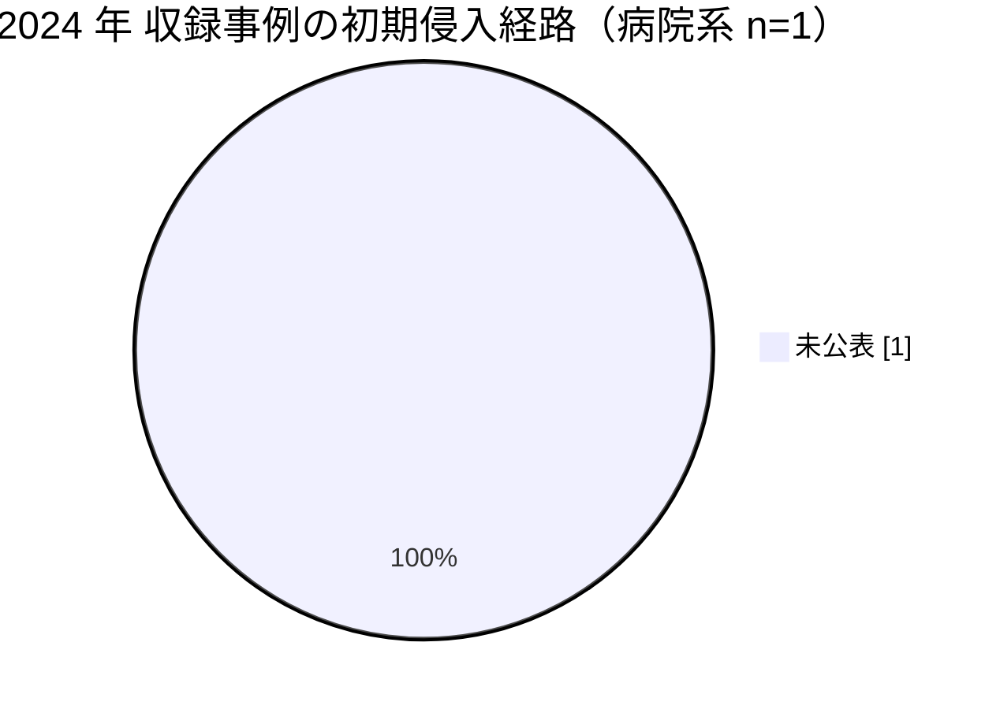

# 🇯🇵 国内の事例 2024 年（サマリー）

> [!NOTE]
> 本ページの集計は、断りのない限り**本リポジトリに収録した事例**を母集団とする。
> 国内で発生した被害の全数ではない。
> 外部統計を引くときは、その出典を併記する。
> 個別の経緯は [2024 年の履歴](2024-timeline.md) を参照してほしい。

## その年の要点

**分析**：被害の評価軸が、診療の停止から診療情報の性質へ広がった年である。
[JP-2024-01 岡山県精神科医療センター](2024-timeline.md#JP-2024-01)では、精神科という診療科の性質から、流出しうる情報の内容そのものが論点になった。
漏えい規模を人数だけで測ると、この種のリスクは評価に載らない。

## 外部統計

| 統計 | 参照先 | 本リポジトリでの集計状況 |
|---|---|---|
| ランサムウェア被害の報告件数（業種別、半期ごと） | [警察庁 サイバー空間をめぐる脅威の情勢等](https://www.npa.go.jp/publications/statistics/cybersecurity/index.html) | 未集計 |
| 個人情報の漏えい等報告 | [個人情報保護委員会](https://www.ppc.go.jp/) | 未集計 |

数値は原典を確認したうえで追記する。

## 収録事例の集計

### 区分別の件数

| 区分 | 件数 | 内訳 |
|---|---|---|
| 病院系 | 1 | 公立の精神科病院 1 |
| 製薬企業系 | 0 | 収録なし |
| 医療関連事業者 | 0 | 収録なし |

### 初期侵入経路の内訳（病院系）

侵入経路が公表されない事案は、他の医療機関が自組織の対策に転用できる情報を残さない。

### 診療への影響

| 区分 | 組織 | 停止した範囲 | 情報流出 |
|---|---|---|---|
| 病院系 | 岡山県精神科医療センター | 電子カルテを含むシステム | 数万人規模の患者情報が流出した可能性を公表 |

## この年を象徴する事例

- [JP-2024-01 岡山県精神科医療センター](2024-timeline.md#JP-2024-01)：流出しうる診療情報の性質が、被害評価の中心になった事例

## 規制と制度の動き

前年の 2023 年 4 月に医療法施行規則の改正が施行され、医療情報システムの安全管理措置が医療機関の管理者の義務になっている。
2024 年 5 月 17 日には、経済安全保障推進法にもとづく基幹インフラ制度の運用が始まった（この時点で医療分野は対象外。2026 年の改正で追加される）。
詳細は [国内のガイドラインと法規制](../../../guidelines/japan.md) を参照してほしい。

## 前年との差分

**分析**：2023 年は本リポジトリに収録した国内事例がない。
2024 年の 1 件は、侵入経路が公表されていない点で、[2021 年](2021-summary.md)と[2022 年](2022-summary.md)の事案と性質が異なる。
調査報告書の公表は、国内で定着した慣行にはなっていない。

---

[← 2023 年サマリー](2023-summary.md) | [2024 年の履歴](2024-timeline.md) | [国内の事例](README.md) | [2025 年サマリー →](2025-summary.md) | [トップへ](../../../../README.md)
