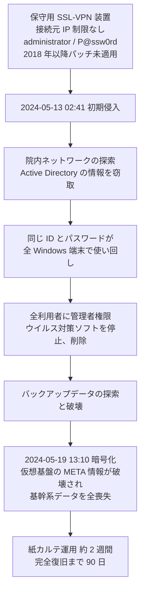

# 🇯🇵 国内の事例 2024 年（履歴）

> [!NOTE]
> **表記ルール**：本ページでは、**事実**（一次情報で確認できる内容。出典を併記する）、**報道ベース**（報道や第三者の集計のみで確認でき、当事者の公表資料では裏付けが取れていない内容）、**分析**（筆者の解釈）を書き分ける。
> [対象の区分](../README.md#対象の区分)と[一次情報の強度](../README.md#一次情報の強度)の定義は、インシデント事例集のトップにまとめている。
> その年の情勢と集計は [2024 年サマリー](2024-summary.md) にまとめている。

## 収録件数

| 区分 | サイバー攻撃 | その他の事案 |
|---|---|---|
| 病院系 | 1 | 0 |
| 製薬企業系 | 0 | 0 |
| 医療関連事業者 | 0 | 0 |

---

## 病院系

| ID | 発生時期 | 組織 | 種別 | 初期侵入経路 | 診療への影響 | 業務停止期間 | 一次情報の強度 |
|---|---|---|---|---|---|---|---|
| [JP-2024-01](#JP-2024-01) | 2024-05 | 岡山県精神科医療センター | ランサムウェア | 保守用 SSL-VPN 装置（報告書が侵入口と想定。手口は 3 通りのいずれかと推測） | 電子カルテ停止、最大 4 万人分の要配慮個人情報が流出 | 紙カルテ運用が 約 2 週間。完全復旧まで **90 日**（2024-05-19 から 08-17） | 報告書 |

### JP-2024-01 岡山県精神科医療センター（2024 年 5 月）

**事実**

以下は、一般社団法人ソフトウェア協会 Software ISAC の調査委員会が 2025 年 2 月 13 日に公表した「ランサムウェア事案調査報告書」による。

- 2024 年 5 月 19 日 16 時ごろ、電子カルテを含む統合情報システムに障害が発生し、翌 20 日 6 時 15 分ごろ、バックアップファイルの不審な拡張子からランサムウェア感染が確認された。同日 16 時に公表した。
- **初期侵入**：フォレンジック調査により、初期侵入は 2024 年 5 月 13 日 2 時 41 分と確認された。暗号化の開始は 5 月 19 日 13 時 10 分ごろで、その間に院内ネットワークの探索、バックアップデータの探索と破壊、Active Directory の情報の窃取、ウイルス対策ソフトの停止と削除が実施されている。
- **侵害範囲**：仮想サーバ 23 台、仮想用共有ストレージ 1 台、仮想基盤用物理サーバ 3 台、その他の物理サーバ 6 台、HIS 系端末 244 台が暗号化された。仮想基盤の META 情報が破壊され、基幹系システムのデータは全喪失となった。
- **情報流出**：2024 年 6 月 7 日、岡山県警察本部から個人情報の流出を確認した旨の連絡があった。流出したのは電子カルテ内の情報ではなく、本院サーバの共有フォルダに置かれた医事情報、行政調査情報、ケア会議議事録などの文書で、氏名、住所、生年月日、病名を含む**最大 4 万人分**と推定されている。病院は 6 月 11 日に記者会見を行い、要配慮個人情報の漏えいの事実を公表した。
- **電子カルテからの漏えい**：報告書は、ログオン失敗が 35 件にとどまり総当たりの痕跡がないこと、データベースの閲覧に接続文字列が必要であることから、電子カルテへの接続と閲覧による漏えいの可能性は「極めて低い」と結論している。リークサイト上でも、2025 年 2 月時点で病院の情報は確認できていない。
- **業務停止期間**：電子カルテがすべて閲覧できなくなり、紙カルテによる運用へ切り替えた。2024 年 6 月 1 日から中古サーバによる仮復旧の電子カルテで運用を始めており、紙運用は**約 2 週間**にあたる。
- **代替運用**：障害の翌週の月曜日から紙カルテで診療を継続した。災害対策本部を立ち上げて対応している。
- **完全復旧**：7 月 4 日に電子カルテを復旧し、8 月 17 日のサーバストレージ入替をもって、発生から **90 日**で病院情報システムの完全復旧に至った。復旧工数は電子カルテベンダを含めて約 65 人月と試算されている。
- **復旧の方法**：オフラインバックアップの取得契約はあったが、正しく取得されておらず復旧に使えなかった。暗号化を免れた医療情報 DWH サーバから電子カルテのデータを取り出して復旧した。
- 病院は身代金の支払いと攻撃者への連絡、交渉を一切行わず、自力で復旧する方針を採った。
- 精神科医療という、特に配慮を要する診療情報を扱う医療機関での被害である。情報流出時の患者への影響が他の診療科より重くなりうる点で注目された。

**初期侵入経路（報告書の推測）**

報告書は、SSL-VPN 装置の Syslog が上書きされていたため侵入元の特定はできなかったとしたうえで、聞き取りとフォレンジック調査から次を確認している。

- データセンタに設置された保守用 SSL-VPN 装置（Cisco ASA-5506-X、2023 年 5 月 31 日にサポート終了）の ID とパスワードが `administrator` / `P@ssw0rd` だった。
- 院内のすべての Windows コンピュータの管理者の ID とパスワードにも、同じ組が使い回されていた。
- SSL-VPN 装置の脆弱性が 2018 年の設置以降修正されておらず、ランサムウェア攻撃に使われた実績のある脆弱性が複数残っていた（報告書は CVE-2020-3259、CVE-2023-20269、CVE-2020-3153 を挙げる）。
- 保守用 VPN 装置に接続元 IP アドレスの制限がなく、インターネット上の誰からでも到達できた。
- すべてのサーバと端末の利用者に管理者権限が付与されていた。

これらから、報告書は初期侵入の原因を、保守用 SSL-VPN 装置への辞書攻撃、Initial Access Broker からの資格情報の購入、SSL-VPN 装置の脆弱性の悪用のいずれかと推測している。
侵入口の装置は特定されているが、手口は確定していない。

**教訓（分析）**

| 論点 | 示唆 |
|---|---|
| 保守経路の扱い | 侵入口は診療系の入口ではなく、保守のために置かれた VPN 装置だった。接続元 IP の制限、パッチ適用、サポート期限の管理を、保守経路にも本番と同じ基準で課す必要がある（[医療機器のセキュリティ](../../../technology/medical-devices/)） |
| 認証情報の使い回し | 1 組の推測可能な認証情報が、境界の突破と院内全端末への水平展開の両方を成立させた。境界と内部で認証情報を分けるだけで、連鎖はその位置で止まる |
| 管理者権限の既定付与 | 全利用者への管理者権限の付与が、ウイルス対策ソフトの停止を容易にした。報告書は、医療情報システムでこの付与が半ば常態化しているとして、業界全体での見直しを求めている |
| バックアップの検証 | オフラインバックアップの契約はあったが、正しく取得されていなかった。取得の有無ではなく、復元できることを定期に確かめる運用でなければ検出できない（[事業継続](../../../response/bcp-cyber.md)） |
| 過去事例との同一性 | 報告書は、原因が[半田病院](2021-timeline.md#JP-2021-01)、[大阪急性期・総合医療センター](2022-timeline.md#JP-2022-01)と「まったく同じ」であると明記している。公表された報告書が、次の被害の防止に結び付いていない |
| 漏えいの評価軸 | 診療科によって、情報漏えいがもたらす被害の性質が異なる。精神科、産婦人科、感染症など、患者へのスティグマに直結する診療情報は、恐喝の圧力が高くなる。極端な例が海外の [Vastaamo 事件](../global/2020-timeline.md#GL-2020-03) である。リスクアセスメントでは「何件漏れるか」だけでなく「何が漏れるか」を評価軸に含める必要がある |

**一次情報**

- [岡山県精神科医療センター 公式サイト](https://www.okayama-pmc.jp/)
- [ランサムウェア事案調査報告書について](https://www.okayama-pmc.jp/home/consultation/er9dkox7/lromw3x9/)（岡山県精神科医療センター）
- [ランサムウェア事案調査報告書（PDF）](https://www.okayama-pmc.jp/wp-content/uploads/2025/02/24bb9b94f7eb10eff58b605c01c384ad.pdf)（Software ISAC 岡山県精神科医療センター ランサムウェア事案調査委員会、2025 年 2 月 13 日）
- [岡山県精神科医療センターにおけるサイバー攻撃に係る調査報告書の公表について](https://www.pref.okayama.jp/site/361/959336.html)（岡山県）

---

## 製薬企業系

本年の収録はない。

## 医療関連事業者

本年の収録はない。

## その他の事案（サイバー攻撃以外）

サポート詐欺、システム障害、内部不正、機器や記憶媒体の紛失と盗難、委託先の管理不備による漏えい、誤送付や誤公開、ドメインの失効を記録する。
類型の定義と、主分類との判定基準は[事案の類型](../README.md#事案の類型)にまとめている。

本年の収録はない。

---

[← 2023 年](2023-timeline.md) | [2024 年サマリー](2024-summary.md) | [国内の事例](README.md) | [2025 年 →](2025-timeline.md) | [トップへ](../../../../README.md)
