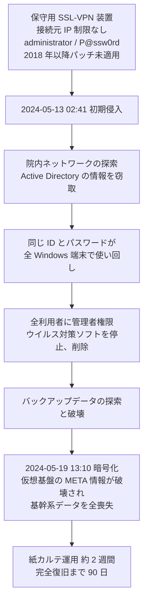
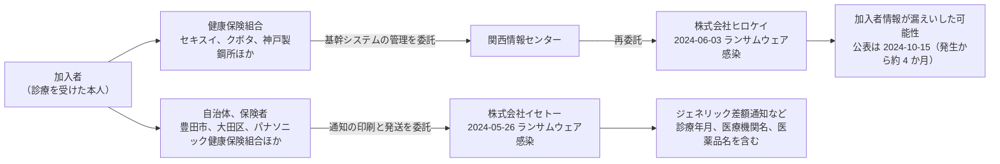

# 🇯🇵 国内の事例 2024 年（履歴）

> [!NOTE]
> **表記ルール**：本ページでは、**事実**（一次情報で確認できる内容。出典を併記する）、**報道ベース**（報道や第三者の集計のみで確認でき、当事者の公表資料では裏付けが取れていない内容）、**分析**（筆者の解釈）を書き分ける。
> [対象の区分](../README.md#対象の区分)と[一次情報の強度](../README.md#一次情報の強度)の定義は、インシデント事例集のトップにまとめている。
> その年の情勢と集計は [2024 年の情勢](../years/2024-summary.md) にまとめている。

## 収録件数

| 区分 | サイバー攻撃 | その他の事案 |
|---|---|---|
| 病院系 | 7 | 12 |
| 製薬企業系 | 3 | 0 |
| 医療関連事業者 | 9 | 0 |

委託先と再委託先を起点とする漏えいが目立った年である。
株式会社イセトーへの攻撃は、健康保険組合と自治体を通じて多数の医療関連情報を巻き込んだ。
収録は本リポジトリが一次情報を確認できた事案に限る。
国内で公表された医療関連の事案がこれで尽きることを示すものではない。

前年に発生し、本年に公表または処分が公表された事案も本ページに収める。
その場合は、発生時期の欄に発生と公表の両方を記す。

---

## 病院系

| ID | 発生時期 | 組織 | 種別 | 初期侵入経路 | 診療への影響 | 業務停止期間 | 一次情報の強度 |
|---|---|---|---|---|---|---|---|
| [JP-2024-04](#JP-2024-04) | 2024-01 | 国立研究開発法人量子科学技術研究開発機構 QST 病院 | ランサムウェア | 未公表 | 診療業務用ネットワークとは独立した研究用システムが対象 | 研究用システムの停止（復旧時期は未公表） | 当事者公表 |
| [JP-2024-05](#JP-2024-05) | 2023-12（2024-02 公表） | 北海道大学病院 | 不正アクセス（メールアカウント） | 未公表 | 公表なし | 診療の停止は公表されていない | 当事者公表 |
| [JP-2024-02](#JP-2024-02) | 2024-02 | 国分生協病院（鹿児島県霧島市） | ランサムウェア | 認証なしでリモートデスクトップ接続が可能な保守用の接続点 | 救急と一般外来の受入を制限。紙カルテで対応 | 画像管理サーバの仮復旧まで **約 3 週間**（02-27 から 03-18） | 当事者公表 |
| [JP-2024-01](#JP-2024-01) | 2024-05 | 岡山県精神科医療センター | ランサムウェア | 保守用 SSL-VPN 装置（報告書が侵入口と想定。手口は 3 通りのいずれかと推測） | 電子カルテ停止、最大 4 万人分の要配慮個人情報が流出 | 紙カルテ運用が **約 2 週間**。完全復旧まで **90 日**（2024-05-19 から 08-17） | 報告書 |
| [JP-2024-06](#JP-2024-06) | 2024-06 | 医療法人平成博愛会 印西総合病院（千葉県印西市） | 不正アクセス（ウェブサイトの改ざん） | 未公表 | 公表なし | ウェブサイトの改ざんが **約 8 時間半** | 当事者公表 |
| [JP-2024-07](#JP-2024-07) | 2024-07 | 地方独立行政法人秋田県立療育機構 秋田県立医療療育センター | 不正アクセス（ウェブサイトの改ざん） | 未公表 | 公表なし | ウェブサイトの改ざんが **約 11 時間半** | 当事者公表 |
| [JP-2024-17](#JP-2024-17) | 2024-10 | 広島市立北部医療センター安佐市民病院 | 不正アクセス（職員の私物端末） | 未公表 | 影響なし（電子カルテなど医療情報システムとは非接続） | 診療の停止は公表されていない | 当事者公表 |

### JP-2024-04 国立研究開発法人量子科学技術研究開発機構 QST 病院（2024 年 1 月）

**事実**

- 発生時期：2024 年 1 月 11 日 16 時ごろに異常を認識した。7 月 9 日に公表した。
- 対象組織：国立研究開発法人量子科学技術研究開発機構の QST 病院。重粒子線治療を行う施設である。
- 攻撃種別：ランサムウェアの被害を受けたと推定している。
- 初期侵入経路：未公表。
- 侵害範囲：診療業務用のネットワークとは独立して運用していたシステム。対象は、重粒子線治療多施設共同臨床研究システム（J-CROS）と放射線治療症例全国登録システム（JROD）である。
- 情報流出：症例情報は匿名化の処理を済ませていたため、患者を特定できないと説明した。
- 診療への影響：診療業務用のネットワークは独立しているため、直接の影響は限定的とされた。
- 業務停止期間：研究用システムの復旧の完了時期は公表されていない。

**分析**

- 対象は多施設の共同研究と全国登録のシステムである。単一の病院ではなく、参加している施設の症例が集まる場所が止まった。研究基盤の停止は、その日の診療には出ないが、参加施設の登録作業とデータの提出を止める。
- 匿名化を済ませていたことで、流出の影響が限定された。研究用のデータベースに匿名化を通した状態でしか入らない設計は、この年に国内で公表された事案のなかで、被害の抑制が事前の設計で説明できた数少ない例である（[ゲノムデータの保護](../../../technology/genomics.md)）。
- 認識から公表まで約 6 か月かかっている。参加施設への連絡は先に行われたとみられるが、公表の遅れは他の研究機関が同種の点検を行う機会を遅らせる。

**一次情報**

- [QST 病院が運用管理するシステムへのランサムウェア被害について](https://www.qst.go.jp/site/about-qst/20240709.html)（量子科学技術研究開発機構、2024 年 7 月 9 日）

---

### JP-2024-05 北海道大学病院（2023 年 12 月、2024 年 2 月に公表）

**事実**

- 発生時期：2023 年 12 月 27 日。2024 年 2 月 2 日に公表した。
- 対象組織：北海道大学病院。
- 攻撃種別：不正アクセス。職員が業務用として管理していたメールアカウントが第三者に不正利用された。
- 初期侵入経路：未公表。
- 侵害範囲：当該アカウントから、外部のメールアドレス **約 3 万件**を宛先とするフィッシングメールが送信された。
- 診療への影響：公表されていない。
- 公表された対策：経緯を自院のサイトで公表した。

**分析**

- 送信された約 3 万件は、この時期に国内の医療機関から発信されたなりすましメールとしては大きい。乗っ取られたアカウントが持つ宛先の数ではなく、攻撃者が用意した宛先へ送るために病院のアカウントが使われている。狙いは病院の情報ではなく、送信元としての信用である。
- 2022 年の[名古屋大学医学部附属病院](2022-timeline.md#JP-2022-05)、[奈良県立医科大学](2022-timeline.md#JP-2022-10)と同じ類型が、2 年続けて大学病院で起きている。多要素認証の導入が済んでいれば防げる範囲である（[認証とアクセス管理](../../../technology/identity.md)）。

**一次情報**

- [メールアカウントの不正使用によるフィッシングメールの送信について](https://www.huhp.hokudai.ac.jp/news/%e3%83%a1%e3%83%bc%e3%83%ab%e3%82%a2%e3%82%ab%e3%82%a6%e3%83%b3%e3%83%88%e3%81%ae%e4%b8%8d%e6%ad%a3%e4%bd%bf%e7%94%a8%e3%81%ab%e3%82%88%e3%82%8b%e3%83%95%e3%82%a3%e3%83%83%e3%82%b7%e3%83%b3%e3%82%b0/)（北海道大学病院、2024 年 2 月 2 日）

---

### JP-2024-02 国分生協病院（2024 年 2 月）

**事実**

- 発生時期：2024 年 2 月 27 日深夜。3 月 4 日に公表した。
- 対象組織：鹿児島県医療生活協同組合が運営する国分生協病院（鹿児島県霧島市）。
- 攻撃種別：ランサムウェア。
- 攻撃グループ：未公表。
- 初期侵入経路：画像管理サーバへ接続するための事業者用のネットワーク機器が、**外部から認証なしで院内のコンピュータへリモートデスクトップ接続できる設定**になっていた。加えて、画像管理サーバにウイルス対策ソフトが導入されていなかった。
- 侵害範囲：画像管理サーバ。保管されていた診療記録の PDF ファイルの一部が暗号化された。
- 情報流出：公表資料の範囲では確認されていない。
- 診療への影響：救急と一般外来の受入を制限しながら診療を継続した。電子カルテと医事会計は正常に稼働しており、紙カルテで予約外来と入院患者に対応した。
- 業務停止期間：3 月 18 日までに画像管理サーバの仮復旧が完了し、救急と一般外来の受入を再開した。**約 3 週間**にあたる。
- 公表された対策：システム事業者の協力を得て復旧を進め、経過を自院のサイトで段階的に公表した。

**分析**

- 侵入口は、診療系の入口ではなく、画像管理サーバの保守のために開けられた接続点である。認証を求めない設定は、保守の手間を減らすために選ばれることが多い。保守経路にも本番と同じ基準を課す必要がある点は、3 か月後の[岡山県精神科医療センター](#JP-2024-01)と共通する。
- 暗号化されたのは画像管理サーバだけで、電子カルテと医事会計は稼働を続けた。それでも救急と一般外来の受入を制限した。画像診断が使えないと、救急の判断ができないためである。止まった系統の数ではなく、止まった系統が診療のどこに位置するかが影響を決める。
- ウイルス対策ソフトが導入されていなかったことを、当事者が自ら公表した。原因を具体的に示した公表は、他の医療機関が自組織を点検する材料になる。

**一次情報**

- [「画像管理サーバー」の障害発生について](https://kokubu-seikyo.jp/2024/03/04/post-1537/)（国分生協病院、2024 年 3 月 4 日）
- [国分生協病院](https://kokubu-seikyo.jp/)

---

### JP-2024-01 岡山県精神科医療センター（2024 年 5 月）

**事実**

以下は、一般社団法人ソフトウェア協会 Software ISAC の調査委員会が 2025 年 2 月 13 日に公表した「ランサムウェア事案調査報告書」による。

- 2024 年 5 月 19 日 16 時ごろ、電子カルテを含む統合情報システムに障害が発生し、翌 20 日 6 時 15 分ごろ、バックアップファイルの不審な拡張子からランサムウェア感染が確認された。同日 16 時に公表した。
- **初期侵入**：フォレンジック調査により、初期侵入は 2024 年 5 月 13 日 2 時 41 分と確認された。暗号化の開始は 5 月 19 日 13 時 10 分ごろで、その間に院内ネットワークの探索、バックアップデータの探索と破壊、Active Directory の情報の窃取、ウイルス対策ソフトの停止と削除が実施されている。
- **侵害範囲**：仮想サーバ 23 台、仮想用共有ストレージ 1 台、仮想基盤用物理サーバ 3 台、その他の物理サーバ 6 台、HIS 系端末 244 台が暗号化された。仮想基盤の META 情報が破壊され、基幹系システムのデータは全喪失となった。
- **情報流出**：2024 年 6 月 7 日、岡山県警察本部から個人情報の流出を確認した旨の連絡があった。流出したのは電子カルテ内の情報ではなく、本院サーバの共有フォルダに置かれた医事情報、行政調査情報、ケア会議議事録などの文書で、氏名、住所、生年月日、病名を含む**最大 4 万人分**と推定されている。病院は 6 月 11 日に記者会見を行い、要配慮個人情報の漏えいの事実を公表した。
- **電子カルテからの漏えい**：報告書は、ログオン失敗が 35 件にとどまり総当たりの痕跡がないこと、データベースの閲覧に接続文字列が必要であることから、電子カルテへの接続と閲覧による漏えいの可能性は「極めて低い」と結論している。リークサイト上でも、2025 年 2 月時点で病院の情報は確認できていない。
- **業務停止期間**：電子カルテがすべて閲覧できなくなり、紙カルテによる運用へ切り替えた。2024 年 6 月 1 日から中古サーバによる仮復旧の電子カルテで運用を始めており、紙運用は**約 2 週間**にあたる。
- **代替運用**：障害の翌週の月曜日から紙カルテで診療を継続した。災害対策本部を立ち上げて対応している。
- **完全復旧**：7 月 4 日に電子カルテを復旧し、8 月 17 日のサーバストレージ入替をもって、発生から **90 日**で病院情報システムの完全復旧に至った。復旧工数は電子カルテベンダを含めて約 65 人月と試算されている。
- **復旧の方法**：オフラインバックアップの取得契約はあったが、正しく取得されておらず復旧に使えなかった。暗号化を免れた医療情報 DWH サーバから電子カルテのデータを取り出して復旧した。
- 病院は身代金の支払いと攻撃者への連絡、交渉を一切行わず、自力で復旧する方針を採った。
- 精神科医療という、特に配慮を要する診療情報を扱う医療機関での被害である。情報流出時の患者への影響が他の診療科より重くなりうる点で注目された。

**初期侵入経路（報告書の推測）**

報告書は、SSL-VPN 装置の Syslog が上書きされていたため侵入元の特定はできなかったとしたうえで、聞き取りとフォレンジック調査から次を確認している。

- データセンタに設置された保守用 SSL-VPN 装置（Cisco ASA-5506-X、2023 年 5 月 31 日にサポート終了）の ID とパスワードが `administrator` / `P@ssw0rd` だった。
- 院内のすべての Windows コンピュータの管理者の ID とパスワードにも、同じ組が使い回されていた。
- SSL-VPN 装置の脆弱性が 2018 年の設置以降修正されておらず、ランサムウェア攻撃に使われた実績のある脆弱性が複数残っていた（報告書は CVE-2020-3259、CVE-2023-20269、CVE-2020-3153 を挙げる）。
- 保守用 VPN 装置に接続元 IP アドレスの制限がなく、インターネット上の誰からでも到達できた。
- すべてのサーバと端末の利用者に管理者権限が付与されていた。

これらから、報告書は初期侵入の原因を、保守用 SSL-VPN 装置への辞書攻撃、Initial Access Broker からの資格情報の購入、SSL-VPN 装置の脆弱性の悪用のいずれかと推測している。
侵入口の装置は特定されているが、手口は確定していない。

**教訓（分析）**

| 論点 | 示唆 |
|---|---|
| 保守経路の扱い | 侵入口は診療系の入口ではなく、保守のために置かれた VPN 装置だった。接続元 IP の制限、パッチ適用、サポート期限の管理を、保守経路にも本番と同じ基準で課す必要がある（[医療機器のセキュリティ](../../../technology/medical-devices/)） |
| 認証情報の使い回し | 1 組の推測可能な認証情報が、境界の突破と院内全端末への水平展開の両方を成立させた。境界と内部で認証情報を分けるだけで、連鎖はその位置で止まる |
| 管理者権限の既定付与 | 全利用者への管理者権限の付与が、ウイルス対策ソフトの停止を容易にした。報告書は、医療情報システムでこの付与が半ば常態化しているとして、業界全体での見直しを求めている |
| バックアップの検証 | オフラインバックアップの契約はあったが、正しく取得されていなかった。取得の有無ではなく、復元できることを定期に確かめる運用でなければ検出できない（[事業継続](../../../response/bcp-cyber.md)） |
| 過去事例との同一性 | 報告書は、原因が[半田病院](2021-timeline.md#JP-2021-01)、[大阪急性期・総合医療センター](2022-timeline.md#JP-2022-01)と「まったく同じ」であると明記している。公表された報告書が、次の被害の防止に結び付いていない |
| 漏えいの評価軸 | 診療科によって、情報漏えいがもたらす被害の性質が異なる。精神科、産婦人科、感染症など、患者へのスティグマに直結する診療情報は、恐喝の圧力が高くなる。極端な例が海外の [Vastaamo 事件](../global/2020-timeline.md#GL-2020-03) である。リスクアセスメントでは「何件漏れるか」だけでなく「何が漏れるか」を評価軸に含める必要がある |

**一次情報**

- [岡山県精神科医療センター 公式サイト](https://www.okayama-pmc.jp/)
- [ランサムウェア事案調査報告書について](https://www.okayama-pmc.jp/home/consultation/er9dkox7/lromw3x9/)（岡山県精神科医療センター）
- [ランサムウェア事案調査報告書（PDF）](https://www.okayama-pmc.jp/wp-content/uploads/2025/02/24bb9b94f7eb10eff58b605c01c384ad.pdf)（Software ISAC 岡山県精神科医療センター ランサムウェア事案調査委員会、2025 年 2 月 13 日）
- [岡山県精神科医療センターにおけるサイバー攻撃に係る調査報告書の公表について](https://www.pref.okayama.jp/site/361/959336.html)（岡山県）

---

### JP-2024-06 医療法人平成博愛会 印西総合病院（2024 年 6 月）

**事実**

- 発生時期：2024 年 6 月 22 日 1 時ごろから 9 時 30 分ごろまで。6 月 24 日に公表した。
- 対象組織：千葉県印西市の医療法人平成博愛会 印西総合病院。
- 攻撃種別：不正アクセス。ウェブサイトが改ざんされ、本来とは異なるページが表示された。
- 初期侵入経路：未公表。
- 侵害範囲：ウェブサイト。
- 診療への影響：公表されていない。
- 公表された対策：経緯を自院のサイトで公表した。

**分析**

- 改ざんが続いたのは約 8 時間半で、深夜から午前中にかけての時間帯である。翌月の[秋田県立医療療育センター](#JP-2024-07)も、早朝から夕方までの約 11 時間半だった。どちらも半日で気づかれている。日中に人が見るページであれば、この程度の時間で発覚する。
- 医療機関のウェブサイトは、受診しようとする人が最初に見る場所である。偽のページが表示された時間帯に訪れた人が、そこから別のサイトへ誘導されうる。改ざんの被害は自組織ではなく訪問者に出る。

**一次情報**

- [医療法人平成博愛会 印西総合病院](https://inzai-hospital.jp/)
- [印西総合病院ウェブサイトが改ざん被害、本来とは異なるページが表示](https://scan.netsecurity.ne.jp/article/2024/07/03/51232.html)（ScanNetSecurity による当事者公表の報道）

---

### JP-2024-07 地方独立行政法人秋田県立療育機構 秋田県立医療療育センター（2024 年 7 月）

**事実**

- 発生時期：2024 年 7 月 1 日 6 時 42 分から 18 時 6 分まで。7 月 2 日に公表した。
- 対象組織：地方独立行政法人秋田県立療育機構 秋田県立医療療育センター。
- 攻撃種別：不正アクセス。ウェブサイトが改ざんされ、本来とは異なるページが表示された。
- 初期侵入経路：未公表。
- 侵害範囲：ウェブサイト。個人情報の流出はなかったと判断している。
- 診療への影響：公表されていない。
- 公表された対策：経緯を公表して謝罪した。

**分析**

- 改ざんの開始と終了の時刻を分単位で公表している。ウェブサーバのログを保存し、事後に読める状態にあったことを示す。同種の事案でここまで示せる例は多くない（[ログと監視の設計](../../../technology/logging.md)）。
- 療育センターは、障害のある子どもとその家族が利用する施設である。ウェブサイトの改ざんは、直接の被害が小さくても、利用者の不安に直結する。時刻を明示した公表は、その時間に訪れたかどうかを利用者自身が判断できる材料になる。

**一次情報**

- [個人情報流出無し ～ 秋田県立医療療育センターウェブサイトが改ざん被害](https://scan.netsecurity.ne.jp/article/2024/07/11/51291.html)（ScanNetSecurity による当事者公表の報道。同センターの公表資料へのリンクを含む）

---

### JP-2024-17 広島市立北部医療センター安佐市民病院（2024 年 10 月）

**事実**

- 発生時期：2024 年 10 月 9 日 17 時 30 分ごろ。10 月 11 日の時点で調査中と公表した。
- 対象組織：広島市立北部医療センター安佐市民病院。
- 攻撃種別：不正アクセス。院内ネットワークへ接続していた**職員の個人所有のパソコン**が外部から侵害され、端末内のファイルが閲覧できない状態になった。
- 初期侵入経路：未公表。
- 侵害範囲：当該端末には患者に関する情報が保存されていた。当該パソコンは電子カルテなどの医療情報システムとは接続していなかった。
- 情報流出：10 月 11 日の時点では確認されていない。
- 診療への影響：公表されていない。
- 公表された対策：情報流出の有無と被害の詳細を調査しているとした。

**分析**

- 侵害されたのは病院の資産ではなく、職員が持ち込んだ私物のパソコンである。それが院内ネットワークに接続され、患者情報を保存していた。台帳に載らない端末が、台帳に載る情報を持っていた。
- 「ファイルが閲覧できない状態」という記述は暗号化を示唆する。ランサムウェアが院内ネットワークに到達したが、私物端末 1 台で止まった形である。
- 私物端末の持ち込みは、2020 年の[福島県立医科大学附属病院](2020-timeline.md#JP-2020-01)、2021 年の[新潟県立精神医療センター](2021-timeline.md#JP-2021-07)でも起点になっている。5 年にわたって同じ経路が残っている（[ネットワークの分離](../../../technology/segmentation.md)）。

**一次情報**

- [外部から院内の職員私物端末にアクセス、影響など調査 - 安佐市民病院](https://www.security-next.com/162955)（Security NEXT による当事者公表の報道）

---

## 製薬企業系

| ID | 発生時期 | 組織 | 種別 | 初期侵入経路 | 影響 | 一次情報の強度 |
|---|---|---|---|---|---|---|
| [JP-2024-08](#JP-2024-08) | 2023-12 〜 2024-01 | 株式会社スリー・ディー・マトリックス（医療製品の開発） | フィッシング、BEC | 取引先になりすましたメール | 虚偽の口座へ 2 回にわたり送金。約 86 万米ドルと 50 万米ドル | 当事者公表 |
| [JP-2024-18](#JP-2024-18) | 2024-06 | 新日本製薬株式会社 | ランサムウェア | VPN 機器の脆弱性の悪用と、類推されたパスワード | サーバ内の業務関連データが暗号化された。外部へのデータ流出は確認されず | 当事者公表 |
| [JP-2024-09](#JP-2024-09) | 2024-07 | サノフィ株式会社（医療用医薬品、ワクチン） | 不正アクセス（委託先の端末経由） | 海外の業務委託コンサルタントの個人用ノートパソコンのマルウェア感染 | 同社データベースの一部へアクセスされ、個人情報が流出した可能性 | 当事者公表 |

### JP-2024-08 株式会社スリー・ディー・マトリックス（2023 年 12 月から 2024 年 1 月）

**事実**

- 発生時期：2023 年 12 月 19 日から 2024 年 1 月上旬。2024 年 1 月 25 日に公表した。
- 対象組織：医療製品の開発を手がける株式会社スリー・ディー・マトリックス（東証グロース上場）。
- 攻撃種別：フィッシング、BEC（ビジネスメール詐欺）。
- 手口：取引先になりすましたメールで支払い口座の変更を指示された。経営者間の信頼関係にもとづいて応じ、虚偽の銀行口座へ送金した。複数の異なる口座への送金指示があった。
- 被害額：1 回目が原料代金として **約 86 万米ドル**、2 回目が代金の一部として **50 万米ドル**。
- 公表された対策：被害を公表し、関連資料を IR 情報として公開した。

**分析**

- 侵害されたのはシステムではなく、支払いの承認の手順である。攻撃者が突いたのは、経営者どうしの関係が確認の代わりになる運用である。BEC は技術的な防御では止まらない。
- 対象は原薬の代金である。製薬と医療製品の分野では、海外の取引先との高額な送金が日常的に発生する。金額の大きさが異常値として検知されない（[原薬と受託製造](../../../reference/pharma/supply-chain.md)）。
- 2 回目の送金は、1 回目のあとに行われている。1 回目の時点で口座変更の事実確認を電話などの別経路で行っていれば、2 回目は防げた。口座変更は、依頼と同じ経路で確認してはならない。

**一次情報**

- [不正送金被害の発生に関するお知らせ（PDF）](https://pdf.irpocket.com/C7777/ZoWa/awjA/EOHM.pdf)（株式会社スリー・ディー・マトリックス、2024 年 1 月 25 日）

---

### JP-2024-18 新日本製薬株式会社（2024 年 6 月）

**事実**

- 発生時期：2024 年 6 月 4 日に被害が判明した。
- 対象組織：新日本製薬株式会社。
- 攻撃種別：ランサムウェア。サーバ内の業務関連データが暗号化された。
- 初期侵入経路：**VPN 機器の脆弱性**が悪用され、類推されたパスワードを用いてネットワークへ侵入された。
- 侵害範囲：暗号化されたサーバ内のデータ。VPN 機器、サーバ、端末を調査した。
- 情報流出：外部へのデータの流出は確認されなかった。
- 業務への影響：バックアップデータを用いて復旧を進めた。
- 公表された対策：ネットワークとエンドポイントのセキュリティを強化し、パスワードのポリシーを強化した。脆弱性の管理を徹底して診断を実施し、IT システムの事業継続計画を見直すとした。

**分析**

- 侵入口は VPN 機器の脆弱性と、類推できるパスワードの組み合わせである。2021 年の[つるぎ町立半田病院](2021-timeline.md#JP-2021-01)（CVE-2018-13379）、2024 年の[岡山県精神科医療センター](#JP-2024-01)（保守用 SSL-VPN 装置、`administrator` と `P@ssw0rd`）と同じ型が、製薬の側でも起きている。医療と製薬で、境界機器の管理の弱点は共通する。
- 流出は確認されなかった一方、暗号化は成立している。バックアップから復旧できたことが、被害を業務の停止だけにとどめた。
- 対策として「脆弱性管理の徹底と診断の実施」を挙げている。VPN 機器を持つ組織で、その機器のバージョンを誰が追うかを決めていない状態が、この事案の前提にある（[外部から見た自組織の攻撃面](../../../practice/attack-surface.md)）。

**一次情報**

- [新日本製薬株式会社](https://corporate.shinnihonseiyaku.co.jp/)
- [サーバがランサム被害、VPN 脆弱性が標的に - 新日本製薬](https://www.security-next.com/161033)（Security NEXT による当事者公表の報道）

---

### JP-2024-09 サノフィ株式会社（2024 年 7 月）

**事実**

- 発生時期：2024 年 7 月 10 日にマルウェアへ感染し、7 月 10 日から 14 日にかけて不正アクセスが行われた。8 月 28 日に公表した。
- 対象組織：医療用医薬品とワクチンを提供するサノフィ株式会社。
- 攻撃種別：不正アクセス。
- 初期侵入経路：海外の業務委託コンサルタントが使用していた個人用のノートパソコンがマルウェアに感染した。当該コンサルタントは、IT セキュリティのポリシーに反してアクセス ID などを個人のパソコンに保存していた。
- 侵害範囲：同社データベースの一部。個人情報が流出した可能性がある。
- 公表された対策：当該コンサルタントとの契約を即時に解除した。公表までに時間を要した経緯についても資料を公開した。

**分析**

- 侵入口は、委託先の個人が所有する端末である。委託元の管理下にない端末に、委託元のシステムへの認証情報が保存されていた。委託契約に端末の要件を書いても、実際に何が使われているかは委託元からは見えない（[委託先への依存](../../../response/dependencies.md)）。
- 不正アクセスは 5 日間で、感染から検知までの期間にあたる。認証情報が保存されていたことが、感染した端末を足がかりに社内のデータベースへ到達できた理由である。ID の保存を許さない仕組み（多要素認証、短命な資格情報）が対策になる。
- 公表までに約 1 か月半かかった経緯を、別途説明している。遅れの理由を示す公表は、他の組織が自組織の公表基準を検討する材料になる。

**一次情報**

- [サノフィ株式会社](https://www.sanofi.co.jp/)
- [契約即時解除 ～ 業務委託コンサルタントの PC マルウェア感染](https://scan.netsecurity.ne.jp/article/2024/09/05/51586.html)（ScanNetSecurity による当事者公表の報道）

---

## 医療関連事業者

| ID | 発生時期 | 組織 | 種別 | 初期侵入経路 | 影響 | 一次情報の強度 |
|---|---|---|---|---|---|---|
| [JP-2024-13](#JP-2024-13) | 2024-01 | 公益財団法人埼玉県健康づくり事業団 | ランサムウェア | 未公表 | X 線画像読影システムが対象。埼玉県立学校の健診と、自治体から受託した集団がん検診に影響。データ窃取の有無を断定できないとした | 当事者公表 |
| [JP-2024-19](#JP-2024-19) | 2024-02 | ほくやく・竹山ホールディングス株式会社（医薬品卸、医療機器、札幌市） | ランサムウェア（Enmity） | SIM カードを搭載したノートパソコンを起点にリモートデスクトップで接続され、ドメイン管理者の正規の ID とパスワードで業務用サーバへ | サーバのデータが暗号化された。復号には至らず、別に保存していたデータで事業を継続 | 当事者公表 |
| [JP-2024-10](#JP-2024-10) | 2024-02 | 株式会社アイル（臨床検査、京都市） | ランサムウェア | 未公表 | 文書管理サーバが感染しシステムを停止。検体検査に遅延が発生した | 当事者公表 |
| JP-2024-11 | 2024-02 | 公益社団法人日本放射線技術学会 北海道支部 | 不正アクセス | メールマガジン配信に使っていた市販 CGI プログラムの脆弱性。管理者アカウントが乗っ取られた | 購読者のメールアドレスを記載した CSV ファイルへのリンクがインターネット上に公開された | 当事者公表 |
| JP-2024-12 | 2024-04 | メイラ株式会社（医療分野向けの精密加工部品） | ランサムウェア | グループ会社の管理者アカウントの不正利用 | 複数のサーバが暗号化された。個人情報が流出した可能性 | 当事者公表 |
| [JP-2024-03](#JP-2024-03) | 2024-05 | 株式会社イセトー | ランサムウェア | 未公表 | 委託元の自治体、金融機関、健康保険組合などの情報が漏えい。健保組合を通じて医療分野へ波及 | 当事者公表 |
| [JP-2024-14](#JP-2024-14) | 2024-06 | 株式会社ヒロケイ（健康保険組合の基幹システムの再委託先） | ランサムウェア | 未公表 | セキスイ健保組合をはじめとする複数の健康保険組合の加入者情報が漏えいした可能性 | 当事者公表 |
| [JP-2024-15](#JP-2024-15) | 2024-08 | 株式会社ニチイホールディングス、株式会社ニチイ学館 | ランサムウェア | グループ子会社（ニチイケアパレス）のパソコンから社内ネットワークを介して拡大 | ニチイホールディングスとニチイ学館のパソコン内の電子データが暗号化された | 当事者公表 |
| JP-2024-16 | 2024-09 | アルケア株式会社（医療機器、医療用消耗材料） | 不正アクセス（メールアカウント） | 未公表 | 同社のメールアカウントが不正に利用され、不特定多数へなりすましメールが送信された | 当事者公表 |

### JP-2024-19 ほくやく・竹山ホールディングス株式会社（2024 年 2 月）

**事実**

- 発生時期：2024 年 2 月 3 日未明。
- 対象組織：北海道でヘルスケア関連の事業（医薬品卸、医療機器、臨床検査）を展開するほくやく・竹山ホールディングス株式会社（札幌市）。
- 攻撃種別：ランサムウェア（**Enmity**）。サーバのデータが暗号化された。
- 初期侵入経路：**SIM カードを搭載したノートパソコン**が攻撃の起点となった。同端末へリモートデスクトップで接続され、そこから業務用サーバへ侵入された。不正アクセスに使われた ID とパスワードは、**ドメイン管理者の正規のもの**であった。
- 侵害範囲：暗号化されたデータの復号には至っていない。データの漏えいは確認されず、個人情報の流出もないとした。
- 業務への影響：別に保存していたデータにより事業を継続した。
- 公表された対策：多要素認証の導入、セキュリティ対策ソフトの強化、脆弱性管理の徹底、従業員教育の強化、セキュリティポリシーの見直しを実施するとした。

**分析**

- 起点は **SIM カードを搭載したノートパソコン**である。社内の無線 LAN や VPN を経由せず、携帯回線で直接インターネットへつながる端末は、社内ネットワークの境界の外側にありながら、社内のドメインに参加している。境界での監視から外れ、なおかつ内部の資格情報を持つ（[ネットワークの分離](../../../technology/segmentation.md)）。
- 使われたのはドメイン管理者の**正規の**資格情報である。脆弱性の悪用ではないため、パッチの適用では防げない。多要素認証を対策の筆頭に挙げているのは、この経路に対して直接効くためである（[認証とアクセス管理](../../../technology/identity.md)）。
- 同社は道内の医薬品卸である。医薬品の供給が止まれば、影響は道内の医療機関と薬局に出る。この年は、[アイル](#JP-2024-10)（臨床検査）、[ニチイ](#JP-2024-15)（介護と医療事務）と並んで、医療を支える事業者が続けて被害を公表した。

**一次情報**

- [ほくやく・竹山ホールディングス株式会社](https://www.hokutake.co.jp/)
- [ランサム被害、SIM カード搭載 PC が攻撃起点か - ほくやく・竹山 HD](https://www.security-next.com/158253)（Security NEXT による当事者公表の報道）

---

### JP-2024-10 株式会社アイル（2024 年 2 月）

**事実**

- 発生時期：2024 年 2 月 5 日早朝に障害を検知し、確認により感染が判明した。2 月 9 日に公表した。
- 対象組織：臨床検査事業を手がける株式会社アイル。
- 攻撃種別：ランサムウェア。文書管理サーバが感染した。
- 初期侵入経路：未公表。
- 侵害範囲：文書管理サーバ。システムを停止した。
- 業務への影響：**検体検査に遅延が発生した**。
- 公表された対策：経緯を自社のサイトで公表した。

**分析**

- 感染したのは検査機器ではなく文書管理サーバである。それでも検体検査が遅れた。検査の依頼書と報告書の受け渡しは文書の流れであり、そこが止まれば結果は返せない。
- 検体検査の外部委託は、多くの医療機関が日常的に行っている。委託先の停止は、依頼した医療機関では「結果が返ってこない」という形で現れる。原因が委託先の障害であることは、しばらく分からない（[委託先への依存](../../../response/dependencies.md)）。
- 検査結果の遅延は、診断と治療開始の遅延に直結する。感染症の起因菌の同定、悪性腫瘍の病理診断、薬剤の血中濃度の測定はいずれも待てない。

**一次情報**

- [当社サーバーへの不正アクセスによるシステム停止事案のお知らせ（PDF）](https://www.eil.jp/pdf/240209.pdf)（株式会社アイル、2024 年 2 月 9 日）

---

### JP-2024-13 公益財団法人埼玉県健康づくり事業団（2024 年 1 月）

**事実**

- 発生時期：2024 年 1 月 29 日。1 月 31 日に同事業団が公表した。5 月 21 日に埼玉県教育委員会が調査結果を公表した。
- 対象組織：公益財団法人埼玉県健康づくり事業団。埼玉県立学校の生徒と教職員を対象とする胸部および胃部のレントゲン検診と、自治体から受託した集団がん検診を担う。
- 攻撃種別：ランサムウェア。X 線画像読影システムが対象。
- 初期侵入経路：未公表。
- 侵害範囲：X 線画像読影システム。委託元の自治体（越生町など）も、住民へ不審な連絡への注意を呼びかけた。
- 情報流出：データが窃取されたかどうかを完全に断定することはできないとした。
- 業務停止期間：公表の時点で復旧の時期は未定とされた。
- 公表された対策：同事業団が経緯を公表し、埼玉県教育委員会が調査結果を公表した。

**分析**

- 対象は学校健診の X 線画像である。医療機関ではなく健診機関が持つ画像であり、被写体は未成年を含む。健診のデータは、医療機関の外に大量に蓄積される。
- 「窃取の有無を断定できない」という結論は、外部への通信の記録が十分に残っていなかったことを示す。断定できない場合、対象者への通知は「可能性がある」という形になり、対象者は自衛の判断ができない。
- 学校健診の受託は、都道府県ごとに少数の事業団に集中する。1 者の被害が、県全体の生徒と教職員に及ぶ構造になる。

**一次情報**

- [公益財団法人埼玉県健康づくり事業団](https://www.saitama-kenkou.or.jp/)
- [X 線画像読影システムへランサムウェア攻撃 ～ 埼玉県健康づくり事業団](https://scan.netsecurity.ne.jp/article/2024/02/06/50558.html)（ScanNetSecurity による当事者公表の報道。同事業団の公表 PDF へのリンクを含む）
- [埼玉県立学校の健康診断業務委託先にランサムウェア攻撃、データ窃取の有無を完全に断定することはできず](https://scan.netsecurity.ne.jp/article/2024/05/30/51074.html)（ScanNetSecurity による当事者公表の報道）

---

### JP-2024-03 株式会社イセトー（2024 年 5 月）

**事実**

- 発生時期：2024 年 5 月 26 日に、複数のサーバと PC がランサムウェアの被害を受けた。
- 対象組織：京都市の情報処理サービス事業者。自治体、金融機関、保険者から、各種通知の作成と発送の業務を受託していた。
- 攻撃種別：ランサムウェア。
- 初期侵入経路：未公表。
- 侵害範囲：委託元から預かっていたデータを含むサーバ。
- 情報流出：委託元ごとに個別の公表が行われた。医療分野では、健康保険組合の加入者情報が対象になった。パナソニック健康保険組合の公表によると、漏えいした項目には**住所、被保険者名、受診者名、保険証番号、事業所名、診療年月、医療機関名、医薬品名**が含まれる。
- 公表された対策：同社は調査結果と再発防止策を 2024 年 10 月に公表した。委託元の各組織も、それぞれ対象者へ通知した。

**報道ベース**

- ランサムウェアグループ 8Base が、自らのリークサイトで同社への攻撃を主張した。当事者は攻撃グループを公表していないため、帰属は確定していない。
- 委託元には、日本生命保険、ローソン銀行、伊予銀行、ソニー損害保険など多数の組織が含まれた。

**分析**

- 漏えいした項目に、診療年月、医療機関名、医薬品名が含まれる。これは受診した事実と病名を示す。健康保険組合の通知業務は事務作業に見えるが、扱う情報の中身はレセプトそのものである。
- 対象者は、加入する健康保険組合を通じて通知を受けた。医療機関でも保険者でもない事業者から情報が出たため、対象者から見ると自分の情報がそこにあった理由が分からない。同じ構造は海外の [OneTouchPoint](../global/2022-timeline.md#GL-2022-25) にも現れている。
- 医療機関から見た教訓は、健康保険組合や自治体を通じた通知の作成と発送を、どの事業者が担っているかを把握しているかどうかである。委託の連鎖が 2 段、3 段になると、自組織の患者情報がどこにあるかを追えなくなる（[委託先への依存](../../../response/dependencies.md)）。

**一次情報**

- [不正アクセスによる個人情報漏えいに関するお詫びとご報告](https://www.iseto.co.jp/news/news_202410.html)（株式会社イセトー、2024 年 10 月）
- [ランサムウェア被害の発生について（続報）](https://www.iseto.co.jp/news/news_202406.html)（株式会社イセトー、2024 年 6 月）
- [（第二報）業務委託先への不正アクセスによる個人情報漏えいについて（PDF）](https://phio.panasonic.co.jp/news/pdf/2024/08.pdf)（パナソニック健康保険組合、2024 年 7 月 4 日）

---

### JP-2024-14 株式会社ヒロケイ（2024 年 6 月）

**事実**

- 発生時期：2024 年 6 月 3 日。10 月 15 日にセキスイ健保組合が公表した。
- 対象組織：健康保険組合の基幹システムの管理を受託した関西情報センターの再委託先である株式会社ヒロケイ。
- 攻撃種別：ランサムウェア。同社のサーバが感染した。
- 初期侵入経路：未公表。
- 侵害範囲：セキスイ健保組合をはじめとする複数の健康保険組合の加入者情報が漏えいした可能性がある。クボタ健保組合、神戸製鋼所健保組合なども同じ攻撃による被害の可能性を公表している。
- 公表された対策：各健康保険組合が、二次被害への注意を含めて公表した。

**分析**

- 委託の連鎖が 2 段になっている。健康保険組合から関西情報センターへ、そこからヒロケイへ渡っていた。加入者から見ると、自分の情報が 3 者目にあった理由は説明されていない。同じ年の[イセトー](#JP-2024-03)と同じ構造である（[委託先への依存](../../../response/dependencies.md)）。
- 発生から公表まで約 4 か月ある。再委託先での被害は、委託元へ伝わるまでに時間がかかり、そこから各健康保険組合が自組織の影響を確定するまでにさらに時間がかかる。連鎖が長いほど、対象者への通知は遅れる。
- 健康保険組合が持つのは加入者の資格情報とレセプトである。医療機関の外にある要配慮個人情報の集積地であり、この年に国内で漏えいした医療関連情報の多くはここを経由している。

**一次情報**

- [業務委託先へのランサムウェア攻撃による個人情報漏えいの可能性について](https://sekisui-kenpo.or.jp/news/4335/)（セキスイ健保組合、2024 年 10 月 15 日）

---

### JP-2024-15 株式会社ニチイホールディングス、株式会社ニチイ学館（2024 年 8 月）

**事実**

- 発生時期：2024 年 8 月 8 日にグループ会社であるニチイケアパレスのパソコンで感染を確認した。8 月 16 日に公表した。
- 対象組織：株式会社ニチイホールディングスとそのグループ企業。介護、医療事務の受託、保育を手がける。
- 攻撃種別：ランサムウェア。
- 初期侵入経路：未公表。グループ子会社のパソコンから、社内ネットワークを介して他のシステムへ被害が広がった。
- 侵害範囲：ニチイホールディングスとニチイ学館のパソコン内に保存された電子データが暗号化された。
- 公表された対策：感染の確認後、社内ネットワークへの対応を実施した。

**分析**

- 起点はグループ子会社の 1 台である。そこから社内ネットワークを通じて親会社と別の子会社へ広がった。グループ全体が同一のネットワークにある構成では、いちばん守りの薄い法人が全体の入口になる（[ネットワークの分離](../../../technology/segmentation.md)）。
- ニチイ学館は、多数の医療機関から医療事務を受託している。受託先の窓口業務が止まれば、医療機関の会計と請求が止まる。
- 同じ年に、[イセトー](#JP-2024-03)（通知の印刷と発送）、[ヒロケイ](#JP-2024-14)（健康保険組合の基幹システム）、[アイル](#JP-2024-10)（臨床検査）が続けて被害を公表している。医療機関の業務のうち、外部へ出している部分が並んで狙われた年である。

**一次情報**

- [ランサムウエア被害の発生について（PDF）](https://www.nichiigakkan.co.jp/topics/assets/3df1f5d63c647147882f0efa2934851299f3cb1c.pdf)（株式会社ニチイ学館、2024 年 8 月 16 日）

---

## その他の事案（サイバー攻撃以外）

サポート詐欺、システム障害、内部不正、機器や記憶媒体の紛失と盗難、委託先の管理不備による漏えい、誤送付や誤公開、ドメインの失効を記録する。
類型の定義と、主分類との判定基準は[事案の類型](../README.md#事案の類型)にまとめている。

| ID | 発生時期 | 組織 | 区分 | 類型 | 概要 | 一次情報の強度 |
|---|---|---|---|---|---|---|
| [JP-2024-S01](#JP-2024-S01) | 2024-02 | 近畿大学病院（産婦人科） | 病院系 | サポート詐欺 | 非常勤医師の個人用パソコンがサポート詐欺の被害を受け、調査の過程で、申請を経ずに保管されていた患者 2003 名分のデータが判明した | 当事者公表 |
| [JP-2024-S02](#JP-2024-S02) | 2024-03 | 近畿大学病院（産婦人科） | 病院系 | 誤送付、誤公開、操作ミス | 胎児エコー動画を USB メモリで提供する際、録画機器の操作ミスにより複数の患者の動画が同じフォルダへ保存され、他の患者へ渡った。155 名、延べ 926 本 | 当事者公表 |
| [JP-2024-S03](#JP-2024-S03) | 2023-12（2024-02 公表） | 医療法人社団福寿会 福寿会足立東部病院（東京都足立区） | 病院系 | サポート詐欺 | 職員がインターネットの検索中に詐欺広告へ誘導され、記載の電話番号へかけて遠隔操作ソフトを導入した。**16 分間**にわたりパソコン内へアクセスされた。院内のシステム担当者が電話を切りネットワークを遮断して停止させた | 当事者公表 |
| JP-2024-S04 | 2020-03（2024-06 公表） | 名古屋大学医学部附属病院 | 病院系 | 誤送付、誤公開、操作ミス | 大学院医学系研究科の学生が SNS へ電子カルテの画面の写真を投稿し、患者の個人情報が流出した。手術画像の写真も含まれていた | 当事者公表 |
| JP-2024-S05 | 2024-08 | 沖縄県立南部医療センター、こども医療センター | 病院系 | 委託先の管理不備による漏えい | 医事会計の窓口業務を委託していた事業者が、診療費の入金にかかわる書類の一部を誤って廃棄した。焼却処分されたと判断している | 当事者公表 |
| [JP-2024-S06](#JP-2024-S06) | 2023-11（2024-10 処分公表） | 秋田大学医学部附属病院 | 病院系 | 内部不正 | 看護師が業務上の必要がないまま **1000 件以上**のカルテを不正に閲覧し、親族のカルテ情報を身内へ伝え、知人のカルテを閲覧したうえで本人へ架電した。停職 4 月の懲戒処分 | 当事者公表 |
| JP-2024-S07 | 2024-11 | 大阪公立大学医学部附属病院 | 病院系 | 誤送付、誤公開、操作ミス | 地域医療情報連携ネットワークで、患者一覧の表示マスタの設定を誤り、本来は表示されない患者一覧が連携先の登録医から閲覧できる状態になっていた | 当事者公表 |
| JP-2024-S08 | 2024-11（2024-12 公表） | 慶應義塾大学病院 | 病院系 | 機器、記憶媒体の紛失、盗難 | 医師が所有する個人用のパソコンを鞄ごと盗まれた。同院の患者 168 人と、以前の勤務先である虎の門病院の患者 1002 人の計 **1170 人**分。院内規定は私物への保存と院外への持ち出しを禁じていた。起動パスワードとデータの自動消去機能は設定済み | 当事者公表 |
| [JP-2024-S11](#JP-2024-S11) | 2023-11（2024-04 発覚） | 群馬大学医学部附属病院 | 病院系 | 誤送付、誤公開、操作ミス | 電子カルテシステムのメーカーが YouTube へ公開した導入事例の動画に、入院患者 42 人分の氏名、患者番号、診療科、入院日が約 6 秒間映り込んでいた | 当事者公表 |
| JP-2024-S12 | 2024-10 | 広島大学病院 | 病院系 | 内部不正 | 大学院の元教授が在職中に知り得た患者の氏名と住所を持ち出し、退職後に自ら開設したクリニックの案内とアンケートの送付に用いた。返却を求めたところ破棄したとの報告を受けた | 当事者公表 |
| [JP-2024-S10](#JP-2024-S10) | 2024-09（2024-11 公表） | 南医療生活協同組合 総合病院 南生協病院（名古屋市） | 病院系 | 機器、記憶媒体の紛失、盗難 | 病棟で使っていたパソコンを廃棄する際、消去装置が HDD にしか効かないことを知らないまま SSD を処理し、消去が不十分なまま処分業者へ引き渡した | 当事者公表 |
| [JP-2024-S09](#JP-2024-S09) | 2024-12 | 地方独立行政法人那覇市立病院 | 病院系 | システム障害 | 電気保安設備の法定点検後の復電の際、ネットワーク機器に過負荷がかかり、電子カルテと画像装置の一部で接続の不具合が生じた。診療を制限した | 当事者公表 |

### JP-2024-S01 近畿大学病院（産婦人科）（2024 年 2 月）

**事実**

- 発生時期：2024 年 2 月 29 日。2024 年 5 月 13 日に公表した。
- 類型：サポート詐欺。
- 発生原因：同院産婦人科の非常勤医師が、別の医療機関で勤務中に個人所有のパソコンでインターネットを利用していた際、サポート詐欺の被害を受けた。これを契機に当該パソコンを調査したところ、**研究目的で収集した患者データが削除されずに保有されていた**ことが判明した。医師は必要な申請手続きを経ずにデータを持ち出していた。
- 影響範囲：患者 **2003 名**分。氏名、患者 ID、年齢、診療情報。
- 診療への影響：なし。
- 公表された対策：対象の患者へ電話で個別に説明し、専用のコールセンターを開設した。外部のコンサルティング会社へ調査を依頼し、文部科学省と個人情報保護委員会へ報告した。

**分析**

- サポート詐欺そのものより、その調査で明らかになった保管の実態が問題の中心にある。研究のために持ち出したデータが、研究の終了後も個人の端末に残っていた。持ち出しの承認と、返却または削除の確認が対になっていなければ、この状態は検知できない。
- 非常勤医師は複数の医療機関で勤務する。データを持ち出した端末が、どの施設の管理下にもない状態で使われる。雇用の形態と端末の管理範囲が一致しない領域が残る（[認証とアクセス管理](../../../technology/identity.md)）。
- 医療機関でのサポート詐欺は、院内の端末と職員の自宅や私物の端末の双方で成立する。2025 年にも同種の事案を複数収録している（[JP-2025 のその他の事案](2025-timeline.md#その他の事案サイバー攻撃以外)）。

**一次情報**

- [近畿大学病院産婦人科における個人情報の漏洩について](https://www.med.kindai.ac.jp/notice/2024_0513_6086.html)（近畿大学病院、2024 年 5 月 13 日）

---

### JP-2024-S02 近畿大学病院（産婦人科）（2024 年 3 月）

**事実**

- 発生時期：2024 年 3 月 7 日に、患者 2 名から「USB メモリに別の方の動画が入っている」との報告を受けて発覚した。
- 類型：誤送付、誤公開、操作ミス。
- 発生原因：胎児エコー動画を患者へ提供する際、録画機器の「クローズ」処理を怠ったため、複数の患者のデータが同一のフォルダへ保存された。
- 影響範囲：155 名、延べ **926 本**の胎児エコー動画。氏名（アルファベット）、患者 ID、妊娠週数、胎児の計測値を含む。
- 診療への影響：なし。
- 公表された対策：郵送と電話で説明し、3 月 7 日以降はエコー動画の提供サービスを中止した。職員が訪問して削除の対応を行い、文部科学省と個人情報保護委員会へ報告した。

**分析**

- 患者へ渡す媒体が、別の患者の情報を運んだ。医療機関から患者へデータを渡す経路は、外部への送信としての点検の対象になりにくい。渡す前に内容を確認する手順があるかどうかが分かれ目になる。
- 動画の提供は、患者の希望に応える善意のサービスである。機器の操作手順に依存する仕組みは、担当者が代わるたびに誤りの余地が生じる。提供を続けるなら、1 件ごとに区切りを付ける操作を機器の側で強制する必要がある。

**一次情報**

- [近畿大学病院産婦人科における個人情報の漏洩について](https://www.med.kindai.ac.jp/notice/2024_0513_6086.html)（近畿大学病院、2024 年 5 月 13 日）

---

### JP-2024-S03 医療法人社団福寿会 福寿会足立東部病院（2023 年 12 月、2024 年 2 月に公表）

**事実**

- 発生時期：2023 年 12 月 4 日。2024 年 2 月 7 日に公表した。
- 類型：サポート詐欺。
- 発生原因：職員がインターネットの検索中に詐欺広告へ誘導され、表示された電話番号へ架電して遠隔操作ソフトを導入した。
- 影響範囲：攻撃者は **16 分間**にわたり当該のパソコン内へアクセスした。流出した個人情報の件数は公表されていない。
- 経過：院内のシステム担当者が電話を切り、ネットワークの遮断を指示して被害を止めた。
- 診療への影響：公表されていない。

**分析**

- 16 分という数字を公表している。遠隔操作の開始から遮断までの時間であり、被害の範囲を推定する材料になる。この粒度で公表する例は少ない。
- 止めたのは技術的な検知ではなく、院内のシステム担当者が異変に気づいたことである。サポート詐欺は、利用者本人が騙されている最中に第三者が気づけるかどうかで結果が変わる。声を上げやすい環境と、その場で遮断できる権限が要る。
- 医療機関でのサポート詐欺は、この年以降も続いている。2025 年には[紀和病院](2025-timeline.md#JP-2025-S06)と[有田休日急患診療所](2025-timeline.md#JP-2025-S27)を収録した。

**一次情報**

- [医療法人社団福寿会 福寿会足立東部病院](https://www.adachitobu.or.jp/)
- [16 分間の遠隔操作 ～ 福寿会足立東部病院へ不正アクセス](https://scan.netsecurity.ne.jp/article/2024/03/04/50664.html)（ScanNetSecurity による当事者公表の報道。同院の公表 PDF へのリンクを含む）

---

### JP-2024-S11 群馬大学医学部附属病院（2023 年 11 月、2024 年 4 月に発覚）

**事実**

- 発生時期：2023 年 11 月 23 日に動画が公開され、2024 年 4 月 23 日に問題が発覚した。
- 類型：誤送付、誤公開、操作ミス。
- 発生原因：電子カルテシステムのメーカーが、導入事例を紹介する動画を YouTube で公開した。その 10 分強の動画のうち **約 6 秒間**にわたり、同院の患者情報が映り込んでいた。動画の作成時に確認は行っていたが、見落とされていた。
- 影響範囲：入院患者 **42 人**分。氏名、患者番号、診療科、入院日。
- 対応：発覚した当日にメーカーが動画の公開を停止した。大学は対象の患者へ説明して謝罪した。
- 診療への影響：なし。

**分析**

- 情報を外へ出したのは病院ではなく、電子カルテのメーカーである。導入事例の紹介は、ベンダにとって営業の素材であり、病院にとっては協力の一環にすぎない。撮影の同意と、公開前の確認を誰が行うかが決まっていなかった。
- 公開から発覚まで **5 か月**かかっている。その間、動画は誰でも視聴できた。動画に映り込んだ情報は、テキストと違って検索に引っかからないため、外部からの指摘も遅れる。
- 同種の経路は、2024 年の[名古屋大学医学部附属病院](#その他の事案サイバー攻撃以外)（学生が電子カルテの画面を SNS へ投稿）や 2025 年の岩見沢市立総合病院（受付モニタの撮影と投稿）にも現れる。いずれも、電子カルテのアクセス制御を通過したあとの**画面**が院外へ出る経路である。

**一次情報**

- [群馬大学医学部附属病院](https://hospital.med.gunma-u.ac.jp/)
- [第三者の YouTube 動画に患者の電子カルテ情報 - 群大付属病院](https://www.security-next.com/157386)（Security NEXT による当事者公表の報道）

---

### JP-2024-S10 南医療生活協同組合 総合病院 南生協病院（2024 年 9 月、2024 年 11 月に公表）

**事実**

- 発生時期：2024 年 9 月 25 日にパソコン機器を廃棄した。11 月 25 日に公表した。
- 類型：機器、記憶媒体の紛失、盗難（廃棄時の消去不徹底）。
- 発生原因：病棟の業務で使っていたパソコンを廃棄する際、担当者がデータ消去装置で処理を行った。しかし、その装置は廃棄機器の大部分を占める HDD には有効だが **SSD には効果がない**ことを知らず、複数の SSD が消去されないまま処分業者へ引き渡された。
- 影響範囲：公表資料では具体的な台数と患者数は示されていない。
- 対応：情報が漏えいした可能性を公表した。
- 診療への影響：なし。

**分析**

- 消去の作業そのものは行われている。手順を守った結果として、消去されていない媒体が外へ出た。**手順が正しく実行されたかどうかと、記録が読めない状態になったかどうかは別の確認である**（[記憶媒体の廃棄と機器の下取り](../../../technology/media-disposal.md)）。
- HDD 向けの装置は磁気を用いる。SSD はフラッシュメモリであり、この方式では消えない。院内の機器が HDD から SSD へ置き換わる過程で、消去の手段だけが以前のまま残った。
- 2023 年の[気仙沼市立病院](2023-timeline.md#JP-2023-S03)（POS レジ端末をデータを消さずに処分し、フリマアプリで流通）と同じ類型である。あちらは消去を行わず、こちらは効かない方法で行った。どちらも、消去の結果を検証する工程がなかった点で共通する。

**一次情報**

- [南医療生活協同組合 総合病院 南生協病院](https://www.minami.or.jp/)
- [消去装置が SSD に効かないことを知らず ～ 南生協病院で PC 機器廃棄時に情報漏えいの可能性](https://scan.netsecurity.ne.jp/article/2024/12/05/52001.html)（ScanNetSecurity による当事者公表の報道）

---

### JP-2024-S09 地方独立行政法人那覇市立病院（2024 年 12 月）

**事実**

- 発生時期：2024 年 12 月 8 日 15 時ごろ。12 月 9 日に公表した。
- 類型：システム障害。
- 発生原因：電気保安設備の法定点検を行ったのち復電する際、ハブなどのネットワーク機器に過負荷がかかった。
- 影響範囲：電子カルテと画像装置の一部でネットワーク接続の不具合が生じた。
- 診療への影響：診療機能が低下し、診療を制限した。その後、診療制限の解除を公表した。
- 対応：障害の内容を翌日に公表した。

**分析**

- 攻撃ではなく、法定点検に伴う停電と復電が原因である。それでも、止まったのは電子カルテと画像装置であり、診療の制限に至った。可用性の喪失は、原因が悪意かどうかと無関係に同じ結果をもたらす。
- 復電時の突入電流でネットワーク機器が過負荷になる事象は、点検の計画段階で想定できる。段階的に電源を戻す手順と、機器ごとの起動の順序が決まっていたかが分かれ目になる。
- 停電を伴う点検は年に 1 回から数回あり、そのたびに同じ危険が生じる。サイバー攻撃への備えとして用意する事業継続の手順は、この種の計画的な停止にもそのまま使える（[サイバー攻撃を想定した BCP](../../../response/bcp-cyber.md)）。海外では、[GL-2022-S01 Guy's and St Thomas'](../global/2022-timeline.md#GL-2022-S01) が記録的な高温で 371 のシステムを止めている。環境と設備に起因する停止は、攻撃と同じ枠組みで備える対象である。

**一次情報**

- [地方独立行政法人 那覇市立病院](https://www.nahacity-hospital.jp/)
- [那覇市立病院でシステム障害、電子カルテと画像装置の一部に接続の不具合](https://scan.netsecurity.ne.jp/article/2024/12/24/52085.html)（ScanNetSecurity による当事者公表の報道）

---

### JP-2024-S06 秋田大学医学部附属病院（2023 年 11 月、2024 年 10 月に処分を公表）

**事実**

- 発生時期：2023 年 11 月。2024 年 10 月 22 日に懲戒処分を行い、10 月 23 日に公表した。
- 類型：内部不正。
- 発生原因：看護師が業務上の必要がないにもかかわらず、**1000 件以上**のカルテを不正に閲覧した。親族のカルテ情報を身内へ伝え、知人のカルテ情報を閲覧したうえで本人へ架電した。
- 影響範囲：閲覧されたカルテは 1000 件以上。
- 対応：停職 4 月の懲戒処分とした。
- 診療への影響：なし。

**分析**

- 1000 件以上という規模は、正規の権限で開いた画面の集積である。1 件ごとの操作は正当な権限の範囲にあり、異常は「担当していない患者を大量に開いた」という利用の偏りにしか現れない（[ログと監視の設計](../../../technology/logging.md)）。
- 同じ構図は、2020 年の[大阪市立十三市民病院](2020-timeline.md#JP-2020-S08)（5 年間で患者 20 人程度）にも見える。件数の差は、検知までの時間の差である。
- 知人のカルテを見たうえで本人へ架電している。閲覧の痕跡がログに残っても、その後の行動は院外で起きる。発覚は相手からの申し出に依存する。

**一次情報**

- [秋田大学](https://www.akita-u.ac.jp/)
- [入院患者のクレジットカード 45 万円不正使用 ～ 秋田大学医学部附属病院 2 件の懲戒処分](https://scan.netsecurity.ne.jp/article/2024/11/06/51868.html)（ScanNetSecurity による当事者公表の報道）

---

### その他の事案の一次情報

- [名古屋大学医学部附属病院](https://www.med.nagoya-u.ac.jp/hospital/)（JP-2024-S04）
- [沖縄県立南部医療センター、こども医療センターで書類を誤廃棄、焼却処分されたと判断](https://scan.netsecurity.ne.jp/article/2024/08/30/51555.html)（ScanNetSecurity による当事者公表の報道。JP-2024-S05）
- [大阪公立大学医学部附属病院](https://www.hosp.omu.ac.jp/)（JP-2024-S07）
- [医師が私物 PC を盗難、内部に患者の個人情報 - 慶大病院](https://www.security-next.com/165172)（Security NEXT による当事者公表の報道、JP-2024-S08）
- [広島大学](https://www.hiroshima-u.ac.jp/)（JP-2024-S12）

---

サイバー攻撃の事例を追加するときは、[事例テンプレート](../../../reference/_templates/incident.md) をコピーし、該当する区分の節に追記してほしい。
識別子は `JP-2024-20` から順に付ける。

サイバー攻撃以外の事案は、[その他の事案テンプレート](../../../reference/_templates/incident-other.md) をコピーし、「その他の事案」の節に追記する。
識別子は `JP-2024-S13` から順に付ける。

---

[← 2023 年](2023-timeline.md) | [2024 年の情勢](../years/2024-summary.md) | [国内の事例](README.md) | [2025 年 →](2025-timeline.md) | [トップへ](../../../../README.md)
