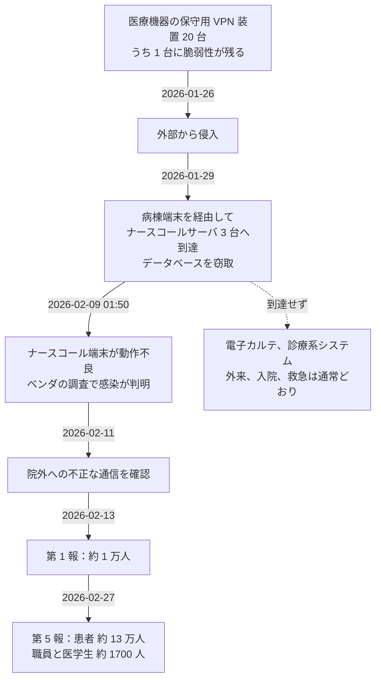
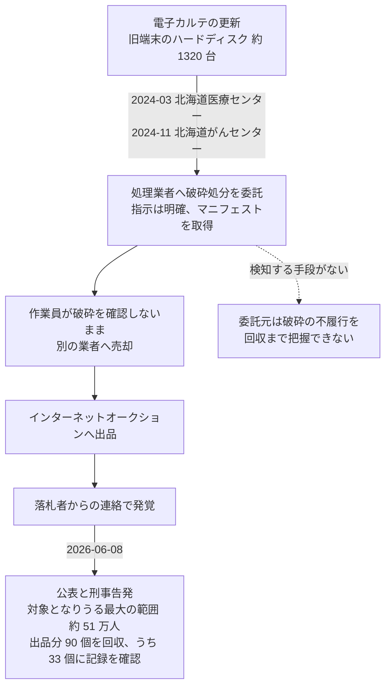

# 🇯🇵 国内の事例 2026 年（履歴）

> [!NOTE]
> **表記ルール**：本ページでは、**事実**（一次情報で確認できる内容。出典を併記する）、**報道ベース**（報道や第三者の集計のみで確認でき、当事者の公表資料では裏付けが取れていない内容）、**分析**（筆者の解釈）を書き分ける。
> [対象の区分](../README.md#対象の区分)と[一次情報の強度](../README.md#一次情報の強度)の定義は、インシデント事例集のトップにまとめている。
> その年の情勢と集計は [2026 年の情勢](../years/2026-summary.md) にまとめている。

## 収録件数

| 区分 | サイバー攻撃 | その他の事案 |
|---|---|---|
| 病院系 | 6 | 20 |
| 製薬企業系 | 2 | 1 |
| 医療関連事業者 | 7 | 0 |

進行中の年である。
本ページの収録は 2026 年 9 月 2 日時点で当事者が公表した事案に限る。
調査が継続している事案は、公表内容が更新され次第、記述を差し替える。
速報は [月報](../../../../monthly-reports/) に記録する。

**分析**：本年前半の国内の被害には、次の四つの型が繰り返し現れている。

1. **診療系の外側にある機器が入口になる**：保守用 VPN 装置（[武蔵小杉病院](#JP-2026-01)）、教員の業務用パソコン（[東北大学](#JP-2026-04)）、研究室の端末（[九州大学](#JP-2026-05)）、クラウドサーバ（[日本美容医療研究機構](#JP-2026-11)）。いずれも電子カルテそのものではない
2. **委託先と取引先を経由して情報が動く**：福祉用具レンタル（[東山産業](#JP-2026-07)）、患者サポートプログラムの受託運営（[シミックヘルスケア・インスティテュート](#JP-2026-08)）、廃棄処理（[北海道医療センター、北海道がんセンター](#JP-2026-S09)、[新札幌豊和会病院](#JP-2026-S18)）、医療機器の管理と手術への立ち会い（[東邦大学医療センター大森病院](#JP-2026-S15)、[大阪公立大学医学部附属病院ほか 9 医療機関](#JP-2026-S20)）
3. **私物と業務の境目で情報が外へ出る**：私物パソコンのサポート詐欺（[藤田医科大学病院](#JP-2026-S06)）、私物 USB メモリの紛失（名古屋医療センター（JP-2026-S08））、院内で撮影した画像と動画の SNS への投稿（[武蔵野徳洲会病院](#JP-2026-S13)ほか 3 件）
4. **正規の権限が目的の外で使われる**：転職先の開業案内の郵送（[済生会宇都宮病院](#JP-2026-S17)）、会合での口外（佐賀県医療センター好生館（JP-2026-S16））、面識のある第三者への口頭の伝達（福島県立医科大学附属病院（JP-2026-S04））

前年に発生し、本年に公表または処分が公表された事案も本ページに収める。
その場合は、発生時期の欄に発生と公表の両方を記す。

---

## 病院系

| ID | 発生時期 | 組織 | 種別 | 初期侵入経路 | 診療への影響 | 業務停止期間 | 一次情報の強度 |
|---|---|---|---|---|---|---|---|
| [JP-2026-01](#JP-2026-01) | 2026-01 〜 2026-02 | 日本医科大学武蔵小杉病院（川崎市） | ランサムウェア | 医療機器の保守用 VPN 装置の脆弱性 | 外来、入院、救急とも通常どおり | ナースコールシステムのサーバ 3 台。**診療の停止なし** | 当事者公表 |
| [JP-2026-02](#JP-2026-02) | 2026-03 | 医療法人社団白梅会 白梅豊岡病院（静岡県磐田市） | ランサムウェア | 未公表 | 電子カルテを含む院内システムが閲覧不能 | 復旧時期は未公表 | 当事者公表 |
| [JP-2026-11](#JP-2026-11) | 2026-03（2026-04 公表） | 一般社団法人日本美容医療研究機構（リゾナスフェイスクリニック東京、東京都港区） | ランサムウェア | 未公表（クラウドサーバ） | 公表なし | クラウドサーバを停止（公表時点で再開せず） | 当事者公表 |
| [JP-2026-04](#JP-2026-04) | 2026-04 | 国立大学法人東北大学、東北大学病院 | 不正アクセス | 教員のパソコンを踏み台とした学内の情報機器への到達 | 病院は通常どおり運営 | **診療の停止なし** | 当事者公表 |
| [JP-2026-05](#JP-2026-05) | 2026-05 | 国立大学法人九州大学、九州大学病院 | ランサムウェア | 未公表 | 診療業務は通常どおり | **診療の停止なし**（研究室の端末のみ） | 当事者公表 |
| [JP-2026-16](#JP-2026-16) | 2026-08 | 医療法人鳳應会グループ、株式会社 Medi Face（医療情報サービス） | 不正アクセス（ウェブ基盤の侵害と検索経路の汚染） | ウェブサーバに設置された PHP の Web シェル | 公表なし | 公表なし（公開時点で攻撃は継続中と説明） | 当事者公表 |

### JP-2026-01 日本医科大学武蔵小杉病院（2026 年 1 月から 2 月）

**事実**

- 発生時期：2026 年 1 月 26 日に侵入された。2 月 9 日午前 1 時 50 分ごろに障害を覚知し、2 月 13 日に第 1 報、2 月 27 日に第 5 報を公表した。
- 対象組織：川崎市の日本医科大学武蔵小杉病院。
- 攻撃種別：ランサムウェア。
- 攻撃グループ：当事者は公表していない。
- 初期侵入経路：医療機器の保守用に設置された VPN 装置の脆弱性を悪用された。同院が保有する保守用 VPN 装置 20 台のうち 1 台が侵入口だったと特定された。
- 発覚の経緯：病棟のナースコール端末が動作不良を起こし、ベンダの調査でランサムウェア感染が判明した。
- 侵害範囲：ナースコールシステムを管理するサーバ **3 台**。1 月 29 日に病棟端末を介してサーバ内のデータベースが窃取された。2 月 11 日に、当該サーバが院外へ不正な通信を行っていたことを確認した。
- 情報流出：外来と入院の患者 **約 13 万人**（患者 ID、氏名、性別、住所、電話番号、生年月日）、職員と 2021 年以降の臨床実習医学生 **約 1700 人**（職員 ID、氏名、性別、生年月日）。カルテ情報、クレジットカード情報、マイナンバーカードの情報の流出は確認されていない。
- 診療への影響：外来診療、入院診療、救急受入とも通常どおり実施した。
- 業務停止期間：診療の停止はない。2 月 22 日から 23 日午前 7 時にかけてセキュリティ強化作業を実施した。
- 初動対応：厚生労働省の初動対応チームの派遣を受けた。外部接続のネットワークを遮断し、サーバを保全した。
- 公表された対策：VPN 装置の脆弱性への対応、パスワードの強化、多要素認証の導入、全職員への情報セキュリティ教育。

**報道ベース**

- 第 1 報の時点では流出の規模を約 1 万人としていたが、調査の進行に伴い約 13 万人へ改まった。
- 攻撃者が身代金を要求したと報じられている。当事者の公表資料では確認できない。第三者の集計では、要求額は **1 億米ドル**（約 152 億円）とされ、2026 年上半期に世界の医療分野で確認された身代金要求のうち最高額である。2 番目の 200 万米ドルとは 50 倍の開きがある。

**分析**

- 侵入口は電子カルテでも事務系の端末でもなく、医療機器の保守のために置かれた VPN 装置である。この装置は導入時にベンダが設置し、病院の情報システム部門の資産台帳に載らないことがある。同院は 20 台を把握していたが、そのうち 1 台の脆弱性が残っていた。台数を把握していることと、全台のパッチ適用状況を追えていることは別である（[外部から見た自組織の攻撃面](../../../practice/attack-surface.md)）。
- 暗号化されたのはナースコールシステムのサーバである。ナースコールは診療記録を持たないと見なされやすいが、実際には患者 ID と氏名を病床に紐づけて保持する。医療機器や部門システムが持つ情報の棚卸しをしていないと、この経路は攻撃面として数えられない（[IoMT のセキュリティ](../../../technology/medical-devices/iomt.md)）。
- 侵入から覚知まで 14 日、覚知の端緒は端末の動作不良である。ログの監視ではなく現場の不具合が最初の兆候になった点は、[岡山県精神科医療センター](2024-timeline.md#JP-2024-01)や[半田病院](2021-timeline.md#JP-2021-01)と共通する（[ログと監視の設計](../../../technology/logging.md)）。
- 診療は止まらなかった。ナースコールのネットワークが診療系から分けられていたことによる。同じ年の[白梅豊岡病院](#JP-2026-02)は電子カルテまで到達され、対照的な結果になっている（[ネットワークの分離](../../../technology/segmentation.md)）。

**一次情報**

- [当院へのサイバー攻撃による個人情報漏洩に関するご報告とお詫び（第 1 報）](https://www.nms.ac.jp/kosugi-h/news/_28830.html)（日本医科大学武蔵小杉病院、2026 年 2 月 13 日）
- [当院へのサイバー攻撃による個人情報漏洩に関するご報告とお詫び（第 5 報）](https://www.nms.ac.jp/kosugi-h/news/_28850.html)（日本医科大学武蔵小杉病院、2026 年 2 月 27 日）
- [医療機器保守用 VPN 装置から侵入 ～ 日本医科大学武蔵小杉病院にランサムウェア攻撃](https://scan.netsecurity.ne.jp/article/2026/02/18/54648.html)（ScanNetSecurity による当事者公表の報道）
- [Healthcare Ransomware Roundup: H1 2026](https://www.comparitech.com/news/healthcare-ransomware-roundup-h1-2026-stats-on-attacks-ransoms-and-data-breaches/)（Comparitech。身代金要求額 1 億米ドルの集計）

---

### JP-2026-02 医療法人社団白梅会 白梅豊岡病院（2026 年 3 月）

**事実**

- 発生時期：2026 年 3 月 1 日。3 月 3 日に第 1 報、3 月 6 日に第 3 報を公表した。
- 対象組織：静岡県磐田市の医療法人社団白梅会 白梅豊岡病院。同法人は白梅豊岡ケアホームを併設している。
- 攻撃種別：ランサムウェア。
- 攻撃グループ：当事者は公表していない。
- 初期侵入経路：未公表。
- 侵害範囲：電子カルテシステムを含む院内の各種システムが閲覧できない状態になった。
- 情報流出：同院と白梅豊岡ケアホームの利用者、その家族、関係者の氏名、住所、電話番号、携帯電話番号、病名などが外部へ流出した。第 3 報で、ダークウェブ上に対象データが公開されたことを明らかにした。件数は公表されていない。
- 診療への影響：各種システムが閲覧できなくなる障害が生じた。
- 業務停止期間：復旧時期は公表されていない。
- 初動対応：厚生労働省の初動対応チームの派遣を受けた。
- 公表された対策：グループの全施設で二次被害を防ぐ対策を進めている。

**報道ベース**

- 前月の[武蔵小杉病院](#JP-2026-01)と同一の攻撃者（NetRunner）の関与が指摘されている。攻撃グループの特定は当事者も公的機関も公表していないため、本リポジトリでは帰属を確定した記述として扱わない。

**分析**

- 発生から公表まで 2 日、ダークウェブでの公開確認まで 5 日である。二重恐喝では、暗号化から公開までの猶予が短い。交渉しない方針を取る場合、公開を前提に対象者への連絡準備を並行して進める必要がある（[サイバー BCP](../../../response/bcp-cyber.md)）。
- 病院とケアホームの利用者が同じ範囲に含まれている。介護施設を併設する法人では、診療情報と介護記録が同じ基盤に載ることがあり、被害範囲が施設の区分を越える。
- 件数が公表されていない一方でデータは公開されている。この状態では、対象者は自分が含まれるかどうかを確認できない。件数の確定に時間がかかること自体は避けがたいが、確定までの間に何を伝えるかは事前に決められる。

**一次情報**

- [白梅豊岡病院へのサイバー攻撃による個人情報漏洩に関するご報告とお詫び](https://www.shiraume.or.jp/)（医療法人社団白梅会）
- [電子カルテシステムがランサム被害、個人情報が流出 - 静岡県の病院](https://www.security-next.com/181750)（Security NEXT による当事者公表の報道）
- [白梅豊岡病院へのランサムウェア攻撃、ダークサイト上に利用者や家族等のフルデータを公開](https://scan.netsecurity.ne.jp/article/2026/03/16/54844.html)（ScanNetSecurity による当事者公表の報道）

---

### JP-2026-04 国立大学法人東北大学、東北大学病院（2026 年 4 月）

**事実**

- 発生時期：2026 年 4 月 16 日に、大学が管理するサーバへの不正アクセスを確認した。4 月 23 日に大学病院のネットワークストレージ（NAS）への不正アクセスが判明した。5 月 1 日に公表し、6 月 17 日に追記した。
- 対象組織：国立大学法人東北大学と東北大学病院。
- 攻撃種別：不正アクセス。
- 初期侵入経路：教員のパソコンが不正に利用され、その端末を経由して学内の情報機器へアクセスされた。
- 侵害範囲：大学が管理するサーバと、大学病院の治験業務に関する資料を保管していた NAS。
- 情報流出：治験に参加した患者の情報（患者番号、氏名、性別、診療科、最終受診日。2003 年から 2013 年の入院患者で、2013 年 12 月 31 日以降の受診がない者）と、治験の分担医師の情報（氏名、メールアドレス。2001 年以降に分担医師を務め、2025 年度末までに退職した者）。治験の手順書などの資料も対象に含まれる。件数は公表されていない。
- 診療への影響：他の医療情報システムへの影響は確認されておらず、病院は通常どおり運営した。治験は安全な環境を整備したうえで実施している。
- 対応：4 月 24 日に業務システムのパスワードをリセットし、学内ネットワークの一部セグメントを切り離した。対象の NAS をネットワークから切り離し、通信を遮断した。警察および外部の専門機関と連携して調査した。個人情報保護委員会、文部科学省、厚生労働省へ報告した。
- 公表された対策：脆弱性への対応、システム監視の強化、情報セキュリティ教育、治験関連情報の管理方法の見直し。

**分析**

- 到達されたのは治験業務の NAS である。治験の記録は、電子カルテと同じ厳格さで管理されているとは限らない。研究部門や治験事務局が業務の都合で置いた共有ストレージは、診療系の管理の外に出やすい（[治験と研究データ](../../../reference/pharma/)）。
- 対象となった患者は 2003 年から 2013 年の入院患者で、2013 年末以降の受診がない者である。10 年以上前の治験資料が、参照されないまま NAS に残っていた。保存期間を定めていても、期間の経過を検知して消す仕組みがなければ残る。
- 侵入の起点は教員のパソコンである。大学と大学病院が同じ学内ネットワークにある構成では、研究側の端末から病院側の資産へ到達しうる。大学病院に固有の攻撃面であり、病院単独の構成では現れない（[ネットワークの分離](../../../technology/segmentation.md)）。
- 4 月 16 日にサーバ侵害を確認し、病院の NAS への到達が判明したのは 4 月 23 日である。侵害の確認から影響範囲の特定まで 1 週間かかっている。

**一次情報**

- [本学への不正アクセスについてのご報告とお詫び](https://www.tohoku.ac.jp/japanese/2026/06/news20260501-public.html)（東北大学、2026 年 5 月 1 日公表、6 月 17 日追記）
- [本学への不正アクセスについてのご報告とお詫び（6/17 追記）](https://www.hosp.tohoku.ac.jp/release/news/48263.html)（東北大学病院）
- [サーバや NAS に第三者がアクセス - 東北大や同大病院](https://www.security-next.com/184105)（Security NEXT による当事者公表の報道）

---

### JP-2026-05 国立大学法人九州大学、九州大学病院（2026 年 5 月）

**事実**

- 発生時期：2026 年 5 月 25 日。6 月 10 日に公表した。
- 対象組織：国立大学法人九州大学の研究室と、九州大学病院。
- 攻撃種別：ランサムウェア。研究室が管理する端末が不正アクセスを受け、ランサムウェアに感染したとみられる。
- 初期侵入経路：未公表。
- 発覚の経緯：不審な挙動を検知し、直ちにネットワークから遮断した。
- 侵害範囲：研究室が管理する端末 1 台。
- 情報流出：当該端末に保存されていた九州大学病院の患者 **43 名**の氏名と**手術動画**のデータが、外部へ流出した可能性を否定できない。実際に外部で公開または悪用された事実は確認されていない。
- 診療への影響：当該端末は診療用ネットワークから切り離されていたため、電子カルテなどの診療用システムへの影響は確認されていない。診療業務は通常どおり実施した。
- 対応：ネットワークからの遮断、警察との連携による調査、対象患者への個別連絡。
- 公表された対策：被害の拡大を防ぐ措置と再発防止への取り組み。

**分析**

- 対象は手術動画である。教育と研究のために手術の記録を残す運用は広く行われているが、動画は電子カルテの管理下から外れて研究室の端末に置かれやすい。氏名と結びついた動画は、テキストの診療録より当事者を特定しやすい。
- 端末が診療用ネットワークから切り離されていたことで、診療への波及は避けられた。一方で、切り離されていたことは、その端末が診療系の監視と資産管理の外にあったことも意味する。分離は被害の拡大を止めるが、その区画をどう見るかを別に決めておかないと、感染に気づく手段がなくなる（[ネットワークの分離](../../../technology/segmentation.md)、[ログと監視の設計](../../../technology/logging.md)）。
- 発生から公表まで 16 日である。43 名という規模で個別連絡を先に進めたうえで公表している。
- 大学の研究部門から病院の患者情報が出た構図は、同じ年の[東北大学](#JP-2026-04)と共通する。研究に用いる患者データの所在を、病院側が把握しているかどうかが分かれ目になる。

**一次情報**

- [本学研究室の端末への不正アクセスについてのご報告とお詫び](https://www.hosp.kyushu-u.ac.jp/news/detail/805/)（九州大学病院、2026 年 6 月 10 日）

---

### JP-2026-11 一般社団法人日本美容医療研究機構（2026 年 3 月、2026 年 4 月に公表）

**事実**

- 発生時期：2026 年 3 月 11 日午前 11 時ごろにシステムの障害を検知した。4 月 6 日に公表した。
- 対象組織：一般社団法人日本美容医療研究機構。東京都港区でリゾナスフェイスクリニック東京を運営する。
- 攻撃種別：ランサムウェア。同法人が管理、運用するクラウドサーバが対象となった。
- 攻撃グループ：当事者は公表していない。
- 初期侵入経路：未公表。
- 発覚の経緯：システムの障害を検知し、外部からの不正アクセスの可能性が高いと判断した。
- 侵害範囲：同法人が管理、運用するクラウドサーバ。
- 情報流出：患者 **369 名**の個人情報が不正に取得された。項目は、対象者への個別の連絡を優先するとして公表されていない。
- 診療への影響：公表されていない。
- 初動対応：被害の拡大を防ぐため、当該サーバの外部との通信を遮断した。同日午後 4 時 30 分にシステムの復旧を確認したが、安全性の点検のため稼働を停止した。
- 対応：所轄の警察署への被害届の提出、厚生労働省への報告、3 月 18 日付での個人情報保護委員会への報告。対象の 369 名へ個別に連絡した。
- 公表された対策：当該サーバの隔離、周辺システムのセキュリティの強化、第三者の専門機関によるセキュリティ診断。

**分析**

- 侵害されたのはクラウドサーバである。院内に置いた機器ではないため、施設のネットワークを分けてもこの経路は残る。診療所の規模でも、患者情報を院外の基盤に置いていれば攻撃面は施設の外へ広がる（[クラウド事業者と医療](../../../technology/cloud/)）。
- 対象は自由診療の美容医療である。受診したという事実そのものが本人にとって秘匿性の高い情報になりうるため、369 名という件数の小ささが影響の小ささを意味しない。
- 検知から遮断までは同日中で、公表までは 26 日である。一方で、侵入経路と流出した項目は公表されていない。対応の速さと、公表の詳しさは別の軸で決まる。
- 診療所の規模では、侵害の範囲を判定する体制を院内に持てない。第三者の診断を事後に入れる形は、この規模での現実的な選択になる。委託先の選定と契約の段階で、侵害時に誰が調査するかを決めておけるかが分かれ目になる（[基盤の構えと外部依存](../../../response/dependencies.md)）。

**一次情報**

- [患者様の個人情報に関する不正アクセス発生のご報告とお詫び](https://yamaguchisensei.com/2026/04/06/news202604/)（リゾナスフェイスクリニック東京、2026 年 4 月 6 日）
- [クラウドサーバにランサム攻撃、患者情報流出 - 日本美容医療研究機構](https://www.security-next.com/183097)（Security NEXT による当事者公表の報道）

---

### JP-2026-16 医療法人鳳應会グループ、株式会社 Medi Face（2026 年 8 月）

**事実**

- 発生時期：2026 年 8 月 12 日 19 時 33 分（日本時間）に攻撃を検知した。8 月 14 日に技術レポートを公開した。公開の時点で攻撃は継続していると記している。
- 対象組織：医療法人鳳應会グループと、同グループで医療情報サービスを提供する株式会社 Medi Face。侵害されたのはグループのウェブ基盤である。
- 攻撃種別：不正アクセス。ウェブサーバに設置された PHP の Web シェルの起動を起点とする。
- 攻撃グループ：公的機関による特定は公表されていない。
- 初期侵入経路：海外の IP アドレスを経由した PHP の Web シェルの直接起動。
- 侵害範囲：グループのウェブ基盤。Google Search Console の所有権を奪われ、Cloudflare Pages を用いてブランドを詐称するページが用意された。
- 攻撃の目的：患者が医療情報を検索したときに、違法賭博サイトへ誘導される状態を作ることであると説明している。
- 隠蔽の手口：地域と端末による出し分け（クローキング）。日本からの閲覧では賭博の内容が表示されず、インドネシア国内のモバイル端末からのみ表示されるとしている。
- 診療への影響：公表されていない。
- 対応：攻撃者は侵入に使ったファイルを削除していたが、ファイルシステムのメタデータ、タイムスタンプ、ハッシュ値、サーバのアクセスログ **22 万 3701 行**を保全したとしている。侵害の痕跡（IoC）を公開し、同種の被害の発見について外部へ協力を求めている。
- 公表された対策：刑事告訴を含む法的措置の準備を進めているとしている。

**分析**

- 被害の形が、情報の窃取でも診療の停止でもない。医療機関のドメインが検索において持つ信用が、第三者の集客に転用された。被害を「情報が出たか」「診療が止まったか」で測る枠組みでは、この型は数えられない（[検索経路の汚染](../../../technology/seo-poisoning.md)）。
- 表示を変えない改ざんである。国内の医療関連の改ざん事例は、表示が変わったために半日程度で気づかれてきた。地域と端末で出し分けられる場合、日本から見ている限り異常が見えないため、同じ体制では発覚までの時間を見積もれない。検知の観測点は、閲覧ではなく、Search Console の所有者の一覧、検索結果に実際に出る内容、サーバ上のファイルの差分に置くことになる。
- 攻撃者の所在について当事者が推定を公表しているが、公的機関による確認は公表されていない。本リポジトリでは、帰属は当事者または公的機関の公表に基づく場合に限って記載するため、ここでは当事者の分析として扱う。
- 当事者が IoC を公開し、同一の手口による他の被害組織の発見を外部へ呼びかけている。被害組織が自ら痕跡を出す例は国内では多くない。同じ攻撃基盤が他の医療機関にも使われている場合、公開された痕跡は他院が自組織を確認する材料になる。

**一次情報**

- [医療法人を標的とした 4 ヶ月計画のデュアルレバレッジ型 SEO ポイズニング攻撃（MF-2026-0812）](https://security.medi-face.co.jp/MF-2026-0812_ja.html)（株式会社 Medi Face、医療法人鳳應会グループ、2026 年 8 月 14 日）
- [【緊急公開】医療機関を襲った 8 月 12 日の大規模サイバー攻撃](https://prtimes.jp/main/html/rd/p/000000017.000080422.html)（株式会社 Medi Face、2026 年 8 月 14 日）

---

## 製薬企業系

| ID | 発生時期 | 組織 | 種別 | 初期侵入経路 | 診療への影響 | 業務停止期間 | 一次情報の強度 |
|---|---|---|---|---|---|---|---|
| [JP-2026-13](#JP-2026-13) | 2026-04 〜 2026-05（2026-07 公表） | Axcelead Drug Discovery Partners 株式会社（創薬研究の受託） | フィッシングを起点とする不正アクセス | 従業員がフィッシングメールへ認証情報を入力 | なし | 公表なし | 当事者公表 |
| [JP-2026-14](#JP-2026-14) | 2026-06 | 株式会社樋口商会（化学品、医薬品原料の専門商社） | 不正アクセス | 未公表 | なし | 公表なし | 当事者公表 |

製薬企業自身の被害としては、本年 8 月時点で上記 2 件を収録している。
いずれも医薬品そのものを製造する企業ではなく、創薬研究の受託と原料の流通を担う企業である。
このほか、患者サポートプログラムの受託運営事業者から製薬企業の患者情報が流出した [JP-2026-08 シミックヘルスケア・インスティテュート](#JP-2026-08) は、侵害を受けた組織が受託側であるため医療関連事業者に収録している。
製薬企業に固有の攻撃面は [製薬企業のセキュリティ](../../../reference/pharma/) に整理している。

### JP-2026-13 Axcelead Drug Discovery Partners 株式会社（2026 年 4 月から 5 月、2026 年 7 月に公表）

**事実**

- 発生時期：2026 年 4 月 23 日に従業員がフィッシングメールへ認証情報を入力した。不正アクセスは 4 月 24 日から 5 月 21 日にかけて行われ、5 月 22 日に検知した。7 月 21 日に個人情報保護委員会へ最終報告を行い、7 月 22 日に公表した。
- 対象組織：Axcelead Drug Discovery Partners 株式会社。創薬研究の受託を行う。
- 攻撃種別：フィッシングを起点とする不正アクセス。
- 初期侵入経路：従業員がフィッシングメールの誘導先へ認証情報を入力し、当該メールアカウントへ第三者がログインした。
- 侵害範囲：当該従業員のメールアカウント。2025 年 11 月 5 日から 2026 年 5 月 21 日までの **約 7000 通**のメールに、閲覧の痕跡が確認された。
- 情報流出：メールの本文と添付ファイルに含まれる、自社の従業員、取引先、関係者の個人情報と、取引先との契約および業務に関する秘密情報。
- 二次被害：公表時点で確認されていない。悪用の可能性は否定していない。
- 対応：アカウントの停止、外部の専門機関によるフォレンジック調査、個人情報保護委員会への報告（7 月 21 日に最終報告）。
- 公表された対策：メールのセキュリティ対策の強化、多要素認証の強化、従業員への教育の拡充。

**分析**

- 創薬の受託事業者が持つのは患者情報ではなく、委託元の製薬企業との契約と、進行中の研究の内容である。メールアカウント 1 つでも、約 7 か月分の往復が読まれれば、取引の関係と案件の進み方がそのまま外へ出る（[治験と研究データ](../../../reference/pharma/clinical-trials.md)）。
- 認証情報を入力してから遮断まで約 1 か月ある。フィッシングの被害は入力の時点では気づかれず、不審な送信などの二次的な兆候で見つかることが多い。ログイン元や時間帯の異常を検知する仕組みを持つかどうかで、この 1 か月の長さが変わる（[認証とアクセス管理](../../../technology/identity.md)）。
- 対策として挙がっているのは多要素認証の「強化」である。導入済みだったのか、対象の範囲が限られていたのかは公表されていない。フィッシングで認証情報が渡っても到達されない形になっていたかは、この記述からは判断できない。

**一次情報**

- [当社社員メールアカウントへの不正アクセスについて](https://www.axcelead.com/news-release/17310/)（Axcelead Drug Discovery Partners、2026 年 7 月 22 日）
- [Axcelead Drug Discovery Partners 社員のメールアカウントに不正アクセス、約 7,000 通のメールで痕跡を確認](https://scan.netsecurity.ne.jp/article/2026/08/07/55888.html)（ScanNetSecurity による当事者公表の報道）

---

### JP-2026-14 株式会社樋口商会（2026 年 6 月）

**事実**

- 発生時期：2026 年 6 月 29 日に外部の取引先からの連絡で発覚した。6 月 30 日付で第 1 報、8 月に調査結果と経過報告を公表した。
- 対象組織：株式会社樋口商会。化学品と医薬品原料を扱う専門商社である。
- 攻撃種別：不正アクセス。
- 初期侵入経路：未公表。
- 発覚の経緯：外部の取引先から、ランサムウェアの感染に起因するとみられる情報漏えいの可能性があるとの連絡を受けた。
- 情報流出：子会社の財務情報と、当該子会社の取引先の会社名、住所、連絡先などの基本情報。個人情報の流出は確認されていない。当該子会社と直接の取引がない取引先の情報の漏えいも確認されていない。
- 業務への影響：公表されていない。
- 対応：外部の専門機関による調査、関係機関への報告。

**報道ベース**

- ダークウェブのリークサイトで Stormous を名乗る集団が、6 月 28 日に同社のドメインを掲載し、財務諸表と会計ソフト由来のデータベースを窃取したと主張している。攻撃グループの特定は当事者も公的機関も公表していないため、本リポジトリでは帰属を確定した記述として扱わない。

**分析**

- 医薬品の原料は、製剤を作る企業の外側から入る。原薬と中間体の調達は商社を経由することが多く、商社が持つのは物ではなく取引の関係である（[原薬、受託製造、流通](../../../reference/pharma/supply-chain.md)）。
- 発覚の端緒は自社の検知ではなく、取引先からの連絡である。攻撃者が先に公開し、取引先が気づき、当事者が確認する順序になっている。リークサイトの掲載を検知の手段の一つに数えるかどうかで、最初の一報を誰から受けるかが変わる（[リークサイト横断フィード](../../../reference/resources/leak-site-feeds.md)）。
- 流出したのは法人の情報であり、個人情報の保護を目的とする報告の枠組みには乗りにくい。医薬品の供給網では、誰が誰と取引しているかが次の標的を選ぶ材料になるため、法人情報の流出も供給網の防御の問題として扱う必要がある。

**一次情報**

- [不正アクセス被害に関するご報告](https://www.higuchi-inc.co.jp/newsrelease/company/2026/06/unauthorized-access-incident.html)（樋口商会、2026 年 6 月 30 日。[お知らせ（PDF）](https://www.higuchi-inc.co.jp/newsrelease/company/doc/unauthorized_access_incident.pdf)）
- [不正アクセス事案に関する調査結果および経過報告](https://www.higuchi-inc.co.jp/newsrelease/company/2026/08/unauthorized-access-incident02.html)（樋口商会、2026 年 8 月）
- [樋口商会子会社の会計情報漏えい、取引先から「ランサムウェア感染に起因するとみられる情報漏えいの可能性がある」旨の連絡](https://scan.netsecurity.ne.jp/article/2026/07/21/55739.html)（ScanNetSecurity による当事者公表の報道）

---

## 医療関連事業者

| ID | 発生時期 | 組織 | 種別 | 初期侵入経路 | 診療への影響 | 業務停止期間 | 一次情報の強度 |
|---|---|---|---|---|---|---|---|
| [JP-2026-09](#JP-2026-09) | 2026-02（2026-03 公表、2026-04 続報） | ホワイトエッセンス株式会社（歯科医院のフランチャイズ運営。歯科衛生士向け転職サイト「メグリー」） | 不正アクセス | ウェブアプリケーション開発ツールの脆弱性 | なし | メグリーのサービスを停止（復旧時期は未公表） | 当事者公表 |
| [JP-2026-07](#JP-2026-07) | 2026-03 | 東山産業株式会社（福祉用具レンタルの受託） | ランサムウェア | 未公表 | 福祉用具レンタルの提供に影響 | 社内システムが使用不能（復旧時期は未公表） | 当事者公表 |
| [JP-2026-06](#JP-2026-06) | 2026-03 | 株式会社メディカ出版（医療従事者向けの出版、教育） | ランサムウェア | 第三者による正規アカウントの悪用 | なし（医療機関の資材調達に影響） | 受注と出荷が停止 | 当事者公表 |
| [JP-2026-12](#JP-2026-12) | 2026-04（2026-06 公表） | 公益社団法人日本医業経営コンサルタント協会（医業経営コンサルタントの認定、研修） | 不正アクセス | 支部のメールアカウントへの不正なログイン | なし | 公表なし | 当事者公表 |
| [JP-2026-08](#JP-2026-08) | 2026-06 | 株式会社シミックヘルスケア・インスティテュート（患者サポートプログラムの受託運営） | 不正アクセス | ウェブ公開領域に置かれたファイルへの到達 | なし | 未公表 | 当事者公表 |
| [JP-2026-15](#JP-2026-15) | 2026-08 | 株式会社学研メディカルサポート（医療従事者向けの研修、教育） | 不正アクセス | WordPress の脆弱性 | なし | サイトの閲覧に支障なし | 当事者公表 |
| [JP-2026-10](#JP-2026-10) | 2026-08 | ホワイトエッセンス株式会社（予約サイトと基幹システム） | 不正アクセス | 未公表 | 加盟歯科医院の予約受付が停止 | 予約サイトと基幹システムを **8 月 12 日から停止**（公表時点で復旧せず） | 当事者公表 |

### JP-2026-06 株式会社メディカ出版（2026 年 3 月）

**事実**

- 発生時期：2026 年 3 月 13 日。5 月 13 日に調査結果と再発防止策を公表した。
- 対象組織：医師と看護師に向けた出版、教育事業を行う株式会社メディカ出版。
- 攻撃種別：ランサムウェア。サーバへの不正な操作とファイルの暗号化が行われた。
- 攻撃グループ：ダークウェブのリークサイトで The Gentlemen を名乗る集団が犯行を主張している（報道ベース）。
- 初期侵入経路：第三者が**正規のアカウント情報**を用いて社内ネットワークへ侵入した。認証情報が漏えいした経路は特定に至っていない。
- 侵害範囲：社内ネットワーク上のサーバ。
- 情報流出：**64 万 1000 人**（重複を含む可能性がある）。顧客情報、医療機関の職員情報、教育機関の関係者情報、著者と講師の情報、人材紹介の登録者情報、取引先の担当者情報、従業員情報など 8 区分にわたる。メディカ ID、氏名、メールアドレス、住所、電話番号、銀行口座番号などが含まれる。
- 業務への影響：受注と出荷が停止した。
- 二次被害：2026 年 5 月 12 日時点で確認されていない。
- 対応：5 月 11 日に個人情報保護委員会へ報告した。外部の専門家によるフォレンジック調査を実施した。
- 公表された対策：実施済みとして、認証の強化、不正な端末の排除、ネットワークの総点検、監視体制の強化、外部評価の実施。9 月末までの予定として、認証基盤の強化、ログ管理の見直し、多層防御の構築、社内規程の再構築、従業員教育。

**報道ベース**

- 3 月時点の公表では約 77 万 2000 件としていたが、精査の結果 64 万 1000 人へ改まった。

**分析**

- 侵入は脆弱性ではなく正規のアカウントで行われている。装置のパッチ適用では止まらない経路であり、多要素認証と、正規の資格情報が異常な使われ方をしたときに気づく仕組みが分かれ目になる（[認証とアクセス管理](../../../technology/identity.md)）。認証情報の漏えい経路が特定できていないため、同じ経路が塞がれたかどうかを当事者も確認できていない。
- 出版社が持つのは患者情報ではなく、医療従事者と医療機関の職員の情報である。氏名、勤務先、メールアドレスの組み合わせは、医療機関を狙う標的型メールの材料になる。医療分野の攻撃面は、診療情報を持つ組織だけでは閉じない。
- 受注と出荷の停止は、医療機関側では資材と教材の調達の遅れとして現れる。医療機関の事業継続計画で、自組織が止まる場合だけでなく、取引先が止まる場合を数えているかが問われる（[基盤の構えと外部依存](../../../response/dependencies.md)）。

**一次情報**

- [不正アクセス（ランサムウェア）事案に関する調査結果および再発防止策のご報告](https://www.medica.co.jp/news/information/3544/)（メディカ出版、2026 年 5 月 13 日）
- [不正アクセス（ランサムウェア）被害に関するご報告と現在の状況について（第 3 報）](https://www.medica.co.jp/news/information/3479/)（メディカ出版）
- [ランサム被害で個人情報流出、受注や出荷が停止 - メディカ出版](https://www.security-next.com/182296)（Security NEXT による当事者公表の報道）

---

### JP-2026-07 東山産業株式会社（2026 年 3 月）

**事実**

- 発生時期：2026 年 3 月 10 日。委託元のフランスベッド株式会社は 3 月 19 日に公表した。
- 対象組織：東山産業株式会社。フランスベッド株式会社から福祉用具レンタル事業の一部を受託している。
- 攻撃種別：ランサムウェア。
- 初期侵入経路：未公表。
- 侵害範囲：東山産業の社内システム。同社が管理する顧客の氏名、住所などの連絡先情報が対象となりうる。
- 影響を受けた地域：千葉県、愛知県、三重県、京都府、大阪府の一部。
- 情報流出：個人情報が外部へ流出した事実、および不正に利用された事実は確認されていない。
- 業務への影響：発生後、対象のサーバを外部接続から遮断した。社内システムは使用できない状態が続いた。仕入と販売の業務は、ウイルスチェックを済ませたパソコンのみで対応した。
- 対応：外部の専門機関および関係機関と連携して調査した。メールを含むクラウドサービスのパスワードを変更した。影響が確認された場合は個別に連絡する予定とした。

**分析**

- 対象は福祉用具のレンタル利用者、すなわち在宅の高齢者と介護利用者である。氏名と住所に加え、どの用具を借りているかは、その人の身体状況を推測させる。要配慮個人情報として扱われない項目の組み合わせが、実質的に同等の意味を持つ。
- 医療機関の被害ではないが、影響は在宅療養の現場に及ぶ。医療、介護の周辺事業者は、診療の停止という形では被害が現れないため、被害の大きさが見えにくい。
- 委託元のフランスベッドが、自社の被害ではない事案を自社サイトで告知している。委託先が被害を受けたとき、利用者に対して誰が何を伝えるかを契約の段階で決めておく必要がある（[基盤の構えと外部依存](../../../response/dependencies.md)）。

**一次情報**

- [お取引先へのサイバー攻撃について](https://www.francebed.co.jp/info_medical/detail.php?id=808)（フランスベッド株式会社、2026 年 3 月 19 日）
- [福祉用具レンタル事業を一部委託しているフランスベッドも注意呼びかけ ～ 東山産業へのランサムウェア攻撃](https://scan.netsecurity.ne.jp/article/2026/04/01/54955.html)（ScanNetSecurity による当事者公表の報道）

---

### JP-2026-08 株式会社シミックヘルスケア・インスティテュート（2026 年 6 月）

**事実**

- 発生時期：2026 年 6 月 15 日に不正アクセスが発生した。7 月 11 日に個人情報の一部が第三者に取得されていたことを確認し、7 月 13 日に委託元へ報告した。7 月 24 日に公表した。
- 対象組織：株式会社シミックヘルスケア・インスティテュート。関節リウマチ治療薬「ケブザラ」の患者サポートプログラム「RA コネクト」の運営を、旭化成セラピューティクス株式会社から受託している。
- 攻撃種別：不正アクセス。
- 初期侵入経路：同社のシステムのうち、**ウェブ公開領域に置かれていた一部のファイル**へ第三者が到達した。
- 侵害範囲：患者サポートプログラムの運営に用いるシステム。
- 情報流出：計 **1940 名**。内訳は患者 246 名、医療従事者 1535 名、旭化成セラピューティクスの従業員 159 名。患者の情報には氏名、年齢、性別、電話番号、かかりつけ医療機関名が含まれる。
- 診療への影響：なし。
- 公表された原因：委託元の旭化成セラピューティクスは、データの取り扱いとアクセス制御の運用上の不備、および確認と監督の体制の不全に起因すると説明している。

**分析**

- 患者サポートプログラムの参加者名簿は、参加していること自体が特定の疾患を示す。氏名と「関節リウマチ治療薬のプログラム参加者」という属性が結びついた時点で、病名を伏せていても病名が推測できる。要配慮個人情報の扱いは、項目名ではなく、組み合わせから何が読めるかで判断する必要がある。
- 侵入の経路は脆弱性の悪用でも認証情報の窃取でもなく、公開領域にファイルが置かれていたことである。攻撃の巧妙さではなく、置き場所の誤りが原因である。外部から到達できる範囲を定期的に確認していれば見つかる類型でもある（[外部から見た自組織の攻撃面](../../../practice/attack-surface.md)）。
- 発生から確認まで 26 日、確認から公表まで 13 日である。委託先が気づき、委託元へ報告し、委託元が公表するという経路をたどっており、各段の遅れが積み上がる。
- 製薬企業が患者と直接つながる仕組みを外部に委託するとき、患者情報の管理責任は委託元に残る。委託先の選定と監督の内容を、契約書の文言ではなく実際の確認行為として持てるかが問われる。

**一次情報**

- [旭化成セラピューティクス株式会社](https://www.asahi-kasei.co.jp/pharma/news/)（個人情報漏えいに関する調査結果のご報告とお詫び、2026 年 7 月 24 日）
- [株式会社シミックヘルスケア・インスティテュート](https://www.cmicgroup.com/)
- [シミックヘルスケア・インスティテュートが運営を受託している患者支援サービスに不正アクセス](https://scan.netsecurity.ne.jp/article/2026/08/10/55901.html)（ScanNetSecurity による当事者公表の報道）

---

### JP-2026-09 ホワイトエッセンス株式会社「メグリー」（2026 年 2 月、2026 年 3 月に公表）

**事実**

- 発生時期：2026 年 2 月 18 日に不正アクセスを確認した。3 月 6 日に第 1 報、4 月 17 日に調査結果を公表した。
- 対象組織：ホワイトエッセンス株式会社。歯科医院向けに歯科衛生士の転職サイト「メグリー」を運営している。
- 攻撃種別：不正アクセス。
- 初期侵入経路：ウェブアプリケーションの開発ツールの脆弱性を悪用された。
- 侵害範囲：メグリーの登録者情報。4 月 17 日の続報で、データが窃取された可能性が高いと判断した。
- 情報流出：氏名、勤務先の歯科医院名（事業者名）、顔写真、生年月日、住所、最寄り駅、メールアドレス、電話番号、LINE ID。クレジットカードの情報は含まれない。パスワードはハッシュ関数で保護されていた。件数は公表されていない。
- 診療への影響：なし。
- 初動対応：サービスを停止し、攻撃元の IP アドレスを遮断した。データベースのパスワードを変更し、アクセス制御を強化した。外部の専門事業者と弁護士とともに調査した。

**分析**

- 流出したのは患者ではなく、歯科衛生士の情報である。顔写真、生年月日、住所、勤務先の医院名が組になって出ており、個人の特定と勤務先の把握が同時にできる状態になっている。医療の人材を扱う事業者は、患者情報を持たなくても、医療従事者の所在を集約している。
- 侵入口は開発ツールの脆弱性である。運用中のアプリケーションではなく、それを作る側の道具が入口になっている。資産の棚卸しを「稼働中のシステム」に限ると、この層は数えられない（[外部から見た自組織の攻撃面](../../../practice/attack-surface.md)）。
- 第 1 報から続報まで 6 週間かかり、その間に判断が「可能性がある」から「可能性が高い」へ変わっている。件数は公表されていない。

**一次情報**

- [「メグリー」への不正アクセスに関するお知らせ](https://www.whiteessence.co.jp/news/?action=detail&id=43)（ホワイトエッセンス、2026 年 3 月 6 日）
- [「メグリー」への不正アクセスに基づく個人データ漏えいの可能性について](https://www.whiteessence.co.jp/news/?action=detail&id=47)（ホワイトエッセンス、2026 年 4 月 17 日）

---

### JP-2026-10 ホワイトエッセンス株式会社（2026 年 8 月）

**事実**

- 発生時期：2026 年 8 月 5 日に不正アクセスを確認した。8 月 12 日にシステムを停止し、同日に公表した。8 月 19 日に続報を公表した。
- 対象組織：ホワイトエッセンス株式会社。全国の加盟歯科医院に対して、予約の受付と運営の基盤を提供している。
- 攻撃種別：不正アクセス。
- 攻撃グループ：当事者は公表していない。
- 初期侵入経路：未公表。
- 侵害範囲：予約サイトと基幹システム。
- 情報流出：利用者の登録情報（氏名、連絡先、予約履歴）が対象となりうる。範囲と外部への流出の有無は、公表時点で調査中である。不正利用は確認されていない。
- 診療への影響：予約サイトと基幹システムを停止したため、加盟歯科医院の予約受付が止まった。
- 業務停止期間：8 月 12 日に停止し、公表時点で復旧していない。安全が確認できるまで再開しないとしている。
- 初動対応：外部のデジタルフォレンジックの専門事業者を起用し、侵入経路の特定と遮断、脆弱性の修復、監視の強化を進めている。警察と弁護士と連携している。
- 利用者への案内：不審な連絡への注意と、他のサービスでパスワードを使い回している場合の変更を求めた。

**分析**

- 同一の事業者が本年に 2 度公表している（[JP-2026-09](#JP-2026-09) と本件）。1 件目は転職サイト、2 件目は予約と基幹の系統で、対象も経路も異なる。同じ組織の再発では、1 件目の対策が 2 件目の系統に及んでいたかが焦点になるが、その点は公表されていない。
- 止まったのは本社の予約基盤であり、加盟する歯科医院それぞれのシステムではない。フランチャイズの本部が予約を集約している構造では、本部の停止が全加盟院の受付を同時に止める。加盟する側から見ると、自院の設備が健全でも診療の入口が閉じる（[基盤の構えと外部依存](../../../response/)）。
- 停止の判断が確認から 7 日後である。停止すれば予約が止まり、停止しなければ被害が広がる。この判断に要した日数は、事前に停止の条件を決めていたかどうかで変わる（[サイバー BCP](../../../response/bcp-cyber.md)）。

**一次情報**

- [弊社システムへの不正アクセスに伴う予約サイトおよびシステム一時停止のお知らせ](https://www.whiteessence.com/news/news/20260812/)（ホワイトエッセンス、2026 年 8 月 12 日、8 月 19 日更新）

---

### JP-2026-12 公益社団法人日本医業経営コンサルタント協会（2026 年 4 月、2026 年 6 月に公表）

**事実**

- 発生時期：2026 年 4 月 17 日午前 4 時ごろ。同日午前 10 時ごろに判明し、6 月 4 日に公表した。
- 対象組織：公益社団法人日本医業経営コンサルタント協会。医業経営コンサルタントの認定と研修を行う。侵害されたのは岩手県支部が使用していたメールアカウントである。
- 攻撃種別：不正アクセス。
- 初期侵入経路：協会のメールサービス（jahmc.or.jp ドメイン）のアカウントへの不正なログイン。当該アカウントを利用していた端末にウイルス感染の形跡は確認されていない。
- 発覚の経緯：当該アカウントから迷惑メールが一斉に送信されたことで判明した。
- 情報流出：当該アカウントと過去にメールのやり取りがあった **1051 件**。メールアドレス、氏名、所属先。
- 二次被害：公表時点で確認されていない。
- 対応：当該アカウントの停止、外部機関への調査の依頼、個人情報事故調査委員会の設置、個人情報保護委員会への報告。
- 公表された対策：二要素認証の導入、協会全体の情報セキュリティの点検と強化、関係者への注意喚起。

**分析**

- 侵害されたのは支部の 1 アカウントである。本部のシステムが無事でも、支部が使うアカウントは同じドメインに属し、受信側からは協会からのメールとして見える。ドメインを共有する組織では、最も守りの薄い部署が全体の信用の水準を決める（[メールとドメインの管理](../../../technology/email-domain.md)）。
- 流出したのは、氏名、所属先、メールアドレスの組み合わせである。医業経営コンサルタントの所属先には医療機関と関連事業者が含まれるため、医療機関を狙う標的型メールの宛先表として使える形になっている。
- 二要素認証は事後の対策として挙げられている。単一の認証情報でメールサービスに到達できる状態が、発生の時点まで残っていたことになる（[認証とアクセス管理](../../../technology/identity.md)）。

**一次情報**

- [不正アクセスによる個人情報流出の可能性に関するお詫びとご報告](https://www.jahmc.or.jp/topics/30563/)（日本医業経営コンサルタント協会、2026 年 6 月 4 日）

---

### JP-2026-15 株式会社学研メディカルサポート（2026 年 8 月）

**事実**

- 発生時期：2026 年 8 月 3 日の午前に判明した。8 月 4 日に公表した。
- 対象組織：株式会社学研メディカルサポート。看護師をはじめとする医療従事者に向けた研修と教育のサービスを提供する。侵害されたのは同社ウェブ制作事業部が管理するウェブサイトである。
- 攻撃種別：不正アクセス。WordPress の脆弱性を悪用された。
- 侵害範囲：バージョンの更新を予定していた WordPress のサイト **78 件**。WordPress 内に不正なアカウントが作成され、既存のアカウントのパスワードが変更された。
- 情報流出：個人情報および問い合わせ内容の流出は確認されていない。
- 業務への影響：サイトの閲覧に支障は生じていない。
- 対応：8 月 3 日午後 3 時 30 分に管理画面へ認証を追加し、同日午後 9 時に WordPress の緊急更新とアカウント情報の復旧を完了した。

**分析**

- 攻撃を受けたのは、更新を予定していたサイト群である。更新の計画があることと、更新されていることは別である。脆弱性の公表から適用までの間が、そのまま攻撃可能な期間になる（[医療系ウェブアプリケーションのセキュリティ](../../../technology/web-security/)）。
- 78 件という数は、制作を請け負った先のサイトを 1 つの体制で管理していたことを示す。管理を集約すると更新の手間は減るが、破られたときに同時に及ぶ範囲も広がる。
- 個人情報の流出は確認されていない。それでも、医療従事者が業務のために開くサイトが改ざんされれば、閲覧した医療機関の端末が次の起点になりうる。被害を「情報が出たか」だけで測ると、この経路は数えられない。

**一次情報**

- [弊社 Web 制作事業部が管理する Web サイト（WordPress）への不正アクセス発生について](https://gakken-meds.jp/post/news/20260804/)（学研メディカルサポート、2026 年 8 月 4 日）

---

## その他の事案（サイバー攻撃以外）

サポート詐欺、システム障害、内部不正、機器や記憶媒体の紛失と盗難、委託先の管理不備による漏えい、誤送付や誤公開、ドメインの失効を記録する。
類型の定義と、主分類との判定基準は[事案の類型](../README.md#事案の類型)にまとめている。

| ID | 発生時期 | 組織 | 区分 | 類型 | 概要 | 一次情報の強度 |
|---|---|---|---|---|---|---|
| JP-2026-S01 | 2026-02 | JR 仙台病院（仙台市） | 病院系 | 機器、記憶媒体の紛失、盗難 | 端末の廃棄に伴うデータ削除作業中に、SSD とバッテリーの欠損に気づいた。調査でパソコン 3 台、SSD 5 つ、バッテリー 2 つの紛失が判明。患者 6639 名分の氏名、疾患名、診断状況が対象。住所、電話番号、生年月日、マイナンバー、口座番号は含まれない。2 月 16 日に仙台中央署へ被害届を提出した | 当事者公表 |
| [JP-2026-S02](#JP-2026-S02) | 2026-02（2026-03 公表） | 多根総合病院（大阪市） | 病院系 | 委託先の管理不備による漏えい | 業務委託先の従業員が、要配慮個人情報を含む診療データを保存した USB メモリを所定の保管場所で紛失。2026 年 1 月 5 日から 2 月 19 日に手術を受けた患者 379 名分の ID、氏名、性別、生年月日、病名、術式、診療科、病棟、麻酔の種類、担当医師名が対象 | 当事者公表 |
| JP-2026-S03 | 2026-02（2026-06 公表） | 関西医科大学附属病院（大阪府枚方市） | 病院系 | 機器、記憶媒体の紛失、盗難 | 脳神経内科の医師が患者約 1800 人分の情報を保存した USB メモリを紛失。患者氏名、患者 ID、性別、病名、入退院日などが対象。数日後に発見し回収した。公表は発生から 3 か月以上を経た 6 月 3 日 | 当事者公表 |
| JP-2026-S04 | 2026-04 | 公立大学法人福島県立医科大学附属病院 | 病院系 | 内部不正 | 附属病院に勤務する職員 1 名が、業務上知り得た患者情報を、本来共有すべきでない面識のある第三者へ口頭で伝えた。患者からの問い合わせで発覚。書類の漏えいは確認されていない。全職員への守秘義務と個人情報保護の再徹底、管理体制の点検を行うとした | 当事者公表 |
| JP-2026-S05 | 2026-05 | 松下記念病院（大阪府守口市） | 病院系 | 機器、記憶媒体の紛失、盗難 | 患者情報を含む USB メモリを院内で紛失。患者 ID、氏名、性別、年齢、病名などが対象。パスワードで保護されており、院外への持ち出しはない。件数は公表時点で調査中 | 当事者公表 |
| [JP-2026-S06](#JP-2026-S06) | 2025-05（2026-06 公表） | 藤田医科大学病院（愛知県豊明市） | 病院系 | サポート詐欺 | 看護師が院内規程に反して患者情報を私物パソコンに保存しており、当該端末がサポート詐欺の被害を受けた。患者 1365 件の氏名、性別、生年月日、患者 ID、病名、転帰、入退院日、検査データが対象。病院の医療情報システムへの影響は確認されていない | 当事者公表 |
| JP-2026-S07 | 2026-05（2026-06 公表） | 長崎みなとメディカルセンター（長崎市） | 病院系 | 機器、記憶媒体の紛失、盗難 | 職員が外注検査の委託事業者へ検査を依頼するため、患者 ID、氏名、検査項目などを USB メモリへ保存し机上に置いたところ所在不明になった。11 件が対象。廃棄物の保管場所を含めて捜索したが発見に至っていない | 当事者公表 |
| JP-2026-S08 | 2026-05（2026-07 公表） | 独立行政法人国立病院機構名古屋医療センター | 病院系 | 機器、記憶媒体の紛失、盗難 | 医師が派遣先の医療機関からの帰宅時に、私物の USB メモリを紛失。同センターの患者 591 人分の氏名、手術名、一部の患者のがんのステージ区分が対象。USB メモリは電車内で発見され、鉄道会社の職員が回収していた | 当事者公表 |
| [JP-2026-S09](#JP-2026-S09) | 2024-03、2024-11（廃棄委託）、2026-06 公表 | 独立行政法人国立病院機構 北海道医療センター、北海道がんセンター（札幌市） | 病院系 | 委託先の管理不備による漏えい | 電子カルテの更新に伴い廃棄を委託したハードディスクが、破砕されないままインターネットオークションへ出品された。落札者からの連絡で発覚。最大約 51 万人分が対象範囲となりうる | 当事者公表 |
| JP-2026-S10 | 2026-03（2026-03 公表） | 医療法人佐田厚生会 佐田病院（福岡市） | 病院系 | 誤送付、誤公開、操作ミス | 看護師が、3 月 6 日に入院患者 1 名のカルテ画像を SNS の限定公開機能で投稿した。3 月 22 日 22 時ごろ、第三者のアカウントによるまとめ投稿を通じて病院が把握し、23 日朝に公表、同日午後に患者の家族へ説明と謝罪を行った | 当事者公表 |
| JP-2026-S11 | 2026-03 | 福岡山王病院（福岡市） | 病院系 | 誤送付、誤公開、操作ミス | 看護師が、自身の受診に関する電子カルテの画面を院内で撮影し、Instagram のストーリーズへ投稿した。3 月 22 日に SNS 上で指摘され、23 日に公表した。投稿は本人が直後に削除した | 当事者公表 |
| JP-2026-S12 | 2025-04 以降（2026-03 公表） | ロート製薬株式会社 | 製薬企業系 | ドメインの失効、ドロップキャッチ | 運営を終了した「旧 DRX ブランドサイト」のドメインが第三者に取得され、同社と無関係の不正なサイトへ転送される状態になった。当該 URL は製品パンフレット 6 種に記載されており、同社は医療機関へ該当資材の廃棄を依頼した。警察へ届け出た | 当事者公表 |
| [JP-2026-S13](#JP-2026-S13) | 2025-01（2026-04 発覚、公表） | 医療法人徳洲会 武蔵野徳洲会病院（東京都西東京市） | 病院系 | 誤送付、誤公開、操作ミス | 職員が 2025 年 1 月ごろに SNS へ投稿した動画に、患者 **48 名**の氏名が含まれていた。2026 年 4 月 4 日に職員からの報告で発覚。対象患者へ個別に連絡し、個人情報保護委員会へ報告した。非常勤と派遣を含む全職員 636 名の研修受講を完了した | 当事者公表 |
| JP-2026-S14 | 2025-01（2026-04 公表） | 医療法人寿芳会 芳野病院（北九州市若松区） | 病院系 | 誤送付、誤公開、操作ミス | 看護職員が 2025 年 1 月に院内で撮影、加工した患者と本人の写真を、Instagram の限定公開機能へ投稿した。当該画像が他の SNS へ拡散し、2026 年 4 月 10 日に発覚、4 月 16 日に公表した。就業規則に基づき厳正に処分するとしている | 当事者公表 |
| [JP-2026-S15](#JP-2026-S15) | 2026-05 公表 | 東邦大学医療センター大森病院（東京都大田区）、株式会社エムシー | 病院系 | 委託先の管理不備による漏えい | 同院が業務を委託する医療機器取扱事業者が、管理していた診断用機器（ペースメーカプログラマ）を紛失した。同院でペースメーカ植込み手術を受け、他院のペースメーカ外来を受診している患者の一部が対象。氏名、診察券番号、生年月日、外来時のペースメーカの設定と測定データ、ペースメーカが必要となった病名が含まれる可能性がある | 当事者公表 |
| JP-2026-S16 | 2026-03（2026-06 公表） | 地方独立行政法人佐賀県医療センター好生館（佐賀市） | 病院系 | 内部不正 | 医療従事者が、外部の関係者が参加する会合で、患者 1 名について入院の事実と病状を示唆する内容を発言した。4 月中旬に外部からの指摘で発覚し、6 月 26 日に停職 30 日の懲戒処分を公表した。職種と発言の具体的な内容は、患者のプライバシー保護を理由に公表していない | 当事者公表 |
| [JP-2026-S17](#JP-2026-S17) | 2026-06 公表（2026-08 調査結果） | 社会福祉法人恩賜財団済生会 済生会宇都宮病院（宇都宮市） | 病院系 | 内部不正 | 職員が患者の氏名と住所を用いて、同院以外の医療機関の開業案内を患者 **196 名**へ郵送した。6 月 30 日に第 1 報、8 月 3 日に調査結果を公表した。金銭的利益の受領、印刷や発送の外部事業者への提供、二次被害はいずれも確認されなかった | 当事者公表 |
| [JP-2026-S18](#JP-2026-S18) | 2023-09 ごろ（廃棄委託）、2026-07 公表 | 医療法人社団豊和会 新札幌豊和会病院（札幌市厚別区） | 病院系 | 委託先の管理不備による漏えい | 電子カルテの更新に伴い廃棄を委託したパソコンのハードディスクが、破砕されないまま取り外され、別のパソコン部品へ組み込まれたうえでインターネットオークションを通じて販売された。患者の要配慮個人情報が対象。国立病院機構が回収したハードディスクに同院のものとみられるものが含まれていたことで発覚した。対象を患者 4721 名分とする件数は**報道ベース**である | 当事者公表 |
| [JP-2026-S19](#JP-2026-S19) | 2026-04（2026-07 公表） | 国立健康危機管理研究機構 国立国際医療センター（東京都新宿区） | 病院系 | 機器、記憶媒体の紛失、盗難 | 心機能の検査機器に内蔵されていたハードディスクを廃棄のため取り外し、施錠された倉庫で保管していたところ、4 月 16 日に紛失が判明した。1998 年 12 月 15 日から 2023 年 12 月 27 日に検査を受けた **8 万 3007 名**分の患者 ID、氏名、年齢、性別、検査日、心機能の検査結果、病名、感染症の検査結果、投薬状況が対象。住所と電話番号は含まれない | 当事者公表 |
| [JP-2026-S20](#JP-2026-S20) | 2025-09 〜 2025-10（2026-08 公表） | 大阪公立大学医学部附属病院ほか 9 医療機関 | 病院系 | 委託先の管理不備による漏えい | 整形外科用医療機器を扱うスミス・アンド・ネフュー日本法人の社員が、立ち会った手術の際に X 線画像を表示したモニタを撮影し、院外へ持ち出していた。患者の同意は得られていない。大阪公立大学医学部附属病院は 13 件の画像が対象と公表した。9 医療機関で計 16 名が対象とする集計は**報道ベース**である | 当事者公表 |
| [JP-2026-S21](#JP-2026-S21) | 2026-04（2026-08 報告書） | 市立奈良病院（奈良市） | 病院系 | システム障害 | セキュリティ監視装置のソフトウェアが自動更新されて再起動し、監視対象の端末等が 633 台から 1954 台へ増えた。十分に学習されていなかった院内通信が平常時のパターンからの逸脱と判定され、自動遮断が連鎖した。電子カルテを含む複数のシステムが停止し、救急受入を **約 53 時間**停止、外来予約 約 1500 件のうち約 500 件、予定手術 56 件のうち 18 件を延期した。奈良市の専門家会議は、外部からのサイバー攻撃によるものではないと結論づけた | 報告書 |

### JP-2026-S02 多根総合病院（2026 年 2 月、2026 年 3 月に公表）

**事実**

- 発生時期：2026 年 2 月 19 日に紛失が判明した。2 月 20 日に病院へ報告され、3 月 17 日に公表した。
- 対象組織：大阪市の多根総合病院。
- 類型：委託先の管理不備による漏えい。
- 発生原因：業務委託先の事業者の従業員が、2 月 18 日に事業者所有の USB メモリへ要配慮個人情報を含む診療データを保存した。翌 19 日に所定の保管場所へ取りに行ったところ、USB メモリが見当たらなかった。
- 発覚の経緯：委託先が捜索と関係者への聞き取りを行い、2 月 20 日に病院へ報告した。公表時点でも発見に至っていない。
- 影響範囲：2026 年 1 月 5 日から 2 月 19 日に手術を受けた患者 **379 名**。ID、患者氏名、性別、生年月日、病名、術式、診療科、病棟、麻酔の種類、執刀医と麻酔科医の氏名、その他の手術室スタッフの情報、および院内電話の内線一覧表。マイナンバー、住所、電話番号、クレジットカードの情報は含まれない。
- 診療への影響：なし。
- 公表された対策：個人情報保護委員会への報告、警察への届出、対象患者への個別の書面による説明。委託先への指導の徹底、外部記憶媒体の使用の原則禁止と、やむを得ず使用する場合の暗号化とパスワード管理の徹底、院内全体の再点検と周知。

**分析**

- 媒体は病院の資産ではなく、委託先が所有する USB メモリである。病院が院内の媒体を統制していても、委託先が持ち込む媒体は対象外になりやすい。禁止の対象を「院内の職員」ではなく「院内で扱われる情報」に置かないと、この経路は残る。
- 紛失した場所は所定の保管場所である。持ち出し中ではなく、保管中に消えている。持ち出しの可否だけを管理していると、保管中の所在確認が抜ける。
- 対象は約 1 か月半分の手術記録で、執刀医と麻酔科医の氏名も含まれる。職員の情報が患者情報と同じ媒体に載る点は、[武蔵小杉病院](#JP-2026-01)や[東北大学](#JP-2026-04)と共通する。対象者への連絡は患者だけで完結しない。

**一次情報**

- [委託先事業者による個人情報を含む記録媒体（USB メモリ）紛失に関するお知らせとお詫び](https://general.tane.or.jp/archives/13759)（多根総合病院、2026 年 3 月 17 日）
- [患者の診療データ含む USB メモリが所在不明 - 多根総合病院](https://www.security-next.com/182299)（Security NEXT による当事者公表の報道）

---

### JP-2026-S06 藤田医科大学病院（2025 年 5 月、2026 年 6 月に公表）

**事実**

- 発生時期：2025 年 5 月 25 日。2026 年 6 月 3 日に公表した。
- 対象組織：愛知県豊明市の藤田医科大学病院。
- 類型：サポート詐欺。
- 発生原因：同院の看護師が院内規程に反して患者情報を私物のパソコンへ保存していた。2025 年 5 月 25 日、当該端末で自宅からウェブサイトを閲覧中に警告表示が現れて画面が停止し、表示された連絡先へ連絡して指示された URL へアクセスしたところ、第三者による遠隔操作を受けた。
- 発覚の経緯：身に覚えのないクレジットカードの請求などが届き、5 月 30 日に専門業者の調査で情報流出の可能性を指摘された。発生から公表まで 1 年余りを要している。理由は公表されていない。
- 影響範囲：**1365 件**。氏名、性別、生年月日、患者 ID、病名、転帰、入退院日、検査データ。住所、電話番号、メールアドレス、マイナンバーカード、クレジットカードの情報は含まれない。
- 診療への影響：なし。病院の医療情報システムへの影響は確認されておらず、病院業務は通常どおり実施した。
- 公表された対策：患者への報告と相談窓口の設置、全職員への個人情報保護の教育研修、事案の検証。

**分析**

- 二つの原因が重なっている。規程に反した私物端末への患者情報の保存と、偽警告への反応である。後者は誰にでも起こりうるが、前者がなければ被害は端末の所有者に閉じた。規程の存在ではなく、規程どおりに運用されていることをどう確認するかが分かれ目になる。
- 病院のシステムは無傷である。それでも 1365 件の患者情報が院外の端末から漏れている。院内のネットワークをどれだけ堅くしても、情報が持ち出された先までは届かない。
- サポート詐欺は、遠隔操作ツールを利用者自身に導入させる。認証の強化でも脆弱性の解消でも止まらず、有効な対策は周知と端末の管理に寄る。本リポジトリが本類型を副分類に置く理由もここにある（[事案の類型](../README.md#事案の類型)）。
- 同種の構図は、2024 年の[広島市立北部医療センター安佐市民病院](2024-timeline.md#JP-2024-17)（院内のインターネット回線につないだ職員の私物パソコンが遠隔操作を受けた）にも現れている。

**一次情報**

- [個人情報漏洩に関するご報告とお詫び](https://hospital.fujita-hu.ac.jp/topics/i05j6a0000003uai.html)（藤田医科大学病院、2026 年 6 月 3 日）

---

### JP-2026-S09 国立病院機構 北海道医療センター、北海道がんセンター（2024 年に廃棄委託、2026 年 6 月に公表）

**事実**

- 発生時期：北海道医療センターは 2024 年 3 月、北海道がんセンターは 2024 年 11 月に、電子カルテの更新に伴う旧端末の廃棄を外部の処理業者へ委託した。2026 年 6 月 8 日に公表した。
- 対象組織：独立行政法人国立病院機構の北海道医療センターと北海道がんセンター（いずれも札幌市）。
- 類型：委託先の管理不備による漏えい。
- 発生原因：ハードディスクの破砕処分を明確に指示していたにもかかわらず、委託先が破砕したかを確認しないまま別の業者へ売却した。マニフェストが実行されていなかった。
- 発覚の経緯：インターネットオークションの落札者からの連絡。
- 影響範囲：北海道医療センターはのべ約 176 万件（実数約 17 万人）、北海道がんセンターはのべ約 2 万 5000 件（実数約 8800 人）。対象となりうる最大の範囲は約 51 万人とされる。情報の種類は、氏名、患者番号、生年月日、住所、電話番号、診療日、診療科、入院に関する情報、病名、検査結果、アレルギー情報、看護記録の一部。マイナンバー、銀行口座番号、クレジットカード番号は含まれない。
- 回収状況：委託されたハードディスク約 1320 台のうち、インターネット上に出品されていた 90 個を回収した。電子カルテの情報が記録されていたことを確認できたのは 33 個である。
- 診療への影響：なし。
- 公表された対策：院内での物理的な破壊を原則とすること、廃棄工程での複数人による確認、委託先の選定と管理体制の厳格化。刑事告発を行った。

**報道ベース**

- 同じ処理業者を経由して、北海道庁（697 人分）と新札幌豊和会病院（4721 人分）の情報も流出していたことが判明したと報じられている。

**分析**

- 2019 年の神奈川県のハードディスク転売事案と同じ構図である。廃棄を委託した側は「破砕処分」と指示し、委託先の作業員が売却した。指示の明確さは、実行されたことの確認にはならない。証跡として残るのはマニフェストだが、マニフェストの記載は作業の実施を保証しない（[記憶媒体の廃棄と機器の下取り](../../../technology/media-disposal.md)）。
- 発覚の端緒は落札者からの連絡である。委託元にも委託先にも、破砕されなかったことを検知する手段はなかった。廃棄工程で唯一検証可能なのは、媒体が院外へ出る前の状態である。院内で物理的に破壊するか、あるいは搬出前に暗号化消去を完了させておけば、その後の工程の不履行は被害に直結しない。
- 電子カルテの更新は、数年に一度、数百台規模の媒体が一斉に院外へ出る局面である。日常の運用では発生しない量の媒体が動くため、通常の手順では扱いきれない。更新の計画に廃棄の工程を含めて設計する必要がある。
- 対象範囲が「最大約 51 万人」と幅を持って公表されているのは、どの端末にどの情報が入っていたかを事後に特定できないためである。稼働中の資産管理が、廃棄時の影響範囲の確定に直結する。

**一次情報**

- [【重要】個人情報の取扱いに関するお詫びとご報告](https://hokkaido-cc.hosp.go.jp/news/nw1_00021.html)（国立病院機構 北海道がんセンター、2026 年 6 月 8 日）
- [独立行政法人国立病院機構](https://nho.hosp.go.jp/)
- [廃棄処分された HDD のネットオークション流出についてまとめてみた](https://piyolog.hatenadiary.jp/entry/2026/07/09/052821)（piyolog による公表内容の整理）

---

### JP-2026-S13 医療法人徳洲会 武蔵野徳洲会病院（2025 年 1 月に投稿、2026 年 4 月に発覚）

**事実**

- 発生時期：2025 年 1 月ごろに投稿された。2026 年 4 月 4 日に職員からの報告で発覚し、同日に第 1 報、その後に第 2 報と第 3 報を公表した。
- 対象組織：東京都西東京市の医療法人徳洲会 武蔵野徳洲会病院。
- 類型：誤送付、誤公開、操作ミス（SNS の不適切な利用）。
- 発生原因：職員が SNS へ投稿した動画に、電子カルテの画面が映り込んでいた。
- 影響範囲：患者 **48 名**の氏名。
- 発覚の経緯：投稿から 1 年 3 か月後、職員からの報告による。
- 対応：対象患者への個別の連絡と経緯の説明、個人情報保護委員会への報告、当該職員への規定に基づく対応。
- 公表された対策：非常勤と派遣を含む全職員 636 名への研修の実施（受講完了）。

**分析**

- 本年の国内では、職員が撮影した院内の画像を SNS へ投稿する事案が短期間に 4 件公表されている（本件、佐田病院（JP-2026-S10）、福岡山王病院（JP-2026-S11）、芳野病院（JP-2026-S14））。うち 2 件は 2025 年 1 月の投稿が 2026 年に発覚したもので、投稿から発覚まで 1 年以上を要している。
- 4 件のうち 3 件は、限定公開または一定時間で消える機能を使っていた。それでも第三者による転載と拡散で外部へ出ている。公開範囲と表示期間の設定は、閲覧者が再投稿しないことを前提にしており、その前提は成り立たない。
- 発覚の経路は、いずれも院内の統制ではなく外部からの指摘か職員の申告である。院内で撮影が行われたことを検知する手段は、公表資料の範囲では持たれていない。撮影を禁じる規程は、規程どおりに運用されていることの確認とは別に置く必要がある。
- 本件の対象は 48 名で、他の 3 件（患者 1 名程度）より 1 桁大きい。動画に映り込んだ電子カルテの一覧画面が原因である。1 枚の画面が持つ情報量は、撮影者が意図した範囲を超える。

**一次情報**

- [当院職員による SNS への不適切な投稿について](https://www.musatoku.com/news/detail.php?id=454)（武蔵野徳洲会病院、第 1 報）
- [当院職員による SNS への不適切な投稿について（第二報）](https://www.musatoku.com/news/detail.php?id=455)（武蔵野徳洲会病院）
- [当院職員による SNS への不適切な投稿について（第三報）](https://www.musatoku.com/news/detail.php?id=462)（武蔵野徳洲会病院）

---

### JP-2026-S15 東邦大学医療センター大森病院、株式会社エムシー（2026 年 5 月に公表）

**事実**

- 発生時期：2026 年 5 月 1 日に、東邦大学医療センター大森病院と株式会社エムシーが連名で公表した。紛失の時期は公表されていない。
- 対象組織：東京都大田区の東邦大学医療センター大森病院と、同院が業務を委託する医療機器取扱事業者の株式会社エムシー。
- 類型：委託先の管理不備による漏えい。
- 発生原因：委託先が管理する診断用機器（ペースメーカプログラマ）を紛失した。
- 影響範囲：同院でペースメーカ植込み手術を受け、他院のペースメーカ外来を受診している患者の一部。氏名、診察券番号、生年月日、外来時のペースメーカの設定と測定データ、ペースメーカが必要となった病名。件数は公表されていない。
- 想定される被害：機器の操作方法を知る第三者による不正な閲覧の可能性を否定できない。
- 診療への影響：なし。

**分析**

- 紛失したのは記憶媒体ではなく診断用の機器である。ペースメーカプログラマは、植込み型機器の設定と測定値を読み書きするための装置で、その過程で患者情報が本体に残る。媒体の管理台帳に載る対象を「USB メモリとパソコン」に限っていると、この装置は数えられない（[IoMT のセキュリティ](../../../technology/medical-devices/)）。
- 機器を保有し管理しているのは病院ではなく取扱事業者である。院内で使われる機器のすべてが院内の資産とは限らない。委託先が持ち込む機器に患者情報が残る場合、その所在と廃棄までの扱いを契約で定めていなければ、病院側は把握できない。
- 対象は「他院のペースメーカ外来を受診している患者」である。植込みを行った病院と、その後の設定を追う外来が別施設に分かれる構造から、機器が施設間を移動する。移動する機器に情報が残ること自体が、この診療形態に固有の攻撃面になる。
- 「操作方法を知る第三者」という条件が付いている。閲覧に専用の装置と手順が要ることは、閲覧の敷居を上げるが、閲覧できないことの根拠にはならない。

**一次情報**

- [東邦大学医療センター大森病院](https://www.omori.med.toho-u.ac.jp/)（2026 年 5 月 1 日の公表。株式会社エムシーとの連名）
- [東邦大学医療センター大森病院の業務委託先がペースメーカープログラマを紛失、個人情報が不正に閲覧される可能性が否定できない状況](https://scan.netsecurity.ne.jp/article/2026/05/20/55309.html)（ScanNetSecurity による当事者公表の報道）

---

### JP-2026-S17 社会福祉法人恩賜財団済生会 済生会宇都宮病院（2026 年 6 月に公表、2026 年 8 月に調査結果）

**事実**

- 発生時期：2026 年 6 月 30 日に第 1 報、8 月 3 日に調査結果とお詫びを公表した。
- 対象組織：宇都宮市の社会福祉法人恩賜財団済生会 済生会宇都宮病院。
- 類型：内部不正（目的外利用）。
- 発生原因：職員が業務で取り扱える患者の氏名と住所を用いて、同院以外の医療機関の新規開業の案内を患者へ郵送した。
- 影響範囲：患者 **196 名**。氏名と住所。
- 調査結果：職員による金銭的利益の受領は確認されなかった。印刷事業者、発送事業者、案内の対象となった医療機関の関係者を含む外部への提供は確認されなかった。USB メモリとパソコン内のファイルからデータを回収し、完全に削除されたことをフォレンジックで確認した。公表時点で、詐欺、不審な連絡、情報の悪用は報告されていない。
- 公表された対策：全職員への個人情報保護の研修、データの抽出と提供の手順の見直し、就業規則に基づく関係職員への厳正な対応。

**分析**

- 情報は外部から取られたのではなく、職員が正規の権限で取り出している。認証の強化でも脆弱性の解消でも止まらない。抽出の操作が記録され、後から読まれる仕組みがあるかどうかが分かれ目になる（[ログと監視の設計](../../../technology/logging.md)）。
- 利用の目的が診療から外れた時点で違反になるが、抽出の操作そのものは通常業務と区別がつかない。件数、抽出条件、抽出者と患者の担当関係といった軸で異常を見ない限り、事後にも検出できない。
- 発覚の端緒は公表されていない。目的外利用は、対象者のもとに何かが届いて初めて外から見える。本年の国内では、患者からの問い合わせで発覚した福島県立医科大学附属病院（JP-2026-S04）も同じ形である。
- 調査で確認されたのは「金銭的利益がなかったこと」と「外部へ渡っていないこと」である。動機の解明ではなく、被害の範囲の確定に調査の焦点が置かれている。

**一次情報**

- [患者情報の目的外利用事案に関する調査結果とお詫び](https://www.saimiya.com/news/?id=3006)（済生会宇都宮病院、2026 年 8 月 3 日）
- [患者の氏名、住所情報を利用し別の医療機関の開業案内を郵送](https://scan.netsecurity.ne.jp/article/2026/07/21/55740.html)（ScanNetSecurity による当事者公表の報道）

---

### JP-2026-S18 医療法人社団豊和会 新札幌豊和会病院（2023 年に廃棄委託、2026 年 7 月に公表）

**事実**

- 発生時期：2023 年 9 月ごろに、電子カルテシステムの更新に伴ってパソコンを入れ替え、廃棄を産業廃棄物処理事業者へ委託した。2026 年 6 月 29 日に流出が判明し、7 月 30 日に公表した。
- 対象組織：札幌市厚別区の医療法人社団豊和会 新札幌豊和会病院。
- 類型：委託先の管理不備による漏えい。
- 発生原因：破砕処分を委託したハードディスクが適切に破砕されず、取り外されたうえで別のパソコン部品へ組み込まれ、インターネットオークションを通じて販売された。
- 発覚の経緯：[国立病院機構の事案（JP-2026-S09）](#JP-2026-S09)でオークションから回収されたハードディスクに、同院のものとみられるものが含まれていたことによる。
- 影響範囲：同院の患者の個人情報（要配慮個人情報）。当事者の公表資料で確認できる範囲に件数の記載はない。
- 診療への影響：なし。

**報道ベース**

- 対象は患者 **4721 名**分と報じられている。
- 委託先は石狩市の産業廃棄物処理事業者である。同社は、破壊の工程で一部の処理が不十分であった可能性があり、その結果として資源リサイクル事業者を経由してオークションへ出品されたと説明している。意図的に未破壊のまま流通させた事実はないとしている。
- 同じ処理事業者を経由して、北海道庁の 697 名分の情報も流出したと報じられている。

**分析**

- 委託した側は、破砕されなかったことを 2 年 10 か月にわたって把握できていない。発覚は、別の組織の事案の回収作業に自院の媒体が混ざっていたことによる。廃棄の工程では、委託元が不履行を検知する手段を持たない（[記憶媒体の廃棄と機器の下取り](../../../technology/media-disposal.md)）。
- 同じ処理事業者を経由した医療機関は、[JP-2026-S09](#JP-2026-S09) の 2 施設と本件を合わせて 3 施設あり、ほかに自治体が 1 つ確認されている。1 社の工程の不備が、委託元の数だけ被害を生む。委託先の選定を各組織が個別に行っていると、この共通の依存が見えない（[基盤の構えと外部依存](../../../response/dependencies.md)）。
- 電子カルテの更新は、数年に一度、多数の媒体が一斉に院外へ出る局面である。この事案と[国立病院機構の事案](#JP-2026-S09)は、いずれも更新に伴う廃棄で起きている。更新の計画に廃棄の工程を含めて設計するかどうかが、結果を分ける。

**一次情報**

- [医療法人社団豊和会 新札幌豊和会病院](https://www.houwa.or.jp/)（2026 年 7 月 30 日の公表）
- [患者情報含む HDD 流出、新札幌豊和会病院でも 4721 人分 破砕処理委託](https://www.hokkaido-np.co.jp/article/1331135/)（北海道新聞。件数の出所）
- [要配慮個人情報が漏えい ～ 産業廃棄物業者へ破砕処分を委託したハードディスクがネットオークションに](https://scan.netsecurity.ne.jp/article/2026/08/19/55963.html)（ScanNetSecurity による当事者公表の報道）
- [廃棄処分された HDD のネットオークション流出についてまとめてみた](https://piyolog.hatenadiary.jp/entry/2026/07/09/052821)（piyolog による公表内容の整理）

---

### JP-2026-S19 国立健康危機管理研究機構 国立国際医療センター（2026 年 4 月に判明、2026 年 7 月に公表）

**事実**

- 発生時期：2026 年 4 月 16 日に紛失が判明した。7 月 31 日に公表した。
- 対象組織：東京都新宿区の国立健康危機管理研究機構 国立国際医療センター。
- 類型：機器、記憶媒体の紛失、盗難。
- 発生原因：心機能の検査機器に内蔵されていたハードディスクを、廃棄のために取り外し、施錠された倉庫で保管していた。紛失の判明後に機構内を捜索したが、公表時点で発見に至っていない。
- 影響範囲：1998 年 12 月 15 日から 2023 年 12 月 27 日に検査を受けた入院、外来の患者 **8 万 3007 名**。心電図などの心機能に関する検査情報（患者 ID、氏名、年齢、性別、検査日、検査結果）と、検査の実施のための患者情報（病名、感染症に関する検査結果、投薬状況）。住所と電話番号は含まれない。
- 閲覧の難易度：当該ハードディスクにパスワードによるロック機能はなかった。検査機器へ接続してデータを閲覧することを前提とした装置であり、検査実施のための患者情報は生成から 1 か月後に自動で削除される設定であった。バックアップデータを確認できる機器も限られることから、閲覧は基本的に困難であることを検査機器の製造事業者に確認している。
- 流出と悪用：公表時点で確認されていない。
- 公表された対策：個人情報を保存したハードディスクなどの記憶媒体は、原則として院内で確実に物理的に破壊し、複数名で読み出し不能を確認したうえで廃棄する。外部事業者へ消去や破壊を委託する場合は、引き渡しまでの保管場所に防犯カメラの設置や管理者同伴による入室管理などの安全管理措置を講じる。委託先での消去と廃棄が確実に実施されたことを確認する体制を徹底する。

**分析**

- 情報は電子カルテではなく、検査機器の内部に 25 年分蓄積されていた。機器は診療のための装置として導入され、記憶媒体としては管理されない。8 万 3007 名という規模は、機器の耐用年数がそのまま蓄積の期間になることから生じている（[IoMT のセキュリティ](../../../technology/medical-devices/)）。
- 紛失したのは、廃棄のために取り外して施錠された倉庫に置いた後である。稼働中でも搬出後でもない、工程の途中で消えている。廃棄の手順を「委託先へ渡した後」から数え始めると、この区間が抜ける。
- 対策として「原則として院内で物理的に破壊する」が挙げられている。[国立病院機構の事案（JP-2026-S09）](#JP-2026-S09)と同じ結論であり、いずれも搬出前に読み出し不能にすることを工程の起点に置いている。
- 閲覧が困難である根拠を、機器の製造事業者への確認として示している。パスワードによる保護がない媒体で、読み出しの難易度を事後に評価するには、機器側の仕様を知る必要がある。この確認先を持てるかどうかは、機器の導入時にどこまで仕様を把握しているかに依存する。

**一次情報**

- [心機能の検査機器付属のハードディスクの紛失に関するお詫びとご報告（PDF）](https://www.jihs.go.jp/content4/20260731_1500.pdf)（国立健康危機管理研究機構 国立国際医療センター、2026 年 7 月 31 日）

---

### JP-2026-S20 大阪公立大学医学部附属病院ほか 9 医療機関（2025 年 9 月から 10 月、2026 年 8 月に公表）

**事実**

- 発生時期：大阪公立大学医学部附属病院での撮影は 2025 年 10 月である。2026 年 8 月 12 日に同院が公表した。
- 対象組織：大阪公立大学医学部附属病院。撮影を行ったのは、整形外科用医療機器を扱うスミス・アンド・ネフューの日本法人の社員である。
- 類型：委託先の管理不備による漏えい（取引事業者の従業員による無断の撮影と持ち出し）。
- 発生原因：同社の社員が、手術室内で X 線画像を表示したモニタの画面をスマートフォンで撮影し、計 13 件の画像を院外へ持ち出した。患者の同意は得られていない。同社は院内の関係者から口頭で撮影の許可を得ていたと説明しているが、病院の調査では、そのような事実の確認には至っていない。
- 影響範囲：**13 件**の画像。うち 1 件に患者の氏名が表示されていた。
- 発覚の経緯：報道機関の取材による。
- 流出の範囲：撮影された画像が同社の社内で共有されていたことを確認した。社外への提供と、それ以外の外部への流出は確認されていない。
- 対応：対象患者への説明と謝罪、院内の撮影禁止の周知の徹底、職員への個人情報保護の教育、取引事業者への厳正な対応。

**報道ベース**

- 同じ社員による撮影は 9 医療機関に及び、対象となる患者は計 16 名と集計されている。金沢大学附属病院（15 件）、神戸大学医学部附属病院、宝塚市立病院、埼玉協同病院、聖マリアンナ医科大学病院、日本鋼管福山病院を含む。各医療機関は 2026 年 8 月 12 日から 19 日にかけて公表した。
- 撮影された画像は、2025 年 9 月と 10 月に同社内のグループチャットへ投稿された。
- 同社は事実関係をおおむね認め、画像は社内で共有したと説明したうえで、目的は知見の共有であるとしている。一方、同社の関係者は、営業先の医師に画像を見せて機器を売り込むためであったと指摘している。

**分析**

- 撮影したのは病院の職員ではなく、手術に立ち会う取引事業者の従業員である。整形外科の植込み手術では、機器の仕様に詳しい担当者が手術室に入る運用が広く行われている。立ち会いを認める運用と、立ち会う者が院内の情報を持ち出さないことの確認は、別に設計する必要がある。
- 発覚はいずれの医療機関の統制でもなく、報道機関の取材による。同じ社員が複数の施設で同じ行為を繰り返しても、施設ごとに閉じた管理では気づけない。手術室での撮影を検知する手段は、公表資料の範囲では持たれていない。
- 撮影されたのは X 線画像である。1 件には氏名が表示されていた。画像そのものに患者を特定する情報が焼き込まれる形式では、画面を撮るだけで識別可能な情報が外へ出る。
- 撮影から公表まで 10 か月以上ある。この間、画像は同社の社内で共有された状態にあった。持ち出された先での保管の状態は、持ち出された側が確認できない。
- 立ち会いの場での撮影という点で、[香港の醫院管理局の事案（GL-2026-S01）](../global/2026-timeline.md#GL-2026-S01)（保守を受託した事業者の開発者が手術室のシステムからデータを私物のパソコンへ取り込んだ）と構図が重なる。手術室は、患者情報と外部の事業者が同じ空間に置かれる場所である。

**一次情報**

- [個人情報を含む画像の不適切な撮影ならびに持ち出しに関するお詫びとご報告](https://www.hosp.omu.ac.jp/info/news1/entry-118258.html)（大阪公立大学医学部附属病院、2026 年 8 月 12 日）
- [医療機器会社社員による患者 X 線画像の持ち出しについてまとめてみた](https://piyolog.hatenadiary.jp/entry/2026/08/15/080406)（piyolog による各医療機関の公表内容の整理）

---

### JP-2026-S21 市立奈良病院（2026 年 4 月に発生、2026 年 8 月に報告書）

**事実**

- 発生時期：2026 年 4 月 21 日夜に発生した。奈良市は 8 月 31 日に「市立奈良病院におけるシステム障害に係る報告書【概要版】」を公表した。
- 対象組織：奈良市の市立奈良病院。
- 類型：システム障害。当初はサイバー攻撃の可能性を否定できないものとして公表されたが、検証の結果、外部からのサイバー攻撃によるものではないと結論づけられた。
- 発生原因：セキュリティ監視装置の監視対象の変動により、十分に学習されていなかった院内通信が平常時のパターンからの逸脱と判定され、自動遮断が連鎖したことによる。
- 発生の経緯：監視装置の監視状態が何らかの要因で変化し、一部の院内通信が一定期間、十分に監視されていない状態になっていた可能性が確認された。4 月 21 日夜に監視装置のソフトウェアが自動更新されて再起動し、それまで十分に監視されていなかった通信が再び監視対象となった結果、監視対象の端末等が **633 台から 1954 台**へ約 3 倍に増えた。学習されていない通信が一斉に監視対象となったため逸脱と判定され、通信が自動的に遮断された。
- 発覚の経緯：監視装置がリモート保守用中継端末からの通信を異常と判定して自動遮断し、その後、眼科システム、生体検査システム、電子カルテ本番系、医事サーバなど複数のシステムで警報が相次いだ。
- 影響範囲：救急受入を **約 53 時間**停止した。外来予約は約 1500 件のうち約 **500 件**、予定手術は 56 件のうち **18 件**を延期した。
- 診療への影響：4 月 23 日に電子カルテ本番系を再稼働し、4 月 24 日に通常診療を再開した。オンライン資格確認システムを含む主要なシステムがすべて復旧したのは 5 月 13 日である。
- 侵害の有無：患者情報や診療記録の改ざん、漏えい、ウイルス感染、バックドアの設置など、システムへの侵害を示す痕跡は確認されなかった。
- 特定に至らなかった点：過去に監視状態が変化した具体的な原因は、原因特定に必要な詳細なログの保存期間に限りがあり、特定に至っていない。
- 検証の体制：奈良市は外部有識者による「奈良市医療情報セキュリティ専門家会議」を設置し、2026 年 6 月 2 日と 8 月 31 日に会議を開き、その間に電子カルテ事業者、ネットワーク監視装置事業者、病院への聞き取りを行った。
- 対応の評価：専門家会議は、当時の状況を前提とすれば、機器の隔離、関係事業者への照会、バックアップの保護、電子カルテの停止、救急受入の一時中止、外来診療の制限、段階的な復旧という一連の対応に相応の合理性が認められると評価した。
- 公表された対策：監視装置の自動更新を停止して手動更新に変更し、更新後の通信状況を一定期間確認する。外部から接続できる経路を点検し、不要な VPN を閉鎖する。保守用アカウントを棚卸しする。管理者権限、保守接続、端末防御の対策を次期システム更改に反映する。

**分析**

- 診療を止めたのは攻撃ではなく、攻撃を防ぐために置いた製品である。医療機関の停止要因を数えるとき、攻撃だけを数えると、この経路は勘定に入らない（[セキュリティ製品自体が停止の原因になる](../../../response/dependencies.md#セキュリティ製品自体が停止の原因になる)）。
- 引き金は自動更新と再起動であり、装置の欠陥ではない。監視対象が 633 台から 1954 台へ増えたこと自体は、監視の穴が塞がったことを意味する。塞がった瞬間に、それまで学習されていなかった通信が一斉に異常と判定された。監視の範囲が広がる方向の変更が、そのまま遮断の引き金になる構造である。
- 監視状態が変化していた期間があったことは確認できたが、その原因はログの保存期間の制約で特定できていない。何を、どの範囲で、どれだけ残すかを事前に決めていないと、事後の検証は範囲の確定で止まる（[ログと監視の設計](../../../technology/logging.md)）。
- 当初の公表は「サイバー攻撃の疑い」であり、確定は 4 か月後の報告書による。疑いの段階で救急を止めた判断は、専門家会議も合理性を認めている。一方で、公表された時点の呼び方が最終的な結論と異なることは起こる。事例を集めるときは、初報の分類のまま数え続けないよう、続報の有無を確認する必要がある（[調査報告書から攻撃の流れを復元する](../report-reading.md)）。
- 専門家会議は、自動遮断を維持する場合でも、有効性だけでなく誤検知によって診療に影響が生じる可能性を考慮し、適用条件を定める必要があるとしている。医療では、遮断の判断が患者の安全と直接つながる。自動遮断の条件と解除の基準を平時に決めておく作業は、[サイバー攻撃を想定した BCP](../../../response/bcp-cyber.md) の一部として扱える。

**一次情報**

- [市立奈良病院におけるシステム障害に係る報告について](https://www.city.nara.lg.jp/soshiki/93/273750.html)（奈良市、2026 年 8 月 31 日更新）
- [市立奈良病院におけるシステム障害に係る報告書【概要版】（PDF）](https://www.city.nara.lg.jp/uploaded/attachment/216289.pdf)（奈良市、2026 年 8 月 31 日）
- [市立奈良病院へのサイバー攻撃の疑いによる診療体制の一部制限と現状について（第 2 報）](https://www.city.nara.lg.jp/soshiki/93/264856.html)（奈良市、2026 年 4 月 23 日）

---

### その他の事案の一次情報

- [JR 仙台病院](https://jrsendai-hospital.jp/)（JP-2026-S01。[個人情報の紛失に対するお詫びとご報告（PDF）](https://jrsendai-hospital.jp/wp-content/uploads/2026/02/1771408577.pdf)）
- [関西医科大学附属病院](https://hp.kmu.ac.jp/news/detail/170)（JP-2026-S03）
- [公立大学法人福島県立医科大学](https://www.fmu.ac.jp/)（JP-2026-S04）
- [松下記念病院](https://phio.panasonic.co.jp/news/pdf/2026/10.pdf)（JP-2026-S05。PDF）
- [長崎みなとメディカルセンター](https://nmh.jp/news/medical/20260601a/)（JP-2026-S07）
- [独立行政法人国立病院機構名古屋医療センター](https://nagoya.hosp.go.jp/)（JP-2026-S08）
- [事案発生の報告およびお詫び（PDF）](https://www.sada.or.jp/wp-sada/wp-content/uploads/2026/03/20260323-2.pdf)（JP-2026-S10。医療法人佐田厚生会 佐田病院、2026 年 3 月 23 日）
- [当院看護師の SNS への不適切投稿について](https://f-sanno.kouhoukai.or.jp/information/249)（JP-2026-S11。福岡山王病院、2026 年 3 月 23 日）
- [旧 DRX ブランドサイト URL が不正サイトへ転送される事象について](https://www.rohto.co.jp/news/whatsnew/2026/0324_01)（JP-2026-S12。ロート製薬、2026 年 3 月 24 日）
- [当職員による SNS への不適切投稿に関するお詫びとご報告](https://yoshino-hp.net/news/important/666/)（JP-2026-S14。芳野病院、2026 年 4 月 16 日）
- [地方独立行政法人佐賀県医療センター好生館](https://www.koseikan.jp/information/)（JP-2026-S16。2026 年 6 月 26 日の公表。当該ページは公表時のリンクが失効しているため、お知らせ一覧を示す）

---

## 収録を見送った事案

一次情報に到達できたが、本リポジトリの収録要件を満たさないため見送ったものを記録する。
判断の根拠を残すためであり、事案の重要性を否定するものではない。

| 事案 | 見送りの理由 |
|---|---|
| 東京都内の医療機関で、患者約 50 名分の情報を含む医師の私物パソコンが院内で所在不明になった事案（2026 年 1 月） | 組織名が公表されていない |
| JA あきた北ライフサービスへのランサムウェア攻撃（2026 年 2 月） | 公表された流出情報に、医療または介護の事業に関わる個人情報が含まれることを一次情報で確認できない |
| 沖縄県立看護大学へのランサムウェア攻撃（2026 年 1 月） | 被害を受けたのは教務支援システムであり、医療機関または医療関連事業者としての事業に関わる情報の侵害を一次情報で確認できない |
| 国立医薬品食品衛生研究所のウェブメールシステムからの迷惑メールの送信（2026 年 3 月） | 行政の研究機関であり、本リポジトリの[対象の区分](../README.md#対象の区分)のいずれにも当たらない |
| アフラック生命保険への不正アクセス（2026 年 6 月から 8 月、顧客約 438 万人） | 医療保険を扱う保険会社であり、本リポジトリの区分では医療関連事業者に当たらない。日本理学療法士協会が会員情報の有無を確認する動きが報じられているが、医療情報の侵害としての範囲は一次情報で確認できない |
| 倉敷中央病院の USB メモリ紛失（患者 1162 名、2025 年 12 月に公表） | 発生と公表がいずれも 2025 年であるため、[2025 年の履歴](2025-timeline.md)に収録する |
| 横浜市医師会 夜間急病センターの医師による SNS 投稿（2025 年 12 月に公表） | 発生と公表がいずれも 2025 年であるため、[2025 年の履歴](2025-timeline.md)に収録する |

---

サイバー攻撃の事例を追加するときは、[事例テンプレート](../../../reference/_templates/incident.md) をコピーし、該当する区分の節に追記してほしい。
識別子は `JP-2026-17` から順に付ける。

サイバー攻撃以外の事案は、[その他の事案テンプレート](../../../reference/_templates/incident-other.md) をコピーし、「その他の事案」の節に追記する。
識別子は `JP-2026-S22` から順に付ける。

---

[← 2025 年](2025-timeline.md) | [2026 年の情勢](../years/2026-summary.md) | [国内の事例](README.md) | [トップへ](../../../../README.md)
