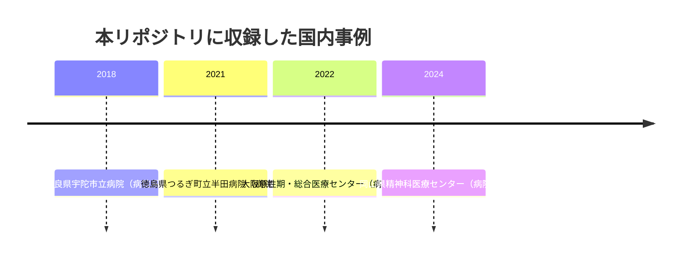

# 🇯🇵 国内の医療分野のインシデント事例

> [!NOTE]
> **表記ルール**
> - **事実** … 当事者、公的機関が公表した資料で確認できる内容
> - **報道ベース** … 報道機関の報道のみで、当事者の公表資料では確認できていない内容
> - **分析** … 筆者による解釈、推測
>
> 一次情報の URL は、リンク切れを避けるため公表元のサイトを示している。
> 報告書名で検索してほしい。

## 概観

日本の医療機関に対するランサムウェア被害は、2021 年以降に急増した。
警察庁は「ランサムウェア被害の報告件数」を業種別に半期ごとに公表しており、医療、福祉分野は継続して上位に含まれている（出典: [警察庁「サイバー空間をめぐる脅威の情勢等」](https://www.npa.go.jp/publications/statistics/cybersecurity/index.html) 各期）。

国内事例に共通する特徴として、次が繰り返し指摘されている（**分析**）。

1. **境界機器の脆弱性が起点になりやすい**：閉域網を前提とした設計が、VPN 装置のパッチ遅延と組み合わさる
2. **委託事業者との接続が監視されていない**：給食、検査、保守など、医療周辺の事業者が踏み台になる
3. **バックアップが同一ネットワーク上にある**：暗号化がバックアップまで到達し、復旧が長期化する
4. **紙運用への切り戻しが復旧を左右する**：事業継続計画の実効性が、診療を継続できるかどうかを決める

---

## 収録事例の推移

図に現れない年は、本リポジトリに収録した事例がない年である。
被害が無かったことを示すものではない。

## 年別ページ

各年に、時系列の記録（timeline）と、その年の情勢をまとめたサマリー（summary）を置く。
各ページの中身は[対象の区分](../README.md#対象の区分)ごとに分けている。
「その他の事案」は、サイバー攻撃以外の事案（サポート詐欺、システム障害、内部不正、機器や記憶媒体の紛失と盗難など）の収録件数である。
類型の定義は[事案の類型](../README.md#事案の類型)にまとめている。

| 年 | 病院系 | 製薬企業系 | 医療関連事業者 | その他の事案 | ページ |
|---|---|---|---|---|---|
| 2026 | 0 | 0 | 0 | 0 | [サマリー](2026-summary.md) ／ [履歴](2026-timeline.md) |
| 2025 | 0 | 0 | 0 | 0 | [サマリー](2025-summary.md) ／ [履歴](2025-timeline.md) |
| 2024 | 1 | 0 | 0 | 0 | [サマリー](2024-summary.md) ／ [履歴](2024-timeline.md) |
| 2023 | 0 | 0 | 0 | 0 | [サマリー](2023-summary.md) ／ [履歴](2023-timeline.md) |
| 2022 | 1 | 0 | 0 | 0 | [サマリー](2022-summary.md) ／ [履歴](2022-timeline.md) |
| 2021 | 1 | 0 | 0 | 0 | [サマリー](2021-summary.md) ／ [履歴](2021-timeline.md) |
| 2020 | 0 | 0 | 0 | 0 | [サマリー](2020-summary.md) ／ [履歴](2020-timeline.md) |
| 2019 以前 | 1 | 0 | 0 | 0 | [履歴](2019-earlier.md) |

件数は本リポジトリに収録した件数であり、その年に国内で発生した被害の総数ではない。
収録が 0 件の年も、被害が無かったことを意味しない。

**製薬企業系の収録が 0 件である点について**：本リポジトリは病院と製薬企業の双方を対象としているが、国内の製薬企業の被害で、当事者が経緯まで公表した事例をまだ収録できていない。
製薬企業に固有の攻撃面は [製薬企業のセキュリティ](../../../reference/pharma/) に整理している。

## 事例の識別子

各事例に `JP-<年>-<連番>` の識別子を与え、見出しの直前にアンカーを置いている。
サイバー攻撃以外の事案には `JP-<年>-S<連番>` を与える。
他のページからは `japan/2022-timeline.md#JP-2022-01` の形で参照できる。

## 年に紐づかない継続的な事案

| 区分 | 対象 | 概要 |
|---|---|---|
| 病院系 | 各地の医療機関 | 医療機関を狙った Emotet の感染、ばらまき型フィッシング、委託先経由の被害が継続的に報告されている（**報道ベース**） |

> [!TIP]
> 国内の事例を継続的に追跡するときは、次の情報源が使える。
> - [厚生労働省 医療分野のサイバーセキュリティ対策](https://www.mhlw.go.jp/stf/seisakunitsuite/bunya/kenkou_iryou/iryou/johoka/index.html)
> - [IPA 情報セキュリティ白書](https://www.ipa.go.jp/publish/wp-security/index.html)
> - [JPCERT/CC](https://www.jpcert.or.jp/)
> - [警察庁 サイバー空間をめぐる脅威の情勢等](https://www.npa.go.jp/publications/statistics/cybersecurity/index.html)
> - [一般社団法人医療 ISAC](https://m-isac.jp/)

---

[← インシデント事例集](../README.md) | [海外の事例 →](../global/README.md) | [トップへ](../../../../README.md)
