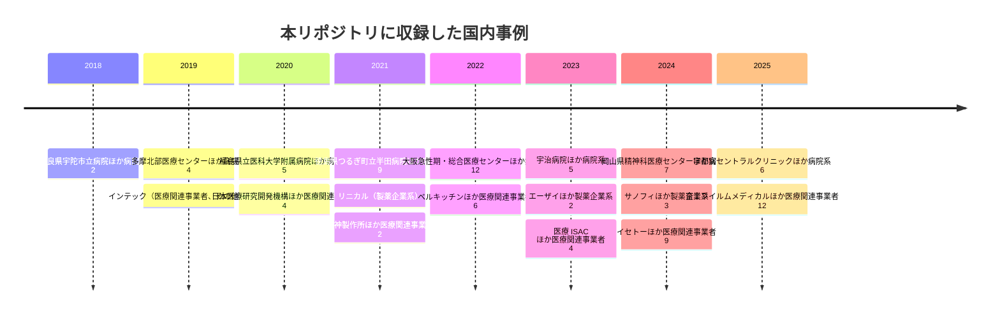

# 🇯🇵 国内の医療分野のインシデント事例

> [!NOTE]
> **表記ルール**：本ページでは、**事実**（一次情報で確認できる内容。出典を併記する）、**報道ベース**（報道や第三者の集計のみで確認でき、当事者の公表資料では裏付けが取れていない内容）、**分析**（筆者の解釈）を書き分ける。
>
> 一次情報の URL は、リンク切れを避けるため公表元のサイトを示している。
> 報告書名で検索してほしい。

## 概観

**事実**：警察庁のランサムウェア被害の報告件数は、2021 年の 146 件から 2022 年の 230 件へ立ち上がり、以後は 200 件前後で推移している。
業種別の内訳で医療、福祉が最も多かったのは 2022 年の 20 件（3 位）で、それ以外の年は 6 位から 7 位、2025 年は上位 6 業種に掲載されていない（[警察庁「サイバー空間をめぐる脅威の情勢等」](https://www.npa.go.jp/publications/statistics/cybersecurity/index.html) 各期、内訳は[日本の統計](../../statistics/japan.md#業種別内訳における医療福祉)）。

**分析**：上位に並ばないことは、医療機関の被害が少ないことを示さない。
この区分は介護と社会福祉事業を含み、かつ警察へ届け出られたものだけを数える。
下に挙げる収録事例も、当事者が公表した事案に限られる。

国内事例に共通する特徴として、次が繰り返し指摘されている（**分析**）。

1. **境界機器の脆弱性が起点になりやすい**：閉域網を前提とした設計が、VPN 装置のパッチ遅延と組み合わさる
2. **委託事業者との接続が監視されていない**：給食、検査、保守など、医療周辺の事業者が踏み台になる
3. **バックアップが同一ネットワーク上にある**：暗号化がバックアップまで到達し、復旧が長期化する
4. **紙運用への切り戻しが復旧を左右する**：事業継続計画の実効性が、診療を継続できるかどうかを決める

---

## 収録事例の推移

図はサイバー攻撃の収録件数を示す。
記憶媒体の紛失、内部不正、誤送付などの[サイバー攻撃以外の事案](../README.md#事案の類型)は、各年の履歴ページに別に収録している。
図に現れない年は、本リポジトリに収録した事例がない年である。
被害がなかったことを示すものではない。

## 年別ページ

各年の国内の事例は、時系列の記録（`YYYY-timeline.md`）に置く。
ページの中身は[対象の区分](../README.md#対象の区分)ごとに分けている。

| 年 | 履歴 |
|---|---|
| 2026 | [2026 年の履歴](2026-timeline.md) |
| 2025 | [2025 年の履歴](2025-timeline.md) |
| 2024 | [2024 年の履歴](2024-timeline.md) |
| 2023 | [2023 年の履歴](2023-timeline.md) |
| 2022 | [2022 年の履歴](2022-timeline.md) |
| 2021 | [2021 年の履歴](2021-timeline.md) |
| 2020 | [2020 年の履歴](2020-timeline.md) |
| 2019 以前 | [2019 年以前の履歴](2019-earlier.md) |

その年の情勢と集計は、国内と海外を一つにまとめた[年ごとのページ](../years/)にある。
区分ごとの収録件数を海外と並べて見るときは、[インシデント事例集の年別一覧](../README.md#年別一覧)を参照してほしい。

**製薬企業系の収録について**：本リポジトリは病院と製薬企業の双方を対象としている。
国内では 2021 年に 1 件、2023 年に 2 件、2024 年に 3 件を収録した。
2021 年は、医薬品開発を支援する [JP-2021-10 リニカル](2021-timeline.md#JP-2021-10) が不正アクセスを受け、治験の責任医師と分担医師 約 3 万 5000 件を含む最大 約 22 万件の個人情報が流出した可能性がある。
委託元の久光製薬、住友ファーマ（当時の大日本住友製薬）、小野薬品工業が、それぞれ影響を個別に公表した。
2023 年は、クラウド環境への不正アクセスで取引先関係者 約 1 万 1000 件が漏えいした [JP-2023-06 エーザイ](2023-timeline.md#JP-2023-06) と、その 2 週間後にランサムウェアの被害を公表した [JP-2023-01 エーザイ](2023-timeline.md#JP-2023-01) である。
2024 年は、取引先になりすましたメールで 2 回にわたり送金を詐取された [JP-2024-08 スリー・ディー・マトリックス](2024-timeline.md#JP-2024-08)、委託先コンサルタントの個人用端末を経由してデータベースへ侵入された [JP-2024-09 サノフィ](2024-timeline.md#JP-2024-09)、VPN 機器の脆弱性と類推されたパスワードでランサムウェアの被害を受けた [JP-2024-18 新日本製薬](2024-timeline.md#JP-2024-18) である。
いずれも侵入経路の詳細までは公表されていない。
国内の製薬企業の被害で、報告書の水準まで経緯が公表された事例はまだ確認できていない。
製薬企業に固有の攻撃面は [製薬企業のセキュリティ](../../../reference/pharma/) に整理している。

## 事例の識別子

各事例に `JP-<年>-<連番>` の識別子を与え、見出しの直前にアンカーを置いている。
サイバー攻撃以外の事案には `JP-<年>-S<連番>` を与える。
他のページからは `japan/2022-timeline.md#JP-2022-01` の形で参照できる。

## 年に紐づかない継続的な事案

| 区分 | 対象 | 概要 |
|---|---|---|
| 病院系 | 各地の医療機関 | 医療機関を狙った Emotet の感染、ばらまき型フィッシング、委託先経由の被害が継続的に報告されている（**報道ベース**） |

> [!TIP]
> 国内の事例を継続的に追跡するときは、次の情報源が使える。
> - [厚生労働省 医療分野のサイバーセキュリティ対策](https://www.mhlw.go.jp/stf/seisakunitsuite/bunya/kenkou_iryou/iryou/johoka/index.html)
> - [IPA 情報セキュリティ白書](https://www.ipa.go.jp/publish/wp-security/index.html)
> - [JPCERT/CC](https://www.jpcert.or.jp/)
> - [警察庁 サイバー空間をめぐる脅威の情勢等](https://www.npa.go.jp/publications/statistics/cybersecurity/index.html)
> - [一般社団法人医療 ISAC](https://m-isac.jp/)

---

[← インシデント事例集](../README.md) | [海外の事例 →](../global/README.md) | [トップへ](../../../../README.md)
