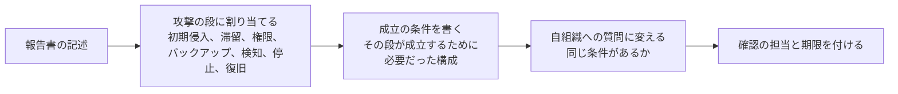

# 📑 調査報告書から攻撃の流れを復元する

事例を集める作業と、事例から学ぶ作業は別である。
[事例の調べ方](research-tips.md)は前者を扱う。
本ページは、集めた報告書を開いてから、そこに書かれた事実を攻撃の流れとして並べ直すまでを扱う。

報告書は、攻撃の物語として書かれていない。
経緯、原因、再発防止策の順に並び、技術的な事実は各章に散らばる。
読む側が、自組織の確認項目に変換できる形へ組み直す必要がある。

> [!NOTE]
> **表記ルール**：本ページでは、**事実**（一次情報で確認できる内容。出典を併記する）と、**分析**（筆者の解釈）を書き分ける。

---

## 何を取り出すか

報告書から取り出す欄を、先に決めておく。
決めずに読むと、印象に残った記述だけが残る。

| 欄 | 取り出す内容 | 自組織で何に変わるか |
|---|---|---|
| 初期侵入 | 何を経由して、どの資格情報または脆弱性で入られたか | 同じ経路が自組織にあるか |
| 滞留 | 侵入から発覚までの期間 | ログの保存期間が、その期間を遡れるか |
| 権限の広がり | どの権限を、どこで得たか | 同じ構成（共通のパスワード、共通のドメイン）があるか |
| バックアップ | 復旧手段が失われたか、残ったか | 認証の分離ができているか |
| 検知の契機 | 誰が、何を見て気づいたか | 同じ契機が自組織で機能するか |
| 停止の範囲 | 何が、どれだけ止まったか | 同じ範囲が止まったときの代替手段があるか |
| 復旧 | 何を、どの順に戻したか。どれだけかかったか | 復旧の順序を決めてあるか |
| 対外的な対応 | 届出、公表、患者への説明をいつ行ったか | 期限に間に合う体制か |

**分析**：この八つのうち、停止の範囲と復旧は、ほとんどの資料に書かれる。
初期侵入と滞留は書かれないことがあり、検知の契機は書かれても一行で終わることが多い。
書かれていない欄を空欄のまま残すことが、読み方として正しい（後述の[書かれていないことの扱い](#書かれていないことの扱い)）。

---

## 資料の型と、書かれる範囲

| 型 | 書かれやすいこと | 書かれにくいこと |
|---|---|---|
| 第三者委員会の調査報告書 | 経緯、原因の分析、組織的な要因、再発防止策 | 攻撃者の識別、詳細な技術的痕跡 |
| 当事者の公表（概要、続報） | 停止の範囲、復旧の状況、患者への影響 | 侵入経路、権限の広がり |
| 規制当局の措置、報告 | 制度上の違反、講じるべき措置 | 攻撃の技術的な流れ |
| 議会の証言、公聴会の資料 | 経営の判断、対策の欠落 | 現場の運用の詳細 |
| ベンダのアドバイザリ | 影響する製品と版、緩和策 | その組織で何が起きたか |
| 報道 | 発覚の時期、関係者の証言 | 一次資料で裏付けられない推測が混ざる |

**分析**：一つの型だけで八つの欄は埋まらない。
第三者委員会の報告書がある事例でも、停止の範囲は当事者の公表、影響を受けた人数は届出の記録、といった具合に出所が分かれる。
欄ごとに出所を記録しておくと、後から数値が食い違ったときに、どちらの時点の値かを判定できる（[事例の調べ方](research-tips.md#集計値は出典と時点で食い違う)）。

---

## 読み方の例

### 権限の共通化が、どこに書かれるか

**事実**：大阪急性期・総合医療センターの調査報告書は、病院給食サーバと他のサーバの ID とパスワードが共通であり、窃取が容易であったことを記している。
出典：[調査報告書 概要（PDF）](https://www.gh.opho.jp/pdf/reportgaiyo_v01.pdf)（調査委員会、2023 年 3 月 28 日）、経緯は[JP-2022-01](japan/2022-timeline.md#JP-2022-01)に整理している。

**分析**：この一文は、報告書の中では原因の分析の章に置かれ、攻撃の経緯の章には現れない。
経緯だけを読むと「侵入され、暗号化された」で終わる。
自組織の確認項目に変換できるのは、原因の分析の側にある記述である。
読むときは、経緯の章と原因の章を突き合わせ、経緯のどの段が、どの構成上の要因で成立したかを対応づける。

### 初動の作業が調査を狭めた経緯

**事実**：同じ報告書は、VPN 装置について、2022 年 10 月 31 日 19 時ごろに最新バージョンへ更新したためログが消失し、後日、当該装置のバージョンが 5.4.8 であったことを確認したと記している。
出典：[調査報告書 概要（PDF）](https://www.gh.opho.jp/pdf/reportgaiyo_v01.pdf)

**分析**：この記述は、初動の作業がその後の調査を狭めた例として読める。
同種の記述は他の報告書にも現れる（端末の初期化、機器の交換、ログの世代の上書き）。
見つけたら、自組織の初動手順に「保全を先に行う対象」として反映する（[ログと監視の設計](../../technology/logging.md#初動でログを壊さない)）。

### 体制と、経営への説明の欠落

**事実**：アイルランドの Health Service Executive が公表した独立事後レビューは、事案発生時に上級役員または管理層のいずれにもサイバーセキュリティの単一の責任者がいなかったこと、IT 関連リスクは理事会に複数回提示されていたが、重大さが十分に説明されていなかったことを記録している。
出典：[Conti Cyber Attack on the HSE: Independent Post Incident Review](https://about.hse.ie/publications/conti-cyber-attack-on-the-hse-independent-post-incident-review/)（HSE、PwC、2021 年 12 月）、詳細は[経営層への説明責任](../../governance/executive-accountability.md#hse-のリスク登録簿と理事会の議題)に整理している。

**分析**：技術的な対策の一覧より、この種の記述のほうが、自組織で確認しやすい。
「単一の責任者がいるか」「理事会に提示された内容が、リスク選好に照らして評価されたか」は、その日のうちに確認できる。

### 議会証言に残る経営の判断

**事実**：Change Healthcare に対する 2024 年 2 月の攻撃について、UnitedHealth Group の最高経営責任者は米議会に提出した証言で、攻撃者が窃取した資格情報でリモートアクセス用のポータルへ到達したこと、当該ポータルで多要素認証が有効になっていなかったことを述べている。
出典：[Testimony of Andrew Witty（PDF）](https://democrats-energycommerce.house.gov/sites/evo-subsites/democrats-energycommerce.house.gov/files/evo-media-document/Testimony_Witty_OI_2024.05.01.pdf)（UnitedHealth Group、2024 年 5 月 1 日）、経緯は[GL-2024-01](global/2024-timeline.md#GL-2024-01)に整理している。

**分析**：議会の証言は、当事者が公の場で述べた内容として一次情報になる。
一方で、証言は質問に答える形で作られるため、聞かれなかった事項は出てこない。
証言だけを出所にする欄は、他の資料で補うか、空欄のままにする。

---

## 書かれていないことの扱い

**分析**：欠落には型がある。
型ごとに、言えることと、言ってはいけないことを分ける。

| 欠落 | 言えること | 言ってはいけないこと |
|---|---|---|
| 初期侵入が書かれていない | 公表資料からは経路が確認できない | 「VPN からだった」と、他の事例からの類推で埋める |
| 滞留期間が書かれていない | 期間は示されていない | 「長期間潜伏していた」と評価する |
| 攻撃者の名前が書かれていない | 帰属は公表されていない | 報道の名指しを、当事者の公表として扱う |
| 身代金の支払いに触れていない | 公表資料に記載がない | 「支払わなかった」と読む |
| 影響人数が「調査中」のまま | その時点で確定していない | 後の報道の数値を、当事者の確定値として扱う |
| 検知の契機が書かれていない | 記載がない | 「検知できていなかった」と断定する |

**分析**：三行目と六行目が、最も混ざりやすい。
帰属について、当事者または公的機関が公表していない場合は「公表されていない」と書き、報道が名指ししている場合は「報道ベース」として、報道であることが分かる形で書く。
検知の契機が書かれていない場合、検知の失敗を意味することもあれば、単に報告書の目的に含まれないこともある。
どちらかは、その報告書の目的（原因の究明か、再発防止か、制度上の報告か）から判断する。

**分析**：欠落そのものが情報になる場合もある。
複数の報告書で同じ欄が繰り返し空いているなら、その欄は多くの組織で復元できていない可能性がある。
たとえば「どの患者の情報が参照されたか」が確定しない事例が続くのは、参照ログの粒度に共通の制約があることを示唆する。
ただしこれは示唆であり、個別の組織について断定する材料にはならない。
読み方としては、複数の報告書に共通して空いている欄を、自組織で確かめる項目の候補として扱う。

---

## 時間の扱い

1. 発生年と公表年を分ける。報告書は、発生の 1 年以上後に公表されることがある
2. 報告書に版がある場合、版と公表日を記録する。概要版と本文で数値が違うことがある
3. 時刻が書かれている記述は、そのまま引用する。前後の関係を推測で補わない
4. 続報で数値が更新された場合、更新前の値も残し、いつの時点の値かを併記する

**分析**：3 が守られないと、報告書に書かれた事実と、読み手が補った推測の区別が消える。
本リポジトリで事実と分析を分けているのは、この境目を保つためである（[事例の調べ方](research-tips.md#5-発生年と公表年を分ける)）。

---

## 復元した流れを、確認項目に変える

読み終えたら、八つの欄を自組織への質問に置き換える。

| 報告書の記述の例 | 成立の条件 | 自組織への質問 |
|---|---|---|
| 委託先のサーバを経由して侵入された | 委託先の系から院内へ到達できる経路がある | 委託先ごとの接続経路を一覧にしているか |
| 複数のサーバで同じ資格情報が使われていた | 資格情報が系をまたいで共通である | 共通の資格情報が残る系を把握しているか |
| バックアップも暗号化された | バックアップ基盤が同じ認証の下にある | バックアップの認証を分離しているか |
| 更新によりログが失われた | 保全の前に復旧作業を始める手順になっている | 初動で保全する対象を手順書に書いているか |
| 影響を受けた患者数の確定に時間を要した | 参照ログが患者単位に集計できない | 参照ログの形式を確認したか |

**分析**：この変換を、事例ごとに一枚の表として残しておくと、複数の事例を横に並べたときに、繰り返し現れる条件が見える。
繰り返し現れる条件は、自組織でも優先度が高い（[防御プレイブック](../actors/defense-playbook.md)）。

---

## 落とし穴

**一つの事例から、一般則を作らない**：ある組織で初期侵入が委託先経由だったことは、委託先が主要な経路であることを意味しない。
経路の割合は、事例の集合ではなく統計から読む（[国内の統計から読む脅威](../statistics/japan.md)）。

**再発防止策の一覧を、そのまま自組織の計画にしない**：報告書の再発防止策は、その組織の構成と予算を前提に選ばれている。
移せるのは、対策そのものではなく、対策が答えている条件のほうである。

**組織の落ち度として読まない**：報告書は、原因を明らかにするために公表されている。
公表した組織を非難する形で引用すると、次の組織が公表しなくなる。
本リポジトリで事例を扱うときも、経緯と条件だけを書き、評価を加えない。

**概要版だけで判断しない**：概要版は、技術的な記述が削られていることがある。
本文が公開されている場合、初期侵入と権限の広がりの欄は本文から取る。

---

## 読むときの手順

- [ ] 八つの欄を用意し、報告書の記述を割り当てた
- [ ] 欄ごとに出所（資料名、公表日、版）を記録した
- [ ] 書かれていない欄を、空欄のまま残した
- [ ] 帰属について、当事者または公的機関の公表かを確認した
- [ ] 数値に、いつの時点の値かを併記した
- [ ] 記述を、成立の条件と自組織への質問に変換した
- [ ] 変換した質問に、確認の担当と期限を付けた

---

## 関連ページ

- [事例の調べ方](research-tips.md)：事例を見つけ、収録するまでの手順
- [国内のインシデント事例](japan/)、[海外のインシデント事例](global/)：収録した事例
- [防御プレイブック](../actors/defense-playbook.md)：繰り返し現れる条件への対策
- [連鎖するランサムウェア攻撃](../actors/ransomware-chain.md)：段の並べ方
- [ログと監視の設計](../../technology/logging.md)：初動で失われる記録
- [経営層への説明責任](../../governance/executive-accountability.md)：組織的な要因の記述
- [演習シナリオのカタログ](../../response/tabletop.md)：復元した流れを演習の開始条件にする

---

## 一次情報

| 資料 | 発行元 |
|---|---|
| [調査報告書 概要（PDF）](https://www.gh.opho.jp/pdf/reportgaiyo_v01.pdf) | 大阪急性期・総合医療センター 調査委員会 |
| [コンピュータウイルス感染事案 有識者会議調査報告書（PDF）](https://www.handa-hospital.jp/topics/2022/0616/report_01.pdf) | つるぎ町立半田病院 |
| [Conti Cyber Attack on the HSE: Independent Post Incident Review](https://about.hse.ie/publications/conti-cyber-attack-on-the-hse-independent-post-incident-review/) | Health Service Executive、PwC |
| [Testimony of Andrew Witty（PDF）](https://democrats-energycommerce.house.gov/sites/evo-subsites/democrats-energycommerce.house.gov/files/evo-media-document/Testimony_Witty_OI_2024.05.01.pdf) | UnitedHealth Group |

---

[← インシデント事例](README.md) | [トップへ](../../../README.md)
