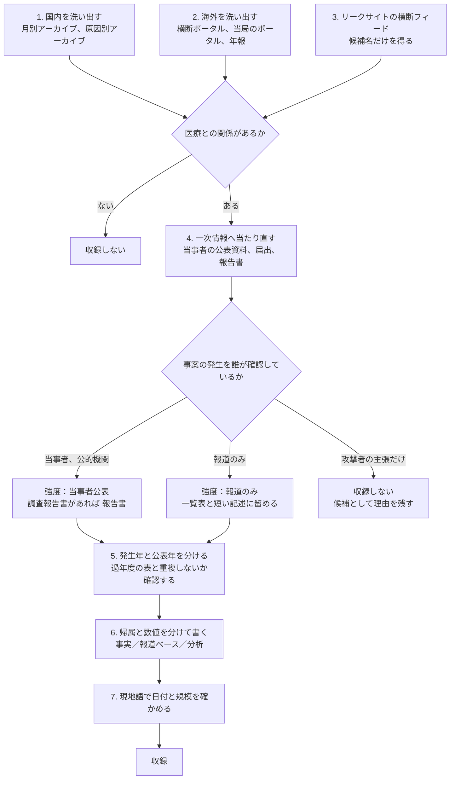
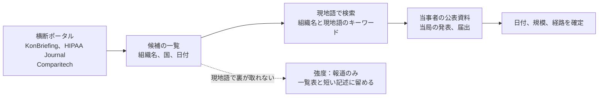

# 🔍 事例の調べ方

インシデント事例を集めるときに使う情報源と、実際に使って分かった落とし穴を記録する。
[新規追加のしかた](README.md#新規追加のしかた)が「どう書くか」を定めるのに対し、本ページは「どう探して、どう確かめるか」を扱う。

## 情報源

### 国内

| 情報源 | 用途 | 注意 |
|---|---|---|
| 当事者のサイトの「お知らせ」「重要なお知らせ」 | 一次情報。続報と確報がここに積まれる | 続報で数値が変わる。最新の 1 件だけを見ると初報の数字を引いてしまう |
| [Security NEXT](https://www.security-next.com/) | 国内事案の網羅的な把握。当事者公表を追って報じる | 報道であって一次情報ではない。可能なら当事者の公表資料へ当たり直す。記事の日付は公表日であって発生日ではない |
| [ScanNetSecurity の原因別月別アーカイブ](https://scan.netsecurity.ne.jp/) | 原因（不正アクセス、誤送信）と月で区切った一覧。Security NEXT の取りこぼしを埋める | 同上。両方を走査して差分を取ると漏れが減る |
| [個人情報保護委員会](https://www.ppc.go.jp/) | 報告義務、行政上の対応 | 個別事案の一覧は公開されていない |
| [厚生労働省 医療機関等におけるサイバーセキュリティ対策](https://www.mhlw.go.jp/) | 制度の動き、チェックリスト | 事案そのものは載らない |
| [警察庁 サイバー空間をめぐる脅威の情勢等](https://www.npa.go.jp/publications/statistics/cybersecurity/index.html) | 統計。半期ごと | 医療、福祉分野の内訳は公表されないことがある |
| 上場企業の適時開示、有価証券報告書 | 停止期間、費用、復旧の時期 | 医療法人には開示義務がない。委託先が上場企業の場合に使える |

### 海外

| 情報源 | 地域 | 用途 |
|---|---|---|
| [HHS OCR Breach Portal](https://ocrportal.hhs.gov/ocr/breach/breach_report.jsf) | 米 | 500 人以上の侵害の届出。影響人数の典拠になる |
| [SEC EDGAR](https://www.sec.gov/edgar) | 米 | Form 8-K による開示。停止期間と復旧の時期が日付つきで残る |
| [ICO](https://ico.org.uk/) | 英 | 制裁通知。当局が何を不備と判断したかが読める |
| [NHS England Cyber alerts](https://digital.nhs.uk/cyber-alerts) | 英 | 脆弱性と攻撃の警告 |
| [CERT Santé（ANS）の Observatoire](https://cyberveille.esante.gouv.fr/lobservatoire-des-incidents) | 仏 | 医療分野のインシデント届出の年報。届出義務にもとづく統計 |
| [CSIRT CeZ（Centrum e-Zdrowia）](https://cez.gov.pl/) | 波 | 医療分野の CSIRT。被害施設への支援と統計 |
| [Z-CERT](https://z-cert.nl/) | 蘭 | 医療分野の専門 CERT。委託先の侵害の波及先を示す |
| 衛生福利部、H-ISAC | 台 | 攻撃グループの特定と、医療機関向け指針の配布 |
| [Office of the Privacy Commissioner](https://www.privacy.org.nz/) | 新 | 調査の開始と結果 |
| [ENISA](https://www.enisa.europa.eu/) | 欧 | 分野別の脅威動向 |
| [KonBriefing](https://konbriefing.com/en-topics/cyber-attacks.html) | 全世界 | 国と業種で分類した事案の一覧。各項目に当事者または現地報道の URL が付く。単一言語の検索では届かない国の事案を拾える |
| [HIPAA Journal](https://www.hipaajournal.com/) の月次レポートと年間の大規模侵害一覧 | 米 | HHS OCR ポータルは条件を指定した列挙がしにくい。同誌の表を索引に使い、数値は OCR で確かめる |
| [Comparitech の Healthcare Ransomware Roundup](https://www.comparitech.com/) | 全世界 | 身代金の要求額と支払いの有無。米国以外の被害も拾う |
| [medconweb](https://www.medconweb.de/) の Cyberattacke タグ | 独 | ドイツ語圏の病院と委託先の事案の一覧 |
| [iThome の資安月報](https://www.ithome.com.tw/) | 台 | 月ごとの事案の整理。当事者と所管官庁の発表を時系列で追える |
| [ransomware.live](https://www.ransomware.live/) などの[リークサイト横断フィード](../../reference/resources/leak-site-feeds.md) | 全世界 | 業種と国のタグつきで被害組織名を列挙できる。**候補名を得る入口としてのみ使う**（[手順 3](#3-リークサイトの横断フィードで候補名を補う)） |

医療分野に専用の CERT や CSIRT を置いている国（フランス、ポーランド、オランダ、台湾）は、被害の直後に当局の発表が出る。
この発表は当事者の公表より早く、内容も具体的なことが多い。

## 手順



### 1. 国内を網羅的に洗い出す

キーワード検索だけでは取りこぼす。
組織名に医療を示す語が含まれない事案（「三笑堂」「オオサキメディカル」「アスクル」など）が漏れるためである。

国内では、Security NEXT の月別アーカイブを機械的に走査する方法が使える。

```sh
# 2025 年の全記事の見出しを集める（1 か月あたり 9 ページ）
for m in 01 02 03 04 05 06 07 08 09 10 11 12; do
  for p in 1 2 3 4 5 6 7 8 9; do
    if [ "$p" = "1" ]; then U="https://www.security-next.com/date/2025/$m"
    else U="https://www.security-next.com/date/2025/$m/page/$p"; fi
    curl -sS -A "Mozilla/5.0" "$U"
  done
done | grep -o '<dt>2025/[0-9/]*</dt><dd><a href="https://www.security-next.com/[0-9]*"[^>]*>[^<]*</a>' \
  | sed -E 's|<dt>([0-9/]+)</dt><dd><a href="https://www.security-next.com/([0-9]+)"[^>]*>(.*)</a>|\1\t\2\t\3|' \
  | sort -u > sn-2025-all.tsv
```

集めた全件から絞り込むときは、語を二段階で当てる。
一段階目は診療に関する語（患者、診療、病院、医院、クリニック、医療、健診、検診、保健、福祉、介護、薬、製薬、看護、歯科、血液、ワクチン、カルテ）。
二段階目は事業者名に現れる語（メディカル、ヘルス、ファーマ、ホスピタル、衛生、透析、検査、調剤）。
それでも残る取りこぼしは、ランサムウェア関連の記事を全件目視して拾う。

**一つの媒体だけでは足りない**。
2025 年の洗い出しでは、Security NEXT の一覧に載らず ScanNetSecurity にだけ現れた事案があった（アクリーティブ、順天堂大学、近江屋）。
逆に ScanNetSecurity の原因別一覧に現れない事案もある。
両方を走査して差分を取ると、片方だけを見たときの取りこぼしが減る。

Security NEXT を分類で絞るときは、下位の分類ではなくニュース全体（`category/cat191`）を走査する。
「個人情報漏洩事件・事故」や「不正アクセス事件」の下位分類は、同じ事案でも記事によって付いたり付かなかったりする。

**組織名に医療の語がない供給元を、業種の語で当てる**。
2025 年に診療へ影響が及んだ事案の多くは、医療機関ではなく供給元で起きている。
放射性医薬品、血液事業、透析、医療材料の物流、受託試験、診療報酬請求、健診の受託、患者ポータル、病院情報システムのベンダを、それぞれ業種の語で検索する。

### 2. 海外を網羅的に洗い出す

英語の検索だけでは、非英語圏の事案がほとんど出てこない。
先に国と業種で分類された横断ポータルで候補を作り、そのあと現地語で一次情報へ当たる二段構えが要る。



KonBriefing は日付、国、業種、組織名、出典 URL を一覧で持つため、HTML を取得して機械的に絞り込める。

```sh
curl -sS -A "Mozilla/5.0" "https://konbriefing.com/en-topics/cyber-attacks.html" -o kb.html
python3 - <<'EOF'
import re, html
NL = chr(10)
raw = open("kb.html", encoding="utf-8", errors="replace").read()
raw = re.sub(r"<script.*?</script>|<style.*?</style>", "", raw, flags=re.S)
lines = [l.strip() for l in html.unescape(re.sub(r"<[^>]+>", NL, raw)).split(NL) if l.strip()]
kw = re.compile(r"health|hospital|clinic|medic|pharma|dental|nursing|patient|laborator|blood|ambulance", re.I)
is_date = re.compile(r"^[A-Z][a-z]+ [0-9]{1,2}, [0-9]{4}$")
cur = ""
for l in lines:
    if is_date.match(l):
        cur = l
    elif kw.search(l):
        print(cur, "|", l)
EOF
```

出力には日ごとの業種別の集計行（`Healthcare: 8, Hospital: 4` の形）が混じるため、目視で落とす。
残った行は「見出し」「組織名と所在地」「出典の見出し」の 3 行が 1 件に対応する。

同ポータルは収録の対象期間が現在まで届いていないことがある。
載っていない期間は、月別の検索と各国の医療 CERT の発表で補う。

保健省そのものが被害を受ける例が島嶼国と中南米にある。
`Ministry of Health ransomware`、`ministerio de salud ciberataque` のように、機関の種別で検索すると拾える。

### 3. リークサイトの横断フィードで候補名を補う

ランサムウェアグループの公開サイトを集約したフィードは、業種と国のタグつきで被害組織名を列挙できる。
非英語圏の事案と、組織名に医療の語がない事業者の取りこぼしを埋める用途に向く。
どのフィードがあり、それぞれで医療をどう絞り込めるかは[リークサイト横断フィード](../../reference/resources/leak-site-feeds.md)にまとめている。

**用途は候補名の取得に限る**。
掲載は攻撃者の主張であって、当事者の公表ではない。
掲載されただけの組織名を書くと、当事者が公表していない被害を本リポジトリが公開することになる。

そこで次の二段で使う。

1. フィードから候補名の一覧を作る
2. 候補ごとに当事者の公表資料を探し、**見つかったものだけを収録する**

判定の境界は次のとおりである。

| 事案の発生を確認できた根拠 | 扱い |
|---|---|
| 当事者または公的機関の公表 | 収録する。攻撃グループの主張は「報道ベース」として本文に書き、帰属は確定していないと明記する |
| 報道のみ（当事者の公表資料に到達できない） | 強度「報道のみ」として、一覧表と短い記述に留める |
| リークサイトの掲載のみ | **収録しない**。組織名、掲載日、確認できなかった旨を手元の候補一覧に残す |

**事案の存在**と**攻撃グループの帰属**を分けて考える。
帰属については、当事者が事案を公表していれば、攻撃者側の主張を「報道ベース」として併記できる。
事案の存在そのものを攻撃者の主張だけで裏づけることはしない。

掲載の有無は、被害の大きさの根拠にもしない。
掲載されない被害（身代金を支払った、暗号化されなかった、公表前に交渉が終わった）が抜け落ちるためである。

取得の例を挙げる。

```sh
curl -s -A "Mozilla/5.0" "https://api.ransomware.live/v2/sectorvictims/Healthcare" -o hc.json
python3 -c '
import json
d = [x for x in json.load(open("hc.json")) if (x.get("attackdate") or "")[:4] == "2025"]
for x in sorted(d, key=lambda x: x["attackdate"]):
    if x.get("country") == "JP":
        print(x["attackdate"][:10], x["group"], x["victim"], x.get("domain"))
'
```

このフィードは、利用条件を個人利用に限り、エンドポイントごとに 1 分 1 回のレート制限を課している。
法人としての利用は、提供元の利用規約を読んだうえで判断する。

実際に照合した結果を挙げる。
2025 年の医療分野の掲載は 643 件で、本リポジトリの収録と名寄せできたのは 28 件だった。
日本の 6 件を追ったところ、当事者の公表に到達できたものが 2 件あった。
シミック CMO の米国子会社（CDMO）と、ニプロの米国子会社である。
いずれも国内の親会社が公表しており、本リポジトリが「確認できなかった」としていた製薬と医療機器の領域にあたる。
台湾では亞洲大學附屬醫院の掲載があり、CrazyHunter による 2025 年の被害が収録済みの 2 件に留まらない可能性が見えた。

フィードのデータには次の癖がある。

- 同じ被害が複数のグループから重複して掲載される（馬偕紀念醫院と彰化基督教醫院は、それぞれ 2 グループの掲載がある）
- 被害者名が伏せ字のことがある（`hopital-*********.com`）
- 業種のタグに獣医クリニックや健康食品の事業者が混じる
- 国コードが空欄の項目がある

そのため、フィードの件数をそのまま統計として引かない。
統計は[年ごとのページ](years/)の外部統計の節に挙げた公的な集計を使う。

### 4. 一次情報へ当たり直す

報道で見つけた事案は、当事者の公表資料を探す。
探し先は、組織名と「お知らせ」「重要なお知らせ」「ニュース」の組み合わせである。
米国の事業者は HHS OCR の届出、上場企業は SEC の Form 8-K を併せて見る。

PDF で公表されている報告書は、手元でテキストに変換してから読む。

```sh
curl -sS -o report.pdf "https://example.org/report.pdf"
pdftotext -layout report.pdf report.txt
```

調査報告書は、経緯、原因分析、再発防止策が節ごとに分かれている。
一覧表に載せる数値だけでなく、原因分析の節にある「なぜ検知できなかったか」を読むと、他組織に転用できる記述が取れる。

### 5. 発生年と公表年を分ける

侵入が前年、判明と公表が当年という事案は多い。
本事例集は**発生年**でページを分け、過年度に発生して当年に動いた事案は各ページの「過年度に発生し、当年に動きがあった事案」に置く。

判断の目安は次のとおりである。

- 侵入の開始日が公表されていれば、その年に置く
- 侵入の開始日が公表されず検知日だけが分かる場合は、検知日の年に置く
- 年をまたぐ場合は、両方の年を「2024-10 〜 2025-01」の形で書く

### 6. 帰属と数値を分けて書く

攻撃グループの帰属は、次の三つを区別する。

- **当事者または公的機関が確認した**：本文の「事実」に書く
- **攻撃グループ側が主張しているだけ**：「報道ベース」に書き、帰属が確定していないと明記する
- **調査報道が当事者の説明と食い違う**：両方を並べ、どちらが確定したとも書かない

影響人数も同じである。
当事者が公表した数と、攻撃者が主張する窃取件数は、別のものとして扱う。

## 落とし穴

### 英語の記事だけで年を確定しない

英語圏のまとめ記事は、他国の事案の年を取り違えていることがある。
本リポジトリの調査では、2026 年 1 月に起きたベルギーの病院への攻撃を「2025 年 1 月」と記述した英語記事があった。
現地語の報道と当事者の公表で日付を確認すると、誤りが分かる。

日付、組織名、被害規模は、現地語の一次情報で確かめる。
検索も現地語で行う。

| 言語 | 検索語 |
|---|---|
| フランス語 | `cyberattaque hôpital`、`rançongiciel établissement de santé` |
| ドイツ語 | `Cyberangriff Krankenhaus`、`Ransomware Klinik Notbetrieb` |
| イタリア語 | `attacco informatico ospedale`、`azienda sanitaria` |
| スペイン語 | `ciberataque hospital`、`ministerio de salud ciberataque` |
| ポルトガル語 | `ataque cibernético hospital`、`ataque hacker saúde` |
| オランダ語 | `cyberaanval ziekenhuis` |
| ポーランド語 | `atak ransomware szpital` |
| チェコ語 | `kybernetický útok nemocnice` |
| 中国語 | `醫院 勒索軟體`、`資安事件 病歷` |
| 韓国語 | `병원 랜섬웨어`、`의료기관 개인정보 유출` |

組織の正式名称が分かったら、その名称を現地語のまま検索し直す。
英語の記事に載る名称は略称や英訳であることが多く、そのままでは当事者の告知に到達できないことがある。

### 集計値は出典と時点で食い違う

同じ提供元でも、ページによって数値が違うことがある。
米国の 2025 年の医療情報侵害について、2026 年 6 月に参照した時点では、年次報告のページが 710 件、6155 万 6256 人とし、別のページが 772 件、1 億 3972 万 1832 人としていた。
後者は集計の時点が後で、大規模な事案の届出が加わっている。
同じ提供元の同じページを 2026 年 8 月 4 日の更新後に見ると 789 件になっており、時点が動けば値も動く。

統計を引くときは、件数だけでなく**集計の時点**を併記する。
時点を書かない引用は、翌年に読み返したときに検証できない。
本リポジトリが時点を記録して集計した結果は[2025 年 米国 HHS OCR 届出の全件集計](global/2025-us-hhs.md)に、他ページとの差の扱いは[2025 年の情勢](years/2025-summary.md#hhs-ocr-の届出米国)にある。

### 出典を示さないベンダ記事を根拠にしない

セキュリティ関連の事業者が運営する記事のなかに、出典を示さないまま具体的な数値を書くものがある。
2025 年の調査では、「国内医療機関へのランサムウェア攻撃は 1 月から 10 月で 85 件」「関東地方の大規模大学病院で全システムが 2 週間停止し、費用は 15 億円」といった記述に当たったが、いずれも一次情報にも当事者公表にも到達できなかった。

次のいずれかに当てはまる記事は、根拠として使わない。

- 当事者名を伏せている（「関東地方の大規模大学病院」「千葉県内の研究開発機構の併設病院」など）
- 数値に出典のリンクが付いていない
- 同じ数値が他の媒体に現れず、公的統計とも整合しない

これらの記事は、事案の存在に気づく手がかりとしてだけ使い、記載する内容は一次情報で組み直す。

### 追加の前に「過年度」の表を確認する

大型の事案は、侵入が前年、公表が当年になることが多い。
本事例集はこうした事案を各年のページの「過年度に発生し、当年に動きがあった事案」に置いている。
新しく見つけた事案を追加する前に、この表を確認する。

2025 年の追記では、Conduent、Community Health Center、Veradigm を新規として書き起こしたあとで、いずれも既に過年度の表に載っていることが分かり、取り消した。
影響人数が大きい事案ほど過年度の表に入りやすく、重複を作りやすい。

### 取得できないサイトがある

理由は二つに分かれる。
一つは、自動での取得を拒否するニュースサイトである。
もう一つは、環境や地域によって応答しないドメインである。
2025 年の調査では、`asppalermo.org`（伊）と `ispch.gob.cl`（智）が後者にあたった。

いずれの場合も、一次情報の URL は残す。
そのうえで、到達できる二次情報（現地の専門媒体、当局の別ページ）を併記し、読み手が内容を確かめられるようにする。
一次情報を削って二次情報だけにすると、出所の強度が下がる。
逆に、取得できなかったサイトを唯一の根拠にすることもしない。

### 大量に追加するときは並び順を機械で揃える

一覧表と本文の節は、いずれも発生月順に並べている。
数十件をまとめて追加すると、手作業では順序が崩れる。

識別子は追加順で構わない（一覧表の並びが日付順であればよい）。
表の行と本文の節を識別子で対応づけ、発生月で安定ソートしてから書き戻すと、順序と対応が保たれる。
書き戻したあとは、一覧表の行数、`<a id="...">` の数、`###` の見出しの数が一致することを確認する。

### 収録の境界を決めておく

医療との関係が薄い事案まで広げると、引く側が目的の事案に行き着きにくくなる。
本事例集では次のように扱う。

- **収録する**：医療機関、医療関連事業者、福祉サービス事業者が被害を受けた事案。医療機関の診療または供給に影響が及んだ事案
- **収録しない**：社会福祉協議会のウェブサイト改ざんのように、医療の提供にも患者情報にも影響が及ばない事案
- **判断に迷う**：大学の研究部門、学会、健診を扱う自治体の部署。診療または患者情報との距離で決め、収録した場合は理由を本文に書く

区分（病院系、製薬企業系、医療関連事業者）は、被害を受けた当事者で決める。
2025 年の判断の例を挙げる。

- **[JP-2025-16 順天堂大学](japan/2025-timeline.md#JP-2025-16)**：被害は附属病院ではなく研究センターの NAS だが、附属病院を運営する法人であるため病院系に置き、病院業務に影響がなかったことを本文に書いた
- **[JP-2025-17 近江屋](japan/2025-timeline.md#JP-2025-17)**：漏えいの対象は製薬企業の関係者の情報だが、被害を受けた当事者は保険代理業であるため医療関連事業者に置き、区分の理由を分析に書いた
- **[GL-2025-65 Instituto de Salud Pública de Chile](global/2025-timeline.md#GL-2025-65)**：国の参照検査機関であり医薬品の登録も所管するため、病院系ではなく医療関連事業者に置いた

区分が自明でない事案は、選んだ区分と理由を本文に書き残す。
後から数え直すときに、判断を再現できる。

---

<sub>[← インシデント事例集](README.md) | [脅威](../README.md) | [トップへ](../../../README.md)</sub>
