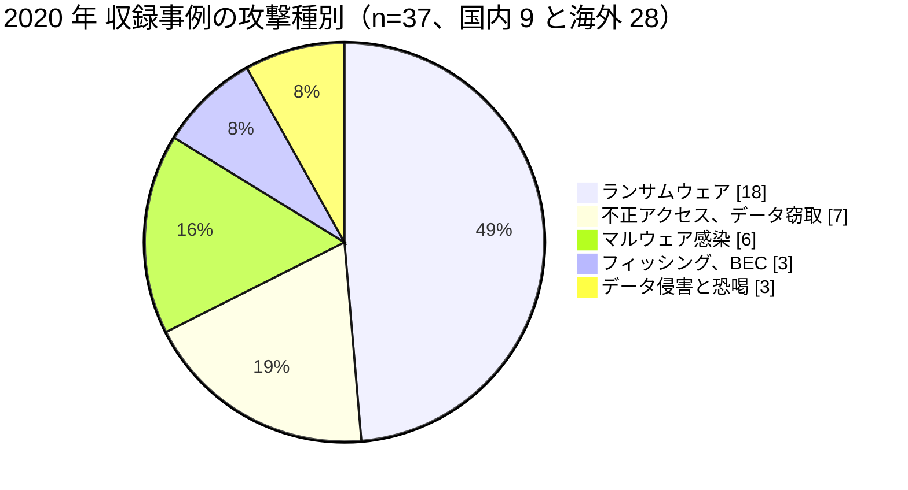

# 📅 2020 年の情勢（国内と海外）

> [!NOTE]
> 本ページの集計は、断りのない限り**本リポジトリに収録した事例**を母集団とする。
> 国内および世界で発生した被害の全数ではない。収録が 0 件であることは、被害がなかったことを意味しない。
> 個別の経緯は [国内の履歴](../japan/2020-timeline.md) と [海外の履歴](../global/2020-timeline.md) を参照してほしい。

## その年の要点

**分析**：感染症の流行下で医療が最も逼迫した年に、攻撃側は医療分野を避けなかった。
各国の当局が「医療を狙わない」という攻撃者側の表明を前提にしなかったのは、実際に被害が続いたためである。

年の前半は、感染症対応の中枢が止まった。
[GL-2020-04 ブルノ大学病院](../global/2020-timeline.md#GL-2020-04)は国内有数の COVID-19 検査施設を抱えたまま 3 週間停止し、[GL-2020-05 Champaign-Urbana Public Health District](../global/2020-timeline.md#GL-2020-05)は公衆衛生の情報発信を止められた。

年の後半は、被害の型が二つに分かれた。
一つは診療の停止である。
[GL-2020-01 Universal Health Services](../global/2020-timeline.md#GL-2020-01)、[GL-2020-08 University of Vermont Health Network](../global/2020-timeline.md#GL-2020-08)、[GL-2020-02 デュッセルドルフ大学病院](../global/2020-timeline.md#GL-2020-02)がこれにあたる。
もう一つは、診療を止めずに情報だけが大量に出る型である。
[GL-2020-21 Blackbaud](../global/2020-timeline.md#GL-2020-21) は、寄付管理ソフトウェア 1 社の侵害で米国の医療分野に 600 万人を超える漏えいをもたらした。

そして [GL-2020-03 Vastaamo](../global/2020-timeline.md#GL-2020-03) が、恐喝の対象を組織から患者個人へ下ろした。
この年に現れた三つの型は、以後の 5 年で規模を変えて繰り返される。

国内では、様相が異なる。
公表されたのは、メールアカウントの乗っ取り（[JP-2020-02 市立福知山市民病院](../japan/2020-timeline.md#JP-2020-02)）、Emotet の感染（[JP-2020-03 関西医科大学](../japan/2020-timeline.md#JP-2020-03)、[JP-2020-09 日本医師会](../japan/2020-timeline.md#JP-2020-09)）、ウェブサイトへの不正アクセス（[JP-2020-04 虎の門病院ほか](../japan/2020-timeline.md#JP-2020-04)）であり、診療を止めた事案の公表はない。
[JP-2020-01 福島県立医科大学附属病院](../japan/2020-timeline.md#JP-2020-01)だけが、3 年前にさかのぼって、CT の撮影中に管理端末が再起動した事実を公表した。
発覚の端緒は厚生労働省からの照会である。
この年の国内で診療系への被害が公表されなかったことは、被害がなかったことを示さない。

## 収録事例の集計

### 区分別の件数

| 区分 | 国内 | 海外 | 内訳 |
|---|---|---|---|
| 病院系 | 5 | 16 | 国内は大学病院 2、公立病院 1、医療法人の病院 1、共済の病院グループ 1。海外は米 10、独 2、チェコ 1、フィンランド 1、西 1、英 1 |
| 製薬企業系 | 0 | 4 | 海外は臨床試験受託 1（英）、治験支援 1（米）、製薬 1（印）、規制当局 1（EU） |
| 医療関連事業者 | 4 | 8 | 国内は歯科の出版と通販 1、医療系サービス 1、研究開発の資金配分 1、医師の職能団体 1。海外はソフトウェア 1、医療保険 3、請求と事務の受託 2、診療の運営支援 2 |
| その他の事案 | 18 | 2 | 国内は記憶媒体と端末の紛失、盗難 9、誤送付と誤公開 6、内部不正 2、委託先の管理不備 1。海外は盗難 1、不適切な廃棄 1 |

海外の 28 件のうち 19 件が米国である。
米国に偏るのは、[HHS OCR の届出制度](../global/2020-us-hhs.md)により 500 人以上の侵害が公開されるためであり、被害が米国に集中していることを示すものではない。

### 攻撃種別の内訳

**分析**：国内の 9 件には、ランサムウェアが 1 件も含まれない。
内訳は、Emotet を中心とするマルウェア感染となりすましメールが 5 件、メールアカウントとウェブサイトへの不正アクセスが 4 件である。
国内でランサムウェアによる診療の停止が公表されるのは、翌 2021 年 10 月の[つるぎ町立半田病院](../japan/2021-timeline.md#JP-2021-01)からである。

フィッシングと BEC が 3 件を占める。
[2020 年 米国 HHS OCR 届出の全件集計](../global/2020-us-hhs.md)では、侵害場所が「電子メール」であった届出が 223 件で、ネットワークサーバの 238 件に迫っている。
この年の米国では、ランサムウェアとほぼ同じ規模でメールアカウントの侵害が起きていた。

### 初期侵入経路の内訳

| 経路 | 件数 | 該当する事例 |
|---|---|---|
| 未公表 | 23 | 大半の事案 |
| メールの添付ファイル（Emotet） | 3 | [JP-2020-03](../japan/2020-timeline.md#JP-2020-03)、[JP-2020-07](../japan/2020-timeline.md#JP-2020-07)、[JP-2020-09](../japan/2020-timeline.md#JP-2020-09) |
| 職員のメールアカウントの侵害 | 3 | [GL-2020-24](../global/2020-timeline.md#GL-2020-24)、[GL-2020-25](../global/2020-timeline.md#GL-2020-25)、[GL-2020-28](../global/2020-timeline.md#GL-2020-28) |
| 既知の脆弱性の悪用 | 2 | [GL-2020-02](../global/2020-timeline.md#GL-2020-02)（CVE-2019-19781）、[GL-2020-29](../global/2020-timeline.md#GL-2020-29)（CVE-2020-0796、報道ベース） |
| フィッシング | 1 | [GL-2020-22](../global/2020-timeline.md#GL-2020-22) |
| 職員の認証情報の悪用 | 1 | [GL-2020-23](../global/2020-timeline.md#GL-2020-23) |
| 私物端末の接続 | 1 | [JP-2020-01](../japan/2020-timeline.md#JP-2020-01)（病院の推測） |
| 職員の操作 | 1 | [GL-2020-08](../global/2020-timeline.md#GL-2020-08) |
| 自社ウェブサイトの脆弱性 | 1 | [JP-2020-06](../japan/2020-timeline.md#JP-2020-06) |
| 保守作業中の保守用端末 | 1 | [JP-2020-08](../japan/2020-timeline.md#JP-2020-08) |

**分析**：37 件のうち 23 件で侵入経路が公表されていない。
経路が分からなければ、他の医療機関は自組織の構成と照らし合わせられない。
この年に脆弱性の識別子まで示したのは、[デュッセルドルフ大学病院](../global/2020-timeline.md#GL-2020-02)だけである。
国内で経路が示された 6 件は、いずれもメールの添付ファイル、私物端末、保守用端末、自社サイトの脆弱性という、装置の型番を伴わない粒度にとどまる。

### 止まった機能と診療への波及

| ID | 地域 | 止まった機能 | 診療への波及 | 停止期間 |
|---|---|---|---|---|
| [GL-2020-04](../global/2020-timeline.md#GL-2020-04) | チェコ | 情報システム全般、COVID-19 検査 | 予定手術の中止、患者の転送、検査結果の遅れ | 約 3 週間 |
| [GL-2020-01](../global/2020-timeline.md#GL-2020-01) | 米国 | 400 施設の IT システム | 紙運用 | 約 3 週間、損失 6700 万ドル |
| [GL-2020-02](../global/2020-timeline.md#GL-2020-02) | ドイツ | サーバ約 30 台 | 救急搬送の受入不能、予定手術の延期 | 救急の再開まで約 2 週間 |
| [GL-2020-08](../global/2020-timeline.md#GL-2020-08) | 米国 | サーバ 1300 台、アプリ 600 本、端末 5000 台 | 化学療法と乳がん検診の延期 | 約 4 週間、被害額 6300 万ドル超 |
| [GL-2020-09](../global/2020-timeline.md#GL-2020-09) | 米国 | 端末 2500 台、サーバ 600 台 | 救急と緊急外来は継続 | 数週間、端末 2000 台を入れ替え |
| [JP-2020-01](../japan/2020-timeline.md#JP-2020-01) | 国内 | 放射線撮影装置の管理端末 | 撮影中の再起動により 2 件で再撮影 | 診療の全面停止はなし |

**分析**：公表された被害額は、いずれも復旧費用ではなく逸失利益が大部分を占める。
Universal Health Services の 6700 万ドルは「患者数の減少による逸失利益と、請求の遅れに伴う引当」であり、University of Vermont Health Network の 6300 万ドルは保険の補償上限 3000 万ドルの 2 倍を超えた。
停止日数あたりの逸失利益を見積もっていない組織は、事業継続計画で許容できる日数を決められない（[予算とコスト](../../../governance/cost.md)）。

## この年を象徴する事例

- [GL-2020-03 Vastaamo](../global/2020-timeline.md#GL-2020-03)：恐喝の対象が組織から患者個人へ下りた事例。事業者は破産し、患者を救済する主体が消えた
- [GL-2020-21 Blackbaud](../global/2020-timeline.md#GL-2020-21)：診療にも請求にも関わらないソフトウェア 1 社の侵害が、米国の医療分野に 600 万人を超える漏えいをもたらした事例
- [GL-2020-08 University of Vermont Health Network](../global/2020-timeline.md#GL-2020-08)：被害額が保険の補償上限の 2 倍を超え、復旧の内訳まで公表された事例
- [GL-2020-20 European Medicines Agency](../global/2020-timeline.md#GL-2020-20)：窃取した文書を改変して公開し、金銭ではなく信頼を標的にした事例

## 外部統計

| 統計 | 地域 | 参照先 | 本リポジトリでの集計状況 |
|---|---|---|---|
| ランサムウェア被害の報告件数（業種別、半期ごと） | 国内 | [警察庁 サイバー空間をめぐる脅威の情勢等](https://www.npa.go.jp/publications/statistics/cybersecurity/index.html) | 2020 年下半期の 21 件が最初の集計。業種別内訳は 2021 年から（[日本の統計](../../statistics/japan.md)） |
| 個人情報の漏えい等報告 | 国内 | [個人情報保護委員会](https://www.ppc.go.jp/) | 未集計 |
| 米国の医療情報侵害の届出（500 人以上） | 海外 | [HHS OCR Breach Portal](https://ocrportal.hhs.gov/ocr/breach/breach_report.jsf) | **集計済み**：[2020 年 米国 HHS OCR 届出の全件集計](../global/2020-us-hhs.md) |
| 医療分野の脅威情報 | 海外 | [HHS HC3](https://www.hhs.gov/about/agencies/asa/ocio/hc3/index.html) | 未集計 |

### HHS OCR の届出（米国）

| 項目 | 値 |
|---|---|
| 届出件数 | 663 件 |
| 影響人数の合計 | 3532 万 1223 人 |
| 1 件あたりの中央値 | 4538 人 |
| 100 万人以上の届出 | 6 件（合計 1002 万 0324 人） |

**分析**：件数の 78% は医療提供者による届出だが、人数では 53% に下がる。
事業提携者（業務の受託事業者）は件数の 11% でありながら人数の 36% を占める。
医療機関の外にデータが置かれる構造が、この年から統計に現れている。
詳細は[2020 年 米国 HHS OCR 届出の全件集計](../global/2020-us-hhs.md)にまとめた。

## 規制と制度の動き

### 国内

2020 年 4 月に個人情報保護法の改正が成立し、漏えい等報告と本人通知が義務化された（施行は 2022 年 4 月）。
COVID-19 の流行を受けて、オンライン診療の時限的な特例が同年 4 月に開始された。
詳細は [国内のガイドラインと法規制](../../../guidelines/japan.md) を参照してほしい。

### 海外

この年、各国の当局は医療分野への攻撃について繰り返し警告を出した。
主なものは[海外の履歴の当局の警告](../global/2020-timeline.md#この年に出た当局の警告)にまとめている。
2020 年 10 月 28 日に米国の CISA、FBI、HHS が出した共同勧告（AA20-302A）は、医療分野への攻撃を「切迫した」脅威として扱った最初期の文書である。

## 前年との差分

**分析**：2019 年以前に本リポジトリが収録した海外の事例は 2 件（[Anthem](../global/2019-earlier.md)、[NHS の WannaCry](../global/2019-earlier.md)）であり、いずれも単発の大規模事案である。
2020 年は、同種の事案が年に何度も起きる年になった。

変化の中身は件数だけではない。
2019 年以前の代表的な事案は、無差別の攻撃（WannaCry）と、国家が関与したとされる大規模なデータ窃取（Anthem）であった。
2020 年に現れたのは、医療機関を選んで侵入し、暗号化と窃取を組み合わせて金銭を要求する犯罪の型である。
攻撃の目的が明確に金銭になったことで、被害は「たまたま巻き込まれる」ものから「狙われる」ものへ変わった。

---

[← 2019 年以前の履歴](../japan/2019-earlier.md) | [国内の履歴](../japan/2020-timeline.md) | [海外の履歴](../global/2020-timeline.md) | [米国 HHS OCR 届出の全件集計](../global/2020-us-hhs.md) | [インシデント事例集](../README.md) | [2021 年 →](2021-summary.md) | [トップへ](../../../../README.md)
