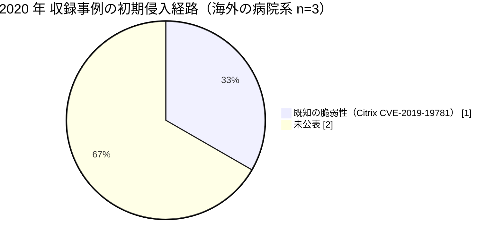

# 📅 2020 年の情勢（国内と海外）

> [!NOTE]
> 本ページの集計は、断りのない限り**本リポジトリに収録した事例**を母集団とする。
> 国内および世界で発生した被害の全数ではない。収録が 0 件であることは、被害がなかったことを意味しない。
> 個別の経緯は [国内の履歴](../japan/2020-timeline.md) と [海外の履歴](../global/2020-timeline.md) を参照してほしい。

## その年の要点

**分析**：ランサムウェアの被害が、情報漏えいではなく臨床アウトカムの問題として議論された年である。
[GL-2020-02 デュッセルドルフ大学病院](../global/2020-timeline.md#GL-2020-02)では救急搬送の受け入れが不能になり、患者の死亡と攻撃の因果関係が当局の検証対象になった。
[GL-2020-03 Vastaamo](../global/2020-timeline.md#GL-2020-03)では、恐喝の相手が組織ではなく患者個人になった。
組織が身代金を払うかどうかという枠組みでは説明できない被害が、この年に二つの形で現れている。

国内では、COVID-19 への対応でオンライン診療、在宅勤務、外部との情報連携が短期間で拡大した。
一方、当事者が経緯を公表した事例は本リポジトリに収録できていない。
翌 2021 年の[半田病院の調査報告書](../japan/2021-timeline.md#JP-2021-01)以前は、国内で被害の詳細が表に出ることがまれだった。

## 収録事例の集計

### 区分別の件数

| 区分 | 国内 | 海外 | 海外の内訳 |
|---|---|---|---|
| 病院系 | 0 | 3 | 米 1、独 1、フィンランド 1 |
| 製薬企業系 | 0 | 0 | 収録なし |
| 医療関連事業者 | 0 | 0 | 収録なし |

### 初期侵入経路の内訳（海外、病院系）

### 被害の型

| ID | 組織 | 被害の型 |
|---|---|---|
| [GL-2020-01](../global/2020-timeline.md#GL-2020-01) | Universal Health Services | 統合基盤の同時停止 |
| [GL-2020-02](../global/2020-timeline.md#GL-2020-02) | デュッセルドルフ大学病院 | 救急受入の停止と患者の転送 |
| [GL-2020-03](../global/2020-timeline.md#GL-2020-03) | Vastaamo | 患者個人への恐喝と事業の破綻 |

## この年を象徴する事例

- [GL-2020-02 デュッセルドルフ大学病院](../global/2020-timeline.md#GL-2020-02)：被害の評価軸が、漏えい規模から診療の停止時間へ移った事例
- [GL-2020-03 Vastaamo](../global/2020-timeline.md#GL-2020-03)：恐喝の対象が患者個人まで下りた事例

## 外部統計

| 統計 | 地域 | 参照先 | 本リポジトリでの集計状況 |
|---|---|---|---|
| ランサムウェア被害の報告件数（業種別、半期ごと） | 国内 | [警察庁 サイバー空間をめぐる脅威の情勢等](https://www.npa.go.jp/publications/statistics/cybersecurity/index.html) | 未集計 |
| 医療分野のインシデント動向 | 国内 | [IPA 情報セキュリティ白書](https://www.ipa.go.jp/publish/wp-security/index.html) | 未集計 |
| 米国の医療情報侵害の届出（500 人以上） | 海外 | [HHS OCR Breach Portal](https://ocrportal.hhs.gov/ocr/breach/breach_report.jsf) | 未集計 |
| 欧州の医療分野の脅威動向 | 海外 | [ENISA Health Threat Landscape](https://www.enisa.europa.eu/) | 未集計 |

数値は原典を確認したうえで追記する。

## 規制と制度の動き

**国内**：事業者向けのガイドラインが総務省と経済産業省の二本立てから一本化され、「三省二ガイドライン」の呼称になったのがこの年である（[国内のガイドラインと法規制](../../../guidelines/japan.md#三省二ガイドライン)）。

**海外**：本リポジトリで整理した動きはない。

## 前年との差分

**分析**：2019 年以前の収録事例（[GL-2017-01 NHS](../global/2019-earlier.md#GL-2017-01)、[GL-2015-01 Anthem](../global/2019-earlier.md#GL-2015-01)）は、無差別のワームと大規模データ侵害という二つの型だった。
2020 年の 3 件は、いずれも標的を選んだうえで診療または患者に圧力をかける形をとっている。

## 追記が必要な観点

- 国内：警察庁の統計における 2020 年下半期の医療、福祉分野の件数
- 国内：COVID-19 対応で導入されたオンライン診療基盤に関する公表インシデント
- 国内、海外：製薬企業と医療関連事業者の被害公表の有無

---

[← 2019 年以前（国内）](../japan/2019-earlier.md) ／ [2019 年以前（海外）](../global/2019-earlier.md) | [国内の履歴](../japan/2020-timeline.md) | [海外の履歴](../global/2020-timeline.md) | [インシデント事例集](../README.md) | [2021 年 →](2021-summary.md) | [トップへ](../../../../README.md)
