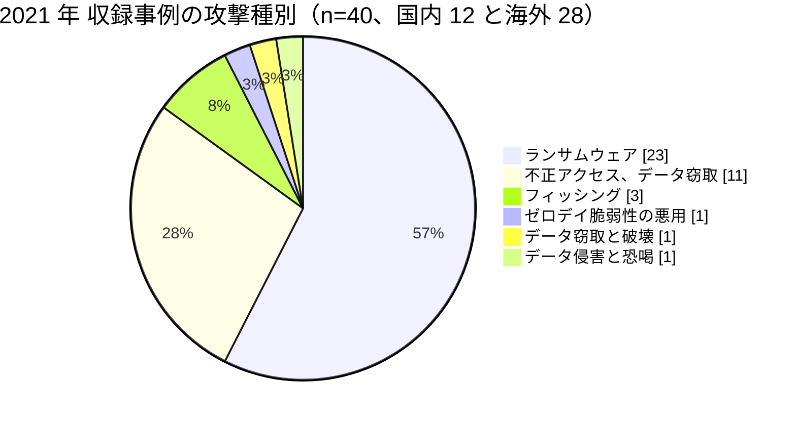

# 📅 2021 年の情勢（国内と海外）

> [!NOTE]
> 本ページの集計は、断りのない限り**本リポジトリに収録した事例**を母集団とする。
> 国内および世界で発生した被害の全数ではない。収録が 0 件であることは、被害がなかったことを意味しない。
> 個別の経緯は [国内の履歴](../japan/2021-timeline.md) と [海外の履歴](../global/2021-timeline.md) を参照してほしい。

## その年の要点

**分析**：国家規模の保健システムが止まり、その経緯が調査報告書として公開された年である。
医療分野のインシデント対応が、個々の病院の問題から国の制度の問題として扱われるようになった。

[GL-2021-01 アイルランド HSE](../global/2021-timeline.md#GL-2021-01) は全国の IT システムを停止させ、復旧に約 4 か月を要した。
同国は独立事後レビューを 12 月に公表し、CISO 機能の不在、資産管理の不備、ログの欠如を被害拡大の要因として記録した。
[GL-2021-06 Waikato District Health Board](../global/2021-timeline.md#GL-2021-06)（ニュージーランド）、[GL-2021-15 ニューファンドランド・ラブラドール州](../global/2021-timeline.md#GL-2021-15)（カナダ）でも、政府または監督機関が経緯を記録した文書が残った。

国内では、[JP-2021-01 徳島県つるぎ町立半田病院](../japan/2021-timeline.md#JP-2021-01) が被害を受け、翌年 6 月に有識者会議の調査報告書が公表された。
侵入経路が Fortinet 製 VPN 装置の CVE-2018-13379 であること、認証情報が闇サイトで公開されていたこと、ウイルス対策ソフトが稼働していない端末があったことまでが記載された。
国内の医療機関が技術的な経緯を詳細に公開した最初の例である。

委託先とファイル転送製品の型も、この年に定着した。
[GL-2021-19 Accellion FTA](../global/2021-timeline.md#GL-2021-19) の脆弱性は、利用していた薬局チェーン、医療保険、大学病院に数百万人規模の漏えいをもたらした。
国内でも、医薬品開発を支援する [JP-2021-10 リニカル](../japan/2021-timeline.md#JP-2021-10) が侵害され、治験に関わる医師とコーディネーターの名簿を含む最大 約 22 万件が流出した可能性がある。
委託元の製薬企業 3 社が、それぞれ影響を個別に公表した。
被験者の情報は別のクラウド環境に置いていたため影響を免れており、区分けの設計が被害の範囲を決めている。

半田病院の陰に隠れているが、国内ではこの年、診療に影響した事案がほかにも公表されている。
[JP-2021-04 市立東大阪医療センター](../japan/2021-timeline.md#JP-2021-04)は医用画像参照システムが約 3 週間にわたり一部参照できず、[JP-2021-08 富士病院](../japan/2021-timeline.md#JP-2021-08)は 1 か月以上にわたり診療を一部制限した。
どちらも報告書は公表されていない。
公表の粒度の差が、そのまま他の医療機関が学べる材料の差になる。

恐喝の対象が患者個人へ下りる型も続いた。
[GL-2021-28 Planned Parenthood Los Angeles](../global/2021-timeline.md#GL-2021-28) では、約 40 万人分の診断名と実施した処置の内容が対象になった。
医療情報の機微さは、疾患の重さではなく、知られたときに当人が置かれる状況で決まる。

## 収録事例の集計

### 区分別の件数

| 区分 | 国内 | 海外 | 内訳 |
|---|---|---|---|
| 病院系 | 9 | 19 | 国内は公立病院 5、大学病院 2、国立の研究センター 1、公益社団法人の病院 1。海外は米 9、仏 2、アイルランド 2、伊 1、加 1、豪 1、NZ 1、イスラエル 1、ブラジル 1 |
| 製薬企業系 | 1 | 0 | 国内は医薬品開発の支援（CRO）1 |
| 医療関連事業者 | 2 | 9 | 国内は医療機器の販売 2。海外はソフトウェア 2、給付管理と医療保険 2、事務と請求の受託 2、在宅呼吸療法 1、検査 1、歯科の運営支援 1 |
| その他の事案 | 13 | 1 | 国内は記憶媒体と端末の紛失、盗難 5、誤送付と誤公開 6、内部不正 1、システム障害 1。海外はデータベースの設定不備 1 |

### 攻撃種別の内訳

**分析**：40 件のうち 23 件がランサムウェアである。
前年の 18 件から増えた。
ただし国内の 12 件では、ランサムウェアは[つるぎ町立半田病院](../japan/2021-timeline.md#JP-2021-01)、[八神製作所](../japan/2021-timeline.md#JP-2021-09)、[ムトウ](../japan/2021-timeline.md#JP-2021-12)の 3 件にとどまり、残る 9 件はメールアカウントとクラウドのアカウントへの不正アクセス、ウェブサイトの改ざん、フィッシングである。
警察庁の統計でも、国内のランサムウェア被害の報告件数はこの年から集計が始まり、146 件が記録されている（[日本の統計](../../statistics/japan.md)）。

### 初期侵入経路の内訳

| 経路 | 件数 | 該当する事例 |
|---|---|---|
| 未公表 | 29 | 大半の事案 |
| VPN 装置の既知の脆弱性 | 1 | [JP-2021-01](../japan/2021-timeline.md#JP-2021-01)（CVE-2018-13379） |
| 盗まれた認証情報による VPN 接続 | 1 | [GL-2021-15](../global/2021-timeline.md#GL-2021-15) |
| フィッシングメールの添付ファイル | 1 | [GL-2021-01](../global/2021-timeline.md#GL-2021-01) |
| フィッシングによる認証情報の窃取 | 2 | [JP-2021-02](../japan/2021-timeline.md#JP-2021-02)、[JP-2021-03](../japan/2021-timeline.md#JP-2021-03) |
| ファイル転送製品のゼロデイ脆弱性 | 1 | [GL-2021-19](../global/2021-timeline.md#GL-2021-19) |
| 委託先のウェブ基盤の未修正の脆弱性 | 1 | [GL-2021-21](../global/2021-timeline.md#GL-2021-21)（7 年間未適用） |
| 第三者に許可したネットワーク接続 | 1 | [GL-2021-16](../global/2021-timeline.md#GL-2021-16) |
| クラウドの保管領域 | 1 | [GL-2021-20](../global/2021-timeline.md#GL-2021-20) |
| 推測しやすい管理画面の ID とパスワード | 1 | [JP-2021-06](../japan/2021-timeline.md#JP-2021-06) |
| 私用パソコンの院内 LAN への接続 | 1 | [JP-2021-07](../japan/2021-timeline.md#JP-2021-07) |

**分析**：経路が公表された 11 件のうち、2 件が VPN の脆弱性または VPN の認証情報である。
国内の[半田病院](../japan/2021-timeline.md#JP-2021-01)とカナダの[ニューファンドランド・ラブラドール州](../global/2021-timeline.md#GL-2021-15)は、地球の反対側で同じ月に、同じ型の経路を突かれた。
国内ではこの年、職員が個人で契約したクラウドサービスへの侵害が 2 件（[JP-2021-02](../japan/2021-timeline.md#JP-2021-02)、[JP-2021-03](../japan/2021-timeline.md#JP-2021-03)）、私用端末の持ち込みが 1 件（[JP-2021-07](../japan/2021-timeline.md#JP-2021-07)）ある。
いずれも病院の情報システム部門から見て、存在自体が把握されていない領域である。
警察庁の統計では、2022 年以降も VPN 機器が侵入経路の 6 割前後を占め続けている。

### 業務停止期間と完全復旧までの時間

| ID | 組織 | 停止した機能 | 完全復旧までの時間 |
|---|---|---|---|
| [GL-2021-02](../global/2021-timeline.md#GL-2021-02) | Centre Hospitalier de Dax（仏） | 病院情報システム全般 | **約 1 年半**、費用 230 万ユーロ |
| [GL-2021-01](../global/2021-timeline.md#GL-2021-01) | HSE（アイルランド） | 全国の IT システム | 約 4 か月（復号鍵を無償で入手してもなお） |
| [GL-2021-06](../global/2021-timeline.md#GL-2021-06) | Waikato DHB（NZ） | 5 病院の情報システムと電話 | 主要システムまで約 2 か月 |
| [GL-2021-04](../global/2021-timeline.md#GL-2021-04) | UnitingCare Queensland（豪） | 病院と高齢者ケアの中核システム | 約 2 か月（身代金を支払ってもなお） |
| [JP-2021-01](../japan/2021-timeline.md#JP-2021-01) | 半田病院（国内） | 電子カルテを含む院内システム | 約 2 か月 |
| [GL-2021-05](../global/2021-timeline.md#GL-2021-05) | Scripps Health（米） | 電子カルテと患者ポータル | 約 4 週間、被害額 1 億 1270 万ドル |
| [GL-2021-10](../global/2021-timeline.md#GL-2021-10) | Regione Lazio（伊） | COVID-19 ワクチンの予約受付 | 3 日（別サイトで再開） |

**分析**：復号鍵を無償で得た HSE が 4 か月、身代金を支払った UnitingCare Queensland が 2 か月を要した。
どちらも「鍵さえあれば早く戻る」という想定が成り立っていない。
鍵の入手は復旧作業の出発点であり、検証と再構築の工程がそのあとに残る（[事業継続](../../../response/bcp-cyber.md)）。

Centre Hospitalier de Dax の 1 年半は、収録事例の中で最も長い。
攻撃の当日に測れる停止時間と、組織が元の生産性に戻るまでの時間は、桁が違うことがある。

### 身代金の扱いが公表された事例

| 事例 | 支払い | 結果 |
|---|---|---|
| [GL-2021-01 HSE](../global/2021-timeline.md#GL-2021-01) | 不払い | 攻撃者が無償で復号鍵を提供。それでも復旧に 4 か月 |
| [GL-2021-04 UnitingCare Queensland](../global/2021-timeline.md#GL-2021-04) | 支払い（数十万ドル規模） | 復旧に 2 か月 |
| [GL-2021-06 Waikato DHB](../global/2021-timeline.md#GL-2021-06) | 不払い | 第三者が闇サイトへデータを公開 |
| [GL-2021-13 Eskenazi Health](../global/2021-timeline.md#GL-2021-13) | 不払い | 攻撃者が 151 万人分のデータを公開 |
| [GL-2021-14 Hillel Yaffe Medical Center](../global/2021-timeline.md#GL-2021-14) | 支払い不可（公立） | 情報システムの停止が数週間 |

**分析**：支払いの有無は復旧の速さをほとんど左右せず、公開されるかどうかを左右した。
支払わないと決めるなら、公開を前提とした通知と支援の計画を持つことになる。
この判断は技術部門では決められない（[経営とガバナンス](../../../governance/)）。

## この年を象徴する事例

- [GL-2021-01 HSE](../global/2021-timeline.md#GL-2021-01)：国家保健サービスが止まり、経緯が独立レビューとして公開された事例
- [JP-2021-01 徳島県つるぎ町立半田病院](../japan/2021-timeline.md#JP-2021-01)：国内の医療機関が技術的な経緯を詳細に公開した最初の事例
- [GL-2021-19 Accellion FTA](../global/2021-timeline.md#GL-2021-19)：ファイル転送製品 1 個の脆弱性が、業界横断の漏えいに変換された事例
- [GL-2021-21 Florida Healthy Kids Corporation](../global/2021-timeline.md#GL-2021-21)：委託先のウェブ基盤に 7 年間パッチが当たっていなかった事例

## 外部統計

| 統計 | 地域 | 参照先 | 本リポジトリでの集計状況 |
|---|---|---|---|
| ランサムウェア被害の報告件数 | 国内 | [警察庁](https://www.npa.go.jp/publications/statistics/cybersecurity/index.html) | **146 件**（うち医療、福祉 7 件、7 位、4.8%）（[日本の統計](../../statistics/japan.md#業種別内訳における医療福祉)） |
| 個人情報の漏えい等報告 | 国内 | [個人情報保護委員会](https://www.ppc.go.jp/) | 未集計（義務化は 2022 年 4 月） |
| 米国の医療情報侵害の届出（500 人以上） | 海外 | [HHS OCR Breach Portal](https://ocrportal.hhs.gov/ocr/breach/breach_report.jsf) | **集計済み**：[2021 年 米国 HHS OCR 届出の全件集計](../global/2021-us-hhs.md) |

### HHS OCR の届出（米国）

| 項目 | 値 |
|---|---|
| 届出件数 | 715 件 |
| 影響人数の合計 | 6120 万 6238 人 |
| 1 件あたりの中央値 | 5269 人 |
| 100 万人以上の届出 | 15 件（合計 2991 万 0262 人） |

**分析**：件数は前年から 8% の増加に留まったが、影響人数は 3532 万人から 6120 万人へ 73% 増えた。
100 万人以上の届出は 6 件から 15 件へ増えている。
件数ではなく 1 件あたりの規模が拡大した年である。

## 規制と制度の動き

### 国内

厚生労働省の「医療情報システムの安全管理に関するガイドライン」第 5.1 版が 2021 年 1 月に公表され、外部委託とクラウドサービスの利用に関する記述が整理された。
2021 年 5 月にはデジタル改革関連法が成立し、医療分野のデータ連携の基盤整備が進んだ。
詳細は [国内のガイドラインと法規制](../../../guidelines/japan.md) を参照してほしい。

### 海外

フランス政府は 2021 年 2 月、[ダックス](../global/2021-timeline.md#GL-2021-02)と[ヴィルフランシュ・シュル・ソーヌ](../global/2021-timeline.md#GL-2021-03)の被害を受けて、医療分野のサイバーセキュリティ強化策を打ち出した。
米国では 2021 年 9 月、CISA、FBI、NSA が Conti に関する共同勧告（AA21-265A）を更新し、米国の医療機関と初動対応機関に対する 400 件超の攻撃を挙げた。
2021 年 12 月には Apache Log4j の脆弱性（CVE-2021-44228）が公表され、医療機器と部門システムに含まれる部品の把握が課題になった。

## 前年との差分

**分析**：2020 年に現れた三つの型（診療の停止、委託先経由の大規模漏えい、患者個人への恐喝）のうち、2021 年に規模を拡大したのは前の二つである。

新しく現れたのは、**国が経緯を記録する仕組み**である。
アイルランドの独立事後レビュー、ニュージーランドの状況報告と独立レビュー、カナダのニューファンドランド・ラブラドール州の概要文書は、いずれも被害組織の自主的な報告ではなく、政府または監督機関が作成した。
被害組織の負担で報告書を作る仕組みでは、記録が残らない場合がある。

国内では、[半田病院](../japan/2021-timeline.md#JP-2021-01)が有識者会議による報告書を公表した。
被害の当日に記者会見を行い、方針の決定時にも会見を開き、国内外の取材に応じた。
公表の慣行が国内で始まった年として位置づけられる。
ただし、この報告書が公表された 2022 年 6 月 16 日の 3 日後に、同じ徳島県の[鳴門山上病院](../japan/2022-timeline.md#JP-2022-02)が同じ LockBit 2.0 の被害を受けている。
報告書の公表と、それが他の医療機関の防御に反映されるまでのあいだには、時間の隔たりがある。

---

[← 2020 年](2020-summary.md) | [国内の履歴](../japan/2021-timeline.md) | [海外の履歴](../global/2021-timeline.md) | [米国 HHS OCR 届出の全件集計](../global/2021-us-hhs.md) | [インシデント事例集](../README.md) | [2022 年 →](2022-summary.md) | [トップへ](../../../../README.md)
