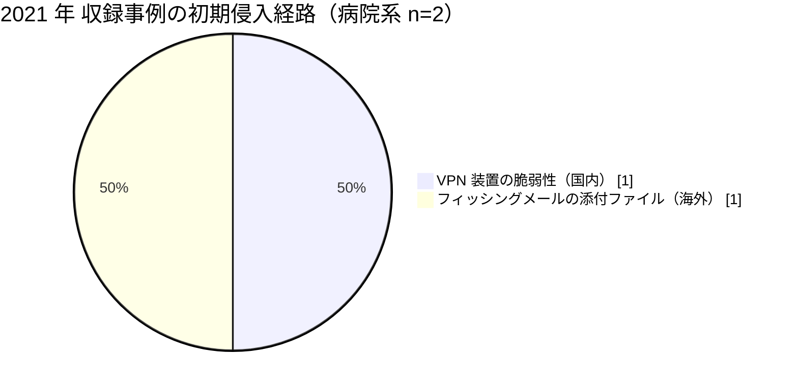

# 📅 2021 年の情勢（国内と海外）

> [!NOTE]
> 本ページの集計は、断りのない限り**本リポジトリに収録した事例**を母集団とする。
> 国内および世界で発生した被害の全数ではない。収録が 0 件であることは、被害がなかったことを意味しない。
> 個別の経緯は [国内の履歴](../japan/2021-timeline.md) と [海外の履歴](../global/2021-timeline.md) を参照してほしい。

## その年の要点

**分析**：医療機関が被害の経緯を自ら公開する動きが、国内と海外で同時期に始まった年である。

海外では、国家規模の保健サービスが停止し、その事後レビューが公開された。
[GL-2021-01 HSE](../global/2021-timeline.md#GL-2021-01)の Post Incident Review は、暗号化に至るまでの数か月の潜伏期間に検知の機会が複数回あったことを示した。
被害の規模を決めたのは攻撃の高度さではなく、資産管理、ログ、CISO 機能という体制側の欠落だった。

国内では、[JP-2021-01 半田病院](../japan/2021-timeline.md#JP-2021-01)が、被害の事実だけでなく、VPN 装置の脆弱性、ウイルス対策ソフトの停止、バックアップの被害まで公表した。
それ以前の国内事例（[JP-2018-01 宇陀市立病院](../japan/2019-earlier.md#JP-2018-01)など）は経緯が公表されず、他の医療機関が転用できる情報が残らなかった。
この差が、翌年以降の公表の水準を決めた。

## 収録事例の集計

### 区分別の件数

| 区分 | 国内 | 海外 | 内訳 |
|---|---|---|---|
| 病院系 | 1 | 1 | 国内は公立病院 1、海外は国家保健サービス 1（アイルランド） |
| 製薬企業系 | 0 | 0 | 収録なし |
| 医療関連事業者 | 0 | 0 | 収録なし |

### 初期侵入経路の内訳

### 診療への影響

| 区分 | 組織 | 停止した範囲 | 通常復旧までの期間 |
|---|---|---|---|
| 病院系（国内） | 徳島県つるぎ町立半田病院 | 電子カルテを含む院内システム、新規患者の受け入れ | 約 2 か月（2021 年 10 月から 2022 年 1 月） |

## この年を象徴する事例

- [JP-2021-01 徳島県つるぎ町立半田病院](../japan/2021-timeline.md#JP-2021-01)：国内で初めて、医療機関が技術的な経緯を調査報告書として公開した事例
- [GL-2021-01 HSE](../global/2021-timeline.md#GL-2021-01)：潜伏期間中の検知機会を、事後レビューが具体的に列挙した事例

## 外部統計

| 統計 | 地域 | 参照先 | 本リポジトリでの集計状況 |
|---|---|---|---|
| ランサムウェア被害の報告件数（業種別、半期ごと） | 国内 | [警察庁 サイバー空間をめぐる脅威の情勢等](https://www.npa.go.jp/publications/statistics/cybersecurity/index.html) | 未集計 |
| 医療分野のインシデント動向 | 国内 | [IPA 情報セキュリティ白書](https://www.ipa.go.jp/publish/wp-security/index.html) | 未集計 |
| 米国の医療情報侵害の届出（500 人以上） | 海外 | [HHS OCR Breach Portal](https://ocrportal.hhs.gov/ocr/breach/breach_report.jsf) | 未集計 |
| 欧州の医療分野の脅威動向 | 海外 | [ENISA Health Threat Landscape](https://www.enisa.europa.eu/) | 未集計 |

数値は原典を確認したうえで追記する。

## 規制と制度の動き

本年について、本リポジトリで整理した動きはない。
国内の規制の全体像は [国内のガイドラインと法規制](../../../guidelines/japan.md) にまとめている。

## 前年との差分

**分析**：海外では、2020 年の 3 件が被害の型を示したのに対し、2021 年の 1 件は防御側の失敗の内訳を示した。
国内では、2020 年に収録した事例がなく、2021 年に病院系の 1 件が調査報告書という形で一次情報を残した。
収録件数の増減は、被害件数の増減ではなく、公表の有無を反映している。

---

[← 2020 年](2020-summary.md) | [国内の履歴](../japan/2021-timeline.md) | [海外の履歴](../global/2021-timeline.md) | [インシデント事例集](../README.md) | [2022 年 →](2022-summary.md) | [トップへ](../../../../README.md)
