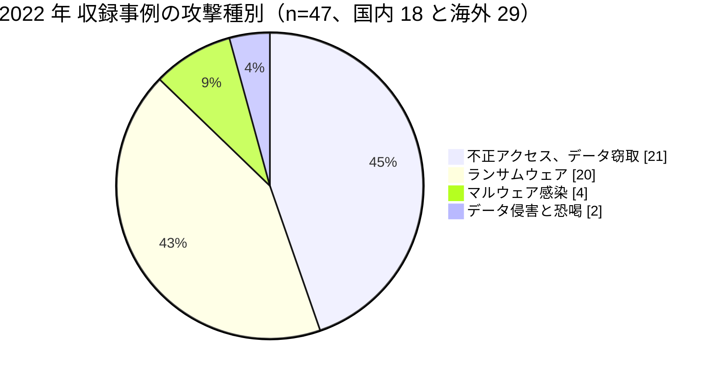

# 📅 2022 年の情勢（国内と海外）

> [!NOTE]
> 本ページの集計は、断りのない限り**本リポジトリに収録した事例**を母集団とする。
> 国内および世界で発生した被害の全数ではない。収録が 0 件であることは、被害がなかったことを意味しない。
> 個別の経緯は [国内の履歴](../japan/2022-timeline.md) と [海外の履歴](../global/2022-timeline.md) を参照してほしい。

## その年の要点

**分析**：委託先経由の侵入と、攻撃者が関与しない漏えいの二つが、同じ年に表面化した。

国内では [JP-2022-01 大阪急性期・総合医療センター](../japan/2022-timeline.md#JP-2022-01) が、給食提供事業者に設置された保守用の VPN 装置を経由して侵害された。
基幹システムの再稼働に 43 日、診療システム全体の復旧に 73 日を要し、逸失利益は十数億円以上と見積もられた。
医療機関の攻撃対象領域が院内で完結しないことを、調査報告書が経路の段階まで示した。

海外では、攻撃者が関与しない漏えいが届出の上位に現れた。
[GL-2022-S03 Advocate Aurora Health](../global/2022-timeline.md#GL-2022-S03) の 300 万人、[GL-2022-S04 Community Health Network](../global/2022-timeline.md#GL-2022-S04) の 150 万人、[GL-2022-S02 Novant Health](../global/2022-timeline.md#GL-2022-S02) の 136 万人は、いずれもウェブサイトに設置した計測タグによる第三者への送信である。

国レベルの停止も続いた。
[GL-2022-06 コスタリカ社会保険基金](../global/2022-timeline.md#GL-2022-06) は全国 1200 の医療施設に影響し、[GL-2022-13 AIIMS ニューデリー](../global/2022-timeline.md#GL-2022-13) は外来と入院の受付を 2 週間手作業へ戻した。

英国では、[GL-2022-29 Advanced](../global/2022-timeline.md#GL-2022-29) の侵害で NHS 111 の受付が止まった。
侵入口は、多要素認証が設定されていない第三者アカウント 1 件である。
一部のトラストは基幹ソフトを 2 か月にわたり利用できず、医療機関と診療所は数週間、紙と鉛筆の運用に戻った。

そして [GL-2022-S01 Guy's and St Thomas'](../global/2022-timeline.md#GL-2022-S01) が、攻撃ではなく記録的な高温で 371 のシステムを止めた。
互いのバックアップとして設計された二つのデータセンターが、同じ環境要因で同時に無効化された。

国内では、大阪の事案のほかに 14 件を収録した。
[JP-2022-08 安江病院](../japan/2022-timeline.md#JP-2022-08)の最大 11 万人以上は、この年に国内で公表された医療機関の事案では最大の規模である。
給食の[JP-2022-14 ベルキッチン](../japan/2022-timeline.md#JP-2022-14)は、大阪急性期・総合医療センターと同じ 10 月 31 日の朝に被害を受けている。

## 収録事例の集計

### 区分別の件数

| 区分 | 国内 | 海外 | 内訳 |
|---|---|---|---|
| 病院系 | 12 | 14 | 国内は病院 9、大学と大学病院 2、無床の医院 1。海外は米 8、仏 2、独 1、コスタリカ 1、印 1、プエルトリコ 1 |
| 製薬企業系 | 0 | 0 | 収録なし |
| 医療関連事業者 | 6 | 15 | 国内は給食 1、医療用具 1、医療従事者向けメディア 1、病院関連の受託と介護用品 1、介護認定の調査 1、医師会 1。海外は事務と請求の受託 6、画像診断 2、電子カルテ 2、医療保険 2、NHS の基盤提供 1、検査 1、在宅医療機器 1 |
| その他の事案 | 17 | 4 | 国内は記憶媒体と端末の紛失 6、誤送付と誤公開 6、委託先の管理不備 2、内部不正 1、サポート詐欺 1、システム障害 1。海外はシステム障害 1、計測タグの設定不備 3 |

### 攻撃種別の内訳

**分析**：暗号化を伴わない不正アクセスが 21 件となり、ランサムウェアの 20 件を上回った。
前年は 11 件であり、2 倍近い。
暗号化して復旧を人質に取る型と、窃取だけで恐喝する型が並立した年である。

国内の 18 件では、不正アクセスが 9 件でランサムウェアの 5 件を上回る。
マルウェア感染 4 件は、いずれも 2 月から 3 月にかけて国内で再流行した Emotet である（[JP-2022-07 秋田赤十字病院](../japan/2022-timeline.md#JP-2022-07)、[JP-2022-11 グッドマン](../japan/2022-timeline.md#JP-2022-11)、[JP-2022-16 大雄会](../japan/2022-timeline.md#JP-2022-16)、[JP-2022-17 健昌会](../japan/2022-timeline.md#JP-2022-17)）。
内訳は、電子カルテを含むシステムの障害（[JP-2022-04](../japan/2022-timeline.md#JP-2022-04)、[JP-2022-06](../japan/2022-timeline.md#JP-2022-06)、[JP-2022-09](../japan/2022-timeline.md#JP-2022-09)）と、メールおよびクラウドのアカウントの乗っ取り（[JP-2022-05](../japan/2022-timeline.md#JP-2022-05)、[JP-2022-10](../japan/2022-timeline.md#JP-2022-10)）に分かれる。

### 初期侵入経路の内訳

| 経路 | 件数 | 該当する事例 |
|---|---|---|
| 未公表 | 35 | 大半の事案 |
| 委託先の保守用 VPN 装置 | 2 | [JP-2022-01](../japan/2022-timeline.md#JP-2022-01)、[GL-2022-09](../global/2022-timeline.md#GL-2022-09) |
| 委託先の職員の認証情報（MFA なしの VPN） | 1 | [GL-2022-02](../global/2022-timeline.md#GL-2022-02) |
| 電子カルテの提供事業者の侵害 | 1 | [GL-2022-10](../global/2022-timeline.md#GL-2022-10) |
| クラウド上のデータベース | 1 | [GL-2022-21](../global/2022-timeline.md#GL-2022-21) |
| 開発環境に置かれた本番データ | 1 | [GL-2022-28](../global/2022-timeline.md#GL-2022-28) |
| 多要素認証のない第三者アカウントの正規の資格情報 | 1 | [GL-2022-29](../global/2022-timeline.md#GL-2022-29) |
| 職員が受信したメール（Emotet） | 3 | [JP-2022-07](../japan/2022-timeline.md#JP-2022-07)、[JP-2022-11](../japan/2022-timeline.md#JP-2022-11)、[JP-2022-17](../japan/2022-timeline.md#JP-2022-17)（他企業からのメール） |
| パスワードへの総当たり攻撃 | 1 | [JP-2022-05](../japan/2022-timeline.md#JP-2022-05) |
| 職員のアカウントのパスワードの窃取 | 1 | [JP-2022-10](../japan/2022-timeline.md#JP-2022-10) |

**分析**：47 件のうち 35 件で侵入経路が公表されていない。
経路が公表された事案のうち、委託先を起点とするものが 5 件を占める。
[大阪急性期・総合医療センター](../japan/2022-timeline.md#JP-2022-01)と[コルベイユ・エソンヌ](../global/2022-timeline.md#GL-2022-09)は、いずれも委託先に設置された保守用の VPN が入口であった。
医療機関が自組織のネットワークだけを点検しても、この経路は見つからない（[攻撃面](../../../practice/attack-surface.md)）。

[Medibank](../global/2022-timeline.md#GL-2022-02) では、委託先の職員がブラウザのプロファイルに保存した認証情報が、個人の端末へ同期されて窃取された。
その認証情報で、多要素認証のない VPN へログインされた。
端末の管理と認証の管理を別々に設計していると、この経路は両方の隙間に落ちる。

英国の [Advanced](../global/2022-timeline.md#GL-2022-29) は、多要素認証が設定されていない第三者アカウント 1 件から侵入され、NHS 111 の受付が止まった。
一部のトラストでは基幹ソフトを 2 か月にわたり利用できず、医療機関は紙運用へ戻った。
情報コミッショナー事務局は 2025 年、攻撃を受けた事実ではなく攻撃以前のリスク分析とアクセス制御の不備を理由に、307 万ポンドの制裁金を科している。

### 止まった機能と診療への波及

| ID | 地域 | 止まった機能 | 診療への波及 | 停止期間 |
|---|---|---|---|---|
| [JP-2022-01](../japan/2022-timeline.md#JP-2022-01) | 国内 | 電子カルテを含む基幹システム、端末 2200 台 | 外来と手術の大幅な制限。11 月の初診患者数は前年同月比 17.9% | 基幹 43 日、全体 73 日 |
| [JP-2022-02](../japan/2022-timeline.md#JP-2022-02) | 国内 | 電子カルテと院内 LAN | 外来を再来患者に限定 | 未公表 |
| [GL-2022-01](../global/2022-timeline.md#GL-2022-01) | 米国 | 100 超の施設の電子カルテ | 紙運用。小児患者への投薬量誤りが報じられた | 約 2 週間から 3 週間、被害額 1 億 6000 万ドル |
| [GL-2022-06](../global/2022-timeline.md#GL-2022-06) | コスタリカ | 全国約 1200 施設の診療系システム | 紙運用。COVID-19 検査の結果を報告できず | 数週間から数か月 |
| [GL-2022-13](../global/2022-timeline.md#GL-2022-13) | インド | e-Hospital の全機能 | 外来、入院、検査、会計を約 2 週間手作業へ | 約 2 週間 |
| [GL-2022-09](../global/2022-timeline.md#GL-2022-09) | フランス | 検査と画像の系統 | 患者を他院へ転送 | 数か月 |
| [GL-2022-S01](../global/2022-timeline.md#GL-2022-S01) | 英国 | 371 のレガシーシステム | 紙運用。血管外科、心臓外科、移植の患者を他院へ転送 | ほぼ完全な復旧まで数週間 |

**分析**：大阪急性期・総合医療センターは、診療実績の低下を前年同月比で公表した。
初診患者数 17.9%、延外来患者数 61.6%、新入院患者数 33.3% である。
停止日数だけでは、どの診療がどれだけ止まったかが伝わらない。
診療の単位で被害を測る指標を持つ組織は少ない。

## この年を象徴する事例

- [JP-2022-01 大阪急性期・総合医療センター](../japan/2022-timeline.md#JP-2022-01)：委託先の保守経路を起点とする侵入が、7 段階の連鎖として調査報告書に記録された事例
- [GL-2022-02 Medibank](../global/2022-timeline.md#GL-2022-02)：ブラウザのプロファイル同期という日常の機能が、970 万人の漏えいの入口になった事例
- [GL-2022-S01 Guy's and St Thomas'](../global/2022-timeline.md#GL-2022-S01)：互いのバックアップである二つのデータセンターが、同じ高温で同時に停止した事例
- [GL-2022-S03 Advocate Aurora Health](../global/2022-timeline.md#GL-2022-S03)：攻撃者が関与しない計測タグの設定が、届出の人数で上位に入った事例

## 外部統計

| 統計 | 地域 | 参照先 | 本リポジトリでの集計状況 |
|---|---|---|---|
| ランサムウェア被害の報告件数 | 国内 | [警察庁](https://www.npa.go.jp/publications/statistics/cybersecurity/index.html) | **230 件**（うち医療、福祉 **20 件、3 位、8.7%**）（[日本の統計](../../statistics/japan.md#業種別内訳における医療福祉)） |
| ランサムウェアの侵入経路 | 国内 | 同上 | VPN 機器 63 件（62%）、リモートデスクトップ 19 件（19%）。有効回答 102 件 |
| 個人情報の漏えい等報告 | 国内 | [個人情報保護委員会](https://www.ppc.go.jp/) | 2022 年 4 月に義務化。未集計 |
| 米国の医療情報侵害の届出（500 人以上） | 海外 | [HHS OCR Breach Portal](https://ocrportal.hhs.gov/ocr/breach/breach_report.jsf) | **集計済み**：[2022 年 米国 HHS OCR 届出の全件集計](../global/2022-us-hhs.md) |

**分析**：警察庁の集計で医療、福祉が 3 位に入ったのはこの年だけである。
[半田病院](../japan/2021-timeline.md#JP-2021-01)（2021 年 10 月）と[大阪急性期・総合医療センター](../japan/2022-timeline.md#JP-2022-01)（2022 年 10 月）の被害で医療機関の被害が注目された時期にあたる。
報告件数の増加が、実際の被害増と届出率の上昇のどちらをどれだけ反映しているかは、この統計だけでは切り分けられない。

### HHS OCR の届出（米国）

| 項目 | 値 |
|---|---|
| 届出件数 | 718 件 |
| 影響人数の合計 | 6405 万 3662 人 |
| 1 件あたりの中央値 | 7962 人 |
| 「不正なアクセス、開示」の影響人数 | 803 万 6495 人（前年の 4 倍以上） |

**分析**：「不正なアクセス、開示」の影響人数が、前年の 188 万人から 803 万人へ増えた。
増分の大半は計測タグによる第三者への送信である。
攻撃者が関与しない漏えいが、制度の集計に大きく現れた最初の年である。
詳細は[2022 年 米国 HHS OCR 届出の全件集計](../global/2022-us-hhs.md)にまとめた。

## 規制と制度の動き

### 国内

2022 年 4 月に改正個人情報保護法が全面施行され、個人データの漏えい等について個人情報保護委員会への報告と本人への通知が義務化された。
厚生労働省は 2022 年 3 月に「医療情報システムの安全管理に関するガイドライン」第 5.2 版を公表した。
2022 年 12 月には、医療法施行規則の改正により、サイバーセキュリティの確保が医療機関の管理者が講ずべき措置として位置づけられた（施行は 2023 年 4 月 1 日）。
詳細は [国内のガイドラインと法規制](../../../guidelines/japan.md) を参照してほしい。

### 海外

米国では 2022 年 12 月、HHS OCR がウェブサイトとアプリに設置する計測技術（tracking technologies）の利用に関する指針を公表した。
同年に相次いだ計測タグの届出を受けた措置である。
フランスでは、[コルベイユ・エソンヌ](../global/2022-timeline.md#GL-2022-09)と[ヴェルサイユ](../global/2022-timeline.md#GL-2022-14)の被害を受けて、医療分野へのサイバーセキュリティ投資が拡大した。

## 前年との差分

**分析**：2021 年に定着した「委託先とファイル転送製品」の型が、2022 年には「委託先の保守経路」へ具体化した。
[大阪急性期・総合医療センター](../japan/2022-timeline.md#JP-2022-01)と[コルベイユ・エソンヌ](../global/2022-timeline.md#GL-2022-09)は、いずれも委託先の VPN 装置が入口であり、どちらも当事者または当局がその事実を公表している。

新しく現れたのは、**攻撃者が関与しない漏えい**が制度の集計で上位に入ったことである。
米国の届出で「不正なアクセス、開示」の影響人数が 4 倍になり、その大半が計測タグであった。
侵入の検知を強めても、この経路は見つからない。
ウェブサイトに何を載せるかの判断は、広報部門が行い、送信される項目の確認は情報システム部門が行う。
両者の間に手順がないと繰り返される（[トラッキング](../../../technology/web-security/tracking.md)）。

もう一つは、**攻撃以外の原因による停止**である。
[Guy's and St Thomas'](../global/2022-timeline.md#GL-2022-S01) の報告書は、複数の NHS 組織のリスク登録簿を確認したところ、空調の喪失や極端な高温に関するリスクを記載していた組織はなく、いずれもサイバーセキュリティを IT の主要リスクとして挙げていたと記録している。
診療が止まる原因を攻撃に限ると、設備と気象が枠組みから抜ける。

---

[← 2021 年](2021-summary.md) | [国内の履歴](../japan/2022-timeline.md) | [海外の履歴](../global/2022-timeline.md) | [米国 HHS OCR 届出の全件集計](../global/2022-us-hhs.md) | [インシデント事例集](../README.md) | [2023 年 →](2023-summary.md) | [トップへ](../../../../README.md)
