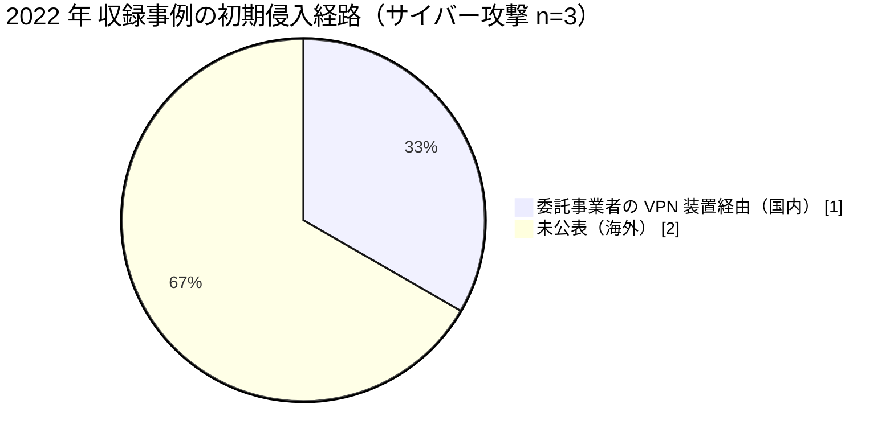

# 📅 2022 年の情勢（国内と海外）

> [!NOTE]
> 本ページの集計は、断りのない限り**本リポジトリに収録した事例**を母集団とする。
> 国内および世界で発生した被害の全数ではない。収録が 0 件であることは、被害がなかったことを意味しない。
> 個別の経緯は [国内の履歴](../japan/2022-timeline.md) と [海外の履歴](../global/2022-timeline.md) を参照してほしい。

## その年の要点

**分析**：国内では侵入の起点が病院の外側へ移り、海外では被害が臨床行為の安全性とデータ公開という二方向に現れた年である。

[JP-2022-01 大阪急性期・総合医療センター](../japan/2022-timeline.md#JP-2022-01)では、給食提供事業者のネットワークが経路になった。
前年の[半田病院](../japan/2021-timeline.md#JP-2021-01)が自院の VPN 装置を起点としていたのに対し、この事案は自院のパッチ管理だけでは防げない構造を示した。
医療機関の攻撃対象領域が委託先まで広がることが、調査報告書という形で裏づけられた。

海外では、[GL-2022-01 CommonSpirit Health](../global/2022-timeline.md#GL-2022-01)で小児患者への投薬量誤りが報じられ、電子カルテ停止時の代替手順が患者安全の問題として議論された。
[GL-2022-02 Medibank](../global/2022-timeline.md#GL-2022-02)では、支払い拒否に対して攻撃者が診療内容を段階的に公開した。

## 収録事例の集計

### 区分別の件数

| 区分 | 国内 | 海外 | 内訳 |
|---|---|---|---|
| 病院系 | 1 | 1 | 国内は公立の急性期病院 1、海外は米の大規模医療グループ 1 |
| 製薬企業系 | 0 | 0 | 収録なし |
| 医療関連事業者 | 0 | 1 | 海外は医療保険 1（豪）。国内の委託先の被害は病院系の事例に含めて記録 |
| その他の事案 | 0 | 1 | 海外はシステム障害 1（英、病院系） |

### 初期侵入経路の内訳

### 一次情報の強度（海外）

| 強度 | 件数 |
|---|---|
| 報告書 | 1 |
| 当事者公表 | 0 |
| 報道のみ | 2 |

サイバー攻撃として収録した海外の 2 件は、いずれも当事者の公表資料を確認できていない。
経緯の追跡には追加調査が必要である。
報告書として確認できているのは、その他の事案に収録した [GL-2022-S01](../global/2022-timeline.md#GL-2022-S01) の 1 件である。

### 診療への影響

| 区分 | 組織 | 停止した範囲 | 通常復旧までの期間 |
|---|---|---|---|
| 病院系（国内） | 大阪急性期・総合医療センター | 電子カルテを含む基幹システム、外来診療と手術 | 約 2 か月半（2022 年 10 月から 2023 年 1 月） |

## この年を象徴する事例

- [JP-2022-01 大阪急性期・総合医療センター](../japan/2022-timeline.md#JP-2022-01)：委託事業者経由の侵入が、調査報告書で経路まで示された事例
- [GL-2022-01 CommonSpirit Health](../global/2022-timeline.md#GL-2022-01)：システム停止が投薬という臨床行為の安全性に及んだ事例
- [GL-2022-02 Medibank](../global/2022-timeline.md#GL-2022-02)：支払い拒否の代償として、診療内容が段階的に公開された事例
- [GL-2022-S01 Guy's and St Thomas'](../global/2022-timeline.md#GL-2022-S01)：攻撃ではなく記録的な高温で診療が止まり、相互バックアップとして設計された二つのデータセンターが同時に落ちた事例

## 外部統計

| 統計 | 地域 | 参照先 | 本リポジトリでの集計状況 |
|---|---|---|---|
| ランサムウェア被害の報告件数（業種別、半期ごと） | 国内 | [警察庁 サイバー空間をめぐる脅威の情勢等](https://www.npa.go.jp/publications/statistics/cybersecurity/index.html) | 未集計 |
| 医療分野のインシデント動向 | 国内 | [IPA 情報セキュリティ白書](https://www.ipa.go.jp/publish/wp-security/index.html) | 未集計 |
| 米国の医療情報侵害の届出（500 人以上） | 海外 | [HHS OCR Breach Portal](https://ocrportal.hhs.gov/ocr/breach/breach_report.jsf) | 未集計 |
| 欧州の医療分野の脅威動向 | 海外 | [ENISA Health Threat Landscape](https://www.enisa.europa.eu/) | 未集計 |

数値は原典を確認したうえで追記する。

## 規制と制度の動き

本年について、本リポジトリで整理した動きはない。
国内では翌 2023 年 4 月の医療法施行規則改正により、医療情報システムの安全管理措置が法令上の義務になる（[国内のガイドラインと法規制](../../../guidelines/japan.md)）。

## 前年との差分

**分析**：国内の収録件数は前年と同じ 1 件だが、侵入の起点が自院の境界機器から委託先へ移った。
対策の対象が、自院の資産管理から委託先の接続管理へ広がることを意味する。
委託先を含めた対策は [防御プレイブック](../../actors/defense-playbook.md) に整理している。

海外では、2021 年の [HSE](../global/2021-timeline.md#GL-2021-01) が病院系のみだったのに対し、2022 年は医療関連事業者（医療保険）が加わった。
攻撃対象が、診療を止める先から、医療情報が集積する先へ広がっている。

---

[← 2021 年](2021-summary.md) | [国内の履歴](../japan/2022-timeline.md) | [海外の履歴](../global/2022-timeline.md) | [インシデント事例集](../README.md) | [2023 年 →](2023-summary.md) | [トップへ](../../../../README.md)
