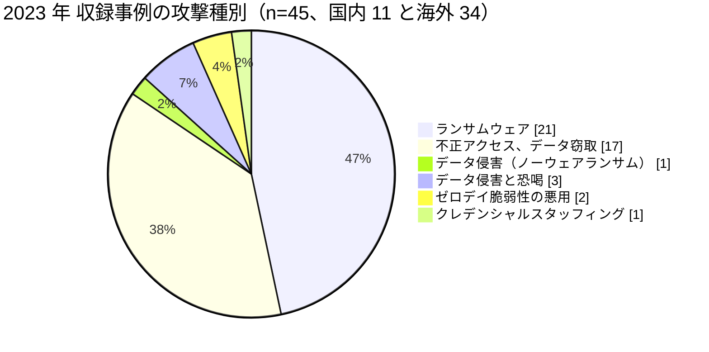

# 📅 2023 年の情勢（国内と海外）

> [!NOTE]
> 本ページの集計は、断りのない限り**本リポジトリに収録した事例**を母集団とする。
> 国内および世界で発生した被害の全数ではない。収録が 0 件であることは、被害がなかったことを意味しない。
> 個別の経緯は [国内の履歴](../japan/2023-timeline.md) と [海外の履歴](../global/2023-timeline.md) を参照してほしい。

## その年の要点

**分析**：米国の届出制度で、**事業提携者の影響人数が初めて医療提供者を上回った**年である。
医療機関が自組織の防御だけで守れる範囲が、人数で見て半分を割った。

引き金は [GL-2023-26 MOVEit Transfer の脆弱性](../global/2023-timeline.md#GL-2023-26)である。
5 月 27 日から悪用が始まり、修正は 4 日後に提供された。
その 4 日で、[Welltok](../global/2023-timeline.md#GL-2023-26)（1478 万人）、[Maximus](../global/2023-timeline.md#GL-2023-26)（917 万人）、[Delta Dental of California](../global/2023-timeline.md#GL-2023-26)（705 万人）を含む一連の窃取が成立した。
2021 年の [Accellion FTA](../global/2021-timeline.md#GL-2021-19)、同年 2 月の [GoAnywhere MFT](../global/2023-timeline.md#GL-2023-18) に続く、同じ攻撃グループによる 3 度目のファイル転送製品への攻撃である。

漏えいの「内容」が争点になった事例も現れた。
[GL-2023-04 Lehigh Valley Health Network](../global/2023-timeline.md#GL-2023-04) では、放射線治療の位置決めに使うがん患者の裸体画像が公開され、集団訴訟の和解額が 6500 万ドル、画像を公開された対象者には 1 人あたり 7 万ドルとなった。
漏えいの賠償が人数ではなく内容で決まった。

恐喝の相手が組織から患者個人へ移った例も、この年に規模を伴って現れた。
[GL-2023-32 Fred Hutchinson Cancer Center](../global/2023-timeline.md#GL-2023-32) では、身代金の支払いがなかったため、攻撃者が患者一人ひとりへ 50 ドルを要求する脅迫メールを送った。
一部の患者は、支払わなければ虚偽の通報で警察の特殊部隊を自宅へ差し向けると脅された。
組織が「支払わない」と決めることは、患者に対する保護にはならない。

国内では、医療法施行規則の改正が 4 月に施行され、サイバーセキュリティの確保が医療機関の管理者の義務になった。
同じ年、[JP-2023-02 宇治病院](../japan/2023-timeline.md#JP-2023-02)と[JP-2023-05 中津市民病院](../japan/2023-timeline.md#JP-2023-05)がランサムウェアの被害を公表している。
どちらも暗号化されたのは事務系のファイルサーバと財務会計システムで、電子カルテと医療機器は無事であった。
前年の[大阪急性期・総合医療センター](../japan/2022-timeline.md#JP-2022-01)のような診療の全面停止には至っていない。
経緯を報告書の水準まで公表した事例は、この年の国内では確認できていない。

医療分野の情報共有を担う[JP-2023-07 医療 ISAC](../japan/2023-timeline.md#JP-2023-07) 自身のウェブサイトも改ざんされた。
防御を助言する側にも、同じ攻撃面がある。

## 収録事例の集計

### 区分別の件数

| 区分 | 国内 | 海外 | 内訳 |
|---|---|---|---|
| 病院系 | 5 | 17 | 国内は社会福祉法人の病院 1、公立病院 3、医療法人の病院 1。海外は米 12、西 1、仏 1、英 1、イスラエル 1、加 1 |
| 製薬企業系 | 2 | 1 | 国内は製薬 2（同一企業の別事案）、海外はジェネリック医薬品 1（印） |
| 医療関連事業者 | 4 | 16 | 国内は医療分野の情報共有組織 1、医療系の大学 1、臓器あっせん機関 1、自治体の保健事業の委託先 1。海外は給付管理 2、請求と事務の受託 3、電子カルテ 1、医療保険 1、検査 1、薬局 2、ソフトウェア 2、データ分析 1、研究データの保有 1、資材流通 1、周産期と小児の登録 1 |
| その他の事案 | 19 | 1 | 国内は誤送付と誤公開 9、内部不正 3、記憶媒体と端末の紛失、盗難 5、委託先の管理不備 1、サポート詐欺 1。海外は計測タグの設定不備 1 |

### 攻撃種別の内訳

**分析**：国内で 11 件を収録した。
このうち病院系の 5 件は、いずれも診療の全面停止には至っていない。
[JP-2023-02 宇治病院](../japan/2023-timeline.md#JP-2023-02)はファイルサーバ 3 台が暗号化されたが電子カルテと医療機器は無事で、バックアップから 1 日から 2 日で復旧した。
[JP-2023-05 中津市民病院](../japan/2023-timeline.md#JP-2023-05)は財務会計システムが対象である。
攻撃が事務系に届いた段階で公表された事案が、この年の国内の中心である。

### 初期侵入経路の内訳

| 経路 | 件数 | 該当する事例 |
|---|---|---|
| 未公表 | 38 | 大半の事案 |
| ファイル転送製品のゼロデイ脆弱性 | 3 | [GL-2023-26](../global/2023-timeline.md#GL-2023-26)（MOVEit、CVE-2023-34362）、[GL-2023-33](../global/2023-timeline.md#GL-2023-33)（同、BORN Ontario）、[GL-2023-18](../global/2023-timeline.md#GL-2023-18)（GoAnywhere、CVE-2023-0669） |
| 他所で漏えいした認証情報 | 1 | [GL-2023-20](../global/2023-timeline.md#GL-2023-20) |
| 外部の保管領域 | 1 | [GL-2023-11](../global/2023-timeline.md#GL-2023-11) |
| 事務系ネットワークの VPN 機器の脆弱性（報道ベース） | 1 | [JP-2023-02](../japan/2023-timeline.md#JP-2023-02) |
| CMS の脆弱性 | 1 | [JP-2023-09](../japan/2023-timeline.md#JP-2023-09) |

**分析**：MOVEit の脆弱性は、修正が出るまでの 4 日間に悪用された。
このあいだ、利用者側にできることは製品の停止に限られる。
業務の中継に置かれる製品は、止めたときの代替手段を決めておく必要がある。

[HCA Healthcare](../global/2023-timeline.md#GL-2023-11) の 1127 万人は、患者への案内メールを作るために切り出した外部の保管領域から出た。
診療情報は含まれないと同社は説明したが、いつ、どこの、何科を受診したかは残る。
目的を限定して切り出したデータは、切り出した時点で保護の対象から外れやすい。

### 止まった機能と診療への波及

| ID | 地域 | 止まった機能 | 診療への波及 | 停止期間 |
|---|---|---|---|---|
| [GL-2023-05](../global/2023-timeline.md#GL-2023-05) | スペイン | 情報システム全般 | **手術 150 件、外来 2000 件から 3000 件、採血 400 件から 500 件を中止** | 数週間、窃取データ 4.5 TB を公開 |
| [GL-2023-01](../global/2023-timeline.md#GL-2023-01) | 米国 | 16 病院の IT | 救急の受入停止、紙運用 | コネチカット州の 3 病院で約 6 週間 |
| [GL-2023-15](../global/2023-timeline.md#GL-2023-15) | 米国 | 30 病院の電子カルテと臨床系 | 25 の救急部門のうち半数が救急搬送を転送 | 数週間 |
| [GL-2023-14](../global/2023-timeline.md#GL-2023-14) | カナダ | 5 病院の情報システム | 予約の再調整、緊急でない患者の振替 | 約 1 か月 |
| [GL-2023-03](../global/2023-timeline.md#GL-2023-03) | 米国 | 情報システム全般 | 救急搬送の転送、緊急でない手術の中止 | 約 2 週間 |
| [GL-2023-06](../global/2023-timeline.md#GL-2023-06) | フランス | インターネットから切り離し | 診療は継続（暗号化と窃取の前に封じ込め） | 対応 35 日間、費用 200 万ユーロ |

**分析**：[Hospital Clínic de Barcelona](../global/2023-timeline.md#GL-2023-05) は、中止した診療と維持した診療を件数まで含めて公表した。
救急、在宅診療、デイホスピタル、放射線、内視鏡、透析、外来薬局は維持し、予定の手術と外来を止めた。
何を止め、何を維持するかを事前に決めていたかどうかが、この配分に現れる。

[CHU de Brest](../global/2023-timeline.md#GL-2023-06) は、暗号化にも窃取にも至らずに封じ込めた。
それでも対応に 35 日と 200 万ユーロを要している。
未遂で終わった事案の費用が公表されている例は少なく、検知の投資を評価する材料になる。

## この年を象徴する事例

- [GL-2023-26 MOVEit Transfer](../global/2023-timeline.md#GL-2023-26)：1 個の脆弱性が、医療分野だけで数千万人規模の漏えいに変換された事例
- [GL-2023-04 Lehigh Valley Health Network](../global/2023-timeline.md#GL-2023-04)：漏えいの賠償が、人数ではなく内容で決まった事例
- [GL-2023-05 Hospital Clínic de Barcelona](../global/2023-timeline.md#GL-2023-05)：被害を停止日数ではなく、中止した手術と外来の件数で説明した事例
- [GL-2023-06 CHU de Brest](../global/2023-timeline.md#GL-2023-06)：暗号化の前に封じ込めた事案の費用が公表された事例
- [JP-2023-01 エーザイ](../japan/2023-timeline.md#JP-2023-01)：国内の製薬企業がランサムウェアの被害を公表した事例

## 外部統計

| 統計 | 地域 | 参照先 | 本リポジトリでの集計状況 |
|---|---|---|---|
| ランサムウェア被害の報告件数 | 国内 | [警察庁](https://www.npa.go.jp/publications/statistics/cybersecurity/index.html) | **197 件**（うち医療、福祉 10 件、6 位、5.1%）。ノーウェアランサム 30 件（[日本の統計](../../statistics/japan.md#業種別内訳における医療福祉)） |
| ランサムウェアの侵入経路 | 国内 | 同上 | VPN 機器 73 件（63%）、リモートデスクトップ 21 件（18%）。有効回答 115 件 |
| 米国の医療情報侵害の届出（500 人以上） | 海外 | [HHS OCR Breach Portal](https://ocrportal.hhs.gov/ocr/breach/breach_report.jsf) | **集計済み**：[2023 年 米国 HHS OCR 届出の全件集計](../global/2023-us-hhs.md) |

### HHS OCR の届出（米国）

| 項目 | 値 |
|---|---|
| 届出件数 | 746 件 |
| 影響人数の合計 | **1 億 8306 万 5401 人**（前年の 2.9 倍） |
| 1 件あたりの中央値 | 7543 人 |
| 100 万人以上の届出 | 38 件（前年は 13 件） |
| 事業提携者の影響人数 | **1 億 0157 万 4639 人**（全体の 55%） |

**分析**：件数は前年から 4% の増加に留まったが、影響人数は 2.9 倍になった。
中央値は 7543 人でほぼ変わらず、増分は上位の事案に集中している。

**事業提携者の影響人数が、初めて医療提供者を上回った**。
件数では医療提供者が 63% を占めるのに対し、人数では事業提携者が 55% を占める。
1 件あたりの平均は、医療提供者が 12 万 1968 人、事業提携者が 59 万 0550 人である。
詳細は[2023 年 米国 HHS OCR 届出の全件集計](../global/2023-us-hhs.md)にまとめた。

## 規制と制度の動き

### 国内

2023 年 4 月 1 日、改正医療法施行規則が施行され、**医療情報システムの安全管理措置が医療機関の管理者の義務**になった。
厚生労働省は 2023 年 5 月に「医療情報システムの安全管理に関するガイドライン」第 6.0 版を公表し、経営層、企画管理者、システム運営担当者に分けた構成へ改めた。
2023 年 6 月には、医療機関向けのサイバーセキュリティ対策チェックリストが示された。
詳細は [国内のガイドラインと法規制](../../../guidelines/japan.md) を参照してほしい。

### 海外

米国では、HHS が 2023 年 12 月に医療分野のサイバーセキュリティ戦略の概要文書を公表し、医療機関が満たすべき目標（Healthcare and Public Health Cybersecurity Performance Goals）を示した。
欧州連合では、NIS2 指令の各国への転換が進み、医療分野が重要インフラとして明示された。
詳細は [海外のガイドラインと法規制](../../../guidelines/global.md) を参照してほしい。

## 前年との差分

**分析**：2022 年に「委託先の保守経路」として現れた構造が、2023 年には「委託先の委託先」へ広がった。
[Maximus](../global/2023-timeline.md#GL-2023-26) の侵害が [CMS](../global/2023-timeline.md#GL-2023-26) の届出として現れ、Maximus 自身も別の届出を出している。
1 件の侵害が制度上は複数の届出になり、集計の合計が実態より大きく出る。
逆に、どちらか一方だけを見ると実態より小さく出る。

もう一つの変化は、**被害の説明の仕方**である。
[Hospital Clínic de Barcelona](../global/2023-timeline.md#GL-2023-05) は中止した診療の件数を、[CHU de Brest](../global/2023-timeline.md#GL-2023-06) は封じ込めに要した日数と費用を公表した。
停止日数と漏えい人数以外の指標で被害を語る例が、この年から現れ始めた。

国内では、規制の側が先に動いた。
医療法施行規則の改正で安全管理措置が義務になり、ガイドラインが第 6.0 版へ改められた。
一方で、この年に国内の医療機関が組織名とともに経緯を公表した事例を確認できていない。
制度の整備と、事例の共有は別に進む。

---

[← 2022 年](2022-summary.md) | [国内の履歴](../japan/2023-timeline.md) | [海外の履歴](../global/2023-timeline.md) | [米国 HHS OCR 届出の全件集計](../global/2023-us-hhs.md) | [インシデント事例集](../README.md) | [2024 年 →](2024-summary.md) | [トップへ](../../../../README.md)
