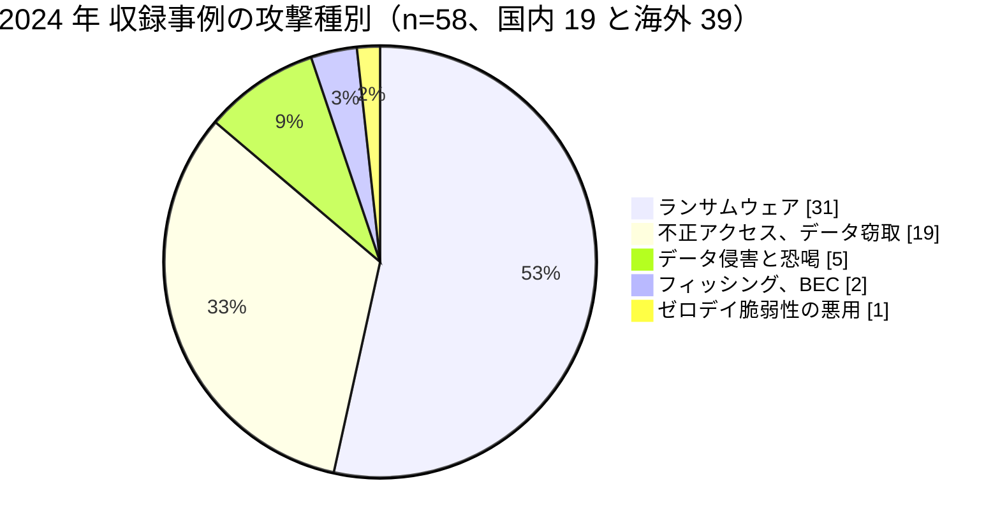
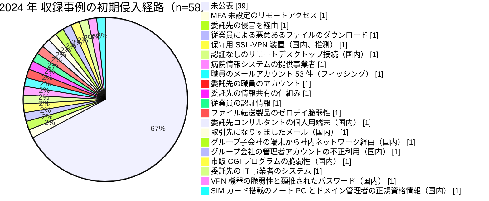

# 📅 2024 年の情勢（国内と海外）

> [!NOTE]
> 本ページの集計は、断りのない限り**本リポジトリに収録した事例**を母集団とする。
> 国内および世界で発生した被害の全数ではない。収録が 0 件であることは、被害がなかったことを意味しない。
> 個別の経緯は [国内の履歴](../japan/2024-timeline.md) と [海外の履歴](../global/2024-timeline.md) を参照してほしい。

## その年の要点

**分析**：医療の中間層が単一障害点であることが示され、国内では被害の評価軸が診療の停止から診療情報の性質へ広がった年である。

[GL-2024-01 Change Healthcare](../global/2024-timeline.md#GL-2024-01) は決済とレセプト処理を止め、医療機関のキャッシュフローを全米規模で悪化させた。
最終的な影響人数は 1 億 9270 万人で、HHS へ届け出られた医療分野の侵害として過去最大である。
起点は、多要素認証が設定されていないリモートアクセスアカウント 1 個であった。

[GL-2024-03 Synnovis](../global/2024-timeline.md#GL-2024-03) は病理検査を止め、輸血と手術を止めた。
翌 2025 年 6 月、検査結果の待ち時間が主要因の一つとなり患者 1 名が死亡したことが公表された。
サイバー攻撃と患者の死亡のあいだの関係を、当事者側の調査として認めた数少ない記録である。

検査と血液に関わる仕組みは、この年に世界で三度止まった。
Synnovis のほか、南アフリカの [GL-2024-32 National Health Laboratory Service](../global/2024-timeline.md#GL-2024-32) は全国 265 の検査所で結果を返せなくなり、米国の [GL-2024-34 OneBlood](../global/2024-timeline.md#GL-2024-34) は 250 超の病院に輸血用血液の不足時の手順を発動させた。

国内の [JP-2024-01 岡山県精神科医療センター](../japan/2024-timeline.md#JP-2024-01) では、精神科という診療科の性質から、流出しうる情報の内容そのものが論点になった。
漏えい規模を人数だけで測ると、この種のリスクは評価に載らない。

国内でも、中間層の停止が同じ年に重なった。
臨床検査の [JP-2024-10 アイル](../japan/2024-timeline.md#JP-2024-10) は検体検査に遅延を生じさせ、健康保険組合の基幹システムの再委託先である [JP-2024-14 ヒロケイ](../japan/2024-timeline.md#JP-2024-14) と、通知の印刷と発送を担う [JP-2024-03 イセトー](../japan/2024-timeline.md#JP-2024-03) は、複数の健康保険組合の加入者情報を巻き込んだ。
どちらも委託の連鎖が 2 段以上あり、加入者から見て自分の情報がそこにあった理由は説明されていない。

製薬の側では、[JP-2024-08 スリー・ディー・マトリックス](../japan/2024-timeline.md#JP-2024-08) が取引先になりすましたメールで 2 回にわたり送金を詐取された。
技術的な侵害ではなく、支払いの承認の手順が突かれている。

## 収録事例の集計

### 区分別の件数

| 区分 | 国内 | 海外 | 内訳 |
|---|---|---|---|
| 病院系 | 7 | 18 | 国内は公立の精神科病院 1、生協の病院 1、研究機関の病院 1、大学病院 1、医療法人の病院 1、県立の療育センター 1、市立の医療センター 1。海外は米 12、英 3、仏 2、ルーマニア 1 |
| 製薬企業系 | 3 | 2 | 国内は医療製品の開発 1、医療用医薬品とワクチン 1、医薬品と化粧品の製造販売 1。海外は医薬品卸 1、血漿の採取 1 |
| 医療関連事業者 | 9 | 19 | 国内は情報処理サービス 1、臨床検査 1、健診の受託 1、健康保険組合の基幹システムの再委託先 1、介護と医療事務の受託 1、医療機器と医療材料 2、医薬品卸 1、学術団体 1。海外は事務と請求の受託 8、検査 3、薬局と薬剤給付 3、電子処方箋 1、救急搬送 1、血液供給 1、医療機器 1、その他 1 |
| その他の事案 | 12 | 2 | 国内はサポート詐欺 2、誤送付と誤公開 4、機器の盗難と廃棄時の消去不徹底 2、内部不正 2、委託先の管理不備 1、システム障害 1。海外は計測タグの設定不備 1、内部不正 1 |

国内でも海外でも、医療関連事業者の収録件数が病院系を上回った。
この傾向は米国の届出制度でも確認でき、事業提携者の影響人数が全体の 75% を占める（[2024 年 米国 HHS OCR 届出の全件集計](../global/2024-us-hhs.md)）。

### 攻撃種別の内訳

**分析**：国内で 19 件を収録し、うち 9 件が医療関連事業者である。
臨床検査（[JP-2024-10 アイル](../japan/2024-timeline.md#JP-2024-10)）、健診の受託（[JP-2024-13 埼玉県健康づくり事業団](../japan/2024-timeline.md#JP-2024-13)）、健康保険組合の基幹システムの再委託先（[JP-2024-14 ヒロケイ](../japan/2024-timeline.md#JP-2024-14)）、通知の印刷と発送（[JP-2024-03 イセトー](../japan/2024-timeline.md#JP-2024-03)）、介護と医療事務の受託（[JP-2024-15 ニチイホールディングス](../japan/2024-timeline.md#JP-2024-15)）が並ぶ。
医療機関の業務のうち外部へ出している部分が、同じ年に続けて狙われた。

### 初期侵入経路の内訳

**分析**：経路が公表された 19 件のうち、9 件が委託先、保守経路、またはグループ会社である。
国内の [JP-2024-01](../japan/2024-timeline.md#JP-2024-01) は保守用 SSL-VPN 装置、[JP-2024-02](../japan/2024-timeline.md#JP-2024-02) は認証なしでリモートデスクトップ接続が可能な保守用の接続点であった。
どちらも診療系の入口ではない。

国内の[JP-2024-01](../japan/2024-timeline.md#JP-2024-01)については、翌 2025 年 2 月に公表された調査報告書が侵入口を保守用 SSL-VPN 装置と特定している。
装置の ID とパスワードが `administrator` / `P@ssw0rd` で院内の全 Windows 端末と共通であったこと、2018 年の設置以降パッチが適用されていなかったこと、接続元 IP アドレスの制限がなかったことが確認された。
ただし Syslog が上書きされており、辞書攻撃、Initial Access Broker からの資格情報の購入、脆弱性の悪用のいずれによるものかは確定していない。

**分析**：経路が公表されるまでに 9 か月を要した。
被害の直後に出るのは事実の告知であり、他の医療機関が自組織の構成と照らし合わせられる情報は、報告書の公表を待つことになる。
海外の [GL-2024-03 Synnovis](../global/2024-timeline.md#GL-2024-03) のように、経路が最後まで公表されない事案では、その材料自体が残らない。

### 止まった機能と診療への波及

| ID | 地域 | 区分 | 止まった機能 | 診療への波及 | 停止期間 |
|---|---|---|---|---|---|
| [JP-2024-01](../japan/2024-timeline.md#JP-2024-01) | 国内 | 病院系 | 電子カルテを含むシステム | 紙カルテ運用。最大 4 万人分の要配慮個人情報が流出 | 紙運用 約 2 週間、完全復旧 90 日 |
| [JP-2024-02](../japan/2024-timeline.md#JP-2024-02) | 国内 | 病院系 | 画像管理サーバ | 救急と一般外来の受入を制限 | 仮復旧まで約 3 週間 |
| [GL-2024-01](../global/2024-timeline.md#GL-2024-01) | 海外 | 医療関連事業者 | 医療決済、レセプト処理 | 保険請求と処方箋の処理が滞り、医療機関の資金繰りが悪化 | 数週間から数か月 |
| [GL-2024-02](../global/2024-timeline.md#GL-2024-02) | 海外 | 病院系 | 電子カルテ（Epic） | 数週間の紙運用、救急搬送の転送 | 約 5 週間 |
| [GL-2024-03](../global/2024-timeline.md#GL-2024-03) | 海外 | 医療関連事業者 | 病理検査、輸血用血液の照合 | 手術の延期、外来のキャンセル。**患者 1 名の死亡に関与** | GP 向け検査の復旧まで 3 か月、完全復旧は晩秋 |
| [GL-2024-04](../global/2024-timeline.md#GL-2024-04) | 海外 | 病院系 | 電子カルテと患者ポータル | 処方と検査の依頼を手作業へ | 電子カルテ 約 1 か月、完全復旧 5 月 20 日 |
| [GL-2024-06](../global/2024-timeline.md#GL-2024-06) | 海外 | 病院系 | 100 超の医療機関の病院情報システム | 全国の病院が紙運用へ | 26 施設が暗号化、79 施設が予防的に停止 |
| [GL-2024-32](../global/2024-timeline.md#GL-2024-32) | 海外 | 医療関連事業者 | 検査情報システム | 検査は実施できたが結果を返せず。結核、HIV、がんの診断が遅れた | 約 3 週間 |
| [GL-2024-34](../global/2024-timeline.md#GL-2024-34) | 海外 | 医療関連事業者 | 血液のラベル付けと追跡 | 250 超の病院が輸血用血液の不足時の手順を発動 | 約 10 日 |

**分析**：[Lurie Children's Hospital](../global/2024-timeline.md#GL-2024-04) では、電子カルテの復旧（3 月 4 日）と完全復旧（5 月 20 日）のあいだに 2 か月半の開きがある。
この期間は、紙で記録した診療内容を電子カルテへ戻す作業に費やされた。
停止期間を「システムが戻るまで」で数えると、この作業が見えない。

南アフリカの [NHLS](../global/2024-timeline.md#GL-2024-32) は、検査そのものは実施できたが結果を返せなかった。
検査の受託件数では被害が見えない形の停止である。
被害の指標を、機能の停止ではなく、臨床の判断に必要な情報が届いたかどうかで測る必要がある。

## この年を象徴する事例

- [JP-2024-01 岡山県精神科医療センター](../japan/2024-timeline.md#JP-2024-01)：流出しうる診療情報の性質が、被害評価の中心になった事例
- [GL-2024-01 Change Healthcare](../global/2024-timeline.md#GL-2024-01)：MFA の欠落という基本の不備が、国家規模の被害を生んだ事例
- [GL-2024-03 Synnovis](../global/2024-timeline.md#GL-2024-03)：臨床サービスの委託先が止まると、病院が健全でも診療が回らないことを示し、患者の死亡との関係が当事者側の調査で認められた事例
- [GL-2024-06 ルーマニアの 100 超の医療機関](../global/2024-timeline.md#GL-2024-06)：病院情報システムの提供事業者 1 社の侵害が、国内の医療機関の大半へ届いた事例
- [GL-2024-S01 Kaiser Foundation Health Plan](../global/2024-timeline.md#GL-2024-S01)：攻撃者が関与しない計測タグの設定が、1340 万人に及んだ事例

## 外部統計

| 統計 | 地域 | 参照先 | 本リポジトリでの集計状況 |
|---|---|---|---|
| ランサムウェア被害の報告件数 | 国内 | [警察庁](https://www.npa.go.jp/publications/statistics/cybersecurity/index.html) | **222 件**（うち医療、福祉 10 件、7 位、4.5%）。ノーウェアランサム 22 件（[日本の統計](../../statistics/japan.md#業種別内訳における医療福祉)） |
| ランサムウェアの侵入経路 | 国内 | 同上 | VPN 機器 55 件（55%）、リモートデスクトップ 31 件（31%）。有効回答 100 件 |
| 個人情報の漏えい等報告 | 国内 | [個人情報保護委員会](https://www.ppc.go.jp/) | 未集計 |
| 米国の医療情報侵害の届出（500 人以上） | 海外 | [HHS OCR Breach Portal](https://ocrportal.hhs.gov/ocr/breach/breach_report.jsf) | **集計済み**：[2024 年 米国 HHS OCR 届出の全件集計](../global/2024-us-hhs.md) |
| 英国の医療サービスへの影響 | 海外 | [NHS England](https://www.england.nhs.uk/) | 未集計 |

### HHS OCR の届出（米国）

| 項目 | 値 |
|---|---|
| 届出件数 | 741 件 |
| 影響人数の合計 | **2 億 9005 万 4222 人** |
| うち Change Healthcare 1 件 | 1 億 9270 万人（全体の 66%） |
| 1 件あたりの中央値 | 7170 人 |
| 事業提携者の影響人数 | 2 億 1754 万 0990 人（全体の 75%） |

**分析**：影響人数の合計は 2 億 9005 万人に達したが、その 66% が 1 件である。
中央値は 7170 人で前年とほぼ変わらない。
年ごとの推移を平均や合計で語ると、この年の実態を見誤る。
詳細は[2024 年 米国 HHS OCR 届出の全件集計](../global/2024-us-hhs.md)にまとめた。

## 身代金と支払いの判断

| 事例 | 支払い | 結果 |
|---|---|---|
| [GL-2024-01 Change Healthcare](../global/2024-timeline.md#GL-2024-01) | 支払い（議会証言で言及） | 決済基盤の復旧に数週間から数か月。人数は 1 億 9270 万人へ確定 |
| [GL-2024-09 NHS Dumfries and Galloway](../global/2024-timeline.md#GL-2024-09) | 不払い | 患者と医師の書簡を含む大量のデータが公開された |
| [GL-2024-11 Centre Hospitalier de Cannes](../global/2024-timeline.md#GL-2024-11) | 不払い（方針を事前に公表） | データが公開された。復旧の進捗を継続的に公表 |
| [GL-2024-32 NHLS（南アフリカ）](../global/2024-timeline.md#GL-2024-32) | 不払い（方針を明示） | 約 3 週間で機能を回復 |
| [JP-2024-01 岡山県精神科医療センター](../japan/2024-timeline.md#JP-2024-01) | 不払い（交渉も行わず） | 90 日で完全復旧。復旧工数は約 65 人月 |

**分析**：Centre Hospitalier de Cannes は、攻撃の直後に交渉を行わない方針を対外的に明示した。
方針を先に公表すると攻撃者との交渉の余地はなくなるが、組織の内部で判断を巡る混乱が起きない。
公的な医療機関では、支払いの可否を平時に決めておく形が定着しつつある。

## 規制と制度の動き

### 国内

2024 年 5 月 17 日に、経済安全保障推進法にもとづく基幹インフラ制度の運用が始まった（この時点で医療分野は対象外。2026 年の改正で追加される）。
2024 年 4 月には、医療 DX 推進の一環として電子処方箋の導入が進んだ。
2023 年 4 月に施行された医療法施行規則の改正により、医療情報システムの安全管理措置は医療機関の管理者の義務であり続けている。
詳細は [国内のガイドラインと法規制](../../../guidelines/japan.md) を参照してほしい。

### 海外

米国では、[Change Healthcare](../global/2024-timeline.md#GL-2024-01) の影響を受けて、HHS が医療分野のサイバーセキュリティ要件の強化を検討し、UnitedHealth Group の CEO が議会で証言した。
欧州連合では NIS2 指令の適用が 2024 年 10 月に始まり、医療機関がその対象に含まれた。
英国では、[Synnovis](../global/2024-timeline.md#GL-2024-03) の被害を受けて NHS England が委託先の管理に関する対応を進めた。
詳細は [海外のガイドラインと法規制](../../../guidelines/global.md) を参照してほしい。

## 前年との差分

**分析**：2023 年に「事業提携者の影響人数が医療提供者を上回る」という形で現れた構造が、2024 年には 1 件の事案に極端に集約された。
[Change Healthcare](../global/2024-timeline.md#GL-2024-01) の 1 億 9270 万人は、その年の届出全体の 66% にあたる。
米国の医療決済がこの 1 社に集中していたことが、そのまま数字に出た。

新しく現れたのは、**臨床の転帰との関係**である。
[Synnovis](../global/2024-timeline.md#GL-2024-03) の続報で、検査結果の遅れが臨床判断の遅れを生み、それが患者の死亡に影響したという因果の筋道が示された。
2020 年の[デュッセルドルフ大学病院](../global/2020-timeline.md#GL-2020-02)では、当局の検証で因果関係は立証されなかった。
4 年を経て、因果を検証する枠組みが医療の側に用意された。

国内では、[2021 年](2021-summary.md)の半田病院、[2022 年](2022-summary.md)の大阪急性期・総合医療センターに続いて、外部の調査委員会による報告書が公表された。
一方で、報告書が出たのは発生の 9 か月後にあたる 2025 年 2 月であり、被害の年のうちに経路が分かる状態にはならなかった。
報告書自身が、原因は先行する 2 件と「まったく同じ」であると記している。
公表の慣行は根づきつつあるが、公表された内容が次の被害の防止に結び付いてはいない。

---

[← 2023 年](2023-summary.md) | [国内の履歴](../japan/2024-timeline.md) | [海外の履歴](../global/2024-timeline.md) | [米国 HHS OCR 届出の全件集計](../global/2024-us-hhs.md) | [インシデント事例集](../README.md) | [2025 年 →](2025-summary.md) | [トップへ](../../../../README.md)
