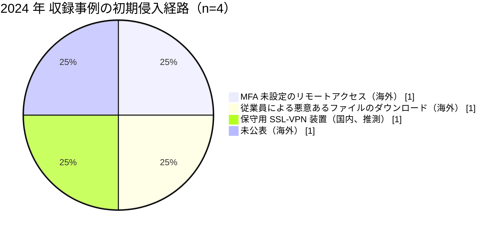

# 📅 2024 年の情勢（国内と海外）

> [!NOTE]
> 本ページの集計は、断りのない限り**本リポジトリに収録した事例**を母集団とする。
> 国内および世界で発生した被害の全数ではない。収録が 0 件であることは、被害がなかったことを意味しない。
> 個別の経緯は [国内の履歴](../japan/2024-timeline.md) と [海外の履歴](../global/2024-timeline.md) を参照してほしい。

## その年の要点

**分析**：海外では医療の中間層が単一障害点であることが示され、国内では被害の評価軸が診療の停止から診療情報の性質へ広がった年である。

[GL-2024-01 Change Healthcare](../global/2024-timeline.md#GL-2024-01)は決済とレセプト処理を止め、医療機関のキャッシュフローを全米規模で悪化させた。
[GL-2024-03 Synnovis](../global/2024-timeline.md#GL-2024-03)は病理検査を止め、輸血と手術を止めた。
どちらも病院そのものは侵害されていないが、診療は回らなくなった。

国内の[JP-2024-01 岡山県精神科医療センター](../japan/2024-timeline.md#JP-2024-01)では、精神科という診療科の性質から、流出しうる情報の内容そのものが論点になった。
漏えい規模を人数だけで測ると、この種のリスクは評価に載らない。

## 収録事例の集計

### 区分別の件数

| 区分 | 国内 | 海外 | 内訳 |
|---|---|---|---|
| 病院系 | 1 | 1 | 国内は公立の精神科病院 1、海外は米の大規模医療グループ 1 |
| 製薬企業系 | 0 | 0 | 収録なし |
| 医療関連事業者 | 0 | 2 | 海外は医療決済 1（米）、病理検査 1（英） |

海外では、医療関連事業者の収録件数が病院系を上回った最初の年である。

### 初期侵入経路の内訳

国内の[JP-2024-01](../japan/2024-timeline.md#JP-2024-01)については、翌 2025 年 2 月に公表された調査報告書が侵入口を保守用 SSL-VPN 装置と特定している。
装置の ID とパスワードが `administrator` / `P@ssw0rd` で院内の全 Windows 端末と共通であったこと、2018 年の設置以降パッチが適用されていなかったこと、接続元 IP アドレスの制限がなかったことが確認された。
ただし Syslog が上書きされており、辞書攻撃、Initial Access Broker からの資格情報の購入、脆弱性の悪用のいずれによるものかは確定していない。

**分析**：経路が公表されるまでに 9 か月を要した。
被害の直後に出るのは事実の告知であり、他の医療機関が自組織の構成と照らし合わせられる情報は、報告書の公表を待つことになる。
海外の [GL-2024-03 Synnovis](../global/2024-timeline.md#GL-2024-03) のように、経路が最後まで公表されない事案では、その材料自体が残らない。

### 止まった機能と診療への波及

| ID | 地域 | 区分 | 止まった機能 | 診療への波及 |
|---|---|---|---|---|
| [JP-2024-01](../japan/2024-timeline.md#JP-2024-01) | 国内 | 病院系 | 電子カルテを含むシステム | 紙カルテ運用が約 2 週間、完全復旧まで 90 日。最大 4 万人分の要配慮個人情報が流出 |
| [GL-2024-01](../global/2024-timeline.md#GL-2024-01) | 海外 | 医療関連事業者 | 医療決済、レセプト処理 | 保険請求と処方箋の処理が滞り、医療機関の資金繰りが悪化 |
| [GL-2024-02](../global/2024-timeline.md#GL-2024-02) | 海外 | 病院系 | 電子カルテ（Epic） | 数週間の紙運用、救急搬送の転送 |
| [GL-2024-03](../global/2024-timeline.md#GL-2024-03) | 海外 | 医療関連事業者 | 病理検査、輸血用血液の照合 | 手術の延期、外来のキャンセル |

## この年を象徴する事例

- [JP-2024-01 岡山県精神科医療センター](../japan/2024-timeline.md#JP-2024-01)：流出しうる診療情報の性質が、被害評価の中心になった事例
- [GL-2024-01 Change Healthcare](../global/2024-timeline.md#GL-2024-01)：MFA の欠落という基本の不備が、国家規模の被害を生んだ事例
- [GL-2024-03 Synnovis](../global/2024-timeline.md#GL-2024-03)：臨床サービスの委託先が止まると、病院が健全でも診療が回らないことを示した事例

## 外部統計

| 統計 | 地域 | 参照先 | 本リポジトリでの集計状況 |
|---|---|---|---|
| ランサムウェア被害の報告件数（業種別、半期ごと） | 国内 | [警察庁 サイバー空間をめぐる脅威の情勢等](https://www.npa.go.jp/publications/statistics/cybersecurity/index.html) | 未集計 |
| 個人情報の漏えい等報告 | 国内 | [個人情報保護委員会](https://www.ppc.go.jp/) | 未集計 |
| 米国の医療情報侵害の届出（500 人以上） | 海外 | [HHS OCR Breach Portal](https://ocrportal.hhs.gov/ocr/breach/breach_report.jsf) | 未集計 |
| 医療分野の脅威情報 | 海外 | [HHS HC3](https://www.hhs.gov/about/agencies/asa/ocio/hc3/index.html) | 未集計 |
| 英国の医療サービスへの影響 | 海外 | [NHS England](https://www.england.nhs.uk/) | 未集計 |

数値は原典を確認したうえで追記する。

## 規制と制度の動き

### 国内

前年の 2023 年 4 月に医療法施行規則の改正が施行され、医療情報システムの安全管理措置が医療機関の管理者の義務になっている。
2024 年 5 月 17 日には、経済安全保障推進法にもとづく基幹インフラ制度の運用が始まった（この時点で医療分野は対象外。2026 年の改正で追加される）。
詳細は [国内のガイドラインと法規制](../../../guidelines/japan.md) を参照してほしい。

### 海外

本リポジトリで整理した動きはない。

## 前年との差分

**分析**：海外では、2023 年までは病院系の被害が中心だったが、2024 年は医療関連事業者が 2 件を占めた。
ベンダリスク管理の対象を、IT ベンダから臨床サービスと決済の委託先まで広げる必要がある。

国内では、2023 年に収録した事例がない。
2024 年の 1 件は、[2021 年](2021-summary.md)の半田病院、[2022 年](2022-summary.md)の大阪急性期・総合医療センターに続いて、外部の調査委員会による報告書が公表された事案である。
一方で、報告書が出たのは発生の 9 か月後にあたる 2025 年 2 月であり、被害の年のうちに経路が分かる状態にはならなかった。
報告書自身が、原因は先行する 2 件と「まったく同じ」であると記している。
公表の慣行は根づきつつあるが、公表された内容が次の被害の防止に結び付いてはいない。

---

[← 2023 年](2023-summary.md) | [国内の履歴](../japan/2024-timeline.md) | [海外の履歴](../global/2024-timeline.md) | [インシデント事例集](../README.md) | [2025 年 →](2025-summary.md) | [トップへ](../../../../README.md)
