# 📅 2025 年の情勢（国内と海外）

> [!NOTE]
> 本ページの集計は、断りのない限り**本リポジトリに収録した事例**を母集団とする。
> 国内および世界で発生した被害の全数ではない。
> 個別の経緯は [国内の履歴](../japan/2025-timeline.md) と [海外の履歴](../global/2025-timeline.md) を参照してほしい。

> [!IMPORTANT]
> **前年までとの件数の比較には注意が必要である。**
> 2025 年の収録件数（国内 54 件、海外 94 件）が前年（国内 1 件、海外 3 件）より大きいのは、本リポジトリが 2025 年からこの年を対象に本格的な収集を行ったためである。
> 被害件数がその倍率で増えたことを示すものではない。
> 年をまたぐ推移は、収録件数ではなく[外部統計](#外部統計)を根拠にしてほしい。

## その年の要点

**分析**：診療を止める攻撃と、診療を止めない大量流出が、別々の被害として並んだ年である。

診療を止めた側では、[GL-2025-14 Centre Hospitalier Intercommunal de Haute-Comté](../global/2025-timeline.md#GL-2025-14)が情報システムを全停止し、完全な正常化を 2027 年初頭以降と見込むに至った。
[GL-2025-08 Kettering Health](../global/2025-timeline.md#GL-2025-08)は待機手術を中止し、救急搬送を転送した。
[GL-2025-12 AMEOS Gruppe](../global/2025-timeline.md#GL-2025-12)は 100 を超える施設のネットワークを一括で切断した。

止めなかった側では、[GL-2025-06 Yale New Haven Health](../global/2025-timeline.md#GL-2025-06)が診療を継続したまま 555 万人分を流出させた。
[GL-2025-03 Episource](../global/2025-timeline.md#GL-2025-03)と[GL-2025-07 DaVita](../global/2025-timeline.md#GL-2025-07)も、医療そのものは回りながら数百万人規模の流出に至っている。
停止時間を指標に置いた備えでは、この型の被害を測れない。

攻撃を伴わない流出も同じ規模で起きた。
[GL-2025-S01 Blue Shield of California](../global/2025-timeline.md#GL-2025-S01)では、ウェブサイトに置いた計測タグが会員データを広告事業へ送り続け、470 万人が対象になった。
侵入の検知をいくら強めても、この経路は見つからない。

国内では、被害が病院よりも医療を支える事業者の側に集まった。
収録した国内のサイバー攻撃 17 件のうち 12 件が医療関連事業者である。
海外で 2024 年に現れた「医療の中間層が単一障害点になる」構図が、国内の収録事例にも現れた。
[JP-2025-14 アスクル](../japan/2025-timeline.md#JP-2025-14)では、事業所向けの物流が止まった結果、医療機関と介護施設への消耗品の供給が 10 日間途絶えた。
同年の [JP-2025-11 ホスピタルサービス](../japan/2025-timeline.md#JP-2025-11)、[JP-2025-10 コア・エス](../japan/2025-timeline.md#JP-2025-10)、[JP-2025-06 オオサキメディカル](../japan/2025-timeline.md#JP-2025-06) も、いずれも受発注と出荷を止めている。
止まったのは情報ではなく物である。

このうち三笑堂、ホスピタルサービス、コア・エスの 3 社は同じグループに属し、いずれも 2025 年 5 月 15 日の未明に侵入を認識している。
医療機器、透析関連用品、福祉用具の三つの商流が同じ日に途絶えた。
調達先を複数持っていても、それらが同じグループに属していれば供給の冗長性は成立しない。

一つの攻撃グループが、一国の医療機関を続けて狙う形も現れた。
台湾では、CrazyHunter が [GL-2025-17 馬偕紀念醫院](../global/2025-timeline.md#GL-2025-17)と[GL-2025-20 彰化基督教醫院](../global/2025-timeline.md#GL-2025-20)を 3 週間の間隔で攻撃し、衛生福利部が 2 件目をもって「系統的な攻撃」と定義した。
同部は 2 件目の復旧から 3 日後に、医療機関向けのランサムウェア対応指針を配布している。

収録の対象は 20 を超える国と地域に及んだ。
米国、日本、台湾、韓国のほか、フランス、ドイツ、オーストリア、スイス、イタリア、チェコ、スロバキア、ポーランド、マルタ、英国、オランダ、カナダ、ブラジル、チリ、パラグアイ、インド、香港、オーストラリア、ニュージーランド、トンガ、ミクロネシア連邦、ケイマン諸島、米領ヴァージン諸島、フランス領ポリネシア、ロシアの事例を収めている。
[GL-2025-49 トンガ王国保健省](../global/2025-timeline.md#GL-2025-49)では国民保健情報システムが停止して全国の病院が紙運用に戻り、[GL-2025-42 Gov. Juan F. Luis Hospital](../global/2025-timeline.md#GL-2025-42)では島内で唯一の総合病院が約 5 か月にわたり手作業で運営された。
代替施設と外部の支援人材が近くにない地域では、復旧の速度が技術ではなく到着までの時間で決まる。

医療機関でも事業者でもない組織が狙われた例も並んだ。
[GL-2025-91 Hessischer Apothekerverband](../global/2025-timeline.md#GL-2025-91)、[GL-2025-92 Sächsische Landesärztekammer](../global/2025-timeline.md#GL-2025-92)、[GL-2025-93 Verband medizinischer Fachberufe](../global/2025-timeline.md#GL-2025-93)は、いずれもドイツの職能団体である。
患者の診療情報は持たないが、会員である医療従事者の氏名、勤務先、資格情報を保持する。
医療機関から見ると、自組織の外で職員の情報が失われる経路にあたる。

医療の外側にある供給元が止まる型も現れた。
[GL-2025-57 Instituto de Pesquisas Energéticas e Nucleares](../global/2025-timeline.md#GL-2025-57)では放射性医薬品の製造が停止し、半減期の短さゆえに備蓄で埋められないまま、ブラジル全国の核医学検査と治療に影響した。

電子カルテのベンダ自身が侵害された事例も出た。
[GL-2025-15 Oracle Health](../global/2025-timeline.md#GL-2025-15)では、移行途中の旧 Cerner のサーバが窃取された認証情報で侵害され、最大 80 病院が対象になりうるとされた。
Oracle Health は患者への通知を行わず、届出の要否の判断と通知は医療機関の側に残った。

## 収録事例の集計

### 区分別の件数

| 区分 | 国内（攻撃） | 国内（その他） | 海外（攻撃） | 海外（その他） |
|---|---|---|---|---|
| 病院系 | 5 | 34 | 56 | 0 |
| 製薬企業系 | 0 | 0 | 6 | 0 |
| 医療関連事業者 | 12 | 3 | 31 | 1 |
| 合計 | 17 | 37 | 93 | 1 |

国内の製薬企業系は、2025 年も収録が 0 件である。
一次情報を確認できた事案が見つからなかっただけで、被害がなかったことを示すものではない。

件数は本リポジトリが一次情報または当事者公表の報道に到達できた事案の数であり、その年に起きた被害の総数ではない。
2026 年の追加調査で海外のサイバー攻撃の収録が 28 件から 93 件へ増えたのは、収集の範囲を欧州、中南米、大洋州、カリブ海地域へ広げた結果である。
年ごとの件数を並べて増減を論じることはできない。
推移を読むときは[外部統計](#外部統計)を根拠にしてほしい。

### 攻撃種別の内訳

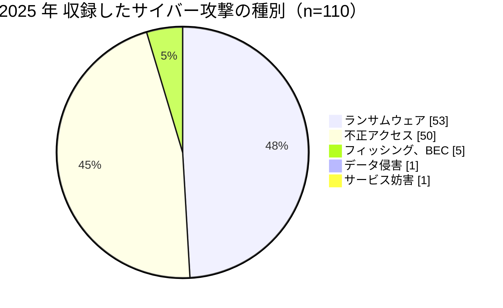
```mermaid
pie showData
    title 2025 年 収録したサイバー攻撃の種別（n=110）
    "ランサムウェア" : 53
    "不正アクセス" : 50
    "フィッシング、BEC" : 5
    "データ侵害" : 1
    "サービス妨害" : 1
```

**分析**：ランサムウェアと不正アクセスがほぼ同数で並んだ。
この比率は収録の範囲を反映したものであり、発生の傾向を示すものではない。
2026 年の追加調査で加えた事案には、暗号化を伴わない窃取型とメールアカウントの侵害が多く含まれる。
これらは当事者が届出を通じて公表するため一次情報に到達しやすく、逆に診療を止めた事案ほど公表が遅れる。
収録の件数に、公表のされやすさの差がそのまま乗っている。

### 初期侵入経路の内訳

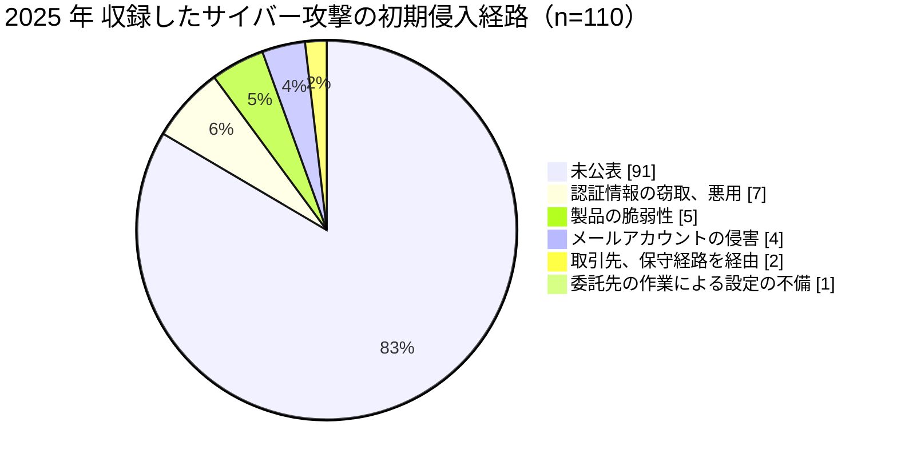
```mermaid
pie showData
    title 2025 年 収録したサイバー攻撃の初期侵入経路（n=110）
    "未公表" : 91
    "認証情報の窃取、悪用" : 7
    "製品の脆弱性" : 5
    "メールアカウントの侵害" : 4
    "取引先、保守経路を経由" : 2
    "委託先の作業による設定の不備" : 1
```

経路が公表された 19 件の内訳は次のとおりである。

| 経路 | 事例 |
|---|---|
| 認証情報の窃取、悪用 | [GL-2025-15 Oracle Health](../global/2025-timeline.md#GL-2025-15)（窃取された認証情報）、[GL-2025-25 Aflac](../global/2025-timeline.md#GL-2025-25)（ソーシャルエンジニアリング）、[GL-2025-36 Centre Hospitalier Stell](../global/2025-timeline.md#GL-2025-36)（監査のために再有効化された、ドメイン管理者権限と VPN 接続を持つテスト用アカウント）、[JP-2025-02 三笑堂](../japan/2025-timeline.md#JP-2025-02)（一部アカウントの侵害）、[JP-2025-04 富士フイルムメディカル](../japan/2025-timeline.md#JP-2025-04)（営業管理システムの ID とパスワード）、[JP-2025-08 東京都保健医療情報センター](../japan/2025-timeline.md#JP-2025-08)（テスト用アカウントの弱いパスワード）、[JP-2025-14 アスクル](../japan/2025-timeline.md#JP-2025-14)（多要素認証の例外だった委託先の管理者アカウント） |
| 製品の脆弱性 | [GL-2025-04 Genea](../global/2025-timeline.md#GL-2025-04)（Citrix サーバ）、[GL-2025-24 UCLH、University Hospital Southampton](../global/2025-timeline.md#GL-2025-24)（Ivanti EPMM の CVE-2025-4427、CVE-2025-4428）、[GL-2025-26 Barts Health NHS Trust](../global/2025-timeline.md#GL-2025-26)（Oracle E-Business Suite の CVE-2025-61882）、[GL-2025-61 Cistec](../global/2025-timeline.md#GL-2025-61)（ネットワーク機器の脆弱性）、[GL-2025-92 Sächsische Landesärztekammer](../global/2025-timeline.md#GL-2025-92)（外部事業者がホストするウェブサーバの脆弱性） |
| 取引先、保守経路を経由 | [GL-2025-01 SimonMed Imaging](../global/2025-timeline.md#GL-2025-01)（取引先の侵害を起点に自社ネットワークへ）、[GL-2025-44 Humanomed](../global/2025-timeline.md#GL-2025-44)（放射線部門の遠隔保守用ソフトウェア） |
| メールアカウントの侵害（フィッシングを起点とする） | [GL-2025-70 Saint Anthony Hospital](../global/2025-timeline.md#GL-2025-70)（職員のアカウント 2 件）、[GL-2025-73 Community Health Network](../global/2025-timeline.md#GL-2025-73)、[GL-2025-85 Outcomes One](../global/2025-timeline.md#GL-2025-85)（職員のアカウント 1 件から 25 万 7481 人）、[GL-2025-93 Verband medizinischer Fachberufe](../global/2025-timeline.md#GL-2025-93)（3 件以上のアカウント） |
| 委託先の作業による設定の不備 | [JP-2025-15 アクリーティブ](../japan/2025-timeline.md#JP-2025-15)（ファイアウォールの入替時にベンダの設定ミスで機能の一部が停止していた） |

**分析**：110 件のうち 91 件で初期侵入経路が公表されていない。
経路が出ない事案は、他の医療機関が自組織の構成と照らし合わせる材料を残さない。
[2021 年](2021-summary.md)の半田病院、[2022 年](2022-summary.md)の大阪急性期・総合医療センター、および 2025 年 2 月に報告書が出た[JP-2024-01 岡山県精神科医療センター](../japan/2024-timeline.md#JP-2024-01)で実現した公表の水準は、その後の標準にはなっていない。

公表された 19 件のうち 7 件が認証情報の窃取または悪用であり、さらに 4 件がフィッシングを起点とするメールアカウントの侵害である。
このうち 3 件（アスクル、東京都保健医療情報センター、Centre Hospitalier Stell）は、多要素認証の例外またはテスト用のアカウントという、通常の運用基準から外された 1 件が入口になっている。
Centre Hospitalier Stell では、無線 LAN の監査のために再有効化した古いアカウントが、弱いパスワードのままドメイン管理者権限と VPN 接続の権限を持っていた。
作業のために一時的に作った状態を片づけ忘れる型は、恒久的な設定の不備よりも見つけにくい。
フランスの CERT Santé も 2025 年の報告で、データ流出の大半が医療従事者または委託先のアカウントの侵害に起因すると述べている。

### 攻撃グループ

当事者または公的機関が確認したもの、および攻撃グループ側が主張したものを分けて示す。

| グループ | 当事者または公的機関が確認 | 攻撃グループ側の主張、または報道のみ |
|---|---|---|
| Qilin | [GL-2025-09 Covenant Health](../global/2025-timeline.md#GL-2025-09)、[GL-2025-13 Inotiv](../global/2025-timeline.md#GL-2025-13) | [JP-2025-01 宇都宮セントラルクリニック](../japan/2025-timeline.md#JP-2025-01)、[JP-2025-06 オオサキメディカル](../japan/2025-timeline.md#JP-2025-06)、[GL-2025-72 Rockhill Women's Care](../global/2025-timeline.md#GL-2025-72)、[GL-2025-81 CMIC CMO USA](../global/2025-timeline.md#GL-2025-81)、[GL-2025-84 Nipro Medical Corporation](../global/2025-timeline.md#GL-2025-84) |
| Interlock | [GL-2025-08 Kettering Health](../global/2025-timeline.md#GL-2025-08) | [GL-2025-07 DaVita](../global/2025-timeline.md#GL-2025-07) |
| Medusa | | [GL-2025-01 SimonMed Imaging](../global/2025-timeline.md#GL-2025-01)、[GL-2025-18 HCRG Care Group](../global/2025-timeline.md#GL-2025-18) |
| Termite | [GL-2025-04 Genea](../global/2025-timeline.md#GL-2025-04) | |
| Van Helsing | | [GL-2025-05 Compumedics](../global/2025-timeline.md#GL-2025-05) |
| Nova | [GL-2025-11 Eurofins Clinical Diagnostics NMDL](../global/2025-timeline.md#GL-2025-11) | |
| Sarcoma | [GL-2025-10 Radix](../global/2025-timeline.md#GL-2025-10) | |
| CrazyHunter | [GL-2025-17 馬偕紀念醫院](../global/2025-timeline.md#GL-2025-17)、[GL-2025-20 彰化基督教醫院](../global/2025-timeline.md#GL-2025-20)（いずれも台湾衛生福利部が公表） | [GL-2025-74 亞洲大學附屬醫院](../global/2025-timeline.md#GL-2025-74)（台湾の資安専門媒体の報道） |
| Cl0p | [GL-2025-26 Barts Health NHS Trust](../global/2025-timeline.md#GL-2025-26) | |
| Sinobi | | [GL-2025-27 Heywood Healthcare](../global/2025-timeline.md#GL-2025-27) |
| NightSpire | [GL-2025-38 長慎醫院](../global/2025-timeline.md#GL-2025-38)（台湾の警察と衛生当局が公表） | |
| INC Ransom | [GL-2025-49 トンガ王国保健省](../global/2025-timeline.md#GL-2025-49) | [GL-2025-60 Spectrum Medical Imaging](../global/2025-timeline.md#GL-2025-60) |
| RansomHub | | [GL-2025-31 Whitman Hospital & Medical Clinics](../global/2025-timeline.md#GL-2025-31) |
| Kawa4096 | | [GL-2025-53 Susan B. Allen Memorial Hospital](../global/2025-timeline.md#GL-2025-53) |
| LockBit5、Termite | | [GL-2025-55 Insight Hospital and Medical Center](../global/2025-timeline.md#GL-2025-55) |
| KillSec | | [GL-2025-67 MedicSolution](../global/2025-timeline.md#GL-2025-67) |
| CyberTeam | | [GL-2025-50 パラグアイ保健社会福祉省](../global/2025-timeline.md#GL-2025-50)（2025 年 6 月の後続の攻撃についての主張。同年 5 月の事案との関係は未確認） |
| Rhysida | | [GL-2025-79 MedStar Health](../global/2025-timeline.md#GL-2025-79)、[GL-2025-80 Spindletop Center](../global/2025-timeline.md#GL-2025-80) |
| Kraken | | [GL-2025-71 Klickitat Valley Health](../global/2025-timeline.md#GL-2025-71) |
| Worldleaks | | [GL-2025-76 Myrtue Medical Center](../global/2025-timeline.md#GL-2025-76) |
| Global Group | | [GL-2025-88 メルボルンの循環器専門医の私設クリニック](../global/2025-timeline.md#GL-2025-88) |

**分析**：Qilin と Interlock が、国内と海外の双方の収録事例に現れた。
米国では 2025 年 7 月 22 日に CISA、FBI、HHS、MS-ISAC が Interlock に関する共同勧告（AA25-203A）を出している。
同じグループが複数の医療機関に向かうときは、公的機関の勧告に載る侵害指標（IoC）を自組織のログに当てる作業が、最初に取れる行動になる。

台湾の CrazyHunter は、2025 年 4 月 2 日に捜査当局が攻撃者を特定したと公表した。
ランサムウェアの攻撃が実在の人物へ結び付いた国内初の例とされる。
攻撃グループの帰属は主張と推定に留まることが多く、捜査によって確定した記録は他国の医療機関にとっても参照点になる。

台湾の 2 件は、当事者ではなく所管官庁である衛生福利部が攻撃グループを名指しした。
帰属を当事者に委ねると、2 件目以降の医療機関は「同じ相手かどうか」を判断できない。
官庁が判断の主体になることで、対応指針の配布までが 5 日で進んだ。

Comparitech の集計によれば、2025 年に医療提供者を標的として犯行を主張した件数は Qilin が 66 件で最多であり、INC が 45 件、SafePay が 29 件、Sinobi が 24 件、Medusa が 18 件と続く（**報道ベース**の集計であり、当事者が確認したものに限られない）。

**事実**：FBI IC3 の [2025 年の年次報告（PDF）](https://www.ic3.gov/AnnualReport/Reports/2025_IC3Report.pdf)は、報告の多かったランサムウェア 10 種（Akira、Qilin、INC/Lynx/Sinobi、BianLian、Play、RansomHub、LockBit、DragonForce、SafePay、Medusa）が最も影響を与えた重要インフラ分野として、重要製造業、医療と公衆衛生、政府施設の三つを挙げている。
本ページの表に現れるグループのうち Qilin、Medusa、Sinobi の 3 種がこの 10 種に含まれる。

### 影響人数の大きい事例

| 順 | ID | 組織 | 影響人数 |
|---|---|---|---|
| 1 | [GL-2025-25](../global/2025-timeline.md#GL-2025-25) | Aflac（米、保険） | 1392 万 4906 人（要保護医療情報。全体では 2265 万人） |
| 2 | [GL-2025-03](../global/2025-timeline.md#GL-2025-03) | Episource（米、医療コーディング） | 672 万 5572 人 |
| 3 | [GL-2025-06](../global/2025-timeline.md#GL-2025-06) | Yale New Haven Health（米、病院系） | 555 万 6702 人 |
| 4 | [GL-2025-S01](../global/2025-timeline.md#GL-2025-S01) | Blue Shield of California（米、医療保険） | 470 万人（攻撃を伴わない） |
| 5 | [GL-2025-07](../global/2025-timeline.md#GL-2025-07) | DaVita（米、人工透析） | 268 万 9826 人 |
| 6 | [GL-2025-19](../global/2025-timeline.md#GL-2025-19) | Anne Arundel Dermatology（米、病院系） | 190 万 5000 人 |
| 7 | [GL-2025-08](../global/2025-timeline.md#GL-2025-08) | Kettering Health（米、病院系） | 169 万 5382 人 |
| 8 | [GL-2025-62](../global/2025-timeline.md#GL-2025-62) | DermCare Management（米、皮膚科クリニックの経営支援） | 136 万 1735 人 |
| 9 | [GL-2025-01](../global/2025-timeline.md#GL-2025-01) | SimonMed Imaging（米、画像診断） | 127 万 5669 人 |
| 10 | [GL-2025-63](../global/2025-timeline.md#GL-2025-63) | Absolute Dental Group（米、歯科） | 122 万 3635 人 |
| 11 | [GL-2025-78](../global/2025-timeline.md#GL-2025-78) | University of Hawaiʻi Cancer Center（米、研究） | 最大 115 万人 |
| 12 | [GL-2025-11](../global/2025-timeline.md#GL-2025-11) | Eurofins Clinical Diagnostics NMDL（蘭、検体検査） | 94 万 1000 人 |
| 13 | [GL-2025-02](../global/2025-timeline.md#GL-2025-02) | Frederick Health（米、病院系） | 93 万 4326 人 |

上位 13 件のうち 8 件が医療関連事業者である。
病院系は 5 件にとどまる。
[米国 HHS OCR の全件集計](../global/2025-us-hhs.md#影響人数-10-万人以上の全-96-件)でも、影響人数 100 万人以上の 16 件の届出主体は、医療提供者 8 件に対し、事業提携者（business associate）7 件と医療保険 1 件である。
国内では [JP-2025-14 アスクル](../japan/2025-timeline.md#JP-2025-14)の約 74 万件（大半が事業所向けの顧客情報）、[JP-2025-04 富士フイルムメディカル](../japan/2025-timeline.md#JP-2025-04)の約 59 万人、[JP-2025-01 宇都宮セントラルクリニック](../japan/2025-timeline.md#JP-2025-01)の最大約 30 万人がこれに続く。

[GL-2025-15 Oracle Health](../global/2025-timeline.md#GL-2025-15)はこの表に載せていない。
Oracle Health 自身が対象人数を公表せず、個別の医療機関が順に届け出る形をとったため、2025 年内に総数が確定しなかったためである。
Union Health の 26 万 2831 人、Munson Healthcare の 10 万人超が判明している。
2026 年 8 月時点でも総数は確定していない（詳細は[通知の主体](#oracle-health-で通知の主体が分かれた経路)）。

### 業務停止期間と完全復旧までの時間

事業継続計画で決めるべきは、何日ぶん紙で回せるようにしておくかである。
本年の収録事例のうち、停止期間または復旧の時期が公表されているものを並べる。

| ID | 組織 | 止まった範囲 | 完全復旧まで |
|---|---|---|---|
| [GL-2025-14](../global/2025-timeline.md#GL-2025-14) | Centre Hospitalier Intercommunal de Haute-Comté（仏） | 病院情報システムの全拠点分 | **1 年以上**（2027 年初頭以降の見込み） |
| [JP-2025-01](../japan/2025-timeline.md#JP-2025-01) | 宇都宮セントラルクリニック（日） | 診察と健診の業務 | **約 3 か月**（2025-02-10 から 05-14） |
| [GL-2025-42](../global/2025-timeline.md#GL-2025-42) | Gov. Juan F. Luis Hospital（米領ヴァージン諸島） | 電子システム全般 | **約 5 か月**（2025-04-26 から。情報技術基盤を全面的に作り直した） |
| [GL-2025-36](../global/2025-timeline.md#GL-2025-36) | Centre Hospitalier Stell（仏） | 医療ソフトウェア、電子錠 | 未公表（攻撃から 7 週間の時点でも復旧作業が継続） |
| [GL-2025-37](../global/2025-timeline.md#GL-2025-37) | Esse Health（米） | 電子カルテ、電話、患者ポータル | **約 6 週間**（2025-04-21 から 06-02） |
| [GL-2025-45](../global/2025-timeline.md#GL-2025-45) | Central Maine Healthcare（米） | 情報システムと電話網 | **約 1 か月**（2025-06-01 から 07-01） |
| [GL-2025-09](../global/2025-timeline.md#GL-2025-09) | Covenant Health（米） | 全データシステム | **約 1 か月**（2025-05-26 から 07-01 までに復旧） |
| [GL-2025-02](../global/2025-timeline.md#GL-2025-02) | Frederick Health（米） | IT システム、検査施設 1 か所 | **約 3 週間**（2025-01-27 から 02-18） |
| [GL-2025-08](../global/2025-timeline.md#GL-2025-08) | Kettering Health（米） | 電子カルテを含む系統 | **約 3 週間**（2025-05-20 から 06-10） |
| [GL-2025-12](../global/2025-timeline.md#GL-2025-12) | AMEOS Gruppe（独、墺、瑞） | ドイツ国内の全拠点の IT | 未公表（攻撃から 10 日以上たっても障害が継続） |
| [JP-2025-14](../japan/2025-timeline.md#JP-2025-14) | アスクル（日） | 受注と出荷（医療機関、介護施設を含む） | 出荷の再開まで **10 日**（2025-10-19 から 10-29）。倉庫管理システムの復旧は 12 月時点で未完了 |
| [GL-2025-27](../global/2025-timeline.md#GL-2025-27) | Heywood Healthcare（米） | 救急搬送の受入、電話、放射線、検査 | Code Black が **5 日**（2025-10-12 から 10-17）。解除後も機能の制限が継続 |
| [GL-2025-38](../global/2025-timeline.md#GL-2025-38) | 長慎醫院（台） | 受付と処方の系統 | 情報システムの停止が **数日**（2025-04-16 から） |
| [GL-2025-30](../global/2025-timeline.md#GL-2025-30) | Cayuga Health（米） | 情報システム全般、救急搬送の受入 | **一晩**（救急の転送は約 4 時間） |
| [GL-2025-20](../global/2025-timeline.md#GL-2025-20) | 彰化基督教醫院（台） | 院外向けの受付と会計 | **2 日**（2025-03-01 から 03-03） |
| [GL-2025-22](../global/2025-timeline.md#GL-2025-22) | Masimo（米） | 製造拠点の稼働、受注と出荷 | **約 10 日**（2025-04-27 から 05-06） |
| [GL-2025-23](../global/2025-timeline.md#GL-2025-23) | 光州基督病院（韓） | 院内の主要なファイル | 同日中に復元（当事者の説明） |
| [GL-2025-06](../global/2025-timeline.md#GL-2025-06) | Yale New Haven Health（米） | 停止なし | 診療を止めていない |
| [GL-2025-26](../global/2025-timeline.md#GL-2025-26) | Barts Health NHS Trust（英） | 停止なし（会計系のみ侵害） | 診療を止めていない |

**分析**：紙で回した期間と、通常運用に戻るまでの期間は一致しない。
Kettering Health では、臨床が紙で動いたのは約 1 週間、電子カルテの復旧までが約 2 週間、通常運用への復帰までが約 3 週間だった。
後半の 2 週間は、電子カルテが戻ってから各部門が滞留した業務に追いつく期間である。
紙運用の訓練だけでは、この後半を短くできない。

停止期間の長さを決めるのは、暗号化の範囲だけではない。
宇都宮セントラルクリニックはサーバと端末のクリーン化に加えて新規購入を行っており、機器の調達期間が復旧の所要時間に組み込まれている。
Centre Hospitalier Intercommunal de Haute-Comté では、1000 台を超える端末と約 200 のアプリケーションを作り直す作業量がそのまま期間になった。
バックアップからの復元だけを想定した計画では、いずれの長さも見積もれない（[事業継続](../../../response/bcp-cyber.md)）。

過年度の収録事例でも、[半田病院](../japan/2021-timeline.md#JP-2021-01)が約 2 か月、[大阪急性期・総合医療センター](../japan/2022-timeline.md#JP-2022-01)が約 2 か月半、[HSE](../global/2021-timeline.md#GL-2021-01)が約 4 か月、[Ascension](../global/2024-timeline.md#GL-2024-02)が約 5 週間を要している。
HSE は身代金を支払わずに復号鍵を得たうえで、なお 4 か月かかった。
鍵の入手は復旧の出発点であり、検証と再構築の工程がそのあとに残る。

### その他の事案の類型（国内 37 件、海外 1 件）

| 類型 | 国内 | 海外 |
|---|---|---|
| 機器、記憶媒体の紛失、盗難 | 18 | 0 |
| 誤送付、誤公開、操作ミス | 12 | 1 |
| 内部不正 | 4 | 0 |
| サポート詐欺 | 2 | 0 |
| 委託先の管理不備による漏えい | 1 | 0 |

**分析**：国内の副分類 37 件のうち 18 件が記憶媒体または書類の紛失と盗難で、その大半は USB メモリである。
持ち出しの目的は、学会発表の資料作成、研究のためのデータ抽出、職員の評価表の作成に分かれる。
いずれも電子カルテの画面上で完結しない作業であり、データを外へ出す必要が業務側にある。
禁止だけを掲げても、この必要が消えないかぎり運用は回らない。
厚生労働省が 2025 年 5 月のチェックリストで USB メモリ等の利用への対応を追加したのは、この型の事案が続いていることに対応している。

副分類の 37 件のうち、収録した国内のサイバー攻撃 17 件を上回るのは、公表の頻度の差である。
攻撃を受けた事実は調査の完了まで公表されないことがあるが、紛失と誤送付は判明した時点で公表される。
件数の比をもって、紛失のほうが攻撃より起きやすいとは言えない。

2025 年に新しく現れた形として、SNS への投稿（JP-2025-S25 イムス葛飾ハートセンター、JP-2025-S29 岩見沢市立総合病院、[JP-2025-S20 長野県立こども病院](../japan/2025-timeline.md#JP-2025-S20)）と、学会論文に添付した図表からの流出（[JP-2025-S22 神奈川県立循環器呼吸器病センター](../japan/2025-timeline.md#JP-2025-S22)）がある。
いずれも、電子カルテのアクセス制御を正規に通過したあとの画面とファイルが院外へ出る経路である。
参照そのものは正規の操作として記録されるため、アクセスログを見ても不正として区別がつかない。

## この年を象徴する事例

- [GL-2025-14 Centre Hospitalier Intercommunal de Haute-Comté](../global/2025-timeline.md#GL-2025-14)：復旧の見通しが 1 年以上先になり、資産台帳と構成管理が復旧速度そのものを決めることを示した事例
- [GL-2025-11 Eurofins Clinical Diagnostics NMDL](../global/2025-timeline.md#GL-2025-11)：身代金を支払っても公開が止まらず、支払いの事実が次の要求の根拠にされた事例
- [GL-2025-S01 Blue Shield of California](../global/2025-timeline.md#GL-2025-S01)：攻撃者が関与せず、計測タグの設定だけで 470 万人分が外部へ流れた事例
- [JP-2025-04 富士フイルムメディカル](../japan/2025-timeline.md#JP-2025-04)：患者情報を含まない医療従事者の名簿が、標的型メールに使える形で流出した事例
- [JP-2025-01 宇都宮セントラルクリニック](../japan/2025-timeline.md#JP-2025-01)：健診の委託関係を通じて、通知の対象が健康保険組合の加入者まで広がった事例
- [GL-2025-17 馬偕紀念醫院](../global/2025-timeline.md#GL-2025-17)と[GL-2025-20 彰化基督教醫院](../global/2025-timeline.md#GL-2025-20)：同一の攻撃グループが一国の医療機関を続けて狙い、所管官庁が 2 件目で「系統的な攻撃」と定義して指針を配った事例
- [GL-2025-15 Oracle Health](../global/2025-timeline.md#GL-2025-15)：電子カルテのベンダが侵害されたにもかかわらず、届出と通知の義務が医療機関の側に残った事例
- [JP-2025-14 アスクル](../japan/2025-timeline.md#JP-2025-14)：多要素認証の例外だった委託先の管理者アカウント 1 件を入口に物流が止まり、医療機関と介護施設への供給が 10 日間途絶えた事例
- [GL-2025-26 Barts Health NHS Trust](../global/2025-timeline.md#GL-2025-26)：臨床系ではなく会計系が侵害され、受診と支払いの事実が公開された事例

## 経緯が公表された事例の図解

以下の図は、当事者または公的機関が公表した内容を主に用いる。
攻撃グループ側の主張にとどまる要素と、報道だけを根拠とする要素は、図の中でその旨を示す。

図を置くのは、初期侵入経路、侵入から検知までの期間、被害の連鎖、関係する組織の広がりのうち複数が公表されている事例に限る。
これらが公表されていない事例については、[図にできなかった事例](#図にできなかった事例)に理由とともに挙げる。

### Covenant Health の侵入から診療の制限までの連鎖

[GL-2025-09](../global/2025-timeline.md#GL-2025-09)では、侵入から認識までの 8 日間、遮断の判断、診療の制限が当事者から公表されている。
その 8 日間に内部で何が進んだかは報道ベースであり、図では点線の枠で区別する。

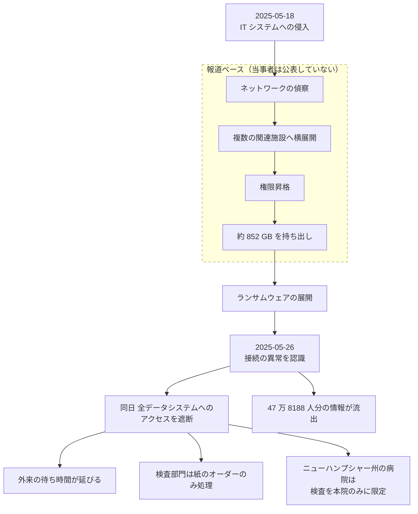
```mermaid
flowchart TD
    A["2025-05-18<br>IT システムへの侵入"] --> B
    subgraph S["報道ベース（当事者は公表していない）"]
        B["ネットワークの偵察"] --> C["複数の関連施設へ横展開"]
        C --> D["権限昇格"]
        D --> E["約 852 GB を持ち出し"]
    end
    E --> F["ランサムウェアの展開"]
    F --> G["2025-05-26<br>接続の異常を認識"]
    G --> H["同日 全データシステムへのアクセスを遮断"]
    H --> I1["外来の待ち時間が延びる"]
    H --> I2["検査部門は紙のオーダーのみ処理"]
    H --> I3["ニューハンプシャー州の病院は<br>検査を本院のみに限定"]
    G --> J["47 万 8188 人分の情報が流出"]
    style S stroke-dasharray: 5 5
```

**分析**：認識から遮断までを同日に行えたのは、検査部門が紙のオーダーで動けたためである。
遮断そのものが診療の制限を生むので、遮断を選べるかどうかは紙の運用にどこまで戻れるかで決まる。

### Kettering Health の滞留期間と公表の順序

[GL-2025-08](../global/2025-timeline.md#GL-2025-08)では、侵入から検知まで約 6 週間の滞留があった。

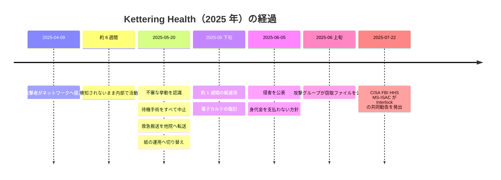
```mermaid
timeline
    title Kettering Health（2025 年）の経過
    2025-04-09 : 攻撃者がネットワークへ侵入
    約 6 週間 : 検知されないまま内部で活動
    2025-05-20 : 不審な挙動を認識 : 待機手術をすべて中止 : 救急搬送を他院へ転送 : 紙の運用へ切り替え
    2025-05 下旬 : 約 1 週間の紙運用 : 電子カルテの復旧
    2025-06-05 : 侵害を公表 : 身代金を支払わない方針
    2025-06 上旬 : 攻撃グループが窃取ファイルを公開
    2025-07-22 : CISA FBI HHS MS-ISAC が Interlock の共同勧告を発出
```

**分析**：診療への影響が出たのは検知した当日で、その手前に 6 週間の空白がある。
入口を塞ぐ対策はこの空白を短くしない。
内部通信の監視と管理者権限の使用記録が、空白を縮める側の手当てになる。

### Genea で攻撃者が到達した範囲

[GL-2025-04](../global/2025-timeline.md#GL-2025-04)は、初期侵入経路と到達先の双方が公表されている。

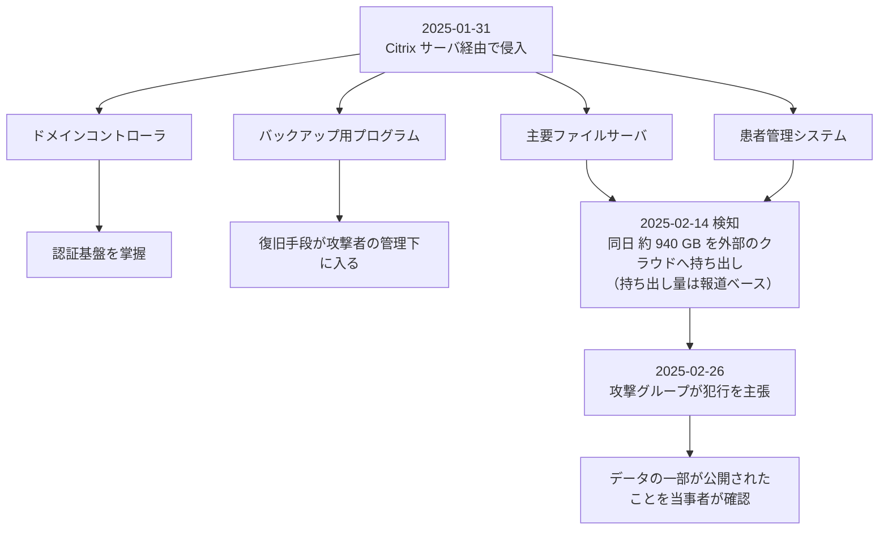
```mermaid
flowchart TD
    A["2025-01-31<br>Citrix サーバ経由で侵入"] --> B1["主要ファイルサーバ"]
    A --> B2["ドメインコントローラ"]
    A --> B3["バックアップ用プログラム"]
    A --> B4["患者管理システム"]
    B2 --> C1["認証基盤を掌握"]
    B3 --> C2["復旧手段が攻撃者の管理下に入る"]
    B1 --> D["2025-02-14 検知<br>同日 約 940 GB を外部のクラウドへ持ち出し<br>（持ち出し量は報道ベース）"]
    B4 --> D
    D --> E["2025-02-26<br>攻撃グループが犯行を主張"]
    E --> F["データの一部が公開されたことを当事者が確認"]
```

**分析**：ドメインコントローラとバックアップ用プログラムの双方に到達されている。
復旧の手段が攻撃者の管理下に入った時点で、暗号化の有無にかかわらず交渉の余地が失われる。
バックアップを本番の認証基盤から切り離しているかが、この段階の分かれ目になる。

### Eurofins Clinical Diagnostics NMDL で身代金を支払ったあとの経過

[GL-2025-11](../global/2025-timeline.md#GL-2025-11)は、支払いが公開を止めなかった経過が時系列で追える。

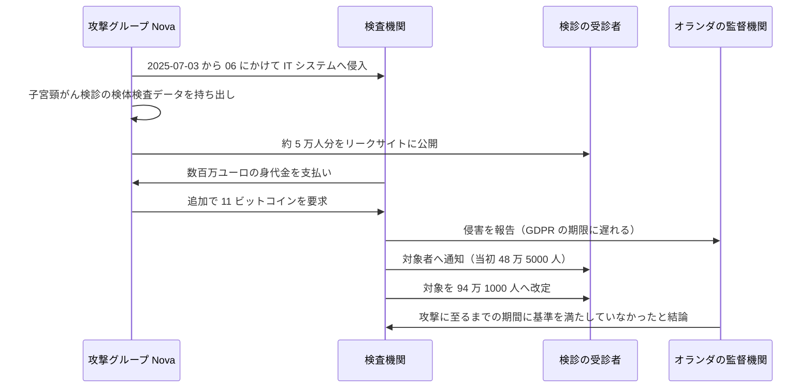
```mermaid
sequenceDiagram
    participant N as 攻撃グループ Nova
    participant L as 検査機関
    participant P as 検診の受診者
    participant R as オランダの監督機関
    N->>L: 2025-07-03 から 06 にかけて IT システムへ侵入
    N->>N: 子宮頸がん検診の検体検査データを持ち出し
    N->>P: 約 5 万人分をリークサイトに公開
    L->>N: 数百万ユーロの身代金を支払い
    N->>L: 追加で 11 ビットコインを要求
    L->>R: 侵害を報告（GDPR の期限に遅れる）
    L->>P: 対象者へ通知（当初 48 万 5000 人）
    L->>P: 対象を 94 万 1000 人へ改定
    R->>L: 攻撃に至るまでの期間に基準を満たしていなかったと結論
```

**分析**：支払いは公開を止めず、支払いの事実が次の要求の根拠になった。
支払うかどうかを検討する組織にとって、この経過は判断材料になる。

### Centre Hospitalier Intercommunal de Haute-Comté の復旧に要した時間

[GL-2025-14](../global/2025-timeline.md#GL-2025-14)は、復旧の見通しが 1 年以上先になった例である。

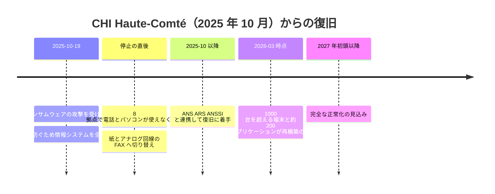
```mermaid
timeline
    title CHI Haute-Comté（2025 年 10 月）からの復旧
    2025-10-19 : ランサムウェアの攻撃を受ける : 拡大を防ぐため情報システムを全面停止
    停止の直後 : 8 拠点で電話とパソコンが使えなくなる : 紙とアナログ回線の FAX へ切り替え
    2025-10 以降 : ANS ARS ANSSI と連携して復旧に着手
    2026-03 時点 : 1000 台を超える端末と約 200 のアプリケーションが再構築の途上
    2027 年初頭以降 : 完全な正常化の見込み
```

**分析**：端末とアプリケーションを一台ずつ作り直す作業量は、構成情報と再構築の手順が事前に揃っているかで変わる。
資産台帳と構成管理は、平時には保守の道具だが、被害後は復旧の速度そのものを決める。

### SimonMed Imaging で侵害が見つかった端緒

[GL-2025-01](../global/2025-timeline.md#GL-2025-01)では、取引先からの侵害通知が自社の侵害を見つけるきっかけになった。

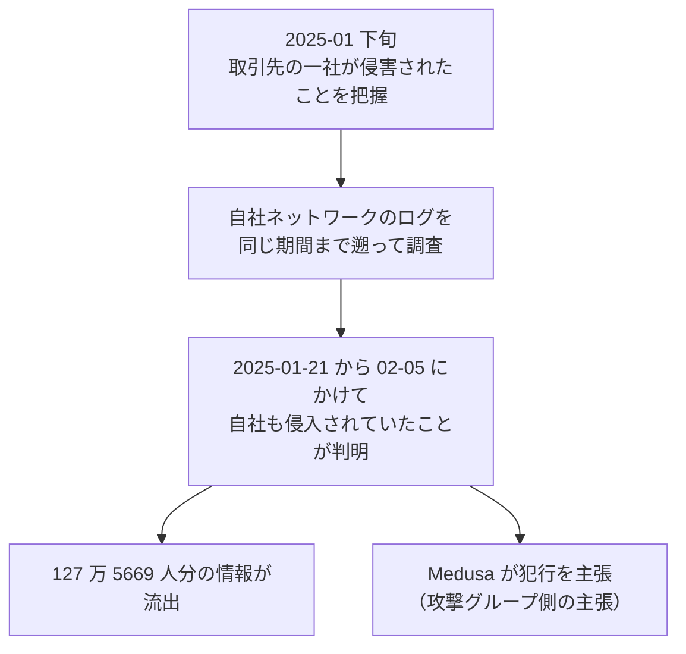
```mermaid
flowchart TD
    A["2025-01 下旬<br>取引先の一社が侵害されたことを把握"] --> B["自社ネットワークのログを同じ期間まで遡って調査"]
    B --> C["2025-01-21 から 02-05 にかけて<br>自社も侵入されていたことが判明"]
    C --> D["127 万 5669 人分の情報が流出"]
    C --> E["Medusa が犯行を主張<br>（攻撃グループ側の主張）"]
```

**分析**：委託先から侵害の連絡を受けたときに、自組織のログを同じ期間まで遡る手順があるかどうかで、発見までの時間が変わる。

### Blue Shield of California で攻撃者が関与せずに起きた流出

[GL-2025-S01](../global/2025-timeline.md#GL-2025-S01)は、侵入を伴わずに 470 万人分が外部へ渡った例である。

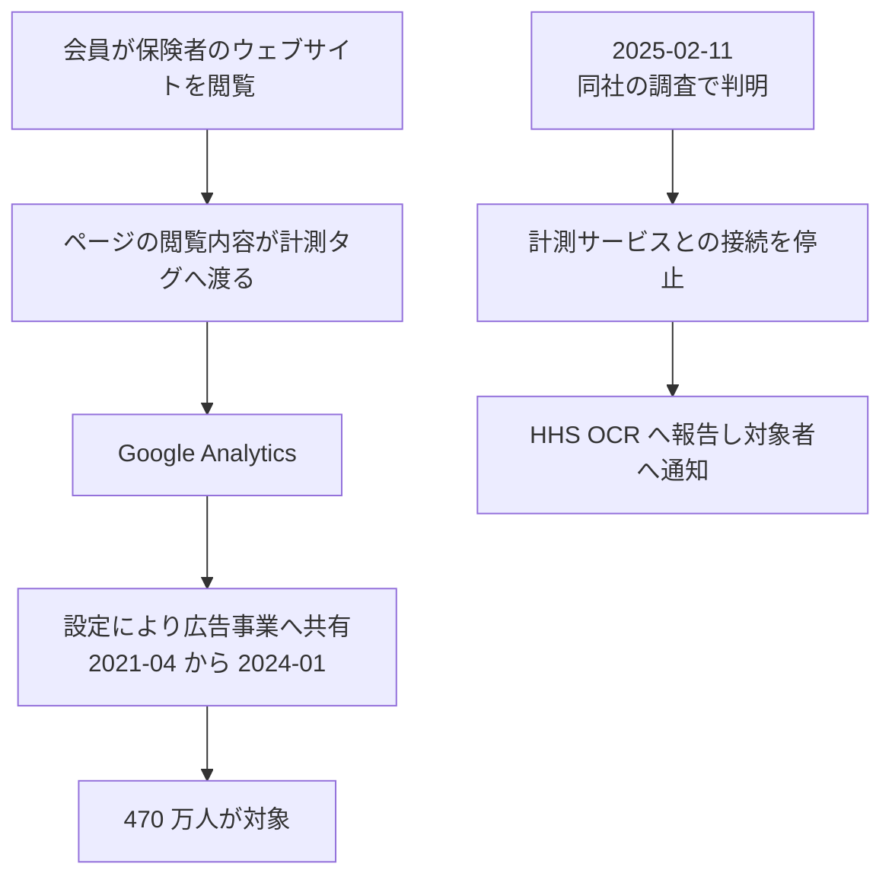
```mermaid
flowchart TD
    A["会員が保険者のウェブサイトを閲覧"] --> B["ページの閲覧内容が計測タグへ渡る"]
    B --> C["Google Analytics"]
    C --> D["設定により広告事業へ共有<br>2021-04 から 2024-01"]
    D --> E["470 万人が対象"]
    F["2025-02-11<br>同社の調査で判明"] --> G["計測サービスとの接続を停止"]
    G --> H["HHS OCR へ報告し対象者へ通知"]
```

**分析**：この経路に攻撃者はいない。
侵入の検知をいくら強めても見つからず、第三者の計測タグを載せる前に送信される項目を確認する手順だけが効く（[トラッキング](../../../technology/web-security/tracking.md)）。
保険者や医療機関のサイトでは、閲覧したページ自体が病名や治療への関心を示す。

### Oracle Health で通知の主体が分かれた経路

[GL-2025-15](../global/2025-timeline.md#GL-2025-15)は、侵害を受けた組織と、患者へ通知する義務を負う組織が別だった例である。

**事実**：米国の HIPAA では、業務委託先（business associate）は侵害の発見から遅滞なく、かつ 60 日以内に委託元（covered entity）へ通知する義務を負い、患者本人への通知義務は委託元にある（[HHS Breach Notification Rule](https://www.hhs.gov/hipaa/for-professionals/breach-notification/index.html)）。
委託元は、通知文の発出を委託先に委任できる。

**報道ベース**：Oracle Health は患者への直接の通知を行わず、届出の対象かどうかの判断と通知文の発出は各医療提供者の責任であるとした。
Cerner 名義で HHS OCR へ届け出た人数は 501 人で、対象者を数え終えていないときに使われる暫定値である。
影響を受けた可能性のある病院は最大 80 施設とされる。
届出は医療機関ごとに分かれており、Union Health の 26 万 2831 人と Munson Healthcare の 10 万人超が大きい一方、州の司法長官へ人数を届け出た分の合計は少なくとも 1 万 4485 人である（人数を公表していない州があるため、合計は総数を表さない）。
対象者の一覧が医療機関に渡ったのが 2025 年 11 月だった例があり、認識から 9 か月近く空いている。
出所は [HIPAA Journal](https://www.hipaajournal.com/oracle-health-data-breach/) である。

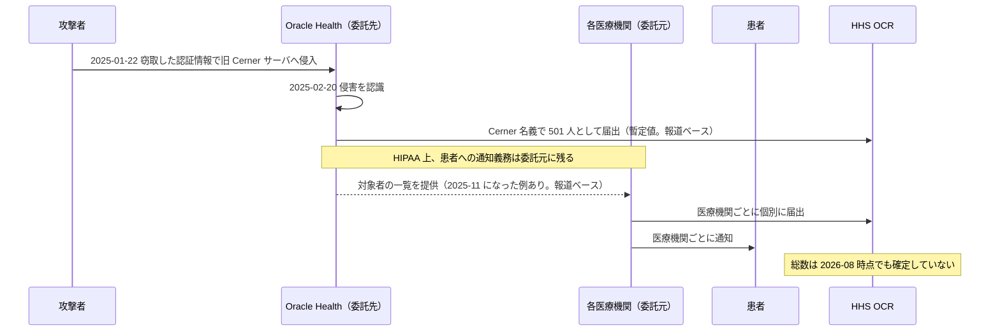
```mermaid
sequenceDiagram
    participant A as 攻撃者
    participant O as Oracle Health（委託先）
    participant H as 各医療機関（委託元）
    participant P as 患者
    participant R as HHS OCR
    A->>O: 2025-01-22 窃取した認証情報で旧 Cerner サーバへ侵入
    O->>O: 2025-02-20 侵害を認識
    O->>R: Cerner 名義で 501 人として届出（暫定値。報道ベース）
    Note over O,H: HIPAA 上、患者への通知義務は委託元に残る
    O-->>H: 対象者の一覧を提供（2025-11 になった例あり。報道ベース）
    H->>R: 医療機関ごとに個別に届出
    H->>P: 医療機関ごとに通知
    Note over R: 総数は 2026-08 時点でも確定していない
```

**分析**：委託先が侵害されても、患者への通知義務は医療機関に残る。
医療機関は、委託先から対象者の一覧を受け取るまで通知を始められない。
その待ち時間は制度上、医療機関側の遅延として現れる。
委託契約に、侵害時の対象者特定の期限と通知の主体を書いていなければ、この構造は次も同じ形で繰り返す。

**分析**：総数が確定しないのは調査が続いているためだけではない。
届出の単位が医療機関ごとに分かれると、同一の侵害でも合計を出す主体がどこにも置かれない。
複数の医療機関が同じ基盤を使う構成では、被害の規模を測る責任者を決めておかないと、規模が分からないまま時間が過ぎる。

#### 2026 年 8 月時点で分かっていること

**報道ベース**：総数は 2026 年 8 月時点でも公表されていない。
確認された医療システムの数は増え続けており、Becker's Hospital Review の集計では 2026 年 7 月時点で少なくとも 17 件である。
Atrium Health Navicent（ジョージア州）は 2026 年 3 月にデータの精査を終え、同年 5 月に患者への通知を開始した。
侵入から 16 か月後にあたる。
出所は [Becker's Hospital Review](https://www.beckershospitalreview.com/healthcare-information-technology/ehrs/12-health-systems-affected-by-oracle-health-data-breach/) と、それを引用した [Paubox](https://www.paubox.com/blog/oracle-health-cerner-breach-reaches-atrium-health-after-16-months) である。

**報道ベース**：通知が遅れた理由の一つとして、Aultman Health System は、法執行機関の捜査を妨げないよう患者と病院顧客への通知を遅らせるようベンダから伝えられたと説明している（HealthExec の取材に対する同社のコメント。出所は上記 [Paubox](https://www.paubox.com/blog/judge-rules-against-oracle-health-breach-vendor-only-liability-defense) の引用）。

**報道ベース**：HHS OCR へ届け出た医療機関のうち、Mosaic Life Care（ミズーリ州、14 万 5300 人）と Union Health System（インディアナ州、26 万 2831 人）は、いずれも自組織が対象だと知ったのが攻撃者からの接触によるものだったと届出書に記している。
Mosaic は、2025 年 4 月 29 日に接触内容を検証し、5 月 2 日に Oracle Health から自社データであることの確認を得て、6 月 6 日に対象者の一覧を受け取った。
出所は [Information Security Media Group](https://www.bankinfosecurity.com/oraclecerner-ehr-hack-breach-reports-still-trickling-in-a-29075) である。

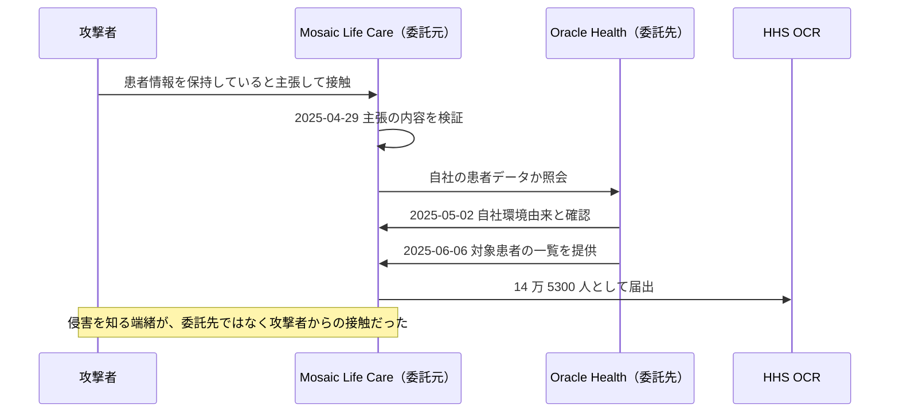
```mermaid
sequenceDiagram
    participant A as 攻撃者
    participant M as Mosaic Life Care（委託元）
    participant O as Oracle Health（委託先）
    participant R as HHS OCR
    A->>M: 患者情報を保持していると主張して接触
    M->>M: 2025-04-29 主張の内容を検証
    M->>O: 自社の患者データか照会
    O->>M: 2025-05-02 自社環境由来と確認
    O->>M: 2025-06-06 対象患者の一覧を提供
    M->>R: 14 万 5300 人として届出
    Note over A,M: 侵害を知る端緒が、委託先ではなく攻撃者からの接触だった
```

**報道ベース**：2026 年 6 月 22 日、ミズーリ州西部地区連邦地方裁判所の Beth Phillips 判事は、Oracle Health と 8 つの医療システムに対する併合訴訟について、被告側の却下申立ての大半を退けた。
医療機関側は、侵入がベンダのシステムで起きたのだから責任は Oracle Health のみにあると主張したが、裁判所は、患者データを守る責任を第三者へ委託することで医療提供者が責任を免れることはできないとしてこれを認めなかった。
Mosaic Life Care と Tallahassee Memorial の患者については、両者の業務委託契約（business associate agreement）の第三者受益者としてベンダを直接訴えることを認めた。
出所は [Becker's Hospital Review](https://www.beckershospitalreview.com/healthcare-information-technology/cybersecurity/oracle-health-8-health-systems-must-face-data-breach-lawsuit/) と、それを引用した [Paubox](https://www.paubox.com/blog/judge-rules-against-oracle-health-breach-vendor-only-liability-defense) である。

**分析**：この判断は却下申立てに対するものであり、責任の有無を決めたものではない。
それでも、ベンダのシステムで起きた侵害だから医療機関に責任はないという主張が、審理の入口で通らなかったことは記録に値する。
本ページが 2025 年時点で「患者への通知義務は医療機関に残る」と記した構造は、制度上の届出義務にとどまらず、民事の請求を受ける立場にも及ぶ。
医療情報システムを外部に置く医療機関にとって、業務委託契約は責任の移転先ではなく、責任を果たすための手段の記述にあたる。

**分析**：Mosaic と Union Health が自組織の被害を攻撃者からの接触で知ったという点は、委託先からの連絡だけを起点に据えた対応手順が働かない場合があることを示している。
攻撃者から接触があったときに、それを検証して委託先へ照会する経路を持っていなければ、確認は始まらない。
[GL-2025-01 SimonMed Imaging](../global/2025-timeline.md#GL-2025-01)が取引先からの通知を起点に自社の侵害を見つけたのと、起点が逆である。

**分析**：捜査への配慮を理由とする通知の遅延は、HIPAA が定める 60 日の期限と衝突する。
遅延の判断がベンダの側で行われ、医療機関がその判断を検証できないとき、期限を守れなかった責任は届出義務を負う医療機関に現れる。
委託契約に、捜査機関の要請による遅延をどう扱うか、その判断を誰がいつ医療機関へ伝えるかを書いていなければ、この配分は変わらない。

### 宇都宮セントラルクリニックの登場人物と通知の経路

[JP-2025-01](../japan/2025-timeline.md#JP-2025-01)では、健診の受託関係を通じて通知の対象が広がった。

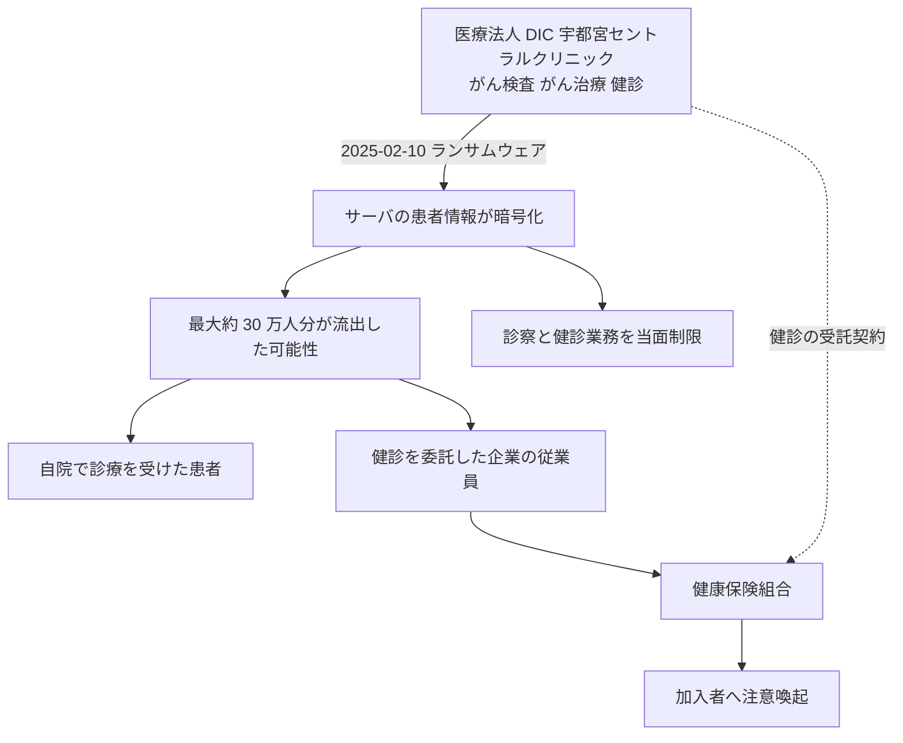
```mermaid
flowchart TD
    A["医療法人 DIC 宇都宮セントラルクリニック<br>がん検査 がん治療 健診"] -->|"2025-02-10 ランサムウェア"| B["サーバの患者情報が暗号化"]
    B --> C["最大約 30 万人分が流出した可能性"]
    B --> D["診察と健診業務を当面制限"]
    C --> E1["自院で診療を受けた患者"]
    C --> E2["健診を委託した企業の従業員"]
    A -.->|"健診の受託契約"| F["健康保険組合"]
    E2 --> F
    F --> G["加入者へ注意喚起"]
```

**分析**：通知が医療機関から患者へ直接ではなく、健康保険組合を経由して広がった。
健診の委託関係を持つ組織が、被害時に誰が誰へ通知するかを契約の段階で決めていないと、告知が遅れる。

### 富士フイルムメディカルの認証情報の悪用と空白の 4 か月

[JP-2025-04](../japan/2025-timeline.md#JP-2025-04)は、正規の認証情報を使った侵入が発覚まで長く残った例である。

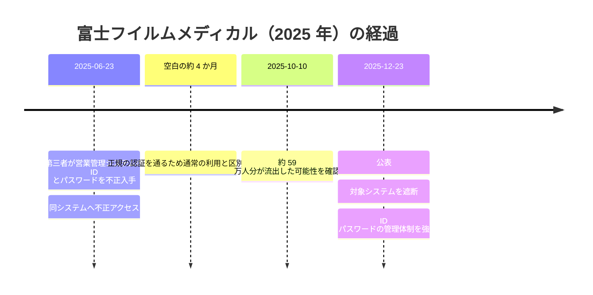
```mermaid
timeline
    title 富士フイルムメディカル（2025 年）の経過
    2025-06-23 : 第三者が営業管理システムの ID とパスワードを不正入手 : 同システムへ不正アクセス
    空白の約 4 か月 : 正規の認証を通るため通常の利用と区別しにくい
    2025-10-10 : 約 59 万人分が流出した可能性を確認
    2025-12-23 : 公表 : 対象システムを遮断 : ID とパスワードの管理体制を強化
```

**分析**：流出したのは医療従事者の勤務先、専門分野、連絡先を組にした名簿で、患者情報と要配慮個人情報は含まれない。
それでも、特定の診療科の担当者を名指しで狙う標的型のメールには、そのまま使える組み合わせになっている。

### 徳島大学病院で漏えいした情報と公表された対策の対応

[JP-2025-07](../japan/2025-timeline.md#JP-2025-07)は、実施した対策が漏えいした情報の種類に対応している例である。

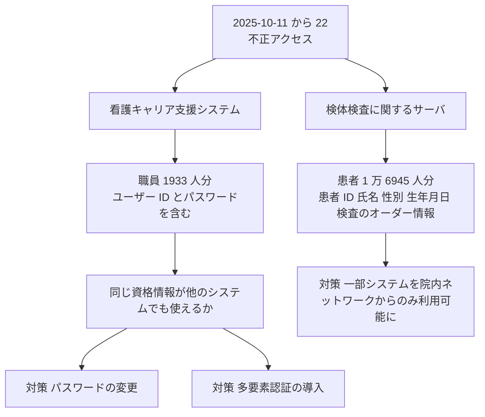
```mermaid
flowchart TD
    A["2025-10-11 から 22<br>不正アクセス"] --> B1["検体検査に関するサーバ"]
    A --> B2["看護キャリア支援システム"]
    B1 --> C1["患者 1 万 6945 人分<br>患者 ID 氏名 性別 生年月日 検査のオーダー情報"]
    B2 --> C2["職員 1933 人分<br>ユーザー ID とパスワードを含む"]
    C2 --> D["同じ資格情報が他のシステムでも使えるか"]
    D --> E1["対策 パスワードの変更"]
    D --> E2["対策 多要素認証の導入"]
    C1 --> F["対策 一部システムを院内ネットワークからのみ利用可能に"]
```

**分析**：認証情報が漏れた側にはパスワードの変更と多要素認証、患者情報の側には到達経路の限定が当てられている。
対策の一覧を並べるだけの公表と違い、どの被害に対して何を打ったかが読み取れる。

### 医療機関の外に置かれたデータが漏れた三つの経路

自院のネットワークが健全でも患者情報が漏れる経路が、2025 年には三つの形で現れた。

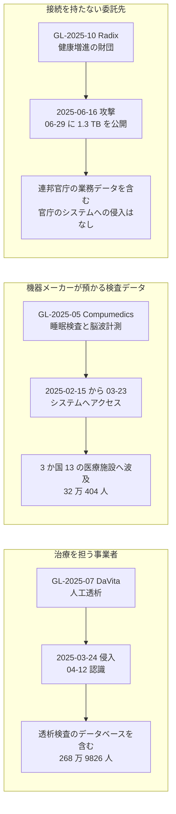
```mermaid
flowchart LR
    subgraph P1["治療を担う事業者"]
        A1["GL-2025-07 DaVita<br>人工透析"] --> A2["2025-03-24 侵入<br>04-12 認識"]
        A2 --> A3["透析検査のデータベースを含む<br>268 万 9826 人"]
    end
    subgraph P2["機器メーカーが預かる検査データ"]
        B1["GL-2025-05 Compumedics<br>睡眠検査と脳波計測"] --> B2["2025-02-15 から 03-23<br>システムへアクセス"]
        B2 --> B3["3 か国 13 の医療施設へ波及<br>32 万 404 人"]
    end
    subgraph P3["接続を持たない委託先"]
        C1["GL-2025-10 Radix<br>健康増進の財団"] --> C2["2025-06-16 攻撃<br>06-29 に 1.3 TB を公開"]
        C2 --> C3["連邦官庁の業務データを含む<br>官庁のシステムへの侵入はなし"]
    end
```

**分析**：三つとも、医療機関や官庁の側から見れば自組織のシステムは侵害されていない。
Radix の例が示すとおり、委託先が発注元のシステムに接続していなくても、委託業務で受け取ったデータは委託先に残る。
接続の有無だけでリスクを判定すると、この経路が台帳から抜ける。

### 台湾で連続した攻撃と、所管官庁の対応の順序

[GL-2025-17](../global/2025-timeline.md#GL-2025-17)と[GL-2025-20](../global/2025-timeline.md#GL-2025-20)は、当事者の公表と衛生福利部の発表により、2 件の攻撃と国の対応の順序が追える。

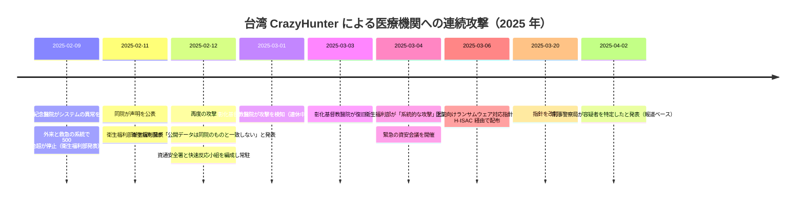
```mermaid
timeline
    title 台湾 CrazyHunter による医療機関への連続攻撃（2025 年）
    2025-02-09 : 馬偕紀念醫院がシステムの異常を検知 : 外来と救急の系統で 500 台超が停止（衛生福利部発表）
    2025-02-11 : 同院が声明を公表 : 衛生福利部が状況を発表
    2025-02-12 : 再度の攻撃 : 衛生福利部が「公開データは同院のものと一致しない」と発表 : 資通安全署と快速反応小組を編成し常駐
    2025-03-01 : 彰化基督教醫院が攻撃を検知（連休中の土曜）
    2025-03-03 : 彰化基督教醫院が復旧
    2025-03-04 : 衛生福利部が「系統的な攻撃」と定義 : 緊急の資安会議を開催
    2025-03-06 : 医院向けランサムウェア対応指針を H-ISAC 経由で配布
    2025-03-20 : 指針を改訂
    2025-04-02 : 刑事警察局が容疑者を特定したと発表（報道ベース）
```

**分析**：2 件目の復旧から指針の配布まで 3 日である。
この速さを支えたのは、攻撃グループを特定して「同一の攻撃である」と判断する主体が、当事者ではなく所管官庁だった点である。
被害を受けた医療機関は自組織の復旧で手一杯になるため、他院への警告を当事者に期待する設計では間に合わない。

### アスクルで 1 件の例外が物流を止めるまで

[JP-2025-14](../japan/2025-timeline.md#JP-2025-14)は、当事者が公表した調査報告書により、侵入から供給の停止までの連鎖が追える。

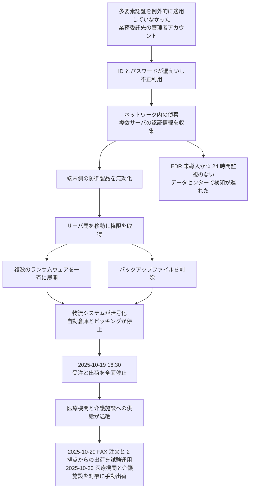
```mermaid
flowchart TD
    A["多要素認証を例外的に適用していなかった<br>業務委託先の管理者アカウント"] --> B["ID とパスワードが漏えいし不正利用"]
    B --> C["ネットワーク内の偵察<br>複数サーバの認証情報を収集"]
    C --> D["端末側の防御製品を無効化"]
    D --> E["サーバ間を移動し権限を取得"]
    E --> F["複数のランサムウェアを一斉に展開"]
    E --> G["バックアップファイルを削除"]
    F --> H["物流システムが暗号化<br>自動倉庫とピッキングが停止"]
    G --> H
    H --> I["2025-10-19 16:30<br>受注と出荷を全面停止"]
    I --> J["医療機関と介護施設への供給が途絶"]
    J --> K["2025-10-29 FAX 注文と 2 拠点からの出荷を試験運用<br>2025-10-30 医療機関と介護施設を対象に手動出荷"]
    C --> L["EDR 未導入かつ 24 時間監視のない<br>データセンターで検知が遅れた"]
```

**分析**：入口は 1 件の例外である。
例外そのものは運用上の必要から作られるが、例外の一覧を持たず定期に見直していなければ、その 1 件が全体の入口になる。
検知が遅れた理由として同社が挙げたのは、侵害されたデータセンターに EDR が入っておらず 24 時間監視も行われていなかったことである。
監視の適用範囲が資産の一部に限られている状態は、その外側を攻撃者に選ばせる。

### Cistec の侵害が顧客の病院へ向かうまで

[GL-2025-61](../global/2025-timeline.md#GL-2025-61)は、病院情報システムのベンダが侵害され、その環境から顧客の病院へ攻撃が向かった例である。

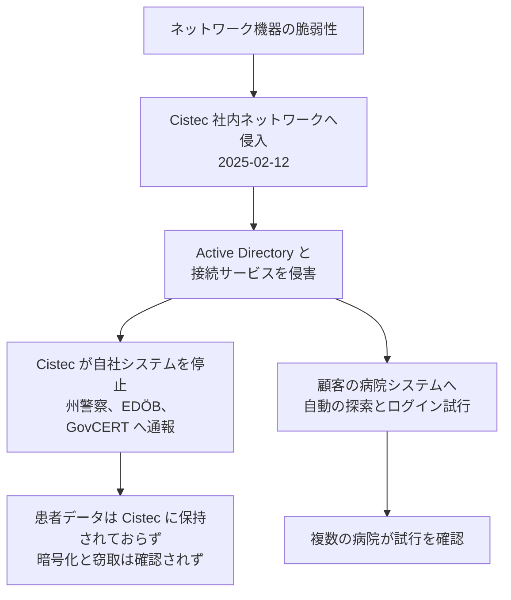
```mermaid
flowchart TD
    A["ネットワーク機器の脆弱性"] --> B["Cistec 社内ネットワークへ侵入<br>2025-02-12"]
    B --> C["Active Directory と<br>接続サービスを侵害"]
    C --> D["Cistec が自社システムを停止<br>州警察、EDÖB、GovCERT へ通報"]
    C --> E["顧客の病院システムへ<br>自動の探索とログイン試行"]
    E --> F["複数の病院が試行を確認"]
    D --> G["患者データは Cistec に保持されておらず<br>暗号化と窃取は確認されず"]
```

**分析**：保守と運用のために顧客環境へ到達できるベンダは、顧客から見れば内部と同じ位置にいる。
顧客側が持てる手立ては、ベンダからの接続を常時許可せず、接続元と時間帯と操作の範囲を限ることと、ベンダ由来の認証試行を異常として検知できるようにしておくことである。

### IPEN/CNEN の停止が全国の核医学に及ぶまで

[GL-2025-57](../global/2025-timeline.md#GL-2025-57)は、医療機関の外にある単一の供給元が止まった例である。

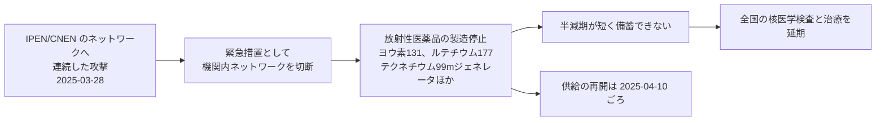
```mermaid
flowchart LR
    A["IPEN/CNEN のネットワークへ<br>連続した攻撃<br>2025-03-28"] --> B["緊急措置として<br>機関内ネットワークを切断"]
    B --> C["放射性医薬品の製造停止<br>ヨウ素131、ルテチウム177<br>テクネチウム99mジェネレータほか"]
    C --> D["半減期が短く備蓄できない"]
    D --> E["全国の核医学検査と治療を延期"]
    C --> F["供給の再開は 2025-04-10 ごろ"]
```

**分析**：物理的な安全は損なわれていないと当事者が説明しても、供給が止まれば診療は止まる。
自組織の攻撃面を数え上げるときに、代替のきかない外部の供給元を項目として持っているかどうかが、この型の被害への備えを分ける（[攻撃面](../../../practice/attack-surface.md)）。

### 図にできなかった事例

次の事例は、初期侵入経路と侵入から検知までの経過がいずれも公表されておらず、図にすると推測で線を引くことになるため置いていない。
表は例示であり、経路が公表されていない 91 件のすべてを並べたものではない。

| ID | 組織 | 公表されている範囲 |
|---|---|---|
| [GL-2025-02](../global/2025-timeline.md#GL-2025-02) | Frederick Health | 認識日、持ち出しの対象がファイル共有サーバであること、影響人数 |
| [GL-2025-06](../global/2025-timeline.md#GL-2025-06) | Yale New Haven Health | 検知日と影響人数 |
| [GL-2025-12](../global/2025-timeline.md#GL-2025-12) | AMEOS Gruppe | 攻撃日、ネットワークを一括で遮断した事実 |
| [JP-2025-02](../japan/2025-timeline.md#JP-2025-02) | 三笑堂 | 認識日、暗号化された範囲、外部流出が確認されなかったこと |
| [JP-2025-03](../japan/2025-timeline.md#JP-2025-03) | 聖十字病院 | 検知日時と、確報の時点で漏えいが確認されていないこと |
| [JP-2025-05](../japan/2025-timeline.md#JP-2025-05) | 特定非営利活動法人ゆう | 発生日、暗号化されたファイルサーバと情報の種類 |
| [JP-2025-06](../japan/2025-timeline.md#JP-2025-06) | オオサキメディカル | 発生日、受注と出荷の停止期間、流出した情報の種類 |
| [GL-2025-17](../global/2025-timeline.md#GL-2025-17) | 馬偕紀念醫院 | 検知日、停止した端末の台数、影響した部門。侵入経路と滞留期間は未公表 |
| [GL-2025-21](../global/2025-timeline.md#GL-2025-21) | 内務行政省病院（クラクフ） | 攻撃日、暗号化された範囲、受入を停止した診療科 |
| [GL-2025-27](../global/2025-timeline.md#GL-2025-27) | Heywood Healthcare | 障害の発生日、Code Black の期間、影響した系統 |
| [GL-2025-28](../global/2025-timeline.md#GL-2025-28) | Manage My Health | 侵害日、対象の患者数と文書数、当局の対応 |

**分析**：本年に収録したサイバー攻撃 110 件のうち 91 件で初期侵入経路が公表されていない。
経路が出ない事案は、被害の事実は伝えても、他の医療機関が自組織の構成と照らし合わせる材料を残さない。

## 外部統計

| 統計 | 地域 | 参照先 | 本リポジトリでの集計状況 |
|---|---|---|---|
| ランサムウェア被害の報告件数 | 国内 | [令和 7 年におけるサイバー空間をめぐる脅威の情勢等について（PDF）](https://www.npa.go.jp/publications/statistics/cybersecurity/data/R7/R07_cyber_jousei.pdf)、[統計データ（xlsx）](https://www.npa.go.jp/publications/statistics/cybersecurity/data/R7/R07_jousei_data.xlsx)（警察庁） | 通年 226 件（**事実**）。業種別の区分に医療、福祉はない。下記に要約 |
| 個人情報の漏えい等報告 | 国内 | [令和 7 年度年次報告（PDF）](https://www.ppc.go.jp/files/pdf/080707_annual_report.pdf)（個人情報保護委員会） | 令和 7 年度（2025 年 4 月から 2026 年 3 月）1 万 9417 件（**事実**）。集計の単位が年度であり、暦年の 2025 年とは範囲が違う。医療分野を切り出した件数の公表はない。下記に要約 |
| 米国の医療情報侵害の届出（500 人以上） | 海外 | [HHS OCR Breach Portal](https://ocrportal.hhs.gov/ocr/breach/breach_report.jsf) | 2025 年 795 件、1 億 4030 万 8908 人（**事実**。本リポジトリが 2026 年 8 月 26 日に同ポータルから全件を取得して集計。詳細は[全件集計](../global/2025-us-hhs.md)）。下記に要約 |
| 医療、公衆衛生分野への脅威 | 海外 | [2025 IC3 Annual Report（PDF）](https://www.ic3.gov/AnnualReport/Reports/2025_IC3Report.pdf)（FBI IC3） | 2025 年の重要インフラ 16 分野のうちランサムウェアの報告が最多（**事実**）。ランサムウェア 460 件、データ侵害 182 件 |
| 医療分野の身代金の支払い | 海外 | [The State of Ransomware in Healthcare 2025](https://www.sophos.com/en-us/blog/the-state-of-ransomware-in-healthcare-2025)（Sophos） | 支払った組織は 36%（**事実**。ベンダによる標本調査であり、被害の全数ではない）。下記に要約 |
| 医療分野のインシデント届出 | 海外（仏） | [Observatoire des signalements d'incidents de sécurité（PDF）](https://esante.gouv.fr/sites/default/files/media/document/ANS_CERTSante_Rapport_Public_Observatoire_Signalements_ISSIS_2025_VF_0.pdf)（ANS、CERT Santé） | 2025 年 764 件（**事実**）。下記に要約 |
| 医療分野のインシデント対応 | 海外（波） | [CSIRT CeZ（Centrum e-Zdrowia）](https://cez.gov.pl/) | 2025 年 1441 件（**報道ベース**）。前年比 60%超の増加 |
| 医療分野のランサムウェア集計 | 海外 | [Healthcare Ransomware Roundup（Comparitech）](https://www.comparitech.com/news/healthcare-ransomware-roundup-2025-stats-on-attacks-ransoms-and-data-breaches/) | 2025 年の医療提供者 445 件、医療関連事業者 191 件（**報道ベース**）。要求額が判明したのは 124 件、支払いが確認できたのは 2 件。下記に要約 |
| 医療分野の脅威情報 | 海外 | [HHS HC3](https://www.hhs.gov/about/agencies/asa/ocio/hc3/index.html) | 未集計 |
| 欧州の脅威動向 | 海外 | [ENISA Threat Landscape 2025（PDF）](https://www.enisa.europa.eu/sites/default/files/2026-01/ENISA%20Threat%20Landscape%202025_v1.2.pdf)（ENISA） | 2024 年 7 月から 2025 年 6 月の 4875 件のうち、医療はサイバー犯罪インシデントの 4.2%（**事実**）。下記に要約 |

**事実**：警察庁は、令和 7 年のランサムウェア被害の報告件数を 226 件としている。
上半期が 116 件、下半期が 110 件で、令和 6 年の 222 件からほぼ横ばいである。
暗号化を伴わないノーウェアランサムは 17 件で、令和 5 年の 30 件、令和 6 年の 22 件から減っている。
手口が判明した 153 件のうち 136 件が二重恐喝型である。

**事実**：業種別の内訳は、製造業 91 件、卸売業と小売業 34 件、サービス業 24 件、情報通信業 24 件、建設業 18 件、教育と学習支援業 11 件、その他 24 件である。
医療、福祉は独立した区分として示されておらず、「その他」の 24 件に含まれる。
規模別では中小企業 143 件、大企業 64 件、団体等 19 件である。

**事実**：被害組織へのアンケートにもとづく内訳は次のとおりである。
感染経路（92 件が回答）は VPN 機器 61 件、リモートデスクトップ 19 件、不審メールとその添付ファイル 2 件、その他 10 件である。
復旧に要した期間（107 件）は、即時から 1 週間未満が 29 件、1 週間から 1 か月未満が 31 件、1 か月から 2 か月未満が 15 件、2 か月以上が 7 件で、25 件は回答時点で復旧中である。
調査費用の総額（89 件）は 1000 万円以上 5000 万円未満が 32 件で最も多い。
バックアップは 116 件のうち 105 件が取得していたが、復元の可否を答えた 99 件のうち復元できたのは 20 件にとどまる。
復元できなかった理由（72 件）は、バックアップも暗号化されたが 48 件、運用不備が 19 件である。
サイバー攻撃を想定に含む事業継続計画を策定していた組織は、111 件のうち 20 件である。

**分析**：バックアップを取得していた組織は 9 割を超えるのに、復元できたのは 2 割である。
差の内訳は警察庁が示している。
復元できなかった 72 件のうち 48 件で、バックアップも暗号化された。
攻撃者が本番系から到達できる場所に複製が置かれていたということである。
取得の有無を確認する運用は、この状態を検出しない。
確認できるのは、本番系の管理者権限を奪われた状態で消せない、または書き換えられない複製があるかどうかである。

**事実**：フランスの ANS と CERT Santé は、2025 年に保健および医療社会分野から 764 件の届出があったと公表している（2024 年は 749 件）。
少なくとも 1 件を届け出た施設は 606 施設で、前年比 9%の増加である。
このうち 288 件（全体の 38%）で、施設が縮退運用に移るか患者の受入を中断した。
前年からの増加は 24%である。
一方で、縮退や中断に至った 288 件のうち悪意に起因するものは 25%にとどまり、主要な三つの原因は通信回線の切断、診療記録システムの不具合、施設または委託先の基盤の故障である。
重大インシデントは 2025 年が 2 件で、2024 年の 3 件から減った。
ランサムウェアに起因する件数は前年比 30%の減少である。
同報告は「情報システムの侵害が 2025 年で最も大きな脅威である」と述べ、データ流出の大半が医療従事者または委託先のアカウントの侵害に起因するとしている。

**分析**：CERT Santé の数字は、診療が止まる原因の 4 分の 3 が攻撃ではないことを示している。
本リポジトリの副分類も同じ方向を指すが、CERT Santé の集計に含まれるのは通信断や機器の故障であり、本リポジトリが副分類として集めている紛失や誤送付とは対象が違う。
両者を同じ「攻撃以外」として並べると、対策の優先順位を誤る。

### 個人情報保護委員会の漏えい等報告（国内）

**事実**：個人情報保護委員会は、令和 7 年度（2025 年 4 月から 2026 年 3 月）に処理した漏えい等報告を、個人情報取扱事業者等について 1 万 7139 件、行政機関等について 2278 件と公表している。
事業者分の内訳は、委員会が直接受け付けたものが 1 万 3345 件、委任先省庁を経由したものが 3794 件である。
前年度は事業者分が 1 万 9056 件、行政機関等分が 1951 件だった。

**事実**：事業者分 1 万 7139 件の報告義務の該当事由は、要配慮個人情報を含む個人データの漏えい等が 1 万 603 件（61.9%）で最多である。
次いで、不正の目的をもって行われたおそれのある漏えい等が 3822 件（22.3%）、財産的被害が生じるおそれのあるものが 3525 件（20.6%）である。
委員会が直接受け付けた 1 万 3345 件について漏えいした情報の形態を見ると、紙媒体のみが 1 万 263 件（76.9%）を占める。

**事実**：委員会は年次報告と四半期報告のいずれでも、要配慮個人情報を含む漏えい等について「これらの大半は病院や薬局における誤交付によるもの」と記している。
一方で、医療分野を切り出した件数は、年次報告にも四半期報告にも掲載されていない。
報告の分類軸は、業種ではなく報告義務の該当事由、漏えいした人数、情報の種類、情報の形態である。

**分析**：最多の該当事由が要配慮個人情報の漏えい等であり、その大半が病院と薬局の誤交付だという委員会の記述は、国内の漏えい等報告の中心が医療機関の窓口業務にあることをうかがわせる。
ただし、これは件数ではなく文章による記述であり、医療分野が全体の何割かは公表された数字からは求められない。
本リポジトリが国内の副分類で紛失と誤交付を多く収録していることと同じ方向を指すが、比率を語る根拠にはならない。
委員会の集計は年度であり、本ページの収録は暦年である点も、両者を並べるときの前提になる。

**分析**：紙媒体のみの漏えいが 76.9%を占めることは、電子カルテのアクセス制御を強めても届かない領域が報告の大半だという意味になる。
誤交付は、正しい権限で正しく取り出した情報を、渡す相手を誤って手渡す事象である。
システム側の制御ではなく、窓口での本人確認と受渡しの手順が対象になる。

### HHS OCR の届出（米国）

**事実**：本リポジトリが 2026 年 8 月 26 日に HHS OCR の侵害報告ポータルから全件を取得して集計したところ、2025 年に届け出られた 500 人以上の侵害は **795 件**、影響人数の合計は **1 億 4030 万 8908 人**であった。
類型はハッキングおよび IT インシデントが 643 件（80.9%）、不正なアクセスおよび開示が 140 件、盗難が 9 件、紛失が 2 件、不適切な廃棄が 1 件である。
侵害された情報の所在はネットワークサーバが 496 件、電子メールが 190 件と続く。
上位 16 件で影響人数の 80.2%を占める。
取得の手順と、10 万人以上の全 96 件の一覧は[2025 年 米国 HHS OCR 届出の全件集計](../global/2025-us-hhs.md)にまとめている。

下記の HIPAA Journal による集計（789 件）と 6 件違うのは、集計の時点が違うためである。
ポータルの数値は精査によって改訂され、届出の追加も続く。
同じポータルを典拠にしても、いつ数えたかで結果が動く。

**報道ベース**：HIPAA Journal が HHS OCR の侵害報告ポータルを集計したところ、2025 年に届け出られた 500 人以上の侵害は 789 件で、年間の過去最多である（同ページは 2026 年 8 月 4 日に更新され、同日に OCR から取得したデータにもとづく）。
影響人数は約 1 億 3850 万人で、1 日あたり 2.1 件、37 万 9306 人にあたる。
2024 年は 1 日あたり 79 万 2226 人で、Change Healthcare の 1 億 9270 万人が大部分を占める。
同ページは年間の合計人数を数値で示していないため、日平均から逆算した値を年間合計として引くわけにはいかない。
2025 年の届出のうち、ハッキングおよび IT インシデントが 8 割を超える。
記録の不適切な廃棄による届出は 2025 年に 1 件である。
OCR が金銭的な制裁を科して調査を終えた件数は、2024 年の 16 件から 2025 年は 21 件へ増えた。

**報道ベース**：2025 年に届け出られた最大の侵害は、業務受託事業者 Conduent Business Services の 6222 万 4658 人である。
HHS へ届け出られた医療分野の侵害として、過去 3 番目の規模にあたる。
2025 年で 2 番目が [GL-2025-25 Aflac](../global/2025-timeline.md#GL-2025-25) の 1392 万 4906 人である。

**分析**：2025 年の件数と影響人数は、2026 年に入ってからも増え続けた。
理由は二つある。
一つは Conduent のように、通知の開始時点（2025 年 10 月、1050 万人）から精査の完了までに集計が数倍へ動く事案があることである。
もう一つは、米連邦政府が 2025 年 10 月 1 日から 11 月 12 日までの 43 日間閉鎖され、その間 OCR のポータルへの追加が止まったことである。
HIPAA Journal は 2026 年 8 月 4 日の更新時点で、集計の対象を 2026 年 6 月 30 日までに届け出られたデータとしている。
年内の集計値を年の実態として読むと、届出制度そのものの停止期間を被害の減少として取り違える。

**分析**：件数が過去最多である一方、影響人数は前年から半分以下に減っている。
1 日あたりの影響人数が 79 万 2226 人から 37 万 9306 人へ下がったのは、2024 年を Change Healthcare 1 件が押し上げていたためであり、両年の人数を比べても攻撃の増減は測れない。
比較に耐えるのは件数の側であり、そちらは 2024 年の 779 件から 789 件へ約 1%増えている。

**分析**：米国の届出で記録の不適切な廃棄が年 1 件であることと、国内の漏えい等報告で紙媒体のみが 76.9%を占めることは、並べて読めない。
前者は廃棄の手順を守らなかった事案だけを数え、後者は誤交付と紛失を含む紙由来の漏えい全体を数えている。
両制度の分類は、報告義務を発生させる事由の定義から違う。
国ごとの数字で紙の事故の多寡を比べるなら、まず何を 1 件と数えているかを揃える必要がある。

### ENISA の脅威動向（欧州）

**事実**：ENISA の [Threat Landscape 2025](https://www.enisa.europa.eu/sites/default/files/2026-01/ENISA%20Threat%20Landscape%202025_v1.2.pdf)（2025 年 10 月公表、対象期間は 2024 年 7 月 1 日から 2025 年 6 月 30 日）は、収集した 4875 件のインシデントを分析している。
EU で最も狙われた五つの分野は、公共行政（38.2%）、運輸（7.5%）、デジタルインフラおよびサービス（4.8%）、金融（4.5%）、製造（2.9%）で、医療は含まれない。
医療分野は、同期間のサイバー犯罪インシデント全体の 4.2%を占める。
同報告は、ドイツの 2 組織へのランサムウェア攻撃が医療行為の延期を招いた点を挙げている。

**事実**：ENISA が医療分野に限って公表した脅威動向は、2023 年 7 月 5 日の [Health Threat Landscape](https://www.enisa.europa.eu/news/checking-up-on-health-ransomware-accounts-for-54-of-cybersecurity-threats) が最新である。
対象期間は 2021 年 1 月から 2023 年 3 月で、EU と近隣国の公開情報 215 件を扱い、ランサムウェアが 54%を占めるとしている。
2025 年を対象とする医療分野専用の集計は、本リポジトリが確認した範囲では公表されていない。

**分析**：ENISA の全分野の集計で医療が上位五つに入らないのは、件数を数える単位が違うためである。
公共行政の比率が伸びた主因はハクティビストによる DDoS であり、1 件あたりの被害の重さは医療のランサムウェアと同じではない。
分野間の比率は、狙われやすさの順位ではなく、記録に残りやすい攻撃種別の分布を映す。

**分析**：欧州には、医療分野を継続して数える集計が現状ない。
フランスの CERT Santé とポーランドの CSIRT CeZ は国単位で数えているが、EU 全域を年次で追う仕組みは 2023 年の報告以降更新されていない。
[規制と制度の動き](#海外)に記した欧州行動計画が掲げた早期警戒サービスは、この空白を埋める位置にある。

## 身代金の支払い

**事実**：Sophos の調査（2025 年 1 月から 3 月に 17 か国の従業員 100 人から 5000 人の組織を対象に実施。医療分野の回答者は 292 人）によれば、身代金を支払った医療提供者は 36%である。
2022 年の 61%から下がった。
要求額の中央値は 34 万 3000 ドルで、2024 年の 400 万ドルから 91%減った。
実際の支払額の中央値は 15 万ドルで、2024 年の 147 万ドルから下がり、同調査の全分野で最も低い。
バックアップからデータを復旧した組織は 51%で、前年の 72%から下がった。
身代金を除く復旧費用の平均は 102 万ドルで、2024 年の 257 万ドルから 60%減った。
侵入の起点として悪用された脆弱性が挙がったのは 33%である。

**事実**：国内には、身代金の支払い有無を集計した公的な統計がない。
警察庁の令和 7 年の報告書は、支払いについて「犯罪グループ等の活動資金となることが懸念される」「暗号化されたデータの復号が保証されるわけではない」と被害者に説明していると述べ、支払いの有無を含む情報の提供を捜査への協力として求めているとしている。
件数や割合の公表はない。

**事実**：本リポジトリが収録した 2025 年の事例のうち、支払いが当事者側から確認できるのは 2 件である。
[GL-2025-11 Eurofins Clinical Diagnostics NMDL](../global/2025-timeline.md#GL-2025-11) は数百万ユーロを支払ったが、約 5 万人分はリークサイトに公開され、その後さらに 11 ビットコインを要求された。
[GL-2025-78 University of Hawaiʻi Cancer Center](../global/2025-timeline.md#GL-2025-78) は、窃取データの公開を防ぐために支払い、復号ツールとデータ削除の確約を得たことを公表している。
支払わない方針を当事者が公表したのは [GL-2025-08 Kettering Health](../global/2025-timeline.md#GL-2025-08) と [GL-2025-89 M.J. Biopharm](../global/2025-timeline.md#GL-2025-89) の 2 件で、前者については攻撃グループが公表の数日後に窃取ファイルを公開した。
このほか [GL-2025-17 馬偕紀念醫院](../global/2025-timeline.md#GL-2025-17)が支払わなかったとされるが、根拠は下記の**報道ベース**の集計である。

### 事例ごとの支払い有無

**報道ベース**：Comparitech の 2025 年の集計では、要求額が判明したのは医療提供者と医療関連事業者を合わせて 124 件にとどまる。
そのうち支払いが確認されたのは 2 件だけで、Eurofins Clinical Diagnostics と University of Hawaiʻi Cancer Center である。
支払っていないことを確認できた組織は 16 件である。
要求額の平均は医療提供者が 61 万 5000 ドル（2024 年の 390 万ドルから 84%減）、医療関連事業者が 58 万 4700 ドル（2024 年の 770 万ドルから 92%減）で、全分野の平均 104 万ドルを下回る。

**報道ベース**：同集計が金額を挙げている 2025 年の事例は次のとおりである。
上から 5 件が、医療分野で確認された要求額の上位にあたる。

| 組織 | 国 | 要求額 | 攻撃グループ | 支払い |
|---|---|---|---|---|
| [GL-2025-94 EHPAD Résidence du Parc](../global/2025-timeline.md#GL-2025-94) | 仏 | 500 万ドル | 未特定 | 公表なし |
| [GL-2025-79 MedStar Health](../global/2025-timeline.md#GL-2025-79) | 米 | 309 万ドル（25 ビットコイン） | Rhysida | 公表なし |
| [GL-2025-18 HCRG Care Group](../global/2025-timeline.md#GL-2025-18) | 英 | 200 万ドル | Medusa | 公表なし（公開の差止命令を申し立て） |
| [GL-2025-80 Spindletop Center](../global/2025-timeline.md#GL-2025-80) | 米 | 165 万ドル（15 ビットコイン） | Rhysida | 公表なし |
| [GL-2025-17 馬偕紀念醫院](../global/2025-timeline.md#GL-2025-17) | 台 | 150 万ドル | CrazyHunter | 支払わなかった |
| [GL-2025-01 SimonMed Imaging](../global/2025-timeline.md#GL-2025-01) | 米 | 100 万ドル | Medusa | 公表なし |
| [GL-2025-89 M.J. Biopharm](../global/2025-timeline.md#GL-2025-89) | 印 | 8 万ドル | 未特定 | 支払わなかった |

**報道ベース**：[GL-2025-78 University of Hawaiʻi Cancer Center](../global/2025-timeline.md#GL-2025-78)は、支払いの後の経過が公表されている数少ない事例である。
同センターは 2025 年 8 月 31 日にランサムウェアの被害を受け、研究データを保持するサーバが暗号化されて流出した。
同センターは、窃取データの公開を防ぐために身代金を支払ったこと、復号ツールを入手したこと、データを削除したとの確約を得たことを公表している。
電子カルテと診療、治験の運用に影響はなかった。
支払ったにもかかわらず、暗号化の範囲が広く、復元とシステムの再構築には時間を要したとしている。
対象人数は最大 115 万人で、公表は 2026 年 1 月 15 日、人数の確定はそのあとである。
通知が遅れた理由として、データ量、暗号化されたデータの複雑さ、研究記録の古さ（1993 年から 2000 年に収集したもの）を挙げている。
出所は [HIPAA Journal](https://www.hipaajournal.com/university-of-hawaii-cancer-center-ransomware-data-breach/) である。

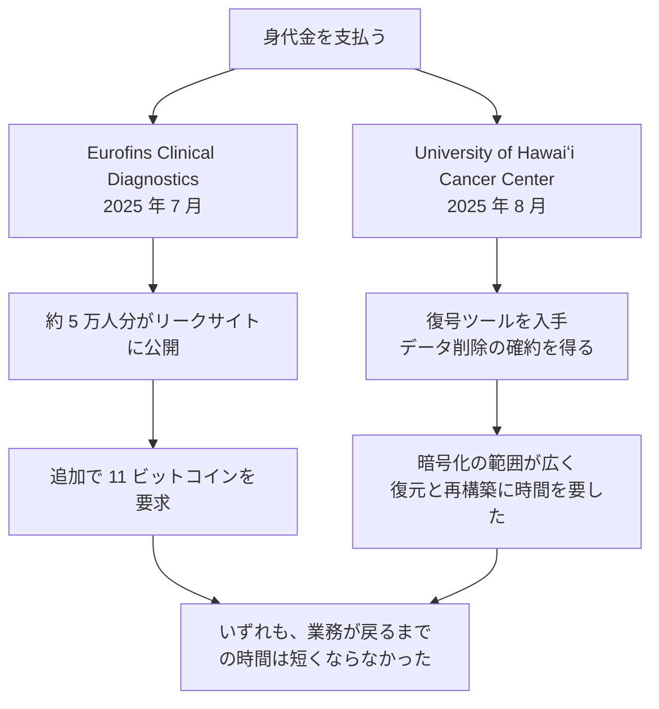
```mermaid
flowchart TD
    P["身代金を支払う"] --> E1["Eurofins Clinical Diagnostics<br>2025 年 7 月"]
    P --> U1["University of Hawaiʻi Cancer Center<br>2025 年 8 月"]
    E1 --> E2["約 5 万人分がリークサイトに公開"]
    E2 --> E3["追加で 11 ビットコインを要求"]
    U1 --> U2["復号ツールを入手<br>データ削除の確約を得る"]
    U2 --> U3["暗号化の範囲が広く<br>復元と再構築に時間を要した"]
    E3 --> R["いずれも、業務が戻るまでの時間は短くならなかった"]
    U3 --> R
```

**分析**：支払った 2 件は、支払いの後に起きたことが逆になっている。
Eurofins Clinical Diagnostics では公開が止まらず、追加の要求を受けた。
University of Hawaiʻi Cancer Center では削除の確約を得たが、復号ツールを得てもなお復元に時間がかかった。
支払いで得られるのは、公開の停止や復号鍵といった攻撃者側の行為であり、いずれも約束の履行は攻撃者に委ねられる。
業務が戻るまでの時間は、そのどちらでも短くならない。
支払いを検討する組織が見積もるべきは、支払った後に残る復元と再構築の期間である。

**分析**：要求額の平均が前年から 8 割以上下がった一方で、支払いが確認されたのは 2 件である。
要求額の低下を「払いやすくなった」と読むと、公表されている事実と合わない。
公表される要求額は、攻撃グループがリークサイトで金額を明示する場合に限られる。
Comparitech も、Medusa と Rhysida が表に多く現れるのは要求額を必ず開示するためであり、要求額が高いためではないと注記している。
平均値は、金額を公開する運用を持つグループの分布を映している。

**分析**：支払率の低下と、支払っても公開が止まらなかった事例は、同じ方向を指している。
ただし支払率が下がった理由を「復旧できるようになったから」とは読めない。
同じ 2025 年に、Sophos ではバックアップからの復旧が 72%から 51%へ下がり、警察庁の集計でも復元できた組織は 2 割にとどまる。
二つの数字は母集団が違う（前者は 17 か国の医療分野の標本、後者は国内の全業種の被害報告）ため、水準を比べることはできない。
比べられるのは向きだけである。
復旧手段が細ったまま支払いも減っているなら、残るのは復旧しないまま業務を作り直す期間である。
[GL-2025-14 Centre Hospitalier Intercommunal de Haute-Comté](../global/2025-timeline.md#GL-2025-14)の 1 年以上の再構築は、その期間が具体的にどれだけ伸びるかを示している。

## 電子処方箋の医薬品コードの設定不備と全国一斉点検

2025 年に医療 DX の基盤で表面化したのは、攻撃ではなく、医薬品コードの対応づけの不備である。
本リポジトリはサイバー攻撃として収録していないが、全国の基盤で 1 年をかけて解けなかった事象であるため、ここに記す。

**事実**：医師の処方と異なる医薬品名が薬局側のシステムに表示される事例などが、令和 6 年 12 月 19 日までに 7 件報告された。
厚生労働省は設定の点検を促す周知を行う間、同月 20 日から 26 日までの 7 日間、医療機関からの電子処方箋の発行を停止した。
令和 6 年 11 月に電子処方箋を発行していた医療機関 2539 件のうち 5 件を残して確認を終え、27 日に再開した。

**事実**：原因は、医療機関と薬局が自組織で使うハウスコードと、電子処方箋管理サービスが受け付けるコード（YJ コード、レセプト電算処理システム用コード、一般名コード）との対応づけの誤りである。
登録されていない医薬品のためのダミーコードが誤って使われた事例も含まれる。

**事実**：令和 7 年 2 月 23 日時点で点検完了として公表されたのは、令和 6 年 11 月に電子処方箋を発行していた医療機関のうち 2421 件（約 95%）、電子処方箋システムを運用している薬局 4 万 1030 件のうち 3 万 823 件（約 75%）、システムベンダ 126 件のうち 123 件（約 98%）である。

**事実**：厚生労働省は、この事象が電子処方箋管理サービス側のシステム改修では防止できず、医療機関と薬局の個別の点検が引き続き必要であるとしている。
未点検の施設には郵送と架電で点検報告を依頼したうえで、令和 7 年 12 月 17 日に、令和 8 年 1 月 8 日 17 時時点で点検未報告の医療機関と薬局について、令和 8 年 1 月 11 日を目途に電子処方箋管理サービスへの接続を一時停止すると公表した。

```mermaid
flowchart LR
    A["医療機関のマスタ<br>ハウスコードと規定コードの対応づけ"] -->|誤った対応づけ| B["電子処方箋<br>管理サービス"]
    B -->|規定コードとしては正常に通過| C["薬局のマスタ"]
    C --> D["処方と異なる<br>医薬品名の表示"]
    B -.->|中央の改修では届かない| A
    B -.->|中央の改修では届かない| C
```

**分析**：中央のサービスは、規定のコードとして正しい値を受け取っている。
誤りは末端の対応づけにあり、中央から見ると正常な処方と区別がつかない。
中央の改修で防げないと厚生労働省が述べているのは、この位置関係による。

**分析**：接続の一時停止は、可用性を落として安全側に倒す判断である。
本リポジトリが確認した範囲では、医療 DX の基盤で、点検に応じない施設を切り離す措置に前例はない。
全国基盤に接続している医療機関と薬局にとって、点検や報告の依頼に応じないことが接続を失う事由になりうる段階に入った。

### 接続の一時停止の実施と結果

**事実**：厚生労働省医薬局総務課長通知（医薬総発 1217 第 1 号、令和 7 年 12 月 17 日）は、令和 8 年 1 月 8 日 17 時までに点検報告が済んでいない医療機関と薬局を対象に、同月 11 日を目途に関連サービスの接続停止措置を講ずるとした。
同通知により、令和 6 年 12 月 26 日と令和 7 年 8 月 21 日の 2 本の通知は廃止され、「電子処方箋点検対応済みの医療機関・薬局リスト」の公表も令和 8 年 1 月 15 日を目途に終了することとされた。
接続停止を受けた施設は、点検報告の旨とともに利用申請を行えば、新規の利用申請と同じ手続きで再開できる。

**事実**：同通知は、この措置に先立つ技術的な手当てとして、事象の主因だったダミーコードを電子処方箋管理サービスへ登録できないようにする改修を令和 7 年 8 月 28 日に実施したこと、削除された一般名コードへの対応と、YJ コードおよびレセプト電算処理システム用コードの廃止年月日の調整を行ったことを記している。

**事実**：第 9 回電子処方箋等検討ワーキンググループの資料（令和 8 年 3 月 19 日）は、令和 8 年 1 月 11 日に点検未報告の医療機関と薬局の接続を一時停止したこと、同日以降は点検報告が完了した施設のみが接続できる取扱いへ変更されたことを報告している。
同資料は、この変更により、それまで原則としていた紙の処方箋による発行等の運用を通常運用へ戻したこと、単位変換係数の設定誤りに起因する事象の報告がないことを記している。
停止の対象となった施設数は、同資料にも厚生労働省の公表資料にも記載がない。

**事実**：同ワーキンググループは、ハウスコードとダミーコードが生まれた背景として、主要な医薬品コードの関係性を整理したマスタが国から提供されていなかったことを挙げ、令和 8 年 4 月頃から電子処方箋管理サービス内で使用している医薬品マスタを公開し、国がその維持管理を担う方針を示した。

**分析**：措置は予告どおり実施され、以後は点検の完了が接続の要件になった。
公表されたのは取扱いの変更であり、何施設が切り離されたかは示されていない。
接続を絞る措置の効果を外から検証するには停止件数が要るが、その数字は現時点で公表資料に存在しない。

**分析**：一連の対応は、中央では防げないと説明されていた事象に対して、二段階で手当てを打った形になっている。
第一段階が末端の点検で、第二段階が中央側の登録拒否とマスタの国による提供である。
ダミーコードを登録できなくする改修は、末端の設定が誤っていても中央で弾ける範囲を作った。
マスタの提供は、各施設が独自のコードを作る動機そのものを減らす。
末端の運用に依存した状態を、期限を切った点検と接続停止で持ちこたえさせ、その間に中央側の仕組みを作り替えたという順序になる。

**一次情報**

- [電子処方箋](https://www.mhlw.go.jp/stf/denshishohousen.html)（厚生労働省）
- [第 4 回電子処方箋推進会議 資料](https://www.mhlw.go.jp/stf/newpage_53163.html)（令和 7 年 3 月 3 日。資料 1「電子処方箋の現況と令和 7 年度の対応」）
- [第 5 回電子処方箋推進会議 資料](https://www.mhlw.go.jp/stf/newpage_64006.html)（令和 7 年 9 月 29 日）
- [電子処方箋を安全に運用できる仕組み・環境の整備のための措置について（PDF）](https://www.mhlw.go.jp/content/11120000/001625892.pdf)（医薬総発 1217 第 1 号、令和 7 年 12 月 17 日）
- [第 8 回電子処方箋等検討ワーキンググループ 資料（PDF）](https://www.mhlw.go.jp/content/11121000/001619188.pdf)（令和 7 年 12 月 23 日）
- [第 9 回電子処方箋等検討ワーキンググループ 資料（PDF）](https://www.mhlw.go.jp/content/11121000/001668909.pdf)（令和 8 年 3 月 19 日）

## 規制と制度の動き

### 国内

**事実**

| 時期 | 動き | 対象 |
|---|---|---|
| 2025 年 5 月 14 日 | 厚生労働省が令和 7 年度版「医療機関におけるサイバーセキュリティ対策チェックリスト」と、事業者向けを含むマニュアルを公表。パスワードの使い回しへの対応、USB メモリ等の利用への対応、二段階認証の導入が追加された | 病院系、医療関連事業者 |
| 2025 年 7 月 31 日時点 | 経済安全保障推進法にもとづく特定社会基盤事業者は 257 者。この時点で医療分野は制度の対象に含まれていない（厚生労働省 社会保障審議会医療部会 資料） | 病院系、医療関連事業者 |
| 2025 年 11 月 | 日本医師会が「医療機関におけるサイバーセキュリティ対策チェックリストの実践ガイド」を発行 | 病院系 |

詳細は [国内のガイドラインと法規制](../../../guidelines/japan.md) を参照してほしい。

### 海外

**事実**

| 時期 | 動き | 対象 |
|---|---|---|
| 2025 年 1 月 15 日 | 欧州委員会が「病院と医療提供者のサイバーセキュリティに関する欧州行動計画」を発表。ENISA 内の支援センター、EU 全域の早期警戒サービス、中小の医療機関向けのサイバーセキュリティバウチャー、医療向けインシデント対応プレイブックを掲げた。EU 加盟国が 2023 年に報告した医療分野の重大インシデントは 309 件で、重要インフラの分野として最多だった | 病院系 |
| 2025 年 3 月 27 日 | 英国の情報コミッショナー事務局（ICO）が、NHS の供給者である Advanced Computer Software Group に 307 万 6320 ポンドの制裁金を科した。2022 年 8 月の LockBit による侵害で、多要素認証が設定されていない顧客アカウントが経路となり、7 万 9404 人の情報が危険にさらされた | 医療関連事業者 |
| 2025 年 6 月 5 日 | ICO が 23andMe に 231 万ポンドの制裁金を科した。2023 年のクレデンシャルスタッフィングで、英国利用者 15 万 5592 人分の遺伝子データが保護されていなかった | 医療関連事業者 |
| 2025 年 2 月 13 日 | イタリアのデータ保護監督機関（Garante）が、2023 年 5 月に Monti のランサムウェア被害を受けた ASL 1 Avezzano-Sulmona-L'Aquila について、個人データの取扱いを違法と認定する措置を公表した | 病院系 |
| 2025 年 3 月 6 日 | 台湾の衛生福利部が、H-ISAC を通じて「医院のランサムウェア攻撃対応指針」を配布した。同月 20 日に改訂。2 件の連続した被害を「系統的な攻撃」と定義した 2 日後の配布である | 病院系 |
| 2025 年 7 月 22 日 | CISA、FBI、HHS、MS-ISAC が、Interlock ランサムウェアに関する共同勧告（AA25-203A）を発出した。初期侵入は正規サイトを経由したドライブバイダウンロードと、ClickFix と呼ばれる手口による | 病院系、医療関連事業者 |

**分析**：Advanced への制裁は、被害者となった委託先に対して監督当局が制裁を科した例である。
攻撃を受けたこと自体ではなく、多要素認証の欠落という措置の不備が処分の理由になっている。
医療機関が委託先を選ぶとき、被害の有無だけでなく、当局が何を不備と判断したかを見る材料になる。

台湾とイタリアの動きは、方向が逆である。
台湾は 2 件目の被害の直後に他院向けの指針を配り、次の被害を減らす方向へ動いた。
イタリアは 2 年近く前の被害について、取扱いの違法性を認定して責任の所在を確定させた。
どちらも必要な機能だが、被害を受けた医療機関にとって直後に効くのは前者である。

## 前年との差分

**分析**：2024 年に海外で現れた「医療の中間層が止まると診療が回らない」という構図が、2025 年には二つの方向へ分かれた。
一つは[GL-2025-11 Eurofins Clinical Diagnostics NMDL](../global/2025-timeline.md#GL-2025-11)や[GL-2025-05 Compumedics](../global/2025-timeline.md#GL-2025-05)のように、検査と機器の事業者から患者情報が漏れる方向である。
もう一つは[GL-2025-07 DaVita](../global/2025-timeline.md#GL-2025-07)のように、治療そのものを担う事業者が狙われる方向である。
前者では医療機関のネットワークが健全でも患者情報が漏れ、後者では中断できない治療を続けながら復旧する必要が生じる。

2024 年の[GL-2024-03 Synnovis](../global/2024-timeline.md#GL-2024-03)については、2025 年 6 月に、検査結果の待ち時間が主要因の一つとなって患者 1 名が死亡したことが公表された。
サイバー攻撃と患者の死亡の関係を、当事者側の調査として認めた数少ない記録である（詳細は[海外の履歴の過年度の節](../global/2025-timeline.md#過年度に発生し2025-年に動きがあった事案)）。

国内では、[JP-2024-01 岡山県精神科医療センター](../japan/2024-timeline.md#JP-2024-01)の調査報告書が 2025 年 2 月に公表され、[JP-2022-01 大阪急性期・総合医療センター](../japan/2022-timeline.md#JP-2022-01)については 2025 年 8 月に 10 億円の解決金で合意したことが報じられた。
被害の費用が発注元と受注側のどちらに帰属するかという論点が、医療情報システムの調達契約の書き方に及び始めている。

収録の範囲を広げた結果、2024 年までは見えていなかった二つの型が 2025 年に加わった。
一つは、物流と製造の停止によって医療の現場に影響が及ぶ型である（[JP-2025-14 アスクル](../japan/2025-timeline.md#JP-2025-14)、[JP-2025-11 ホスピタルサービス](../japan/2025-timeline.md#JP-2025-11)、[GL-2025-22 Masimo](../global/2025-timeline.md#GL-2025-22)、[GL-2025-16 New York Blood Center Enterprises](../global/2025-timeline.md#GL-2025-16)）。
情報は漏れず、診療記録も暗号化されないが、物が届かないことで診療が細る。
もう一つは、患者自身が使うポータルやベンダの移行環境といった、医療機関のネットワークの外にある基盤が狙われる型である（[GL-2025-28 Manage My Health](../global/2025-timeline.md#GL-2025-28)、[GL-2025-15 Oracle Health](../global/2025-timeline.md#GL-2025-15)）。
医療機関の資産台帳に載らない場所に、自院の患者の記録が置かれている。

## 調べた結果、確認できなかったもの

2026 年 8 月時点で調べ直した結果を記す。
調べた範囲で見つからなかったことは、存在しないことを意味しない。

**国内の製薬企業系の事案**。
製薬企業、医薬品卸、CRO を対象に探したが、2025 年に発生した事案で当事者の公表資料に到達したものはない。
調査の過程で確認できた医薬品卸の直近の公表は、2026 年 4 月から 5 月の株式会社マルタケであり、2025 年の対象ではない。
製薬企業に近い事案としては[JP-2025-17 近江屋](../japan/2025-timeline.md#JP-2025-17)があるが、被害を受けた当事者は保険代理業であり、本リポジトリの区分では医療関連事業者に置いている。

**個人情報保護委員会の漏えい等報告における医療分野の件数**。
令和 7 年度の年次報告と、令和 7 年度の各四半期報告を確認したが、業種別の件数は掲載されていない。
委員会が公表する分類軸は、報告義務の該当事由、漏えいした人数、情報の種類、情報の形態である。
医療分野については「要配慮個人情報を含む漏えい等の大半は病院や薬局における誤交付」という文章による記述のみで、件数と割合は取り出せない（詳細は[個人情報保護委員会の漏えい等報告](#個人情報保護委員会の漏えい等報告国内)）。

**Oracle Health の対象人数の総数**。
2026 年 8 月時点でも公表されていない。
確認された医療システムは 2026 年 7 月時点で少なくとも 17 件へ増え、通知を開始した施設は侵入から 16 か月後にも現れている。
届出の単位が医療機関ごとに分かれているため、総数を出す主体が制度上どこにも置かれていない（詳細は[通知の主体](#oracle-health-で通知の主体が分かれた経路)）。

**電子処方箋管理サービスの接続を一時停止された施設数**。
措置は令和 8 年 1 月 11 日に実施されたが、対象となった施設数は、厚生労働省の通知にも第 9 回電子処方箋等検討ワーキンググループの資料にも記載がない（詳細は[接続の一時停止の実施](#接続の一時停止の実施と結果)）。

**ENISA による 2025 年の医療分野の脅威動向**。
ENISA が医療分野に限って公表した脅威動向は 2023 年 7 月のものが最新で、対象期間は 2021 年 1 月から 2023 年 3 月である。
2025 年を対象とする医療分野専用の集計は見つからなかった。
全分野を対象とする Threat Landscape 2025 に医療の項目はあるが、分野横断の集計における比率として示されるにとどまる。

**国内の個別事例における身代金の支払い有無**。
本リポジトリが収録した 2025 年の国内 17 件のサイバー攻撃のうち、支払いの有無を当事者が公表したものはない。
国内で支払わなかったことを当事者が明示した医療機関の事例は、[半田病院](../japan/2021-timeline.md#JP-2021-01)（2021 年）と[大阪急性期・総合医療センター](../japan/2022-timeline.md#JP-2022-01)（2022 年）まで遡る。

**警察庁の統計における医療、福祉分野の内訳**。
令和 7 年の年次報告に医療、福祉の区分はなく、業種別の「その他」24 件に含まれる。
年次報告と統計データが公表する粒度では、この内訳は取り出せない。

**国内の身代金の支払いに関する集計**。
警察庁は被害組織から支払いの有無を含む情報の提供を求めているが、件数や割合の公表はない。
他に、国内で医療分野の支払い状況を集計した公的な統計は見つからなかった。

**中東、南米、アフリカ、南アジアの事案の一次情報**。
これらの地域で 2025 年に医療分野の被害として表に出ているものは、攻撃グループのリークサイトでの主張と、それを扱ったセキュリティベンダの調査が主である。
確認したのは、ブラジルの医療系ソフトウェア事業者 MedicSolution（2025 年 9 月に KillSec が犯行を主張し、同グループはペルーの Suiza Lab、コロンビアの GoTelemedicina と eMedicoERP についても主張している）と、南アフリカの Mediclinic Southern Africa（2025 年 5 月に Everest が犯行を主張し、対象は従業員データとされる）である。
いずれも**報道ベース**であり、当事者または監督機関の公表資料に到達していない。
出所は [Infosecurity Magazine](https://www.infosecurity-magazine.com/news/killsec-ransomware-hits-brazilian/) と [CyberInsider](https://cyberinsider.com/everest-ransomware-group-hits-5b-hospital-chain-mediclinic-threatens-data-leak/) である。

**ドイツの大規模病院、スペインとイタリアの個別の医療機関**。
ドイツについては、[GL-2025-12 AMEOS Gruppe](../global/2025-timeline.md#GL-2025-12) と [GL-2025-32 LUP-Kliniken](../global/2025-timeline.md#GL-2025-32) の 2 件で当事者公表に到達している。
職能団体を含めると、[GL-2025-91 Hessischer Apothekerverband](../global/2025-timeline.md#GL-2025-91)、[GL-2025-92 Sächsische Landesärztekammer](../global/2025-timeline.md#GL-2025-92)、[GL-2025-93 Verband medizinischer Fachberufe](../global/2025-timeline.md#GL-2025-93) の 3 件が加わる。
一方で、KRITIS の対象となる大規模病院で 2025 年に当事者が経緯を公表した事案には到達していない。
スペインは 2025 年の個別事案の一次情報に到達していない。
イタリアは、[規制と制度の動き](#海外)に記した Garante の措置（ASL 1 Avezzano-Sulmona-L'Aquila）が、2025 年に公表された当局側の資料である。
なお、ドイツの複数の大学病院に及んだ請求代行事業者 unimed の事案は 2026 年 4 月の発生であり、[2026 年](2026-summary.md)の対象である。

**分析**：本ページの収録が米国、欧州、東アジア、豪州に偏っているのは、収集の偏りだけによるものではない。
届出と公表を義務づける仕組みがある地域では事案が数えられる。
米国の HHS OCR の届出ポータル、フランスの CERT Santé の届出制度、EU の NIS2 がその例である。
そうした仕組みがない地域では、攻撃グループの主張が唯一の記録として残る。
収録件数の地域差を被害の地域差として読むと、公表制度の分布を被害の分布と取り違える。

---

[← 2024 年](2024-summary.md) | [国内の履歴](../japan/2025-timeline.md) | [海外の履歴](../global/2025-timeline.md) | [インシデント事例集](../README.md) | [2026 年 →](2026-summary.md) | [トップへ](../../../../README.md)
