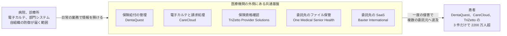

# 📅 2026 年の情勢（国内と海外）

> [!IMPORTANT]
> **進行中の年である。**
> 一次情報が確定していない事案は収録していない。
> 速報は [月報](../../../../monthly-reports/) に記録し、経緯が確定したものを本ページと履歴（[国内](../japan/2026-timeline.md)、[海外](../global/2026-timeline.md)）へ繰り上げる。

> [!NOTE]
> 本ページの集計は、断りのない限り**本リポジトリに収録した事例**を母集団とする。
> 国内および世界で発生した被害の全数ではない。

## その年の要点

**分析**：国内では制度側の変化が集中した年である。
医療分野が経済安全保障推進法の基幹インフラ制度に加わり、ガイドラインが第 7.0 版へ改定された。
AI の性能向上を前提とした注意喚起も、重要インフラ事業者に対して発出されている。

被害事例の側では、国内で 9 月 2 日時点までに 15 件のサイバー攻撃と 21 件のその他の事案を、海外で 87 件のサイバー攻撃と 5 件のその他の事案を収録した。

**分析**：国内と海外で、被害の現れ方が分かれている。

国内の病院系 6 件のうち、電子カルテまで到達されたのは [JP-2026-02 白梅豊岡病院](../japan/2026-timeline.md#JP-2026-02) の 1 件である。
[JP-2026-01 日本医科大学武蔵小杉病院](../japan/2026-timeline.md#JP-2026-01)（ナースコールシステム）、[JP-2026-04 東北大学病院](../japan/2026-timeline.md#JP-2026-04)（治験業務の NAS）、[JP-2026-05 九州大学病院](../japan/2026-timeline.md#JP-2026-05)（研究室の端末）、[JP-2026-11 日本美容医療研究機構](../japan/2026-timeline.md#JP-2026-11)（クラウドサーバ）、[JP-2026-16 医療法人鳳應会グループ](../japan/2026-timeline.md#JP-2026-16)（ウェブ基盤）は、いずれも診療系の外側にある資産が侵害されている。

本年に国内で救急の停止に至った事案は、当初サイバー攻撃が疑われた市立奈良病院である。
奈良市の専門家会議は 8 月 31 日の報告書で、外部からのサイバー攻撃ではなく、セキュリティ監視装置の自動遮断が連鎖したことによると結論づけた（[JP-2026-S21](../japan/2026-timeline.md#JP-2026-S21)）。
本ページの集計では、この事案をサイバー攻撃ではなくシステム障害として数えている。

分離が効いた結果とも読めるが、分離された区画は監視と資産管理の外に置かれやすい。
本年の 4 件は、いずれも端末の不具合や不審な挙動が覚知の端緒であり、区画の内側を継続的に見ていた形跡は公表されていない。

海外では、診療の停止が施設単位ではなくシステム単位で広がっている。
[GL-2026-26 AnMed](../global/2026-timeline.md#GL-2026-26) は 106 施設のうち 83 施設を一時閉鎖し、10 日後の 8 月 5 日時点でも 10 施設が再開できていない。
[GL-2026-05 University of Mississippi Medical Center](../global/2026-timeline.md#GL-2026-05) は透析を除く州内の外来を 2 月 20 日から 3 月 2 日まで閉じた。
[GL-2026-14 Signature Healthcare Brockton Hospital](../global/2026-timeline.md#GL-2026-14) は紙運用を 3 週間超続け、化学療法の点滴を中止した。
いずれも救急と入院を維持し、予約診療を止めている。
紙運用で吸収できる患者数の上限が、止める順序を決めている。

### 供給が止まる型が製造側で顕在化した

**分析**：本年の海外の特徴は、患者情報ではなく供給が被害の中心になった事案が製薬企業系と医療機器メーカで続いたことである。

[GL-2026-58 Stryker](../global/2026-timeline.md#GL-2026-58) は端末管理基盤（Microsoft Intune）を悪用され、受注と出荷が約 3 週間止まった。
患者ごとに仕様が決まるインプラントの出荷が遅延しており、在庫では吸収できない。
[GL-2026-43 West Pharmaceutical Services](../global/2026-timeline.md#GL-2026-43) は注射剤の容器と投与デバイスを供給する企業で、世界の複数拠点で製造と入出荷が止まった。
同社の停止は、同社の顧客である製薬企業の製造に及ぶ。

一方で [GL-2026-76 Baxter International](../global/2026-timeline.md#GL-2026-76) は、委託先の SaaS から約 710 万件が持ち出されたと主張されながら、供給と患者向けサービスは止まっていない。
医療機器メーカへの攻撃は、情報を取る型と製造を止める型に分かれる。
どちらを想定するかで、医療機関の側が備える内容も変わる。

### 医療の外側にある共通基盤が入口になっている

**分析**：本年の大規模な流出は、診療システムではなく、複数の組織が共通して使う基盤で起きている。

- [GL-2026-67 DentaQuest](../global/2026-timeline.md#GL-2026-67)：**1500 万人**。保険給付の管理事業者
- [GL-2026-60 CareCloud](../global/2026-timeline.md#GL-2026-60)：**375 万 6469 人**。電子カルテと請求処理の事業者。同社の AWS 環境
- [GL-2026-50 TriZetto Provider Solutions](../global/2026-timeline.md#GL-2026-50)：**343 万人**。保険資格確認と請求処理
- [GL-2026-69 One Medical Senior Health](../global/2026-timeline.md#GL-2026-69)：委託先のファイル保管環境
- [GL-2026-76 Baxter International](../global/2026-timeline.md#GL-2026-76)：委託先の SaaS

[GL-2026-07 NYC Health + Hospitals](../global/2026-timeline.md#GL-2026-07) の 180 万人も、委託先の侵害を経由している。
医療機関が自組織の防御をどれだけ固めても、これらの経路には届かない。
契約の時点で、侵害時の通知の期限と範囲、および委託先が保持する情報の範囲を決めておく以外に打つ手がない（[外部から見た自組織の攻撃面](../../../practice/attack-surface.md)）。

同じ攻撃者（ShinyHunters）が、DentaQuest、One Medical Senior Health、Baxter International の三者で到達を主張している。
狙われているのは業種ではなく、業種を横断して使われる基盤である。

国内でも同じ構造が現れている。
歯科医院のフランチャイズを運営する [JP-2026-10 ホワイトエッセンス](../japan/2026-timeline.md#JP-2026-10) は、予約サイトと基幹システムを 2026 年 8 月 12 日に停止した。
止まったのは本部の基盤であり、加盟する歯科医院それぞれの設備ではない。
それでも全加盟院の予約受付が同時に止まっている。
海外の事例が患者情報の流出として現れたのに対し、国内のこの件は診療の入口の停止として現れた。
共通基盤の侵害は、情報の流出か業務の停止のどちらかで表面化し、どちらになるかは基盤が担う機能で決まる。

### 委託先の作業者と、正規の管理機能

**分析**：攻撃を伴わない到達も、本年は規模が大きい。

[GL-2026-S01 香港の醫院管理局](../global/2026-timeline.md#GL-2026-S01) では、保守を受託した事業者の開発者が、手術室のシステムの保守作業中に内部規程に反してデータを私物のパソコンへ取り込み、5 万 6000 人超が流出した。
当局はサイバー攻撃ではないと明言している。
国内の [JP-2026-S02 多根総合病院](../japan/2026-timeline.md#JP-2026-S02)（委託先が所有する USB メモリの紛失）と構図が重なる。
院内の職員を対象にした規程だけでは、委託先が持ち込む端末と媒体を覆えない。

[GL-2026-58 Stryker](../global/2026-timeline.md#GL-2026-58) は、マルウェアを使わず、正規の端末管理機能でコマンドを配布されている。
管理基盤は、全端末へ設定を配る仕組みそのものであり、掌握されれば配布の速度と範囲が被害の速度と範囲になる。
検知の設計を「悪意のあるファイルを見つける」に寄せていると、この経路は掛からない（[ログと監視の設計](../../../technology/logging.md)）。

### 国内は攻撃以外の経路が件数で上回っている

**分析**：国内の収録 35 件のうち、サイバー攻撃は 15 件、攻撃を伴わない事案は 20 件である。
病院系に限ると、攻撃 6 件に対してその他が 19 件で、3 倍の開きがある。
公表の慣行の差が件数に効いている点を差し引いても、患者情報が外へ出る経路は攻撃だけではない。

その他の 19 件のうち、院外の事業者が関わるものが 5 件ある。
委託先が所有する USB メモリの紛失（[JP-2026-S02 多根総合病院](../japan/2026-timeline.md#JP-2026-S02)）、廃棄を委託したハードディスクの転売（[JP-2026-S09 北海道医療センター、北海道がんセンター](../japan/2026-timeline.md#JP-2026-S09)、[JP-2026-S18 新札幌豊和会病院](../japan/2026-timeline.md#JP-2026-S18)）、委託先が管理する診断用機器の紛失（[JP-2026-S15 東邦大学医療センター大森病院](../japan/2026-timeline.md#JP-2026-S15)）、取引事業者の社員による手術室での撮影（[JP-2026-S20 大阪公立大学医学部附属病院ほか 9 医療機関](../japan/2026-timeline.md#JP-2026-S20)）である。
いずれも院内のネットワークと認証の設計では止まらない。
情報が院外の事業者の手に渡る局面を工程として書き出し、そこに確認を置けるかどうかが分かれ目になる。

### 廃棄した媒体が同じ経路で戻ってきている

**事実**：本年の国内では、廃棄を委託したハードディスクがインターネットオークションへ出品された事案が 2 件公表された。
[JP-2026-S09](../japan/2026-timeline.md#JP-2026-S09) は国立病院機構の 2 施設で、対象となりうる最大の範囲は約 51 万人である。
[JP-2026-S18](../japan/2026-timeline.md#JP-2026-S18) は新札幌豊和会病院で、国立病院機構が回収した媒体に同院のものが混ざっていたことで発覚した（対象を 4721 名とする件数は**報道ベース**である）。
同じ処理事業者を経由して、北海道庁の 697 名分も流出したと報じられている（**報道ベース**）。

**分析**：委託した側は、いずれも破砕の不履行を自力で検知できていない。
発覚の端緒は、落札者からの連絡と、別の組織の回収作業である。
廃棄の工程で委託元が検証できるのは、媒体が院外へ出る前の状態だけである。
[JP-2026-S19 国立国際医療センター](../japan/2026-timeline.md#JP-2026-S19) が再発防止策として「原則として院内で物理的に破壊し、複数名で読み出し不能を確認する」を挙げているのは、この点に対応している（[記憶媒体の廃棄と機器の下取り](../../../technology/media-disposal.md)）。

もう一つの共通点は、媒体が診療の記録として管理されていなかったことである。
[JP-2026-S19](../japan/2026-timeline.md#JP-2026-S19) の 8 万 3007 名分は、心機能の検査機器に内蔵されたハードディスクへ 25 年分蓄積されていた。
[JP-2026-S15](../japan/2026-timeline.md#JP-2026-S15) のペースメーカプログラマも、記憶媒体ではなく診断用の機器として扱われている。
媒体の管理台帳の対象を「パソコンと USB メモリ」に置いていると、機器の内部に溜まる情報は数えられない（[医療機器のセキュリティ](../../../technology/medical-devices/)）。

### SNS への投稿が短期間に 4 件公表された

**事実**：国内では、職員が撮影した院内の画像や動画を SNS へ投稿した事案が、2026 年 3 月から 4 月にかけて 4 件公表された。
佐田病院（入院患者 1 名のカルテ画像）、福岡山王病院（看護師自身の受診に関する電子カルテの画面）、[武蔵野徳洲会病院](../japan/2026-timeline.md#JP-2026-S13)（動画に映り込んだ患者 48 名の氏名）、芳野病院（院内で撮影した患者と本人の写真）である（[国内の履歴](../japan/2026-timeline.md) の JP-2026-S10、S11、S13、S14）。

**分析**：4 件に共通するのは、投稿の時点でも院内では何も起きていないことである。
撮影は院内で行われるが、情報が出るのは院外の基盤の上であり、しかも 3 件は限定公開または一定時間で消える機能を使ったうえで第三者の転載によって広がっている。
医療機関が持つ統制の手段は、この経路のどこにも掛からない。

そのため、4 件とも発覚は外部からの指摘か職員の申告に依っている。
うち 2 件は 2025 年 1 月の投稿が 2026 年に発覚したもので、投稿から発覚まで 1 年以上ある。
各院が挙げた対策は研修の実施と規程の見直しで、[JP-2026-S13](../japan/2026-timeline.md#JP-2026-S13) は非常勤と派遣を含む全職員 636 名の受講完了を公表した。
教育以外の手段が公表資料に現れないのは、撮影と投稿を院内で検知する方法が実際に乏しいためだと読める。

## 収録事例の集計

| 区分 | 国内（攻撃） | 国内（その他） | 海外（攻撃） | 海外（その他） |
|---|---|---|---|---|
| 病院系 | 6 | 20 | 41 | 1 |
| 製薬企業系 | 2 | 1 | 6 | 0 |
| 医療関連事業者 | 7 | 0 | 40 | 4 |

国内のその他の事案 21 件の類型別の内訳は、機器と記憶媒体の紛失、盗難が 6 件、委託先の管理不備による漏えいが 5 件、誤送付、誤公開、操作ミスが 4 件（いずれも SNS への投稿）、内部不正が 3 件、サポート詐欺が 1 件、システム障害が 1 件、ドメインの失効が 1 件である。
海外のその他の事案 5 件は、委託先の管理不備による漏えいが 2 件、誤送付と誤公開が 2 件、内部不正が 1 件である。

海外の収録が国内より一桁多いのは、被害の多寡ではなく公表の慣行と制度の差による。
米国では影響人数 500 人以上の医療情報の侵害が HHS OCR への届出として一覧化され、組織名と件数が機械可読の形で公開される。

進行中の年であり、2026 年 9 月 2 日時点までの集計である。

## 外部統計

| 統計 | 地域 | 参照先 | 本リポジトリでの集計状況 |
|---|---|---|---|
| ランサムウェア被害の報告件数（業種別、半期ごと） | 国内 | [警察庁 サイバー空間をめぐる脅威の情勢等](https://www.npa.go.jp/publications/statistics/cybersecurity/index.html) | 未集計 |
| 個人情報の漏えい等報告 | 国内 | [個人情報保護委員会](https://www.ppc.go.jp/) | 下記に令和 7 年度第 4 四半期の件数を引用 |
| 米国の医療情報侵害の届出（500 人以上） | 海外 | [HHS OCR Breach Portal](https://ocrportal.hhs.gov/ocr/breach/breach_report.jsf) | 下表に月別の件数と人数を掲げる |
| 医療分野のランサムウェア攻撃件数 | 海外 | [Comparitech Healthcare Ransomware Roundup](https://www.comparitech.com/news/healthcare-ransomware-roundup-h1-2026-stats-on-attacks-ransoms-and-data-breaches/) | 下記に上半期の集計を引用 |
| 医療分野の脅威情報 | 海外 | [HHS HC3](https://www.hhs.gov/about/agencies/asa/ocio/hc3/index.html) | 未集計 |
| 欧州の医療分野の脅威動向 | 海外 | [ENISA Health Threat Landscape](https://www.enisa.europa.eu/) | 未集計 |

### 個人情報保護委員会への漏えい等報告（国内）

**事実**：個人情報保護委員会が 2026 年 6 月 10 日の第 359 回委員会へ提出した「令和 7 年度第 4 四半期における漏えい等報告の処理状況」（資料 3-2）である。
対象期間は 2026 年 1 月から 3 月にあたる。

| 区分 | 第 1 四半期 | 第 2 四半期 | 第 3 四半期 | 第 4 四半期 |
|---|---|---|---|---|
| 個人情報（総計） | 5652 件 | 4528 件 | 4635 件 | **4602 件** |
| うち個人情報取扱事業者 | 5007 件 | 3916 件 | 4086 件 | 4130 件 |
| うち国の行政機関等 | 55 件 | 76 件 | 56 件 | 61 件 |
| うち地方公共団体等 | 590 件 | 536 件 | 493 件 | 411 件 |
| 特定個人情報（総計） | 104 件 | 102 件 | 95 件 | **91 件** |

報告対象事態の該当要件別（個人情報取扱事業者、第 4 四半期）は、第 1 号（要配慮個人情報）が **2388 件（57.8 パーセント）**、第 3 号（不正の目的）が 1059 件（25.6 パーセント）、第 2 号（財産的被害が生じるおそれ）が 980 件（23.7 パーセント）、第 4 号（千人超）が 166 件（4.0 パーセント）である。
複数の要件に該当する事案があるため、合計は 100 パーセントを超える。

同資料は、要配慮個人情報を含む個人データの漏えい等が引き続き多く生じており、**これらの大半は病院や薬局における誤交付によるもの**であると記している。

**分析**：報告の最多区分は要配慮個人情報で、その大半が病院と薬局の誤交付である。
つまり、法令に基づく報告の母集団では、医療は件数の主役に位置する。
一方、本リポジトリが収録できるのは組織名とともに公表された事案に限られ、国内は 8 月時点で 35 件である。
桁が二つ違う。

誤交付は 1 件あたりの対象が少なく、公表と報道の対象になりにくい。
収録事例が攻撃と大規模な紛失に偏るのは、被害の分布ではなく、公表の閾値がそこにあるためである。
医療機関が自組織の頻度で並べ替えるときは、この統計を先に見る必要がある。

出典：[個人情報保護委員会 第 359 回委員会（2026 年 6 月 10 日）](https://www.ppc.go.jp/aboutus/minutes/2026/20260610/)（[資料 3-2（PDF）](https://www.ppc.go.jp/files/pdf/260610_shiryou-3-2.pdf)）

### 米国 HHS OCR への届出（500 人以上、月別）

**事実**：HHS OCR の侵害報告ポータルへ届け出られた、影響人数 500 人以上の事案の件数と人数である。

| 月 | 届出件数 | 影響人数 |
|---|---|---|
| 2026 年 1 月 | 46 | 1,441,182 |
| 2026 年 2 月 | 63 | 8,134,378 |
| 2026 年 3 月 | 66 | 8,743,739 |
| 2026 年 4 月 | 47 | 1,336,264 |
| 2026 年 5 月 | 61 | 879,447 |
| 2026 年 6 月 | 44 | 2,540,795 |
| 1 月から 6 月の計 | **327** | **23,075,805** |

出典は各月の [HIPAA Journal Healthcare Data Breach Report](https://www.hipaajournal.com/healthcare-data-breach-report-by-hipaa-journal/) である。
届出日を基準とした集計であり、発生日ではない。

**注意**：2026 年は連邦政府の 43 日間の閉鎖により OCR の掲載が遅れており、6 月の時点でも 3 月分の届出が追加され続けていた。
月別の件数は、後日の追加により増える。実際に 3 月分は、3 月の報告時点で 66 件だったものが、翌月の報告では 71 件へ改まっている。
本表の 1 月から 4 月の合計は 222 件だが、2026 年 8 月 4 日に取得した同じ期間の件数は 252 件である。
2020 年から 2025 年については、届出の全件を集計したページを [海外の事例](../global/README.md) に置いている。
2026 年分は、年が確定してから作成する。

**分析**：2 月と 3 月に人数が突出しているのは、[TriZetto Provider Solutions](../global/2026-timeline.md#GL-2026-50)（343 万人）、QualDerm Partners（311 万人）、Nacogdoches Memorial Hospital（250 万人）、Navia Benefit Solutions（215 万人）、[NYC Health + Hospitals](../global/2026-timeline.md#GL-2026-07)（180 万人）が集中したためである。
件数と人数は連動しない。
2 月（63 件、813 万人）と 5 月（61 件、88 万人）は届出件数がほぼ同じだが、人数は 9.2 倍の開きがある。
件数の増減を被害の増減として読むと、規模を取り違える。

### 医療分野のランサムウェア攻撃（上半期）

**事実**：Comparitech による集計である。犯行声明を含み、当事者が確認したものと未確認のものを区別して数えている。

| 項目 | 2026 年上半期 |
|---|---|
| 攻撃の総数 | 410 件（1 日あたり約 2.3 件） |
| うち医療提供者（病院、診療所など） | 247 件 |
| うち医療分野の事業者（製薬、医療機器、請求代行、医療技術） | 163 件 |
| 2025 年下半期（360 件）との比較 | 約 14 パーセント増 |
| 医療提供者の増減 | 約 3 パーセント増 |
| 事業者の増減 | 約 35 パーセント増 |
| 当事者が確認した件数 | 77 件（医療提供者 55、事業者 22） |
| 確認された影響件数 | 579,565 件（医療提供者 424,740、事業者 154,825） |
| 身代金要求額の中央値 | 医療提供者 31 万米ドル、事業者 30 万米ドル |
| 上半期の最高額の要求 | **1 億米ドル**（NetRunner から日本医科大学武蔵小杉病院へ） |

医療提供者に対して犯行声明の多いグループは、Qilin（41 件）、The Gentlemen（31 件）、LockBit（17 件）、INC（15 件）である。
このうち当事者が確認した件数は、Qilin が 8 件で最多、INC と The Gentlemen が各 5 件で続く。
医療分野の事業者に対しては顔ぶれが変わり、DragonForce（14 件）、The Gentlemen（13 件）、INC（12 件）、Qilin（10 件）の順である。

上半期に確認された最高額の身代金要求は、NetRunner が [JP-2026-01 日本医科大学武蔵小杉病院](../japan/2026-timeline.md#JP-2026-01) に対して行った **1 億米ドル**である。
2 番目は 200 万米ドルで、両者の開きは 50 倍にのぼる。

第 1 四半期（201 件）の国別では、米国が 59 パーセント（119 件）を占め、インド 10 件、ドイツ 7 件、オーストラリア 6 件が続く。

**分析**：医療提供者への攻撃が横ばいである一方、事業者への攻撃が 35 パーセント増えている。
本年の大規模な流出が、病院ではなく共通基盤の側で起きていることと整合する。
攻撃者から見れば、一つの事業者を落とすほうが、同じ労力で到達できる患者数が多い。

犯行声明の数と、当事者が確認した数の比は約 5 対 1 である。
犯行声明だけを数えると、実際に成立した侵害の数を大きく上回る。
被害の推移を読むときは、どちらの母数かを確かめる必要がある（[事例の調べ方](../research-tips.md)）。

## 規制と制度の動き

### 国内

**事実**

| 時期 | 動き | 対象 |
|---|---|---|
| 2026 年 5 月 18 日 | 内閣官房国家サイバー統括室ほか 8 機関の連名で、重要インフラ事業者等に対する注意喚起「AI 性能の高度化を踏まえたサイバーセキュリティ対策の強化について」が発出された | 病院系、製薬企業系、医療関連事業者 |
| 2026 年 5 月 27 日 | 厚生労働省が医療機関等に向けた注意喚起を発出した | 病院系 |
| 2026 年 6 月 | 医療情報システムの安全管理に関するガイドライン 第 7.0 版が公表。保守委託機関編が新設され 5 編構成になった | 病院系、医療関連事業者 |
| 2026 年 6 月 17 日 | 経済安全保障推進法の改正法が公布。基幹インフラ制度に医療分野が追加された | 病院系、医療関連事業者 |

詳細は [国内のガイドラインと法規制](../../../guidelines/japan.md)、AI に関する要請の内容は [AX：医療における AI のセキュリティ](../../../technology/dx-ax/ai-security.md) を参照してほしい。

### 海外

**事実**

| 時期 | 動き | 対象 |
|---|---|---|
| 2026 年 6 月 10 日 | Oracle が PeopleSoft の緊急アドバイザリを公表（CVE-2026-35273、CVSS 9.8）。悪用は 5 月 27 日から観測されており、公表に先行していた | 医療機関を含む全業種 |
| 2026 年 8 月 18 日 | FBI、CISA、HHS が Medusa ランサムウェアに関する共同アドバイザリを改訂。2026 年 4 月時点で被害組織が 500 を超えたと報告 | 病院系 |
| 進行中 | 米 HHS OCR による HIPAA セキュリティ規則の改定は、2026 年半ばの時点で最終規則に至っていない。約 4745 件の意見を審査中で、最終規則の目標時期は後ろ倒しになっている | 病院系、医療関連事業者 |
| 進行中 | 欧州委員会の「病院と医療提供者のサイバーセキュリティに関する行動計画」の実施が段階的に進む。ENISA による医療分野のサイバーセキュリティ支援センターの設置が構想されている | 病院系、医療関連事業者（EU） |

**分析**：HIPAA セキュリティ規則の改定案は、暗号化と多要素認証を「対応可能な範囲で」から「必須」へ移し、72 時間以内の報告と年次のペネトレーションテストを求める内容を含む。
本リポジトリの収録事例に現れた侵入経路（保守用 VPN 装置、委託先の SaaS、端末管理基盤）は、いずれもこの改定案が求める統制の対象に入る。
ただし最終規則に至っておらず、内容と時期はなお変わりうる。

国内の第 7.0 版で保守委託機関編が新設されたことと、香港の [GL-2026-S01](../global/2026-timeline.md#GL-2026-S01) や国内の [JP-2026-S02](../japan/2026-timeline.md#JP-2026-S02) が保守と委託の経路で起きたことは、時期が重なっている。
制度が委託先を名指しで扱い始めた年である。

## 前年との差分

**分析**

| 観点 | 2025 年 | 2026 年（9 月 2 日時点） |
|---|---|---|
| 国内で診療が止まった事案 | 複数 | サイバー攻撃では収録なし。救急を約 53 時間止めた[市立奈良病院](../japan/2026-timeline.md#JP-2026-S21)は、検証の結果システム障害であった |
| 国内の侵入経路 | VPN 装置が中心 | 保守用 VPN 装置、研究室の端末、教員のパソコン、クラウドサーバへ分散 |
| 国内の製薬企業系 | 収録なし | 創薬研究の受託（[Axcelead Drug Discovery Partners](../japan/2026-timeline.md#JP-2026-13)）と医薬品原料の商社（[樋口商会](../japan/2026-timeline.md#JP-2026-14)）の 2 件 |
| 国内の攻撃以外の事案 | 41 件。機器と記憶媒体の紛失が中心 | 21 件。廃棄を委託した媒体の転売、SNS への投稿、正規の権限による目的外利用、セキュリティ製品に起因するシステム障害が加わる |
| 海外の最大規模の流出 | 医療提供者と事業者が混在 | 事業者に集中（[DentaQuest](../global/2026-timeline.md#GL-2026-67) 1500 万人） |
| 製薬企業系 | 受託試験、受託製造、放射性医薬品など 6 件 | 供給の停止（[West Pharmaceutical Services](../global/2026-timeline.md#GL-2026-43)）と治験データの流出（[Novo Nordisk](../global/2026-timeline.md#GL-2026-45)） |
| 医療機器メーカ | 収録なし | [Stryker](../global/2026-timeline.md#GL-2026-58)、[Baxter International](../global/2026-timeline.md#GL-2026-76)、Medtronic、Abbott、iRhythm など 9 件 |
| 攻撃グループ | Qilin、Interlock、Rhysida など | Qilin、The Gentlemen、ShinyHunters、Anubis、Handala |

医療機器メーカへの攻撃が本年に集中して現れている点は、前年との最も大きな差である。
本リポジトリは 2025 年にこの区分の事案を収録していない。
攻撃が本年に始まったのか、公表の慣行が変わったのかは、現時点では判断できない。

## 追記が必要な観点

- 国内：[JP-2026-02 白梅豊岡病院](../japan/2026-timeline.md#JP-2026-02) の復旧時期と流出の件数
- 国内：[JP-2026-04 東北大学病院](../japan/2026-timeline.md#JP-2026-04) の対象件数
- 国内：[JP-2026-11 日本美容医療研究機構](../japan/2026-timeline.md#JP-2026-11) の侵入経路と、流出した情報の項目
- 国内：[JP-2026-S15 東邦大学医療センター大森病院](../japan/2026-timeline.md#JP-2026-S15) の対象件数と、紛失した機器の発見の有無
- 国内：[JP-2026-S19 国立国際医療センター](../japan/2026-timeline.md#JP-2026-S19) のハードディスクの発見の有無
- 国内：[JP-2026-S20](../japan/2026-timeline.md#JP-2026-S20) の 9 医療機関の内訳と、各院が公表した対象件数
- 海外：[GL-2026-05 University of Mississippi Medical Center](../global/2026-timeline.md#GL-2026-05) の流出範囲と攻撃グループ
- 海外：[GL-2026-26 AnMed](../global/2026-timeline.md#GL-2026-26) の全施設の復旧時期と、窃取の主張の裏付け
- 海外：[GL-2026-43 West Pharmaceutical Services](../global/2026-timeline.md#GL-2026-43) の完全復旧の時期と、流出情報の範囲
- 海外：[GL-2026-07 NYC Health + Hospitals](../global/2026-timeline.md#GL-2026-07) の起点となった委託先の名称
- 国内、海外：病院系の公表された被害と、調査報告書または事後レビューの有無
- 国内：製薬企業系の公表インシデント（治験データ、製造 OT、原薬供給）
- 国内：特定社会基盤事業者に指定された医療機関の範囲が確定したときの影響
- 国内、海外：AI を利用した攻撃が医療分野で確認された事例（[AX：医療における AI のセキュリティ](../../../technology/dx-ax/ai-security.md)）
- 海外：2026 年の HHS OCR 届出の全件集計（年の確定後に `global/2026-us-hhs.md` として作成する）

---

[← 2025 年](2025-summary.md) | [国内の履歴](../japan/2026-timeline.md) | [海外の履歴](../global/2026-timeline.md) | [インシデント事例集](../README.md) | [トップへ](../../../../README.md)
