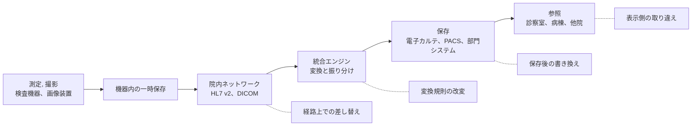

# 🧪 完全性への攻撃と患者安全

医療のセキュリティで語られる被害は、情報の漏えいと、システムの停止に偏る。
どちらも発生を認識できる。
漏えいは公表と届出の対象になり、停止は診療の現場が即座に気づく。

三つ目の型は、認識されにくい。
値が変わったまま参照され続ける状態である。
検査値が 1 桁ずれたまま画面に出る、画像に本来ない所見が現れる、投薬量が別の値になる。
これらは、気づかれない限り止まらず、気づかれるまでのあいだ、診療の判断に使われる。

本ページは、この型を独立した主題として扱う。
経路ごとの詳細は[医用画像](../technology/medical-devices/pacs-dicom.md)と[検査値の連携](../technology/web-security/hl7-fhir.md)にあり、ここでは横断する構造と、検知の設計を扱う。

> [!NOTE]
> **表記ルール**：本ページでは、**事実**（一次情報で確認できる内容。出典を併記する）、**報道ベース**（報道のみで確認でき、当事者の公表資料では裏付けが取れていない内容）、**分析**（筆者の解釈）を書き分ける。

---

## 三つの型の違い

| 侵害の型 | 患者への到達経路 | 気づく契機 | 気づくまでの時間 |
|---|---|---|---|
| 機密性（漏えい） | 情報が第三者に渡り、二次被害につながる | リークサイトへの掲載、当局からの照会、本人からの申告 | 数週間から数か月 |
| 可用性（停止） | 診療が滞り、処置が遅れる | 現場が即座に認識する | 数分 |
| 完全性（改変） | 誤った値にもとづいて判断が下される | 臨床上の違和感、再検査、他の情報との矛盾 | 定まらない。気づかれないこともある |

**分析**：三つ目だけ、検知が「システムが異常を報告する」ではなく「人が違和感を持つ」に依存している。
この非対称が、対策の順序を決める。
完全性については、防ぐことと同じ比重で、変わったことを機械的に判定できる状態を作る必要がある。

---

## どこで値が変わりうるか

| 箇所 | 変わりうるもの | 検知の手立て |
|---|---|---|
| 機器と一時保存 | 測定値、機器の設定、患者との紐づけ | 機器のログと保存値の突合 |
| 経路 | メッセージの内容、宛先、患者 ID | 送信元の限定、受信件数と内容の整合確認 |
| 統合エンジン | 変換規則、単位、コード表 | 変更管理、規則の版管理、変換前後の照合 |
| 保存 | 確定済みの記録、画像 | 更新履歴、監査証跡、ハッシュや署名 |
| 参照 | 表示する対象の取り違え、キャッシュ | 参照ログ、患者識別の二重確認 |

**分析**：最も気づきにくいのは統合エンジンである。
変換規則は一度作ると触られず、変更されても臨床側からは見えない。
単位の変換規則が変わるだけで、全患者の値が同じ倍率でずれる（[HL7 v2 と FHIR の攻撃面](../technology/web-security/hl7-fhir.md)）。

---

## 研究が示したこと

**事実**：Mirsky らは、3 次元の条件付き敵対的生成ネットワークを用いて、CT 画像に肺がんの病変を追加または除去する攻撃を実装し、放射線科医を対象とした評価を行った。
研究は USENIX Security Symposium 2019 で発表されている。
出典：[CT-GAN: Malicious Tampering of 3D Medical Imagery using Deep Learning](https://www.usenix.org/conference/usenixsecurity19/presentation/mirsky)

**分析**：この研究が示したのは、改変の検知を人の目に委ねられないことである。
画像の完全性は、見た目の自然さではなく、生成から参照までの経路で保証するほかない。
一方で、[PACS / DICOM のセキュリティ](../technology/medical-devices/pacs-dicom.md)で扱ったとおり、画像へのデジタル署名は規格上は定義されていても、実運用ではほとんど使われていない。

**分析**：動機は金銭に限らない。
保険金の請求、研究や臨床試験の妨害、特定の個人を標的とした加害が想定される。
このうち、特定個人を標的とする場合は、大量のデータを盗む必要がなく、対象の一件だけを変えれば足りる。
大量の通信や大量の参照を前提とした検知は、この形には反応しない。

---

## 制度が求める真正性

**事実**：「医療情報システムの安全管理に関するガイドライン 第 7.0 版 システム運用編」14.3 は、真正性を「正当な権限で作成された記録に対し、虚偽入力、書換え、消去及び混同が防止されており、かつ、第三者から見て作成の責任の所在が明確であること」と定義している。
混同とは、患者を取り違えた記録がなされること、記録された情報間の関連性を誤ることを指すと明記されている。
出典：[医療情報システムの安全管理に関するガイドライン 第 7.0 版](https://www.mhlw.go.jp/stf/shingi/0000516275_00006.html)（[システム運用編 PDF](https://www.mhlw.go.jp/content/10808000/001716295.pdf)）

**事実**：同 14 章 遵守事項⑨は、確定された記録に対する故意の虚偽入力、書換え、消去、混同を防止する対策と、原状回復のための手順の検討を求めている。
一旦確定した診療録等を更新する場合は更新履歴を保存し、更新前と更新後の内容を照らし合わせられること、複数回の更新があっても順序性を識別できることを求めている。

**事実**：同⑨は、代行入力が行われた場合、誰の代行がいつ誰によって行われたかの管理情報を都度記録すること、代行入力による記録は速やかに確定者の確定操作を経ること、その際に内容の確認を行わずに確定操作を行ってはならないことを定めている。

**事実**：ネットワークを通じて外部保存を行う場合、転送途中で診療録等に改ざんや混同が発生しないよう措置を講じることが求められている（14.3）。

**分析**：これらの要求は、外部からの攻撃を主たる想定として書かれたものではない。
誤操作や事務処理上の誤りを防ぐ枠組みである。
一方で、要求している機能（更新履歴、確定操作、責任の所在の明確化）は、攻撃による改変の検知にもそのまま効く。
真正性の要求を満たしているかを確認する作業は、完全性への攻撃に対する備えの確認と重なる。

**分析**：製薬企業では、同じ性質の要求がデータインテグリティとして規制に組み込まれている（[セキュリティの基礎](../reference/security-basics.md)、[治験と研究データ](../reference/pharma/clinical-trials.md)、[製造設備と OT](../reference/pharma/manufacturing-ot.md)）。

---

## 検知の設計

| 手段 | 何を捉えるか | 限界 |
|---|---|---|
| オーダと結果の突合 | 依頼していない検査結果、依頼と異なる項目 | 依頼ごと改変された場合は検知できない |
| 機器のログと保存値の突合 | 経路上での差し替え | 機器がログを出力しない場合は使えない |
| 生理学的な整合性の確認 | ありえない値、他項目との矛盾 | 現実にありうる範囲内の改変は通る |
| 更新履歴と監査証跡 | 確定後の書き換え | 証跡そのものが改変されうる。[ログの保護](../technology/logging.md)が前提になる |
| ハッシュと電子署名 | 保存後の改変 | 生成時点で正しいことは保証しない |
| 変換規則の版管理 | 統合エンジンの設定変更 | 変更が正規の手続きで行われた場合、内容の妥当性は別に確認する |
| 参照画面での更新表示 | 直近の更新の有無を臨床側に知らせる | 表示を見る運用が定着しないと機能しない |

**分析**：単独で完全な手段はない。
現実的な構成は、経路の限定（送信元を限定する）、保存後の改変の検知（履歴と証跡）、臨床側の違和感の吸い上げ、の三層になる。

### 臨床側の気づきを設計に組み込む

**分析**：完全性の侵害を最初に捉えるのは、多くの場合、値を見た医療者である。
「前回と違いすぎる」「この患者でこの値は考えにくい」という違和感が、唯一の初期兆候になりうる。

この気づきが情報システム部門に届く経路を、事前に作っておく。

- 検査値や画像の異常を申告する窓口が、機器の故障の窓口と同じでよいかを決める
- 申告を受けたときに、機器の故障、データの転送の誤り、意図的な改変の三つを切り分ける手順を用意する
- 切り分けの過程で、当該データの原本（機器側の記録）を保全する
- 同種の申告が複数の患者で発生していないかを確認する

**分析**：四つ目が分岐点になる。
単発なら機器や運用の問題である可能性が高いが、複数の患者や複数の機器で同時に起きているなら、経路か保存側の問題を疑う根拠になる。

---

## 攻撃側から見た完全性

| 目的 | 経路 | 必要な前提 | 検知の観測点 |
|---|---|---|---|
| 特定の一件を変える | 保存側への書き込み、参照直前の差し替え | 対象の特定、書き込み権限 | 更新履歴、参照ログ |
| 広範に値をずらす | 統合エンジンの変換規則 | 設定変更の権限 | 変更管理、変換前後の照合 |
| 記録を消す | 確定済み記録の削除、証跡の削除 | 高い権限 | 削除操作の記録、集約先のログ |
| 診療を混乱させる | 患者の紐づけの取り違え | 識別子の書き換え | 患者識別の突合、受付との照合 |
| 事後の否認を作る | 責任の所在を曖昧にする | 共有アカウントの利用 | 個人単位の識別（[認証とアクセス管理](../technology/identity.md)） |

**分析**：どの経路でも、成立の前提は権限と到達性である。
完全性に固有の対策を積む前に、書き込みができる範囲を絞ることのほうが効く。
[PACS / DICOM のセキュリティ](../technology/medical-devices/pacs-dicom.md)で述べたとおり、書き込みの監視は漏えい対策としては優先度が下がるが、完全性の観点では最初に置く対象になる。

### 検証で確かめること

自組織の許可を得たうえで、テスト環境または承認された検証環境で確認する。

1. 確定済みの記録を変更したとき、更新履歴が残るかを確認する
2. 変更の順序と、変更前後の内容を後から照合できるかを確認する
3. 証跡の削除や改変が、集約先のログに残るかを確認する
4. 統合エンジンの変換規則を変更したとき、変更管理の記録が残るかを確認する
5. 検知された事象が、誰に、どの経路で通知されるかを確認する

**分析**：稼働環境で値を変える検証は行わない。
診療の判断に使われる値を、検証のために変えることは、患者への危害に直結する（[医療機器の検証手法](../technology/medical-devices/testing-methodology.md)）。

---

## 実務チェックリスト

**把握**
- [ ] 値が生成されてから参照されるまでの経路を、検査と画像の系統ごとに図にした
- [ ] 各経路で、書き込みができる主体を列挙した
- [ ] 統合エンジンの変換規則の管理者と、変更手続きを確認した

**検知**
- [ ] 確定済み記録の更新履歴が残る設定になっている
- [ ] 監査証跡を、生成と同時に別の管理下へ転送している
- [ ] オーダと結果の突合、生理学的な整合性の確認を運用に入れた
- [ ] 臨床側からの違和感を受け付ける窓口と、切り分けの手順を用意した

**設計**
- [ ] 書き込みができる範囲を、必要最小限に絞った
- [ ] 医用画像と検査結果の送信元を限定した
- [ ] 代行入力を機能として運用し、確定操作の実施状況を確認している

---

## 関連ページ

- [PACS / DICOM のセキュリティ](../technology/medical-devices/pacs-dicom.md)：画像の改ざんと、署名の実態
- [HL7 v2 と FHIR の攻撃面](../technology/web-security/hl7-fhir.md)：検査値が通る経路
- [認証とアクセス管理](../technology/identity.md)：真正性と、作成責任の所在
- [ログと監視の設計](../technology/logging.md)：証跡の保護と集約
- [AX：医療における AI のセキュリティ](../technology/dx-ax/ai-security.md)：学習データとモデルの完全性
- [治験と研究データ](../reference/pharma/clinical-trials.md)：研究データの完全性
- [製造設備と OT](../reference/pharma/manufacturing-ot.md)：製造記録の完全性
- [セキュリティの基礎](../reference/security-basics.md)：完全性とデータインテグリティ

---

[← 脅威](README.md) | [トップへ](../../README.md)
