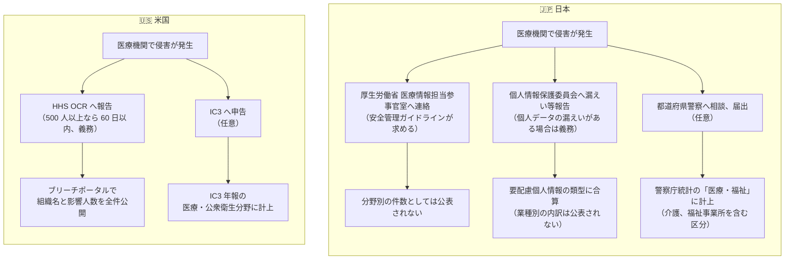

# 📊 統計から読む脅威

公的機関が公表するサイバー攻撃の統計を集め、そこに医療分野がどう現れるかを読む。
扱うのは、警察庁、IPA、個人情報保護委員会、厚生労働省の国内統計と、FBI IC3、HHS OCR、ENISA などの海外統計である。

> [!NOTE]
> **表記ルール**：本ページでは、**事実**（一次情報で確認できる内容。出典を併記する）、**報道ベース**（報道や第三者の集計のみで確認でき、当事者の公表資料では裏付けが取れていない内容）、**分析**（筆者の解釈）を書き分ける。
> 業種名と分野名は、原典の区分名を指す。地の文の並列は読点で書くが、区分名としては原典の表記に合わせて「医療・福祉」（警察庁）、「医療・公衆衛生」（FBI IC3）と書く。

## 一覧

| 地域 | 入口 | 主な出所 |
|---|---|---|
| 🇯🇵 国内 | [日本の統計](japan.md) | 警察庁、IPA、個人情報保護委員会、厚生労働省、都道府県警察 |
| 🌍 海外 | [海外の統計](global.md) | FBI IC3、HHS OCR、Verizon、IBM、ENISA、Sophos |

## 医療分野はどこにいるか

**事実**：警察庁のランサムウェア被害報告件数において、医療・福祉は 2022 年の 3 位（20 件、全体の 8.7%）を除き、6 位から 7 位で推移している。
2025 年は上位 6 業種に入らず、11 件以下と読める（[警察庁 令和 7 年 統計データ](https://www.npa.go.jp/publications/statistics/cybersecurity/data/R7/R07_jousei_data.xlsx)ほか各年版）。

**事実**：米国 FBI IC3 の 2025 年の集計では、医療・公衆衛生は重要インフラ 16 分野のうちランサムウェア申告件数が最多（460 件）である（[2025 Internet Crime Report](https://www.ic3.gov/AnnualReport/Reports/2025_IC3Report.pdf)）。

**事実**：EU の ENISA が 2024 年 7 月から 2025 年 6 月に分析した 4875 件のインシデントのうち、医療分野は 4.2% である（[ENISA Threat Landscape 2025](https://www.enisa.europa.eu/sites/default/files/2026-01/ENISA%20Threat%20Landscape%202025_v1.2.pdf)）。

**分析**：三つの数字は、医療機関の狙われやすさが国ごとに三段階も違うことを意味しない。
統計の作られ方が違う。
米国には医療分野に固有の報告義務があり、報告された侵害は全件が公開される。
日本と EU にはこれに相当する仕組みがない。

## 被害が統計に現れるまでの経路

同じ「病院がランサムウェアに感染した」という事象でも、どの統計に何件として現れるかは国によって異なる。

**分析**：日本の医療機関の被害は、三つの経路に分かれて入り、どの経路でも「医療機関の被害が年に何件か」という形では出てこない。
厚生労働省への連絡は件数として公表されず、個人情報保護委員会の統計は業種別に分かれず、警察庁の統計は届出があったものだけを介護、福祉と合わせて数える。
米国では、報告義務のある経路の出口が公開データベースになっている。

この差は、対策の議論にも影響する。
日本では、自組織のリスクを外部の統計で裏づけようとしても、業種の実態に合う数字が手に入りにくい。

## 統計を読むときの注意

| 確認すること | なぜ必要か |
|---|---|
| 報告は義務か任意か | 任意の統計は、届出率の変化で件数が動く。攻撃の増減と区別できない |
| 母数の分類は何か | 日本標準産業分類の「医療，福祉」は介護、福祉事業所を含む。医療機関だけの数ではない |
| 集計時点はいつか | 米国 OCR ポータルは事後の追加報告で過去の年の件数も変わる |
| 上位何件までの公表か | 警察庁の 2025 年の業種別内訳は上位 6 業種のみ。掲載されないことは 0 件を意味しない |
| 調査会社の統計か | 回答者の国、規模、顧客基盤に偏りがある。自社製品の導入層が母数になることもある |

**分析**：統計は、自組織の対策を並べ替えるために使う。
順位の上下を議論しても、やることは変わらない。
警察庁の統計が 4 年続けて示している「侵入経路の 8 割が VPN 機器とリモートデスクトップ」「バックアップから復元できたのは 5 分の 1」のような分布のほうが、意思決定に直結する。

## 関連するページ

| 目的 | ページ |
|---|---|
| 実際に起きた事例を年ごとに追う | [インシデント事例集](../incidents/) |
| 攻撃者の分類と手口を知る | [脅威アクターと TTPs](../actors/) |
| 自組織の弱点を棚卸しする | [組織の脆弱性の分類](../actors/organizational-vulnerabilities.md) |
| 対策の順序を決める | [防御プレイブック](../actors/defense-playbook.md) |
| 規制が何を求めているかを確認する | [ガイドラインと法規制](../../guidelines/) |

---

[脅威](../README.md) | [トップへ](../../../README.md)
